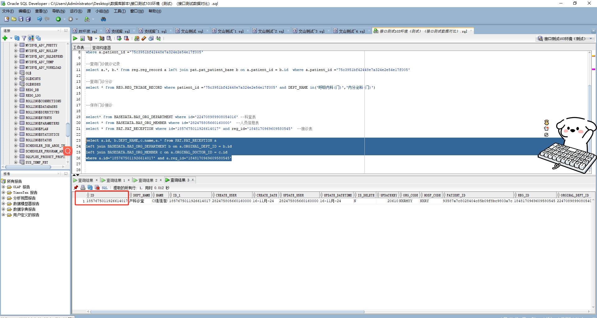

# 领域服务/基础领域 - 保存门诊接诊 - 保存门诊接诊 正向用例
## 请求参数：
``` json
{
  "deptName": "产科诊室",
  "doctorName": "CS彭彭彭",
  "hospCode": "NXRY",
  "visitId": "1848170969609580545",
  "regTriageId": "1848170969731215362",
  "doctorId": "282475805660160000",
  "orgCode": "NXRMYY",
  "deptId": "224708989908054016",
  "operatorId": "282475805660160000",
  "operatorName": "CS彭彭彭"
}
```
## 返回参数：
``` json
{
  "exception": null,
  "apiCode": null,
  "data": {
    "recieveId": "1857675011926614017"
  },
  "Code": 200,
  "Message": "操作成功"
}
```
## 数据校验：



# 领域服务/基础领域 - 保存门诊接诊 - 必填校验-[orgCode]为空
## 请求参数：
``` json
{
  "deptName": "产科诊室",
  "doctorName": "CS彭彭彭",
  "hospCode": "NXRY",
  "visitId": "1848170969609580545",
  "regTriageId": "1848170969731215362",
  "doctorId": "282475805660160000",
  "orgCode": "",
  "deptId": "224708989908054016",
  "operatorId": "282475805660160000",
  "operatorName": "CS彭彭彭"
}
```
## 返回参数：
``` json
{
  "exception": null,
  "apiCode": null,
  "data": null,
  "Code": 1,
  "Message": "医院编码不能为空"
}
```
# 领域服务/基础领域 - 保存门诊接诊 - 必填校验-[hospCode]为空
## 请求参数：
``` json
{
  "deptName": "产科诊室",
  "doctorName": "CS彭彭彭",
  "hospCode": "",
  "visitId": "1848170969609580545",
  "regTriageId": "1848170969731215362",
  "doctorId": "282475805660160000",
  "orgCode": "NXRMYY",
  "deptId": "224708989908054016",
  "operatorId": "282475805660160000",
  "operatorName": "CS彭彭彭"
}
```
## 返回参数：
``` json
{
  "exception": null,
  "apiCode": null,
  "data": null,
  "Code": 1,
  "Message": "院区编码不能为空"
}
```
# 领域服务/基础领域 - 保存门诊接诊 - 必填校验-[operatorId]为空
## 请求参数：
``` json
{
  "deptName": "产科诊室",
  "doctorName": "CS彭彭彭",
  "hospCode": "NXRY",
  "visitId": "1848170969609580545",
  "regTriageId": "1848170969731215362",
  "doctorId": "282475805660160000",
  "orgCode": "NXRMYY",
  "deptId": "224708989908054016",
  "operatorId": "",
  "operatorName": "CS彭彭彭"
}
```
## 返回参数：
``` json
{
  "exception": null,
  "apiCode": null,
  "data": null,
  "Code": 1,
  "Message": "操作员不能为空"
}
```
# 领域服务/基础领域 - 保存门诊接诊 - 必填校验-[operatorName]为空
## 请求参数：
``` json
{
  "deptName": "产科诊室",
  "doctorName": "CS彭彭彭",
  "hospCode": "NXRY",
  "visitId": "1848170969609580545",
  "regTriageId": "1848170969731215362",
  "doctorId": "282475805660160000",
  "orgCode": "NXRMYY",
  "deptId": "224708989908054016",
  "operatorId": "282475805660160000",
  "operatorName": ""
}
```
## 返回参数：
``` json
{
  "exception": null,
  "apiCode": null,
  "data": null,
  "Code": 1,
  "Message": "操作员姓名不能为空"
}
```
# 领域服务/基础领域 - 保存门诊接诊 - 必填校验-[visitId]为空
## 请求参数：
``` json
{
  "deptName": "产科诊室",
  "doctorName": "CS彭彭彭",
  "hospCode": "NXRY",
  "visitId": "",
  "regTriageId": "1848170969731215362",
  "doctorId": "282475805660160000",
  "orgCode": "NXRMYY",
  "deptId": "224708989908054016",
  "operatorId": "282475805660160000",
  "operatorName": "CS彭彭彭"
}
```
## 返回参数：
``` json
{
  "exception": null,
  "apiCode": null,
  "data": null,
  "Code": 1,
  "Message": "挂号id不能为空"
}
```
# 领域服务/基础领域 - 保存门诊接诊 - 必填校验-[regTriageId]为空
## 请求参数：
``` json
{
  "deptName": "产科诊室",
  "doctorName": "CS彭彭彭",
  "hospCode": "NXRY",
  "visitId": "1848170969609580545",
  "regTriageId": "",
  "doctorId": "282475805660160000",
  "orgCode": "NXRMYY",
  "deptId": "224708989908054016",
  "operatorId": "282475805660160000",
  "operatorName": "CS彭彭彭"
}
```
## 返回参数：
``` json
{
  "exception": null,
  "apiCode": null,
  "data": null,
  "Code": 1,
  "Message": "挂号分诊id不能为空"
}
```
# 领域服务/基础领域 - 保存门诊接诊 - 必填校验-[deptId]为空
## 请求参数：
``` json
{
  "deptName": "产科诊室",
  "doctorName": "CS彭彭彭",
  "hospCode": "NXRY",
  "visitId": "1848170969609580545",
  "regTriageId": "1848170969731215362",
  "doctorId": "282475805660160000",
  "orgCode": "NXRMYY",
  "deptId": "",
  "operatorId": "282475805660160000",
  "operatorName": "CS彭彭彭"
}
```
## 返回参数：
``` json
{
  "exception": null,
  "apiCode": null,
  "data": null,
  "Code": 1,
  "Message": "接诊科室Id不能为空"
}
```
# 领域服务/基础领域 - 保存门诊接诊 - 必填校验-[deptName]为空
## 请求参数：
``` json
{
  "deptName": "",
  "doctorName": "CS彭彭彭",
  "hospCode": "NXRY",
  "visitId": "1848170969609580545",
  "regTriageId": "1848170969731215362",
  "doctorId": "282475805660160000",
  "orgCode": "NXRMYY",
  "deptId": "224708989908054016",
  "operatorId": "282475805660160000",
  "operatorName": "CS彭彭彭"
}
```
## 返回参数：
``` json
{
  "exception": null,
  "apiCode": null,
  "data": null,
  "Code": 1,
  "Message": "接诊科室名称不能为空"
}
```
# 领域服务/基础领域 - 保存门诊接诊 - 必填校验-[doctorId]为空
## 请求参数：
``` json
{
  "deptName": "产科诊室",
  "doctorName": "CS彭彭彭",
  "hospCode": "NXRY",
  "visitId": "1848170969609580545",
  "regTriageId": "1848170969731215362",
  "doctorId": "",
  "orgCode": "NXRMYY",
  "deptId": "224708989908054016",
  "operatorId": "282475805660160000",
  "operatorName": "CS彭彭彭"
}
```
## 返回参数：
``` json
{
  "exception": null,
  "apiCode": null,
  "data": null,
  "Code": 1,
  "Message": "接诊医生id不能为空"
}
```
# 领域服务/基础领域 - 保存门诊接诊 - 必填校验-[doctorName]为空
## 请求参数：
``` json
{
  "deptName": "产科诊室",
  "doctorName": "",
  "hospCode": "NXRY",
  "visitId": "1848170969609580545",
  "regTriageId": "1848170969731215362",
  "doctorId": "282475805660160000",
  "orgCode": "NXRMYY",
  "deptId": "224708989908054016",
  "operatorId": "282475805660160000",
  "operatorName": "CS彭彭彭"
}
```
## 返回参数：
``` json
{
  "exception": null,
  "apiCode": null,
  "data": null,
  "Code": 1,
  "Message": "接诊医生姓名不能为空"
}
```
# 领域服务/基础领域 - 保存门诊接诊 - 依赖用例-[operatorName]赋值为依赖用例测试值
## 请求参数：
``` json
{
  "deptName": "产科诊室",
  "doctorName": "CS彭彭彭",
  "hospCode": "NXRY",
  "visitId": "1848170969609580545",
  "regTriageId": "1848170969731215362",
  "doctorId": "282475805660160000",
  "orgCode": "NXRMYY",
  "deptId": "224708989908054016",
  "operatorId": "282475805660160000",
  "operatorName": "依赖用例测试值"
}
```
## 返回参数：
``` json
{
  "exception": null,
  "apiCode": null,
  "data": {
    "recieveId": "1857675063201980418"
  },
  "Code": 200,
  "Message": "操作成功"
}
```
# 领域服务/基础领域 - 保存门诊接诊 - 依赖用例-[operatorId]赋值为依赖用例测试值
## 请求参数：
``` json
{
  "deptName": "产科诊室",
  "doctorName": "CS彭彭彭",
  "hospCode": "NXRY",
  "visitId": "1848170969609580545",
  "regTriageId": "1848170969731215362",
  "doctorId": "282475805660160000",
  "orgCode": "NXRMYY",
  "deptId": "224708989908054016",
  "operatorId": "依赖用例测试值",
  "operatorName": "CS彭彭彭"
}
```
## 返回参数：
``` json
{
  "exception": null,
  "apiCode": null,
  "data": {
    "recieveId": "1857675068621021186"
  },
  "Code": 200,
  "Message": "操作成功"
}
```
# 领域服务/基础领域 - 保存门诊接诊 - 依赖用例-[deptId]赋值为依赖用例测试值
## 请求参数：
``` json
{
  "deptName": "产科诊室",
  "doctorName": "CS彭彭彭",
  "hospCode": "NXRY",
  "visitId": "1848170969609580545",
  "regTriageId": "1848170969731215362",
  "doctorId": "282475805660160000",
  "orgCode": "NXRMYY",
  "deptId": "依赖用例测试值",
  "operatorId": "282475805660160000",
  "operatorName": "CS彭彭彭"
}
```
## 返回参数：
``` json
{
  "exception": null,
  "apiCode": null,
  "data": {
    "recieveId": "1857675074048450561"
  },
  "Code": 200,
  "Message": "操作成功"
}
```
# 领域服务/基础领域 - 保存门诊接诊 - 依赖用例-[orgCode]赋值为依赖用例测试值
## 请求参数：
``` json
{
  "deptName": "产科诊室",
  "doctorName": "CS彭彭彭",
  "hospCode": "NXRY",
  "visitId": "1848170969609580545",
  "regTriageId": "1848170969731215362",
  "doctorId": "282475805660160000",
  "orgCode": "依赖用例测试值",
  "deptId": "224708989908054016",
  "operatorId": "282475805660160000",
  "operatorName": "CS彭彭彭"
}
```
## 返回参数：
``` json
{
  "exception": null,
  "apiCode": null,
  "data": {
    "recieveId": "1857675079408771073"
  },
  "Code": 200,
  "Message": "操作成功"
}
```
# 领域服务/基础领域 - 保存门诊接诊 - 依赖用例-[doctorId]赋值为依赖用例测试值
## 请求参数：
``` json
{
  "deptName": "产科诊室",
  "doctorName": "CS彭彭彭",
  "hospCode": "NXRY",
  "visitId": "1848170969609580545",
  "regTriageId": "1848170969731215362",
  "doctorId": "依赖用例测试值",
  "orgCode": "NXRMYY",
  "deptId": "224708989908054016",
  "operatorId": "282475805660160000",
  "operatorName": "CS彭彭彭"
}
```
## 返回参数：
``` json
{
  "exception": null,
  "apiCode": null,
  "data": {
    "recieveId": "1857675085092052993"
  },
  "Code": 200,
  "Message": "操作成功"
}
```
# 领域服务/基础领域 - 保存门诊接诊 - 依赖用例-[regTriageId]赋值为依赖用例测试值
## 请求参数：
``` json
{
  "deptName": "产科诊室",
  "doctorName": "CS彭彭彭",
  "hospCode": "NXRY",
  "visitId": "1848170969609580545",
  "regTriageId": "依赖用例测试值",
  "doctorId": "282475805660160000",
  "orgCode": "NXRMYY",
  "deptId": "224708989908054016",
  "operatorId": "282475805660160000",
  "operatorName": "CS彭彭彭"
}
```
## 返回参数：
``` json
{
  "exception": null,
  "apiCode": null,
  "data": null,
  "Code": 1,
  "Message": "保存门诊接诊时，查询不到分诊记录"
}
```
# 领域服务/基础领域 - 保存门诊接诊 - 依赖用例-[visitId]赋值为依赖用例测试值
## 请求参数：
``` json
{
  "deptName": "产科诊室",
  "doctorName": "CS彭彭彭",
  "hospCode": "NXRY",
  "visitId": "依赖用例测试值",
  "regTriageId": "1848170969731215362",
  "doctorId": "282475805660160000",
  "orgCode": "NXRMYY",
  "deptId": "224708989908054016",
  "operatorId": "282475805660160000",
  "operatorName": "CS彭彭彭"
}
```
## 返回参数：
``` json
{
  "exception": null,
  "apiCode": null,
  "data": null,
  "Code": 1,
  "Message": "保存门诊接诊时，查询不到挂号信息"
}
```
# 领域服务/基础领域 - 保存门诊接诊 - 依赖用例-[hospCode]赋值为依赖用例测试值
## 请求参数：
``` json
{
  "deptName": "产科诊室",
  "doctorName": "CS彭彭彭",
  "hospCode": "依赖用例测试值",
  "visitId": "1848170969609580545",
  "regTriageId": "1848170969731215362",
  "doctorId": "282475805660160000",
  "orgCode": "NXRMYY",
  "deptId": "224708989908054016",
  "operatorId": "282475805660160000",
  "operatorName": "CS彭彭彭"
}
```
## 返回参数：
``` json
{
  "exception": null,
  "apiCode": null,
  "data": {
    "recieveId": "1857675099390435329"
  },
  "Code": 200,
  "Message": "操作成功"
}
```
# 领域服务/基础领域 - 保存门诊接诊 - 依赖用例-[doctorName]赋值为依赖用例测试值
## 请求参数：
``` json
{
  "deptName": "产科诊室",
  "doctorName": "依赖用例测试值",
  "hospCode": "NXRY",
  "visitId": "1848170969609580545",
  "regTriageId": "1848170969731215362",
  "doctorId": "282475805660160000",
  "orgCode": "NXRMYY",
  "deptId": "224708989908054016",
  "operatorId": "282475805660160000",
  "operatorName": "CS彭彭彭"
}
```
## 返回参数：
``` json
{
  "exception": null,
  "apiCode": null,
  "data": {
    "recieveId": "1857675104570400770"
  },
  "Code": 200,
  "Message": "操作成功"
}
```
# 领域服务/基础领域 - 保存门诊接诊 - 依赖用例-[deptName]赋值为依赖用例测试值
## 请求参数：
``` json
{
  "deptName": "依赖用例测试值",
  "doctorName": "CS彭彭彭",
  "hospCode": "NXRY",
  "visitId": "1848170969609580545",
  "regTriageId": "1848170969731215362",
  "doctorId": "282475805660160000",
  "orgCode": "NXRMYY",
  "deptId": "224708989908054016",
  "operatorId": "282475805660160000",
  "operatorName": "CS彭彭彭"
}
```
## 返回参数：
``` json
{
  "exception": null,
  "apiCode": null,
  "data": {
    "recieveId": "1857675109788114946"
  },
  "Code": 200,
  "Message": "操作成功"
}
```