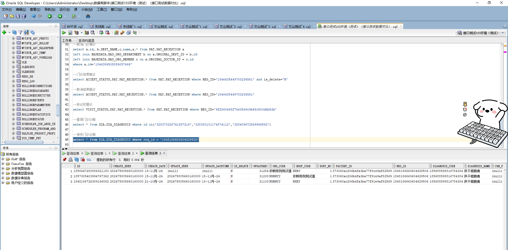

# 领域服务/基础领域 - 保存门诊诊断 - 保存门诊诊断 正向用例
## 请求参数：
``` json
{
  "deptName": "产科诊室",
  "doctorName": "CS彭彭彭",
  "hospCode": "NXRY",
  "doctorId": "282475805660160000",
  "orgCode": "NXRMYY",
  "deptId": "224708989908054016",
  "list": [
    {
      "diagnosisName": "供干细胞者",
      "patientId": "373060ac206b4fa3ba77f91e9af82569",
      "isReport": "",
      "checkUserId": "",
      "diagnosisPrefix": "",
      "acceptId": "",
      "visitId": "1848186663604629506",
      "diagnosisClassCode": "02",
      "isPrimary": "1",
      "diagnosisMemo": "",
      "checkUserName": "",
      "checkSign": "",
      "icdCode": "Z52.001",
      "chnProveName": "",
      "diagLevel": "",
      "sortNo": 1,
      "icdName": "供干细胞者",
      "chnProveCode": "",
      "diagnosisId": "185688598816784384",
      "diagnosisClassName": "西医诊断"
    }
  ]
}
```
## 返回参数：
``` json
{
  "exception": null,
  "apiCode": null,
  "data": true,
  "Code": 200,
  "Message": "操作成功"
}
```
## 数据校验：



# 领域服务/基础领域 - 保存门诊诊断 - 必填校验-[orgCode]为空
## 请求参数：
``` json
{
  "deptName": "产科诊室",
  "doctorName": "CS彭彭彭",
  "hospCode": "NXRY",
  "doctorId": "282475805660160000",
  "orgCode": "",
  "deptId": "224708989908054016",
  "list": [
    {
      "diagnosisName": "供干细胞者",
      "patientId": "373060ac206b4fa3ba77f91e9af82569",
      "isReport": "",
      "checkUserId": "",
      "diagnosisPrefix": "",
      "acceptId": "",
      "visitId": "1848186663604629506",
      "diagnosisClassCode": "02",
      "isPrimary": "1",
      "diagnosisMemo": "",
      "checkUserName": "",
      "checkSign": "",
      "icdCode": "Z52.001",
      "chnProveName": "",
      "diagLevel": "",
      "sortNo": 1,
      "icdName": "供干细胞者",
      "chnProveCode": "",
      "diagnosisId": "185688598816784384",
      "diagnosisClassName": "西医诊断"
    }
  ]
}
```
## 返回参数：
``` json
{
  "exception": null,
  "apiCode": null,
  "data": null,
  "Code": 1,
  "Message": "医院编码不能为空"
}
```
# 领域服务/基础领域 - 保存门诊诊断 - 必填校验-[hospCode]为空
## 请求参数：
``` json
{
  "deptName": "产科诊室",
  "doctorName": "CS彭彭彭",
  "hospCode": "",
  "doctorId": "282475805660160000",
  "orgCode": "NXRMYY",
  "deptId": "224708989908054016",
  "list": [
    {
      "diagnosisName": "供干细胞者",
      "patientId": "373060ac206b4fa3ba77f91e9af82569",
      "isReport": "",
      "checkUserId": "",
      "diagnosisPrefix": "",
      "acceptId": "",
      "visitId": "1848186663604629506",
      "diagnosisClassCode": "02",
      "isPrimary": "1",
      "diagnosisMemo": "",
      "checkUserName": "",
      "checkSign": "",
      "icdCode": "Z52.001",
      "chnProveName": "",
      "diagLevel": "",
      "sortNo": 1,
      "icdName": "供干细胞者",
      "chnProveCode": "",
      "diagnosisId": "185688598816784384",
      "diagnosisClassName": "西医诊断"
    }
  ]
}
```
## 返回参数：
``` json
{
  "exception": null,
  "apiCode": null,
  "data": null,
  "Code": 1,
  "Message": "院区编码不能为空"
}
```
# 领域服务/基础领域 - 保存门诊诊断 - 必填校验-[deptId]为空
## 请求参数：
``` json
{
  "deptName": "产科诊室",
  "doctorName": "CS彭彭彭",
  "hospCode": "NXRY",
  "doctorId": "282475805660160000",
  "orgCode": "NXRMYY",
  "deptId": "",
  "list": [
    {
      "diagnosisName": "供干细胞者",
      "patientId": "373060ac206b4fa3ba77f91e9af82569",
      "isReport": "",
      "checkUserId": "",
      "diagnosisPrefix": "",
      "acceptId": "",
      "visitId": "1848186663604629506",
      "diagnosisClassCode": "02",
      "isPrimary": "1",
      "diagnosisMemo": "",
      "checkUserName": "",
      "checkSign": "",
      "icdCode": "Z52.001",
      "chnProveName": "",
      "diagLevel": "",
      "sortNo": 1,
      "icdName": "供干细胞者",
      "chnProveCode": "",
      "diagnosisId": "185688598816784384",
      "diagnosisClassName": "西医诊断"
    }
  ]
}
```
## 返回参数：
``` json
{
  "exception": null,
  "apiCode": null,
  "data": null,
  "Code": 1,
  "Message": "科室id不能为空"
}
```
# 领域服务/基础领域 - 保存门诊诊断 - 必填校验-[deptName]为空
## 请求参数：
``` json
{
  "deptName": "",
  "doctorName": "CS彭彭彭",
  "hospCode": "NXRY",
  "doctorId": "282475805660160000",
  "orgCode": "NXRMYY",
  "deptId": "224708989908054016",
  "list": [
    {
      "diagnosisName": "供干细胞者",
      "patientId": "373060ac206b4fa3ba77f91e9af82569",
      "isReport": "",
      "checkUserId": "",
      "diagnosisPrefix": "",
      "acceptId": "",
      "visitId": "1848186663604629506",
      "diagnosisClassCode": "02",
      "isPrimary": "1",
      "diagnosisMemo": "",
      "checkUserName": "",
      "checkSign": "",
      "icdCode": "Z52.001",
      "chnProveName": "",
      "diagLevel": "",
      "sortNo": 1,
      "icdName": "供干细胞者",
      "chnProveCode": "",
      "diagnosisId": "185688598816784384",
      "diagnosisClassName": "西医诊断"
    }
  ]
}
```
## 返回参数：
``` json
{
  "exception": null,
  "apiCode": null,
  "data": null,
  "Code": 1,
  "Message": "科室名称不能为空"
}
```
# 领域服务/基础领域 - 保存门诊诊断 - 必填校验-[doctorId]为空
## 请求参数：
``` json
{
  "deptName": "产科诊室",
  "doctorName": "CS彭彭彭",
  "hospCode": "NXRY",
  "doctorId": "",
  "orgCode": "NXRMYY",
  "deptId": "224708989908054016",
  "list": [
    {
      "diagnosisName": "供干细胞者",
      "patientId": "373060ac206b4fa3ba77f91e9af82569",
      "isReport": "",
      "checkUserId": "",
      "diagnosisPrefix": "",
      "acceptId": "",
      "visitId": "1848186663604629506",
      "diagnosisClassCode": "02",
      "isPrimary": "1",
      "diagnosisMemo": "",
      "checkUserName": "",
      "checkSign": "",
      "icdCode": "Z52.001",
      "chnProveName": "",
      "diagLevel": "",
      "sortNo": 1,
      "icdName": "供干细胞者",
      "chnProveCode": "",
      "diagnosisId": "185688598816784384",
      "diagnosisClassName": "西医诊断"
    }
  ]
}
```
## 返回参数：
``` json
{
  "exception": null,
  "apiCode": null,
  "data": null,
  "Code": 1,
  "Message": "医生id不能为空"
}
```
# 领域服务/基础领域 - 保存门诊诊断 - 必填校验-[doctorName]为空
## 请求参数：
``` json
{
  "deptName": "产科诊室",
  "doctorName": "",
  "hospCode": "NXRY",
  "doctorId": "282475805660160000",
  "orgCode": "NXRMYY",
  "deptId": "224708989908054016",
  "list": [
    {
      "diagnosisName": "供干细胞者",
      "patientId": "373060ac206b4fa3ba77f91e9af82569",
      "isReport": "",
      "checkUserId": "",
      "diagnosisPrefix": "",
      "acceptId": "",
      "visitId": "1848186663604629506",
      "diagnosisClassCode": "02",
      "isPrimary": "1",
      "diagnosisMemo": "",
      "checkUserName": "",
      "checkSign": "",
      "icdCode": "Z52.001",
      "chnProveName": "",
      "diagLevel": "",
      "sortNo": 1,
      "icdName": "供干细胞者",
      "chnProveCode": "",
      "diagnosisId": "185688598816784384",
      "diagnosisClassName": "西医诊断"
    }
  ]
}
```
## 返回参数：
``` json
{
  "exception": null,
  "apiCode": null,
  "data": null,
  "Code": 1,
  "Message": "医生姓名不能为空"
}
```
# 领域服务/基础领域 - 保存门诊诊断 - 必填校验-[list]为空
## 请求参数：
``` json
{
  "deptName": "产科诊室",
  "doctorName": "CS彭彭彭",
  "hospCode": "NXRY",
  "doctorId": "282475805660160000",
  "orgCode": "NXRMYY",
  "deptId": "224708989908054016",
  "list": null
}
```
## 返回参数：
``` json
{
  "exception": null,
  "apiCode": null,
  "data": null,
  "Code": 1,
  "Message": "诊断信息数组不能为空"
}
```
# 领域服务/基础领域 - 保存门诊诊断 - 必填校验-[list.patientId]为空
## 请求参数：
``` json
{
  "deptName": "产科诊室",
  "doctorName": "CS彭彭彭",
  "hospCode": "NXRY",
  "doctorId": "282475805660160000",
  "orgCode": "NXRMYY",
  "deptId": "224708989908054016",
  "list": [
    {
      "diagnosisName": "供干细胞者",
      "patientId": null,
      "isReport": "",
      "checkUserId": "",
      "diagnosisPrefix": "",
      "acceptId": "",
      "visitId": "1848186663604629506",
      "diagnosisClassCode": "02",
      "isPrimary": "1",
      "diagnosisMemo": "",
      "checkUserName": "",
      "checkSign": "",
      "icdCode": "Z52.001",
      "chnProveName": "",
      "diagLevel": "",
      "sortNo": 1,
      "icdName": "供干细胞者",
      "chnProveCode": "",
      "diagnosisId": "185688598816784384",
      "diagnosisClassName": "西医诊断"
    }
  ]
}
```
## 返回参数：
``` json
{
  "exception": null,
  "apiCode": null,
  "data": null,
  "Code": 1,
  "Message": "病人id不能为空"
}
```
# 领域服务/基础领域 - 保存门诊诊断 - 必填校验-[list.visitId]为空
## 请求参数：
``` json
{
  "deptName": "产科诊室",
  "doctorName": "CS彭彭彭",
  "hospCode": "NXRY",
  "doctorId": "282475805660160000",
  "orgCode": "NXRMYY",
  "deptId": "224708989908054016",
  "list": [
    {
      "diagnosisName": "供干细胞者",
      "patientId": "373060ac206b4fa3ba77f91e9af82569",
      "isReport": "",
      "checkUserId": "",
      "diagnosisPrefix": "",
      "acceptId": "",
      "visitId": null,
      "diagnosisClassCode": "02",
      "isPrimary": "1",
      "diagnosisMemo": "",
      "checkUserName": "",
      "checkSign": "",
      "icdCode": "Z52.001",
      "chnProveName": "",
      "diagLevel": "",
      "sortNo": 1,
      "icdName": "供干细胞者",
      "chnProveCode": "",
      "diagnosisId": "185688598816784384",
      "diagnosisClassName": "西医诊断"
    }
  ]
}
```
## 返回参数：
``` json
{
  "exception": null,
  "apiCode": null,
  "data": null,
  "Code": 1,
  "Message": "挂号id不能为空"
}
```
# 领域服务/基础领域 - 保存门诊诊断 - 必填校验-[list.isPrimary]为空
## 请求参数：
``` json
{
  "deptName": "产科诊室",
  "doctorName": "CS彭彭彭",
  "hospCode": "NXRY",
  "doctorId": "282475805660160000",
  "orgCode": "NXRMYY",
  "deptId": "224708989908054016",
  "list": [
    {
      "diagnosisName": "供干细胞者",
      "patientId": "373060ac206b4fa3ba77f91e9af82569",
      "isReport": "",
      "checkUserId": "",
      "diagnosisPrefix": "",
      "acceptId": "",
      "visitId": "1848186663604629506",
      "diagnosisClassCode": "02",
      "isPrimary": null,
      "diagnosisMemo": "",
      "checkUserName": "",
      "checkSign": "",
      "icdCode": "Z52.001",
      "chnProveName": "",
      "diagLevel": "",
      "sortNo": 1,
      "icdName": "供干细胞者",
      "chnProveCode": "",
      "diagnosisId": "185688598816784384",
      "diagnosisClassName": "西医诊断"
    }
  ]
}
```
## 返回参数：
``` json
{
  "exception": null,
  "apiCode": null,
  "data": null,
  "Code": 1,
  "Message": "是否主要诊断（0-否 1-是）不能为空"
}
```
# 领域服务/基础领域 - 保存门诊诊断 - 必填校验-[list.diagnosisClassCode]为空
## 请求参数：
``` json
{
  "deptName": "产科诊室",
  "doctorName": "CS彭彭彭",
  "hospCode": "NXRY",
  "doctorId": "282475805660160000",
  "orgCode": "NXRMYY",
  "deptId": "224708989908054016",
  "list": [
    {
      "diagnosisName": "供干细胞者",
      "patientId": "373060ac206b4fa3ba77f91e9af82569",
      "isReport": "",
      "checkUserId": "",
      "diagnosisPrefix": "",
      "acceptId": "",
      "visitId": "1848186663604629506",
      "diagnosisClassCode": null,
      "isPrimary": "1",
      "diagnosisMemo": "",
      "checkUserName": "",
      "checkSign": "",
      "icdCode": "Z52.001",
      "chnProveName": "",
      "diagLevel": "",
      "sortNo": 1,
      "icdName": "供干细胞者",
      "chnProveCode": "",
      "diagnosisId": "185688598816784384",
      "diagnosisClassName": "西医诊断"
    }
  ]
}
```
## 返回参数：
``` json
{
  "exception": null,
  "apiCode": null,
  "data": null,
  "Code": 1,
  "Message": "诊断分类编码不能为空"
}
```
# 领域服务/基础领域 - 保存门诊诊断 - 必填校验-[list.diagnosisClassName]为空
## 请求参数：
``` json
{
  "deptName": "产科诊室",
  "doctorName": "CS彭彭彭",
  "hospCode": "NXRY",
  "doctorId": "282475805660160000",
  "orgCode": "NXRMYY",
  "deptId": "224708989908054016",
  "list": [
    {
      "diagnosisName": "供干细胞者",
      "patientId": "373060ac206b4fa3ba77f91e9af82569",
      "isReport": "",
      "checkUserId": "",
      "diagnosisPrefix": "",
      "acceptId": "",
      "visitId": "1848186663604629506",
      "diagnosisClassCode": "02",
      "isPrimary": "1",
      "diagnosisMemo": "",
      "checkUserName": "",
      "checkSign": "",
      "icdCode": "Z52.001",
      "chnProveName": "",
      "diagLevel": "",
      "sortNo": 1,
      "icdName": "供干细胞者",
      "chnProveCode": "",
      "diagnosisId": "185688598816784384",
      "diagnosisClassName": null
    }
  ]
}
```
## 返回参数：
``` json
{
  "exception": null,
  "apiCode": null,
  "data": null,
  "Code": 1,
  "Message": "诊断分类名称不能为空"
}
```
# 领域服务/基础领域 - 保存门诊诊断 - 枚举用例-[list.diagnosisClassCode] 枚举值为 02(诊断分类编码为诊断类型编码)
## 请求参数：
``` json
{
  "deptName": "产科诊室",
  "doctorName": "CS彭彭彭",
  "hospCode": "NXRY",
  "doctorId": "282475805660160000",
  "orgCode": "NXRMYY",
  "deptId": "224708989908054016",
  "list": [
    {
      "diagnosisName": "供干细胞者",
      "patientId": "373060ac206b4fa3ba77f91e9af82569",
      "isReport": "",
      "checkUserId": "",
      "diagnosisPrefix": "",
      "acceptId": "",
      "visitId": "1848186663604629506",
      "diagnosisClassCode": "02",
      "isPrimary": "1",
      "diagnosisMemo": "",
      "checkUserName": "",
      "checkSign": "",
      "icdCode": "Z52.001",
      "chnProveName": "",
      "diagLevel": "",
      "sortNo": 1,
      "icdName": "供干细胞者",
      "chnProveCode": "",
      "diagnosisId": "185688598816784384",
      "diagnosisClassName": "西医诊断"
    }
  ]
}
```
## 返回参数：
``` json
{
  "exception": null,
  "apiCode": null,
  "data": true,
  "Code": 200,
  "Message": "操作成功"
}
```
# 领域服务/基础领域 - 保存门诊诊断 - 枚举用例-[list.diagnosisClassCode] 枚举值为 03(诊断分类编码为如下：)
## 请求参数：
``` json
{
  "deptName": "产科诊室",
  "doctorName": "CS彭彭彭",
  "hospCode": "NXRY",
  "doctorId": "282475805660160000",
  "orgCode": "NXRMYY",
  "deptId": "224708989908054016",
  "list": [
    {
      "diagnosisName": "供干细胞者",
      "patientId": "373060ac206b4fa3ba77f91e9af82569",
      "isReport": "",
      "checkUserId": "",
      "diagnosisPrefix": "",
      "acceptId": "",
      "visitId": "1848186663604629506",
      "diagnosisClassCode": "03",
      "isPrimary": "1",
      "diagnosisMemo": "",
      "checkUserName": "",
      "checkSign": "",
      "icdCode": "Z52.001",
      "chnProveName": "",
      "diagLevel": "",
      "sortNo": 1,
      "icdName": "供干细胞者",
      "chnProveCode": "",
      "diagnosisId": "185688598816784384",
      "diagnosisClassName": "西医诊断"
    }
  ]
}
```
## 返回参数：
``` json
{
  "exception": null,
  "apiCode": null,
  "data": true,
  "Code": 200,
  "Message": "操作成功"
}
```
# 领域服务/基础领域 - 保存门诊诊断 - 枚举用例-[list.diagnosisClassCode] 枚举值为 04(诊断分类编码为西医诊断，)
## 请求参数：
``` json
{
  "deptName": "产科诊室",
  "doctorName": "CS彭彭彭",
  "hospCode": "NXRY",
  "doctorId": "282475805660160000",
  "orgCode": "NXRMYY",
  "deptId": "224708989908054016",
  "list": [
    {
      "diagnosisName": "供干细胞者",
      "patientId": "373060ac206b4fa3ba77f91e9af82569",
      "isReport": "",
      "checkUserId": "",
      "diagnosisPrefix": "",
      "acceptId": "",
      "visitId": "1848186663604629506",
      "diagnosisClassCode": "04",
      "isPrimary": "1",
      "diagnosisMemo": "",
      "checkUserName": "",
      "checkSign": "",
      "icdCode": "Z52.001",
      "chnProveName": "",
      "diagLevel": "",
      "sortNo": 1,
      "icdName": "供干细胞者",
      "chnProveCode": "",
      "diagnosisId": "185688598816784384",
      "diagnosisClassName": "西医诊断"
    }
  ]
}
```
## 返回参数：
``` json
{
  "exception": null,
  "apiCode": null,
  "data": true,
  "Code": 200,
  "Message": "操作成功"
}
```
# 领域服务/基础领域 - 保存门诊诊断 - 枚举用例-[list.diagnosisClassCode] 枚举值为 01(诊断分类编码为中医诊断，)
## 请求参数：
``` json
{
  "deptName": "产科诊室",
  "doctorName": "CS彭彭彭",
  "hospCode": "NXRY",
  "doctorId": "282475805660160000",
  "orgCode": "NXRMYY",
  "deptId": "224708989908054016",
  "list": [
    {
      "diagnosisName": "供干细胞者",
      "patientId": "373060ac206b4fa3ba77f91e9af82569",
      "isReport": "",
      "checkUserId": "",
      "diagnosisPrefix": "",
      "acceptId": "",
      "visitId": "1848186663604629506",
      "diagnosisClassCode": "01",
      "isPrimary": "1",
      "diagnosisMemo": "",
      "checkUserName": "",
      "checkSign": "",
      "icdCode": "Z52.001",
      "chnProveName": "",
      "diagLevel": "",
      "sortNo": 1,
      "icdName": "供干细胞者",
      "chnProveCode": "",
      "diagnosisId": "185688598816784384",
      "diagnosisClassName": "西医诊断"
    }
  ]
}
```
## 返回参数：
``` json
{
  "exception": null,
  "apiCode": null,
  "data": true,
  "Code": 200,
  "Message": "操作成功"
}
```
# 领域服务/基础领域 - 保存门诊诊断 - 枚举用例-[list.diagnosisClassCode] 枚举值为 05(诊断分类编码为中医证型,)
## 请求参数：
``` json
{
  "deptName": "产科诊室",
  "doctorName": "CS彭彭彭",
  "hospCode": "NXRY",
  "doctorId": "282475805660160000",
  "orgCode": "NXRMYY",
  "deptId": "224708989908054016",
  "list": [
    {
      "diagnosisName": "供干细胞者",
      "patientId": "373060ac206b4fa3ba77f91e9af82569",
      "isReport": "",
      "checkUserId": "",
      "diagnosisPrefix": "",
      "acceptId": "",
      "visitId": "1848186663604629506",
      "diagnosisClassCode": "05",
      "isPrimary": "1",
      "diagnosisMemo": "",
      "checkUserName": "",
      "checkSign": "",
      "icdCode": "Z52.001",
      "chnProveName": "",
      "diagLevel": "",
      "sortNo": 1,
      "icdName": "供干细胞者",
      "chnProveCode": "",
      "diagnosisId": "185688598816784384",
      "diagnosisClassName": "西医诊断"
    }
  ]
}
```
## 返回参数：
``` json
{
  "exception": null,
  "apiCode": null,
  "data": true,
  "Code": 200,
  "Message": "操作成功"
}
```
# 领域服务/基础领域 - 保存门诊诊断 - 枚举用例-[list.diagnosisClassCode] 枚举值为 06(诊断分类编码为目前5.0西医诊断还包括以下：)
## 请求参数：
``` json
{
  "deptName": "产科诊室",
  "doctorName": "CS彭彭彭",
  "hospCode": "NXRY",
  "doctorId": "282475805660160000",
  "orgCode": "NXRMYY",
  "deptId": "224708989908054016",
  "list": [
    {
      "diagnosisName": "供干细胞者",
      "patientId": "373060ac206b4fa3ba77f91e9af82569",
      "isReport": "",
      "checkUserId": "",
      "diagnosisPrefix": "",
      "acceptId": "",
      "visitId": "1848186663604629506",
      "diagnosisClassCode": "06",
      "isPrimary": "1",
      "diagnosisMemo": "",
      "checkUserName": "",
      "checkSign": "",
      "icdCode": "Z52.001",
      "chnProveName": "",
      "diagLevel": "",
      "sortNo": 1,
      "icdName": "供干细胞者",
      "chnProveCode": "",
      "diagnosisId": "185688598816784384",
      "diagnosisClassName": "西医诊断"
    }
  ]
}
```
## 返回参数：
``` json
{
  "exception": null,
  "apiCode": null,
  "data": true,
  "Code": 200,
  "Message": "操作成功"
}
```
# 领域服务/基础领域 - 保存门诊诊断 - 枚举用例-[list.diagnosisClassCode] 枚举值为 07(诊断分类编码为手术诊断,)
## 请求参数：
``` json
{
  "deptName": "产科诊室",
  "doctorName": "CS彭彭彭",
  "hospCode": "NXRY",
  "doctorId": "282475805660160000",
  "orgCode": "NXRMYY",
  "deptId": "224708989908054016",
  "list": [
    {
      "diagnosisName": "供干细胞者",
      "patientId": "373060ac206b4fa3ba77f91e9af82569",
      "isReport": "",
      "checkUserId": "",
      "diagnosisPrefix": "",
      "acceptId": "",
      "visitId": "1848186663604629506",
      "diagnosisClassCode": "07",
      "isPrimary": "1",
      "diagnosisMemo": "",
      "checkUserName": "",
      "checkSign": "",
      "icdCode": "Z52.001",
      "chnProveName": "",
      "diagLevel": "",
      "sortNo": 1,
      "icdName": "供干细胞者",
      "chnProveCode": "",
      "diagnosisId": "185688598816784384",
      "diagnosisClassName": "西医诊断"
    }
  ]
}
```
## 返回参数：
``` json
{
  "exception": null,
  "apiCode": null,
  "data": true,
  "Code": 200,
  "Message": "操作成功"
}
```
# 领域服务/基础领域 - 保存门诊诊断 - 枚举用例-[list.isPrimary] 枚举值为 0(是否主要诊断为否)
## 请求参数：
``` json
{
  "deptName": "产科诊室",
  "doctorName": "CS彭彭彭",
  "hospCode": "NXRY",
  "doctorId": "282475805660160000",
  "orgCode": "NXRMYY",
  "deptId": "224708989908054016",
  "list": [
    {
      "diagnosisName": "供干细胞者",
      "patientId": "373060ac206b4fa3ba77f91e9af82569",
      "isReport": "",
      "checkUserId": "",
      "diagnosisPrefix": "",
      "acceptId": "",
      "visitId": "1848186663604629506",
      "diagnosisClassCode": "02",
      "isPrimary": "0",
      "diagnosisMemo": "",
      "checkUserName": "",
      "checkSign": "",
      "icdCode": "Z52.001",
      "chnProveName": "",
      "diagLevel": "",
      "sortNo": 1,
      "icdName": "供干细胞者",
      "chnProveCode": "",
      "diagnosisId": "185688598816784384",
      "diagnosisClassName": "西医诊断"
    }
  ]
}
```
## 返回参数：
``` json
{
  "exception": null,
  "apiCode": null,
  "data": true,
  "Code": 200,
  "Message": "操作成功"
}
```
# 领域服务/基础领域 - 保存门诊诊断 - 枚举用例-[list.isPrimary] 枚举值为 1(是否主要诊断为是)
## 请求参数：
``` json
{
  "deptName": "产科诊室",
  "doctorName": "CS彭彭彭",
  "hospCode": "NXRY",
  "doctorId": "282475805660160000",
  "orgCode": "NXRMYY",
  "deptId": "224708989908054016",
  "list": [
    {
      "diagnosisName": "供干细胞者",
      "patientId": "373060ac206b4fa3ba77f91e9af82569",
      "isReport": "",
      "checkUserId": "",
      "diagnosisPrefix": "",
      "acceptId": "",
      "visitId": "1848186663604629506",
      "diagnosisClassCode": "02",
      "isPrimary": "1",
      "diagnosisMemo": "",
      "checkUserName": "",
      "checkSign": "",
      "icdCode": "Z52.001",
      "chnProveName": "",
      "diagLevel": "",
      "sortNo": 1,
      "icdName": "供干细胞者",
      "chnProveCode": "",
      "diagnosisId": "185688598816784384",
      "diagnosisClassName": "西医诊断"
    }
  ]
}
```
## 返回参数：
``` json
{
  "exception": null,
  "apiCode": null,
  "data": true,
  "Code": 200,
  "Message": "操作成功"
}
```
# 领域服务/基础领域 - 保存门诊诊断 - 依赖用例-[list.patientId]赋值为依赖用例测试值
## 请求参数：
``` json
{
  "deptName": "产科诊室",
  "doctorName": "CS彭彭彭",
  "hospCode": "NXRY",
  "doctorId": "282475805660160000",
  "orgCode": "NXRMYY",
  "deptId": "224708989908054016",
  "list": [
    {
      "diagnosisName": "供干细胞者",
      "patientId": "依赖用例测试值",
      "isReport": "",
      "checkUserId": "",
      "diagnosisPrefix": "",
      "acceptId": "",
      "visitId": "1848186663604629506",
      "diagnosisClassCode": "02",
      "isPrimary": "1",
      "diagnosisMemo": "",
      "checkUserName": "",
      "checkSign": "",
      "icdCode": "Z52.001",
      "chnProveName": "",
      "diagLevel": "",
      "sortNo": 1,
      "icdName": "供干细胞者",
      "chnProveCode": "",
      "diagnosisId": "185688598816784384",
      "diagnosisClassName": "西医诊断"
    }
  ]
}
```
## 返回参数：
``` json
{
  "exception": null,
  "apiCode": null,
  "data": true,
  "Code": 200,
  "Message": "操作成功"
}
```
# 领域服务/基础领域 - 保存门诊诊断 - 依赖用例-[list.visitId]赋值为依赖用例测试值
## 请求参数：
``` json
{
  "deptName": "产科诊室",
  "doctorName": "CS彭彭彭",
  "hospCode": "NXRY",
  "doctorId": "282475805660160000",
  "orgCode": "NXRMYY",
  "deptId": "224708989908054016",
  "list": [
    {
      "diagnosisName": "供干细胞者",
      "patientId": "373060ac206b4fa3ba77f91e9af82569",
      "isReport": "",
      "checkUserId": "",
      "diagnosisPrefix": "",
      "acceptId": "",
      "visitId": "依赖用例测试值",
      "diagnosisClassCode": "02",
      "isPrimary": "1",
      "diagnosisMemo": "",
      "checkUserName": "",
      "checkSign": "",
      "icdCode": "Z52.001",
      "chnProveName": "",
      "diagLevel": "",
      "sortNo": 1,
      "icdName": "供干细胞者",
      "chnProveCode": "",
      "diagnosisId": "185688598816784384",
      "diagnosisClassName": "西医诊断"
    }
  ]
}
```
## 返回参数：
``` json
{
  "exception": null,
  "apiCode": null,
  "data": true,
  "Code": 200,
  "Message": "操作成功"
}
```
# 领域服务/基础领域 - 保存门诊诊断 - 依赖用例-[list.diagnosisClassName]赋值为依赖用例测试值
## 请求参数：
``` json
{
  "deptName": "产科诊室",
  "doctorName": "CS彭彭彭",
  "hospCode": "NXRY",
  "doctorId": "282475805660160000",
  "orgCode": "NXRMYY",
  "deptId": "224708989908054016",
  "list": [
    {
      "diagnosisName": "供干细胞者",
      "patientId": "373060ac206b4fa3ba77f91e9af82569",
      "isReport": "",
      "checkUserId": "",
      "diagnosisPrefix": "",
      "acceptId": "",
      "visitId": "1848186663604629506",
      "diagnosisClassCode": "02",
      "isPrimary": "1",
      "diagnosisMemo": "",
      "checkUserName": "",
      "checkSign": "",
      "icdCode": "Z52.001",
      "chnProveName": "",
      "diagLevel": "",
      "sortNo": 1,
      "icdName": "供干细胞者",
      "chnProveCode": "",
      "diagnosisId": "185688598816784384",
      "diagnosisClassName": "依赖用例测试值"
    }
  ]
}
```
## 返回参数：
``` json
{
  "exception": null,
  "apiCode": null,
  "data": true,
  "Code": 200,
  "Message": "操作成功"
}
```
# 领域服务/基础领域 - 保存门诊诊断 - 依赖用例-[deptId]赋值为依赖用例测试值
## 请求参数：
``` json
{
  "deptName": "产科诊室",
  "doctorName": "CS彭彭彭",
  "hospCode": "NXRY",
  "doctorId": "282475805660160000",
  "orgCode": "NXRMYY",
  "deptId": "依赖用例测试值",
  "list": [
    {
      "diagnosisName": "供干细胞者",
      "patientId": "373060ac206b4fa3ba77f91e9af82569",
      "isReport": "",
      "checkUserId": "",
      "diagnosisPrefix": "",
      "acceptId": "",
      "visitId": "1848186663604629506",
      "diagnosisClassCode": "02",
      "isPrimary": "1",
      "diagnosisMemo": "",
      "checkUserName": "",
      "checkSign": "",
      "icdCode": "Z52.001",
      "chnProveName": "",
      "diagLevel": "",
      "sortNo": 1,
      "icdName": "供干细胞者",
      "chnProveCode": "",
      "diagnosisId": "185688598816784384",
      "diagnosisClassName": "西医诊断"
    }
  ]
}
```
## 返回参数：
``` json
{
  "exception": null,
  "apiCode": null,
  "data": true,
  "Code": 200,
  "Message": "操作成功"
}
```
# 领域服务/基础领域 - 保存门诊诊断 - 依赖用例-[orgCode]赋值为依赖用例测试值
## 请求参数：
``` json
{
  "deptName": "产科诊室",
  "doctorName": "CS彭彭彭",
  "hospCode": "NXRY",
  "doctorId": "282475805660160000",
  "orgCode": "依赖用例测试值",
  "deptId": "224708989908054016",
  "list": [
    {
      "diagnosisName": "供干细胞者",
      "patientId": "373060ac206b4fa3ba77f91e9af82569",
      "isReport": "",
      "checkUserId": "",
      "diagnosisPrefix": "",
      "acceptId": "",
      "visitId": "1848186663604629506",
      "diagnosisClassCode": "02",
      "isPrimary": "1",
      "diagnosisMemo": "",
      "checkUserName": "",
      "checkSign": "",
      "icdCode": "Z52.001",
      "chnProveName": "",
      "diagLevel": "",
      "sortNo": 1,
      "icdName": "供干细胞者",
      "chnProveCode": "",
      "diagnosisId": "185688598816784384",
      "diagnosisClassName": "西医诊断"
    }
  ]
}
```
## 返回参数：
``` json
{
  "exception": null,
  "apiCode": null,
  "data": true,
  "Code": 200,
  "Message": "操作成功"
}
```
# 领域服务/基础领域 - 保存门诊诊断 - 依赖用例-[doctorId]赋值为依赖用例测试值
## 请求参数：
``` json
{
  "deptName": "产科诊室",
  "doctorName": "CS彭彭彭",
  "hospCode": "NXRY",
  "doctorId": "依赖用例测试值",
  "orgCode": "NXRMYY",
  "deptId": "224708989908054016",
  "list": [
    {
      "diagnosisName": "供干细胞者",
      "patientId": "373060ac206b4fa3ba77f91e9af82569",
      "isReport": "",
      "checkUserId": "",
      "diagnosisPrefix": "",
      "acceptId": "",
      "visitId": "1848186663604629506",
      "diagnosisClassCode": "02",
      "isPrimary": "1",
      "diagnosisMemo": "",
      "checkUserName": "",
      "checkSign": "",
      "icdCode": "Z52.001",
      "chnProveName": "",
      "diagLevel": "",
      "sortNo": 1,
      "icdName": "供干细胞者",
      "chnProveCode": "",
      "diagnosisId": "185688598816784384",
      "diagnosisClassName": "西医诊断"
    }
  ]
}
```
## 返回参数：
``` json
{
  "exception": null,
  "apiCode": null,
  "data": true,
  "Code": 200,
  "Message": "操作成功"
}
```
# 领域服务/基础领域 - 保存门诊诊断 - 依赖用例-[hospCode]赋值为依赖用例测试值
## 请求参数：
``` json
{
  "deptName": "产科诊室",
  "doctorName": "CS彭彭彭",
  "hospCode": "依赖用例测试值",
  "doctorId": "282475805660160000",
  "orgCode": "NXRMYY",
  "deptId": "224708989908054016",
  "list": [
    {
      "diagnosisName": "供干细胞者",
      "patientId": "373060ac206b4fa3ba77f91e9af82569",
      "isReport": "",
      "checkUserId": "",
      "diagnosisPrefix": "",
      "acceptId": "",
      "visitId": "1848186663604629506",
      "diagnosisClassCode": "02",
      "isPrimary": "1",
      "diagnosisMemo": "",
      "checkUserName": "",
      "checkSign": "",
      "icdCode": "Z52.001",
      "chnProveName": "",
      "diagLevel": "",
      "sortNo": 1,
      "icdName": "供干细胞者",
      "chnProveCode": "",
      "diagnosisId": "185688598816784384",
      "diagnosisClassName": "西医诊断"
    }
  ]
}
```
## 返回参数：
``` json
{
  "exception": null,
  "apiCode": null,
  "data": true,
  "Code": 200,
  "Message": "操作成功"
}
```
# 领域服务/基础领域 - 保存门诊诊断 - 依赖用例-[doctorName]赋值为依赖用例测试值
## 请求参数：
``` json
{
  "deptName": "产科诊室",
  "doctorName": "依赖用例测试值",
  "hospCode": "NXRY",
  "doctorId": "282475805660160000",
  "orgCode": "NXRMYY",
  "deptId": "224708989908054016",
  "list": [
    {
      "diagnosisName": "供干细胞者",
      "patientId": "373060ac206b4fa3ba77f91e9af82569",
      "isReport": "",
      "checkUserId": "",
      "diagnosisPrefix": "",
      "acceptId": "",
      "visitId": "1848186663604629506",
      "diagnosisClassCode": "02",
      "isPrimary": "1",
      "diagnosisMemo": "",
      "checkUserName": "",
      "checkSign": "",
      "icdCode": "Z52.001",
      "chnProveName": "",
      "diagLevel": "",
      "sortNo": 1,
      "icdName": "供干细胞者",
      "chnProveCode": "",
      "diagnosisId": "185688598816784384",
      "diagnosisClassName": "西医诊断"
    }
  ]
}
```
## 返回参数：
``` json
{
  "exception": null,
  "apiCode": null,
  "data": true,
  "Code": 200,
  "Message": "操作成功"
}
```
# 领域服务/基础领域 - 保存门诊诊断 - 依赖用例-[deptName]赋值为依赖用例测试值
## 请求参数：
``` json
{
  "deptName": "依赖用例测试值",
  "doctorName": "CS彭彭彭",
  "hospCode": "NXRY",
  "doctorId": "282475805660160000",
  "orgCode": "NXRMYY",
  "deptId": "224708989908054016",
  "list": [
    {
      "diagnosisName": "供干细胞者",
      "patientId": "373060ac206b4fa3ba77f91e9af82569",
      "isReport": "",
      "checkUserId": "",
      "diagnosisPrefix": "",
      "acceptId": "",
      "visitId": "1848186663604629506",
      "diagnosisClassCode": "02",
      "isPrimary": "1",
      "diagnosisMemo": "",
      "checkUserName": "",
      "checkSign": "",
      "icdCode": "Z52.001",
      "chnProveName": "",
      "diagLevel": "",
      "sortNo": 1,
      "icdName": "供干细胞者",
      "chnProveCode": "",
      "diagnosisId": "185688598816784384",
      "diagnosisClassName": "西医诊断"
    }
  ]
}
```
## 返回参数：
``` json
{
  "exception": null,
  "apiCode": null,
  "data": true,
  "Code": 200,
  "Message": "操作成功"
}
```