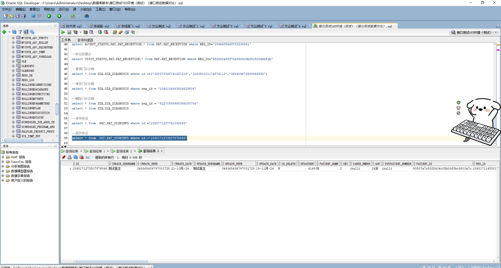

# 领域服务/基础领域 - 修改体征 - 修改体征 正向用例
## 请求参数：
``` json
{
  "hospCode": "NXRY",
  "orgCode": "NXRMYY",
  "patSignInfo": {
    "patientId": "93587a7c8028404c85b09f8bc9803a7c",
    "visitId": "1848171145803902977",
    "id": "1848171273507876866",
    "visitType": "1",
    "name": "与",
    "temperature": 0,
    "sex": "2",
    "age": "24岁"
  },
  "updateFileds": [
    "temperature"
  ],
  "operatorId": "349365436797001728",
  "operatorName": "测试医生"
}
```
## 返回参数：
``` json
{
  "exception": null,
  "apiCode": null,
  "data": [
    {
      "memo": null,
      "modifyDataName": "体温，单位:℃",
      "modifyDateTime": "2024-11-19 16:20:01",
      "modifyField": "TEMPERATURE",
      "modifyId": "1848171273507876866",
      "modifyOriginalValue": "0",
      "modifyUserId": "349365436797001728",
      "modifyUserName": "测试医生",
      "modifyValue": "0"
    }
  ],
  "Code": 200,
  "Message": "操作成功"
}
```
## 数据校验：



# 领域服务/基础领域 - 修改体征 - 必填校验-[orgCode]为空
## 请求参数：
``` json
{
  "hospCode": "NXRY",
  "orgCode": "",
  "patSignInfo": {
    "patientId": "93587a7c8028404c85b09f8bc9803a7c",
    "visitId": "1848171145803902977",
    "id": "1848171273507876866",
    "visitType": "1",
    "name": "与",
    "temperature": 0,
    "sex": "2",
    "age": "24岁"
  },
  "updateFileds": [
    "temperature"
  ],
  "operatorId": "349365436797001728",
  "operatorName": "测试医生"
}
```
## 返回参数：
``` json
{
  "exception": null,
  "apiCode": null,
  "data": null,
  "Code": 1,
  "Message": "医院编码不能为空"
}
```
# 领域服务/基础领域 - 修改体征 - 必填校验-[hospCode]为空
## 请求参数：
``` json
{
  "hospCode": "",
  "orgCode": "NXRMYY",
  "patSignInfo": {
    "patientId": "93587a7c8028404c85b09f8bc9803a7c",
    "visitId": "1848171145803902977",
    "id": "1848171273507876866",
    "visitType": "1",
    "name": "与",
    "temperature": 0,
    "sex": "2",
    "age": "24岁"
  },
  "updateFileds": [
    "temperature"
  ],
  "operatorId": "349365436797001728",
  "operatorName": "测试医生"
}
```
## 返回参数：
``` json
{
  "exception": null,
  "apiCode": null,
  "data": null,
  "Code": 1,
  "Message": "院区编码不能为空"
}
```
# 领域服务/基础领域 - 修改体征 - 必填校验-[operatorId]为空
## 请求参数：
``` json
{
  "hospCode": "NXRY",
  "orgCode": "NXRMYY",
  "patSignInfo": {
    "patientId": "93587a7c8028404c85b09f8bc9803a7c",
    "visitId": "1848171145803902977",
    "id": "1848171273507876866",
    "visitType": "1",
    "name": "与",
    "temperature": 0,
    "sex": "2",
    "age": "24岁"
  },
  "updateFileds": [
    "temperature"
  ],
  "operatorId": "",
  "operatorName": "测试医生"
}
```
## 返回参数：
``` json
{
  "exception": null,
  "apiCode": null,
  "data": null,
  "Code": 1,
  "Message": "操作人id不能为空"
}
```
# 领域服务/基础领域 - 修改体征 - 必填校验-[operatorName]为空
## 请求参数：
``` json
{
  "hospCode": "NXRY",
  "orgCode": "NXRMYY",
  "patSignInfo": {
    "patientId": "93587a7c8028404c85b09f8bc9803a7c",
    "visitId": "1848171145803902977",
    "id": "1848171273507876866",
    "visitType": "1",
    "name": "与",
    "temperature": 0,
    "sex": "2",
    "age": "24岁"
  },
  "updateFileds": [
    "temperature"
  ],
  "operatorId": "349365436797001728",
  "operatorName": ""
}
```
## 返回参数：
``` json
{
  "exception": null,
  "apiCode": null,
  "data": null,
  "Code": 1,
  "Message": "操作人姓名不能为空"
}
```
# 领域服务/基础领域 - 修改体征 - 必填校验-[updateFileds]为空
## 请求参数：
``` json
{
  "hospCode": "NXRY",
  "orgCode": "NXRMYY",
  "patSignInfo": {
    "patientId": "93587a7c8028404c85b09f8bc9803a7c",
    "visitId": "1848171145803902977",
    "id": "1848171273507876866",
    "visitType": "1",
    "name": "与",
    "temperature": 0,
    "sex": "2",
    "age": "24岁"
  },
  "updateFileds": null,
  "operatorId": "349365436797001728",
  "operatorName": "测试医生"
}
```
## 返回参数：
``` json
{
  "exception": null,
  "apiCode": null,
  "data": null,
  "Code": 1,
  "Message": "要修改的字段集合不能为空"
}
```
# 领域服务/基础领域 - 修改体征 - 必填校验-[patSignInfo.id]为空
## 请求参数：
``` json
{
  "hospCode": "NXRY",
  "orgCode": "NXRMYY",
  "patSignInfo": {
    "patientId": "93587a7c8028404c85b09f8bc9803a7c",
    "visitId": "1848171145803902977",
    "id": null,
    "visitType": "1",
    "name": "与",
    "temperature": 0,
    "sex": "2",
    "age": "24岁"
  },
  "updateFileds": [
    "temperature"
  ],
  "operatorId": "349365436797001728",
  "operatorName": "测试医生"
}
```
## 返回参数：
``` json
{
  "exception": null,
  "apiCode": null,
  "data": null,
  "Code": 400,
  "Message": "体征ID不能为空"
}
```
# 领域服务/基础领域 - 修改体征 - 必填校验-[patSignInfo.patientId]为空
## 请求参数：
``` json
{
  "hospCode": "NXRY",
  "orgCode": "NXRMYY",
  "patSignInfo": {
    "patientId": null,
    "visitId": "1848171145803902977",
    "id": "1848171273507876866",
    "visitType": "1",
    "name": "与",
    "temperature": 0,
    "sex": "2",
    "age": "24岁"
  },
  "updateFileds": [
    "temperature"
  ],
  "operatorId": "349365436797001728",
  "operatorName": "测试医生"
}
```
## 返回参数：
``` json
{
  "exception": null,
  "apiCode": null,
  "data": null,
  "Code": 1,
  "Message": "病人id不能为空"
}
```
# 领域服务/基础领域 - 修改体征 - 必填校验-[patSignInfo.name]为空
## 请求参数：
``` json
{
  "hospCode": "NXRY",
  "orgCode": "NXRMYY",
  "patSignInfo": {
    "patientId": "93587a7c8028404c85b09f8bc9803a7c",
    "visitId": "1848171145803902977",
    "id": "1848171273507876866",
    "visitType": "1",
    "name": null,
    "temperature": 0,
    "sex": "2",
    "age": "24岁"
  },
  "updateFileds": [
    "temperature"
  ],
  "operatorId": "349365436797001728",
  "operatorName": "测试医生"
}
```
## 返回参数：
``` json
{
  "exception": null,
  "apiCode": null,
  "data": null,
  "Code": 1,
  "Message": "姓名不能为空"
}
```
# 领域服务/基础领域 - 修改体征 - 必填校验-[patSignInfo.visitType]为空
## 请求参数：
``` json
{
  "hospCode": "NXRY",
  "orgCode": "NXRMYY",
  "patSignInfo": {
    "patientId": "93587a7c8028404c85b09f8bc9803a7c",
    "visitId": "1848171145803902977",
    "id": "1848171273507876866",
    "visitType": null,
    "name": "与",
    "temperature": 0,
    "sex": "2",
    "age": "24岁"
  },
  "updateFileds": [
    "temperature"
  ],
  "operatorId": "349365436797001728",
  "operatorName": "测试医生"
}
```
## 返回参数：
``` json
{
  "exception": null,
  "apiCode": null,
  "data": null,
  "Code": 1,
  "Message": "就诊类型不能为空"
}
```
# 领域服务/基础领域 - 修改体征 - 必填校验-[patSignInfo.visitId]为空
## 请求参数：
``` json
{
  "hospCode": "NXRY",
  "orgCode": "NXRMYY",
  "patSignInfo": {
    "patientId": "93587a7c8028404c85b09f8bc9803a7c",
    "visitId": null,
    "id": "1848171273507876866",
    "visitType": "1",
    "name": "与",
    "temperature": 0,
    "sex": "2",
    "age": "24岁"
  },
  "updateFileds": [
    "temperature"
  ],
  "operatorId": "349365436797001728",
  "operatorName": "测试医生"
}
```
## 返回参数：
``` json
{
  "exception": null,
  "apiCode": null,
  "data": null,
  "Code": 1,
  "Message": "就诊id不能为空"
}
```
# 领域服务/基础领域 - 修改体征 - 枚举用例-[patSignInfo.visitType] 枚举值为 1(就诊类型为门诊)
## 请求参数：
``` json
{
  "hospCode": "NXRY",
  "orgCode": "NXRMYY",
  "patSignInfo": {
    "patientId": "93587a7c8028404c85b09f8bc9803a7c",
    "visitId": "1848171145803902977",
    "id": "1848171273507876866",
    "visitType": "1",
    "name": "与",
    "temperature": 0,
    "sex": "2",
    "age": "24岁"
  },
  "updateFileds": [
    "temperature"
  ],
  "operatorId": "349365436797001728",
  "operatorName": "测试医生"
}
```
## 返回参数：
``` json
{
  "exception": null,
  "apiCode": null,
  "data": [
    {
      "memo": null,
      "modifyDataName": "体温，单位:℃",
      "modifyDateTime": "2024-11-19 16:20:16",
      "modifyField": "TEMPERATURE",
      "modifyId": "1848171273507876866",
      "modifyOriginalValue": "0",
      "modifyUserId": "349365436797001728",
      "modifyUserName": "测试医生",
      "modifyValue": "0"
    }
  ],
  "Code": 200,
  "Message": "操作成功"
}
```
# 领域服务/基础领域 - 修改体征 - 枚举用例-[patSignInfo.visitType] 枚举值为 2(就诊类型为住院)
## 请求参数：
``` json
{
  "hospCode": "NXRY",
  "orgCode": "NXRMYY",
  "patSignInfo": {
    "patientId": "93587a7c8028404c85b09f8bc9803a7c",
    "visitId": "1848171145803902977",
    "id": "1848171273507876866",
    "visitType": "2",
    "name": "与",
    "temperature": 0,
    "sex": "2",
    "age": "24岁"
  },
  "updateFileds": [
    "temperature"
  ],
  "operatorId": "349365436797001728",
  "operatorName": "测试医生"
}
```
## 返回参数：
``` json
{
  "exception": null,
  "apiCode": null,
  "data": [
    {
      "memo": null,
      "modifyDataName": "体温，单位:℃",
      "modifyDateTime": "2024-11-19 16:20:17",
      "modifyField": "TEMPERATURE",
      "modifyId": "1848171273507876866",
      "modifyOriginalValue": "0",
      "modifyUserId": "349365436797001728",
      "modifyUserName": "测试医生",
      "modifyValue": "0"
    }
  ],
  "Code": 200,
  "Message": "操作成功"
}
```
# 领域服务/基础领域 - 修改体征 - 依赖用例-[operatorName]赋值为依赖用例测试值
## 请求参数：
``` json
{
  "hospCode": "NXRY",
  "orgCode": "NXRMYY",
  "patSignInfo": {
    "patientId": "93587a7c8028404c85b09f8bc9803a7c",
    "visitId": "1848171145803902977",
    "id": "1848171273507876866",
    "visitType": "1",
    "name": "与",
    "temperature": 0,
    "sex": "2",
    "age": "24岁"
  },
  "updateFileds": [
    "temperature"
  ],
  "operatorId": "349365436797001728",
  "operatorName": "依赖用例测试值"
}
```
## 返回参数：
``` json
{
  "exception": null,
  "apiCode": null,
  "data": [
    {
      "memo": null,
      "modifyDataName": "体温，单位:℃",
      "modifyDateTime": "2024-11-19 16:20:19",
      "modifyField": "TEMPERATURE",
      "modifyId": "1848171273507876866",
      "modifyOriginalValue": "0",
      "modifyUserId": "349365436797001728",
      "modifyUserName": "依赖用例测试值",
      "modifyValue": "0"
    }
  ],
  "Code": 200,
  "Message": "操作成功"
}
```
# 领域服务/基础领域 - 修改体征 - 依赖用例-[operatorId]赋值为依赖用例测试值
## 请求参数：
``` json
{
  "hospCode": "NXRY",
  "orgCode": "NXRMYY",
  "patSignInfo": {
    "patientId": "93587a7c8028404c85b09f8bc9803a7c",
    "visitId": "1848171145803902977",
    "id": "1848171273507876866",
    "visitType": "1",
    "name": "与",
    "temperature": 0,
    "sex": "2",
    "age": "24岁"
  },
  "updateFileds": [
    "temperature"
  ],
  "operatorId": "依赖用例测试值",
  "operatorName": "测试医生"
}
```
## 返回参数：
``` json
{
  "exception": null,
  "apiCode": null,
  "data": [
    {
      "memo": null,
      "modifyDataName": "体温，单位:℃",
      "modifyDateTime": "2024-11-19 16:20:20",
      "modifyField": "TEMPERATURE",
      "modifyId": "1848171273507876866",
      "modifyOriginalValue": "0",
      "modifyUserId": "依赖用例测试值",
      "modifyUserName": "测试医生",
      "modifyValue": "0"
    }
  ],
  "Code": 200,
  "Message": "操作成功"
}
```
# 领域服务/基础领域 - 修改体征 - 依赖用例-[patSignInfo.patientId]赋值为依赖用例测试值
## 请求参数：
``` json
{
  "hospCode": "NXRY",
  "orgCode": "NXRMYY",
  "patSignInfo": {
    "patientId": "依赖用例测试值",
    "visitId": "1848171145803902977",
    "id": "1848171273507876866",
    "visitType": "1",
    "name": "与",
    "temperature": 0,
    "sex": "2",
    "age": "24岁"
  },
  "updateFileds": [
    "temperature"
  ],
  "operatorId": "349365436797001728",
  "operatorName": "测试医生"
}
```
## 返回参数：
``` json
{
  "exception": null,
  "apiCode": null,
  "data": [
    {
      "memo": null,
      "modifyDataName": "体温，单位:℃",
      "modifyDateTime": "2024-11-19 16:20:21",
      "modifyField": "TEMPERATURE",
      "modifyId": "1848171273507876866",
      "modifyOriginalValue": "0",
      "modifyUserId": "349365436797001728",
      "modifyUserName": "测试医生",
      "modifyValue": "0"
    }
  ],
  "Code": 200,
  "Message": "操作成功"
}
```
# 领域服务/基础领域 - 修改体征 - 依赖用例-[patSignInfo.visitId]赋值为依赖用例测试值
## 请求参数：
``` json
{
  "hospCode": "NXRY",
  "orgCode": "NXRMYY",
  "patSignInfo": {
    "patientId": "93587a7c8028404c85b09f8bc9803a7c",
    "visitId": "依赖用例测试值",
    "id": "1848171273507876866",
    "visitType": "1",
    "name": "与",
    "temperature": 0,
    "sex": "2",
    "age": "24岁"
  },
  "updateFileds": [
    "temperature"
  ],
  "operatorId": "349365436797001728",
  "operatorName": "测试医生"
}
```
## 返回参数：
``` json
{
  "exception": null,
  "apiCode": null,
  "data": [
    {
      "memo": null,
      "modifyDataName": "体温，单位:℃",
      "modifyDateTime": "2024-11-19 16:20:23",
      "modifyField": "TEMPERATURE",
      "modifyId": "1848171273507876866",
      "modifyOriginalValue": "0",
      "modifyUserId": "349365436797001728",
      "modifyUserName": "测试医生",
      "modifyValue": "0"
    }
  ],
  "Code": 200,
  "Message": "操作成功"
}
```
# 领域服务/基础领域 - 修改体征 - 依赖用例-[patSignInfo.id]赋值为依赖用例测试值
## 请求参数：
``` json
{
  "hospCode": "NXRY",
  "orgCode": "NXRMYY",
  "patSignInfo": {
    "patientId": "93587a7c8028404c85b09f8bc9803a7c",
    "visitId": "1848171145803902977",
    "id": "依赖用例测试值",
    "visitType": "1",
    "name": "与",
    "temperature": 0,
    "sex": "2",
    "age": "24岁"
  },
  "updateFileds": [
    "temperature"
  ],
  "operatorId": "349365436797001728",
  "operatorName": "测试医生"
}
```
## 返回参数：
``` json
{
  "exception": null,
  "apiCode": null,
  "data": null,
  "Code": 400,
  "Message": "没有查询到需要修改的记录"
}
```
# 领域服务/基础领域 - 修改体征 - 依赖用例-[patSignInfo.name]赋值为依赖用例测试值
## 请求参数：
``` json
{
  "hospCode": "NXRY",
  "orgCode": "NXRMYY",
  "patSignInfo": {
    "patientId": "93587a7c8028404c85b09f8bc9803a7c",
    "visitId": "1848171145803902977",
    "id": "1848171273507876866",
    "visitType": "1",
    "name": "依赖用例测试值",
    "temperature": 0,
    "sex": "2",
    "age": "24岁"
  },
  "updateFileds": [
    "temperature"
  ],
  "operatorId": "349365436797001728",
  "operatorName": "测试医生"
}
```
## 返回参数：
``` json
{
  "exception": null,
  "apiCode": null,
  "data": [
    {
      "memo": null,
      "modifyDataName": "体温，单位:℃",
      "modifyDateTime": "2024-11-19 16:20:26",
      "modifyField": "TEMPERATURE",
      "modifyId": "1848171273507876866",
      "modifyOriginalValue": "0",
      "modifyUserId": "349365436797001728",
      "modifyUserName": "测试医生",
      "modifyValue": "0"
    }
  ],
  "Code": 200,
  "Message": "操作成功"
}
```
# 领域服务/基础领域 - 修改体征 - 依赖用例-[orgCode]赋值为依赖用例测试值
## 请求参数：
``` json
{
  "hospCode": "NXRY",
  "orgCode": "依赖用例测试值",
  "patSignInfo": {
    "patientId": "93587a7c8028404c85b09f8bc9803a7c",
    "visitId": "1848171145803902977",
    "id": "1848171273507876866",
    "visitType": "1",
    "name": "与",
    "temperature": 0,
    "sex": "2",
    "age": "24岁"
  },
  "updateFileds": [
    "temperature"
  ],
  "operatorId": "349365436797001728",
  "operatorName": "测试医生"
}
```
## 返回参数：
``` json
{
  "exception": null,
  "apiCode": null,
  "data": [
    {
      "memo": null,
      "modifyDataName": "体温，单位:℃",
      "modifyDateTime": "2024-11-19 16:20:27",
      "modifyField": "TEMPERATURE",
      "modifyId": "1848171273507876866",
      "modifyOriginalValue": "0",
      "modifyUserId": "349365436797001728",
      "modifyUserName": "测试医生",
      "modifyValue": "0"
    }
  ],
  "Code": 200,
  "Message": "操作成功"
}
```
# 领域服务/基础领域 - 修改体征 - 依赖用例-[hospCode]赋值为依赖用例测试值
## 请求参数：
``` json
{
  "hospCode": "依赖用例测试值",
  "orgCode": "NXRMYY",
  "patSignInfo": {
    "patientId": "93587a7c8028404c85b09f8bc9803a7c",
    "visitId": "1848171145803902977",
    "id": "1848171273507876866",
    "visitType": "1",
    "name": "与",
    "temperature": 0,
    "sex": "2",
    "age": "24岁"
  },
  "updateFileds": [
    "temperature"
  ],
  "operatorId": "349365436797001728",
  "operatorName": "测试医生"
}
```
## 返回参数：
``` json
{
  "exception": null,
  "apiCode": null,
  "data": [
    {
      "memo": null,
      "modifyDataName": "体温，单位:℃",
      "modifyDateTime": "2024-11-19 16:20:29",
      "modifyField": "TEMPERATURE",
      "modifyId": "1848171273507876866",
      "modifyOriginalValue": "0",
      "modifyUserId": "349365436797001728",
      "modifyUserName": "测试医生",
      "modifyValue": "0"
    }
  ],
  "Code": 200,
  "Message": "操作成功"
}
```