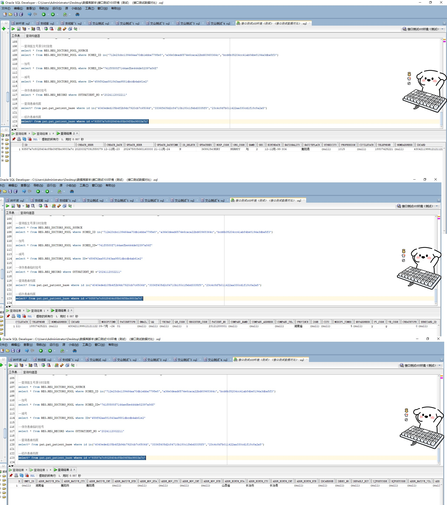

# 领域服务/基础领域 - 修改患者档案 - 修改患者档案 正向用例
## 请求参数：
``` json
{
  "country": "004",
  "patientId": "93587a7c8028404c85b09f8bc9803a7c",
  "idCard": "430421199912121122",
  "patientType": "01",
  "hospName": "版本测试环境",
  "accountAddressCounty": "衡阳县",
  "sexName": "女",
  "birthAddressProvince": "山西省",
  "updateFileds": [
    "name",
    "sex",
    "birthday",
    "mobile",
    "country",
    "countryName",
    "nation",
    "marriage",
    "profession",
    "professionName",
    "companyTelphone",
    "address",
    "addressProvince",
    "addressCity",
    "addressCounty",
    "company"
  ],
  "operatorId": "282475805660160000",
  "profession": "1015",
  "orgName": "版本测试环境",
  "birthAddressCity": "长治市",
  "birthAddressCounty": "长治县",
  "name": "与",
  "countryName": "阿富汗",
  "birthday": "1999-12-12 00:00:00",
  "operatorName": "CS彭彭彭",
  "orgCode": "NXRMYY",
  "professionName": "其它",
  "accountAddressCity": "衡阳市",
  "hospCode": "NXRY",
  "accountAddress": "湖南省衡阳市衡阳县nullnullnull",
  "sex": "2",
  "mobile": "18807425221",
  "accountAddressProvince": "湖南省",
  "birthAddress": "山西省长治市长治县nullnullnull"
}
```
## 返回参数：
``` json
{
  "exception": null,
  "apiCode": null,
  "data": [
    {
      "memo": "患者档案修改",
      "modifyDataName": "患者档案",
      "modifyDateTime": "2024-11-21 17:08:44",
      "modifyField": "姓名",
      "modifyId": "1859524333417111554",
      "modifyOriginalValue": "与",
      "modifyUserId": "282475805660160000",
      "modifyUserName": "CS彭彭彭",
      "modifyValue": "与"
    },
    {
      "memo": "患者档案修改",
      "modifyDataName": "患者档案",
      "modifyDateTime": "2024-11-21 17:08:44",
      "modifyField": "性别代码",
      "modifyId": "1859524333417111554",
      "modifyOriginalValue": "2",
      "modifyUserId": "282475805660160000",
      "modifyUserName": "CS彭彭彭",
      "modifyValue": "2"
    },
    {
      "memo": "患者档案修改",
      "modifyDataName": "患者档案",
      "modifyDateTime": "2024-11-21 17:08:44",
      "modifyField": "出生日期",
      "modifyId": "1859524333417111554",
      "modifyOriginalValue": "Sun Dec 12 00:00:00 CST 1999",
      "modifyUserId": "282475805660160000",
      "modifyUserName": "CS彭彭彭",
      "modifyValue": "Sun Dec 12 00:00:00 CST 1999"
    },
    {
      "memo": "患者档案修改",
      "modifyDataName": "患者档案",
      "modifyDateTime": "2024-11-21 17:08:44",
      "modifyField": "手机号码",
      "modifyId": "1859524333417111554",
      "modifyOriginalValue": "18807425221",
      "modifyUserId": "282475805660160000",
      "modifyUserName": "CS彭彭彭",
      "modifyValue": "18807425221"
    },
    {
      "memo": "患者档案修改",
      "modifyDataName": "患者档案",
      "modifyDateTime": "2024-11-21 17:08:44",
      "modifyField": "国籍代码",
      "modifyId": "1859524333417111554",
      "modifyOriginalValue": "004",
      "modifyUserId": "282475805660160000",
      "modifyUserName": "CS彭彭彭",
      "modifyValue": "004"
    },
    {
      "memo": "患者档案修改",
      "modifyDataName": "患者档案",
      "modifyDateTime": "2024-11-21 17:08:44",
      "modifyField": "国籍名称",
      "modifyId": "1859524333417111554",
      "modifyOriginalValue": "阿富汗",
      "modifyUserId": "282475805660160000",
      "modifyUserName": "CS彭彭彭",
      "modifyValue": "阿富汗"
    },
    {
      "memo": "患者档案修改",
      "modifyDataName": "患者档案",
      "modifyDateTime": "2024-11-21 17:08:44",
      "modifyField": "民族代码",
      "modifyId": "1859524333417111554",
      "modifyOriginalValue": null,
      "modifyUserId": "282475805660160000",
      "modifyUserName": "CS彭彭彭",
      "modifyValue": null
    },
    {
      "memo": "患者档案修改",
      "modifyDataName": "患者档案",
      "modifyDateTime": "2024-11-21 17:08:44",
      "modifyField": "婚况代码",
      "modifyId": "1859524333417111554",
      "modifyOriginalValue": null,
      "modifyUserId": "282475805660160000",
      "modifyUserName": "CS彭彭彭",
      "modifyValue": null
    },
    {
      "memo": "患者档案修改",
      "modifyDataName": "患者档案",
      "modifyDateTime": "2024-11-21 17:08:44",
      "modifyField": "职业代码",
      "modifyId": "1859524333417111554",
      "modifyOriginalValue": "1015",
      "modifyUserId": "282475805660160000",
      "modifyUserName": "CS彭彭彭",
      "modifyValue": "1015"
    },
    {
      "memo": "患者档案修改",
      "modifyDataName": "患者档案",
      "modifyDateTime": "2024-11-21 17:08:44",
      "modifyField": "职业名称",
      "modifyId": "1859524333417111554",
      "modifyOriginalValue": "其它",
      "modifyUserId": "282475805660160000",
      "modifyUserName": "CS彭彭彭",
      "modifyValue": "其它"
    },
    {
      "memo": "患者档案修改",
      "modifyDataName": "患者档案",
      "modifyDateTime": "2024-11-21 17:08:44",
      "modifyField": "工作单位联系电话",
      "modifyId": "1859524333417111554",
      "modifyOriginalValue": null,
      "modifyUserId": "282475805660160000",
      "modifyUserName": "CS彭彭彭",
      "modifyValue": null
    },
    {
      "memo": "患者档案修改",
      "modifyDataName": "患者档案",
      "modifyDateTime": "2024-11-21 17:08:44",
      "modifyField": "家庭地址",
      "modifyId": "1859524333417111554",
      "modifyOriginalValue": null,
      "modifyUserId": "282475805660160000",
      "modifyUserName": "CS彭彭彭",
      "modifyValue": null
    },
    {
      "memo": "患者档案修改",
      "modifyDataName": "患者档案",
      "modifyDateTime": "2024-11-21 17:08:44",
      "modifyField": "现居住地址-省（自治区、直辖市）",
      "modifyId": "1859524333417111554",
      "modifyOriginalValue": null,
      "modifyUserId": "282475805660160000",
      "modifyUserName": "CS彭彭彭",
      "modifyValue": null
    },
    {
      "memo": "患者档案修改",
      "modifyDataName": "患者档案",
      "modifyDateTime": "2024-11-21 17:08:44",
      "modifyField": "现居住地址-市（地区）",
      "modifyId": "1859524333417111554",
      "modifyOriginalValue": null,
      "modifyUserId": "282475805660160000",
      "modifyUserName": "CS彭彭彭",
      "modifyValue": null
    },
    {
      "memo": "患者档案修改",
      "modifyDataName": "患者档案",
      "modifyDateTime": "2024-11-21 17:08:44",
      "modifyField": "现居住地址-县（区）",
      "modifyId": "1859524333417111554",
      "modifyOriginalValue": "衡阳县",
      "modifyUserId": "282475805660160000",
      "modifyUserName": "CS彭彭彭",
      "modifyValue": "衡阳县"
    },
    {
      "memo": "患者档案修改",
      "modifyDataName": "患者档案",
      "modifyDateTime": "2024-11-21 17:08:44",
      "modifyField": "工作单位",
      "modifyId": "1859524333417111554",
      "modifyOriginalValue": null,
      "modifyUserId": "282475805660160000",
      "modifyUserName": "CS彭彭彭",
      "modifyValue": null
    }
  ],
  "Code": 200,
  "Message": "操作成功"
}
```
## 数据校验：



# 领域服务/基础领域 - 修改患者档案 - 必填校验-[orgCode]为空
## 请求参数：
``` json
{
  "country": "004",
  "patientId": "93587a7c8028404c85b09f8bc9803a7c",
  "idCard": "430421199912121122",
  "patientType": "01",
  "hospName": "版本测试环境",
  "accountAddressCounty": "衡阳县",
  "sexName": "女",
  "birthAddressProvince": "山西省",
  "updateFileds": [
    "name",
    "sex",
    "birthday",
    "mobile",
    "country",
    "countryName",
    "nation",
    "marriage",
    "profession",
    "professionName",
    "companyTelphone",
    "address",
    "addressProvince",
    "addressCity",
    "addressCounty",
    "company"
  ],
  "operatorId": "282475805660160000",
  "profession": "1015",
  "orgName": "版本测试环境",
  "birthAddressCity": "长治市",
  "birthAddressCounty": "长治县",
  "name": "与",
  "countryName": "阿富汗",
  "birthday": "1999-12-12 00:00:00",
  "operatorName": "CS彭彭彭",
  "orgCode": "",
  "professionName": "其它",
  "accountAddressCity": "衡阳市",
  "hospCode": "NXRY",
  "accountAddress": "湖南省衡阳市衡阳县nullnullnull",
  "sex": "2",
  "mobile": "18807425221",
  "accountAddressProvince": "湖南省",
  "birthAddress": "山西省长治市长治县nullnullnull"
}
```
## 返回参数：
``` json
{
  "exception": null,
  "apiCode": null,
  "data": null,
  "Code": 1,
  "Message": "医院编码不能为空"
}
```
# 领域服务/基础领域 - 修改患者档案 - 必填校验-[hospCode]为空
## 请求参数：
``` json
{
  "country": "004",
  "patientId": "93587a7c8028404c85b09f8bc9803a7c",
  "idCard": "430421199912121122",
  "patientType": "01",
  "hospName": "版本测试环境",
  "accountAddressCounty": "衡阳县",
  "sexName": "女",
  "birthAddressProvince": "山西省",
  "updateFileds": [
    "name",
    "sex",
    "birthday",
    "mobile",
    "country",
    "countryName",
    "nation",
    "marriage",
    "profession",
    "professionName",
    "companyTelphone",
    "address",
    "addressProvince",
    "addressCity",
    "addressCounty",
    "company"
  ],
  "operatorId": "282475805660160000",
  "profession": "1015",
  "orgName": "版本测试环境",
  "birthAddressCity": "长治市",
  "birthAddressCounty": "长治县",
  "name": "与",
  "countryName": "阿富汗",
  "birthday": "1999-12-12 00:00:00",
  "operatorName": "CS彭彭彭",
  "orgCode": "NXRMYY",
  "professionName": "其它",
  "accountAddressCity": "衡阳市",
  "hospCode": "",
  "accountAddress": "湖南省衡阳市衡阳县nullnullnull",
  "sex": "2",
  "mobile": "18807425221",
  "accountAddressProvince": "湖南省",
  "birthAddress": "山西省长治市长治县nullnullnull"
}
```
## 返回参数：
``` json
{
  "exception": null,
  "apiCode": null,
  "data": null,
  "Code": 1,
  "Message": "院区编码不能为空"
}
```
# 领域服务/基础领域 - 修改患者档案 - 必填校验-[orgName]为空
## 请求参数：
``` json
{
  "country": "004",
  "patientId": "93587a7c8028404c85b09f8bc9803a7c",
  "idCard": "430421199912121122",
  "patientType": "01",
  "hospName": "版本测试环境",
  "accountAddressCounty": "衡阳县",
  "sexName": "女",
  "birthAddressProvince": "山西省",
  "updateFileds": [
    "name",
    "sex",
    "birthday",
    "mobile",
    "country",
    "countryName",
    "nation",
    "marriage",
    "profession",
    "professionName",
    "companyTelphone",
    "address",
    "addressProvince",
    "addressCity",
    "addressCounty",
    "company"
  ],
  "operatorId": "282475805660160000",
  "profession": "1015",
  "orgName": "",
  "birthAddressCity": "长治市",
  "birthAddressCounty": "长治县",
  "name": "与",
  "countryName": "阿富汗",
  "birthday": "1999-12-12 00:00:00",
  "operatorName": "CS彭彭彭",
  "orgCode": "NXRMYY",
  "professionName": "其它",
  "accountAddressCity": "衡阳市",
  "hospCode": "NXRY",
  "accountAddress": "湖南省衡阳市衡阳县nullnullnull",
  "sex": "2",
  "mobile": "18807425221",
  "accountAddressProvince": "湖南省",
  "birthAddress": "山西省长治市长治县nullnullnull"
}
```
## 返回参数：
``` json
{
  "exception": null,
  "apiCode": null,
  "data": null,
  "Code": 1,
  "Message": "医院编码名称不能为空"
}
```
# 领域服务/基础领域 - 修改患者档案 - 必填校验-[hospName]为空
## 请求参数：
``` json
{
  "country": "004",
  "patientId": "93587a7c8028404c85b09f8bc9803a7c",
  "idCard": "430421199912121122",
  "patientType": "01",
  "hospName": "",
  "accountAddressCounty": "衡阳县",
  "sexName": "女",
  "birthAddressProvince": "山西省",
  "updateFileds": [
    "name",
    "sex",
    "birthday",
    "mobile",
    "country",
    "countryName",
    "nation",
    "marriage",
    "profession",
    "professionName",
    "companyTelphone",
    "address",
    "addressProvince",
    "addressCity",
    "addressCounty",
    "company"
  ],
  "operatorId": "282475805660160000",
  "profession": "1015",
  "orgName": "版本测试环境",
  "birthAddressCity": "长治市",
  "birthAddressCounty": "长治县",
  "name": "与",
  "countryName": "阿富汗",
  "birthday": "1999-12-12 00:00:00",
  "operatorName": "CS彭彭彭",
  "orgCode": "NXRMYY",
  "professionName": "其它",
  "accountAddressCity": "衡阳市",
  "hospCode": "NXRY",
  "accountAddress": "湖南省衡阳市衡阳县nullnullnull",
  "sex": "2",
  "mobile": "18807425221",
  "accountAddressProvince": "湖南省",
  "birthAddress": "山西省长治市长治县nullnullnull"
}
```
## 返回参数：
``` json
{
  "exception": null,
  "apiCode": null,
  "data": null,
  "Code": 1,
  "Message": "院区编码名称不能为空"
}
```
# 领域服务/基础领域 - 修改患者档案 - 必填校验-[operatorId]为空
## 请求参数：
``` json
{
  "country": "004",
  "patientId": "93587a7c8028404c85b09f8bc9803a7c",
  "idCard": "430421199912121122",
  "patientType": "01",
  "hospName": "版本测试环境",
  "accountAddressCounty": "衡阳县",
  "sexName": "女",
  "birthAddressProvince": "山西省",
  "updateFileds": [
    "name",
    "sex",
    "birthday",
    "mobile",
    "country",
    "countryName",
    "nation",
    "marriage",
    "profession",
    "professionName",
    "companyTelphone",
    "address",
    "addressProvince",
    "addressCity",
    "addressCounty",
    "company"
  ],
  "operatorId": "",
  "profession": "1015",
  "orgName": "版本测试环境",
  "birthAddressCity": "长治市",
  "birthAddressCounty": "长治县",
  "name": "与",
  "countryName": "阿富汗",
  "birthday": "1999-12-12 00:00:00",
  "operatorName": "CS彭彭彭",
  "orgCode": "NXRMYY",
  "professionName": "其它",
  "accountAddressCity": "衡阳市",
  "hospCode": "NXRY",
  "accountAddress": "湖南省衡阳市衡阳县nullnullnull",
  "sex": "2",
  "mobile": "18807425221",
  "accountAddressProvince": "湖南省",
  "birthAddress": "山西省长治市长治县nullnullnull"
}
```
## 返回参数：
``` json
{
  "exception": null,
  "apiCode": null,
  "data": null,
  "Code": 1,
  "Message": "操作员id不能为空"
}
```
# 领域服务/基础领域 - 修改患者档案 - 必填校验-[operatorName]为空
## 请求参数：
``` json
{
  "country": "004",
  "patientId": "93587a7c8028404c85b09f8bc9803a7c",
  "idCard": "430421199912121122",
  "patientType": "01",
  "hospName": "版本测试环境",
  "accountAddressCounty": "衡阳县",
  "sexName": "女",
  "birthAddressProvince": "山西省",
  "updateFileds": [
    "name",
    "sex",
    "birthday",
    "mobile",
    "country",
    "countryName",
    "nation",
    "marriage",
    "profession",
    "professionName",
    "companyTelphone",
    "address",
    "addressProvince",
    "addressCity",
    "addressCounty",
    "company"
  ],
  "operatorId": "282475805660160000",
  "profession": "1015",
  "orgName": "版本测试环境",
  "birthAddressCity": "长治市",
  "birthAddressCounty": "长治县",
  "name": "与",
  "countryName": "阿富汗",
  "birthday": "1999-12-12 00:00:00",
  "operatorName": "",
  "orgCode": "NXRMYY",
  "professionName": "其它",
  "accountAddressCity": "衡阳市",
  "hospCode": "NXRY",
  "accountAddress": "湖南省衡阳市衡阳县nullnullnull",
  "sex": "2",
  "mobile": "18807425221",
  "accountAddressProvince": "湖南省",
  "birthAddress": "山西省长治市长治县nullnullnull"
}
```
## 返回参数：
``` json
{
  "exception": null,
  "apiCode": null,
  "data": null,
  "Code": 1,
  "Message": "操作人姓名不能为空"
}
```
# 领域服务/基础领域 - 修改患者档案 - 必填校验-[updateFileds]为空
## 请求参数：
``` json
{
  "country": "004",
  "patientId": "93587a7c8028404c85b09f8bc9803a7c",
  "idCard": "430421199912121122",
  "patientType": "01",
  "hospName": "版本测试环境",
  "accountAddressCounty": "衡阳县",
  "sexName": "女",
  "birthAddressProvince": "山西省",
  "updateFileds": null,
  "operatorId": "282475805660160000",
  "profession": "1015",
  "orgName": "版本测试环境",
  "birthAddressCity": "长治市",
  "birthAddressCounty": "长治县",
  "name": "与",
  "countryName": "阿富汗",
  "birthday": "1999-12-12 00:00:00",
  "operatorName": "CS彭彭彭",
  "orgCode": "NXRMYY",
  "professionName": "其它",
  "accountAddressCity": "衡阳市",
  "hospCode": "NXRY",
  "accountAddress": "湖南省衡阳市衡阳县nullnullnull",
  "sex": "2",
  "mobile": "18807425221",
  "accountAddressProvince": "湖南省",
  "birthAddress": "山西省长治市长治县nullnullnull"
}
```
## 返回参数：
``` json
{
  "exception": null,
  "apiCode": null,
  "data": null,
  "Code": 1,
  "Message": "要修改的一级节点集合不能为空"
}
```
# 领域服务/基础领域 - 修改患者档案 - 类型校验-[updateFileds]类型错误
## 请求参数：
``` json
{
  "country": "004",
  "patientId": "93587a7c8028404c85b09f8bc9803a7c",
  "idCard": "430421199912121122",
  "patientType": "01",
  "hospName": "版本测试环境",
  "accountAddressCounty": "衡阳县",
  "sexName": "女",
  "birthAddressProvince": "山西省",
  "updateFileds": "abc",
  "operatorId": "282475805660160000",
  "profession": "1015",
  "orgName": "版本测试环境",
  "birthAddressCity": "长治市",
  "birthAddressCounty": "长治县",
  "name": "与",
  "countryName": "阿富汗",
  "birthday": "1999-12-12 00:00:00",
  "operatorName": "CS彭彭彭",
  "orgCode": "NXRMYY",
  "professionName": "其它",
  "accountAddressCity": "衡阳市",
  "hospCode": "NXRY",
  "accountAddress": "湖南省衡阳市衡阳县nullnullnull",
  "sex": "2",
  "mobile": "18807425221",
  "accountAddressProvince": "湖南省",
  "birthAddress": "山西省长治市长治县nullnullnull"
}
```
## 返回参数：
``` json
{
  "exception": null,
  "apiCode": null,
  "data": null,
  "Code": 1,
  "Message": "请求参数错误"
}
```
# 领域服务/基础领域 - 修改患者档案 - 依赖用例-[hospCode]赋值为依赖用例测试值
## 请求参数：
``` json
{
  "country": "004",
  "patientId": "93587a7c8028404c85b09f8bc9803a7c",
  "idCard": "430421199912121122",
  "patientType": "01",
  "hospName": "版本测试环境",
  "accountAddressCounty": "衡阳县",
  "sexName": "女",
  "birthAddressProvince": "山西省",
  "updateFileds": [
    "name",
    "sex",
    "birthday",
    "mobile",
    "country",
    "countryName",
    "nation",
    "marriage",
    "profession",
    "professionName",
    "companyTelphone",
    "address",
    "addressProvince",
    "addressCity",
    "addressCounty",
    "company"
  ],
  "operatorId": "282475805660160000",
  "profession": "1015",
  "orgName": "版本测试环境",
  "birthAddressCity": "长治市",
  "birthAddressCounty": "长治县",
  "name": "与",
  "countryName": "阿富汗",
  "birthday": "1999-12-12 00:00:00",
  "operatorName": "CS彭彭彭",
  "orgCode": "NXRMYY",
  "professionName": "其它",
  "accountAddressCity": "衡阳市",
  "hospCode": "依赖用例测试值",
  "accountAddress": "湖南省衡阳市衡阳县nullnullnull",
  "sex": "2",
  "mobile": "18807425221",
  "accountAddressProvince": "湖南省",
  "birthAddress": "山西省长治市长治县nullnullnull"
}
```
## 返回参数：
``` json
{
  "exception": null,
  "apiCode": null,
  "data": [
    {
      "memo": "患者档案修改",
      "modifyDataName": "患者档案",
      "modifyDateTime": "2024-11-21 17:08:56",
      "modifyField": "姓名",
      "modifyId": "1859524384814112770",
      "modifyOriginalValue": "与",
      "modifyUserId": "282475805660160000",
      "modifyUserName": "CS彭彭彭",
      "modifyValue": "与"
    },
    {
      "memo": "患者档案修改",
      "modifyDataName": "患者档案",
      "modifyDateTime": "2024-11-21 17:08:56",
      "modifyField": "性别代码",
      "modifyId": "1859524384814112770",
      "modifyOriginalValue": "2",
      "modifyUserId": "282475805660160000",
      "modifyUserName": "CS彭彭彭",
      "modifyValue": "2"
    },
    {
      "memo": "患者档案修改",
      "modifyDataName": "患者档案",
      "modifyDateTime": "2024-11-21 17:08:56",
      "modifyField": "出生日期",
      "modifyId": "1859524384814112770",
      "modifyOriginalValue": "Sun Dec 12 00:00:00 CST 1999",
      "modifyUserId": "282475805660160000",
      "modifyUserName": "CS彭彭彭",
      "modifyValue": "Sun Dec 12 00:00:00 CST 1999"
    },
    {
      "memo": "患者档案修改",
      "modifyDataName": "患者档案",
      "modifyDateTime": "2024-11-21 17:08:56",
      "modifyField": "手机号码",
      "modifyId": "1859524384814112770",
      "modifyOriginalValue": "18807425221",
      "modifyUserId": "282475805660160000",
      "modifyUserName": "CS彭彭彭",
      "modifyValue": "18807425221"
    },
    {
      "memo": "患者档案修改",
      "modifyDataName": "患者档案",
      "modifyDateTime": "2024-11-21 17:08:56",
      "modifyField": "国籍代码",
      "modifyId": "1859524384814112770",
      "modifyOriginalValue": "004",
      "modifyUserId": "282475805660160000",
      "modifyUserName": "CS彭彭彭",
      "modifyValue": "004"
    },
    {
      "memo": "患者档案修改",
      "modifyDataName": "患者档案",
      "modifyDateTime": "2024-11-21 17:08:56",
      "modifyField": "国籍名称",
      "modifyId": "1859524384814112770",
      "modifyOriginalValue": "阿富汗",
      "modifyUserId": "282475805660160000",
      "modifyUserName": "CS彭彭彭",
      "modifyValue": "阿富汗"
    },
    {
      "memo": "患者档案修改",
      "modifyDataName": "患者档案",
      "modifyDateTime": "2024-11-21 17:08:56",
      "modifyField": "民族代码",
      "modifyId": "1859524384814112770",
      "modifyOriginalValue": null,
      "modifyUserId": "282475805660160000",
      "modifyUserName": "CS彭彭彭",
      "modifyValue": null
    },
    {
      "memo": "患者档案修改",
      "modifyDataName": "患者档案",
      "modifyDateTime": "2024-11-21 17:08:56",
      "modifyField": "婚况代码",
      "modifyId": "1859524384814112770",
      "modifyOriginalValue": null,
      "modifyUserId": "282475805660160000",
      "modifyUserName": "CS彭彭彭",
      "modifyValue": null
    },
    {
      "memo": "患者档案修改",
      "modifyDataName": "患者档案",
      "modifyDateTime": "2024-11-21 17:08:56",
      "modifyField": "职业代码",
      "modifyId": "1859524384814112770",
      "modifyOriginalValue": "1015",
      "modifyUserId": "282475805660160000",
      "modifyUserName": "CS彭彭彭",
      "modifyValue": "1015"
    },
    {
      "memo": "患者档案修改",
      "modifyDataName": "患者档案",
      "modifyDateTime": "2024-11-21 17:08:56",
      "modifyField": "职业名称",
      "modifyId": "1859524384814112770",
      "modifyOriginalValue": "其它",
      "modifyUserId": "282475805660160000",
      "modifyUserName": "CS彭彭彭",
      "modifyValue": "其它"
    },
    {
      "memo": "患者档案修改",
      "modifyDataName": "患者档案",
      "modifyDateTime": "2024-11-21 17:08:56",
      "modifyField": "工作单位联系电话",
      "modifyId": "1859524384814112770",
      "modifyOriginalValue": null,
      "modifyUserId": "282475805660160000",
      "modifyUserName": "CS彭彭彭",
      "modifyValue": null
    },
    {
      "memo": "患者档案修改",
      "modifyDataName": "患者档案",
      "modifyDateTime": "2024-11-21 17:08:56",
      "modifyField": "家庭地址",
      "modifyId": "1859524384814112770",
      "modifyOriginalValue": null,
      "modifyUserId": "282475805660160000",
      "modifyUserName": "CS彭彭彭",
      "modifyValue": null
    },
    {
      "memo": "患者档案修改",
      "modifyDataName": "患者档案",
      "modifyDateTime": "2024-11-21 17:08:56",
      "modifyField": "现居住地址-省（自治区、直辖市）",
      "modifyId": "1859524384814112770",
      "modifyOriginalValue": null,
      "modifyUserId": "282475805660160000",
      "modifyUserName": "CS彭彭彭",
      "modifyValue": null
    },
    {
      "memo": "患者档案修改",
      "modifyDataName": "患者档案",
      "modifyDateTime": "2024-11-21 17:08:56",
      "modifyField": "现居住地址-市（地区）",
      "modifyId": "1859524384814112770",
      "modifyOriginalValue": null,
      "modifyUserId": "282475805660160000",
      "modifyUserName": "CS彭彭彭",
      "modifyValue": null
    },
    {
      "memo": "患者档案修改",
      "modifyDataName": "患者档案",
      "modifyDateTime": "2024-11-21 17:08:56",
      "modifyField": "现居住地址-县（区）",
      "modifyId": "1859524384814112770",
      "modifyOriginalValue": "衡阳县",
      "modifyUserId": "282475805660160000",
      "modifyUserName": "CS彭彭彭",
      "modifyValue": "衡阳县"
    },
    {
      "memo": "患者档案修改",
      "modifyDataName": "患者档案",
      "modifyDateTime": "2024-11-21 17:08:56",
      "modifyField": "工作单位",
      "modifyId": "1859524384814112770",
      "modifyOriginalValue": null,
      "modifyUserId": "282475805660160000",
      "modifyUserName": "CS彭彭彭",
      "modifyValue": null
    }
  ],
  "Code": 200,
  "Message": "操作成功"
}
```
# 领域服务/基础领域 - 修改患者档案 - 依赖用例-[orgCode]赋值为依赖用例测试值
## 请求参数：
``` json
{
  "country": "004",
  "patientId": "93587a7c8028404c85b09f8bc9803a7c",
  "idCard": "430421199912121122",
  "patientType": "01",
  "hospName": "版本测试环境",
  "accountAddressCounty": "衡阳县",
  "sexName": "女",
  "birthAddressProvince": "山西省",
  "updateFileds": [
    "name",
    "sex",
    "birthday",
    "mobile",
    "country",
    "countryName",
    "nation",
    "marriage",
    "profession",
    "professionName",
    "companyTelphone",
    "address",
    "addressProvince",
    "addressCity",
    "addressCounty",
    "company"
  ],
  "operatorId": "282475805660160000",
  "profession": "1015",
  "orgName": "版本测试环境",
  "birthAddressCity": "长治市",
  "birthAddressCounty": "长治县",
  "name": "与",
  "countryName": "阿富汗",
  "birthday": "1999-12-12 00:00:00",
  "operatorName": "CS彭彭彭",
  "orgCode": "依赖用例测试值",
  "professionName": "其它",
  "accountAddressCity": "衡阳市",
  "hospCode": "NXRY",
  "accountAddress": "湖南省衡阳市衡阳县nullnullnull",
  "sex": "2",
  "mobile": "18807425221",
  "accountAddressProvince": "湖南省",
  "birthAddress": "山西省长治市长治县nullnullnull"
}
```
## 返回参数：
``` json
{
  "exception": null,
  "apiCode": null,
  "data": [
    {
      "memo": "患者档案修改",
      "modifyDataName": "患者档案",
      "modifyDateTime": "2024-11-21 17:08:57",
      "modifyField": "姓名",
      "modifyId": "1859524391516610561",
      "modifyOriginalValue": "与",
      "modifyUserId": "282475805660160000",
      "modifyUserName": "CS彭彭彭",
      "modifyValue": "与"
    },
    {
      "memo": "患者档案修改",
      "modifyDataName": "患者档案",
      "modifyDateTime": "2024-11-21 17:08:57",
      "modifyField": "性别代码",
      "modifyId": "1859524391516610561",
      "modifyOriginalValue": "2",
      "modifyUserId": "282475805660160000",
      "modifyUserName": "CS彭彭彭",
      "modifyValue": "2"
    },
    {
      "memo": "患者档案修改",
      "modifyDataName": "患者档案",
      "modifyDateTime": "2024-11-21 17:08:57",
      "modifyField": "出生日期",
      "modifyId": "1859524391516610561",
      "modifyOriginalValue": "Sun Dec 12 00:00:00 CST 1999",
      "modifyUserId": "282475805660160000",
      "modifyUserName": "CS彭彭彭",
      "modifyValue": "Sun Dec 12 00:00:00 CST 1999"
    },
    {
      "memo": "患者档案修改",
      "modifyDataName": "患者档案",
      "modifyDateTime": "2024-11-21 17:08:57",
      "modifyField": "手机号码",
      "modifyId": "1859524391516610561",
      "modifyOriginalValue": "18807425221",
      "modifyUserId": "282475805660160000",
      "modifyUserName": "CS彭彭彭",
      "modifyValue": "18807425221"
    },
    {
      "memo": "患者档案修改",
      "modifyDataName": "患者档案",
      "modifyDateTime": "2024-11-21 17:08:57",
      "modifyField": "国籍代码",
      "modifyId": "1859524391516610561",
      "modifyOriginalValue": "004",
      "modifyUserId": "282475805660160000",
      "modifyUserName": "CS彭彭彭",
      "modifyValue": "004"
    },
    {
      "memo": "患者档案修改",
      "modifyDataName": "患者档案",
      "modifyDateTime": "2024-11-21 17:08:57",
      "modifyField": "国籍名称",
      "modifyId": "1859524391516610561",
      "modifyOriginalValue": "阿富汗",
      "modifyUserId": "282475805660160000",
      "modifyUserName": "CS彭彭彭",
      "modifyValue": "阿富汗"
    },
    {
      "memo": "患者档案修改",
      "modifyDataName": "患者档案",
      "modifyDateTime": "2024-11-21 17:08:57",
      "modifyField": "民族代码",
      "modifyId": "1859524391516610561",
      "modifyOriginalValue": null,
      "modifyUserId": "282475805660160000",
      "modifyUserName": "CS彭彭彭",
      "modifyValue": null
    },
    {
      "memo": "患者档案修改",
      "modifyDataName": "患者档案",
      "modifyDateTime": "2024-11-21 17:08:57",
      "modifyField": "婚况代码",
      "modifyId": "1859524391516610561",
      "modifyOriginalValue": null,
      "modifyUserId": "282475805660160000",
      "modifyUserName": "CS彭彭彭",
      "modifyValue": null
    },
    {
      "memo": "患者档案修改",
      "modifyDataName": "患者档案",
      "modifyDateTime": "2024-11-21 17:08:57",
      "modifyField": "职业代码",
      "modifyId": "1859524391516610561",
      "modifyOriginalValue": "1015",
      "modifyUserId": "282475805660160000",
      "modifyUserName": "CS彭彭彭",
      "modifyValue": "1015"
    },
    {
      "memo": "患者档案修改",
      "modifyDataName": "患者档案",
      "modifyDateTime": "2024-11-21 17:08:57",
      "modifyField": "职业名称",
      "modifyId": "1859524391516610561",
      "modifyOriginalValue": "其它",
      "modifyUserId": "282475805660160000",
      "modifyUserName": "CS彭彭彭",
      "modifyValue": "其它"
    },
    {
      "memo": "患者档案修改",
      "modifyDataName": "患者档案",
      "modifyDateTime": "2024-11-21 17:08:57",
      "modifyField": "工作单位联系电话",
      "modifyId": "1859524391516610561",
      "modifyOriginalValue": null,
      "modifyUserId": "282475805660160000",
      "modifyUserName": "CS彭彭彭",
      "modifyValue": null
    },
    {
      "memo": "患者档案修改",
      "modifyDataName": "患者档案",
      "modifyDateTime": "2024-11-21 17:08:57",
      "modifyField": "家庭地址",
      "modifyId": "1859524391516610561",
      "modifyOriginalValue": null,
      "modifyUserId": "282475805660160000",
      "modifyUserName": "CS彭彭彭",
      "modifyValue": null
    },
    {
      "memo": "患者档案修改",
      "modifyDataName": "患者档案",
      "modifyDateTime": "2024-11-21 17:08:57",
      "modifyField": "现居住地址-省（自治区、直辖市）",
      "modifyId": "1859524391516610561",
      "modifyOriginalValue": null,
      "modifyUserId": "282475805660160000",
      "modifyUserName": "CS彭彭彭",
      "modifyValue": null
    },
    {
      "memo": "患者档案修改",
      "modifyDataName": "患者档案",
      "modifyDateTime": "2024-11-21 17:08:57",
      "modifyField": "现居住地址-市（地区）",
      "modifyId": "1859524391516610561",
      "modifyOriginalValue": null,
      "modifyUserId": "282475805660160000",
      "modifyUserName": "CS彭彭彭",
      "modifyValue": null
    },
    {
      "memo": "患者档案修改",
      "modifyDataName": "患者档案",
      "modifyDateTime": "2024-11-21 17:08:57",
      "modifyField": "现居住地址-县（区）",
      "modifyId": "1859524391516610561",
      "modifyOriginalValue": "衡阳县",
      "modifyUserId": "282475805660160000",
      "modifyUserName": "CS彭彭彭",
      "modifyValue": "衡阳县"
    },
    {
      "memo": "患者档案修改",
      "modifyDataName": "患者档案",
      "modifyDateTime": "2024-11-21 17:08:57",
      "modifyField": "工作单位",
      "modifyId": "1859524391516610561",
      "modifyOriginalValue": null,
      "modifyUserId": "282475805660160000",
      "modifyUserName": "CS彭彭彭",
      "modifyValue": null
    }
  ],
  "Code": 200,
  "Message": "操作成功"
}
```
# 领域服务/基础领域 - 修改患者档案 - 依赖用例-[operatorName]赋值为依赖用例测试值
## 请求参数：
``` json
{
  "country": "004",
  "patientId": "93587a7c8028404c85b09f8bc9803a7c",
  "idCard": "430421199912121122",
  "patientType": "01",
  "hospName": "版本测试环境",
  "accountAddressCounty": "衡阳县",
  "sexName": "女",
  "birthAddressProvince": "山西省",
  "updateFileds": [
    "name",
    "sex",
    "birthday",
    "mobile",
    "country",
    "countryName",
    "nation",
    "marriage",
    "profession",
    "professionName",
    "companyTelphone",
    "address",
    "addressProvince",
    "addressCity",
    "addressCounty",
    "company"
  ],
  "operatorId": "282475805660160000",
  "profession": "1015",
  "orgName": "版本测试环境",
  "birthAddressCity": "长治市",
  "birthAddressCounty": "长治县",
  "name": "与",
  "countryName": "阿富汗",
  "birthday": "1999-12-12 00:00:00",
  "operatorName": "依赖用例测试值",
  "orgCode": "NXRMYY",
  "professionName": "其它",
  "accountAddressCity": "衡阳市",
  "hospCode": "NXRY",
  "accountAddress": "湖南省衡阳市衡阳县nullnullnull",
  "sex": "2",
  "mobile": "18807425221",
  "accountAddressProvince": "湖南省",
  "birthAddress": "山西省长治市长治县nullnullnull"
}
```
## 返回参数：
``` json
{
  "exception": null,
  "apiCode": null,
  "data": [
    {
      "memo": "患者档案修改",
      "modifyDataName": "患者档案",
      "modifyDateTime": "2024-11-21 17:08:59",
      "modifyField": "姓名",
      "modifyId": "1859524398282022913",
      "modifyOriginalValue": "与",
      "modifyUserId": "282475805660160000",
      "modifyUserName": "依赖用例测试值",
      "modifyValue": "与"
    },
    {
      "memo": "患者档案修改",
      "modifyDataName": "患者档案",
      "modifyDateTime": "2024-11-21 17:08:59",
      "modifyField": "性别代码",
      "modifyId": "1859524398282022913",
      "modifyOriginalValue": "2",
      "modifyUserId": "282475805660160000",
      "modifyUserName": "依赖用例测试值",
      "modifyValue": "2"
    },
    {
      "memo": "患者档案修改",
      "modifyDataName": "患者档案",
      "modifyDateTime": "2024-11-21 17:08:59",
      "modifyField": "出生日期",
      "modifyId": "1859524398282022913",
      "modifyOriginalValue": "Sun Dec 12 00:00:00 CST 1999",
      "modifyUserId": "282475805660160000",
      "modifyUserName": "依赖用例测试值",
      "modifyValue": "Sun Dec 12 00:00:00 CST 1999"
    },
    {
      "memo": "患者档案修改",
      "modifyDataName": "患者档案",
      "modifyDateTime": "2024-11-21 17:08:59",
      "modifyField": "手机号码",
      "modifyId": "1859524398282022913",
      "modifyOriginalValue": "18807425221",
      "modifyUserId": "282475805660160000",
      "modifyUserName": "依赖用例测试值",
      "modifyValue": "18807425221"
    },
    {
      "memo": "患者档案修改",
      "modifyDataName": "患者档案",
      "modifyDateTime": "2024-11-21 17:08:59",
      "modifyField": "国籍代码",
      "modifyId": "1859524398282022913",
      "modifyOriginalValue": "004",
      "modifyUserId": "282475805660160000",
      "modifyUserName": "依赖用例测试值",
      "modifyValue": "004"
    },
    {
      "memo": "患者档案修改",
      "modifyDataName": "患者档案",
      "modifyDateTime": "2024-11-21 17:08:59",
      "modifyField": "国籍名称",
      "modifyId": "1859524398282022913",
      "modifyOriginalValue": "阿富汗",
      "modifyUserId": "282475805660160000",
      "modifyUserName": "依赖用例测试值",
      "modifyValue": "阿富汗"
    },
    {
      "memo": "患者档案修改",
      "modifyDataName": "患者档案",
      "modifyDateTime": "2024-11-21 17:08:59",
      "modifyField": "民族代码",
      "modifyId": "1859524398282022913",
      "modifyOriginalValue": null,
      "modifyUserId": "282475805660160000",
      "modifyUserName": "依赖用例测试值",
      "modifyValue": null
    },
    {
      "memo": "患者档案修改",
      "modifyDataName": "患者档案",
      "modifyDateTime": "2024-11-21 17:08:59",
      "modifyField": "婚况代码",
      "modifyId": "1859524398282022913",
      "modifyOriginalValue": null,
      "modifyUserId": "282475805660160000",
      "modifyUserName": "依赖用例测试值",
      "modifyValue": null
    },
    {
      "memo": "患者档案修改",
      "modifyDataName": "患者档案",
      "modifyDateTime": "2024-11-21 17:08:59",
      "modifyField": "职业代码",
      "modifyId": "1859524398282022913",
      "modifyOriginalValue": "1015",
      "modifyUserId": "282475805660160000",
      "modifyUserName": "依赖用例测试值",
      "modifyValue": "1015"
    },
    {
      "memo": "患者档案修改",
      "modifyDataName": "患者档案",
      "modifyDateTime": "2024-11-21 17:08:59",
      "modifyField": "职业名称",
      "modifyId": "1859524398282022913",
      "modifyOriginalValue": "其它",
      "modifyUserId": "282475805660160000",
      "modifyUserName": "依赖用例测试值",
      "modifyValue": "其它"
    },
    {
      "memo": "患者档案修改",
      "modifyDataName": "患者档案",
      "modifyDateTime": "2024-11-21 17:08:59",
      "modifyField": "工作单位联系电话",
      "modifyId": "1859524398282022913",
      "modifyOriginalValue": null,
      "modifyUserId": "282475805660160000",
      "modifyUserName": "依赖用例测试值",
      "modifyValue": null
    },
    {
      "memo": "患者档案修改",
      "modifyDataName": "患者档案",
      "modifyDateTime": "2024-11-21 17:08:59",
      "modifyField": "家庭地址",
      "modifyId": "1859524398282022913",
      "modifyOriginalValue": null,
      "modifyUserId": "282475805660160000",
      "modifyUserName": "依赖用例测试值",
      "modifyValue": null
    },
    {
      "memo": "患者档案修改",
      "modifyDataName": "患者档案",
      "modifyDateTime": "2024-11-21 17:08:59",
      "modifyField": "现居住地址-省（自治区、直辖市）",
      "modifyId": "1859524398282022913",
      "modifyOriginalValue": null,
      "modifyUserId": "282475805660160000",
      "modifyUserName": "依赖用例测试值",
      "modifyValue": null
    },
    {
      "memo": "患者档案修改",
      "modifyDataName": "患者档案",
      "modifyDateTime": "2024-11-21 17:08:59",
      "modifyField": "现居住地址-市（地区）",
      "modifyId": "1859524398282022913",
      "modifyOriginalValue": null,
      "modifyUserId": "282475805660160000",
      "modifyUserName": "依赖用例测试值",
      "modifyValue": null
    },
    {
      "memo": "患者档案修改",
      "modifyDataName": "患者档案",
      "modifyDateTime": "2024-11-21 17:08:59",
      "modifyField": "现居住地址-县（区）",
      "modifyId": "1859524398282022913",
      "modifyOriginalValue": "衡阳县",
      "modifyUserId": "282475805660160000",
      "modifyUserName": "依赖用例测试值",
      "modifyValue": "衡阳县"
    },
    {
      "memo": "患者档案修改",
      "modifyDataName": "患者档案",
      "modifyDateTime": "2024-11-21 17:08:59",
      "modifyField": "工作单位",
      "modifyId": "1859524398282022913",
      "modifyOriginalValue": null,
      "modifyUserId": "282475805660160000",
      "modifyUserName": "依赖用例测试值",
      "modifyValue": null
    }
  ],
  "Code": 200,
  "Message": "操作成功"
}
```
# 领域服务/基础领域 - 修改患者档案 - 依赖用例-[orgName]赋值为依赖用例测试值
## 请求参数：
``` json
{
  "country": "004",
  "patientId": "93587a7c8028404c85b09f8bc9803a7c",
  "idCard": "430421199912121122",
  "patientType": "01",
  "hospName": "版本测试环境",
  "accountAddressCounty": "衡阳县",
  "sexName": "女",
  "birthAddressProvince": "山西省",
  "updateFileds": [
    "name",
    "sex",
    "birthday",
    "mobile",
    "country",
    "countryName",
    "nation",
    "marriage",
    "profession",
    "professionName",
    "companyTelphone",
    "address",
    "addressProvince",
    "addressCity",
    "addressCounty",
    "company"
  ],
  "operatorId": "282475805660160000",
  "profession": "1015",
  "orgName": "依赖用例测试值",
  "birthAddressCity": "长治市",
  "birthAddressCounty": "长治县",
  "name": "与",
  "countryName": "阿富汗",
  "birthday": "1999-12-12 00:00:00",
  "operatorName": "CS彭彭彭",
  "orgCode": "NXRMYY",
  "professionName": "其它",
  "accountAddressCity": "衡阳市",
  "hospCode": "NXRY",
  "accountAddress": "湖南省衡阳市衡阳县nullnullnull",
  "sex": "2",
  "mobile": "18807425221",
  "accountAddressProvince": "湖南省",
  "birthAddress": "山西省长治市长治县nullnullnull"
}
```
## 返回参数：
``` json
{
  "exception": null,
  "apiCode": null,
  "data": [
    {
      "memo": "患者档案修改",
      "modifyDataName": "患者档案",
      "modifyDateTime": "2024-11-21 17:09:01",
      "modifyField": "姓名",
      "modifyId": "1859524404707696642",
      "modifyOriginalValue": "与",
      "modifyUserId": "282475805660160000",
      "modifyUserName": "CS彭彭彭",
      "modifyValue": "与"
    },
    {
      "memo": "患者档案修改",
      "modifyDataName": "患者档案",
      "modifyDateTime": "2024-11-21 17:09:01",
      "modifyField": "性别代码",
      "modifyId": "1859524404707696642",
      "modifyOriginalValue": "2",
      "modifyUserId": "282475805660160000",
      "modifyUserName": "CS彭彭彭",
      "modifyValue": "2"
    },
    {
      "memo": "患者档案修改",
      "modifyDataName": "患者档案",
      "modifyDateTime": "2024-11-21 17:09:01",
      "modifyField": "出生日期",
      "modifyId": "1859524404707696642",
      "modifyOriginalValue": "Sun Dec 12 00:00:00 CST 1999",
      "modifyUserId": "282475805660160000",
      "modifyUserName": "CS彭彭彭",
      "modifyValue": "Sun Dec 12 00:00:00 CST 1999"
    },
    {
      "memo": "患者档案修改",
      "modifyDataName": "患者档案",
      "modifyDateTime": "2024-11-21 17:09:01",
      "modifyField": "手机号码",
      "modifyId": "1859524404707696642",
      "modifyOriginalValue": "18807425221",
      "modifyUserId": "282475805660160000",
      "modifyUserName": "CS彭彭彭",
      "modifyValue": "18807425221"
    },
    {
      "memo": "患者档案修改",
      "modifyDataName": "患者档案",
      "modifyDateTime": "2024-11-21 17:09:01",
      "modifyField": "国籍代码",
      "modifyId": "1859524404707696642",
      "modifyOriginalValue": "004",
      "modifyUserId": "282475805660160000",
      "modifyUserName": "CS彭彭彭",
      "modifyValue": "004"
    },
    {
      "memo": "患者档案修改",
      "modifyDataName": "患者档案",
      "modifyDateTime": "2024-11-21 17:09:01",
      "modifyField": "国籍名称",
      "modifyId": "1859524404707696642",
      "modifyOriginalValue": "阿富汗",
      "modifyUserId": "282475805660160000",
      "modifyUserName": "CS彭彭彭",
      "modifyValue": "阿富汗"
    },
    {
      "memo": "患者档案修改",
      "modifyDataName": "患者档案",
      "modifyDateTime": "2024-11-21 17:09:01",
      "modifyField": "民族代码",
      "modifyId": "1859524404707696642",
      "modifyOriginalValue": null,
      "modifyUserId": "282475805660160000",
      "modifyUserName": "CS彭彭彭",
      "modifyValue": null
    },
    {
      "memo": "患者档案修改",
      "modifyDataName": "患者档案",
      "modifyDateTime": "2024-11-21 17:09:01",
      "modifyField": "婚况代码",
      "modifyId": "1859524404707696642",
      "modifyOriginalValue": null,
      "modifyUserId": "282475805660160000",
      "modifyUserName": "CS彭彭彭",
      "modifyValue": null
    },
    {
      "memo": "患者档案修改",
      "modifyDataName": "患者档案",
      "modifyDateTime": "2024-11-21 17:09:01",
      "modifyField": "职业代码",
      "modifyId": "1859524404707696642",
      "modifyOriginalValue": "1015",
      "modifyUserId": "282475805660160000",
      "modifyUserName": "CS彭彭彭",
      "modifyValue": "1015"
    },
    {
      "memo": "患者档案修改",
      "modifyDataName": "患者档案",
      "modifyDateTime": "2024-11-21 17:09:01",
      "modifyField": "职业名称",
      "modifyId": "1859524404707696642",
      "modifyOriginalValue": "其它",
      "modifyUserId": "282475805660160000",
      "modifyUserName": "CS彭彭彭",
      "modifyValue": "其它"
    },
    {
      "memo": "患者档案修改",
      "modifyDataName": "患者档案",
      "modifyDateTime": "2024-11-21 17:09:01",
      "modifyField": "工作单位联系电话",
      "modifyId": "1859524404707696642",
      "modifyOriginalValue": null,
      "modifyUserId": "282475805660160000",
      "modifyUserName": "CS彭彭彭",
      "modifyValue": null
    },
    {
      "memo": "患者档案修改",
      "modifyDataName": "患者档案",
      "modifyDateTime": "2024-11-21 17:09:01",
      "modifyField": "家庭地址",
      "modifyId": "1859524404707696642",
      "modifyOriginalValue": null,
      "modifyUserId": "282475805660160000",
      "modifyUserName": "CS彭彭彭",
      "modifyValue": null
    },
    {
      "memo": "患者档案修改",
      "modifyDataName": "患者档案",
      "modifyDateTime": "2024-11-21 17:09:01",
      "modifyField": "现居住地址-省（自治区、直辖市）",
      "modifyId": "1859524404707696642",
      "modifyOriginalValue": null,
      "modifyUserId": "282475805660160000",
      "modifyUserName": "CS彭彭彭",
      "modifyValue": null
    },
    {
      "memo": "患者档案修改",
      "modifyDataName": "患者档案",
      "modifyDateTime": "2024-11-21 17:09:01",
      "modifyField": "现居住地址-市（地区）",
      "modifyId": "1859524404707696642",
      "modifyOriginalValue": null,
      "modifyUserId": "282475805660160000",
      "modifyUserName": "CS彭彭彭",
      "modifyValue": null
    },
    {
      "memo": "患者档案修改",
      "modifyDataName": "患者档案",
      "modifyDateTime": "2024-11-21 17:09:01",
      "modifyField": "现居住地址-县（区）",
      "modifyId": "1859524404707696642",
      "modifyOriginalValue": "衡阳县",
      "modifyUserId": "282475805660160000",
      "modifyUserName": "CS彭彭彭",
      "modifyValue": "衡阳县"
    },
    {
      "memo": "患者档案修改",
      "modifyDataName": "患者档案",
      "modifyDateTime": "2024-11-21 17:09:01",
      "modifyField": "工作单位",
      "modifyId": "1859524404707696642",
      "modifyOriginalValue": null,
      "modifyUserId": "282475805660160000",
      "modifyUserName": "CS彭彭彭",
      "modifyValue": null
    }
  ],
  "Code": 200,
  "Message": "操作成功"
}
```
# 领域服务/基础领域 - 修改患者档案 - 依赖用例-[operatorId]赋值为依赖用例测试值
## 请求参数：
``` json
{
  "country": "004",
  "patientId": "93587a7c8028404c85b09f8bc9803a7c",
  "idCard": "430421199912121122",
  "patientType": "01",
  "hospName": "版本测试环境",
  "accountAddressCounty": "衡阳县",
  "sexName": "女",
  "birthAddressProvince": "山西省",
  "updateFileds": [
    "name",
    "sex",
    "birthday",
    "mobile",
    "country",
    "countryName",
    "nation",
    "marriage",
    "profession",
    "professionName",
    "companyTelphone",
    "address",
    "addressProvince",
    "addressCity",
    "addressCounty",
    "company"
  ],
  "operatorId": "依赖用例测试值",
  "profession": "1015",
  "orgName": "版本测试环境",
  "birthAddressCity": "长治市",
  "birthAddressCounty": "长治县",
  "name": "与",
  "countryName": "阿富汗",
  "birthday": "1999-12-12 00:00:00",
  "operatorName": "CS彭彭彭",
  "orgCode": "NXRMYY",
  "professionName": "其它",
  "accountAddressCity": "衡阳市",
  "hospCode": "NXRY",
  "accountAddress": "湖南省衡阳市衡阳县nullnullnull",
  "sex": "2",
  "mobile": "18807425221",
  "accountAddressProvince": "湖南省",
  "birthAddress": "山西省长治市长治县nullnullnull"
}
```
## 返回参数：
``` json
{
  "exception": null,
  "apiCode": null,
  "data": [
    {
      "memo": "患者档案修改",
      "modifyDataName": "患者档案",
      "modifyDateTime": "2024-11-21 17:09:02",
      "modifyField": "姓名",
      "modifyId": "1859524411024318466",
      "modifyOriginalValue": "与",
      "modifyUserId": "依赖用例测试值",
      "modifyUserName": "CS彭彭彭",
      "modifyValue": "与"
    },
    {
      "memo": "患者档案修改",
      "modifyDataName": "患者档案",
      "modifyDateTime": "2024-11-21 17:09:02",
      "modifyField": "性别代码",
      "modifyId": "1859524411024318466",
      "modifyOriginalValue": "2",
      "modifyUserId": "依赖用例测试值",
      "modifyUserName": "CS彭彭彭",
      "modifyValue": "2"
    },
    {
      "memo": "患者档案修改",
      "modifyDataName": "患者档案",
      "modifyDateTime": "2024-11-21 17:09:02",
      "modifyField": "出生日期",
      "modifyId": "1859524411024318466",
      "modifyOriginalValue": "Sun Dec 12 00:00:00 CST 1999",
      "modifyUserId": "依赖用例测试值",
      "modifyUserName": "CS彭彭彭",
      "modifyValue": "Sun Dec 12 00:00:00 CST 1999"
    },
    {
      "memo": "患者档案修改",
      "modifyDataName": "患者档案",
      "modifyDateTime": "2024-11-21 17:09:02",
      "modifyField": "手机号码",
      "modifyId": "1859524411024318466",
      "modifyOriginalValue": "18807425221",
      "modifyUserId": "依赖用例测试值",
      "modifyUserName": "CS彭彭彭",
      "modifyValue": "18807425221"
    },
    {
      "memo": "患者档案修改",
      "modifyDataName": "患者档案",
      "modifyDateTime": "2024-11-21 17:09:02",
      "modifyField": "国籍代码",
      "modifyId": "1859524411024318466",
      "modifyOriginalValue": "004",
      "modifyUserId": "依赖用例测试值",
      "modifyUserName": "CS彭彭彭",
      "modifyValue": "004"
    },
    {
      "memo": "患者档案修改",
      "modifyDataName": "患者档案",
      "modifyDateTime": "2024-11-21 17:09:02",
      "modifyField": "国籍名称",
      "modifyId": "1859524411024318466",
      "modifyOriginalValue": "阿富汗",
      "modifyUserId": "依赖用例测试值",
      "modifyUserName": "CS彭彭彭",
      "modifyValue": "阿富汗"
    },
    {
      "memo": "患者档案修改",
      "modifyDataName": "患者档案",
      "modifyDateTime": "2024-11-21 17:09:02",
      "modifyField": "民族代码",
      "modifyId": "1859524411024318466",
      "modifyOriginalValue": null,
      "modifyUserId": "依赖用例测试值",
      "modifyUserName": "CS彭彭彭",
      "modifyValue": null
    },
    {
      "memo": "患者档案修改",
      "modifyDataName": "患者档案",
      "modifyDateTime": "2024-11-21 17:09:02",
      "modifyField": "婚况代码",
      "modifyId": "1859524411024318466",
      "modifyOriginalValue": null,
      "modifyUserId": "依赖用例测试值",
      "modifyUserName": "CS彭彭彭",
      "modifyValue": null
    },
    {
      "memo": "患者档案修改",
      "modifyDataName": "患者档案",
      "modifyDateTime": "2024-11-21 17:09:02",
      "modifyField": "职业代码",
      "modifyId": "1859524411024318466",
      "modifyOriginalValue": "1015",
      "modifyUserId": "依赖用例测试值",
      "modifyUserName": "CS彭彭彭",
      "modifyValue": "1015"
    },
    {
      "memo": "患者档案修改",
      "modifyDataName": "患者档案",
      "modifyDateTime": "2024-11-21 17:09:02",
      "modifyField": "职业名称",
      "modifyId": "1859524411024318466",
      "modifyOriginalValue": "其它",
      "modifyUserId": "依赖用例测试值",
      "modifyUserName": "CS彭彭彭",
      "modifyValue": "其它"
    },
    {
      "memo": "患者档案修改",
      "modifyDataName": "患者档案",
      "modifyDateTime": "2024-11-21 17:09:02",
      "modifyField": "工作单位联系电话",
      "modifyId": "1859524411024318466",
      "modifyOriginalValue": null,
      "modifyUserId": "依赖用例测试值",
      "modifyUserName": "CS彭彭彭",
      "modifyValue": null
    },
    {
      "memo": "患者档案修改",
      "modifyDataName": "患者档案",
      "modifyDateTime": "2024-11-21 17:09:02",
      "modifyField": "家庭地址",
      "modifyId": "1859524411024318466",
      "modifyOriginalValue": null,
      "modifyUserId": "依赖用例测试值",
      "modifyUserName": "CS彭彭彭",
      "modifyValue": null
    },
    {
      "memo": "患者档案修改",
      "modifyDataName": "患者档案",
      "modifyDateTime": "2024-11-21 17:09:02",
      "modifyField": "现居住地址-省（自治区、直辖市）",
      "modifyId": "1859524411024318466",
      "modifyOriginalValue": null,
      "modifyUserId": "依赖用例测试值",
      "modifyUserName": "CS彭彭彭",
      "modifyValue": null
    },
    {
      "memo": "患者档案修改",
      "modifyDataName": "患者档案",
      "modifyDateTime": "2024-11-21 17:09:02",
      "modifyField": "现居住地址-市（地区）",
      "modifyId": "1859524411024318466",
      "modifyOriginalValue": null,
      "modifyUserId": "依赖用例测试值",
      "modifyUserName": "CS彭彭彭",
      "modifyValue": null
    },
    {
      "memo": "患者档案修改",
      "modifyDataName": "患者档案",
      "modifyDateTime": "2024-11-21 17:09:02",
      "modifyField": "现居住地址-县（区）",
      "modifyId": "1859524411024318466",
      "modifyOriginalValue": "衡阳县",
      "modifyUserId": "依赖用例测试值",
      "modifyUserName": "CS彭彭彭",
      "modifyValue": "衡阳县"
    },
    {
      "memo": "患者档案修改",
      "modifyDataName": "患者档案",
      "modifyDateTime": "2024-11-21 17:09:02",
      "modifyField": "工作单位",
      "modifyId": "1859524411024318466",
      "modifyOriginalValue": null,
      "modifyUserId": "依赖用例测试值",
      "modifyUserName": "CS彭彭彭",
      "modifyValue": null
    }
  ],
  "Code": 200,
  "Message": "操作成功"
}
```
# 领域服务/基础领域 - 修改患者档案 - 依赖用例-[hospName]赋值为依赖用例测试值
## 请求参数：
``` json
{
  "country": "004",
  "patientId": "93587a7c8028404c85b09f8bc9803a7c",
  "idCard": "430421199912121122",
  "patientType": "01",
  "hospName": "依赖用例测试值",
  "accountAddressCounty": "衡阳县",
  "sexName": "女",
  "birthAddressProvince": "山西省",
  "updateFileds": [
    "name",
    "sex",
    "birthday",
    "mobile",
    "country",
    "countryName",
    "nation",
    "marriage",
    "profession",
    "professionName",
    "companyTelphone",
    "address",
    "addressProvince",
    "addressCity",
    "addressCounty",
    "company"
  ],
  "operatorId": "282475805660160000",
  "profession": "1015",
  "orgName": "版本测试环境",
  "birthAddressCity": "长治市",
  "birthAddressCounty": "长治县",
  "name": "与",
  "countryName": "阿富汗",
  "birthday": "1999-12-12 00:00:00",
  "operatorName": "CS彭彭彭",
  "orgCode": "NXRMYY",
  "professionName": "其它",
  "accountAddressCity": "衡阳市",
  "hospCode": "NXRY",
  "accountAddress": "湖南省衡阳市衡阳县nullnullnull",
  "sex": "2",
  "mobile": "18807425221",
  "accountAddressProvince": "湖南省",
  "birthAddress": "山西省长治市长治县nullnullnull"
}
```
## 返回参数：
``` json
{
  "exception": null,
  "apiCode": null,
  "data": [
    {
      "memo": "患者档案修改",
      "modifyDataName": "患者档案",
      "modifyDateTime": "2024-11-21 17:09:04",
      "modifyField": "姓名",
      "modifyId": "1859524417621958657",
      "modifyOriginalValue": "与",
      "modifyUserId": "282475805660160000",
      "modifyUserName": "CS彭彭彭",
      "modifyValue": "与"
    },
    {
      "memo": "患者档案修改",
      "modifyDataName": "患者档案",
      "modifyDateTime": "2024-11-21 17:09:04",
      "modifyField": "性别代码",
      "modifyId": "1859524417621958657",
      "modifyOriginalValue": "2",
      "modifyUserId": "282475805660160000",
      "modifyUserName": "CS彭彭彭",
      "modifyValue": "2"
    },
    {
      "memo": "患者档案修改",
      "modifyDataName": "患者档案",
      "modifyDateTime": "2024-11-21 17:09:04",
      "modifyField": "出生日期",
      "modifyId": "1859524417621958657",
      "modifyOriginalValue": "Sun Dec 12 00:00:00 CST 1999",
      "modifyUserId": "282475805660160000",
      "modifyUserName": "CS彭彭彭",
      "modifyValue": "Sun Dec 12 00:00:00 CST 1999"
    },
    {
      "memo": "患者档案修改",
      "modifyDataName": "患者档案",
      "modifyDateTime": "2024-11-21 17:09:04",
      "modifyField": "手机号码",
      "modifyId": "1859524417621958657",
      "modifyOriginalValue": "18807425221",
      "modifyUserId": "282475805660160000",
      "modifyUserName": "CS彭彭彭",
      "modifyValue": "18807425221"
    },
    {
      "memo": "患者档案修改",
      "modifyDataName": "患者档案",
      "modifyDateTime": "2024-11-21 17:09:04",
      "modifyField": "国籍代码",
      "modifyId": "1859524417621958657",
      "modifyOriginalValue": "004",
      "modifyUserId": "282475805660160000",
      "modifyUserName": "CS彭彭彭",
      "modifyValue": "004"
    },
    {
      "memo": "患者档案修改",
      "modifyDataName": "患者档案",
      "modifyDateTime": "2024-11-21 17:09:04",
      "modifyField": "国籍名称",
      "modifyId": "1859524417621958657",
      "modifyOriginalValue": "阿富汗",
      "modifyUserId": "282475805660160000",
      "modifyUserName": "CS彭彭彭",
      "modifyValue": "阿富汗"
    },
    {
      "memo": "患者档案修改",
      "modifyDataName": "患者档案",
      "modifyDateTime": "2024-11-21 17:09:04",
      "modifyField": "民族代码",
      "modifyId": "1859524417621958657",
      "modifyOriginalValue": null,
      "modifyUserId": "282475805660160000",
      "modifyUserName": "CS彭彭彭",
      "modifyValue": null
    },
    {
      "memo": "患者档案修改",
      "modifyDataName": "患者档案",
      "modifyDateTime": "2024-11-21 17:09:04",
      "modifyField": "婚况代码",
      "modifyId": "1859524417621958657",
      "modifyOriginalValue": null,
      "modifyUserId": "282475805660160000",
      "modifyUserName": "CS彭彭彭",
      "modifyValue": null
    },
    {
      "memo": "患者档案修改",
      "modifyDataName": "患者档案",
      "modifyDateTime": "2024-11-21 17:09:04",
      "modifyField": "职业代码",
      "modifyId": "1859524417621958657",
      "modifyOriginalValue": "1015",
      "modifyUserId": "282475805660160000",
      "modifyUserName": "CS彭彭彭",
      "modifyValue": "1015"
    },
    {
      "memo": "患者档案修改",
      "modifyDataName": "患者档案",
      "modifyDateTime": "2024-11-21 17:09:04",
      "modifyField": "职业名称",
      "modifyId": "1859524417621958657",
      "modifyOriginalValue": "其它",
      "modifyUserId": "282475805660160000",
      "modifyUserName": "CS彭彭彭",
      "modifyValue": "其它"
    },
    {
      "memo": "患者档案修改",
      "modifyDataName": "患者档案",
      "modifyDateTime": "2024-11-21 17:09:04",
      "modifyField": "工作单位联系电话",
      "modifyId": "1859524417621958657",
      "modifyOriginalValue": null,
      "modifyUserId": "282475805660160000",
      "modifyUserName": "CS彭彭彭",
      "modifyValue": null
    },
    {
      "memo": "患者档案修改",
      "modifyDataName": "患者档案",
      "modifyDateTime": "2024-11-21 17:09:04",
      "modifyField": "家庭地址",
      "modifyId": "1859524417621958657",
      "modifyOriginalValue": null,
      "modifyUserId": "282475805660160000",
      "modifyUserName": "CS彭彭彭",
      "modifyValue": null
    },
    {
      "memo": "患者档案修改",
      "modifyDataName": "患者档案",
      "modifyDateTime": "2024-11-21 17:09:04",
      "modifyField": "现居住地址-省（自治区、直辖市）",
      "modifyId": "1859524417621958657",
      "modifyOriginalValue": null,
      "modifyUserId": "282475805660160000",
      "modifyUserName": "CS彭彭彭",
      "modifyValue": null
    },
    {
      "memo": "患者档案修改",
      "modifyDataName": "患者档案",
      "modifyDateTime": "2024-11-21 17:09:04",
      "modifyField": "现居住地址-市（地区）",
      "modifyId": "1859524417621958657",
      "modifyOriginalValue": null,
      "modifyUserId": "282475805660160000",
      "modifyUserName": "CS彭彭彭",
      "modifyValue": null
    },
    {
      "memo": "患者档案修改",
      "modifyDataName": "患者档案",
      "modifyDateTime": "2024-11-21 17:09:04",
      "modifyField": "现居住地址-县（区）",
      "modifyId": "1859524417621958657",
      "modifyOriginalValue": "衡阳县",
      "modifyUserId": "282475805660160000",
      "modifyUserName": "CS彭彭彭",
      "modifyValue": "衡阳县"
    },
    {
      "memo": "患者档案修改",
      "modifyDataName": "患者档案",
      "modifyDateTime": "2024-11-21 17:09:04",
      "modifyField": "工作单位",
      "modifyId": "1859524417621958657",
      "modifyOriginalValue": null,
      "modifyUserId": "282475805660160000",
      "modifyUserName": "CS彭彭彭",
      "modifyValue": null
    }
  ],
  "Code": 200,
  "Message": "操作成功"
}
```