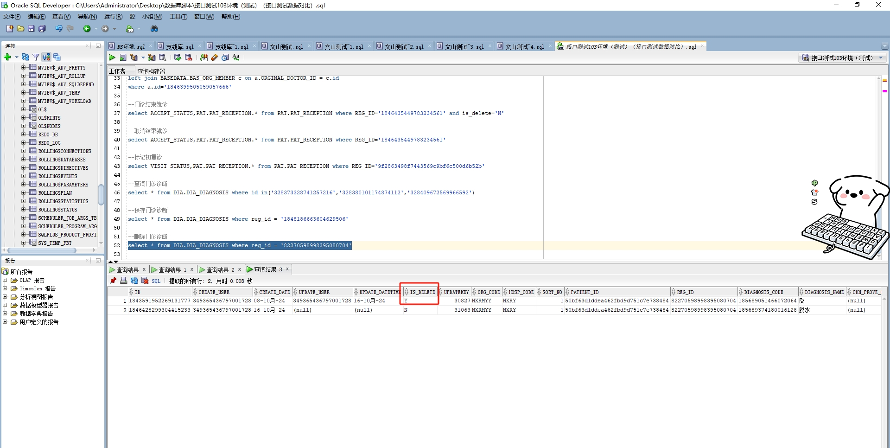

# 领域服务/基础领域 - 删除门诊诊断 - 删除门诊诊断 正向用例
## 请求参数：
``` json
{
  "hospCode": "NXRY",
  "visitId": "82270598998395080704",
  "orgCode": "NXRMYY",
  "operateType": "0",
  "ids": [
    "1843591952269131777"
  ],
  "operatorId": "349365436797001728",
  "operatorName": "测试医生"
}
```
## 返回参数：
``` json
{
  "exception": null,
  "apiCode": null,
  "data": true,
  "Code": 200,
  "Message": "操作成功"
}
```
## 数据校验：



# 领域服务/基础领域 - 删除门诊诊断 - 必填校验-[orgCode]为空
## 请求参数：
``` json
{
  "hospCode": "NXRY",
  "visitId": "82270598998395080704",
  "orgCode": "",
  "operateType": "0",
  "ids": [
    "1843591952269131777"
  ],
  "operatorId": "349365436797001728",
  "operatorName": "测试医生"
}
```
## 返回参数：
``` json
{
  "exception": null,
  "apiCode": null,
  "data": null,
  "Code": 1,
  "Message": "机构代码不能为空"
}
```
# 领域服务/基础领域 - 删除门诊诊断 - 必填校验-[hospCode]为空
## 请求参数：
``` json
{
  "hospCode": "",
  "visitId": "82270598998395080704",
  "orgCode": "NXRMYY",
  "operateType": "0",
  "ids": [
    "1843591952269131777"
  ],
  "operatorId": "349365436797001728",
  "operatorName": "测试医生"
}
```
## 返回参数：
``` json
{
  "exception": null,
  "apiCode": null,
  "data": null,
  "Code": 1,
  "Message": "院区代码不能为空"
}
```
# 领域服务/基础领域 - 删除门诊诊断 - 必填校验-[operatorId]为空
## 请求参数：
``` json
{
  "hospCode": "NXRY",
  "visitId": "82270598998395080704",
  "orgCode": "NXRMYY",
  "operateType": "0",
  "ids": [
    "1843591952269131777"
  ],
  "operatorId": "",
  "operatorName": "测试医生"
}
```
## 返回参数：
``` json
{
  "exception": null,
  "apiCode": null,
  "data": null,
  "Code": 1,
  "Message": "操作人id不能为空"
}
```
# 领域服务/基础领域 - 删除门诊诊断 - 必填校验-[operatorName]为空
## 请求参数：
``` json
{
  "hospCode": "NXRY",
  "visitId": "82270598998395080704",
  "orgCode": "NXRMYY",
  "operateType": "0",
  "ids": [
    "1843591952269131777"
  ],
  "operatorId": "349365436797001728",
  "operatorName": ""
}
```
## 返回参数：
``` json
{
  "exception": null,
  "apiCode": null,
  "data": null,
  "Code": 1,
  "Message": "操作人姓名不能为空"
}
```
# 领域服务/基础领域 - 删除门诊诊断 - 必填校验-[operateType]为空
## 请求参数：
``` json
{
  "hospCode": "NXRY",
  "visitId": "82270598998395080704",
  "orgCode": "NXRMYY",
  "operateType": "",
  "ids": [
    "1843591952269131777"
  ],
  "operatorId": "349365436797001728",
  "operatorName": "测试医生"
}
```
## 返回参数：
``` json
{
  "exception": null,
  "apiCode": null,
  "data": null,
  "Code": 1,
  "Message": "操作类型不能为空"
}
```
# 领域服务/基础领域 - 删除门诊诊断 - 枚举用例-[operateType] 枚举值为 0(操作类型为按id集合)
## 请求参数：
``` json
{
  "hospCode": "NXRY",
  "visitId": "82270598998395080704",
  "orgCode": "NXRMYY",
  "operateType": "0",
  "ids": [
    "1843591952269131777"
  ],
  "operatorId": "349365436797001728",
  "operatorName": "测试医生"
}
```
## 返回参数：
``` json
{
  "exception": null,
  "apiCode": null,
  "data": true,
  "Code": 200,
  "Message": "操作成功"
}
```
# 领域服务/基础领域 - 删除门诊诊断 - 枚举用例-[operateType] 枚举值为 1(操作类型为按挂号id)
## 请求参数：
``` json
{
  "hospCode": "NXRY",
  "visitId": "82270598998395080704",
  "orgCode": "NXRMYY",
  "operateType": "1",
  "ids": [
    "1843591952269131777"
  ],
  "operatorId": "349365436797001728",
  "operatorName": "测试医生"
}
```
## 返回参数：
``` json
{
  "exception": null,
  "apiCode": null,
  "data": true,
  "Code": 200,
  "Message": "操作成功"
}
```
# 领域服务/基础领域 - 删除门诊诊断 - 枚举用例-[operateType] 枚举值为 2(操作类型为按接诊id)
## 请求参数：
``` json
{

"hospCode": "NXRY",

"orgCode": "NXRMYY",

"operateType": "2",

"acceptId": "256699111091748864",

"operatorId": "349365436797001728",

"operatorName": "测试医生"

}
```
## 返回参数：
``` json
{
    "exception": null,
    "apiCode": null,
    "data": true,
    "Code": 200,
    "Message": "操作成功"
}
```
# 领域服务/基础领域 - 删除门诊诊断 - 依赖用例-[operatorName]赋值为依赖用例测试值
## 请求参数：
``` json
{
  "hospCode": "NXRY",
  "visitId": "82270598998395080704",
  "orgCode": "NXRMYY",
  "operateType": "0",
  "ids": [
    "1843591952269131777"
  ],
  "operatorId": "349365436797001728",
  "operatorName": "依赖用例测试值"
}
```
## 返回参数：
``` json
{
  "exception": null,
  "apiCode": null,
  "data": true,
  "Code": 200,
  "Message": "操作成功"
}
```
# 领域服务/基础领域 - 删除门诊诊断 - 依赖用例-[operatorId]赋值为依赖用例测试值
## 请求参数：
``` json
{
  "hospCode": "NXRY",
  "visitId": "82270598998395080704",
  "orgCode": "NXRMYY",
  "operateType": "0",
  "ids": [
    "1843591952269131777"
  ],
  "operatorId": "依赖用例测试值",
  "operatorName": "测试医生"
}
```
## 返回参数：
``` json
{
  "exception": null,
  "apiCode": null,
  "data": true,
  "Code": 200,
  "Message": "操作成功"
}
```
# 领域服务/基础领域 - 删除门诊诊断 - 依赖用例-[orgCode]赋值为依赖用例测试值
## 请求参数：
``` json
{
  "hospCode": "NXRY",
  "visitId": "82270598998395080704",
  "orgCode": "依赖用例测试值",
  "operateType": "0",
  "ids": [
    "1843591952269131777"
  ],
  "operatorId": "349365436797001728",
  "operatorName": "测试医生"
}
```
## 返回参数：
``` json
{
  "exception": null,
  "apiCode": null,
  "data": null,
  "Code": 400,
  "Message": "无删除数据"
}
```
# 领域服务/基础领域 - 删除门诊诊断 - 依赖用例-[hospCode]赋值为依赖用例测试值
## 请求参数：
``` json
{
  "hospCode": "依赖用例测试值",
  "visitId": "82270598998395080704",
  "orgCode": "NXRMYY",
  "operateType": "0",
  "ids": [
    "1843591952269131777"
  ],
  "operatorId": "349365436797001728",
  "operatorName": "测试医生"
}
```
## 返回参数：
``` json
{
  "exception": null,
  "apiCode": null,
  "data": null,
  "Code": 400,
  "Message": "无删除数据"
}
```