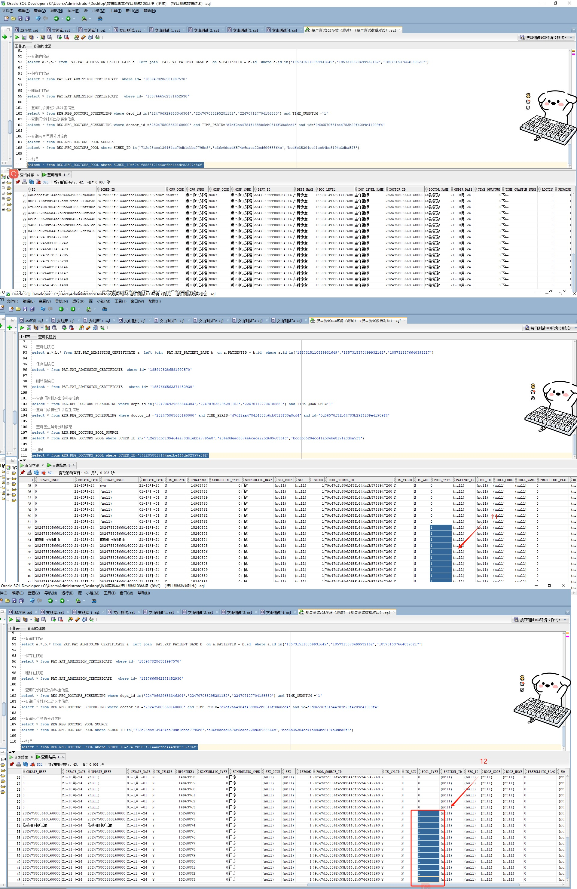

# 领域服务/基础领域 - 加号 - 加号 正向用例
## 请求参数：
``` json
{
  "times": 1,
  "hospCode": "NXRY",
  "orgCode": "NXRMYY",
  "operatorId": "282475805660160000",
  "operatorName": "CS彭彭彭",
  "scheduleId": "741f8588f7144aefbe444de82397a86f"
}
```
## 返回参数：
``` json
{
  "exception": null,
  "apiCode": null,
  "data": true,
  "Code": 200,
  "Message": "操作成功"
}
```
## 数据校验：



# 领域服务/基础领域 - 加号 - 必填校验-[orgCode]为空
## 请求参数：
``` json
{
  "times": 1,
  "hospCode": "NXRY",
  "orgCode": "",
  "operatorId": "282475805660160000",
  "operatorName": "CS彭彭彭",
  "scheduleId": "741f8588f7144aefbe444de82397a86f"
}
```
## 返回参数：
``` json
{
  "exception": null,
  "apiCode": null,
  "data": null,
  "Code": 1,
  "Message": "医院编码不能为空"
}
```
# 领域服务/基础领域 - 加号 - 必填校验-[hospCode]为空
## 请求参数：
``` json
{
  "times": 1,
  "hospCode": "",
  "orgCode": "NXRMYY",
  "operatorId": "282475805660160000",
  "operatorName": "CS彭彭彭",
  "scheduleId": "741f8588f7144aefbe444de82397a86f"
}
```
## 返回参数：
``` json
{
  "exception": null,
  "apiCode": null,
  "data": null,
  "Code": 1,
  "Message": "院区编码不能为空"
}
```
# 领域服务/基础领域 - 加号 - 必填校验-[operatorId]为空
## 请求参数：
``` json
{
  "times": 1,
  "hospCode": "NXRY",
  "orgCode": "NXRMYY",
  "operatorId": "",
  "operatorName": "CS彭彭彭",
  "scheduleId": "741f8588f7144aefbe444de82397a86f"
}
```
## 返回参数：
``` json
{
  "exception": null,
  "apiCode": null,
  "data": null,
  "Code": 1,
  "Message": "操作人id不能为空"
}
```
# 领域服务/基础领域 - 加号 - 必填校验-[operatorName]为空
## 请求参数：
``` json
{
  "times": 1,
  "hospCode": "NXRY",
  "orgCode": "NXRMYY",
  "operatorId": "282475805660160000",
  "operatorName": "",
  "scheduleId": "741f8588f7144aefbe444de82397a86f"
}
```
## 返回参数：
``` json
{
  "exception": null,
  "apiCode": null,
  "data": null,
  "Code": 1,
  "Message": "操作人姓名不能为空"
}
```
# 领域服务/基础领域 - 加号 - 必填校验-[scheduleId]为空
## 请求参数：
``` json
{
  "times": 1,
  "hospCode": "NXRY",
  "orgCode": "NXRMYY",
  "operatorId": "282475805660160000",
  "operatorName": "CS彭彭彭",
  "scheduleId": ""
}
```
## 返回参数：
``` json
{
  "exception": null,
  "apiCode": null,
  "data": null,
  "Code": 1,
  "Message": "医生排班id不能为空"
}
```
# 领域服务/基础领域 - 加号 - 必填校验-[times]为空
## 请求参数：
``` json
{
  "times": null,
  "hospCode": "NXRY",
  "orgCode": "NXRMYY",
  "operatorId": "282475805660160000",
  "operatorName": "CS彭彭彭",
  "scheduleId": "741f8588f7144aefbe444de82397a86f"
}
```
## 返回参数：
``` json
{
  "exception": null,
  "apiCode": null,
  "data": null,
  "Code": 1,
  "Message": "加号数量不能为空"
}
```
# 领域服务/基础领域 - 加号 - 类型校验-[times]类型错误
## 请求参数：
``` json
{
  "times": "abc",
  "hospCode": "NXRY",
  "orgCode": "NXRMYY",
  "operatorId": "282475805660160000",
  "operatorName": "CS彭彭彭",
  "scheduleId": "741f8588f7144aefbe444de82397a86f"
}
```
## 返回参数：
``` json
{
  "exception": null,
  "apiCode": null,
  "data": null,
  "Code": 1,
  "Message": "请求参数错误"
}
```
# 领域服务/基础领域 - 加号 - 依赖用例-[scheduleId]赋值为依赖用例测试值
## 请求参数：
``` json
{
  "times": 1,
  "hospCode": "NXRY",
  "orgCode": "NXRMYY",
  "operatorId": "282475805660160000",
  "operatorName": "CS彭彭彭",
  "scheduleId": "依赖用例测试值"
}
```
## 返回参数：
``` json
{
  "exception": null,
  "apiCode": null,
  "data": null,
  "Code": 400,
  "Message": "找不到当前最大的号源"
}
```
# 领域服务/基础领域 - 加号 - 依赖用例-[operatorName]赋值为依赖用例测试值
## 请求参数：
``` json
{
  "times": 1,
  "hospCode": "NXRY",
  "orgCode": "NXRMYY",
  "operatorId": "282475805660160000",
  "operatorName": "依赖用例测试值",
  "scheduleId": "741f8588f7144aefbe444de82397a86f"
}
```
## 返回参数：
``` json
{
  "exception": null,
  "apiCode": null,
  "data": true,
  "Code": 200,
  "Message": "操作成功"
}
```
# 领域服务/基础领域 - 加号 - 依赖用例-[operatorId]赋值为依赖用例测试值
## 请求参数：
``` json
{
  "times": 1,
  "hospCode": "NXRY",
  "orgCode": "NXRMYY",
  "operatorId": "依赖用例测试值",
  "operatorName": "CS彭彭彭",
  "scheduleId": "741f8588f7144aefbe444de82397a86f"
}
```
## 返回参数：
``` json
{
  "exception": null,
  "apiCode": null,
  "data": true,
  "Code": 200,
  "Message": "操作成功"
}
```
# 领域服务/基础领域 - 加号 - 依赖用例-[orgCode]赋值为依赖用例测试值
## 请求参数：
``` json
{
  "times": 1,
  "hospCode": "NXRY",
  "orgCode": "依赖用例测试值",
  "operatorId": "282475805660160000",
  "operatorName": "CS彭彭彭",
  "scheduleId": "741f8588f7144aefbe444de82397a86f"
}
```
## 返回参数：
``` json
{
  "exception": null,
  "apiCode": null,
  "data": true,
  "Code": 200,
  "Message": "操作成功"
}
```
# 领域服务/基础领域 - 加号 - 依赖用例-[hospCode]赋值为依赖用例测试值
## 请求参数：
``` json
{
  "times": 1,
  "hospCode": "依赖用例测试值",
  "orgCode": "NXRMYY",
  "operatorId": "282475805660160000",
  "operatorName": "CS彭彭彭",
  "scheduleId": "741f8588f7144aefbe444de82397a86f"
}
```
## 返回参数：
``` json
{
  "exception": null,
  "apiCode": null,
  "data": true,
  "Code": 200,
  "Message": "操作成功"
}
```