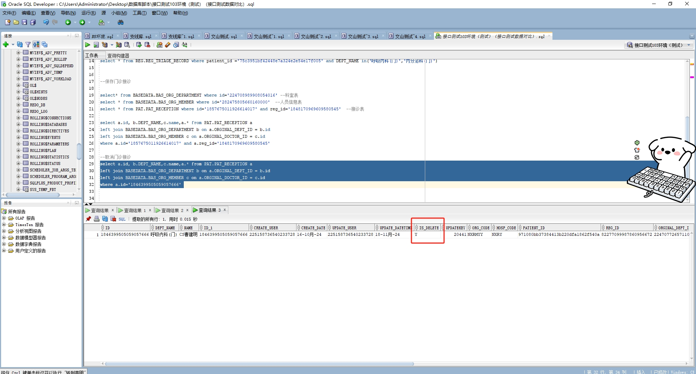

# 领域服务/基础领域 - 取消门诊接诊 - 取消门诊接诊 正向用例
## 请求参数：
``` json
{
    "hospCode": "NXRY",
    "orgCode": "NXRMYY",
    "recieveId": "1846399505059057666",
    "operatorId": "225158736540233728",
    "operatorName": "CS曹建明"
}
```
## 返回参数：
``` json
{
    "exception": null,
    "apiCode": null,
    "data": true,
    "Code": 200,
    "Message": "操作成功"
}
```
## 数据校验：



# 领域服务/基础领域 - 取消门诊接诊 - 必填校验-[orgCode]为空
## 请求参数：
``` json
{
  "hospCode": "NXRY",
  "orgCode": "",
  "receiveId": "1846399505059057666",
  "operatorId": "225158736540233728",
  "operatorName": "CS曹建明"
}
```
## 返回参数：
``` json
{
  "exception": null,
  "apiCode": null,
  "data": null,
  "Code": 1,
  "Message": "接诊id不为空 \n 医院编码不为空"
}
```
# 领域服务/基础领域 - 取消门诊接诊 - 必填校验-[hospCode]为空
## 请求参数：
``` json
{
  "hospCode": "",
  "orgCode": "NXRMYY",
  "receiveId": "1846399505059057666",
  "operatorId": "225158736540233728",
  "operatorName": "CS曹建明"
}
```
## 返回参数：
``` json
{
  "exception": null,
  "apiCode": null,
  "data": null,
  "Code": 1,
  "Message": "院区编码不为空 \n 接诊id不为空"
}
```
# 领域服务/基础领域 - 取消门诊接诊 - 必填校验-[operatorId]为空
## 请求参数：
``` json
{
  "hospCode": "NXRY",
  "orgCode": "NXRMYY",
  "receiveId": "1846399505059057666",
  "operatorId": "",
  "operatorName": "CS曹建明"
}
```
## 返回参数：
``` json
{
  "exception": null,
  "apiCode": null,
  "data": null,
  "Code": 1,
  "Message": "接诊id不为空 \n 操作员id不为空"
}
```
# 领域服务/基础领域 - 取消门诊接诊 - 必填校验-[operatorName]为空
## 请求参数：
``` json
{
  "hospCode": "NXRY",
  "orgCode": "NXRMYY",
  "receiveId": "1846399505059057666",
  "operatorId": "225158736540233728",
  "operatorName": ""
}
```
## 返回参数：
``` json
{
  "exception": null,
  "apiCode": null,
  "data": null,
  "Code": 1,
  "Message": "操作员姓名不为空 \n 接诊id不为空"
}
```
# 领域服务/基础领域 - 取消门诊接诊 - 依赖用例-[operatorName]赋值为依赖用例测试值
## 请求参数：
``` json
{
  "hospCode": "NXRY",
  "orgCode": "NXRMYY",
  "receiveId": "1846399505059057666",
  "operatorId": "225158736540233728",
  "operatorName": "依赖用例测试值"
}
```
## 返回参数：
``` json
{
  "exception": null,
  "apiCode": null,
  "data": null,
  "Code": 1,
  "Message": "接诊id不为空"
}
```
# 领域服务/基础领域 - 取消门诊接诊 - 依赖用例-[operatorId]赋值为依赖用例测试值
## 请求参数：
``` json
{
  "hospCode": "NXRY",
  "orgCode": "NXRMYY",
  "receiveId": "1846399505059057666",
  "operatorId": "依赖用例测试值",
  "operatorName": "CS曹建明"
}
```
## 返回参数：
``` json
{
  "exception": null,
  "apiCode": null,
  "data": null,
  "Code": 1,
  "Message": "接诊id不为空"
}
```
# 领域服务/基础领域 - 取消门诊接诊 - 依赖用例-[orgCode]赋值为依赖用例测试值
## 请求参数：
``` json
{
  "hospCode": "NXRY",
  "orgCode": "依赖用例测试值",
  "receiveId": "1846399505059057666",
  "operatorId": "225158736540233728",
  "operatorName": "CS曹建明"
}
```
## 返回参数：
``` json
{
  "exception": null,
  "apiCode": null,
  "data": null,
  "Code": 1,
  "Message": "接诊id不为空"
}
```
# 领域服务/基础领域 - 取消门诊接诊 - 依赖用例-[hospCode]赋值为依赖用例测试值
## 请求参数：
``` json
{
  "hospCode": "依赖用例测试值",
  "orgCode": "NXRMYY",
  "receiveId": "1846399505059057666",
  "operatorId": "225158736540233728",
  "operatorName": "CS曹建明"
}
```
## 返回参数：
``` json
{
  "exception": null,
  "apiCode": null,
  "data": null,
  "Code": 1,
  "Message": "接诊id不为空"
}
```