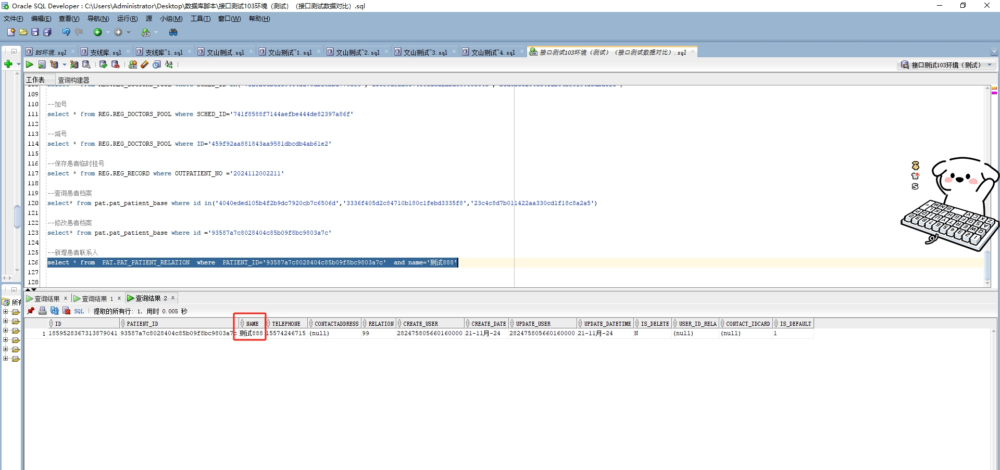

# 领域服务/基础领域 - 新增患者联系人 - 新增患者联系人 正向用例
## 请求参数：
``` json
{
  "hospCode": "NXRY",
  "orgCode": "NXRMYY",
  "list": [
    {
      "contactRelation": "99",
      "contactTelephone": "15574246715",
      "patientId": "93587a7c8028404c85b09f8bc9803a7c",
      "contactName": "测试888"
    }
  ],
  "operatorId": "282475805660160000",
  "operatorName": "CS彭彭彭"
}
```
## 返回参数：
``` json
{
  "exception": null,
  "apiCode": null,
  "data": null,
  "Code": 200,
  "Message": "操作成功"
}
```
## 数据校验：



# 领域服务/基础领域 - 新增患者联系人 - 必填校验-[orgCode]为空
## 请求参数：
``` json
{
  "hospCode": "NXRY",
  "orgCode": "",
  "list": [
    {
      "contactRelation": "99",
      "contactTelephone": "15574246715",
      "patientId": "93587a7c8028404c85b09f8bc9803a7c",
      "contactName": "111"
    }
  ],
  "operatorId": "282475805660160000",
  "operatorName": "CS彭彭彭"
}
```
## 返回参数：
``` json
{
  "exception": null,
  "apiCode": null,
  "data": null,
  "Code": 1,
  "Message": "医院编码不能为空"
}
```
# 领域服务/基础领域 - 新增患者联系人 - 必填校验-[hospCode]为空
## 请求参数：
``` json
{
  "hospCode": "",
  "orgCode": "NXRMYY",
  "list": [
    {
      "contactRelation": "99",
      "contactTelephone": "15574246715",
      "patientId": "93587a7c8028404c85b09f8bc9803a7c",
      "contactName": "111"
    }
  ],
  "operatorId": "282475805660160000",
  "operatorName": "CS彭彭彭"
}
```
## 返回参数：
``` json
{
  "exception": null,
  "apiCode": null,
  "data": null,
  "Code": 1,
  "Message": "院区编码不能为空"
}
```
# 领域服务/基础领域 - 新增患者联系人 - 必填校验-[operatorId]为空
## 请求参数：
``` json
{
  "hospCode": "NXRY",
  "orgCode": "NXRMYY",
  "list": [
    {
      "contactRelation": "99",
      "contactTelephone": "15574246715",
      "patientId": "93587a7c8028404c85b09f8bc9803a7c",
      "contactName": "111"
    }
  ],
  "operatorId": "",
  "operatorName": "CS彭彭彭"
}
```
## 返回参数：
``` json
{
  "exception": null,
  "apiCode": null,
  "data": null,
  "Code": 1,
  "Message": "操作人id不能为空"
}
```
# 领域服务/基础领域 - 新增患者联系人 - 必填校验-[operatorName]为空
## 请求参数：
``` json
{
  "hospCode": "NXRY",
  "orgCode": "NXRMYY",
  "list": [
    {
      "contactRelation": "99",
      "contactTelephone": "15574246715",
      "patientId": "93587a7c8028404c85b09f8bc9803a7c",
      "contactName": "111"
    }
  ],
  "operatorId": "282475805660160000",
  "operatorName": ""
}
```
## 返回参数：
``` json
{
  "exception": null,
  "apiCode": null,
  "data": null,
  "Code": 1,
  "Message": "操作人姓名不能为空"
}
```
# 领域服务/基础领域 - 新增患者联系人 - 必填校验-[list]为空
## 请求参数：
``` json
{
  "hospCode": "NXRY",
  "orgCode": "NXRMYY",
  "list": null,
  "operatorId": "282475805660160000",
  "operatorName": "CS彭彭彭"
}
```
## 返回参数：
``` json
{
  "exception": null,
  "apiCode": null,
  "data": null,
  "Code": 1,
  "Message": "患者联系人信息不能为空"
}
```
# 领域服务/基础领域 - 新增患者联系人 - 必填校验-[list.patientId]为空
## 请求参数：
``` json
{
  "hospCode": "NXRY",
  "orgCode": "NXRMYY",
  "list": [
    {
      "contactRelation": "99",
      "contactTelephone": "15574246715",
      "patientId": null,
      "contactName": "111"
    }
  ],
  "operatorId": "282475805660160000",
  "operatorName": "CS彭彭彭"
}
```
## 返回参数：
``` json
{
  "exception": null,
  "apiCode": null,
  "data": null,
  "Code": 1,
  "Message": "病人id不能为空"
}
```
# 领域服务/基础领域 - 新增患者联系人 - 必填校验-[list.contactName]为空
## 请求参数：
``` json
{
  "hospCode": "NXRY",
  "orgCode": "NXRMYY",
  "list": [
    {
      "contactRelation": "99",
      "contactTelephone": "15574246715",
      "patientId": "93587a7c8028404c85b09f8bc9803a7c",
      "contactName": null
    }
  ],
  "operatorId": "282475805660160000",
  "operatorName": "CS彭彭彭"
}
```
## 返回参数：
``` json
{
  "exception": null,
  "apiCode": null,
  "data": null,
  "Code": 1,
  "Message": "联系人姓名不能为空"
}
```
# 领域服务/基础领域 - 新增患者联系人 - 依赖用例-[operatorName]赋值为依赖用例测试值
## 请求参数：
``` json
{
  "hospCode": "NXRY",
  "orgCode": "NXRMYY",
  "list": [
    {
      "contactRelation": "99",
      "contactTelephone": "15574246715",
      "patientId": "93587a7c8028404c85b09f8bc9803a7c",
      "contactName": "111"
    }
  ],
  "operatorId": "282475805660160000",
  "operatorName": "依赖用例测试值"
}
```
## 返回参数：
``` json
{
  "exception": null,
  "apiCode": null,
  "data": null,
  "Code": 200,
  "Message": "操作成功"
}
```
# 领域服务/基础领域 - 新增患者联系人 - 依赖用例-[operatorId]赋值为依赖用例测试值
## 请求参数：
``` json
{
  "hospCode": "NXRY",
  "orgCode": "NXRMYY",
  "list": [
    {
      "contactRelation": "99",
      "contactTelephone": "15574246715",
      "patientId": "93587a7c8028404c85b09f8bc9803a7c",
      "contactName": "111"
    }
  ],
  "operatorId": "依赖用例测试值",
  "operatorName": "CS彭彭彭"
}
```
## 返回参数：
``` json
{
  "exception": null,
  "apiCode": null,
  "data": null,
  "Code": 200,
  "Message": "操作成功"
}
```
# 领域服务/基础领域 - 新增患者联系人 - 依赖用例-[list.patientId]赋值为依赖用例测试值
## 请求参数：
``` json
{
  "hospCode": "NXRY",
  "orgCode": "NXRMYY",
  "list": [
    {
      "contactRelation": "99",
      "contactTelephone": "15574246715",
      "patientId": "依赖用例测试值",
      "contactName": "111"
    }
  ],
  "operatorId": "282475805660160000",
  "operatorName": "CS彭彭彭"
}
```
## 返回参数：
``` json
{
  "exception": null,
  "apiCode": null,
  "data": null,
  "Code": 400,
  "Message": "患者id错误"
}
```
# 领域服务/基础领域 - 新增患者联系人 - 依赖用例-[orgCode]赋值为依赖用例测试值
## 请求参数：
``` json
{
  "hospCode": "NXRY",
  "orgCode": "依赖用例测试值",
  "list": [
    {
      "contactRelation": "99",
      "contactTelephone": "15574246715",
      "patientId": "93587a7c8028404c85b09f8bc9803a7c",
      "contactName": "111"
    }
  ],
  "operatorId": "282475805660160000",
  "operatorName": "CS彭彭彭"
}
```
## 返回参数：
``` json
{
  "exception": null,
  "apiCode": null,
  "data": null,
  "Code": 200,
  "Message": "操作成功"
}
```
# 领域服务/基础领域 - 新增患者联系人 - 依赖用例-[hospCode]赋值为依赖用例测试值
## 请求参数：
``` json
{
  "hospCode": "依赖用例测试值",
  "orgCode": "NXRMYY",
  "list": [
    {
      "contactRelation": "99",
      "contactTelephone": "15574246715",
      "patientId": "93587a7c8028404c85b09f8bc9803a7c",
      "contactName": "111"
    }
  ],
  "operatorId": "282475805660160000",
  "operatorName": "CS彭彭彭"
}
```
## 返回参数：
``` json
{
  "exception": null,
  "apiCode": null,
  "data": null,
  "Code": 200,
  "Message": "操作成功"
}
```