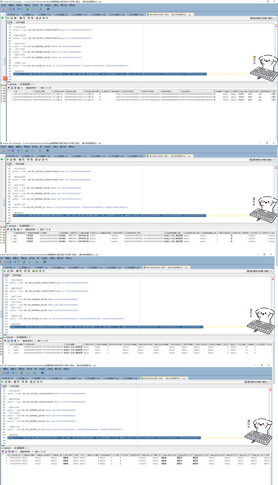

# 领域服务/基础领域 - 查询住院证 - 查询住院证 正向用例
## 请求参数：
``` json
{
  "hospCode": "NXRY",
  "pageSize": 3,
  "pageIndex": 1,
  "orgCode": "NXRMYY"
}
```
## 返回参数：
``` json
{
    "exception": null,
    "apiCode": null,
    "data": {
        "list": [
            {
                "isDelete": "N",
                "createDate": "2024-11-15 14:50:04",
                "updateDate": null,
                "id": "1857315110859931649",
                "updatekey": 4314,
                "certificateid": "1857315110864125953",
                "certificateno": "1857315110864125954",
                "cardid": null,
                "cardno": null,
                "orgCode": "NXRMYY",
                "hospCode": "NXRY",
                "inpatientid": null,
                "conditioncode": "1",
                "condition": "轻",
                "appBedId": null,
                "pattypeid": null,
                "pattypename": null,
                "inwayname": null,
                "outdianame": "硅油注入术后,微创修复",
                "cardtypeid": null,
                "cardtypename": null,
                "medicaltypecode": null,
                "medicaltypename": null,
                "instypecode": null,
                "instypename": null,
                "treattypecode": null,
                "treattypename": null,
                "bqszxz": null,
                "inTimes": 1,
                "enable": "0",
                "isCrossed": "0",
                "isAccident": 0,
                "contactsAddress": null,
                "yyDatetime": null,
                "isGestational": "0",
                "patientSexNam": null,
                "deptId": "224708989908054016",
                "deptName": "产科诊室",
                "enableFalseUser": null,
                "diaInfo": null,
                "acidResult": null,
                "visitType": null,
                "isSingleDisease": "0",
                "inhospitalWay": "1",
                "rescueBit": null,
                "preInhospitalBit": null,
                "actualInDeptId": null,
                "address": null,
                "country": "004",
                "countryName": "阿富汗",
                "hasMedInsure": "0",
                "inStatus": null,
                "marriage": null,
                "mobile": "18807425221",
                "nation": null,
                "nationName": null,
                "listNative": "衡阳县",
                "profession": "1015",
                "professionName": "其它",
                "reciveDeptId": "224708989908054016",
                "reviceDocId": "282475805660160000",
                "visitNo": "2024101600001",
                "suggestInDate": null,
                "createUserId": "282475805660160000",
                "updateUserId": "282475805660160000",
                "visitId": "1846383645695455234",
                "patientId": "93587a7c8028404c85b09f8bc9803a7c",
                "name": "与",
                "presenterId": "ppp",
                "presenterName": "CS彭彭彭",
                "wardId": "229431208567533568",
                "wardName": "妇科病区",
                "inDeptId": "NXRY1508",
                "inDeptName": "妇科专家诊室",
                "attention": null,
                "isIndept": 0,
                "diagnoseWestId": "185688604210659328,78719228158610657280",
                "diagnoseWestName": "硅油注入术后,微创修复",
                "diagnoseChnId": null,
                "diagnoseChnName": null,
                "inMode": 1,
                "advancePayment": 0,
                "source": "1",
                "diagnosis": "185688604210659328,78719228158610657280",
                "settleTypeCode": "0",
                "settleTypeName": null,
                "isIcu": 0,
                "contactRelation": "11",
                "contactName": "111",
                "contactTelephone": "15574246715",
                "isOperToday": "0",
                "birthday": "1999-12-12 00:00:00",
                "sex": "2",
                "actualInDate": null,
                "idCard": "430421199912121122",
                "isChemoraDiotherapy": "0"
            },
            {
                "isDelete": "N",
                "createDate": "2024-11-15 14:51:06",
                "updateDate": null,
                "id": "1857315370499932162",
                "updatekey": 4315,
                "certificateid": "1857315370499932163",
                "certificateno": "1857315370499932164",
                "cardid": null,
                "cardno": null,
                "orgCode": "NXRMYY",
                "hospCode": "NXRY",
                "inpatientid": null,
                "conditioncode": "1",
                "condition": "轻",
                "appBedId": null,
                "pattypeid": null,
                "pattypename": null,
                "inwayname": null,
                "outdianame": "硅油注入术后,微创修复",
                "cardtypeid": null,
                "cardtypename": null,
                "medicaltypecode": null,
                "medicaltypename": null,
                "instypecode": null,
                "instypename": null,
                "treattypecode": null,
                "treattypename": null,
                "bqszxz": null,
                "inTimes": 1,
                "enable": "0",
                "isCrossed": "0",
                "isAccident": 0,
                "contactsAddress": null,
                "yyDatetime": null,
                "isGestational": "0",
                "patientSexNam": null,
                "deptId": "224708989908054016",
                "deptName": "产科诊室",
                "enableFalseUser": null,
                "diaInfo": null,
                "acidResult": null,
                "visitType": null,
                "isSingleDisease": "0",
                "inhospitalWay": "1",
                "rescueBit": null,
                "preInhospitalBit": null,
                "actualInDeptId": null,
                "address": null,
                "country": "004",
                "countryName": "阿富汗",
                "hasMedInsure": "0",
                "inStatus": null,
                "marriage": null,
                "mobile": "18807425221",
                "nation": null,
                "nationName": null,
                "listNative": "衡阳县",
                "profession": "1015",
                "professionName": "其它",
                "reciveDeptId": "224708989908054016",
                "reviceDocId": "282475805660160000",
                "visitNo": "2024101600001",
                "suggestInDate": null,
                "createUserId": "282475805660160000",
                "updateUserId": "282475805660160000",
                "visitId": "1846383645695455234",
                "patientId": "93587a7c8028404c85b09f8bc9803a7c",
                "name": "与",
                "presenterId": "ppp",
                "presenterName": "CS彭彭彭",
                "wardId": "229431208567533568",
                "wardName": "妇科病区",
                "inDeptId": "NXRY1508",
                "inDeptName": "妇科专家诊室",
                "attention": null,
                "isIndept": 0,
                "diagnoseWestId": "185688604210659328,78719228158610657280",
                "diagnoseWestName": "硅油注入术后,微创修复",
                "diagnoseChnId": null,
                "diagnoseChnName": null,
                "inMode": 1,
                "advancePayment": 0,
                "source": "1",
                "diagnosis": "185688604210659328,78719228158610657280",
                "settleTypeCode": "0",
                "settleTypeName": null,
                "isIcu": 0,
                "contactRelation": "11",
                "contactName": "111",
                "contactTelephone": "15574246715",
                "isOperToday": "0",
                "birthday": "1999-12-12 00:00:00",
                "sex": "2",
                "actualInDate": null,
                "idCard": "430421199912121122",
                "isChemoraDiotherapy": "0"
            },
            {
                "isDelete": "N",
                "createDate": "2024-11-15 14:51:07",
                "updateDate": null,
                "id": "1857315376640393217",
                "updatekey": 4316,
                "certificateid": "1857315376640393218",
                "certificateno": "1857315376640393219",
                "cardid": null,
                "cardno": null,
                "orgCode": "NXRMYY",
                "hospCode": "NXRY",
                "inpatientid": null,
                "conditioncode": "1",
                "condition": "轻",
                "appBedId": null,
                "pattypeid": null,
                "pattypename": null,
                "inwayname": null,
                "outdianame": "硅油注入术后,微创修复",
                "cardtypeid": null,
                "cardtypename": null,
                "medicaltypecode": null,
                "medicaltypename": null,
                "instypecode": null,
                "instypename": null,
                "treattypecode": null,
                "treattypename": null,
                "bqszxz": null,
                "inTimes": 1,
                "enable": "0",
                "isCrossed": "0",
                "isAccident": 0,
                "contactsAddress": null,
                "yyDatetime": null,
                "isGestational": "0",
                "patientSexNam": null,
                "deptId": "224708989908054016",
                "deptName": "产科诊室",
                "enableFalseUser": null,
                "diaInfo": null,
                "acidResult": null,
                "visitType": null,
                "isSingleDisease": "0",
                "inhospitalWay": "1",
                "rescueBit": null,
                "preInhospitalBit": null,
                "actualInDeptId": null,
                "address": null,
                "country": "004",
                "countryName": "阿富汗",
                "hasMedInsure": "0",
                "inStatus": null,
                "marriage": null,
                "mobile": "18807425221",
                "nation": null,
                "nationName": null,
                "listNative": "衡阳县",
                "profession": "1015",
                "professionName": "其它",
                "reciveDeptId": "224708989908054016",
                "reviceDocId": "282475805660160000",
                "visitNo": "2024101600001",
                "suggestInDate": null,
                "createUserId": "282475805660160000",
                "updateUserId": "282475805660160000",
                "visitId": "1846383645695455234",
                "patientId": "93587a7c8028404c85b09f8bc9803a7c",
                "name": "与",
                "presenterId": "ppp",
                "presenterName": "CS彭彭彭",
                "wardId": "229431208567533568",
                "wardName": "妇科病区",
                "inDeptId": "NXRY1508",
                "inDeptName": "妇科专家诊室",
                "attention": null,
                "isIndept": 0,
                "diagnoseWestId": "185688604210659328,78719228158610657280",
                "diagnoseWestName": "硅油注入术后,微创修复",
                "diagnoseChnId": null,
                "diagnoseChnName": null,
                "inMode": 1,
                "advancePayment": 0,
                "source": "2",
                "diagnosis": "185688604210659328,78719228158610657280",
                "settleTypeCode": "0",
                "settleTypeName": null,
                "isIcu": 0,
                "contactRelation": "11",
                "contactName": "111",
                "contactTelephone": "15574246715",
                "isOperToday": "0",
                "birthday": "1999-12-12 00:00:00",
                "sex": "2",
                "actualInDate": null,
                "idCard": "430421199912121122",
                "isChemoraDiotherapy": "0"
            }
        ],
        "totalCount": 53,
        "pageSize": 3,
        "pageNo": 1,
        "pageCount": 18
    },
    "Code": 200,
    "Message": "操作成功"
}
```
## 数据校验：



# 领域服务/基础领域 - 查询住院证 - 必填校验-[orgCode]为空
## 请求参数：
``` json
{
  "hospCode": "NXRY",
  "pageSize": 3,
  "patientIds": [
    "39542b4771894578a1d6a9ad8568a894"
  ],
  "pageIndex": 1,
  "orgCode": "",
  "visitIds": [
    "9f2863498f7443569c9bf6c500d6b52b"
  ]
}
```
## 返回参数：
``` json
{
  "exception": null,
  "apiCode": null,
  "data": null,
  "Code": 1,
  "Message": "医院编码不能为空"
}
```
# 领域服务/基础领域 - 查询住院证 - 必填校验-[pageIndex]为空
## 请求参数：
``` json
{
  "hospCode": "NXRY",
  "pageSize": 3,
  "patientIds": [
    "39542b4771894578a1d6a9ad8568a894"
  ],
  "pageIndex": null,
  "orgCode": "NXRMYY",
  "visitIds": [
    "9f2863498f7443569c9bf6c500d6b52b"
  ]
}
```
## 返回参数：
``` json
{
  "exception": null,
  "apiCode": null,
  "data": null,
  "Code": 1,
  "Message": "页码不能为空"
}
```
# 领域服务/基础领域 - 查询住院证 - 必填校验-[pageSize]为空
## 请求参数：
``` json
{
  "hospCode": "NXRY",
  "pageSize": null,
  "patientIds": [
    "39542b4771894578a1d6a9ad8568a894"
  ],
  "pageIndex": 1,
  "orgCode": "NXRMYY",
  "visitIds": [
    "9f2863498f7443569c9bf6c500d6b52b"
  ]
}
```
## 返回参数：
``` json
{
  "exception": null,
  "apiCode": null,
  "data": null,
  "Code": 1,
  "Message": "每页显示条数不能为空"
}
```
# 领域服务/基础领域 - 查询住院证 - 类型校验-[pageIndex]类型错误
## 请求参数：
``` json
{
  "hospCode": "NXRY",
  "pageSize": 3,
  "patientIds": [
    "39542b4771894578a1d6a9ad8568a894"
  ],
  "pageIndex": "abc",
  "orgCode": "NXRMYY",
  "visitIds": [
    "9f2863498f7443569c9bf6c500d6b52b"
  ]
}
```
## 返回参数：
``` json
{
  "exception": null,
  "apiCode": null,
  "data": null,
  "Code": 1,
  "Message": "请求参数错误"
}
```
# 领域服务/基础领域 - 查询住院证 - 类型校验-[pageSize]类型错误
## 请求参数：
``` json
{
  "hospCode": "NXRY",
  "pageSize": "abc",
  "patientIds": [
    "39542b4771894578a1d6a9ad8568a894"
  ],
  "pageIndex": 1,
  "orgCode": "NXRMYY",
  "visitIds": [
    "9f2863498f7443569c9bf6c500d6b52b"
  ]
}
```
## 返回参数：
``` json
{
  "exception": null,
  "apiCode": null,
  "data": null,
  "Code": 1,
  "Message": "请求参数错误"
}
```
# 领域服务/基础领域 - 查询住院证 - 依赖用例-[orgCode]赋值为依赖用例测试值
## 请求参数：
``` json
{
  "hospCode": "NXRY",
  "pageSize": 3,
  "patientIds": [
    "39542b4771894578a1d6a9ad8568a894"
  ],
  "pageIndex": 1,
  "orgCode": "依赖用例测试值",
  "visitIds": [
    "9f2863498f7443569c9bf6c500d6b52b"
  ]
}
```
## 返回参数：
``` json
{
  "exception": null,
  "apiCode": null,
  "data": {
    "list": [],
    "totalCount": 0,
    "pageSize": 3,
    "pageNo": 1,
    "pageCount": 0
  },
  "Code": 200,
  "Message": "操作成功"
}
```