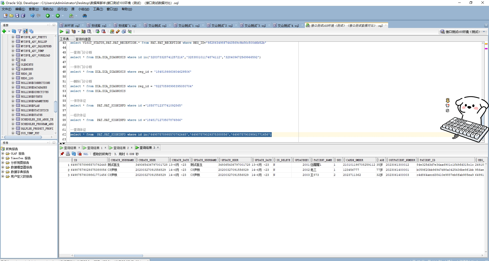

# 领域服务/基础领域 - 查询体征 - 查询体征 正向用例
## 请求参数：
``` json
{
  "pageIndex": 1,
  "orgCode": "NXRMYY",
  "pageSize": 3
}
```
## 返回参数：
``` json
{
  "exception": null,
  "apiCode": null,
  "data": {
    "list": [
      {
        "id": "64987578995570792448",
        "orgCode": "NXRMYY",
        "hospCode": "NXRY",
        "createUserId": "349365436797001728",
        "updateUserId": "349365436797001728",
        "createDate": "2023-06-13 17:02:32",
        "updateDate": "2023-06-13 17:03:25",
        "patientId": "84e325d3d7e34aa6901c1f49fd315c1c",
        "name": "伍醒醒1",
        "sex": "1",
        "age": "35岁",
        "visitType": null,
        "visitId": "24918737239b48299ad7288474a19621",
        "temperature": 37.8,
        "breathing": 56,
        "pulse": 45,
        "heartRate": 0,
        "diastolic": 56,
        "systolic": 78,
        "systolicLeft": null,
        "diastolicLeft": null,
        "systolicRight": null,
        "diastolicRight": null,
        "booldsugar": 5,
        "bloodOxygen": null,
        "height": 170,
        "weight": 50,
        "headCircu": 50,
        "waistCircu": 50,
        "impressionDissease": null,
        "consciousness": null,
        "stateClassIficationCode": null,
        "stateClassIficationName": null,
        "hbsag": "-1",
        "hcv": "-1",
        "hiv": "-1",
        "tp": "-1",
        "aids": null,
        "highRiskScode": null,
        "mews": null,
        "isFever": null,
        "onsetTime": "2023-06-12 00:00:00",
        "disposeOf": "发送到",
        "triageLevel": null,
        "smokingInfo": null,
        "medicalHistory": null,
        "surgicalHistory": null,
        "physionlogyCode": null,
        "physionlogyName": null,
        "isFoodExposure": "1",
        "isGestational": "1",
        "pregnantCount": 3,
        "childbirthCount": 2,
        "uterineHeight": 56,
        "uterinePlace": null,
        "abdominalCircu": 23,
        "fetusPlace": 34,
        "fetusHeart": 54,
        "isHighRiskAreaTravel": null,
        "isHighRiskAreaContract": null,
        "isHighRiskPersonContact": null,
        "isRangeArise": null,
        "isEnter": null,
        "healthyQrCodeLevel": null,
        "routeQrCodeLevel": null,
        "receiveId": null,
        "undeumbilicus": "1",
        "cardNo": "210101198708259112",
        "deptId": "224707726571106304",
        "disgrace": "3",
        "hospName": "版本测试环境",
        "orgName": "版本测试环境",
        "lastMenstruation": "2023-06-12 17:03:18",
        "onsettimeRemarks": null,
        "outpatientNo": "2023061300012"
      },
      {
        "id": "64987579029375388856",
        "orgCode": "NXRMYY",
        "hospCode": "NXRY",
        "createUserId": "20200327091556829",
        "updateUserId": "20200327091556829",
        "createDate": "2023-06-14 09:10:07",
        "updateDate": "2023-06-14 09:10:07",
        "patientId": "b059f20bb96947d98a0425436be9f1bb",
        "name": "老三",
        "sex": "1",
        "age": "77岁",
        "visitType": null,
        "visitId": "956ae29554834654a1a6348d78cea90d",
        "temperature": 0,
        "breathing": null,
        "pulse": 0,
        "heartRate": 0,
        "diastolic": 0,
        "systolic": 0,
        "systolicLeft": null,
        "diastolicLeft": null,
        "systolicRight": null,
        "diastolicRight": null,
        "booldsugar": 0,
        "bloodOxygen": null,
        "height": 0,
        "weight": 0,
        "headCircu": 0,
        "waistCircu": 0,
        "impressionDissease": null,
        "consciousness": null,
        "stateClassIficationCode": null,
        "stateClassIficationName": null,
        "hbsag": "-1",
        "hcv": "-1",
        "hiv": "-1",
        "tp": "-1",
        "aids": null,
        "highRiskScode": null,
        "mews": null,
        "isFever": null,
        "onsetTime": "2023-06-14 00:00:00",
        "disposeOf": null,
        "triageLevel": null,
        "smokingInfo": null,
        "medicalHistory": null,
        "surgicalHistory": null,
        "physionlogyCode": null,
        "physionlogyName": null,
        "isFoodExposure": "0",
        "isGestational": null,
        "pregnantCount": null,
        "childbirthCount": null,
        "uterineHeight": null,
        "uterinePlace": null,
        "abdominalCircu": null,
        "fetusPlace": null,
        "fetusHeart": null,
        "isHighRiskAreaTravel": null,
        "isHighRiskAreaContract": null,
        "isHighRiskPersonContact": null,
        "isRangeArise": null,
        "isEnter": null,
        "healthyQrCodeLevel": null,
        "routeQrCodeLevel": null,
        "receiveId": null,
        "undeumbilicus": "null",
        "cardNo": "123456777",
        "deptId": "224711376269897728",
        "disgrace": "null",
        "hospName": "版本测试环境",
        "orgName": "版本测试环境",
        "lastMenstruation": "0001-01-01 00:00:00",
        "onsettimeRemarks": null,
        "outpatientNo": "2023061400001"
      },
      {
        "id": "64987579039861771456",
        "orgCode": "NXRMYY",
        "hospCode": "NXRY",
        "createUserId": "20200327091556829",
        "updateUserId": "20200327091556829",
        "createDate": "2023-06-14 09:16:31",
        "updateDate": "2023-06-14 09:16:31",
        "patientId": "c4d864aecd38410e9887eb8fab985ea9",
        "name": "王873",
        "sex": "2",
        "age": "32岁",
        "visitType": null,
        "visitId": "64991220940972896256",
        "temperature": 88,
        "breathing": 88,
        "pulse": 88,
        "heartRate": 0,
        "diastolic": 88,
        "systolic": 123,
        "systolicLeft": null,
        "diastolicLeft": null,
        "systolicRight": null,
        "diastolicRight": null,
        "booldsugar": 88,
        "bloodOxygen": null,
        "height": 88,
        "weight": 88,
        "headCircu": 88,
        "waistCircu": 88,
        "impressionDissease": null,
        "consciousness": null,
        "stateClassIficationCode": null,
        "stateClassIficationName": null,
        "hbsag": "-1",
        "hcv": "-1",
        "hiv": "-1",
        "tp": "-1",
        "aids": null,
        "highRiskScode": null,
        "mews": null,
        "isFever": null,
        "onsetTime": "2023-06-14 00:00:00",
        "disposeOf": null,
        "triageLevel": null,
        "smokingInfo": null,
        "medicalHistory": null,
        "surgicalHistory": null,
        "physionlogyCode": null,
        "physionlogyName": null,
        "isFoodExposure": "0",
        "isGestational": null,
        "pregnantCount": null,
        "childbirthCount": null,
        "uterineHeight": null,
        "uterinePlace": null,
        "abdominalCircu": null,
        "fetusPlace": null,
        "fetusHeart": null,
        "isHighRiskAreaTravel": null,
        "isHighRiskAreaContract": null,
        "isHighRiskPersonContact": null,
        "isRangeArise": null,
        "isEnter": null,
        "healthyQrCodeLevel": null,
        "routeQrCodeLevel": null,
        "receiveId": null,
        "undeumbilicus": "null",
        "cardNo": "2023711362",
        "deptId": "224711376269897728",
        "disgrace": "null",
        "hospName": "版本测试环境",
        "orgName": "版本测试环境",
        "lastMenstruation": "0001-01-01 00:00:00",
        "onsettimeRemarks": null,
        "outpatientNo": "2023061400003"
      }
    ],
    "totalCount": 533,
    "pageSize": 3,
    "pageNo": 1,
    "pageCount": 178
  },
  "Code": 200,
  "Message": "操作成功"
}
```
## 数据校验：



# 领域服务/基础领域 - 查询体征 - 必填校验-[orgCode]为空
## 请求参数：
``` json
{
  "pageIndex": 1,
  "orgCode": "",
  "pageSize": 3
}
```
## 返回参数：
``` json
{
  "exception": null,
  "apiCode": null,
  "data": null,
  "Code": 1,
  "Message": "医院编码不能为空"
}
```
# 领域服务/基础领域 - 查询体征 - 必填校验-[pageIndex]为空
## 请求参数：
``` json
{
  "pageIndex": null,
  "orgCode": "NXRMYY",
  "pageSize": 3
}
```
## 返回参数：
``` json
{
  "exception": null,
  "apiCode": null,
  "data": null,
  "Code": 1,
  "Message": "页码不能为空"
}
```
# 领域服务/基础领域 - 查询体征 - 必填校验-[pageSize]为空
## 请求参数：
``` json
{
  "pageIndex": 1,
  "orgCode": "NXRMYY",
  "pageSize": null
}
```
## 返回参数：
``` json
{
  "exception": null,
  "apiCode": null,
  "data": null,
  "Code": 1,
  "Message": "每页显示条数不能为空"
}
```
# 领域服务/基础领域 - 查询体征 - 类型校验-[pageSize]类型错误
## 请求参数：
``` json
{
  "pageIndex": 1,
  "orgCode": "NXRMYY",
  "pageSize": "abc"
}
```
## 返回参数：
``` json
{
  "exception": null,
  "apiCode": null,
  "data": null,
  "Code": 1,
  "Message": "请求参数错误"
}
```
# 领域服务/基础领域 - 查询体征 - 类型校验-[pageIndex]类型错误
## 请求参数：
``` json
{
  "pageIndex": "abc",
  "orgCode": "NXRMYY",
  "pageSize": 3
}
```
## 返回参数：
``` json
{
  "exception": null,
  "apiCode": null,
  "data": null,
  "Code": 1,
  "Message": "请求参数错误"
}
```
# 领域服务/基础领域 - 查询体征 - 依赖用例-[orgCode]赋值为依赖用例测试值
## 请求参数：
``` json
{
  "pageIndex": 1,
  "orgCode": "依赖用例测试值",
  "pageSize": 3
}
```
## 返回参数：
``` json
{
  "exception": null,
  "apiCode": null,
  "data": {
    "list": [
      {
        "id": "1858770158932549634",
        "orgCode": "依赖用例测试值",
        "hospCode": "NXRY",
        "createUserId": "349365436797001728",
        "updateUserId": null,
        "createDate": "2024-11-19 15:11:54",
        "updateDate": null,
        "patientId": "93587a7c8028404c85b09f8bc9803a7c",
        "name": "与",
        "sex": "2",
        "age": "24岁",
        "visitType": null,
        "visitId": "1848171145803902977",
        "temperature": 0,
        "breathing": null,
        "pulse": null,
        "heartRate": null,
        "diastolic": null,
        "systolic": null,
        "systolicLeft": null,
        "diastolicLeft": null,
        "systolicRight": null,
        "diastolicRight": null,
        "booldsugar": null,
        "bloodOxygen": null,
        "height": null,
        "weight": null,
        "headCircu": null,
        "waistCircu": null,
        "impressionDissease": null,
        "consciousness": null,
        "stateClassIficationCode": null,
        "stateClassIficationName": null,
        "hbsag": null,
        "hcv": null,
        "hiv": null,
        "tp": null,
        "aids": null,
        "highRiskScode": null,
        "mews": null,
        "isFever": null,
        "onsetTime": null,
        "disposeOf": null,
        "triageLevel": null,
        "smokingInfo": null,
        "medicalHistory": null,
        "surgicalHistory": null,
        "physionlogyCode": null,
        "physionlogyName": null,
        "isFoodExposure": null,
        "isGestational": null,
        "pregnantCount": null,
        "childbirthCount": null,
        "uterineHeight": null,
        "uterinePlace": null,
        "abdominalCircu": null,
        "fetusPlace": null,
        "fetusHeart": null,
        "isHighRiskAreaTravel": null,
        "isHighRiskAreaContract": null,
        "isHighRiskPersonContact": null,
        "isRangeArise": null,
        "isEnter": null,
        "healthyQrCodeLevel": null,
        "routeQrCodeLevel": null,
        "receiveId": null,
        "undeumbilicus": "null",
        "cardNo": null,
        "deptId": null,
        "disgrace": "null",
        "hospName": null,
        "orgName": null,
        "lastMenstruation": null,
        "onsettimeRemarks": null,
        "outpatientNo": null
      }
    ],
    "totalCount": 1,
    "pageSize": 3,
    "pageNo": 1,
    "pageCount": 1
  },
  "Code": 200,
  "Message": "操作成功"
}
```