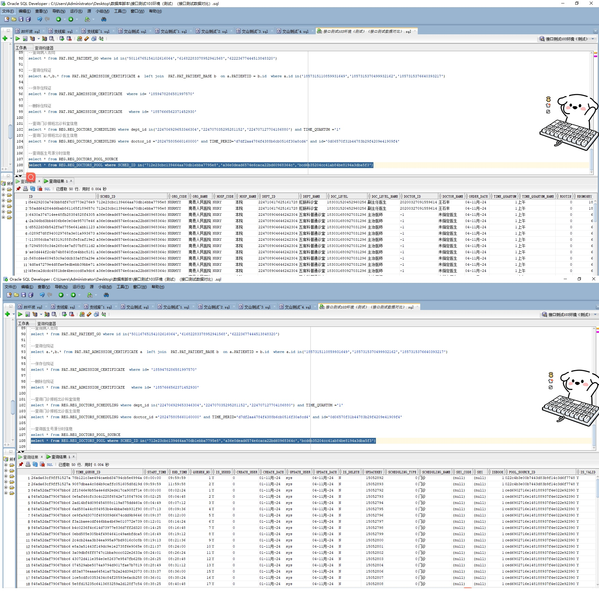

# 领域服务/基础领域 - 查询医生号源分时信息 - 查询医生号源分时信息 正向用例
## 请求参数：
``` json
{
  "hospCode": "NXRY",
  "pageIndex": 1,
  "orgCode": "NXRMYY",
  "pageSize": 3
}
```
## 返回参数：
``` json
{
  "exception": null,
  "apiCode": null,
  "data": {
    "list": [
      {
        "timeId": "d125b62e4a424f4aa0388db1199cc1e9",
        "scheduleId": "bcd6b35204cc41ab84be8194a3dba5f3",
        "orgCode": "NXRMYY",
        "hospCode": "NXRY",
        "deptId": "224711376269897728",
        "deptName": "肠道门诊",
        "doctorId": "-1",
        "doctorName": "未指定医生",
        "schedId": null,
        "startTime": "17:00:00",
        "endTime": "23:59:59",
        "regmoney": null,
        "roleCode": null,
        "roleName": null,
        "remainCount": 1,
        "totalCount": 50,
        "sources": null,
        "visitDate": "2024-11-04 00:00:00",
        "timeFrameId": null
      },
      {
        "timeId": "ced6902716e148188937f4e022e92390",
        "scheduleId": "a36e0dead6574e6caca22bd60968364c",
        "orgCode": "NXRMYY",
        "hospCode": "NXRY",
        "deptId": "224708904646242304",
        "deptName": "五官科普通诊室",
        "doctorId": "-1",
        "doctorName": "未指定医生",
        "schedId": null,
        "startTime": "08:00:00",
        "endTime": "11:59:59",
        "regmoney": null,
        "roleCode": null,
        "roleName": null,
        "remainCount": null,
        "totalCount": 100,
        "sources": null,
        "visitDate": "2024-11-04 00:00:00",
        "timeFrameId": null
      },
      {
        "timeId": "022c4b3e00b7443d83b9f14c3d6f7748",
        "scheduleId": "712e23cbc139464aa70db1ebba7795e8",
        "orgCode": "NXRMYY",
        "hospCode": "NXRY",
        "deptId": "224710617625161728",
        "deptName": "肛肠科诊室",
        "doctorId": "20200327091559614",
        "doctorName": "王石丰",
        "schedId": null,
        "startTime": "08:00:00",
        "endTime": "11:59:59",
        "regmoney": null,
        "roleCode": null,
        "roleName": null,
        "remainCount": null,
        "totalCount": 2,
        "sources": null,
        "visitDate": "2024-11-04 00:00:00",
        "timeFrameId": null
      }
    ],
    "totalCount": 10311,
    "pageSize": 3,
    "pageNo": 1,
    "pageCount": 3437
  },
  "Code": 200,
  "Message": "操作成功"
}
```
## 数据校验：



# 领域服务/基础领域 - 查询医生号源分时信息 - 必填校验-[orgCode]为空
## 请求参数：
``` json
{
  "hospCode": "NXRY",
  "pageIndex": 1,
  "orgCode": "",
  "pageSize": 3
}
```
## 返回参数：
``` json
{
  "exception": null,
  "apiCode": null,
  "data": null,
  "Code": 1,
  "Message": "医院编码不能为空"
}
```
# 领域服务/基础领域 - 查询医生号源分时信息 - 必填校验-[pageIndex]为空
## 请求参数：
``` json
{
  "hospCode": "NXRY",
  "pageIndex": null,
  "orgCode": "NXRMYY",
  "pageSize": 3
}
```
## 返回参数：
``` json
{
  "exception": null,
  "apiCode": null,
  "data": null,
  "Code": 1,
  "Message": "页码不能为空"
}
```
# 领域服务/基础领域 - 查询医生号源分时信息 - 必填校验-[pageSize]为空
## 请求参数：
``` json
{
  "hospCode": "NXRY",
  "pageIndex": 1,
  "orgCode": "NXRMYY",
  "pageSize": null
}
```
## 返回参数：
``` json
{
  "exception": null,
  "apiCode": null,
  "data": null,
  "Code": 1,
  "Message": "每页显示条数不能为空"
}
```
# 领域服务/基础领域 - 查询医生号源分时信息 - 类型校验-[pageSize]类型错误
## 请求参数：
``` json
{
  "hospCode": "NXRY",
  "pageIndex": 1,
  "orgCode": "NXRMYY",
  "pageSize": "abc"
}
```
## 返回参数：
``` json
{
  "exception": null,
  "apiCode": null,
  "data": null,
  "Code": 1,
  "Message": "请求参数错误"
}
```
# 领域服务/基础领域 - 查询医生号源分时信息 - 类型校验-[pageIndex]类型错误
## 请求参数：
``` json
{
  "hospCode": "NXRY",
  "pageIndex": "abc",
  "orgCode": "NXRMYY",
  "pageSize": 3
}
```
## 返回参数：
``` json
{
  "exception": null,
  "apiCode": null,
  "data": null,
  "Code": 1,
  "Message": "请求参数错误"
}
```
# 领域服务/基础领域 - 查询医生号源分时信息 - 依赖用例-[orgCode]赋值为依赖用例测试值
## 请求参数：
``` json
{
  "hospCode": "NXRY",
  "pageIndex": 1,
  "orgCode": "依赖用例测试值",
  "pageSize": 3
}
```
## 返回参数：
``` json
{
  "exception": null,
  "apiCode": null,
  "data": {
    "list": [],
    "totalCount": 0,
    "pageSize": 3,
    "pageNo": 1,
    "pageCount": 0
  },
  "Code": 200,
  "Message": "操作成功"
}
```