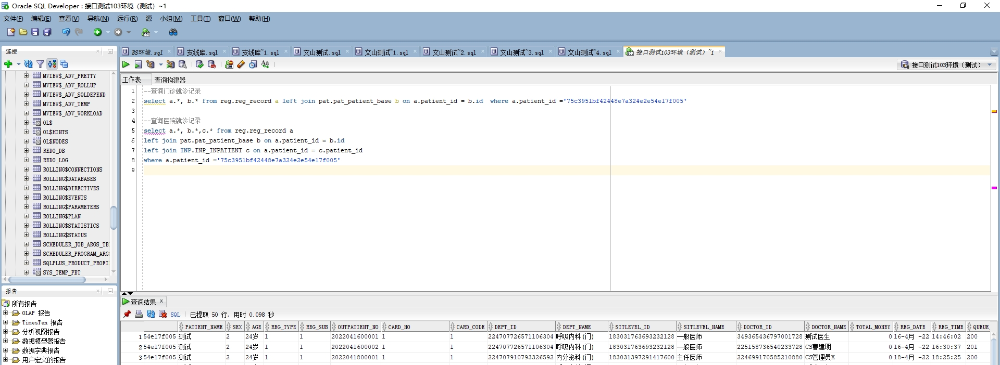

# 领域服务/基础领域 - 查询医院就诊记录 - 查询医院就诊记录 正向用例
## 请求参数：
``` json
{
  "pageIndex": 1,
  "orgCode": "NXRMYY",
  "pageSize": 3
}
```
## 返回参数：
``` json
{
  "exception": null,
  "apiCode": null,
  "data": {
    "list": [
      {
        "address": null,
        "age": null,
        "birthday": null,
        "deptId": "224707726571106304",
        "deptName": "呼吸内科(门)",
        "doctorId": "349365436797001728",
        "doctorName": "测试医生",
        "hospCode": "NXRY",
        "idCard": "430802199901010123",
        "mobile": "13874572669",
        "orgCode": "NXRMYY",
        "patientId": "75c3951bf42448e7a324e2e54e17f005",
        "patientName": "测试",
        "primaryDiagnosisCodes": [
          "185689051466072064"
        ],
        "primaryDiagnosisNames": [
          "反"
        ],
        "sex": "2",
        "sexName": "女",
        "visitDateTime": null,
        "visitid": "6de96472c5d74d5e9e73dc3d9b9d273a",
        "visitNo": "2022041600001",
        "visitType": "1",
        "isRevisit": "0"
      },
      {
        "address": null,
        "age": null,
        "birthday": null,
        "deptId": "224707726571106304",
        "deptName": "呼吸内科(门)",
        "doctorId": "225158736540233728",
        "doctorName": "CS曹建明",
        "hospCode": "NXRY",
        "idCard": "430802199901010123",
        "mobile": "13874572669",
        "orgCode": "NXRMYY",
        "patientId": "75c3951bf42448e7a324e2e54e17f005",
        "patientName": "测试",
        "primaryDiagnosisCodes": null,
        "primaryDiagnosisNames": null,
        "sex": "2",
        "sexName": "女",
        "visitDateTime": null,
        "visitid": "00be59308e064f4eb1531d4e0c723ddf",
        "visitNo": "2022041600002",
        "visitType": "1",
        "isRevisit": "0"
      },
      {
        "address": null,
        "age": null,
        "birthday": null,
        "deptId": "224707910793326592",
        "deptName": "内分泌科(门)",
        "doctorId": "224699170585210880",
        "doctorName": "CS管理员X",
        "hospCode": "NXRY",
        "idCard": "430802199901010123",
        "mobile": "13874572669",
        "orgCode": "NXRMYY",
        "patientId": "75c3951bf42448e7a324e2e54e17f005",
        "patientName": "测试",
        "primaryDiagnosisCodes": [
          "185689051466072064"
        ],
        "primaryDiagnosisNames": [
          "反"
        ],
        "sex": "2",
        "sexName": "女",
        "visitDateTime": null,
        "visitid": "bc72225bb43b4fe4a541abfa93d372e5",
        "visitNo": "2022041800001",
        "visitType": "1",
        "isRevisit": "0"
      }
    ],
    "totalCount": 6252,
    "pageSize": 3,
    "pageNo": 1,
    "pageCount": 2084
  },
  "Code": 200,
  "Message": "操作成功"
}
```
## 数据校验：



# 领域服务/基础领域 - 查询医院就诊记录 - 必填校验-[orgCode]为空
## 请求参数：
``` json
{
  "pageIndex": 1,
  "orgCode": "",
  "pageSize": 3
}
```
## 返回参数：
``` json
{
  "exception": null,
  "apiCode": null,
  "data": null,
  "Code": 1,
  "Message": "医院编码不能为空"
}
```
# 领域服务/基础领域 - 查询医院就诊记录 - 必填校验-[pageIndex]为空
## 请求参数：
``` json
{
  "pageIndex": null,
  "orgCode": "NXRMYY",
  "pageSize": 3
}
```
## 返回参数：
``` json
{
  "exception": null,
  "apiCode": null,
  "data": null,
  "Code": 1,
  "Message": "页码不能为空"
}
```
# 领域服务/基础领域 - 查询医院就诊记录 - 必填校验-[pageSize]为空
## 请求参数：
``` json
{
  "pageIndex": 1,
  "orgCode": "NXRMYY",
  "pageSize": null
}
```
## 返回参数：
``` json
{
  "exception": null,
  "apiCode": null,
  "data": null,
  "Code": 1,
  "Message": "每页显示条数不能为空"
}
```
# 领域服务/基础领域 - 查询医院就诊记录 - 类型校验-[pageSize]类型错误
## 请求参数：
``` json
{
  "pageIndex": 1,
  "orgCode": "NXRMYY",
  "pageSize": "abc"
}
```
## 返回参数：
``` json
{
  "exception": null,
  "apiCode": null,
  "data": null,
  "Code": 1,
  "Message": "请求参数错误"
}
```
# 领域服务/基础领域 - 查询医院就诊记录 - 类型校验-[pageIndex]类型错误
## 请求参数：
``` json
{
  "pageIndex": "abc",
  "orgCode": "NXRMYY",
  "pageSize": 3
}
```
## 返回参数：
``` json
{
  "exception": null,
  "apiCode": null,
  "data": null,
  "Code": 1,
  "Message": "请求参数错误"
}
```
# 领域服务/基础领域 - 查询医院就诊记录 - 依赖用例-[orgCode]赋值为依赖用例测试值
## 请求参数：
``` json
{
  "pageIndex": 1,
  "orgCode": "依赖用例测试值",
  "pageSize": 3
}
```
## 返回参数：
``` json
{
  "exception": null,
  "apiCode": null,
  "data": {
    "list": [],
    "totalCount": 0,
    "pageSize": 3,
    "pageNo": 1,
    "pageCount": 0
  },
  "Code": 200,
  "Message": "操作成功"
}
```