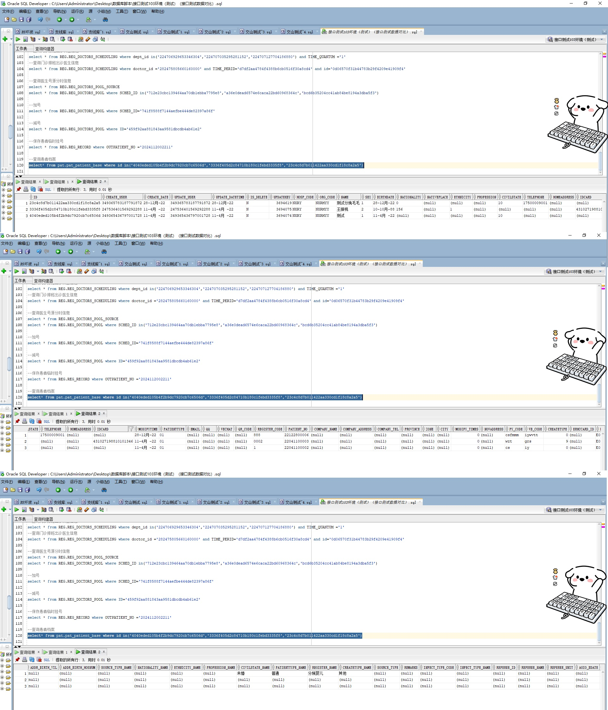

# 领域服务/基础领域 - 查询患者档案 - 查询患者档案 正向用例
## 请求参数：
``` json
{
  "pageSize": 3,
  "pageIndex": 1,
  "orgCode": "NXRMYY",
  "sortOrder": "0"
}
```
## 返回参数：
``` json
{
    "exception": null,
    "apiCode": null,
    "data": {
        "list": [
            {
                "isDelete": "N",
                "createDate": "2022-04-11 09:09:22",
                "updateDate": null,
                "id": "4040eded105b4f2b9dc7920cb7c6506d",
                "updateDatetime": null,
                "updatekey": 3694074,
                "hospCode": "NXRY",
                "orgCode": "NXRMYY",
                "name": "测试",
                "sex": "1",
                "profession": null,
                "email": null,
                "qq": null,
                "wechat": null,
                "qrCode": null,
                "registerCode": "1",
                "patientNo": "22041100002",
                "companyAddress": null,
                "province": null,
                "zone": null,
                "city": null,
                "modifyTimes": 0,
                "nowAddress": null,
                "pyCode": "cs",
                "wbCode": "iy",
                "createType": 0,
                "erhcCardId": null,
                "empiId": "E000004325",
                "idCardSub": null,
                "indexNo": null,
                "defaultBit": null,
                "addrNativeHosNum": null,
                "addrNowHosNum": null,
                "addrBirthHosNum": null,
                "sourceTypeName": null,
                "ethnicityName": null,
                "professionName": null,
                "civilStateName": null,
                "registerName": null,
                "createTypeName": null,
                "sourceType": null,
                "remarks": null,
                "initInTimes": null,
                "infectTypeCode": null,
                "infectTypeName": null,
                "aboCode": null,
                "aboName": null,
                "rhCode": null,
                "rhName": null,
                "refereeId": null,
                "refereeName": null,
                "refereeUnit": null,
                "agioBdate": null,
                "agioEdate": null,
                "cardCenterType": "0",
                "deathBit": null,
                "deathTime": null,
                "patColor": null,
                "age": "2岁7月",
                "accountAddress": "nullnullnullnullnullnull",
                "birthAddress": "nullnullnullnullnullnull",
                "birthAddressZipCode": null,
                "educationName": null,
                "education": null,
                "marriageName": null,
                "nationName": null,
                "patientTypeName": null,
                "realNameCertification": null,
                "sexName": null,
                "patientCards": null,
                "patientCertificats": null,
                "patientContacts": null,
                "createUserId": "349365436797001728",
                "updateUserId": "349365436797001728",
                "birthday": "2022-04-11 09:09:19",
                "country": null,
                "listNative": null,
                "nation": null,
                "marriage": "10",
                "mobile": null,
                "address": null,
                "idCard": null,
                "patientType": "01",
                "company": null,
                "companyTelphone": null,
                "accountAddressProvince": null,
                "accountAddressCity": null,
                "accountAddressCounty": null,
                "accountAddressTown": null,
                "addressProvince": null,
                "addressCity": null,
                "addressCounty": null,
                "addressTown": null,
                "birthAddressProvince": null,
                "birthAddressCity": null,
                "birthAddressCounty": null,
                "birthAddressTown": null,
                "addressZipCode": null,
                "accountAddressZipCode": null,
                "accountAddressVillage": null,
                "addressVillage": null,
                "birthAddressVillage": null,
                "countryName": null
            },
            {
                "isDelete": "N",
                "createDate": "2022-04-11 17:02:30",
                "updateDate": null,
                "id": "3336f405d2c84710b180c1febd3335f8",
                "updateDatetime": null,
                "updatekey": 3694075,
                "hospCode": "NXRY",
                "orgCode": "NXRMYY",
                "name": "王振桃",
                "sex": "2",
                "profession": null,
                "email": null,
                "qq": null,
                "wechat": null,
                "qrCode": null,
                "registerCode": "0002",
                "patientNo": "22041100003",
                "companyAddress": null,
                "province": null,
                "zone": null,
                "city": null,
                "modifyTimes": 0,
                "nowAddress": null,
                "pyCode": "wzt",
                "wbCode": "grs",
                "createType": 9,
                "erhcCardId": null,
                "empiId": "E000004350",
                "idCardSub": null,
                "indexNo": null,
                "defaultBit": null,
                "addrNativeHosNum": null,
                "addrNowHosNum": null,
                "addrBirthHosNum": null,
                "sourceTypeName": null,
                "ethnicityName": null,
                "professionName": null,
                "civilStateName": null,
                "registerName": null,
                "createTypeName": null,
                "sourceType": null,
                "remarks": null,
                "initInTimes": null,
                "infectTypeCode": null,
                "infectTypeName": null,
                "aboCode": null,
                "aboName": null,
                "rhCode": null,
                "rhName": null,
                "refereeId": null,
                "refereeName": null,
                "refereeUnit": null,
                "agioBdate": null,
                "agioEdate": null,
                "cardCenterType": "0",
                "deathBit": null,
                "deathTime": null,
                "patColor": null,
                "age": "36岁",
                "accountAddress": "nullnullnullnullnullnull",
                "birthAddress": "nullnullnullnullnullnull",
                "birthAddressZipCode": null,
                "educationName": null,
                "education": null,
                "marriageName": null,
                "nationName": null,
                "patientTypeName": null,
                "realNameCertification": null,
                "sexName": null,
                "patientCards": null,
                "patientCertificats": null,
                "patientContacts": null,
                "createUserId": "247536401569292288",
                "updateUserId": "247536401569292288",
                "birthday": "1988-10-10 00:00:00",
                "country": "156",
                "listNative": null,
                "nation": "1",
                "marriage": null,
                "mobile": null,
                "address": null,
                "idCard": "431027198810101346",
                "patientType": "01",
                "company": null,
                "companyTelphone": null,
                "accountAddressProvince": null,
                "accountAddressCity": null,
                "accountAddressCounty": null,
                "accountAddressTown": null,
                "addressProvince": null,
                "addressCity": null,
                "addressCounty": null,
                "addressTown": null,
                "birthAddressProvince": null,
                "birthAddressCity": null,
                "birthAddressCounty": null,
                "birthAddressTown": null,
                "addressZipCode": null,
                "accountAddressZipCode": null,
                "accountAddressVillage": null,
                "addressVillage": null,
                "birthAddressVillage": null,
                "countryName": null
            },
            {
                "isDelete": "N",
                "createDate": "2022-12-28 18:32:07",
                "updateDate": null,
                "id": "23c4c8d7b011422aa330cd1f18c8a2a5",
                "updateDatetime": null,
                "updatekey": 3694619,
                "hospCode": "NXRY",
                "orgCode": "NXRMYY",
                "name": "测试分娩毛毛",
                "sex": "1",
                "profession": null,
                "email": null,
                "qq": null,
                "wechat": null,
                "qrCode": null,
                "registerCode": "888",
                "patientNo": "22122800006",
                "companyAddress": null,
                "province": null,
                "zone": null,
                "city": null,
                "modifyTimes": 0,
                "nowAddress": null,
                "pyCode": "csfmmm",
                "wbCode": "iywvtt",
                "createType": 0,
                "erhcCardId": null,
                "empiId": "E000053659",
                "idCardSub": null,
                "indexNo": null,
                "defaultBit": null,
                "addrNativeHosNum": null,
                "addrNowHosNum": null,
                "addrBirthHosNum": null,
                "sourceTypeName": null,
                "ethnicityName": null,
                "professionName": null,
                "civilStateName": "未婚",
                "registerName": "分娩婴儿",
                "createTypeName": "其他",
                "sourceType": null,
                "remarks": null,
                "initInTimes": null,
                "infectTypeCode": null,
                "infectTypeName": null,
                "aboCode": null,
                "aboName": null,
                "rhCode": null,
                "rhName": null,
                "refereeId": null,
                "refereeName": null,
                "refereeUnit": null,
                "agioBdate": null,
                "agioEdate": null,
                "cardCenterType": "0",
                "deathBit": null,
                "deathTime": null,
                "patColor": null,
                "age": "1岁10月",
                "accountAddress": "nullnullnullnullnullnull",
                "birthAddress": "nullnullnullnullnullnull",
                "birthAddressZipCode": null,
                "educationName": null,
                "education": null,
                "marriageName": null,
                "nationName": null,
                "patientTypeName": null,
                "realNameCertification": null,
                "sexName": null,
                "patientCards": null,
                "patientCertificats": null,
                "patientContacts": null,
                "createUserId": "349365783187791872",
                "updateUserId": "349365783187791872",
                "birthday": "2022-12-28 18:32:00",
                "country": "0",
                "listNative": null,
                "nation": null,
                "marriage": "10",
                "mobile": "17500009001",
                "address": null,
                "idCard": null,
                "patientType": "01",
                "company": null,
                "companyTelphone": null,
                "accountAddressProvince": null,
                "accountAddressCity": null,
                "accountAddressCounty": null,
                "accountAddressTown": null,
                "addressProvince": null,
                "addressCity": null,
                "addressCounty": null,
                "addressTown": null,
                "birthAddressProvince": null,
                "birthAddressCity": null,
                "birthAddressCounty": null,
                "birthAddressTown": null,
                "addressZipCode": null,
                "accountAddressZipCode": null,
                "accountAddressVillage": null,
                "addressVillage": null,
                "birthAddressVillage": null,
                "countryName": null
            }
        ],
        "totalCount": 4130,
        "pageSize": 3,
        "pageNo": 1,
        "pageCount": 1377
    },
    "Code": 200,
    "Message": "操作成功"
}
```
## 数据校验：



# 领域服务/基础领域 - 查询患者档案 - 必填校验-[orgCode]为空
## 请求参数：
``` json
{
  "pageSize": 3,
  "cardNo": "2024102100002",
  "pageIndex": 1,
  "orgCode": "",
  "sortOrder": "0"
}
```
## 返回参数：
``` json
{
  "exception": null,
  "apiCode": null,
  "data": null,
  "Code": 1,
  "Message": "医院编码不能为空"
}
```
# 领域服务/基础领域 - 查询患者档案 - 必填校验-[pageIndex]为空
## 请求参数：
``` json
{
  "pageSize": 3,
  "cardNo": "2024102100002",
  "pageIndex": null,
  "orgCode": "NXRMYY",
  "sortOrder": "0"
}
```
## 返回参数：
``` json
{
  "exception": null,
  "apiCode": null,
  "data": null,
  "Code": 1,
  "Message": "页码不能为空"
}
```
# 领域服务/基础领域 - 查询患者档案 - 必填校验-[pageSize]为空
## 请求参数：
``` json
{
  "pageSize": null,
  "cardNo": "2024102100002",
  "pageIndex": 1,
  "orgCode": "NXRMYY",
  "sortOrder": "0"
}
```
## 返回参数：
``` json
{
  "exception": null,
  "apiCode": null,
  "data": null,
  "Code": 1,
  "Message": "每页显示条数不能为空"
}
```
# 领域服务/基础领域 - 查询患者档案 - 类型校验-[pageIndex]类型错误
## 请求参数：
``` json
{
  "pageSize": 3,
  "cardNo": "2024102100002",
  "pageIndex": "abc",
  "orgCode": "NXRMYY",
  "sortOrder": "0"
}
```
## 返回参数：
``` json
{
  "exception": null,
  "apiCode": null,
  "data": null,
  "Code": 1,
  "Message": "请求参数错误"
}
```
# 领域服务/基础领域 - 查询患者档案 - 类型校验-[pageSize]类型错误
## 请求参数：
``` json
{
  "pageSize": "abc",
  "cardNo": "2024102100002",
  "pageIndex": 1,
  "orgCode": "NXRMYY",
  "sortOrder": "0"
}
```
## 返回参数：
``` json
{
  "exception": null,
  "apiCode": null,
  "data": null,
  "Code": 1,
  "Message": "请求参数错误"
}
```
# 领域服务/基础领域 - 查询患者档案 - 依赖用例-[orgCode]赋值为依赖用例测试值
## 请求参数：
``` json
{
  "pageSize": 3,
  "cardNo": "2024102100002",
  "pageIndex": 1,
  "orgCode": "依赖用例测试值",
  "sortOrder": "0"
}
```
## 返回参数：
``` json
{
  "exception": null,
  "apiCode": null,
  "data": {
    "list": [],
    "totalCount": 0,
    "pageSize": 3,
    "pageNo": 1,
    "pageCount": 0
  },
  "Code": 200,
  "Message": "操作成功"
}
```