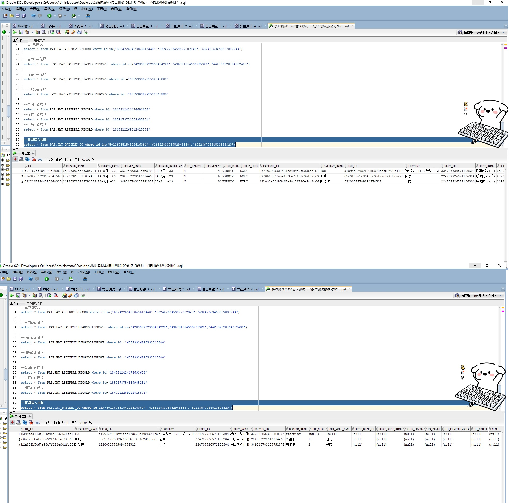

# 领域服务/基础领域 - 查询病人去向 - 查询病人去向 正向用例
## 请求参数：
``` json
{
  "pageSize": 3,
  "pageIndex": 1,
  "orgCode": "NXRMYY"
}
```
## 返回参数：
``` json
{
    "exception": null,
    "apiCode": null,
    "data": {
        "list": [
            {
                "content": "转介科室(120急救中心)",
                "createDate": "2022-05-14 09:24:04",
                "createUserId": "332082823623368704",
                "deptId": "224707726571106304",
                "deptName": "呼吸内科(门)",
                "doctorId": "332082823623368704",
                "doctorName": "xiaoming",
                "hospCode": "NXRY",
                "id": "50116765154102616064",
                "nextDeptId": null,
                "nextDeptName": null,
                "orgCode": "NXRMYY",
                "outMode": null,
                "outModeName": null,
                "patientId": "b8278299aaa142f684c95a50a2638fc1",
                "riskLevel": null,
                "updateDate": "2022-05-14 09:24:04",
                "updateUserId": "332082823623368704",
                "visitId": "a159439298ef4edc87d635b79eb641fa",
                "visitNo": null,
                "visitType": null
            },
            {
                "content": "回家",
                "createDate": "2023-03-14 17:12:29",
                "createUserId": "20200327091601445",
                "deptId": "224707726571106304",
                "deptName": "呼吸内科(门)",
                "doctorId": "20200327091601445",
                "doctorName": "CS高静",
                "hospCode": "NXRY",
                "id": "61682283378952941568",
                "nextDeptId": null,
                "nextDeptName": null,
                "orgCode": "NXRMYY",
                "outMode": "1",
                "outModeName": "治愈",
                "patientId": "373060ac206b4fa3ba77f91e9af82569",
                "riskLevel": null,
                "updateDate": "2023-03-14 17:12:29",
                "updateUserId": "20200327091601445",
                "visitId": "c5e9f0aa5c83485e9bf72cfe2d8eaee1",
                "visitNo": null,
                "visitType": null
            },
            {
                "content": "住院",
                "createDate": "2023-03-28 09:28:51",
                "createUserId": "349365783187791872",
                "deptId": "224707726571106304",
                "deptName": "呼吸内科(门)",
                "doctorId": "349365783187791872",
                "doctorName": "测试护士",
                "hospCode": "NXRY",
                "id": "62223677444513848320",
                "nextDeptId": null,
                "nextDeptName": null,
                "orgCode": "NXRMYY",
                "outMode": "2",
                "outModeName": "好转",
                "patientId": "62b0b2a801b5467a98c7f226ed4dfc06",
                "riskLevel": null,
                "updateDate": "2023-03-28 09:28:51",
                "updateUserId": "349365783187791872",
                "visitId": "62200527789894774512",
                "visitNo": null,
                "visitType": null
            }
        ],
        "totalCount": 108,
        "pageSize": 3,
        "pageNo": 1,
        "pageCount": 36
    },
    "Code": 200,
    "Message": "操作成功"
}
```
## 数据校验：



# 领域服务/基础领域 - 查询病人去向 - 必填校验-[orgCode]为空
## 请求参数：
``` json
{
  "pageSize": 3,
  "pageIndex": 1,
  "orgCode": ""
}
```
## 返回参数：
``` json
{
  "exception": null,
  "apiCode": null,
  "data": null,
  "Code": 1,
  "Message": "医院编码不能为空"
}
```
# 领域服务/基础领域 - 查询病人去向 - 必填校验-[pageIndex]为空
## 请求参数：
``` json
{
  "pageSize": 3,
  "pageIndex": null,
  "orgCode": "NXRMYY"
}
```
## 返回参数：
``` json
{
  "exception": null,
  "apiCode": null,
  "data": null,
  "Code": 1,
  "Message": "页码不能为空"
}
```
# 领域服务/基础领域 - 查询病人去向 - 必填校验-[pageSize]为空
## 请求参数：
``` json
{
  "pageSize": null,
  "pageIndex": 1,
  "orgCode": "NXRMYY"
}
```
## 返回参数：
``` json
{
  "exception": null,
  "apiCode": null,
  "data": null,
  "Code": 1,
  "Message": "每页显示条数不能为空"
}
```
# 领域服务/基础领域 - 查询病人去向 - 类型校验-[pageIndex]类型错误
## 请求参数：
``` json
{
  "pageSize": 3,
  "pageIndex": "abc",
  "orgCode": "NXRMYY"
}
```
## 返回参数：
``` json
{
  "exception": null,
  "apiCode": null,
  "data": null,
  "Code": 1,
  "Message": "请求参数错误"
}
```
# 领域服务/基础领域 - 查询病人去向 - 类型校验-[pageSize]类型错误
## 请求参数：
``` json
{
  "pageSize": "abc",
  "pageIndex": 1,
  "orgCode": "NXRMYY"
}
```
## 返回参数：
``` json
{
  "exception": null,
  "apiCode": null,
  "data": null,
  "Code": 1,
  "Message": "请求参数错误"
}
```
# 领域服务/基础领域 - 查询病人去向 - 依赖用例-[orgCode]赋值为依赖用例测试值
## 请求参数：
``` json
{
  "pageSize": 3,
  "pageIndex": 1,
  "orgCode": "依赖用例测试值"
}
```
## 返回参数：
``` json
{
  "exception": null,
  "apiCode": null,
  "data": {
    "list": [],
    "totalCount": 0,
    "pageSize": 10,
    "pageNo": 1,
    "pageCount": 1
  },
  "Code": 200,
  "Message": "操作成功"
}
```