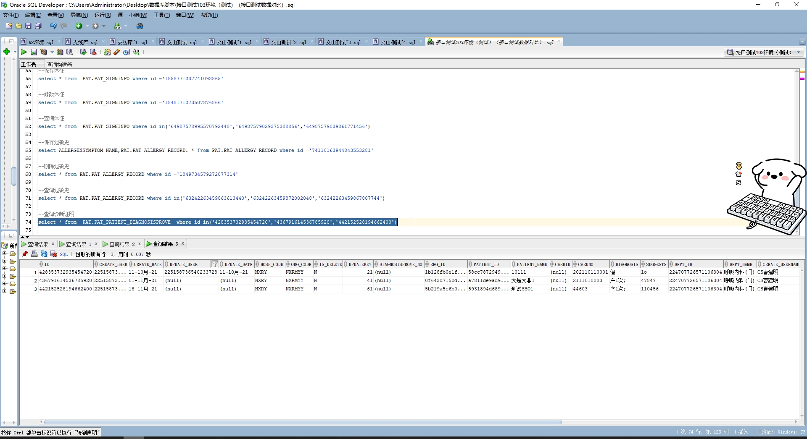

# 领域服务/基础领域 - 查询诊断证明 - 查询诊断证明 正向用例
## 请求参数：
``` json
{
  "pageSize": 3,
  "pageIndex": 1,
  "orgCode": "NXRMYY"
}
```
## 返回参数：
``` json
{
  "exception": null,
  "apiCode": null,
  "data": {
    "list": [
      {
        "id": "428353732935454720",
        "cardId": null,
        "cardNo": "202110110001",
        "createDate": "2021-10-11 10:54:18",
        "createUserId": "225158736540233728",
        "createUserName": "CS曹建明",
        "deptId": "224707726571106304",
        "deptName": "呼吸内科(门)",
        "diagnosis": "僵",
        "diagnosisProveNo": null,
        "hospCode": "NXRY",
        "idCard": "432522199310101010",
        "name": "10111",
        "orgCode": "NXRMYY",
        "patientId": "58cc7872949348ab92942037ecec1d16",
        "suggests": "lo",
        "updateDate": "2021-10-11 10:54:21",
        "updateUserId": "225158736540233728",
        "updateUserName": "CS曹建明",
        "visitDate": "2021-10-11 10:53:18",
        "visitId": "1b128fb0e1f04a618b24458ceeeff0a4",
        "visitNo": "2021101100003",
        "visitType": null,
        "presentHistory": null,
        "telphone": null,
        "homeAddress": null
      },
      {
        "id": "436791614536785920",
        "cardId": null,
        "cardNo": "2111010003",
        "createDate": "2021-11-01 15:57:52",
        "createUserId": "225158736540233728",
        "createUserName": "CS曹建明",
        "deptId": "224707726571106304",
        "deptName": "呼吸内科(门)",
        "diagnosis": "产1次;",
        "diagnosisProveNo": null,
        "hospCode": "NXRY",
        "idCard": "432522199310101015",
        "name": "大是大非1",
        "orgCode": "NXRMYY",
        "patientId": "a7811de9ad954ab7a24b1b40fc0461d4",
        "suggests": "47847",
        "updateDate": null,
        "updateUserId": null,
        "updateUserName": null,
        "visitDate": "2021-11-01 15:41:43",
        "visitId": "0f643d715bdb4745a74802ab0b2480b5",
        "visitNo": "2021110100004",
        "visitType": null,
        "presentHistory": null,
        "telphone": null,
        "homeAddress": null
      },
      {
        "id": "442152528194662400",
        "cardId": null,
        "cardNo": "44603",
        "createDate": "2021-11-18 14:22:07",
        "createUserId": "225158736540233728",
        "createUserName": "CS曹建明",
        "deptId": "224707726571106304",
        "deptName": "呼吸内科(门)",
        "diagnosis": "产1次;",
        "diagnosisProveNo": null,
        "hospCode": "NXRY",
        "idCard": "432521199802050203",
        "name": "测试SSO1",
        "orgCode": "NXRMYY",
        "patientId": "5931894d689f4a36be94648df6ecaa7a",
        "suggests": "110456",
        "updateDate": null,
        "updateUserId": null,
        "updateUserName": null,
        "visitDate": "2021-11-18 14:11:58",
        "visitId": "5b219a5c6b074719bbfacb886cc37904",
        "visitNo": "2021111800004",
        "visitType": null,
        "presentHistory": null,
        "telphone": null,
        "homeAddress": null
      }
    ],
    "totalCount": 255,
    "pageSize": 3,
    "pageNo": 1,
    "pageCount": 85
  },
  "Code": 200,
  "Message": "操作成功"
}
```
## 数据校验：



# 领域服务/基础领域 - 查询诊断证明 - 必填校验-[orgCode]为空
## 请求参数：
``` json
{
  "pageSize": 3,
  "pageIndex": 1,
  "orgCode": ""
}
```
## 返回参数：
``` json
{
  "exception": null,
  "apiCode": null,
  "data": null,
  "Code": 1,
  "Message": "医院编码不能为空"
}
```
# 领域服务/基础领域 - 查询诊断证明 - 必填校验-[pageIndex]为空
## 请求参数：
``` json
{
  "pageSize": 3,
  "pageIndex": null,
  "orgCode": "NXRMYY"
}
```
## 返回参数：
``` json
{
  "exception": null,
  "apiCode": null,
  "data": null,
  "Code": 1,
  "Message": "页码不能为空"
}
```
# 领域服务/基础领域 - 查询诊断证明 - 必填校验-[pageSize]为空
## 请求参数：
``` json
{
  "pageSize": null,
  "pageIndex": 1,
  "orgCode": "NXRMYY"
}
```
## 返回参数：
``` json
{
  "exception": null,
  "apiCode": null,
  "data": null,
  "Code": 1,
  "Message": "每页显示条数不能为空"
}
```
# 领域服务/基础领域 - 查询诊断证明 - 类型校验-[pageIndex]类型错误
## 请求参数：
``` json
{
  "pageSize": 3,
  "pageIndex": "abc",
  "orgCode": "NXRMYY"
}
```
## 返回参数：
``` json
{
  "exception": null,
  "apiCode": null,
  "data": null,
  "Code": 1,
  "Message": "请求参数错误"
}
```
# 领域服务/基础领域 - 查询诊断证明 - 类型校验-[pageSize]类型错误
## 请求参数：
``` json
{
  "pageSize": "abc",
  "pageIndex": 1,
  "orgCode": "NXRMYY"
}
```
## 返回参数：
``` json
{
  "exception": null,
  "apiCode": null,
  "data": null,
  "Code": 1,
  "Message": "请求参数错误"
}
```
# 领域服务/基础领域 - 查询诊断证明 - 依赖用例-[orgCode]赋值为依赖用例测试值
## 请求参数：
``` json
{
  "pageSize": 3,
  "pageIndex": 1,
  "orgCode": "依赖用例测试值"
}
```
## 返回参数：
``` json
{
  "exception": null,
  "apiCode": null,
  "data": {
    "list": [],
    "totalCount": 0,
    "pageSize": 10,
    "pageNo": 1,
    "pageCount": 1
  },
  "Code": 200,
  "Message": "操作成功"
}
```