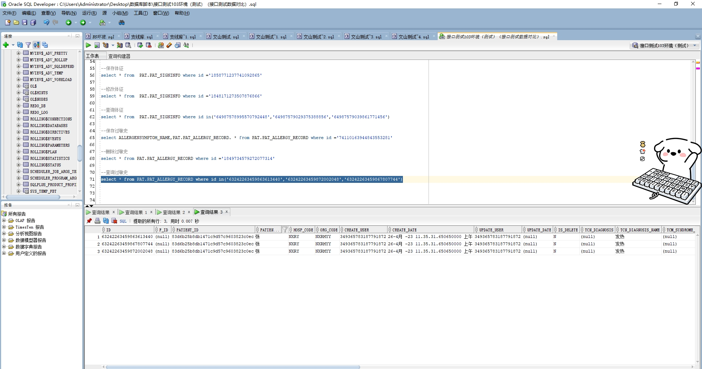

# 领域服务/基础领域 - 查询过敏史 - 查询过敏史 正向用例
## 请求参数：
``` json
{
  "pageSize": 3,
  "pageIndex": 1,
  "orgCode": "NXRMYY"
}
```
## 返回参数：
``` json
{
  "exception": null,
  "apiCode": null,
  "data": {
    "list": [
      {
        "allergenId": null,
        "allergenName": null,
        "allergenSeverity": null,
        "allergenSymptomCode": null,
        "allergenSymptomName": null,
        "allergenType": null,
        "allergyDate": null,
        "correctDate": null,
        "correctUser": null,
        "createDate": "2023-04-26 11:35:31",
        "createUserId": "349365783187791872",
        "drugAllergy": "20200408030221833",
        "drugAllergyName": "5%葡萄糖注射液(25g:500ml)",
        "drugSpecId": "20200408030221808",
        "firstAllergenDate": null,
        "firstAllergenOrg": null,
        "hospCode": "NXRY",
        "id": "63242263459863613440",
        "isCorrect": null,
        "name": "张",
        "orgCode": "NXRMYY",
        "patientId": "83d6b25b8db1471c9d57c9603823c0ec",
        "tcmSyndromeType": null,
        "tcmSyndromeTypeName": "虫寄皮下证",
        "tcnDiagnosis": null,
        "tcnDiagnosisName": "发热",
        "updateDate": null,
        "updateUserId": "349365783187791872",
        "visitId": null,
        "visitType": null
      },
      {
        "allergenId": null,
        "allergenName": null,
        "allergenSeverity": null,
        "allergenSymptomCode": null,
        "allergenSymptomName": null,
        "allergenType": null,
        "allergyDate": null,
        "correctDate": null,
        "correctUser": null,
        "createDate": "2023-04-26 11:35:31",
        "createUserId": "349365783187791872",
        "drugAllergy": "301",
        "drugAllergyName": "植物花粉",
        "drugSpecId": "0",
        "firstAllergenDate": null,
        "firstAllergenOrg": null,
        "hospCode": "NXRY",
        "id": "63242263459872002048",
        "isCorrect": null,
        "name": "张",
        "orgCode": "NXRMYY",
        "patientId": "83d6b25b8db1471c9d57c9603823c0ec",
        "tcmSyndromeType": null,
        "tcmSyndromeTypeName": "虫寄皮下证",
        "tcnDiagnosis": null,
        "tcnDiagnosisName": "发热",
        "updateDate": null,
        "updateUserId": "349365783187791872",
        "visitId": null,
        "visitType": null
      },
      {
        "allergenId": null,
        "allergenName": null,
        "allergenSeverity": null,
        "allergenSymptomCode": null,
        "allergenSymptomName": null,
        "allergenType": null,
        "allergyDate": null,
        "correctDate": null,
        "correctUser": null,
        "createDate": "2023-04-26 11:35:31",
        "createUserId": "349365783187791872",
        "drugAllergy": "203",
        "drugAllergyName": "牛肉",
        "drugSpecId": "0",
        "firstAllergenDate": null,
        "firstAllergenOrg": null,
        "hospCode": "NXRY",
        "id": "63242263459867807744",
        "isCorrect": null,
        "name": "张",
        "orgCode": "NXRMYY",
        "patientId": "83d6b25b8db1471c9d57c9603823c0ec",
        "tcmSyndromeType": null,
        "tcmSyndromeTypeName": "虫寄皮下证",
        "tcnDiagnosis": null,
        "tcnDiagnosisName": "发热",
        "updateDate": null,
        "updateUserId": "349365783187791872",
        "visitId": null,
        "visitType": null
      }
    ],
    "totalCount": 690,
    "pageSize": 3,
    "pageNo": 1,
    "pageCount": 230
  },
  "Code": 200,
  "Message": "操作成功"
}
```
## 数据校验：



# 领域服务/基础领域 - 查询过敏史 - 必填校验-[orgCode]为空
## 请求参数：
``` json
{
  "pageSize": 3,
  "pageIndex": 1,
  "orgCode": ""
}
```
## 返回参数：
``` json
{
  "exception": null,
  "apiCode": null,
  "data": null,
  "Code": 1,
  "Message": "医院编码不能为空"
}
```
# 领域服务/基础领域 - 查询过敏史 - 必填校验-[pageIndex]为空
## 请求参数：
``` json
{
  "pageSize": 3,
  "pageIndex": null,
  "orgCode": "NXRMYY"
}
```
## 返回参数：
``` json
{
  "exception": null,
  "apiCode": null,
  "data": null,
  "Code": 1,
  "Message": "页码不能为空"
}
```
# 领域服务/基础领域 - 查询过敏史 - 必填校验-[pageSize]为空
## 请求参数：
``` json
{
  "pageSize": null,
  "pageIndex": 1,
  "orgCode": "NXRMYY"
}
```
## 返回参数：
``` json
{
  "exception": null,
  "apiCode": null,
  "data": null,
  "Code": 1,
  "Message": "每页显示条数不能为空"
}
```
# 领域服务/基础领域 - 查询过敏史 - 类型校验-[pageIndex]类型错误
## 请求参数：
``` json
{
  "pageSize": 3,
  "pageIndex": "abc",
  "orgCode": "NXRMYY"
}
```
## 返回参数：
``` json
{
  "exception": null,
  "apiCode": null,
  "data": null,
  "Code": 1,
  "Message": "请求参数错误"
}
```
# 领域服务/基础领域 - 查询过敏史 - 类型校验-[pageSize]类型错误
## 请求参数：
``` json
{
  "pageSize": "abc",
  "pageIndex": 1,
  "orgCode": "NXRMYY"
}
```
## 返回参数：
``` json
{
  "exception": null,
  "apiCode": null,
  "data": null,
  "Code": 1,
  "Message": "请求参数错误"
}
```
# 领域服务/基础领域 - 查询过敏史 - 依赖用例-[orgCode]赋值为依赖用例测试值
## 请求参数：
``` json
{
  "pageSize": 3,
  "pageIndex": 1,
  "orgCode": "依赖用例测试值"
}
```
## 返回参数：
``` json
{
  "exception": null,
  "apiCode": null,
  "data": {
    "list": [
      {
        "allergenId": null,
        "allergenName": null,
        "allergenSeverity": null,
        "allergenSymptomCode": null,
        "allergenSymptomName": null,
        "allergenType": "201",
        "allergyDate": null,
        "correctDate": null,
        "correctUser": null,
        "createDate": "2024-11-15 14:13:20",
        "createUserId": "282475805660160000",
        "drugAllergy": null,
        "drugAllergyName": null,
        "drugSpecId": null,
        "firstAllergenDate": "2024-10-16 16:27:52",
        "firstAllergenOrg": "版本测试环境",
        "hospCode": "NXRY",
        "id": "1857305867897372673",
        "isCorrect": null,
        "name": "测试优惠2",
        "orgCode": "依赖用例测试值",
        "patientId": "39542b4771894578a1d6a9ad8568a894",
        "tcmSyndromeType": null,
        "tcmSyndromeTypeName": null,
        "tcnDiagnosis": null,
        "tcnDiagnosisName": null,
        "updateDate": null,
        "updateUserId": null,
        "visitId": null,
        "visitType": null
      },
      {
        "allergenId": null,
        "allergenName": null,
        "allergenSeverity": null,
        "allergenSymptomCode": null,
        "allergenSymptomName": null,
        "allergenType": "201",
        "allergyDate": null,
        "correctDate": null,
        "correctUser": null,
        "createDate": "2024-11-15 15:23:41",
        "createUserId": "282475805660160000",
        "drugAllergy": null,
        "drugAllergyName": null,
        "drugSpecId": null,
        "firstAllergenDate": "2024-10-16 16:27:52",
        "firstAllergenOrg": "版本测试环境",
        "hospCode": "NXRY",
        "id": "1857323571907756034",
        "isCorrect": null,
        "name": "测试优惠2",
        "orgCode": "依赖用例测试值",
        "patientId": "39542b4771894578a1d6a9ad8568a894",
        "tcmSyndromeType": null,
        "tcmSyndromeTypeName": null,
        "tcnDiagnosis": null,
        "tcnDiagnosisName": null,
        "updateDate": null,
        "updateUserId": null,
        "visitId": null,
        "visitType": null
      }
    ],
    "totalCount": 2,
    "pageSize": 3,
    "pageNo": 1,
    "pageCount": 1
  },
  "Code": 200,
  "Message": "操作成功"
}
```