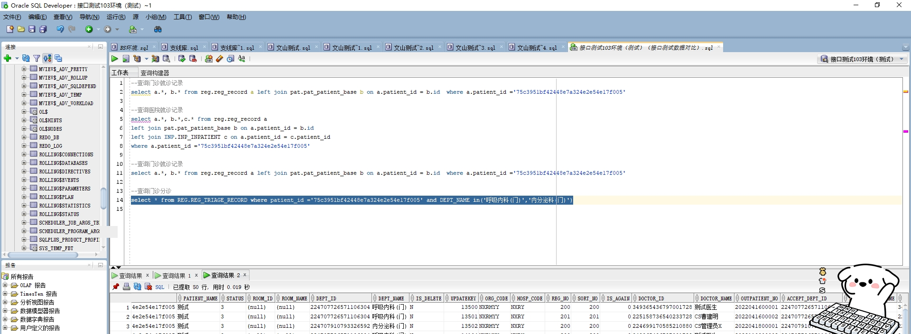

# 领域服务/基础领域 - 查询门诊分诊 - 查询门诊分诊 正向用例
## 请求参数：
``` json
{
  "pageSize": 3,
  "pageIndex": 1,
  "orgCode": "NXRMYY"
}
```
## 返回参数：
``` json
{
  "exception": null,
  "apiCode": null,
  "data": {
    "list": [
      {
        "acceptDate": null,
        "acceptDeptId": "224707726571106304",
        "acceptDeptName": "呼吸内科(门)",
        "acceptDoctorId": "349365436797001728",
        "acceptDoctorName": "测试医生",
        "acceptFlag": 1,
        "age": "25岁",
        "birthday": "1999-01-01 00:00:00",
        "cardNo": "1",
        "createDate": "2022-04-16 14:46:03",
        "createUserId": "349365436797001728",
        "curReferral": null,
        "delayNo": null,
        "deptId": "224707726571106304",
        "deptName": "呼吸内科(门)",
        "doctorId": "349365436797001728",
        "doctorName": "测试医生",
        "hospCode": "NXRY",
        "id": "081a7e380f3841418556cac4dab8e4ba",
        "idCard": "430802199901010123",
        "isAgain": "0",
        "isRevisit": "0",
        "isCrossDayTrig": null,
        "isPriority": null,
        "isReferral": "0",
        "isUpData": null,
        "lastCallDate": null,
        "laterDate": null,
        "orgCode": "NXRMYY",
        "patientId": "75c3951bf42448e7a324e2e54e17f005",
        "patientName": "测试",
        "regDate": "2022-04-16 00:00:00",
        "regNo": 200,
        "repTimes": null,
        "roomId": null,
        "roomName": null,
        "sex": "2",
        "sexName": "女",
        "sortNo": 200,
        "status": "3",
        "triageDate": null,
        "triageRegNo": 0,
        "updateDate": "2022-04-16 14:46:07",
        "updateUserId": "349365436797001728",
        "validTime": "2022-04-23 23:59:59",
        "visitId": "6de96472c5d74d5e9e73dc3d9b9d273a",
        "visitNo": "2022041600001",
        "recieveId": null,
        "regTime": "14:46:02",
        "shiftCode": null,
        "shiftName": null
      },
      {
        "acceptDate": null,
        "acceptDeptId": "224707726571106304",
        "acceptDeptName": "呼吸内科(门)",
        "acceptDoctorId": "225158736540233728",
        "acceptDoctorName": "CS曹建明",
        "acceptFlag": 1,
        "age": "25岁",
        "birthday": "1999-01-01 00:00:00",
        "cardNo": "1",
        "createDate": "2022-04-16 16:30:38",
        "createUserId": "225158736540233728",
        "curReferral": null,
        "delayNo": null,
        "deptId": "224707726571106304",
        "deptName": "呼吸内科(门)",
        "doctorId": "225158736540233728",
        "doctorName": "CS曹建明",
        "hospCode": "NXRY",
        "id": "f2d04d448fce496a8463d70a7f378edf",
        "idCard": "430802199901010123",
        "isAgain": "0",
        "isRevisit": "0",
        "isCrossDayTrig": null,
        "isPriority": null,
        "isReferral": "0",
        "isUpData": null,
        "lastCallDate": null,
        "laterDate": null,
        "orgCode": "NXRMYY",
        "patientId": "75c3951bf42448e7a324e2e54e17f005",
        "patientName": "测试",
        "regDate": "2022-04-16 00:00:00",
        "regNo": 201,
        "repTimes": null,
        "roomId": null,
        "roomName": null,
        "sex": "2",
        "sexName": "女",
        "sortNo": 201,
        "status": "3",
        "triageDate": null,
        "triageRegNo": 0,
        "updateDate": "2022-04-16 16:30:39",
        "updateUserId": "225158736540233728",
        "validTime": "2022-04-23 23:59:59",
        "visitId": "00be59308e064f4eb1531d4e0c723ddf",
        "visitNo": "2022041600002",
        "recieveId": null,
        "regTime": "16:30:37",
        "shiftCode": null,
        "shiftName": null
      },
      {
        "acceptDate": null,
        "acceptDeptId": "224707910793326592",
        "acceptDeptName": "内分泌科(门)",
        "acceptDoctorId": "224699170585210880",
        "acceptDoctorName": "CS管理员X",
        "acceptFlag": 1,
        "age": "25岁",
        "birthday": "1999-01-01 00:00:00",
        "cardNo": "1",
        "createDate": "2022-04-18 18:25:26",
        "createUserId": "224699170585210880",
        "curReferral": null,
        "delayNo": null,
        "deptId": "224707910793326592",
        "deptName": "内分泌科(门)",
        "doctorId": "224699170585210880",
        "doctorName": "CS管理员X",
        "hospCode": "NXRY",
        "id": "878c1bc7bc2546f5b79841ca0b7a3f7a",
        "idCard": "430802199901010123",
        "isAgain": "0",
        "isRevisit": "0",
        "isCrossDayTrig": null,
        "isPriority": null,
        "isReferral": "0",
        "isUpData": null,
        "lastCallDate": null,
        "laterDate": null,
        "orgCode": "NXRMYY",
        "patientId": "75c3951bf42448e7a324e2e54e17f005",
        "patientName": "测试",
        "regDate": "2022-04-18 00:00:00",
        "regNo": 200,
        "repTimes": null,
        "roomId": null,
        "roomName": null,
        "sex": "2",
        "sexName": "女",
        "sortNo": 200,
        "status": "3",
        "triageDate": null,
        "triageRegNo": 0,
        "updateDate": "2022-04-18 18:25:27",
        "updateUserId": "224699170585210880",
        "validTime": "2022-04-25 23:59:59",
        "visitId": "bc72225bb43b4fe4a541abfa93d372e5",
        "visitNo": "2022041800001",
        "recieveId": null,
        "regTime": "18:25:25",
        "shiftCode": null,
        "shiftName": null
      }
    ],
    "totalCount": 5079,
    "pageSize": 3,
    "pageNo": 1,
    "pageCount": 1693
  },
  "Code": 200,
  "Message": "操作成功"
}
```
## 数据校验：



# 领域服务/基础领域 - 查询门诊分诊 - 必填校验-[orgCode]为空
## 请求参数：
``` json
{
  "pageSize": 3,
  "pageIndex": 1,
  "orgCode": ""
}
```
## 返回参数：
``` json
{
  "exception": null,
  "apiCode": null,
  "data": null,
  "Code": 1,
  "Message": "医院编码不能为空"
}
```
# 领域服务/基础领域 - 查询门诊分诊 - 必填校验-[pageIndex]为空
## 请求参数：
``` json
{
  "pageSize": 3,
  "pageIndex": null,
  "orgCode": "NXRMYY"
}
```
## 返回参数：
``` json
{
  "exception": null,
  "apiCode": null,
  "data": null,
  "Code": 1,
  "Message": "页码不能为空"
}
```
# 领域服务/基础领域 - 查询门诊分诊 - 必填校验-[pageSize]为空
## 请求参数：
``` json
{
  "pageSize": null,
  "pageIndex": 1,
  "orgCode": "NXRMYY"
}
```
## 返回参数：
``` json
{
  "exception": null,
  "apiCode": null,
  "data": null,
  "Code": 1,
  "Message": "每页显示条数不能为空"
}
```
# 领域服务/基础领域 - 查询门诊分诊 - 类型校验-[pageIndex]类型错误
## 请求参数：
``` json
{
  "pageSize": 3,
  "pageIndex": "abc",
  "orgCode": "NXRMYY"
}
```
## 返回参数：
``` json
{
  "exception": null,
  "apiCode": null,
  "data": null,
  "Code": 1,
  "Message": "请求参数错误"
}
```
# 领域服务/基础领域 - 查询门诊分诊 - 类型校验-[pageSize]类型错误
## 请求参数：
``` json
{
  "pageSize": "abc",
  "pageIndex": 1,
  "orgCode": "NXRMYY"
}
```
## 返回参数：
``` json
{
  "exception": null,
  "apiCode": null,
  "data": null,
  "Code": 1,
  "Message": "请求参数错误"
}
```
# 领域服务/基础领域 - 查询门诊分诊 - 依赖用例-[orgCode]赋值为依赖用例测试值
## 请求参数：
``` json
{
  "pageSize": 3,
  "pageIndex": 1,
  "orgCode": "依赖用例测试值"
}
```
## 返回参数：
``` json
{
  "exception": null,
  "apiCode": null,
  "data": {
    "list": [],
    "totalCount": 0,
    "pageSize": 3,
    "pageNo": 1,
    "pageCount": 0
  },
  "Code": 200,
  "Message": "操作成功"
}
```