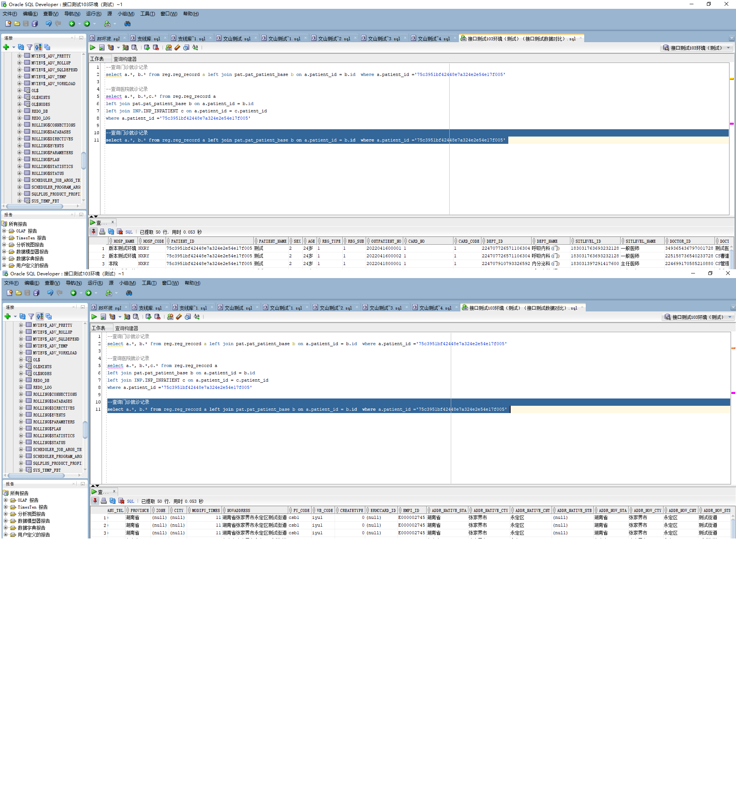

# 领域服务/基础领域 - 查询门诊挂号记录 - 查询门诊挂号记录 正向用例
## 请求参数：
``` json
{
  "pageSize": 3,
  "pageIndex": 1,
  "orgCode": "NXRMYY"
}
```
## 返回参数：
``` json
{
  "exception": null,
  "apiCode": null,
  "data": {
    "list": [
      {
        "aboCode": null,
        "aboName": "—请选择—",
        "accountAddressCity": "张家界市",
        "accountAddressCounty": "永定区",
        "accountAddressProvince": "湖南省",
        "accountAddressTown": null,
        "accountAddressVillage": null,
        "address": null,
        "addressCity": "张家界市",
        "addressCounty": "永定区",
        "addressProvince": "湖南省",
        "addressTown": "测试街道",
        "addressVillage": "湖南省张家界市永定区测试街道",
        "age": "24岁",
        "approveStatus": "0",
        "approveUserDate": null,
        "approveUserId": null,
        "approveUserName": null,
        "attentDateTime": "2022-04-16 14:46:46",
        "attentDeptCode": "224707726571106304",
        "attentDeptName": "呼吸内科(门)",
        "attentDoctorCode": "349365436797001728",
        "attentDoctorName": "测试医生",
        "birthAddress": "202",
        "birthAddressCity": "张家界市",
        "birthAddressCounty": "永定区",
        "birthAddressProvince": "湖南省",
        "birthAddressTown": "测试街道",
        "birthAddressVillage": "BB",
        "birthday": null,
        "cardNo": "1",
        "cardTypeCode": "1",
        "country": "156",
        "countryName": "中国",
        "createDate": "2022-04-16 14:46:02",
        "createUserId": "349365436797001728",
        "deptId": "224707726571106304",
        "deptName": "呼吸内科(门)",
        "doctorId": "349365436797001728",
        "doctorName": "测试医生",
        "empiId": "E000002745",
        "endTime": null,
        "firstAttentDateTime": null,
        "firstAttentDeptCode": null,
        "firstAttentDeptName": null,
        "firstAttentDoctorCode": null,
        "firstAttentDoctorName": null,
        "hospCode": "NXRY",
        "idCard": null,
        "insuranceTypeCode": null,
        "insuranceTypeName": null,
        "isAppoint": "N",
        "isPay": "3",
        "marriage": null,
        "marriageName": null,
        "mobile": "13874572669",
        "nation": null,
        "nationName": null,
        "_Native": null,
        "orgCode": "NXRMYY",
        "patientId": "75c3951bf42448e7a324e2e54e17f005",
        "patientName": "测试",
        "patTypeCode": "01",
        "patTypeName": "普通",
        "profession": null,
        "professionName": null,
        "queueNo": "200",
        "refundStatus": "0",
        "regDate": null,
        "regMoney": "0",
        "regSource": 4,
        "regSubType": null,
        "regType": "1",
        "returnRegDate": null,
        "returnRegUserId": null,
        "returnRegUserName": null,
        "rhCode": null,
        "rhName": "—请选择—",
        "sex": "2",
        "sexName": "女",
        "shiftCode": null,
        "shiftName": null,
        "sourceId": null,
        "startTime": null,
        "updateDate": "2022-04-16 14:46:46",
        "updateUserId": "349365436797001728",
        "visitId": "6de96472c5d74d5e9e73dc3d9b9d273a",
        "visitLevelCode": "183031763693232128",
        "visitLevelName": "一般医师",
        "visitNo": "2022041600001"
      },
      {
        "aboCode": null,
        "aboName": "—请选择—",
        "accountAddressCity": "张家界市",
        "accountAddressCounty": "永定区",
        "accountAddressProvince": "湖南省",
        "accountAddressTown": null,
        "accountAddressVillage": null,
        "address": null,
        "addressCity": "张家界市",
        "addressCounty": "永定区",
        "addressProvince": "湖南省",
        "addressTown": "测试街道",
        "addressVillage": "湖南省张家界市永定区测试街道",
        "age": "24岁",
        "approveStatus": "0",
        "approveUserDate": null,
        "approveUserId": null,
        "approveUserName": null,
        "attentDateTime": "2022-04-16 16:30:39",
        "attentDeptCode": "224707726571106304",
        "attentDeptName": "呼吸内科(门)",
        "attentDoctorCode": "225158736540233728",
        "attentDoctorName": "CS曹建明",
        "birthAddress": "202",
        "birthAddressCity": "张家界市",
        "birthAddressCounty": "永定区",
        "birthAddressProvince": "湖南省",
        "birthAddressTown": "测试街道",
        "birthAddressVillage": "BB",
        "birthday": null,
        "cardNo": "1",
        "cardTypeCode": "1",
        "country": "156",
        "countryName": "中国",
        "createDate": "2022-04-16 16:30:37",
        "createUserId": "225158736540233728",
        "deptId": "224707726571106304",
        "deptName": "呼吸内科(门)",
        "doctorId": "225158736540233728",
        "doctorName": "CS曹建明",
        "empiId": "E000002745",
        "endTime": null,
        "firstAttentDateTime": null,
        "firstAttentDeptCode": null,
        "firstAttentDeptName": null,
        "firstAttentDoctorCode": null,
        "firstAttentDoctorName": null,
        "hospCode": "NXRY",
        "idCard": null,
        "insuranceTypeCode": null,
        "insuranceTypeName": null,
        "isAppoint": "N",
        "isPay": "3",
        "marriage": null,
        "marriageName": null,
        "mobile": "13874572669",
        "nation": null,
        "nationName": null,
        "_Native": null,
        "orgCode": "NXRMYY",
        "patientId": "75c3951bf42448e7a324e2e54e17f005",
        "patientName": "测试",
        "patTypeCode": "01",
        "patTypeName": "普通",
        "profession": null,
        "professionName": null,
        "queueNo": "201",
        "refundStatus": "0",
        "regDate": null,
        "regMoney": "0",
        "regSource": 4,
        "regSubType": null,
        "regType": "1",
        "returnRegDate": null,
        "returnRegUserId": null,
        "returnRegUserName": null,
        "rhCode": null,
        "rhName": "—请选择—",
        "sex": "2",
        "sexName": "女",
        "shiftCode": null,
        "shiftName": null,
        "sourceId": null,
        "startTime": null,
        "updateDate": "2022-04-16 16:30:39",
        "updateUserId": "225158736540233728",
        "visitId": "00be59308e064f4eb1531d4e0c723ddf",
        "visitLevelCode": "183031763693232128",
        "visitLevelName": "一般医师",
        "visitNo": "2022041600002"
      },
      {
        "aboCode": null,
        "aboName": "—请选择—",
        "accountAddressCity": "张家界市",
        "accountAddressCounty": "永定区",
        "accountAddressProvince": "湖南省",
        "accountAddressTown": null,
        "accountAddressVillage": null,
        "address": null,
        "addressCity": "张家界市",
        "addressCounty": "永定区",
        "addressProvince": "湖南省",
        "addressTown": "测试街道",
        "addressVillage": "湖南省张家界市永定区测试街道",
        "age": "24岁",
        "approveStatus": "0",
        "approveUserDate": null,
        "approveUserId": null,
        "approveUserName": null,
        "attentDateTime": "2022-04-18 18:25:27",
        "attentDeptCode": "224707910793326592",
        "attentDeptName": "内分泌科(门)",
        "attentDoctorCode": "224699170585210880",
        "attentDoctorName": "CS管理员X",
        "birthAddress": "202",
        "birthAddressCity": "张家界市",
        "birthAddressCounty": "永定区",
        "birthAddressProvince": "湖南省",
        "birthAddressTown": "测试街道",
        "birthAddressVillage": "BB",
        "birthday": null,
        "cardNo": "1",
        "cardTypeCode": "1",
        "country": "156",
        "countryName": "中国",
        "createDate": "2022-04-18 18:25:25",
        "createUserId": "224699170585210880",
        "deptId": "224707910793326592",
        "deptName": "内分泌科(门)",
        "doctorId": "224699170585210880",
        "doctorName": "CS管理员X",
        "empiId": "E000002745",
        "endTime": null,
        "firstAttentDateTime": null,
        "firstAttentDeptCode": null,
        "firstAttentDeptName": null,
        "firstAttentDoctorCode": null,
        "firstAttentDoctorName": null,
        "hospCode": "NXRY",
        "idCard": null,
        "insuranceTypeCode": null,
        "insuranceTypeName": null,
        "isAppoint": "N",
        "isPay": "3",
        "marriage": null,
        "marriageName": null,
        "mobile": "13874572669",
        "nation": null,
        "nationName": null,
        "_Native": null,
        "orgCode": "NXRMYY",
        "patientId": "75c3951bf42448e7a324e2e54e17f005",
        "patientName": "测试",
        "patTypeCode": "01",
        "patTypeName": "普通",
        "profession": null,
        "professionName": null,
        "queueNo": "200",
        "refundStatus": "0",
        "regDate": null,
        "regMoney": "0",
        "regSource": 4,
        "regSubType": null,
        "regType": "1",
        "returnRegDate": null,
        "returnRegUserId": null,
        "returnRegUserName": null,
        "rhCode": null,
        "rhName": "—请选择—",
        "sex": "2",
        "sexName": "女",
        "shiftCode": null,
        "shiftName": null,
        "sourceId": null,
        "startTime": null,
        "updateDate": "2022-04-18 18:25:27",
        "updateUserId": "224699170585210880",
        "visitId": "bc72225bb43b4fe4a541abfa93d372e5",
        "visitLevelCode": "183031397291417600",
        "visitLevelName": "主任医师",
        "visitNo": "2022041800001"
      }
    ],
    "totalCount": 5182,
    "pageSize": 3,
    "pageNo": 1,
    "pageCount": 1728
  },
  "Code": 200,
  "Message": "操作成功"
}
```
## 数据校验：



# 领域服务/基础领域 - 查询门诊挂号记录 - 必填校验-[orgCode]为空
## 请求参数：
``` json
{
  "pageSize": 3,
  "pageIndex": 1,
  "orgCode": ""
}
```
## 返回参数：
``` json
{
  "exception": null,
  "apiCode": null,
  "data": null,
  "Code": 1,
  "Message": "医院编码不能为空"
}
```
# 领域服务/基础领域 - 查询门诊挂号记录 - 必填校验-[pageIndex]为空
## 请求参数：
``` json
{
  "pageSize": 3,
  "pageIndex": null,
  "orgCode": "NXRMYY"
}
```
## 返回参数：
``` json
{
  "exception": null,
  "apiCode": null,
  "data": null,
  "Code": 1,
  "Message": "页码不能为空"
}
```
# 领域服务/基础领域 - 查询门诊挂号记录 - 必填校验-[pageSize]为空
## 请求参数：
``` json
{
  "pageSize": null,
  "pageIndex": 1,
  "orgCode": "NXRMYY"
}
```
## 返回参数：
``` json
{
  "exception": null,
  "apiCode": null,
  "data": null,
  "Code": 1,
  "Message": "每页显示条数不能为空"
}
```
# 领域服务/基础领域 - 查询门诊挂号记录 - 类型校验-[pageIndex]类型错误
## 请求参数：
``` json
{
  "pageSize": 3,
  "pageIndex": "abc",
  "orgCode": "NXRMYY"
}
```
## 返回参数：
``` json
{
  "exception": null,
  "apiCode": null,
  "data": null,
  "Code": 1,
  "Message": "请求参数错误"
}
```
# 领域服务/基础领域 - 查询门诊挂号记录 - 类型校验-[pageSize]类型错误
## 请求参数：
``` json
{
  "pageSize": "abc",
  "pageIndex": 1,
  "orgCode": "NXRMYY"
}
```
## 返回参数：
``` json
{
  "exception": null,
  "apiCode": null,
  "data": null,
  "Code": 1,
  "Message": "请求参数错误"
}
```
# 领域服务/基础领域 - 查询门诊挂号记录 - 依赖用例-[orgCode]赋值为依赖用例测试值
## 请求参数：
``` json
{
  "pageSize": 3,
  "pageIndex": 1,
  "orgCode": "依赖用例测试值"
}
```
## 返回参数：
``` json
{
  "exception": null,
  "apiCode": null,
  "data": {
    "list": [],
    "totalCount": 0,
    "pageSize": 3,
    "pageNo": 1,
    "pageCount": 0
  },
  "Code": 200,
  "Message": "操作成功"
}
```