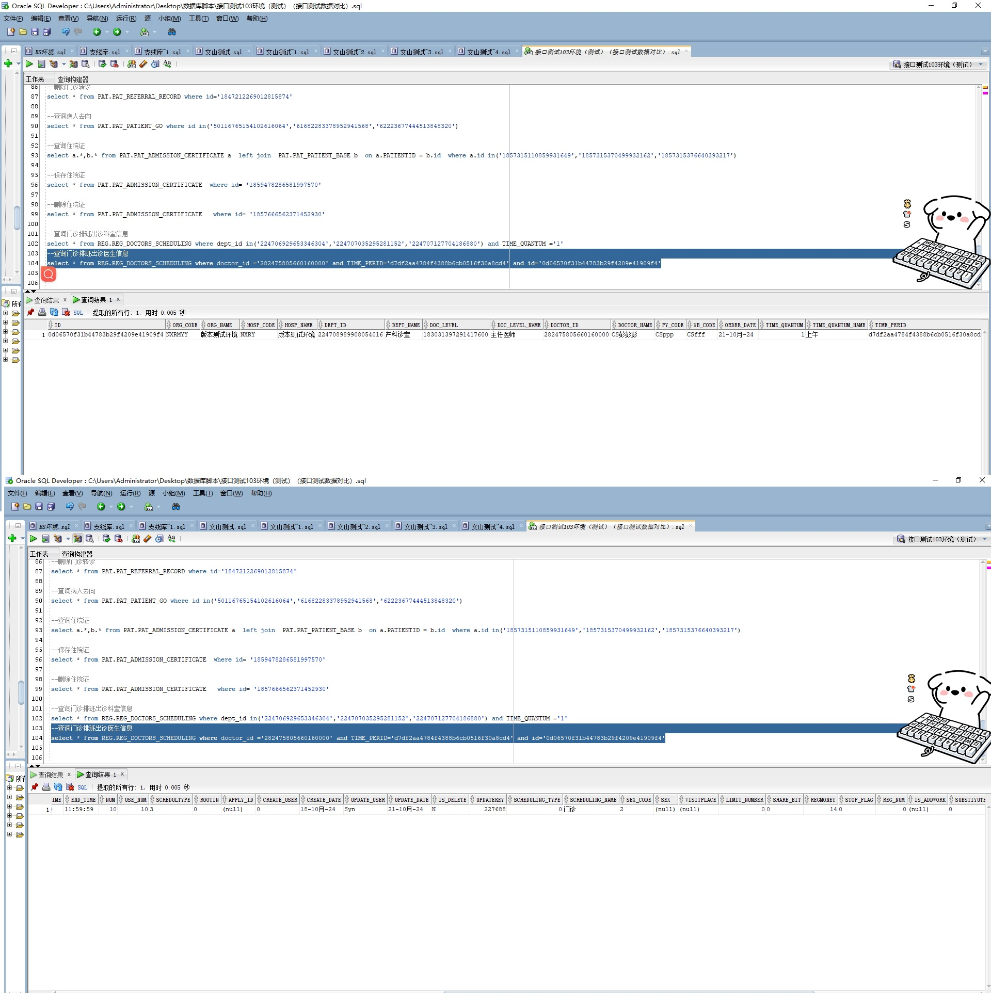

# 领域服务/基础领域 - 查询门诊排班出诊医生信息 - 查询门诊排班出诊医生信息 正向用例
## 请求参数：
``` json
{
  "hospCode": "NXRY",
  "pageSize": 3,
  "doctorIds": [
    "282475805660160000"
  ],
  "startVisitDate": "2024-10-21 00:00:00",
  "pageIndex": 1,
  "orgCode": "NXRMYY",
  "shiftCodes": [
    "1"
  ],
  "endVisitDate": "2024-10-21 23:59:59"
}
```
## 返回参数：
``` json
{
  "exception": null,
  "apiCode": null,
  "data": {
    "list": [
      {
        "orgCode": "NXRMYY",
        "orgName": "版本测试环境",
        "hospCode": "NXRY",
        "hospName": "版本测试环境",
        "deptId": "224708989908054016",
        "deptName": "产科诊室",
        "doctorId": "282475805660160000",
        "doctorName": "CS彭彭彭",
        "pyCode": "CSppp",
        "wbCode": "CSfff",
        "startTime": "08:00:00",
        "endTime": "11:59:59",
        "useNum": 10,
        "schedultype": "3",
        "rootin": "0",
        "applyId": null,
        "updatekey": 227688,
        "sex": null,
        "limitNumber": 0,
        "shareBit": "0",
        "stopFlag": "0",
        "regNum": 0,
        "isAddwork": null,
        "stopReason": null,
        "isVerify": "Y",
        "checkUser": null,
        "checkUsername": null,
        "checkDate": null,
        "freeclinicFlag": "0",
        "stopDate": null,
        "stopUser": null,
        "visitsSort": 99,
        "substiyuteFlag": "0",
        "isTime": "1",
        "otherFee": 0,
        "remainCount": null,
        "status": 1,
        "titleCode": null,
        "titleName": null,
        "idCard": null,
        "scheduleId": "0d06570f31b44783b29f4209e41909f4",
        "visitLevelCode": "183031397291417600",
        "visitLevelName": "主任医师",
        "visitDate": "2024-10-21 00:00:00",
        "shiftCode": 1,
        "shiftName": "上午",
        "timeFrameId": "d7df2aa4784f4388b6cb0516f30a8cd4",
        "totalCount": 10,
        "scheduleType": 0,
        "scheduleTypeName": "门诊",
        "sexLimit": "2",
        "visitPlace": null,
        "regFee": 14,
        "lastUpdateDate": "2024-10-21 12:29:22"
      }
    ],
    "totalCount": 1,
    "pageSize": 3,
    "pageNo": 1,
    "pageCount": 1
  },
  "Code": 200,
  "Message": "操作成功"
}
```
## 数据校验：



# 领域服务/基础领域 - 查询门诊排班出诊医生信息 - 必填校验-[orgCode]为空
## 请求参数：
``` json
{
  "hospCode": "NXRY",
  "pageSize": 3,
  "doctorIds": [
    "282475805660160000"
  ],
  "startVisitDate": "2024-10-21 00:00:00",
  "pageIndex": 1,
  "orgCode": "",
  "shiftCodes": [
    "1"
  ],
  "endVisitDate": "2024-10-21 23:59:59"
}
```
## 返回参数：
``` json
{
  "exception": null,
  "apiCode": null,
  "data": null,
  "Code": 1,
  "Message": "医院编码不能为空"
}
```
# 领域服务/基础领域 - 查询门诊排班出诊医生信息 - 必填校验-[pageIndex]为空
## 请求参数：
``` json
{
  "hospCode": "NXRY",
  "pageSize": 3,
  "doctorIds": [
    "282475805660160000"
  ],
  "startVisitDate": "2024-10-21 00:00:00",
  "pageIndex": null,
  "orgCode": "NXRMYY",
  "shiftCodes": [
    "1"
  ],
  "endVisitDate": "2024-10-21 23:59:59"
}
```
## 返回参数：
``` json
{
  "exception": null,
  "apiCode": null,
  "data": null,
  "Code": 1,
  "Message": "页码不能为空"
}
```
# 领域服务/基础领域 - 查询门诊排班出诊医生信息 - 必填校验-[pageSize]为空
## 请求参数：
``` json
{
  "hospCode": "NXRY",
  "pageSize": null,
  "doctorIds": [
    "282475805660160000"
  ],
  "startVisitDate": "2024-10-21 00:00:00",
  "pageIndex": 1,
  "orgCode": "NXRMYY",
  "shiftCodes": [
    "1"
  ],
  "endVisitDate": "2024-10-21 23:59:59"
}
```
## 返回参数：
``` json
{
  "exception": null,
  "apiCode": null,
  "data": null,
  "Code": 1,
  "Message": "每页显示条数不能为空"
}
```
# 领域服务/基础领域 - 查询门诊排班出诊医生信息 - 类型校验-[pageIndex]类型错误
## 请求参数：
``` json
{
  "hospCode": "NXRY",
  "pageSize": 3,
  "doctorIds": [
    "282475805660160000"
  ],
  "startVisitDate": "2024-10-21 00:00:00",
  "pageIndex": "abc",
  "orgCode": "NXRMYY",
  "shiftCodes": [
    "1"
  ],
  "endVisitDate": "2024-10-21 23:59:59"
}
```
## 返回参数：
``` json
{
  "exception": null,
  "apiCode": null,
  "data": null,
  "Code": 1,
  "Message": "请求参数错误"
}
```
# 领域服务/基础领域 - 查询门诊排班出诊医生信息 - 类型校验-[pageSize]类型错误
## 请求参数：
``` json
{
  "hospCode": "NXRY",
  "pageSize": "abc",
  "doctorIds": [
    "282475805660160000"
  ],
  "startVisitDate": "2024-10-21 00:00:00",
  "pageIndex": 1,
  "orgCode": "NXRMYY",
  "shiftCodes": [
    "1"
  ],
  "endVisitDate": "2024-10-21 23:59:59"
}
```
## 返回参数：
``` json
{
  "exception": null,
  "apiCode": null,
  "data": null,
  "Code": 1,
  "Message": "请求参数错误"
}
```
# 领域服务/基础领域 - 查询门诊排班出诊医生信息 - 依赖用例-[orgCode]赋值为依赖用例测试值
## 请求参数：
``` json
{
  "hospCode": "NXRY",
  "pageSize": 3,
  "doctorIds": [
    "282475805660160000"
  ],
  "startVisitDate": "2024-10-21 00:00:00",
  "pageIndex": 1,
  "orgCode": "依赖用例测试值",
  "shiftCodes": [
    "1"
  ],
  "endVisitDate": "2024-10-21 23:59:59"
}
```
## 返回参数：
``` json
{
  "exception": null,
  "apiCode": null,
  "data": {
    "list": [],
    "totalCount": 0,
    "pageSize": 3,
    "pageNo": 1,
    "pageCount": 0
  },
  "Code": 200,
  "Message": "操作成功"
}
```