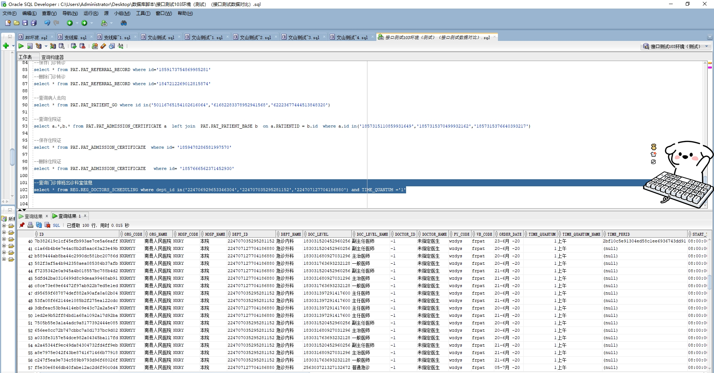

# 领域服务/基础领域 - 查询门诊排班出诊科室信息 - 查询门诊排班出诊科室信息 正向用例
## 请求参数：
``` json
{
  "hospCode": "NXRY",
  "pageIndex": 1,
  "orgCode": "NXRMYY",
  "pageSize": 3
}
```
## 返回参数：
``` json
{
  "exception": null,
  "apiCode": null,
  "data": {
    "list": [
      {
        "orgCode": null,
        "orgName": null,
        "hospCode": null,
        "hospName": null,
        "deptId": "224706929653346304",
        "deptName": "急诊科",
        "doctorId": null,
        "doctorName": null,
        "pyCode": null,
        "wbCode": null,
        "startTime": null,
        "endTime": null,
        "useNum": null,
        "schedultype": null,
        "rootin": null,
        "applyId": null,
        "updatekey": null,
        "sex": null,
        "limitNumber": null,
        "shareBit": null,
        "stopFlag": null,
        "regNum": null,
        "isAddwork": null,
        "stopReason": null,
        "isVerify": null,
        "checkUser": null,
        "checkUsername": null,
        "checkDate": null,
        "freeclinicFlag": null,
        "stopDate": null,
        "stopUser": null,
        "visitsSort": null,
        "substiyuteFlag": null,
        "isTime": "1",
        "otherFee": 0,
        "remainCount": null,
        "status": 1,
        "titleCode": null,
        "titleName": null,
        "idCard": null,
        "scheduleId": null,
        "visitLevelCode": null,
        "visitLevelName": null,
        "visitDate": null,
        "shiftCode": null,
        "shiftName": null,
        "timeFrameId": null,
        "totalCount": null,
        "scheduleType": null,
        "scheduleTypeName": null,
        "sexLimit": null,
        "visitPlace": null,
        "regFee": null,
        "lastUpdateDate": null
      },
      {
        "orgCode": null,
        "orgName": null,
        "hospCode": null,
        "hospName": null,
        "deptId": "224707035295281152",
        "deptName": "急诊内科",
        "doctorId": null,
        "doctorName": null,
        "pyCode": null,
        "wbCode": null,
        "startTime": null,
        "endTime": null,
        "useNum": null,
        "schedultype": null,
        "rootin": null,
        "applyId": null,
        "updatekey": null,
        "sex": null,
        "limitNumber": null,
        "shareBit": null,
        "stopFlag": null,
        "regNum": null,
        "isAddwork": null,
        "stopReason": null,
        "isVerify": null,
        "checkUser": null,
        "checkUsername": null,
        "checkDate": null,
        "freeclinicFlag": null,
        "stopDate": null,
        "stopUser": null,
        "visitsSort": null,
        "substiyuteFlag": null,
        "isTime": "1",
        "otherFee": 0,
        "remainCount": null,
        "status": 1,
        "titleCode": null,
        "titleName": null,
        "idCard": null,
        "scheduleId": null,
        "visitLevelCode": null,
        "visitLevelName": null,
        "visitDate": null,
        "shiftCode": null,
        "shiftName": null,
        "timeFrameId": null,
        "totalCount": null,
        "scheduleType": null,
        "scheduleTypeName": null,
        "sexLimit": null,
        "visitPlace": null,
        "regFee": null,
        "lastUpdateDate": null
      },
      {
        "orgCode": null,
        "orgName": null,
        "hospCode": null,
        "hospName": null,
        "deptId": "224707127704186880",
        "deptName": "急诊外科",
        "doctorId": null,
        "doctorName": null,
        "pyCode": null,
        "wbCode": null,
        "startTime": null,
        "endTime": null,
        "useNum": null,
        "schedultype": null,
        "rootin": null,
        "applyId": null,
        "updatekey": null,
        "sex": null,
        "limitNumber": null,
        "shareBit": null,
        "stopFlag": null,
        "regNum": null,
        "isAddwork": null,
        "stopReason": null,
        "isVerify": null,
        "checkUser": null,
        "checkUsername": null,
        "checkDate": null,
        "freeclinicFlag": null,
        "stopDate": null,
        "stopUser": null,
        "visitsSort": null,
        "substiyuteFlag": null,
        "isTime": "1",
        "otherFee": 0,
        "remainCount": null,
        "status": 1,
        "titleCode": null,
        "titleName": null,
        "idCard": null,
        "scheduleId": null,
        "visitLevelCode": null,
        "visitLevelName": null,
        "visitDate": null,
        "shiftCode": null,
        "shiftName": null,
        "timeFrameId": null,
        "totalCount": null,
        "scheduleType": null,
        "scheduleTypeName": null,
        "sexLimit": null,
        "visitPlace": null,
        "regFee": null,
        "lastUpdateDate": null
      }
    ],
    "totalCount": 44,
    "pageSize": 3,
    "pageNo": 1,
    "pageCount": 15
  },
  "Code": 200,
  "Message": "操作成功"
}
```
## 数据校验：



# 领域服务/基础领域 - 查询门诊排班出诊科室信息 - 必填校验-[orgCode]为空
## 请求参数：
``` json
{
  "hospCode": "NXRY",
  "pageIndex": 1,
  "orgCode": "",
  "pageSize": 3
}
```
## 返回参数：
``` json
{
  "exception": null,
  "apiCode": null,
  "data": null,
  "Code": 1,
  "Message": "医院编码不能为空"
}
```
# 领域服务/基础领域 - 查询门诊排班出诊科室信息 - 必填校验-[pageIndex]为空
## 请求参数：
``` json
{
  "hospCode": "NXRY",
  "pageIndex": null,
  "orgCode": "NXRMYY",
  "pageSize": 3
}
```
## 返回参数：
``` json
{
  "exception": null,
  "apiCode": null,
  "data": null,
  "Code": 1,
  "Message": "页码不能为空"
}
```
# 领域服务/基础领域 - 查询门诊排班出诊科室信息 - 必填校验-[pageSize]为空
## 请求参数：
``` json
{
  "hospCode": "NXRY",
  "pageIndex": 1,
  "orgCode": "NXRMYY",
  "pageSize": null
}
```
## 返回参数：
``` json
{
  "exception": null,
  "apiCode": null,
  "data": null,
  "Code": 1,
  "Message": "每页显示条数不能为空"
}
```
# 领域服务/基础领域 - 查询门诊排班出诊科室信息 - 类型校验-[pageSize]类型错误
## 请求参数：
``` json
{
  "hospCode": "NXRY",
  "pageIndex": 1,
  "orgCode": "NXRMYY",
  "pageSize": "abc"
}
```
## 返回参数：
``` json
{
  "exception": null,
  "apiCode": null,
  "data": null,
  "Code": 1,
  "Message": "请求参数错误"
}
```
# 领域服务/基础领域 - 查询门诊排班出诊科室信息 - 类型校验-[pageIndex]类型错误
## 请求参数：
``` json
{
  "hospCode": "NXRY",
  "pageIndex": "abc",
  "orgCode": "NXRMYY",
  "pageSize": 3
}
```
## 返回参数：
``` json
{
  "exception": null,
  "apiCode": null,
  "data": null,
  "Code": 1,
  "Message": "请求参数错误"
}
```
# 领域服务/基础领域 - 查询门诊排班出诊科室信息 - 依赖用例-[orgCode]赋值为依赖用例测试值
## 请求参数：
``` json
{
  "hospCode": "NXRY",
  "pageIndex": 1,
  "orgCode": "依赖用例测试值",
  "pageSize": 3
}
```
## 返回参数：
``` json
{
  "exception": null,
  "apiCode": null,
  "data": {
    "list": [],
    "totalCount": 0,
    "pageSize": 3,
    "pageNo": 1,
    "pageCount": 0
  },
  "Code": 200,
  "Message": "操作成功"
}
```