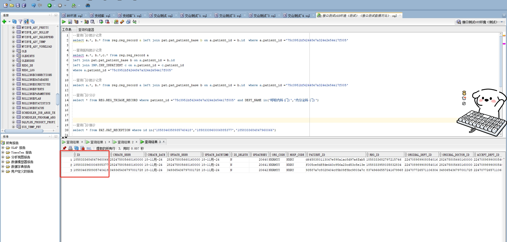

# 领域服务/基础领域 - 查询门诊接诊 - 查询门诊接诊 正向用例
## 请求参数：
``` json
{
  "pageSize": 3,
  "pageIndex": 1,
  "orgCode": "NXRMYY"
}
```
## 返回参数：
``` json
{
    "exception": null,
    "apiCode": null,
    "data": {
        "list": [
            {
                "address": null,
                "age": null,
                "birthday": "1999-12-12 00:00:00",
                "createDate": "2024-11-18 11:07:53",
                "createUserId": "349365436797001728",
                "diagnosisName": null,
                "hospCode": "NXRY",
                "id": "1858346358935740418",
                "idCard": "430421199912121122",
                "isReferral": "0",
                "mobile": "18807425221",
                "orgCode": "NXRMYY",
                "orginalDeptId": "224707726571106304",
                "orginalDeptName": null,
                "orginalDoctorId": "349365436797001728",
                "orginalDoctorName": null,
                "patientId": "93587a7c8028404c85b09f8bc9803a7c",
                "patientName": "与",
                "recieveDate": "2024-11-18 11:07:53",
                "recieveDeptId": "224707726571106304",
                "recieveDeptName": null,
                "recieveDoctorId": "349365436797001728",
                "recieveDoctorName": null,
                "recieveStatus": "3",
                "remarks": null,
                "sex": "2",
                "sexName": null,
                "updateDate": "2024-11-18 14:18:32",
                "updateUserId": "349365436797001728",
                "visitId": "83749666557241679968",
                "visitNo": "2024111800004",
                "visitStatus": 1
            },
            {
                "address": null,
                "age": null,
                "birthday": "1989-02-06 00:00:00",
                "createDate": "2024-11-18 10:18:36",
                "createUserId": "282475805660160000",
                "diagnosisName": null,
                "hospCode": "NXRY",
                "id": "1858333960006885377",
                "idCard": "789456198902065432",
                "isReferral": "0",
                "mobile": "18546467878",
                "orgCode": "NXRMYY",
                "orginalDeptId": "224708989908054016",
                "orginalDeptName": null,
                "orginalDoctorId": "282475805660160000",
                "orginalDoctorName": null,
                "patientId": "f005ce8dffde440c956a23cd53c5e13e",
                "patientName": "柳柳",
                "recieveDate": "2024-11-18 10:18:36",
                "recieveDeptId": "224708989908054016",
                "recieveDeptName": null,
                "recieveDoctorId": "282475805660160000",
                "recieveDoctorName": null,
                "recieveStatus": "1",
                "remarks": null,
                "sex": "1",
                "sexName": null,
                "updateDate": "2024-11-18 15:40:28",
                "updateUserId": "282475805660160000",
                "visitId": "1858333958035832834",
                "visitNo": "2024111800003",
                "visitStatus": 2
            },
            {
                "address": "辅导",
                "age": null,
                "birthday": "1978-05-14 14:01:00",
                "createDate": "2024-11-18 10:17:31",
                "createUserId": "282475805660160000",
                "diagnosisName": null,
                "hospCode": "NXRY",
                "id": "1858333684847960066",
                "idCard": "430815197805141235",
                "isReferral": "0",
                "mobile": null,
                "orgCode": "NXRMYY",
                "orginalDeptId": "224708989908054016",
                "orginalDeptName": null,
                "orginalDoctorId": "282475805660160000",
                "orginalDoctorName": null,
                "patientId": "d6458380113047e898a1ac8d97a6fab5",
                "patientName": "乌乌",
                "recieveDate": "2024-11-18 10:17:31",
                "recieveDeptId": "224708989908054016",
                "recieveDeptName": null,
                "recieveDoctorId": "282475805660160000",
                "recieveDoctorName": null,
                "recieveStatus": "1",
                "remarks": null,
                "sex": "1",
                "sexName": null,
                "updateDate": "2024-11-18 10:21:47",
                "updateUserId": "282475805660160000",
                "visitId": "1858333682797215746",
                "visitNo": "2024111800002",
                "visitStatus": 2
            }
        ],
        "totalCount": 3730,
        "pageSize": 3,
        "pageNo": 1,
        "pageCount": 1244
    },
    "Code": 200,
    "Message": "操作成功"
}
```
## 数据校验：



# 领域服务/基础领域 - 查询门诊接诊 - 必填校验-[orgCode]为空
## 请求参数：
``` json
{
  "pageSize": 3,
  "pageIndex": 1,
  "orgCode": ""
}
```
## 返回参数：
``` json
{
    "exception": null,
    "apiCode": null,
    "data": null,
    "Code": 1,
    "Message": "医院编码不能为空"
}
```
# 领域服务/基础领域 - 查询门诊接诊 - 必填校验-[pageIndex]为空
## 请求参数：
``` json
{
  "pageSize": 3,
  "pageIndex": null,
  "orgCode": "NXRMYY"
}
```
## 返回参数：
``` json
{
    "exception": null,
    "apiCode": null,
    "data": null,
    "Code": 1,
    "Message": "页码不能为空"
}
```
# 领域服务/基础领域 - 查询门诊接诊 - 必填校验-[pageSize]为空
## 请求参数：
``` json
{
  "pageSize": null,
  "pageIndex": 1,
  "orgCode": "NXRMYY"
}
```
## 返回参数：
``` json
{
    "exception": null,
    "apiCode": null,
    "data": null,
    "Code": 1,
    "Message": "每页显示条数不能为空"
}
```
# 领域服务/基础领域 - 查询门诊接诊 - 类型校验-[pageIndex]类型错误
## 请求参数：
``` json
{
  "pageSize": 3,
  "pageIndex": "abc",
  "orgCode": "NXRMYY"
}
```
## 返回参数：
``` json
{
    "exception": null,
    "apiCode": null,
    "data": null,
    "Code": 1,
    "Message": "请求参数错误"
}
```
# 领域服务/基础领域 - 查询门诊接诊 - 类型校验-[pageSize]类型错误
## 请求参数：
``` json
{
  "pageSize": "abc",
  "pageIndex": 1,
  "orgCode": "NXRMYY"
}
```
## 返回参数：
``` json
{
    "exception": null,
    "apiCode": null,
    "data": null,
    "Code": 1,
    "Message": "请求参数错误"
}
```
# 领域服务/基础领域 - 查询门诊接诊 - 依赖用例-[orgCode]赋值为依赖用例测试值
## 请求参数：
``` json
{
  "pageSize": 3,
  "pageIndex": 1,
  "orgCode": "依赖用例测试值"
}
```
## 返回参数：
``` json
{
    "exception": null,
    "apiCode": null,
    "data": {
        "list": [],
        "totalCount": 0,
        "pageSize": 3,
        "pageNo": 1,
        "pageCount": 0
    },
    "Code": 200,
    "Message": "操作成功"
}
```