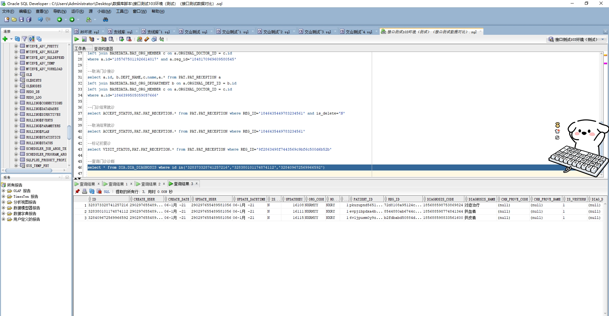

# 领域服务/基础领域 - 查询门诊诊断 - 查询门诊诊断 正向用例
## 请求参数：
``` json
{
  "pageSize": 3,
  "pageIndex": 1,
  "orgCode": "NXRMYY"
}
```
## 返回参数：
``` json
{
  "exception": null,
  "apiCode": null,
  "data": {
    "list": [
      {
        "acceptId": null,
        "checkDateTime": "2021-01-06 11:18:05",
        "checkUserId": "290297655489581056",
        "checkUserName": null,
        "chnProveCode": null,
        "chnProveName": null,
        "createDate": "2021-01-06 11:18:22",
        "createUserId": "290297655489581056",
        "createUserName": "陈收费",
        "deptId": "224719043784765440",
        "deptName": null,
        "diagLevel": "0",
        "diagnosisClassCode": null,
        "diagnosisClassName": null,
        "diagnosisId": "185688598753869824",
        "diagnosisMemo": null,
        "diagnosisName": "对症治疗",
        "diagnosisPrefix": null,
        "diagnosisTypeCode": null,
        "diagnosisTypeName": null,
        "hospCode": "NXRY",
        "icdCode": "185688598753869824",
        "icdName": "对症治疗",
        "id": "328373328741257216",
        "isPrimary": "0",
        "isReport": null,
        "orgCode": "NXRMYY",
        "patientId": "pkuzupnd5651xxsfg10lepxzsgtfljz5",
        "sortNo": 1,
        "state": "1",
        "updateDate": null,
        "updateUserId": "290297655489581056",
        "visitId": "72d8108a95124c449cc33eb2abed2e26",
        "checkSign": "1",
        "insDiagnosisCode": null,
        "insDiagnosisName": null,
        "diagnosisFullName": null
      },
      {
        "acceptId": null,
        "checkDateTime": "2021-01-06 11:44:59",
        "checkUserId": "290297655489581056",
        "checkUserName": null,
        "chnProveCode": null,
        "chnProveName": null,
        "createDate": "2021-01-06 11:45:17",
        "createUserId": "290297655489581056",
        "createUserName": "陈收费",
        "deptId": "224719043784765440",
        "deptName": null,
        "diagLevel": "0",
        "diagnosisClassCode": null,
        "diagnosisClassName": null,
        "diagnosisId": "185688598774841344",
        "diagnosisMemo": null,
        "diagnosisName": "供血者",
        "diagnosisPrefix": null,
        "diagnosisTypeCode": null,
        "diagnosisTypeName": null,
        "hospCode": "NXRY",
        "icdCode": "185688598774841344",
        "icdName": "供血者",
        "id": "328380101174874112",
        "isPrimary": "0",
        "isReport": null,
        "orgCode": "NXRMYY",
        "patientId": "evpjibpdxa4b3bq57q94s17gorx8tisk",
        "sortNo": 1,
        "state": "1",
        "updateDate": null,
        "updateUserId": "290297655489581056",
        "visitId": "8544880ab6744c93ad08c6b802312f33",
        "checkSign": "1",
        "insDiagnosisCode": null,
        "insDiagnosisName": null,
        "diagnosisFullName": null
      },
      {
        "acceptId": null,
        "checkDateTime": "2021-01-06 13:42:30",
        "checkUserId": "290297655489581056",
        "checkUserName": null,
        "chnProveCode": null,
        "chnProveName": null,
        "createDate": "2021-01-06 13:42:47",
        "createUserId": "290297655489581056",
        "createUserName": "陈收费",
        "deptId": "224719043784765440",
        "deptName": null,
        "diagLevel": "0",
        "diagnosisClassCode": null,
        "diagnosisClassName": null,
        "diagnosisId": "185688598833561600",
        "diagnosisMemo": null,
        "diagnosisName": "供皮者",
        "diagnosisPrefix": null,
        "diagnosisTypeCode": null,
        "diagnosisTypeName": null,
        "hospCode": "NXRY",
        "icdCode": "185688598833561600",
        "icdName": "供皮者",
        "id": "328409672569966592",
        "isPrimary": "0",
        "isReport": null,
        "orgCode": "NXRMYY",
        "patientId": "6v1jpusm0y9z7g1m6t9nyl9bgv6li1zl",
        "sortNo": 1,
        "state": "1",
        "updateDate": null,
        "updateUserId": "290297655489581056",
        "visitId": "b2fdbabd50884d41b4cf8cf682e54d66",
        "checkSign": "1",
        "insDiagnosisCode": null,
        "insDiagnosisName": null,
        "diagnosisFullName": null
      }
    ],
    "totalCount": 5527,
    "pageSize": 3,
    "pageNo": 1,
    "pageCount": 1843
  },
  "Code": 200,
  "Message": "操作成功"
}
```
## 数据校验：



# 领域服务/基础领域 - 查询门诊诊断 - 必填校验-[orgCode]为空
## 请求参数：
``` json
{
  "pageSize": 3,
  "pageIndex": 1,
  "orgCode": ""
}
```
## 返回参数：
``` json
{
  "exception": null,
  "apiCode": null,
  "data": null,
  "Code": 1,
  "Message": "医院编码不能为空"
}
```
# 领域服务/基础领域 - 查询门诊诊断 - 必填校验-[pageIndex]为空
## 请求参数：
``` json
{
  "pageSize": 3,
  "pageIndex": null,
  "orgCode": "NXRMYY"
}
```
## 返回参数：
``` json
{
  "exception": null,
  "apiCode": null,
  "data": null,
  "Code": 1,
  "Message": "页码不能为空"
}
```
# 领域服务/基础领域 - 查询门诊诊断 - 必填校验-[pageSize]为空
## 请求参数：
``` json
{
  "pageSize": null,
  "pageIndex": 1,
  "orgCode": "NXRMYY"
}
```
## 返回参数：
``` json
{
  "exception": null,
  "apiCode": null,
  "data": null,
  "Code": 1,
  "Message": "每页显示条数不能为空"
}
```
# 领域服务/基础领域 - 查询门诊诊断 - 类型校验-[pageIndex]类型错误
## 请求参数：
``` json
{
  "pageSize": 3,
  "pageIndex": "abc",
  "orgCode": "NXRMYY"
}
```
## 返回参数：
``` json
{
  "exception": null,
  "apiCode": null,
  "data": null,
  "Code": 1,
  "Message": "请求参数错误"
}
```
# 领域服务/基础领域 - 查询门诊诊断 - 类型校验-[pageSize]类型错误
## 请求参数：
``` json
{
  "pageSize": "abc",
  "pageIndex": 1,
  "orgCode": "NXRMYY"
}
```
## 返回参数：
``` json
{
  "exception": null,
  "apiCode": null,
  "data": null,
  "Code": 1,
  "Message": "请求参数错误"
}
```
# 领域服务/基础领域 - 查询门诊诊断 - 依赖用例-[orgCode]赋值为依赖用例测试值
## 请求参数：
``` json
{
  "pageSize": 3,
  "pageIndex": 1,
  "orgCode": "依赖用例测试值"
}
```
## 返回参数：
``` json
{
  "exception": null,
  "apiCode": null,
  "data": {
    "list": [],
    "totalCount": 0,
    "pageSize": 10,
    "pageNo": 1,
    "pageCount": 1
  },
  "Code": 200,
  "Message": "操作成功"
}
```