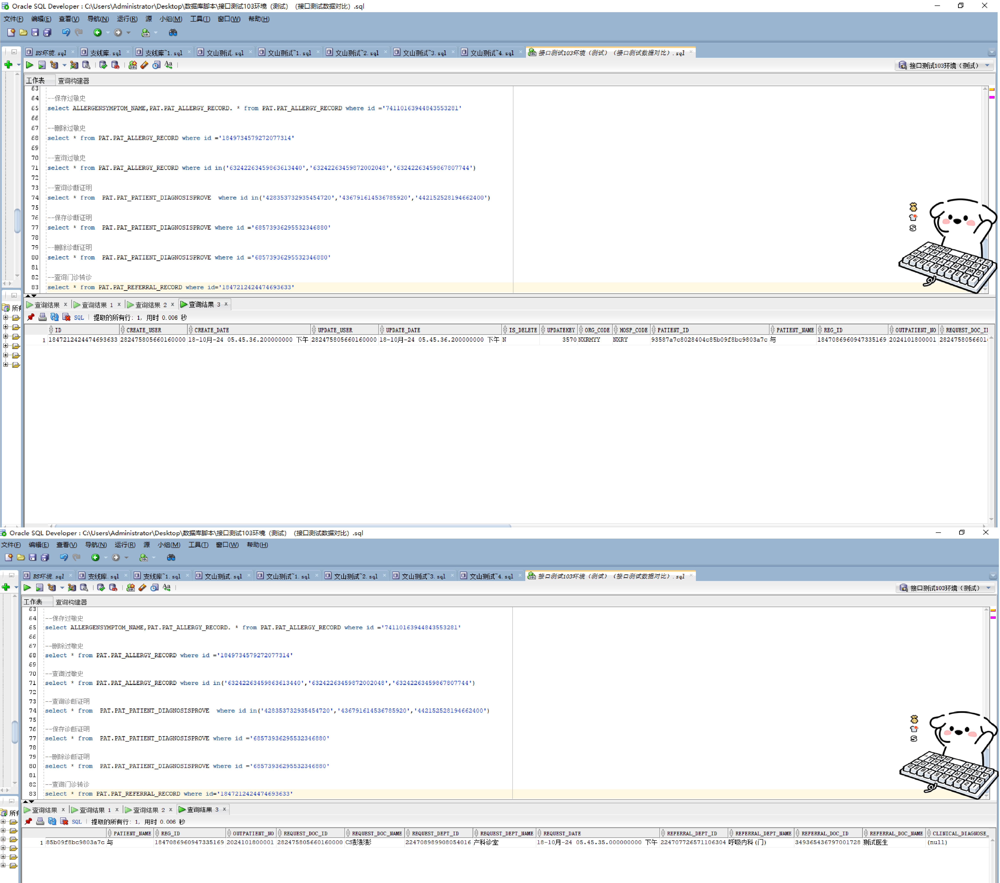

# 领域服务/基础领域 - 查询门诊转诊 - 查询门诊转诊 正向用例
## 请求参数：
``` json
{
  "pageSize": 3,
  "pageIndex": 1,
  "orgCode": "NXRMYY",
  "ids": [
    "1847212424474693633"
  ]
}
```
## 返回参数：
``` json
{
  "exception": null,
  "apiCode": null,
  "data": {
    "list": [
      {
        "acceptsStatus": "0",
        "clinicalDiagnosisId": null,
        "clinicalDiagnosisName": null,
        "createDate": "2024-10-18 17:45:36",
        "createUserId": "282475805660160000",
        "hospCode": "NXRY",
        "id": "1847212424474693633",
        "name": "与",
        "orgCode": "NXRMYY",
        "patientId": "93587a7c8028404c85b09f8bc9803a7c",
        "referralDeptId": "224707726571106304",
        "referralDeptName": "呼吸内科(门)",
        "referralDoctorId": "349365436797001728",
        "referralDoctorName": "测试医生",
        "remark": null,
        "requestDate": "2024-10-18 17:45:35",
        "requestDeptId": "224708989908054016",
        "requestDeptName": "产科诊室",
        "requestDoctorId": "282475805660160000",
        "requestDoctorName": "CS彭彭彭",
        "updateDate": "2024-10-18 17:45:36",
        "updateUserId": "282475805660160000",
        "visitId": "1847086960947335169",
        "visitNo": "2024101800001"
      }
    ],
    "totalCount": 1,
    "pageSize": 3,
    "pageNo": 1,
    "pageCount": 1
  },
  "Code": 200,
  "Message": "操作成功"
}
```
## 数据校验：



# 领域服务/基础领域 - 查询门诊转诊 - 必填校验-[orgCode]为空
## 请求参数：
``` json
{
  "pageSize": 3,
  "pageIndex": 1,
  "orgCode": "",
  "ids": [
    "1847212424474693633"
  ]
}
```
## 返回参数：
``` json
{
  "exception": null,
  "apiCode": null,
  "data": null,
  "Code": 1,
  "Message": "医院编码不能为空"
}
```
# 领域服务/基础领域 - 查询门诊转诊 - 必填校验-[pageIndex]为空
## 请求参数：
``` json
{
  "pageSize": 3,
  "pageIndex": null,
  "orgCode": "NXRMYY",
  "ids": [
    "1847212424474693633"
  ]
}
```
## 返回参数：
``` json
{
  "exception": null,
  "apiCode": null,
  "data": null,
  "Code": 1,
  "Message": "页码不能为空"
}
```
# 领域服务/基础领域 - 查询门诊转诊 - 必填校验-[pageSize]为空
## 请求参数：
``` json
{
  "pageSize": null,
  "pageIndex": 1,
  "orgCode": "NXRMYY",
  "ids": [
    "1847212424474693633"
  ]
}
```
## 返回参数：
``` json
{
  "exception": null,
  "apiCode": null,
  "data": null,
  "Code": 1,
  "Message": "每页显示条数不能为空"
}
```
# 领域服务/基础领域 - 查询门诊转诊 - 类型校验-[pageIndex]类型错误
## 请求参数：
``` json
{
  "pageSize": 3,
  "pageIndex": "abc",
  "orgCode": "NXRMYY",
  "ids": [
    "1847212424474693633"
  ]
}
```
## 返回参数：
``` json
{
  "exception": null,
  "apiCode": null,
  "data": null,
  "Code": 1,
  "Message": "请求参数错误"
}
```
# 领域服务/基础领域 - 查询门诊转诊 - 类型校验-[pageSize]类型错误
## 请求参数：
``` json
{
  "pageSize": "abc",
  "pageIndex": 1,
  "orgCode": "NXRMYY",
  "ids": [
    "1847212424474693633"
  ]
}
```
## 返回参数：
``` json
{
  "exception": null,
  "apiCode": null,
  "data": null,
  "Code": 1,
  "Message": "请求参数错误"
}
```
# 领域服务/基础领域 - 查询门诊转诊 - 依赖用例-[orgCode]赋值为依赖用例测试值
## 请求参数：
``` json
{
  "pageSize": 3,
  "pageIndex": 1,
  "orgCode": "依赖用例测试值",
  "ids": [
    "1847212424474693633"
  ]
}
```
## 返回参数：
``` json
{
  "exception": null,
  "apiCode": null,
  "data": {
    "list": [],
    "totalCount": 0,
    "pageSize": 3,
    "pageNo": 1,
    "pageCount": 0
  },
  "Code": 200,
  "Message": "操作成功"
}
```