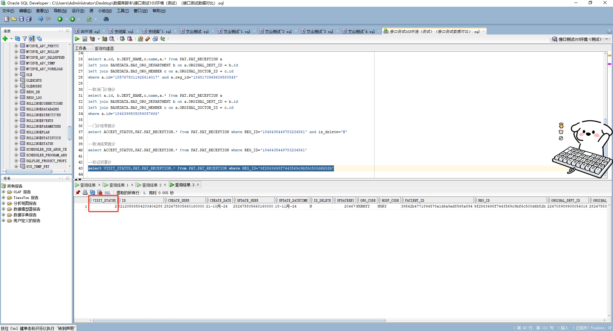

# 领域服务/基础领域 - 标记初复诊 - 标记初复诊 正向用例
## 请求参数：
``` json
{
  "hospCode": "NXRY",
  "visitStatus": "2",
  "orgCode": "NXRMYY",
  "operatorId": "282475805660160000",
  "operatorName": "CS彭彭彭",
  "visitIds": [
    "9f2863498f7443569c9bf6c500d6b52b"
  ]
}
```
## 返回参数：
``` json
{
  "exception": null,
  "apiCode": null,
  "data": true,
  "Code": 200,
  "Message": "操作成功"
}
```
## 数据校验：



# 领域服务/基础领域 - 标记初复诊 - 必填校验-[orgCode]为空
## 请求参数：
``` json
{
  "hospCode": "NXRY",
  "visitStatus": "2",
  "orgCode": "",
  "operatorId": "282475805660160000",
  "operatorName": "CS彭彭彭",
  "visitIds": [
    "9f2863498f7443569c9bf6c500d6b52b"
  ]
}
```
## 返回参数：
``` json
{
  "exception": null,
  "apiCode": null,
  "data": null,
  "Code": 1,
  "Message": "医院编码不能为空"
}
```
# 领域服务/基础领域 - 标记初复诊 - 必填校验-[hospCode]为空
## 请求参数：
``` json
{
  "hospCode": "",
  "visitStatus": "2",
  "orgCode": "NXRMYY",
  "operatorId": "282475805660160000",
  "operatorName": "CS彭彭彭",
  "visitIds": [
    "9f2863498f7443569c9bf6c500d6b52b"
  ]
}
```
## 返回参数：
``` json
{
  "exception": null,
  "apiCode": null,
  "data": null,
  "Code": 1,
  "Message": "院区编码不能为空"
}
```
# 领域服务/基础领域 - 标记初复诊 - 必填校验-[operatorId]为空
## 请求参数：
``` json
{
  "hospCode": "NXRY",
  "visitStatus": "2",
  "orgCode": "NXRMYY",
  "operatorId": "",
  "operatorName": "CS彭彭彭",
  "visitIds": [
    "9f2863498f7443569c9bf6c500d6b52b"
  ]
}
```
## 返回参数：
``` json
{
  "exception": null,
  "apiCode": null,
  "data": null,
  "Code": 1,
  "Message": "操作人id不能为空"
}
```
# 领域服务/基础领域 - 标记初复诊 - 必填校验-[operatorName]为空
## 请求参数：
``` json
{
  "hospCode": "NXRY",
  "visitStatus": "2",
  "orgCode": "NXRMYY",
  "operatorId": "282475805660160000",
  "operatorName": "",
  "visitIds": [
    "9f2863498f7443569c9bf6c500d6b52b"
  ]
}
```
## 返回参数：
``` json
{
  "exception": null,
  "apiCode": null,
  "data": null,
  "Code": 1,
  "Message": "操作人姓名不能为空"
}
```
# 领域服务/基础领域 - 标记初复诊 - 必填校验-[visitStatus]为空
## 请求参数：
``` json
{
  "hospCode": "NXRY",
  "visitStatus": "",
  "orgCode": "NXRMYY",
  "operatorId": "282475805660160000",
  "operatorName": "CS彭彭彭",
  "visitIds": [
    "9f2863498f7443569c9bf6c500d6b52b"
  ]
}
```
## 返回参数：
``` json
{
  "exception": null,
  "apiCode": null,
  "data": null,
  "Code": 1,
  "Message": "诊查状态，0-初诊 1-复诊不能为空"
}
```
# 领域服务/基础领域 - 标记初复诊 - 必填校验-[visitIds]为空
## 请求参数：
``` json
{
  "hospCode": "NXRY",
  "visitStatus": "2",
  "orgCode": "NXRMYY",
  "operatorId": "282475805660160000",
  "operatorName": "CS彭彭彭",
  "visitIds": null
}
```
## 返回参数：
``` json
{
  "exception": null,
  "apiCode": null,
  "data": null,
  "Code": 1,
  "Message": "挂号id集合，门诊就诊id集合不能为空"
}
```
# 领域服务/基础领域 - 标记初复诊 - 类型校验-[visitIds]类型错误
## 请求参数：
``` json
{
  "hospCode": "NXRY",
  "visitStatus": "2",
  "orgCode": "NXRMYY",
  "operatorId": "282475805660160000",
  "operatorName": "CS彭彭彭",
  "visitIds": "abc"
}
```
## 返回参数：
``` json
{
  "exception": null,
  "apiCode": null,
  "data": null,
  "Code": 1,
  "Message": "请求参数错误"
}
```
# 领域服务/基础领域 - 标记初复诊 - 枚举用例-[visitStatus] 枚举值为 0(诊查状态为初诊)
## 请求参数：
``` json
{
  "hospCode": "NXRY",
  "visitStatus": "0",
  "orgCode": "NXRMYY",
  "operatorId": "282475805660160000",
  "operatorName": "CS彭彭彭",
  "visitIds": [
    "9f2863498f7443569c9bf6c500d6b52b"
  ]
}
```
## 返回参数：
``` json
{
  "exception": null,
  "apiCode": null,
  "data": true,
  "Code": 200,
  "Message": "操作成功"
}
```
# 领域服务/基础领域 - 标记初复诊 - 枚举用例-[visitStatus] 枚举值为 1(诊查状态为复诊)
## 请求参数：
``` json
{
  "hospCode": "NXRY",
  "visitStatus": "1",
  "orgCode": "NXRMYY",
  "operatorId": "282475805660160000",
  "operatorName": "CS彭彭彭",
  "visitIds": [
    "9f2863498f7443569c9bf6c500d6b52b"
  ]
}
```
## 返回参数：
``` json
{
  "exception": null,
  "apiCode": null,
  "data": true,
  "Code": 200,
  "Message": "操作成功"
}
```
# 领域服务/基础领域 - 标记初复诊 - 依赖用例-[visitIds]赋值为[依赖用例测试值]
## 请求参数：
``` json
{
  "hospCode": "NXRY",
  "visitStatus": "2",
  "orgCode": "NXRMYY",
  "operatorId": "282475805660160000",
  "operatorName": "CS彭彭彭",
  "visitIds": [
    "依赖用例测试值"
  ]
}
```
## 返回参数：
``` json
{
  "exception": null,
  "apiCode": null,
  "data": null,
  "Code": 1,
  "Message": "挂号id不存在"
}
```
# 领域服务/基础领域 - 标记初复诊 - 依赖用例-[operatorName]赋值为依赖用例测试值
## 请求参数：
``` json
{
  "hospCode": "NXRY",
  "visitStatus": "2",
  "orgCode": "NXRMYY",
  "operatorId": "282475805660160000",
  "operatorName": "依赖用例测试值",
  "visitIds": [
    "9f2863498f7443569c9bf6c500d6b52b"
  ]
}
```
## 返回参数：
``` json
{
  "exception": null,
  "apiCode": null,
  "data": true,
  "Code": 200,
  "Message": "操作成功"
}
```
# 领域服务/基础领域 - 标记初复诊 - 依赖用例-[operatorId]赋值为依赖用例测试值
## 请求参数：
``` json
{
  "hospCode": "NXRY",
  "visitStatus": "2",
  "orgCode": "NXRMYY",
  "operatorId": "依赖用例测试值",
  "operatorName": "CS彭彭彭",
  "visitIds": [
    "9f2863498f7443569c9bf6c500d6b52b"
  ]
}
```
## 返回参数：
``` json
{
  "exception": null,
  "apiCode": null,
  "data": true,
  "Code": 200,
  "Message": "操作成功"
}
```
# 领域服务/基础领域 - 标记初复诊 - 依赖用例-[orgCode]赋值为依赖用例测试值
## 请求参数：
``` json
{
  "hospCode": "NXRY",
  "visitStatus": "2",
  "orgCode": "依赖用例测试值",
  "operatorId": "282475805660160000",
  "operatorName": "CS彭彭彭",
  "visitIds": [
    "9f2863498f7443569c9bf6c500d6b52b"
  ]
}
```
## 返回参数：
``` json
{
  "exception": null,
  "apiCode": null,
  "data": true,
  "Code": 200,
  "Message": "操作成功"
}
```
# 领域服务/基础领域 - 标记初复诊 - 依赖用例-[hospCode]赋值为依赖用例测试值
## 请求参数：
``` json
{
  "hospCode": "依赖用例测试值",
  "visitStatus": "2",
  "orgCode": "NXRMYY",
  "operatorId": "282475805660160000",
  "operatorName": "CS彭彭彭",
  "visitIds": [
    "9f2863498f7443569c9bf6c500d6b52b"
  ]
}
```
## 返回参数：
``` json
{
  "exception": null,
  "apiCode": null,
  "data": true,
  "Code": 200,
  "Message": "操作成功"
}
```