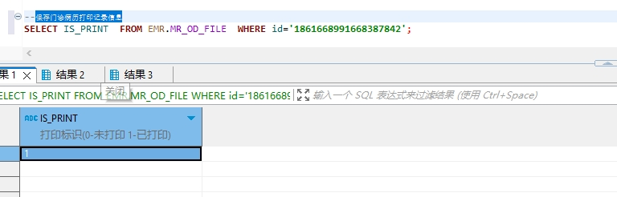

# 领域服务/病历领域 - 保存门诊病历打印记录信息 - 保存门诊病历打印记录信息 正向用例
## 请求参数：
``` json
{
  "orgName": "版本测试环境",
  "hospCode": "NXRY",
  "hospName": "版本测试环境",
  "orgCode": "NXRMYY",
  "list": [
    {
      "printUserName": "CS彭彭彭",
      "fileName": "验证格式",
      "printDate": "2024-10-16 14:25:27",
      "printUserId": "282475805660160000",
      "fileId": "1861668991668387842"
    }
  ],
  "operatorId": "282475805660160000",
  "operatorName": "CS彭彭彭",
  "operateDate": "2024-10-16 14:25:27"
}
```
## 返回参数：
``` json
{
    "exception": null,
    "apiCode": null,
    "data": null,
    "Code": 200,
    "Message": "操作成功"
}
```
## 数据校验：

# 领域服务/病历领域 - 保存门诊病历打印记录信息 - 必填校验-[orgCode]为空
## 请求参数：
``` json
{
  "orgName": "版本测试环境",
  "hospCode": "NXRY",
  "hospName": "版本测试环境",
  "orgCode": "",
  "list": [
    {
      "printUserName": "CS彭彭彭",
      "fileName": "呼吸内科",
      "printDate": "2024-10-16 14:25:27",
      "printUserId": "282475805660160000",
      "fileId": "1848255233688371202"
    }
  ],
  "operatorId": "282475805660160000",
  "operatorName": "CS彭彭彭",
  "operateDate": "2024-10-16 14:25:27"
}
```
## 返回参数：
``` json
{
  "exception": null,
  "apiCode": null,
  "data": null,
  "Code": 1,
  "Message": "机构编码不能为空"
}
```
# 领域服务/病历领域 - 保存门诊病历打印记录信息 - 必填校验-[orgName]为空
## 请求参数：
``` json
{
  "orgName": "",
  "hospCode": "NXRY",
  "hospName": "版本测试环境",
  "orgCode": "NXRMYY",
  "list": [
    {
      "printUserName": "CS彭彭彭",
      "fileName": "呼吸内科",
      "printDate": "2024-10-16 14:25:27",
      "printUserId": "282475805660160000",
      "fileId": "1848255233688371202"
    }
  ],
  "operatorId": "282475805660160000",
  "operatorName": "CS彭彭彭",
  "operateDate": "2024-10-16 14:25:27"
}
```
## 返回参数：
``` json
{
  "exception": null,
  "apiCode": null,
  "data": null,
  "Code": 1,
  "Message": "机构名称不能为空"
}
```
# 领域服务/病历领域 - 保存门诊病历打印记录信息 - 必填校验-[hospCode]为空
## 请求参数：
``` json
{
  "orgName": "版本测试环境",
  "hospCode": "",
  "hospName": "版本测试环境",
  "orgCode": "NXRMYY",
  "list": [
    {
      "printUserName": "CS彭彭彭",
      "fileName": "呼吸内科",
      "printDate": "2024-10-16 14:25:27",
      "printUserId": "282475805660160000",
      "fileId": "1848255233688371202"
    }
  ],
  "operatorId": "282475805660160000",
  "operatorName": "CS彭彭彭",
  "operateDate": "2024-10-16 14:25:27"
}
```
## 返回参数：
``` json
{
  "exception": null,
  "apiCode": null,
  "data": null,
  "Code": 1,
  "Message": "院区编码不能为空"
}
```
# 领域服务/病历领域 - 保存门诊病历打印记录信息 - 必填校验-[hospName]为空
## 请求参数：
``` json
{
  "orgName": "版本测试环境",
  "hospCode": "NXRY",
  "hospName": "",
  "orgCode": "NXRMYY",
  "list": [
    {
      "printUserName": "CS彭彭彭",
      "fileName": "呼吸内科",
      "printDate": "2024-10-16 14:25:27",
      "printUserId": "282475805660160000",
      "fileId": "1848255233688371202"
    }
  ],
  "operatorId": "282475805660160000",
  "operatorName": "CS彭彭彭",
  "operateDate": "2024-10-16 14:25:27"
}
```
## 返回参数：
``` json
{
  "exception": null,
  "apiCode": null,
  "data": null,
  "Code": 1,
  "Message": "院区名称不能为空"
}
```
# 领域服务/病历领域 - 保存门诊病历打印记录信息 - 必填校验-[operatorId]为空
## 请求参数：
``` json
{
  "orgName": "版本测试环境",
  "hospCode": "NXRY",
  "hospName": "版本测试环境",
  "orgCode": "NXRMYY",
  "list": [
    {
      "printUserName": "CS彭彭彭",
      "fileName": "呼吸内科",
      "printDate": "2024-10-16 14:25:27",
      "printUserId": "282475805660160000",
      "fileId": "1848255233688371202"
    }
  ],
  "operatorId": "",
  "operatorName": "CS彭彭彭",
  "operateDate": "2024-10-16 14:25:27"
}
```
## 返回参数：
``` json
{
  "exception": null,
  "apiCode": null,
  "data": null,
  "Code": 1,
  "Message": "操作人id不能为空"
}
```
# 领域服务/病历领域 - 保存门诊病历打印记录信息 - 必填校验-[operatorName]为空
## 请求参数：
``` json
{
  "orgName": "版本测试环境",
  "hospCode": "NXRY",
  "hospName": "版本测试环境",
  "orgCode": "NXRMYY",
  "list": [
    {
      "printUserName": "CS彭彭彭",
      "fileName": "呼吸内科",
      "printDate": "2024-10-16 14:25:27",
      "printUserId": "282475805660160000",
      "fileId": "1848255233688371202"
    }
  ],
  "operatorId": "282475805660160000",
  "operatorName": "",
  "operateDate": "2024-10-16 14:25:27"
}
```
## 返回参数：
``` json
{
  "exception": null,
  "apiCode": null,
  "data": null,
  "Code": 1,
  "Message": "操作人姓名不能为空"
}
```
# 领域服务/病历领域 - 保存门诊病历打印记录信息 - 必填校验-[operateDate]为空
## 请求参数：
``` json
{
  "orgName": "版本测试环境",
  "hospCode": "NXRY",
  "hospName": "版本测试环境",
  "orgCode": "NXRMYY",
  "list": [
    {
      "printUserName": "CS彭彭彭",
      "fileName": "呼吸内科",
      "printDate": "2024-10-16 14:25:27",
      "printUserId": "282475805660160000",
      "fileId": "1848255233688371202"
    }
  ],
  "operatorId": "282475805660160000",
  "operatorName": "CS彭彭彭",
  "operateDate": ""
}
```
## 返回参数：
``` json
{
  "exception": null,
  "apiCode": null,
  "data": null,
  "Code": 1,
  "Message": "操作时间不能为空"
}
```
# 领域服务/病历领域 - 保存门诊病历打印记录信息 - 必填校验-[list]为空
## 请求参数：
``` json
{
  "orgName": "版本测试环境",
  "hospCode": "NXRY",
  "hospName": "版本测试环境",
  "orgCode": "NXRMYY",
  "list": null,
  "operatorId": "282475805660160000",
  "operatorName": "CS彭彭彭",
  "operateDate": "2024-10-16 14:25:27"
}
```
## 返回参数：
``` json
{
  "exception": null,
  "apiCode": null,
  "data": null,
  "Code": 1,
  "Message": "待保存门诊病历打印记录信息集合不能为空"
}
```
# 领域服务/病历领域 - 保存门诊病历打印记录信息 - 必填校验-[list.fileId]为空
## 请求参数：
``` json
{
  "orgName": "版本测试环境",
  "hospCode": "NXRY",
  "hospName": "版本测试环境",
  "orgCode": "NXRMYY",
  "list": [
    {
      "printUserName": "CS彭彭彭",
      "fileName": "呼吸内科",
      "printDate": "2024-10-16 14:25:27",
      "printUserId": "282475805660160000",
      "fileId": null
    }
  ],
  "operatorId": "282475805660160000",
  "operatorName": "CS彭彭彭",
  "operateDate": "2024-10-16 14:25:27"
}
```
## 返回参数：
``` json
{
  "exception": null,
  "apiCode": null,
  "data": null,
  "Code": 1,
  "Message": "病历主键id不能为空"
}
```
# 领域服务/病历领域 - 保存门诊病历打印记录信息 - 必填校验-[list.fileName]为空
## 请求参数：
``` json
{
  "orgName": "版本测试环境",
  "hospCode": "NXRY",
  "hospName": "版本测试环境",
  "orgCode": "NXRMYY",
  "list": [
    {
      "printUserName": "CS彭彭彭",
      "fileName": null,
      "printDate": "2024-10-16 14:25:27",
      "printUserId": "282475805660160000",
      "fileId": "1848255233688371202"
    }
  ],
  "operatorId": "282475805660160000",
  "operatorName": "CS彭彭彭",
  "operateDate": "2024-10-16 14:25:27"
}
```
## 返回参数：
``` json
{
  "exception": null,
  "apiCode": null,
  "data": null,
  "Code": 1,
  "Message": "门诊病历文件名称不能为空"
}
```
# 领域服务/病历领域 - 保存门诊病历打印记录信息 - 必填校验-[list.printUserId]为空
## 请求参数：
``` json
{
  "orgName": "版本测试环境",
  "hospCode": "NXRY",
  "hospName": "版本测试环境",
  "orgCode": "NXRMYY",
  "list": [
    {
      "printUserName": "CS彭彭彭",
      "fileName": "呼吸内科",
      "printDate": "2024-10-16 14:25:27",
      "printUserId": null,
      "fileId": "1848255233688371202"
    }
  ],
  "operatorId": "282475805660160000",
  "operatorName": "CS彭彭彭",
  "operateDate": "2024-10-16 14:25:27"
}
```
## 返回参数：
``` json
{
  "exception": null,
  "apiCode": null,
  "data": null,
  "Code": 1,
  "Message": "打印人id不能为空"
}
```
# 领域服务/病历领域 - 保存门诊病历打印记录信息 - 必填校验-[list.printUserName]为空
## 请求参数：
``` json
{
  "orgName": "版本测试环境",
  "hospCode": "NXRY",
  "hospName": "版本测试环境",
  "orgCode": "NXRMYY",
  "list": [
    {
      "printUserName": null,
      "fileName": "呼吸内科",
      "printDate": "2024-10-16 14:25:27",
      "printUserId": "282475805660160000",
      "fileId": "1848255233688371202"
    }
  ],
  "operatorId": "282475805660160000",
  "operatorName": "CS彭彭彭",
  "operateDate": "2024-10-16 14:25:27"
}
```
## 返回参数：
``` json
{
  "exception": null,
  "apiCode": null,
  "data": null,
  "Code": 1,
  "Message": "打印人姓名不能为空"
}
```
# 领域服务/病历领域 - 保存门诊病历打印记录信息 - 必填校验-[list.printDate]为空
## 请求参数：
``` json
{
  "orgName": "版本测试环境",
  "hospCode": "NXRY",
  "hospName": "版本测试环境",
  "orgCode": "NXRMYY",
  "list": [
    {
      "printUserName": "CS彭彭彭",
      "fileName": "呼吸内科",
      "printDate": null,
      "printUserId": "282475805660160000",
      "fileId": "1848255233688371202"
    }
  ],
  "operatorId": "282475805660160000",
  "operatorName": "CS彭彭彭",
  "operateDate": "2024-10-16 14:25:27"
}
```
## 返回参数：
``` json
{
  "exception": null,
  "apiCode": null,
  "data": null,
  "Code": 1,
  "Message": "打印时间不能为空"
}
```
# 领域服务/病历领域 - 保存门诊病历打印记录信息 - 依赖用例-[operatorName]赋值为依赖用例测试值
## 请求参数：
``` json
{
  "orgName": "版本测试环境",
  "hospCode": "NXRY",
  "hospName": "版本测试环境",
  "orgCode": "NXRMYY",
  "list": [
    {
      "printUserName": "CS彭彭彭",
      "fileName": "呼吸内科",
      "printDate": "2024-10-16 14:25:27",
      "printUserId": "282475805660160000",
      "fileId": "1848255233688371202"
    }
  ],
  "operatorId": "282475805660160000",
  "operatorName": "依赖用例测试值",
  "operateDate": "2024-10-16 14:25:27"
}
```
## 返回参数：
``` json
{
  "exception": null,
  "apiCode": null,
  "data": null,
  "Code": 1,
  "Message": "该病历文书记录不存在或已经被删除或未签署"
}
```
# 领域服务/病历领域 - 保存门诊病历打印记录信息 - 依赖用例-[operatorId]赋值为依赖用例测试值
## 请求参数：
``` json
{
  "orgName": "版本测试环境",
  "hospCode": "NXRY",
  "hospName": "版本测试环境",
  "orgCode": "NXRMYY",
  "list": [
    {
      "printUserName": "CS彭彭彭",
      "fileName": "呼吸内科",
      "printDate": "2024-10-16 14:25:27",
      "printUserId": "282475805660160000",
      "fileId": "1848255233688371202"
    }
  ],
  "operatorId": "依赖用例测试值",
  "operatorName": "CS彭彭彭",
  "operateDate": "2024-10-16 14:25:27"
}
```
## 返回参数：
``` json
{
  "exception": null,
  "apiCode": null,
  "data": null,
  "Code": 1,
  "Message": "该病历文书记录不存在或已经被删除或未签署"
}
```
# 领域服务/病历领域 - 保存门诊病历打印记录信息 - 依赖用例-[list.printUserName]赋值为依赖用例测试值
## 请求参数：
``` json
{
  "orgName": "版本测试环境",
  "hospCode": "NXRY",
  "hospName": "版本测试环境",
  "orgCode": "NXRMYY",
  "list": [
    {
      "printUserName": "依赖用例测试值",
      "fileName": "呼吸内科",
      "printDate": "2024-10-16 14:25:27",
      "printUserId": "282475805660160000",
      "fileId": "1848255233688371202"
    }
  ],
  "operatorId": "282475805660160000",
  "operatorName": "CS彭彭彭",
  "operateDate": "2024-10-16 14:25:27"
}
```
## 返回参数：
``` json
{
  "exception": null,
  "apiCode": null,
  "data": null,
  "Code": 1,
  "Message": "该病历文书记录不存在或已经被删除或未签署"
}
```
# 领域服务/病历领域 - 保存门诊病历打印记录信息 - 依赖用例-[list.printUserId]赋值为依赖用例测试值
## 请求参数：
``` json
{
  "orgName": "版本测试环境",
  "hospCode": "NXRY",
  "hospName": "版本测试环境",
  "orgCode": "NXRMYY",
  "list": [
    {
      "printUserName": "CS彭彭彭",
      "fileName": "呼吸内科",
      "printDate": "2024-10-16 14:25:27",
      "printUserId": "依赖用例测试值",
      "fileId": "1848255233688371202"
    }
  ],
  "operatorId": "282475805660160000",
  "operatorName": "CS彭彭彭",
  "operateDate": "2024-10-16 14:25:27"
}
```
## 返回参数：
``` json
{
  "exception": null,
  "apiCode": null,
  "data": null,
  "Code": 1,
  "Message": "该病历文书记录不存在或已经被删除或未签署"
}
```
# 领域服务/病历领域 - 保存门诊病历打印记录信息 - 依赖用例-[list.fileId]赋值为依赖用例测试值
## 请求参数：
``` json
{
  "orgName": "版本测试环境",
  "hospCode": "NXRY",
  "hospName": "版本测试环境",
  "orgCode": "NXRMYY",
  "list": [
    {
      "printUserName": "CS彭彭彭",
      "fileName": "呼吸内科",
      "printDate": "2024-10-16 14:25:27",
      "printUserId": "282475805660160000",
      "fileId": "依赖用例测试值"
    }
  ],
  "operatorId": "282475805660160000",
  "operatorName": "CS彭彭彭",
  "operateDate": "2024-10-16 14:25:27"
}
```
## 返回参数：
``` json
{
  "exception": null,
  "apiCode": null,
  "data": null,
  "Code": 1,
  "Message": "该病历文书记录不存在或已经被删除或未签署"
}
```
# 领域服务/病历领域 - 保存门诊病历打印记录信息 - 依赖用例-[orgCode]赋值为依赖用例测试值
## 请求参数：
``` json
{
  "orgName": "版本测试环境",
  "hospCode": "NXRY",
  "hospName": "版本测试环境",
  "orgCode": "依赖用例测试值",
  "list": [
    {
      "printUserName": "CS彭彭彭",
      "fileName": "呼吸内科",
      "printDate": "2024-10-16 14:25:27",
      "printUserId": "282475805660160000",
      "fileId": "1848255233688371202"
    }
  ],
  "operatorId": "282475805660160000",
  "operatorName": "CS彭彭彭",
  "operateDate": "2024-10-16 14:25:27"
}
```
## 返回参数：
``` json
{
  "exception": null,
  "apiCode": null,
  "data": null,
  "Code": 1,
  "Message": "该病历文书记录不存在或已经被删除或未签署"
}
```
# 领域服务/病历领域 - 保存门诊病历打印记录信息 - 依赖用例-[hospName]赋值为依赖用例测试值
## 请求参数：
``` json
{
  "orgName": "版本测试环境",
  "hospCode": "NXRY",
  "hospName": "依赖用例测试值",
  "orgCode": "NXRMYY",
  "list": [
    {
      "printUserName": "CS彭彭彭",
      "fileName": "呼吸内科",
      "printDate": "2024-10-16 14:25:27",
      "printUserId": "282475805660160000",
      "fileId": "1848255233688371202"
    }
  ],
  "operatorId": "282475805660160000",
  "operatorName": "CS彭彭彭",
  "operateDate": "2024-10-16 14:25:27"
}
```
## 返回参数：
``` json
{
  "exception": null,
  "apiCode": null,
  "data": null,
  "Code": 1,
  "Message": "该病历文书记录不存在或已经被删除或未签署"
}
```
# 领域服务/病历领域 - 保存门诊病历打印记录信息 - 依赖用例-[hospCode]赋值为依赖用例测试值
## 请求参数：
``` json
{
  "orgName": "版本测试环境",
  "hospCode": "依赖用例测试值",
  "hospName": "版本测试环境",
  "orgCode": "NXRMYY",
  "list": [
    {
      "printUserName": "CS彭彭彭",
      "fileName": "呼吸内科",
      "printDate": "2024-10-16 14:25:27",
      "printUserId": "282475805660160000",
      "fileId": "1848255233688371202"
    }
  ],
  "operatorId": "282475805660160000",
  "operatorName": "CS彭彭彭",
  "operateDate": "2024-10-16 14:25:27"
}
```
## 返回参数：
``` json
{
  "exception": null,
  "apiCode": null,
  "data": null,
  "Code": 1,
  "Message": "该病历文书记录不存在或已经被删除或未签署"
}
```
# 领域服务/病历领域 - 保存门诊病历打印记录信息 - 依赖用例-[orgName]赋值为依赖用例测试值
## 请求参数：
``` json
{
  "orgName": "依赖用例测试值",
  "hospCode": "NXRY",
  "hospName": "版本测试环境",
  "orgCode": "NXRMYY",
  "list": [
    {
      "printUserName": "CS彭彭彭",
      "fileName": "呼吸内科",
      "printDate": "2024-10-16 14:25:27",
      "printUserId": "282475805660160000",
      "fileId": "1848255233688371202"
    }
  ],
  "operatorId": "282475805660160000",
  "operatorName": "CS彭彭彭",
  "operateDate": "2024-10-16 14:25:27"
}
```
## 返回参数：
``` json
{
  "exception": null,
  "apiCode": null,
  "data": null,
  "Code": 1,
  "Message": "该病历文书记录不存在或已经被删除或未签署"
}
```