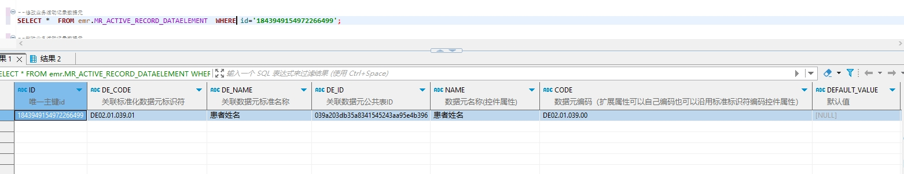

# 领域服务/病历领域 - 修改业务活动记录数据元 - 修改业务活动记录数据元 正向用例
## 请求参数：
``` json
{
  "orgName": "版本测试环境",
  "orgCode": "NXRMYY",
  "list": [
    {
      "createUserId": "349365436797001728",
      "dateFormat": "yyyy-MM-dd HH:mm:ss",
      "updateKey": 182,
      "isMultiplex": "0",
      "signLevel": "0",
      "createUserName": "测试医生",
      "id": "1843949154972266499",
      "orgName": "版本测试环境",
      "serialNumber": 43,
      "updateUserId": "349365436797001728",
      "updateUserName": "测试医生",
      "dataType": "0",
      "stdRecordCode": "EMR020001",
      "isOpen": "1",
      "name": "患者姓名",
      "updateDate": "2024-10-17 15:09:00",
      "code": "DE02.01.039.00",
      "isDirectModify": "1",
      "deId": "039a203db35a8341545243aa95e4b396",
      "orgCode": "NXRMYY",
      "deCode": "DE02.01.039.01",
      "isForce": "0",
      "isSignControl": "0",
      "backText": "患者姓名",
      "createDate": "2024-10-09 17:38:31",
      "isBinaryLength": "0",
      "isDelete": "N",
      "hisDataSource": "name",
      "hisDataSourceName": "姓名",
      "deName": "患者姓名",
      "isMust": "0",
      "stdRecordId": "5a7064dd26bd4ac7a3eab64194e7304b",
      "hisDataSourceCatalogCode": "06"
    }
  ],
  "operateDate": "2024-10-21 16:31:47",
  "operatorId": "282475805660160000",
  "operatorName": "CS彭彭彭"
}
```
## 返回参数：
``` json
{
  "exception": null,
  "apiCode": null,
  "data": null,
  "Code": 200,
  "Message": "操作成功"
}
```
## 数据校验：

# 领域服务/病历领域 - 修改业务活动记录数据元 - 必填校验-[orgCode]为空
## 请求参数：
``` json
{
  "orgName": "版本测试环境",
  "orgCode": "",
  "list": [
    {
      "createUserId": "349365436797001728",
      "dateFormat": "yyyy-MM-dd HH:mm:ss",
      "updateKey": 182,
      "isMultiplex": "0",
      "signLevel": "0",
      "createUserName": "测试医生",
      "id": "1843949154972266499",
      "orgName": "版本测试环境",
      "serialNumber": 43,
      "updateUserId": "349365436797001728",
      "updateUserName": "测试医生",
      "dataType": "0",
      "stdRecordCode": "EMR020001",
      "isOpen": "1",
      "name": "患者姓名",
      "updateDate": "2024-10-17 15:09:00",
      "code": "DE02.01.039.00",
      "isDirectModify": "1",
      "deId": "039a203db35a8341545243aa95e4b396",
      "orgCode": "NXRMYY",
      "deCode": "DE02.01.039.01",
      "isForce": "0",
      "isSignControl": "0",
      "backText": "患者姓名",
      "createDate": "2024-10-09 17:38:31",
      "isBinaryLength": "0",
      "isDelete": "N",
      "hisDataSource": "name",
      "hisDataSourceName": "姓名",
      "deName": "患者姓名",
      "isMust": "0",
      "stdRecordId": "5a7064dd26bd4ac7a3eab64194e7304b",
      "hisDataSourceCatalogCode": "06"
    }
  ],
  "operateDate": "2024-10-21 16:31:47",
  "operatorId": "282475805660160000",
  "operatorName": "CS彭彭彭"
}
```
## 返回参数：
``` json
{
  "exception": null,
  "apiCode": null,
  "data": null,
  "Code": 1,
  "Message": "机构编码不能为空"
}
```
# 领域服务/病历领域 - 修改业务活动记录数据元 - 必填校验-[orgName]为空
## 请求参数：
``` json
{
  "orgName": "",
  "orgCode": "NXRMYY",
  "list": [
    {
      "createUserId": "349365436797001728",
      "dateFormat": "yyyy-MM-dd HH:mm:ss",
      "updateKey": 182,
      "isMultiplex": "0",
      "signLevel": "0",
      "createUserName": "测试医生",
      "id": "1843949154972266499",
      "orgName": "版本测试环境",
      "serialNumber": 43,
      "updateUserId": "349365436797001728",
      "updateUserName": "测试医生",
      "dataType": "0",
      "stdRecordCode": "EMR020001",
      "isOpen": "1",
      "name": "患者姓名",
      "updateDate": "2024-10-17 15:09:00",
      "code": "DE02.01.039.00",
      "isDirectModify": "1",
      "deId": "039a203db35a8341545243aa95e4b396",
      "orgCode": "NXRMYY",
      "deCode": "DE02.01.039.01",
      "isForce": "0",
      "isSignControl": "0",
      "backText": "患者姓名",
      "createDate": "2024-10-09 17:38:31",
      "isBinaryLength": "0",
      "isDelete": "N",
      "hisDataSource": "name",
      "hisDataSourceName": "姓名",
      "deName": "患者姓名",
      "isMust": "0",
      "stdRecordId": "5a7064dd26bd4ac7a3eab64194e7304b",
      "hisDataSourceCatalogCode": "06"
    }
  ],
  "operateDate": "2024-10-21 16:31:47",
  "operatorId": "282475805660160000",
  "operatorName": "CS彭彭彭"
}
```
## 返回参数：
``` json
{
  "exception": null,
  "apiCode": null,
  "data": null,
  "Code": 1,
  "Message": "机构名称不能为空"
}
```
# 领域服务/病历领域 - 修改业务活动记录数据元 - 必填校验-[operatorId]为空
## 请求参数：
``` json
{
  "orgName": "版本测试环境",
  "orgCode": "NXRMYY",
  "list": [
    {
      "createUserId": "349365436797001728",
      "dateFormat": "yyyy-MM-dd HH:mm:ss",
      "updateKey": 182,
      "isMultiplex": "0",
      "signLevel": "0",
      "createUserName": "测试医生",
      "id": "1843949154972266499",
      "orgName": "版本测试环境",
      "serialNumber": 43,
      "updateUserId": "349365436797001728",
      "updateUserName": "测试医生",
      "dataType": "0",
      "stdRecordCode": "EMR020001",
      "isOpen": "1",
      "name": "患者姓名",
      "updateDate": "2024-10-17 15:09:00",
      "code": "DE02.01.039.00",
      "isDirectModify": "1",
      "deId": "039a203db35a8341545243aa95e4b396",
      "orgCode": "NXRMYY",
      "deCode": "DE02.01.039.01",
      "isForce": "0",
      "isSignControl": "0",
      "backText": "患者姓名",
      "createDate": "2024-10-09 17:38:31",
      "isBinaryLength": "0",
      "isDelete": "N",
      "hisDataSource": "name",
      "hisDataSourceName": "姓名",
      "deName": "患者姓名",
      "isMust": "0",
      "stdRecordId": "5a7064dd26bd4ac7a3eab64194e7304b",
      "hisDataSourceCatalogCode": "06"
    }
  ],
  "operateDate": "2024-10-21 16:31:47",
  "operatorId": "",
  "operatorName": "CS彭彭彭"
}
```
## 返回参数：
``` json
{
  "exception": null,
  "apiCode": null,
  "data": null,
  "Code": 1,
  "Message": "操作人id不能为空"
}
```
# 领域服务/病历领域 - 修改业务活动记录数据元 - 必填校验-[operatorName]为空
## 请求参数：
``` json
{
  "orgName": "版本测试环境",
  "orgCode": "NXRMYY",
  "list": [
    {
      "createUserId": "349365436797001728",
      "dateFormat": "yyyy-MM-dd HH:mm:ss",
      "updateKey": 182,
      "isMultiplex": "0",
      "signLevel": "0",
      "createUserName": "测试医生",
      "id": "1843949154972266499",
      "orgName": "版本测试环境",
      "serialNumber": 43,
      "updateUserId": "349365436797001728",
      "updateUserName": "测试医生",
      "dataType": "0",
      "stdRecordCode": "EMR020001",
      "isOpen": "1",
      "name": "患者姓名",
      "updateDate": "2024-10-17 15:09:00",
      "code": "DE02.01.039.00",
      "isDirectModify": "1",
      "deId": "039a203db35a8341545243aa95e4b396",
      "orgCode": "NXRMYY",
      "deCode": "DE02.01.039.01",
      "isForce": "0",
      "isSignControl": "0",
      "backText": "患者姓名",
      "createDate": "2024-10-09 17:38:31",
      "isBinaryLength": "0",
      "isDelete": "N",
      "hisDataSource": "name",
      "hisDataSourceName": "姓名",
      "deName": "患者姓名",
      "isMust": "0",
      "stdRecordId": "5a7064dd26bd4ac7a3eab64194e7304b",
      "hisDataSourceCatalogCode": "06"
    }
  ],
  "operateDate": "2024-10-21 16:31:47",
  "operatorId": "282475805660160000",
  "operatorName": ""
}
```
## 返回参数：
``` json
{
  "exception": null,
  "apiCode": null,
  "data": null,
  "Code": 1,
  "Message": "操作人姓名不能为空"
}
```
# 领域服务/病历领域 - 修改业务活动记录数据元 - 必填校验-[operateDate]为空
## 请求参数：
``` json
{
  "orgName": "版本测试环境",
  "orgCode": "NXRMYY",
  "list": [
    {
      "createUserId": "349365436797001728",
      "dateFormat": "yyyy-MM-dd HH:mm:ss",
      "updateKey": 182,
      "isMultiplex": "0",
      "signLevel": "0",
      "createUserName": "测试医生",
      "id": "1843949154972266499",
      "orgName": "版本测试环境",
      "serialNumber": 43,
      "updateUserId": "349365436797001728",
      "updateUserName": "测试医生",
      "dataType": "0",
      "stdRecordCode": "EMR020001",
      "isOpen": "1",
      "name": "患者姓名",
      "updateDate": "2024-10-17 15:09:00",
      "code": "DE02.01.039.00",
      "isDirectModify": "1",
      "deId": "039a203db35a8341545243aa95e4b396",
      "orgCode": "NXRMYY",
      "deCode": "DE02.01.039.01",
      "isForce": "0",
      "isSignControl": "0",
      "backText": "患者姓名",
      "createDate": "2024-10-09 17:38:31",
      "isBinaryLength": "0",
      "isDelete": "N",
      "hisDataSource": "name",
      "hisDataSourceName": "姓名",
      "deName": "患者姓名",
      "isMust": "0",
      "stdRecordId": "5a7064dd26bd4ac7a3eab64194e7304b",
      "hisDataSourceCatalogCode": "06"
    }
  ],
  "operateDate": "",
  "operatorId": "282475805660160000",
  "operatorName": "CS彭彭彭"
}
```
## 返回参数：
``` json
{
  "exception": null,
  "apiCode": null,
  "data": null,
  "Code": 1,
  "Message": "操作时间不能为空"
}
```
# 领域服务/病历领域 - 修改业务活动记录数据元 - 必填校验-[list]为空
## 请求参数：
``` json
{
  "orgName": "版本测试环境",
  "orgCode": "NXRMYY",
  "list": null,
  "operateDate": "2024-10-21 16:31:47",
  "operatorId": "282475805660160000",
  "operatorName": "CS彭彭彭"
}
```
## 返回参数：
``` json
{
  "exception": null,
  "apiCode": null,
  "data": null,
  "Code": 1,
  "Message": "待修改业务活动记录数据元不能为空"
}
```
# 领域服务/病历领域 - 修改业务活动记录数据元 - 必填校验-[list.id]为空
## 请求参数：
``` json
{
  "orgName": "版本测试环境",
  "orgCode": "NXRMYY",
  "list": [
    {
      "createUserId": "349365436797001728",
      "dateFormat": "yyyy-MM-dd HH:mm:ss",
      "updateKey": 182,
      "isMultiplex": "0",
      "signLevel": "0",
      "createUserName": "测试医生",
      "id": null,
      "orgName": "版本测试环境",
      "serialNumber": 43,
      "updateUserId": "349365436797001728",
      "updateUserName": "测试医生",
      "dataType": "0",
      "stdRecordCode": "EMR020001",
      "isOpen": "1",
      "name": "患者姓名",
      "updateDate": "2024-10-17 15:09:00",
      "code": "DE02.01.039.00",
      "isDirectModify": "1",
      "deId": "039a203db35a8341545243aa95e4b396",
      "orgCode": "NXRMYY",
      "deCode": "DE02.01.039.01",
      "isForce": "0",
      "isSignControl": "0",
      "backText": "患者姓名",
      "createDate": "2024-10-09 17:38:31",
      "isBinaryLength": "0",
      "isDelete": "N",
      "hisDataSource": "name",
      "hisDataSourceName": "姓名",
      "deName": "患者姓名",
      "isMust": "0",
      "stdRecordId": "5a7064dd26bd4ac7a3eab64194e7304b",
      "hisDataSourceCatalogCode": "06"
    }
  ],
  "operateDate": "2024-10-21 16:31:47",
  "operatorId": "282475805660160000",
  "operatorName": "CS彭彭彭"
}
```
## 返回参数：
``` json
{
  "exception": null,
  "apiCode": null,
  "data": null,
  "Code": 1,
  "Message": "主键不能为空"
}
```
# 领域服务/病历领域 - 修改业务活动记录数据元 - 必填校验-[list.updateUserId]为空
## 请求参数：
``` json
{
  "orgName": "版本测试环境",
  "orgCode": "NXRMYY",
  "list": [
    {
      "createUserId": "349365436797001728",
      "dateFormat": "yyyy-MM-dd HH:mm:ss",
      "updateKey": 182,
      "isMultiplex": "0",
      "signLevel": "0",
      "createUserName": "测试医生",
      "id": "1843949154972266499",
      "orgName": "版本测试环境",
      "serialNumber": 43,
      "updateUserId": null,
      "updateUserName": "测试医生",
      "dataType": "0",
      "stdRecordCode": "EMR020001",
      "isOpen": "1",
      "name": "患者姓名",
      "updateDate": "2024-10-17 15:09:00",
      "code": "DE02.01.039.00",
      "isDirectModify": "1",
      "deId": "039a203db35a8341545243aa95e4b396",
      "orgCode": "NXRMYY",
      "deCode": "DE02.01.039.01",
      "isForce": "0",
      "isSignControl": "0",
      "backText": "患者姓名",
      "createDate": "2024-10-09 17:38:31",
      "isBinaryLength": "0",
      "isDelete": "N",
      "hisDataSource": "name",
      "hisDataSourceName": "姓名",
      "deName": "患者姓名",
      "isMust": "0",
      "stdRecordId": "5a7064dd26bd4ac7a3eab64194e7304b",
      "hisDataSourceCatalogCode": "06"
    }
  ],
  "operateDate": "2024-10-21 16:31:47",
  "operatorId": "282475805660160000",
  "operatorName": "CS彭彭彭"
}
```
## 返回参数：
``` json
{
  "exception": null,
  "apiCode": null,
  "data": null,
  "Code": 200,
  "Message": "操作成功"
}
```
# 领域服务/病历领域 - 修改业务活动记录数据元 - 必填校验-[list.updateUserName]为空
## 请求参数：
``` json
{
  "orgName": "版本测试环境",
  "orgCode": "NXRMYY",
  "list": [
    {
      "createUserId": "349365436797001728",
      "dateFormat": "yyyy-MM-dd HH:mm:ss",
      "updateKey": 182,
      "isMultiplex": "0",
      "signLevel": "0",
      "createUserName": "测试医生",
      "id": "1843949154972266499",
      "orgName": "版本测试环境",
      "serialNumber": 43,
      "updateUserId": "349365436797001728",
      "updateUserName": null,
      "dataType": "0",
      "stdRecordCode": "EMR020001",
      "isOpen": "1",
      "name": "患者姓名",
      "updateDate": "2024-10-17 15:09:00",
      "code": "DE02.01.039.00",
      "isDirectModify": "1",
      "deId": "039a203db35a8341545243aa95e4b396",
      "orgCode": "NXRMYY",
      "deCode": "DE02.01.039.01",
      "isForce": "0",
      "isSignControl": "0",
      "backText": "患者姓名",
      "createDate": "2024-10-09 17:38:31",
      "isBinaryLength": "0",
      "isDelete": "N",
      "hisDataSource": "name",
      "hisDataSourceName": "姓名",
      "deName": "患者姓名",
      "isMust": "0",
      "stdRecordId": "5a7064dd26bd4ac7a3eab64194e7304b",
      "hisDataSourceCatalogCode": "06"
    }
  ],
  "operateDate": "2024-10-21 16:31:47",
  "operatorId": "282475805660160000",
  "operatorName": "CS彭彭彭"
}
```
## 返回参数：
``` json
{
  "exception": null,
  "apiCode": null,
  "data": null,
  "Code": 200,
  "Message": "操作成功"
}
```
# 领域服务/病历领域 - 修改业务活动记录数据元 - 必填校验-[list.updateDate]为空
## 请求参数：
``` json
{
  "orgName": "版本测试环境",
  "orgCode": "NXRMYY",
  "list": [
    {
      "createUserId": "349365436797001728",
      "dateFormat": "yyyy-MM-dd HH:mm:ss",
      "updateKey": 182,
      "isMultiplex": "0",
      "signLevel": "0",
      "createUserName": "测试医生",
      "id": "1843949154972266499",
      "orgName": "版本测试环境",
      "serialNumber": 43,
      "updateUserId": "349365436797001728",
      "updateUserName": "测试医生",
      "dataType": "0",
      "stdRecordCode": "EMR020001",
      "isOpen": "1",
      "name": "患者姓名",
      "updateDate": null,
      "code": "DE02.01.039.00",
      "isDirectModify": "1",
      "deId": "039a203db35a8341545243aa95e4b396",
      "orgCode": "NXRMYY",
      "deCode": "DE02.01.039.01",
      "isForce": "0",
      "isSignControl": "0",
      "backText": "患者姓名",
      "createDate": "2024-10-09 17:38:31",
      "isBinaryLength": "0",
      "isDelete": "N",
      "hisDataSource": "name",
      "hisDataSourceName": "姓名",
      "deName": "患者姓名",
      "isMust": "0",
      "stdRecordId": "5a7064dd26bd4ac7a3eab64194e7304b",
      "hisDataSourceCatalogCode": "06"
    }
  ],
  "operateDate": "2024-10-21 16:31:47",
  "operatorId": "282475805660160000",
  "operatorName": "CS彭彭彭"
}
```
## 返回参数：
``` json
{
  "exception": null,
  "apiCode": null,
  "data": null,
  "Code": 200,
  "Message": "操作成功"
}
```
# 领域服务/病历领域 - 修改业务活动记录数据元 - 必填校验-[list.deCode]为空
## 请求参数：
``` json
{
  "orgName": "版本测试环境",
  "orgCode": "NXRMYY",
  "list": [
    {
      "createUserId": "349365436797001728",
      "dateFormat": "yyyy-MM-dd HH:mm:ss",
      "updateKey": 182,
      "isMultiplex": "0",
      "signLevel": "0",
      "createUserName": "测试医生",
      "id": "1843949154972266499",
      "orgName": "版本测试环境",
      "serialNumber": 43,
      "updateUserId": "349365436797001728",
      "updateUserName": "测试医生",
      "dataType": "0",
      "stdRecordCode": "EMR020001",
      "isOpen": "1",
      "name": "患者姓名",
      "updateDate": "2024-10-17 15:09:00",
      "code": "DE02.01.039.00",
      "isDirectModify": "1",
      "deId": "039a203db35a8341545243aa95e4b396",
      "orgCode": "NXRMYY",
      "deCode": null,
      "isForce": "0",
      "isSignControl": "0",
      "backText": "患者姓名",
      "createDate": "2024-10-09 17:38:31",
      "isBinaryLength": "0",
      "isDelete": "N",
      "hisDataSource": "name",
      "hisDataSourceName": "姓名",
      "deName": "患者姓名",
      "isMust": "0",
      "stdRecordId": "5a7064dd26bd4ac7a3eab64194e7304b",
      "hisDataSourceCatalogCode": "06"
    }
  ],
  "operateDate": "2024-10-21 16:31:47",
  "operatorId": "282475805660160000",
  "operatorName": "CS彭彭彭"
}
```
## 返回参数：
``` json
{
  "exception": null,
  "apiCode": null,
  "data": null,
  "Code": 1,
  "Message": "关联标准化数据元标识符不能为空"
}
```
# 领域服务/病历领域 - 修改业务活动记录数据元 - 必填校验-[list.deName]为空
## 请求参数：
``` json
{
  "orgName": "版本测试环境",
  "orgCode": "NXRMYY",
  "list": [
    {
      "createUserId": "349365436797001728",
      "dateFormat": "yyyy-MM-dd HH:mm:ss",
      "updateKey": 182,
      "isMultiplex": "0",
      "signLevel": "0",
      "createUserName": "测试医生",
      "id": "1843949154972266499",
      "orgName": "版本测试环境",
      "serialNumber": 43,
      "updateUserId": "349365436797001728",
      "updateUserName": "测试医生",
      "dataType": "0",
      "stdRecordCode": "EMR020001",
      "isOpen": "1",
      "name": "患者姓名",
      "updateDate": "2024-10-17 15:09:00",
      "code": "DE02.01.039.00",
      "isDirectModify": "1",
      "deId": "039a203db35a8341545243aa95e4b396",
      "orgCode": "NXRMYY",
      "deCode": "DE02.01.039.01",
      "isForce": "0",
      "isSignControl": "0",
      "backText": "患者姓名",
      "createDate": "2024-10-09 17:38:31",
      "isBinaryLength": "0",
      "isDelete": "N",
      "hisDataSource": "name",
      "hisDataSourceName": "姓名",
      "deName": null,
      "isMust": "0",
      "stdRecordId": "5a7064dd26bd4ac7a3eab64194e7304b",
      "hisDataSourceCatalogCode": "06"
    }
  ],
  "operateDate": "2024-10-21 16:31:47",
  "operatorId": "282475805660160000",
  "operatorName": "CS彭彭彭"
}
```
## 返回参数：
``` json
{
  "exception": null,
  "apiCode": null,
  "data": null,
  "Code": 1,
  "Message": "关联数据元标准名称不能为空"
}
```
# 领域服务/病历领域 - 修改业务活动记录数据元 - 必填校验-[list.deId]为空
## 请求参数：
``` json
{
  "orgName": "版本测试环境",
  "orgCode": "NXRMYY",
  "list": [
    {
      "createUserId": "349365436797001728",
      "dateFormat": "yyyy-MM-dd HH:mm:ss",
      "updateKey": 182,
      "isMultiplex": "0",
      "signLevel": "0",
      "createUserName": "测试医生",
      "id": "1843949154972266499",
      "orgName": "版本测试环境",
      "serialNumber": 43,
      "updateUserId": "349365436797001728",
      "updateUserName": "测试医生",
      "dataType": "0",
      "stdRecordCode": "EMR020001",
      "isOpen": "1",
      "name": "患者姓名",
      "updateDate": "2024-10-17 15:09:00",
      "code": "DE02.01.039.00",
      "isDirectModify": "1",
      "deId": null,
      "orgCode": "NXRMYY",
      "deCode": "DE02.01.039.01",
      "isForce": "0",
      "isSignControl": "0",
      "backText": "患者姓名",
      "createDate": "2024-10-09 17:38:31",
      "isBinaryLength": "0",
      "isDelete": "N",
      "hisDataSource": "name",
      "hisDataSourceName": "姓名",
      "deName": "患者姓名",
      "isMust": "0",
      "stdRecordId": "5a7064dd26bd4ac7a3eab64194e7304b",
      "hisDataSourceCatalogCode": "06"
    }
  ],
  "operateDate": "2024-10-21 16:31:47",
  "operatorId": "282475805660160000",
  "operatorName": "CS彭彭彭"
}
```
## 返回参数：
``` json
{
  "exception": null,
  "apiCode": null,
  "data": null,
  "Code": 1,
  "Message": "关联数据元公共表ID不能为空"
}
```
# 领域服务/病历领域 - 修改业务活动记录数据元 - 必填校验-[list.name]为空
## 请求参数：
``` json
{
  "orgName": "版本测试环境",
  "orgCode": "NXRMYY",
  "list": [
    {
      "createUserId": "349365436797001728",
      "dateFormat": "yyyy-MM-dd HH:mm:ss",
      "updateKey": 182,
      "isMultiplex": "0",
      "signLevel": "0",
      "createUserName": "测试医生",
      "id": "1843949154972266499",
      "orgName": "版本测试环境",
      "serialNumber": 43,
      "updateUserId": "349365436797001728",
      "updateUserName": "测试医生",
      "dataType": "0",
      "stdRecordCode": "EMR020001",
      "isOpen": "1",
      "name": null,
      "updateDate": "2024-10-17 15:09:00",
      "code": "DE02.01.039.00",
      "isDirectModify": "1",
      "deId": "039a203db35a8341545243aa95e4b396",
      "orgCode": "NXRMYY",
      "deCode": "DE02.01.039.01",
      "isForce": "0",
      "isSignControl": "0",
      "backText": "患者姓名",
      "createDate": "2024-10-09 17:38:31",
      "isBinaryLength": "0",
      "isDelete": "N",
      "hisDataSource": "name",
      "hisDataSourceName": "姓名",
      "deName": "患者姓名",
      "isMust": "0",
      "stdRecordId": "5a7064dd26bd4ac7a3eab64194e7304b",
      "hisDataSourceCatalogCode": "06"
    }
  ],
  "operateDate": "2024-10-21 16:31:47",
  "operatorId": "282475805660160000",
  "operatorName": "CS彭彭彭"
}
```
## 返回参数：
``` json
{
  "exception": null,
  "apiCode": null,
  "data": null,
  "Code": 1,
  "Message": "数据元名称不能为空"
}
```
# 领域服务/病历领域 - 修改业务活动记录数据元 - 必填校验-[list.code]为空
## 请求参数：
``` json
{
  "orgName": "版本测试环境",
  "orgCode": "NXRMYY",
  "list": [
    {
      "createUserId": "349365436797001728",
      "dateFormat": "yyyy-MM-dd HH:mm:ss",
      "updateKey": 182,
      "isMultiplex": "0",
      "signLevel": "0",
      "createUserName": "测试医生",
      "id": "1843949154972266499",
      "orgName": "版本测试环境",
      "serialNumber": 43,
      "updateUserId": "349365436797001728",
      "updateUserName": "测试医生",
      "dataType": "0",
      "stdRecordCode": "EMR020001",
      "isOpen": "1",
      "name": "患者姓名",
      "updateDate": "2024-10-17 15:09:00",
      "code": null,
      "isDirectModify": "1",
      "deId": "039a203db35a8341545243aa95e4b396",
      "orgCode": "NXRMYY",
      "deCode": "DE02.01.039.01",
      "isForce": "0",
      "isSignControl": "0",
      "backText": "患者姓名",
      "createDate": "2024-10-09 17:38:31",
      "isBinaryLength": "0",
      "isDelete": "N",
      "hisDataSource": "name",
      "hisDataSourceName": "姓名",
      "deName": "患者姓名",
      "isMust": "0",
      "stdRecordId": "5a7064dd26bd4ac7a3eab64194e7304b",
      "hisDataSourceCatalogCode": "06"
    }
  ],
  "operateDate": "2024-10-21 16:31:47",
  "operatorId": "282475805660160000",
  "operatorName": "CS彭彭彭"
}
```
## 返回参数：
``` json
{
  "exception": null,
  "apiCode": null,
  "data": null,
  "Code": 1,
  "Message": "数据元编码不能为空"
}
```
# 领域服务/病历领域 - 修改业务活动记录数据元 - 必填校验-[list.dataType]为空
## 请求参数：
``` json
{
  "orgName": "版本测试环境",
  "orgCode": "NXRMYY",
  "list": [
    {
      "createUserId": "349365436797001728",
      "dateFormat": "yyyy-MM-dd HH:mm:ss",
      "updateKey": 182,
      "isMultiplex": "0",
      "signLevel": "0",
      "createUserName": "测试医生",
      "id": "1843949154972266499",
      "orgName": "版本测试环境",
      "serialNumber": 43,
      "updateUserId": "349365436797001728",
      "updateUserName": "测试医生",
      "dataType": null,
      "stdRecordCode": "EMR020001",
      "isOpen": "1",
      "name": "患者姓名",
      "updateDate": "2024-10-17 15:09:00",
      "code": "DE02.01.039.00",
      "isDirectModify": "1",
      "deId": "039a203db35a8341545243aa95e4b396",
      "orgCode": "NXRMYY",
      "deCode": "DE02.01.039.01",
      "isForce": "0",
      "isSignControl": "0",
      "backText": "患者姓名",
      "createDate": "2024-10-09 17:38:31",
      "isBinaryLength": "0",
      "isDelete": "N",
      "hisDataSource": "name",
      "hisDataSourceName": "姓名",
      "deName": "患者姓名",
      "isMust": "0",
      "stdRecordId": "5a7064dd26bd4ac7a3eab64194e7304b",
      "hisDataSourceCatalogCode": "06"
    }
  ],
  "operateDate": "2024-10-21 16:31:47",
  "operatorId": "282475805660160000",
  "operatorName": "CS彭彭彭"
}
```
## 返回参数：
``` json
{
  "exception": null,
  "apiCode": null,
  "data": null,
  "Code": 1,
  "Message": "输入数据类型样式不能为空"
}
```
# 领域服务/病历领域 - 修改业务活动记录数据元 - 必填校验-[list.stdRecordId]为空
## 请求参数：
``` json
{
  "orgName": "版本测试环境",
  "orgCode": "NXRMYY",
  "list": [
    {
      "createUserId": "349365436797001728",
      "dateFormat": "yyyy-MM-dd HH:mm:ss",
      "updateKey": 182,
      "isMultiplex": "0",
      "signLevel": "0",
      "createUserName": "测试医生",
      "id": "1843949154972266499",
      "orgName": "版本测试环境",
      "serialNumber": 43,
      "updateUserId": "349365436797001728",
      "updateUserName": "测试医生",
      "dataType": "0",
      "stdRecordCode": "EMR020001",
      "isOpen": "1",
      "name": "患者姓名",
      "updateDate": "2024-10-17 15:09:00",
      "code": "DE02.01.039.00",
      "isDirectModify": "1",
      "deId": "039a203db35a8341545243aa95e4b396",
      "orgCode": "NXRMYY",
      "deCode": "DE02.01.039.01",
      "isForce": "0",
      "isSignControl": "0",
      "backText": "患者姓名",
      "createDate": "2024-10-09 17:38:31",
      "isBinaryLength": "0",
      "isDelete": "N",
      "hisDataSource": "name",
      "hisDataSourceName": "姓名",
      "deName": "患者姓名",
      "isMust": "0",
      "stdRecordId": null,
      "hisDataSourceCatalogCode": "06"
    }
  ],
  "operateDate": "2024-10-21 16:31:47",
  "operatorId": "282475805660160000",
  "operatorName": "CS彭彭彭"
}
```
## 返回参数：
``` json
{
  "exception": null,
  "apiCode": null,
  "data": null,
  "Code": 1,
  "Message": "所属业务活动里边关联ID不能为空"
}
```
# 领域服务/病历领域 - 修改业务活动记录数据元 - 必填校验-[list.stdRecordCode]为空
## 请求参数：
``` json
{
  "orgName": "版本测试环境",
  "orgCode": "NXRMYY",
  "list": [
    {
      "createUserId": "349365436797001728",
      "dateFormat": "yyyy-MM-dd HH:mm:ss",
      "updateKey": 182,
      "isMultiplex": "0",
      "signLevel": "0",
      "createUserName": "测试医生",
      "id": "1843949154972266499",
      "orgName": "版本测试环境",
      "serialNumber": 43,
      "updateUserId": "349365436797001728",
      "updateUserName": "测试医生",
      "dataType": "0",
      "stdRecordCode": null,
      "isOpen": "1",
      "name": "患者姓名",
      "updateDate": "2024-10-17 15:09:00",
      "code": "DE02.01.039.00",
      "isDirectModify": "1",
      "deId": "039a203db35a8341545243aa95e4b396",
      "orgCode": "NXRMYY",
      "deCode": "DE02.01.039.01",
      "isForce": "0",
      "isSignControl": "0",
      "backText": "患者姓名",
      "createDate": "2024-10-09 17:38:31",
      "isBinaryLength": "0",
      "isDelete": "N",
      "hisDataSource": "name",
      "hisDataSourceName": "姓名",
      "deName": "患者姓名",
      "isMust": "0",
      "stdRecordId": "5a7064dd26bd4ac7a3eab64194e7304b",
      "hisDataSourceCatalogCode": "06"
    }
  ],
  "operateDate": "2024-10-21 16:31:47",
  "operatorId": "282475805660160000",
  "operatorName": "CS彭彭彭"
}
```
## 返回参数：
``` json
{
  "exception": null,
  "apiCode": null,
  "data": null,
  "Code": 1,
  "Message": "所属业务活动里边关联标准编码不能为空"
}
```
# 领域服务/病历领域 - 修改业务活动记录数据元 - 枚举用例-[list.dataType] 枚举值为 0(输入数据类型样式为文本)
## 请求参数：
``` json
{
  "orgName": "版本测试环境",
  "orgCode": "NXRMYY",
  "list": [
    {
      "createUserId": "349365436797001728",
      "dateFormat": "yyyy-MM-dd HH:mm:ss",
      "updateKey": 182,
      "isMultiplex": "0",
      "signLevel": "0",
      "createUserName": "测试医生",
      "id": "1843949154972266499",
      "orgName": "版本测试环境",
      "serialNumber": 43,
      "updateUserId": "349365436797001728",
      "updateUserName": "测试医生",
      "dataType": "0",
      "stdRecordCode": "EMR020001",
      "isOpen": "1",
      "name": "患者姓名",
      "updateDate": "2024-10-17 15:09:00",
      "code": "DE02.01.039.00",
      "isDirectModify": "1",
      "deId": "039a203db35a8341545243aa95e4b396",
      "orgCode": "NXRMYY",
      "deCode": "DE02.01.039.01",
      "isForce": "0",
      "isSignControl": "0",
      "backText": "患者姓名",
      "createDate": "2024-10-09 17:38:31",
      "isBinaryLength": "0",
      "isDelete": "N",
      "hisDataSource": "name",
      "hisDataSourceName": "姓名",
      "deName": "患者姓名",
      "isMust": "0",
      "stdRecordId": "5a7064dd26bd4ac7a3eab64194e7304b",
      "hisDataSourceCatalogCode": "06"
    }
  ],
  "operateDate": "2024-10-21 16:31:47",
  "operatorId": "282475805660160000",
  "operatorName": "CS彭彭彭"
}
```
## 返回参数：
``` json
{
  "exception": null,
  "apiCode": null,
  "data": null,
  "Code": 200,
  "Message": "操作成功"
}
```
# 领域服务/病历领域 - 修改业务活动记录数据元 - 枚举用例-[list.dataType] 枚举值为 1(输入数据类型样式为数值)
## 请求参数：
``` json
{
  "orgName": "版本测试环境",
  "orgCode": "NXRMYY",
  "list": [
    {
      "createUserId": "349365436797001728",
      "dateFormat": "yyyy-MM-dd HH:mm:ss",
      "updateKey": 182,
      "isMultiplex": "0",
      "signLevel": "0",
      "createUserName": "测试医生",
      "id": "1843949154972266499",
      "orgName": "版本测试环境",
      "serialNumber": 43,
      "updateUserId": "349365436797001728",
      "updateUserName": "测试医生",
      "dataType": "1",
      "stdRecordCode": "EMR020001",
      "isOpen": "1",
      "name": "患者姓名",
      "updateDate": "2024-10-17 15:09:00",
      "code": "DE02.01.039.00",
      "isDirectModify": "1",
      "deId": "039a203db35a8341545243aa95e4b396",
      "orgCode": "NXRMYY",
      "deCode": "DE02.01.039.01",
      "isForce": "0",
      "isSignControl": "0",
      "backText": "患者姓名",
      "createDate": "2024-10-09 17:38:31",
      "isBinaryLength": "0",
      "isDelete": "N",
      "hisDataSource": "name",
      "hisDataSourceName": "姓名",
      "deName": "患者姓名",
      "isMust": "0",
      "stdRecordId": "5a7064dd26bd4ac7a3eab64194e7304b",
      "hisDataSourceCatalogCode": "06"
    }
  ],
  "operateDate": "2024-10-21 16:31:47",
  "operatorId": "282475805660160000",
  "operatorName": "CS彭彭彭"
}
```
## 返回参数：
``` json
{
  "exception": null,
  "apiCode": null,
  "data": null,
  "Code": 200,
  "Message": "操作成功"
}
```
# 领域服务/病历领域 - 修改业务活动记录数据元 - 枚举用例-[list.dataType] 枚举值为 2(输入数据类型样式为日期时间)
## 请求参数：
``` json
{
  "orgName": "版本测试环境",
  "orgCode": "NXRMYY",
  "list": [
    {
      "createUserId": "349365436797001728",
      "dateFormat": "yyyy-MM-dd HH:mm:ss",
      "updateKey": 182,
      "isMultiplex": "0",
      "signLevel": "0",
      "createUserName": "测试医生",
      "id": "1843949154972266499",
      "orgName": "版本测试环境",
      "serialNumber": 43,
      "updateUserId": "349365436797001728",
      "updateUserName": "测试医生",
      "dataType": "2",
      "stdRecordCode": "EMR020001",
      "isOpen": "1",
      "name": "患者姓名",
      "updateDate": "2024-10-17 15:09:00",
      "code": "DE02.01.039.00",
      "isDirectModify": "1",
      "deId": "039a203db35a8341545243aa95e4b396",
      "orgCode": "NXRMYY",
      "deCode": "DE02.01.039.01",
      "isForce": "0",
      "isSignControl": "0",
      "backText": "患者姓名",
      "createDate": "2024-10-09 17:38:31",
      "isBinaryLength": "0",
      "isDelete": "N",
      "hisDataSource": "name",
      "hisDataSourceName": "姓名",
      "deName": "患者姓名",
      "isMust": "0",
      "stdRecordId": "5a7064dd26bd4ac7a3eab64194e7304b",
      "hisDataSourceCatalogCode": "06"
    }
  ],
  "operateDate": "2024-10-21 16:31:47",
  "operatorId": "282475805660160000",
  "operatorName": "CS彭彭彭"
}
```
## 返回参数：
``` json
{
  "exception": null,
  "apiCode": null,
  "data": null,
  "Code": 200,
  "Message": "操作成功"
}
```
# 领域服务/病历领域 - 修改业务活动记录数据元 - 枚举用例-[list.dataType] 枚举值为 3(输入数据类型样式为字典)
## 请求参数：
``` json
{
  "orgName": "版本测试环境",
  "orgCode": "NXRMYY",
  "list": [
    {
      "createUserId": "349365436797001728",
      "dateFormat": "yyyy-MM-dd HH:mm:ss",
      "updateKey": 182,
      "isMultiplex": "0",
      "signLevel": "0",
      "createUserName": "测试医生",
      "id": "1843949154972266499",
      "orgName": "版本测试环境",
      "serialNumber": 43,
      "updateUserId": "349365436797001728",
      "updateUserName": "测试医生",
      "dataType": "3",
      "stdRecordCode": "EMR020001",
      "isOpen": "1",
      "name": "患者姓名",
      "updateDate": "2024-10-17 15:09:00",
      "code": "DE02.01.039.00",
      "isDirectModify": "1",
      "deId": "039a203db35a8341545243aa95e4b396",
      "orgCode": "NXRMYY",
      "deCode": "DE02.01.039.01",
      "isForce": "0",
      "isSignControl": "0",
      "backText": "患者姓名",
      "createDate": "2024-10-09 17:38:31",
      "isBinaryLength": "0",
      "isDelete": "N",
      "hisDataSource": "name",
      "hisDataSourceName": "姓名",
      "deName": "患者姓名",
      "isMust": "0",
      "stdRecordId": "5a7064dd26bd4ac7a3eab64194e7304b",
      "hisDataSourceCatalogCode": "06"
    }
  ],
  "operateDate": "2024-10-21 16:31:47",
  "operatorId": "282475805660160000",
  "operatorName": "CS彭彭彭"
}
```
## 返回参数：
``` json
{
  "exception": null,
  "apiCode": null,
  "data": null,
  "Code": 200,
  "Message": "操作成功"
}
```
# 领域服务/病历领域 - 修改业务活动记录数据元 - 枚举用例-[list.dataType] 枚举值为 4(输入数据类型样式为布尔型)
## 请求参数：
``` json
{
  "orgName": "版本测试环境",
  "orgCode": "NXRMYY",
  "list": [
    {
      "createUserId": "349365436797001728",
      "dateFormat": "yyyy-MM-dd HH:mm:ss",
      "updateKey": 182,
      "isMultiplex": "0",
      "signLevel": "0",
      "createUserName": "测试医生",
      "id": "1843949154972266499",
      "orgName": "版本测试环境",
      "serialNumber": 43,
      "updateUserId": "349365436797001728",
      "updateUserName": "测试医生",
      "dataType": "4",
      "stdRecordCode": "EMR020001",
      "isOpen": "1",
      "name": "患者姓名",
      "updateDate": "2024-10-17 15:09:00",
      "code": "DE02.01.039.00",
      "isDirectModify": "1",
      "deId": "039a203db35a8341545243aa95e4b396",
      "orgCode": "NXRMYY",
      "deCode": "DE02.01.039.01",
      "isForce": "0",
      "isSignControl": "0",
      "backText": "患者姓名",
      "createDate": "2024-10-09 17:38:31",
      "isBinaryLength": "0",
      "isDelete": "N",
      "hisDataSource": "name",
      "hisDataSourceName": "姓名",
      "deName": "患者姓名",
      "isMust": "0",
      "stdRecordId": "5a7064dd26bd4ac7a3eab64194e7304b",
      "hisDataSourceCatalogCode": "06"
    }
  ],
  "operateDate": "2024-10-21 16:31:47",
  "operatorId": "282475805660160000",
  "operatorName": "CS彭彭彭"
}
```
## 返回参数：
``` json
{
  "exception": null,
  "apiCode": null,
  "data": null,
  "Code": 200,
  "Message": "操作成功"
}
```
# 领域服务/病历领域 - 修改业务活动记录数据元 - 枚举用例-[list.dataType] 枚举值为 5(输入数据类型样式为单选控件组)
## 请求参数：
``` json
{
  "orgName": "版本测试环境",
  "orgCode": "NXRMYY",
  "list": [
    {
      "createUserId": "349365436797001728",
      "dateFormat": "yyyy-MM-dd HH:mm:ss",
      "updateKey": 182,
      "isMultiplex": "0",
      "signLevel": "0",
      "createUserName": "测试医生",
      "id": "1843949154972266499",
      "orgName": "版本测试环境",
      "serialNumber": 43,
      "updateUserId": "349365436797001728",
      "updateUserName": "测试医生",
      "dataType": "5",
      "stdRecordCode": "EMR020001",
      "isOpen": "1",
      "name": "患者姓名",
      "updateDate": "2024-10-17 15:09:00",
      "code": "DE02.01.039.00",
      "isDirectModify": "1",
      "deId": "039a203db35a8341545243aa95e4b396",
      "orgCode": "NXRMYY",
      "deCode": "DE02.01.039.01",
      "isForce": "0",
      "isSignControl": "0",
      "backText": "患者姓名",
      "createDate": "2024-10-09 17:38:31",
      "isBinaryLength": "0",
      "isDelete": "N",
      "hisDataSource": "name",
      "hisDataSourceName": "姓名",
      "deName": "患者姓名",
      "isMust": "0",
      "stdRecordId": "5a7064dd26bd4ac7a3eab64194e7304b",
      "hisDataSourceCatalogCode": "06"
    }
  ],
  "operateDate": "2024-10-21 16:31:47",
  "operatorId": "282475805660160000",
  "operatorName": "CS彭彭彭"
}
```
## 返回参数：
``` json
{
  "exception": null,
  "apiCode": null,
  "data": null,
  "Code": 200,
  "Message": "操作成功"
}
```
# 领域服务/病历领域 - 修改业务活动记录数据元 - 枚举用例-[list.dataType] 枚举值为 6(输入数据类型样式为多选控件组)
## 请求参数：
``` json
{
  "orgName": "版本测试环境",
  "orgCode": "NXRMYY",
  "list": [
    {
      "createUserId": "349365436797001728",
      "dateFormat": "yyyy-MM-dd HH:mm:ss",
      "updateKey": 182,
      "isMultiplex": "0",
      "signLevel": "0",
      "createUserName": "测试医生",
      "id": "1843949154972266499",
      "orgName": "版本测试环境",
      "serialNumber": 43,
      "updateUserId": "349365436797001728",
      "updateUserName": "测试医生",
      "dataType": "6",
      "stdRecordCode": "EMR020001",
      "isOpen": "1",
      "name": "患者姓名",
      "updateDate": "2024-10-17 15:09:00",
      "code": "DE02.01.039.00",
      "isDirectModify": "1",
      "deId": "039a203db35a8341545243aa95e4b396",
      "orgCode": "NXRMYY",
      "deCode": "DE02.01.039.01",
      "isForce": "0",
      "isSignControl": "0",
      "backText": "患者姓名",
      "createDate": "2024-10-09 17:38:31",
      "isBinaryLength": "0",
      "isDelete": "N",
      "hisDataSource": "name",
      "hisDataSourceName": "姓名",
      "deName": "患者姓名",
      "isMust": "0",
      "stdRecordId": "5a7064dd26bd4ac7a3eab64194e7304b",
      "hisDataSourceCatalogCode": "06"
    }
  ],
  "operateDate": "2024-10-21 16:31:47",
  "operatorId": "282475805660160000",
  "operatorName": "CS彭彭彭"
}
```
## 返回参数：
``` json
{
  "exception": null,
  "apiCode": null,
  "data": null,
  "Code": 200,
  "Message": "操作成功"
}
```
# 领域服务/病历领域 - 修改业务活动记录数据元 - 依赖用例-[operatorName]赋值为依赖用例测试值
## 请求参数：
``` json
{
  "orgName": "版本测试环境",
  "orgCode": "NXRMYY",
  "list": [
    {
      "createUserId": "349365436797001728",
      "dateFormat": "yyyy-MM-dd HH:mm:ss",
      "updateKey": 182,
      "isMultiplex": "0",
      "signLevel": "0",
      "createUserName": "测试医生",
      "id": "1843949154972266499",
      "orgName": "版本测试环境",
      "serialNumber": 43,
      "updateUserId": "349365436797001728",
      "updateUserName": "测试医生",
      "dataType": "0",
      "stdRecordCode": "EMR020001",
      "isOpen": "1",
      "name": "患者姓名",
      "updateDate": "2024-10-17 15:09:00",
      "code": "DE02.01.039.00",
      "isDirectModify": "1",
      "deId": "039a203db35a8341545243aa95e4b396",
      "orgCode": "NXRMYY",
      "deCode": "DE02.01.039.01",
      "isForce": "0",
      "isSignControl": "0",
      "backText": "患者姓名",
      "createDate": "2024-10-09 17:38:31",
      "isBinaryLength": "0",
      "isDelete": "N",
      "hisDataSource": "name",
      "hisDataSourceName": "姓名",
      "deName": "患者姓名",
      "isMust": "0",
      "stdRecordId": "5a7064dd26bd4ac7a3eab64194e7304b",
      "hisDataSourceCatalogCode": "06"
    }
  ],
  "operateDate": "2024-10-21 16:31:47",
  "operatorId": "282475805660160000",
  "operatorName": "依赖用例测试值"
}
```
## 返回参数：
``` json
{
  "exception": null,
  "apiCode": null,
  "data": null,
  "Code": 200,
  "Message": "操作成功"
}
```
# 领域服务/病历领域 - 修改业务活动记录数据元 - 依赖用例-[operatorId]赋值为依赖用例测试值
## 请求参数：
``` json
{
  "orgName": "版本测试环境",
  "orgCode": "NXRMYY",
  "list": [
    {
      "createUserId": "349365436797001728",
      "dateFormat": "yyyy-MM-dd HH:mm:ss",
      "updateKey": 182,
      "isMultiplex": "0",
      "signLevel": "0",
      "createUserName": "测试医生",
      "id": "1843949154972266499",
      "orgName": "版本测试环境",
      "serialNumber": 43,
      "updateUserId": "349365436797001728",
      "updateUserName": "测试医生",
      "dataType": "0",
      "stdRecordCode": "EMR020001",
      "isOpen": "1",
      "name": "患者姓名",
      "updateDate": "2024-10-17 15:09:00",
      "code": "DE02.01.039.00",
      "isDirectModify": "1",
      "deId": "039a203db35a8341545243aa95e4b396",
      "orgCode": "NXRMYY",
      "deCode": "DE02.01.039.01",
      "isForce": "0",
      "isSignControl": "0",
      "backText": "患者姓名",
      "createDate": "2024-10-09 17:38:31",
      "isBinaryLength": "0",
      "isDelete": "N",
      "hisDataSource": "name",
      "hisDataSourceName": "姓名",
      "deName": "患者姓名",
      "isMust": "0",
      "stdRecordId": "5a7064dd26bd4ac7a3eab64194e7304b",
      "hisDataSourceCatalogCode": "06"
    }
  ],
  "operateDate": "2024-10-21 16:31:47",
  "operatorId": "依赖用例测试值",
  "operatorName": "CS彭彭彭"
}
```
## 返回参数：
``` json
{
  "exception": null,
  "apiCode": null,
  "data": null,
  "Code": 200,
  "Message": "操作成功"
}
```
# 领域服务/病历领域 - 修改业务活动记录数据元 - 依赖用例-[list.id]赋值为依赖用例测试值
## 请求参数：
``` json
{
  "orgName": "版本测试环境",
  "orgCode": "NXRMYY",
  "list": [
    {
      "createUserId": "349365436797001728",
      "dateFormat": "yyyy-MM-dd HH:mm:ss",
      "updateKey": 182,
      "isMultiplex": "0",
      "signLevel": "0",
      "createUserName": "测试医生",
      "id": "依赖用例测试值",
      "orgName": "版本测试环境",
      "serialNumber": 43,
      "updateUserId": "349365436797001728",
      "updateUserName": "测试医生",
      "dataType": "0",
      "stdRecordCode": "EMR020001",
      "isOpen": "1",
      "name": "患者姓名",
      "updateDate": "2024-10-17 15:09:00",
      "code": "DE02.01.039.00",
      "isDirectModify": "1",
      "deId": "039a203db35a8341545243aa95e4b396",
      "orgCode": "NXRMYY",
      "deCode": "DE02.01.039.01",
      "isForce": "0",
      "isSignControl": "0",
      "backText": "患者姓名",
      "createDate": "2024-10-09 17:38:31",
      "isBinaryLength": "0",
      "isDelete": "N",
      "hisDataSource": "name",
      "hisDataSourceName": "姓名",
      "deName": "患者姓名",
      "isMust": "0",
      "stdRecordId": "5a7064dd26bd4ac7a3eab64194e7304b",
      "hisDataSourceCatalogCode": "06"
    }
  ],
  "operateDate": "2024-10-21 16:31:47",
  "operatorId": "282475805660160000",
  "operatorName": "CS彭彭彭"
}
```
## 返回参数：
``` json
{
  "exception": null,
  "apiCode": null,
  "data": null,
  "Code": 1,
  "Message": "该业务活动记录中已经存在名称或编码一样的数据元"
}
```
# 领域服务/病历领域 - 修改业务活动记录数据元 - 依赖用例-[list.updateUserId]赋值为依赖用例测试值
## 请求参数：
``` json
{
  "orgName": "版本测试环境",
  "orgCode": "NXRMYY",
  "list": [
    {
      "createUserId": "349365436797001728",
      "dateFormat": "yyyy-MM-dd HH:mm:ss",
      "updateKey": 182,
      "isMultiplex": "0",
      "signLevel": "0",
      "createUserName": "测试医生",
      "id": "1843949154972266499",
      "orgName": "版本测试环境",
      "serialNumber": 43,
      "updateUserId": "依赖用例测试值",
      "updateUserName": "测试医生",
      "dataType": "0",
      "stdRecordCode": "EMR020001",
      "isOpen": "1",
      "name": "患者姓名",
      "updateDate": "2024-10-17 15:09:00",
      "code": "DE02.01.039.00",
      "isDirectModify": "1",
      "deId": "039a203db35a8341545243aa95e4b396",
      "orgCode": "NXRMYY",
      "deCode": "DE02.01.039.01",
      "isForce": "0",
      "isSignControl": "0",
      "backText": "患者姓名",
      "createDate": "2024-10-09 17:38:31",
      "isBinaryLength": "0",
      "isDelete": "N",
      "hisDataSource": "name",
      "hisDataSourceName": "姓名",
      "deName": "患者姓名",
      "isMust": "0",
      "stdRecordId": "5a7064dd26bd4ac7a3eab64194e7304b",
      "hisDataSourceCatalogCode": "06"
    }
  ],
  "operateDate": "2024-10-21 16:31:47",
  "operatorId": "282475805660160000",
  "operatorName": "CS彭彭彭"
}
```
## 返回参数：
``` json
{
  "exception": null,
  "apiCode": null,
  "data": null,
  "Code": 200,
  "Message": "操作成功"
}
```
# 领域服务/病历领域 - 修改业务活动记录数据元 - 依赖用例-[list.updateUserName]赋值为依赖用例测试值
## 请求参数：
``` json
{
  "orgName": "版本测试环境",
  "orgCode": "NXRMYY",
  "list": [
    {
      "createUserId": "349365436797001728",
      "dateFormat": "yyyy-MM-dd HH:mm:ss",
      "updateKey": 182,
      "isMultiplex": "0",
      "signLevel": "0",
      "createUserName": "测试医生",
      "id": "1843949154972266499",
      "orgName": "版本测试环境",
      "serialNumber": 43,
      "updateUserId": "349365436797001728",
      "updateUserName": "依赖用例测试值",
      "dataType": "0",
      "stdRecordCode": "EMR020001",
      "isOpen": "1",
      "name": "患者姓名",
      "updateDate": "2024-10-17 15:09:00",
      "code": "DE02.01.039.00",
      "isDirectModify": "1",
      "deId": "039a203db35a8341545243aa95e4b396",
      "orgCode": "NXRMYY",
      "deCode": "DE02.01.039.01",
      "isForce": "0",
      "isSignControl": "0",
      "backText": "患者姓名",
      "createDate": "2024-10-09 17:38:31",
      "isBinaryLength": "0",
      "isDelete": "N",
      "hisDataSource": "name",
      "hisDataSourceName": "姓名",
      "deName": "患者姓名",
      "isMust": "0",
      "stdRecordId": "5a7064dd26bd4ac7a3eab64194e7304b",
      "hisDataSourceCatalogCode": "06"
    }
  ],
  "operateDate": "2024-10-21 16:31:47",
  "operatorId": "282475805660160000",
  "operatorName": "CS彭彭彭"
}
```
## 返回参数：
``` json
{
  "exception": null,
  "apiCode": null,
  "data": null,
  "Code": 200,
  "Message": "操作成功"
}
```
# 领域服务/病历领域 - 修改业务活动记录数据元 - 依赖用例-[list.stdRecordCode]赋值为依赖用例测试值
## 请求参数：
``` json
{
  "orgName": "版本测试环境",
  "orgCode": "NXRMYY",
  "list": [
    {
      "createUserId": "349365436797001728",
      "dateFormat": "yyyy-MM-dd HH:mm:ss",
      "updateKey": 182,
      "isMultiplex": "0",
      "signLevel": "0",
      "createUserName": "测试医生",
      "id": "1843949154972266499",
      "orgName": "版本测试环境",
      "serialNumber": 43,
      "updateUserId": "349365436797001728",
      "updateUserName": "测试医生",
      "dataType": "0",
      "stdRecordCode": "依赖用例测试值",
      "isOpen": "1",
      "name": "患者姓名",
      "updateDate": "2024-10-17 15:09:00",
      "code": "DE02.01.039.00",
      "isDirectModify": "1",
      "deId": "039a203db35a8341545243aa95e4b396",
      "orgCode": "NXRMYY",
      "deCode": "DE02.01.039.01",
      "isForce": "0",
      "isSignControl": "0",
      "backText": "患者姓名",
      "createDate": "2024-10-09 17:38:31",
      "isBinaryLength": "0",
      "isDelete": "N",
      "hisDataSource": "name",
      "hisDataSourceName": "姓名",
      "deName": "患者姓名",
      "isMust": "0",
      "stdRecordId": "5a7064dd26bd4ac7a3eab64194e7304b",
      "hisDataSourceCatalogCode": "06"
    }
  ],
  "operateDate": "2024-10-21 16:31:47",
  "operatorId": "282475805660160000",
  "operatorName": "CS彭彭彭"
}
```
## 返回参数：
``` json
{
  "exception": null,
  "apiCode": null,
  "data": null,
  "Code": 200,
  "Message": "操作成功"
}
```
# 领域服务/病历领域 - 修改业务活动记录数据元 - 依赖用例-[list.name]赋值为依赖用例测试值
## 请求参数：
``` json
{
  "orgName": "版本测试环境",
  "orgCode": "NXRMYY",
  "list": [
    {
      "createUserId": "349365436797001728",
      "dateFormat": "yyyy-MM-dd HH:mm:ss",
      "updateKey": 182,
      "isMultiplex": "0",
      "signLevel": "0",
      "createUserName": "测试医生",
      "id": "1843949154972266499",
      "orgName": "版本测试环境",
      "serialNumber": 43,
      "updateUserId": "349365436797001728",
      "updateUserName": "测试医生",
      "dataType": "0",
      "stdRecordCode": "EMR020001",
      "isOpen": "1",
      "name": "依赖用例测试值",
      "updateDate": "2024-10-17 15:09:00",
      "code": "DE02.01.039.00",
      "isDirectModify": "1",
      "deId": "039a203db35a8341545243aa95e4b396",
      "orgCode": "NXRMYY",
      "deCode": "DE02.01.039.01",
      "isForce": "0",
      "isSignControl": "0",
      "backText": "患者姓名",
      "createDate": "2024-10-09 17:38:31",
      "isBinaryLength": "0",
      "isDelete": "N",
      "hisDataSource": "name",
      "hisDataSourceName": "姓名",
      "deName": "患者姓名",
      "isMust": "0",
      "stdRecordId": "5a7064dd26bd4ac7a3eab64194e7304b",
      "hisDataSourceCatalogCode": "06"
    }
  ],
  "operateDate": "2024-10-21 16:31:47",
  "operatorId": "282475805660160000",
  "operatorName": "CS彭彭彭"
}
```
## 返回参数：
``` json
{
  "exception": null,
  "apiCode": null,
  "data": null,
  "Code": 1,
  "Message": "该业务活动记录中已经存在名称或编码一样的数据元"
}
```
# 领域服务/病历领域 - 修改业务活动记录数据元 - 依赖用例-[list.stdRecordId]赋值为依赖用例测试值
## 请求参数：
``` json
{
  "orgName": "版本测试环境",
  "orgCode": "NXRMYY",
  "list": [
    {
      "createUserId": "349365436797001728",
      "dateFormat": "yyyy-MM-dd HH:mm:ss",
      "updateKey": 182,
      "isMultiplex": "0",
      "signLevel": "0",
      "createUserName": "测试医生",
      "id": "1843949154972266499",
      "orgName": "版本测试环境",
      "serialNumber": 43,
      "updateUserId": "349365436797001728",
      "updateUserName": "测试医生",
      "dataType": "0",
      "stdRecordCode": "EMR020001",
      "isOpen": "1",
      "name": "患者姓名",
      "updateDate": "2024-10-17 15:09:00",
      "code": "DE02.01.039.00",
      "isDirectModify": "1",
      "deId": "039a203db35a8341545243aa95e4b396",
      "orgCode": "NXRMYY",
      "deCode": "DE02.01.039.01",
      "isForce": "0",
      "isSignControl": "0",
      "backText": "患者姓名",
      "createDate": "2024-10-09 17:38:31",
      "isBinaryLength": "0",
      "isDelete": "N",
      "hisDataSource": "name",
      "hisDataSourceName": "姓名",
      "deName": "患者姓名",
      "isMust": "0",
      "stdRecordId": "依赖用例测试值",
      "hisDataSourceCatalogCode": "06"
    }
  ],
  "operateDate": "2024-10-21 16:31:47",
  "operatorId": "282475805660160000",
  "operatorName": "CS彭彭彭"
}
```
## 返回参数：
``` json
{
  "exception": null,
  "apiCode": null,
  "data": null,
  "Code": 1,
  "Message": "该业务活动记录中已经存在名称或编码一样的数据元"
}
```
# 领域服务/病历领域 - 修改业务活动记录数据元 - 依赖用例-[orgCode]赋值为依赖用例测试值
## 请求参数：
``` json
{
  "orgName": "版本测试环境",
  "orgCode": "依赖用例测试值",
  "list": [
    {
      "createUserId": "349365436797001728",
      "dateFormat": "yyyy-MM-dd HH:mm:ss",
      "updateKey": 182,
      "isMultiplex": "0",
      "signLevel": "0",
      "createUserName": "测试医生",
      "id": "1843949154972266499",
      "orgName": "版本测试环境",
      "serialNumber": 43,
      "updateUserId": "349365436797001728",
      "updateUserName": "测试医生",
      "dataType": "0",
      "stdRecordCode": "EMR020001",
      "isOpen": "1",
      "name": "患者姓名",
      "updateDate": "2024-10-17 15:09:00",
      "code": "DE02.01.039.00",
      "isDirectModify": "1",
      "deId": "039a203db35a8341545243aa95e4b396",
      "orgCode": "NXRMYY",
      "deCode": "DE02.01.039.01",
      "isForce": "0",
      "isSignControl": "0",
      "backText": "患者姓名",
      "createDate": "2024-10-09 17:38:31",
      "isBinaryLength": "0",
      "isDelete": "N",
      "hisDataSource": "name",
      "hisDataSourceName": "姓名",
      "deName": "患者姓名",
      "isMust": "0",
      "stdRecordId": "5a7064dd26bd4ac7a3eab64194e7304b",
      "hisDataSourceCatalogCode": "06"
    }
  ],
  "operateDate": "2024-10-21 16:31:47",
  "operatorId": "282475805660160000",
  "operatorName": "CS彭彭彭"
}
```
## 返回参数：
``` json
{
  "exception": null,
  "apiCode": null,
  "data": null,
  "Code": 200,
  "Message": "操作成功"
}
```
# 领域服务/病历领域 - 修改业务活动记录数据元 - 依赖用例-[orgName]赋值为依赖用例测试值
## 请求参数：
``` json
{
  "orgName": "依赖用例测试值",
  "orgCode": "NXRMYY",
  "list": [
    {
      "createUserId": "349365436797001728",
      "dateFormat": "yyyy-MM-dd HH:mm:ss",
      "updateKey": 182,
      "isMultiplex": "0",
      "signLevel": "0",
      "createUserName": "测试医生",
      "id": "1843949154972266499",
      "orgName": "版本测试环境",
      "serialNumber": 43,
      "updateUserId": "349365436797001728",
      "updateUserName": "测试医生",
      "dataType": "0",
      "stdRecordCode": "EMR020001",
      "isOpen": "1",
      "name": "患者姓名",
      "updateDate": "2024-10-17 15:09:00",
      "code": "DE02.01.039.00",
      "isDirectModify": "1",
      "deId": "039a203db35a8341545243aa95e4b396",
      "orgCode": "NXRMYY",
      "deCode": "DE02.01.039.01",
      "isForce": "0",
      "isSignControl": "0",
      "backText": "患者姓名",
      "createDate": "2024-10-09 17:38:31",
      "isBinaryLength": "0",
      "isDelete": "N",
      "hisDataSource": "name",
      "hisDataSourceName": "姓名",
      "deName": "患者姓名",
      "isMust": "0",
      "stdRecordId": "5a7064dd26bd4ac7a3eab64194e7304b",
      "hisDataSourceCatalogCode": "06"
    }
  ],
  "operateDate": "2024-10-21 16:31:47",
  "operatorId": "282475805660160000",
  "operatorName": "CS彭彭彭"
}
```
## 返回参数：
``` json
{
  "exception": null,
  "apiCode": null,
  "data": null,
  "Code": 1,
  "Message": "该业务活动记录中已经存在名称或编码一样的数据元"
}
```