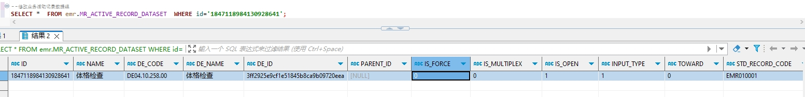

# 领域服务/病历领域 - 修改业务活动记录数据组 - 修改业务活动记录数据组 正向用例
## 请求参数：
``` json
{
  "orgName": "版本测试环境",
  "orgCode": "NXRMYY",
  "list": [
    {
      "updateDate": "2024-10-18 11:34:24",
      "updateUserId": "282475805660160000",
      "isMultiplex": "0",
      "updateUserName": "CS彭彭彭",
      "stdRecordCode": "EMR010001",
      "deId": "3ff2925e9cf1e51845b8ca9b09720eea",
      "toward": "0",
      "isOpen": "1",
      "deName": "体格检查",
      "name": "test123",
      "deCode": "DE04.10.258.00",
      "inputType": "1",
      "stdRecordId": "8645595b02b44437909ef93923c424dd",
      "id": "1847118984130928641",
      "isForce": "0"
    }
  ],
  "operateDate": "2024-10-18 11:34:24",
  "operatorId": "282475805660160000",
  "operatorName": "CS彭彭彭"
}
```
## 返回参数：
``` json
{
    "exception": null,
    "apiCode": null,
    "data": false,
    "Code": 200,
    "Message": "操作成功"
}
```
## 数据校验：

# 领域服务/病历领域 - 修改业务活动记录数据组 - 必填校验-[orgCode]为空
## 请求参数：
``` json
{
  "orgName": "版本测试环境",
  "orgCode": "",
  "list": [
    {
      "updateDate": "2024-10-18 11:34:24",
      "updateUserId": "282475805660160000",
      "isMultiplex": "0",
      "updateUserName": "CS彭彭彭",
      "stdRecordCode": "EMR010001",
      "deId": "3ff2925e9cf1e51845b8ca9b09720eea",
      "toward": "0",
      "isOpen": "1",
      "deName": "体格检查",
      "name": "test123",
      "deCode": "DE04.10.258.00",
      "inputType": "1",
      "stdRecordId": "8645595b02b44437909ef93923c424dd",
      "id": "1847118984130928641",
      "isForce": "0"
    }
  ],
  "operateDate": "2024-10-18 11:34:24",
  "operatorId": "282475805660160000",
  "operatorName": "CS彭彭彭"
}
```
## 返回参数：
``` json
{
  "exception": null,
  "apiCode": null,
  "data": null,
  "Code": 1,
  "Message": "机构编码不能为空"
}
```
# 领域服务/病历领域 - 修改业务活动记录数据组 - 必填校验-[orgName]为空
## 请求参数：
``` json
{
  "orgName": "",
  "orgCode": "NXRMYY",
  "list": [
    {
      "updateDate": "2024-10-18 11:34:24",
      "updateUserId": "282475805660160000",
      "isMultiplex": "0",
      "updateUserName": "CS彭彭彭",
      "stdRecordCode": "EMR010001",
      "deId": "3ff2925e9cf1e51845b8ca9b09720eea",
      "toward": "0",
      "isOpen": "1",
      "deName": "体格检查",
      "name": "test123",
      "deCode": "DE04.10.258.00",
      "inputType": "1",
      "stdRecordId": "8645595b02b44437909ef93923c424dd",
      "id": "1847118984130928641",
      "isForce": "0"
    }
  ],
  "operateDate": "2024-10-18 11:34:24",
  "operatorId": "282475805660160000",
  "operatorName": "CS彭彭彭"
}
```
## 返回参数：
``` json
{
  "exception": null,
  "apiCode": null,
  "data": null,
  "Code": 1,
  "Message": "机构名称不能为空"
}
```
# 领域服务/病历领域 - 修改业务活动记录数据组 - 必填校验-[operatorId]为空
## 请求参数：
``` json
{
  "orgName": "版本测试环境",
  "orgCode": "NXRMYY",
  "list": [
    {
      "updateDate": "2024-10-18 11:34:24",
      "updateUserId": "282475805660160000",
      "isMultiplex": "0",
      "updateUserName": "CS彭彭彭",
      "stdRecordCode": "EMR010001",
      "deId": "3ff2925e9cf1e51845b8ca9b09720eea",
      "toward": "0",
      "isOpen": "1",
      "deName": "体格检查",
      "name": "test123",
      "deCode": "DE04.10.258.00",
      "inputType": "1",
      "stdRecordId": "8645595b02b44437909ef93923c424dd",
      "id": "1847118984130928641",
      "isForce": "0"
    }
  ],
  "operateDate": "2024-10-18 11:34:24",
  "operatorId": "",
  "operatorName": "CS彭彭彭"
}
```
## 返回参数：
``` json
{
  "exception": null,
  "apiCode": null,
  "data": null,
  "Code": 1,
  "Message": "操作人id不能为空"
}
```
# 领域服务/病历领域 - 修改业务活动记录数据组 - 必填校验-[operatorName]为空
## 请求参数：
``` json
{
  "orgName": "版本测试环境",
  "orgCode": "NXRMYY",
  "list": [
    {
      "updateDate": "2024-10-18 11:34:24",
      "updateUserId": "282475805660160000",
      "isMultiplex": "0",
      "updateUserName": "CS彭彭彭",
      "stdRecordCode": "EMR010001",
      "deId": "3ff2925e9cf1e51845b8ca9b09720eea",
      "toward": "0",
      "isOpen": "1",
      "deName": "体格检查",
      "name": "test123",
      "deCode": "DE04.10.258.00",
      "inputType": "1",
      "stdRecordId": "8645595b02b44437909ef93923c424dd",
      "id": "1847118984130928641",
      "isForce": "0"
    }
  ],
  "operateDate": "2024-10-18 11:34:24",
  "operatorId": "282475805660160000",
  "operatorName": ""
}
```
## 返回参数：
``` json
{
  "exception": null,
  "apiCode": null,
  "data": null,
  "Code": 1,
  "Message": "操作人姓名不能为空"
}
```
# 领域服务/病历领域 - 修改业务活动记录数据组 - 必填校验-[operateDate]为空
## 请求参数：
``` json
{
  "orgName": "版本测试环境",
  "orgCode": "NXRMYY",
  "list": [
    {
      "updateDate": "2024-10-18 11:34:24",
      "updateUserId": "282475805660160000",
      "isMultiplex": "0",
      "updateUserName": "CS彭彭彭",
      "stdRecordCode": "EMR010001",
      "deId": "3ff2925e9cf1e51845b8ca9b09720eea",
      "toward": "0",
      "isOpen": "1",
      "deName": "体格检查",
      "name": "test123",
      "deCode": "DE04.10.258.00",
      "inputType": "1",
      "stdRecordId": "8645595b02b44437909ef93923c424dd",
      "id": "1847118984130928641",
      "isForce": "0"
    }
  ],
  "operateDate": "",
  "operatorId": "282475805660160000",
  "operatorName": "CS彭彭彭"
}
```
## 返回参数：
``` json
{
  "exception": null,
  "apiCode": null,
  "data": null,
  "Code": 1,
  "Message": "操作时间不能为空"
}
```
# 领域服务/病历领域 - 修改业务活动记录数据组 - 必填校验-[list]为空
## 请求参数：
``` json
{
  "orgName": "版本测试环境",
  "orgCode": "NXRMYY",
  "list": null,
  "operateDate": "2024-10-18 11:34:24",
  "operatorId": "282475805660160000",
  "operatorName": "CS彭彭彭"
}
```
## 返回参数：
``` json
{
  "exception": null,
  "apiCode": null,
  "data": null,
  "Code": 1,
  "Message": "待修改业务活动记录数据组不能为空"
}
```
# 领域服务/病历领域 - 修改业务活动记录数据组 - 必填校验-[list.id]为空
## 请求参数：
``` json
{
  "orgName": "版本测试环境",
  "orgCode": "NXRMYY",
  "list": [
    {
      "updateDate": "2024-10-18 11:34:24",
      "updateUserId": "282475805660160000",
      "isMultiplex": "0",
      "updateUserName": "CS彭彭彭",
      "stdRecordCode": "EMR010001",
      "deId": "3ff2925e9cf1e51845b8ca9b09720eea",
      "toward": "0",
      "isOpen": "1",
      "deName": "体格检查",
      "name": "test123",
      "deCode": "DE04.10.258.00",
      "inputType": "1",
      "stdRecordId": "8645595b02b44437909ef93923c424dd",
      "id": null,
      "isForce": "0"
    }
  ],
  "operateDate": "2024-10-18 11:34:24",
  "operatorId": "282475805660160000",
  "operatorName": "CS彭彭彭"
}
```
## 返回参数：
``` json
{
  "exception": null,
  "apiCode": null,
  "data": null,
  "Code": 1,
  "Message": "唯一主键id不能为空"
}
```
# 领域服务/病历领域 - 修改业务活动记录数据组 - 必填校验-[list.updateUserId]为空
## 请求参数：
``` json
{
  "orgName": "版本测试环境",
  "orgCode": "NXRMYY",
  "list": [
    {
      "updateDate": "2024-10-18 11:34:24",
      "updateUserId": null,
      "isMultiplex": "0",
      "updateUserName": "CS彭彭彭",
      "stdRecordCode": "EMR010001",
      "deId": "3ff2925e9cf1e51845b8ca9b09720eea",
      "toward": "0",
      "isOpen": "1",
      "deName": "体格检查",
      "name": "test123",
      "deCode": "DE04.10.258.00",
      "inputType": "1",
      "stdRecordId": "8645595b02b44437909ef93923c424dd",
      "id": "1847118984130928641",
      "isForce": "0"
    }
  ],
  "operateDate": "2024-10-18 11:34:24",
  "operatorId": "282475805660160000",
  "operatorName": "CS彭彭彭"
}
```
## 返回参数：
``` json
{
  "exception": null,
  "apiCode": null,
  "data": null,
  "Code": 1,
  "Message": "修改人ID不能为空"
}
```
# 领域服务/病历领域 - 修改业务活动记录数据组 - 必填校验-[list.updateUserName]为空
## 请求参数：
``` json
{
  "orgName": "版本测试环境",
  "orgCode": "NXRMYY",
  "list": [
    {
      "updateDate": "2024-10-18 11:34:24",
      "updateUserId": "282475805660160000",
      "isMultiplex": "0",
      "updateUserName": null,
      "stdRecordCode": "EMR010001",
      "deId": "3ff2925e9cf1e51845b8ca9b09720eea",
      "toward": "0",
      "isOpen": "1",
      "deName": "体格检查",
      "name": "test123",
      "deCode": "DE04.10.258.00",
      "inputType": "1",
      "stdRecordId": "8645595b02b44437909ef93923c424dd",
      "id": "1847118984130928641",
      "isForce": "0"
    }
  ],
  "operateDate": "2024-10-18 11:34:24",
  "operatorId": "282475805660160000",
  "operatorName": "CS彭彭彭"
}
```
## 返回参数：
``` json
{
  "exception": null,
  "apiCode": null,
  "data": null,
  "Code": 1,
  "Message": "修改人姓名不能为空"
}
```
# 领域服务/病历领域 - 修改业务活动记录数据组 - 必填校验-[list.updateDate]为空
## 请求参数：
``` json
{
  "orgName": "版本测试环境",
  "orgCode": "NXRMYY",
  "list": [
    {
      "updateDate": null,
      "updateUserId": "282475805660160000",
      "isMultiplex": "0",
      "updateUserName": "CS彭彭彭",
      "stdRecordCode": "EMR010001",
      "deId": "3ff2925e9cf1e51845b8ca9b09720eea",
      "toward": "0",
      "isOpen": "1",
      "deName": "体格检查",
      "name": "test123",
      "deCode": "DE04.10.258.00",
      "inputType": "1",
      "stdRecordId": "8645595b02b44437909ef93923c424dd",
      "id": "1847118984130928641",
      "isForce": "0"
    }
  ],
  "operateDate": "2024-10-18 11:34:24",
  "operatorId": "282475805660160000",
  "operatorName": "CS彭彭彭"
}
```
## 返回参数：
``` json
{
  "exception": null,
  "apiCode": null,
  "data": null,
  "Code": 1,
  "Message": "修改时间不能为空"
}
```
# 领域服务/病历领域 - 修改业务活动记录数据组 - 必填校验-[list.name]为空
## 请求参数：
``` json
{
  "orgName": "版本测试环境",
  "orgCode": "NXRMYY",
  "list": [
    {
      "updateDate": "2024-10-18 11:34:24",
      "updateUserId": "282475805660160000",
      "isMultiplex": "0",
      "updateUserName": "CS彭彭彭",
      "stdRecordCode": "EMR010001",
      "deId": "3ff2925e9cf1e51845b8ca9b09720eea",
      "toward": "0",
      "isOpen": "1",
      "deName": "体格检查",
      "name": null,
      "deCode": "DE04.10.258.00",
      "inputType": "1",
      "stdRecordId": "8645595b02b44437909ef93923c424dd",
      "id": "1847118984130928641",
      "isForce": "0"
    }
  ],
  "operateDate": "2024-10-18 11:34:24",
  "operatorId": "282475805660160000",
  "operatorName": "CS彭彭彭"
}
```
## 返回参数：
``` json
{
  "exception": null,
  "apiCode": null,
  "data": null,
  "Code": 1,
  "Message": "数据组名称不能为空"
}
```
# 领域服务/病历领域 - 修改业务活动记录数据组 - 必填校验-[list.deCode]为空
## 请求参数：
``` json
{
  "orgName": "版本测试环境",
  "orgCode": "NXRMYY",
  "list": [
    {
      "updateDate": "2024-10-18 11:34:24",
      "updateUserId": "282475805660160000",
      "isMultiplex": "0",
      "updateUserName": "CS彭彭彭",
      "stdRecordCode": "EMR010001",
      "deId": "3ff2925e9cf1e51845b8ca9b09720eea",
      "toward": "0",
      "isOpen": "1",
      "deName": "体格检查",
      "name": "test123",
      "deCode": null,
      "inputType": "1",
      "stdRecordId": "8645595b02b44437909ef93923c424dd",
      "id": "1847118984130928641",
      "isForce": "0"
    }
  ],
  "operateDate": "2024-10-18 11:34:24",
  "operatorId": "282475805660160000",
  "operatorName": "CS彭彭彭"
}
```
## 返回参数：
``` json
{
  "exception": null,
  "apiCode": null,
  "data": null,
  "Code": 1,
  "Message": "对应的临床文档数据组标准编码不能为空"
}
```
# 领域服务/病历领域 - 修改业务活动记录数据组 - 必填校验-[list.deName]为空
## 请求参数：
``` json
{
  "orgName": "版本测试环境",
  "orgCode": "NXRMYY",
  "list": [
    {
      "updateDate": "2024-10-18 11:34:24",
      "updateUserId": "282475805660160000",
      "isMultiplex": "0",
      "updateUserName": "CS彭彭彭",
      "stdRecordCode": "EMR010001",
      "deId": "3ff2925e9cf1e51845b8ca9b09720eea",
      "toward": "0",
      "isOpen": "1",
      "deName": null,
      "name": "test123",
      "deCode": "DE04.10.258.00",
      "inputType": "1",
      "stdRecordId": "8645595b02b44437909ef93923c424dd",
      "id": "1847118984130928641",
      "isForce": "0"
    }
  ],
  "operateDate": "2024-10-18 11:34:24",
  "operatorId": "282475805660160000",
  "operatorName": "CS彭彭彭"
}
```
## 返回参数：
``` json
{
  "exception": null,
  "apiCode": null,
  "data": null,
  "Code": 1,
  "Message": "对应的临床文档数据组标准名称不能为空"
}
```
# 领域服务/病历领域 - 修改业务活动记录数据组 - 必填校验-[list.deId]为空
## 请求参数：
``` json
{
  "orgName": "版本测试环境",
  "orgCode": "NXRMYY",
  "list": [
    {
      "updateDate": "2024-10-18 11:34:24",
      "updateUserId": "282475805660160000",
      "isMultiplex": "0",
      "updateUserName": "CS彭彭彭",
      "stdRecordCode": "EMR010001",
      "deId": null,
      "toward": "0",
      "isOpen": "1",
      "deName": "体格检查",
      "name": "test123",
      "deCode": "DE04.10.258.00",
      "inputType": "1",
      "stdRecordId": "8645595b02b44437909ef93923c424dd",
      "id": "1847118984130928641",
      "isForce": "0"
    }
  ],
  "operateDate": "2024-10-18 11:34:24",
  "operatorId": "282475805660160000",
  "operatorName": "CS彭彭彭"
}
```
## 返回参数：
``` json
{
  "exception": null,
  "apiCode": null,
  "data": null,
  "Code": 1,
  "Message": "标准数据组ID不能为空"
}
```
# 领域服务/病历领域 - 修改业务活动记录数据组 - 必填校验-[list.isForce]为空
## 请求参数：
``` json
{
  "orgName": "版本测试环境",
  "orgCode": "NXRMYY",
  "list": [
    {
      "updateDate": "2024-10-18 11:34:24",
      "updateUserId": "282475805660160000",
      "isMultiplex": "0",
      "updateUserName": "CS彭彭彭",
      "stdRecordCode": "EMR010001",
      "deId": "3ff2925e9cf1e51845b8ca9b09720eea",
      "toward": "0",
      "isOpen": "1",
      "deName": "体格检查",
      "name": "test123",
      "deCode": "DE04.10.258.00",
      "inputType": "1",
      "stdRecordId": "8645595b02b44437909ef93923c424dd",
      "id": "1847118984130928641",
      "isForce": null
    }
  ],
  "operateDate": "2024-10-18 11:34:24",
  "operatorId": "282475805660160000",
  "operatorName": "CS彭彭彭"
}
```
## 返回参数：
``` json
{
  "exception": null,
  "apiCode": null,
  "data": null,
  "Code": 1,
  "Message": "是否强制存在不能为空"
}
```
# 领域服务/病历领域 - 修改业务活动记录数据组 - 必填校验-[list.isMultiplex]为空
## 请求参数：
``` json
{
  "orgName": "版本测试环境",
  "orgCode": "NXRMYY",
  "list": [
    {
      "updateDate": "2024-10-18 11:34:24",
      "updateUserId": "282475805660160000",
      "isMultiplex": null,
      "updateUserName": "CS彭彭彭",
      "stdRecordCode": "EMR010001",
      "deId": "3ff2925e9cf1e51845b8ca9b09720eea",
      "toward": "0",
      "isOpen": "1",
      "deName": "体格检查",
      "name": "test123",
      "deCode": "DE04.10.258.00",
      "inputType": "1",
      "stdRecordId": "8645595b02b44437909ef93923c424dd",
      "id": "1847118984130928641",
      "isForce": "0"
    }
  ],
  "operateDate": "2024-10-18 11:34:24",
  "operatorId": "282475805660160000",
  "operatorName": "CS彭彭彭"
}
```
## 返回参数：
``` json
{
  "exception": null,
  "apiCode": null,
  "data": null,
  "Code": 1,
  "Message": "是否复用不能为空"
}
```
# 领域服务/病历领域 - 修改业务活动记录数据组 - 必填校验-[list.isOpen]为空
## 请求参数：
``` json
{
  "orgName": "版本测试环境",
  "orgCode": "NXRMYY",
  "list": [
    {
      "updateDate": "2024-10-18 11:34:24",
      "updateUserId": "282475805660160000",
      "isMultiplex": "0",
      "updateUserName": "CS彭彭彭",
      "stdRecordCode": "EMR010001",
      "deId": "3ff2925e9cf1e51845b8ca9b09720eea",
      "toward": "0",
      "isOpen": null,
      "deName": "体格检查",
      "name": "test123",
      "deCode": "DE04.10.258.00",
      "inputType": "1",
      "stdRecordId": "8645595b02b44437909ef93923c424dd",
      "id": "1847118984130928641",
      "isForce": "0"
    }
  ],
  "operateDate": "2024-10-18 11:34:24",
  "operatorId": "282475805660160000",
  "operatorName": "CS彭彭彭"
}
```
## 返回参数：
``` json
{
  "exception": null,
  "apiCode": null,
  "data": null,
  "Code": 1,
  "Message": "是否启用不能为空"
}
```
# 领域服务/病历领域 - 修改业务活动记录数据组 - 必填校验-[list.inputType]为空
## 请求参数：
``` json
{
  "orgName": "版本测试环境",
  "orgCode": "NXRMYY",
  "list": [
    {
      "updateDate": "2024-10-18 11:34:24",
      "updateUserId": "282475805660160000",
      "isMultiplex": "0",
      "updateUserName": "CS彭彭彭",
      "stdRecordCode": "EMR010001",
      "deId": "3ff2925e9cf1e51845b8ca9b09720eea",
      "toward": "0",
      "isOpen": "1",
      "deName": "体格检查",
      "name": "test123",
      "deCode": "DE04.10.258.00",
      "inputType": null,
      "stdRecordId": "8645595b02b44437909ef93923c424dd",
      "id": "1847118984130928641",
      "isForce": "0"
    }
  ],
  "operateDate": "2024-10-18 11:34:24",
  "operatorId": "282475805660160000",
  "operatorName": "CS彭彭彭"
}
```
## 返回参数：
``` json
{
  "exception": null,
  "apiCode": null,
  "data": null,
  "Code": 1,
  "Message": "输入类型不能为空"
}
```
# 领域服务/病历领域 - 修改业务活动记录数据组 - 必填校验-[list.stdRecordCode]为空
## 请求参数：
``` json
{
  "orgName": "版本测试环境",
  "orgCode": "NXRMYY",
  "list": [
    {
      "updateDate": "2024-10-18 11:34:24",
      "updateUserId": "282475805660160000",
      "isMultiplex": "0",
      "updateUserName": "CS彭彭彭",
      "stdRecordCode": null,
      "deId": "3ff2925e9cf1e51845b8ca9b09720eea",
      "toward": "0",
      "isOpen": "1",
      "deName": "体格检查",
      "name": "test123",
      "deCode": "DE04.10.258.00",
      "inputType": "1",
      "stdRecordId": "8645595b02b44437909ef93923c424dd",
      "id": "1847118984130928641",
      "isForce": "0"
    }
  ],
  "operateDate": "2024-10-18 11:34:24",
  "operatorId": "282475805660160000",
  "operatorName": "CS彭彭彭"
}
```
## 返回参数：
``` json
{
  "exception": null,
  "apiCode": null,
  "data": null,
  "Code": 1,
  "Message": "所属业务活动记录关联标准编码不能为空"
}
```
# 领域服务/病历领域 - 修改业务活动记录数据组 - 必填校验-[list.stdRecordId]为空
## 请求参数：
``` json
{
  "orgName": "版本测试环境",
  "orgCode": "NXRMYY",
  "list": [
    {
      "updateDate": "2024-10-18 11:34:24",
      "updateUserId": "282475805660160000",
      "isMultiplex": "0",
      "updateUserName": "CS彭彭彭",
      "stdRecordCode": "EMR010001",
      "deId": "3ff2925e9cf1e51845b8ca9b09720eea",
      "toward": "0",
      "isOpen": "1",
      "deName": "体格检查",
      "name": "test123",
      "deCode": "DE04.10.258.00",
      "inputType": "1",
      "stdRecordId": null,
      "id": "1847118984130928641",
      "isForce": "0"
    }
  ],
  "operateDate": "2024-10-18 11:34:24",
  "operatorId": "282475805660160000",
  "operatorName": "CS彭彭彭"
}
```
## 返回参数：
``` json
{
  "exception": null,
  "apiCode": null,
  "data": null,
  "Code": 1,
  "Message": "所属业务活动记录关联id不能为空"
}
```
# 领域服务/病历领域 - 修改业务活动记录数据组 - 枚举用例-[list.isMultiplex] 枚举值为 0(是否复用为否)
## 请求参数：
``` json
{
  "orgName": "版本测试环境",
  "orgCode": "NXRMYY",
  "list": [
    {
      "updateDate": "2024-10-18 11:34:24",
      "updateUserId": "282475805660160000",
      "isMultiplex": "0",
      "updateUserName": "CS彭彭彭",
      "stdRecordCode": "EMR010001",
      "deId": "3ff2925e9cf1e51845b8ca9b09720eea",
      "toward": "0",
      "isOpen": "1",
      "deName": "体格检查",
      "name": "test123",
      "deCode": "DE04.10.258.00",
      "inputType": "1",
      "stdRecordId": "8645595b02b44437909ef93923c424dd",
      "id": "1847118984130928641",
      "isForce": "0"
    }
  ],
  "operateDate": "2024-10-18 11:34:24",
  "operatorId": "282475805660160000",
  "operatorName": "CS彭彭彭"
}
```
## 返回参数：
``` json
{
  "exception": null,
  "apiCode": null,
  "data": null,
  "Code": 1,
  "Message": "修改失败  数据组id 1847118984130928641 在活动记录中不存在"
}
```
# 领域服务/病历领域 - 修改业务活动记录数据组 - 枚举用例-[list.isMultiplex] 枚举值为 1(是否复用为是))
## 请求参数：
``` json
{
  "orgName": "版本测试环境",
  "orgCode": "NXRMYY",
  "list": [
    {
      "updateDate": "2024-10-18 11:34:24",
      "updateUserId": "282475805660160000",
      "isMultiplex": "1",
      "updateUserName": "CS彭彭彭",
      "stdRecordCode": "EMR010001",
      "deId": "3ff2925e9cf1e51845b8ca9b09720eea",
      "toward": "0",
      "isOpen": "1",
      "deName": "体格检查",
      "name": "test123",
      "deCode": "DE04.10.258.00",
      "inputType": "1",
      "stdRecordId": "8645595b02b44437909ef93923c424dd",
      "id": "1847118984130928641",
      "isForce": "0"
    }
  ],
  "operateDate": "2024-10-18 11:34:24",
  "operatorId": "282475805660160000",
  "operatorName": "CS彭彭彭"
}
```
## 返回参数：
``` json
{
  "exception": null,
  "apiCode": null,
  "data": null,
  "Code": 1,
  "Message": "修改失败  数据组id 1847118984130928641 在活动记录中不存在"
}
```
# 领域服务/病历领域 - 修改业务活动记录数据组 - 枚举用例-[list.isOpen] 枚举值为 0(是否启用为否)
## 请求参数：
``` json
{
  "orgName": "版本测试环境",
  "orgCode": "NXRMYY",
  "list": [
    {
      "updateDate": "2024-10-18 11:34:24",
      "updateUserId": "282475805660160000",
      "isMultiplex": "0",
      "updateUserName": "CS彭彭彭",
      "stdRecordCode": "EMR010001",
      "deId": "3ff2925e9cf1e51845b8ca9b09720eea",
      "toward": "0",
      "isOpen": "0",
      "deName": "体格检查",
      "name": "test123",
      "deCode": "DE04.10.258.00",
      "inputType": "1",
      "stdRecordId": "8645595b02b44437909ef93923c424dd",
      "id": "1847118984130928641",
      "isForce": "0"
    }
  ],
  "operateDate": "2024-10-18 11:34:24",
  "operatorId": "282475805660160000",
  "operatorName": "CS彭彭彭"
}
```
## 返回参数：
``` json
{
  "exception": null,
  "apiCode": null,
  "data": null,
  "Code": 1,
  "Message": "修改失败  数据组id 1847118984130928641 在活动记录中不存在"
}
```
# 领域服务/病历领域 - 修改业务活动记录数据组 - 枚举用例-[list.isOpen] 枚举值为 1(是否启用为是)
## 请求参数：
``` json
{
  "orgName": "版本测试环境",
  "orgCode": "NXRMYY",
  "list": [
    {
      "updateDate": "2024-10-18 11:34:24",
      "updateUserId": "282475805660160000",
      "isMultiplex": "0",
      "updateUserName": "CS彭彭彭",
      "stdRecordCode": "EMR010001",
      "deId": "3ff2925e9cf1e51845b8ca9b09720eea",
      "toward": "0",
      "isOpen": "1",
      "deName": "体格检查",
      "name": "test123",
      "deCode": "DE04.10.258.00",
      "inputType": "1",
      "stdRecordId": "8645595b02b44437909ef93923c424dd",
      "id": "1847118984130928641",
      "isForce": "0"
    }
  ],
  "operateDate": "2024-10-18 11:34:24",
  "operatorId": "282475805660160000",
  "operatorName": "CS彭彭彭"
}
```
## 返回参数：
``` json
{
  "exception": null,
  "apiCode": null,
  "data": null,
  "Code": 1,
  "Message": "修改失败  数据组id 1847118984130928641 在活动记录中不存在"
}
```
# 领域服务/病历领域 - 修改业务活动记录数据组 - 枚举用例-[list.inputType] 枚举值为 0(输入类型为输入域)
## 请求参数：
``` json
{
  "orgName": "版本测试环境",
  "orgCode": "NXRMYY",
  "list": [
    {
      "updateDate": "2024-10-18 11:34:24",
      "updateUserId": "282475805660160000",
      "isMultiplex": "0",
      "updateUserName": "CS彭彭彭",
      "stdRecordCode": "EMR010001",
      "deId": "3ff2925e9cf1e51845b8ca9b09720eea",
      "toward": "0",
      "isOpen": "1",
      "deName": "体格检查",
      "name": "test123",
      "deCode": "DE04.10.258.00",
      "inputType": "0",
      "stdRecordId": "8645595b02b44437909ef93923c424dd",
      "id": "1847118984130928641",
      "isForce": "0"
    }
  ],
  "operateDate": "2024-10-18 11:34:24",
  "operatorId": "282475805660160000",
  "operatorName": "CS彭彭彭"
}
```
## 返回参数：
``` json
{
  "exception": null,
  "apiCode": null,
  "data": null,
  "Code": 1,
  "Message": "修改失败  数据组id 1847118984130928641 在活动记录中不存在"
}
```
# 领域服务/病历领域 - 修改业务活动记录数据组 - 枚举用例-[list.inputType] 枚举值为 1(输入类型为表格)
## 请求参数：
``` json
{
  "orgName": "版本测试环境",
  "orgCode": "NXRMYY",
  "list": [
    {
      "updateDate": "2024-10-18 11:34:24",
      "updateUserId": "282475805660160000",
      "isMultiplex": "0",
      "updateUserName": "CS彭彭彭",
      "stdRecordCode": "EMR010001",
      "deId": "3ff2925e9cf1e51845b8ca9b09720eea",
      "toward": "0",
      "isOpen": "1",
      "deName": "体格检查",
      "name": "test123",
      "deCode": "DE04.10.258.00",
      "inputType": "1",
      "stdRecordId": "8645595b02b44437909ef93923c424dd",
      "id": "1847118984130928641",
      "isForce": "0"
    }
  ],
  "operateDate": "2024-10-18 11:34:24",
  "operatorId": "282475805660160000",
  "operatorName": "CS彭彭彭"
}
```
## 返回参数：
``` json
{
  "exception": null,
  "apiCode": null,
  "data": null,
  "Code": 1,
  "Message": "修改失败  数据组id 1847118984130928641 在活动记录中不存在"
}
```
# 领域服务/病历领域 - 修改业务活动记录数据组 - 枚举用例-[list.isForce] 枚举值为 0(是否强制存在为否)
## 请求参数：
``` json
{
  "orgName": "版本测试环境",
  "orgCode": "NXRMYY",
  "list": [
    {
      "updateDate": "2024-10-18 11:34:24",
      "updateUserId": "282475805660160000",
      "isMultiplex": "0",
      "updateUserName": "CS彭彭彭",
      "stdRecordCode": "EMR010001",
      "deId": "3ff2925e9cf1e51845b8ca9b09720eea",
      "toward": "0",
      "isOpen": "1",
      "deName": "体格检查",
      "name": "test123",
      "deCode": "DE04.10.258.00",
      "inputType": "1",
      "stdRecordId": "8645595b02b44437909ef93923c424dd",
      "id": "1847118984130928641",
      "isForce": "0"
    }
  ],
  "operateDate": "2024-10-18 11:34:24",
  "operatorId": "282475805660160000",
  "operatorName": "CS彭彭彭"
}
```
## 返回参数：
``` json
{
  "exception": null,
  "apiCode": null,
  "data": null,
  "Code": 1,
  "Message": "修改失败  数据组id 1847118984130928641 在活动记录中不存在"
}
```
# 领域服务/病历领域 - 修改业务活动记录数据组 - 枚举用例-[list.isForce] 枚举值为 1(是否强制存在为是)
## 请求参数：
``` json
{
  "orgName": "版本测试环境",
  "orgCode": "NXRMYY",
  "list": [
    {
      "updateDate": "2024-10-18 11:34:24",
      "updateUserId": "282475805660160000",
      "isMultiplex": "0",
      "updateUserName": "CS彭彭彭",
      "stdRecordCode": "EMR010001",
      "deId": "3ff2925e9cf1e51845b8ca9b09720eea",
      "toward": "0",
      "isOpen": "1",
      "deName": "体格检查",
      "name": "test123",
      "deCode": "DE04.10.258.00",
      "inputType": "1",
      "stdRecordId": "8645595b02b44437909ef93923c424dd",
      "id": "1847118984130928641",
      "isForce": "1"
    }
  ],
  "operateDate": "2024-10-18 11:34:24",
  "operatorId": "282475805660160000",
  "operatorName": "CS彭彭彭"
}
```
## 返回参数：
``` json
{
  "exception": null,
  "apiCode": null,
  "data": null,
  "Code": 1,
  "Message": "修改失败  数据组id 1847118984130928641 在活动记录中不存在"
}
```
# 领域服务/病历领域 - 修改业务活动记录数据组 - 依赖用例-[operatorName]赋值为依赖用例测试值
## 请求参数：
``` json
{
  "orgName": "版本测试环境",
  "orgCode": "NXRMYY",
  "list": [
    {
      "updateDate": "2024-10-18 11:34:24",
      "updateUserId": "282475805660160000",
      "isMultiplex": "0",
      "updateUserName": "CS彭彭彭",
      "stdRecordCode": "EMR010001",
      "deId": "3ff2925e9cf1e51845b8ca9b09720eea",
      "toward": "0",
      "isOpen": "1",
      "deName": "体格检查",
      "name": "test123",
      "deCode": "DE04.10.258.00",
      "inputType": "1",
      "stdRecordId": "8645595b02b44437909ef93923c424dd",
      "id": "1847118984130928641",
      "isForce": "0"
    }
  ],
  "operateDate": "2024-10-18 11:34:24",
  "operatorId": "282475805660160000",
  "operatorName": "依赖用例测试值"
}
```
## 返回参数：
``` json
{
  "exception": null,
  "apiCode": null,
  "data": null,
  "Code": 1,
  "Message": "修改失败  数据组id 1847118984130928641 在活动记录中不存在"
}
```
# 领域服务/病历领域 - 修改业务活动记录数据组 - 依赖用例-[operatorId]赋值为依赖用例测试值
## 请求参数：
``` json
{
  "orgName": "版本测试环境",
  "orgCode": "NXRMYY",
  "list": [
    {
      "updateDate": "2024-10-18 11:34:24",
      "updateUserId": "282475805660160000",
      "isMultiplex": "0",
      "updateUserName": "CS彭彭彭",
      "stdRecordCode": "EMR010001",
      "deId": "3ff2925e9cf1e51845b8ca9b09720eea",
      "toward": "0",
      "isOpen": "1",
      "deName": "体格检查",
      "name": "test123",
      "deCode": "DE04.10.258.00",
      "inputType": "1",
      "stdRecordId": "8645595b02b44437909ef93923c424dd",
      "id": "1847118984130928641",
      "isForce": "0"
    }
  ],
  "operateDate": "2024-10-18 11:34:24",
  "operatorId": "依赖用例测试值",
  "operatorName": "CS彭彭彭"
}
```
## 返回参数：
``` json
{
  "exception": null,
  "apiCode": null,
  "data": null,
  "Code": 1,
  "Message": "修改失败  数据组id 1847118984130928641 在活动记录中不存在"
}
```
# 领域服务/病历领域 - 修改业务活动记录数据组 - 依赖用例-[list.updateUserId]赋值为依赖用例测试值
## 请求参数：
``` json
{
  "orgName": "版本测试环境",
  "orgCode": "NXRMYY",
  "list": [
    {
      "updateDate": "2024-10-18 11:34:24",
      "updateUserId": "依赖用例测试值",
      "isMultiplex": "0",
      "updateUserName": "CS彭彭彭",
      "stdRecordCode": "EMR010001",
      "deId": "3ff2925e9cf1e51845b8ca9b09720eea",
      "toward": "0",
      "isOpen": "1",
      "deName": "体格检查",
      "name": "test123",
      "deCode": "DE04.10.258.00",
      "inputType": "1",
      "stdRecordId": "8645595b02b44437909ef93923c424dd",
      "id": "1847118984130928641",
      "isForce": "0"
    }
  ],
  "operateDate": "2024-10-18 11:34:24",
  "operatorId": "282475805660160000",
  "operatorName": "CS彭彭彭"
}
```
## 返回参数：
``` json
{
  "exception": null,
  "apiCode": null,
  "data": null,
  "Code": 1,
  "Message": "修改失败  数据组id 1847118984130928641 在活动记录中不存在"
}
```
# 领域服务/病历领域 - 修改业务活动记录数据组 - 依赖用例-[list.updateUserName]赋值为依赖用例测试值
## 请求参数：
``` json
{
  "orgName": "版本测试环境",
  "orgCode": "NXRMYY",
  "list": [
    {
      "updateDate": "2024-10-18 11:34:24",
      "updateUserId": "282475805660160000",
      "isMultiplex": "0",
      "updateUserName": "依赖用例测试值",
      "stdRecordCode": "EMR010001",
      "deId": "3ff2925e9cf1e51845b8ca9b09720eea",
      "toward": "0",
      "isOpen": "1",
      "deName": "体格检查",
      "name": "test123",
      "deCode": "DE04.10.258.00",
      "inputType": "1",
      "stdRecordId": "8645595b02b44437909ef93923c424dd",
      "id": "1847118984130928641",
      "isForce": "0"
    }
  ],
  "operateDate": "2024-10-18 11:34:24",
  "operatorId": "282475805660160000",
  "operatorName": "CS彭彭彭"
}
```
## 返回参数：
``` json
{
  "exception": null,
  "apiCode": null,
  "data": null,
  "Code": 1,
  "Message": "修改失败  数据组id 1847118984130928641 在活动记录中不存在"
}
```
# 领域服务/病历领域 - 修改业务活动记录数据组 - 依赖用例-[list.stdRecordCode]赋值为依赖用例测试值
## 请求参数：
``` json
{
  "orgName": "版本测试环境",
  "orgCode": "NXRMYY",
  "list": [
    {
      "updateDate": "2024-10-18 11:34:24",
      "updateUserId": "282475805660160000",
      "isMultiplex": "0",
      "updateUserName": "CS彭彭彭",
      "stdRecordCode": "依赖用例测试值",
      "deId": "3ff2925e9cf1e51845b8ca9b09720eea",
      "toward": "0",
      "isOpen": "1",
      "deName": "体格检查",
      "name": "test123",
      "deCode": "DE04.10.258.00",
      "inputType": "1",
      "stdRecordId": "8645595b02b44437909ef93923c424dd",
      "id": "1847118984130928641",
      "isForce": "0"
    }
  ],
  "operateDate": "2024-10-18 11:34:24",
  "operatorId": "282475805660160000",
  "operatorName": "CS彭彭彭"
}
```
## 返回参数：
``` json
{
  "exception": null,
  "apiCode": null,
  "data": null,
  "Code": 1,
  "Message": "修改失败  数据组id 1847118984130928641 在活动记录中不存在"
}
```
# 领域服务/病历领域 - 修改业务活动记录数据组 - 依赖用例-[list.name]赋值为依赖用例测试值
## 请求参数：
``` json
{
  "orgName": "版本测试环境",
  "orgCode": "NXRMYY",
  "list": [
    {
      "updateDate": "2024-10-18 11:34:24",
      "updateUserId": "282475805660160000",
      "isMultiplex": "0",
      "updateUserName": "CS彭彭彭",
      "stdRecordCode": "EMR010001",
      "deId": "3ff2925e9cf1e51845b8ca9b09720eea",
      "toward": "0",
      "isOpen": "1",
      "deName": "体格检查",
      "name": "依赖用例测试值",
      "deCode": "DE04.10.258.00",
      "inputType": "1",
      "stdRecordId": "8645595b02b44437909ef93923c424dd",
      "id": "1847118984130928641",
      "isForce": "0"
    }
  ],
  "operateDate": "2024-10-18 11:34:24",
  "operatorId": "282475805660160000",
  "operatorName": "CS彭彭彭"
}
```
## 返回参数：
``` json
{
  "exception": null,
  "apiCode": null,
  "data": null,
  "Code": 1,
  "Message": "修改失败  数据组id 1847118984130928641 在活动记录中不存在"
}
```
# 领域服务/病历领域 - 修改业务活动记录数据组 - 依赖用例-[list.stdRecordId]赋值为依赖用例测试值
## 请求参数：
``` json
{
  "orgName": "版本测试环境",
  "orgCode": "NXRMYY",
  "list": [
    {
      "updateDate": "2024-10-18 11:34:24",
      "updateUserId": "282475805660160000",
      "isMultiplex": "0",
      "updateUserName": "CS彭彭彭",
      "stdRecordCode": "EMR010001",
      "deId": "3ff2925e9cf1e51845b8ca9b09720eea",
      "toward": "0",
      "isOpen": "1",
      "deName": "体格检查",
      "name": "test123",
      "deCode": "DE04.10.258.00",
      "inputType": "1",
      "stdRecordId": "依赖用例测试值",
      "id": "1847118984130928641",
      "isForce": "0"
    }
  ],
  "operateDate": "2024-10-18 11:34:24",
  "operatorId": "282475805660160000",
  "operatorName": "CS彭彭彭"
}
```
## 返回参数：
``` json
{
  "exception": null,
  "apiCode": null,
  "data": null,
  "Code": 1,
  "Message": "修改失败  数据组id 1847118984130928641 在活动记录中不存在"
}
```
# 领域服务/病历领域 - 修改业务活动记录数据组 - 依赖用例-[list.id]赋值为依赖用例测试值
## 请求参数：
``` json
{
  "orgName": "版本测试环境",
  "orgCode": "NXRMYY",
  "list": [
    {
      "updateDate": "2024-10-18 11:34:24",
      "updateUserId": "282475805660160000",
      "isMultiplex": "0",
      "updateUserName": "CS彭彭彭",
      "stdRecordCode": "EMR010001",
      "deId": "3ff2925e9cf1e51845b8ca9b09720eea",
      "toward": "0",
      "isOpen": "1",
      "deName": "体格检查",
      "name": "test123",
      "deCode": "DE04.10.258.00",
      "inputType": "1",
      "stdRecordId": "8645595b02b44437909ef93923c424dd",
      "id": "依赖用例测试值",
      "isForce": "0"
    }
  ],
  "operateDate": "2024-10-18 11:34:24",
  "operatorId": "282475805660160000",
  "operatorName": "CS彭彭彭"
}
```
## 返回参数：
``` json
{
  "exception": null,
  "apiCode": null,
  "data": null,
  "Code": 1,
  "Message": "修改失败  数据组id 依赖用例测试值 在活动记录中不存在"
}
```
# 领域服务/病历领域 - 修改业务活动记录数据组 - 依赖用例-[orgCode]赋值为依赖用例测试值
## 请求参数：
``` json
{
  "orgName": "版本测试环境",
  "orgCode": "依赖用例测试值",
  "list": [
    {
      "updateDate": "2024-10-18 11:34:24",
      "updateUserId": "282475805660160000",
      "isMultiplex": "0",
      "updateUserName": "CS彭彭彭",
      "stdRecordCode": "EMR010001",
      "deId": "3ff2925e9cf1e51845b8ca9b09720eea",
      "toward": "0",
      "isOpen": "1",
      "deName": "体格检查",
      "name": "test123",
      "deCode": "DE04.10.258.00",
      "inputType": "1",
      "stdRecordId": "8645595b02b44437909ef93923c424dd",
      "id": "1847118984130928641",
      "isForce": "0"
    }
  ],
  "operateDate": "2024-10-18 11:34:24",
  "operatorId": "282475805660160000",
  "operatorName": "CS彭彭彭"
}
```
## 返回参数：
``` json
{
  "exception": null,
  "apiCode": null,
  "data": null,
  "Code": 1,
  "Message": "修改失败  数据组id 1847118984130928641 在活动记录中不存在"
}
```
# 领域服务/病历领域 - 修改业务活动记录数据组 - 依赖用例-[orgName]赋值为依赖用例测试值
## 请求参数：
``` json
{
  "orgName": "依赖用例测试值",
  "orgCode": "NXRMYY",
  "list": [
    {
      "updateDate": "2024-10-18 11:34:24",
      "updateUserId": "282475805660160000",
      "isMultiplex": "0",
      "updateUserName": "CS彭彭彭",
      "stdRecordCode": "EMR010001",
      "deId": "3ff2925e9cf1e51845b8ca9b09720eea",
      "toward": "0",
      "isOpen": "1",
      "deName": "体格检查",
      "name": "test123",
      "deCode": "DE04.10.258.00",
      "inputType": "1",
      "stdRecordId": "8645595b02b44437909ef93923c424dd",
      "id": "1847118984130928641",
      "isForce": "0"
    }
  ],
  "operateDate": "2024-10-18 11:34:24",
  "operatorId": "282475805660160000",
  "operatorName": "CS彭彭彭"
}
```
## 返回参数：
``` json
{
  "exception": null,
  "apiCode": null,
  "data": null,
  "Code": 1,
  "Message": "修改失败  数据组id 1847118984130928641 在活动记录中不存在"
}
```