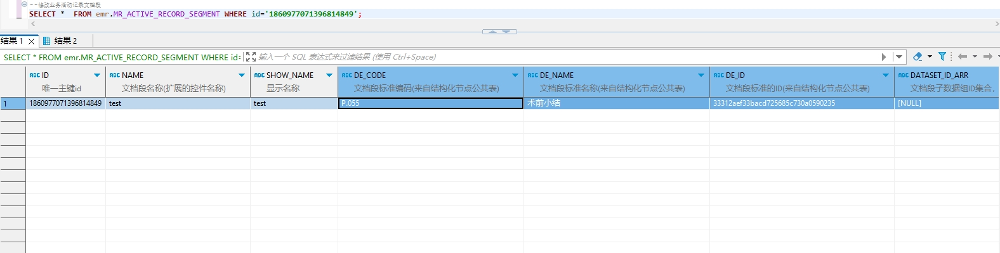

# 领域服务/病历领域 - 修改业务活动记录文档段 - 修改业务活动记录文档段 正向用例
## 请求参数：
``` json
{
    "orgName": "版本测试环境",
    "hospCode": "NXRY",
    "hospName": "版本测试环境",
    "orgCode": "NXRMYY",
    "list": [
        {
            "updateDate": "2024-10-16 17:25:41",
            "showName": "test",
            "updateUserId": "282475805660160000",
            "updateUserName": "CS彭彭彭",
            "stdRecordCode": "EMR010002",
            "deId": "33312aef33bacd725685c730a0590235",
            "deName": "术前小结",
            "name": "test",
            "deCode": "P.055",
            "stdRecordId": "ae86dc9b9e8e4a18bea87c2abc049e5c",
            "id": "1860980268622479362",
            "isForce": "0"
        }
    ],
    "operateDate": "2024-10-16 17:25:41",
    "operatorId": "282475805660160000",
    "operatorName": "CS彭彭彭"
}
```
## 返回参数：
``` json
{
    "exception": null,
    "apiCode": null,
    "data": true,
    "Code": 200,
    "Message": "操作成功"
}
```
## 数据校验：

# 领域服务/病历领域 - 修改业务活动记录文档段 - 必填校验-[orgCode]为空
## 请求参数：
``` json
{
  "orgName": "版本测试环境",
  "hospCode": "NXRY",
  "hospName": "版本测试环境",
  "orgCode": "",
  "list": [
    {
      "updateDate": "2024-10-16 17:25:41",
      "showName": "test",
      "updateUserId": "282475805660160000",
      "updateUserName": "CS彭彭彭",
      "stdRecordCode": "EMR010002",
      "deId": "33312aef33bacd725685c730a0590235",
      "deName": "术前小结",
      "name": "test",
      "deCode": "P.055",
      "stdRecordId": "ae86dc9b9e8e4a18bea87c2abc049e5c",
      "id": "1846482621391978497",
      "isForce": "0"
    }
  ],
  "operateDate": "2024-10-16 17:25:41",
  "operatorId": "282475805660160000",
  "operatorName": "CS彭彭彭"
}
```
## 返回参数：
``` json
{
  "exception": null,
  "apiCode": null,
  "data": null,
  "Code": 1,
  "Message": "机构编码不能为空"
}
```
# 领域服务/病历领域 - 修改业务活动记录文档段 - 必填校验-[orgName]为空
## 请求参数：
``` json
{
  "orgName": "",
  "hospCode": "NXRY",
  "hospName": "版本测试环境",
  "orgCode": "NXRMYY",
  "list": [
    {
      "updateDate": "2024-10-16 17:25:41",
      "showName": "test",
      "updateUserId": "282475805660160000",
      "updateUserName": "CS彭彭彭",
      "stdRecordCode": "EMR010002",
      "deId": "33312aef33bacd725685c730a0590235",
      "deName": "术前小结",
      "name": "test",
      "deCode": "P.055",
      "stdRecordId": "ae86dc9b9e8e4a18bea87c2abc049e5c",
      "id": "1846482621391978497",
      "isForce": "0"
    }
  ],
  "operateDate": "2024-10-16 17:25:41",
  "operatorId": "282475805660160000",
  "operatorName": "CS彭彭彭"
}
```
## 返回参数：
``` json
{
  "exception": null,
  "apiCode": null,
  "data": null,
  "Code": 1,
  "Message": "机构名称不能为空"
}
```
# 领域服务/病历领域 - 修改业务活动记录文档段 - 必填校验-[operatorId]为空
## 请求参数：
``` json
{
  "orgName": "版本测试环境",
  "hospCode": "NXRY",
  "hospName": "版本测试环境",
  "orgCode": "NXRMYY",
  "list": [
    {
      "updateDate": "2024-10-16 17:25:41",
      "showName": "test",
      "updateUserId": "282475805660160000",
      "updateUserName": "CS彭彭彭",
      "stdRecordCode": "EMR010002",
      "deId": "33312aef33bacd725685c730a0590235",
      "deName": "术前小结",
      "name": "test",
      "deCode": "P.055",
      "stdRecordId": "ae86dc9b9e8e4a18bea87c2abc049e5c",
      "id": "1846482621391978497",
      "isForce": "0"
    }
  ],
  "operateDate": "2024-10-16 17:25:41",
  "operatorId": "",
  "operatorName": "CS彭彭彭"
}
```
## 返回参数：
``` json
{
  "exception": null,
  "apiCode": null,
  "data": null,
  "Code": 1,
  "Message": "操作人id不能为空"
}
```
# 领域服务/病历领域 - 修改业务活动记录文档段 - 必填校验-[operatorName]为空
## 请求参数：
``` json
{
  "orgName": "版本测试环境",
  "hospCode": "NXRY",
  "hospName": "版本测试环境",
  "orgCode": "NXRMYY",
  "list": [
    {
      "updateDate": "2024-10-16 17:25:41",
      "showName": "test",
      "updateUserId": "282475805660160000",
      "updateUserName": "CS彭彭彭",
      "stdRecordCode": "EMR010002",
      "deId": "33312aef33bacd725685c730a0590235",
      "deName": "术前小结",
      "name": "test",
      "deCode": "P.055",
      "stdRecordId": "ae86dc9b9e8e4a18bea87c2abc049e5c",
      "id": "1846482621391978497",
      "isForce": "0"
    }
  ],
  "operateDate": "2024-10-16 17:25:41",
  "operatorId": "282475805660160000",
  "operatorName": ""
}
```
## 返回参数：
``` json
{
  "exception": null,
  "apiCode": null,
  "data": null,
  "Code": 1,
  "Message": "操作人姓名不能为空"
}
```
# 领域服务/病历领域 - 修改业务活动记录文档段 - 必填校验-[operateDate]为空
## 请求参数：
``` json
{
  "orgName": "版本测试环境",
  "hospCode": "NXRY",
  "hospName": "版本测试环境",
  "orgCode": "NXRMYY",
  "list": [
    {
      "updateDate": "2024-10-16 17:25:41",
      "showName": "test",
      "updateUserId": "282475805660160000",
      "updateUserName": "CS彭彭彭",
      "stdRecordCode": "EMR010002",
      "deId": "33312aef33bacd725685c730a0590235",
      "deName": "术前小结",
      "name": "test",
      "deCode": "P.055",
      "stdRecordId": "ae86dc9b9e8e4a18bea87c2abc049e5c",
      "id": "1846482621391978497",
      "isForce": "0"
    }
  ],
  "operateDate": "",
  "operatorId": "282475805660160000",
  "operatorName": "CS彭彭彭"
}
```
## 返回参数：
``` json
{
  "exception": null,
  "apiCode": null,
  "data": null,
  "Code": 1,
  "Message": "操作时间不能为空"
}
```
# 领域服务/病历领域 - 修改业务活动记录文档段 - 必填校验-[hospCode]为空
## 请求参数：
``` json
{
  "orgName": "版本测试环境",
  "hospCode": "",
  "hospName": "版本测试环境",
  "orgCode": "NXRMYY",
  "list": [
    {
      "updateDate": "2024-10-16 17:25:41",
      "showName": "test",
      "updateUserId": "282475805660160000",
      "updateUserName": "CS彭彭彭",
      "stdRecordCode": "EMR010002",
      "deId": "33312aef33bacd725685c730a0590235",
      "deName": "术前小结",
      "name": "test",
      "deCode": "P.055",
      "stdRecordId": "ae86dc9b9e8e4a18bea87c2abc049e5c",
      "id": "1846482621391978497",
      "isForce": "0"
    }
  ],
  "operateDate": "2024-10-16 17:25:41",
  "operatorId": "282475805660160000",
  "operatorName": "CS彭彭彭"
}
```
## 返回参数：
``` json
{
  "exception": null,
  "apiCode": null,
  "data": null,
  "Code": 1,
  "Message": "院区编码不能为空"
}
```
# 领域服务/病历领域 - 修改业务活动记录文档段 - 必填校验-[hospName]为空
## 请求参数：
``` json
{
  "orgName": "版本测试环境",
  "hospCode": "NXRY",
  "hospName": "",
  "orgCode": "NXRMYY",
  "list": [
    {
      "updateDate": "2024-10-16 17:25:41",
      "showName": "test",
      "updateUserId": "282475805660160000",
      "updateUserName": "CS彭彭彭",
      "stdRecordCode": "EMR010002",
      "deId": "33312aef33bacd725685c730a0590235",
      "deName": "术前小结",
      "name": "test",
      "deCode": "P.055",
      "stdRecordId": "ae86dc9b9e8e4a18bea87c2abc049e5c",
      "id": "1846482621391978497",
      "isForce": "0"
    }
  ],
  "operateDate": "2024-10-16 17:25:41",
  "operatorId": "282475805660160000",
  "operatorName": "CS彭彭彭"
}
```
## 返回参数：
``` json
{
  "exception": null,
  "apiCode": null,
  "data": null,
  "Code": 1,
  "Message": "院区名称不能为空"
}
```
# 领域服务/病历领域 - 修改业务活动记录文档段 - 必填校验-[list]为空
## 请求参数：
``` json
{
  "orgName": "版本测试环境",
  "hospCode": "NXRY",
  "hospName": "版本测试环境",
  "orgCode": "NXRMYY",
  "list": null,
  "operateDate": "2024-10-16 17:25:41",
  "operatorId": "282475805660160000",
  "operatorName": "CS彭彭彭"
}
```
## 返回参数：
``` json
{
  "exception": null,
  "apiCode": null,
  "data": null,
  "Code": 1,
  "Message": "待修改业务活动记录中的文档段对象集合不能为空"
}
```
# 领域服务/病历领域 - 修改业务活动记录文档段 - 必填校验-[list.id]为空
## 请求参数：
``` json
{
  "orgName": "版本测试环境",
  "hospCode": "NXRY",
  "hospName": "版本测试环境",
  "orgCode": "NXRMYY",
  "list": [
    {
      "updateDate": "2024-10-16 17:25:41",
      "showName": "test",
      "updateUserId": "282475805660160000",
      "updateUserName": "CS彭彭彭",
      "stdRecordCode": "EMR010002",
      "deId": "33312aef33bacd725685c730a0590235",
      "deName": "术前小结",
      "name": "test",
      "deCode": "P.055",
      "stdRecordId": "ae86dc9b9e8e4a18bea87c2abc049e5c",
      "id": null,
      "isForce": "0"
    }
  ],
  "operateDate": "2024-10-16 17:25:41",
  "operatorId": "282475805660160000",
  "operatorName": "CS彭彭彭"
}
```
## 返回参数：
``` json
{
  "exception": null,
  "apiCode": null,
  "data": null,
  "Code": 1,
  "Message": "唯一主键id不能为空"
}
```
# 领域服务/病历领域 - 修改业务活动记录文档段 - 必填校验-[list.updateUserId]为空
## 请求参数：
``` json
{
  "orgName": "版本测试环境",
  "hospCode": "NXRY",
  "hospName": "版本测试环境",
  "orgCode": "NXRMYY",
  "list": [
    {
      "updateDate": "2024-10-16 17:25:41",
      "showName": "test",
      "updateUserId": null,
      "updateUserName": "CS彭彭彭",
      "stdRecordCode": "EMR010002",
      "deId": "33312aef33bacd725685c730a0590235",
      "deName": "术前小结",
      "name": "test",
      "deCode": "P.055",
      "stdRecordId": "ae86dc9b9e8e4a18bea87c2abc049e5c",
      "id": "1846482621391978497",
      "isForce": "0"
    }
  ],
  "operateDate": "2024-10-16 17:25:41",
  "operatorId": "282475805660160000",
  "operatorName": "CS彭彭彭"
}
```
## 返回参数：
``` json
{
  "exception": null,
  "apiCode": null,
  "data": null,
  "Code": 1,
  "Message": "修改人ID不能为空"
}
```
# 领域服务/病历领域 - 修改业务活动记录文档段 - 必填校验-[list.updateUserName]为空
## 请求参数：
``` json
{
  "orgName": "版本测试环境",
  "hospCode": "NXRY",
  "hospName": "版本测试环境",
  "orgCode": "NXRMYY",
  "list": [
    {
      "updateDate": "2024-10-16 17:25:41",
      "showName": "test",
      "updateUserId": "282475805660160000",
      "updateUserName": null,
      "stdRecordCode": "EMR010002",
      "deId": "33312aef33bacd725685c730a0590235",
      "deName": "术前小结",
      "name": "test",
      "deCode": "P.055",
      "stdRecordId": "ae86dc9b9e8e4a18bea87c2abc049e5c",
      "id": "1846482621391978497",
      "isForce": "0"
    }
  ],
  "operateDate": "2024-10-16 17:25:41",
  "operatorId": "282475805660160000",
  "operatorName": "CS彭彭彭"
}
```
## 返回参数：
``` json
{
  "exception": null,
  "apiCode": null,
  "data": null,
  "Code": 1,
  "Message": "修改人姓名不能为空"
}
```
# 领域服务/病历领域 - 修改业务活动记录文档段 - 必填校验-[list.updateDate]为空
## 请求参数：
``` json
{
  "orgName": "版本测试环境",
  "hospCode": "NXRY",
  "hospName": "版本测试环境",
  "orgCode": "NXRMYY",
  "list": [
    {
      "updateDate": null,
      "showName": "test",
      "updateUserId": "282475805660160000",
      "updateUserName": "CS彭彭彭",
      "stdRecordCode": "EMR010002",
      "deId": "33312aef33bacd725685c730a0590235",
      "deName": "术前小结",
      "name": "test",
      "deCode": "P.055",
      "stdRecordId": "ae86dc9b9e8e4a18bea87c2abc049e5c",
      "id": "1846482621391978497",
      "isForce": "0"
    }
  ],
  "operateDate": "2024-10-16 17:25:41",
  "operatorId": "282475805660160000",
  "operatorName": "CS彭彭彭"
}
```
## 返回参数：
``` json
{
  "exception": null,
  "apiCode": null,
  "data": null,
  "Code": 1,
  "Message": "修改时间不能为空"
}
```
# 领域服务/病历领域 - 修改业务活动记录文档段 - 必填校验-[list.name]为空
## 请求参数：
``` json
{
  "orgName": "版本测试环境",
  "hospCode": "NXRY",
  "hospName": "版本测试环境",
  "orgCode": "NXRMYY",
  "list": [
    {
      "updateDate": "2024-10-16 17:25:41",
      "showName": "test",
      "updateUserId": "282475805660160000",
      "updateUserName": "CS彭彭彭",
      "stdRecordCode": "EMR010002",
      "deId": "33312aef33bacd725685c730a0590235",
      "deName": "术前小结",
      "name": null,
      "deCode": "P.055",
      "stdRecordId": "ae86dc9b9e8e4a18bea87c2abc049e5c",
      "id": "1846482621391978497",
      "isForce": "0"
    }
  ],
  "operateDate": "2024-10-16 17:25:41",
  "operatorId": "282475805660160000",
  "operatorName": "CS彭彭彭"
}
```
## 返回参数：
``` json
{
  "exception": null,
  "apiCode": null,
  "data": null,
  "Code": 1,
  "Message": "文档段名称不能为空"
}
```
# 领域服务/病历领域 - 修改业务活动记录文档段 - 必填校验-[list.deCode]为空
## 请求参数：
``` json
{
  "orgName": "版本测试环境",
  "hospCode": "NXRY",
  "hospName": "版本测试环境",
  "orgCode": "NXRMYY",
  "list": [
    {
      "updateDate": "2024-10-16 17:25:41",
      "showName": "test",
      "updateUserId": "282475805660160000",
      "updateUserName": "CS彭彭彭",
      "stdRecordCode": "EMR010002",
      "deId": "33312aef33bacd725685c730a0590235",
      "deName": "术前小结",
      "name": "test",
      "deCode": null,
      "stdRecordId": "ae86dc9b9e8e4a18bea87c2abc049e5c",
      "id": "1846482621391978497",
      "isForce": "0"
    }
  ],
  "operateDate": "2024-10-16 17:25:41",
  "operatorId": "282475805660160000",
  "operatorName": "CS彭彭彭"
}
```
## 返回参数：
``` json
{
  "exception": null,
  "apiCode": null,
  "data": null,
  "Code": 1,
  "Message": "文档段标准编码不能为空"
}
```
# 领域服务/病历领域 - 修改业务活动记录文档段 - 必填校验-[list.deName]为空
## 请求参数：
``` json
{
  "orgName": "版本测试环境",
  "hospCode": "NXRY",
  "hospName": "版本测试环境",
  "orgCode": "NXRMYY",
  "list": [
    {
      "updateDate": "2024-10-16 17:25:41",
      "showName": "test",
      "updateUserId": "282475805660160000",
      "updateUserName": "CS彭彭彭",
      "stdRecordCode": "EMR010002",
      "deId": "33312aef33bacd725685c730a0590235",
      "deName": null,
      "name": "test",
      "deCode": "P.055",
      "stdRecordId": "ae86dc9b9e8e4a18bea87c2abc049e5c",
      "id": "1846482621391978497",
      "isForce": "0"
    }
  ],
  "operateDate": "2024-10-16 17:25:41",
  "operatorId": "282475805660160000",
  "operatorName": "CS彭彭彭"
}
```
## 返回参数：
``` json
{
  "exception": null,
  "apiCode": null,
  "data": null,
  "Code": 1,
  "Message": "文档段标准名称不能为空"
}
```
# 领域服务/病历领域 - 修改业务活动记录文档段 - 必填校验-[list.deId]为空
## 请求参数：
``` json
{
  "orgName": "版本测试环境",
  "hospCode": "NXRY",
  "hospName": "版本测试环境",
  "orgCode": "NXRMYY",
  "list": [
    {
      "updateDate": "2024-10-16 17:25:41",
      "showName": "test",
      "updateUserId": "282475805660160000",
      "updateUserName": "CS彭彭彭",
      "stdRecordCode": "EMR010002",
      "deId": null,
      "deName": "术前小结",
      "name": "test",
      "deCode": "P.055",
      "stdRecordId": "ae86dc9b9e8e4a18bea87c2abc049e5c",
      "id": "1846482621391978497",
      "isForce": "0"
    }
  ],
  "operateDate": "2024-10-16 17:25:41",
  "operatorId": "282475805660160000",
  "operatorName": "CS彭彭彭"
}
```
## 返回参数：
``` json
{
  "exception": null,
  "apiCode": null,
  "data": null,
  "Code": 1,
  "Message": "文档段标准的ID不能为空"
}
```
# 领域服务/病历领域 - 修改业务活动记录文档段 - 必填校验-[list.isForce]为空
## 请求参数：
``` json
{
  "orgName": "版本测试环境",
  "hospCode": "NXRY",
  "hospName": "版本测试环境",
  "orgCode": "NXRMYY",
  "list": [
    {
      "updateDate": "2024-10-16 17:25:41",
      "showName": "test",
      "updateUserId": "282475805660160000",
      "updateUserName": "CS彭彭彭",
      "stdRecordCode": "EMR010002",
      "deId": "33312aef33bacd725685c730a0590235",
      "deName": "术前小结",
      "name": "test",
      "deCode": "P.055",
      "stdRecordId": "ae86dc9b9e8e4a18bea87c2abc049e5c",
      "id": "1846482621391978497",
      "isForce": null
    }
  ],
  "operateDate": "2024-10-16 17:25:41",
  "operatorId": "282475805660160000",
  "operatorName": "CS彭彭彭"
}
```
## 返回参数：
``` json
{
  "exception": null,
  "apiCode": null,
  "data": null,
  "Code": 1,
  "Message": "是否强制存在不能为空"
}
```
# 领域服务/病历领域 - 修改业务活动记录文档段 - 必填校验-[list.stdRecordId]为空
## 请求参数：
``` json
{
  "orgName": "版本测试环境",
  "hospCode": "NXRY",
  "hospName": "版本测试环境",
  "orgCode": "NXRMYY",
  "list": [
    {
      "updateDate": "2024-10-16 17:25:41",
      "showName": "test",
      "updateUserId": "282475805660160000",
      "updateUserName": "CS彭彭彭",
      "stdRecordCode": "EMR010002",
      "deId": "33312aef33bacd725685c730a0590235",
      "deName": "术前小结",
      "name": "test",
      "deCode": "P.055",
      "stdRecordId": null,
      "id": "1846482621391978497",
      "isForce": "0"
    }
  ],
  "operateDate": "2024-10-16 17:25:41",
  "operatorId": "282475805660160000",
  "operatorName": "CS彭彭彭"
}
```
## 返回参数：
``` json
{
  "exception": null,
  "apiCode": null,
  "data": null,
  "Code": 1,
  "Message": "所属业务活动记录关联id不能为空"
}
```
# 领域服务/病历领域 - 修改业务活动记录文档段 - 必填校验-[list.stdRecordCode]为空
## 请求参数：
``` json
{
  "orgName": "版本测试环境",
  "hospCode": "NXRY",
  "hospName": "版本测试环境",
  "orgCode": "NXRMYY",
  "list": [
    {
      "updateDate": "2024-10-16 17:25:41",
      "showName": "test",
      "updateUserId": "282475805660160000",
      "updateUserName": "CS彭彭彭",
      "stdRecordCode": null,
      "deId": "33312aef33bacd725685c730a0590235",
      "deName": "术前小结",
      "name": "test",
      "deCode": "P.055",
      "stdRecordId": "ae86dc9b9e8e4a18bea87c2abc049e5c",
      "id": "1846482621391978497",
      "isForce": "0"
    }
  ],
  "operateDate": "2024-10-16 17:25:41",
  "operatorId": "282475805660160000",
  "operatorName": "CS彭彭彭"
}
```
## 返回参数：
``` json
{
  "exception": null,
  "apiCode": null,
  "data": null,
  "Code": 1,
  "Message": "所属业务活动记录的标准编码不能为空"
}
```
# 领域服务/病历领域 - 修改业务活动记录文档段 - 枚举用例-[list.isForce] 枚举值为 0(是否强制存在为否)
## 请求参数：
``` json
{
  "orgName": "版本测试环境",
  "hospCode": "NXRY",
  "hospName": "版本测试环境",
  "orgCode": "NXRMYY",
  "list": [
    {
      "updateDate": "2024-10-16 17:25:41",
      "showName": "test",
      "updateUserId": "282475805660160000",
      "updateUserName": "CS彭彭彭",
      "stdRecordCode": "EMR010002",
      "deId": "33312aef33bacd725685c730a0590235",
      "deName": "术前小结",
      "name": "test",
      "deCode": "P.055",
      "stdRecordId": "ae86dc9b9e8e4a18bea87c2abc049e5c",
      "id": "1846482621391978497",
      "isForce": "0"
    }
  ],
  "operateDate": "2024-10-16 17:25:41",
  "operatorId": "282475805660160000",
  "operatorName": "CS彭彭彭"
}
```
## 返回参数：
``` json
{
  "exception": null,
  "apiCode": null,
  "data": null,
  "Code": 1,
  "Message": "修改失败  消息段  不存在"
}
```
# 领域服务/病历领域 - 修改业务活动记录文档段 - 枚举用例-[list.isForce] 枚举值为 1(是否强制存在为是)
## 请求参数：
``` json
{
  "orgName": "版本测试环境",
  "hospCode": "NXRY",
  "hospName": "版本测试环境",
  "orgCode": "NXRMYY",
  "list": [
    {
      "updateDate": "2024-10-16 17:25:41",
      "showName": "test",
      "updateUserId": "282475805660160000",
      "updateUserName": "CS彭彭彭",
      "stdRecordCode": "EMR010002",
      "deId": "33312aef33bacd725685c730a0590235",
      "deName": "术前小结",
      "name": "test",
      "deCode": "P.055",
      "stdRecordId": "ae86dc9b9e8e4a18bea87c2abc049e5c",
      "id": "1846482621391978497",
      "isForce": "1"
    }
  ],
  "operateDate": "2024-10-16 17:25:41",
  "operatorId": "282475805660160000",
  "operatorName": "CS彭彭彭"
}
```
## 返回参数：
``` json
{
  "exception": null,
  "apiCode": null,
  "data": null,
  "Code": 1,
  "Message": "修改失败  消息段  不存在"
}
```
# 领域服务/病历领域 - 修改业务活动记录文档段 - 依赖用例-[operatorName]赋值为依赖用例测试值
## 请求参数：
``` json
{
  "orgName": "版本测试环境",
  "hospCode": "NXRY",
  "hospName": "版本测试环境",
  "orgCode": "NXRMYY",
  "list": [
    {
      "updateDate": "2024-10-16 17:25:41",
      "showName": "test",
      "updateUserId": "282475805660160000",
      "updateUserName": "CS彭彭彭",
      "stdRecordCode": "EMR010002",
      "deId": "33312aef33bacd725685c730a0590235",
      "deName": "术前小结",
      "name": "test",
      "deCode": "P.055",
      "stdRecordId": "ae86dc9b9e8e4a18bea87c2abc049e5c",
      "id": "1846482621391978497",
      "isForce": "0"
    }
  ],
  "operateDate": "2024-10-16 17:25:41",
  "operatorId": "282475805660160000",
  "operatorName": "依赖用例测试值"
}
```
## 返回参数：
``` json
{
  "exception": null,
  "apiCode": null,
  "data": null,
  "Code": 1,
  "Message": "修改失败  消息段  不存在"
}
```
# 领域服务/病历领域 - 修改业务活动记录文档段 - 依赖用例-[operatorId]赋值为依赖用例测试值
## 请求参数：
``` json
{
  "orgName": "版本测试环境",
  "hospCode": "NXRY",
  "hospName": "版本测试环境",
  "orgCode": "NXRMYY",
  "list": [
    {
      "updateDate": "2024-10-16 17:25:41",
      "showName": "test",
      "updateUserId": "282475805660160000",
      "updateUserName": "CS彭彭彭",
      "stdRecordCode": "EMR010002",
      "deId": "33312aef33bacd725685c730a0590235",
      "deName": "术前小结",
      "name": "test",
      "deCode": "P.055",
      "stdRecordId": "ae86dc9b9e8e4a18bea87c2abc049e5c",
      "id": "1846482621391978497",
      "isForce": "0"
    }
  ],
  "operateDate": "2024-10-16 17:25:41",
  "operatorId": "依赖用例测试值",
  "operatorName": "CS彭彭彭"
}
```
## 返回参数：
``` json
{
  "exception": null,
  "apiCode": null,
  "data": null,
  "Code": 1,
  "Message": "修改失败  消息段  不存在"
}
```
# 领域服务/病历领域 - 修改业务活动记录文档段 - 依赖用例-[list.updateUserId]赋值为依赖用例测试值
## 请求参数：
``` json
{
  "orgName": "版本测试环境",
  "hospCode": "NXRY",
  "hospName": "版本测试环境",
  "orgCode": "NXRMYY",
  "list": [
    {
      "updateDate": "2024-10-16 17:25:41",
      "showName": "test",
      "updateUserId": "依赖用例测试值",
      "updateUserName": "CS彭彭彭",
      "stdRecordCode": "EMR010002",
      "deId": "33312aef33bacd725685c730a0590235",
      "deName": "术前小结",
      "name": "test",
      "deCode": "P.055",
      "stdRecordId": "ae86dc9b9e8e4a18bea87c2abc049e5c",
      "id": "1846482621391978497",
      "isForce": "0"
    }
  ],
  "operateDate": "2024-10-16 17:25:41",
  "operatorId": "282475805660160000",
  "operatorName": "CS彭彭彭"
}
```
## 返回参数：
``` json
{
  "exception": null,
  "apiCode": null,
  "data": null,
  "Code": 1,
  "Message": "修改失败  消息段  不存在"
}
```
# 领域服务/病历领域 - 修改业务活动记录文档段 - 依赖用例-[list.updateUserName]赋值为依赖用例测试值
## 请求参数：
``` json
{
  "orgName": "版本测试环境",
  "hospCode": "NXRY",
  "hospName": "版本测试环境",
  "orgCode": "NXRMYY",
  "list": [
    {
      "updateDate": "2024-10-16 17:25:41",
      "showName": "test",
      "updateUserId": "282475805660160000",
      "updateUserName": "依赖用例测试值",
      "stdRecordCode": "EMR010002",
      "deId": "33312aef33bacd725685c730a0590235",
      "deName": "术前小结",
      "name": "test",
      "deCode": "P.055",
      "stdRecordId": "ae86dc9b9e8e4a18bea87c2abc049e5c",
      "id": "1846482621391978497",
      "isForce": "0"
    }
  ],
  "operateDate": "2024-10-16 17:25:41",
  "operatorId": "282475805660160000",
  "operatorName": "CS彭彭彭"
}
```
## 返回参数：
``` json
{
  "exception": null,
  "apiCode": null,
  "data": null,
  "Code": 1,
  "Message": "修改失败  消息段  不存在"
}
```
# 领域服务/病历领域 - 修改业务活动记录文档段 - 依赖用例-[list.stdRecordCode]赋值为依赖用例测试值
## 请求参数：
``` json
{
  "orgName": "版本测试环境",
  "hospCode": "NXRY",
  "hospName": "版本测试环境",
  "orgCode": "NXRMYY",
  "list": [
    {
      "updateDate": "2024-10-16 17:25:41",
      "showName": "test",
      "updateUserId": "282475805660160000",
      "updateUserName": "CS彭彭彭",
      "stdRecordCode": "依赖用例测试值",
      "deId": "33312aef33bacd725685c730a0590235",
      "deName": "术前小结",
      "name": "test",
      "deCode": "P.055",
      "stdRecordId": "ae86dc9b9e8e4a18bea87c2abc049e5c",
      "id": "1846482621391978497",
      "isForce": "0"
    }
  ],
  "operateDate": "2024-10-16 17:25:41",
  "operatorId": "282475805660160000",
  "operatorName": "CS彭彭彭"
}
```
## 返回参数：
``` json
{
  "exception": null,
  "apiCode": null,
  "data": null,
  "Code": 1,
  "Message": "修改失败  消息段  不存在"
}
```
# 领域服务/病历领域 - 修改业务活动记录文档段 - 依赖用例-[list.name]赋值为依赖用例测试值
## 请求参数：
``` json
{
  "orgName": "版本测试环境",
  "hospCode": "NXRY",
  "hospName": "版本测试环境",
  "orgCode": "NXRMYY",
  "list": [
    {
      "updateDate": "2024-10-16 17:25:41",
      "showName": "test",
      "updateUserId": "282475805660160000",
      "updateUserName": "CS彭彭彭",
      "stdRecordCode": "EMR010002",
      "deId": "33312aef33bacd725685c730a0590235",
      "deName": "术前小结",
      "name": "依赖用例测试值",
      "deCode": "P.055",
      "stdRecordId": "ae86dc9b9e8e4a18bea87c2abc049e5c",
      "id": "1846482621391978497",
      "isForce": "0"
    }
  ],
  "operateDate": "2024-10-16 17:25:41",
  "operatorId": "282475805660160000",
  "operatorName": "CS彭彭彭"
}
```
## 返回参数：
``` json
{
  "exception": null,
  "apiCode": null,
  "data": null,
  "Code": 1,
  "Message": "修改失败  消息段  不存在"
}
```
# 领域服务/病历领域 - 修改业务活动记录文档段 - 依赖用例-[list.stdRecordId]赋值为依赖用例测试值
## 请求参数：
``` json
{
  "orgName": "版本测试环境",
  "hospCode": "NXRY",
  "hospName": "版本测试环境",
  "orgCode": "NXRMYY",
  "list": [
    {
      "updateDate": "2024-10-16 17:25:41",
      "showName": "test",
      "updateUserId": "282475805660160000",
      "updateUserName": "CS彭彭彭",
      "stdRecordCode": "EMR010002",
      "deId": "33312aef33bacd725685c730a0590235",
      "deName": "术前小结",
      "name": "test",
      "deCode": "P.055",
      "stdRecordId": "依赖用例测试值",
      "id": "1846482621391978497",
      "isForce": "0"
    }
  ],
  "operateDate": "2024-10-16 17:25:41",
  "operatorId": "282475805660160000",
  "operatorName": "CS彭彭彭"
}
```
## 返回参数：
``` json
{
  "exception": null,
  "apiCode": null,
  "data": null,
  "Code": 1,
  "Message": "修改失败  消息段  不存在"
}
```
# 领域服务/病历领域 - 修改业务活动记录文档段 - 依赖用例-[list.id]赋值为依赖用例测试值
## 请求参数：
``` json
{
  "orgName": "版本测试环境",
  "hospCode": "NXRY",
  "hospName": "版本测试环境",
  "orgCode": "NXRMYY",
  "list": [
    {
      "updateDate": "2024-10-16 17:25:41",
      "showName": "test",
      "updateUserId": "282475805660160000",
      "updateUserName": "CS彭彭彭",
      "stdRecordCode": "EMR010002",
      "deId": "33312aef33bacd725685c730a0590235",
      "deName": "术前小结",
      "name": "test",
      "deCode": "P.055",
      "stdRecordId": "ae86dc9b9e8e4a18bea87c2abc049e5c",
      "id": "依赖用例测试值",
      "isForce": "0"
    }
  ],
  "operateDate": "2024-10-16 17:25:41",
  "operatorId": "282475805660160000",
  "operatorName": "CS彭彭彭"
}
```
## 返回参数：
``` json
{
  "exception": null,
  "apiCode": null,
  "data": null,
  "Code": 1,
  "Message": "修改失败  消息段  不存在"
}
```
# 领域服务/病历领域 - 修改业务活动记录文档段 - 依赖用例-[orgCode]赋值为依赖用例测试值
## 请求参数：
``` json
{
  "orgName": "版本测试环境",
  "hospCode": "NXRY",
  "hospName": "版本测试环境",
  "orgCode": "依赖用例测试值",
  "list": [
    {
      "updateDate": "2024-10-16 17:25:41",
      "showName": "test",
      "updateUserId": "282475805660160000",
      "updateUserName": "CS彭彭彭",
      "stdRecordCode": "EMR010002",
      "deId": "33312aef33bacd725685c730a0590235",
      "deName": "术前小结",
      "name": "test",
      "deCode": "P.055",
      "stdRecordId": "ae86dc9b9e8e4a18bea87c2abc049e5c",
      "id": "1846482621391978497",
      "isForce": "0"
    }
  ],
  "operateDate": "2024-10-16 17:25:41",
  "operatorId": "282475805660160000",
  "operatorName": "CS彭彭彭"
}
```
## 返回参数：
``` json
{
  "exception": null,
  "apiCode": null,
  "data": null,
  "Code": 1,
  "Message": "修改失败  消息段  不存在"
}
```
# 领域服务/病历领域 - 修改业务活动记录文档段 - 依赖用例-[hospName]赋值为依赖用例测试值
## 请求参数：
``` json
{
  "orgName": "版本测试环境",
  "hospCode": "NXRY",
  "hospName": "依赖用例测试值",
  "orgCode": "NXRMYY",
  "list": [
    {
      "updateDate": "2024-10-16 17:25:41",
      "showName": "test",
      "updateUserId": "282475805660160000",
      "updateUserName": "CS彭彭彭",
      "stdRecordCode": "EMR010002",
      "deId": "33312aef33bacd725685c730a0590235",
      "deName": "术前小结",
      "name": "test",
      "deCode": "P.055",
      "stdRecordId": "ae86dc9b9e8e4a18bea87c2abc049e5c",
      "id": "1846482621391978497",
      "isForce": "0"
    }
  ],
  "operateDate": "2024-10-16 17:25:41",
  "operatorId": "282475805660160000",
  "operatorName": "CS彭彭彭"
}
```
## 返回参数：
``` json
{
  "exception": null,
  "apiCode": null,
  "data": null,
  "Code": 1,
  "Message": "修改失败  消息段  不存在"
}
```
# 领域服务/病历领域 - 修改业务活动记录文档段 - 依赖用例-[hospCode]赋值为依赖用例测试值
## 请求参数：
``` json
{
  "orgName": "版本测试环境",
  "hospCode": "依赖用例测试值",
  "hospName": "版本测试环境",
  "orgCode": "NXRMYY",
  "list": [
    {
      "updateDate": "2024-10-16 17:25:41",
      "showName": "test",
      "updateUserId": "282475805660160000",
      "updateUserName": "CS彭彭彭",
      "stdRecordCode": "EMR010002",
      "deId": "33312aef33bacd725685c730a0590235",
      "deName": "术前小结",
      "name": "test",
      "deCode": "P.055",
      "stdRecordId": "ae86dc9b9e8e4a18bea87c2abc049e5c",
      "id": "1846482621391978497",
      "isForce": "0"
    }
  ],
  "operateDate": "2024-10-16 17:25:41",
  "operatorId": "282475805660160000",
  "operatorName": "CS彭彭彭"
}
```
## 返回参数：
``` json
{
  "exception": null,
  "apiCode": null,
  "data": null,
  "Code": 1,
  "Message": "修改失败  消息段  不存在"
}
```
# 领域服务/病历领域 - 修改业务活动记录文档段 - 依赖用例-[orgName]赋值为依赖用例测试值
## 请求参数：
``` json
{
  "orgName": "依赖用例测试值",
  "hospCode": "NXRY",
  "hospName": "版本测试环境",
  "orgCode": "NXRMYY",
  "list": [
    {
      "updateDate": "2024-10-16 17:25:41",
      "showName": "test",
      "updateUserId": "282475805660160000",
      "updateUserName": "CS彭彭彭",
      "stdRecordCode": "EMR010002",
      "deId": "33312aef33bacd725685c730a0590235",
      "deName": "术前小结",
      "name": "test",
      "deCode": "P.055",
      "stdRecordId": "ae86dc9b9e8e4a18bea87c2abc049e5c",
      "id": "1846482621391978497",
      "isForce": "0"
    }
  ],
  "operateDate": "2024-10-16 17:25:41",
  "operatorId": "282475805660160000",
  "operatorName": "CS彭彭彭"
}
```
## 返回参数：
``` json
{
  "exception": null,
  "apiCode": null,
  "data": null,
  "Code": 1,
  "Message": "修改失败  消息段  不存在"
}
```