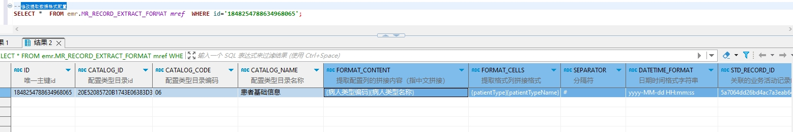

# 领域服务/病历领域 - 修改提取数据格式配置 - 修改提取数据格式配置 正向用例
## 请求参数：
``` json
{
  "orgName": "版本测试环境",
  "orgCode": "NXRMYY",
  "list": [
    {
      "formatCells": "{patientType}{patientTypeName}",
      "datetimeFormat": "yyyy-MM-dd HH:mm:ss",
      "updateKey": 41,
      "catalogCode": "06",
      "createUserName": "CS彭彭彭",
      "catalogId": "20E52085720B1743E06383D3A8C0287D",
      "arrangeNumber": 3,
      "orgCode": "NXRMYY",
      "id": "1848254788634968065",
      "createDate": "2024-10-21 14:47:35",
      "orgName": "版本测试环境",
      "isDelete": "N",
      "stdRecordCode": "EMR020001",
      "separator": "#",
      "catalogName": "患者基础信息",
      "stdRecordId": "5a7064dd26bd4ac7a3eab64194e7304b",
      "formatContent": "{病人类型编码}{病人类型名称}"
    }
  ],
  "operatorId": "282475805660160000",
  "operatorName": "CS彭彭彭",
  "operateDate": "2024-10-21 14:56:00"
}
```
## 返回参数：
``` json
{
  "exception": null,
  "apiCode": null,
  "data": null,
  "Code": 200,
  "Message": "操作成功"
}
```
## 数据校验：

# 领域服务/病历领域 - 修改提取数据格式配置 - 必填校验-[orgCode]为空
## 请求参数：
``` json
{
  "orgName": "版本测试环境",
  "orgCode": "",
  "list": [
    {
      "formatCells": "{patientType}{patientTypeName}",
      "datetimeFormat": "yyyy-MM-dd HH:mm:ss",
      "updateKey": 41,
      "catalogCode": "06",
      "createUserName": "CS彭彭彭",
      "catalogId": "20E52085720B1743E06383D3A8C0287D",
      "arrangeNumber": 3,
      "orgCode": "NXRMYY",
      "id": "1848254788634968065",
      "createDate": "2024-10-21 14:47:35",
      "orgName": "版本测试环境",
      "isDelete": "N",
      "stdRecordCode": "EMR020001",
      "separator": "#",
      "catalogName": "患者基础信息",
      "stdRecordId": "5a7064dd26bd4ac7a3eab64194e7304b",
      "formatContent": "{病人类型编码}{病人类型名称}"
    }
  ],
  "operatorId": "282475805660160000",
  "operatorName": "CS彭彭彭",
  "operateDate": "2024-10-21 14:56:00"
}
```
## 返回参数：
``` json
{
  "exception": null,
  "apiCode": null,
  "data": null,
  "Code": 1,
  "Message": "机构编码不能为空"
}
```
# 领域服务/病历领域 - 修改提取数据格式配置 - 必填校验-[orgName]为空
## 请求参数：
``` json
{
  "orgName": "",
  "orgCode": "NXRMYY",
  "list": [
    {
      "formatCells": "{patientType}{patientTypeName}",
      "datetimeFormat": "yyyy-MM-dd HH:mm:ss",
      "updateKey": 41,
      "catalogCode": "06",
      "createUserName": "CS彭彭彭",
      "catalogId": "20E52085720B1743E06383D3A8C0287D",
      "arrangeNumber": 3,
      "orgCode": "NXRMYY",
      "id": "1848254788634968065",
      "createDate": "2024-10-21 14:47:35",
      "orgName": "版本测试环境",
      "isDelete": "N",
      "stdRecordCode": "EMR020001",
      "separator": "#",
      "catalogName": "患者基础信息",
      "stdRecordId": "5a7064dd26bd4ac7a3eab64194e7304b",
      "formatContent": "{病人类型编码}{病人类型名称}"
    }
  ],
  "operatorId": "282475805660160000",
  "operatorName": "CS彭彭彭",
  "operateDate": "2024-10-21 14:56:00"
}
```
## 返回参数：
``` json
{
  "exception": null,
  "apiCode": null,
  "data": null,
  "Code": 1,
  "Message": "机构名称不能为空"
}
```
# 领域服务/病历领域 - 修改提取数据格式配置 - 必填校验-[operatorId]为空
## 请求参数：
``` json
{
  "orgName": "版本测试环境",
  "orgCode": "NXRMYY",
  "list": [
    {
      "formatCells": "{patientType}{patientTypeName}",
      "datetimeFormat": "yyyy-MM-dd HH:mm:ss",
      "updateKey": 41,
      "catalogCode": "06",
      "createUserName": "CS彭彭彭",
      "catalogId": "20E52085720B1743E06383D3A8C0287D",
      "arrangeNumber": 3,
      "orgCode": "NXRMYY",
      "id": "1848254788634968065",
      "createDate": "2024-10-21 14:47:35",
      "orgName": "版本测试环境",
      "isDelete": "N",
      "stdRecordCode": "EMR020001",
      "separator": "#",
      "catalogName": "患者基础信息",
      "stdRecordId": "5a7064dd26bd4ac7a3eab64194e7304b",
      "formatContent": "{病人类型编码}{病人类型名称}"
    }
  ],
  "operatorId": "",
  "operatorName": "CS彭彭彭",
  "operateDate": "2024-10-21 14:56:00"
}
```
## 返回参数：
``` json
{
  "exception": null,
  "apiCode": null,
  "data": null,
  "Code": 1,
  "Message": "操作人id不能为空"
}
```
# 领域服务/病历领域 - 修改提取数据格式配置 - 必填校验-[operatorName]为空
## 请求参数：
``` json
{
  "orgName": "版本测试环境",
  "orgCode": "NXRMYY",
  "list": [
    {
      "formatCells": "{patientType}{patientTypeName}",
      "datetimeFormat": "yyyy-MM-dd HH:mm:ss",
      "updateKey": 41,
      "catalogCode": "06",
      "createUserName": "CS彭彭彭",
      "catalogId": "20E52085720B1743E06383D3A8C0287D",
      "arrangeNumber": 3,
      "orgCode": "NXRMYY",
      "id": "1848254788634968065",
      "createDate": "2024-10-21 14:47:35",
      "orgName": "版本测试环境",
      "isDelete": "N",
      "stdRecordCode": "EMR020001",
      "separator": "#",
      "catalogName": "患者基础信息",
      "stdRecordId": "5a7064dd26bd4ac7a3eab64194e7304b",
      "formatContent": "{病人类型编码}{病人类型名称}"
    }
  ],
  "operatorId": "282475805660160000",
  "operatorName": "",
  "operateDate": "2024-10-21 14:56:00"
}
```
## 返回参数：
``` json
{
  "exception": null,
  "apiCode": null,
  "data": null,
  "Code": 1,
  "Message": "操作人姓名不能为空"
}
```
# 领域服务/病历领域 - 修改提取数据格式配置 - 必填校验-[operateDate]为空
## 请求参数：
``` json
{
  "orgName": "版本测试环境",
  "orgCode": "NXRMYY",
  "list": [
    {
      "formatCells": "{patientType}{patientTypeName}",
      "datetimeFormat": "yyyy-MM-dd HH:mm:ss",
      "updateKey": 41,
      "catalogCode": "06",
      "createUserName": "CS彭彭彭",
      "catalogId": "20E52085720B1743E06383D3A8C0287D",
      "arrangeNumber": 3,
      "orgCode": "NXRMYY",
      "id": "1848254788634968065",
      "createDate": "2024-10-21 14:47:35",
      "orgName": "版本测试环境",
      "isDelete": "N",
      "stdRecordCode": "EMR020001",
      "separator": "#",
      "catalogName": "患者基础信息",
      "stdRecordId": "5a7064dd26bd4ac7a3eab64194e7304b",
      "formatContent": "{病人类型编码}{病人类型名称}"
    }
  ],
  "operatorId": "282475805660160000",
  "operatorName": "CS彭彭彭",
  "operateDate": ""
}
```
## 返回参数：
``` json
{
  "exception": null,
  "apiCode": null,
  "data": null,
  "Code": 1,
  "Message": "操作时间不能为空"
}
```
# 领域服务/病历领域 - 修改提取数据格式配置 - 必填校验-[list]为空
## 请求参数：
``` json
{
  "orgName": "版本测试环境",
  "orgCode": "NXRMYY",
  "list": null,
  "operatorId": "282475805660160000",
  "operatorName": "CS彭彭彭",
  "operateDate": "2024-10-21 14:56:00"
}
```
## 返回参数：
``` json
{
  "exception": null,
  "apiCode": null,
  "data": null,
  "Code": 1,
  "Message": "数据提取格式集合不能为空"
}
```
# 领域服务/病历领域 - 修改提取数据格式配置 - 必填校验-[list.id]为空
## 请求参数：
``` json
{
  "orgName": "版本测试环境",
  "orgCode": "NXRMYY",
  "list": [
    {
      "formatCells": "{patientType}{patientTypeName}",
      "datetimeFormat": "yyyy-MM-dd HH:mm:ss",
      "updateKey": 41,
      "catalogCode": "06",
      "createUserName": "CS彭彭彭",
      "catalogId": "20E52085720B1743E06383D3A8C0287D",
      "arrangeNumber": 3,
      "orgCode": "NXRMYY",
      "id": null,
      "createDate": "2024-10-21 14:47:35",
      "orgName": "版本测试环境",
      "isDelete": "N",
      "stdRecordCode": "EMR020001",
      "separator": "#",
      "catalogName": "患者基础信息",
      "stdRecordId": "5a7064dd26bd4ac7a3eab64194e7304b",
      "formatContent": "{病人类型编码}{病人类型名称}"
    }
  ],
  "operatorId": "282475805660160000",
  "operatorName": "CS彭彭彭",
  "operateDate": "2024-10-21 14:56:00"
}
```
## 返回参数：
``` json
{
  "exception": null,
  "apiCode": null,
  "data": null,
  "Code": 1,
  "Message": "主键不能为空"
}
```
# 领域服务/病历领域 - 修改提取数据格式配置 - 必填校验-[list.orgCode]为空
## 请求参数：
``` json
{
  "orgName": "版本测试环境",
  "orgCode": "NXRMYY",
  "list": [
    {
      "formatCells": "{patientType}{patientTypeName}",
      "datetimeFormat": "yyyy-MM-dd HH:mm:ss",
      "updateKey": 41,
      "catalogCode": "06",
      "createUserName": "CS彭彭彭",
      "catalogId": "20E52085720B1743E06383D3A8C0287D",
      "arrangeNumber": 3,
      "orgCode": null,
      "id": "1848254788634968065",
      "createDate": "2024-10-21 14:47:35",
      "orgName": "版本测试环境",
      "isDelete": "N",
      "stdRecordCode": "EMR020001",
      "separator": "#",
      "catalogName": "患者基础信息",
      "stdRecordId": "5a7064dd26bd4ac7a3eab64194e7304b",
      "formatContent": "{病人类型编码}{病人类型名称}"
    }
  ],
  "operatorId": "282475805660160000",
  "operatorName": "CS彭彭彭",
  "operateDate": "2024-10-21 14:56:00"
}
```
## 返回参数：
``` json
{
  "exception": null,
  "apiCode": null,
  "data": null,
  "Code": 200,
  "Message": "操作成功"
}
```
# 领域服务/病历领域 - 修改提取数据格式配置 - 必填校验-[list.orgName]为空
## 请求参数：
``` json
{
  "orgName": "版本测试环境",
  "orgCode": "NXRMYY",
  "list": [
    {
      "formatCells": "{patientType}{patientTypeName}",
      "datetimeFormat": "yyyy-MM-dd HH:mm:ss",
      "updateKey": 41,
      "catalogCode": "06",
      "createUserName": "CS彭彭彭",
      "catalogId": "20E52085720B1743E06383D3A8C0287D",
      "arrangeNumber": 3,
      "orgCode": "NXRMYY",
      "id": "1848254788634968065",
      "createDate": "2024-10-21 14:47:35",
      "orgName": null,
      "isDelete": "N",
      "stdRecordCode": "EMR020001",
      "separator": "#",
      "catalogName": "患者基础信息",
      "stdRecordId": "5a7064dd26bd4ac7a3eab64194e7304b",
      "formatContent": "{病人类型编码}{病人类型名称}"
    }
  ],
  "operatorId": "282475805660160000",
  "operatorName": "CS彭彭彭",
  "operateDate": "2024-10-21 14:56:00"
}
```
## 返回参数：
``` json
{
  "exception": null,
  "apiCode": null,
  "data": null,
  "Code": 200,
  "Message": "操作成功"
}
```
# 领域服务/病历领域 - 修改提取数据格式配置 - 必填校验-[list.catalogId]为空
## 请求参数：
``` json
{
  "orgName": "版本测试环境",
  "orgCode": "NXRMYY",
  "list": [
    {
      "formatCells": "{patientType}{patientTypeName}",
      "datetimeFormat": "yyyy-MM-dd HH:mm:ss",
      "updateKey": 41,
      "catalogCode": "06",
      "createUserName": "CS彭彭彭",
      "catalogId": null,
      "arrangeNumber": 3,
      "orgCode": "NXRMYY",
      "id": "1848254788634968065",
      "createDate": "2024-10-21 14:47:35",
      "orgName": "版本测试环境",
      "isDelete": "N",
      "stdRecordCode": "EMR020001",
      "separator": "#",
      "catalogName": "患者基础信息",
      "stdRecordId": "5a7064dd26bd4ac7a3eab64194e7304b",
      "formatContent": "{病人类型编码}{病人类型名称}"
    }
  ],
  "operatorId": "282475805660160000",
  "operatorName": "CS彭彭彭",
  "operateDate": "2024-10-21 14:56:00"
}
```
## 返回参数：
``` json
{
  "exception": null,
  "apiCode": null,
  "data": null,
  "Code": 1,
  "Message": "配置类型目录id不能为空"
}
```
# 领域服务/病历领域 - 修改提取数据格式配置 - 必填校验-[list.catalogCode]为空
## 请求参数：
``` json
{
  "orgName": "版本测试环境",
  "orgCode": "NXRMYY",
  "list": [
    {
      "formatCells": "{patientType}{patientTypeName}",
      "datetimeFormat": "yyyy-MM-dd HH:mm:ss",
      "updateKey": 41,
      "catalogCode": null,
      "createUserName": "CS彭彭彭",
      "catalogId": "20E52085720B1743E06383D3A8C0287D",
      "arrangeNumber": 3,
      "orgCode": "NXRMYY",
      "id": "1848254788634968065",
      "createDate": "2024-10-21 14:47:35",
      "orgName": "版本测试环境",
      "isDelete": "N",
      "stdRecordCode": "EMR020001",
      "separator": "#",
      "catalogName": "患者基础信息",
      "stdRecordId": "5a7064dd26bd4ac7a3eab64194e7304b",
      "formatContent": "{病人类型编码}{病人类型名称}"
    }
  ],
  "operatorId": "282475805660160000",
  "operatorName": "CS彭彭彭",
  "operateDate": "2024-10-21 14:56:00"
}
```
## 返回参数：
``` json
{
  "exception": null,
  "apiCode": null,
  "data": null,
  "Code": 1,
  "Message": "配置类型目录编码不能为空"
}
```
# 领域服务/病历领域 - 修改提取数据格式配置 - 必填校验-[list.catalogName]为空
## 请求参数：
``` json
{
  "orgName": "版本测试环境",
  "orgCode": "NXRMYY",
  "list": [
    {
      "formatCells": "{patientType}{patientTypeName}",
      "datetimeFormat": "yyyy-MM-dd HH:mm:ss",
      "updateKey": 41,
      "catalogCode": "06",
      "createUserName": "CS彭彭彭",
      "catalogId": "20E52085720B1743E06383D3A8C0287D",
      "arrangeNumber": 3,
      "orgCode": "NXRMYY",
      "id": "1848254788634968065",
      "createDate": "2024-10-21 14:47:35",
      "orgName": "版本测试环境",
      "isDelete": "N",
      "stdRecordCode": "EMR020001",
      "separator": "#",
      "catalogName": null,
      "stdRecordId": "5a7064dd26bd4ac7a3eab64194e7304b",
      "formatContent": "{病人类型编码}{病人类型名称}"
    }
  ],
  "operatorId": "282475805660160000",
  "operatorName": "CS彭彭彭",
  "operateDate": "2024-10-21 14:56:00"
}
```
## 返回参数：
``` json
{
  "exception": null,
  "apiCode": null,
  "data": null,
  "Code": 1,
  "Message": "配置类型目录名称不能为空"
}
```
# 领域服务/病历领域 - 修改提取数据格式配置 - 必填校验-[list.formatContent]为空
## 请求参数：
``` json
{
  "orgName": "版本测试环境",
  "orgCode": "NXRMYY",
  "list": [
    {
      "formatCells": "{patientType}{patientTypeName}",
      "datetimeFormat": "yyyy-MM-dd HH:mm:ss",
      "updateKey": 41,
      "catalogCode": "06",
      "createUserName": "CS彭彭彭",
      "catalogId": "20E52085720B1743E06383D3A8C0287D",
      "arrangeNumber": 3,
      "orgCode": "NXRMYY",
      "id": "1848254788634968065",
      "createDate": "2024-10-21 14:47:35",
      "orgName": "版本测试环境",
      "isDelete": "N",
      "stdRecordCode": "EMR020001",
      "separator": "#",
      "catalogName": "患者基础信息",
      "stdRecordId": "5a7064dd26bd4ac7a3eab64194e7304b",
      "formatContent": null
    }
  ],
  "operatorId": "282475805660160000",
  "operatorName": "CS彭彭彭",
  "operateDate": "2024-10-21 14:56:00"
}
```
## 返回参数：
``` json
{
  "exception": null,
  "apiCode": null,
  "data": null,
  "Code": 1,
  "Message": "提取配置列的拼接内容不能为空"
}
```
# 领域服务/病历领域 - 修改提取数据格式配置 - 必填校验-[list.formatCells]为空
## 请求参数：
``` json
{
  "orgName": "版本测试环境",
  "orgCode": "NXRMYY",
  "list": [
    {
      "formatCells": null,
      "datetimeFormat": "yyyy-MM-dd HH:mm:ss",
      "updateKey": 41,
      "catalogCode": "06",
      "createUserName": "CS彭彭彭",
      "catalogId": "20E52085720B1743E06383D3A8C0287D",
      "arrangeNumber": 3,
      "orgCode": "NXRMYY",
      "id": "1848254788634968065",
      "createDate": "2024-10-21 14:47:35",
      "orgName": "版本测试环境",
      "isDelete": "N",
      "stdRecordCode": "EMR020001",
      "separator": "#",
      "catalogName": "患者基础信息",
      "stdRecordId": "5a7064dd26bd4ac7a3eab64194e7304b",
      "formatContent": "{病人类型编码}{病人类型名称}"
    }
  ],
  "operatorId": "282475805660160000",
  "operatorName": "CS彭彭彭",
  "operateDate": "2024-10-21 14:56:00"
}
```
## 返回参数：
``` json
{
  "exception": null,
  "apiCode": null,
  "data": null,
  "Code": 1,
  "Message": "提取格式列拼接格式不能为空"
}
```
# 领域服务/病历领域 - 修改提取数据格式配置 - 必填校验-[list.stdRecordId]为空
## 请求参数：
``` json
{
  "orgName": "版本测试环境",
  "orgCode": "NXRMYY",
  "list": [
    {
      "formatCells": "{patientType}{patientTypeName}",
      "datetimeFormat": "yyyy-MM-dd HH:mm:ss",
      "updateKey": 41,
      "catalogCode": "06",
      "createUserName": "CS彭彭彭",
      "catalogId": "20E52085720B1743E06383D3A8C0287D",
      "arrangeNumber": 3,
      "orgCode": "NXRMYY",
      "id": "1848254788634968065",
      "createDate": "2024-10-21 14:47:35",
      "orgName": "版本测试环境",
      "isDelete": "N",
      "stdRecordCode": "EMR020001",
      "separator": "#",
      "catalogName": "患者基础信息",
      "stdRecordId": null,
      "formatContent": "{病人类型编码}{病人类型名称}"
    }
  ],
  "operatorId": "282475805660160000",
  "operatorName": "CS彭彭彭",
  "operateDate": "2024-10-21 14:56:00"
}
```
## 返回参数：
``` json
{
  "exception": null,
  "apiCode": null,
  "data": null,
  "Code": 1,
  "Message": "关联的业务活动记录ID不能为空"
}
```
# 领域服务/病历领域 - 修改提取数据格式配置 - 必填校验-[list.stdRecordCode]为空
## 请求参数：
``` json
{
  "orgName": "版本测试环境",
  "orgCode": "NXRMYY",
  "list": [
    {
      "formatCells": "{patientType}{patientTypeName}",
      "datetimeFormat": "yyyy-MM-dd HH:mm:ss",
      "updateKey": 41,
      "catalogCode": "06",
      "createUserName": "CS彭彭彭",
      "catalogId": "20E52085720B1743E06383D3A8C0287D",
      "arrangeNumber": 3,
      "orgCode": "NXRMYY",
      "id": "1848254788634968065",
      "createDate": "2024-10-21 14:47:35",
      "orgName": "版本测试环境",
      "isDelete": "N",
      "stdRecordCode": null,
      "separator": "#",
      "catalogName": "患者基础信息",
      "stdRecordId": "5a7064dd26bd4ac7a3eab64194e7304b",
      "formatContent": "{病人类型编码}{病人类型名称}"
    }
  ],
  "operatorId": "282475805660160000",
  "operatorName": "CS彭彭彭",
  "operateDate": "2024-10-21 14:56:00"
}
```
## 返回参数：
``` json
{
  "exception": null,
  "apiCode": null,
  "data": null,
  "Code": 1,
  "Message": "关联的业务活动记录标准码不能为空"
}
```
# 领域服务/病历领域 - 修改提取数据格式配置 - 必填校验-[list.arrangeNumber]为空
## 请求参数：
``` json
{
  "orgName": "版本测试环境",
  "orgCode": "NXRMYY",
  "list": [
    {
      "formatCells": "{patientType}{patientTypeName}",
      "datetimeFormat": "yyyy-MM-dd HH:mm:ss",
      "updateKey": 41,
      "catalogCode": "06",
      "createUserName": "CS彭彭彭",
      "catalogId": "20E52085720B1743E06383D3A8C0287D",
      "arrangeNumber": null,
      "orgCode": "NXRMYY",
      "id": "1848254788634968065",
      "createDate": "2024-10-21 14:47:35",
      "orgName": "版本测试环境",
      "isDelete": "N",
      "stdRecordCode": "EMR020001",
      "separator": "#",
      "catalogName": "患者基础信息",
      "stdRecordId": "5a7064dd26bd4ac7a3eab64194e7304b",
      "formatContent": "{病人类型编码}{病人类型名称}"
    }
  ],
  "operatorId": "282475805660160000",
  "operatorName": "CS彭彭彭",
  "operateDate": "2024-10-21 14:56:00"
}
```
## 返回参数：
``` json
{
  "exception": null,
  "apiCode": null,
  "data": null,
  "Code": 1,
  "Message": "每行展示数不能为空"
}
```
# 领域服务/病历领域 - 修改提取数据格式配置 - 类型校验-[list.arrangeNumber]类型错误
## 请求参数：
``` json
{
  "orgName": "版本测试环境",
  "orgCode": "NXRMYY",
  "list": [
    {
      "formatCells": "{patientType}{patientTypeName}",
      "datetimeFormat": "yyyy-MM-dd HH:mm:ss",
      "updateKey": 41,
      "catalogCode": "06",
      "createUserName": "CS彭彭彭",
      "catalogId": "20E52085720B1743E06383D3A8C0287D",
      "arrangeNumber": "\"abc\"",
      "orgCode": "NXRMYY",
      "id": "1848254788634968065",
      "createDate": "2024-10-21 14:47:35",
      "orgName": "版本测试环境",
      "isDelete": "N",
      "stdRecordCode": "EMR020001",
      "separator": "#",
      "catalogName": "患者基础信息",
      "stdRecordId": "5a7064dd26bd4ac7a3eab64194e7304b",
      "formatContent": "{病人类型编码}{病人类型名称}"
    }
  ],
  "operatorId": "282475805660160000",
  "operatorName": "CS彭彭彭",
  "operateDate": "2024-10-21 14:56:00"
}
```
## 返回参数：
``` json
{
  "exception": null,
  "apiCode": null,
  "data": null,
  "Code": 1,
  "Message": "请求参数错误"
}
```
# 领域服务/病历领域 - 修改提取数据格式配置 - 依赖用例-[operatorName]赋值为依赖用例测试值
## 请求参数：
``` json
{
  "orgName": "版本测试环境",
  "orgCode": "NXRMYY",
  "list": [
    {
      "formatCells": "{patientType}{patientTypeName}",
      "datetimeFormat": "yyyy-MM-dd HH:mm:ss",
      "updateKey": 41,
      "catalogCode": "06",
      "createUserName": "CS彭彭彭",
      "catalogId": "20E52085720B1743E06383D3A8C0287D",
      "arrangeNumber": 3,
      "orgCode": "NXRMYY",
      "id": "1848254788634968065",
      "createDate": "2024-10-21 14:47:35",
      "orgName": "版本测试环境",
      "isDelete": "N",
      "stdRecordCode": "EMR020001",
      "separator": "#",
      "catalogName": "患者基础信息",
      "stdRecordId": "5a7064dd26bd4ac7a3eab64194e7304b",
      "formatContent": "{病人类型编码}{病人类型名称}"
    }
  ],
  "operatorId": "282475805660160000",
  "operatorName": "依赖用例测试值",
  "operateDate": "2024-10-21 14:56:00"
}
```
## 返回参数：
``` json
{
  "exception": null,
  "apiCode": null,
  "data": null,
  "Code": 200,
  "Message": "操作成功"
}
```
# 领域服务/病历领域 - 修改提取数据格式配置 - 依赖用例-[operatorId]赋值为依赖用例测试值
## 请求参数：
``` json
{
  "orgName": "版本测试环境",
  "orgCode": "NXRMYY",
  "list": [
    {
      "formatCells": "{patientType}{patientTypeName}",
      "datetimeFormat": "yyyy-MM-dd HH:mm:ss",
      "updateKey": 41,
      "catalogCode": "06",
      "createUserName": "CS彭彭彭",
      "catalogId": "20E52085720B1743E06383D3A8C0287D",
      "arrangeNumber": 3,
      "orgCode": "NXRMYY",
      "id": "1848254788634968065",
      "createDate": "2024-10-21 14:47:35",
      "orgName": "版本测试环境",
      "isDelete": "N",
      "stdRecordCode": "EMR020001",
      "separator": "#",
      "catalogName": "患者基础信息",
      "stdRecordId": "5a7064dd26bd4ac7a3eab64194e7304b",
      "formatContent": "{病人类型编码}{病人类型名称}"
    }
  ],
  "operatorId": "依赖用例测试值",
  "operatorName": "CS彭彭彭",
  "operateDate": "2024-10-21 14:56:00"
}
```
## 返回参数：
``` json
{
  "exception": null,
  "apiCode": null,
  "data": null,
  "Code": 200,
  "Message": "操作成功"
}
```
# 领域服务/病历领域 - 修改提取数据格式配置 - 依赖用例-[list.catalogId]赋值为依赖用例测试值
## 请求参数：
``` json
{
  "orgName": "版本测试环境",
  "orgCode": "NXRMYY",
  "list": [
    {
      "formatCells": "{patientType}{patientTypeName}",
      "datetimeFormat": "yyyy-MM-dd HH:mm:ss",
      "updateKey": 41,
      "catalogCode": "06",
      "createUserName": "CS彭彭彭",
      "catalogId": "依赖用例测试值",
      "arrangeNumber": 3,
      "orgCode": "NXRMYY",
      "id": "1848254788634968065",
      "createDate": "2024-10-21 14:47:35",
      "orgName": "版本测试环境",
      "isDelete": "N",
      "stdRecordCode": "EMR020001",
      "separator": "#",
      "catalogName": "患者基础信息",
      "stdRecordId": "5a7064dd26bd4ac7a3eab64194e7304b",
      "formatContent": "{病人类型编码}{病人类型名称}"
    }
  ],
  "operatorId": "282475805660160000",
  "operatorName": "CS彭彭彭",
  "operateDate": "2024-10-21 14:56:00"
}
```
## 返回参数：
``` json
{
  "exception": null,
  "apiCode": null,
  "data": null,
  "Code": 200,
  "Message": "操作成功"
}
```
# 领域服务/病历领域 - 修改提取数据格式配置 - 依赖用例-[list.orgCode]赋值为依赖用例测试值
## 请求参数：
``` json
{
  "orgName": "版本测试环境",
  "orgCode": "NXRMYY",
  "list": [
    {
      "formatCells": "{patientType}{patientTypeName}",
      "datetimeFormat": "yyyy-MM-dd HH:mm:ss",
      "updateKey": 41,
      "catalogCode": "06",
      "createUserName": "CS彭彭彭",
      "catalogId": "20E52085720B1743E06383D3A8C0287D",
      "arrangeNumber": 3,
      "orgCode": "依赖用例测试值",
      "id": "1848254788634968065",
      "createDate": "2024-10-21 14:47:35",
      "orgName": "版本测试环境",
      "isDelete": "N",
      "stdRecordCode": "EMR020001",
      "separator": "#",
      "catalogName": "患者基础信息",
      "stdRecordId": "5a7064dd26bd4ac7a3eab64194e7304b",
      "formatContent": "{病人类型编码}{病人类型名称}"
    }
  ],
  "operatorId": "282475805660160000",
  "operatorName": "CS彭彭彭",
  "operateDate": "2024-10-21 14:56:00"
}
```
## 返回参数：
``` json
{
  "exception": null,
  "apiCode": null,
  "data": null,
  "Code": 200,
  "Message": "操作成功"
}
```
# 领域服务/病历领域 - 修改提取数据格式配置 - 依赖用例-[list.id]赋值为依赖用例测试值
## 请求参数：
``` json
{
  "orgName": "版本测试环境",
  "orgCode": "NXRMYY",
  "list": [
    {
      "formatCells": "{patientType}{patientTypeName}",
      "datetimeFormat": "yyyy-MM-dd HH:mm:ss",
      "updateKey": 41,
      "catalogCode": "06",
      "createUserName": "CS彭彭彭",
      "catalogId": "20E52085720B1743E06383D3A8C0287D",
      "arrangeNumber": 3,
      "orgCode": "NXRMYY",
      "id": "依赖用例测试值",
      "createDate": "2024-10-21 14:47:35",
      "orgName": "版本测试环境",
      "isDelete": "N",
      "stdRecordCode": "EMR020001",
      "separator": "#",
      "catalogName": "患者基础信息",
      "stdRecordId": "5a7064dd26bd4ac7a3eab64194e7304b",
      "formatContent": "{病人类型编码}{病人类型名称}"
    }
  ],
  "operatorId": "282475805660160000",
  "operatorName": "CS彭彭彭",
  "operateDate": "2024-10-21 14:56:00"
}
```
## 返回参数：
``` json
{
  "exception": null,
  "apiCode": null,
  "data": null,
  "Code": 1,
  "Message": "同一种业务活动不能保存相同的配置类型"
}
```
# 领域服务/病历领域 - 修改提取数据格式配置 - 依赖用例-[list.orgName]赋值为依赖用例测试值
## 请求参数：
``` json
{
  "orgName": "版本测试环境",
  "orgCode": "NXRMYY",
  "list": [
    {
      "formatCells": "{patientType}{patientTypeName}",
      "datetimeFormat": "yyyy-MM-dd HH:mm:ss",
      "updateKey": 41,
      "catalogCode": "06",
      "createUserName": "CS彭彭彭",
      "catalogId": "20E52085720B1743E06383D3A8C0287D",
      "arrangeNumber": 3,
      "orgCode": "NXRMYY",
      "id": "1848254788634968065",
      "createDate": "2024-10-21 14:47:35",
      "orgName": "依赖用例测试值",
      "isDelete": "N",
      "stdRecordCode": "EMR020001",
      "separator": "#",
      "catalogName": "患者基础信息",
      "stdRecordId": "5a7064dd26bd4ac7a3eab64194e7304b",
      "formatContent": "{病人类型编码}{病人类型名称}"
    }
  ],
  "operatorId": "282475805660160000",
  "operatorName": "CS彭彭彭",
  "operateDate": "2024-10-21 14:56:00"
}
```
## 返回参数：
``` json
{
  "exception": null,
  "apiCode": null,
  "data": null,
  "Code": 200,
  "Message": "操作成功"
}
```
# 领域服务/病历领域 - 修改提取数据格式配置 - 依赖用例-[list.stdRecordCode]赋值为依赖用例测试值
## 请求参数：
``` json
{
  "orgName": "版本测试环境",
  "orgCode": "NXRMYY",
  "list": [
    {
      "formatCells": "{patientType}{patientTypeName}",
      "datetimeFormat": "yyyy-MM-dd HH:mm:ss",
      "updateKey": 41,
      "catalogCode": "06",
      "createUserName": "CS彭彭彭",
      "catalogId": "20E52085720B1743E06383D3A8C0287D",
      "arrangeNumber": 3,
      "orgCode": "NXRMYY",
      "id": "1848254788634968065",
      "createDate": "2024-10-21 14:47:35",
      "orgName": "版本测试环境",
      "isDelete": "N",
      "stdRecordCode": "依赖用例测试值",
      "separator": "#",
      "catalogName": "患者基础信息",
      "stdRecordId": "5a7064dd26bd4ac7a3eab64194e7304b",
      "formatContent": "{病人类型编码}{病人类型名称}"
    }
  ],
  "operatorId": "282475805660160000",
  "operatorName": "CS彭彭彭",
  "operateDate": "2024-10-21 14:56:00"
}
```
## 返回参数：
``` json
{
  "exception": null,
  "apiCode": null,
  "data": null,
  "Code": 200,
  "Message": "操作成功"
}
```
# 领域服务/病历领域 - 修改提取数据格式配置 - 依赖用例-[list.stdRecordId]赋值为依赖用例测试值
## 请求参数：
``` json
{
  "orgName": "版本测试环境",
  "orgCode": "NXRMYY",
  "list": [
    {
      "formatCells": "{patientType}{patientTypeName}",
      "datetimeFormat": "yyyy-MM-dd HH:mm:ss",
      "updateKey": 41,
      "catalogCode": "06",
      "createUserName": "CS彭彭彭",
      "catalogId": "20E52085720B1743E06383D3A8C0287D",
      "arrangeNumber": 3,
      "orgCode": "NXRMYY",
      "id": "1848254788634968065",
      "createDate": "2024-10-21 14:47:35",
      "orgName": "版本测试环境",
      "isDelete": "N",
      "stdRecordCode": "EMR020001",
      "separator": "#",
      "catalogName": "患者基础信息",
      "stdRecordId": "依赖用例测试值",
      "formatContent": "{病人类型编码}{病人类型名称}"
    }
  ],
  "operatorId": "282475805660160000",
  "operatorName": "CS彭彭彭",
  "operateDate": "2024-10-21 14:56:00"
}
```
## 返回参数：
``` json
{
  "exception": null,
  "apiCode": null,
  "data": null,
  "Code": 200,
  "Message": "操作成功"
}
```
# 领域服务/病历领域 - 修改提取数据格式配置 - 依赖用例-[orgCode]赋值为依赖用例测试值
## 请求参数：
``` json
{
  "orgName": "版本测试环境",
  "orgCode": "依赖用例测试值",
  "list": [
    {
      "formatCells": "{patientType}{patientTypeName}",
      "datetimeFormat": "yyyy-MM-dd HH:mm:ss",
      "updateKey": 41,
      "catalogCode": "06",
      "createUserName": "CS彭彭彭",
      "catalogId": "20E52085720B1743E06383D3A8C0287D",
      "arrangeNumber": 3,
      "orgCode": "NXRMYY",
      "id": "1848254788634968065",
      "createDate": "2024-10-21 14:47:35",
      "orgName": "版本测试环境",
      "isDelete": "N",
      "stdRecordCode": "EMR020001",
      "separator": "#",
      "catalogName": "患者基础信息",
      "stdRecordId": "5a7064dd26bd4ac7a3eab64194e7304b",
      "formatContent": "{病人类型编码}{病人类型名称}"
    }
  ],
  "operatorId": "282475805660160000",
  "operatorName": "CS彭彭彭",
  "operateDate": "2024-10-21 14:56:00"
}
```
## 返回参数：
``` json
{
  "exception": null,
  "apiCode": null,
  "data": null,
  "Code": 200,
  "Message": "操作成功"
}
```
# 领域服务/病历领域 - 修改提取数据格式配置 - 依赖用例-[orgName]赋值为依赖用例测试值
## 请求参数：
``` json
{
  "orgName": "依赖用例测试值",
  "orgCode": "NXRMYY",
  "list": [
    {
      "formatCells": "{patientType}{patientTypeName}",
      "datetimeFormat": "yyyy-MM-dd HH:mm:ss",
      "updateKey": 41,
      "catalogCode": "06",
      "createUserName": "CS彭彭彭",
      "catalogId": "20E52085720B1743E06383D3A8C0287D",
      "arrangeNumber": 3,
      "orgCode": "NXRMYY",
      "id": "1848254788634968065",
      "createDate": "2024-10-21 14:47:35",
      "orgName": "版本测试环境",
      "isDelete": "N",
      "stdRecordCode": "EMR020001",
      "separator": "#",
      "catalogName": "患者基础信息",
      "stdRecordId": "5a7064dd26bd4ac7a3eab64194e7304b",
      "formatContent": "{病人类型编码}{病人类型名称}"
    }
  ],
  "operatorId": "282475805660160000",
  "operatorName": "CS彭彭彭",
  "operateDate": "2024-10-21 14:56:00"
}
```
## 返回参数：
``` json
{
  "exception": null,
  "apiCode": null,
  "data": null,
  "Code": 200,
  "Message": "操作成功"
}
```