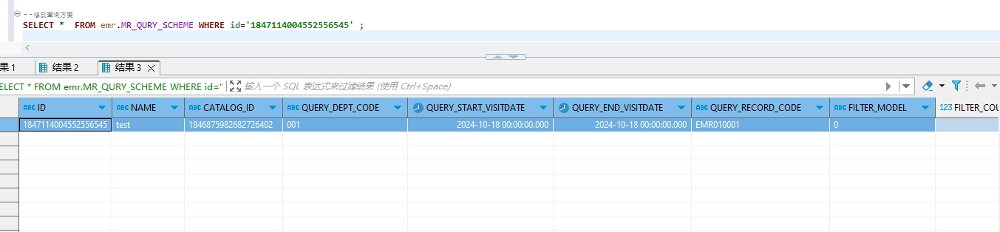

# 领域服务/病历领域 - 修改查询方案 - 修改查询方案(包括组合条件，查询指标) 正向用例
## 请求参数：
``` json
{
  "orgName": "版本测试环境",
  "hospCode": "NXRY",
  "hospName": "版本测试环境",
  "orgCode": "NXRMYY",
  "list": [
    {
      "orgName": "版本测试环境",
      "hospCode": "NXRY",
      "queryStartVisitDate": "2024-10-18 00:00:00",
      "filterModel": "0",
      "isDelete": "N",
      "updateKey": 3,
      "createUserName": "CS彭彭彭",
      "queryDeptCode": "001",
      "catalogId": "1846875982682726402",
      "hospName": "版本测试环境",
      "queryEndVisitDate": "2024-10-18 00:00:00",
      "orgCode": "NXRMYY",
      "name": "test123",
      "queryConditionList": [
        {
          "nodeName": "姓名",
          "serialNumber": "0",
          "nodeCode": "DE02.01.039.00",
          "dataType": "0",
          "schemeId": "1847114004552556545",
          "queryType": "0",
          "operatorSymbol": ">",
          "id": "1847114004552556546",
          "value": "11"
        }
      ],
      "id": "1847114004552556545",
      "queryTargetList": [
        {
          "nodeName": "多梦标志",
          "serialNumber": "0",
          "nodeCode": "DE04.01.011.00",
          "targetType": "0",
          "schemeId": "1847114004552556545",
          "id": "1847114004552556547"
        }
      ],
      "queryStdRecordCode": "EMR010001",
      "createDate": "2024-10-18 11:14:31",
      "filterCount": "5"
    }
  ],
  "operatorId": "282475805660160000",
  "operatorName": "CS彭彭彭",
  "operateDate": "2024-10-18 11:14:46"
}
```
## 返回参数：
``` json
{
  "exception": null,
  "apiCode": null,
  "data": null,
  "Code": 200,
  "Message": "操作成功"
}
```
## 数据校验：

# 领域服务/病历领域 - 修改查询方案 - 必填校验-[orgCode]为空
## 请求参数：
``` json
{
  "orgName": "版本测试环境",
  "hospCode": "NXRY",
  "hospName": "版本测试环境",
  "orgCode": "",
  "list": [
    {
      "orgName": "版本测试环境",
      "hospCode": "NXRY",
      "queryStartVisitDate": "2024-10-18 00:00:00",
      "filterModel": "0",
      "isDelete": "N",
      "updateKey": 3,
      "createUserName": "CS彭彭彭",
      "queryDeptCode": "001",
      "catalogId": "1846875982682726402",
      "hospName": "版本测试环境",
      "queryEndVisitDate": "2024-10-18 00:00:00",
      "orgCode": "NXRMYY",
      "name": "test123",
      "queryConditionList": [
        {
          "nodeName": "姓名",
          "serialNumber": "0",
          "nodeCode": "DE02.01.039.00",
          "dataType": "0",
          "schemeId": "1847114004552556545",
          "queryType": "0",
          "operatorSymbol": ">",
          "id": "1847114004552556546",
          "value": "11"
        }
      ],
      "id": "1847114004552556545",
      "queryTargetList": [
        {
          "nodeName": "多梦标志",
          "serialNumber": "0",
          "nodeCode": "DE04.01.011.00",
          "targetType": "0",
          "schemeId": "1847114004552556545",
          "id": "1847114004552556547"
        }
      ],
      "queryStdRecordCode": "EMR010001",
      "createDate": "2024-10-18 11:14:31",
      "filterCount": "5"
    }
  ],
  "operatorId": "282475805660160000",
  "operatorName": "CS彭彭彭",
  "operateDate": "2024-10-18 11:14:46"
}
```
## 返回参数：
``` json
{
  "exception": null,
  "apiCode": null,
  "data": null,
  "Code": 1,
  "Message": "机构编码不能为空"
}
```
# 领域服务/病历领域 - 修改查询方案 - 必填校验-[orgName]为空
## 请求参数：
``` json
{
  "orgName": "",
  "hospCode": "NXRY",
  "hospName": "版本测试环境",
  "orgCode": "NXRMYY",
  "list": [
    {
      "orgName": "版本测试环境",
      "hospCode": "NXRY",
      "queryStartVisitDate": "2024-10-18 00:00:00",
      "filterModel": "0",
      "isDelete": "N",
      "updateKey": 3,
      "createUserName": "CS彭彭彭",
      "queryDeptCode": "001",
      "catalogId": "1846875982682726402",
      "hospName": "版本测试环境",
      "queryEndVisitDate": "2024-10-18 00:00:00",
      "orgCode": "NXRMYY",
      "name": "test123",
      "queryConditionList": [
        {
          "nodeName": "姓名",
          "serialNumber": "0",
          "nodeCode": "DE02.01.039.00",
          "dataType": "0",
          "schemeId": "1847114004552556545",
          "queryType": "0",
          "operatorSymbol": ">",
          "id": "1847114004552556546",
          "value": "11"
        }
      ],
      "id": "1847114004552556545",
      "queryTargetList": [
        {
          "nodeName": "多梦标志",
          "serialNumber": "0",
          "nodeCode": "DE04.01.011.00",
          "targetType": "0",
          "schemeId": "1847114004552556545",
          "id": "1847114004552556547"
        }
      ],
      "queryStdRecordCode": "EMR010001",
      "createDate": "2024-10-18 11:14:31",
      "filterCount": "5"
    }
  ],
  "operatorId": "282475805660160000",
  "operatorName": "CS彭彭彭",
  "operateDate": "2024-10-18 11:14:46"
}
```
## 返回参数：
``` json
{
  "exception": null,
  "apiCode": null,
  "data": null,
  "Code": 1,
  "Message": "机构名称不能为空"
}
```
# 领域服务/病历领域 - 修改查询方案 - 必填校验-[hospCode]为空
## 请求参数：
``` json
{
  "orgName": "版本测试环境",
  "hospCode": "",
  "hospName": "版本测试环境",
  "orgCode": "NXRMYY",
  "list": [
    {
      "orgName": "版本测试环境",
      "hospCode": "NXRY",
      "queryStartVisitDate": "2024-10-18 00:00:00",
      "filterModel": "0",
      "isDelete": "N",
      "updateKey": 3,
      "createUserName": "CS彭彭彭",
      "queryDeptCode": "001",
      "catalogId": "1846875982682726402",
      "hospName": "版本测试环境",
      "queryEndVisitDate": "2024-10-18 00:00:00",
      "orgCode": "NXRMYY",
      "name": "test123",
      "queryConditionList": [
        {
          "nodeName": "姓名",
          "serialNumber": "0",
          "nodeCode": "DE02.01.039.00",
          "dataType": "0",
          "schemeId": "1847114004552556545",
          "queryType": "0",
          "operatorSymbol": ">",
          "id": "1847114004552556546",
          "value": "11"
        }
      ],
      "id": "1847114004552556545",
      "queryTargetList": [
        {
          "nodeName": "多梦标志",
          "serialNumber": "0",
          "nodeCode": "DE04.01.011.00",
          "targetType": "0",
          "schemeId": "1847114004552556545",
          "id": "1847114004552556547"
        }
      ],
      "queryStdRecordCode": "EMR010001",
      "createDate": "2024-10-18 11:14:31",
      "filterCount": "5"
    }
  ],
  "operatorId": "282475805660160000",
  "operatorName": "CS彭彭彭",
  "operateDate": "2024-10-18 11:14:46"
}
```
## 返回参数：
``` json
{
  "exception": null,
  "apiCode": null,
  "data": null,
  "Code": 1,
  "Message": "院区编码不能为空"
}
```
# 领域服务/病历领域 - 修改查询方案 - 必填校验-[hospName]为空
## 请求参数：
``` json
{
  "orgName": "版本测试环境",
  "hospCode": "NXRY",
  "hospName": "",
  "orgCode": "NXRMYY",
  "list": [
    {
      "orgName": "版本测试环境",
      "hospCode": "NXRY",
      "queryStartVisitDate": "2024-10-18 00:00:00",
      "filterModel": "0",
      "isDelete": "N",
      "updateKey": 3,
      "createUserName": "CS彭彭彭",
      "queryDeptCode": "001",
      "catalogId": "1846875982682726402",
      "hospName": "版本测试环境",
      "queryEndVisitDate": "2024-10-18 00:00:00",
      "orgCode": "NXRMYY",
      "name": "test123",
      "queryConditionList": [
        {
          "nodeName": "姓名",
          "serialNumber": "0",
          "nodeCode": "DE02.01.039.00",
          "dataType": "0",
          "schemeId": "1847114004552556545",
          "queryType": "0",
          "operatorSymbol": ">",
          "id": "1847114004552556546",
          "value": "11"
        }
      ],
      "id": "1847114004552556545",
      "queryTargetList": [
        {
          "nodeName": "多梦标志",
          "serialNumber": "0",
          "nodeCode": "DE04.01.011.00",
          "targetType": "0",
          "schemeId": "1847114004552556545",
          "id": "1847114004552556547"
        }
      ],
      "queryStdRecordCode": "EMR010001",
      "createDate": "2024-10-18 11:14:31",
      "filterCount": "5"
    }
  ],
  "operatorId": "282475805660160000",
  "operatorName": "CS彭彭彭",
  "operateDate": "2024-10-18 11:14:46"
}
```
## 返回参数：
``` json
{
  "exception": null,
  "apiCode": null,
  "data": null,
  "Code": 1,
  "Message": "院区名称不能为空"
}
```
# 领域服务/病历领域 - 修改查询方案 - 必填校验-[operatorId]为空
## 请求参数：
``` json
{
  "orgName": "版本测试环境",
  "hospCode": "NXRY",
  "hospName": "版本测试环境",
  "orgCode": "NXRMYY",
  "list": [
    {
      "orgName": "版本测试环境",
      "hospCode": "NXRY",
      "queryStartVisitDate": "2024-10-18 00:00:00",
      "filterModel": "0",
      "isDelete": "N",
      "updateKey": 3,
      "createUserName": "CS彭彭彭",
      "queryDeptCode": "001",
      "catalogId": "1846875982682726402",
      "hospName": "版本测试环境",
      "queryEndVisitDate": "2024-10-18 00:00:00",
      "orgCode": "NXRMYY",
      "name": "test123",
      "queryConditionList": [
        {
          "nodeName": "姓名",
          "serialNumber": "0",
          "nodeCode": "DE02.01.039.00",
          "dataType": "0",
          "schemeId": "1847114004552556545",
          "queryType": "0",
          "operatorSymbol": ">",
          "id": "1847114004552556546",
          "value": "11"
        }
      ],
      "id": "1847114004552556545",
      "queryTargetList": [
        {
          "nodeName": "多梦标志",
          "serialNumber": "0",
          "nodeCode": "DE04.01.011.00",
          "targetType": "0",
          "schemeId": "1847114004552556545",
          "id": "1847114004552556547"
        }
      ],
      "queryStdRecordCode": "EMR010001",
      "createDate": "2024-10-18 11:14:31",
      "filterCount": "5"
    }
  ],
  "operatorId": "",
  "operatorName": "CS彭彭彭",
  "operateDate": "2024-10-18 11:14:46"
}
```
## 返回参数：
``` json
{
  "exception": null,
  "apiCode": null,
  "data": null,
  "Code": 1,
  "Message": "操作人id不能为空"
}
```
# 领域服务/病历领域 - 修改查询方案 - 必填校验-[operatorName]为空
## 请求参数：
``` json
{
  "orgName": "版本测试环境",
  "hospCode": "NXRY",
  "hospName": "版本测试环境",
  "orgCode": "NXRMYY",
  "list": [
    {
      "orgName": "版本测试环境",
      "hospCode": "NXRY",
      "queryStartVisitDate": "2024-10-18 00:00:00",
      "filterModel": "0",
      "isDelete": "N",
      "updateKey": 3,
      "createUserName": "CS彭彭彭",
      "queryDeptCode": "001",
      "catalogId": "1846875982682726402",
      "hospName": "版本测试环境",
      "queryEndVisitDate": "2024-10-18 00:00:00",
      "orgCode": "NXRMYY",
      "name": "test123",
      "queryConditionList": [
        {
          "nodeName": "姓名",
          "serialNumber": "0",
          "nodeCode": "DE02.01.039.00",
          "dataType": "0",
          "schemeId": "1847114004552556545",
          "queryType": "0",
          "operatorSymbol": ">",
          "id": "1847114004552556546",
          "value": "11"
        }
      ],
      "id": "1847114004552556545",
      "queryTargetList": [
        {
          "nodeName": "多梦标志",
          "serialNumber": "0",
          "nodeCode": "DE04.01.011.00",
          "targetType": "0",
          "schemeId": "1847114004552556545",
          "id": "1847114004552556547"
        }
      ],
      "queryStdRecordCode": "EMR010001",
      "createDate": "2024-10-18 11:14:31",
      "filterCount": "5"
    }
  ],
  "operatorId": "282475805660160000",
  "operatorName": "",
  "operateDate": "2024-10-18 11:14:46"
}
```
## 返回参数：
``` json
{
  "exception": null,
  "apiCode": null,
  "data": null,
  "Code": 1,
  "Message": "操作人姓名不能为空"
}
```
# 领域服务/病历领域 - 修改查询方案 - 必填校验-[operateDate]为空
## 请求参数：
``` json
{
  "orgName": "版本测试环境",
  "hospCode": "NXRY",
  "hospName": "版本测试环境",
  "orgCode": "NXRMYY",
  "list": [
    {
      "orgName": "版本测试环境",
      "hospCode": "NXRY",
      "queryStartVisitDate": "2024-10-18 00:00:00",
      "filterModel": "0",
      "isDelete": "N",
      "updateKey": 3,
      "createUserName": "CS彭彭彭",
      "queryDeptCode": "001",
      "catalogId": "1846875982682726402",
      "hospName": "版本测试环境",
      "queryEndVisitDate": "2024-10-18 00:00:00",
      "orgCode": "NXRMYY",
      "name": "test123",
      "queryConditionList": [
        {
          "nodeName": "姓名",
          "serialNumber": "0",
          "nodeCode": "DE02.01.039.00",
          "dataType": "0",
          "schemeId": "1847114004552556545",
          "queryType": "0",
          "operatorSymbol": ">",
          "id": "1847114004552556546",
          "value": "11"
        }
      ],
      "id": "1847114004552556545",
      "queryTargetList": [
        {
          "nodeName": "多梦标志",
          "serialNumber": "0",
          "nodeCode": "DE04.01.011.00",
          "targetType": "0",
          "schemeId": "1847114004552556545",
          "id": "1847114004552556547"
        }
      ],
      "queryStdRecordCode": "EMR010001",
      "createDate": "2024-10-18 11:14:31",
      "filterCount": "5"
    }
  ],
  "operatorId": "282475805660160000",
  "operatorName": "CS彭彭彭",
  "operateDate": ""
}
```
## 返回参数：
``` json
{
  "exception": null,
  "apiCode": null,
  "data": null,
  "Code": 1,
  "Message": "操作时间不能为空"
}
```
# 领域服务/病历领域 - 修改查询方案 - 必填校验-[list]为空
## 请求参数：
``` json
{
  "orgName": "版本测试环境",
  "hospCode": "NXRY",
  "hospName": "版本测试环境",
  "orgCode": "NXRMYY",
  "list": null,
  "operatorId": "282475805660160000",
  "operatorName": "CS彭彭彭",
  "operateDate": "2024-10-18 11:14:46"
}
```
## 返回参数：
``` json
{
  "exception": null,
  "apiCode": null,
  "data": null,
  "Code": 1,
  "Message": "待保存的查询方案信息不能为空"
}
```
# 领域服务/病历领域 - 修改查询方案 - 必填校验-[list.id]为空
## 请求参数：
``` json
{
  "orgName": "版本测试环境",
  "hospCode": "NXRY",
  "hospName": "版本测试环境",
  "orgCode": "NXRMYY",
  "list": [
    {
      "orgName": "版本测试环境",
      "hospCode": "NXRY",
      "queryStartVisitDate": "2024-10-18 00:00:00",
      "filterModel": "0",
      "isDelete": "N",
      "updateKey": 3,
      "createUserName": "CS彭彭彭",
      "queryDeptCode": "001",
      "catalogId": "1846875982682726402",
      "hospName": "版本测试环境",
      "queryEndVisitDate": "2024-10-18 00:00:00",
      "orgCode": "NXRMYY",
      "name": "test123",
      "queryConditionList": [
        {
          "nodeName": "姓名",
          "serialNumber": "0",
          "nodeCode": "DE02.01.039.00",
          "dataType": "0",
          "schemeId": "1847114004552556545",
          "queryType": "0",
          "operatorSymbol": ">",
          "id": "1847114004552556546",
          "value": "11"
        }
      ],
      "id": null,
      "queryTargetList": [
        {
          "nodeName": "多梦标志",
          "serialNumber": "0",
          "nodeCode": "DE04.01.011.00",
          "targetType": "0",
          "schemeId": "1847114004552556545",
          "id": "1847114004552556547"
        }
      ],
      "queryStdRecordCode": "EMR010001",
      "createDate": "2024-10-18 11:14:31",
      "filterCount": "5"
    }
  ],
  "operatorId": "282475805660160000",
  "operatorName": "CS彭彭彭",
  "operateDate": "2024-10-18 11:14:46"
}
```
## 返回参数：
``` json
{
  "exception": null,
  "apiCode": null,
  "data": null,
  "Code": 1,
  "Message": "主键不能为空"
}
```
# 领域服务/病历领域 - 修改查询方案 - 必填校验-[list.name]为空
## 请求参数：
``` json
{
  "orgName": "版本测试环境",
  "hospCode": "NXRY",
  "hospName": "版本测试环境",
  "orgCode": "NXRMYY",
  "list": [
    {
      "orgName": "版本测试环境",
      "hospCode": "NXRY",
      "queryStartVisitDate": "2024-10-18 00:00:00",
      "filterModel": "0",
      "isDelete": "N",
      "updateKey": 3,
      "createUserName": "CS彭彭彭",
      "queryDeptCode": "001",
      "catalogId": "1846875982682726402",
      "hospName": "版本测试环境",
      "queryEndVisitDate": "2024-10-18 00:00:00",
      "orgCode": "NXRMYY",
      "name": null,
      "queryConditionList": [
        {
          "nodeName": "姓名",
          "serialNumber": "0",
          "nodeCode": "DE02.01.039.00",
          "dataType": "0",
          "schemeId": "1847114004552556545",
          "queryType": "0",
          "operatorSymbol": ">",
          "id": "1847114004552556546",
          "value": "11"
        }
      ],
      "id": "1847114004552556545",
      "queryTargetList": [
        {
          "nodeName": "多梦标志",
          "serialNumber": "0",
          "nodeCode": "DE04.01.011.00",
          "targetType": "0",
          "schemeId": "1847114004552556545",
          "id": "1847114004552556547"
        }
      ],
      "queryStdRecordCode": "EMR010001",
      "createDate": "2024-10-18 11:14:31",
      "filterCount": "5"
    }
  ],
  "operatorId": "282475805660160000",
  "operatorName": "CS彭彭彭",
  "operateDate": "2024-10-18 11:14:46"
}
```
## 返回参数：
``` json
{
  "exception": null,
  "apiCode": null,
  "data": null,
  "Code": 1,
  "Message": "查询方案名称不能为空"
}
```
# 领域服务/病历领域 - 修改查询方案 - 必填校验-[list.catalogId]为空
## 请求参数：
``` json
{
  "orgName": "版本测试环境",
  "hospCode": "NXRY",
  "hospName": "版本测试环境",
  "orgCode": "NXRMYY",
  "list": [
    {
      "orgName": "版本测试环境",
      "hospCode": "NXRY",
      "queryStartVisitDate": "2024-10-18 00:00:00",
      "filterModel": "0",
      "isDelete": "N",
      "updateKey": 3,
      "createUserName": "CS彭彭彭",
      "queryDeptCode": "001",
      "catalogId": null,
      "hospName": "版本测试环境",
      "queryEndVisitDate": "2024-10-18 00:00:00",
      "orgCode": "NXRMYY",
      "name": "test123",
      "queryConditionList": [
        {
          "nodeName": "姓名",
          "serialNumber": "0",
          "nodeCode": "DE02.01.039.00",
          "dataType": "0",
          "schemeId": "1847114004552556545",
          "queryType": "0",
          "operatorSymbol": ">",
          "id": "1847114004552556546",
          "value": "11"
        }
      ],
      "id": "1847114004552556545",
      "queryTargetList": [
        {
          "nodeName": "多梦标志",
          "serialNumber": "0",
          "nodeCode": "DE04.01.011.00",
          "targetType": "0",
          "schemeId": "1847114004552556545",
          "id": "1847114004552556547"
        }
      ],
      "queryStdRecordCode": "EMR010001",
      "createDate": "2024-10-18 11:14:31",
      "filterCount": "5"
    }
  ],
  "operatorId": "282475805660160000",
  "operatorName": "CS彭彭彭",
  "operateDate": "2024-10-18 11:14:46"
}
```
## 返回参数：
``` json
{
  "exception": null,
  "apiCode": null,
  "data": null,
  "Code": 200,
  "Message": "操作成功"
}
```
# 领域服务/病历领域 - 修改查询方案 - 必填校验-[list.queryTargetList]为空
## 请求参数：
``` json
{
  "orgName": "版本测试环境",
  "hospCode": "NXRY",
  "hospName": "版本测试环境",
  "orgCode": "NXRMYY",
  "list": [
    {
      "orgName": "版本测试环境",
      "hospCode": "NXRY",
      "queryStartVisitDate": "2024-10-18 00:00:00",
      "filterModel": "0",
      "isDelete": "N",
      "updateKey": 3,
      "createUserName": "CS彭彭彭",
      "queryDeptCode": "001",
      "catalogId": "1846875982682726402",
      "hospName": "版本测试环境",
      "queryEndVisitDate": "2024-10-18 00:00:00",
      "orgCode": "NXRMYY",
      "name": "test123",
      "queryConditionList": [
        {
          "nodeName": "姓名",
          "serialNumber": "0",
          "nodeCode": "DE02.01.039.00",
          "dataType": "0",
          "schemeId": "1847114004552556545",
          "queryType": "0",
          "operatorSymbol": ">",
          "id": "1847114004552556546",
          "value": "11"
        }
      ],
      "id": "1847114004552556545",
      "queryTargetList": null,
      "queryStdRecordCode": "EMR010001",
      "createDate": "2024-10-18 11:14:31",
      "filterCount": "5"
    }
  ],
  "operatorId": "282475805660160000",
  "operatorName": "CS彭彭彭",
  "operateDate": "2024-10-18 11:14:46"
}
```
## 返回参数：
``` json
{
  "exception": null,
  "apiCode": null,
  "data": null,
  "Code": 1,
  "Message": "查询方案指标集合不能为空"
}
```
# 领域服务/病历领域 - 修改查询方案 - 必填校验-[list.queryTargetList.targetType]为空
## 请求参数：
``` json
{
  "orgName": "版本测试环境",
  "hospCode": "NXRY",
  "hospName": "版本测试环境",
  "orgCode": "NXRMYY",
  "list": [
    {
      "orgName": "版本测试环境",
      "hospCode": "NXRY",
      "queryStartVisitDate": "2024-10-18 00:00:00",
      "filterModel": "0",
      "isDelete": "N",
      "updateKey": 3,
      "createUserName": "CS彭彭彭",
      "queryDeptCode": "001",
      "catalogId": "1846875982682726402",
      "hospName": "版本测试环境",
      "queryEndVisitDate": "2024-10-18 00:00:00",
      "orgCode": "NXRMYY",
      "name": "test123",
      "queryConditionList": [
        {
          "nodeName": "姓名",
          "serialNumber": "0",
          "nodeCode": "DE02.01.039.00",
          "dataType": "0",
          "schemeId": "1847114004552556545",
          "queryType": "0",
          "operatorSymbol": ">",
          "id": "1847114004552556546",
          "value": "11"
        }
      ],
      "id": "1847114004552556545",
      "queryTargetList": [
        {
          "nodeName": "多梦标志",
          "serialNumber": "0",
          "nodeCode": "DE04.01.011.00",
          "targetType": null,
          "schemeId": "1847114004552556545",
          "id": "1847114004552556547"
        }
      ],
      "queryStdRecordCode": "EMR010001",
      "createDate": "2024-10-18 11:14:31",
      "filterCount": "5"
    }
  ],
  "operatorId": "282475805660160000",
  "operatorName": "CS彭彭彭",
  "operateDate": "2024-10-18 11:14:46"
}
```
## 返回参数：
``` json
{
  "exception": null,
  "apiCode": null,
  "data": null,
  "Code": 1,
  "Message": "查询病历结构化节点类型不能为空"
}
```
# 领域服务/病历领域 - 修改查询方案 - 必填校验-[list.queryTargetList.nodeCode]为空
## 请求参数：
``` json
{
  "orgName": "版本测试环境",
  "hospCode": "NXRY",
  "hospName": "版本测试环境",
  "orgCode": "NXRMYY",
  "list": [
    {
      "orgName": "版本测试环境",
      "hospCode": "NXRY",
      "queryStartVisitDate": "2024-10-18 00:00:00",
      "filterModel": "0",
      "isDelete": "N",
      "updateKey": 3,
      "createUserName": "CS彭彭彭",
      "queryDeptCode": "001",
      "catalogId": "1846875982682726402",
      "hospName": "版本测试环境",
      "queryEndVisitDate": "2024-10-18 00:00:00",
      "orgCode": "NXRMYY",
      "name": "test123",
      "queryConditionList": [
        {
          "nodeName": "姓名",
          "serialNumber": "0",
          "nodeCode": "DE02.01.039.00",
          "dataType": "0",
          "schemeId": "1847114004552556545",
          "queryType": "0",
          "operatorSymbol": ">",
          "id": "1847114004552556546",
          "value": "11"
        }
      ],
      "id": "1847114004552556545",
      "queryTargetList": [
        {
          "nodeName": "多梦标志",
          "serialNumber": "0",
          "nodeCode": null,
          "targetType": "0",
          "schemeId": "1847114004552556545",
          "id": "1847114004552556547"
        }
      ],
      "queryStdRecordCode": "EMR010001",
      "createDate": "2024-10-18 11:14:31",
      "filterCount": "5"
    }
  ],
  "operatorId": "282475805660160000",
  "operatorName": "CS彭彭彭",
  "operateDate": "2024-10-18 11:14:46"
}
```
## 返回参数：
``` json
{
  "exception": null,
  "apiCode": null,
  "data": null,
  "Code": 1,
  "Message": "查询节点的标准编码不能为空"
}
```
# 领域服务/病历领域 - 修改查询方案 - 必填校验-[list.queryTargetList.nodeName]为空
## 请求参数：
``` json
{
  "orgName": "版本测试环境",
  "hospCode": "NXRY",
  "hospName": "版本测试环境",
  "orgCode": "NXRMYY",
  "list": [
    {
      "orgName": "版本测试环境",
      "hospCode": "NXRY",
      "queryStartVisitDate": "2024-10-18 00:00:00",
      "filterModel": "0",
      "isDelete": "N",
      "updateKey": 3,
      "createUserName": "CS彭彭彭",
      "queryDeptCode": "001",
      "catalogId": "1846875982682726402",
      "hospName": "版本测试环境",
      "queryEndVisitDate": "2024-10-18 00:00:00",
      "orgCode": "NXRMYY",
      "name": "test123",
      "queryConditionList": [
        {
          "nodeName": "姓名",
          "serialNumber": "0",
          "nodeCode": "DE02.01.039.00",
          "dataType": "0",
          "schemeId": "1847114004552556545",
          "queryType": "0",
          "operatorSymbol": ">",
          "id": "1847114004552556546",
          "value": "11"
        }
      ],
      "id": "1847114004552556545",
      "queryTargetList": [
        {
          "nodeName": null,
          "serialNumber": "0",
          "nodeCode": "DE04.01.011.00",
          "targetType": "0",
          "schemeId": "1847114004552556545",
          "id": "1847114004552556547"
        }
      ],
      "queryStdRecordCode": "EMR010001",
      "createDate": "2024-10-18 11:14:31",
      "filterCount": "5"
    }
  ],
  "operatorId": "282475805660160000",
  "operatorName": "CS彭彭彭",
  "operateDate": "2024-10-18 11:14:46"
}
```
## 返回参数：
``` json
{
  "exception": null,
  "apiCode": null,
  "data": null,
  "Code": 1,
  "Message": "查询节点的标准名称不能为空"
}
```
# 领域服务/病历领域 - 修改查询方案 - 必填校验-[list.queryTargetList.serialNumber]为空
## 请求参数：
``` json
{
  "orgName": "版本测试环境",
  "hospCode": "NXRY",
  "hospName": "版本测试环境",
  "orgCode": "NXRMYY",
  "list": [
    {
      "orgName": "版本测试环境",
      "hospCode": "NXRY",
      "queryStartVisitDate": "2024-10-18 00:00:00",
      "filterModel": "0",
      "isDelete": "N",
      "updateKey": 3,
      "createUserName": "CS彭彭彭",
      "queryDeptCode": "001",
      "catalogId": "1846875982682726402",
      "hospName": "版本测试环境",
      "queryEndVisitDate": "2024-10-18 00:00:00",
      "orgCode": "NXRMYY",
      "name": "test123",
      "queryConditionList": [
        {
          "nodeName": "姓名",
          "serialNumber": "0",
          "nodeCode": "DE02.01.039.00",
          "dataType": "0",
          "schemeId": "1847114004552556545",
          "queryType": "0",
          "operatorSymbol": ">",
          "id": "1847114004552556546",
          "value": "11"
        }
      ],
      "id": "1847114004552556545",
      "queryTargetList": [
        {
          "nodeName": "多梦标志",
          "serialNumber": null,
          "nodeCode": "DE04.01.011.00",
          "targetType": "0",
          "schemeId": "1847114004552556545",
          "id": "1847114004552556547"
        }
      ],
      "queryStdRecordCode": "EMR010001",
      "createDate": "2024-10-18 11:14:31",
      "filterCount": "5"
    }
  ],
  "operatorId": "282475805660160000",
  "operatorName": "CS彭彭彭",
  "operateDate": "2024-10-18 11:14:46"
}
```
## 返回参数：
``` json
{
  "exception": null,
  "apiCode": null,
  "data": null,
  "Code": 1,
  "Message": "排列序号不能为空"
}
```
# 领域服务/病历领域 - 修改查询方案 - 必填校验-[list.queryTargetList.schemeId]为空
## 请求参数：
``` json
{
  "orgName": "版本测试环境",
  "hospCode": "NXRY",
  "hospName": "版本测试环境",
  "orgCode": "NXRMYY",
  "list": [
    {
      "orgName": "版本测试环境",
      "hospCode": "NXRY",
      "queryStartVisitDate": "2024-10-18 00:00:00",
      "filterModel": "0",
      "isDelete": "N",
      "updateKey": 3,
      "createUserName": "CS彭彭彭",
      "queryDeptCode": "001",
      "catalogId": "1846875982682726402",
      "hospName": "版本测试环境",
      "queryEndVisitDate": "2024-10-18 00:00:00",
      "orgCode": "NXRMYY",
      "name": "test123",
      "queryConditionList": [
        {
          "nodeName": "姓名",
          "serialNumber": "0",
          "nodeCode": "DE02.01.039.00",
          "dataType": "0",
          "schemeId": "1847114004552556545",
          "queryType": "0",
          "operatorSymbol": ">",
          "id": "1847114004552556546",
          "value": "11"
        }
      ],
      "id": "1847114004552556545",
      "queryTargetList": [
        {
          "nodeName": "多梦标志",
          "serialNumber": "0",
          "nodeCode": "DE04.01.011.00",
          "targetType": "0",
          "schemeId": null,
          "id": "1847114004552556547"
        }
      ],
      "queryStdRecordCode": "EMR010001",
      "createDate": "2024-10-18 11:14:31",
      "filterCount": "5"
    }
  ],
  "operatorId": "282475805660160000",
  "operatorName": "CS彭彭彭",
  "operateDate": "2024-10-18 11:14:46"
}
```
## 返回参数：
``` json
{
  "exception": null,
  "apiCode": null,
  "data": null,
  "Code": 1,
  "Message": "关联查询方案id不能为空"
}
```
# 领域服务/病历领域 - 修改查询方案 - 枚举用例-[list.queryTargetList.targetType] 枚举值为 0(查询病历结构化节点类型为数据元)
## 请求参数：
``` json
{
  "orgName": "版本测试环境",
  "hospCode": "NXRY",
  "hospName": "版本测试环境",
  "orgCode": "NXRMYY",
  "list": [
    {
      "orgName": "版本测试环境",
      "hospCode": "NXRY",
      "queryStartVisitDate": "2024-10-18 00:00:00",
      "filterModel": "0",
      "isDelete": "N",
      "updateKey": 3,
      "createUserName": "CS彭彭彭",
      "queryDeptCode": "001",
      "catalogId": "1846875982682726402",
      "hospName": "版本测试环境",
      "queryEndVisitDate": "2024-10-18 00:00:00",
      "orgCode": "NXRMYY",
      "name": "test123",
      "queryConditionList": [
        {
          "nodeName": "姓名",
          "serialNumber": "0",
          "nodeCode": "DE02.01.039.00",
          "dataType": "0",
          "schemeId": "1847114004552556545",
          "queryType": "0",
          "operatorSymbol": ">",
          "id": "1847114004552556546",
          "value": "11"
        }
      ],
      "id": "1847114004552556545",
      "queryTargetList": [
        {
          "nodeName": "多梦标志",
          "serialNumber": "0",
          "nodeCode": "DE04.01.011.00",
          "targetType": "0",
          "schemeId": "1847114004552556545",
          "id": "1847114004552556547"
        }
      ],
      "queryStdRecordCode": "EMR010001",
      "createDate": "2024-10-18 11:14:31",
      "filterCount": "5"
    }
  ],
  "operatorId": "282475805660160000",
  "operatorName": "CS彭彭彭",
  "operateDate": "2024-10-18 11:14:46"
}
```
## 返回参数：
``` json
{
  "exception": null,
  "apiCode": null,
  "data": null,
  "Code": 200,
  "Message": "操作成功"
}
```
# 领域服务/病历领域 - 修改查询方案 - 枚举用例-[list.queryTargetList.targetType] 枚举值为 1(查询病历结构化节点类型为数据组)
## 请求参数：
``` json
{
  "orgName": "版本测试环境",
  "hospCode": "NXRY",
  "hospName": "版本测试环境",
  "orgCode": "NXRMYY",
  "list": [
    {
      "orgName": "版本测试环境",
      "hospCode": "NXRY",
      "queryStartVisitDate": "2024-10-18 00:00:00",
      "filterModel": "0",
      "isDelete": "N",
      "updateKey": 3,
      "createUserName": "CS彭彭彭",
      "queryDeptCode": "001",
      "catalogId": "1846875982682726402",
      "hospName": "版本测试环境",
      "queryEndVisitDate": "2024-10-18 00:00:00",
      "orgCode": "NXRMYY",
      "name": "test123",
      "queryConditionList": [
        {
          "nodeName": "姓名",
          "serialNumber": "0",
          "nodeCode": "DE02.01.039.00",
          "dataType": "0",
          "schemeId": "1847114004552556545",
          "queryType": "0",
          "operatorSymbol": ">",
          "id": "1847114004552556546",
          "value": "11"
        }
      ],
      "id": "1847114004552556545",
      "queryTargetList": [
        {
          "nodeName": "多梦标志",
          "serialNumber": "0",
          "nodeCode": "DE04.01.011.00",
          "targetType": "1",
          "schemeId": "1847114004552556545",
          "id": "1847114004552556547"
        }
      ],
      "queryStdRecordCode": "EMR010001",
      "createDate": "2024-10-18 11:14:31",
      "filterCount": "5"
    }
  ],
  "operatorId": "282475805660160000",
  "operatorName": "CS彭彭彭",
  "operateDate": "2024-10-18 11:14:46"
}
```
## 返回参数：
``` json
{
  "exception": null,
  "apiCode": null,
  "data": null,
  "Code": 200,
  "Message": "操作成功"
}
```
# 领域服务/病历领域 - 修改查询方案 - 枚举用例-[list.queryTargetList.targetType] 枚举值为 2(查询病历结构化节点类型为文档段)
## 请求参数：
``` json
{
  "orgName": "版本测试环境",
  "hospCode": "NXRY",
  "hospName": "版本测试环境",
  "orgCode": "NXRMYY",
  "list": [
    {
      "orgName": "版本测试环境",
      "hospCode": "NXRY",
      "queryStartVisitDate": "2024-10-18 00:00:00",
      "filterModel": "0",
      "isDelete": "N",
      "updateKey": 3,
      "createUserName": "CS彭彭彭",
      "queryDeptCode": "001",
      "catalogId": "1846875982682726402",
      "hospName": "版本测试环境",
      "queryEndVisitDate": "2024-10-18 00:00:00",
      "orgCode": "NXRMYY",
      "name": "test123",
      "queryConditionList": [
        {
          "nodeName": "姓名",
          "serialNumber": "0",
          "nodeCode": "DE02.01.039.00",
          "dataType": "0",
          "schemeId": "1847114004552556545",
          "queryType": "0",
          "operatorSymbol": ">",
          "id": "1847114004552556546",
          "value": "11"
        }
      ],
      "id": "1847114004552556545",
      "queryTargetList": [
        {
          "nodeName": "多梦标志",
          "serialNumber": "0",
          "nodeCode": "DE04.01.011.00",
          "targetType": "2",
          "schemeId": "1847114004552556545",
          "id": "1847114004552556547"
        }
      ],
      "queryStdRecordCode": "EMR010001",
      "createDate": "2024-10-18 11:14:31",
      "filterCount": "5"
    }
  ],
  "operatorId": "282475805660160000",
  "operatorName": "CS彭彭彭",
  "operateDate": "2024-10-18 11:14:46"
}
```
## 返回参数：
``` json
{
  "exception": null,
  "apiCode": null,
  "data": null,
  "Code": 200,
  "Message": "操作成功"
}
```
# 领域服务/病历领域 - 修改查询方案 - 依赖用例-[operatorName]赋值为依赖用例测试值
## 请求参数：
``` json
{
  "orgName": "版本测试环境",
  "hospCode": "NXRY",
  "hospName": "版本测试环境",
  "orgCode": "NXRMYY",
  "list": [
    {
      "orgName": "版本测试环境",
      "hospCode": "NXRY",
      "queryStartVisitDate": "2024-10-18 00:00:00",
      "filterModel": "0",
      "isDelete": "N",
      "updateKey": 3,
      "createUserName": "CS彭彭彭",
      "queryDeptCode": "001",
      "catalogId": "1846875982682726402",
      "hospName": "版本测试环境",
      "queryEndVisitDate": "2024-10-18 00:00:00",
      "orgCode": "NXRMYY",
      "name": "test123",
      "queryConditionList": [
        {
          "nodeName": "姓名",
          "serialNumber": "0",
          "nodeCode": "DE02.01.039.00",
          "dataType": "0",
          "schemeId": "1847114004552556545",
          "queryType": "0",
          "operatorSymbol": ">",
          "id": "1847114004552556546",
          "value": "11"
        }
      ],
      "id": "1847114004552556545",
      "queryTargetList": [
        {
          "nodeName": "多梦标志",
          "serialNumber": "0",
          "nodeCode": "DE04.01.011.00",
          "targetType": "0",
          "schemeId": "1847114004552556545",
          "id": "1847114004552556547"
        }
      ],
      "queryStdRecordCode": "EMR010001",
      "createDate": "2024-10-18 11:14:31",
      "filterCount": "5"
    }
  ],
  "operatorId": "282475805660160000",
  "operatorName": "依赖用例测试值",
  "operateDate": "2024-10-18 11:14:46"
}
```
## 返回参数：
``` json
{
  "exception": null,
  "apiCode": null,
  "data": null,
  "Code": 200,
  "Message": "操作成功"
}
```
# 领域服务/病历领域 - 修改查询方案 - 依赖用例-[operatorId]赋值为依赖用例测试值
## 请求参数：
``` json
{
  "orgName": "版本测试环境",
  "hospCode": "NXRY",
  "hospName": "版本测试环境",
  "orgCode": "NXRMYY",
  "list": [
    {
      "orgName": "版本测试环境",
      "hospCode": "NXRY",
      "queryStartVisitDate": "2024-10-18 00:00:00",
      "filterModel": "0",
      "isDelete": "N",
      "updateKey": 3,
      "createUserName": "CS彭彭彭",
      "queryDeptCode": "001",
      "catalogId": "1846875982682726402",
      "hospName": "版本测试环境",
      "queryEndVisitDate": "2024-10-18 00:00:00",
      "orgCode": "NXRMYY",
      "name": "test123",
      "queryConditionList": [
        {
          "nodeName": "姓名",
          "serialNumber": "0",
          "nodeCode": "DE02.01.039.00",
          "dataType": "0",
          "schemeId": "1847114004552556545",
          "queryType": "0",
          "operatorSymbol": ">",
          "id": "1847114004552556546",
          "value": "11"
        }
      ],
      "id": "1847114004552556545",
      "queryTargetList": [
        {
          "nodeName": "多梦标志",
          "serialNumber": "0",
          "nodeCode": "DE04.01.011.00",
          "targetType": "0",
          "schemeId": "1847114004552556545",
          "id": "1847114004552556547"
        }
      ],
      "queryStdRecordCode": "EMR010001",
      "createDate": "2024-10-18 11:14:31",
      "filterCount": "5"
    }
  ],
  "operatorId": "依赖用例测试值",
  "operatorName": "CS彭彭彭",
  "operateDate": "2024-10-18 11:14:46"
}
```
## 返回参数：
``` json
{
  "exception": null,
  "apiCode": null,
  "data": null,
  "Code": 200,
  "Message": "操作成功"
}
```
# 领域服务/病历领域 - 修改查询方案 - 依赖用例-[list.catalogId]赋值为依赖用例测试值
## 请求参数：
``` json
{
  "orgName": "版本测试环境",
  "hospCode": "NXRY",
  "hospName": "版本测试环境",
  "orgCode": "NXRMYY",
  "list": [
    {
      "orgName": "版本测试环境",
      "hospCode": "NXRY",
      "queryStartVisitDate": "2024-10-18 00:00:00",
      "filterModel": "0",
      "isDelete": "N",
      "updateKey": 3,
      "createUserName": "CS彭彭彭",
      "queryDeptCode": "001",
      "catalogId": "依赖用例测试值",
      "hospName": "版本测试环境",
      "queryEndVisitDate": "2024-10-18 00:00:00",
      "orgCode": "NXRMYY",
      "name": "test123",
      "queryConditionList": [
        {
          "nodeName": "姓名",
          "serialNumber": "0",
          "nodeCode": "DE02.01.039.00",
          "dataType": "0",
          "schemeId": "1847114004552556545",
          "queryType": "0",
          "operatorSymbol": ">",
          "id": "1847114004552556546",
          "value": "11"
        }
      ],
      "id": "1847114004552556545",
      "queryTargetList": [
        {
          "nodeName": "多梦标志",
          "serialNumber": "0",
          "nodeCode": "DE04.01.011.00",
          "targetType": "0",
          "schemeId": "1847114004552556545",
          "id": "1847114004552556547"
        }
      ],
      "queryStdRecordCode": "EMR010001",
      "createDate": "2024-10-18 11:14:31",
      "filterCount": "5"
    }
  ],
  "operatorId": "282475805660160000",
  "operatorName": "CS彭彭彭",
  "operateDate": "2024-10-18 11:14:46"
}
```
## 返回参数：
``` json
{
  "exception": null,
  "apiCode": null,
  "data": null,
  "Code": 200,
  "Message": "操作成功"
}
```
# 领域服务/病历领域 - 修改查询方案 - 依赖用例-[list.name]赋值为依赖用例测试值
## 请求参数：
``` json
{
  "orgName": "版本测试环境",
  "hospCode": "NXRY",
  "hospName": "版本测试环境",
  "orgCode": "NXRMYY",
  "list": [
    {
      "orgName": "版本测试环境",
      "hospCode": "NXRY",
      "queryStartVisitDate": "2024-10-18 00:00:00",
      "filterModel": "0",
      "isDelete": "N",
      "updateKey": 3,
      "createUserName": "CS彭彭彭",
      "queryDeptCode": "001",
      "catalogId": "1846875982682726402",
      "hospName": "版本测试环境",
      "queryEndVisitDate": "2024-10-18 00:00:00",
      "orgCode": "NXRMYY",
      "name": "依赖用例测试值",
      "queryConditionList": [
        {
          "nodeName": "姓名",
          "serialNumber": "0",
          "nodeCode": "DE02.01.039.00",
          "dataType": "0",
          "schemeId": "1847114004552556545",
          "queryType": "0",
          "operatorSymbol": ">",
          "id": "1847114004552556546",
          "value": "11"
        }
      ],
      "id": "1847114004552556545",
      "queryTargetList": [
        {
          "nodeName": "多梦标志",
          "serialNumber": "0",
          "nodeCode": "DE04.01.011.00",
          "targetType": "0",
          "schemeId": "1847114004552556545",
          "id": "1847114004552556547"
        }
      ],
      "queryStdRecordCode": "EMR010001",
      "createDate": "2024-10-18 11:14:31",
      "filterCount": "5"
    }
  ],
  "operatorId": "282475805660160000",
  "operatorName": "CS彭彭彭",
  "operateDate": "2024-10-18 11:14:46"
}
```
## 返回参数：
``` json
{
  "exception": null,
  "apiCode": null,
  "data": null,
  "Code": 200,
  "Message": "操作成功"
}
```
# 领域服务/病历领域 - 修改查询方案 - 依赖用例-[list.id]赋值为依赖用例测试值
## 请求参数：
``` json
{
  "orgName": "版本测试环境",
  "hospCode": "NXRY",
  "hospName": "版本测试环境",
  "orgCode": "NXRMYY",
  "list": [
    {
      "orgName": "版本测试环境",
      "hospCode": "NXRY",
      "queryStartVisitDate": "2024-10-18 00:00:00",
      "filterModel": "0",
      "isDelete": "N",
      "updateKey": 3,
      "createUserName": "CS彭彭彭",
      "queryDeptCode": "001",
      "catalogId": "1846875982682726402",
      "hospName": "版本测试环境",
      "queryEndVisitDate": "2024-10-18 00:00:00",
      "orgCode": "NXRMYY",
      "name": "test123",
      "queryConditionList": [
        {
          "nodeName": "姓名",
          "serialNumber": "0",
          "nodeCode": "DE02.01.039.00",
          "dataType": "0",
          "schemeId": "1847114004552556545",
          "queryType": "0",
          "operatorSymbol": ">",
          "id": "1847114004552556546",
          "value": "11"
        }
      ],
      "id": "依赖用例测试值",
      "queryTargetList": [
        {
          "nodeName": "多梦标志",
          "serialNumber": "0",
          "nodeCode": "DE04.01.011.00",
          "targetType": "0",
          "schemeId": "1847114004552556545",
          "id": "1847114004552556547"
        }
      ],
      "queryStdRecordCode": "EMR010001",
      "createDate": "2024-10-18 11:14:31",
      "filterCount": "5"
    }
  ],
  "operatorId": "282475805660160000",
  "operatorName": "CS彭彭彭",
  "operateDate": "2024-10-18 11:14:46"
}
```
## 返回参数：
``` json
{
  "exception": null,
  "apiCode": null,
  "data": null,
  "Code": 1,
  "Message": "请查询方案不存在，请先新增保存"
}
```
# 领域服务/病历领域 - 修改查询方案 - 依赖用例-[orgCode]赋值为依赖用例测试值
## 请求参数：
``` json
{
  "orgName": "版本测试环境",
  "hospCode": "NXRY",
  "hospName": "版本测试环境",
  "orgCode": "依赖用例测试值",
  "list": [
    {
      "orgName": "版本测试环境",
      "hospCode": "NXRY",
      "queryStartVisitDate": "2024-10-18 00:00:00",
      "filterModel": "0",
      "isDelete": "N",
      "updateKey": 3,
      "createUserName": "CS彭彭彭",
      "queryDeptCode": "001",
      "catalogId": "1846875982682726402",
      "hospName": "版本测试环境",
      "queryEndVisitDate": "2024-10-18 00:00:00",
      "orgCode": "NXRMYY",
      "name": "test123",
      "queryConditionList": [
        {
          "nodeName": "姓名",
          "serialNumber": "0",
          "nodeCode": "DE02.01.039.00",
          "dataType": "0",
          "schemeId": "1847114004552556545",
          "queryType": "0",
          "operatorSymbol": ">",
          "id": "1847114004552556546",
          "value": "11"
        }
      ],
      "id": "1847114004552556545",
      "queryTargetList": [
        {
          "nodeName": "多梦标志",
          "serialNumber": "0",
          "nodeCode": "DE04.01.011.00",
          "targetType": "0",
          "schemeId": "1847114004552556545",
          "id": "1847114004552556547"
        }
      ],
      "queryStdRecordCode": "EMR010001",
      "createDate": "2024-10-18 11:14:31",
      "filterCount": "5"
    }
  ],
  "operatorId": "282475805660160000",
  "operatorName": "CS彭彭彭",
  "operateDate": "2024-10-18 11:14:46"
}
```
## 返回参数：
``` json
{
  "exception": null,
  "apiCode": null,
  "data": null,
  "Code": 200,
  "Message": "操作成功"
}
```
# 领域服务/病历领域 - 修改查询方案 - 依赖用例-[hospName]赋值为依赖用例测试值
## 请求参数：
``` json
{
  "orgName": "版本测试环境",
  "hospCode": "NXRY",
  "hospName": "依赖用例测试值",
  "orgCode": "NXRMYY",
  "list": [
    {
      "orgName": "版本测试环境",
      "hospCode": "NXRY",
      "queryStartVisitDate": "2024-10-18 00:00:00",
      "filterModel": "0",
      "isDelete": "N",
      "updateKey": 3,
      "createUserName": "CS彭彭彭",
      "queryDeptCode": "001",
      "catalogId": "1846875982682726402",
      "hospName": "版本测试环境",
      "queryEndVisitDate": "2024-10-18 00:00:00",
      "orgCode": "NXRMYY",
      "name": "test123",
      "queryConditionList": [
        {
          "nodeName": "姓名",
          "serialNumber": "0",
          "nodeCode": "DE02.01.039.00",
          "dataType": "0",
          "schemeId": "1847114004552556545",
          "queryType": "0",
          "operatorSymbol": ">",
          "id": "1847114004552556546",
          "value": "11"
        }
      ],
      "id": "1847114004552556545",
      "queryTargetList": [
        {
          "nodeName": "多梦标志",
          "serialNumber": "0",
          "nodeCode": "DE04.01.011.00",
          "targetType": "0",
          "schemeId": "1847114004552556545",
          "id": "1847114004552556547"
        }
      ],
      "queryStdRecordCode": "EMR010001",
      "createDate": "2024-10-18 11:14:31",
      "filterCount": "5"
    }
  ],
  "operatorId": "282475805660160000",
  "operatorName": "CS彭彭彭",
  "operateDate": "2024-10-18 11:14:46"
}
```
## 返回参数：
``` json
{
  "exception": null,
  "apiCode": null,
  "data": null,
  "Code": 200,
  "Message": "操作成功"
}
```
# 领域服务/病历领域 - 修改查询方案 - 依赖用例-[hospCode]赋值为依赖用例测试值
## 请求参数：
``` json
{
  "orgName": "版本测试环境",
  "hospCode": "依赖用例测试值",
  "hospName": "版本测试环境",
  "orgCode": "NXRMYY",
  "list": [
    {
      "orgName": "版本测试环境",
      "hospCode": "NXRY",
      "queryStartVisitDate": "2024-10-18 00:00:00",
      "filterModel": "0",
      "isDelete": "N",
      "updateKey": 3,
      "createUserName": "CS彭彭彭",
      "queryDeptCode": "001",
      "catalogId": "1846875982682726402",
      "hospName": "版本测试环境",
      "queryEndVisitDate": "2024-10-18 00:00:00",
      "orgCode": "NXRMYY",
      "name": "test123",
      "queryConditionList": [
        {
          "nodeName": "姓名",
          "serialNumber": "0",
          "nodeCode": "DE02.01.039.00",
          "dataType": "0",
          "schemeId": "1847114004552556545",
          "queryType": "0",
          "operatorSymbol": ">",
          "id": "1847114004552556546",
          "value": "11"
        }
      ],
      "id": "1847114004552556545",
      "queryTargetList": [
        {
          "nodeName": "多梦标志",
          "serialNumber": "0",
          "nodeCode": "DE04.01.011.00",
          "targetType": "0",
          "schemeId": "1847114004552556545",
          "id": "1847114004552556547"
        }
      ],
      "queryStdRecordCode": "EMR010001",
      "createDate": "2024-10-18 11:14:31",
      "filterCount": "5"
    }
  ],
  "operatorId": "282475805660160000",
  "operatorName": "CS彭彭彭",
  "operateDate": "2024-10-18 11:14:46"
}
```
## 返回参数：
``` json
{
  "exception": null,
  "apiCode": null,
  "data": null,
  "Code": 200,
  "Message": "操作成功"
}
```
# 领域服务/病历领域 - 修改查询方案 - 依赖用例-[orgName]赋值为依赖用例测试值
## 请求参数：
``` json
{
  "orgName": "依赖用例测试值",
  "hospCode": "NXRY",
  "hospName": "版本测试环境",
  "orgCode": "NXRMYY",
  "list": [
    {
      "orgName": "版本测试环境",
      "hospCode": "NXRY",
      "queryStartVisitDate": "2024-10-18 00:00:00",
      "filterModel": "0",
      "isDelete": "N",
      "updateKey": 3,
      "createUserName": "CS彭彭彭",
      "queryDeptCode": "001",
      "catalogId": "1846875982682726402",
      "hospName": "版本测试环境",
      "queryEndVisitDate": "2024-10-18 00:00:00",
      "orgCode": "NXRMYY",
      "name": "test123",
      "queryConditionList": [
        {
          "nodeName": "姓名",
          "serialNumber": "0",
          "nodeCode": "DE02.01.039.00",
          "dataType": "0",
          "schemeId": "1847114004552556545",
          "queryType": "0",
          "operatorSymbol": ">",
          "id": "1847114004552556546",
          "value": "11"
        }
      ],
      "id": "1847114004552556545",
      "queryTargetList": [
        {
          "nodeName": "多梦标志",
          "serialNumber": "0",
          "nodeCode": "DE04.01.011.00",
          "targetType": "0",
          "schemeId": "1847114004552556545",
          "id": "1847114004552556547"
        }
      ],
      "queryStdRecordCode": "EMR010001",
      "createDate": "2024-10-18 11:14:31",
      "filterCount": "5"
    }
  ],
  "operatorId": "282475805660160000",
  "operatorName": "CS彭彭彭",
  "operateDate": "2024-10-18 11:14:46"
}
```
## 返回参数：
``` json
{
  "exception": null,
  "apiCode": null,
  "data": null,
  "Code": 200,
  "Message": "操作成功"
}
```