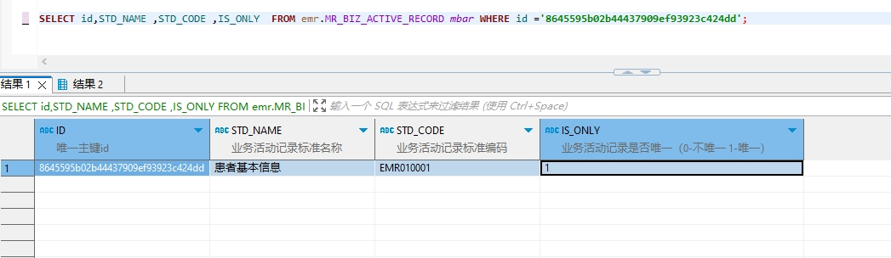

# 领域服务/病历领域 - 修改电子病历业务活动记录 - 修改电子病历业务活动记录 正向用例
## 请求参数：
``` json
{
  "orgName": "版本测试环境",
  "orgCode": "NXRMYY",
  "list": [
    {
      "rowerTypeName": "病历概要",
      "stdName": "患者基本信息",
      "firstClassifyName": "病历概要",
      "rowerTypeCode": "1",
      "stdCode": "EMR010001",
      "isOnly": "1",
      "id": "8645595b02b44437909ef93923c424dd"
    }
  ],
  "operatorId": "282475805660160000",
  "operatorName": "CS彭彭彭",
  "operateDate": "2024-10-16 17:24:41"
}
```
## 返回参数：
``` json
{
  "exception": null,
  "apiCode": null,
  "data": null,
  "Code": 200,
  "Message": "操作成功"
}
```
## 数据校验：

# 领域服务/病历领域 - 修改电子病历业务活动记录 - 必填校验-[orgCode]为空
## 请求参数：
``` json
{
  "orgName": "版本测试环境",
  "orgCode": "",
  "list": [
    {
      "rowerTypeName": "病历概要",
      "stdName": "患者基本信息",
      "firstClassifyName": "病历概要",
      "rowerTypeCode": "1",
      "stdCode": "EMR010001",
      "isOnly": "1",
      "id": "8645595b02b44437909ef93923c424dd"
    }
  ],
  "operatorId": "282475805660160000",
  "operatorName": "CS彭彭彭",
  "operateDate": "2024-10-16 17:24:41"
}
```
## 返回参数：
``` json
{
  "exception": null,
  "apiCode": null,
  "data": null,
  "Code": 1,
  "Message": "机构编码不能为空"
}
```
# 领域服务/病历领域 - 修改电子病历业务活动记录 - 必填校验-[orgName]为空
## 请求参数：
``` json
{
  "orgName": "",
  "orgCode": "NXRMYY",
  "list": [
    {
      "rowerTypeName": "病历概要",
      "stdName": "患者基本信息",
      "firstClassifyName": "病历概要",
      "rowerTypeCode": "1",
      "stdCode": "EMR010001",
      "isOnly": "1",
      "id": "8645595b02b44437909ef93923c424dd"
    }
  ],
  "operatorId": "282475805660160000",
  "operatorName": "CS彭彭彭",
  "operateDate": "2024-10-16 17:24:41"
}
```
## 返回参数：
``` json
{
  "exception": null,
  "apiCode": null,
  "data": null,
  "Code": 1,
  "Message": "机构名称不能为空"
}
```
# 领域服务/病历领域 - 修改电子病历业务活动记录 - 必填校验-[operatorId]为空
## 请求参数：
``` json
{
  "orgName": "版本测试环境",
  "orgCode": "NXRMYY",
  "list": [
    {
      "rowerTypeName": "病历概要",
      "stdName": "患者基本信息",
      "firstClassifyName": "病历概要",
      "rowerTypeCode": "1",
      "stdCode": "EMR010001",
      "isOnly": "1",
      "id": "8645595b02b44437909ef93923c424dd"
    }
  ],
  "operatorId": "",
  "operatorName": "CS彭彭彭",
  "operateDate": "2024-10-16 17:24:41"
}
```
## 返回参数：
``` json
{
  "exception": null,
  "apiCode": null,
  "data": null,
  "Code": 1,
  "Message": "操作人id不能为空"
}
```
# 领域服务/病历领域 - 修改电子病历业务活动记录 - 必填校验-[operatorName]为空
## 请求参数：
``` json
{
  "orgName": "版本测试环境",
  "orgCode": "NXRMYY",
  "list": [
    {
      "rowerTypeName": "病历概要",
      "stdName": "患者基本信息",
      "firstClassifyName": "病历概要",
      "rowerTypeCode": "1",
      "stdCode": "EMR010001",
      "isOnly": "1",
      "id": "8645595b02b44437909ef93923c424dd"
    }
  ],
  "operatorId": "282475805660160000",
  "operatorName": "",
  "operateDate": "2024-10-16 17:24:41"
}
```
## 返回参数：
``` json
{
  "exception": null,
  "apiCode": null,
  "data": null,
  "Code": 1,
  "Message": "操作人姓名不能为空"
}
```
# 领域服务/病历领域 - 修改电子病历业务活动记录 - 必填校验-[operateDate]为空
## 请求参数：
``` json
{
  "orgName": "版本测试环境",
  "orgCode": "NXRMYY",
  "list": [
    {
      "rowerTypeName": "病历概要",
      "stdName": "患者基本信息",
      "firstClassifyName": "病历概要",
      "rowerTypeCode": "1",
      "stdCode": "EMR010001",
      "isOnly": "1",
      "id": "8645595b02b44437909ef93923c424dd"
    }
  ],
  "operatorId": "282475805660160000",
  "operatorName": "CS彭彭彭",
  "operateDate": ""
}
```
## 返回参数：
``` json
{
  "exception": null,
  "apiCode": null,
  "data": null,
  "Code": 1,
  "Message": "操作时间不能为空"
}
```
# 领域服务/病历领域 - 修改电子病历业务活动记录 - 必填校验-[list]为空
## 请求参数：
``` json
{
  "orgName": "版本测试环境",
  "orgCode": "NXRMYY",
  "list": null,
  "operatorId": "282475805660160000",
  "operatorName": "CS彭彭彭",
  "operateDate": "2024-10-16 17:24:41"
}
```
## 返回参数：
``` json
{
  "exception": null,
  "apiCode": null,
  "data": null,
  "Code": 1,
  "Message": "待修改的病历业务活动记录集合不能为空"
}
```
# 领域服务/病历领域 - 修改电子病历业务活动记录 - 必填校验-[list.id]为空
## 请求参数：
``` json
{
  "orgName": "版本测试环境",
  "orgCode": "NXRMYY",
  "list": [
    {
      "rowerTypeName": "病历概要",
      "stdName": "患者基本信息",
      "firstClassifyName": "病历概要",
      "rowerTypeCode": "1",
      "stdCode": "EMR010001",
      "isOnly": "1",
      "id": null
    }
  ],
  "operatorId": "282475805660160000",
  "operatorName": "CS彭彭彭",
  "operateDate": "2024-10-16 17:24:41"
}
```
## 返回参数：
``` json
{
  "exception": null,
  "apiCode": null,
  "data": null,
  "Code": 1,
  "Message": "主键不能为空"
}
```
# 领域服务/病历领域 - 修改电子病历业务活动记录 - 必填校验-[list.stdCode]为空
## 请求参数：
``` json
{
  "orgName": "版本测试环境",
  "orgCode": "NXRMYY",
  "list": [
    {
      "rowerTypeName": "病历概要",
      "stdName": "患者基本信息",
      "firstClassifyName": "病历概要",
      "rowerTypeCode": "1",
      "stdCode": null,
      "isOnly": "1",
      "id": "8645595b02b44437909ef93923c424dd"
    }
  ],
  "operatorId": "282475805660160000",
  "operatorName": "CS彭彭彭",
  "operateDate": "2024-10-16 17:24:41"
}
```
## 返回参数：
``` json
{
  "exception": null,
  "apiCode": null,
  "data": null,
  "Code": 1,
  "Message": "业务活动记录标准编码不能为空"
}
```
# 领域服务/病历领域 - 修改电子病历业务活动记录 - 必填校验-[list.stdName]为空
## 请求参数：
``` json
{
  "orgName": "版本测试环境",
  "orgCode": "NXRMYY",
  "list": [
    {
      "rowerTypeName": "病历概要",
      "stdName": null,
      "firstClassifyName": "病历概要",
      "rowerTypeCode": "1",
      "stdCode": "EMR010001",
      "isOnly": "1",
      "id": "8645595b02b44437909ef93923c424dd"
    }
  ],
  "operatorId": "282475805660160000",
  "operatorName": "CS彭彭彭",
  "operateDate": "2024-10-16 17:24:41"
}
```
## 返回参数：
``` json
{
  "exception": null,
  "apiCode": null,
  "data": null,
  "Code": 1,
  "Message": "业务活动记录标准名称不能为空"
}
```
# 领域服务/病历领域 - 修改电子病历业务活动记录 - 必填校验-[list.isOnly]为空
## 请求参数：
``` json
{
  "orgName": "版本测试环境",
  "orgCode": "NXRMYY",
  "list": [
    {
      "rowerTypeName": "病历概要",
      "stdName": "患者基本信息",
      "firstClassifyName": "病历概要",
      "rowerTypeCode": "1",
      "stdCode": "EMR010001",
      "isOnly": null,
      "id": "8645595b02b44437909ef93923c424dd"
    }
  ],
  "operatorId": "282475805660160000",
  "operatorName": "CS彭彭彭",
  "operateDate": "2024-10-16 17:24:41"
}
```
## 返回参数：
``` json
{
  "exception": null,
  "apiCode": null,
  "data": null,
  "Code": 1,
  "Message": "业务活动记录是否唯一不能为空"
}
```
# 领域服务/病历领域 - 修改电子病历业务活动记录 - 枚举用例-[list.isOnly] 枚举值为 0(业务活动记录是否唯一为不唯一)
## 请求参数：
``` json
{
  "orgName": "版本测试环境",
  "orgCode": "NXRMYY",
  "list": [
    {
      "rowerTypeName": "病历概要",
      "stdName": "患者基本信息",
      "firstClassifyName": "病历概要",
      "rowerTypeCode": "1",
      "stdCode": "EMR010001",
      "isOnly": "0",
      "id": "8645595b02b44437909ef93923c424dd"
    }
  ],
  "operatorId": "282475805660160000",
  "operatorName": "CS彭彭彭",
  "operateDate": "2024-10-16 17:24:41"
}
```
## 返回参数：
``` json
{
  "exception": null,
  "apiCode": null,
  "data": null,
  "Code": 200,
  "Message": "操作成功"
}
```
# 领域服务/病历领域 - 修改电子病历业务活动记录 - 枚举用例-[list.isOnly] 枚举值为 1(业务活动记录是否唯一为唯一)
## 请求参数：
``` json
{
  "orgName": "版本测试环境",
  "orgCode": "NXRMYY",
  "list": [
    {
      "rowerTypeName": "病历概要",
      "stdName": "患者基本信息",
      "firstClassifyName": "病历概要",
      "rowerTypeCode": "1",
      "stdCode": "EMR010001",
      "isOnly": "1",
      "id": "8645595b02b44437909ef93923c424dd"
    }
  ],
  "operatorId": "282475805660160000",
  "operatorName": "CS彭彭彭",
  "operateDate": "2024-10-16 17:24:41"
}
```
## 返回参数：
``` json
{
  "exception": null,
  "apiCode": null,
  "data": null,
  "Code": 200,
  "Message": "操作成功"
}
```
# 领域服务/病历领域 - 修改电子病历业务活动记录 - 依赖用例-[operatorName]赋值为依赖用例测试值
## 请求参数：
``` json
{
  "orgName": "版本测试环境",
  "orgCode": "NXRMYY",
  "list": [
    {
      "rowerTypeName": "病历概要",
      "stdName": "患者基本信息",
      "firstClassifyName": "病历概要",
      "rowerTypeCode": "1",
      "stdCode": "EMR010001",
      "isOnly": "1",
      "id": "8645595b02b44437909ef93923c424dd"
    }
  ],
  "operatorId": "282475805660160000",
  "operatorName": "依赖用例测试值",
  "operateDate": "2024-10-16 17:24:41"
}
```
## 返回参数：
``` json
{
  "exception": null,
  "apiCode": null,
  "data": null,
  "Code": 200,
  "Message": "操作成功"
}
```
# 领域服务/病历领域 - 修改电子病历业务活动记录 - 依赖用例-[operatorId]赋值为依赖用例测试值
## 请求参数：
``` json
{
  "orgName": "版本测试环境",
  "orgCode": "NXRMYY",
  "list": [
    {
      "rowerTypeName": "病历概要",
      "stdName": "患者基本信息",
      "firstClassifyName": "病历概要",
      "rowerTypeCode": "1",
      "stdCode": "EMR010001",
      "isOnly": "1",
      "id": "8645595b02b44437909ef93923c424dd"
    }
  ],
  "operatorId": "依赖用例测试值",
  "operatorName": "CS彭彭彭",
  "operateDate": "2024-10-16 17:24:41"
}
```
## 返回参数：
``` json
{
  "exception": null,
  "apiCode": null,
  "data": null,
  "Code": 200,
  "Message": "操作成功"
}
```
# 领域服务/病历领域 - 修改电子病历业务活动记录 - 依赖用例-[list.stdCode]赋值为依赖用例测试值
## 请求参数：
``` json
{
  "orgName": "版本测试环境",
  "orgCode": "NXRMYY",
  "list": [
    {
      "rowerTypeName": "病历概要",
      "stdName": "患者基本信息",
      "firstClassifyName": "病历概要",
      "rowerTypeCode": "1",
      "stdCode": "依赖用例测试值",
      "isOnly": "1",
      "id": "8645595b02b44437909ef93923c424dd"
    }
  ],
  "operatorId": "282475805660160000",
  "operatorName": "CS彭彭彭",
  "operateDate": "2024-10-16 17:24:41"
}
```
## 返回参数：
``` json
{
  "exception": null,
  "apiCode": null,
  "data": null,
  "Code": 200,
  "Message": "操作成功"
}
```
# 领域服务/病历领域 - 修改电子病历业务活动记录 - 依赖用例-[list.id]赋值为依赖用例测试值
## 请求参数：
``` json
{
  "orgName": "版本测试环境",
  "orgCode": "NXRMYY",
  "list": [
    {
      "rowerTypeName": "病历概要",
      "stdName": "患者基本信息",
      "firstClassifyName": "病历概要",
      "rowerTypeCode": "1",
      "stdCode": "EMR010001",
      "isOnly": "1",
      "id": "依赖用例测试值"
    }
  ],
  "operatorId": "282475805660160000",
  "operatorName": "CS彭彭彭",
  "operateDate": "2024-10-16 17:24:41"
}
```
## 返回参数：
``` json
{
  "exception": null,
  "apiCode": null,
  "data": null,
  "Code": 1,
  "Message": "请先新增该业务活动记录"
}
```
# 领域服务/病历领域 - 修改电子病历业务活动记录 - 依赖用例-[orgCode]赋值为依赖用例测试值
## 请求参数：
``` json
{
  "orgName": "版本测试环境",
  "orgCode": "依赖用例测试值",
  "list": [
    {
      "rowerTypeName": "病历概要",
      "stdName": "患者基本信息",
      "firstClassifyName": "病历概要",
      "rowerTypeCode": "1",
      "stdCode": "EMR010001",
      "isOnly": "1",
      "id": "8645595b02b44437909ef93923c424dd"
    }
  ],
  "operatorId": "282475805660160000",
  "operatorName": "CS彭彭彭",
  "operateDate": "2024-10-16 17:24:41"
}
```
## 返回参数：
``` json
{
  "exception": null,
  "apiCode": null,
  "data": null,
  "Code": 200,
  "Message": "操作成功"
}
```
# 领域服务/病历领域 - 修改电子病历业务活动记录 - 依赖用例-[orgName]赋值为依赖用例测试值
## 请求参数：
``` json
{
  "orgName": "依赖用例测试值",
  "orgCode": "NXRMYY",
  "list": [
    {
      "rowerTypeName": "病历概要",
      "stdName": "患者基本信息",
      "firstClassifyName": "病历概要",
      "rowerTypeCode": "1",
      "stdCode": "EMR010001",
      "isOnly": "1",
      "id": "8645595b02b44437909ef93923c424dd"
    }
  ],
  "operatorId": "282475805660160000",
  "operatorName": "CS彭彭彭",
  "operateDate": "2024-10-16 17:24:41"
}
```
## 返回参数：
``` json
{
  "exception": null,
  "apiCode": null,
  "data": null,
  "Code": 200,
  "Message": "操作成功"
}
```