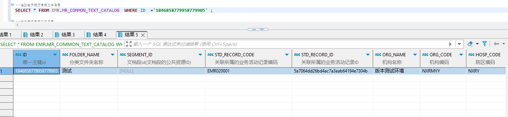

# 领域服务/病历领域 - 修改电子病历常用文本目录 - 修改电子病历常用文本目录 正向用例
## 请求参数：
``` json
{
  "orgName": "版本测试环境",
  "hospCode": "NXRY",
  "hospName": "版本测试环境",
  "orgCode": "NXRMYY",
  "list": [
    {
      "stdRecordCode": "EMR020001",
      "stdRecordId": "5a7064dd26bd4ac7a3eab64194e7304b",
      "folderName": "测试",
      "id": "1846858779958779905"
    }
  ],
  "operateDate": "2024-10-17 18:20:33",
  "operatorId": "349365436797001728",
  "operatorName": "测试医生"
}
```
## 返回参数：
``` json
{
  "exception": null,
  "apiCode": null,
  "data": true,
  "Code": 200,
  "Message": "操作成功"
}
```
## 数据校验：

# 领域服务/病历领域 - 修改电子病历常用文本目录 - 必填校验-[orgCode]为空
## 请求参数：
``` json
{
  "orgName": "版本测试环境",
  "hospCode": "NXRY",
  "hospName": "版本测试环境",
  "orgCode": "NXRMYY",
  "list": [
    {
      "stdRecordCode": "EMR020001",
      "stdRecordId": "5a7064dd26bd4ac7a3eab64194e7304b",
      "folderName": "测试",
      "id": "1846858779958779905"
    }
  ],
  "operateDate": "2024-10-17 18:20:33",
  "operatorId": "349365436797001728",
  "operatorName": "测试医生"
}
```
## 返回参数：
``` json
{
  "exception": null,
  "apiCode": null,
  "data": true,
  "Code": 200,
  "Message": "操作成功"
}
```
# 领域服务/病历领域 - 修改电子病历常用文本目录 - 必填校验-[orgName]为空
## 请求参数：
``` json
{
  "orgName": "版本测试环境",
  "hospCode": "NXRY",
  "hospName": "版本测试环境",
  "orgCode": "NXRMYY",
  "list": [
    {
      "stdRecordCode": "EMR020001",
      "stdRecordId": "5a7064dd26bd4ac7a3eab64194e7304b",
      "folderName": "测试",
      "id": "1846858779958779905"
    }
  ],
  "operateDate": "2024-10-17 18:20:33",
  "operatorId": "349365436797001728",
  "operatorName": "测试医生"
}
```
## 返回参数：
``` json
{
  "exception": null,
  "apiCode": null,
  "data": true,
  "Code": 200,
  "Message": "操作成功"
}
```
# 领域服务/病历领域 - 修改电子病历常用文本目录 - 必填校验-[hospCode]为空
## 请求参数：
``` json
{
  "orgName": "版本测试环境",
  "hospCode": "NXRY",
  "hospName": "版本测试环境",
  "orgCode": "NXRMYY",
  "list": [
    {
      "stdRecordCode": "EMR020001",
      "stdRecordId": "5a7064dd26bd4ac7a3eab64194e7304b",
      "folderName": "测试",
      "id": "1846858779958779905"
    }
  ],
  "operateDate": "2024-10-17 18:20:33",
  "operatorId": "349365436797001728",
  "operatorName": "测试医生"
}
```
## 返回参数：
``` json
{
  "exception": null,
  "apiCode": null,
  "data": true,
  "Code": 200,
  "Message": "操作成功"
}
```
# 领域服务/病历领域 - 修改电子病历常用文本目录 - 必填校验-[hospName]为空
## 请求参数：
``` json
{
  "orgName": "版本测试环境",
  "hospCode": "NXRY",
  "hospName": "版本测试环境",
  "orgCode": "NXRMYY",
  "list": [
    {
      "stdRecordCode": "EMR020001",
      "stdRecordId": "5a7064dd26bd4ac7a3eab64194e7304b",
      "folderName": "测试",
      "id": "1846858779958779905"
    }
  ],
  "operateDate": "2024-10-17 18:20:33",
  "operatorId": "349365436797001728",
  "operatorName": "测试医生"
}
```
## 返回参数：
``` json
{
  "exception": null,
  "apiCode": null,
  "data": true,
  "Code": 200,
  "Message": "操作成功"
}
```
# 领域服务/病历领域 - 修改电子病历常用文本目录 - 必填校验-[operatorId]为空
## 请求参数：
``` json
{
  "orgName": "版本测试环境",
  "hospCode": "NXRY",
  "hospName": "版本测试环境",
  "orgCode": "NXRMYY",
  "list": [
    {
      "stdRecordCode": "EMR020001",
      "stdRecordId": "5a7064dd26bd4ac7a3eab64194e7304b",
      "folderName": "测试",
      "id": "1846858779958779905"
    }
  ],
  "operateDate": "2024-10-17 18:20:33",
  "operatorId": "349365436797001728",
  "operatorName": "测试医生"
}
```
## 返回参数：
``` json
{
  "exception": null,
  "apiCode": null,
  "data": true,
  "Code": 200,
  "Message": "操作成功"
}
```
# 领域服务/病历领域 - 修改电子病历常用文本目录 - 必填校验-[operatorName]为空
## 请求参数：
``` json
{
  "orgName": "版本测试环境",
  "hospCode": "NXRY",
  "hospName": "版本测试环境",
  "orgCode": "NXRMYY",
  "list": [
    {
      "stdRecordCode": "EMR020001",
      "stdRecordId": "5a7064dd26bd4ac7a3eab64194e7304b",
      "folderName": "测试",
      "id": "1846858779958779905"
    }
  ],
  "operateDate": "2024-10-17 18:20:33",
  "operatorId": "349365436797001728",
  "operatorName": "测试医生"
}
```
## 返回参数：
``` json
{
  "exception": null,
  "apiCode": null,
  "data": true,
  "Code": 200,
  "Message": "操作成功"
}
```
# 领域服务/病历领域 - 修改电子病历常用文本目录 - 必填校验-[operateDate]为空
## 请求参数：
``` json
{
  "orgName": "版本测试环境",
  "hospCode": "NXRY",
  "hospName": "版本测试环境",
  "orgCode": "NXRMYY",
  "list": [
    {
      "stdRecordCode": "EMR020001",
      "stdRecordId": "5a7064dd26bd4ac7a3eab64194e7304b",
      "folderName": "测试",
      "id": "1846858779958779905"
    }
  ],
  "operateDate": "2024-10-17 18:20:33",
  "operatorId": "349365436797001728",
  "operatorName": "测试医生"
}
```
## 返回参数：
``` json
{
  "exception": null,
  "apiCode": null,
  "data": true,
  "Code": 200,
  "Message": "操作成功"
}
```
# 领域服务/病历领域 - 修改电子病历常用文本目录 - 必填校验-[list]为空
## 请求参数：
``` json
{
  "orgName": "版本测试环境",
  "hospCode": "NXRY",
  "hospName": "版本测试环境",
  "orgCode": "NXRMYY",
  "list": [
    {
      "stdRecordCode": "EMR020001",
      "stdRecordId": "5a7064dd26bd4ac7a3eab64194e7304b",
      "folderName": "测试",
      "id": "1846858779958779905"
    }
  ],
  "operateDate": "2024-10-17 18:20:33",
  "operatorId": "349365436797001728",
  "operatorName": "测试医生"
}
```
## 返回参数：
``` json
{
  "exception": null,
  "apiCode": null,
  "data": true,
  "Code": 200,
  "Message": "操作成功"
}
```
# 领域服务/病历领域 - 修改电子病历常用文本目录 - 必填校验-[list.id]为空
## 请求参数：
``` json
{
  "orgName": "版本测试环境",
  "hospCode": "NXRY",
  "hospName": "版本测试环境",
  "orgCode": "NXRMYY",
  "list": [
    {
      "stdRecordCode": "EMR020001",
      "stdRecordId": "5a7064dd26bd4ac7a3eab64194e7304b",
      "folderName": "测试",
      "id": "1846858779958779905"
    }
  ],
  "operateDate": "2024-10-17 18:20:33",
  "operatorId": "349365436797001728",
  "operatorName": "测试医生"
}
```
## 返回参数：
``` json
{
  "exception": null,
  "apiCode": null,
  "data": true,
  "Code": 200,
  "Message": "操作成功"
}
```
# 领域服务/病历领域 - 修改电子病历常用文本目录 - 必填校验-[list.folderName]为空
## 请求参数：
``` json
{
  "orgName": "版本测试环境",
  "hospCode": "NXRY",
  "hospName": "版本测试环境",
  "orgCode": "NXRMYY",
  "list": [
    {
      "stdRecordCode": "EMR020001",
      "stdRecordId": "5a7064dd26bd4ac7a3eab64194e7304b",
      "folderName": "测试",
      "id": "1846858779958779905"
    }
  ],
  "operateDate": "2024-10-17 18:20:33",
  "operatorId": "349365436797001728",
  "operatorName": "测试医生"
}
```
## 返回参数：
``` json
{
  "exception": null,
  "apiCode": null,
  "data": true,
  "Code": 200,
  "Message": "操作成功"
}
```
# 领域服务/病历领域 - 修改电子病历常用文本目录 - 必填校验-[list.stdRecordCode]为空
## 请求参数：
``` json
{
  "orgName": "版本测试环境",
  "hospCode": "NXRY",
  "hospName": "版本测试环境",
  "orgCode": "NXRMYY",
  "list": [
    {
      "stdRecordCode": "EMR020001",
      "stdRecordId": "5a7064dd26bd4ac7a3eab64194e7304b",
      "folderName": "测试",
      "id": "1846858779958779905"
    }
  ],
  "operateDate": "2024-10-17 18:20:33",
  "operatorId": "349365436797001728",
  "operatorName": "测试医生"
}
```
## 返回参数：
``` json
{
  "exception": null,
  "apiCode": null,
  "data": true,
  "Code": 200,
  "Message": "操作成功"
}
```
# 领域服务/病历领域 - 修改电子病历常用文本目录 - 必填校验-[list.stdRecordId]为空
## 请求参数：
``` json
{
  "orgName": "版本测试环境",
  "hospCode": "NXRY",
  "hospName": "版本测试环境",
  "orgCode": "NXRMYY",
  "list": [
    {
      "stdRecordCode": "EMR020001",
      "stdRecordId": "5a7064dd26bd4ac7a3eab64194e7304b",
      "folderName": "测试",
      "id": "1846858779958779905"
    }
  ],
  "operateDate": "2024-10-17 18:20:33",
  "operatorId": "349365436797001728",
  "operatorName": "测试医生"
}
```
## 返回参数：
``` json
{
  "exception": null,
  "apiCode": null,
  "data": true,
  "Code": 200,
  "Message": "操作成功"
}
```
# 领域服务/病历领域 - 修改电子病历常用文本目录 - 依赖用例-[operatorName]赋值为依赖用例测试值
## 请求参数：
``` json
{
  "orgName": "版本测试环境",
  "hospCode": "NXRY",
  "hospName": "版本测试环境",
  "orgCode": "NXRMYY",
  "list": [
    {
      "stdRecordCode": "EMR020001",
      "stdRecordId": "5a7064dd26bd4ac7a3eab64194e7304b",
      "folderName": "测试",
      "id": "1846858779958779905"
    }
  ],
  "operateDate": "2024-10-17 18:20:33",
  "operatorId": "349365436797001728",
  "operatorName": "测试医生"
}
```
## 返回参数：
``` json
{
  "exception": null,
  "apiCode": null,
  "data": true,
  "Code": 200,
  "Message": "操作成功"
}
```
# 领域服务/病历领域 - 修改电子病历常用文本目录 - 依赖用例-[operatorId]赋值为依赖用例测试值
## 请求参数：
``` json
{
  "orgName": "版本测试环境",
  "hospCode": "NXRY",
  "hospName": "版本测试环境",
  "orgCode": "NXRMYY",
  "list": [
    {
      "stdRecordCode": "EMR020001",
      "stdRecordId": "5a7064dd26bd4ac7a3eab64194e7304b",
      "folderName": "测试",
      "id": "1846858779958779905"
    }
  ],
  "operateDate": "2024-10-17 18:20:33",
  "operatorId": "349365436797001728",
  "operatorName": "测试医生"
}
```
## 返回参数：
``` json
{
  "exception": null,
  "apiCode": null,
  "data": true,
  "Code": 200,
  "Message": "操作成功"
}
```
# 领域服务/病历领域 - 修改电子病历常用文本目录 - 依赖用例-[list.stdRecordCode]赋值为依赖用例测试值
## 请求参数：
``` json
{
  "orgName": "版本测试环境",
  "hospCode": "NXRY",
  "hospName": "版本测试环境",
  "orgCode": "NXRMYY",
  "list": [
    {
      "stdRecordCode": "EMR020001",
      "stdRecordId": "5a7064dd26bd4ac7a3eab64194e7304b",
      "folderName": "测试",
      "id": "1846858779958779905"
    }
  ],
  "operateDate": "2024-10-17 18:20:33",
  "operatorId": "349365436797001728",
  "operatorName": "测试医生"
}
```
## 返回参数：
``` json
{
  "exception": null,
  "apiCode": null,
  "data": true,
  "Code": 200,
  "Message": "操作成功"
}
```
# 领域服务/病历领域 - 修改电子病历常用文本目录 - 依赖用例-[list.stdRecordId]赋值为依赖用例测试值
## 请求参数：
``` json
{
  "orgName": "版本测试环境",
  "hospCode": "NXRY",
  "hospName": "版本测试环境",
  "orgCode": "NXRMYY",
  "list": [
    {
      "stdRecordCode": "EMR020001",
      "stdRecordId": "5a7064dd26bd4ac7a3eab64194e7304b",
      "folderName": "测试",
      "id": "1846858779958779905"
    }
  ],
  "operateDate": "2024-10-17 18:20:33",
  "operatorId": "349365436797001728",
  "operatorName": "测试医生"
}
```
## 返回参数：
``` json
{
  "exception": null,
  "apiCode": null,
  "data": true,
  "Code": 200,
  "Message": "操作成功"
}
```
# 领域服务/病历领域 - 修改电子病历常用文本目录 - 依赖用例-[list.id]赋值为依赖用例测试值
## 请求参数：
``` json
{
  "orgName": "版本测试环境",
  "hospCode": "NXRY",
  "hospName": "版本测试环境",
  "orgCode": "NXRMYY",
  "list": [
    {
      "stdRecordCode": "EMR020001",
      "stdRecordId": "5a7064dd26bd4ac7a3eab64194e7304b",
      "folderName": "测试",
      "id": "1846858779958779905"
    }
  ],
  "operateDate": "2024-10-17 18:20:33",
  "operatorId": "349365436797001728",
  "operatorName": "测试医生"
}
```
## 返回参数：
``` json
{
  "exception": null,
  "apiCode": null,
  "data": true,
  "Code": 200,
  "Message": "操作成功"
}
```
# 领域服务/病历领域 - 修改电子病历常用文本目录 - 依赖用例-[orgCode]赋值为依赖用例测试值
## 请求参数：
``` json
{
  "orgName": "版本测试环境",
  "hospCode": "NXRY",
  "hospName": "版本测试环境",
  "orgCode": "NXRMYY",
  "list": [
    {
      "stdRecordCode": "EMR020001",
      "stdRecordId": "5a7064dd26bd4ac7a3eab64194e7304b",
      "folderName": "测试",
      "id": "1846858779958779905"
    }
  ],
  "operateDate": "2024-10-17 18:20:33",
  "operatorId": "349365436797001728",
  "operatorName": "测试医生"
}
```
## 返回参数：
``` json
{
  "exception": null,
  "apiCode": null,
  "data": true,
  "Code": 200,
  "Message": "操作成功"
}
```
# 领域服务/病历领域 - 修改电子病历常用文本目录 - 依赖用例-[hospName]赋值为依赖用例测试值
## 请求参数：
``` json
{
  "orgName": "版本测试环境",
  "hospCode": "NXRY",
  "hospName": "版本测试环境",
  "orgCode": "NXRMYY",
  "list": [
    {
      "stdRecordCode": "EMR020001",
      "stdRecordId": "5a7064dd26bd4ac7a3eab64194e7304b",
      "folderName": "测试",
      "id": "1846858779958779905"
    }
  ],
  "operateDate": "2024-10-17 18:20:33",
  "operatorId": "349365436797001728",
  "operatorName": "测试医生"
}
```
## 返回参数：
``` json
{
  "exception": null,
  "apiCode": null,
  "data": true,
  "Code": 200,
  "Message": "操作成功"
}
```
# 领域服务/病历领域 - 修改电子病历常用文本目录 - 依赖用例-[hospCode]赋值为依赖用例测试值
## 请求参数：
``` json
{
  "orgName": "版本测试环境",
  "hospCode": "NXRY",
  "hospName": "版本测试环境",
  "orgCode": "NXRMYY",
  "list": [
    {
      "stdRecordCode": "EMR020001",
      "stdRecordId": "5a7064dd26bd4ac7a3eab64194e7304b",
      "folderName": "测试",
      "id": "1846858779958779905"
    }
  ],
  "operateDate": "2024-10-17 18:20:33",
  "operatorId": "349365436797001728",
  "operatorName": "测试医生"
}
```
## 返回参数：
``` json
{
  "exception": null,
  "apiCode": null,
  "data": true,
  "Code": 200,
  "Message": "操作成功"
}
```
# 领域服务/病历领域 - 修改电子病历常用文本目录 - 依赖用例-[orgName]赋值为依赖用例测试值
## 请求参数：
``` json
{
  "orgName": "版本测试环境",
  "hospCode": "NXRY",
  "hospName": "版本测试环境",
  "orgCode": "NXRMYY",
  "list": [
    {
      "stdRecordCode": "EMR020001",
      "stdRecordId": "5a7064dd26bd4ac7a3eab64194e7304b",
      "folderName": "测试",
      "id": "1846858779958779905"
    }
  ],
  "operateDate": "2024-10-17 18:20:33",
  "operatorId": "349365436797001728",
  "operatorName": "测试医生"
}
```
## 返回参数：
``` json
{
  "exception": null,
  "apiCode": null,
  "data": true,
  "Code": 200,
  "Message": "操作成功"
}
```