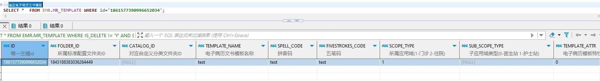

# 领域服务/病历领域 - 修改电子病历文书模板 - 修改电子病历文书模板 正向用例
## 请求参数：
``` json
{
  "orgName": "版本测试环境",
  "hospCode": "NXRY",
  "hospName": "版本测试环境",
  "orgCode": "NXRMYY",
  "list": [
    {
      "id": "1861577390996652034",
      "deptName": "呼吸内科(门)",
      "createUserId": "225158736540233728",
      "updateKey": 51,
      "signLevel": "0",
      "createUserName": "CS曹建明",
      "signDate": "2024-10-12 09:37:17",
      "signId": "225158736540233728",
      "hospName": "版本测试环境",
      "editType": "0",
      "orgName": "版本测试环境",
      "rangeType": "2",
      "frmName": "门诊病历框架",
      "rowerTypeName": "门急诊病历",
      "updateUserId": "225158736540233728",
      "updateUserName": "CS曹建明",
      "deptId": "81974240563934052160",
      "stdRecordCode": "EMR020001",
      "folderId": "1843188383036264449",
      "maxAgeUnit": "0",
      "isDefault": "N",
      "stdRecordName": "门(急)诊病历",
      "isOpen": "1",
      "templateAttr": "0",
      "signFlag": "1",
      "spellCode": "hxnkmb",
      "updateDate": "2024-10-12 09:37:17",
      "rowerTypeCode": "2",
      "frmId": "1843202402790985730",
      "fivestrokesCode": "KKMTSS",
      "catalogId": "",
      "scopeType": "1",
      "orgCode": "NXRMYY",
      "createDate": "2024-10-12 09:36:53",
      "signName": "CS曹建明",
      "hospCode": "NXRY",
      "isDelete": "N",
      "diagnoseList": [],
      "templateName": "test",
      "minAgeUnit": "0",
      "pullInTemplateId": "1844915108053082114",
      "stdRecordId": "5a7064dd26bd4ac7a3eab64194e7304b"
    }
  ],
  "operatorId": "282475805660160000",
  "operatorName": "CS彭彭彭",
  "operateDate": "2024-10-16 16:19:42"
}
```
## 返回参数：
``` json
{
    "exception": null,
    "apiCode": null,
    "data": null,
    "Code": 200,
    "Message": "操作成功"
}
```
## 数据校验：

# 领域服务/病历领域 - 修改电子病历文书模板 - 必填校验-[orgCode]为空
## 请求参数：
``` json
{
  "orgName": "版本测试环境",
  "updateFlag": "1",
  "hospCode": "NXRY",
  "hospName": "版本测试环境",
  "orgCode": "",
  "list": [
    {
      "createUserId": "349365436797001728",
      "updateKey": 64,
      "signLevel": "0",
      "createUserName": "测试医生",
      "signDate": "2024-10-22 10:03:28",
      "signId": "349365436797001728",
      "hospName": "版本测试环境",
      "editType": "0",
      "templateContent": "test",
      "id": "1846855098186145794",
      "orgName": "版本测试环境",
      "rangeType": "4",
      "frmName": "门诊病历框架",
      "rowerTypeName": "门急诊病历",
      "updateUserId": "349365436797001728",
      "updateUserName": "测试医生",
      "stdRecordCode": "EMR020001",
      "folderId": "1843188383036264449",
      "maxAgeUnit": "0",
      "isDefault": "Y",
      "stdRecordName": "门(急)诊病历",
      "isOpen": "1",
      "minAge": 0,
      "templateAttr": "0",
      "signFlag": "0",
      "spellCode": "yzgs",
      "updateDate": "2024-10-22 10:03:28",
      "templateNodeList": [
        {
          "hisdataFieldCode": "diagnosisMemo",
          "dateFormat": "YYYY-MM-DD HH:mm:ss",
          "isHisdataSource": "1",
          "defaultValue": "",
          "isMultiplex": "0",
          "minLength": 10,
          "signLevel": "0",
          "templateId": "1846855098186145794",
          "identificationBoundField": "",
          "dictCode": "",
          "dataType": "0",
          "maxDatetimeValue": "",
          "stdRecordCode": "EMR020001",
          "controlId": "ad68dc73-5a61-488e-9137-560454d51e23",
          "nodeType": "0",
          "showBoundField": "",
          "stdRecordName": "门(急)诊病历",
          "name": "备注",
          "dictShowField": "",
          "maxLength": 50,
          "minDatetimeValue": "",
          "code": "DE05.01.025.00",
          "lableText": "",
          "fuzzyMatchField": "",
          "dictType": "0",
          "deId": "dc842fab3eee7c0e4124e7d2bdff0efe",
          "isAutosum": "",
          "deCode": "DE05.01.025.00",
          "isForce": "0",
          "isSignControl": "0",
          "backText": "诊断备注",
          "unitText": "",
          "isBinarylength": "",
          "isDirectEdit": "1",
          "recordNodeId": "1784853023617474562NXRMYY",
          "deName": "西医疾病诊断名称",
          "isMust": "1",
          "hisdataCatalogCode": "03",
          "stdRecordId": "5a7064dd26bd4ac7a3eab64194e7304b"
        },
        {
          "hisdataFieldCode": "temperature",
          "dateFormat": "yyyy-MM-dd HH:mm:ss",
          "isHisdataSource": "1",
          "defaultValue": "",
          "isMultiplex": "0",
          "signLevel": "0",
          "templateId": "1846855098186145794",
          "identificationBoundField": "",
          "dictCode": "",
          "dataType": "0",
          "maxDatetimeValue": "",
          "stdRecordCode": "EMR020001",
          "controlId": "9705f06d-b83a-4ad7-934b-6209eb82d381",
          "nodeType": "0",
          "showBoundField": "",
          "stdRecordName": "门(急)诊病历",
          "name": "天假数据元",
          "dictShowField": "",
          "minDatetimeValue": "",
          "code": "DE04.50.067.00",
          "lableText": "",
          "fuzzyMatchField": "",
          "dictType": "0",
          "deId": "ee12f461e4461e8f3dc133fb1c9add21",
          "isAutosum": "",
          "deCode": "DE04.50.067.00",
          "isForce": "0",
          "isSignControl": "0",
          "backText": "天假数据元",
          "unitText": "",
          "isBinarylength": "",
          "isDirectEdit": "0",
          "recordNodeId": "1843950468351455233",
          "deName": "凝血时间（s）",
          "isMust": "0",
          "hisdataCatalogCode": "23",
          "stdRecordId": "5a7064dd26bd4ac7a3eab64194e7304b"
        },
        {
          "hisdataFieldCode": "",
          "dateFormat": "yyyy-MM-dd HH:mm:ss",
          "isHisdataSource": "0",
          "defaultValue": "",
          "isMultiplex": "0",
          "signLevel": "0",
          "templateId": "1846855098186145794",
          "identificationBoundField": "",
          "dictCode": "",
          "dataType": "0",
          "maxDatetimeValue": "",
          "stdRecordCode": "EMR020001",
          "controlId": "a70273d8-0db6-4284-b5a4-8399054ad7d1",
          "nodeType": "0",
          "showBoundField": "",
          "stdRecordName": "门(急)诊病历",
          "name": "起病时间",
          "dictShowField": "",
          "minDatetimeValue": "",
          "code": "DE04.01.018.00",
          "lableText": "",
          "fuzzyMatchField": "",
          "dictType": "0",
          "deId": "8c2ad9850e6a4517e964e19a3a28fe92",
          "isAutosum": "",
          "deCode": "DE04.01.018.00",
          "isForce": "0",
          "isSignControl": "0",
          "backText": "起病时间",
          "unitText": "",
          "isBinarylength": "",
          "isDirectEdit": "1",
          "recordNodeId": "1800704544443740162NXRMYY",
          "deName": "发病日期时间",
          "isMust": "0",
          "hisdataCatalogCode": "",
          "stdRecordId": "5a7064dd26bd4ac7a3eab64194e7304b"
        },
        {
          "hisdataFieldCode": "allergenName",
          "dateFormat": "yyyy-MM-dd HH:mm:ss",
          "isHisdataSource": "1",
          "defaultValue": "",
          "isMultiplex": "1",
          "signLevel": "0",
          "templateId": "1846855098186145794",
          "identificationBoundField": "",
          "dictCode": "CV05.01.038",
          "dataType": "3",
          "maxDatetimeValue": "",
          "stdRecordCode": "EMR020001",
          "controlId": "52eaf4b4-8d5c-44f0-aec7-84c62ef193df",
          "nodeType": "0",
          "showBoundField": "",
          "stdRecordName": "门(急)诊病历",
          "name": "过敏源",
          "dictShowField": "",
          "minDatetimeValue": "",
          "code": "DE05.01.022.00",
          "lableText": "",
          "fuzzyMatchField": "",
          "dictType": "0",
          "deId": "0670116da5cb30ff268ea3466aea637c",
          "isAutosum": "",
          "deCode": "DE05.01.022.00",
          "isForce": "0",
          "isSignControl": "0",
          "backText": "过敏源",
          "unitText": "",
          "isBinarylength": "",
          "isDirectEdit": "1",
          "recordNodeId": "1800444078274392065NXRMYY",
          "deName": "过敏源代码",
          "isMust": "0",
          "hisdataCatalogCode": "08",
          "stdRecordId": "5a7064dd26bd4ac7a3eab64194e7304b"
        },
        {
          "hisdataFieldCode": "temperature",
          "dateFormat": "yyyy-MM-dd HH:mm:ss",
          "isHisdataSource": "1",
          "defaultValue": "0",
          "isMultiplex": "0",
          "signLevel": "0",
          "templateId": "1846855098186145794",
          "identificationBoundField": "",
          "dictCode": "",
          "dataType": "1",
          "maxDatetimeValue": "",
          "stdRecordCode": "EMR020001",
          "controlId": "c99aee95-dc09-447f-9f58-9b8a6913660f",
          "nodeType": "0",
          "showBoundField": "",
          "stdRecordName": "门(急)诊病历",
          "name": "体温",
          "dictShowField": "",
          "minDatetimeValue": "",
          "code": "DE04.10.186.00",
          "lableText": "",
          "fuzzyMatchField": "",
          "dictType": "0",
          "deId": "24a23d3d1aea75c43fe9fc5c5572630b",
          "isAutosum": "",
          "deCode": "DE04.10.186.00",
          "isForce": "0",
          "isSignControl": "0",
          "backText": "体温",
          "unitText": "℃",
          "isBinarylength": "",
          "isDirectEdit": "1",
          "recordNodeId": "1788840854740320258NXRMYY",
          "deName": "体温（℃）",
          "isMust": "1",
          "hisdataCatalogCode": "23",
          "stdRecordId": "5a7064dd26bd4ac7a3eab64194e7304b"
        },
        {
          "hisdataFieldCode": "heartRate",
          "dateFormat": "yyyy-MM-dd HH:mm:ss",
          "isHisdataSource": "1",
          "defaultValue": "",
          "isMultiplex": "0",
          "signLevel": "0",
          "templateId": "1846855098186145794",
          "identificationBoundField": "",
          "dictCode": "",
          "dataType": "0",
          "maxDatetimeValue": "",
          "stdRecordCode": "EMR020001",
          "controlId": "dd8f7615-5947-46f4-aa7f-7182b98d1097",
          "nodeType": "0",
          "showBoundField": "",
          "stdRecordName": "门(急)诊病历",
          "name": "心率",
          "dictShowField": "",
          "minDatetimeValue": "",
          "code": "DE04.10.206.00",
          "lableText": "",
          "fuzzyMatchField": "",
          "dictType": "0",
          "deId": "a0c15b6d057fb25e201fa4b95e57e7f9",
          "isAutosum": "",
          "deCode": "DE04.10.206.00",
          "isForce": "0",
          "isSignControl": "0",
          "backText": "心率",
          "unitText": "",
          "isBinarylength": "",
          "isDirectEdit": "1",
          "recordNodeId": "1788840543548129282NXRMYY",
          "deName": "心率（次/min）",
          "isMust": "0",
          "hisdataCatalogCode": "23",
          "stdRecordId": "5a7064dd26bd4ac7a3eab64194e7304b"
        },
        {
          "hisdataFieldCode": "",
          "dateFormat": "YYYY-MM-DD HH:mm:ss",
          "isHisdataSource": "0",
          "defaultValue": "",
          "isMultiplex": "0",
          "signLevel": "0",
          "templateId": "1846855098186145794",
          "identificationBoundField": "",
          "dictCode": "",
          "dataType": "0",
          "maxDatetimeValue": "",
          "stdRecordCode": "EMR020001",
          "controlId": "0a009fb8-cfe1-4ce1-8b09-f968e5d56ae7",
          "nodeType": "0",
          "showBoundField": "",
          "stdRecordName": "门(急)诊病历",
          "name": "医师签名",
          "dictShowField": "",
          "minDatetimeValue": "",
          "code": "DE02.01.039.00",
          "lableText": "",
          "fuzzyMatchField": "",
          "dictType": "0",
          "deId": "08ef0fdbb81673d284de66dd9b885f38",
          "isAutosum": "",
          "deCode": "DE02.01.039.00",
          "isForce": "0",
          "isSignControl": "1",
          "backText": "医师签名",
          "unitText": "",
          "isBinarylength": "",
          "isDirectEdit": "1",
          "recordNodeId": "1843949154972266498",
          "deName": "姓名",
          "isMust": "1",
          "hisdataCatalogCode": "",
          "stdRecordId": "5a7064dd26bd4ac7a3eab64194e7304b"
        }
      ],
      "rowerTypeCode": "2",
      "frmId": "1843202402790985730",
      "fivestrokesCode": "CYSA",
      "scopeType": "1",
      "orgCode": "NXRMYY",
      "createDate": "2024-10-17 18:05:42",
      "signName": "测试医生",
      "hospCode": "NXRY",
      "isDelete": "N",
      "diagnoseList": [],
      "maxAge": 90,
      "templateName": "验证格式",
      "minAgeUnit": "0",
      "stdRecordId": "5a7064dd26bd4ac7a3eab64194e7304b"
    }
  ],
  "operatorId": "349365436797001728",
  "operatorName": "测试医生",
  "operateDate": "2024-10-22 10:10:36"
}
```
## 返回参数：
``` json
{
  "exception": null,
  "apiCode": null,
  "data": null,
  "Code": 1,
  "Message": "机构编码不能为空"
}
```
# 领域服务/病历领域 - 修改电子病历文书模板 - 必填校验-[orgName]为空
## 请求参数：
``` json
{
  "orgName": "",
  "updateFlag": "1",
  "hospCode": "NXRY",
  "hospName": "版本测试环境",
  "orgCode": "NXRMYY",
  "list": [
    {
      "createUserId": "349365436797001728",
      "updateKey": 64,
      "signLevel": "0",
      "createUserName": "测试医生",
      "signDate": "2024-10-22 10:03:28",
      "signId": "349365436797001728",
      "hospName": "版本测试环境",
      "editType": "0",
      "templateContent": "test",
      "id": "1846855098186145794",
      "orgName": "版本测试环境",
      "rangeType": "4",
      "frmName": "门诊病历框架",
      "rowerTypeName": "门急诊病历",
      "updateUserId": "349365436797001728",
      "updateUserName": "测试医生",
      "stdRecordCode": "EMR020001",
      "folderId": "1843188383036264449",
      "maxAgeUnit": "0",
      "isDefault": "Y",
      "stdRecordName": "门(急)诊病历",
      "isOpen": "1",
      "minAge": 0,
      "templateAttr": "0",
      "signFlag": "0",
      "spellCode": "yzgs",
      "updateDate": "2024-10-22 10:03:28",
      "templateNodeList": [
        {
          "hisdataFieldCode": "diagnosisMemo",
          "dateFormat": "YYYY-MM-DD HH:mm:ss",
          "isHisdataSource": "1",
          "defaultValue": "",
          "isMultiplex": "0",
          "minLength": 10,
          "signLevel": "0",
          "templateId": "1846855098186145794",
          "identificationBoundField": "",
          "dictCode": "",
          "dataType": "0",
          "maxDatetimeValue": "",
          "stdRecordCode": "EMR020001",
          "controlId": "ad68dc73-5a61-488e-9137-560454d51e23",
          "nodeType": "0",
          "showBoundField": "",
          "stdRecordName": "门(急)诊病历",
          "name": "备注",
          "dictShowField": "",
          "maxLength": 50,
          "minDatetimeValue": "",
          "code": "DE05.01.025.00",
          "lableText": "",
          "fuzzyMatchField": "",
          "dictType": "0",
          "deId": "dc842fab3eee7c0e4124e7d2bdff0efe",
          "isAutosum": "",
          "deCode": "DE05.01.025.00",
          "isForce": "0",
          "isSignControl": "0",
          "backText": "诊断备注",
          "unitText": "",
          "isBinarylength": "",
          "isDirectEdit": "1",
          "recordNodeId": "1784853023617474562NXRMYY",
          "deName": "西医疾病诊断名称",
          "isMust": "1",
          "hisdataCatalogCode": "03",
          "stdRecordId": "5a7064dd26bd4ac7a3eab64194e7304b"
        },
        {
          "hisdataFieldCode": "temperature",
          "dateFormat": "yyyy-MM-dd HH:mm:ss",
          "isHisdataSource": "1",
          "defaultValue": "",
          "isMultiplex": "0",
          "signLevel": "0",
          "templateId": "1846855098186145794",
          "identificationBoundField": "",
          "dictCode": "",
          "dataType": "0",
          "maxDatetimeValue": "",
          "stdRecordCode": "EMR020001",
          "controlId": "9705f06d-b83a-4ad7-934b-6209eb82d381",
          "nodeType": "0",
          "showBoundField": "",
          "stdRecordName": "门(急)诊病历",
          "name": "天假数据元",
          "dictShowField": "",
          "minDatetimeValue": "",
          "code": "DE04.50.067.00",
          "lableText": "",
          "fuzzyMatchField": "",
          "dictType": "0",
          "deId": "ee12f461e4461e8f3dc133fb1c9add21",
          "isAutosum": "",
          "deCode": "DE04.50.067.00",
          "isForce": "0",
          "isSignControl": "0",
          "backText": "天假数据元",
          "unitText": "",
          "isBinarylength": "",
          "isDirectEdit": "0",
          "recordNodeId": "1843950468351455233",
          "deName": "凝血时间（s）",
          "isMust": "0",
          "hisdataCatalogCode": "23",
          "stdRecordId": "5a7064dd26bd4ac7a3eab64194e7304b"
        },
        {
          "hisdataFieldCode": "",
          "dateFormat": "yyyy-MM-dd HH:mm:ss",
          "isHisdataSource": "0",
          "defaultValue": "",
          "isMultiplex": "0",
          "signLevel": "0",
          "templateId": "1846855098186145794",
          "identificationBoundField": "",
          "dictCode": "",
          "dataType": "0",
          "maxDatetimeValue": "",
          "stdRecordCode": "EMR020001",
          "controlId": "a70273d8-0db6-4284-b5a4-8399054ad7d1",
          "nodeType": "0",
          "showBoundField": "",
          "stdRecordName": "门(急)诊病历",
          "name": "起病时间",
          "dictShowField": "",
          "minDatetimeValue": "",
          "code": "DE04.01.018.00",
          "lableText": "",
          "fuzzyMatchField": "",
          "dictType": "0",
          "deId": "8c2ad9850e6a4517e964e19a3a28fe92",
          "isAutosum": "",
          "deCode": "DE04.01.018.00",
          "isForce": "0",
          "isSignControl": "0",
          "backText": "起病时间",
          "unitText": "",
          "isBinarylength": "",
          "isDirectEdit": "1",
          "recordNodeId": "1800704544443740162NXRMYY",
          "deName": "发病日期时间",
          "isMust": "0",
          "hisdataCatalogCode": "",
          "stdRecordId": "5a7064dd26bd4ac7a3eab64194e7304b"
        },
        {
          "hisdataFieldCode": "allergenName",
          "dateFormat": "yyyy-MM-dd HH:mm:ss",
          "isHisdataSource": "1",
          "defaultValue": "",
          "isMultiplex": "1",
          "signLevel": "0",
          "templateId": "1846855098186145794",
          "identificationBoundField": "",
          "dictCode": "CV05.01.038",
          "dataType": "3",
          "maxDatetimeValue": "",
          "stdRecordCode": "EMR020001",
          "controlId": "52eaf4b4-8d5c-44f0-aec7-84c62ef193df",
          "nodeType": "0",
          "showBoundField": "",
          "stdRecordName": "门(急)诊病历",
          "name": "过敏源",
          "dictShowField": "",
          "minDatetimeValue": "",
          "code": "DE05.01.022.00",
          "lableText": "",
          "fuzzyMatchField": "",
          "dictType": "0",
          "deId": "0670116da5cb30ff268ea3466aea637c",
          "isAutosum": "",
          "deCode": "DE05.01.022.00",
          "isForce": "0",
          "isSignControl": "0",
          "backText": "过敏源",
          "unitText": "",
          "isBinarylength": "",
          "isDirectEdit": "1",
          "recordNodeId": "1800444078274392065NXRMYY",
          "deName": "过敏源代码",
          "isMust": "0",
          "hisdataCatalogCode": "08",
          "stdRecordId": "5a7064dd26bd4ac7a3eab64194e7304b"
        },
        {
          "hisdataFieldCode": "temperature",
          "dateFormat": "yyyy-MM-dd HH:mm:ss",
          "isHisdataSource": "1",
          "defaultValue": "0",
          "isMultiplex": "0",
          "signLevel": "0",
          "templateId": "1846855098186145794",
          "identificationBoundField": "",
          "dictCode": "",
          "dataType": "1",
          "maxDatetimeValue": "",
          "stdRecordCode": "EMR020001",
          "controlId": "c99aee95-dc09-447f-9f58-9b8a6913660f",
          "nodeType": "0",
          "showBoundField": "",
          "stdRecordName": "门(急)诊病历",
          "name": "体温",
          "dictShowField": "",
          "minDatetimeValue": "",
          "code": "DE04.10.186.00",
          "lableText": "",
          "fuzzyMatchField": "",
          "dictType": "0",
          "deId": "24a23d3d1aea75c43fe9fc5c5572630b",
          "isAutosum": "",
          "deCode": "DE04.10.186.00",
          "isForce": "0",
          "isSignControl": "0",
          "backText": "体温",
          "unitText": "℃",
          "isBinarylength": "",
          "isDirectEdit": "1",
          "recordNodeId": "1788840854740320258NXRMYY",
          "deName": "体温（℃）",
          "isMust": "1",
          "hisdataCatalogCode": "23",
          "stdRecordId": "5a7064dd26bd4ac7a3eab64194e7304b"
        },
        {
          "hisdataFieldCode": "heartRate",
          "dateFormat": "yyyy-MM-dd HH:mm:ss",
          "isHisdataSource": "1",
          "defaultValue": "",
          "isMultiplex": "0",
          "signLevel": "0",
          "templateId": "1846855098186145794",
          "identificationBoundField": "",
          "dictCode": "",
          "dataType": "0",
          "maxDatetimeValue": "",
          "stdRecordCode": "EMR020001",
          "controlId": "dd8f7615-5947-46f4-aa7f-7182b98d1097",
          "nodeType": "0",
          "showBoundField": "",
          "stdRecordName": "门(急)诊病历",
          "name": "心率",
          "dictShowField": "",
          "minDatetimeValue": "",
          "code": "DE04.10.206.00",
          "lableText": "",
          "fuzzyMatchField": "",
          "dictType": "0",
          "deId": "a0c15b6d057fb25e201fa4b95e57e7f9",
          "isAutosum": "",
          "deCode": "DE04.10.206.00",
          "isForce": "0",
          "isSignControl": "0",
          "backText": "心率",
          "unitText": "",
          "isBinarylength": "",
          "isDirectEdit": "1",
          "recordNodeId": "1788840543548129282NXRMYY",
          "deName": "心率（次/min）",
          "isMust": "0",
          "hisdataCatalogCode": "23",
          "stdRecordId": "5a7064dd26bd4ac7a3eab64194e7304b"
        },
        {
          "hisdataFieldCode": "",
          "dateFormat": "YYYY-MM-DD HH:mm:ss",
          "isHisdataSource": "0",
          "defaultValue": "",
          "isMultiplex": "0",
          "signLevel": "0",
          "templateId": "1846855098186145794",
          "identificationBoundField": "",
          "dictCode": "",
          "dataType": "0",
          "maxDatetimeValue": "",
          "stdRecordCode": "EMR020001",
          "controlId": "0a009fb8-cfe1-4ce1-8b09-f968e5d56ae7",
          "nodeType": "0",
          "showBoundField": "",
          "stdRecordName": "门(急)诊病历",
          "name": "医师签名",
          "dictShowField": "",
          "minDatetimeValue": "",
          "code": "DE02.01.039.00",
          "lableText": "",
          "fuzzyMatchField": "",
          "dictType": "0",
          "deId": "08ef0fdbb81673d284de66dd9b885f38",
          "isAutosum": "",
          "deCode": "DE02.01.039.00",
          "isForce": "0",
          "isSignControl": "1",
          "backText": "医师签名",
          "unitText": "",
          "isBinarylength": "",
          "isDirectEdit": "1",
          "recordNodeId": "1843949154972266498",
          "deName": "姓名",
          "isMust": "1",
          "hisdataCatalogCode": "",
          "stdRecordId": "5a7064dd26bd4ac7a3eab64194e7304b"
        }
      ],
      "rowerTypeCode": "2",
      "frmId": "1843202402790985730",
      "fivestrokesCode": "CYSA",
      "scopeType": "1",
      "orgCode": "NXRMYY",
      "createDate": "2024-10-17 18:05:42",
      "signName": "测试医生",
      "hospCode": "NXRY",
      "isDelete": "N",
      "diagnoseList": [],
      "maxAge": 90,
      "templateName": "验证格式",
      "minAgeUnit": "0",
      "stdRecordId": "5a7064dd26bd4ac7a3eab64194e7304b"
    }
  ],
  "operatorId": "349365436797001728",
  "operatorName": "测试医生",
  "operateDate": "2024-10-22 10:10:36"
}
```
## 返回参数：
``` json
{
  "exception": null,
  "apiCode": null,
  "data": null,
  "Code": 1,
  "Message": "机构名称不能为空"
}
```
# 领域服务/病历领域 - 修改电子病历文书模板 - 必填校验-[hospCode]为空
## 请求参数：
``` json
{
  "orgName": "版本测试环境",
  "updateFlag": "1",
  "hospCode": "",
  "hospName": "版本测试环境",
  "orgCode": "NXRMYY",
  "list": [
    {
      "createUserId": "349365436797001728",
      "updateKey": 64,
      "signLevel": "0",
      "createUserName": "测试医生",
      "signDate": "2024-10-22 10:03:28",
      "signId": "349365436797001728",
      "hospName": "版本测试环境",
      "editType": "0",
      "templateContent": "test",
      "id": "1846855098186145794",
      "orgName": "版本测试环境",
      "rangeType": "4",
      "frmName": "门诊病历框架",
      "rowerTypeName": "门急诊病历",
      "updateUserId": "349365436797001728",
      "updateUserName": "测试医生",
      "stdRecordCode": "EMR020001",
      "folderId": "1843188383036264449",
      "maxAgeUnit": "0",
      "isDefault": "Y",
      "stdRecordName": "门(急)诊病历",
      "isOpen": "1",
      "minAge": 0,
      "templateAttr": "0",
      "signFlag": "0",
      "spellCode": "yzgs",
      "updateDate": "2024-10-22 10:03:28",
      "templateNodeList": [
        {
          "hisdataFieldCode": "diagnosisMemo",
          "dateFormat": "YYYY-MM-DD HH:mm:ss",
          "isHisdataSource": "1",
          "defaultValue": "",
          "isMultiplex": "0",
          "minLength": 10,
          "signLevel": "0",
          "templateId": "1846855098186145794",
          "identificationBoundField": "",
          "dictCode": "",
          "dataType": "0",
          "maxDatetimeValue": "",
          "stdRecordCode": "EMR020001",
          "controlId": "ad68dc73-5a61-488e-9137-560454d51e23",
          "nodeType": "0",
          "showBoundField": "",
          "stdRecordName": "门(急)诊病历",
          "name": "备注",
          "dictShowField": "",
          "maxLength": 50,
          "minDatetimeValue": "",
          "code": "DE05.01.025.00",
          "lableText": "",
          "fuzzyMatchField": "",
          "dictType": "0",
          "deId": "dc842fab3eee7c0e4124e7d2bdff0efe",
          "isAutosum": "",
          "deCode": "DE05.01.025.00",
          "isForce": "0",
          "isSignControl": "0",
          "backText": "诊断备注",
          "unitText": "",
          "isBinarylength": "",
          "isDirectEdit": "1",
          "recordNodeId": "1784853023617474562NXRMYY",
          "deName": "西医疾病诊断名称",
          "isMust": "1",
          "hisdataCatalogCode": "03",
          "stdRecordId": "5a7064dd26bd4ac7a3eab64194e7304b"
        },
        {
          "hisdataFieldCode": "temperature",
          "dateFormat": "yyyy-MM-dd HH:mm:ss",
          "isHisdataSource": "1",
          "defaultValue": "",
          "isMultiplex": "0",
          "signLevel": "0",
          "templateId": "1846855098186145794",
          "identificationBoundField": "",
          "dictCode": "",
          "dataType": "0",
          "maxDatetimeValue": "",
          "stdRecordCode": "EMR020001",
          "controlId": "9705f06d-b83a-4ad7-934b-6209eb82d381",
          "nodeType": "0",
          "showBoundField": "",
          "stdRecordName": "门(急)诊病历",
          "name": "天假数据元",
          "dictShowField": "",
          "minDatetimeValue": "",
          "code": "DE04.50.067.00",
          "lableText": "",
          "fuzzyMatchField": "",
          "dictType": "0",
          "deId": "ee12f461e4461e8f3dc133fb1c9add21",
          "isAutosum": "",
          "deCode": "DE04.50.067.00",
          "isForce": "0",
          "isSignControl": "0",
          "backText": "天假数据元",
          "unitText": "",
          "isBinarylength": "",
          "isDirectEdit": "0",
          "recordNodeId": "1843950468351455233",
          "deName": "凝血时间（s）",
          "isMust": "0",
          "hisdataCatalogCode": "23",
          "stdRecordId": "5a7064dd26bd4ac7a3eab64194e7304b"
        },
        {
          "hisdataFieldCode": "",
          "dateFormat": "yyyy-MM-dd HH:mm:ss",
          "isHisdataSource": "0",
          "defaultValue": "",
          "isMultiplex": "0",
          "signLevel": "0",
          "templateId": "1846855098186145794",
          "identificationBoundField": "",
          "dictCode": "",
          "dataType": "0",
          "maxDatetimeValue": "",
          "stdRecordCode": "EMR020001",
          "controlId": "a70273d8-0db6-4284-b5a4-8399054ad7d1",
          "nodeType": "0",
          "showBoundField": "",
          "stdRecordName": "门(急)诊病历",
          "name": "起病时间",
          "dictShowField": "",
          "minDatetimeValue": "",
          "code": "DE04.01.018.00",
          "lableText": "",
          "fuzzyMatchField": "",
          "dictType": "0",
          "deId": "8c2ad9850e6a4517e964e19a3a28fe92",
          "isAutosum": "",
          "deCode": "DE04.01.018.00",
          "isForce": "0",
          "isSignControl": "0",
          "backText": "起病时间",
          "unitText": "",
          "isBinarylength": "",
          "isDirectEdit": "1",
          "recordNodeId": "1800704544443740162NXRMYY",
          "deName": "发病日期时间",
          "isMust": "0",
          "hisdataCatalogCode": "",
          "stdRecordId": "5a7064dd26bd4ac7a3eab64194e7304b"
        },
        {
          "hisdataFieldCode": "allergenName",
          "dateFormat": "yyyy-MM-dd HH:mm:ss",
          "isHisdataSource": "1",
          "defaultValue": "",
          "isMultiplex": "1",
          "signLevel": "0",
          "templateId": "1846855098186145794",
          "identificationBoundField": "",
          "dictCode": "CV05.01.038",
          "dataType": "3",
          "maxDatetimeValue": "",
          "stdRecordCode": "EMR020001",
          "controlId": "52eaf4b4-8d5c-44f0-aec7-84c62ef193df",
          "nodeType": "0",
          "showBoundField": "",
          "stdRecordName": "门(急)诊病历",
          "name": "过敏源",
          "dictShowField": "",
          "minDatetimeValue": "",
          "code": "DE05.01.022.00",
          "lableText": "",
          "fuzzyMatchField": "",
          "dictType": "0",
          "deId": "0670116da5cb30ff268ea3466aea637c",
          "isAutosum": "",
          "deCode": "DE05.01.022.00",
          "isForce": "0",
          "isSignControl": "0",
          "backText": "过敏源",
          "unitText": "",
          "isBinarylength": "",
          "isDirectEdit": "1",
          "recordNodeId": "1800444078274392065NXRMYY",
          "deName": "过敏源代码",
          "isMust": "0",
          "hisdataCatalogCode": "08",
          "stdRecordId": "5a7064dd26bd4ac7a3eab64194e7304b"
        },
        {
          "hisdataFieldCode": "temperature",
          "dateFormat": "yyyy-MM-dd HH:mm:ss",
          "isHisdataSource": "1",
          "defaultValue": "0",
          "isMultiplex": "0",
          "signLevel": "0",
          "templateId": "1846855098186145794",
          "identificationBoundField": "",
          "dictCode": "",
          "dataType": "1",
          "maxDatetimeValue": "",
          "stdRecordCode": "EMR020001",
          "controlId": "c99aee95-dc09-447f-9f58-9b8a6913660f",
          "nodeType": "0",
          "showBoundField": "",
          "stdRecordName": "门(急)诊病历",
          "name": "体温",
          "dictShowField": "",
          "minDatetimeValue": "",
          "code": "DE04.10.186.00",
          "lableText": "",
          "fuzzyMatchField": "",
          "dictType": "0",
          "deId": "24a23d3d1aea75c43fe9fc5c5572630b",
          "isAutosum": "",
          "deCode": "DE04.10.186.00",
          "isForce": "0",
          "isSignControl": "0",
          "backText": "体温",
          "unitText": "℃",
          "isBinarylength": "",
          "isDirectEdit": "1",
          "recordNodeId": "1788840854740320258NXRMYY",
          "deName": "体温（℃）",
          "isMust": "1",
          "hisdataCatalogCode": "23",
          "stdRecordId": "5a7064dd26bd4ac7a3eab64194e7304b"
        },
        {
          "hisdataFieldCode": "heartRate",
          "dateFormat": "yyyy-MM-dd HH:mm:ss",
          "isHisdataSource": "1",
          "defaultValue": "",
          "isMultiplex": "0",
          "signLevel": "0",
          "templateId": "1846855098186145794",
          "identificationBoundField": "",
          "dictCode": "",
          "dataType": "0",
          "maxDatetimeValue": "",
          "stdRecordCode": "EMR020001",
          "controlId": "dd8f7615-5947-46f4-aa7f-7182b98d1097",
          "nodeType": "0",
          "showBoundField": "",
          "stdRecordName": "门(急)诊病历",
          "name": "心率",
          "dictShowField": "",
          "minDatetimeValue": "",
          "code": "DE04.10.206.00",
          "lableText": "",
          "fuzzyMatchField": "",
          "dictType": "0",
          "deId": "a0c15b6d057fb25e201fa4b95e57e7f9",
          "isAutosum": "",
          "deCode": "DE04.10.206.00",
          "isForce": "0",
          "isSignControl": "0",
          "backText": "心率",
          "unitText": "",
          "isBinarylength": "",
          "isDirectEdit": "1",
          "recordNodeId": "1788840543548129282NXRMYY",
          "deName": "心率（次/min）",
          "isMust": "0",
          "hisdataCatalogCode": "23",
          "stdRecordId": "5a7064dd26bd4ac7a3eab64194e7304b"
        },
        {
          "hisdataFieldCode": "",
          "dateFormat": "YYYY-MM-DD HH:mm:ss",
          "isHisdataSource": "0",
          "defaultValue": "",
          "isMultiplex": "0",
          "signLevel": "0",
          "templateId": "1846855098186145794",
          "identificationBoundField": "",
          "dictCode": "",
          "dataType": "0",
          "maxDatetimeValue": "",
          "stdRecordCode": "EMR020001",
          "controlId": "0a009fb8-cfe1-4ce1-8b09-f968e5d56ae7",
          "nodeType": "0",
          "showBoundField": "",
          "stdRecordName": "门(急)诊病历",
          "name": "医师签名",
          "dictShowField": "",
          "minDatetimeValue": "",
          "code": "DE02.01.039.00",
          "lableText": "",
          "fuzzyMatchField": "",
          "dictType": "0",
          "deId": "08ef0fdbb81673d284de66dd9b885f38",
          "isAutosum": "",
          "deCode": "DE02.01.039.00",
          "isForce": "0",
          "isSignControl": "1",
          "backText": "医师签名",
          "unitText": "",
          "isBinarylength": "",
          "isDirectEdit": "1",
          "recordNodeId": "1843949154972266498",
          "deName": "姓名",
          "isMust": "1",
          "hisdataCatalogCode": "",
          "stdRecordId": "5a7064dd26bd4ac7a3eab64194e7304b"
        }
      ],
      "rowerTypeCode": "2",
      "frmId": "1843202402790985730",
      "fivestrokesCode": "CYSA",
      "scopeType": "1",
      "orgCode": "NXRMYY",
      "createDate": "2024-10-17 18:05:42",
      "signName": "测试医生",
      "hospCode": "NXRY",
      "isDelete": "N",
      "diagnoseList": [],
      "maxAge": 90,
      "templateName": "验证格式",
      "minAgeUnit": "0",
      "stdRecordId": "5a7064dd26bd4ac7a3eab64194e7304b"
    }
  ],
  "operatorId": "349365436797001728",
  "operatorName": "测试医生",
  "operateDate": "2024-10-22 10:10:36"
}
```
## 返回参数：
``` json
{
  "exception": null,
  "apiCode": null,
  "data": null,
  "Code": 1,
  "Message": "院区编码不能为空"
}
```
# 领域服务/病历领域 - 修改电子病历文书模板 - 必填校验-[hospName]为空
## 请求参数：
``` json
{
  "orgName": "版本测试环境",
  "updateFlag": "1",
  "hospCode": "NXRY",
  "hospName": "",
  "orgCode": "NXRMYY",
  "list": [
    {
      "createUserId": "349365436797001728",
      "updateKey": 64,
      "signLevel": "0",
      "createUserName": "测试医生",
      "signDate": "2024-10-22 10:03:28",
      "signId": "349365436797001728",
      "hospName": "版本测试环境",
      "editType": "0",
      "templateContent": "test",
      "id": "1846855098186145794",
      "orgName": "版本测试环境",
      "rangeType": "4",
      "frmName": "门诊病历框架",
      "rowerTypeName": "门急诊病历",
      "updateUserId": "349365436797001728",
      "updateUserName": "测试医生",
      "stdRecordCode": "EMR020001",
      "folderId": "1843188383036264449",
      "maxAgeUnit": "0",
      "isDefault": "Y",
      "stdRecordName": "门(急)诊病历",
      "isOpen": "1",
      "minAge": 0,
      "templateAttr": "0",
      "signFlag": "0",
      "spellCode": "yzgs",
      "updateDate": "2024-10-22 10:03:28",
      "templateNodeList": [
        {
          "hisdataFieldCode": "diagnosisMemo",
          "dateFormat": "YYYY-MM-DD HH:mm:ss",
          "isHisdataSource": "1",
          "defaultValue": "",
          "isMultiplex": "0",
          "minLength": 10,
          "signLevel": "0",
          "templateId": "1846855098186145794",
          "identificationBoundField": "",
          "dictCode": "",
          "dataType": "0",
          "maxDatetimeValue": "",
          "stdRecordCode": "EMR020001",
          "controlId": "ad68dc73-5a61-488e-9137-560454d51e23",
          "nodeType": "0",
          "showBoundField": "",
          "stdRecordName": "门(急)诊病历",
          "name": "备注",
          "dictShowField": "",
          "maxLength": 50,
          "minDatetimeValue": "",
          "code": "DE05.01.025.00",
          "lableText": "",
          "fuzzyMatchField": "",
          "dictType": "0",
          "deId": "dc842fab3eee7c0e4124e7d2bdff0efe",
          "isAutosum": "",
          "deCode": "DE05.01.025.00",
          "isForce": "0",
          "isSignControl": "0",
          "backText": "诊断备注",
          "unitText": "",
          "isBinarylength": "",
          "isDirectEdit": "1",
          "recordNodeId": "1784853023617474562NXRMYY",
          "deName": "西医疾病诊断名称",
          "isMust": "1",
          "hisdataCatalogCode": "03",
          "stdRecordId": "5a7064dd26bd4ac7a3eab64194e7304b"
        },
        {
          "hisdataFieldCode": "temperature",
          "dateFormat": "yyyy-MM-dd HH:mm:ss",
          "isHisdataSource": "1",
          "defaultValue": "",
          "isMultiplex": "0",
          "signLevel": "0",
          "templateId": "1846855098186145794",
          "identificationBoundField": "",
          "dictCode": "",
          "dataType": "0",
          "maxDatetimeValue": "",
          "stdRecordCode": "EMR020001",
          "controlId": "9705f06d-b83a-4ad7-934b-6209eb82d381",
          "nodeType": "0",
          "showBoundField": "",
          "stdRecordName": "门(急)诊病历",
          "name": "天假数据元",
          "dictShowField": "",
          "minDatetimeValue": "",
          "code": "DE04.50.067.00",
          "lableText": "",
          "fuzzyMatchField": "",
          "dictType": "0",
          "deId": "ee12f461e4461e8f3dc133fb1c9add21",
          "isAutosum": "",
          "deCode": "DE04.50.067.00",
          "isForce": "0",
          "isSignControl": "0",
          "backText": "天假数据元",
          "unitText": "",
          "isBinarylength": "",
          "isDirectEdit": "0",
          "recordNodeId": "1843950468351455233",
          "deName": "凝血时间（s）",
          "isMust": "0",
          "hisdataCatalogCode": "23",
          "stdRecordId": "5a7064dd26bd4ac7a3eab64194e7304b"
        },
        {
          "hisdataFieldCode": "",
          "dateFormat": "yyyy-MM-dd HH:mm:ss",
          "isHisdataSource": "0",
          "defaultValue": "",
          "isMultiplex": "0",
          "signLevel": "0",
          "templateId": "1846855098186145794",
          "identificationBoundField": "",
          "dictCode": "",
          "dataType": "0",
          "maxDatetimeValue": "",
          "stdRecordCode": "EMR020001",
          "controlId": "a70273d8-0db6-4284-b5a4-8399054ad7d1",
          "nodeType": "0",
          "showBoundField": "",
          "stdRecordName": "门(急)诊病历",
          "name": "起病时间",
          "dictShowField": "",
          "minDatetimeValue": "",
          "code": "DE04.01.018.00",
          "lableText": "",
          "fuzzyMatchField": "",
          "dictType": "0",
          "deId": "8c2ad9850e6a4517e964e19a3a28fe92",
          "isAutosum": "",
          "deCode": "DE04.01.018.00",
          "isForce": "0",
          "isSignControl": "0",
          "backText": "起病时间",
          "unitText": "",
          "isBinarylength": "",
          "isDirectEdit": "1",
          "recordNodeId": "1800704544443740162NXRMYY",
          "deName": "发病日期时间",
          "isMust": "0",
          "hisdataCatalogCode": "",
          "stdRecordId": "5a7064dd26bd4ac7a3eab64194e7304b"
        },
        {
          "hisdataFieldCode": "allergenName",
          "dateFormat": "yyyy-MM-dd HH:mm:ss",
          "isHisdataSource": "1",
          "defaultValue": "",
          "isMultiplex": "1",
          "signLevel": "0",
          "templateId": "1846855098186145794",
          "identificationBoundField": "",
          "dictCode": "CV05.01.038",
          "dataType": "3",
          "maxDatetimeValue": "",
          "stdRecordCode": "EMR020001",
          "controlId": "52eaf4b4-8d5c-44f0-aec7-84c62ef193df",
          "nodeType": "0",
          "showBoundField": "",
          "stdRecordName": "门(急)诊病历",
          "name": "过敏源",
          "dictShowField": "",
          "minDatetimeValue": "",
          "code": "DE05.01.022.00",
          "lableText": "",
          "fuzzyMatchField": "",
          "dictType": "0",
          "deId": "0670116da5cb30ff268ea3466aea637c",
          "isAutosum": "",
          "deCode": "DE05.01.022.00",
          "isForce": "0",
          "isSignControl": "0",
          "backText": "过敏源",
          "unitText": "",
          "isBinarylength": "",
          "isDirectEdit": "1",
          "recordNodeId": "1800444078274392065NXRMYY",
          "deName": "过敏源代码",
          "isMust": "0",
          "hisdataCatalogCode": "08",
          "stdRecordId": "5a7064dd26bd4ac7a3eab64194e7304b"
        },
        {
          "hisdataFieldCode": "temperature",
          "dateFormat": "yyyy-MM-dd HH:mm:ss",
          "isHisdataSource": "1",
          "defaultValue": "0",
          "isMultiplex": "0",
          "signLevel": "0",
          "templateId": "1846855098186145794",
          "identificationBoundField": "",
          "dictCode": "",
          "dataType": "1",
          "maxDatetimeValue": "",
          "stdRecordCode": "EMR020001",
          "controlId": "c99aee95-dc09-447f-9f58-9b8a6913660f",
          "nodeType": "0",
          "showBoundField": "",
          "stdRecordName": "门(急)诊病历",
          "name": "体温",
          "dictShowField": "",
          "minDatetimeValue": "",
          "code": "DE04.10.186.00",
          "lableText": "",
          "fuzzyMatchField": "",
          "dictType": "0",
          "deId": "24a23d3d1aea75c43fe9fc5c5572630b",
          "isAutosum": "",
          "deCode": "DE04.10.186.00",
          "isForce": "0",
          "isSignControl": "0",
          "backText": "体温",
          "unitText": "℃",
          "isBinarylength": "",
          "isDirectEdit": "1",
          "recordNodeId": "1788840854740320258NXRMYY",
          "deName": "体温（℃）",
          "isMust": "1",
          "hisdataCatalogCode": "23",
          "stdRecordId": "5a7064dd26bd4ac7a3eab64194e7304b"
        },
        {
          "hisdataFieldCode": "heartRate",
          "dateFormat": "yyyy-MM-dd HH:mm:ss",
          "isHisdataSource": "1",
          "defaultValue": "",
          "isMultiplex": "0",
          "signLevel": "0",
          "templateId": "1846855098186145794",
          "identificationBoundField": "",
          "dictCode": "",
          "dataType": "0",
          "maxDatetimeValue": "",
          "stdRecordCode": "EMR020001",
          "controlId": "dd8f7615-5947-46f4-aa7f-7182b98d1097",
          "nodeType": "0",
          "showBoundField": "",
          "stdRecordName": "门(急)诊病历",
          "name": "心率",
          "dictShowField": "",
          "minDatetimeValue": "",
          "code": "DE04.10.206.00",
          "lableText": "",
          "fuzzyMatchField": "",
          "dictType": "0",
          "deId": "a0c15b6d057fb25e201fa4b95e57e7f9",
          "isAutosum": "",
          "deCode": "DE04.10.206.00",
          "isForce": "0",
          "isSignControl": "0",
          "backText": "心率",
          "unitText": "",
          "isBinarylength": "",
          "isDirectEdit": "1",
          "recordNodeId": "1788840543548129282NXRMYY",
          "deName": "心率（次/min）",
          "isMust": "0",
          "hisdataCatalogCode": "23",
          "stdRecordId": "5a7064dd26bd4ac7a3eab64194e7304b"
        },
        {
          "hisdataFieldCode": "",
          "dateFormat": "YYYY-MM-DD HH:mm:ss",
          "isHisdataSource": "0",
          "defaultValue": "",
          "isMultiplex": "0",
          "signLevel": "0",
          "templateId": "1846855098186145794",
          "identificationBoundField": "",
          "dictCode": "",
          "dataType": "0",
          "maxDatetimeValue": "",
          "stdRecordCode": "EMR020001",
          "controlId": "0a009fb8-cfe1-4ce1-8b09-f968e5d56ae7",
          "nodeType": "0",
          "showBoundField": "",
          "stdRecordName": "门(急)诊病历",
          "name": "医师签名",
          "dictShowField": "",
          "minDatetimeValue": "",
          "code": "DE02.01.039.00",
          "lableText": "",
          "fuzzyMatchField": "",
          "dictType": "0",
          "deId": "08ef0fdbb81673d284de66dd9b885f38",
          "isAutosum": "",
          "deCode": "DE02.01.039.00",
          "isForce": "0",
          "isSignControl": "1",
          "backText": "医师签名",
          "unitText": "",
          "isBinarylength": "",
          "isDirectEdit": "1",
          "recordNodeId": "1843949154972266498",
          "deName": "姓名",
          "isMust": "1",
          "hisdataCatalogCode": "",
          "stdRecordId": "5a7064dd26bd4ac7a3eab64194e7304b"
        }
      ],
      "rowerTypeCode": "2",
      "frmId": "1843202402790985730",
      "fivestrokesCode": "CYSA",
      "scopeType": "1",
      "orgCode": "NXRMYY",
      "createDate": "2024-10-17 18:05:42",
      "signName": "测试医生",
      "hospCode": "NXRY",
      "isDelete": "N",
      "diagnoseList": [],
      "maxAge": 90,
      "templateName": "验证格式",
      "minAgeUnit": "0",
      "stdRecordId": "5a7064dd26bd4ac7a3eab64194e7304b"
    }
  ],
  "operatorId": "349365436797001728",
  "operatorName": "测试医生",
  "operateDate": "2024-10-22 10:10:36"
}
```
## 返回参数：
``` json
{
  "exception": null,
  "apiCode": null,
  "data": null,
  "Code": 1,
  "Message": "院区名称不能为空"
}
```
# 领域服务/病历领域 - 修改电子病历文书模板 - 必填校验-[operatorId]为空
## 请求参数：
``` json
{
  "orgName": "版本测试环境",
  "updateFlag": "1",
  "hospCode": "NXRY",
  "hospName": "版本测试环境",
  "orgCode": "NXRMYY",
  "list": [
    {
      "createUserId": "349365436797001728",
      "updateKey": 64,
      "signLevel": "0",
      "createUserName": "测试医生",
      "signDate": "2024-10-22 10:03:28",
      "signId": "349365436797001728",
      "hospName": "版本测试环境",
      "editType": "0",
      "templateContent": "test",
      "id": "1846855098186145794",
      "orgName": "版本测试环境",
      "rangeType": "4",
      "frmName": "门诊病历框架",
      "rowerTypeName": "门急诊病历",
      "updateUserId": "349365436797001728",
      "updateUserName": "测试医生",
      "stdRecordCode": "EMR020001",
      "folderId": "1843188383036264449",
      "maxAgeUnit": "0",
      "isDefault": "Y",
      "stdRecordName": "门(急)诊病历",
      "isOpen": "1",
      "minAge": 0,
      "templateAttr": "0",
      "signFlag": "0",
      "spellCode": "yzgs",
      "updateDate": "2024-10-22 10:03:28",
      "templateNodeList": [
        {
          "hisdataFieldCode": "diagnosisMemo",
          "dateFormat": "YYYY-MM-DD HH:mm:ss",
          "isHisdataSource": "1",
          "defaultValue": "",
          "isMultiplex": "0",
          "minLength": 10,
          "signLevel": "0",
          "templateId": "1846855098186145794",
          "identificationBoundField": "",
          "dictCode": "",
          "dataType": "0",
          "maxDatetimeValue": "",
          "stdRecordCode": "EMR020001",
          "controlId": "ad68dc73-5a61-488e-9137-560454d51e23",
          "nodeType": "0",
          "showBoundField": "",
          "stdRecordName": "门(急)诊病历",
          "name": "备注",
          "dictShowField": "",
          "maxLength": 50,
          "minDatetimeValue": "",
          "code": "DE05.01.025.00",
          "lableText": "",
          "fuzzyMatchField": "",
          "dictType": "0",
          "deId": "dc842fab3eee7c0e4124e7d2bdff0efe",
          "isAutosum": "",
          "deCode": "DE05.01.025.00",
          "isForce": "0",
          "isSignControl": "0",
          "backText": "诊断备注",
          "unitText": "",
          "isBinarylength": "",
          "isDirectEdit": "1",
          "recordNodeId": "1784853023617474562NXRMYY",
          "deName": "西医疾病诊断名称",
          "isMust": "1",
          "hisdataCatalogCode": "03",
          "stdRecordId": "5a7064dd26bd4ac7a3eab64194e7304b"
        },
        {
          "hisdataFieldCode": "temperature",
          "dateFormat": "yyyy-MM-dd HH:mm:ss",
          "isHisdataSource": "1",
          "defaultValue": "",
          "isMultiplex": "0",
          "signLevel": "0",
          "templateId": "1846855098186145794",
          "identificationBoundField": "",
          "dictCode": "",
          "dataType": "0",
          "maxDatetimeValue": "",
          "stdRecordCode": "EMR020001",
          "controlId": "9705f06d-b83a-4ad7-934b-6209eb82d381",
          "nodeType": "0",
          "showBoundField": "",
          "stdRecordName": "门(急)诊病历",
          "name": "天假数据元",
          "dictShowField": "",
          "minDatetimeValue": "",
          "code": "DE04.50.067.00",
          "lableText": "",
          "fuzzyMatchField": "",
          "dictType": "0",
          "deId": "ee12f461e4461e8f3dc133fb1c9add21",
          "isAutosum": "",
          "deCode": "DE04.50.067.00",
          "isForce": "0",
          "isSignControl": "0",
          "backText": "天假数据元",
          "unitText": "",
          "isBinarylength": "",
          "isDirectEdit": "0",
          "recordNodeId": "1843950468351455233",
          "deName": "凝血时间（s）",
          "isMust": "0",
          "hisdataCatalogCode": "23",
          "stdRecordId": "5a7064dd26bd4ac7a3eab64194e7304b"
        },
        {
          "hisdataFieldCode": "",
          "dateFormat": "yyyy-MM-dd HH:mm:ss",
          "isHisdataSource": "0",
          "defaultValue": "",
          "isMultiplex": "0",
          "signLevel": "0",
          "templateId": "1846855098186145794",
          "identificationBoundField": "",
          "dictCode": "",
          "dataType": "0",
          "maxDatetimeValue": "",
          "stdRecordCode": "EMR020001",
          "controlId": "a70273d8-0db6-4284-b5a4-8399054ad7d1",
          "nodeType": "0",
          "showBoundField": "",
          "stdRecordName": "门(急)诊病历",
          "name": "起病时间",
          "dictShowField": "",
          "minDatetimeValue": "",
          "code": "DE04.01.018.00",
          "lableText": "",
          "fuzzyMatchField": "",
          "dictType": "0",
          "deId": "8c2ad9850e6a4517e964e19a3a28fe92",
          "isAutosum": "",
          "deCode": "DE04.01.018.00",
          "isForce": "0",
          "isSignControl": "0",
          "backText": "起病时间",
          "unitText": "",
          "isBinarylength": "",
          "isDirectEdit": "1",
          "recordNodeId": "1800704544443740162NXRMYY",
          "deName": "发病日期时间",
          "isMust": "0",
          "hisdataCatalogCode": "",
          "stdRecordId": "5a7064dd26bd4ac7a3eab64194e7304b"
        },
        {
          "hisdataFieldCode": "allergenName",
          "dateFormat": "yyyy-MM-dd HH:mm:ss",
          "isHisdataSource": "1",
          "defaultValue": "",
          "isMultiplex": "1",
          "signLevel": "0",
          "templateId": "1846855098186145794",
          "identificationBoundField": "",
          "dictCode": "CV05.01.038",
          "dataType": "3",
          "maxDatetimeValue": "",
          "stdRecordCode": "EMR020001",
          "controlId": "52eaf4b4-8d5c-44f0-aec7-84c62ef193df",
          "nodeType": "0",
          "showBoundField": "",
          "stdRecordName": "门(急)诊病历",
          "name": "过敏源",
          "dictShowField": "",
          "minDatetimeValue": "",
          "code": "DE05.01.022.00",
          "lableText": "",
          "fuzzyMatchField": "",
          "dictType": "0",
          "deId": "0670116da5cb30ff268ea3466aea637c",
          "isAutosum": "",
          "deCode": "DE05.01.022.00",
          "isForce": "0",
          "isSignControl": "0",
          "backText": "过敏源",
          "unitText": "",
          "isBinarylength": "",
          "isDirectEdit": "1",
          "recordNodeId": "1800444078274392065NXRMYY",
          "deName": "过敏源代码",
          "isMust": "0",
          "hisdataCatalogCode": "08",
          "stdRecordId": "5a7064dd26bd4ac7a3eab64194e7304b"
        },
        {
          "hisdataFieldCode": "temperature",
          "dateFormat": "yyyy-MM-dd HH:mm:ss",
          "isHisdataSource": "1",
          "defaultValue": "0",
          "isMultiplex": "0",
          "signLevel": "0",
          "templateId": "1846855098186145794",
          "identificationBoundField": "",
          "dictCode": "",
          "dataType": "1",
          "maxDatetimeValue": "",
          "stdRecordCode": "EMR020001",
          "controlId": "c99aee95-dc09-447f-9f58-9b8a6913660f",
          "nodeType": "0",
          "showBoundField": "",
          "stdRecordName": "门(急)诊病历",
          "name": "体温",
          "dictShowField": "",
          "minDatetimeValue": "",
          "code": "DE04.10.186.00",
          "lableText": "",
          "fuzzyMatchField": "",
          "dictType": "0",
          "deId": "24a23d3d1aea75c43fe9fc5c5572630b",
          "isAutosum": "",
          "deCode": "DE04.10.186.00",
          "isForce": "0",
          "isSignControl": "0",
          "backText": "体温",
          "unitText": "℃",
          "isBinarylength": "",
          "isDirectEdit": "1",
          "recordNodeId": "1788840854740320258NXRMYY",
          "deName": "体温（℃）",
          "isMust": "1",
          "hisdataCatalogCode": "23",
          "stdRecordId": "5a7064dd26bd4ac7a3eab64194e7304b"
        },
        {
          "hisdataFieldCode": "heartRate",
          "dateFormat": "yyyy-MM-dd HH:mm:ss",
          "isHisdataSource": "1",
          "defaultValue": "",
          "isMultiplex": "0",
          "signLevel": "0",
          "templateId": "1846855098186145794",
          "identificationBoundField": "",
          "dictCode": "",
          "dataType": "0",
          "maxDatetimeValue": "",
          "stdRecordCode": "EMR020001",
          "controlId": "dd8f7615-5947-46f4-aa7f-7182b98d1097",
          "nodeType": "0",
          "showBoundField": "",
          "stdRecordName": "门(急)诊病历",
          "name": "心率",
          "dictShowField": "",
          "minDatetimeValue": "",
          "code": "DE04.10.206.00",
          "lableText": "",
          "fuzzyMatchField": "",
          "dictType": "0",
          "deId": "a0c15b6d057fb25e201fa4b95e57e7f9",
          "isAutosum": "",
          "deCode": "DE04.10.206.00",
          "isForce": "0",
          "isSignControl": "0",
          "backText": "心率",
          "unitText": "",
          "isBinarylength": "",
          "isDirectEdit": "1",
          "recordNodeId": "1788840543548129282NXRMYY",
          "deName": "心率（次/min）",
          "isMust": "0",
          "hisdataCatalogCode": "23",
          "stdRecordId": "5a7064dd26bd4ac7a3eab64194e7304b"
        },
        {
          "hisdataFieldCode": "",
          "dateFormat": "YYYY-MM-DD HH:mm:ss",
          "isHisdataSource": "0",
          "defaultValue": "",
          "isMultiplex": "0",
          "signLevel": "0",
          "templateId": "1846855098186145794",
          "identificationBoundField": "",
          "dictCode": "",
          "dataType": "0",
          "maxDatetimeValue": "",
          "stdRecordCode": "EMR020001",
          "controlId": "0a009fb8-cfe1-4ce1-8b09-f968e5d56ae7",
          "nodeType": "0",
          "showBoundField": "",
          "stdRecordName": "门(急)诊病历",
          "name": "医师签名",
          "dictShowField": "",
          "minDatetimeValue": "",
          "code": "DE02.01.039.00",
          "lableText": "",
          "fuzzyMatchField": "",
          "dictType": "0",
          "deId": "08ef0fdbb81673d284de66dd9b885f38",
          "isAutosum": "",
          "deCode": "DE02.01.039.00",
          "isForce": "0",
          "isSignControl": "1",
          "backText": "医师签名",
          "unitText": "",
          "isBinarylength": "",
          "isDirectEdit": "1",
          "recordNodeId": "1843949154972266498",
          "deName": "姓名",
          "isMust": "1",
          "hisdataCatalogCode": "",
          "stdRecordId": "5a7064dd26bd4ac7a3eab64194e7304b"
        }
      ],
      "rowerTypeCode": "2",
      "frmId": "1843202402790985730",
      "fivestrokesCode": "CYSA",
      "scopeType": "1",
      "orgCode": "NXRMYY",
      "createDate": "2024-10-17 18:05:42",
      "signName": "测试医生",
      "hospCode": "NXRY",
      "isDelete": "N",
      "diagnoseList": [],
      "maxAge": 90,
      "templateName": "验证格式",
      "minAgeUnit": "0",
      "stdRecordId": "5a7064dd26bd4ac7a3eab64194e7304b"
    }
  ],
  "operatorId": "",
  "operatorName": "测试医生",
  "operateDate": "2024-10-22 10:10:36"
}
```
## 返回参数：
``` json
{
  "exception": null,
  "apiCode": null,
  "data": null,
  "Code": 1,
  "Message": "操作人id不能为空"
}
```
# 领域服务/病历领域 - 修改电子病历文书模板 - 必填校验-[operatorName]为空
## 请求参数：
``` json
{
  "orgName": "版本测试环境",
  "updateFlag": "1",
  "hospCode": "NXRY",
  "hospName": "版本测试环境",
  "orgCode": "NXRMYY",
  "list": [
    {
      "createUserId": "349365436797001728",
      "updateKey": 64,
      "signLevel": "0",
      "createUserName": "测试医生",
      "signDate": "2024-10-22 10:03:28",
      "signId": "349365436797001728",
      "hospName": "版本测试环境",
      "editType": "0",
      "templateContent": "test",
      "id": "1846855098186145794",
      "orgName": "版本测试环境",
      "rangeType": "4",
      "frmName": "门诊病历框架",
      "rowerTypeName": "门急诊病历",
      "updateUserId": "349365436797001728",
      "updateUserName": "测试医生",
      "stdRecordCode": "EMR020001",
      "folderId": "1843188383036264449",
      "maxAgeUnit": "0",
      "isDefault": "Y",
      "stdRecordName": "门(急)诊病历",
      "isOpen": "1",
      "minAge": 0,
      "templateAttr": "0",
      "signFlag": "0",
      "spellCode": "yzgs",
      "updateDate": "2024-10-22 10:03:28",
      "templateNodeList": [
        {
          "hisdataFieldCode": "diagnosisMemo",
          "dateFormat": "YYYY-MM-DD HH:mm:ss",
          "isHisdataSource": "1",
          "defaultValue": "",
          "isMultiplex": "0",
          "minLength": 10,
          "signLevel": "0",
          "templateId": "1846855098186145794",
          "identificationBoundField": "",
          "dictCode": "",
          "dataType": "0",
          "maxDatetimeValue": "",
          "stdRecordCode": "EMR020001",
          "controlId": "ad68dc73-5a61-488e-9137-560454d51e23",
          "nodeType": "0",
          "showBoundField": "",
          "stdRecordName": "门(急)诊病历",
          "name": "备注",
          "dictShowField": "",
          "maxLength": 50,
          "minDatetimeValue": "",
          "code": "DE05.01.025.00",
          "lableText": "",
          "fuzzyMatchField": "",
          "dictType": "0",
          "deId": "dc842fab3eee7c0e4124e7d2bdff0efe",
          "isAutosum": "",
          "deCode": "DE05.01.025.00",
          "isForce": "0",
          "isSignControl": "0",
          "backText": "诊断备注",
          "unitText": "",
          "isBinarylength": "",
          "isDirectEdit": "1",
          "recordNodeId": "1784853023617474562NXRMYY",
          "deName": "西医疾病诊断名称",
          "isMust": "1",
          "hisdataCatalogCode": "03",
          "stdRecordId": "5a7064dd26bd4ac7a3eab64194e7304b"
        },
        {
          "hisdataFieldCode": "temperature",
          "dateFormat": "yyyy-MM-dd HH:mm:ss",
          "isHisdataSource": "1",
          "defaultValue": "",
          "isMultiplex": "0",
          "signLevel": "0",
          "templateId": "1846855098186145794",
          "identificationBoundField": "",
          "dictCode": "",
          "dataType": "0",
          "maxDatetimeValue": "",
          "stdRecordCode": "EMR020001",
          "controlId": "9705f06d-b83a-4ad7-934b-6209eb82d381",
          "nodeType": "0",
          "showBoundField": "",
          "stdRecordName": "门(急)诊病历",
          "name": "天假数据元",
          "dictShowField": "",
          "minDatetimeValue": "",
          "code": "DE04.50.067.00",
          "lableText": "",
          "fuzzyMatchField": "",
          "dictType": "0",
          "deId": "ee12f461e4461e8f3dc133fb1c9add21",
          "isAutosum": "",
          "deCode": "DE04.50.067.00",
          "isForce": "0",
          "isSignControl": "0",
          "backText": "天假数据元",
          "unitText": "",
          "isBinarylength": "",
          "isDirectEdit": "0",
          "recordNodeId": "1843950468351455233",
          "deName": "凝血时间（s）",
          "isMust": "0",
          "hisdataCatalogCode": "23",
          "stdRecordId": "5a7064dd26bd4ac7a3eab64194e7304b"
        },
        {
          "hisdataFieldCode": "",
          "dateFormat": "yyyy-MM-dd HH:mm:ss",
          "isHisdataSource": "0",
          "defaultValue": "",
          "isMultiplex": "0",
          "signLevel": "0",
          "templateId": "1846855098186145794",
          "identificationBoundField": "",
          "dictCode": "",
          "dataType": "0",
          "maxDatetimeValue": "",
          "stdRecordCode": "EMR020001",
          "controlId": "a70273d8-0db6-4284-b5a4-8399054ad7d1",
          "nodeType": "0",
          "showBoundField": "",
          "stdRecordName": "门(急)诊病历",
          "name": "起病时间",
          "dictShowField": "",
          "minDatetimeValue": "",
          "code": "DE04.01.018.00",
          "lableText": "",
          "fuzzyMatchField": "",
          "dictType": "0",
          "deId": "8c2ad9850e6a4517e964e19a3a28fe92",
          "isAutosum": "",
          "deCode": "DE04.01.018.00",
          "isForce": "0",
          "isSignControl": "0",
          "backText": "起病时间",
          "unitText": "",
          "isBinarylength": "",
          "isDirectEdit": "1",
          "recordNodeId": "1800704544443740162NXRMYY",
          "deName": "发病日期时间",
          "isMust": "0",
          "hisdataCatalogCode": "",
          "stdRecordId": "5a7064dd26bd4ac7a3eab64194e7304b"
        },
        {
          "hisdataFieldCode": "allergenName",
          "dateFormat": "yyyy-MM-dd HH:mm:ss",
          "isHisdataSource": "1",
          "defaultValue": "",
          "isMultiplex": "1",
          "signLevel": "0",
          "templateId": "1846855098186145794",
          "identificationBoundField": "",
          "dictCode": "CV05.01.038",
          "dataType": "3",
          "maxDatetimeValue": "",
          "stdRecordCode": "EMR020001",
          "controlId": "52eaf4b4-8d5c-44f0-aec7-84c62ef193df",
          "nodeType": "0",
          "showBoundField": "",
          "stdRecordName": "门(急)诊病历",
          "name": "过敏源",
          "dictShowField": "",
          "minDatetimeValue": "",
          "code": "DE05.01.022.00",
          "lableText": "",
          "fuzzyMatchField": "",
          "dictType": "0",
          "deId": "0670116da5cb30ff268ea3466aea637c",
          "isAutosum": "",
          "deCode": "DE05.01.022.00",
          "isForce": "0",
          "isSignControl": "0",
          "backText": "过敏源",
          "unitText": "",
          "isBinarylength": "",
          "isDirectEdit": "1",
          "recordNodeId": "1800444078274392065NXRMYY",
          "deName": "过敏源代码",
          "isMust": "0",
          "hisdataCatalogCode": "08",
          "stdRecordId": "5a7064dd26bd4ac7a3eab64194e7304b"
        },
        {
          "hisdataFieldCode": "temperature",
          "dateFormat": "yyyy-MM-dd HH:mm:ss",
          "isHisdataSource": "1",
          "defaultValue": "0",
          "isMultiplex": "0",
          "signLevel": "0",
          "templateId": "1846855098186145794",
          "identificationBoundField": "",
          "dictCode": "",
          "dataType": "1",
          "maxDatetimeValue": "",
          "stdRecordCode": "EMR020001",
          "controlId": "c99aee95-dc09-447f-9f58-9b8a6913660f",
          "nodeType": "0",
          "showBoundField": "",
          "stdRecordName": "门(急)诊病历",
          "name": "体温",
          "dictShowField": "",
          "minDatetimeValue": "",
          "code": "DE04.10.186.00",
          "lableText": "",
          "fuzzyMatchField": "",
          "dictType": "0",
          "deId": "24a23d3d1aea75c43fe9fc5c5572630b",
          "isAutosum": "",
          "deCode": "DE04.10.186.00",
          "isForce": "0",
          "isSignControl": "0",
          "backText": "体温",
          "unitText": "℃",
          "isBinarylength": "",
          "isDirectEdit": "1",
          "recordNodeId": "1788840854740320258NXRMYY",
          "deName": "体温（℃）",
          "isMust": "1",
          "hisdataCatalogCode": "23",
          "stdRecordId": "5a7064dd26bd4ac7a3eab64194e7304b"
        },
        {
          "hisdataFieldCode": "heartRate",
          "dateFormat": "yyyy-MM-dd HH:mm:ss",
          "isHisdataSource": "1",
          "defaultValue": "",
          "isMultiplex": "0",
          "signLevel": "0",
          "templateId": "1846855098186145794",
          "identificationBoundField": "",
          "dictCode": "",
          "dataType": "0",
          "maxDatetimeValue": "",
          "stdRecordCode": "EMR020001",
          "controlId": "dd8f7615-5947-46f4-aa7f-7182b98d1097",
          "nodeType": "0",
          "showBoundField": "",
          "stdRecordName": "门(急)诊病历",
          "name": "心率",
          "dictShowField": "",
          "minDatetimeValue": "",
          "code": "DE04.10.206.00",
          "lableText": "",
          "fuzzyMatchField": "",
          "dictType": "0",
          "deId": "a0c15b6d057fb25e201fa4b95e57e7f9",
          "isAutosum": "",
          "deCode": "DE04.10.206.00",
          "isForce": "0",
          "isSignControl": "0",
          "backText": "心率",
          "unitText": "",
          "isBinarylength": "",
          "isDirectEdit": "1",
          "recordNodeId": "1788840543548129282NXRMYY",
          "deName": "心率（次/min）",
          "isMust": "0",
          "hisdataCatalogCode": "23",
          "stdRecordId": "5a7064dd26bd4ac7a3eab64194e7304b"
        },
        {
          "hisdataFieldCode": "",
          "dateFormat": "YYYY-MM-DD HH:mm:ss",
          "isHisdataSource": "0",
          "defaultValue": "",
          "isMultiplex": "0",
          "signLevel": "0",
          "templateId": "1846855098186145794",
          "identificationBoundField": "",
          "dictCode": "",
          "dataType": "0",
          "maxDatetimeValue": "",
          "stdRecordCode": "EMR020001",
          "controlId": "0a009fb8-cfe1-4ce1-8b09-f968e5d56ae7",
          "nodeType": "0",
          "showBoundField": "",
          "stdRecordName": "门(急)诊病历",
          "name": "医师签名",
          "dictShowField": "",
          "minDatetimeValue": "",
          "code": "DE02.01.039.00",
          "lableText": "",
          "fuzzyMatchField": "",
          "dictType": "0",
          "deId": "08ef0fdbb81673d284de66dd9b885f38",
          "isAutosum": "",
          "deCode": "DE02.01.039.00",
          "isForce": "0",
          "isSignControl": "1",
          "backText": "医师签名",
          "unitText": "",
          "isBinarylength": "",
          "isDirectEdit": "1",
          "recordNodeId": "1843949154972266498",
          "deName": "姓名",
          "isMust": "1",
          "hisdataCatalogCode": "",
          "stdRecordId": "5a7064dd26bd4ac7a3eab64194e7304b"
        }
      ],
      "rowerTypeCode": "2",
      "frmId": "1843202402790985730",
      "fivestrokesCode": "CYSA",
      "scopeType": "1",
      "orgCode": "NXRMYY",
      "createDate": "2024-10-17 18:05:42",
      "signName": "测试医生",
      "hospCode": "NXRY",
      "isDelete": "N",
      "diagnoseList": [],
      "maxAge": 90,
      "templateName": "验证格式",
      "minAgeUnit": "0",
      "stdRecordId": "5a7064dd26bd4ac7a3eab64194e7304b"
    }
  ],
  "operatorId": "349365436797001728",
  "operatorName": "",
  "operateDate": "2024-10-22 10:10:36"
}
```
## 返回参数：
``` json
{
  "exception": null,
  "apiCode": null,
  "data": null,
  "Code": 1,
  "Message": "操作人姓名不能为空"
}
```
# 领域服务/病历领域 - 修改电子病历文书模板 - 必填校验-[operateDate]为空
## 请求参数：
``` json
{
  "orgName": "版本测试环境",
  "updateFlag": "1",
  "hospCode": "NXRY",
  "hospName": "版本测试环境",
  "orgCode": "NXRMYY",
  "list": [
    {
      "createUserId": "349365436797001728",
      "updateKey": 64,
      "signLevel": "0",
      "createUserName": "测试医生",
      "signDate": "2024-10-22 10:03:28",
      "signId": "349365436797001728",
      "hospName": "版本测试环境",
      "editType": "0",
      "templateContent": "test",
      "id": "1846855098186145794",
      "orgName": "版本测试环境",
      "rangeType": "4",
      "frmName": "门诊病历框架",
      "rowerTypeName": "门急诊病历",
      "updateUserId": "349365436797001728",
      "updateUserName": "测试医生",
      "stdRecordCode": "EMR020001",
      "folderId": "1843188383036264449",
      "maxAgeUnit": "0",
      "isDefault": "Y",
      "stdRecordName": "门(急)诊病历",
      "isOpen": "1",
      "minAge": 0,
      "templateAttr": "0",
      "signFlag": "0",
      "spellCode": "yzgs",
      "updateDate": "2024-10-22 10:03:28",
      "templateNodeList": [
        {
          "hisdataFieldCode": "diagnosisMemo",
          "dateFormat": "YYYY-MM-DD HH:mm:ss",
          "isHisdataSource": "1",
          "defaultValue": "",
          "isMultiplex": "0",
          "minLength": 10,
          "signLevel": "0",
          "templateId": "1846855098186145794",
          "identificationBoundField": "",
          "dictCode": "",
          "dataType": "0",
          "maxDatetimeValue": "",
          "stdRecordCode": "EMR020001",
          "controlId": "ad68dc73-5a61-488e-9137-560454d51e23",
          "nodeType": "0",
          "showBoundField": "",
          "stdRecordName": "门(急)诊病历",
          "name": "备注",
          "dictShowField": "",
          "maxLength": 50,
          "minDatetimeValue": "",
          "code": "DE05.01.025.00",
          "lableText": "",
          "fuzzyMatchField": "",
          "dictType": "0",
          "deId": "dc842fab3eee7c0e4124e7d2bdff0efe",
          "isAutosum": "",
          "deCode": "DE05.01.025.00",
          "isForce": "0",
          "isSignControl": "0",
          "backText": "诊断备注",
          "unitText": "",
          "isBinarylength": "",
          "isDirectEdit": "1",
          "recordNodeId": "1784853023617474562NXRMYY",
          "deName": "西医疾病诊断名称",
          "isMust": "1",
          "hisdataCatalogCode": "03",
          "stdRecordId": "5a7064dd26bd4ac7a3eab64194e7304b"
        },
        {
          "hisdataFieldCode": "temperature",
          "dateFormat": "yyyy-MM-dd HH:mm:ss",
          "isHisdataSource": "1",
          "defaultValue": "",
          "isMultiplex": "0",
          "signLevel": "0",
          "templateId": "1846855098186145794",
          "identificationBoundField": "",
          "dictCode": "",
          "dataType": "0",
          "maxDatetimeValue": "",
          "stdRecordCode": "EMR020001",
          "controlId": "9705f06d-b83a-4ad7-934b-6209eb82d381",
          "nodeType": "0",
          "showBoundField": "",
          "stdRecordName": "门(急)诊病历",
          "name": "天假数据元",
          "dictShowField": "",
          "minDatetimeValue": "",
          "code": "DE04.50.067.00",
          "lableText": "",
          "fuzzyMatchField": "",
          "dictType": "0",
          "deId": "ee12f461e4461e8f3dc133fb1c9add21",
          "isAutosum": "",
          "deCode": "DE04.50.067.00",
          "isForce": "0",
          "isSignControl": "0",
          "backText": "天假数据元",
          "unitText": "",
          "isBinarylength": "",
          "isDirectEdit": "0",
          "recordNodeId": "1843950468351455233",
          "deName": "凝血时间（s）",
          "isMust": "0",
          "hisdataCatalogCode": "23",
          "stdRecordId": "5a7064dd26bd4ac7a3eab64194e7304b"
        },
        {
          "hisdataFieldCode": "",
          "dateFormat": "yyyy-MM-dd HH:mm:ss",
          "isHisdataSource": "0",
          "defaultValue": "",
          "isMultiplex": "0",
          "signLevel": "0",
          "templateId": "1846855098186145794",
          "identificationBoundField": "",
          "dictCode": "",
          "dataType": "0",
          "maxDatetimeValue": "",
          "stdRecordCode": "EMR020001",
          "controlId": "a70273d8-0db6-4284-b5a4-8399054ad7d1",
          "nodeType": "0",
          "showBoundField": "",
          "stdRecordName": "门(急)诊病历",
          "name": "起病时间",
          "dictShowField": "",
          "minDatetimeValue": "",
          "code": "DE04.01.018.00",
          "lableText": "",
          "fuzzyMatchField": "",
          "dictType": "0",
          "deId": "8c2ad9850e6a4517e964e19a3a28fe92",
          "isAutosum": "",
          "deCode": "DE04.01.018.00",
          "isForce": "0",
          "isSignControl": "0",
          "backText": "起病时间",
          "unitText": "",
          "isBinarylength": "",
          "isDirectEdit": "1",
          "recordNodeId": "1800704544443740162NXRMYY",
          "deName": "发病日期时间",
          "isMust": "0",
          "hisdataCatalogCode": "",
          "stdRecordId": "5a7064dd26bd4ac7a3eab64194e7304b"
        },
        {
          "hisdataFieldCode": "allergenName",
          "dateFormat": "yyyy-MM-dd HH:mm:ss",
          "isHisdataSource": "1",
          "defaultValue": "",
          "isMultiplex": "1",
          "signLevel": "0",
          "templateId": "1846855098186145794",
          "identificationBoundField": "",
          "dictCode": "CV05.01.038",
          "dataType": "3",
          "maxDatetimeValue": "",
          "stdRecordCode": "EMR020001",
          "controlId": "52eaf4b4-8d5c-44f0-aec7-84c62ef193df",
          "nodeType": "0",
          "showBoundField": "",
          "stdRecordName": "门(急)诊病历",
          "name": "过敏源",
          "dictShowField": "",
          "minDatetimeValue": "",
          "code": "DE05.01.022.00",
          "lableText": "",
          "fuzzyMatchField": "",
          "dictType": "0",
          "deId": "0670116da5cb30ff268ea3466aea637c",
          "isAutosum": "",
          "deCode": "DE05.01.022.00",
          "isForce": "0",
          "isSignControl": "0",
          "backText": "过敏源",
          "unitText": "",
          "isBinarylength": "",
          "isDirectEdit": "1",
          "recordNodeId": "1800444078274392065NXRMYY",
          "deName": "过敏源代码",
          "isMust": "0",
          "hisdataCatalogCode": "08",
          "stdRecordId": "5a7064dd26bd4ac7a3eab64194e7304b"
        },
        {
          "hisdataFieldCode": "temperature",
          "dateFormat": "yyyy-MM-dd HH:mm:ss",
          "isHisdataSource": "1",
          "defaultValue": "0",
          "isMultiplex": "0",
          "signLevel": "0",
          "templateId": "1846855098186145794",
          "identificationBoundField": "",
          "dictCode": "",
          "dataType": "1",
          "maxDatetimeValue": "",
          "stdRecordCode": "EMR020001",
          "controlId": "c99aee95-dc09-447f-9f58-9b8a6913660f",
          "nodeType": "0",
          "showBoundField": "",
          "stdRecordName": "门(急)诊病历",
          "name": "体温",
          "dictShowField": "",
          "minDatetimeValue": "",
          "code": "DE04.10.186.00",
          "lableText": "",
          "fuzzyMatchField": "",
          "dictType": "0",
          "deId": "24a23d3d1aea75c43fe9fc5c5572630b",
          "isAutosum": "",
          "deCode": "DE04.10.186.00",
          "isForce": "0",
          "isSignControl": "0",
          "backText": "体温",
          "unitText": "℃",
          "isBinarylength": "",
          "isDirectEdit": "1",
          "recordNodeId": "1788840854740320258NXRMYY",
          "deName": "体温（℃）",
          "isMust": "1",
          "hisdataCatalogCode": "23",
          "stdRecordId": "5a7064dd26bd4ac7a3eab64194e7304b"
        },
        {
          "hisdataFieldCode": "heartRate",
          "dateFormat": "yyyy-MM-dd HH:mm:ss",
          "isHisdataSource": "1",
          "defaultValue": "",
          "isMultiplex": "0",
          "signLevel": "0",
          "templateId": "1846855098186145794",
          "identificationBoundField": "",
          "dictCode": "",
          "dataType": "0",
          "maxDatetimeValue": "",
          "stdRecordCode": "EMR020001",
          "controlId": "dd8f7615-5947-46f4-aa7f-7182b98d1097",
          "nodeType": "0",
          "showBoundField": "",
          "stdRecordName": "门(急)诊病历",
          "name": "心率",
          "dictShowField": "",
          "minDatetimeValue": "",
          "code": "DE04.10.206.00",
          "lableText": "",
          "fuzzyMatchField": "",
          "dictType": "0",
          "deId": "a0c15b6d057fb25e201fa4b95e57e7f9",
          "isAutosum": "",
          "deCode": "DE04.10.206.00",
          "isForce": "0",
          "isSignControl": "0",
          "backText": "心率",
          "unitText": "",
          "isBinarylength": "",
          "isDirectEdit": "1",
          "recordNodeId": "1788840543548129282NXRMYY",
          "deName": "心率（次/min）",
          "isMust": "0",
          "hisdataCatalogCode": "23",
          "stdRecordId": "5a7064dd26bd4ac7a3eab64194e7304b"
        },
        {
          "hisdataFieldCode": "",
          "dateFormat": "YYYY-MM-DD HH:mm:ss",
          "isHisdataSource": "0",
          "defaultValue": "",
          "isMultiplex": "0",
          "signLevel": "0",
          "templateId": "1846855098186145794",
          "identificationBoundField": "",
          "dictCode": "",
          "dataType": "0",
          "maxDatetimeValue": "",
          "stdRecordCode": "EMR020001",
          "controlId": "0a009fb8-cfe1-4ce1-8b09-f968e5d56ae7",
          "nodeType": "0",
          "showBoundField": "",
          "stdRecordName": "门(急)诊病历",
          "name": "医师签名",
          "dictShowField": "",
          "minDatetimeValue": "",
          "code": "DE02.01.039.00",
          "lableText": "",
          "fuzzyMatchField": "",
          "dictType": "0",
          "deId": "08ef0fdbb81673d284de66dd9b885f38",
          "isAutosum": "",
          "deCode": "DE02.01.039.00",
          "isForce": "0",
          "isSignControl": "1",
          "backText": "医师签名",
          "unitText": "",
          "isBinarylength": "",
          "isDirectEdit": "1",
          "recordNodeId": "1843949154972266498",
          "deName": "姓名",
          "isMust": "1",
          "hisdataCatalogCode": "",
          "stdRecordId": "5a7064dd26bd4ac7a3eab64194e7304b"
        }
      ],
      "rowerTypeCode": "2",
      "frmId": "1843202402790985730",
      "fivestrokesCode": "CYSA",
      "scopeType": "1",
      "orgCode": "NXRMYY",
      "createDate": "2024-10-17 18:05:42",
      "signName": "测试医生",
      "hospCode": "NXRY",
      "isDelete": "N",
      "diagnoseList": [],
      "maxAge": 90,
      "templateName": "验证格式",
      "minAgeUnit": "0",
      "stdRecordId": "5a7064dd26bd4ac7a3eab64194e7304b"
    }
  ],
  "operatorId": "349365436797001728",
  "operatorName": "测试医生",
  "operateDate": ""
}
```
## 返回参数：
``` json
{
  "exception": null,
  "apiCode": null,
  "data": null,
  "Code": 1,
  "Message": "操作时间不能为空"
}
```
# 领域服务/病历领域 - 修改电子病历文书模板 - 必填校验-[list]为空
## 请求参数：
``` json
{
  "orgName": "版本测试环境",
  "updateFlag": "1",
  "hospCode": "NXRY",
  "hospName": "版本测试环境",
  "orgCode": "NXRMYY",
  "list": null,
  "operatorId": "349365436797001728",
  "operatorName": "测试医生",
  "operateDate": "2024-10-22 10:10:36"
}
```
## 返回参数：
``` json
{
  "exception": null,
  "apiCode": null,
  "data": null,
  "Code": 1,
  "Message": "电子病历文书模板集合不能为空"
}
```
# 领域服务/病历领域 - 修改电子病历文书模板 - 必填校验-[updateFlag]为空
## 请求参数：
``` json
{
  "orgName": "版本测试环境",
  "updateFlag": "",
  "hospCode": "NXRY",
  "hospName": "版本测试环境",
  "orgCode": "NXRMYY",
  "list": [
    {
      "createUserId": "349365436797001728",
      "updateKey": 64,
      "signLevel": "0",
      "createUserName": "测试医生",
      "signDate": "2024-10-22 10:03:28",
      "signId": "349365436797001728",
      "hospName": "版本测试环境",
      "editType": "0",
      "templateContent": "test",
      "id": "1846855098186145794",
      "orgName": "版本测试环境",
      "rangeType": "4",
      "frmName": "门诊病历框架",
      "rowerTypeName": "门急诊病历",
      "updateUserId": "349365436797001728",
      "updateUserName": "测试医生",
      "stdRecordCode": "EMR020001",
      "folderId": "1843188383036264449",
      "maxAgeUnit": "0",
      "isDefault": "Y",
      "stdRecordName": "门(急)诊病历",
      "isOpen": "1",
      "minAge": 0,
      "templateAttr": "0",
      "signFlag": "0",
      "spellCode": "yzgs",
      "updateDate": "2024-10-22 10:03:28",
      "templateNodeList": [
        {
          "hisdataFieldCode": "diagnosisMemo",
          "dateFormat": "YYYY-MM-DD HH:mm:ss",
          "isHisdataSource": "1",
          "defaultValue": "",
          "isMultiplex": "0",
          "minLength": 10,
          "signLevel": "0",
          "templateId": "1846855098186145794",
          "identificationBoundField": "",
          "dictCode": "",
          "dataType": "0",
          "maxDatetimeValue": "",
          "stdRecordCode": "EMR020001",
          "controlId": "ad68dc73-5a61-488e-9137-560454d51e23",
          "nodeType": "0",
          "showBoundField": "",
          "stdRecordName": "门(急)诊病历",
          "name": "备注",
          "dictShowField": "",
          "maxLength": 50,
          "minDatetimeValue": "",
          "code": "DE05.01.025.00",
          "lableText": "",
          "fuzzyMatchField": "",
          "dictType": "0",
          "deId": "dc842fab3eee7c0e4124e7d2bdff0efe",
          "isAutosum": "",
          "deCode": "DE05.01.025.00",
          "isForce": "0",
          "isSignControl": "0",
          "backText": "诊断备注",
          "unitText": "",
          "isBinarylength": "",
          "isDirectEdit": "1",
          "recordNodeId": "1784853023617474562NXRMYY",
          "deName": "西医疾病诊断名称",
          "isMust": "1",
          "hisdataCatalogCode": "03",
          "stdRecordId": "5a7064dd26bd4ac7a3eab64194e7304b"
        },
        {
          "hisdataFieldCode": "temperature",
          "dateFormat": "yyyy-MM-dd HH:mm:ss",
          "isHisdataSource": "1",
          "defaultValue": "",
          "isMultiplex": "0",
          "signLevel": "0",
          "templateId": "1846855098186145794",
          "identificationBoundField": "",
          "dictCode": "",
          "dataType": "0",
          "maxDatetimeValue": "",
          "stdRecordCode": "EMR020001",
          "controlId": "9705f06d-b83a-4ad7-934b-6209eb82d381",
          "nodeType": "0",
          "showBoundField": "",
          "stdRecordName": "门(急)诊病历",
          "name": "天假数据元",
          "dictShowField": "",
          "minDatetimeValue": "",
          "code": "DE04.50.067.00",
          "lableText": "",
          "fuzzyMatchField": "",
          "dictType": "0",
          "deId": "ee12f461e4461e8f3dc133fb1c9add21",
          "isAutosum": "",
          "deCode": "DE04.50.067.00",
          "isForce": "0",
          "isSignControl": "0",
          "backText": "天假数据元",
          "unitText": "",
          "isBinarylength": "",
          "isDirectEdit": "0",
          "recordNodeId": "1843950468351455233",
          "deName": "凝血时间（s）",
          "isMust": "0",
          "hisdataCatalogCode": "23",
          "stdRecordId": "5a7064dd26bd4ac7a3eab64194e7304b"
        },
        {
          "hisdataFieldCode": "",
          "dateFormat": "yyyy-MM-dd HH:mm:ss",
          "isHisdataSource": "0",
          "defaultValue": "",
          "isMultiplex": "0",
          "signLevel": "0",
          "templateId": "1846855098186145794",
          "identificationBoundField": "",
          "dictCode": "",
          "dataType": "0",
          "maxDatetimeValue": "",
          "stdRecordCode": "EMR020001",
          "controlId": "a70273d8-0db6-4284-b5a4-8399054ad7d1",
          "nodeType": "0",
          "showBoundField": "",
          "stdRecordName": "门(急)诊病历",
          "name": "起病时间",
          "dictShowField": "",
          "minDatetimeValue": "",
          "code": "DE04.01.018.00",
          "lableText": "",
          "fuzzyMatchField": "",
          "dictType": "0",
          "deId": "8c2ad9850e6a4517e964e19a3a28fe92",
          "isAutosum": "",
          "deCode": "DE04.01.018.00",
          "isForce": "0",
          "isSignControl": "0",
          "backText": "起病时间",
          "unitText": "",
          "isBinarylength": "",
          "isDirectEdit": "1",
          "recordNodeId": "1800704544443740162NXRMYY",
          "deName": "发病日期时间",
          "isMust": "0",
          "hisdataCatalogCode": "",
          "stdRecordId": "5a7064dd26bd4ac7a3eab64194e7304b"
        },
        {
          "hisdataFieldCode": "allergenName",
          "dateFormat": "yyyy-MM-dd HH:mm:ss",
          "isHisdataSource": "1",
          "defaultValue": "",
          "isMultiplex": "1",
          "signLevel": "0",
          "templateId": "1846855098186145794",
          "identificationBoundField": "",
          "dictCode": "CV05.01.038",
          "dataType": "3",
          "maxDatetimeValue": "",
          "stdRecordCode": "EMR020001",
          "controlId": "52eaf4b4-8d5c-44f0-aec7-84c62ef193df",
          "nodeType": "0",
          "showBoundField": "",
          "stdRecordName": "门(急)诊病历",
          "name": "过敏源",
          "dictShowField": "",
          "minDatetimeValue": "",
          "code": "DE05.01.022.00",
          "lableText": "",
          "fuzzyMatchField": "",
          "dictType": "0",
          "deId": "0670116da5cb30ff268ea3466aea637c",
          "isAutosum": "",
          "deCode": "DE05.01.022.00",
          "isForce": "0",
          "isSignControl": "0",
          "backText": "过敏源",
          "unitText": "",
          "isBinarylength": "",
          "isDirectEdit": "1",
          "recordNodeId": "1800444078274392065NXRMYY",
          "deName": "过敏源代码",
          "isMust": "0",
          "hisdataCatalogCode": "08",
          "stdRecordId": "5a7064dd26bd4ac7a3eab64194e7304b"
        },
        {
          "hisdataFieldCode": "temperature",
          "dateFormat": "yyyy-MM-dd HH:mm:ss",
          "isHisdataSource": "1",
          "defaultValue": "0",
          "isMultiplex": "0",
          "signLevel": "0",
          "templateId": "1846855098186145794",
          "identificationBoundField": "",
          "dictCode": "",
          "dataType": "1",
          "maxDatetimeValue": "",
          "stdRecordCode": "EMR020001",
          "controlId": "c99aee95-dc09-447f-9f58-9b8a6913660f",
          "nodeType": "0",
          "showBoundField": "",
          "stdRecordName": "门(急)诊病历",
          "name": "体温",
          "dictShowField": "",
          "minDatetimeValue": "",
          "code": "DE04.10.186.00",
          "lableText": "",
          "fuzzyMatchField": "",
          "dictType": "0",
          "deId": "24a23d3d1aea75c43fe9fc5c5572630b",
          "isAutosum": "",
          "deCode": "DE04.10.186.00",
          "isForce": "0",
          "isSignControl": "0",
          "backText": "体温",
          "unitText": "℃",
          "isBinarylength": "",
          "isDirectEdit": "1",
          "recordNodeId": "1788840854740320258NXRMYY",
          "deName": "体温（℃）",
          "isMust": "1",
          "hisdataCatalogCode": "23",
          "stdRecordId": "5a7064dd26bd4ac7a3eab64194e7304b"
        },
        {
          "hisdataFieldCode": "heartRate",
          "dateFormat": "yyyy-MM-dd HH:mm:ss",
          "isHisdataSource": "1",
          "defaultValue": "",
          "isMultiplex": "0",
          "signLevel": "0",
          "templateId": "1846855098186145794",
          "identificationBoundField": "",
          "dictCode": "",
          "dataType": "0",
          "maxDatetimeValue": "",
          "stdRecordCode": "EMR020001",
          "controlId": "dd8f7615-5947-46f4-aa7f-7182b98d1097",
          "nodeType": "0",
          "showBoundField": "",
          "stdRecordName": "门(急)诊病历",
          "name": "心率",
          "dictShowField": "",
          "minDatetimeValue": "",
          "code": "DE04.10.206.00",
          "lableText": "",
          "fuzzyMatchField": "",
          "dictType": "0",
          "deId": "a0c15b6d057fb25e201fa4b95e57e7f9",
          "isAutosum": "",
          "deCode": "DE04.10.206.00",
          "isForce": "0",
          "isSignControl": "0",
          "backText": "心率",
          "unitText": "",
          "isBinarylength": "",
          "isDirectEdit": "1",
          "recordNodeId": "1788840543548129282NXRMYY",
          "deName": "心率（次/min）",
          "isMust": "0",
          "hisdataCatalogCode": "23",
          "stdRecordId": "5a7064dd26bd4ac7a3eab64194e7304b"
        },
        {
          "hisdataFieldCode": "",
          "dateFormat": "YYYY-MM-DD HH:mm:ss",
          "isHisdataSource": "0",
          "defaultValue": "",
          "isMultiplex": "0",
          "signLevel": "0",
          "templateId": "1846855098186145794",
          "identificationBoundField": "",
          "dictCode": "",
          "dataType": "0",
          "maxDatetimeValue": "",
          "stdRecordCode": "EMR020001",
          "controlId": "0a009fb8-cfe1-4ce1-8b09-f968e5d56ae7",
          "nodeType": "0",
          "showBoundField": "",
          "stdRecordName": "门(急)诊病历",
          "name": "医师签名",
          "dictShowField": "",
          "minDatetimeValue": "",
          "code": "DE02.01.039.00",
          "lableText": "",
          "fuzzyMatchField": "",
          "dictType": "0",
          "deId": "08ef0fdbb81673d284de66dd9b885f38",
          "isAutosum": "",
          "deCode": "DE02.01.039.00",
          "isForce": "0",
          "isSignControl": "1",
          "backText": "医师签名",
          "unitText": "",
          "isBinarylength": "",
          "isDirectEdit": "1",
          "recordNodeId": "1843949154972266498",
          "deName": "姓名",
          "isMust": "1",
          "hisdataCatalogCode": "",
          "stdRecordId": "5a7064dd26bd4ac7a3eab64194e7304b"
        }
      ],
      "rowerTypeCode": "2",
      "frmId": "1843202402790985730",
      "fivestrokesCode": "CYSA",
      "scopeType": "1",
      "orgCode": "NXRMYY",
      "createDate": "2024-10-17 18:05:42",
      "signName": "测试医生",
      "hospCode": "NXRY",
      "isDelete": "N",
      "diagnoseList": [],
      "maxAge": 90,
      "templateName": "验证格式",
      "minAgeUnit": "0",
      "stdRecordId": "5a7064dd26bd4ac7a3eab64194e7304b"
    }
  ],
  "operatorId": "349365436797001728",
  "operatorName": "测试医生",
  "operateDate": "2024-10-22 10:10:36"
}
```
## 返回参数：
``` json
{
  "exception": null,
  "apiCode": null,
  "data": null,
  "Code": 1,
  "Message": "请先新增保存该病历文书模板"
}
```
# 领域服务/病历领域 - 修改电子病历文书模板 - 必填校验-[list.id]为空
## 请求参数：
``` json
{
  "orgName": "版本测试环境",
  "updateFlag": "1",
  "hospCode": "NXRY",
  "hospName": "版本测试环境",
  "orgCode": "NXRMYY",
  "list": [
    {
      "createUserId": "349365436797001728",
      "updateKey": 64,
      "signLevel": "0",
      "createUserName": "测试医生",
      "signDate": "2024-10-22 10:03:28",
      "signId": "349365436797001728",
      "hospName": "版本测试环境",
      "editType": "0",
      "templateContent": "test",
      "id": null,
      "orgName": "版本测试环境",
      "rangeType": "4",
      "frmName": "门诊病历框架",
      "rowerTypeName": "门急诊病历",
      "updateUserId": "349365436797001728",
      "updateUserName": "测试医生",
      "stdRecordCode": "EMR020001",
      "folderId": "1843188383036264449",
      "maxAgeUnit": "0",
      "isDefault": "Y",
      "stdRecordName": "门(急)诊病历",
      "isOpen": "1",
      "minAge": 0,
      "templateAttr": "0",
      "signFlag": "0",
      "spellCode": "yzgs",
      "updateDate": "2024-10-22 10:03:28",
      "templateNodeList": [
        {
          "hisdataFieldCode": "diagnosisMemo",
          "dateFormat": "YYYY-MM-DD HH:mm:ss",
          "isHisdataSource": "1",
          "defaultValue": "",
          "isMultiplex": "0",
          "minLength": 10,
          "signLevel": "0",
          "templateId": "1846855098186145794",
          "identificationBoundField": "",
          "dictCode": "",
          "dataType": "0",
          "maxDatetimeValue": "",
          "stdRecordCode": "EMR020001",
          "controlId": "ad68dc73-5a61-488e-9137-560454d51e23",
          "nodeType": "0",
          "showBoundField": "",
          "stdRecordName": "门(急)诊病历",
          "name": "备注",
          "dictShowField": "",
          "maxLength": 50,
          "minDatetimeValue": "",
          "code": "DE05.01.025.00",
          "lableText": "",
          "fuzzyMatchField": "",
          "dictType": "0",
          "deId": "dc842fab3eee7c0e4124e7d2bdff0efe",
          "isAutosum": "",
          "deCode": "DE05.01.025.00",
          "isForce": "0",
          "isSignControl": "0",
          "backText": "诊断备注",
          "unitText": "",
          "isBinarylength": "",
          "isDirectEdit": "1",
          "recordNodeId": "1784853023617474562NXRMYY",
          "deName": "西医疾病诊断名称",
          "isMust": "1",
          "hisdataCatalogCode": "03",
          "stdRecordId": "5a7064dd26bd4ac7a3eab64194e7304b"
        },
        {
          "hisdataFieldCode": "temperature",
          "dateFormat": "yyyy-MM-dd HH:mm:ss",
          "isHisdataSource": "1",
          "defaultValue": "",
          "isMultiplex": "0",
          "signLevel": "0",
          "templateId": "1846855098186145794",
          "identificationBoundField": "",
          "dictCode": "",
          "dataType": "0",
          "maxDatetimeValue": "",
          "stdRecordCode": "EMR020001",
          "controlId": "9705f06d-b83a-4ad7-934b-6209eb82d381",
          "nodeType": "0",
          "showBoundField": "",
          "stdRecordName": "门(急)诊病历",
          "name": "天假数据元",
          "dictShowField": "",
          "minDatetimeValue": "",
          "code": "DE04.50.067.00",
          "lableText": "",
          "fuzzyMatchField": "",
          "dictType": "0",
          "deId": "ee12f461e4461e8f3dc133fb1c9add21",
          "isAutosum": "",
          "deCode": "DE04.50.067.00",
          "isForce": "0",
          "isSignControl": "0",
          "backText": "天假数据元",
          "unitText": "",
          "isBinarylength": "",
          "isDirectEdit": "0",
          "recordNodeId": "1843950468351455233",
          "deName": "凝血时间（s）",
          "isMust": "0",
          "hisdataCatalogCode": "23",
          "stdRecordId": "5a7064dd26bd4ac7a3eab64194e7304b"
        },
        {
          "hisdataFieldCode": "",
          "dateFormat": "yyyy-MM-dd HH:mm:ss",
          "isHisdataSource": "0",
          "defaultValue": "",
          "isMultiplex": "0",
          "signLevel": "0",
          "templateId": "1846855098186145794",
          "identificationBoundField": "",
          "dictCode": "",
          "dataType": "0",
          "maxDatetimeValue": "",
          "stdRecordCode": "EMR020001",
          "controlId": "a70273d8-0db6-4284-b5a4-8399054ad7d1",
          "nodeType": "0",
          "showBoundField": "",
          "stdRecordName": "门(急)诊病历",
          "name": "起病时间",
          "dictShowField": "",
          "minDatetimeValue": "",
          "code": "DE04.01.018.00",
          "lableText": "",
          "fuzzyMatchField": "",
          "dictType": "0",
          "deId": "8c2ad9850e6a4517e964e19a3a28fe92",
          "isAutosum": "",
          "deCode": "DE04.01.018.00",
          "isForce": "0",
          "isSignControl": "0",
          "backText": "起病时间",
          "unitText": "",
          "isBinarylength": "",
          "isDirectEdit": "1",
          "recordNodeId": "1800704544443740162NXRMYY",
          "deName": "发病日期时间",
          "isMust": "0",
          "hisdataCatalogCode": "",
          "stdRecordId": "5a7064dd26bd4ac7a3eab64194e7304b"
        },
        {
          "hisdataFieldCode": "allergenName",
          "dateFormat": "yyyy-MM-dd HH:mm:ss",
          "isHisdataSource": "1",
          "defaultValue": "",
          "isMultiplex": "1",
          "signLevel": "0",
          "templateId": "1846855098186145794",
          "identificationBoundField": "",
          "dictCode": "CV05.01.038",
          "dataType": "3",
          "maxDatetimeValue": "",
          "stdRecordCode": "EMR020001",
          "controlId": "52eaf4b4-8d5c-44f0-aec7-84c62ef193df",
          "nodeType": "0",
          "showBoundField": "",
          "stdRecordName": "门(急)诊病历",
          "name": "过敏源",
          "dictShowField": "",
          "minDatetimeValue": "",
          "code": "DE05.01.022.00",
          "lableText": "",
          "fuzzyMatchField": "",
          "dictType": "0",
          "deId": "0670116da5cb30ff268ea3466aea637c",
          "isAutosum": "",
          "deCode": "DE05.01.022.00",
          "isForce": "0",
          "isSignControl": "0",
          "backText": "过敏源",
          "unitText": "",
          "isBinarylength": "",
          "isDirectEdit": "1",
          "recordNodeId": "1800444078274392065NXRMYY",
          "deName": "过敏源代码",
          "isMust": "0",
          "hisdataCatalogCode": "08",
          "stdRecordId": "5a7064dd26bd4ac7a3eab64194e7304b"
        },
        {
          "hisdataFieldCode": "temperature",
          "dateFormat": "yyyy-MM-dd HH:mm:ss",
          "isHisdataSource": "1",
          "defaultValue": "0",
          "isMultiplex": "0",
          "signLevel": "0",
          "templateId": "1846855098186145794",
          "identificationBoundField": "",
          "dictCode": "",
          "dataType": "1",
          "maxDatetimeValue": "",
          "stdRecordCode": "EMR020001",
          "controlId": "c99aee95-dc09-447f-9f58-9b8a6913660f",
          "nodeType": "0",
          "showBoundField": "",
          "stdRecordName": "门(急)诊病历",
          "name": "体温",
          "dictShowField": "",
          "minDatetimeValue": "",
          "code": "DE04.10.186.00",
          "lableText": "",
          "fuzzyMatchField": "",
          "dictType": "0",
          "deId": "24a23d3d1aea75c43fe9fc5c5572630b",
          "isAutosum": "",
          "deCode": "DE04.10.186.00",
          "isForce": "0",
          "isSignControl": "0",
          "backText": "体温",
          "unitText": "℃",
          "isBinarylength": "",
          "isDirectEdit": "1",
          "recordNodeId": "1788840854740320258NXRMYY",
          "deName": "体温（℃）",
          "isMust": "1",
          "hisdataCatalogCode": "23",
          "stdRecordId": "5a7064dd26bd4ac7a3eab64194e7304b"
        },
        {
          "hisdataFieldCode": "heartRate",
          "dateFormat": "yyyy-MM-dd HH:mm:ss",
          "isHisdataSource": "1",
          "defaultValue": "",
          "isMultiplex": "0",
          "signLevel": "0",
          "templateId": "1846855098186145794",
          "identificationBoundField": "",
          "dictCode": "",
          "dataType": "0",
          "maxDatetimeValue": "",
          "stdRecordCode": "EMR020001",
          "controlId": "dd8f7615-5947-46f4-aa7f-7182b98d1097",
          "nodeType": "0",
          "showBoundField": "",
          "stdRecordName": "门(急)诊病历",
          "name": "心率",
          "dictShowField": "",
          "minDatetimeValue": "",
          "code": "DE04.10.206.00",
          "lableText": "",
          "fuzzyMatchField": "",
          "dictType": "0",
          "deId": "a0c15b6d057fb25e201fa4b95e57e7f9",
          "isAutosum": "",
          "deCode": "DE04.10.206.00",
          "isForce": "0",
          "isSignControl": "0",
          "backText": "心率",
          "unitText": "",
          "isBinarylength": "",
          "isDirectEdit": "1",
          "recordNodeId": "1788840543548129282NXRMYY",
          "deName": "心率（次/min）",
          "isMust": "0",
          "hisdataCatalogCode": "23",
          "stdRecordId": "5a7064dd26bd4ac7a3eab64194e7304b"
        },
        {
          "hisdataFieldCode": "",
          "dateFormat": "YYYY-MM-DD HH:mm:ss",
          "isHisdataSource": "0",
          "defaultValue": "",
          "isMultiplex": "0",
          "signLevel": "0",
          "templateId": "1846855098186145794",
          "identificationBoundField": "",
          "dictCode": "",
          "dataType": "0",
          "maxDatetimeValue": "",
          "stdRecordCode": "EMR020001",
          "controlId": "0a009fb8-cfe1-4ce1-8b09-f968e5d56ae7",
          "nodeType": "0",
          "showBoundField": "",
          "stdRecordName": "门(急)诊病历",
          "name": "医师签名",
          "dictShowField": "",
          "minDatetimeValue": "",
          "code": "DE02.01.039.00",
          "lableText": "",
          "fuzzyMatchField": "",
          "dictType": "0",
          "deId": "08ef0fdbb81673d284de66dd9b885f38",
          "isAutosum": "",
          "deCode": "DE02.01.039.00",
          "isForce": "0",
          "isSignControl": "1",
          "backText": "医师签名",
          "unitText": "",
          "isBinarylength": "",
          "isDirectEdit": "1",
          "recordNodeId": "1843949154972266498",
          "deName": "姓名",
          "isMust": "1",
          "hisdataCatalogCode": "",
          "stdRecordId": "5a7064dd26bd4ac7a3eab64194e7304b"
        }
      ],
      "rowerTypeCode": "2",
      "frmId": "1843202402790985730",
      "fivestrokesCode": "CYSA",
      "scopeType": "1",
      "orgCode": "NXRMYY",
      "createDate": "2024-10-17 18:05:42",
      "signName": "测试医生",
      "hospCode": "NXRY",
      "isDelete": "N",
      "diagnoseList": [],
      "maxAge": 90,
      "templateName": "验证格式",
      "minAgeUnit": "0",
      "stdRecordId": "5a7064dd26bd4ac7a3eab64194e7304b"
    }
  ],
  "operatorId": "349365436797001728",
  "operatorName": "测试医生",
  "operateDate": "2024-10-22 10:10:36"
}
```
## 返回参数：
``` json
{
  "exception": null,
  "apiCode": null,
  "data": null,
  "Code": 1,
  "Message": "主键不能为空"
}
```
# 领域服务/病历领域 - 修改电子病历文书模板 - 必填校验-[list.folderId]为空
## 请求参数：
``` json
{
  "orgName": "版本测试环境",
  "updateFlag": "1",
  "hospCode": "NXRY",
  "hospName": "版本测试环境",
  "orgCode": "NXRMYY",
  "list": [
    {
      "createUserId": "349365436797001728",
      "updateKey": 64,
      "signLevel": "0",
      "createUserName": "测试医生",
      "signDate": "2024-10-22 10:03:28",
      "signId": "349365436797001728",
      "hospName": "版本测试环境",
      "editType": "0",
      "templateContent": "test",
      "id": "1846855098186145794",
      "orgName": "版本测试环境",
      "rangeType": "4",
      "frmName": "门诊病历框架",
      "rowerTypeName": "门急诊病历",
      "updateUserId": "349365436797001728",
      "updateUserName": "测试医生",
      "stdRecordCode": "EMR020001",
      "folderId": null,
      "maxAgeUnit": "0",
      "isDefault": "Y",
      "stdRecordName": "门(急)诊病历",
      "isOpen": "1",
      "minAge": 0,
      "templateAttr": "0",
      "signFlag": "0",
      "spellCode": "yzgs",
      "updateDate": "2024-10-22 10:03:28",
      "templateNodeList": [
        {
          "hisdataFieldCode": "diagnosisMemo",
          "dateFormat": "YYYY-MM-DD HH:mm:ss",
          "isHisdataSource": "1",
          "defaultValue": "",
          "isMultiplex": "0",
          "minLength": 10,
          "signLevel": "0",
          "templateId": "1846855098186145794",
          "identificationBoundField": "",
          "dictCode": "",
          "dataType": "0",
          "maxDatetimeValue": "",
          "stdRecordCode": "EMR020001",
          "controlId": "ad68dc73-5a61-488e-9137-560454d51e23",
          "nodeType": "0",
          "showBoundField": "",
          "stdRecordName": "门(急)诊病历",
          "name": "备注",
          "dictShowField": "",
          "maxLength": 50,
          "minDatetimeValue": "",
          "code": "DE05.01.025.00",
          "lableText": "",
          "fuzzyMatchField": "",
          "dictType": "0",
          "deId": "dc842fab3eee7c0e4124e7d2bdff0efe",
          "isAutosum": "",
          "deCode": "DE05.01.025.00",
          "isForce": "0",
          "isSignControl": "0",
          "backText": "诊断备注",
          "unitText": "",
          "isBinarylength": "",
          "isDirectEdit": "1",
          "recordNodeId": "1784853023617474562NXRMYY",
          "deName": "西医疾病诊断名称",
          "isMust": "1",
          "hisdataCatalogCode": "03",
          "stdRecordId": "5a7064dd26bd4ac7a3eab64194e7304b"
        },
        {
          "hisdataFieldCode": "temperature",
          "dateFormat": "yyyy-MM-dd HH:mm:ss",
          "isHisdataSource": "1",
          "defaultValue": "",
          "isMultiplex": "0",
          "signLevel": "0",
          "templateId": "1846855098186145794",
          "identificationBoundField": "",
          "dictCode": "",
          "dataType": "0",
          "maxDatetimeValue": "",
          "stdRecordCode": "EMR020001",
          "controlId": "9705f06d-b83a-4ad7-934b-6209eb82d381",
          "nodeType": "0",
          "showBoundField": "",
          "stdRecordName": "门(急)诊病历",
          "name": "天假数据元",
          "dictShowField": "",
          "minDatetimeValue": "",
          "code": "DE04.50.067.00",
          "lableText": "",
          "fuzzyMatchField": "",
          "dictType": "0",
          "deId": "ee12f461e4461e8f3dc133fb1c9add21",
          "isAutosum": "",
          "deCode": "DE04.50.067.00",
          "isForce": "0",
          "isSignControl": "0",
          "backText": "天假数据元",
          "unitText": "",
          "isBinarylength": "",
          "isDirectEdit": "0",
          "recordNodeId": "1843950468351455233",
          "deName": "凝血时间（s）",
          "isMust": "0",
          "hisdataCatalogCode": "23",
          "stdRecordId": "5a7064dd26bd4ac7a3eab64194e7304b"
        },
        {
          "hisdataFieldCode": "",
          "dateFormat": "yyyy-MM-dd HH:mm:ss",
          "isHisdataSource": "0",
          "defaultValue": "",
          "isMultiplex": "0",
          "signLevel": "0",
          "templateId": "1846855098186145794",
          "identificationBoundField": "",
          "dictCode": "",
          "dataType": "0",
          "maxDatetimeValue": "",
          "stdRecordCode": "EMR020001",
          "controlId": "a70273d8-0db6-4284-b5a4-8399054ad7d1",
          "nodeType": "0",
          "showBoundField": "",
          "stdRecordName": "门(急)诊病历",
          "name": "起病时间",
          "dictShowField": "",
          "minDatetimeValue": "",
          "code": "DE04.01.018.00",
          "lableText": "",
          "fuzzyMatchField": "",
          "dictType": "0",
          "deId": "8c2ad9850e6a4517e964e19a3a28fe92",
          "isAutosum": "",
          "deCode": "DE04.01.018.00",
          "isForce": "0",
          "isSignControl": "0",
          "backText": "起病时间",
          "unitText": "",
          "isBinarylength": "",
          "isDirectEdit": "1",
          "recordNodeId": "1800704544443740162NXRMYY",
          "deName": "发病日期时间",
          "isMust": "0",
          "hisdataCatalogCode": "",
          "stdRecordId": "5a7064dd26bd4ac7a3eab64194e7304b"
        },
        {
          "hisdataFieldCode": "allergenName",
          "dateFormat": "yyyy-MM-dd HH:mm:ss",
          "isHisdataSource": "1",
          "defaultValue": "",
          "isMultiplex": "1",
          "signLevel": "0",
          "templateId": "1846855098186145794",
          "identificationBoundField": "",
          "dictCode": "CV05.01.038",
          "dataType": "3",
          "maxDatetimeValue": "",
          "stdRecordCode": "EMR020001",
          "controlId": "52eaf4b4-8d5c-44f0-aec7-84c62ef193df",
          "nodeType": "0",
          "showBoundField": "",
          "stdRecordName": "门(急)诊病历",
          "name": "过敏源",
          "dictShowField": "",
          "minDatetimeValue": "",
          "code": "DE05.01.022.00",
          "lableText": "",
          "fuzzyMatchField": "",
          "dictType": "0",
          "deId": "0670116da5cb30ff268ea3466aea637c",
          "isAutosum": "",
          "deCode": "DE05.01.022.00",
          "isForce": "0",
          "isSignControl": "0",
          "backText": "过敏源",
          "unitText": "",
          "isBinarylength": "",
          "isDirectEdit": "1",
          "recordNodeId": "1800444078274392065NXRMYY",
          "deName": "过敏源代码",
          "isMust": "0",
          "hisdataCatalogCode": "08",
          "stdRecordId": "5a7064dd26bd4ac7a3eab64194e7304b"
        },
        {
          "hisdataFieldCode": "temperature",
          "dateFormat": "yyyy-MM-dd HH:mm:ss",
          "isHisdataSource": "1",
          "defaultValue": "0",
          "isMultiplex": "0",
          "signLevel": "0",
          "templateId": "1846855098186145794",
          "identificationBoundField": "",
          "dictCode": "",
          "dataType": "1",
          "maxDatetimeValue": "",
          "stdRecordCode": "EMR020001",
          "controlId": "c99aee95-dc09-447f-9f58-9b8a6913660f",
          "nodeType": "0",
          "showBoundField": "",
          "stdRecordName": "门(急)诊病历",
          "name": "体温",
          "dictShowField": "",
          "minDatetimeValue": "",
          "code": "DE04.10.186.00",
          "lableText": "",
          "fuzzyMatchField": "",
          "dictType": "0",
          "deId": "24a23d3d1aea75c43fe9fc5c5572630b",
          "isAutosum": "",
          "deCode": "DE04.10.186.00",
          "isForce": "0",
          "isSignControl": "0",
          "backText": "体温",
          "unitText": "℃",
          "isBinarylength": "",
          "isDirectEdit": "1",
          "recordNodeId": "1788840854740320258NXRMYY",
          "deName": "体温（℃）",
          "isMust": "1",
          "hisdataCatalogCode": "23",
          "stdRecordId": "5a7064dd26bd4ac7a3eab64194e7304b"
        },
        {
          "hisdataFieldCode": "heartRate",
          "dateFormat": "yyyy-MM-dd HH:mm:ss",
          "isHisdataSource": "1",
          "defaultValue": "",
          "isMultiplex": "0",
          "signLevel": "0",
          "templateId": "1846855098186145794",
          "identificationBoundField": "",
          "dictCode": "",
          "dataType": "0",
          "maxDatetimeValue": "",
          "stdRecordCode": "EMR020001",
          "controlId": "dd8f7615-5947-46f4-aa7f-7182b98d1097",
          "nodeType": "0",
          "showBoundField": "",
          "stdRecordName": "门(急)诊病历",
          "name": "心率",
          "dictShowField": "",
          "minDatetimeValue": "",
          "code": "DE04.10.206.00",
          "lableText": "",
          "fuzzyMatchField": "",
          "dictType": "0",
          "deId": "a0c15b6d057fb25e201fa4b95e57e7f9",
          "isAutosum": "",
          "deCode": "DE04.10.206.00",
          "isForce": "0",
          "isSignControl": "0",
          "backText": "心率",
          "unitText": "",
          "isBinarylength": "",
          "isDirectEdit": "1",
          "recordNodeId": "1788840543548129282NXRMYY",
          "deName": "心率（次/min）",
          "isMust": "0",
          "hisdataCatalogCode": "23",
          "stdRecordId": "5a7064dd26bd4ac7a3eab64194e7304b"
        },
        {
          "hisdataFieldCode": "",
          "dateFormat": "YYYY-MM-DD HH:mm:ss",
          "isHisdataSource": "0",
          "defaultValue": "",
          "isMultiplex": "0",
          "signLevel": "0",
          "templateId": "1846855098186145794",
          "identificationBoundField": "",
          "dictCode": "",
          "dataType": "0",
          "maxDatetimeValue": "",
          "stdRecordCode": "EMR020001",
          "controlId": "0a009fb8-cfe1-4ce1-8b09-f968e5d56ae7",
          "nodeType": "0",
          "showBoundField": "",
          "stdRecordName": "门(急)诊病历",
          "name": "医师签名",
          "dictShowField": "",
          "minDatetimeValue": "",
          "code": "DE02.01.039.00",
          "lableText": "",
          "fuzzyMatchField": "",
          "dictType": "0",
          "deId": "08ef0fdbb81673d284de66dd9b885f38",
          "isAutosum": "",
          "deCode": "DE02.01.039.00",
          "isForce": "0",
          "isSignControl": "1",
          "backText": "医师签名",
          "unitText": "",
          "isBinarylength": "",
          "isDirectEdit": "1",
          "recordNodeId": "1843949154972266498",
          "deName": "姓名",
          "isMust": "1",
          "hisdataCatalogCode": "",
          "stdRecordId": "5a7064dd26bd4ac7a3eab64194e7304b"
        }
      ],
      "rowerTypeCode": "2",
      "frmId": "1843202402790985730",
      "fivestrokesCode": "CYSA",
      "scopeType": "1",
      "orgCode": "NXRMYY",
      "createDate": "2024-10-17 18:05:42",
      "signName": "测试医生",
      "hospCode": "NXRY",
      "isDelete": "N",
      "diagnoseList": [],
      "maxAge": 90,
      "templateName": "验证格式",
      "minAgeUnit": "0",
      "stdRecordId": "5a7064dd26bd4ac7a3eab64194e7304b"
    }
  ],
  "operatorId": "349365436797001728",
  "operatorName": "测试医生",
  "operateDate": "2024-10-22 10:10:36"
}
```
## 返回参数：
``` json
{
  "exception": null,
  "apiCode": null,
  "data": null,
  "Code": 1,
  "Message": "标准配置文件夹id不能为空"
}
```
# 领域服务/病历领域 - 修改电子病历文书模板 - 必填校验-[list.templateName]为空
## 请求参数：
``` json
{
  "orgName": "版本测试环境",
  "updateFlag": "1",
  "hospCode": "NXRY",
  "hospName": "版本测试环境",
  "orgCode": "NXRMYY",
  "list": [
    {
      "createUserId": "349365436797001728",
      "updateKey": 64,
      "signLevel": "0",
      "createUserName": "测试医生",
      "signDate": "2024-10-22 10:03:28",
      "signId": "349365436797001728",
      "hospName": "版本测试环境",
      "editType": "0",
      "templateContent": "test",
      "id": "1846855098186145794",
      "orgName": "版本测试环境",
      "rangeType": "4",
      "frmName": "门诊病历框架",
      "rowerTypeName": "门急诊病历",
      "updateUserId": "349365436797001728",
      "updateUserName": "测试医生",
      "stdRecordCode": "EMR020001",
      "folderId": "1843188383036264449",
      "maxAgeUnit": "0",
      "isDefault": "Y",
      "stdRecordName": "门(急)诊病历",
      "isOpen": "1",
      "minAge": 0,
      "templateAttr": "0",
      "signFlag": "0",
      "spellCode": "yzgs",
      "updateDate": "2024-10-22 10:03:28",
      "templateNodeList": [
        {
          "hisdataFieldCode": "diagnosisMemo",
          "dateFormat": "YYYY-MM-DD HH:mm:ss",
          "isHisdataSource": "1",
          "defaultValue": "",
          "isMultiplex": "0",
          "minLength": 10,
          "signLevel": "0",
          "templateId": "1846855098186145794",
          "identificationBoundField": "",
          "dictCode": "",
          "dataType": "0",
          "maxDatetimeValue": "",
          "stdRecordCode": "EMR020001",
          "controlId": "ad68dc73-5a61-488e-9137-560454d51e23",
          "nodeType": "0",
          "showBoundField": "",
          "stdRecordName": "门(急)诊病历",
          "name": "备注",
          "dictShowField": "",
          "maxLength": 50,
          "minDatetimeValue": "",
          "code": "DE05.01.025.00",
          "lableText": "",
          "fuzzyMatchField": "",
          "dictType": "0",
          "deId": "dc842fab3eee7c0e4124e7d2bdff0efe",
          "isAutosum": "",
          "deCode": "DE05.01.025.00",
          "isForce": "0",
          "isSignControl": "0",
          "backText": "诊断备注",
          "unitText": "",
          "isBinarylength": "",
          "isDirectEdit": "1",
          "recordNodeId": "1784853023617474562NXRMYY",
          "deName": "西医疾病诊断名称",
          "isMust": "1",
          "hisdataCatalogCode": "03",
          "stdRecordId": "5a7064dd26bd4ac7a3eab64194e7304b"
        },
        {
          "hisdataFieldCode": "temperature",
          "dateFormat": "yyyy-MM-dd HH:mm:ss",
          "isHisdataSource": "1",
          "defaultValue": "",
          "isMultiplex": "0",
          "signLevel": "0",
          "templateId": "1846855098186145794",
          "identificationBoundField": "",
          "dictCode": "",
          "dataType": "0",
          "maxDatetimeValue": "",
          "stdRecordCode": "EMR020001",
          "controlId": "9705f06d-b83a-4ad7-934b-6209eb82d381",
          "nodeType": "0",
          "showBoundField": "",
          "stdRecordName": "门(急)诊病历",
          "name": "天假数据元",
          "dictShowField": "",
          "minDatetimeValue": "",
          "code": "DE04.50.067.00",
          "lableText": "",
          "fuzzyMatchField": "",
          "dictType": "0",
          "deId": "ee12f461e4461e8f3dc133fb1c9add21",
          "isAutosum": "",
          "deCode": "DE04.50.067.00",
          "isForce": "0",
          "isSignControl": "0",
          "backText": "天假数据元",
          "unitText": "",
          "isBinarylength": "",
          "isDirectEdit": "0",
          "recordNodeId": "1843950468351455233",
          "deName": "凝血时间（s）",
          "isMust": "0",
          "hisdataCatalogCode": "23",
          "stdRecordId": "5a7064dd26bd4ac7a3eab64194e7304b"
        },
        {
          "hisdataFieldCode": "",
          "dateFormat": "yyyy-MM-dd HH:mm:ss",
          "isHisdataSource": "0",
          "defaultValue": "",
          "isMultiplex": "0",
          "signLevel": "0",
          "templateId": "1846855098186145794",
          "identificationBoundField": "",
          "dictCode": "",
          "dataType": "0",
          "maxDatetimeValue": "",
          "stdRecordCode": "EMR020001",
          "controlId": "a70273d8-0db6-4284-b5a4-8399054ad7d1",
          "nodeType": "0",
          "showBoundField": "",
          "stdRecordName": "门(急)诊病历",
          "name": "起病时间",
          "dictShowField": "",
          "minDatetimeValue": "",
          "code": "DE04.01.018.00",
          "lableText": "",
          "fuzzyMatchField": "",
          "dictType": "0",
          "deId": "8c2ad9850e6a4517e964e19a3a28fe92",
          "isAutosum": "",
          "deCode": "DE04.01.018.00",
          "isForce": "0",
          "isSignControl": "0",
          "backText": "起病时间",
          "unitText": "",
          "isBinarylength": "",
          "isDirectEdit": "1",
          "recordNodeId": "1800704544443740162NXRMYY",
          "deName": "发病日期时间",
          "isMust": "0",
          "hisdataCatalogCode": "",
          "stdRecordId": "5a7064dd26bd4ac7a3eab64194e7304b"
        },
        {
          "hisdataFieldCode": "allergenName",
          "dateFormat": "yyyy-MM-dd HH:mm:ss",
          "isHisdataSource": "1",
          "defaultValue": "",
          "isMultiplex": "1",
          "signLevel": "0",
          "templateId": "1846855098186145794",
          "identificationBoundField": "",
          "dictCode": "CV05.01.038",
          "dataType": "3",
          "maxDatetimeValue": "",
          "stdRecordCode": "EMR020001",
          "controlId": "52eaf4b4-8d5c-44f0-aec7-84c62ef193df",
          "nodeType": "0",
          "showBoundField": "",
          "stdRecordName": "门(急)诊病历",
          "name": "过敏源",
          "dictShowField": "",
          "minDatetimeValue": "",
          "code": "DE05.01.022.00",
          "lableText": "",
          "fuzzyMatchField": "",
          "dictType": "0",
          "deId": "0670116da5cb30ff268ea3466aea637c",
          "isAutosum": "",
          "deCode": "DE05.01.022.00",
          "isForce": "0",
          "isSignControl": "0",
          "backText": "过敏源",
          "unitText": "",
          "isBinarylength": "",
          "isDirectEdit": "1",
          "recordNodeId": "1800444078274392065NXRMYY",
          "deName": "过敏源代码",
          "isMust": "0",
          "hisdataCatalogCode": "08",
          "stdRecordId": "5a7064dd26bd4ac7a3eab64194e7304b"
        },
        {
          "hisdataFieldCode": "temperature",
          "dateFormat": "yyyy-MM-dd HH:mm:ss",
          "isHisdataSource": "1",
          "defaultValue": "0",
          "isMultiplex": "0",
          "signLevel": "0",
          "templateId": "1846855098186145794",
          "identificationBoundField": "",
          "dictCode": "",
          "dataType": "1",
          "maxDatetimeValue": "",
          "stdRecordCode": "EMR020001",
          "controlId": "c99aee95-dc09-447f-9f58-9b8a6913660f",
          "nodeType": "0",
          "showBoundField": "",
          "stdRecordName": "门(急)诊病历",
          "name": "体温",
          "dictShowField": "",
          "minDatetimeValue": "",
          "code": "DE04.10.186.00",
          "lableText": "",
          "fuzzyMatchField": "",
          "dictType": "0",
          "deId": "24a23d3d1aea75c43fe9fc5c5572630b",
          "isAutosum": "",
          "deCode": "DE04.10.186.00",
          "isForce": "0",
          "isSignControl": "0",
          "backText": "体温",
          "unitText": "℃",
          "isBinarylength": "",
          "isDirectEdit": "1",
          "recordNodeId": "1788840854740320258NXRMYY",
          "deName": "体温（℃）",
          "isMust": "1",
          "hisdataCatalogCode": "23",
          "stdRecordId": "5a7064dd26bd4ac7a3eab64194e7304b"
        },
        {
          "hisdataFieldCode": "heartRate",
          "dateFormat": "yyyy-MM-dd HH:mm:ss",
          "isHisdataSource": "1",
          "defaultValue": "",
          "isMultiplex": "0",
          "signLevel": "0",
          "templateId": "1846855098186145794",
          "identificationBoundField": "",
          "dictCode": "",
          "dataType": "0",
          "maxDatetimeValue": "",
          "stdRecordCode": "EMR020001",
          "controlId": "dd8f7615-5947-46f4-aa7f-7182b98d1097",
          "nodeType": "0",
          "showBoundField": "",
          "stdRecordName": "门(急)诊病历",
          "name": "心率",
          "dictShowField": "",
          "minDatetimeValue": "",
          "code": "DE04.10.206.00",
          "lableText": "",
          "fuzzyMatchField": "",
          "dictType": "0",
          "deId": "a0c15b6d057fb25e201fa4b95e57e7f9",
          "isAutosum": "",
          "deCode": "DE04.10.206.00",
          "isForce": "0",
          "isSignControl": "0",
          "backText": "心率",
          "unitText": "",
          "isBinarylength": "",
          "isDirectEdit": "1",
          "recordNodeId": "1788840543548129282NXRMYY",
          "deName": "心率（次/min）",
          "isMust": "0",
          "hisdataCatalogCode": "23",
          "stdRecordId": "5a7064dd26bd4ac7a3eab64194e7304b"
        },
        {
          "hisdataFieldCode": "",
          "dateFormat": "YYYY-MM-DD HH:mm:ss",
          "isHisdataSource": "0",
          "defaultValue": "",
          "isMultiplex": "0",
          "signLevel": "0",
          "templateId": "1846855098186145794",
          "identificationBoundField": "",
          "dictCode": "",
          "dataType": "0",
          "maxDatetimeValue": "",
          "stdRecordCode": "EMR020001",
          "controlId": "0a009fb8-cfe1-4ce1-8b09-f968e5d56ae7",
          "nodeType": "0",
          "showBoundField": "",
          "stdRecordName": "门(急)诊病历",
          "name": "医师签名",
          "dictShowField": "",
          "minDatetimeValue": "",
          "code": "DE02.01.039.00",
          "lableText": "",
          "fuzzyMatchField": "",
          "dictType": "0",
          "deId": "08ef0fdbb81673d284de66dd9b885f38",
          "isAutosum": "",
          "deCode": "DE02.01.039.00",
          "isForce": "0",
          "isSignControl": "1",
          "backText": "医师签名",
          "unitText": "",
          "isBinarylength": "",
          "isDirectEdit": "1",
          "recordNodeId": "1843949154972266498",
          "deName": "姓名",
          "isMust": "1",
          "hisdataCatalogCode": "",
          "stdRecordId": "5a7064dd26bd4ac7a3eab64194e7304b"
        }
      ],
      "rowerTypeCode": "2",
      "frmId": "1843202402790985730",
      "fivestrokesCode": "CYSA",
      "scopeType": "1",
      "orgCode": "NXRMYY",
      "createDate": "2024-10-17 18:05:42",
      "signName": "测试医生",
      "hospCode": "NXRY",
      "isDelete": "N",
      "diagnoseList": [],
      "maxAge": 90,
      "templateName": null,
      "minAgeUnit": "0",
      "stdRecordId": "5a7064dd26bd4ac7a3eab64194e7304b"
    }
  ],
  "operatorId": "349365436797001728",
  "operatorName": "测试医生",
  "operateDate": "2024-10-22 10:10:36"
}
```
## 返回参数：
``` json
{
  "exception": null,
  "apiCode": null,
  "data": null,
  "Code": 1,
  "Message": "电子病历文书模板名称不能为空"
}
```
# 领域服务/病历领域 - 修改电子病历文书模板 - 必填校验-[list.scopeType]为空
## 请求参数：
``` json
{
  "orgName": "版本测试环境",
  "updateFlag": "1",
  "hospCode": "NXRY",
  "hospName": "版本测试环境",
  "orgCode": "NXRMYY",
  "list": [
    {
      "createUserId": "349365436797001728",
      "updateKey": 64,
      "signLevel": "0",
      "createUserName": "测试医生",
      "signDate": "2024-10-22 10:03:28",
      "signId": "349365436797001728",
      "hospName": "版本测试环境",
      "editType": "0",
      "templateContent": "test",
      "id": "1846855098186145794",
      "orgName": "版本测试环境",
      "rangeType": "4",
      "frmName": "门诊病历框架",
      "rowerTypeName": "门急诊病历",
      "updateUserId": "349365436797001728",
      "updateUserName": "测试医生",
      "stdRecordCode": "EMR020001",
      "folderId": "1843188383036264449",
      "maxAgeUnit": "0",
      "isDefault": "Y",
      "stdRecordName": "门(急)诊病历",
      "isOpen": "1",
      "minAge": 0,
      "templateAttr": "0",
      "signFlag": "0",
      "spellCode": "yzgs",
      "updateDate": "2024-10-22 10:03:28",
      "templateNodeList": [
        {
          "hisdataFieldCode": "diagnosisMemo",
          "dateFormat": "YYYY-MM-DD HH:mm:ss",
          "isHisdataSource": "1",
          "defaultValue": "",
          "isMultiplex": "0",
          "minLength": 10,
          "signLevel": "0",
          "templateId": "1846855098186145794",
          "identificationBoundField": "",
          "dictCode": "",
          "dataType": "0",
          "maxDatetimeValue": "",
          "stdRecordCode": "EMR020001",
          "controlId": "ad68dc73-5a61-488e-9137-560454d51e23",
          "nodeType": "0",
          "showBoundField": "",
          "stdRecordName": "门(急)诊病历",
          "name": "备注",
          "dictShowField": "",
          "maxLength": 50,
          "minDatetimeValue": "",
          "code": "DE05.01.025.00",
          "lableText": "",
          "fuzzyMatchField": "",
          "dictType": "0",
          "deId": "dc842fab3eee7c0e4124e7d2bdff0efe",
          "isAutosum": "",
          "deCode": "DE05.01.025.00",
          "isForce": "0",
          "isSignControl": "0",
          "backText": "诊断备注",
          "unitText": "",
          "isBinarylength": "",
          "isDirectEdit": "1",
          "recordNodeId": "1784853023617474562NXRMYY",
          "deName": "西医疾病诊断名称",
          "isMust": "1",
          "hisdataCatalogCode": "03",
          "stdRecordId": "5a7064dd26bd4ac7a3eab64194e7304b"
        },
        {
          "hisdataFieldCode": "temperature",
          "dateFormat": "yyyy-MM-dd HH:mm:ss",
          "isHisdataSource": "1",
          "defaultValue": "",
          "isMultiplex": "0",
          "signLevel": "0",
          "templateId": "1846855098186145794",
          "identificationBoundField": "",
          "dictCode": "",
          "dataType": "0",
          "maxDatetimeValue": "",
          "stdRecordCode": "EMR020001",
          "controlId": "9705f06d-b83a-4ad7-934b-6209eb82d381",
          "nodeType": "0",
          "showBoundField": "",
          "stdRecordName": "门(急)诊病历",
          "name": "天假数据元",
          "dictShowField": "",
          "minDatetimeValue": "",
          "code": "DE04.50.067.00",
          "lableText": "",
          "fuzzyMatchField": "",
          "dictType": "0",
          "deId": "ee12f461e4461e8f3dc133fb1c9add21",
          "isAutosum": "",
          "deCode": "DE04.50.067.00",
          "isForce": "0",
          "isSignControl": "0",
          "backText": "天假数据元",
          "unitText": "",
          "isBinarylength": "",
          "isDirectEdit": "0",
          "recordNodeId": "1843950468351455233",
          "deName": "凝血时间（s）",
          "isMust": "0",
          "hisdataCatalogCode": "23",
          "stdRecordId": "5a7064dd26bd4ac7a3eab64194e7304b"
        },
        {
          "hisdataFieldCode": "",
          "dateFormat": "yyyy-MM-dd HH:mm:ss",
          "isHisdataSource": "0",
          "defaultValue": "",
          "isMultiplex": "0",
          "signLevel": "0",
          "templateId": "1846855098186145794",
          "identificationBoundField": "",
          "dictCode": "",
          "dataType": "0",
          "maxDatetimeValue": "",
          "stdRecordCode": "EMR020001",
          "controlId": "a70273d8-0db6-4284-b5a4-8399054ad7d1",
          "nodeType": "0",
          "showBoundField": "",
          "stdRecordName": "门(急)诊病历",
          "name": "起病时间",
          "dictShowField": "",
          "minDatetimeValue": "",
          "code": "DE04.01.018.00",
          "lableText": "",
          "fuzzyMatchField": "",
          "dictType": "0",
          "deId": "8c2ad9850e6a4517e964e19a3a28fe92",
          "isAutosum": "",
          "deCode": "DE04.01.018.00",
          "isForce": "0",
          "isSignControl": "0",
          "backText": "起病时间",
          "unitText": "",
          "isBinarylength": "",
          "isDirectEdit": "1",
          "recordNodeId": "1800704544443740162NXRMYY",
          "deName": "发病日期时间",
          "isMust": "0",
          "hisdataCatalogCode": "",
          "stdRecordId": "5a7064dd26bd4ac7a3eab64194e7304b"
        },
        {
          "hisdataFieldCode": "allergenName",
          "dateFormat": "yyyy-MM-dd HH:mm:ss",
          "isHisdataSource": "1",
          "defaultValue": "",
          "isMultiplex": "1",
          "signLevel": "0",
          "templateId": "1846855098186145794",
          "identificationBoundField": "",
          "dictCode": "CV05.01.038",
          "dataType": "3",
          "maxDatetimeValue": "",
          "stdRecordCode": "EMR020001",
          "controlId": "52eaf4b4-8d5c-44f0-aec7-84c62ef193df",
          "nodeType": "0",
          "showBoundField": "",
          "stdRecordName": "门(急)诊病历",
          "name": "过敏源",
          "dictShowField": "",
          "minDatetimeValue": "",
          "code": "DE05.01.022.00",
          "lableText": "",
          "fuzzyMatchField": "",
          "dictType": "0",
          "deId": "0670116da5cb30ff268ea3466aea637c",
          "isAutosum": "",
          "deCode": "DE05.01.022.00",
          "isForce": "0",
          "isSignControl": "0",
          "backText": "过敏源",
          "unitText": "",
          "isBinarylength": "",
          "isDirectEdit": "1",
          "recordNodeId": "1800444078274392065NXRMYY",
          "deName": "过敏源代码",
          "isMust": "0",
          "hisdataCatalogCode": "08",
          "stdRecordId": "5a7064dd26bd4ac7a3eab64194e7304b"
        },
        {
          "hisdataFieldCode": "temperature",
          "dateFormat": "yyyy-MM-dd HH:mm:ss",
          "isHisdataSource": "1",
          "defaultValue": "0",
          "isMultiplex": "0",
          "signLevel": "0",
          "templateId": "1846855098186145794",
          "identificationBoundField": "",
          "dictCode": "",
          "dataType": "1",
          "maxDatetimeValue": "",
          "stdRecordCode": "EMR020001",
          "controlId": "c99aee95-dc09-447f-9f58-9b8a6913660f",
          "nodeType": "0",
          "showBoundField": "",
          "stdRecordName": "门(急)诊病历",
          "name": "体温",
          "dictShowField": "",
          "minDatetimeValue": "",
          "code": "DE04.10.186.00",
          "lableText": "",
          "fuzzyMatchField": "",
          "dictType": "0",
          "deId": "24a23d3d1aea75c43fe9fc5c5572630b",
          "isAutosum": "",
          "deCode": "DE04.10.186.00",
          "isForce": "0",
          "isSignControl": "0",
          "backText": "体温",
          "unitText": "℃",
          "isBinarylength": "",
          "isDirectEdit": "1",
          "recordNodeId": "1788840854740320258NXRMYY",
          "deName": "体温（℃）",
          "isMust": "1",
          "hisdataCatalogCode": "23",
          "stdRecordId": "5a7064dd26bd4ac7a3eab64194e7304b"
        },
        {
          "hisdataFieldCode": "heartRate",
          "dateFormat": "yyyy-MM-dd HH:mm:ss",
          "isHisdataSource": "1",
          "defaultValue": "",
          "isMultiplex": "0",
          "signLevel": "0",
          "templateId": "1846855098186145794",
          "identificationBoundField": "",
          "dictCode": "",
          "dataType": "0",
          "maxDatetimeValue": "",
          "stdRecordCode": "EMR020001",
          "controlId": "dd8f7615-5947-46f4-aa7f-7182b98d1097",
          "nodeType": "0",
          "showBoundField": "",
          "stdRecordName": "门(急)诊病历",
          "name": "心率",
          "dictShowField": "",
          "minDatetimeValue": "",
          "code": "DE04.10.206.00",
          "lableText": "",
          "fuzzyMatchField": "",
          "dictType": "0",
          "deId": "a0c15b6d057fb25e201fa4b95e57e7f9",
          "isAutosum": "",
          "deCode": "DE04.10.206.00",
          "isForce": "0",
          "isSignControl": "0",
          "backText": "心率",
          "unitText": "",
          "isBinarylength": "",
          "isDirectEdit": "1",
          "recordNodeId": "1788840543548129282NXRMYY",
          "deName": "心率（次/min）",
          "isMust": "0",
          "hisdataCatalogCode": "23",
          "stdRecordId": "5a7064dd26bd4ac7a3eab64194e7304b"
        },
        {
          "hisdataFieldCode": "",
          "dateFormat": "YYYY-MM-DD HH:mm:ss",
          "isHisdataSource": "0",
          "defaultValue": "",
          "isMultiplex": "0",
          "signLevel": "0",
          "templateId": "1846855098186145794",
          "identificationBoundField": "",
          "dictCode": "",
          "dataType": "0",
          "maxDatetimeValue": "",
          "stdRecordCode": "EMR020001",
          "controlId": "0a009fb8-cfe1-4ce1-8b09-f968e5d56ae7",
          "nodeType": "0",
          "showBoundField": "",
          "stdRecordName": "门(急)诊病历",
          "name": "医师签名",
          "dictShowField": "",
          "minDatetimeValue": "",
          "code": "DE02.01.039.00",
          "lableText": "",
          "fuzzyMatchField": "",
          "dictType": "0",
          "deId": "08ef0fdbb81673d284de66dd9b885f38",
          "isAutosum": "",
          "deCode": "DE02.01.039.00",
          "isForce": "0",
          "isSignControl": "1",
          "backText": "医师签名",
          "unitText": "",
          "isBinarylength": "",
          "isDirectEdit": "1",
          "recordNodeId": "1843949154972266498",
          "deName": "姓名",
          "isMust": "1",
          "hisdataCatalogCode": "",
          "stdRecordId": "5a7064dd26bd4ac7a3eab64194e7304b"
        }
      ],
      "rowerTypeCode": "2",
      "frmId": "1843202402790985730",
      "fivestrokesCode": "CYSA",
      "scopeType": null,
      "orgCode": "NXRMYY",
      "createDate": "2024-10-17 18:05:42",
      "signName": "测试医生",
      "hospCode": "NXRY",
      "isDelete": "N",
      "diagnoseList": [],
      "maxAge": 90,
      "templateName": "验证格式",
      "minAgeUnit": "0",
      "stdRecordId": "5a7064dd26bd4ac7a3eab64194e7304b"
    }
  ],
  "operatorId": "349365436797001728",
  "operatorName": "测试医生",
  "operateDate": "2024-10-22 10:10:36"
}
```
## 返回参数：
``` json
{
  "exception": null,
  "apiCode": null,
  "data": null,
  "Code": 1,
  "Message": "所属应用域不能为空"
}
```
# 领域服务/病历领域 - 修改电子病历文书模板 - 必填校验-[list.templateAttr]为空
## 请求参数：
``` json
{
  "orgName": "版本测试环境",
  "updateFlag": "1",
  "hospCode": "NXRY",
  "hospName": "版本测试环境",
  "orgCode": "NXRMYY",
  "list": [
    {
      "createUserId": "349365436797001728",
      "updateKey": 64,
      "signLevel": "0",
      "createUserName": "测试医生",
      "signDate": "2024-10-22 10:03:28",
      "signId": "349365436797001728",
      "hospName": "版本测试环境",
      "editType": "0",
      "templateContent": "test",
      "id": "1846855098186145794",
      "orgName": "版本测试环境",
      "rangeType": "4",
      "frmName": "门诊病历框架",
      "rowerTypeName": "门急诊病历",
      "updateUserId": "349365436797001728",
      "updateUserName": "测试医生",
      "stdRecordCode": "EMR020001",
      "folderId": "1843188383036264449",
      "maxAgeUnit": "0",
      "isDefault": "Y",
      "stdRecordName": "门(急)诊病历",
      "isOpen": "1",
      "minAge": 0,
      "templateAttr": null,
      "signFlag": "0",
      "spellCode": "yzgs",
      "updateDate": "2024-10-22 10:03:28",
      "templateNodeList": [
        {
          "hisdataFieldCode": "diagnosisMemo",
          "dateFormat": "YYYY-MM-DD HH:mm:ss",
          "isHisdataSource": "1",
          "defaultValue": "",
          "isMultiplex": "0",
          "minLength": 10,
          "signLevel": "0",
          "templateId": "1846855098186145794",
          "identificationBoundField": "",
          "dictCode": "",
          "dataType": "0",
          "maxDatetimeValue": "",
          "stdRecordCode": "EMR020001",
          "controlId": "ad68dc73-5a61-488e-9137-560454d51e23",
          "nodeType": "0",
          "showBoundField": "",
          "stdRecordName": "门(急)诊病历",
          "name": "备注",
          "dictShowField": "",
          "maxLength": 50,
          "minDatetimeValue": "",
          "code": "DE05.01.025.00",
          "lableText": "",
          "fuzzyMatchField": "",
          "dictType": "0",
          "deId": "dc842fab3eee7c0e4124e7d2bdff0efe",
          "isAutosum": "",
          "deCode": "DE05.01.025.00",
          "isForce": "0",
          "isSignControl": "0",
          "backText": "诊断备注",
          "unitText": "",
          "isBinarylength": "",
          "isDirectEdit": "1",
          "recordNodeId": "1784853023617474562NXRMYY",
          "deName": "西医疾病诊断名称",
          "isMust": "1",
          "hisdataCatalogCode": "03",
          "stdRecordId": "5a7064dd26bd4ac7a3eab64194e7304b"
        },
        {
          "hisdataFieldCode": "temperature",
          "dateFormat": "yyyy-MM-dd HH:mm:ss",
          "isHisdataSource": "1",
          "defaultValue": "",
          "isMultiplex": "0",
          "signLevel": "0",
          "templateId": "1846855098186145794",
          "identificationBoundField": "",
          "dictCode": "",
          "dataType": "0",
          "maxDatetimeValue": "",
          "stdRecordCode": "EMR020001",
          "controlId": "9705f06d-b83a-4ad7-934b-6209eb82d381",
          "nodeType": "0",
          "showBoundField": "",
          "stdRecordName": "门(急)诊病历",
          "name": "天假数据元",
          "dictShowField": "",
          "minDatetimeValue": "",
          "code": "DE04.50.067.00",
          "lableText": "",
          "fuzzyMatchField": "",
          "dictType": "0",
          "deId": "ee12f461e4461e8f3dc133fb1c9add21",
          "isAutosum": "",
          "deCode": "DE04.50.067.00",
          "isForce": "0",
          "isSignControl": "0",
          "backText": "天假数据元",
          "unitText": "",
          "isBinarylength": "",
          "isDirectEdit": "0",
          "recordNodeId": "1843950468351455233",
          "deName": "凝血时间（s）",
          "isMust": "0",
          "hisdataCatalogCode": "23",
          "stdRecordId": "5a7064dd26bd4ac7a3eab64194e7304b"
        },
        {
          "hisdataFieldCode": "",
          "dateFormat": "yyyy-MM-dd HH:mm:ss",
          "isHisdataSource": "0",
          "defaultValue": "",
          "isMultiplex": "0",
          "signLevel": "0",
          "templateId": "1846855098186145794",
          "identificationBoundField": "",
          "dictCode": "",
          "dataType": "0",
          "maxDatetimeValue": "",
          "stdRecordCode": "EMR020001",
          "controlId": "a70273d8-0db6-4284-b5a4-8399054ad7d1",
          "nodeType": "0",
          "showBoundField": "",
          "stdRecordName": "门(急)诊病历",
          "name": "起病时间",
          "dictShowField": "",
          "minDatetimeValue": "",
          "code": "DE04.01.018.00",
          "lableText": "",
          "fuzzyMatchField": "",
          "dictType": "0",
          "deId": "8c2ad9850e6a4517e964e19a3a28fe92",
          "isAutosum": "",
          "deCode": "DE04.01.018.00",
          "isForce": "0",
          "isSignControl": "0",
          "backText": "起病时间",
          "unitText": "",
          "isBinarylength": "",
          "isDirectEdit": "1",
          "recordNodeId": "1800704544443740162NXRMYY",
          "deName": "发病日期时间",
          "isMust": "0",
          "hisdataCatalogCode": "",
          "stdRecordId": "5a7064dd26bd4ac7a3eab64194e7304b"
        },
        {
          "hisdataFieldCode": "allergenName",
          "dateFormat": "yyyy-MM-dd HH:mm:ss",
          "isHisdataSource": "1",
          "defaultValue": "",
          "isMultiplex": "1",
          "signLevel": "0",
          "templateId": "1846855098186145794",
          "identificationBoundField": "",
          "dictCode": "CV05.01.038",
          "dataType": "3",
          "maxDatetimeValue": "",
          "stdRecordCode": "EMR020001",
          "controlId": "52eaf4b4-8d5c-44f0-aec7-84c62ef193df",
          "nodeType": "0",
          "showBoundField": "",
          "stdRecordName": "门(急)诊病历",
          "name": "过敏源",
          "dictShowField": "",
          "minDatetimeValue": "",
          "code": "DE05.01.022.00",
          "lableText": "",
          "fuzzyMatchField": "",
          "dictType": "0",
          "deId": "0670116da5cb30ff268ea3466aea637c",
          "isAutosum": "",
          "deCode": "DE05.01.022.00",
          "isForce": "0",
          "isSignControl": "0",
          "backText": "过敏源",
          "unitText": "",
          "isBinarylength": "",
          "isDirectEdit": "1",
          "recordNodeId": "1800444078274392065NXRMYY",
          "deName": "过敏源代码",
          "isMust": "0",
          "hisdataCatalogCode": "08",
          "stdRecordId": "5a7064dd26bd4ac7a3eab64194e7304b"
        },
        {
          "hisdataFieldCode": "temperature",
          "dateFormat": "yyyy-MM-dd HH:mm:ss",
          "isHisdataSource": "1",
          "defaultValue": "0",
          "isMultiplex": "0",
          "signLevel": "0",
          "templateId": "1846855098186145794",
          "identificationBoundField": "",
          "dictCode": "",
          "dataType": "1",
          "maxDatetimeValue": "",
          "stdRecordCode": "EMR020001",
          "controlId": "c99aee95-dc09-447f-9f58-9b8a6913660f",
          "nodeType": "0",
          "showBoundField": "",
          "stdRecordName": "门(急)诊病历",
          "name": "体温",
          "dictShowField": "",
          "minDatetimeValue": "",
          "code": "DE04.10.186.00",
          "lableText": "",
          "fuzzyMatchField": "",
          "dictType": "0",
          "deId": "24a23d3d1aea75c43fe9fc5c5572630b",
          "isAutosum": "",
          "deCode": "DE04.10.186.00",
          "isForce": "0",
          "isSignControl": "0",
          "backText": "体温",
          "unitText": "℃",
          "isBinarylength": "",
          "isDirectEdit": "1",
          "recordNodeId": "1788840854740320258NXRMYY",
          "deName": "体温（℃）",
          "isMust": "1",
          "hisdataCatalogCode": "23",
          "stdRecordId": "5a7064dd26bd4ac7a3eab64194e7304b"
        },
        {
          "hisdataFieldCode": "heartRate",
          "dateFormat": "yyyy-MM-dd HH:mm:ss",
          "isHisdataSource": "1",
          "defaultValue": "",
          "isMultiplex": "0",
          "signLevel": "0",
          "templateId": "1846855098186145794",
          "identificationBoundField": "",
          "dictCode": "",
          "dataType": "0",
          "maxDatetimeValue": "",
          "stdRecordCode": "EMR020001",
          "controlId": "dd8f7615-5947-46f4-aa7f-7182b98d1097",
          "nodeType": "0",
          "showBoundField": "",
          "stdRecordName": "门(急)诊病历",
          "name": "心率",
          "dictShowField": "",
          "minDatetimeValue": "",
          "code": "DE04.10.206.00",
          "lableText": "",
          "fuzzyMatchField": "",
          "dictType": "0",
          "deId": "a0c15b6d057fb25e201fa4b95e57e7f9",
          "isAutosum": "",
          "deCode": "DE04.10.206.00",
          "isForce": "0",
          "isSignControl": "0",
          "backText": "心率",
          "unitText": "",
          "isBinarylength": "",
          "isDirectEdit": "1",
          "recordNodeId": "1788840543548129282NXRMYY",
          "deName": "心率（次/min）",
          "isMust": "0",
          "hisdataCatalogCode": "23",
          "stdRecordId": "5a7064dd26bd4ac7a3eab64194e7304b"
        },
        {
          "hisdataFieldCode": "",
          "dateFormat": "YYYY-MM-DD HH:mm:ss",
          "isHisdataSource": "0",
          "defaultValue": "",
          "isMultiplex": "0",
          "signLevel": "0",
          "templateId": "1846855098186145794",
          "identificationBoundField": "",
          "dictCode": "",
          "dataType": "0",
          "maxDatetimeValue": "",
          "stdRecordCode": "EMR020001",
          "controlId": "0a009fb8-cfe1-4ce1-8b09-f968e5d56ae7",
          "nodeType": "0",
          "showBoundField": "",
          "stdRecordName": "门(急)诊病历",
          "name": "医师签名",
          "dictShowField": "",
          "minDatetimeValue": "",
          "code": "DE02.01.039.00",
          "lableText": "",
          "fuzzyMatchField": "",
          "dictType": "0",
          "deId": "08ef0fdbb81673d284de66dd9b885f38",
          "isAutosum": "",
          "deCode": "DE02.01.039.00",
          "isForce": "0",
          "isSignControl": "1",
          "backText": "医师签名",
          "unitText": "",
          "isBinarylength": "",
          "isDirectEdit": "1",
          "recordNodeId": "1843949154972266498",
          "deName": "姓名",
          "isMust": "1",
          "hisdataCatalogCode": "",
          "stdRecordId": "5a7064dd26bd4ac7a3eab64194e7304b"
        }
      ],
      "rowerTypeCode": "2",
      "frmId": "1843202402790985730",
      "fivestrokesCode": "CYSA",
      "scopeType": "1",
      "orgCode": "NXRMYY",
      "createDate": "2024-10-17 18:05:42",
      "signName": "测试医生",
      "hospCode": "NXRY",
      "isDelete": "N",
      "diagnoseList": [],
      "maxAge": 90,
      "templateName": "验证格式",
      "minAgeUnit": "0",
      "stdRecordId": "5a7064dd26bd4ac7a3eab64194e7304b"
    }
  ],
  "operatorId": "349365436797001728",
  "operatorName": "测试医生",
  "operateDate": "2024-10-22 10:10:36"
}
```
## 返回参数：
``` json
{
  "exception": null,
  "apiCode": null,
  "data": null,
  "Code": 1,
  "Message": "电子病历模板特性不能为空"
}
```
# 领域服务/病历领域 - 修改电子病历文书模板 - 必填校验-[list.rangeType]为空
## 请求参数：
``` json
{
  "orgName": "版本测试环境",
  "updateFlag": "1",
  "hospCode": "NXRY",
  "hospName": "版本测试环境",
  "orgCode": "NXRMYY",
  "list": [
    {
      "createUserId": "349365436797001728",
      "updateKey": 64,
      "signLevel": "0",
      "createUserName": "测试医生",
      "signDate": "2024-10-22 10:03:28",
      "signId": "349365436797001728",
      "hospName": "版本测试环境",
      "editType": "0",
      "templateContent": "test",
      "id": "1846855098186145794",
      "orgName": "版本测试环境",
      "rangeType": null,
      "frmName": "门诊病历框架",
      "rowerTypeName": "门急诊病历",
      "updateUserId": "349365436797001728",
      "updateUserName": "测试医生",
      "stdRecordCode": "EMR020001",
      "folderId": "1843188383036264449",
      "maxAgeUnit": "0",
      "isDefault": "Y",
      "stdRecordName": "门(急)诊病历",
      "isOpen": "1",
      "minAge": 0,
      "templateAttr": "0",
      "signFlag": "0",
      "spellCode": "yzgs",
      "updateDate": "2024-10-22 10:03:28",
      "templateNodeList": [
        {
          "hisdataFieldCode": "diagnosisMemo",
          "dateFormat": "YYYY-MM-DD HH:mm:ss",
          "isHisdataSource": "1",
          "defaultValue": "",
          "isMultiplex": "0",
          "minLength": 10,
          "signLevel": "0",
          "templateId": "1846855098186145794",
          "identificationBoundField": "",
          "dictCode": "",
          "dataType": "0",
          "maxDatetimeValue": "",
          "stdRecordCode": "EMR020001",
          "controlId": "ad68dc73-5a61-488e-9137-560454d51e23",
          "nodeType": "0",
          "showBoundField": "",
          "stdRecordName": "门(急)诊病历",
          "name": "备注",
          "dictShowField": "",
          "maxLength": 50,
          "minDatetimeValue": "",
          "code": "DE05.01.025.00",
          "lableText": "",
          "fuzzyMatchField": "",
          "dictType": "0",
          "deId": "dc842fab3eee7c0e4124e7d2bdff0efe",
          "isAutosum": "",
          "deCode": "DE05.01.025.00",
          "isForce": "0",
          "isSignControl": "0",
          "backText": "诊断备注",
          "unitText": "",
          "isBinarylength": "",
          "isDirectEdit": "1",
          "recordNodeId": "1784853023617474562NXRMYY",
          "deName": "西医疾病诊断名称",
          "isMust": "1",
          "hisdataCatalogCode": "03",
          "stdRecordId": "5a7064dd26bd4ac7a3eab64194e7304b"
        },
        {
          "hisdataFieldCode": "temperature",
          "dateFormat": "yyyy-MM-dd HH:mm:ss",
          "isHisdataSource": "1",
          "defaultValue": "",
          "isMultiplex": "0",
          "signLevel": "0",
          "templateId": "1846855098186145794",
          "identificationBoundField": "",
          "dictCode": "",
          "dataType": "0",
          "maxDatetimeValue": "",
          "stdRecordCode": "EMR020001",
          "controlId": "9705f06d-b83a-4ad7-934b-6209eb82d381",
          "nodeType": "0",
          "showBoundField": "",
          "stdRecordName": "门(急)诊病历",
          "name": "天假数据元",
          "dictShowField": "",
          "minDatetimeValue": "",
          "code": "DE04.50.067.00",
          "lableText": "",
          "fuzzyMatchField": "",
          "dictType": "0",
          "deId": "ee12f461e4461e8f3dc133fb1c9add21",
          "isAutosum": "",
          "deCode": "DE04.50.067.00",
          "isForce": "0",
          "isSignControl": "0",
          "backText": "天假数据元",
          "unitText": "",
          "isBinarylength": "",
          "isDirectEdit": "0",
          "recordNodeId": "1843950468351455233",
          "deName": "凝血时间（s）",
          "isMust": "0",
          "hisdataCatalogCode": "23",
          "stdRecordId": "5a7064dd26bd4ac7a3eab64194e7304b"
        },
        {
          "hisdataFieldCode": "",
          "dateFormat": "yyyy-MM-dd HH:mm:ss",
          "isHisdataSource": "0",
          "defaultValue": "",
          "isMultiplex": "0",
          "signLevel": "0",
          "templateId": "1846855098186145794",
          "identificationBoundField": "",
          "dictCode": "",
          "dataType": "0",
          "maxDatetimeValue": "",
          "stdRecordCode": "EMR020001",
          "controlId": "a70273d8-0db6-4284-b5a4-8399054ad7d1",
          "nodeType": "0",
          "showBoundField": "",
          "stdRecordName": "门(急)诊病历",
          "name": "起病时间",
          "dictShowField": "",
          "minDatetimeValue": "",
          "code": "DE04.01.018.00",
          "lableText": "",
          "fuzzyMatchField": "",
          "dictType": "0",
          "deId": "8c2ad9850e6a4517e964e19a3a28fe92",
          "isAutosum": "",
          "deCode": "DE04.01.018.00",
          "isForce": "0",
          "isSignControl": "0",
          "backText": "起病时间",
          "unitText": "",
          "isBinarylength": "",
          "isDirectEdit": "1",
          "recordNodeId": "1800704544443740162NXRMYY",
          "deName": "发病日期时间",
          "isMust": "0",
          "hisdataCatalogCode": "",
          "stdRecordId": "5a7064dd26bd4ac7a3eab64194e7304b"
        },
        {
          "hisdataFieldCode": "allergenName",
          "dateFormat": "yyyy-MM-dd HH:mm:ss",
          "isHisdataSource": "1",
          "defaultValue": "",
          "isMultiplex": "1",
          "signLevel": "0",
          "templateId": "1846855098186145794",
          "identificationBoundField": "",
          "dictCode": "CV05.01.038",
          "dataType": "3",
          "maxDatetimeValue": "",
          "stdRecordCode": "EMR020001",
          "controlId": "52eaf4b4-8d5c-44f0-aec7-84c62ef193df",
          "nodeType": "0",
          "showBoundField": "",
          "stdRecordName": "门(急)诊病历",
          "name": "过敏源",
          "dictShowField": "",
          "minDatetimeValue": "",
          "code": "DE05.01.022.00",
          "lableText": "",
          "fuzzyMatchField": "",
          "dictType": "0",
          "deId": "0670116da5cb30ff268ea3466aea637c",
          "isAutosum": "",
          "deCode": "DE05.01.022.00",
          "isForce": "0",
          "isSignControl": "0",
          "backText": "过敏源",
          "unitText": "",
          "isBinarylength": "",
          "isDirectEdit": "1",
          "recordNodeId": "1800444078274392065NXRMYY",
          "deName": "过敏源代码",
          "isMust": "0",
          "hisdataCatalogCode": "08",
          "stdRecordId": "5a7064dd26bd4ac7a3eab64194e7304b"
        },
        {
          "hisdataFieldCode": "temperature",
          "dateFormat": "yyyy-MM-dd HH:mm:ss",
          "isHisdataSource": "1",
          "defaultValue": "0",
          "isMultiplex": "0",
          "signLevel": "0",
          "templateId": "1846855098186145794",
          "identificationBoundField": "",
          "dictCode": "",
          "dataType": "1",
          "maxDatetimeValue": "",
          "stdRecordCode": "EMR020001",
          "controlId": "c99aee95-dc09-447f-9f58-9b8a6913660f",
          "nodeType": "0",
          "showBoundField": "",
          "stdRecordName": "门(急)诊病历",
          "name": "体温",
          "dictShowField": "",
          "minDatetimeValue": "",
          "code": "DE04.10.186.00",
          "lableText": "",
          "fuzzyMatchField": "",
          "dictType": "0",
          "deId": "24a23d3d1aea75c43fe9fc5c5572630b",
          "isAutosum": "",
          "deCode": "DE04.10.186.00",
          "isForce": "0",
          "isSignControl": "0",
          "backText": "体温",
          "unitText": "℃",
          "isBinarylength": "",
          "isDirectEdit": "1",
          "recordNodeId": "1788840854740320258NXRMYY",
          "deName": "体温（℃）",
          "isMust": "1",
          "hisdataCatalogCode": "23",
          "stdRecordId": "5a7064dd26bd4ac7a3eab64194e7304b"
        },
        {
          "hisdataFieldCode": "heartRate",
          "dateFormat": "yyyy-MM-dd HH:mm:ss",
          "isHisdataSource": "1",
          "defaultValue": "",
          "isMultiplex": "0",
          "signLevel": "0",
          "templateId": "1846855098186145794",
          "identificationBoundField": "",
          "dictCode": "",
          "dataType": "0",
          "maxDatetimeValue": "",
          "stdRecordCode": "EMR020001",
          "controlId": "dd8f7615-5947-46f4-aa7f-7182b98d1097",
          "nodeType": "0",
          "showBoundField": "",
          "stdRecordName": "门(急)诊病历",
          "name": "心率",
          "dictShowField": "",
          "minDatetimeValue": "",
          "code": "DE04.10.206.00",
          "lableText": "",
          "fuzzyMatchField": "",
          "dictType": "0",
          "deId": "a0c15b6d057fb25e201fa4b95e57e7f9",
          "isAutosum": "",
          "deCode": "DE04.10.206.00",
          "isForce": "0",
          "isSignControl": "0",
          "backText": "心率",
          "unitText": "",
          "isBinarylength": "",
          "isDirectEdit": "1",
          "recordNodeId": "1788840543548129282NXRMYY",
          "deName": "心率（次/min）",
          "isMust": "0",
          "hisdataCatalogCode": "23",
          "stdRecordId": "5a7064dd26bd4ac7a3eab64194e7304b"
        },
        {
          "hisdataFieldCode": "",
          "dateFormat": "YYYY-MM-DD HH:mm:ss",
          "isHisdataSource": "0",
          "defaultValue": "",
          "isMultiplex": "0",
          "signLevel": "0",
          "templateId": "1846855098186145794",
          "identificationBoundField": "",
          "dictCode": "",
          "dataType": "0",
          "maxDatetimeValue": "",
          "stdRecordCode": "EMR020001",
          "controlId": "0a009fb8-cfe1-4ce1-8b09-f968e5d56ae7",
          "nodeType": "0",
          "showBoundField": "",
          "stdRecordName": "门(急)诊病历",
          "name": "医师签名",
          "dictShowField": "",
          "minDatetimeValue": "",
          "code": "DE02.01.039.00",
          "lableText": "",
          "fuzzyMatchField": "",
          "dictType": "0",
          "deId": "08ef0fdbb81673d284de66dd9b885f38",
          "isAutosum": "",
          "deCode": "DE02.01.039.00",
          "isForce": "0",
          "isSignControl": "1",
          "backText": "医师签名",
          "unitText": "",
          "isBinarylength": "",
          "isDirectEdit": "1",
          "recordNodeId": "1843949154972266498",
          "deName": "姓名",
          "isMust": "1",
          "hisdataCatalogCode": "",
          "stdRecordId": "5a7064dd26bd4ac7a3eab64194e7304b"
        }
      ],
      "rowerTypeCode": "2",
      "frmId": "1843202402790985730",
      "fivestrokesCode": "CYSA",
      "scopeType": "1",
      "orgCode": "NXRMYY",
      "createDate": "2024-10-17 18:05:42",
      "signName": "测试医生",
      "hospCode": "NXRY",
      "isDelete": "N",
      "diagnoseList": [],
      "maxAge": 90,
      "templateName": "验证格式",
      "minAgeUnit": "0",
      "stdRecordId": "5a7064dd26bd4ac7a3eab64194e7304b"
    }
  ],
  "operatorId": "349365436797001728",
  "operatorName": "测试医生",
  "operateDate": "2024-10-22 10:10:36"
}
```
## 返回参数：
``` json
{
  "exception": null,
  "apiCode": null,
  "data": null,
  "Code": 1,
  "Message": "模板所属范围类型不能为空"
}
```
# 领域服务/病历领域 - 修改电子病历文书模板 - 必填校验-[list.signFlag]为空
## 请求参数：
``` json
{
  "orgName": "版本测试环境",
  "updateFlag": "1",
  "hospCode": "NXRY",
  "hospName": "版本测试环境",
  "orgCode": "NXRMYY",
  "list": [
    {
      "createUserId": "349365436797001728",
      "updateKey": 64,
      "signLevel": "0",
      "createUserName": "测试医生",
      "signDate": "2024-10-22 10:03:28",
      "signId": "349365436797001728",
      "hospName": "版本测试环境",
      "editType": "0",
      "templateContent": "test",
      "id": "1846855098186145794",
      "orgName": "版本测试环境",
      "rangeType": "4",
      "frmName": "门诊病历框架",
      "rowerTypeName": "门急诊病历",
      "updateUserId": "349365436797001728",
      "updateUserName": "测试医生",
      "stdRecordCode": "EMR020001",
      "folderId": "1843188383036264449",
      "maxAgeUnit": "0",
      "isDefault": "Y",
      "stdRecordName": "门(急)诊病历",
      "isOpen": "1",
      "minAge": 0,
      "templateAttr": "0",
      "signFlag": null,
      "spellCode": "yzgs",
      "updateDate": "2024-10-22 10:03:28",
      "templateNodeList": [
        {
          "hisdataFieldCode": "diagnosisMemo",
          "dateFormat": "YYYY-MM-DD HH:mm:ss",
          "isHisdataSource": "1",
          "defaultValue": "",
          "isMultiplex": "0",
          "minLength": 10,
          "signLevel": "0",
          "templateId": "1846855098186145794",
          "identificationBoundField": "",
          "dictCode": "",
          "dataType": "0",
          "maxDatetimeValue": "",
          "stdRecordCode": "EMR020001",
          "controlId": "ad68dc73-5a61-488e-9137-560454d51e23",
          "nodeType": "0",
          "showBoundField": "",
          "stdRecordName": "门(急)诊病历",
          "name": "备注",
          "dictShowField": "",
          "maxLength": 50,
          "minDatetimeValue": "",
          "code": "DE05.01.025.00",
          "lableText": "",
          "fuzzyMatchField": "",
          "dictType": "0",
          "deId": "dc842fab3eee7c0e4124e7d2bdff0efe",
          "isAutosum": "",
          "deCode": "DE05.01.025.00",
          "isForce": "0",
          "isSignControl": "0",
          "backText": "诊断备注",
          "unitText": "",
          "isBinarylength": "",
          "isDirectEdit": "1",
          "recordNodeId": "1784853023617474562NXRMYY",
          "deName": "西医疾病诊断名称",
          "isMust": "1",
          "hisdataCatalogCode": "03",
          "stdRecordId": "5a7064dd26bd4ac7a3eab64194e7304b"
        },
        {
          "hisdataFieldCode": "temperature",
          "dateFormat": "yyyy-MM-dd HH:mm:ss",
          "isHisdataSource": "1",
          "defaultValue": "",
          "isMultiplex": "0",
          "signLevel": "0",
          "templateId": "1846855098186145794",
          "identificationBoundField": "",
          "dictCode": "",
          "dataType": "0",
          "maxDatetimeValue": "",
          "stdRecordCode": "EMR020001",
          "controlId": "9705f06d-b83a-4ad7-934b-6209eb82d381",
          "nodeType": "0",
          "showBoundField": "",
          "stdRecordName": "门(急)诊病历",
          "name": "天假数据元",
          "dictShowField": "",
          "minDatetimeValue": "",
          "code": "DE04.50.067.00",
          "lableText": "",
          "fuzzyMatchField": "",
          "dictType": "0",
          "deId": "ee12f461e4461e8f3dc133fb1c9add21",
          "isAutosum": "",
          "deCode": "DE04.50.067.00",
          "isForce": "0",
          "isSignControl": "0",
          "backText": "天假数据元",
          "unitText": "",
          "isBinarylength": "",
          "isDirectEdit": "0",
          "recordNodeId": "1843950468351455233",
          "deName": "凝血时间（s）",
          "isMust": "0",
          "hisdataCatalogCode": "23",
          "stdRecordId": "5a7064dd26bd4ac7a3eab64194e7304b"
        },
        {
          "hisdataFieldCode": "",
          "dateFormat": "yyyy-MM-dd HH:mm:ss",
          "isHisdataSource": "0",
          "defaultValue": "",
          "isMultiplex": "0",
          "signLevel": "0",
          "templateId": "1846855098186145794",
          "identificationBoundField": "",
          "dictCode": "",
          "dataType": "0",
          "maxDatetimeValue": "",
          "stdRecordCode": "EMR020001",
          "controlId": "a70273d8-0db6-4284-b5a4-8399054ad7d1",
          "nodeType": "0",
          "showBoundField": "",
          "stdRecordName": "门(急)诊病历",
          "name": "起病时间",
          "dictShowField": "",
          "minDatetimeValue": "",
          "code": "DE04.01.018.00",
          "lableText": "",
          "fuzzyMatchField": "",
          "dictType": "0",
          "deId": "8c2ad9850e6a4517e964e19a3a28fe92",
          "isAutosum": "",
          "deCode": "DE04.01.018.00",
          "isForce": "0",
          "isSignControl": "0",
          "backText": "起病时间",
          "unitText": "",
          "isBinarylength": "",
          "isDirectEdit": "1",
          "recordNodeId": "1800704544443740162NXRMYY",
          "deName": "发病日期时间",
          "isMust": "0",
          "hisdataCatalogCode": "",
          "stdRecordId": "5a7064dd26bd4ac7a3eab64194e7304b"
        },
        {
          "hisdataFieldCode": "allergenName",
          "dateFormat": "yyyy-MM-dd HH:mm:ss",
          "isHisdataSource": "1",
          "defaultValue": "",
          "isMultiplex": "1",
          "signLevel": "0",
          "templateId": "1846855098186145794",
          "identificationBoundField": "",
          "dictCode": "CV05.01.038",
          "dataType": "3",
          "maxDatetimeValue": "",
          "stdRecordCode": "EMR020001",
          "controlId": "52eaf4b4-8d5c-44f0-aec7-84c62ef193df",
          "nodeType": "0",
          "showBoundField": "",
          "stdRecordName": "门(急)诊病历",
          "name": "过敏源",
          "dictShowField": "",
          "minDatetimeValue": "",
          "code": "DE05.01.022.00",
          "lableText": "",
          "fuzzyMatchField": "",
          "dictType": "0",
          "deId": "0670116da5cb30ff268ea3466aea637c",
          "isAutosum": "",
          "deCode": "DE05.01.022.00",
          "isForce": "0",
          "isSignControl": "0",
          "backText": "过敏源",
          "unitText": "",
          "isBinarylength": "",
          "isDirectEdit": "1",
          "recordNodeId": "1800444078274392065NXRMYY",
          "deName": "过敏源代码",
          "isMust": "0",
          "hisdataCatalogCode": "08",
          "stdRecordId": "5a7064dd26bd4ac7a3eab64194e7304b"
        },
        {
          "hisdataFieldCode": "temperature",
          "dateFormat": "yyyy-MM-dd HH:mm:ss",
          "isHisdataSource": "1",
          "defaultValue": "0",
          "isMultiplex": "0",
          "signLevel": "0",
          "templateId": "1846855098186145794",
          "identificationBoundField": "",
          "dictCode": "",
          "dataType": "1",
          "maxDatetimeValue": "",
          "stdRecordCode": "EMR020001",
          "controlId": "c99aee95-dc09-447f-9f58-9b8a6913660f",
          "nodeType": "0",
          "showBoundField": "",
          "stdRecordName": "门(急)诊病历",
          "name": "体温",
          "dictShowField": "",
          "minDatetimeValue": "",
          "code": "DE04.10.186.00",
          "lableText": "",
          "fuzzyMatchField": "",
          "dictType": "0",
          "deId": "24a23d3d1aea75c43fe9fc5c5572630b",
          "isAutosum": "",
          "deCode": "DE04.10.186.00",
          "isForce": "0",
          "isSignControl": "0",
          "backText": "体温",
          "unitText": "℃",
          "isBinarylength": "",
          "isDirectEdit": "1",
          "recordNodeId": "1788840854740320258NXRMYY",
          "deName": "体温（℃）",
          "isMust": "1",
          "hisdataCatalogCode": "23",
          "stdRecordId": "5a7064dd26bd4ac7a3eab64194e7304b"
        },
        {
          "hisdataFieldCode": "heartRate",
          "dateFormat": "yyyy-MM-dd HH:mm:ss",
          "isHisdataSource": "1",
          "defaultValue": "",
          "isMultiplex": "0",
          "signLevel": "0",
          "templateId": "1846855098186145794",
          "identificationBoundField": "",
          "dictCode": "",
          "dataType": "0",
          "maxDatetimeValue": "",
          "stdRecordCode": "EMR020001",
          "controlId": "dd8f7615-5947-46f4-aa7f-7182b98d1097",
          "nodeType": "0",
          "showBoundField": "",
          "stdRecordName": "门(急)诊病历",
          "name": "心率",
          "dictShowField": "",
          "minDatetimeValue": "",
          "code": "DE04.10.206.00",
          "lableText": "",
          "fuzzyMatchField": "",
          "dictType": "0",
          "deId": "a0c15b6d057fb25e201fa4b95e57e7f9",
          "isAutosum": "",
          "deCode": "DE04.10.206.00",
          "isForce": "0",
          "isSignControl": "0",
          "backText": "心率",
          "unitText": "",
          "isBinarylength": "",
          "isDirectEdit": "1",
          "recordNodeId": "1788840543548129282NXRMYY",
          "deName": "心率（次/min）",
          "isMust": "0",
          "hisdataCatalogCode": "23",
          "stdRecordId": "5a7064dd26bd4ac7a3eab64194e7304b"
        },
        {
          "hisdataFieldCode": "",
          "dateFormat": "YYYY-MM-DD HH:mm:ss",
          "isHisdataSource": "0",
          "defaultValue": "",
          "isMultiplex": "0",
          "signLevel": "0",
          "templateId": "1846855098186145794",
          "identificationBoundField": "",
          "dictCode": "",
          "dataType": "0",
          "maxDatetimeValue": "",
          "stdRecordCode": "EMR020001",
          "controlId": "0a009fb8-cfe1-4ce1-8b09-f968e5d56ae7",
          "nodeType": "0",
          "showBoundField": "",
          "stdRecordName": "门(急)诊病历",
          "name": "医师签名",
          "dictShowField": "",
          "minDatetimeValue": "",
          "code": "DE02.01.039.00",
          "lableText": "",
          "fuzzyMatchField": "",
          "dictType": "0",
          "deId": "08ef0fdbb81673d284de66dd9b885f38",
          "isAutosum": "",
          "deCode": "DE02.01.039.00",
          "isForce": "0",
          "isSignControl": "1",
          "backText": "医师签名",
          "unitText": "",
          "isBinarylength": "",
          "isDirectEdit": "1",
          "recordNodeId": "1843949154972266498",
          "deName": "姓名",
          "isMust": "1",
          "hisdataCatalogCode": "",
          "stdRecordId": "5a7064dd26bd4ac7a3eab64194e7304b"
        }
      ],
      "rowerTypeCode": "2",
      "frmId": "1843202402790985730",
      "fivestrokesCode": "CYSA",
      "scopeType": "1",
      "orgCode": "NXRMYY",
      "createDate": "2024-10-17 18:05:42",
      "signName": "测试医生",
      "hospCode": "NXRY",
      "isDelete": "N",
      "diagnoseList": [],
      "maxAge": 90,
      "templateName": "验证格式",
      "minAgeUnit": "0",
      "stdRecordId": "5a7064dd26bd4ac7a3eab64194e7304b"
    }
  ],
  "operatorId": "349365436797001728",
  "operatorName": "测试医生",
  "operateDate": "2024-10-22 10:10:36"
}
```
## 返回参数：
``` json
{
  "exception": null,
  "apiCode": null,
  "data": null,
  "Code": 1,
  "Message": "审签标识不能为空"
}
```
# 领域服务/病历领域 - 修改电子病历文书模板 - 必填校验-[list.isOpen]为空
## 请求参数：
``` json
{
  "orgName": "版本测试环境",
  "updateFlag": "1",
  "hospCode": "NXRY",
  "hospName": "版本测试环境",
  "orgCode": "NXRMYY",
  "list": [
    {
      "createUserId": "349365436797001728",
      "updateKey": 64,
      "signLevel": "0",
      "createUserName": "测试医生",
      "signDate": "2024-10-22 10:03:28",
      "signId": "349365436797001728",
      "hospName": "版本测试环境",
      "editType": "0",
      "templateContent": "test",
      "id": "1846855098186145794",
      "orgName": "版本测试环境",
      "rangeType": "4",
      "frmName": "门诊病历框架",
      "rowerTypeName": "门急诊病历",
      "updateUserId": "349365436797001728",
      "updateUserName": "测试医生",
      "stdRecordCode": "EMR020001",
      "folderId": "1843188383036264449",
      "maxAgeUnit": "0",
      "isDefault": "Y",
      "stdRecordName": "门(急)诊病历",
      "isOpen": null,
      "minAge": 0,
      "templateAttr": "0",
      "signFlag": "0",
      "spellCode": "yzgs",
      "updateDate": "2024-10-22 10:03:28",
      "templateNodeList": [
        {
          "hisdataFieldCode": "diagnosisMemo",
          "dateFormat": "YYYY-MM-DD HH:mm:ss",
          "isHisdataSource": "1",
          "defaultValue": "",
          "isMultiplex": "0",
          "minLength": 10,
          "signLevel": "0",
          "templateId": "1846855098186145794",
          "identificationBoundField": "",
          "dictCode": "",
          "dataType": "0",
          "maxDatetimeValue": "",
          "stdRecordCode": "EMR020001",
          "controlId": "ad68dc73-5a61-488e-9137-560454d51e23",
          "nodeType": "0",
          "showBoundField": "",
          "stdRecordName": "门(急)诊病历",
          "name": "备注",
          "dictShowField": "",
          "maxLength": 50,
          "minDatetimeValue": "",
          "code": "DE05.01.025.00",
          "lableText": "",
          "fuzzyMatchField": "",
          "dictType": "0",
          "deId": "dc842fab3eee7c0e4124e7d2bdff0efe",
          "isAutosum": "",
          "deCode": "DE05.01.025.00",
          "isForce": "0",
          "isSignControl": "0",
          "backText": "诊断备注",
          "unitText": "",
          "isBinarylength": "",
          "isDirectEdit": "1",
          "recordNodeId": "1784853023617474562NXRMYY",
          "deName": "西医疾病诊断名称",
          "isMust": "1",
          "hisdataCatalogCode": "03",
          "stdRecordId": "5a7064dd26bd4ac7a3eab64194e7304b"
        },
        {
          "hisdataFieldCode": "temperature",
          "dateFormat": "yyyy-MM-dd HH:mm:ss",
          "isHisdataSource": "1",
          "defaultValue": "",
          "isMultiplex": "0",
          "signLevel": "0",
          "templateId": "1846855098186145794",
          "identificationBoundField": "",
          "dictCode": "",
          "dataType": "0",
          "maxDatetimeValue": "",
          "stdRecordCode": "EMR020001",
          "controlId": "9705f06d-b83a-4ad7-934b-6209eb82d381",
          "nodeType": "0",
          "showBoundField": "",
          "stdRecordName": "门(急)诊病历",
          "name": "天假数据元",
          "dictShowField": "",
          "minDatetimeValue": "",
          "code": "DE04.50.067.00",
          "lableText": "",
          "fuzzyMatchField": "",
          "dictType": "0",
          "deId": "ee12f461e4461e8f3dc133fb1c9add21",
          "isAutosum": "",
          "deCode": "DE04.50.067.00",
          "isForce": "0",
          "isSignControl": "0",
          "backText": "天假数据元",
          "unitText": "",
          "isBinarylength": "",
          "isDirectEdit": "0",
          "recordNodeId": "1843950468351455233",
          "deName": "凝血时间（s）",
          "isMust": "0",
          "hisdataCatalogCode": "23",
          "stdRecordId": "5a7064dd26bd4ac7a3eab64194e7304b"
        },
        {
          "hisdataFieldCode": "",
          "dateFormat": "yyyy-MM-dd HH:mm:ss",
          "isHisdataSource": "0",
          "defaultValue": "",
          "isMultiplex": "0",
          "signLevel": "0",
          "templateId": "1846855098186145794",
          "identificationBoundField": "",
          "dictCode": "",
          "dataType": "0",
          "maxDatetimeValue": "",
          "stdRecordCode": "EMR020001",
          "controlId": "a70273d8-0db6-4284-b5a4-8399054ad7d1",
          "nodeType": "0",
          "showBoundField": "",
          "stdRecordName": "门(急)诊病历",
          "name": "起病时间",
          "dictShowField": "",
          "minDatetimeValue": "",
          "code": "DE04.01.018.00",
          "lableText": "",
          "fuzzyMatchField": "",
          "dictType": "0",
          "deId": "8c2ad9850e6a4517e964e19a3a28fe92",
          "isAutosum": "",
          "deCode": "DE04.01.018.00",
          "isForce": "0",
          "isSignControl": "0",
          "backText": "起病时间",
          "unitText": "",
          "isBinarylength": "",
          "isDirectEdit": "1",
          "recordNodeId": "1800704544443740162NXRMYY",
          "deName": "发病日期时间",
          "isMust": "0",
          "hisdataCatalogCode": "",
          "stdRecordId": "5a7064dd26bd4ac7a3eab64194e7304b"
        },
        {
          "hisdataFieldCode": "allergenName",
          "dateFormat": "yyyy-MM-dd HH:mm:ss",
          "isHisdataSource": "1",
          "defaultValue": "",
          "isMultiplex": "1",
          "signLevel": "0",
          "templateId": "1846855098186145794",
          "identificationBoundField": "",
          "dictCode": "CV05.01.038",
          "dataType": "3",
          "maxDatetimeValue": "",
          "stdRecordCode": "EMR020001",
          "controlId": "52eaf4b4-8d5c-44f0-aec7-84c62ef193df",
          "nodeType": "0",
          "showBoundField": "",
          "stdRecordName": "门(急)诊病历",
          "name": "过敏源",
          "dictShowField": "",
          "minDatetimeValue": "",
          "code": "DE05.01.022.00",
          "lableText": "",
          "fuzzyMatchField": "",
          "dictType": "0",
          "deId": "0670116da5cb30ff268ea3466aea637c",
          "isAutosum": "",
          "deCode": "DE05.01.022.00",
          "isForce": "0",
          "isSignControl": "0",
          "backText": "过敏源",
          "unitText": "",
          "isBinarylength": "",
          "isDirectEdit": "1",
          "recordNodeId": "1800444078274392065NXRMYY",
          "deName": "过敏源代码",
          "isMust": "0",
          "hisdataCatalogCode": "08",
          "stdRecordId": "5a7064dd26bd4ac7a3eab64194e7304b"
        },
        {
          "hisdataFieldCode": "temperature",
          "dateFormat": "yyyy-MM-dd HH:mm:ss",
          "isHisdataSource": "1",
          "defaultValue": "0",
          "isMultiplex": "0",
          "signLevel": "0",
          "templateId": "1846855098186145794",
          "identificationBoundField": "",
          "dictCode": "",
          "dataType": "1",
          "maxDatetimeValue": "",
          "stdRecordCode": "EMR020001",
          "controlId": "c99aee95-dc09-447f-9f58-9b8a6913660f",
          "nodeType": "0",
          "showBoundField": "",
          "stdRecordName": "门(急)诊病历",
          "name": "体温",
          "dictShowField": "",
          "minDatetimeValue": "",
          "code": "DE04.10.186.00",
          "lableText": "",
          "fuzzyMatchField": "",
          "dictType": "0",
          "deId": "24a23d3d1aea75c43fe9fc5c5572630b",
          "isAutosum": "",
          "deCode": "DE04.10.186.00",
          "isForce": "0",
          "isSignControl": "0",
          "backText": "体温",
          "unitText": "℃",
          "isBinarylength": "",
          "isDirectEdit": "1",
          "recordNodeId": "1788840854740320258NXRMYY",
          "deName": "体温（℃）",
          "isMust": "1",
          "hisdataCatalogCode": "23",
          "stdRecordId": "5a7064dd26bd4ac7a3eab64194e7304b"
        },
        {
          "hisdataFieldCode": "heartRate",
          "dateFormat": "yyyy-MM-dd HH:mm:ss",
          "isHisdataSource": "1",
          "defaultValue": "",
          "isMultiplex": "0",
          "signLevel": "0",
          "templateId": "1846855098186145794",
          "identificationBoundField": "",
          "dictCode": "",
          "dataType": "0",
          "maxDatetimeValue": "",
          "stdRecordCode": "EMR020001",
          "controlId": "dd8f7615-5947-46f4-aa7f-7182b98d1097",
          "nodeType": "0",
          "showBoundField": "",
          "stdRecordName": "门(急)诊病历",
          "name": "心率",
          "dictShowField": "",
          "minDatetimeValue": "",
          "code": "DE04.10.206.00",
          "lableText": "",
          "fuzzyMatchField": "",
          "dictType": "0",
          "deId": "a0c15b6d057fb25e201fa4b95e57e7f9",
          "isAutosum": "",
          "deCode": "DE04.10.206.00",
          "isForce": "0",
          "isSignControl": "0",
          "backText": "心率",
          "unitText": "",
          "isBinarylength": "",
          "isDirectEdit": "1",
          "recordNodeId": "1788840543548129282NXRMYY",
          "deName": "心率（次/min）",
          "isMust": "0",
          "hisdataCatalogCode": "23",
          "stdRecordId": "5a7064dd26bd4ac7a3eab64194e7304b"
        },
        {
          "hisdataFieldCode": "",
          "dateFormat": "YYYY-MM-DD HH:mm:ss",
          "isHisdataSource": "0",
          "defaultValue": "",
          "isMultiplex": "0",
          "signLevel": "0",
          "templateId": "1846855098186145794",
          "identificationBoundField": "",
          "dictCode": "",
          "dataType": "0",
          "maxDatetimeValue": "",
          "stdRecordCode": "EMR020001",
          "controlId": "0a009fb8-cfe1-4ce1-8b09-f968e5d56ae7",
          "nodeType": "0",
          "showBoundField": "",
          "stdRecordName": "门(急)诊病历",
          "name": "医师签名",
          "dictShowField": "",
          "minDatetimeValue": "",
          "code": "DE02.01.039.00",
          "lableText": "",
          "fuzzyMatchField": "",
          "dictType": "0",
          "deId": "08ef0fdbb81673d284de66dd9b885f38",
          "isAutosum": "",
          "deCode": "DE02.01.039.00",
          "isForce": "0",
          "isSignControl": "1",
          "backText": "医师签名",
          "unitText": "",
          "isBinarylength": "",
          "isDirectEdit": "1",
          "recordNodeId": "1843949154972266498",
          "deName": "姓名",
          "isMust": "1",
          "hisdataCatalogCode": "",
          "stdRecordId": "5a7064dd26bd4ac7a3eab64194e7304b"
        }
      ],
      "rowerTypeCode": "2",
      "frmId": "1843202402790985730",
      "fivestrokesCode": "CYSA",
      "scopeType": "1",
      "orgCode": "NXRMYY",
      "createDate": "2024-10-17 18:05:42",
      "signName": "测试医生",
      "hospCode": "NXRY",
      "isDelete": "N",
      "diagnoseList": [],
      "maxAge": 90,
      "templateName": "验证格式",
      "minAgeUnit": "0",
      "stdRecordId": "5a7064dd26bd4ac7a3eab64194e7304b"
    }
  ],
  "operatorId": "349365436797001728",
  "operatorName": "测试医生",
  "operateDate": "2024-10-22 10:10:36"
}
```
## 返回参数：
``` json
{
  "exception": null,
  "apiCode": null,
  "data": null,
  "Code": 1,
  "Message": "是否启用不能为空"
}
```
# 领域服务/病历领域 - 修改电子病历文书模板 - 必填校验-[list.frmId]为空
## 请求参数：
``` json
{
  "orgName": "版本测试环境",
  "updateFlag": "1",
  "hospCode": "NXRY",
  "hospName": "版本测试环境",
  "orgCode": "NXRMYY",
  "list": [
    {
      "createUserId": "349365436797001728",
      "updateKey": 64,
      "signLevel": "0",
      "createUserName": "测试医生",
      "signDate": "2024-10-22 10:03:28",
      "signId": "349365436797001728",
      "hospName": "版本测试环境",
      "editType": "0",
      "templateContent": "test",
      "id": "1846855098186145794",
      "orgName": "版本测试环境",
      "rangeType": "4",
      "frmName": "门诊病历框架",
      "rowerTypeName": "门急诊病历",
      "updateUserId": "349365436797001728",
      "updateUserName": "测试医生",
      "stdRecordCode": "EMR020001",
      "folderId": "1843188383036264449",
      "maxAgeUnit": "0",
      "isDefault": "Y",
      "stdRecordName": "门(急)诊病历",
      "isOpen": "1",
      "minAge": 0,
      "templateAttr": "0",
      "signFlag": "0",
      "spellCode": "yzgs",
      "updateDate": "2024-10-22 10:03:28",
      "templateNodeList": [
        {
          "hisdataFieldCode": "diagnosisMemo",
          "dateFormat": "YYYY-MM-DD HH:mm:ss",
          "isHisdataSource": "1",
          "defaultValue": "",
          "isMultiplex": "0",
          "minLength": 10,
          "signLevel": "0",
          "templateId": "1846855098186145794",
          "identificationBoundField": "",
          "dictCode": "",
          "dataType": "0",
          "maxDatetimeValue": "",
          "stdRecordCode": "EMR020001",
          "controlId": "ad68dc73-5a61-488e-9137-560454d51e23",
          "nodeType": "0",
          "showBoundField": "",
          "stdRecordName": "门(急)诊病历",
          "name": "备注",
          "dictShowField": "",
          "maxLength": 50,
          "minDatetimeValue": "",
          "code": "DE05.01.025.00",
          "lableText": "",
          "fuzzyMatchField": "",
          "dictType": "0",
          "deId": "dc842fab3eee7c0e4124e7d2bdff0efe",
          "isAutosum": "",
          "deCode": "DE05.01.025.00",
          "isForce": "0",
          "isSignControl": "0",
          "backText": "诊断备注",
          "unitText": "",
          "isBinarylength": "",
          "isDirectEdit": "1",
          "recordNodeId": "1784853023617474562NXRMYY",
          "deName": "西医疾病诊断名称",
          "isMust": "1",
          "hisdataCatalogCode": "03",
          "stdRecordId": "5a7064dd26bd4ac7a3eab64194e7304b"
        },
        {
          "hisdataFieldCode": "temperature",
          "dateFormat": "yyyy-MM-dd HH:mm:ss",
          "isHisdataSource": "1",
          "defaultValue": "",
          "isMultiplex": "0",
          "signLevel": "0",
          "templateId": "1846855098186145794",
          "identificationBoundField": "",
          "dictCode": "",
          "dataType": "0",
          "maxDatetimeValue": "",
          "stdRecordCode": "EMR020001",
          "controlId": "9705f06d-b83a-4ad7-934b-6209eb82d381",
          "nodeType": "0",
          "showBoundField": "",
          "stdRecordName": "门(急)诊病历",
          "name": "天假数据元",
          "dictShowField": "",
          "minDatetimeValue": "",
          "code": "DE04.50.067.00",
          "lableText": "",
          "fuzzyMatchField": "",
          "dictType": "0",
          "deId": "ee12f461e4461e8f3dc133fb1c9add21",
          "isAutosum": "",
          "deCode": "DE04.50.067.00",
          "isForce": "0",
          "isSignControl": "0",
          "backText": "天假数据元",
          "unitText": "",
          "isBinarylength": "",
          "isDirectEdit": "0",
          "recordNodeId": "1843950468351455233",
          "deName": "凝血时间（s）",
          "isMust": "0",
          "hisdataCatalogCode": "23",
          "stdRecordId": "5a7064dd26bd4ac7a3eab64194e7304b"
        },
        {
          "hisdataFieldCode": "",
          "dateFormat": "yyyy-MM-dd HH:mm:ss",
          "isHisdataSource": "0",
          "defaultValue": "",
          "isMultiplex": "0",
          "signLevel": "0",
          "templateId": "1846855098186145794",
          "identificationBoundField": "",
          "dictCode": "",
          "dataType": "0",
          "maxDatetimeValue": "",
          "stdRecordCode": "EMR020001",
          "controlId": "a70273d8-0db6-4284-b5a4-8399054ad7d1",
          "nodeType": "0",
          "showBoundField": "",
          "stdRecordName": "门(急)诊病历",
          "name": "起病时间",
          "dictShowField": "",
          "minDatetimeValue": "",
          "code": "DE04.01.018.00",
          "lableText": "",
          "fuzzyMatchField": "",
          "dictType": "0",
          "deId": "8c2ad9850e6a4517e964e19a3a28fe92",
          "isAutosum": "",
          "deCode": "DE04.01.018.00",
          "isForce": "0",
          "isSignControl": "0",
          "backText": "起病时间",
          "unitText": "",
          "isBinarylength": "",
          "isDirectEdit": "1",
          "recordNodeId": "1800704544443740162NXRMYY",
          "deName": "发病日期时间",
          "isMust": "0",
          "hisdataCatalogCode": "",
          "stdRecordId": "5a7064dd26bd4ac7a3eab64194e7304b"
        },
        {
          "hisdataFieldCode": "allergenName",
          "dateFormat": "yyyy-MM-dd HH:mm:ss",
          "isHisdataSource": "1",
          "defaultValue": "",
          "isMultiplex": "1",
          "signLevel": "0",
          "templateId": "1846855098186145794",
          "identificationBoundField": "",
          "dictCode": "CV05.01.038",
          "dataType": "3",
          "maxDatetimeValue": "",
          "stdRecordCode": "EMR020001",
          "controlId": "52eaf4b4-8d5c-44f0-aec7-84c62ef193df",
          "nodeType": "0",
          "showBoundField": "",
          "stdRecordName": "门(急)诊病历",
          "name": "过敏源",
          "dictShowField": "",
          "minDatetimeValue": "",
          "code": "DE05.01.022.00",
          "lableText": "",
          "fuzzyMatchField": "",
          "dictType": "0",
          "deId": "0670116da5cb30ff268ea3466aea637c",
          "isAutosum": "",
          "deCode": "DE05.01.022.00",
          "isForce": "0",
          "isSignControl": "0",
          "backText": "过敏源",
          "unitText": "",
          "isBinarylength": "",
          "isDirectEdit": "1",
          "recordNodeId": "1800444078274392065NXRMYY",
          "deName": "过敏源代码",
          "isMust": "0",
          "hisdataCatalogCode": "08",
          "stdRecordId": "5a7064dd26bd4ac7a3eab64194e7304b"
        },
        {
          "hisdataFieldCode": "temperature",
          "dateFormat": "yyyy-MM-dd HH:mm:ss",
          "isHisdataSource": "1",
          "defaultValue": "0",
          "isMultiplex": "0",
          "signLevel": "0",
          "templateId": "1846855098186145794",
          "identificationBoundField": "",
          "dictCode": "",
          "dataType": "1",
          "maxDatetimeValue": "",
          "stdRecordCode": "EMR020001",
          "controlId": "c99aee95-dc09-447f-9f58-9b8a6913660f",
          "nodeType": "0",
          "showBoundField": "",
          "stdRecordName": "门(急)诊病历",
          "name": "体温",
          "dictShowField": "",
          "minDatetimeValue": "",
          "code": "DE04.10.186.00",
          "lableText": "",
          "fuzzyMatchField": "",
          "dictType": "0",
          "deId": "24a23d3d1aea75c43fe9fc5c5572630b",
          "isAutosum": "",
          "deCode": "DE04.10.186.00",
          "isForce": "0",
          "isSignControl": "0",
          "backText": "体温",
          "unitText": "℃",
          "isBinarylength": "",
          "isDirectEdit": "1",
          "recordNodeId": "1788840854740320258NXRMYY",
          "deName": "体温（℃）",
          "isMust": "1",
          "hisdataCatalogCode": "23",
          "stdRecordId": "5a7064dd26bd4ac7a3eab64194e7304b"
        },
        {
          "hisdataFieldCode": "heartRate",
          "dateFormat": "yyyy-MM-dd HH:mm:ss",
          "isHisdataSource": "1",
          "defaultValue": "",
          "isMultiplex": "0",
          "signLevel": "0",
          "templateId": "1846855098186145794",
          "identificationBoundField": "",
          "dictCode": "",
          "dataType": "0",
          "maxDatetimeValue": "",
          "stdRecordCode": "EMR020001",
          "controlId": "dd8f7615-5947-46f4-aa7f-7182b98d1097",
          "nodeType": "0",
          "showBoundField": "",
          "stdRecordName": "门(急)诊病历",
          "name": "心率",
          "dictShowField": "",
          "minDatetimeValue": "",
          "code": "DE04.10.206.00",
          "lableText": "",
          "fuzzyMatchField": "",
          "dictType": "0",
          "deId": "a0c15b6d057fb25e201fa4b95e57e7f9",
          "isAutosum": "",
          "deCode": "DE04.10.206.00",
          "isForce": "0",
          "isSignControl": "0",
          "backText": "心率",
          "unitText": "",
          "isBinarylength": "",
          "isDirectEdit": "1",
          "recordNodeId": "1788840543548129282NXRMYY",
          "deName": "心率（次/min）",
          "isMust": "0",
          "hisdataCatalogCode": "23",
          "stdRecordId": "5a7064dd26bd4ac7a3eab64194e7304b"
        },
        {
          "hisdataFieldCode": "",
          "dateFormat": "YYYY-MM-DD HH:mm:ss",
          "isHisdataSource": "0",
          "defaultValue": "",
          "isMultiplex": "0",
          "signLevel": "0",
          "templateId": "1846855098186145794",
          "identificationBoundField": "",
          "dictCode": "",
          "dataType": "0",
          "maxDatetimeValue": "",
          "stdRecordCode": "EMR020001",
          "controlId": "0a009fb8-cfe1-4ce1-8b09-f968e5d56ae7",
          "nodeType": "0",
          "showBoundField": "",
          "stdRecordName": "门(急)诊病历",
          "name": "医师签名",
          "dictShowField": "",
          "minDatetimeValue": "",
          "code": "DE02.01.039.00",
          "lableText": "",
          "fuzzyMatchField": "",
          "dictType": "0",
          "deId": "08ef0fdbb81673d284de66dd9b885f38",
          "isAutosum": "",
          "deCode": "DE02.01.039.00",
          "isForce": "0",
          "isSignControl": "1",
          "backText": "医师签名",
          "unitText": "",
          "isBinarylength": "",
          "isDirectEdit": "1",
          "recordNodeId": "1843949154972266498",
          "deName": "姓名",
          "isMust": "1",
          "hisdataCatalogCode": "",
          "stdRecordId": "5a7064dd26bd4ac7a3eab64194e7304b"
        }
      ],
      "rowerTypeCode": "2",
      "frmId": null,
      "fivestrokesCode": "CYSA",
      "scopeType": "1",
      "orgCode": "NXRMYY",
      "createDate": "2024-10-17 18:05:42",
      "signName": "测试医生",
      "hospCode": "NXRY",
      "isDelete": "N",
      "diagnoseList": [],
      "maxAge": 90,
      "templateName": "验证格式",
      "minAgeUnit": "0",
      "stdRecordId": "5a7064dd26bd4ac7a3eab64194e7304b"
    }
  ],
  "operatorId": "349365436797001728",
  "operatorName": "测试医生",
  "operateDate": "2024-10-22 10:10:36"
}
```
## 返回参数：
``` json
{
  "exception": null,
  "apiCode": null,
  "data": null,
  "Code": 1,
  "Message": "关联框架模板ID不能为空"
}
```
# 领域服务/病历领域 - 修改电子病历文书模板 - 必填校验-[list.frmName]为空
## 请求参数：
``` json
{
  "orgName": "版本测试环境",
  "updateFlag": "1",
  "hospCode": "NXRY",
  "hospName": "版本测试环境",
  "orgCode": "NXRMYY",
  "list": [
    {
      "createUserId": "349365436797001728",
      "updateKey": 64,
      "signLevel": "0",
      "createUserName": "测试医生",
      "signDate": "2024-10-22 10:03:28",
      "signId": "349365436797001728",
      "hospName": "版本测试环境",
      "editType": "0",
      "templateContent": "test",
      "id": "1846855098186145794",
      "orgName": "版本测试环境",
      "rangeType": "4",
      "frmName": null,
      "rowerTypeName": "门急诊病历",
      "updateUserId": "349365436797001728",
      "updateUserName": "测试医生",
      "stdRecordCode": "EMR020001",
      "folderId": "1843188383036264449",
      "maxAgeUnit": "0",
      "isDefault": "Y",
      "stdRecordName": "门(急)诊病历",
      "isOpen": "1",
      "minAge": 0,
      "templateAttr": "0",
      "signFlag": "0",
      "spellCode": "yzgs",
      "updateDate": "2024-10-22 10:03:28",
      "templateNodeList": [
        {
          "hisdataFieldCode": "diagnosisMemo",
          "dateFormat": "YYYY-MM-DD HH:mm:ss",
          "isHisdataSource": "1",
          "defaultValue": "",
          "isMultiplex": "0",
          "minLength": 10,
          "signLevel": "0",
          "templateId": "1846855098186145794",
          "identificationBoundField": "",
          "dictCode": "",
          "dataType": "0",
          "maxDatetimeValue": "",
          "stdRecordCode": "EMR020001",
          "controlId": "ad68dc73-5a61-488e-9137-560454d51e23",
          "nodeType": "0",
          "showBoundField": "",
          "stdRecordName": "门(急)诊病历",
          "name": "备注",
          "dictShowField": "",
          "maxLength": 50,
          "minDatetimeValue": "",
          "code": "DE05.01.025.00",
          "lableText": "",
          "fuzzyMatchField": "",
          "dictType": "0",
          "deId": "dc842fab3eee7c0e4124e7d2bdff0efe",
          "isAutosum": "",
          "deCode": "DE05.01.025.00",
          "isForce": "0",
          "isSignControl": "0",
          "backText": "诊断备注",
          "unitText": "",
          "isBinarylength": "",
          "isDirectEdit": "1",
          "recordNodeId": "1784853023617474562NXRMYY",
          "deName": "西医疾病诊断名称",
          "isMust": "1",
          "hisdataCatalogCode": "03",
          "stdRecordId": "5a7064dd26bd4ac7a3eab64194e7304b"
        },
        {
          "hisdataFieldCode": "temperature",
          "dateFormat": "yyyy-MM-dd HH:mm:ss",
          "isHisdataSource": "1",
          "defaultValue": "",
          "isMultiplex": "0",
          "signLevel": "0",
          "templateId": "1846855098186145794",
          "identificationBoundField": "",
          "dictCode": "",
          "dataType": "0",
          "maxDatetimeValue": "",
          "stdRecordCode": "EMR020001",
          "controlId": "9705f06d-b83a-4ad7-934b-6209eb82d381",
          "nodeType": "0",
          "showBoundField": "",
          "stdRecordName": "门(急)诊病历",
          "name": "天假数据元",
          "dictShowField": "",
          "minDatetimeValue": "",
          "code": "DE04.50.067.00",
          "lableText": "",
          "fuzzyMatchField": "",
          "dictType": "0",
          "deId": "ee12f461e4461e8f3dc133fb1c9add21",
          "isAutosum": "",
          "deCode": "DE04.50.067.00",
          "isForce": "0",
          "isSignControl": "0",
          "backText": "天假数据元",
          "unitText": "",
          "isBinarylength": "",
          "isDirectEdit": "0",
          "recordNodeId": "1843950468351455233",
          "deName": "凝血时间（s）",
          "isMust": "0",
          "hisdataCatalogCode": "23",
          "stdRecordId": "5a7064dd26bd4ac7a3eab64194e7304b"
        },
        {
          "hisdataFieldCode": "",
          "dateFormat": "yyyy-MM-dd HH:mm:ss",
          "isHisdataSource": "0",
          "defaultValue": "",
          "isMultiplex": "0",
          "signLevel": "0",
          "templateId": "1846855098186145794",
          "identificationBoundField": "",
          "dictCode": "",
          "dataType": "0",
          "maxDatetimeValue": "",
          "stdRecordCode": "EMR020001",
          "controlId": "a70273d8-0db6-4284-b5a4-8399054ad7d1",
          "nodeType": "0",
          "showBoundField": "",
          "stdRecordName": "门(急)诊病历",
          "name": "起病时间",
          "dictShowField": "",
          "minDatetimeValue": "",
          "code": "DE04.01.018.00",
          "lableText": "",
          "fuzzyMatchField": "",
          "dictType": "0",
          "deId": "8c2ad9850e6a4517e964e19a3a28fe92",
          "isAutosum": "",
          "deCode": "DE04.01.018.00",
          "isForce": "0",
          "isSignControl": "0",
          "backText": "起病时间",
          "unitText": "",
          "isBinarylength": "",
          "isDirectEdit": "1",
          "recordNodeId": "1800704544443740162NXRMYY",
          "deName": "发病日期时间",
          "isMust": "0",
          "hisdataCatalogCode": "",
          "stdRecordId": "5a7064dd26bd4ac7a3eab64194e7304b"
        },
        {
          "hisdataFieldCode": "allergenName",
          "dateFormat": "yyyy-MM-dd HH:mm:ss",
          "isHisdataSource": "1",
          "defaultValue": "",
          "isMultiplex": "1",
          "signLevel": "0",
          "templateId": "1846855098186145794",
          "identificationBoundField": "",
          "dictCode": "CV05.01.038",
          "dataType": "3",
          "maxDatetimeValue": "",
          "stdRecordCode": "EMR020001",
          "controlId": "52eaf4b4-8d5c-44f0-aec7-84c62ef193df",
          "nodeType": "0",
          "showBoundField": "",
          "stdRecordName": "门(急)诊病历",
          "name": "过敏源",
          "dictShowField": "",
          "minDatetimeValue": "",
          "code": "DE05.01.022.00",
          "lableText": "",
          "fuzzyMatchField": "",
          "dictType": "0",
          "deId": "0670116da5cb30ff268ea3466aea637c",
          "isAutosum": "",
          "deCode": "DE05.01.022.00",
          "isForce": "0",
          "isSignControl": "0",
          "backText": "过敏源",
          "unitText": "",
          "isBinarylength": "",
          "isDirectEdit": "1",
          "recordNodeId": "1800444078274392065NXRMYY",
          "deName": "过敏源代码",
          "isMust": "0",
          "hisdataCatalogCode": "08",
          "stdRecordId": "5a7064dd26bd4ac7a3eab64194e7304b"
        },
        {
          "hisdataFieldCode": "temperature",
          "dateFormat": "yyyy-MM-dd HH:mm:ss",
          "isHisdataSource": "1",
          "defaultValue": "0",
          "isMultiplex": "0",
          "signLevel": "0",
          "templateId": "1846855098186145794",
          "identificationBoundField": "",
          "dictCode": "",
          "dataType": "1",
          "maxDatetimeValue": "",
          "stdRecordCode": "EMR020001",
          "controlId": "c99aee95-dc09-447f-9f58-9b8a6913660f",
          "nodeType": "0",
          "showBoundField": "",
          "stdRecordName": "门(急)诊病历",
          "name": "体温",
          "dictShowField": "",
          "minDatetimeValue": "",
          "code": "DE04.10.186.00",
          "lableText": "",
          "fuzzyMatchField": "",
          "dictType": "0",
          "deId": "24a23d3d1aea75c43fe9fc5c5572630b",
          "isAutosum": "",
          "deCode": "DE04.10.186.00",
          "isForce": "0",
          "isSignControl": "0",
          "backText": "体温",
          "unitText": "℃",
          "isBinarylength": "",
          "isDirectEdit": "1",
          "recordNodeId": "1788840854740320258NXRMYY",
          "deName": "体温（℃）",
          "isMust": "1",
          "hisdataCatalogCode": "23",
          "stdRecordId": "5a7064dd26bd4ac7a3eab64194e7304b"
        },
        {
          "hisdataFieldCode": "heartRate",
          "dateFormat": "yyyy-MM-dd HH:mm:ss",
          "isHisdataSource": "1",
          "defaultValue": "",
          "isMultiplex": "0",
          "signLevel": "0",
          "templateId": "1846855098186145794",
          "identificationBoundField": "",
          "dictCode": "",
          "dataType": "0",
          "maxDatetimeValue": "",
          "stdRecordCode": "EMR020001",
          "controlId": "dd8f7615-5947-46f4-aa7f-7182b98d1097",
          "nodeType": "0",
          "showBoundField": "",
          "stdRecordName": "门(急)诊病历",
          "name": "心率",
          "dictShowField": "",
          "minDatetimeValue": "",
          "code": "DE04.10.206.00",
          "lableText": "",
          "fuzzyMatchField": "",
          "dictType": "0",
          "deId": "a0c15b6d057fb25e201fa4b95e57e7f9",
          "isAutosum": "",
          "deCode": "DE04.10.206.00",
          "isForce": "0",
          "isSignControl": "0",
          "backText": "心率",
          "unitText": "",
          "isBinarylength": "",
          "isDirectEdit": "1",
          "recordNodeId": "1788840543548129282NXRMYY",
          "deName": "心率（次/min）",
          "isMust": "0",
          "hisdataCatalogCode": "23",
          "stdRecordId": "5a7064dd26bd4ac7a3eab64194e7304b"
        },
        {
          "hisdataFieldCode": "",
          "dateFormat": "YYYY-MM-DD HH:mm:ss",
          "isHisdataSource": "0",
          "defaultValue": "",
          "isMultiplex": "0",
          "signLevel": "0",
          "templateId": "1846855098186145794",
          "identificationBoundField": "",
          "dictCode": "",
          "dataType": "0",
          "maxDatetimeValue": "",
          "stdRecordCode": "EMR020001",
          "controlId": "0a009fb8-cfe1-4ce1-8b09-f968e5d56ae7",
          "nodeType": "0",
          "showBoundField": "",
          "stdRecordName": "门(急)诊病历",
          "name": "医师签名",
          "dictShowField": "",
          "minDatetimeValue": "",
          "code": "DE02.01.039.00",
          "lableText": "",
          "fuzzyMatchField": "",
          "dictType": "0",
          "deId": "08ef0fdbb81673d284de66dd9b885f38",
          "isAutosum": "",
          "deCode": "DE02.01.039.00",
          "isForce": "0",
          "isSignControl": "1",
          "backText": "医师签名",
          "unitText": "",
          "isBinarylength": "",
          "isDirectEdit": "1",
          "recordNodeId": "1843949154972266498",
          "deName": "姓名",
          "isMust": "1",
          "hisdataCatalogCode": "",
          "stdRecordId": "5a7064dd26bd4ac7a3eab64194e7304b"
        }
      ],
      "rowerTypeCode": "2",
      "frmId": "1843202402790985730",
      "fivestrokesCode": "CYSA",
      "scopeType": "1",
      "orgCode": "NXRMYY",
      "createDate": "2024-10-17 18:05:42",
      "signName": "测试医生",
      "hospCode": "NXRY",
      "isDelete": "N",
      "diagnoseList": [],
      "maxAge": 90,
      "templateName": "验证格式",
      "minAgeUnit": "0",
      "stdRecordId": "5a7064dd26bd4ac7a3eab64194e7304b"
    }
  ],
  "operatorId": "349365436797001728",
  "operatorName": "测试医生",
  "operateDate": "2024-10-22 10:10:36"
}
```
## 返回参数：
``` json
{
  "exception": null,
  "apiCode": null,
  "data": null,
  "Code": 1,
  "Message": "框架模板名称不能为空"
}
```
# 领域服务/病历领域 - 修改电子病历文书模板 - 必填校验-[list.editType]为空
## 请求参数：
``` json
{
  "orgName": "版本测试环境",
  "updateFlag": "1",
  "hospCode": "NXRY",
  "hospName": "版本测试环境",
  "orgCode": "NXRMYY",
  "list": [
    {
      "createUserId": "349365436797001728",
      "updateKey": 64,
      "signLevel": "0",
      "createUserName": "测试医生",
      "signDate": "2024-10-22 10:03:28",
      "signId": "349365436797001728",
      "hospName": "版本测试环境",
      "editType": null,
      "templateContent": "test",
      "id": "1846855098186145794",
      "orgName": "版本测试环境",
      "rangeType": "4",
      "frmName": "门诊病历框架",
      "rowerTypeName": "门急诊病历",
      "updateUserId": "349365436797001728",
      "updateUserName": "测试医生",
      "stdRecordCode": "EMR020001",
      "folderId": "1843188383036264449",
      "maxAgeUnit": "0",
      "isDefault": "Y",
      "stdRecordName": "门(急)诊病历",
      "isOpen": "1",
      "minAge": 0,
      "templateAttr": "0",
      "signFlag": "0",
      "spellCode": "yzgs",
      "updateDate": "2024-10-22 10:03:28",
      "templateNodeList": [
        {
          "hisdataFieldCode": "diagnosisMemo",
          "dateFormat": "YYYY-MM-DD HH:mm:ss",
          "isHisdataSource": "1",
          "defaultValue": "",
          "isMultiplex": "0",
          "minLength": 10,
          "signLevel": "0",
          "templateId": "1846855098186145794",
          "identificationBoundField": "",
          "dictCode": "",
          "dataType": "0",
          "maxDatetimeValue": "",
          "stdRecordCode": "EMR020001",
          "controlId": "ad68dc73-5a61-488e-9137-560454d51e23",
          "nodeType": "0",
          "showBoundField": "",
          "stdRecordName": "门(急)诊病历",
          "name": "备注",
          "dictShowField": "",
          "maxLength": 50,
          "minDatetimeValue": "",
          "code": "DE05.01.025.00",
          "lableText": "",
          "fuzzyMatchField": "",
          "dictType": "0",
          "deId": "dc842fab3eee7c0e4124e7d2bdff0efe",
          "isAutosum": "",
          "deCode": "DE05.01.025.00",
          "isForce": "0",
          "isSignControl": "0",
          "backText": "诊断备注",
          "unitText": "",
          "isBinarylength": "",
          "isDirectEdit": "1",
          "recordNodeId": "1784853023617474562NXRMYY",
          "deName": "西医疾病诊断名称",
          "isMust": "1",
          "hisdataCatalogCode": "03",
          "stdRecordId": "5a7064dd26bd4ac7a3eab64194e7304b"
        },
        {
          "hisdataFieldCode": "temperature",
          "dateFormat": "yyyy-MM-dd HH:mm:ss",
          "isHisdataSource": "1",
          "defaultValue": "",
          "isMultiplex": "0",
          "signLevel": "0",
          "templateId": "1846855098186145794",
          "identificationBoundField": "",
          "dictCode": "",
          "dataType": "0",
          "maxDatetimeValue": "",
          "stdRecordCode": "EMR020001",
          "controlId": "9705f06d-b83a-4ad7-934b-6209eb82d381",
          "nodeType": "0",
          "showBoundField": "",
          "stdRecordName": "门(急)诊病历",
          "name": "天假数据元",
          "dictShowField": "",
          "minDatetimeValue": "",
          "code": "DE04.50.067.00",
          "lableText": "",
          "fuzzyMatchField": "",
          "dictType": "0",
          "deId": "ee12f461e4461e8f3dc133fb1c9add21",
          "isAutosum": "",
          "deCode": "DE04.50.067.00",
          "isForce": "0",
          "isSignControl": "0",
          "backText": "天假数据元",
          "unitText": "",
          "isBinarylength": "",
          "isDirectEdit": "0",
          "recordNodeId": "1843950468351455233",
          "deName": "凝血时间（s）",
          "isMust": "0",
          "hisdataCatalogCode": "23",
          "stdRecordId": "5a7064dd26bd4ac7a3eab64194e7304b"
        },
        {
          "hisdataFieldCode": "",
          "dateFormat": "yyyy-MM-dd HH:mm:ss",
          "isHisdataSource": "0",
          "defaultValue": "",
          "isMultiplex": "0",
          "signLevel": "0",
          "templateId": "1846855098186145794",
          "identificationBoundField": "",
          "dictCode": "",
          "dataType": "0",
          "maxDatetimeValue": "",
          "stdRecordCode": "EMR020001",
          "controlId": "a70273d8-0db6-4284-b5a4-8399054ad7d1",
          "nodeType": "0",
          "showBoundField": "",
          "stdRecordName": "门(急)诊病历",
          "name": "起病时间",
          "dictShowField": "",
          "minDatetimeValue": "",
          "code": "DE04.01.018.00",
          "lableText": "",
          "fuzzyMatchField": "",
          "dictType": "0",
          "deId": "8c2ad9850e6a4517e964e19a3a28fe92",
          "isAutosum": "",
          "deCode": "DE04.01.018.00",
          "isForce": "0",
          "isSignControl": "0",
          "backText": "起病时间",
          "unitText": "",
          "isBinarylength": "",
          "isDirectEdit": "1",
          "recordNodeId": "1800704544443740162NXRMYY",
          "deName": "发病日期时间",
          "isMust": "0",
          "hisdataCatalogCode": "",
          "stdRecordId": "5a7064dd26bd4ac7a3eab64194e7304b"
        },
        {
          "hisdataFieldCode": "allergenName",
          "dateFormat": "yyyy-MM-dd HH:mm:ss",
          "isHisdataSource": "1",
          "defaultValue": "",
          "isMultiplex": "1",
          "signLevel": "0",
          "templateId": "1846855098186145794",
          "identificationBoundField": "",
          "dictCode": "CV05.01.038",
          "dataType": "3",
          "maxDatetimeValue": "",
          "stdRecordCode": "EMR020001",
          "controlId": "52eaf4b4-8d5c-44f0-aec7-84c62ef193df",
          "nodeType": "0",
          "showBoundField": "",
          "stdRecordName": "门(急)诊病历",
          "name": "过敏源",
          "dictShowField": "",
          "minDatetimeValue": "",
          "code": "DE05.01.022.00",
          "lableText": "",
          "fuzzyMatchField": "",
          "dictType": "0",
          "deId": "0670116da5cb30ff268ea3466aea637c",
          "isAutosum": "",
          "deCode": "DE05.01.022.00",
          "isForce": "0",
          "isSignControl": "0",
          "backText": "过敏源",
          "unitText": "",
          "isBinarylength": "",
          "isDirectEdit": "1",
          "recordNodeId": "1800444078274392065NXRMYY",
          "deName": "过敏源代码",
          "isMust": "0",
          "hisdataCatalogCode": "08",
          "stdRecordId": "5a7064dd26bd4ac7a3eab64194e7304b"
        },
        {
          "hisdataFieldCode": "temperature",
          "dateFormat": "yyyy-MM-dd HH:mm:ss",
          "isHisdataSource": "1",
          "defaultValue": "0",
          "isMultiplex": "0",
          "signLevel": "0",
          "templateId": "1846855098186145794",
          "identificationBoundField": "",
          "dictCode": "",
          "dataType": "1",
          "maxDatetimeValue": "",
          "stdRecordCode": "EMR020001",
          "controlId": "c99aee95-dc09-447f-9f58-9b8a6913660f",
          "nodeType": "0",
          "showBoundField": "",
          "stdRecordName": "门(急)诊病历",
          "name": "体温",
          "dictShowField": "",
          "minDatetimeValue": "",
          "code": "DE04.10.186.00",
          "lableText": "",
          "fuzzyMatchField": "",
          "dictType": "0",
          "deId": "24a23d3d1aea75c43fe9fc5c5572630b",
          "isAutosum": "",
          "deCode": "DE04.10.186.00",
          "isForce": "0",
          "isSignControl": "0",
          "backText": "体温",
          "unitText": "℃",
          "isBinarylength": "",
          "isDirectEdit": "1",
          "recordNodeId": "1788840854740320258NXRMYY",
          "deName": "体温（℃）",
          "isMust": "1",
          "hisdataCatalogCode": "23",
          "stdRecordId": "5a7064dd26bd4ac7a3eab64194e7304b"
        },
        {
          "hisdataFieldCode": "heartRate",
          "dateFormat": "yyyy-MM-dd HH:mm:ss",
          "isHisdataSource": "1",
          "defaultValue": "",
          "isMultiplex": "0",
          "signLevel": "0",
          "templateId": "1846855098186145794",
          "identificationBoundField": "",
          "dictCode": "",
          "dataType": "0",
          "maxDatetimeValue": "",
          "stdRecordCode": "EMR020001",
          "controlId": "dd8f7615-5947-46f4-aa7f-7182b98d1097",
          "nodeType": "0",
          "showBoundField": "",
          "stdRecordName": "门(急)诊病历",
          "name": "心率",
          "dictShowField": "",
          "minDatetimeValue": "",
          "code": "DE04.10.206.00",
          "lableText": "",
          "fuzzyMatchField": "",
          "dictType": "0",
          "deId": "a0c15b6d057fb25e201fa4b95e57e7f9",
          "isAutosum": "",
          "deCode": "DE04.10.206.00",
          "isForce": "0",
          "isSignControl": "0",
          "backText": "心率",
          "unitText": "",
          "isBinarylength": "",
          "isDirectEdit": "1",
          "recordNodeId": "1788840543548129282NXRMYY",
          "deName": "心率（次/min）",
          "isMust": "0",
          "hisdataCatalogCode": "23",
          "stdRecordId": "5a7064dd26bd4ac7a3eab64194e7304b"
        },
        {
          "hisdataFieldCode": "",
          "dateFormat": "YYYY-MM-DD HH:mm:ss",
          "isHisdataSource": "0",
          "defaultValue": "",
          "isMultiplex": "0",
          "signLevel": "0",
          "templateId": "1846855098186145794",
          "identificationBoundField": "",
          "dictCode": "",
          "dataType": "0",
          "maxDatetimeValue": "",
          "stdRecordCode": "EMR020001",
          "controlId": "0a009fb8-cfe1-4ce1-8b09-f968e5d56ae7",
          "nodeType": "0",
          "showBoundField": "",
          "stdRecordName": "门(急)诊病历",
          "name": "医师签名",
          "dictShowField": "",
          "minDatetimeValue": "",
          "code": "DE02.01.039.00",
          "lableText": "",
          "fuzzyMatchField": "",
          "dictType": "0",
          "deId": "08ef0fdbb81673d284de66dd9b885f38",
          "isAutosum": "",
          "deCode": "DE02.01.039.00",
          "isForce": "0",
          "isSignControl": "1",
          "backText": "医师签名",
          "unitText": "",
          "isBinarylength": "",
          "isDirectEdit": "1",
          "recordNodeId": "1843949154972266498",
          "deName": "姓名",
          "isMust": "1",
          "hisdataCatalogCode": "",
          "stdRecordId": "5a7064dd26bd4ac7a3eab64194e7304b"
        }
      ],
      "rowerTypeCode": "2",
      "frmId": "1843202402790985730",
      "fivestrokesCode": "CYSA",
      "scopeType": "1",
      "orgCode": "NXRMYY",
      "createDate": "2024-10-17 18:05:42",
      "signName": "测试医生",
      "hospCode": "NXRY",
      "isDelete": "N",
      "diagnoseList": [],
      "maxAge": 90,
      "templateName": "验证格式",
      "minAgeUnit": "0",
      "stdRecordId": "5a7064dd26bd4ac7a3eab64194e7304b"
    }
  ],
  "operatorId": "349365436797001728",
  "operatorName": "测试医生",
  "operateDate": "2024-10-22 10:10:36"
}
```
## 返回参数：
``` json
{
  "exception": null,
  "apiCode": null,
  "data": null,
  "Code": 1,
  "Message": "编辑类型不能为空"
}
```
# 领域服务/病历领域 - 修改电子病历文书模板 - 必填校验-[list.stdRecordId]为空
## 请求参数：
``` json
{
  "orgName": "版本测试环境",
  "updateFlag": "1",
  "hospCode": "NXRY",
  "hospName": "版本测试环境",
  "orgCode": "NXRMYY",
  "list": [
    {
      "createUserId": "349365436797001728",
      "updateKey": 64,
      "signLevel": "0",
      "createUserName": "测试医生",
      "signDate": "2024-10-22 10:03:28",
      "signId": "349365436797001728",
      "hospName": "版本测试环境",
      "editType": "0",
      "templateContent": "test",
      "id": "1846855098186145794",
      "orgName": "版本测试环境",
      "rangeType": "4",
      "frmName": "门诊病历框架",
      "rowerTypeName": "门急诊病历",
      "updateUserId": "349365436797001728",
      "updateUserName": "测试医生",
      "stdRecordCode": "EMR020001",
      "folderId": "1843188383036264449",
      "maxAgeUnit": "0",
      "isDefault": "Y",
      "stdRecordName": "门(急)诊病历",
      "isOpen": "1",
      "minAge": 0,
      "templateAttr": "0",
      "signFlag": "0",
      "spellCode": "yzgs",
      "updateDate": "2024-10-22 10:03:28",
      "templateNodeList": [
        {
          "hisdataFieldCode": "diagnosisMemo",
          "dateFormat": "YYYY-MM-DD HH:mm:ss",
          "isHisdataSource": "1",
          "defaultValue": "",
          "isMultiplex": "0",
          "minLength": 10,
          "signLevel": "0",
          "templateId": "1846855098186145794",
          "identificationBoundField": "",
          "dictCode": "",
          "dataType": "0",
          "maxDatetimeValue": "",
          "stdRecordCode": "EMR020001",
          "controlId": "ad68dc73-5a61-488e-9137-560454d51e23",
          "nodeType": "0",
          "showBoundField": "",
          "stdRecordName": "门(急)诊病历",
          "name": "备注",
          "dictShowField": "",
          "maxLength": 50,
          "minDatetimeValue": "",
          "code": "DE05.01.025.00",
          "lableText": "",
          "fuzzyMatchField": "",
          "dictType": "0",
          "deId": "dc842fab3eee7c0e4124e7d2bdff0efe",
          "isAutosum": "",
          "deCode": "DE05.01.025.00",
          "isForce": "0",
          "isSignControl": "0",
          "backText": "诊断备注",
          "unitText": "",
          "isBinarylength": "",
          "isDirectEdit": "1",
          "recordNodeId": "1784853023617474562NXRMYY",
          "deName": "西医疾病诊断名称",
          "isMust": "1",
          "hisdataCatalogCode": "03",
          "stdRecordId": "5a7064dd26bd4ac7a3eab64194e7304b"
        },
        {
          "hisdataFieldCode": "temperature",
          "dateFormat": "yyyy-MM-dd HH:mm:ss",
          "isHisdataSource": "1",
          "defaultValue": "",
          "isMultiplex": "0",
          "signLevel": "0",
          "templateId": "1846855098186145794",
          "identificationBoundField": "",
          "dictCode": "",
          "dataType": "0",
          "maxDatetimeValue": "",
          "stdRecordCode": "EMR020001",
          "controlId": "9705f06d-b83a-4ad7-934b-6209eb82d381",
          "nodeType": "0",
          "showBoundField": "",
          "stdRecordName": "门(急)诊病历",
          "name": "天假数据元",
          "dictShowField": "",
          "minDatetimeValue": "",
          "code": "DE04.50.067.00",
          "lableText": "",
          "fuzzyMatchField": "",
          "dictType": "0",
          "deId": "ee12f461e4461e8f3dc133fb1c9add21",
          "isAutosum": "",
          "deCode": "DE04.50.067.00",
          "isForce": "0",
          "isSignControl": "0",
          "backText": "天假数据元",
          "unitText": "",
          "isBinarylength": "",
          "isDirectEdit": "0",
          "recordNodeId": "1843950468351455233",
          "deName": "凝血时间（s）",
          "isMust": "0",
          "hisdataCatalogCode": "23",
          "stdRecordId": "5a7064dd26bd4ac7a3eab64194e7304b"
        },
        {
          "hisdataFieldCode": "",
          "dateFormat": "yyyy-MM-dd HH:mm:ss",
          "isHisdataSource": "0",
          "defaultValue": "",
          "isMultiplex": "0",
          "signLevel": "0",
          "templateId": "1846855098186145794",
          "identificationBoundField": "",
          "dictCode": "",
          "dataType": "0",
          "maxDatetimeValue": "",
          "stdRecordCode": "EMR020001",
          "controlId": "a70273d8-0db6-4284-b5a4-8399054ad7d1",
          "nodeType": "0",
          "showBoundField": "",
          "stdRecordName": "门(急)诊病历",
          "name": "起病时间",
          "dictShowField": "",
          "minDatetimeValue": "",
          "code": "DE04.01.018.00",
          "lableText": "",
          "fuzzyMatchField": "",
          "dictType": "0",
          "deId": "8c2ad9850e6a4517e964e19a3a28fe92",
          "isAutosum": "",
          "deCode": "DE04.01.018.00",
          "isForce": "0",
          "isSignControl": "0",
          "backText": "起病时间",
          "unitText": "",
          "isBinarylength": "",
          "isDirectEdit": "1",
          "recordNodeId": "1800704544443740162NXRMYY",
          "deName": "发病日期时间",
          "isMust": "0",
          "hisdataCatalogCode": "",
          "stdRecordId": "5a7064dd26bd4ac7a3eab64194e7304b"
        },
        {
          "hisdataFieldCode": "allergenName",
          "dateFormat": "yyyy-MM-dd HH:mm:ss",
          "isHisdataSource": "1",
          "defaultValue": "",
          "isMultiplex": "1",
          "signLevel": "0",
          "templateId": "1846855098186145794",
          "identificationBoundField": "",
          "dictCode": "CV05.01.038",
          "dataType": "3",
          "maxDatetimeValue": "",
          "stdRecordCode": "EMR020001",
          "controlId": "52eaf4b4-8d5c-44f0-aec7-84c62ef193df",
          "nodeType": "0",
          "showBoundField": "",
          "stdRecordName": "门(急)诊病历",
          "name": "过敏源",
          "dictShowField": "",
          "minDatetimeValue": "",
          "code": "DE05.01.022.00",
          "lableText": "",
          "fuzzyMatchField": "",
          "dictType": "0",
          "deId": "0670116da5cb30ff268ea3466aea637c",
          "isAutosum": "",
          "deCode": "DE05.01.022.00",
          "isForce": "0",
          "isSignControl": "0",
          "backText": "过敏源",
          "unitText": "",
          "isBinarylength": "",
          "isDirectEdit": "1",
          "recordNodeId": "1800444078274392065NXRMYY",
          "deName": "过敏源代码",
          "isMust": "0",
          "hisdataCatalogCode": "08",
          "stdRecordId": "5a7064dd26bd4ac7a3eab64194e7304b"
        },
        {
          "hisdataFieldCode": "temperature",
          "dateFormat": "yyyy-MM-dd HH:mm:ss",
          "isHisdataSource": "1",
          "defaultValue": "0",
          "isMultiplex": "0",
          "signLevel": "0",
          "templateId": "1846855098186145794",
          "identificationBoundField": "",
          "dictCode": "",
          "dataType": "1",
          "maxDatetimeValue": "",
          "stdRecordCode": "EMR020001",
          "controlId": "c99aee95-dc09-447f-9f58-9b8a6913660f",
          "nodeType": "0",
          "showBoundField": "",
          "stdRecordName": "门(急)诊病历",
          "name": "体温",
          "dictShowField": "",
          "minDatetimeValue": "",
          "code": "DE04.10.186.00",
          "lableText": "",
          "fuzzyMatchField": "",
          "dictType": "0",
          "deId": "24a23d3d1aea75c43fe9fc5c5572630b",
          "isAutosum": "",
          "deCode": "DE04.10.186.00",
          "isForce": "0",
          "isSignControl": "0",
          "backText": "体温",
          "unitText": "℃",
          "isBinarylength": "",
          "isDirectEdit": "1",
          "recordNodeId": "1788840854740320258NXRMYY",
          "deName": "体温（℃）",
          "isMust": "1",
          "hisdataCatalogCode": "23",
          "stdRecordId": "5a7064dd26bd4ac7a3eab64194e7304b"
        },
        {
          "hisdataFieldCode": "heartRate",
          "dateFormat": "yyyy-MM-dd HH:mm:ss",
          "isHisdataSource": "1",
          "defaultValue": "",
          "isMultiplex": "0",
          "signLevel": "0",
          "templateId": "1846855098186145794",
          "identificationBoundField": "",
          "dictCode": "",
          "dataType": "0",
          "maxDatetimeValue": "",
          "stdRecordCode": "EMR020001",
          "controlId": "dd8f7615-5947-46f4-aa7f-7182b98d1097",
          "nodeType": "0",
          "showBoundField": "",
          "stdRecordName": "门(急)诊病历",
          "name": "心率",
          "dictShowField": "",
          "minDatetimeValue": "",
          "code": "DE04.10.206.00",
          "lableText": "",
          "fuzzyMatchField": "",
          "dictType": "0",
          "deId": "a0c15b6d057fb25e201fa4b95e57e7f9",
          "isAutosum": "",
          "deCode": "DE04.10.206.00",
          "isForce": "0",
          "isSignControl": "0",
          "backText": "心率",
          "unitText": "",
          "isBinarylength": "",
          "isDirectEdit": "1",
          "recordNodeId": "1788840543548129282NXRMYY",
          "deName": "心率（次/min）",
          "isMust": "0",
          "hisdataCatalogCode": "23",
          "stdRecordId": "5a7064dd26bd4ac7a3eab64194e7304b"
        },
        {
          "hisdataFieldCode": "",
          "dateFormat": "YYYY-MM-DD HH:mm:ss",
          "isHisdataSource": "0",
          "defaultValue": "",
          "isMultiplex": "0",
          "signLevel": "0",
          "templateId": "1846855098186145794",
          "identificationBoundField": "",
          "dictCode": "",
          "dataType": "0",
          "maxDatetimeValue": "",
          "stdRecordCode": "EMR020001",
          "controlId": "0a009fb8-cfe1-4ce1-8b09-f968e5d56ae7",
          "nodeType": "0",
          "showBoundField": "",
          "stdRecordName": "门(急)诊病历",
          "name": "医师签名",
          "dictShowField": "",
          "minDatetimeValue": "",
          "code": "DE02.01.039.00",
          "lableText": "",
          "fuzzyMatchField": "",
          "dictType": "0",
          "deId": "08ef0fdbb81673d284de66dd9b885f38",
          "isAutosum": "",
          "deCode": "DE02.01.039.00",
          "isForce": "0",
          "isSignControl": "1",
          "backText": "医师签名",
          "unitText": "",
          "isBinarylength": "",
          "isDirectEdit": "1",
          "recordNodeId": "1843949154972266498",
          "deName": "姓名",
          "isMust": "1",
          "hisdataCatalogCode": "",
          "stdRecordId": "5a7064dd26bd4ac7a3eab64194e7304b"
        }
      ],
      "rowerTypeCode": "2",
      "frmId": "1843202402790985730",
      "fivestrokesCode": "CYSA",
      "scopeType": "1",
      "orgCode": "NXRMYY",
      "createDate": "2024-10-17 18:05:42",
      "signName": "测试医生",
      "hospCode": "NXRY",
      "isDelete": "N",
      "diagnoseList": [],
      "maxAge": 90,
      "templateName": "验证格式",
      "minAgeUnit": "0",
      "stdRecordId": null
    }
  ],
  "operatorId": "349365436797001728",
  "operatorName": "测试医生",
  "operateDate": "2024-10-22 10:10:36"
}
```
## 返回参数：
``` json
{
  "exception": null,
  "apiCode": null,
  "data": null,
  "Code": 1,
  "Message": "关联业务活动记录ID不能为空"
}
```
# 领域服务/病历领域 - 修改电子病历文书模板 - 必填校验-[list.stdRecordCode]为空
## 请求参数：
``` json
{
  "orgName": "版本测试环境",
  "updateFlag": "1",
  "hospCode": "NXRY",
  "hospName": "版本测试环境",
  "orgCode": "NXRMYY",
  "list": [
    {
      "createUserId": "349365436797001728",
      "updateKey": 64,
      "signLevel": "0",
      "createUserName": "测试医生",
      "signDate": "2024-10-22 10:03:28",
      "signId": "349365436797001728",
      "hospName": "版本测试环境",
      "editType": "0",
      "templateContent": "test",
      "id": "1846855098186145794",
      "orgName": "版本测试环境",
      "rangeType": "4",
      "frmName": "门诊病历框架",
      "rowerTypeName": "门急诊病历",
      "updateUserId": "349365436797001728",
      "updateUserName": "测试医生",
      "stdRecordCode": null,
      "folderId": "1843188383036264449",
      "maxAgeUnit": "0",
      "isDefault": "Y",
      "stdRecordName": "门(急)诊病历",
      "isOpen": "1",
      "minAge": 0,
      "templateAttr": "0",
      "signFlag": "0",
      "spellCode": "yzgs",
      "updateDate": "2024-10-22 10:03:28",
      "templateNodeList": [
        {
          "hisdataFieldCode": "diagnosisMemo",
          "dateFormat": "YYYY-MM-DD HH:mm:ss",
          "isHisdataSource": "1",
          "defaultValue": "",
          "isMultiplex": "0",
          "minLength": 10,
          "signLevel": "0",
          "templateId": "1846855098186145794",
          "identificationBoundField": "",
          "dictCode": "",
          "dataType": "0",
          "maxDatetimeValue": "",
          "stdRecordCode": "EMR020001",
          "controlId": "ad68dc73-5a61-488e-9137-560454d51e23",
          "nodeType": "0",
          "showBoundField": "",
          "stdRecordName": "门(急)诊病历",
          "name": "备注",
          "dictShowField": "",
          "maxLength": 50,
          "minDatetimeValue": "",
          "code": "DE05.01.025.00",
          "lableText": "",
          "fuzzyMatchField": "",
          "dictType": "0",
          "deId": "dc842fab3eee7c0e4124e7d2bdff0efe",
          "isAutosum": "",
          "deCode": "DE05.01.025.00",
          "isForce": "0",
          "isSignControl": "0",
          "backText": "诊断备注",
          "unitText": "",
          "isBinarylength": "",
          "isDirectEdit": "1",
          "recordNodeId": "1784853023617474562NXRMYY",
          "deName": "西医疾病诊断名称",
          "isMust": "1",
          "hisdataCatalogCode": "03",
          "stdRecordId": "5a7064dd26bd4ac7a3eab64194e7304b"
        },
        {
          "hisdataFieldCode": "temperature",
          "dateFormat": "yyyy-MM-dd HH:mm:ss",
          "isHisdataSource": "1",
          "defaultValue": "",
          "isMultiplex": "0",
          "signLevel": "0",
          "templateId": "1846855098186145794",
          "identificationBoundField": "",
          "dictCode": "",
          "dataType": "0",
          "maxDatetimeValue": "",
          "stdRecordCode": "EMR020001",
          "controlId": "9705f06d-b83a-4ad7-934b-6209eb82d381",
          "nodeType": "0",
          "showBoundField": "",
          "stdRecordName": "门(急)诊病历",
          "name": "天假数据元",
          "dictShowField": "",
          "minDatetimeValue": "",
          "code": "DE04.50.067.00",
          "lableText": "",
          "fuzzyMatchField": "",
          "dictType": "0",
          "deId": "ee12f461e4461e8f3dc133fb1c9add21",
          "isAutosum": "",
          "deCode": "DE04.50.067.00",
          "isForce": "0",
          "isSignControl": "0",
          "backText": "天假数据元",
          "unitText": "",
          "isBinarylength": "",
          "isDirectEdit": "0",
          "recordNodeId": "1843950468351455233",
          "deName": "凝血时间（s）",
          "isMust": "0",
          "hisdataCatalogCode": "23",
          "stdRecordId": "5a7064dd26bd4ac7a3eab64194e7304b"
        },
        {
          "hisdataFieldCode": "",
          "dateFormat": "yyyy-MM-dd HH:mm:ss",
          "isHisdataSource": "0",
          "defaultValue": "",
          "isMultiplex": "0",
          "signLevel": "0",
          "templateId": "1846855098186145794",
          "identificationBoundField": "",
          "dictCode": "",
          "dataType": "0",
          "maxDatetimeValue": "",
          "stdRecordCode": "EMR020001",
          "controlId": "a70273d8-0db6-4284-b5a4-8399054ad7d1",
          "nodeType": "0",
          "showBoundField": "",
          "stdRecordName": "门(急)诊病历",
          "name": "起病时间",
          "dictShowField": "",
          "minDatetimeValue": "",
          "code": "DE04.01.018.00",
          "lableText": "",
          "fuzzyMatchField": "",
          "dictType": "0",
          "deId": "8c2ad9850e6a4517e964e19a3a28fe92",
          "isAutosum": "",
          "deCode": "DE04.01.018.00",
          "isForce": "0",
          "isSignControl": "0",
          "backText": "起病时间",
          "unitText": "",
          "isBinarylength": "",
          "isDirectEdit": "1",
          "recordNodeId": "1800704544443740162NXRMYY",
          "deName": "发病日期时间",
          "isMust": "0",
          "hisdataCatalogCode": "",
          "stdRecordId": "5a7064dd26bd4ac7a3eab64194e7304b"
        },
        {
          "hisdataFieldCode": "allergenName",
          "dateFormat": "yyyy-MM-dd HH:mm:ss",
          "isHisdataSource": "1",
          "defaultValue": "",
          "isMultiplex": "1",
          "signLevel": "0",
          "templateId": "1846855098186145794",
          "identificationBoundField": "",
          "dictCode": "CV05.01.038",
          "dataType": "3",
          "maxDatetimeValue": "",
          "stdRecordCode": "EMR020001",
          "controlId": "52eaf4b4-8d5c-44f0-aec7-84c62ef193df",
          "nodeType": "0",
          "showBoundField": "",
          "stdRecordName": "门(急)诊病历",
          "name": "过敏源",
          "dictShowField": "",
          "minDatetimeValue": "",
          "code": "DE05.01.022.00",
          "lableText": "",
          "fuzzyMatchField": "",
          "dictType": "0",
          "deId": "0670116da5cb30ff268ea3466aea637c",
          "isAutosum": "",
          "deCode": "DE05.01.022.00",
          "isForce": "0",
          "isSignControl": "0",
          "backText": "过敏源",
          "unitText": "",
          "isBinarylength": "",
          "isDirectEdit": "1",
          "recordNodeId": "1800444078274392065NXRMYY",
          "deName": "过敏源代码",
          "isMust": "0",
          "hisdataCatalogCode": "08",
          "stdRecordId": "5a7064dd26bd4ac7a3eab64194e7304b"
        },
        {
          "hisdataFieldCode": "temperature",
          "dateFormat": "yyyy-MM-dd HH:mm:ss",
          "isHisdataSource": "1",
          "defaultValue": "0",
          "isMultiplex": "0",
          "signLevel": "0",
          "templateId": "1846855098186145794",
          "identificationBoundField": "",
          "dictCode": "",
          "dataType": "1",
          "maxDatetimeValue": "",
          "stdRecordCode": "EMR020001",
          "controlId": "c99aee95-dc09-447f-9f58-9b8a6913660f",
          "nodeType": "0",
          "showBoundField": "",
          "stdRecordName": "门(急)诊病历",
          "name": "体温",
          "dictShowField": "",
          "minDatetimeValue": "",
          "code": "DE04.10.186.00",
          "lableText": "",
          "fuzzyMatchField": "",
          "dictType": "0",
          "deId": "24a23d3d1aea75c43fe9fc5c5572630b",
          "isAutosum": "",
          "deCode": "DE04.10.186.00",
          "isForce": "0",
          "isSignControl": "0",
          "backText": "体温",
          "unitText": "℃",
          "isBinarylength": "",
          "isDirectEdit": "1",
          "recordNodeId": "1788840854740320258NXRMYY",
          "deName": "体温（℃）",
          "isMust": "1",
          "hisdataCatalogCode": "23",
          "stdRecordId": "5a7064dd26bd4ac7a3eab64194e7304b"
        },
        {
          "hisdataFieldCode": "heartRate",
          "dateFormat": "yyyy-MM-dd HH:mm:ss",
          "isHisdataSource": "1",
          "defaultValue": "",
          "isMultiplex": "0",
          "signLevel": "0",
          "templateId": "1846855098186145794",
          "identificationBoundField": "",
          "dictCode": "",
          "dataType": "0",
          "maxDatetimeValue": "",
          "stdRecordCode": "EMR020001",
          "controlId": "dd8f7615-5947-46f4-aa7f-7182b98d1097",
          "nodeType": "0",
          "showBoundField": "",
          "stdRecordName": "门(急)诊病历",
          "name": "心率",
          "dictShowField": "",
          "minDatetimeValue": "",
          "code": "DE04.10.206.00",
          "lableText": "",
          "fuzzyMatchField": "",
          "dictType": "0",
          "deId": "a0c15b6d057fb25e201fa4b95e57e7f9",
          "isAutosum": "",
          "deCode": "DE04.10.206.00",
          "isForce": "0",
          "isSignControl": "0",
          "backText": "心率",
          "unitText": "",
          "isBinarylength": "",
          "isDirectEdit": "1",
          "recordNodeId": "1788840543548129282NXRMYY",
          "deName": "心率（次/min）",
          "isMust": "0",
          "hisdataCatalogCode": "23",
          "stdRecordId": "5a7064dd26bd4ac7a3eab64194e7304b"
        },
        {
          "hisdataFieldCode": "",
          "dateFormat": "YYYY-MM-DD HH:mm:ss",
          "isHisdataSource": "0",
          "defaultValue": "",
          "isMultiplex": "0",
          "signLevel": "0",
          "templateId": "1846855098186145794",
          "identificationBoundField": "",
          "dictCode": "",
          "dataType": "0",
          "maxDatetimeValue": "",
          "stdRecordCode": "EMR020001",
          "controlId": "0a009fb8-cfe1-4ce1-8b09-f968e5d56ae7",
          "nodeType": "0",
          "showBoundField": "",
          "stdRecordName": "门(急)诊病历",
          "name": "医师签名",
          "dictShowField": "",
          "minDatetimeValue": "",
          "code": "DE02.01.039.00",
          "lableText": "",
          "fuzzyMatchField": "",
          "dictType": "0",
          "deId": "08ef0fdbb81673d284de66dd9b885f38",
          "isAutosum": "",
          "deCode": "DE02.01.039.00",
          "isForce": "0",
          "isSignControl": "1",
          "backText": "医师签名",
          "unitText": "",
          "isBinarylength": "",
          "isDirectEdit": "1",
          "recordNodeId": "1843949154972266498",
          "deName": "姓名",
          "isMust": "1",
          "hisdataCatalogCode": "",
          "stdRecordId": "5a7064dd26bd4ac7a3eab64194e7304b"
        }
      ],
      "rowerTypeCode": "2",
      "frmId": "1843202402790985730",
      "fivestrokesCode": "CYSA",
      "scopeType": "1",
      "orgCode": "NXRMYY",
      "createDate": "2024-10-17 18:05:42",
      "signName": "测试医生",
      "hospCode": "NXRY",
      "isDelete": "N",
      "diagnoseList": [],
      "maxAge": 90,
      "templateName": "验证格式",
      "minAgeUnit": "0",
      "stdRecordId": "5a7064dd26bd4ac7a3eab64194e7304b"
    }
  ],
  "operatorId": "349365436797001728",
  "operatorName": "测试医生",
  "operateDate": "2024-10-22 10:10:36"
}
```
## 返回参数：
``` json
{
  "exception": null,
  "apiCode": null,
  "data": null,
  "Code": 1,
  "Message": "关联业务活动记录标准码不能为空"
}
```
# 领域服务/病历领域 - 修改电子病历文书模板 - 必填校验-[list.stdRecordName]为空
## 请求参数：
``` json
{
  "orgName": "版本测试环境",
  "updateFlag": "1",
  "hospCode": "NXRY",
  "hospName": "版本测试环境",
  "orgCode": "NXRMYY",
  "list": [
    {
      "createUserId": "349365436797001728",
      "updateKey": 64,
      "signLevel": "0",
      "createUserName": "测试医生",
      "signDate": "2024-10-22 10:03:28",
      "signId": "349365436797001728",
      "hospName": "版本测试环境",
      "editType": "0",
      "templateContent": "test",
      "id": "1846855098186145794",
      "orgName": "版本测试环境",
      "rangeType": "4",
      "frmName": "门诊病历框架",
      "rowerTypeName": "门急诊病历",
      "updateUserId": "349365436797001728",
      "updateUserName": "测试医生",
      "stdRecordCode": "EMR020001",
      "folderId": "1843188383036264449",
      "maxAgeUnit": "0",
      "isDefault": "Y",
      "stdRecordName": null,
      "isOpen": "1",
      "minAge": 0,
      "templateAttr": "0",
      "signFlag": "0",
      "spellCode": "yzgs",
      "updateDate": "2024-10-22 10:03:28",
      "templateNodeList": [
        {
          "hisdataFieldCode": "diagnosisMemo",
          "dateFormat": "YYYY-MM-DD HH:mm:ss",
          "isHisdataSource": "1",
          "defaultValue": "",
          "isMultiplex": "0",
          "minLength": 10,
          "signLevel": "0",
          "templateId": "1846855098186145794",
          "identificationBoundField": "",
          "dictCode": "",
          "dataType": "0",
          "maxDatetimeValue": "",
          "stdRecordCode": "EMR020001",
          "controlId": "ad68dc73-5a61-488e-9137-560454d51e23",
          "nodeType": "0",
          "showBoundField": "",
          "stdRecordName": "门(急)诊病历",
          "name": "备注",
          "dictShowField": "",
          "maxLength": 50,
          "minDatetimeValue": "",
          "code": "DE05.01.025.00",
          "lableText": "",
          "fuzzyMatchField": "",
          "dictType": "0",
          "deId": "dc842fab3eee7c0e4124e7d2bdff0efe",
          "isAutosum": "",
          "deCode": "DE05.01.025.00",
          "isForce": "0",
          "isSignControl": "0",
          "backText": "诊断备注",
          "unitText": "",
          "isBinarylength": "",
          "isDirectEdit": "1",
          "recordNodeId": "1784853023617474562NXRMYY",
          "deName": "西医疾病诊断名称",
          "isMust": "1",
          "hisdataCatalogCode": "03",
          "stdRecordId": "5a7064dd26bd4ac7a3eab64194e7304b"
        },
        {
          "hisdataFieldCode": "temperature",
          "dateFormat": "yyyy-MM-dd HH:mm:ss",
          "isHisdataSource": "1",
          "defaultValue": "",
          "isMultiplex": "0",
          "signLevel": "0",
          "templateId": "1846855098186145794",
          "identificationBoundField": "",
          "dictCode": "",
          "dataType": "0",
          "maxDatetimeValue": "",
          "stdRecordCode": "EMR020001",
          "controlId": "9705f06d-b83a-4ad7-934b-6209eb82d381",
          "nodeType": "0",
          "showBoundField": "",
          "stdRecordName": "门(急)诊病历",
          "name": "天假数据元",
          "dictShowField": "",
          "minDatetimeValue": "",
          "code": "DE04.50.067.00",
          "lableText": "",
          "fuzzyMatchField": "",
          "dictType": "0",
          "deId": "ee12f461e4461e8f3dc133fb1c9add21",
          "isAutosum": "",
          "deCode": "DE04.50.067.00",
          "isForce": "0",
          "isSignControl": "0",
          "backText": "天假数据元",
          "unitText": "",
          "isBinarylength": "",
          "isDirectEdit": "0",
          "recordNodeId": "1843950468351455233",
          "deName": "凝血时间（s）",
          "isMust": "0",
          "hisdataCatalogCode": "23",
          "stdRecordId": "5a7064dd26bd4ac7a3eab64194e7304b"
        },
        {
          "hisdataFieldCode": "",
          "dateFormat": "yyyy-MM-dd HH:mm:ss",
          "isHisdataSource": "0",
          "defaultValue": "",
          "isMultiplex": "0",
          "signLevel": "0",
          "templateId": "1846855098186145794",
          "identificationBoundField": "",
          "dictCode": "",
          "dataType": "0",
          "maxDatetimeValue": "",
          "stdRecordCode": "EMR020001",
          "controlId": "a70273d8-0db6-4284-b5a4-8399054ad7d1",
          "nodeType": "0",
          "showBoundField": "",
          "stdRecordName": "门(急)诊病历",
          "name": "起病时间",
          "dictShowField": "",
          "minDatetimeValue": "",
          "code": "DE04.01.018.00",
          "lableText": "",
          "fuzzyMatchField": "",
          "dictType": "0",
          "deId": "8c2ad9850e6a4517e964e19a3a28fe92",
          "isAutosum": "",
          "deCode": "DE04.01.018.00",
          "isForce": "0",
          "isSignControl": "0",
          "backText": "起病时间",
          "unitText": "",
          "isBinarylength": "",
          "isDirectEdit": "1",
          "recordNodeId": "1800704544443740162NXRMYY",
          "deName": "发病日期时间",
          "isMust": "0",
          "hisdataCatalogCode": "",
          "stdRecordId": "5a7064dd26bd4ac7a3eab64194e7304b"
        },
        {
          "hisdataFieldCode": "allergenName",
          "dateFormat": "yyyy-MM-dd HH:mm:ss",
          "isHisdataSource": "1",
          "defaultValue": "",
          "isMultiplex": "1",
          "signLevel": "0",
          "templateId": "1846855098186145794",
          "identificationBoundField": "",
          "dictCode": "CV05.01.038",
          "dataType": "3",
          "maxDatetimeValue": "",
          "stdRecordCode": "EMR020001",
          "controlId": "52eaf4b4-8d5c-44f0-aec7-84c62ef193df",
          "nodeType": "0",
          "showBoundField": "",
          "stdRecordName": "门(急)诊病历",
          "name": "过敏源",
          "dictShowField": "",
          "minDatetimeValue": "",
          "code": "DE05.01.022.00",
          "lableText": "",
          "fuzzyMatchField": "",
          "dictType": "0",
          "deId": "0670116da5cb30ff268ea3466aea637c",
          "isAutosum": "",
          "deCode": "DE05.01.022.00",
          "isForce": "0",
          "isSignControl": "0",
          "backText": "过敏源",
          "unitText": "",
          "isBinarylength": "",
          "isDirectEdit": "1",
          "recordNodeId": "1800444078274392065NXRMYY",
          "deName": "过敏源代码",
          "isMust": "0",
          "hisdataCatalogCode": "08",
          "stdRecordId": "5a7064dd26bd4ac7a3eab64194e7304b"
        },
        {
          "hisdataFieldCode": "temperature",
          "dateFormat": "yyyy-MM-dd HH:mm:ss",
          "isHisdataSource": "1",
          "defaultValue": "0",
          "isMultiplex": "0",
          "signLevel": "0",
          "templateId": "1846855098186145794",
          "identificationBoundField": "",
          "dictCode": "",
          "dataType": "1",
          "maxDatetimeValue": "",
          "stdRecordCode": "EMR020001",
          "controlId": "c99aee95-dc09-447f-9f58-9b8a6913660f",
          "nodeType": "0",
          "showBoundField": "",
          "stdRecordName": "门(急)诊病历",
          "name": "体温",
          "dictShowField": "",
          "minDatetimeValue": "",
          "code": "DE04.10.186.00",
          "lableText": "",
          "fuzzyMatchField": "",
          "dictType": "0",
          "deId": "24a23d3d1aea75c43fe9fc5c5572630b",
          "isAutosum": "",
          "deCode": "DE04.10.186.00",
          "isForce": "0",
          "isSignControl": "0",
          "backText": "体温",
          "unitText": "℃",
          "isBinarylength": "",
          "isDirectEdit": "1",
          "recordNodeId": "1788840854740320258NXRMYY",
          "deName": "体温（℃）",
          "isMust": "1",
          "hisdataCatalogCode": "23",
          "stdRecordId": "5a7064dd26bd4ac7a3eab64194e7304b"
        },
        {
          "hisdataFieldCode": "heartRate",
          "dateFormat": "yyyy-MM-dd HH:mm:ss",
          "isHisdataSource": "1",
          "defaultValue": "",
          "isMultiplex": "0",
          "signLevel": "0",
          "templateId": "1846855098186145794",
          "identificationBoundField": "",
          "dictCode": "",
          "dataType": "0",
          "maxDatetimeValue": "",
          "stdRecordCode": "EMR020001",
          "controlId": "dd8f7615-5947-46f4-aa7f-7182b98d1097",
          "nodeType": "0",
          "showBoundField": "",
          "stdRecordName": "门(急)诊病历",
          "name": "心率",
          "dictShowField": "",
          "minDatetimeValue": "",
          "code": "DE04.10.206.00",
          "lableText": "",
          "fuzzyMatchField": "",
          "dictType": "0",
          "deId": "a0c15b6d057fb25e201fa4b95e57e7f9",
          "isAutosum": "",
          "deCode": "DE04.10.206.00",
          "isForce": "0",
          "isSignControl": "0",
          "backText": "心率",
          "unitText": "",
          "isBinarylength": "",
          "isDirectEdit": "1",
          "recordNodeId": "1788840543548129282NXRMYY",
          "deName": "心率（次/min）",
          "isMust": "0",
          "hisdataCatalogCode": "23",
          "stdRecordId": "5a7064dd26bd4ac7a3eab64194e7304b"
        },
        {
          "hisdataFieldCode": "",
          "dateFormat": "YYYY-MM-DD HH:mm:ss",
          "isHisdataSource": "0",
          "defaultValue": "",
          "isMultiplex": "0",
          "signLevel": "0",
          "templateId": "1846855098186145794",
          "identificationBoundField": "",
          "dictCode": "",
          "dataType": "0",
          "maxDatetimeValue": "",
          "stdRecordCode": "EMR020001",
          "controlId": "0a009fb8-cfe1-4ce1-8b09-f968e5d56ae7",
          "nodeType": "0",
          "showBoundField": "",
          "stdRecordName": "门(急)诊病历",
          "name": "医师签名",
          "dictShowField": "",
          "minDatetimeValue": "",
          "code": "DE02.01.039.00",
          "lableText": "",
          "fuzzyMatchField": "",
          "dictType": "0",
          "deId": "08ef0fdbb81673d284de66dd9b885f38",
          "isAutosum": "",
          "deCode": "DE02.01.039.00",
          "isForce": "0",
          "isSignControl": "1",
          "backText": "医师签名",
          "unitText": "",
          "isBinarylength": "",
          "isDirectEdit": "1",
          "recordNodeId": "1843949154972266498",
          "deName": "姓名",
          "isMust": "1",
          "hisdataCatalogCode": "",
          "stdRecordId": "5a7064dd26bd4ac7a3eab64194e7304b"
        }
      ],
      "rowerTypeCode": "2",
      "frmId": "1843202402790985730",
      "fivestrokesCode": "CYSA",
      "scopeType": "1",
      "orgCode": "NXRMYY",
      "createDate": "2024-10-17 18:05:42",
      "signName": "测试医生",
      "hospCode": "NXRY",
      "isDelete": "N",
      "diagnoseList": [],
      "maxAge": 90,
      "templateName": "验证格式",
      "minAgeUnit": "0",
      "stdRecordId": "5a7064dd26bd4ac7a3eab64194e7304b"
    }
  ],
  "operatorId": "349365436797001728",
  "operatorName": "测试医生",
  "operateDate": "2024-10-22 10:10:36"
}
```
## 返回参数：
``` json
{
  "exception": null,
  "apiCode": null,
  "data": null,
  "Code": 1,
  "Message": "关联业务活动记录标准名称不能为空"
}
```
# 领域服务/病历领域 - 修改电子病历文书模板 - 必填校验-[list.isDefault]为空
## 请求参数：
``` json
{
  "orgName": "版本测试环境",
  "updateFlag": "1",
  "hospCode": "NXRY",
  "hospName": "版本测试环境",
  "orgCode": "NXRMYY",
  "list": [
    {
      "createUserId": "349365436797001728",
      "updateKey": 64,
      "signLevel": "0",
      "createUserName": "测试医生",
      "signDate": "2024-10-22 10:03:28",
      "signId": "349365436797001728",
      "hospName": "版本测试环境",
      "editType": "0",
      "templateContent": "test",
      "id": "1846855098186145794",
      "orgName": "版本测试环境",
      "rangeType": "4",
      "frmName": "门诊病历框架",
      "rowerTypeName": "门急诊病历",
      "updateUserId": "349365436797001728",
      "updateUserName": "测试医生",
      "stdRecordCode": "EMR020001",
      "folderId": "1843188383036264449",
      "maxAgeUnit": "0",
      "isDefault": null,
      "stdRecordName": "门(急)诊病历",
      "isOpen": "1",
      "minAge": 0,
      "templateAttr": "0",
      "signFlag": "0",
      "spellCode": "yzgs",
      "updateDate": "2024-10-22 10:03:28",
      "templateNodeList": [
        {
          "hisdataFieldCode": "diagnosisMemo",
          "dateFormat": "YYYY-MM-DD HH:mm:ss",
          "isHisdataSource": "1",
          "defaultValue": "",
          "isMultiplex": "0",
          "minLength": 10,
          "signLevel": "0",
          "templateId": "1846855098186145794",
          "identificationBoundField": "",
          "dictCode": "",
          "dataType": "0",
          "maxDatetimeValue": "",
          "stdRecordCode": "EMR020001",
          "controlId": "ad68dc73-5a61-488e-9137-560454d51e23",
          "nodeType": "0",
          "showBoundField": "",
          "stdRecordName": "门(急)诊病历",
          "name": "备注",
          "dictShowField": "",
          "maxLength": 50,
          "minDatetimeValue": "",
          "code": "DE05.01.025.00",
          "lableText": "",
          "fuzzyMatchField": "",
          "dictType": "0",
          "deId": "dc842fab3eee7c0e4124e7d2bdff0efe",
          "isAutosum": "",
          "deCode": "DE05.01.025.00",
          "isForce": "0",
          "isSignControl": "0",
          "backText": "诊断备注",
          "unitText": "",
          "isBinarylength": "",
          "isDirectEdit": "1",
          "recordNodeId": "1784853023617474562NXRMYY",
          "deName": "西医疾病诊断名称",
          "isMust": "1",
          "hisdataCatalogCode": "03",
          "stdRecordId": "5a7064dd26bd4ac7a3eab64194e7304b"
        },
        {
          "hisdataFieldCode": "temperature",
          "dateFormat": "yyyy-MM-dd HH:mm:ss",
          "isHisdataSource": "1",
          "defaultValue": "",
          "isMultiplex": "0",
          "signLevel": "0",
          "templateId": "1846855098186145794",
          "identificationBoundField": "",
          "dictCode": "",
          "dataType": "0",
          "maxDatetimeValue": "",
          "stdRecordCode": "EMR020001",
          "controlId": "9705f06d-b83a-4ad7-934b-6209eb82d381",
          "nodeType": "0",
          "showBoundField": "",
          "stdRecordName": "门(急)诊病历",
          "name": "天假数据元",
          "dictShowField": "",
          "minDatetimeValue": "",
          "code": "DE04.50.067.00",
          "lableText": "",
          "fuzzyMatchField": "",
          "dictType": "0",
          "deId": "ee12f461e4461e8f3dc133fb1c9add21",
          "isAutosum": "",
          "deCode": "DE04.50.067.00",
          "isForce": "0",
          "isSignControl": "0",
          "backText": "天假数据元",
          "unitText": "",
          "isBinarylength": "",
          "isDirectEdit": "0",
          "recordNodeId": "1843950468351455233",
          "deName": "凝血时间（s）",
          "isMust": "0",
          "hisdataCatalogCode": "23",
          "stdRecordId": "5a7064dd26bd4ac7a3eab64194e7304b"
        },
        {
          "hisdataFieldCode": "",
          "dateFormat": "yyyy-MM-dd HH:mm:ss",
          "isHisdataSource": "0",
          "defaultValue": "",
          "isMultiplex": "0",
          "signLevel": "0",
          "templateId": "1846855098186145794",
          "identificationBoundField": "",
          "dictCode": "",
          "dataType": "0",
          "maxDatetimeValue": "",
          "stdRecordCode": "EMR020001",
          "controlId": "a70273d8-0db6-4284-b5a4-8399054ad7d1",
          "nodeType": "0",
          "showBoundField": "",
          "stdRecordName": "门(急)诊病历",
          "name": "起病时间",
          "dictShowField": "",
          "minDatetimeValue": "",
          "code": "DE04.01.018.00",
          "lableText": "",
          "fuzzyMatchField": "",
          "dictType": "0",
          "deId": "8c2ad9850e6a4517e964e19a3a28fe92",
          "isAutosum": "",
          "deCode": "DE04.01.018.00",
          "isForce": "0",
          "isSignControl": "0",
          "backText": "起病时间",
          "unitText": "",
          "isBinarylength": "",
          "isDirectEdit": "1",
          "recordNodeId": "1800704544443740162NXRMYY",
          "deName": "发病日期时间",
          "isMust": "0",
          "hisdataCatalogCode": "",
          "stdRecordId": "5a7064dd26bd4ac7a3eab64194e7304b"
        },
        {
          "hisdataFieldCode": "allergenName",
          "dateFormat": "yyyy-MM-dd HH:mm:ss",
          "isHisdataSource": "1",
          "defaultValue": "",
          "isMultiplex": "1",
          "signLevel": "0",
          "templateId": "1846855098186145794",
          "identificationBoundField": "",
          "dictCode": "CV05.01.038",
          "dataType": "3",
          "maxDatetimeValue": "",
          "stdRecordCode": "EMR020001",
          "controlId": "52eaf4b4-8d5c-44f0-aec7-84c62ef193df",
          "nodeType": "0",
          "showBoundField": "",
          "stdRecordName": "门(急)诊病历",
          "name": "过敏源",
          "dictShowField": "",
          "minDatetimeValue": "",
          "code": "DE05.01.022.00",
          "lableText": "",
          "fuzzyMatchField": "",
          "dictType": "0",
          "deId": "0670116da5cb30ff268ea3466aea637c",
          "isAutosum": "",
          "deCode": "DE05.01.022.00",
          "isForce": "0",
          "isSignControl": "0",
          "backText": "过敏源",
          "unitText": "",
          "isBinarylength": "",
          "isDirectEdit": "1",
          "recordNodeId": "1800444078274392065NXRMYY",
          "deName": "过敏源代码",
          "isMust": "0",
          "hisdataCatalogCode": "08",
          "stdRecordId": "5a7064dd26bd4ac7a3eab64194e7304b"
        },
        {
          "hisdataFieldCode": "temperature",
          "dateFormat": "yyyy-MM-dd HH:mm:ss",
          "isHisdataSource": "1",
          "defaultValue": "0",
          "isMultiplex": "0",
          "signLevel": "0",
          "templateId": "1846855098186145794",
          "identificationBoundField": "",
          "dictCode": "",
          "dataType": "1",
          "maxDatetimeValue": "",
          "stdRecordCode": "EMR020001",
          "controlId": "c99aee95-dc09-447f-9f58-9b8a6913660f",
          "nodeType": "0",
          "showBoundField": "",
          "stdRecordName": "门(急)诊病历",
          "name": "体温",
          "dictShowField": "",
          "minDatetimeValue": "",
          "code": "DE04.10.186.00",
          "lableText": "",
          "fuzzyMatchField": "",
          "dictType": "0",
          "deId": "24a23d3d1aea75c43fe9fc5c5572630b",
          "isAutosum": "",
          "deCode": "DE04.10.186.00",
          "isForce": "0",
          "isSignControl": "0",
          "backText": "体温",
          "unitText": "℃",
          "isBinarylength": "",
          "isDirectEdit": "1",
          "recordNodeId": "1788840854740320258NXRMYY",
          "deName": "体温（℃）",
          "isMust": "1",
          "hisdataCatalogCode": "23",
          "stdRecordId": "5a7064dd26bd4ac7a3eab64194e7304b"
        },
        {
          "hisdataFieldCode": "heartRate",
          "dateFormat": "yyyy-MM-dd HH:mm:ss",
          "isHisdataSource": "1",
          "defaultValue": "",
          "isMultiplex": "0",
          "signLevel": "0",
          "templateId": "1846855098186145794",
          "identificationBoundField": "",
          "dictCode": "",
          "dataType": "0",
          "maxDatetimeValue": "",
          "stdRecordCode": "EMR020001",
          "controlId": "dd8f7615-5947-46f4-aa7f-7182b98d1097",
          "nodeType": "0",
          "showBoundField": "",
          "stdRecordName": "门(急)诊病历",
          "name": "心率",
          "dictShowField": "",
          "minDatetimeValue": "",
          "code": "DE04.10.206.00",
          "lableText": "",
          "fuzzyMatchField": "",
          "dictType": "0",
          "deId": "a0c15b6d057fb25e201fa4b95e57e7f9",
          "isAutosum": "",
          "deCode": "DE04.10.206.00",
          "isForce": "0",
          "isSignControl": "0",
          "backText": "心率",
          "unitText": "",
          "isBinarylength": "",
          "isDirectEdit": "1",
          "recordNodeId": "1788840543548129282NXRMYY",
          "deName": "心率（次/min）",
          "isMust": "0",
          "hisdataCatalogCode": "23",
          "stdRecordId": "5a7064dd26bd4ac7a3eab64194e7304b"
        },
        {
          "hisdataFieldCode": "",
          "dateFormat": "YYYY-MM-DD HH:mm:ss",
          "isHisdataSource": "0",
          "defaultValue": "",
          "isMultiplex": "0",
          "signLevel": "0",
          "templateId": "1846855098186145794",
          "identificationBoundField": "",
          "dictCode": "",
          "dataType": "0",
          "maxDatetimeValue": "",
          "stdRecordCode": "EMR020001",
          "controlId": "0a009fb8-cfe1-4ce1-8b09-f968e5d56ae7",
          "nodeType": "0",
          "showBoundField": "",
          "stdRecordName": "门(急)诊病历",
          "name": "医师签名",
          "dictShowField": "",
          "minDatetimeValue": "",
          "code": "DE02.01.039.00",
          "lableText": "",
          "fuzzyMatchField": "",
          "dictType": "0",
          "deId": "08ef0fdbb81673d284de66dd9b885f38",
          "isAutosum": "",
          "deCode": "DE02.01.039.00",
          "isForce": "0",
          "isSignControl": "1",
          "backText": "医师签名",
          "unitText": "",
          "isBinarylength": "",
          "isDirectEdit": "1",
          "recordNodeId": "1843949154972266498",
          "deName": "姓名",
          "isMust": "1",
          "hisdataCatalogCode": "",
          "stdRecordId": "5a7064dd26bd4ac7a3eab64194e7304b"
        }
      ],
      "rowerTypeCode": "2",
      "frmId": "1843202402790985730",
      "fivestrokesCode": "CYSA",
      "scopeType": "1",
      "orgCode": "NXRMYY",
      "createDate": "2024-10-17 18:05:42",
      "signName": "测试医生",
      "hospCode": "NXRY",
      "isDelete": "N",
      "diagnoseList": [],
      "maxAge": 90,
      "templateName": "验证格式",
      "minAgeUnit": "0",
      "stdRecordId": "5a7064dd26bd4ac7a3eab64194e7304b"
    }
  ],
  "operatorId": "349365436797001728",
  "operatorName": "测试医生",
  "operateDate": "2024-10-22 10:10:36"
}
```
## 返回参数：
``` json
{
  "exception": null,
  "apiCode": null,
  "data": null,
  "Code": 1,
  "Message": "是否默认模板不能为空"
}
```
# 领域服务/病历领域 - 修改电子病历文书模板 - 必填校验-[list.templateContent]为空
## 请求参数：
``` json
{
  "orgName": "版本测试环境",
  "updateFlag": "1",
  "hospCode": "NXRY",
  "hospName": "版本测试环境",
  "orgCode": "NXRMYY",
  "list": [
    {
      "createUserId": "349365436797001728",
      "updateKey": 64,
      "signLevel": "0",
      "createUserName": "测试医生",
      "signDate": "2024-10-22 10:03:28",
      "signId": "349365436797001728",
      "hospName": "版本测试环境",
      "editType": "0",
      "templateContent": null,
      "id": "1846855098186145794",
      "orgName": "版本测试环境",
      "rangeType": "4",
      "frmName": "门诊病历框架",
      "rowerTypeName": "门急诊病历",
      "updateUserId": "349365436797001728",
      "updateUserName": "测试医生",
      "stdRecordCode": "EMR020001",
      "folderId": "1843188383036264449",
      "maxAgeUnit": "0",
      "isDefault": "Y",
      "stdRecordName": "门(急)诊病历",
      "isOpen": "1",
      "minAge": 0,
      "templateAttr": "0",
      "signFlag": "0",
      "spellCode": "yzgs",
      "updateDate": "2024-10-22 10:03:28",
      "templateNodeList": [
        {
          "hisdataFieldCode": "diagnosisMemo",
          "dateFormat": "YYYY-MM-DD HH:mm:ss",
          "isHisdataSource": "1",
          "defaultValue": "",
          "isMultiplex": "0",
          "minLength": 10,
          "signLevel": "0",
          "templateId": "1846855098186145794",
          "identificationBoundField": "",
          "dictCode": "",
          "dataType": "0",
          "maxDatetimeValue": "",
          "stdRecordCode": "EMR020001",
          "controlId": "ad68dc73-5a61-488e-9137-560454d51e23",
          "nodeType": "0",
          "showBoundField": "",
          "stdRecordName": "门(急)诊病历",
          "name": "备注",
          "dictShowField": "",
          "maxLength": 50,
          "minDatetimeValue": "",
          "code": "DE05.01.025.00",
          "lableText": "",
          "fuzzyMatchField": "",
          "dictType": "0",
          "deId": "dc842fab3eee7c0e4124e7d2bdff0efe",
          "isAutosum": "",
          "deCode": "DE05.01.025.00",
          "isForce": "0",
          "isSignControl": "0",
          "backText": "诊断备注",
          "unitText": "",
          "isBinarylength": "",
          "isDirectEdit": "1",
          "recordNodeId": "1784853023617474562NXRMYY",
          "deName": "西医疾病诊断名称",
          "isMust": "1",
          "hisdataCatalogCode": "03",
          "stdRecordId": "5a7064dd26bd4ac7a3eab64194e7304b"
        },
        {
          "hisdataFieldCode": "temperature",
          "dateFormat": "yyyy-MM-dd HH:mm:ss",
          "isHisdataSource": "1",
          "defaultValue": "",
          "isMultiplex": "0",
          "signLevel": "0",
          "templateId": "1846855098186145794",
          "identificationBoundField": "",
          "dictCode": "",
          "dataType": "0",
          "maxDatetimeValue": "",
          "stdRecordCode": "EMR020001",
          "controlId": "9705f06d-b83a-4ad7-934b-6209eb82d381",
          "nodeType": "0",
          "showBoundField": "",
          "stdRecordName": "门(急)诊病历",
          "name": "天假数据元",
          "dictShowField": "",
          "minDatetimeValue": "",
          "code": "DE04.50.067.00",
          "lableText": "",
          "fuzzyMatchField": "",
          "dictType": "0",
          "deId": "ee12f461e4461e8f3dc133fb1c9add21",
          "isAutosum": "",
          "deCode": "DE04.50.067.00",
          "isForce": "0",
          "isSignControl": "0",
          "backText": "天假数据元",
          "unitText": "",
          "isBinarylength": "",
          "isDirectEdit": "0",
          "recordNodeId": "1843950468351455233",
          "deName": "凝血时间（s）",
          "isMust": "0",
          "hisdataCatalogCode": "23",
          "stdRecordId": "5a7064dd26bd4ac7a3eab64194e7304b"
        },
        {
          "hisdataFieldCode": "",
          "dateFormat": "yyyy-MM-dd HH:mm:ss",
          "isHisdataSource": "0",
          "defaultValue": "",
          "isMultiplex": "0",
          "signLevel": "0",
          "templateId": "1846855098186145794",
          "identificationBoundField": "",
          "dictCode": "",
          "dataType": "0",
          "maxDatetimeValue": "",
          "stdRecordCode": "EMR020001",
          "controlId": "a70273d8-0db6-4284-b5a4-8399054ad7d1",
          "nodeType": "0",
          "showBoundField": "",
          "stdRecordName": "门(急)诊病历",
          "name": "起病时间",
          "dictShowField": "",
          "minDatetimeValue": "",
          "code": "DE04.01.018.00",
          "lableText": "",
          "fuzzyMatchField": "",
          "dictType": "0",
          "deId": "8c2ad9850e6a4517e964e19a3a28fe92",
          "isAutosum": "",
          "deCode": "DE04.01.018.00",
          "isForce": "0",
          "isSignControl": "0",
          "backText": "起病时间",
          "unitText": "",
          "isBinarylength": "",
          "isDirectEdit": "1",
          "recordNodeId": "1800704544443740162NXRMYY",
          "deName": "发病日期时间",
          "isMust": "0",
          "hisdataCatalogCode": "",
          "stdRecordId": "5a7064dd26bd4ac7a3eab64194e7304b"
        },
        {
          "hisdataFieldCode": "allergenName",
          "dateFormat": "yyyy-MM-dd HH:mm:ss",
          "isHisdataSource": "1",
          "defaultValue": "",
          "isMultiplex": "1",
          "signLevel": "0",
          "templateId": "1846855098186145794",
          "identificationBoundField": "",
          "dictCode": "CV05.01.038",
          "dataType": "3",
          "maxDatetimeValue": "",
          "stdRecordCode": "EMR020001",
          "controlId": "52eaf4b4-8d5c-44f0-aec7-84c62ef193df",
          "nodeType": "0",
          "showBoundField": "",
          "stdRecordName": "门(急)诊病历",
          "name": "过敏源",
          "dictShowField": "",
          "minDatetimeValue": "",
          "code": "DE05.01.022.00",
          "lableText": "",
          "fuzzyMatchField": "",
          "dictType": "0",
          "deId": "0670116da5cb30ff268ea3466aea637c",
          "isAutosum": "",
          "deCode": "DE05.01.022.00",
          "isForce": "0",
          "isSignControl": "0",
          "backText": "过敏源",
          "unitText": "",
          "isBinarylength": "",
          "isDirectEdit": "1",
          "recordNodeId": "1800444078274392065NXRMYY",
          "deName": "过敏源代码",
          "isMust": "0",
          "hisdataCatalogCode": "08",
          "stdRecordId": "5a7064dd26bd4ac7a3eab64194e7304b"
        },
        {
          "hisdataFieldCode": "temperature",
          "dateFormat": "yyyy-MM-dd HH:mm:ss",
          "isHisdataSource": "1",
          "defaultValue": "0",
          "isMultiplex": "0",
          "signLevel": "0",
          "templateId": "1846855098186145794",
          "identificationBoundField": "",
          "dictCode": "",
          "dataType": "1",
          "maxDatetimeValue": "",
          "stdRecordCode": "EMR020001",
          "controlId": "c99aee95-dc09-447f-9f58-9b8a6913660f",
          "nodeType": "0",
          "showBoundField": "",
          "stdRecordName": "门(急)诊病历",
          "name": "体温",
          "dictShowField": "",
          "minDatetimeValue": "",
          "code": "DE04.10.186.00",
          "lableText": "",
          "fuzzyMatchField": "",
          "dictType": "0",
          "deId": "24a23d3d1aea75c43fe9fc5c5572630b",
          "isAutosum": "",
          "deCode": "DE04.10.186.00",
          "isForce": "0",
          "isSignControl": "0",
          "backText": "体温",
          "unitText": "℃",
          "isBinarylength": "",
          "isDirectEdit": "1",
          "recordNodeId": "1788840854740320258NXRMYY",
          "deName": "体温（℃）",
          "isMust": "1",
          "hisdataCatalogCode": "23",
          "stdRecordId": "5a7064dd26bd4ac7a3eab64194e7304b"
        },
        {
          "hisdataFieldCode": "heartRate",
          "dateFormat": "yyyy-MM-dd HH:mm:ss",
          "isHisdataSource": "1",
          "defaultValue": "",
          "isMultiplex": "0",
          "signLevel": "0",
          "templateId": "1846855098186145794",
          "identificationBoundField": "",
          "dictCode": "",
          "dataType": "0",
          "maxDatetimeValue": "",
          "stdRecordCode": "EMR020001",
          "controlId": "dd8f7615-5947-46f4-aa7f-7182b98d1097",
          "nodeType": "0",
          "showBoundField": "",
          "stdRecordName": "门(急)诊病历",
          "name": "心率",
          "dictShowField": "",
          "minDatetimeValue": "",
          "code": "DE04.10.206.00",
          "lableText": "",
          "fuzzyMatchField": "",
          "dictType": "0",
          "deId": "a0c15b6d057fb25e201fa4b95e57e7f9",
          "isAutosum": "",
          "deCode": "DE04.10.206.00",
          "isForce": "0",
          "isSignControl": "0",
          "backText": "心率",
          "unitText": "",
          "isBinarylength": "",
          "isDirectEdit": "1",
          "recordNodeId": "1788840543548129282NXRMYY",
          "deName": "心率（次/min）",
          "isMust": "0",
          "hisdataCatalogCode": "23",
          "stdRecordId": "5a7064dd26bd4ac7a3eab64194e7304b"
        },
        {
          "hisdataFieldCode": "",
          "dateFormat": "YYYY-MM-DD HH:mm:ss",
          "isHisdataSource": "0",
          "defaultValue": "",
          "isMultiplex": "0",
          "signLevel": "0",
          "templateId": "1846855098186145794",
          "identificationBoundField": "",
          "dictCode": "",
          "dataType": "0",
          "maxDatetimeValue": "",
          "stdRecordCode": "EMR020001",
          "controlId": "0a009fb8-cfe1-4ce1-8b09-f968e5d56ae7",
          "nodeType": "0",
          "showBoundField": "",
          "stdRecordName": "门(急)诊病历",
          "name": "医师签名",
          "dictShowField": "",
          "minDatetimeValue": "",
          "code": "DE02.01.039.00",
          "lableText": "",
          "fuzzyMatchField": "",
          "dictType": "0",
          "deId": "08ef0fdbb81673d284de66dd9b885f38",
          "isAutosum": "",
          "deCode": "DE02.01.039.00",
          "isForce": "0",
          "isSignControl": "1",
          "backText": "医师签名",
          "unitText": "",
          "isBinarylength": "",
          "isDirectEdit": "1",
          "recordNodeId": "1843949154972266498",
          "deName": "姓名",
          "isMust": "1",
          "hisdataCatalogCode": "",
          "stdRecordId": "5a7064dd26bd4ac7a3eab64194e7304b"
        }
      ],
      "rowerTypeCode": "2",
      "frmId": "1843202402790985730",
      "fivestrokesCode": "CYSA",
      "scopeType": "1",
      "orgCode": "NXRMYY",
      "createDate": "2024-10-17 18:05:42",
      "signName": "测试医生",
      "hospCode": "NXRY",
      "isDelete": "N",
      "diagnoseList": [],
      "maxAge": 90,
      "templateName": "验证格式",
      "minAgeUnit": "0",
      "stdRecordId": "5a7064dd26bd4ac7a3eab64194e7304b"
    }
  ],
  "operatorId": "349365436797001728",
  "operatorName": "测试医生",
  "operateDate": "2024-10-22 10:10:36"
}
```
## 返回参数：
``` json
{
  "exception": null,
  "apiCode": null,
  "data": null,
  "Code": 1,
  "Message": "请先新增保存该病历文书模板"
}
```
# 领域服务/病历领域 - 修改电子病历文书模板 - 必填校验-[list.templateNodeList.templateId]为空
## 请求参数：
``` json
{
  "orgName": "版本测试环境",
  "updateFlag": "1",
  "hospCode": "NXRY",
  "hospName": "版本测试环境",
  "orgCode": "NXRMYY",
  "list": [
    {
      "createUserId": "349365436797001728",
      "updateKey": 64,
      "signLevel": "0",
      "createUserName": "测试医生",
      "signDate": "2024-10-22 10:03:28",
      "signId": "349365436797001728",
      "hospName": "版本测试环境",
      "editType": "0",
      "templateContent": "test",
      "id": "1846855098186145794",
      "orgName": "版本测试环境",
      "rangeType": "4",
      "frmName": "门诊病历框架",
      "rowerTypeName": "门急诊病历",
      "updateUserId": "349365436797001728",
      "updateUserName": "测试医生",
      "stdRecordCode": "EMR020001",
      "folderId": "1843188383036264449",
      "maxAgeUnit": "0",
      "isDefault": "Y",
      "stdRecordName": "门(急)诊病历",
      "isOpen": "1",
      "minAge": 0,
      "templateAttr": "0",
      "signFlag": "0",
      "spellCode": "yzgs",
      "updateDate": "2024-10-22 10:03:28",
      "templateNodeList": [
        {
          "hisdataFieldCode": "diagnosisMemo",
          "dateFormat": "YYYY-MM-DD HH:mm:ss",
          "isHisdataSource": "1",
          "defaultValue": "",
          "isMultiplex": "0",
          "minLength": 10,
          "signLevel": "0",
          "templateId": null,
          "identificationBoundField": "",
          "dictCode": "",
          "dataType": "0",
          "maxDatetimeValue": "",
          "stdRecordCode": "EMR020001",
          "controlId": "ad68dc73-5a61-488e-9137-560454d51e23",
          "nodeType": "0",
          "showBoundField": "",
          "stdRecordName": "门(急)诊病历",
          "name": "备注",
          "dictShowField": "",
          "maxLength": 50,
          "minDatetimeValue": "",
          "code": "DE05.01.025.00",
          "lableText": "",
          "fuzzyMatchField": "",
          "dictType": "0",
          "deId": "dc842fab3eee7c0e4124e7d2bdff0efe",
          "isAutosum": "",
          "deCode": "DE05.01.025.00",
          "isForce": "0",
          "isSignControl": "0",
          "backText": "诊断备注",
          "unitText": "",
          "isBinarylength": "",
          "isDirectEdit": "1",
          "recordNodeId": "1784853023617474562NXRMYY",
          "deName": "西医疾病诊断名称",
          "isMust": "1",
          "hisdataCatalogCode": "03",
          "stdRecordId": "5a7064dd26bd4ac7a3eab64194e7304b"
        },
        {
          "hisdataFieldCode": "temperature",
          "dateFormat": "yyyy-MM-dd HH:mm:ss",
          "isHisdataSource": "1",
          "defaultValue": "",
          "isMultiplex": "0",
          "signLevel": "0",
          "templateId": "1846855098186145794",
          "identificationBoundField": "",
          "dictCode": "",
          "dataType": "0",
          "maxDatetimeValue": "",
          "stdRecordCode": "EMR020001",
          "controlId": "9705f06d-b83a-4ad7-934b-6209eb82d381",
          "nodeType": "0",
          "showBoundField": "",
          "stdRecordName": "门(急)诊病历",
          "name": "天假数据元",
          "dictShowField": "",
          "minDatetimeValue": "",
          "code": "DE04.50.067.00",
          "lableText": "",
          "fuzzyMatchField": "",
          "dictType": "0",
          "deId": "ee12f461e4461e8f3dc133fb1c9add21",
          "isAutosum": "",
          "deCode": "DE04.50.067.00",
          "isForce": "0",
          "isSignControl": "0",
          "backText": "天假数据元",
          "unitText": "",
          "isBinarylength": "",
          "isDirectEdit": "0",
          "recordNodeId": "1843950468351455233",
          "deName": "凝血时间（s）",
          "isMust": "0",
          "hisdataCatalogCode": "23",
          "stdRecordId": "5a7064dd26bd4ac7a3eab64194e7304b"
        },
        {
          "hisdataFieldCode": "",
          "dateFormat": "yyyy-MM-dd HH:mm:ss",
          "isHisdataSource": "0",
          "defaultValue": "",
          "isMultiplex": "0",
          "signLevel": "0",
          "templateId": "1846855098186145794",
          "identificationBoundField": "",
          "dictCode": "",
          "dataType": "0",
          "maxDatetimeValue": "",
          "stdRecordCode": "EMR020001",
          "controlId": "a70273d8-0db6-4284-b5a4-8399054ad7d1",
          "nodeType": "0",
          "showBoundField": "",
          "stdRecordName": "门(急)诊病历",
          "name": "起病时间",
          "dictShowField": "",
          "minDatetimeValue": "",
          "code": "DE04.01.018.00",
          "lableText": "",
          "fuzzyMatchField": "",
          "dictType": "0",
          "deId": "8c2ad9850e6a4517e964e19a3a28fe92",
          "isAutosum": "",
          "deCode": "DE04.01.018.00",
          "isForce": "0",
          "isSignControl": "0",
          "backText": "起病时间",
          "unitText": "",
          "isBinarylength": "",
          "isDirectEdit": "1",
          "recordNodeId": "1800704544443740162NXRMYY",
          "deName": "发病日期时间",
          "isMust": "0",
          "hisdataCatalogCode": "",
          "stdRecordId": "5a7064dd26bd4ac7a3eab64194e7304b"
        },
        {
          "hisdataFieldCode": "allergenName",
          "dateFormat": "yyyy-MM-dd HH:mm:ss",
          "isHisdataSource": "1",
          "defaultValue": "",
          "isMultiplex": "1",
          "signLevel": "0",
          "templateId": "1846855098186145794",
          "identificationBoundField": "",
          "dictCode": "CV05.01.038",
          "dataType": "3",
          "maxDatetimeValue": "",
          "stdRecordCode": "EMR020001",
          "controlId": "52eaf4b4-8d5c-44f0-aec7-84c62ef193df",
          "nodeType": "0",
          "showBoundField": "",
          "stdRecordName": "门(急)诊病历",
          "name": "过敏源",
          "dictShowField": "",
          "minDatetimeValue": "",
          "code": "DE05.01.022.00",
          "lableText": "",
          "fuzzyMatchField": "",
          "dictType": "0",
          "deId": "0670116da5cb30ff268ea3466aea637c",
          "isAutosum": "",
          "deCode": "DE05.01.022.00",
          "isForce": "0",
          "isSignControl": "0",
          "backText": "过敏源",
          "unitText": "",
          "isBinarylength": "",
          "isDirectEdit": "1",
          "recordNodeId": "1800444078274392065NXRMYY",
          "deName": "过敏源代码",
          "isMust": "0",
          "hisdataCatalogCode": "08",
          "stdRecordId": "5a7064dd26bd4ac7a3eab64194e7304b"
        },
        {
          "hisdataFieldCode": "temperature",
          "dateFormat": "yyyy-MM-dd HH:mm:ss",
          "isHisdataSource": "1",
          "defaultValue": "0",
          "isMultiplex": "0",
          "signLevel": "0",
          "templateId": "1846855098186145794",
          "identificationBoundField": "",
          "dictCode": "",
          "dataType": "1",
          "maxDatetimeValue": "",
          "stdRecordCode": "EMR020001",
          "controlId": "c99aee95-dc09-447f-9f58-9b8a6913660f",
          "nodeType": "0",
          "showBoundField": "",
          "stdRecordName": "门(急)诊病历",
          "name": "体温",
          "dictShowField": "",
          "minDatetimeValue": "",
          "code": "DE04.10.186.00",
          "lableText": "",
          "fuzzyMatchField": "",
          "dictType": "0",
          "deId": "24a23d3d1aea75c43fe9fc5c5572630b",
          "isAutosum": "",
          "deCode": "DE04.10.186.00",
          "isForce": "0",
          "isSignControl": "0",
          "backText": "体温",
          "unitText": "℃",
          "isBinarylength": "",
          "isDirectEdit": "1",
          "recordNodeId": "1788840854740320258NXRMYY",
          "deName": "体温（℃）",
          "isMust": "1",
          "hisdataCatalogCode": "23",
          "stdRecordId": "5a7064dd26bd4ac7a3eab64194e7304b"
        },
        {
          "hisdataFieldCode": "heartRate",
          "dateFormat": "yyyy-MM-dd HH:mm:ss",
          "isHisdataSource": "1",
          "defaultValue": "",
          "isMultiplex": "0",
          "signLevel": "0",
          "templateId": "1846855098186145794",
          "identificationBoundField": "",
          "dictCode": "",
          "dataType": "0",
          "maxDatetimeValue": "",
          "stdRecordCode": "EMR020001",
          "controlId": "dd8f7615-5947-46f4-aa7f-7182b98d1097",
          "nodeType": "0",
          "showBoundField": "",
          "stdRecordName": "门(急)诊病历",
          "name": "心率",
          "dictShowField": "",
          "minDatetimeValue": "",
          "code": "DE04.10.206.00",
          "lableText": "",
          "fuzzyMatchField": "",
          "dictType": "0",
          "deId": "a0c15b6d057fb25e201fa4b95e57e7f9",
          "isAutosum": "",
          "deCode": "DE04.10.206.00",
          "isForce": "0",
          "isSignControl": "0",
          "backText": "心率",
          "unitText": "",
          "isBinarylength": "",
          "isDirectEdit": "1",
          "recordNodeId": "1788840543548129282NXRMYY",
          "deName": "心率（次/min）",
          "isMust": "0",
          "hisdataCatalogCode": "23",
          "stdRecordId": "5a7064dd26bd4ac7a3eab64194e7304b"
        },
        {
          "hisdataFieldCode": "",
          "dateFormat": "YYYY-MM-DD HH:mm:ss",
          "isHisdataSource": "0",
          "defaultValue": "",
          "isMultiplex": "0",
          "signLevel": "0",
          "templateId": "1846855098186145794",
          "identificationBoundField": "",
          "dictCode": "",
          "dataType": "0",
          "maxDatetimeValue": "",
          "stdRecordCode": "EMR020001",
          "controlId": "0a009fb8-cfe1-4ce1-8b09-f968e5d56ae7",
          "nodeType": "0",
          "showBoundField": "",
          "stdRecordName": "门(急)诊病历",
          "name": "医师签名",
          "dictShowField": "",
          "minDatetimeValue": "",
          "code": "DE02.01.039.00",
          "lableText": "",
          "fuzzyMatchField": "",
          "dictType": "0",
          "deId": "08ef0fdbb81673d284de66dd9b885f38",
          "isAutosum": "",
          "deCode": "DE02.01.039.00",
          "isForce": "0",
          "isSignControl": "1",
          "backText": "医师签名",
          "unitText": "",
          "isBinarylength": "",
          "isDirectEdit": "1",
          "recordNodeId": "1843949154972266498",
          "deName": "姓名",
          "isMust": "1",
          "hisdataCatalogCode": "",
          "stdRecordId": "5a7064dd26bd4ac7a3eab64194e7304b"
        }
      ],
      "rowerTypeCode": "2",
      "frmId": "1843202402790985730",
      "fivestrokesCode": "CYSA",
      "scopeType": "1",
      "orgCode": "NXRMYY",
      "createDate": "2024-10-17 18:05:42",
      "signName": "测试医生",
      "hospCode": "NXRY",
      "isDelete": "N",
      "diagnoseList": [],
      "maxAge": 90,
      "templateName": "验证格式",
      "minAgeUnit": "0",
      "stdRecordId": "5a7064dd26bd4ac7a3eab64194e7304b"
    }
  ],
  "operatorId": "349365436797001728",
  "operatorName": "测试医生",
  "operateDate": "2024-10-22 10:10:36"
}
```
## 返回参数：
``` json
{
  "exception": null,
  "apiCode": null,
  "data": null,
  "Code": 1,
  "Message": "所属模板id不能为空"
}
```
# 领域服务/病历领域 - 修改电子病历文书模板 - 必填校验-[list.templateNodeList.nodeType]为空
## 请求参数：
``` json
{
  "orgName": "版本测试环境",
  "updateFlag": "1",
  "hospCode": "NXRY",
  "hospName": "版本测试环境",
  "orgCode": "NXRMYY",
  "list": [
    {
      "createUserId": "349365436797001728",
      "updateKey": 64,
      "signLevel": "0",
      "createUserName": "测试医生",
      "signDate": "2024-10-22 10:03:28",
      "signId": "349365436797001728",
      "hospName": "版本测试环境",
      "editType": "0",
      "templateContent": "test",
      "id": "1846855098186145794",
      "orgName": "版本测试环境",
      "rangeType": "4",
      "frmName": "门诊病历框架",
      "rowerTypeName": "门急诊病历",
      "updateUserId": "349365436797001728",
      "updateUserName": "测试医生",
      "stdRecordCode": "EMR020001",
      "folderId": "1843188383036264449",
      "maxAgeUnit": "0",
      "isDefault": "Y",
      "stdRecordName": "门(急)诊病历",
      "isOpen": "1",
      "minAge": 0,
      "templateAttr": "0",
      "signFlag": "0",
      "spellCode": "yzgs",
      "updateDate": "2024-10-22 10:03:28",
      "templateNodeList": [
        {
          "hisdataFieldCode": "diagnosisMemo",
          "dateFormat": "YYYY-MM-DD HH:mm:ss",
          "isHisdataSource": "1",
          "defaultValue": "",
          "isMultiplex": "0",
          "minLength": 10,
          "signLevel": "0",
          "templateId": "1846855098186145794",
          "identificationBoundField": "",
          "dictCode": "",
          "dataType": "0",
          "maxDatetimeValue": "",
          "stdRecordCode": "EMR020001",
          "controlId": "ad68dc73-5a61-488e-9137-560454d51e23",
          "nodeType": null,
          "showBoundField": "",
          "stdRecordName": "门(急)诊病历",
          "name": "备注",
          "dictShowField": "",
          "maxLength": 50,
          "minDatetimeValue": "",
          "code": "DE05.01.025.00",
          "lableText": "",
          "fuzzyMatchField": "",
          "dictType": "0",
          "deId": "dc842fab3eee7c0e4124e7d2bdff0efe",
          "isAutosum": "",
          "deCode": "DE05.01.025.00",
          "isForce": "0",
          "isSignControl": "0",
          "backText": "诊断备注",
          "unitText": "",
          "isBinarylength": "",
          "isDirectEdit": "1",
          "recordNodeId": "1784853023617474562NXRMYY",
          "deName": "西医疾病诊断名称",
          "isMust": "1",
          "hisdataCatalogCode": "03",
          "stdRecordId": "5a7064dd26bd4ac7a3eab64194e7304b"
        },
        {
          "hisdataFieldCode": "temperature",
          "dateFormat": "yyyy-MM-dd HH:mm:ss",
          "isHisdataSource": "1",
          "defaultValue": "",
          "isMultiplex": "0",
          "signLevel": "0",
          "templateId": "1846855098186145794",
          "identificationBoundField": "",
          "dictCode": "",
          "dataType": "0",
          "maxDatetimeValue": "",
          "stdRecordCode": "EMR020001",
          "controlId": "9705f06d-b83a-4ad7-934b-6209eb82d381",
          "nodeType": "0",
          "showBoundField": "",
          "stdRecordName": "门(急)诊病历",
          "name": "天假数据元",
          "dictShowField": "",
          "minDatetimeValue": "",
          "code": "DE04.50.067.00",
          "lableText": "",
          "fuzzyMatchField": "",
          "dictType": "0",
          "deId": "ee12f461e4461e8f3dc133fb1c9add21",
          "isAutosum": "",
          "deCode": "DE04.50.067.00",
          "isForce": "0",
          "isSignControl": "0",
          "backText": "天假数据元",
          "unitText": "",
          "isBinarylength": "",
          "isDirectEdit": "0",
          "recordNodeId": "1843950468351455233",
          "deName": "凝血时间（s）",
          "isMust": "0",
          "hisdataCatalogCode": "23",
          "stdRecordId": "5a7064dd26bd4ac7a3eab64194e7304b"
        },
        {
          "hisdataFieldCode": "",
          "dateFormat": "yyyy-MM-dd HH:mm:ss",
          "isHisdataSource": "0",
          "defaultValue": "",
          "isMultiplex": "0",
          "signLevel": "0",
          "templateId": "1846855098186145794",
          "identificationBoundField": "",
          "dictCode": "",
          "dataType": "0",
          "maxDatetimeValue": "",
          "stdRecordCode": "EMR020001",
          "controlId": "a70273d8-0db6-4284-b5a4-8399054ad7d1",
          "nodeType": "0",
          "showBoundField": "",
          "stdRecordName": "门(急)诊病历",
          "name": "起病时间",
          "dictShowField": "",
          "minDatetimeValue": "",
          "code": "DE04.01.018.00",
          "lableText": "",
          "fuzzyMatchField": "",
          "dictType": "0",
          "deId": "8c2ad9850e6a4517e964e19a3a28fe92",
          "isAutosum": "",
          "deCode": "DE04.01.018.00",
          "isForce": "0",
          "isSignControl": "0",
          "backText": "起病时间",
          "unitText": "",
          "isBinarylength": "",
          "isDirectEdit": "1",
          "recordNodeId": "1800704544443740162NXRMYY",
          "deName": "发病日期时间",
          "isMust": "0",
          "hisdataCatalogCode": "",
          "stdRecordId": "5a7064dd26bd4ac7a3eab64194e7304b"
        },
        {
          "hisdataFieldCode": "allergenName",
          "dateFormat": "yyyy-MM-dd HH:mm:ss",
          "isHisdataSource": "1",
          "defaultValue": "",
          "isMultiplex": "1",
          "signLevel": "0",
          "templateId": "1846855098186145794",
          "identificationBoundField": "",
          "dictCode": "CV05.01.038",
          "dataType": "3",
          "maxDatetimeValue": "",
          "stdRecordCode": "EMR020001",
          "controlId": "52eaf4b4-8d5c-44f0-aec7-84c62ef193df",
          "nodeType": "0",
          "showBoundField": "",
          "stdRecordName": "门(急)诊病历",
          "name": "过敏源",
          "dictShowField": "",
          "minDatetimeValue": "",
          "code": "DE05.01.022.00",
          "lableText": "",
          "fuzzyMatchField": "",
          "dictType": "0",
          "deId": "0670116da5cb30ff268ea3466aea637c",
          "isAutosum": "",
          "deCode": "DE05.01.022.00",
          "isForce": "0",
          "isSignControl": "0",
          "backText": "过敏源",
          "unitText": "",
          "isBinarylength": "",
          "isDirectEdit": "1",
          "recordNodeId": "1800444078274392065NXRMYY",
          "deName": "过敏源代码",
          "isMust": "0",
          "hisdataCatalogCode": "08",
          "stdRecordId": "5a7064dd26bd4ac7a3eab64194e7304b"
        },
        {
          "hisdataFieldCode": "temperature",
          "dateFormat": "yyyy-MM-dd HH:mm:ss",
          "isHisdataSource": "1",
          "defaultValue": "0",
          "isMultiplex": "0",
          "signLevel": "0",
          "templateId": "1846855098186145794",
          "identificationBoundField": "",
          "dictCode": "",
          "dataType": "1",
          "maxDatetimeValue": "",
          "stdRecordCode": "EMR020001",
          "controlId": "c99aee95-dc09-447f-9f58-9b8a6913660f",
          "nodeType": "0",
          "showBoundField": "",
          "stdRecordName": "门(急)诊病历",
          "name": "体温",
          "dictShowField": "",
          "minDatetimeValue": "",
          "code": "DE04.10.186.00",
          "lableText": "",
          "fuzzyMatchField": "",
          "dictType": "0",
          "deId": "24a23d3d1aea75c43fe9fc5c5572630b",
          "isAutosum": "",
          "deCode": "DE04.10.186.00",
          "isForce": "0",
          "isSignControl": "0",
          "backText": "体温",
          "unitText": "℃",
          "isBinarylength": "",
          "isDirectEdit": "1",
          "recordNodeId": "1788840854740320258NXRMYY",
          "deName": "体温（℃）",
          "isMust": "1",
          "hisdataCatalogCode": "23",
          "stdRecordId": "5a7064dd26bd4ac7a3eab64194e7304b"
        },
        {
          "hisdataFieldCode": "heartRate",
          "dateFormat": "yyyy-MM-dd HH:mm:ss",
          "isHisdataSource": "1",
          "defaultValue": "",
          "isMultiplex": "0",
          "signLevel": "0",
          "templateId": "1846855098186145794",
          "identificationBoundField": "",
          "dictCode": "",
          "dataType": "0",
          "maxDatetimeValue": "",
          "stdRecordCode": "EMR020001",
          "controlId": "dd8f7615-5947-46f4-aa7f-7182b98d1097",
          "nodeType": "0",
          "showBoundField": "",
          "stdRecordName": "门(急)诊病历",
          "name": "心率",
          "dictShowField": "",
          "minDatetimeValue": "",
          "code": "DE04.10.206.00",
          "lableText": "",
          "fuzzyMatchField": "",
          "dictType": "0",
          "deId": "a0c15b6d057fb25e201fa4b95e57e7f9",
          "isAutosum": "",
          "deCode": "DE04.10.206.00",
          "isForce": "0",
          "isSignControl": "0",
          "backText": "心率",
          "unitText": "",
          "isBinarylength": "",
          "isDirectEdit": "1",
          "recordNodeId": "1788840543548129282NXRMYY",
          "deName": "心率（次/min）",
          "isMust": "0",
          "hisdataCatalogCode": "23",
          "stdRecordId": "5a7064dd26bd4ac7a3eab64194e7304b"
        },
        {
          "hisdataFieldCode": "",
          "dateFormat": "YYYY-MM-DD HH:mm:ss",
          "isHisdataSource": "0",
          "defaultValue": "",
          "isMultiplex": "0",
          "signLevel": "0",
          "templateId": "1846855098186145794",
          "identificationBoundField": "",
          "dictCode": "",
          "dataType": "0",
          "maxDatetimeValue": "",
          "stdRecordCode": "EMR020001",
          "controlId": "0a009fb8-cfe1-4ce1-8b09-f968e5d56ae7",
          "nodeType": "0",
          "showBoundField": "",
          "stdRecordName": "门(急)诊病历",
          "name": "医师签名",
          "dictShowField": "",
          "minDatetimeValue": "",
          "code": "DE02.01.039.00",
          "lableText": "",
          "fuzzyMatchField": "",
          "dictType": "0",
          "deId": "08ef0fdbb81673d284de66dd9b885f38",
          "isAutosum": "",
          "deCode": "DE02.01.039.00",
          "isForce": "0",
          "isSignControl": "1",
          "backText": "医师签名",
          "unitText": "",
          "isBinarylength": "",
          "isDirectEdit": "1",
          "recordNodeId": "1843949154972266498",
          "deName": "姓名",
          "isMust": "1",
          "hisdataCatalogCode": "",
          "stdRecordId": "5a7064dd26bd4ac7a3eab64194e7304b"
        }
      ],
      "rowerTypeCode": "2",
      "frmId": "1843202402790985730",
      "fivestrokesCode": "CYSA",
      "scopeType": "1",
      "orgCode": "NXRMYY",
      "createDate": "2024-10-17 18:05:42",
      "signName": "测试医生",
      "hospCode": "NXRY",
      "isDelete": "N",
      "diagnoseList": [],
      "maxAge": 90,
      "templateName": "验证格式",
      "minAgeUnit": "0",
      "stdRecordId": "5a7064dd26bd4ac7a3eab64194e7304b"
    }
  ],
  "operatorId": "349365436797001728",
  "operatorName": "测试医生",
  "operateDate": "2024-10-22 10:10:36"
}
```
## 返回参数：
``` json
{
  "exception": null,
  "apiCode": null,
  "data": null,
  "Code": 1,
  "Message": "结构化节点类型不能为空"
}
```
# 领域服务/病历领域 - 修改电子病历文书模板 - 必填校验-[list.templateNodeList.deId]为空
## 请求参数：
``` json
{
  "orgName": "版本测试环境",
  "updateFlag": "1",
  "hospCode": "NXRY",
  "hospName": "版本测试环境",
  "orgCode": "NXRMYY",
  "list": [
    {
      "createUserId": "349365436797001728",
      "updateKey": 64,
      "signLevel": "0",
      "createUserName": "测试医生",
      "signDate": "2024-10-22 10:03:28",
      "signId": "349365436797001728",
      "hospName": "版本测试环境",
      "editType": "0",
      "templateContent": "test",
      "id": "1846855098186145794",
      "orgName": "版本测试环境",
      "rangeType": "4",
      "frmName": "门诊病历框架",
      "rowerTypeName": "门急诊病历",
      "updateUserId": "349365436797001728",
      "updateUserName": "测试医生",
      "stdRecordCode": "EMR020001",
      "folderId": "1843188383036264449",
      "maxAgeUnit": "0",
      "isDefault": "Y",
      "stdRecordName": "门(急)诊病历",
      "isOpen": "1",
      "minAge": 0,
      "templateAttr": "0",
      "signFlag": "0",
      "spellCode": "yzgs",
      "updateDate": "2024-10-22 10:03:28",
      "templateNodeList": [
        {
          "hisdataFieldCode": "diagnosisMemo",
          "dateFormat": "YYYY-MM-DD HH:mm:ss",
          "isHisdataSource": "1",
          "defaultValue": "",
          "isMultiplex": "0",
          "minLength": 10,
          "signLevel": "0",
          "templateId": "1846855098186145794",
          "identificationBoundField": "",
          "dictCode": "",
          "dataType": "0",
          "maxDatetimeValue": "",
          "stdRecordCode": "EMR020001",
          "controlId": "ad68dc73-5a61-488e-9137-560454d51e23",
          "nodeType": "0",
          "showBoundField": "",
          "stdRecordName": "门(急)诊病历",
          "name": "备注",
          "dictShowField": "",
          "maxLength": 50,
          "minDatetimeValue": "",
          "code": "DE05.01.025.00",
          "lableText": "",
          "fuzzyMatchField": "",
          "dictType": "0",
          "deId": null,
          "isAutosum": "",
          "deCode": "DE05.01.025.00",
          "isForce": "0",
          "isSignControl": "0",
          "backText": "诊断备注",
          "unitText": "",
          "isBinarylength": "",
          "isDirectEdit": "1",
          "recordNodeId": "1784853023617474562NXRMYY",
          "deName": "西医疾病诊断名称",
          "isMust": "1",
          "hisdataCatalogCode": "03",
          "stdRecordId": "5a7064dd26bd4ac7a3eab64194e7304b"
        },
        {
          "hisdataFieldCode": "temperature",
          "dateFormat": "yyyy-MM-dd HH:mm:ss",
          "isHisdataSource": "1",
          "defaultValue": "",
          "isMultiplex": "0",
          "signLevel": "0",
          "templateId": "1846855098186145794",
          "identificationBoundField": "",
          "dictCode": "",
          "dataType": "0",
          "maxDatetimeValue": "",
          "stdRecordCode": "EMR020001",
          "controlId": "9705f06d-b83a-4ad7-934b-6209eb82d381",
          "nodeType": "0",
          "showBoundField": "",
          "stdRecordName": "门(急)诊病历",
          "name": "天假数据元",
          "dictShowField": "",
          "minDatetimeValue": "",
          "code": "DE04.50.067.00",
          "lableText": "",
          "fuzzyMatchField": "",
          "dictType": "0",
          "deId": "ee12f461e4461e8f3dc133fb1c9add21",
          "isAutosum": "",
          "deCode": "DE04.50.067.00",
          "isForce": "0",
          "isSignControl": "0",
          "backText": "天假数据元",
          "unitText": "",
          "isBinarylength": "",
          "isDirectEdit": "0",
          "recordNodeId": "1843950468351455233",
          "deName": "凝血时间（s）",
          "isMust": "0",
          "hisdataCatalogCode": "23",
          "stdRecordId": "5a7064dd26bd4ac7a3eab64194e7304b"
        },
        {
          "hisdataFieldCode": "",
          "dateFormat": "yyyy-MM-dd HH:mm:ss",
          "isHisdataSource": "0",
          "defaultValue": "",
          "isMultiplex": "0",
          "signLevel": "0",
          "templateId": "1846855098186145794",
          "identificationBoundField": "",
          "dictCode": "",
          "dataType": "0",
          "maxDatetimeValue": "",
          "stdRecordCode": "EMR020001",
          "controlId": "a70273d8-0db6-4284-b5a4-8399054ad7d1",
          "nodeType": "0",
          "showBoundField": "",
          "stdRecordName": "门(急)诊病历",
          "name": "起病时间",
          "dictShowField": "",
          "minDatetimeValue": "",
          "code": "DE04.01.018.00",
          "lableText": "",
          "fuzzyMatchField": "",
          "dictType": "0",
          "deId": "8c2ad9850e6a4517e964e19a3a28fe92",
          "isAutosum": "",
          "deCode": "DE04.01.018.00",
          "isForce": "0",
          "isSignControl": "0",
          "backText": "起病时间",
          "unitText": "",
          "isBinarylength": "",
          "isDirectEdit": "1",
          "recordNodeId": "1800704544443740162NXRMYY",
          "deName": "发病日期时间",
          "isMust": "0",
          "hisdataCatalogCode": "",
          "stdRecordId": "5a7064dd26bd4ac7a3eab64194e7304b"
        },
        {
          "hisdataFieldCode": "allergenName",
          "dateFormat": "yyyy-MM-dd HH:mm:ss",
          "isHisdataSource": "1",
          "defaultValue": "",
          "isMultiplex": "1",
          "signLevel": "0",
          "templateId": "1846855098186145794",
          "identificationBoundField": "",
          "dictCode": "CV05.01.038",
          "dataType": "3",
          "maxDatetimeValue": "",
          "stdRecordCode": "EMR020001",
          "controlId": "52eaf4b4-8d5c-44f0-aec7-84c62ef193df",
          "nodeType": "0",
          "showBoundField": "",
          "stdRecordName": "门(急)诊病历",
          "name": "过敏源",
          "dictShowField": "",
          "minDatetimeValue": "",
          "code": "DE05.01.022.00",
          "lableText": "",
          "fuzzyMatchField": "",
          "dictType": "0",
          "deId": "0670116da5cb30ff268ea3466aea637c",
          "isAutosum": "",
          "deCode": "DE05.01.022.00",
          "isForce": "0",
          "isSignControl": "0",
          "backText": "过敏源",
          "unitText": "",
          "isBinarylength": "",
          "isDirectEdit": "1",
          "recordNodeId": "1800444078274392065NXRMYY",
          "deName": "过敏源代码",
          "isMust": "0",
          "hisdataCatalogCode": "08",
          "stdRecordId": "5a7064dd26bd4ac7a3eab64194e7304b"
        },
        {
          "hisdataFieldCode": "temperature",
          "dateFormat": "yyyy-MM-dd HH:mm:ss",
          "isHisdataSource": "1",
          "defaultValue": "0",
          "isMultiplex": "0",
          "signLevel": "0",
          "templateId": "1846855098186145794",
          "identificationBoundField": "",
          "dictCode": "",
          "dataType": "1",
          "maxDatetimeValue": "",
          "stdRecordCode": "EMR020001",
          "controlId": "c99aee95-dc09-447f-9f58-9b8a6913660f",
          "nodeType": "0",
          "showBoundField": "",
          "stdRecordName": "门(急)诊病历",
          "name": "体温",
          "dictShowField": "",
          "minDatetimeValue": "",
          "code": "DE04.10.186.00",
          "lableText": "",
          "fuzzyMatchField": "",
          "dictType": "0",
          "deId": "24a23d3d1aea75c43fe9fc5c5572630b",
          "isAutosum": "",
          "deCode": "DE04.10.186.00",
          "isForce": "0",
          "isSignControl": "0",
          "backText": "体温",
          "unitText": "℃",
          "isBinarylength": "",
          "isDirectEdit": "1",
          "recordNodeId": "1788840854740320258NXRMYY",
          "deName": "体温（℃）",
          "isMust": "1",
          "hisdataCatalogCode": "23",
          "stdRecordId": "5a7064dd26bd4ac7a3eab64194e7304b"
        },
        {
          "hisdataFieldCode": "heartRate",
          "dateFormat": "yyyy-MM-dd HH:mm:ss",
          "isHisdataSource": "1",
          "defaultValue": "",
          "isMultiplex": "0",
          "signLevel": "0",
          "templateId": "1846855098186145794",
          "identificationBoundField": "",
          "dictCode": "",
          "dataType": "0",
          "maxDatetimeValue": "",
          "stdRecordCode": "EMR020001",
          "controlId": "dd8f7615-5947-46f4-aa7f-7182b98d1097",
          "nodeType": "0",
          "showBoundField": "",
          "stdRecordName": "门(急)诊病历",
          "name": "心率",
          "dictShowField": "",
          "minDatetimeValue": "",
          "code": "DE04.10.206.00",
          "lableText": "",
          "fuzzyMatchField": "",
          "dictType": "0",
          "deId": "a0c15b6d057fb25e201fa4b95e57e7f9",
          "isAutosum": "",
          "deCode": "DE04.10.206.00",
          "isForce": "0",
          "isSignControl": "0",
          "backText": "心率",
          "unitText": "",
          "isBinarylength": "",
          "isDirectEdit": "1",
          "recordNodeId": "1788840543548129282NXRMYY",
          "deName": "心率（次/min）",
          "isMust": "0",
          "hisdataCatalogCode": "23",
          "stdRecordId": "5a7064dd26bd4ac7a3eab64194e7304b"
        },
        {
          "hisdataFieldCode": "",
          "dateFormat": "YYYY-MM-DD HH:mm:ss",
          "isHisdataSource": "0",
          "defaultValue": "",
          "isMultiplex": "0",
          "signLevel": "0",
          "templateId": "1846855098186145794",
          "identificationBoundField": "",
          "dictCode": "",
          "dataType": "0",
          "maxDatetimeValue": "",
          "stdRecordCode": "EMR020001",
          "controlId": "0a009fb8-cfe1-4ce1-8b09-f968e5d56ae7",
          "nodeType": "0",
          "showBoundField": "",
          "stdRecordName": "门(急)诊病历",
          "name": "医师签名",
          "dictShowField": "",
          "minDatetimeValue": "",
          "code": "DE02.01.039.00",
          "lableText": "",
          "fuzzyMatchField": "",
          "dictType": "0",
          "deId": "08ef0fdbb81673d284de66dd9b885f38",
          "isAutosum": "",
          "deCode": "DE02.01.039.00",
          "isForce": "0",
          "isSignControl": "1",
          "backText": "医师签名",
          "unitText": "",
          "isBinarylength": "",
          "isDirectEdit": "1",
          "recordNodeId": "1843949154972266498",
          "deName": "姓名",
          "isMust": "1",
          "hisdataCatalogCode": "",
          "stdRecordId": "5a7064dd26bd4ac7a3eab64194e7304b"
        }
      ],
      "rowerTypeCode": "2",
      "frmId": "1843202402790985730",
      "fivestrokesCode": "CYSA",
      "scopeType": "1",
      "orgCode": "NXRMYY",
      "createDate": "2024-10-17 18:05:42",
      "signName": "测试医生",
      "hospCode": "NXRY",
      "isDelete": "N",
      "diagnoseList": [],
      "maxAge": 90,
      "templateName": "验证格式",
      "minAgeUnit": "0",
      "stdRecordId": "5a7064dd26bd4ac7a3eab64194e7304b"
    }
  ],
  "operatorId": "349365436797001728",
  "operatorName": "测试医生",
  "operateDate": "2024-10-22 10:10:36"
}
```
## 返回参数：
``` json
{
  "exception": null,
  "apiCode": null,
  "data": null,
  "Code": 1,
  "Message": "结构节点ID（公共数据元素表标准ID）不能为空"
}
```
# 领域服务/病历领域 - 修改电子病历文书模板 - 必填校验-[list.templateNodeList.deCode]为空
## 请求参数：
``` json
{
  "orgName": "版本测试环境",
  "updateFlag": "1",
  "hospCode": "NXRY",
  "hospName": "版本测试环境",
  "orgCode": "NXRMYY",
  "list": [
    {
      "createUserId": "349365436797001728",
      "updateKey": 64,
      "signLevel": "0",
      "createUserName": "测试医生",
      "signDate": "2024-10-22 10:03:28",
      "signId": "349365436797001728",
      "hospName": "版本测试环境",
      "editType": "0",
      "templateContent": "test",
      "id": "1846855098186145794",
      "orgName": "版本测试环境",
      "rangeType": "4",
      "frmName": "门诊病历框架",
      "rowerTypeName": "门急诊病历",
      "updateUserId": "349365436797001728",
      "updateUserName": "测试医生",
      "stdRecordCode": "EMR020001",
      "folderId": "1843188383036264449",
      "maxAgeUnit": "0",
      "isDefault": "Y",
      "stdRecordName": "门(急)诊病历",
      "isOpen": "1",
      "minAge": 0,
      "templateAttr": "0",
      "signFlag": "0",
      "spellCode": "yzgs",
      "updateDate": "2024-10-22 10:03:28",
      "templateNodeList": [
        {
          "hisdataFieldCode": "diagnosisMemo",
          "dateFormat": "YYYY-MM-DD HH:mm:ss",
          "isHisdataSource": "1",
          "defaultValue": "",
          "isMultiplex": "0",
          "minLength": 10,
          "signLevel": "0",
          "templateId": "1846855098186145794",
          "identificationBoundField": "",
          "dictCode": "",
          "dataType": "0",
          "maxDatetimeValue": "",
          "stdRecordCode": "EMR020001",
          "controlId": "ad68dc73-5a61-488e-9137-560454d51e23",
          "nodeType": "0",
          "showBoundField": "",
          "stdRecordName": "门(急)诊病历",
          "name": "备注",
          "dictShowField": "",
          "maxLength": 50,
          "minDatetimeValue": "",
          "code": "DE05.01.025.00",
          "lableText": "",
          "fuzzyMatchField": "",
          "dictType": "0",
          "deId": "dc842fab3eee7c0e4124e7d2bdff0efe",
          "isAutosum": "",
          "deCode": null,
          "isForce": "0",
          "isSignControl": "0",
          "backText": "诊断备注",
          "unitText": "",
          "isBinarylength": "",
          "isDirectEdit": "1",
          "recordNodeId": "1784853023617474562NXRMYY",
          "deName": "西医疾病诊断名称",
          "isMust": "1",
          "hisdataCatalogCode": "03",
          "stdRecordId": "5a7064dd26bd4ac7a3eab64194e7304b"
        },
        {
          "hisdataFieldCode": "temperature",
          "dateFormat": "yyyy-MM-dd HH:mm:ss",
          "isHisdataSource": "1",
          "defaultValue": "",
          "isMultiplex": "0",
          "signLevel": "0",
          "templateId": "1846855098186145794",
          "identificationBoundField": "",
          "dictCode": "",
          "dataType": "0",
          "maxDatetimeValue": "",
          "stdRecordCode": "EMR020001",
          "controlId": "9705f06d-b83a-4ad7-934b-6209eb82d381",
          "nodeType": "0",
          "showBoundField": "",
          "stdRecordName": "门(急)诊病历",
          "name": "天假数据元",
          "dictShowField": "",
          "minDatetimeValue": "",
          "code": "DE04.50.067.00",
          "lableText": "",
          "fuzzyMatchField": "",
          "dictType": "0",
          "deId": "ee12f461e4461e8f3dc133fb1c9add21",
          "isAutosum": "",
          "deCode": "DE04.50.067.00",
          "isForce": "0",
          "isSignControl": "0",
          "backText": "天假数据元",
          "unitText": "",
          "isBinarylength": "",
          "isDirectEdit": "0",
          "recordNodeId": "1843950468351455233",
          "deName": "凝血时间（s）",
          "isMust": "0",
          "hisdataCatalogCode": "23",
          "stdRecordId": "5a7064dd26bd4ac7a3eab64194e7304b"
        },
        {
          "hisdataFieldCode": "",
          "dateFormat": "yyyy-MM-dd HH:mm:ss",
          "isHisdataSource": "0",
          "defaultValue": "",
          "isMultiplex": "0",
          "signLevel": "0",
          "templateId": "1846855098186145794",
          "identificationBoundField": "",
          "dictCode": "",
          "dataType": "0",
          "maxDatetimeValue": "",
          "stdRecordCode": "EMR020001",
          "controlId": "a70273d8-0db6-4284-b5a4-8399054ad7d1",
          "nodeType": "0",
          "showBoundField": "",
          "stdRecordName": "门(急)诊病历",
          "name": "起病时间",
          "dictShowField": "",
          "minDatetimeValue": "",
          "code": "DE04.01.018.00",
          "lableText": "",
          "fuzzyMatchField": "",
          "dictType": "0",
          "deId": "8c2ad9850e6a4517e964e19a3a28fe92",
          "isAutosum": "",
          "deCode": "DE04.01.018.00",
          "isForce": "0",
          "isSignControl": "0",
          "backText": "起病时间",
          "unitText": "",
          "isBinarylength": "",
          "isDirectEdit": "1",
          "recordNodeId": "1800704544443740162NXRMYY",
          "deName": "发病日期时间",
          "isMust": "0",
          "hisdataCatalogCode": "",
          "stdRecordId": "5a7064dd26bd4ac7a3eab64194e7304b"
        },
        {
          "hisdataFieldCode": "allergenName",
          "dateFormat": "yyyy-MM-dd HH:mm:ss",
          "isHisdataSource": "1",
          "defaultValue": "",
          "isMultiplex": "1",
          "signLevel": "0",
          "templateId": "1846855098186145794",
          "identificationBoundField": "",
          "dictCode": "CV05.01.038",
          "dataType": "3",
          "maxDatetimeValue": "",
          "stdRecordCode": "EMR020001",
          "controlId": "52eaf4b4-8d5c-44f0-aec7-84c62ef193df",
          "nodeType": "0",
          "showBoundField": "",
          "stdRecordName": "门(急)诊病历",
          "name": "过敏源",
          "dictShowField": "",
          "minDatetimeValue": "",
          "code": "DE05.01.022.00",
          "lableText": "",
          "fuzzyMatchField": "",
          "dictType": "0",
          "deId": "0670116da5cb30ff268ea3466aea637c",
          "isAutosum": "",
          "deCode": "DE05.01.022.00",
          "isForce": "0",
          "isSignControl": "0",
          "backText": "过敏源",
          "unitText": "",
          "isBinarylength": "",
          "isDirectEdit": "1",
          "recordNodeId": "1800444078274392065NXRMYY",
          "deName": "过敏源代码",
          "isMust": "0",
          "hisdataCatalogCode": "08",
          "stdRecordId": "5a7064dd26bd4ac7a3eab64194e7304b"
        },
        {
          "hisdataFieldCode": "temperature",
          "dateFormat": "yyyy-MM-dd HH:mm:ss",
          "isHisdataSource": "1",
          "defaultValue": "0",
          "isMultiplex": "0",
          "signLevel": "0",
          "templateId": "1846855098186145794",
          "identificationBoundField": "",
          "dictCode": "",
          "dataType": "1",
          "maxDatetimeValue": "",
          "stdRecordCode": "EMR020001",
          "controlId": "c99aee95-dc09-447f-9f58-9b8a6913660f",
          "nodeType": "0",
          "showBoundField": "",
          "stdRecordName": "门(急)诊病历",
          "name": "体温",
          "dictShowField": "",
          "minDatetimeValue": "",
          "code": "DE04.10.186.00",
          "lableText": "",
          "fuzzyMatchField": "",
          "dictType": "0",
          "deId": "24a23d3d1aea75c43fe9fc5c5572630b",
          "isAutosum": "",
          "deCode": "DE04.10.186.00",
          "isForce": "0",
          "isSignControl": "0",
          "backText": "体温",
          "unitText": "℃",
          "isBinarylength": "",
          "isDirectEdit": "1",
          "recordNodeId": "1788840854740320258NXRMYY",
          "deName": "体温（℃）",
          "isMust": "1",
          "hisdataCatalogCode": "23",
          "stdRecordId": "5a7064dd26bd4ac7a3eab64194e7304b"
        },
        {
          "hisdataFieldCode": "heartRate",
          "dateFormat": "yyyy-MM-dd HH:mm:ss",
          "isHisdataSource": "1",
          "defaultValue": "",
          "isMultiplex": "0",
          "signLevel": "0",
          "templateId": "1846855098186145794",
          "identificationBoundField": "",
          "dictCode": "",
          "dataType": "0",
          "maxDatetimeValue": "",
          "stdRecordCode": "EMR020001",
          "controlId": "dd8f7615-5947-46f4-aa7f-7182b98d1097",
          "nodeType": "0",
          "showBoundField": "",
          "stdRecordName": "门(急)诊病历",
          "name": "心率",
          "dictShowField": "",
          "minDatetimeValue": "",
          "code": "DE04.10.206.00",
          "lableText": "",
          "fuzzyMatchField": "",
          "dictType": "0",
          "deId": "a0c15b6d057fb25e201fa4b95e57e7f9",
          "isAutosum": "",
          "deCode": "DE04.10.206.00",
          "isForce": "0",
          "isSignControl": "0",
          "backText": "心率",
          "unitText": "",
          "isBinarylength": "",
          "isDirectEdit": "1",
          "recordNodeId": "1788840543548129282NXRMYY",
          "deName": "心率（次/min）",
          "isMust": "0",
          "hisdataCatalogCode": "23",
          "stdRecordId": "5a7064dd26bd4ac7a3eab64194e7304b"
        },
        {
          "hisdataFieldCode": "",
          "dateFormat": "YYYY-MM-DD HH:mm:ss",
          "isHisdataSource": "0",
          "defaultValue": "",
          "isMultiplex": "0",
          "signLevel": "0",
          "templateId": "1846855098186145794",
          "identificationBoundField": "",
          "dictCode": "",
          "dataType": "0",
          "maxDatetimeValue": "",
          "stdRecordCode": "EMR020001",
          "controlId": "0a009fb8-cfe1-4ce1-8b09-f968e5d56ae7",
          "nodeType": "0",
          "showBoundField": "",
          "stdRecordName": "门(急)诊病历",
          "name": "医师签名",
          "dictShowField": "",
          "minDatetimeValue": "",
          "code": "DE02.01.039.00",
          "lableText": "",
          "fuzzyMatchField": "",
          "dictType": "0",
          "deId": "08ef0fdbb81673d284de66dd9b885f38",
          "isAutosum": "",
          "deCode": "DE02.01.039.00",
          "isForce": "0",
          "isSignControl": "1",
          "backText": "医师签名",
          "unitText": "",
          "isBinarylength": "",
          "isDirectEdit": "1",
          "recordNodeId": "1843949154972266498",
          "deName": "姓名",
          "isMust": "1",
          "hisdataCatalogCode": "",
          "stdRecordId": "5a7064dd26bd4ac7a3eab64194e7304b"
        }
      ],
      "rowerTypeCode": "2",
      "frmId": "1843202402790985730",
      "fivestrokesCode": "CYSA",
      "scopeType": "1",
      "orgCode": "NXRMYY",
      "createDate": "2024-10-17 18:05:42",
      "signName": "测试医生",
      "hospCode": "NXRY",
      "isDelete": "N",
      "diagnoseList": [],
      "maxAge": 90,
      "templateName": "验证格式",
      "minAgeUnit": "0",
      "stdRecordId": "5a7064dd26bd4ac7a3eab64194e7304b"
    }
  ],
  "operatorId": "349365436797001728",
  "operatorName": "测试医生",
  "operateDate": "2024-10-22 10:10:36"
}
```
## 返回参数：
``` json
{
  "exception": null,
  "apiCode": null,
  "data": null,
  "Code": 1,
  "Message": "节点标准编码不能为空"
}
```
# 领域服务/病历领域 - 修改电子病历文书模板 - 必填校验-[list.templateNodeList.deName]为空
## 请求参数：
``` json
{
  "orgName": "版本测试环境",
  "updateFlag": "1",
  "hospCode": "NXRY",
  "hospName": "版本测试环境",
  "orgCode": "NXRMYY",
  "list": [
    {
      "createUserId": "349365436797001728",
      "updateKey": 64,
      "signLevel": "0",
      "createUserName": "测试医生",
      "signDate": "2024-10-22 10:03:28",
      "signId": "349365436797001728",
      "hospName": "版本测试环境",
      "editType": "0",
      "templateContent": "test",
      "id": "1846855098186145794",
      "orgName": "版本测试环境",
      "rangeType": "4",
      "frmName": "门诊病历框架",
      "rowerTypeName": "门急诊病历",
      "updateUserId": "349365436797001728",
      "updateUserName": "测试医生",
      "stdRecordCode": "EMR020001",
      "folderId": "1843188383036264449",
      "maxAgeUnit": "0",
      "isDefault": "Y",
      "stdRecordName": "门(急)诊病历",
      "isOpen": "1",
      "minAge": 0,
      "templateAttr": "0",
      "signFlag": "0",
      "spellCode": "yzgs",
      "updateDate": "2024-10-22 10:03:28",
      "templateNodeList": [
        {
          "hisdataFieldCode": "diagnosisMemo",
          "dateFormat": "YYYY-MM-DD HH:mm:ss",
          "isHisdataSource": "1",
          "defaultValue": "",
          "isMultiplex": "0",
          "minLength": 10,
          "signLevel": "0",
          "templateId": "1846855098186145794",
          "identificationBoundField": "",
          "dictCode": "",
          "dataType": "0",
          "maxDatetimeValue": "",
          "stdRecordCode": "EMR020001",
          "controlId": "ad68dc73-5a61-488e-9137-560454d51e23",
          "nodeType": "0",
          "showBoundField": "",
          "stdRecordName": "门(急)诊病历",
          "name": "备注",
          "dictShowField": "",
          "maxLength": 50,
          "minDatetimeValue": "",
          "code": "DE05.01.025.00",
          "lableText": "",
          "fuzzyMatchField": "",
          "dictType": "0",
          "deId": "dc842fab3eee7c0e4124e7d2bdff0efe",
          "isAutosum": "",
          "deCode": "DE05.01.025.00",
          "isForce": "0",
          "isSignControl": "0",
          "backText": "诊断备注",
          "unitText": "",
          "isBinarylength": "",
          "isDirectEdit": "1",
          "recordNodeId": "1784853023617474562NXRMYY",
          "deName": null,
          "isMust": "1",
          "hisdataCatalogCode": "03",
          "stdRecordId": "5a7064dd26bd4ac7a3eab64194e7304b"
        },
        {
          "hisdataFieldCode": "temperature",
          "dateFormat": "yyyy-MM-dd HH:mm:ss",
          "isHisdataSource": "1",
          "defaultValue": "",
          "isMultiplex": "0",
          "signLevel": "0",
          "templateId": "1846855098186145794",
          "identificationBoundField": "",
          "dictCode": "",
          "dataType": "0",
          "maxDatetimeValue": "",
          "stdRecordCode": "EMR020001",
          "controlId": "9705f06d-b83a-4ad7-934b-6209eb82d381",
          "nodeType": "0",
          "showBoundField": "",
          "stdRecordName": "门(急)诊病历",
          "name": "天假数据元",
          "dictShowField": "",
          "minDatetimeValue": "",
          "code": "DE04.50.067.00",
          "lableText": "",
          "fuzzyMatchField": "",
          "dictType": "0",
          "deId": "ee12f461e4461e8f3dc133fb1c9add21",
          "isAutosum": "",
          "deCode": "DE04.50.067.00",
          "isForce": "0",
          "isSignControl": "0",
          "backText": "天假数据元",
          "unitText": "",
          "isBinarylength": "",
          "isDirectEdit": "0",
          "recordNodeId": "1843950468351455233",
          "deName": "凝血时间（s）",
          "isMust": "0",
          "hisdataCatalogCode": "23",
          "stdRecordId": "5a7064dd26bd4ac7a3eab64194e7304b"
        },
        {
          "hisdataFieldCode": "",
          "dateFormat": "yyyy-MM-dd HH:mm:ss",
          "isHisdataSource": "0",
          "defaultValue": "",
          "isMultiplex": "0",
          "signLevel": "0",
          "templateId": "1846855098186145794",
          "identificationBoundField": "",
          "dictCode": "",
          "dataType": "0",
          "maxDatetimeValue": "",
          "stdRecordCode": "EMR020001",
          "controlId": "a70273d8-0db6-4284-b5a4-8399054ad7d1",
          "nodeType": "0",
          "showBoundField": "",
          "stdRecordName": "门(急)诊病历",
          "name": "起病时间",
          "dictShowField": "",
          "minDatetimeValue": "",
          "code": "DE04.01.018.00",
          "lableText": "",
          "fuzzyMatchField": "",
          "dictType": "0",
          "deId": "8c2ad9850e6a4517e964e19a3a28fe92",
          "isAutosum": "",
          "deCode": "DE04.01.018.00",
          "isForce": "0",
          "isSignControl": "0",
          "backText": "起病时间",
          "unitText": "",
          "isBinarylength": "",
          "isDirectEdit": "1",
          "recordNodeId": "1800704544443740162NXRMYY",
          "deName": "发病日期时间",
          "isMust": "0",
          "hisdataCatalogCode": "",
          "stdRecordId": "5a7064dd26bd4ac7a3eab64194e7304b"
        },
        {
          "hisdataFieldCode": "allergenName",
          "dateFormat": "yyyy-MM-dd HH:mm:ss",
          "isHisdataSource": "1",
          "defaultValue": "",
          "isMultiplex": "1",
          "signLevel": "0",
          "templateId": "1846855098186145794",
          "identificationBoundField": "",
          "dictCode": "CV05.01.038",
          "dataType": "3",
          "maxDatetimeValue": "",
          "stdRecordCode": "EMR020001",
          "controlId": "52eaf4b4-8d5c-44f0-aec7-84c62ef193df",
          "nodeType": "0",
          "showBoundField": "",
          "stdRecordName": "门(急)诊病历",
          "name": "过敏源",
          "dictShowField": "",
          "minDatetimeValue": "",
          "code": "DE05.01.022.00",
          "lableText": "",
          "fuzzyMatchField": "",
          "dictType": "0",
          "deId": "0670116da5cb30ff268ea3466aea637c",
          "isAutosum": "",
          "deCode": "DE05.01.022.00",
          "isForce": "0",
          "isSignControl": "0",
          "backText": "过敏源",
          "unitText": "",
          "isBinarylength": "",
          "isDirectEdit": "1",
          "recordNodeId": "1800444078274392065NXRMYY",
          "deName": "过敏源代码",
          "isMust": "0",
          "hisdataCatalogCode": "08",
          "stdRecordId": "5a7064dd26bd4ac7a3eab64194e7304b"
        },
        {
          "hisdataFieldCode": "temperature",
          "dateFormat": "yyyy-MM-dd HH:mm:ss",
          "isHisdataSource": "1",
          "defaultValue": "0",
          "isMultiplex": "0",
          "signLevel": "0",
          "templateId": "1846855098186145794",
          "identificationBoundField": "",
          "dictCode": "",
          "dataType": "1",
          "maxDatetimeValue": "",
          "stdRecordCode": "EMR020001",
          "controlId": "c99aee95-dc09-447f-9f58-9b8a6913660f",
          "nodeType": "0",
          "showBoundField": "",
          "stdRecordName": "门(急)诊病历",
          "name": "体温",
          "dictShowField": "",
          "minDatetimeValue": "",
          "code": "DE04.10.186.00",
          "lableText": "",
          "fuzzyMatchField": "",
          "dictType": "0",
          "deId": "24a23d3d1aea75c43fe9fc5c5572630b",
          "isAutosum": "",
          "deCode": "DE04.10.186.00",
          "isForce": "0",
          "isSignControl": "0",
          "backText": "体温",
          "unitText": "℃",
          "isBinarylength": "",
          "isDirectEdit": "1",
          "recordNodeId": "1788840854740320258NXRMYY",
          "deName": "体温（℃）",
          "isMust": "1",
          "hisdataCatalogCode": "23",
          "stdRecordId": "5a7064dd26bd4ac7a3eab64194e7304b"
        },
        {
          "hisdataFieldCode": "heartRate",
          "dateFormat": "yyyy-MM-dd HH:mm:ss",
          "isHisdataSource": "1",
          "defaultValue": "",
          "isMultiplex": "0",
          "signLevel": "0",
          "templateId": "1846855098186145794",
          "identificationBoundField": "",
          "dictCode": "",
          "dataType": "0",
          "maxDatetimeValue": "",
          "stdRecordCode": "EMR020001",
          "controlId": "dd8f7615-5947-46f4-aa7f-7182b98d1097",
          "nodeType": "0",
          "showBoundField": "",
          "stdRecordName": "门(急)诊病历",
          "name": "心率",
          "dictShowField": "",
          "minDatetimeValue": "",
          "code": "DE04.10.206.00",
          "lableText": "",
          "fuzzyMatchField": "",
          "dictType": "0",
          "deId": "a0c15b6d057fb25e201fa4b95e57e7f9",
          "isAutosum": "",
          "deCode": "DE04.10.206.00",
          "isForce": "0",
          "isSignControl": "0",
          "backText": "心率",
          "unitText": "",
          "isBinarylength": "",
          "isDirectEdit": "1",
          "recordNodeId": "1788840543548129282NXRMYY",
          "deName": "心率（次/min）",
          "isMust": "0",
          "hisdataCatalogCode": "23",
          "stdRecordId": "5a7064dd26bd4ac7a3eab64194e7304b"
        },
        {
          "hisdataFieldCode": "",
          "dateFormat": "YYYY-MM-DD HH:mm:ss",
          "isHisdataSource": "0",
          "defaultValue": "",
          "isMultiplex": "0",
          "signLevel": "0",
          "templateId": "1846855098186145794",
          "identificationBoundField": "",
          "dictCode": "",
          "dataType": "0",
          "maxDatetimeValue": "",
          "stdRecordCode": "EMR020001",
          "controlId": "0a009fb8-cfe1-4ce1-8b09-f968e5d56ae7",
          "nodeType": "0",
          "showBoundField": "",
          "stdRecordName": "门(急)诊病历",
          "name": "医师签名",
          "dictShowField": "",
          "minDatetimeValue": "",
          "code": "DE02.01.039.00",
          "lableText": "",
          "fuzzyMatchField": "",
          "dictType": "0",
          "deId": "08ef0fdbb81673d284de66dd9b885f38",
          "isAutosum": "",
          "deCode": "DE02.01.039.00",
          "isForce": "0",
          "isSignControl": "1",
          "backText": "医师签名",
          "unitText": "",
          "isBinarylength": "",
          "isDirectEdit": "1",
          "recordNodeId": "1843949154972266498",
          "deName": "姓名",
          "isMust": "1",
          "hisdataCatalogCode": "",
          "stdRecordId": "5a7064dd26bd4ac7a3eab64194e7304b"
        }
      ],
      "rowerTypeCode": "2",
      "frmId": "1843202402790985730",
      "fivestrokesCode": "CYSA",
      "scopeType": "1",
      "orgCode": "NXRMYY",
      "createDate": "2024-10-17 18:05:42",
      "signName": "测试医生",
      "hospCode": "NXRY",
      "isDelete": "N",
      "diagnoseList": [],
      "maxAge": 90,
      "templateName": "验证格式",
      "minAgeUnit": "0",
      "stdRecordId": "5a7064dd26bd4ac7a3eab64194e7304b"
    }
  ],
  "operatorId": "349365436797001728",
  "operatorName": "测试医生",
  "operateDate": "2024-10-22 10:10:36"
}
```
## 返回参数：
``` json
{
  "exception": null,
  "apiCode": null,
  "data": null,
  "Code": 1,
  "Message": "节点标准名称不能为空"
}
```
# 领域服务/病历领域 - 修改电子病历文书模板 - 必填校验-[list.templateNodeList.recordNodeId]为空
## 请求参数：
``` json
{
  "orgName": "版本测试环境",
  "updateFlag": "1",
  "hospCode": "NXRY",
  "hospName": "版本测试环境",
  "orgCode": "NXRMYY",
  "list": [
    {
      "createUserId": "349365436797001728",
      "updateKey": 64,
      "signLevel": "0",
      "createUserName": "测试医生",
      "signDate": "2024-10-22 10:03:28",
      "signId": "349365436797001728",
      "hospName": "版本测试环境",
      "editType": "0",
      "templateContent": "test",
      "id": "1846855098186145794",
      "orgName": "版本测试环境",
      "rangeType": "4",
      "frmName": "门诊病历框架",
      "rowerTypeName": "门急诊病历",
      "updateUserId": "349365436797001728",
      "updateUserName": "测试医生",
      "stdRecordCode": "EMR020001",
      "folderId": "1843188383036264449",
      "maxAgeUnit": "0",
      "isDefault": "Y",
      "stdRecordName": "门(急)诊病历",
      "isOpen": "1",
      "minAge": 0,
      "templateAttr": "0",
      "signFlag": "0",
      "spellCode": "yzgs",
      "updateDate": "2024-10-22 10:03:28",
      "templateNodeList": [
        {
          "hisdataFieldCode": "diagnosisMemo",
          "dateFormat": "YYYY-MM-DD HH:mm:ss",
          "isHisdataSource": "1",
          "defaultValue": "",
          "isMultiplex": "0",
          "minLength": 10,
          "signLevel": "0",
          "templateId": "1846855098186145794",
          "identificationBoundField": "",
          "dictCode": "",
          "dataType": "0",
          "maxDatetimeValue": "",
          "stdRecordCode": "EMR020001",
          "controlId": "ad68dc73-5a61-488e-9137-560454d51e23",
          "nodeType": "0",
          "showBoundField": "",
          "stdRecordName": "门(急)诊病历",
          "name": "备注",
          "dictShowField": "",
          "maxLength": 50,
          "minDatetimeValue": "",
          "code": "DE05.01.025.00",
          "lableText": "",
          "fuzzyMatchField": "",
          "dictType": "0",
          "deId": "dc842fab3eee7c0e4124e7d2bdff0efe",
          "isAutosum": "",
          "deCode": "DE05.01.025.00",
          "isForce": "0",
          "isSignControl": "0",
          "backText": "诊断备注",
          "unitText": "",
          "isBinarylength": "",
          "isDirectEdit": "1",
          "recordNodeId": null,
          "deName": "西医疾病诊断名称",
          "isMust": "1",
          "hisdataCatalogCode": "03",
          "stdRecordId": "5a7064dd26bd4ac7a3eab64194e7304b"
        },
        {
          "hisdataFieldCode": "temperature",
          "dateFormat": "yyyy-MM-dd HH:mm:ss",
          "isHisdataSource": "1",
          "defaultValue": "",
          "isMultiplex": "0",
          "signLevel": "0",
          "templateId": "1846855098186145794",
          "identificationBoundField": "",
          "dictCode": "",
          "dataType": "0",
          "maxDatetimeValue": "",
          "stdRecordCode": "EMR020001",
          "controlId": "9705f06d-b83a-4ad7-934b-6209eb82d381",
          "nodeType": "0",
          "showBoundField": "",
          "stdRecordName": "门(急)诊病历",
          "name": "天假数据元",
          "dictShowField": "",
          "minDatetimeValue": "",
          "code": "DE04.50.067.00",
          "lableText": "",
          "fuzzyMatchField": "",
          "dictType": "0",
          "deId": "ee12f461e4461e8f3dc133fb1c9add21",
          "isAutosum": "",
          "deCode": "DE04.50.067.00",
          "isForce": "0",
          "isSignControl": "0",
          "backText": "天假数据元",
          "unitText": "",
          "isBinarylength": "",
          "isDirectEdit": "0",
          "recordNodeId": "1843950468351455233",
          "deName": "凝血时间（s）",
          "isMust": "0",
          "hisdataCatalogCode": "23",
          "stdRecordId": "5a7064dd26bd4ac7a3eab64194e7304b"
        },
        {
          "hisdataFieldCode": "",
          "dateFormat": "yyyy-MM-dd HH:mm:ss",
          "isHisdataSource": "0",
          "defaultValue": "",
          "isMultiplex": "0",
          "signLevel": "0",
          "templateId": "1846855098186145794",
          "identificationBoundField": "",
          "dictCode": "",
          "dataType": "0",
          "maxDatetimeValue": "",
          "stdRecordCode": "EMR020001",
          "controlId": "a70273d8-0db6-4284-b5a4-8399054ad7d1",
          "nodeType": "0",
          "showBoundField": "",
          "stdRecordName": "门(急)诊病历",
          "name": "起病时间",
          "dictShowField": "",
          "minDatetimeValue": "",
          "code": "DE04.01.018.00",
          "lableText": "",
          "fuzzyMatchField": "",
          "dictType": "0",
          "deId": "8c2ad9850e6a4517e964e19a3a28fe92",
          "isAutosum": "",
          "deCode": "DE04.01.018.00",
          "isForce": "0",
          "isSignControl": "0",
          "backText": "起病时间",
          "unitText": "",
          "isBinarylength": "",
          "isDirectEdit": "1",
          "recordNodeId": "1800704544443740162NXRMYY",
          "deName": "发病日期时间",
          "isMust": "0",
          "hisdataCatalogCode": "",
          "stdRecordId": "5a7064dd26bd4ac7a3eab64194e7304b"
        },
        {
          "hisdataFieldCode": "allergenName",
          "dateFormat": "yyyy-MM-dd HH:mm:ss",
          "isHisdataSource": "1",
          "defaultValue": "",
          "isMultiplex": "1",
          "signLevel": "0",
          "templateId": "1846855098186145794",
          "identificationBoundField": "",
          "dictCode": "CV05.01.038",
          "dataType": "3",
          "maxDatetimeValue": "",
          "stdRecordCode": "EMR020001",
          "controlId": "52eaf4b4-8d5c-44f0-aec7-84c62ef193df",
          "nodeType": "0",
          "showBoundField": "",
          "stdRecordName": "门(急)诊病历",
          "name": "过敏源",
          "dictShowField": "",
          "minDatetimeValue": "",
          "code": "DE05.01.022.00",
          "lableText": "",
          "fuzzyMatchField": "",
          "dictType": "0",
          "deId": "0670116da5cb30ff268ea3466aea637c",
          "isAutosum": "",
          "deCode": "DE05.01.022.00",
          "isForce": "0",
          "isSignControl": "0",
          "backText": "过敏源",
          "unitText": "",
          "isBinarylength": "",
          "isDirectEdit": "1",
          "recordNodeId": "1800444078274392065NXRMYY",
          "deName": "过敏源代码",
          "isMust": "0",
          "hisdataCatalogCode": "08",
          "stdRecordId": "5a7064dd26bd4ac7a3eab64194e7304b"
        },
        {
          "hisdataFieldCode": "temperature",
          "dateFormat": "yyyy-MM-dd HH:mm:ss",
          "isHisdataSource": "1",
          "defaultValue": "0",
          "isMultiplex": "0",
          "signLevel": "0",
          "templateId": "1846855098186145794",
          "identificationBoundField": "",
          "dictCode": "",
          "dataType": "1",
          "maxDatetimeValue": "",
          "stdRecordCode": "EMR020001",
          "controlId": "c99aee95-dc09-447f-9f58-9b8a6913660f",
          "nodeType": "0",
          "showBoundField": "",
          "stdRecordName": "门(急)诊病历",
          "name": "体温",
          "dictShowField": "",
          "minDatetimeValue": "",
          "code": "DE04.10.186.00",
          "lableText": "",
          "fuzzyMatchField": "",
          "dictType": "0",
          "deId": "24a23d3d1aea75c43fe9fc5c5572630b",
          "isAutosum": "",
          "deCode": "DE04.10.186.00",
          "isForce": "0",
          "isSignControl": "0",
          "backText": "体温",
          "unitText": "℃",
          "isBinarylength": "",
          "isDirectEdit": "1",
          "recordNodeId": "1788840854740320258NXRMYY",
          "deName": "体温（℃）",
          "isMust": "1",
          "hisdataCatalogCode": "23",
          "stdRecordId": "5a7064dd26bd4ac7a3eab64194e7304b"
        },
        {
          "hisdataFieldCode": "heartRate",
          "dateFormat": "yyyy-MM-dd HH:mm:ss",
          "isHisdataSource": "1",
          "defaultValue": "",
          "isMultiplex": "0",
          "signLevel": "0",
          "templateId": "1846855098186145794",
          "identificationBoundField": "",
          "dictCode": "",
          "dataType": "0",
          "maxDatetimeValue": "",
          "stdRecordCode": "EMR020001",
          "controlId": "dd8f7615-5947-46f4-aa7f-7182b98d1097",
          "nodeType": "0",
          "showBoundField": "",
          "stdRecordName": "门(急)诊病历",
          "name": "心率",
          "dictShowField": "",
          "minDatetimeValue": "",
          "code": "DE04.10.206.00",
          "lableText": "",
          "fuzzyMatchField": "",
          "dictType": "0",
          "deId": "a0c15b6d057fb25e201fa4b95e57e7f9",
          "isAutosum": "",
          "deCode": "DE04.10.206.00",
          "isForce": "0",
          "isSignControl": "0",
          "backText": "心率",
          "unitText": "",
          "isBinarylength": "",
          "isDirectEdit": "1",
          "recordNodeId": "1788840543548129282NXRMYY",
          "deName": "心率（次/min）",
          "isMust": "0",
          "hisdataCatalogCode": "23",
          "stdRecordId": "5a7064dd26bd4ac7a3eab64194e7304b"
        },
        {
          "hisdataFieldCode": "",
          "dateFormat": "YYYY-MM-DD HH:mm:ss",
          "isHisdataSource": "0",
          "defaultValue": "",
          "isMultiplex": "0",
          "signLevel": "0",
          "templateId": "1846855098186145794",
          "identificationBoundField": "",
          "dictCode": "",
          "dataType": "0",
          "maxDatetimeValue": "",
          "stdRecordCode": "EMR020001",
          "controlId": "0a009fb8-cfe1-4ce1-8b09-f968e5d56ae7",
          "nodeType": "0",
          "showBoundField": "",
          "stdRecordName": "门(急)诊病历",
          "name": "医师签名",
          "dictShowField": "",
          "minDatetimeValue": "",
          "code": "DE02.01.039.00",
          "lableText": "",
          "fuzzyMatchField": "",
          "dictType": "0",
          "deId": "08ef0fdbb81673d284de66dd9b885f38",
          "isAutosum": "",
          "deCode": "DE02.01.039.00",
          "isForce": "0",
          "isSignControl": "1",
          "backText": "医师签名",
          "unitText": "",
          "isBinarylength": "",
          "isDirectEdit": "1",
          "recordNodeId": "1843949154972266498",
          "deName": "姓名",
          "isMust": "1",
          "hisdataCatalogCode": "",
          "stdRecordId": "5a7064dd26bd4ac7a3eab64194e7304b"
        }
      ],
      "rowerTypeCode": "2",
      "frmId": "1843202402790985730",
      "fivestrokesCode": "CYSA",
      "scopeType": "1",
      "orgCode": "NXRMYY",
      "createDate": "2024-10-17 18:05:42",
      "signName": "测试医生",
      "hospCode": "NXRY",
      "isDelete": "N",
      "diagnoseList": [],
      "maxAge": 90,
      "templateName": "验证格式",
      "minAgeUnit": "0",
      "stdRecordId": "5a7064dd26bd4ac7a3eab64194e7304b"
    }
  ],
  "operatorId": "349365436797001728",
  "operatorName": "测试医生",
  "operateDate": "2024-10-22 10:10:36"
}
```
## 返回参数：
``` json
{
  "exception": null,
  "apiCode": null,
  "data": null,
  "Code": 1,
  "Message": "结构化节点id(关联业务活动的节点id)不能为空"
}
```
# 领域服务/病历领域 - 修改电子病历文书模板 - 必填校验-[list.templateNodeList.controlId]为空
## 请求参数：
``` json
{
  "orgName": "版本测试环境",
  "updateFlag": "1",
  "hospCode": "NXRY",
  "hospName": "版本测试环境",
  "orgCode": "NXRMYY",
  "list": [
    {
      "createUserId": "349365436797001728",
      "updateKey": 64,
      "signLevel": "0",
      "createUserName": "测试医生",
      "signDate": "2024-10-22 10:03:28",
      "signId": "349365436797001728",
      "hospName": "版本测试环境",
      "editType": "0",
      "templateContent": "test",
      "id": "1846855098186145794",
      "orgName": "版本测试环境",
      "rangeType": "4",
      "frmName": "门诊病历框架",
      "rowerTypeName": "门急诊病历",
      "updateUserId": "349365436797001728",
      "updateUserName": "测试医生",
      "stdRecordCode": "EMR020001",
      "folderId": "1843188383036264449",
      "maxAgeUnit": "0",
      "isDefault": "Y",
      "stdRecordName": "门(急)诊病历",
      "isOpen": "1",
      "minAge": 0,
      "templateAttr": "0",
      "signFlag": "0",
      "spellCode": "yzgs",
      "updateDate": "2024-10-22 10:03:28",
      "templateNodeList": [
        {
          "hisdataFieldCode": "diagnosisMemo",
          "dateFormat": "YYYY-MM-DD HH:mm:ss",
          "isHisdataSource": "1",
          "defaultValue": "",
          "isMultiplex": "0",
          "minLength": 10,
          "signLevel": "0",
          "templateId": "1846855098186145794",
          "identificationBoundField": "",
          "dictCode": "",
          "dataType": "0",
          "maxDatetimeValue": "",
          "stdRecordCode": "EMR020001",
          "controlId": null,
          "nodeType": "0",
          "showBoundField": "",
          "stdRecordName": "门(急)诊病历",
          "name": "备注",
          "dictShowField": "",
          "maxLength": 50,
          "minDatetimeValue": "",
          "code": "DE05.01.025.00",
          "lableText": "",
          "fuzzyMatchField": "",
          "dictType": "0",
          "deId": "dc842fab3eee7c0e4124e7d2bdff0efe",
          "isAutosum": "",
          "deCode": "DE05.01.025.00",
          "isForce": "0",
          "isSignControl": "0",
          "backText": "诊断备注",
          "unitText": "",
          "isBinarylength": "",
          "isDirectEdit": "1",
          "recordNodeId": "1784853023617474562NXRMYY",
          "deName": "西医疾病诊断名称",
          "isMust": "1",
          "hisdataCatalogCode": "03",
          "stdRecordId": "5a7064dd26bd4ac7a3eab64194e7304b"
        },
        {
          "hisdataFieldCode": "temperature",
          "dateFormat": "yyyy-MM-dd HH:mm:ss",
          "isHisdataSource": "1",
          "defaultValue": "",
          "isMultiplex": "0",
          "signLevel": "0",
          "templateId": "1846855098186145794",
          "identificationBoundField": "",
          "dictCode": "",
          "dataType": "0",
          "maxDatetimeValue": "",
          "stdRecordCode": "EMR020001",
          "controlId": "9705f06d-b83a-4ad7-934b-6209eb82d381",
          "nodeType": "0",
          "showBoundField": "",
          "stdRecordName": "门(急)诊病历",
          "name": "天假数据元",
          "dictShowField": "",
          "minDatetimeValue": "",
          "code": "DE04.50.067.00",
          "lableText": "",
          "fuzzyMatchField": "",
          "dictType": "0",
          "deId": "ee12f461e4461e8f3dc133fb1c9add21",
          "isAutosum": "",
          "deCode": "DE04.50.067.00",
          "isForce": "0",
          "isSignControl": "0",
          "backText": "天假数据元",
          "unitText": "",
          "isBinarylength": "",
          "isDirectEdit": "0",
          "recordNodeId": "1843950468351455233",
          "deName": "凝血时间（s）",
          "isMust": "0",
          "hisdataCatalogCode": "23",
          "stdRecordId": "5a7064dd26bd4ac7a3eab64194e7304b"
        },
        {
          "hisdataFieldCode": "",
          "dateFormat": "yyyy-MM-dd HH:mm:ss",
          "isHisdataSource": "0",
          "defaultValue": "",
          "isMultiplex": "0",
          "signLevel": "0",
          "templateId": "1846855098186145794",
          "identificationBoundField": "",
          "dictCode": "",
          "dataType": "0",
          "maxDatetimeValue": "",
          "stdRecordCode": "EMR020001",
          "controlId": "a70273d8-0db6-4284-b5a4-8399054ad7d1",
          "nodeType": "0",
          "showBoundField": "",
          "stdRecordName": "门(急)诊病历",
          "name": "起病时间",
          "dictShowField": "",
          "minDatetimeValue": "",
          "code": "DE04.01.018.00",
          "lableText": "",
          "fuzzyMatchField": "",
          "dictType": "0",
          "deId": "8c2ad9850e6a4517e964e19a3a28fe92",
          "isAutosum": "",
          "deCode": "DE04.01.018.00",
          "isForce": "0",
          "isSignControl": "0",
          "backText": "起病时间",
          "unitText": "",
          "isBinarylength": "",
          "isDirectEdit": "1",
          "recordNodeId": "1800704544443740162NXRMYY",
          "deName": "发病日期时间",
          "isMust": "0",
          "hisdataCatalogCode": "",
          "stdRecordId": "5a7064dd26bd4ac7a3eab64194e7304b"
        },
        {
          "hisdataFieldCode": "allergenName",
          "dateFormat": "yyyy-MM-dd HH:mm:ss",
          "isHisdataSource": "1",
          "defaultValue": "",
          "isMultiplex": "1",
          "signLevel": "0",
          "templateId": "1846855098186145794",
          "identificationBoundField": "",
          "dictCode": "CV05.01.038",
          "dataType": "3",
          "maxDatetimeValue": "",
          "stdRecordCode": "EMR020001",
          "controlId": "52eaf4b4-8d5c-44f0-aec7-84c62ef193df",
          "nodeType": "0",
          "showBoundField": "",
          "stdRecordName": "门(急)诊病历",
          "name": "过敏源",
          "dictShowField": "",
          "minDatetimeValue": "",
          "code": "DE05.01.022.00",
          "lableText": "",
          "fuzzyMatchField": "",
          "dictType": "0",
          "deId": "0670116da5cb30ff268ea3466aea637c",
          "isAutosum": "",
          "deCode": "DE05.01.022.00",
          "isForce": "0",
          "isSignControl": "0",
          "backText": "过敏源",
          "unitText": "",
          "isBinarylength": "",
          "isDirectEdit": "1",
          "recordNodeId": "1800444078274392065NXRMYY",
          "deName": "过敏源代码",
          "isMust": "0",
          "hisdataCatalogCode": "08",
          "stdRecordId": "5a7064dd26bd4ac7a3eab64194e7304b"
        },
        {
          "hisdataFieldCode": "temperature",
          "dateFormat": "yyyy-MM-dd HH:mm:ss",
          "isHisdataSource": "1",
          "defaultValue": "0",
          "isMultiplex": "0",
          "signLevel": "0",
          "templateId": "1846855098186145794",
          "identificationBoundField": "",
          "dictCode": "",
          "dataType": "1",
          "maxDatetimeValue": "",
          "stdRecordCode": "EMR020001",
          "controlId": "c99aee95-dc09-447f-9f58-9b8a6913660f",
          "nodeType": "0",
          "showBoundField": "",
          "stdRecordName": "门(急)诊病历",
          "name": "体温",
          "dictShowField": "",
          "minDatetimeValue": "",
          "code": "DE04.10.186.00",
          "lableText": "",
          "fuzzyMatchField": "",
          "dictType": "0",
          "deId": "24a23d3d1aea75c43fe9fc5c5572630b",
          "isAutosum": "",
          "deCode": "DE04.10.186.00",
          "isForce": "0",
          "isSignControl": "0",
          "backText": "体温",
          "unitText": "℃",
          "isBinarylength": "",
          "isDirectEdit": "1",
          "recordNodeId": "1788840854740320258NXRMYY",
          "deName": "体温（℃）",
          "isMust": "1",
          "hisdataCatalogCode": "23",
          "stdRecordId": "5a7064dd26bd4ac7a3eab64194e7304b"
        },
        {
          "hisdataFieldCode": "heartRate",
          "dateFormat": "yyyy-MM-dd HH:mm:ss",
          "isHisdataSource": "1",
          "defaultValue": "",
          "isMultiplex": "0",
          "signLevel": "0",
          "templateId": "1846855098186145794",
          "identificationBoundField": "",
          "dictCode": "",
          "dataType": "0",
          "maxDatetimeValue": "",
          "stdRecordCode": "EMR020001",
          "controlId": "dd8f7615-5947-46f4-aa7f-7182b98d1097",
          "nodeType": "0",
          "showBoundField": "",
          "stdRecordName": "门(急)诊病历",
          "name": "心率",
          "dictShowField": "",
          "minDatetimeValue": "",
          "code": "DE04.10.206.00",
          "lableText": "",
          "fuzzyMatchField": "",
          "dictType": "0",
          "deId": "a0c15b6d057fb25e201fa4b95e57e7f9",
          "isAutosum": "",
          "deCode": "DE04.10.206.00",
          "isForce": "0",
          "isSignControl": "0",
          "backText": "心率",
          "unitText": "",
          "isBinarylength": "",
          "isDirectEdit": "1",
          "recordNodeId": "1788840543548129282NXRMYY",
          "deName": "心率（次/min）",
          "isMust": "0",
          "hisdataCatalogCode": "23",
          "stdRecordId": "5a7064dd26bd4ac7a3eab64194e7304b"
        },
        {
          "hisdataFieldCode": "",
          "dateFormat": "YYYY-MM-DD HH:mm:ss",
          "isHisdataSource": "0",
          "defaultValue": "",
          "isMultiplex": "0",
          "signLevel": "0",
          "templateId": "1846855098186145794",
          "identificationBoundField": "",
          "dictCode": "",
          "dataType": "0",
          "maxDatetimeValue": "",
          "stdRecordCode": "EMR020001",
          "controlId": "0a009fb8-cfe1-4ce1-8b09-f968e5d56ae7",
          "nodeType": "0",
          "showBoundField": "",
          "stdRecordName": "门(急)诊病历",
          "name": "医师签名",
          "dictShowField": "",
          "minDatetimeValue": "",
          "code": "DE02.01.039.00",
          "lableText": "",
          "fuzzyMatchField": "",
          "dictType": "0",
          "deId": "08ef0fdbb81673d284de66dd9b885f38",
          "isAutosum": "",
          "deCode": "DE02.01.039.00",
          "isForce": "0",
          "isSignControl": "1",
          "backText": "医师签名",
          "unitText": "",
          "isBinarylength": "",
          "isDirectEdit": "1",
          "recordNodeId": "1843949154972266498",
          "deName": "姓名",
          "isMust": "1",
          "hisdataCatalogCode": "",
          "stdRecordId": "5a7064dd26bd4ac7a3eab64194e7304b"
        }
      ],
      "rowerTypeCode": "2",
      "frmId": "1843202402790985730",
      "fivestrokesCode": "CYSA",
      "scopeType": "1",
      "orgCode": "NXRMYY",
      "createDate": "2024-10-17 18:05:42",
      "signName": "测试医生",
      "hospCode": "NXRY",
      "isDelete": "N",
      "diagnoseList": [],
      "maxAge": 90,
      "templateName": "验证格式",
      "minAgeUnit": "0",
      "stdRecordId": "5a7064dd26bd4ac7a3eab64194e7304b"
    }
  ],
  "operatorId": "349365436797001728",
  "operatorName": "测试医生",
  "operateDate": "2024-10-22 10:10:36"
}
```
## 返回参数：
``` json
{
  "exception": null,
  "apiCode": null,
  "data": null,
  "Code": 1,
  "Message": "控件id不能为空"
}
```
# 领域服务/病历领域 - 修改电子病历文书模板 - 必填校验-[list.templateNodeList.stdRecordId]为空
## 请求参数：
``` json
{
  "orgName": "版本测试环境",
  "updateFlag": "1",
  "hospCode": "NXRY",
  "hospName": "版本测试环境",
  "orgCode": "NXRMYY",
  "list": [
    {
      "createUserId": "349365436797001728",
      "updateKey": 64,
      "signLevel": "0",
      "createUserName": "测试医生",
      "signDate": "2024-10-22 10:03:28",
      "signId": "349365436797001728",
      "hospName": "版本测试环境",
      "editType": "0",
      "templateContent": "test",
      "id": "1846855098186145794",
      "orgName": "版本测试环境",
      "rangeType": "4",
      "frmName": "门诊病历框架",
      "rowerTypeName": "门急诊病历",
      "updateUserId": "349365436797001728",
      "updateUserName": "测试医生",
      "stdRecordCode": "EMR020001",
      "folderId": "1843188383036264449",
      "maxAgeUnit": "0",
      "isDefault": "Y",
      "stdRecordName": "门(急)诊病历",
      "isOpen": "1",
      "minAge": 0,
      "templateAttr": "0",
      "signFlag": "0",
      "spellCode": "yzgs",
      "updateDate": "2024-10-22 10:03:28",
      "templateNodeList": [
        {
          "hisdataFieldCode": "diagnosisMemo",
          "dateFormat": "YYYY-MM-DD HH:mm:ss",
          "isHisdataSource": "1",
          "defaultValue": "",
          "isMultiplex": "0",
          "minLength": 10,
          "signLevel": "0",
          "templateId": "1846855098186145794",
          "identificationBoundField": "",
          "dictCode": "",
          "dataType": "0",
          "maxDatetimeValue": "",
          "stdRecordCode": "EMR020001",
          "controlId": "ad68dc73-5a61-488e-9137-560454d51e23",
          "nodeType": "0",
          "showBoundField": "",
          "stdRecordName": "门(急)诊病历",
          "name": "备注",
          "dictShowField": "",
          "maxLength": 50,
          "minDatetimeValue": "",
          "code": "DE05.01.025.00",
          "lableText": "",
          "fuzzyMatchField": "",
          "dictType": "0",
          "deId": "dc842fab3eee7c0e4124e7d2bdff0efe",
          "isAutosum": "",
          "deCode": "DE05.01.025.00",
          "isForce": "0",
          "isSignControl": "0",
          "backText": "诊断备注",
          "unitText": "",
          "isBinarylength": "",
          "isDirectEdit": "1",
          "recordNodeId": "1784853023617474562NXRMYY",
          "deName": "西医疾病诊断名称",
          "isMust": "1",
          "hisdataCatalogCode": "03",
          "stdRecordId": null
        },
        {
          "hisdataFieldCode": "temperature",
          "dateFormat": "yyyy-MM-dd HH:mm:ss",
          "isHisdataSource": "1",
          "defaultValue": "",
          "isMultiplex": "0",
          "signLevel": "0",
          "templateId": "1846855098186145794",
          "identificationBoundField": "",
          "dictCode": "",
          "dataType": "0",
          "maxDatetimeValue": "",
          "stdRecordCode": "EMR020001",
          "controlId": "9705f06d-b83a-4ad7-934b-6209eb82d381",
          "nodeType": "0",
          "showBoundField": "",
          "stdRecordName": "门(急)诊病历",
          "name": "天假数据元",
          "dictShowField": "",
          "minDatetimeValue": "",
          "code": "DE04.50.067.00",
          "lableText": "",
          "fuzzyMatchField": "",
          "dictType": "0",
          "deId": "ee12f461e4461e8f3dc133fb1c9add21",
          "isAutosum": "",
          "deCode": "DE04.50.067.00",
          "isForce": "0",
          "isSignControl": "0",
          "backText": "天假数据元",
          "unitText": "",
          "isBinarylength": "",
          "isDirectEdit": "0",
          "recordNodeId": "1843950468351455233",
          "deName": "凝血时间（s）",
          "isMust": "0",
          "hisdataCatalogCode": "23",
          "stdRecordId": "5a7064dd26bd4ac7a3eab64194e7304b"
        },
        {
          "hisdataFieldCode": "",
          "dateFormat": "yyyy-MM-dd HH:mm:ss",
          "isHisdataSource": "0",
          "defaultValue": "",
          "isMultiplex": "0",
          "signLevel": "0",
          "templateId": "1846855098186145794",
          "identificationBoundField": "",
          "dictCode": "",
          "dataType": "0",
          "maxDatetimeValue": "",
          "stdRecordCode": "EMR020001",
          "controlId": "a70273d8-0db6-4284-b5a4-8399054ad7d1",
          "nodeType": "0",
          "showBoundField": "",
          "stdRecordName": "门(急)诊病历",
          "name": "起病时间",
          "dictShowField": "",
          "minDatetimeValue": "",
          "code": "DE04.01.018.00",
          "lableText": "",
          "fuzzyMatchField": "",
          "dictType": "0",
          "deId": "8c2ad9850e6a4517e964e19a3a28fe92",
          "isAutosum": "",
          "deCode": "DE04.01.018.00",
          "isForce": "0",
          "isSignControl": "0",
          "backText": "起病时间",
          "unitText": "",
          "isBinarylength": "",
          "isDirectEdit": "1",
          "recordNodeId": "1800704544443740162NXRMYY",
          "deName": "发病日期时间",
          "isMust": "0",
          "hisdataCatalogCode": "",
          "stdRecordId": "5a7064dd26bd4ac7a3eab64194e7304b"
        },
        {
          "hisdataFieldCode": "allergenName",
          "dateFormat": "yyyy-MM-dd HH:mm:ss",
          "isHisdataSource": "1",
          "defaultValue": "",
          "isMultiplex": "1",
          "signLevel": "0",
          "templateId": "1846855098186145794",
          "identificationBoundField": "",
          "dictCode": "CV05.01.038",
          "dataType": "3",
          "maxDatetimeValue": "",
          "stdRecordCode": "EMR020001",
          "controlId": "52eaf4b4-8d5c-44f0-aec7-84c62ef193df",
          "nodeType": "0",
          "showBoundField": "",
          "stdRecordName": "门(急)诊病历",
          "name": "过敏源",
          "dictShowField": "",
          "minDatetimeValue": "",
          "code": "DE05.01.022.00",
          "lableText": "",
          "fuzzyMatchField": "",
          "dictType": "0",
          "deId": "0670116da5cb30ff268ea3466aea637c",
          "isAutosum": "",
          "deCode": "DE05.01.022.00",
          "isForce": "0",
          "isSignControl": "0",
          "backText": "过敏源",
          "unitText": "",
          "isBinarylength": "",
          "isDirectEdit": "1",
          "recordNodeId": "1800444078274392065NXRMYY",
          "deName": "过敏源代码",
          "isMust": "0",
          "hisdataCatalogCode": "08",
          "stdRecordId": "5a7064dd26bd4ac7a3eab64194e7304b"
        },
        {
          "hisdataFieldCode": "temperature",
          "dateFormat": "yyyy-MM-dd HH:mm:ss",
          "isHisdataSource": "1",
          "defaultValue": "0",
          "isMultiplex": "0",
          "signLevel": "0",
          "templateId": "1846855098186145794",
          "identificationBoundField": "",
          "dictCode": "",
          "dataType": "1",
          "maxDatetimeValue": "",
          "stdRecordCode": "EMR020001",
          "controlId": "c99aee95-dc09-447f-9f58-9b8a6913660f",
          "nodeType": "0",
          "showBoundField": "",
          "stdRecordName": "门(急)诊病历",
          "name": "体温",
          "dictShowField": "",
          "minDatetimeValue": "",
          "code": "DE04.10.186.00",
          "lableText": "",
          "fuzzyMatchField": "",
          "dictType": "0",
          "deId": "24a23d3d1aea75c43fe9fc5c5572630b",
          "isAutosum": "",
          "deCode": "DE04.10.186.00",
          "isForce": "0",
          "isSignControl": "0",
          "backText": "体温",
          "unitText": "℃",
          "isBinarylength": "",
          "isDirectEdit": "1",
          "recordNodeId": "1788840854740320258NXRMYY",
          "deName": "体温（℃）",
          "isMust": "1",
          "hisdataCatalogCode": "23",
          "stdRecordId": "5a7064dd26bd4ac7a3eab64194e7304b"
        },
        {
          "hisdataFieldCode": "heartRate",
          "dateFormat": "yyyy-MM-dd HH:mm:ss",
          "isHisdataSource": "1",
          "defaultValue": "",
          "isMultiplex": "0",
          "signLevel": "0",
          "templateId": "1846855098186145794",
          "identificationBoundField": "",
          "dictCode": "",
          "dataType": "0",
          "maxDatetimeValue": "",
          "stdRecordCode": "EMR020001",
          "controlId": "dd8f7615-5947-46f4-aa7f-7182b98d1097",
          "nodeType": "0",
          "showBoundField": "",
          "stdRecordName": "门(急)诊病历",
          "name": "心率",
          "dictShowField": "",
          "minDatetimeValue": "",
          "code": "DE04.10.206.00",
          "lableText": "",
          "fuzzyMatchField": "",
          "dictType": "0",
          "deId": "a0c15b6d057fb25e201fa4b95e57e7f9",
          "isAutosum": "",
          "deCode": "DE04.10.206.00",
          "isForce": "0",
          "isSignControl": "0",
          "backText": "心率",
          "unitText": "",
          "isBinarylength": "",
          "isDirectEdit": "1",
          "recordNodeId": "1788840543548129282NXRMYY",
          "deName": "心率（次/min）",
          "isMust": "0",
          "hisdataCatalogCode": "23",
          "stdRecordId": "5a7064dd26bd4ac7a3eab64194e7304b"
        },
        {
          "hisdataFieldCode": "",
          "dateFormat": "YYYY-MM-DD HH:mm:ss",
          "isHisdataSource": "0",
          "defaultValue": "",
          "isMultiplex": "0",
          "signLevel": "0",
          "templateId": "1846855098186145794",
          "identificationBoundField": "",
          "dictCode": "",
          "dataType": "0",
          "maxDatetimeValue": "",
          "stdRecordCode": "EMR020001",
          "controlId": "0a009fb8-cfe1-4ce1-8b09-f968e5d56ae7",
          "nodeType": "0",
          "showBoundField": "",
          "stdRecordName": "门(急)诊病历",
          "name": "医师签名",
          "dictShowField": "",
          "minDatetimeValue": "",
          "code": "DE02.01.039.00",
          "lableText": "",
          "fuzzyMatchField": "",
          "dictType": "0",
          "deId": "08ef0fdbb81673d284de66dd9b885f38",
          "isAutosum": "",
          "deCode": "DE02.01.039.00",
          "isForce": "0",
          "isSignControl": "1",
          "backText": "医师签名",
          "unitText": "",
          "isBinarylength": "",
          "isDirectEdit": "1",
          "recordNodeId": "1843949154972266498",
          "deName": "姓名",
          "isMust": "1",
          "hisdataCatalogCode": "",
          "stdRecordId": "5a7064dd26bd4ac7a3eab64194e7304b"
        }
      ],
      "rowerTypeCode": "2",
      "frmId": "1843202402790985730",
      "fivestrokesCode": "CYSA",
      "scopeType": "1",
      "orgCode": "NXRMYY",
      "createDate": "2024-10-17 18:05:42",
      "signName": "测试医生",
      "hospCode": "NXRY",
      "isDelete": "N",
      "diagnoseList": [],
      "maxAge": 90,
      "templateName": "验证格式",
      "minAgeUnit": "0",
      "stdRecordId": "5a7064dd26bd4ac7a3eab64194e7304b"
    }
  ],
  "operatorId": "349365436797001728",
  "operatorName": "测试医生",
  "operateDate": "2024-10-22 10:10:36"
}
```
## 返回参数：
``` json
{
  "exception": null,
  "apiCode": null,
  "data": null,
  "Code": 1,
  "Message": "业务活动记录id不能为空"
}
```
# 领域服务/病历领域 - 修改电子病历文书模板 - 必填校验-[list.templateNodeList.stdRecordCode]为空
## 请求参数：
``` json
{
  "orgName": "版本测试环境",
  "updateFlag": "1",
  "hospCode": "NXRY",
  "hospName": "版本测试环境",
  "orgCode": "NXRMYY",
  "list": [
    {
      "createUserId": "349365436797001728",
      "updateKey": 64,
      "signLevel": "0",
      "createUserName": "测试医生",
      "signDate": "2024-10-22 10:03:28",
      "signId": "349365436797001728",
      "hospName": "版本测试环境",
      "editType": "0",
      "templateContent": "test",
      "id": "1846855098186145794",
      "orgName": "版本测试环境",
      "rangeType": "4",
      "frmName": "门诊病历框架",
      "rowerTypeName": "门急诊病历",
      "updateUserId": "349365436797001728",
      "updateUserName": "测试医生",
      "stdRecordCode": "EMR020001",
      "folderId": "1843188383036264449",
      "maxAgeUnit": "0",
      "isDefault": "Y",
      "stdRecordName": "门(急)诊病历",
      "isOpen": "1",
      "minAge": 0,
      "templateAttr": "0",
      "signFlag": "0",
      "spellCode": "yzgs",
      "updateDate": "2024-10-22 10:03:28",
      "templateNodeList": [
        {
          "hisdataFieldCode": "diagnosisMemo",
          "dateFormat": "YYYY-MM-DD HH:mm:ss",
          "isHisdataSource": "1",
          "defaultValue": "",
          "isMultiplex": "0",
          "minLength": 10,
          "signLevel": "0",
          "templateId": "1846855098186145794",
          "identificationBoundField": "",
          "dictCode": "",
          "dataType": "0",
          "maxDatetimeValue": "",
          "stdRecordCode": null,
          "controlId": "ad68dc73-5a61-488e-9137-560454d51e23",
          "nodeType": "0",
          "showBoundField": "",
          "stdRecordName": "门(急)诊病历",
          "name": "备注",
          "dictShowField": "",
          "maxLength": 50,
          "minDatetimeValue": "",
          "code": "DE05.01.025.00",
          "lableText": "",
          "fuzzyMatchField": "",
          "dictType": "0",
          "deId": "dc842fab3eee7c0e4124e7d2bdff0efe",
          "isAutosum": "",
          "deCode": "DE05.01.025.00",
          "isForce": "0",
          "isSignControl": "0",
          "backText": "诊断备注",
          "unitText": "",
          "isBinarylength": "",
          "isDirectEdit": "1",
          "recordNodeId": "1784853023617474562NXRMYY",
          "deName": "西医疾病诊断名称",
          "isMust": "1",
          "hisdataCatalogCode": "03",
          "stdRecordId": "5a7064dd26bd4ac7a3eab64194e7304b"
        },
        {
          "hisdataFieldCode": "temperature",
          "dateFormat": "yyyy-MM-dd HH:mm:ss",
          "isHisdataSource": "1",
          "defaultValue": "",
          "isMultiplex": "0",
          "signLevel": "0",
          "templateId": "1846855098186145794",
          "identificationBoundField": "",
          "dictCode": "",
          "dataType": "0",
          "maxDatetimeValue": "",
          "stdRecordCode": "EMR020001",
          "controlId": "9705f06d-b83a-4ad7-934b-6209eb82d381",
          "nodeType": "0",
          "showBoundField": "",
          "stdRecordName": "门(急)诊病历",
          "name": "天假数据元",
          "dictShowField": "",
          "minDatetimeValue": "",
          "code": "DE04.50.067.00",
          "lableText": "",
          "fuzzyMatchField": "",
          "dictType": "0",
          "deId": "ee12f461e4461e8f3dc133fb1c9add21",
          "isAutosum": "",
          "deCode": "DE04.50.067.00",
          "isForce": "0",
          "isSignControl": "0",
          "backText": "天假数据元",
          "unitText": "",
          "isBinarylength": "",
          "isDirectEdit": "0",
          "recordNodeId": "1843950468351455233",
          "deName": "凝血时间（s）",
          "isMust": "0",
          "hisdataCatalogCode": "23",
          "stdRecordId": "5a7064dd26bd4ac7a3eab64194e7304b"
        },
        {
          "hisdataFieldCode": "",
          "dateFormat": "yyyy-MM-dd HH:mm:ss",
          "isHisdataSource": "0",
          "defaultValue": "",
          "isMultiplex": "0",
          "signLevel": "0",
          "templateId": "1846855098186145794",
          "identificationBoundField": "",
          "dictCode": "",
          "dataType": "0",
          "maxDatetimeValue": "",
          "stdRecordCode": "EMR020001",
          "controlId": "a70273d8-0db6-4284-b5a4-8399054ad7d1",
          "nodeType": "0",
          "showBoundField": "",
          "stdRecordName": "门(急)诊病历",
          "name": "起病时间",
          "dictShowField": "",
          "minDatetimeValue": "",
          "code": "DE04.01.018.00",
          "lableText": "",
          "fuzzyMatchField": "",
          "dictType": "0",
          "deId": "8c2ad9850e6a4517e964e19a3a28fe92",
          "isAutosum": "",
          "deCode": "DE04.01.018.00",
          "isForce": "0",
          "isSignControl": "0",
          "backText": "起病时间",
          "unitText": "",
          "isBinarylength": "",
          "isDirectEdit": "1",
          "recordNodeId": "1800704544443740162NXRMYY",
          "deName": "发病日期时间",
          "isMust": "0",
          "hisdataCatalogCode": "",
          "stdRecordId": "5a7064dd26bd4ac7a3eab64194e7304b"
        },
        {
          "hisdataFieldCode": "allergenName",
          "dateFormat": "yyyy-MM-dd HH:mm:ss",
          "isHisdataSource": "1",
          "defaultValue": "",
          "isMultiplex": "1",
          "signLevel": "0",
          "templateId": "1846855098186145794",
          "identificationBoundField": "",
          "dictCode": "CV05.01.038",
          "dataType": "3",
          "maxDatetimeValue": "",
          "stdRecordCode": "EMR020001",
          "controlId": "52eaf4b4-8d5c-44f0-aec7-84c62ef193df",
          "nodeType": "0",
          "showBoundField": "",
          "stdRecordName": "门(急)诊病历",
          "name": "过敏源",
          "dictShowField": "",
          "minDatetimeValue": "",
          "code": "DE05.01.022.00",
          "lableText": "",
          "fuzzyMatchField": "",
          "dictType": "0",
          "deId": "0670116da5cb30ff268ea3466aea637c",
          "isAutosum": "",
          "deCode": "DE05.01.022.00",
          "isForce": "0",
          "isSignControl": "0",
          "backText": "过敏源",
          "unitText": "",
          "isBinarylength": "",
          "isDirectEdit": "1",
          "recordNodeId": "1800444078274392065NXRMYY",
          "deName": "过敏源代码",
          "isMust": "0",
          "hisdataCatalogCode": "08",
          "stdRecordId": "5a7064dd26bd4ac7a3eab64194e7304b"
        },
        {
          "hisdataFieldCode": "temperature",
          "dateFormat": "yyyy-MM-dd HH:mm:ss",
          "isHisdataSource": "1",
          "defaultValue": "0",
          "isMultiplex": "0",
          "signLevel": "0",
          "templateId": "1846855098186145794",
          "identificationBoundField": "",
          "dictCode": "",
          "dataType": "1",
          "maxDatetimeValue": "",
          "stdRecordCode": "EMR020001",
          "controlId": "c99aee95-dc09-447f-9f58-9b8a6913660f",
          "nodeType": "0",
          "showBoundField": "",
          "stdRecordName": "门(急)诊病历",
          "name": "体温",
          "dictShowField": "",
          "minDatetimeValue": "",
          "code": "DE04.10.186.00",
          "lableText": "",
          "fuzzyMatchField": "",
          "dictType": "0",
          "deId": "24a23d3d1aea75c43fe9fc5c5572630b",
          "isAutosum": "",
          "deCode": "DE04.10.186.00",
          "isForce": "0",
          "isSignControl": "0",
          "backText": "体温",
          "unitText": "℃",
          "isBinarylength": "",
          "isDirectEdit": "1",
          "recordNodeId": "1788840854740320258NXRMYY",
          "deName": "体温（℃）",
          "isMust": "1",
          "hisdataCatalogCode": "23",
          "stdRecordId": "5a7064dd26bd4ac7a3eab64194e7304b"
        },
        {
          "hisdataFieldCode": "heartRate",
          "dateFormat": "yyyy-MM-dd HH:mm:ss",
          "isHisdataSource": "1",
          "defaultValue": "",
          "isMultiplex": "0",
          "signLevel": "0",
          "templateId": "1846855098186145794",
          "identificationBoundField": "",
          "dictCode": "",
          "dataType": "0",
          "maxDatetimeValue": "",
          "stdRecordCode": "EMR020001",
          "controlId": "dd8f7615-5947-46f4-aa7f-7182b98d1097",
          "nodeType": "0",
          "showBoundField": "",
          "stdRecordName": "门(急)诊病历",
          "name": "心率",
          "dictShowField": "",
          "minDatetimeValue": "",
          "code": "DE04.10.206.00",
          "lableText": "",
          "fuzzyMatchField": "",
          "dictType": "0",
          "deId": "a0c15b6d057fb25e201fa4b95e57e7f9",
          "isAutosum": "",
          "deCode": "DE04.10.206.00",
          "isForce": "0",
          "isSignControl": "0",
          "backText": "心率",
          "unitText": "",
          "isBinarylength": "",
          "isDirectEdit": "1",
          "recordNodeId": "1788840543548129282NXRMYY",
          "deName": "心率（次/min）",
          "isMust": "0",
          "hisdataCatalogCode": "23",
          "stdRecordId": "5a7064dd26bd4ac7a3eab64194e7304b"
        },
        {
          "hisdataFieldCode": "",
          "dateFormat": "YYYY-MM-DD HH:mm:ss",
          "isHisdataSource": "0",
          "defaultValue": "",
          "isMultiplex": "0",
          "signLevel": "0",
          "templateId": "1846855098186145794",
          "identificationBoundField": "",
          "dictCode": "",
          "dataType": "0",
          "maxDatetimeValue": "",
          "stdRecordCode": "EMR020001",
          "controlId": "0a009fb8-cfe1-4ce1-8b09-f968e5d56ae7",
          "nodeType": "0",
          "showBoundField": "",
          "stdRecordName": "门(急)诊病历",
          "name": "医师签名",
          "dictShowField": "",
          "minDatetimeValue": "",
          "code": "DE02.01.039.00",
          "lableText": "",
          "fuzzyMatchField": "",
          "dictType": "0",
          "deId": "08ef0fdbb81673d284de66dd9b885f38",
          "isAutosum": "",
          "deCode": "DE02.01.039.00",
          "isForce": "0",
          "isSignControl": "1",
          "backText": "医师签名",
          "unitText": "",
          "isBinarylength": "",
          "isDirectEdit": "1",
          "recordNodeId": "1843949154972266498",
          "deName": "姓名",
          "isMust": "1",
          "hisdataCatalogCode": "",
          "stdRecordId": "5a7064dd26bd4ac7a3eab64194e7304b"
        }
      ],
      "rowerTypeCode": "2",
      "frmId": "1843202402790985730",
      "fivestrokesCode": "CYSA",
      "scopeType": "1",
      "orgCode": "NXRMYY",
      "createDate": "2024-10-17 18:05:42",
      "signName": "测试医生",
      "hospCode": "NXRY",
      "isDelete": "N",
      "diagnoseList": [],
      "maxAge": 90,
      "templateName": "验证格式",
      "minAgeUnit": "0",
      "stdRecordId": "5a7064dd26bd4ac7a3eab64194e7304b"
    }
  ],
  "operatorId": "349365436797001728",
  "operatorName": "测试医生",
  "operateDate": "2024-10-22 10:10:36"
}
```
## 返回参数：
``` json
{
  "exception": null,
  "apiCode": null,
  "data": null,
  "Code": 1,
  "Message": "业务活动记录编码不能为空"
}
```
# 领域服务/病历领域 - 修改电子病历文书模板 - 必填校验-[list.templateNodeList.stdRecordName]为空
## 请求参数：
``` json
{
  "orgName": "版本测试环境",
  "updateFlag": "1",
  "hospCode": "NXRY",
  "hospName": "版本测试环境",
  "orgCode": "NXRMYY",
  "list": [
    {
      "createUserId": "349365436797001728",
      "updateKey": 64,
      "signLevel": "0",
      "createUserName": "测试医生",
      "signDate": "2024-10-22 10:03:28",
      "signId": "349365436797001728",
      "hospName": "版本测试环境",
      "editType": "0",
      "templateContent": "test",
      "id": "1846855098186145794",
      "orgName": "版本测试环境",
      "rangeType": "4",
      "frmName": "门诊病历框架",
      "rowerTypeName": "门急诊病历",
      "updateUserId": "349365436797001728",
      "updateUserName": "测试医生",
      "stdRecordCode": "EMR020001",
      "folderId": "1843188383036264449",
      "maxAgeUnit": "0",
      "isDefault": "Y",
      "stdRecordName": "门(急)诊病历",
      "isOpen": "1",
      "minAge": 0,
      "templateAttr": "0",
      "signFlag": "0",
      "spellCode": "yzgs",
      "updateDate": "2024-10-22 10:03:28",
      "templateNodeList": [
        {
          "hisdataFieldCode": "diagnosisMemo",
          "dateFormat": "YYYY-MM-DD HH:mm:ss",
          "isHisdataSource": "1",
          "defaultValue": "",
          "isMultiplex": "0",
          "minLength": 10,
          "signLevel": "0",
          "templateId": "1846855098186145794",
          "identificationBoundField": "",
          "dictCode": "",
          "dataType": "0",
          "maxDatetimeValue": "",
          "stdRecordCode": "EMR020001",
          "controlId": "ad68dc73-5a61-488e-9137-560454d51e23",
          "nodeType": "0",
          "showBoundField": "",
          "stdRecordName": null,
          "name": "备注",
          "dictShowField": "",
          "maxLength": 50,
          "minDatetimeValue": "",
          "code": "DE05.01.025.00",
          "lableText": "",
          "fuzzyMatchField": "",
          "dictType": "0",
          "deId": "dc842fab3eee7c0e4124e7d2bdff0efe",
          "isAutosum": "",
          "deCode": "DE05.01.025.00",
          "isForce": "0",
          "isSignControl": "0",
          "backText": "诊断备注",
          "unitText": "",
          "isBinarylength": "",
          "isDirectEdit": "1",
          "recordNodeId": "1784853023617474562NXRMYY",
          "deName": "西医疾病诊断名称",
          "isMust": "1",
          "hisdataCatalogCode": "03",
          "stdRecordId": "5a7064dd26bd4ac7a3eab64194e7304b"
        },
        {
          "hisdataFieldCode": "temperature",
          "dateFormat": "yyyy-MM-dd HH:mm:ss",
          "isHisdataSource": "1",
          "defaultValue": "",
          "isMultiplex": "0",
          "signLevel": "0",
          "templateId": "1846855098186145794",
          "identificationBoundField": "",
          "dictCode": "",
          "dataType": "0",
          "maxDatetimeValue": "",
          "stdRecordCode": "EMR020001",
          "controlId": "9705f06d-b83a-4ad7-934b-6209eb82d381",
          "nodeType": "0",
          "showBoundField": "",
          "stdRecordName": "门(急)诊病历",
          "name": "天假数据元",
          "dictShowField": "",
          "minDatetimeValue": "",
          "code": "DE04.50.067.00",
          "lableText": "",
          "fuzzyMatchField": "",
          "dictType": "0",
          "deId": "ee12f461e4461e8f3dc133fb1c9add21",
          "isAutosum": "",
          "deCode": "DE04.50.067.00",
          "isForce": "0",
          "isSignControl": "0",
          "backText": "天假数据元",
          "unitText": "",
          "isBinarylength": "",
          "isDirectEdit": "0",
          "recordNodeId": "1843950468351455233",
          "deName": "凝血时间（s）",
          "isMust": "0",
          "hisdataCatalogCode": "23",
          "stdRecordId": "5a7064dd26bd4ac7a3eab64194e7304b"
        },
        {
          "hisdataFieldCode": "",
          "dateFormat": "yyyy-MM-dd HH:mm:ss",
          "isHisdataSource": "0",
          "defaultValue": "",
          "isMultiplex": "0",
          "signLevel": "0",
          "templateId": "1846855098186145794",
          "identificationBoundField": "",
          "dictCode": "",
          "dataType": "0",
          "maxDatetimeValue": "",
          "stdRecordCode": "EMR020001",
          "controlId": "a70273d8-0db6-4284-b5a4-8399054ad7d1",
          "nodeType": "0",
          "showBoundField": "",
          "stdRecordName": "门(急)诊病历",
          "name": "起病时间",
          "dictShowField": "",
          "minDatetimeValue": "",
          "code": "DE04.01.018.00",
          "lableText": "",
          "fuzzyMatchField": "",
          "dictType": "0",
          "deId": "8c2ad9850e6a4517e964e19a3a28fe92",
          "isAutosum": "",
          "deCode": "DE04.01.018.00",
          "isForce": "0",
          "isSignControl": "0",
          "backText": "起病时间",
          "unitText": "",
          "isBinarylength": "",
          "isDirectEdit": "1",
          "recordNodeId": "1800704544443740162NXRMYY",
          "deName": "发病日期时间",
          "isMust": "0",
          "hisdataCatalogCode": "",
          "stdRecordId": "5a7064dd26bd4ac7a3eab64194e7304b"
        },
        {
          "hisdataFieldCode": "allergenName",
          "dateFormat": "yyyy-MM-dd HH:mm:ss",
          "isHisdataSource": "1",
          "defaultValue": "",
          "isMultiplex": "1",
          "signLevel": "0",
          "templateId": "1846855098186145794",
          "identificationBoundField": "",
          "dictCode": "CV05.01.038",
          "dataType": "3",
          "maxDatetimeValue": "",
          "stdRecordCode": "EMR020001",
          "controlId": "52eaf4b4-8d5c-44f0-aec7-84c62ef193df",
          "nodeType": "0",
          "showBoundField": "",
          "stdRecordName": "门(急)诊病历",
          "name": "过敏源",
          "dictShowField": "",
          "minDatetimeValue": "",
          "code": "DE05.01.022.00",
          "lableText": "",
          "fuzzyMatchField": "",
          "dictType": "0",
          "deId": "0670116da5cb30ff268ea3466aea637c",
          "isAutosum": "",
          "deCode": "DE05.01.022.00",
          "isForce": "0",
          "isSignControl": "0",
          "backText": "过敏源",
          "unitText": "",
          "isBinarylength": "",
          "isDirectEdit": "1",
          "recordNodeId": "1800444078274392065NXRMYY",
          "deName": "过敏源代码",
          "isMust": "0",
          "hisdataCatalogCode": "08",
          "stdRecordId": "5a7064dd26bd4ac7a3eab64194e7304b"
        },
        {
          "hisdataFieldCode": "temperature",
          "dateFormat": "yyyy-MM-dd HH:mm:ss",
          "isHisdataSource": "1",
          "defaultValue": "0",
          "isMultiplex": "0",
          "signLevel": "0",
          "templateId": "1846855098186145794",
          "identificationBoundField": "",
          "dictCode": "",
          "dataType": "1",
          "maxDatetimeValue": "",
          "stdRecordCode": "EMR020001",
          "controlId": "c99aee95-dc09-447f-9f58-9b8a6913660f",
          "nodeType": "0",
          "showBoundField": "",
          "stdRecordName": "门(急)诊病历",
          "name": "体温",
          "dictShowField": "",
          "minDatetimeValue": "",
          "code": "DE04.10.186.00",
          "lableText": "",
          "fuzzyMatchField": "",
          "dictType": "0",
          "deId": "24a23d3d1aea75c43fe9fc5c5572630b",
          "isAutosum": "",
          "deCode": "DE04.10.186.00",
          "isForce": "0",
          "isSignControl": "0",
          "backText": "体温",
          "unitText": "℃",
          "isBinarylength": "",
          "isDirectEdit": "1",
          "recordNodeId": "1788840854740320258NXRMYY",
          "deName": "体温（℃）",
          "isMust": "1",
          "hisdataCatalogCode": "23",
          "stdRecordId": "5a7064dd26bd4ac7a3eab64194e7304b"
        },
        {
          "hisdataFieldCode": "heartRate",
          "dateFormat": "yyyy-MM-dd HH:mm:ss",
          "isHisdataSource": "1",
          "defaultValue": "",
          "isMultiplex": "0",
          "signLevel": "0",
          "templateId": "1846855098186145794",
          "identificationBoundField": "",
          "dictCode": "",
          "dataType": "0",
          "maxDatetimeValue": "",
          "stdRecordCode": "EMR020001",
          "controlId": "dd8f7615-5947-46f4-aa7f-7182b98d1097",
          "nodeType": "0",
          "showBoundField": "",
          "stdRecordName": "门(急)诊病历",
          "name": "心率",
          "dictShowField": "",
          "minDatetimeValue": "",
          "code": "DE04.10.206.00",
          "lableText": "",
          "fuzzyMatchField": "",
          "dictType": "0",
          "deId": "a0c15b6d057fb25e201fa4b95e57e7f9",
          "isAutosum": "",
          "deCode": "DE04.10.206.00",
          "isForce": "0",
          "isSignControl": "0",
          "backText": "心率",
          "unitText": "",
          "isBinarylength": "",
          "isDirectEdit": "1",
          "recordNodeId": "1788840543548129282NXRMYY",
          "deName": "心率（次/min）",
          "isMust": "0",
          "hisdataCatalogCode": "23",
          "stdRecordId": "5a7064dd26bd4ac7a3eab64194e7304b"
        },
        {
          "hisdataFieldCode": "",
          "dateFormat": "YYYY-MM-DD HH:mm:ss",
          "isHisdataSource": "0",
          "defaultValue": "",
          "isMultiplex": "0",
          "signLevel": "0",
          "templateId": "1846855098186145794",
          "identificationBoundField": "",
          "dictCode": "",
          "dataType": "0",
          "maxDatetimeValue": "",
          "stdRecordCode": "EMR020001",
          "controlId": "0a009fb8-cfe1-4ce1-8b09-f968e5d56ae7",
          "nodeType": "0",
          "showBoundField": "",
          "stdRecordName": "门(急)诊病历",
          "name": "医师签名",
          "dictShowField": "",
          "minDatetimeValue": "",
          "code": "DE02.01.039.00",
          "lableText": "",
          "fuzzyMatchField": "",
          "dictType": "0",
          "deId": "08ef0fdbb81673d284de66dd9b885f38",
          "isAutosum": "",
          "deCode": "DE02.01.039.00",
          "isForce": "0",
          "isSignControl": "1",
          "backText": "医师签名",
          "unitText": "",
          "isBinarylength": "",
          "isDirectEdit": "1",
          "recordNodeId": "1843949154972266498",
          "deName": "姓名",
          "isMust": "1",
          "hisdataCatalogCode": "",
          "stdRecordId": "5a7064dd26bd4ac7a3eab64194e7304b"
        }
      ],
      "rowerTypeCode": "2",
      "frmId": "1843202402790985730",
      "fivestrokesCode": "CYSA",
      "scopeType": "1",
      "orgCode": "NXRMYY",
      "createDate": "2024-10-17 18:05:42",
      "signName": "测试医生",
      "hospCode": "NXRY",
      "isDelete": "N",
      "diagnoseList": [],
      "maxAge": 90,
      "templateName": "验证格式",
      "minAgeUnit": "0",
      "stdRecordId": "5a7064dd26bd4ac7a3eab64194e7304b"
    }
  ],
  "operatorId": "349365436797001728",
  "operatorName": "测试医生",
  "operateDate": "2024-10-22 10:10:36"
}
```
## 返回参数：
``` json
{
  "exception": null,
  "apiCode": null,
  "data": null,
  "Code": 1,
  "Message": "业务活动记录名称不能为空"
}
```
# 领域服务/病历领域 - 修改电子病历文书模板 - 枚举用例-[list.editType] 枚举值为 0(编辑类型为仅医生可编辑)
## 请求参数：
``` json
{
  "orgName": "版本测试环境",
  "updateFlag": "1",
  "hospCode": "NXRY",
  "hospName": "版本测试环境",
  "orgCode": "NXRMYY",
  "list": [
    {
      "createUserId": "349365436797001728",
      "updateKey": 64,
      "signLevel": "0",
      "createUserName": "测试医生",
      "signDate": "2024-10-22 10:03:28",
      "signId": "349365436797001728",
      "hospName": "版本测试环境",
      "editType": "0",
      "templateContent": "test",
      "id": "1846855098186145794",
      "orgName": "版本测试环境",
      "rangeType": "4",
      "frmName": "门诊病历框架",
      "rowerTypeName": "门急诊病历",
      "updateUserId": "349365436797001728",
      "updateUserName": "测试医生",
      "stdRecordCode": "EMR020001",
      "folderId": "1843188383036264449",
      "maxAgeUnit": "0",
      "isDefault": "Y",
      "stdRecordName": "门(急)诊病历",
      "isOpen": "1",
      "minAge": 0,
      "templateAttr": "0",
      "signFlag": "0",
      "spellCode": "yzgs",
      "updateDate": "2024-10-22 10:03:28",
      "templateNodeList": [
        {
          "hisdataFieldCode": "diagnosisMemo",
          "dateFormat": "YYYY-MM-DD HH:mm:ss",
          "isHisdataSource": "1",
          "defaultValue": "",
          "isMultiplex": "0",
          "minLength": 10,
          "signLevel": "0",
          "templateId": "1846855098186145794",
          "identificationBoundField": "",
          "dictCode": "",
          "dataType": "0",
          "maxDatetimeValue": "",
          "stdRecordCode": "EMR020001",
          "controlId": "ad68dc73-5a61-488e-9137-560454d51e23",
          "nodeType": "0",
          "showBoundField": "",
          "stdRecordName": "门(急)诊病历",
          "name": "备注",
          "dictShowField": "",
          "maxLength": 50,
          "minDatetimeValue": "",
          "code": "DE05.01.025.00",
          "lableText": "",
          "fuzzyMatchField": "",
          "dictType": "0",
          "deId": "dc842fab3eee7c0e4124e7d2bdff0efe",
          "isAutosum": "",
          "deCode": "DE05.01.025.00",
          "isForce": "0",
          "isSignControl": "0",
          "backText": "诊断备注",
          "unitText": "",
          "isBinarylength": "",
          "isDirectEdit": "1",
          "recordNodeId": "1784853023617474562NXRMYY",
          "deName": "西医疾病诊断名称",
          "isMust": "1",
          "hisdataCatalogCode": "03",
          "stdRecordId": "5a7064dd26bd4ac7a3eab64194e7304b"
        },
        {
          "hisdataFieldCode": "temperature",
          "dateFormat": "yyyy-MM-dd HH:mm:ss",
          "isHisdataSource": "1",
          "defaultValue": "",
          "isMultiplex": "0",
          "signLevel": "0",
          "templateId": "1846855098186145794",
          "identificationBoundField": "",
          "dictCode": "",
          "dataType": "0",
          "maxDatetimeValue": "",
          "stdRecordCode": "EMR020001",
          "controlId": "9705f06d-b83a-4ad7-934b-6209eb82d381",
          "nodeType": "0",
          "showBoundField": "",
          "stdRecordName": "门(急)诊病历",
          "name": "天假数据元",
          "dictShowField": "",
          "minDatetimeValue": "",
          "code": "DE04.50.067.00",
          "lableText": "",
          "fuzzyMatchField": "",
          "dictType": "0",
          "deId": "ee12f461e4461e8f3dc133fb1c9add21",
          "isAutosum": "",
          "deCode": "DE04.50.067.00",
          "isForce": "0",
          "isSignControl": "0",
          "backText": "天假数据元",
          "unitText": "",
          "isBinarylength": "",
          "isDirectEdit": "0",
          "recordNodeId": "1843950468351455233",
          "deName": "凝血时间（s）",
          "isMust": "0",
          "hisdataCatalogCode": "23",
          "stdRecordId": "5a7064dd26bd4ac7a3eab64194e7304b"
        },
        {
          "hisdataFieldCode": "",
          "dateFormat": "yyyy-MM-dd HH:mm:ss",
          "isHisdataSource": "0",
          "defaultValue": "",
          "isMultiplex": "0",
          "signLevel": "0",
          "templateId": "1846855098186145794",
          "identificationBoundField": "",
          "dictCode": "",
          "dataType": "0",
          "maxDatetimeValue": "",
          "stdRecordCode": "EMR020001",
          "controlId": "a70273d8-0db6-4284-b5a4-8399054ad7d1",
          "nodeType": "0",
          "showBoundField": "",
          "stdRecordName": "门(急)诊病历",
          "name": "起病时间",
          "dictShowField": "",
          "minDatetimeValue": "",
          "code": "DE04.01.018.00",
          "lableText": "",
          "fuzzyMatchField": "",
          "dictType": "0",
          "deId": "8c2ad9850e6a4517e964e19a3a28fe92",
          "isAutosum": "",
          "deCode": "DE04.01.018.00",
          "isForce": "0",
          "isSignControl": "0",
          "backText": "起病时间",
          "unitText": "",
          "isBinarylength": "",
          "isDirectEdit": "1",
          "recordNodeId": "1800704544443740162NXRMYY",
          "deName": "发病日期时间",
          "isMust": "0",
          "hisdataCatalogCode": "",
          "stdRecordId": "5a7064dd26bd4ac7a3eab64194e7304b"
        },
        {
          "hisdataFieldCode": "allergenName",
          "dateFormat": "yyyy-MM-dd HH:mm:ss",
          "isHisdataSource": "1",
          "defaultValue": "",
          "isMultiplex": "1",
          "signLevel": "0",
          "templateId": "1846855098186145794",
          "identificationBoundField": "",
          "dictCode": "CV05.01.038",
          "dataType": "3",
          "maxDatetimeValue": "",
          "stdRecordCode": "EMR020001",
          "controlId": "52eaf4b4-8d5c-44f0-aec7-84c62ef193df",
          "nodeType": "0",
          "showBoundField": "",
          "stdRecordName": "门(急)诊病历",
          "name": "过敏源",
          "dictShowField": "",
          "minDatetimeValue": "",
          "code": "DE05.01.022.00",
          "lableText": "",
          "fuzzyMatchField": "",
          "dictType": "0",
          "deId": "0670116da5cb30ff268ea3466aea637c",
          "isAutosum": "",
          "deCode": "DE05.01.022.00",
          "isForce": "0",
          "isSignControl": "0",
          "backText": "过敏源",
          "unitText": "",
          "isBinarylength": "",
          "isDirectEdit": "1",
          "recordNodeId": "1800444078274392065NXRMYY",
          "deName": "过敏源代码",
          "isMust": "0",
          "hisdataCatalogCode": "08",
          "stdRecordId": "5a7064dd26bd4ac7a3eab64194e7304b"
        },
        {
          "hisdataFieldCode": "temperature",
          "dateFormat": "yyyy-MM-dd HH:mm:ss",
          "isHisdataSource": "1",
          "defaultValue": "0",
          "isMultiplex": "0",
          "signLevel": "0",
          "templateId": "1846855098186145794",
          "identificationBoundField": "",
          "dictCode": "",
          "dataType": "1",
          "maxDatetimeValue": "",
          "stdRecordCode": "EMR020001",
          "controlId": "c99aee95-dc09-447f-9f58-9b8a6913660f",
          "nodeType": "0",
          "showBoundField": "",
          "stdRecordName": "门(急)诊病历",
          "name": "体温",
          "dictShowField": "",
          "minDatetimeValue": "",
          "code": "DE04.10.186.00",
          "lableText": "",
          "fuzzyMatchField": "",
          "dictType": "0",
          "deId": "24a23d3d1aea75c43fe9fc5c5572630b",
          "isAutosum": "",
          "deCode": "DE04.10.186.00",
          "isForce": "0",
          "isSignControl": "0",
          "backText": "体温",
          "unitText": "℃",
          "isBinarylength": "",
          "isDirectEdit": "1",
          "recordNodeId": "1788840854740320258NXRMYY",
          "deName": "体温（℃）",
          "isMust": "1",
          "hisdataCatalogCode": "23",
          "stdRecordId": "5a7064dd26bd4ac7a3eab64194e7304b"
        },
        {
          "hisdataFieldCode": "heartRate",
          "dateFormat": "yyyy-MM-dd HH:mm:ss",
          "isHisdataSource": "1",
          "defaultValue": "",
          "isMultiplex": "0",
          "signLevel": "0",
          "templateId": "1846855098186145794",
          "identificationBoundField": "",
          "dictCode": "",
          "dataType": "0",
          "maxDatetimeValue": "",
          "stdRecordCode": "EMR020001",
          "controlId": "dd8f7615-5947-46f4-aa7f-7182b98d1097",
          "nodeType": "0",
          "showBoundField": "",
          "stdRecordName": "门(急)诊病历",
          "name": "心率",
          "dictShowField": "",
          "minDatetimeValue": "",
          "code": "DE04.10.206.00",
          "lableText": "",
          "fuzzyMatchField": "",
          "dictType": "0",
          "deId": "a0c15b6d057fb25e201fa4b95e57e7f9",
          "isAutosum": "",
          "deCode": "DE04.10.206.00",
          "isForce": "0",
          "isSignControl": "0",
          "backText": "心率",
          "unitText": "",
          "isBinarylength": "",
          "isDirectEdit": "1",
          "recordNodeId": "1788840543548129282NXRMYY",
          "deName": "心率（次/min）",
          "isMust": "0",
          "hisdataCatalogCode": "23",
          "stdRecordId": "5a7064dd26bd4ac7a3eab64194e7304b"
        },
        {
          "hisdataFieldCode": "",
          "dateFormat": "YYYY-MM-DD HH:mm:ss",
          "isHisdataSource": "0",
          "defaultValue": "",
          "isMultiplex": "0",
          "signLevel": "0",
          "templateId": "1846855098186145794",
          "identificationBoundField": "",
          "dictCode": "",
          "dataType": "0",
          "maxDatetimeValue": "",
          "stdRecordCode": "EMR020001",
          "controlId": "0a009fb8-cfe1-4ce1-8b09-f968e5d56ae7",
          "nodeType": "0",
          "showBoundField": "",
          "stdRecordName": "门(急)诊病历",
          "name": "医师签名",
          "dictShowField": "",
          "minDatetimeValue": "",
          "code": "DE02.01.039.00",
          "lableText": "",
          "fuzzyMatchField": "",
          "dictType": "0",
          "deId": "08ef0fdbb81673d284de66dd9b885f38",
          "isAutosum": "",
          "deCode": "DE02.01.039.00",
          "isForce": "0",
          "isSignControl": "1",
          "backText": "医师签名",
          "unitText": "",
          "isBinarylength": "",
          "isDirectEdit": "1",
          "recordNodeId": "1843949154972266498",
          "deName": "姓名",
          "isMust": "1",
          "hisdataCatalogCode": "",
          "stdRecordId": "5a7064dd26bd4ac7a3eab64194e7304b"
        }
      ],
      "rowerTypeCode": "2",
      "frmId": "1843202402790985730",
      "fivestrokesCode": "CYSA",
      "scopeType": "1",
      "orgCode": "NXRMYY",
      "createDate": "2024-10-17 18:05:42",
      "signName": "测试医生",
      "hospCode": "NXRY",
      "isDelete": "N",
      "diagnoseList": [],
      "maxAge": 90,
      "templateName": "验证格式",
      "minAgeUnit": "0",
      "stdRecordId": "5a7064dd26bd4ac7a3eab64194e7304b"
    }
  ],
  "operatorId": "349365436797001728",
  "operatorName": "测试医生",
  "operateDate": "2024-10-22 10:10:36"
}
```
## 返回参数：
``` json
{
  "exception": null,
  "apiCode": null,
  "data": null,
  "Code": 1,
  "Message": "请先新增保存该病历文书模板"
}
```
# 领域服务/病历领域 - 修改电子病历文书模板 - 枚举用例-[list.editType] 枚举值为 1(编辑类型为仅护士可编辑)
## 请求参数：
``` json
{
  "orgName": "版本测试环境",
  "updateFlag": "1",
  "hospCode": "NXRY",
  "hospName": "版本测试环境",
  "orgCode": "NXRMYY",
  "list": [
    {
      "createUserId": "349365436797001728",
      "updateKey": 64,
      "signLevel": "0",
      "createUserName": "测试医生",
      "signDate": "2024-10-22 10:03:28",
      "signId": "349365436797001728",
      "hospName": "版本测试环境",
      "editType": "1",
      "templateContent": "test",
      "id": "1846855098186145794",
      "orgName": "版本测试环境",
      "rangeType": "4",
      "frmName": "门诊病历框架",
      "rowerTypeName": "门急诊病历",
      "updateUserId": "349365436797001728",
      "updateUserName": "测试医生",
      "stdRecordCode": "EMR020001",
      "folderId": "1843188383036264449",
      "maxAgeUnit": "0",
      "isDefault": "Y",
      "stdRecordName": "门(急)诊病历",
      "isOpen": "1",
      "minAge": 0,
      "templateAttr": "0",
      "signFlag": "0",
      "spellCode": "yzgs",
      "updateDate": "2024-10-22 10:03:28",
      "templateNodeList": [
        {
          "hisdataFieldCode": "diagnosisMemo",
          "dateFormat": "YYYY-MM-DD HH:mm:ss",
          "isHisdataSource": "1",
          "defaultValue": "",
          "isMultiplex": "0",
          "minLength": 10,
          "signLevel": "0",
          "templateId": "1846855098186145794",
          "identificationBoundField": "",
          "dictCode": "",
          "dataType": "0",
          "maxDatetimeValue": "",
          "stdRecordCode": "EMR020001",
          "controlId": "ad68dc73-5a61-488e-9137-560454d51e23",
          "nodeType": "0",
          "showBoundField": "",
          "stdRecordName": "门(急)诊病历",
          "name": "备注",
          "dictShowField": "",
          "maxLength": 50,
          "minDatetimeValue": "",
          "code": "DE05.01.025.00",
          "lableText": "",
          "fuzzyMatchField": "",
          "dictType": "0",
          "deId": "dc842fab3eee7c0e4124e7d2bdff0efe",
          "isAutosum": "",
          "deCode": "DE05.01.025.00",
          "isForce": "0",
          "isSignControl": "0",
          "backText": "诊断备注",
          "unitText": "",
          "isBinarylength": "",
          "isDirectEdit": "1",
          "recordNodeId": "1784853023617474562NXRMYY",
          "deName": "西医疾病诊断名称",
          "isMust": "1",
          "hisdataCatalogCode": "03",
          "stdRecordId": "5a7064dd26bd4ac7a3eab64194e7304b"
        },
        {
          "hisdataFieldCode": "temperature",
          "dateFormat": "yyyy-MM-dd HH:mm:ss",
          "isHisdataSource": "1",
          "defaultValue": "",
          "isMultiplex": "0",
          "signLevel": "0",
          "templateId": "1846855098186145794",
          "identificationBoundField": "",
          "dictCode": "",
          "dataType": "0",
          "maxDatetimeValue": "",
          "stdRecordCode": "EMR020001",
          "controlId": "9705f06d-b83a-4ad7-934b-6209eb82d381",
          "nodeType": "0",
          "showBoundField": "",
          "stdRecordName": "门(急)诊病历",
          "name": "天假数据元",
          "dictShowField": "",
          "minDatetimeValue": "",
          "code": "DE04.50.067.00",
          "lableText": "",
          "fuzzyMatchField": "",
          "dictType": "0",
          "deId": "ee12f461e4461e8f3dc133fb1c9add21",
          "isAutosum": "",
          "deCode": "DE04.50.067.00",
          "isForce": "0",
          "isSignControl": "0",
          "backText": "天假数据元",
          "unitText": "",
          "isBinarylength": "",
          "isDirectEdit": "0",
          "recordNodeId": "1843950468351455233",
          "deName": "凝血时间（s）",
          "isMust": "0",
          "hisdataCatalogCode": "23",
          "stdRecordId": "5a7064dd26bd4ac7a3eab64194e7304b"
        },
        {
          "hisdataFieldCode": "",
          "dateFormat": "yyyy-MM-dd HH:mm:ss",
          "isHisdataSource": "0",
          "defaultValue": "",
          "isMultiplex": "0",
          "signLevel": "0",
          "templateId": "1846855098186145794",
          "identificationBoundField": "",
          "dictCode": "",
          "dataType": "0",
          "maxDatetimeValue": "",
          "stdRecordCode": "EMR020001",
          "controlId": "a70273d8-0db6-4284-b5a4-8399054ad7d1",
          "nodeType": "0",
          "showBoundField": "",
          "stdRecordName": "门(急)诊病历",
          "name": "起病时间",
          "dictShowField": "",
          "minDatetimeValue": "",
          "code": "DE04.01.018.00",
          "lableText": "",
          "fuzzyMatchField": "",
          "dictType": "0",
          "deId": "8c2ad9850e6a4517e964e19a3a28fe92",
          "isAutosum": "",
          "deCode": "DE04.01.018.00",
          "isForce": "0",
          "isSignControl": "0",
          "backText": "起病时间",
          "unitText": "",
          "isBinarylength": "",
          "isDirectEdit": "1",
          "recordNodeId": "1800704544443740162NXRMYY",
          "deName": "发病日期时间",
          "isMust": "0",
          "hisdataCatalogCode": "",
          "stdRecordId": "5a7064dd26bd4ac7a3eab64194e7304b"
        },
        {
          "hisdataFieldCode": "allergenName",
          "dateFormat": "yyyy-MM-dd HH:mm:ss",
          "isHisdataSource": "1",
          "defaultValue": "",
          "isMultiplex": "1",
          "signLevel": "0",
          "templateId": "1846855098186145794",
          "identificationBoundField": "",
          "dictCode": "CV05.01.038",
          "dataType": "3",
          "maxDatetimeValue": "",
          "stdRecordCode": "EMR020001",
          "controlId": "52eaf4b4-8d5c-44f0-aec7-84c62ef193df",
          "nodeType": "0",
          "showBoundField": "",
          "stdRecordName": "门(急)诊病历",
          "name": "过敏源",
          "dictShowField": "",
          "minDatetimeValue": "",
          "code": "DE05.01.022.00",
          "lableText": "",
          "fuzzyMatchField": "",
          "dictType": "0",
          "deId": "0670116da5cb30ff268ea3466aea637c",
          "isAutosum": "",
          "deCode": "DE05.01.022.00",
          "isForce": "0",
          "isSignControl": "0",
          "backText": "过敏源",
          "unitText": "",
          "isBinarylength": "",
          "isDirectEdit": "1",
          "recordNodeId": "1800444078274392065NXRMYY",
          "deName": "过敏源代码",
          "isMust": "0",
          "hisdataCatalogCode": "08",
          "stdRecordId": "5a7064dd26bd4ac7a3eab64194e7304b"
        },
        {
          "hisdataFieldCode": "temperature",
          "dateFormat": "yyyy-MM-dd HH:mm:ss",
          "isHisdataSource": "1",
          "defaultValue": "0",
          "isMultiplex": "0",
          "signLevel": "0",
          "templateId": "1846855098186145794",
          "identificationBoundField": "",
          "dictCode": "",
          "dataType": "1",
          "maxDatetimeValue": "",
          "stdRecordCode": "EMR020001",
          "controlId": "c99aee95-dc09-447f-9f58-9b8a6913660f",
          "nodeType": "0",
          "showBoundField": "",
          "stdRecordName": "门(急)诊病历",
          "name": "体温",
          "dictShowField": "",
          "minDatetimeValue": "",
          "code": "DE04.10.186.00",
          "lableText": "",
          "fuzzyMatchField": "",
          "dictType": "0",
          "deId": "24a23d3d1aea75c43fe9fc5c5572630b",
          "isAutosum": "",
          "deCode": "DE04.10.186.00",
          "isForce": "0",
          "isSignControl": "0",
          "backText": "体温",
          "unitText": "℃",
          "isBinarylength": "",
          "isDirectEdit": "1",
          "recordNodeId": "1788840854740320258NXRMYY",
          "deName": "体温（℃）",
          "isMust": "1",
          "hisdataCatalogCode": "23",
          "stdRecordId": "5a7064dd26bd4ac7a3eab64194e7304b"
        },
        {
          "hisdataFieldCode": "heartRate",
          "dateFormat": "yyyy-MM-dd HH:mm:ss",
          "isHisdataSource": "1",
          "defaultValue": "",
          "isMultiplex": "0",
          "signLevel": "0",
          "templateId": "1846855098186145794",
          "identificationBoundField": "",
          "dictCode": "",
          "dataType": "0",
          "maxDatetimeValue": "",
          "stdRecordCode": "EMR020001",
          "controlId": "dd8f7615-5947-46f4-aa7f-7182b98d1097",
          "nodeType": "0",
          "showBoundField": "",
          "stdRecordName": "门(急)诊病历",
          "name": "心率",
          "dictShowField": "",
          "minDatetimeValue": "",
          "code": "DE04.10.206.00",
          "lableText": "",
          "fuzzyMatchField": "",
          "dictType": "0",
          "deId": "a0c15b6d057fb25e201fa4b95e57e7f9",
          "isAutosum": "",
          "deCode": "DE04.10.206.00",
          "isForce": "0",
          "isSignControl": "0",
          "backText": "心率",
          "unitText": "",
          "isBinarylength": "",
          "isDirectEdit": "1",
          "recordNodeId": "1788840543548129282NXRMYY",
          "deName": "心率（次/min）",
          "isMust": "0",
          "hisdataCatalogCode": "23",
          "stdRecordId": "5a7064dd26bd4ac7a3eab64194e7304b"
        },
        {
          "hisdataFieldCode": "",
          "dateFormat": "YYYY-MM-DD HH:mm:ss",
          "isHisdataSource": "0",
          "defaultValue": "",
          "isMultiplex": "0",
          "signLevel": "0",
          "templateId": "1846855098186145794",
          "identificationBoundField": "",
          "dictCode": "",
          "dataType": "0",
          "maxDatetimeValue": "",
          "stdRecordCode": "EMR020001",
          "controlId": "0a009fb8-cfe1-4ce1-8b09-f968e5d56ae7",
          "nodeType": "0",
          "showBoundField": "",
          "stdRecordName": "门(急)诊病历",
          "name": "医师签名",
          "dictShowField": "",
          "minDatetimeValue": "",
          "code": "DE02.01.039.00",
          "lableText": "",
          "fuzzyMatchField": "",
          "dictType": "0",
          "deId": "08ef0fdbb81673d284de66dd9b885f38",
          "isAutosum": "",
          "deCode": "DE02.01.039.00",
          "isForce": "0",
          "isSignControl": "1",
          "backText": "医师签名",
          "unitText": "",
          "isBinarylength": "",
          "isDirectEdit": "1",
          "recordNodeId": "1843949154972266498",
          "deName": "姓名",
          "isMust": "1",
          "hisdataCatalogCode": "",
          "stdRecordId": "5a7064dd26bd4ac7a3eab64194e7304b"
        }
      ],
      "rowerTypeCode": "2",
      "frmId": "1843202402790985730",
      "fivestrokesCode": "CYSA",
      "scopeType": "1",
      "orgCode": "NXRMYY",
      "createDate": "2024-10-17 18:05:42",
      "signName": "测试医生",
      "hospCode": "NXRY",
      "isDelete": "N",
      "diagnoseList": [],
      "maxAge": 90,
      "templateName": "验证格式",
      "minAgeUnit": "0",
      "stdRecordId": "5a7064dd26bd4ac7a3eab64194e7304b"
    }
  ],
  "operatorId": "349365436797001728",
  "operatorName": "测试医生",
  "operateDate": "2024-10-22 10:10:36"
}
```
## 返回参数：
``` json
{
  "exception": null,
  "apiCode": null,
  "data": null,
  "Code": 1,
  "Message": "请先新增保存该病历文书模板"
}
```
# 领域服务/病历领域 - 修改电子病历文书模板 - 枚举用例-[list.editType] 枚举值为 2(编辑类型为医生护士都可以编辑)
## 请求参数：
``` json
{
  "orgName": "版本测试环境",
  "updateFlag": "1",
  "hospCode": "NXRY",
  "hospName": "版本测试环境",
  "orgCode": "NXRMYY",
  "list": [
    {
      "createUserId": "349365436797001728",
      "updateKey": 64,
      "signLevel": "0",
      "createUserName": "测试医生",
      "signDate": "2024-10-22 10:03:28",
      "signId": "349365436797001728",
      "hospName": "版本测试环境",
      "editType": "2",
      "templateContent": "test",
      "id": "1846855098186145794",
      "orgName": "版本测试环境",
      "rangeType": "4",
      "frmName": "门诊病历框架",
      "rowerTypeName": "门急诊病历",
      "updateUserId": "349365436797001728",
      "updateUserName": "测试医生",
      "stdRecordCode": "EMR020001",
      "folderId": "1843188383036264449",
      "maxAgeUnit": "0",
      "isDefault": "Y",
      "stdRecordName": "门(急)诊病历",
      "isOpen": "1",
      "minAge": 0,
      "templateAttr": "0",
      "signFlag": "0",
      "spellCode": "yzgs",
      "updateDate": "2024-10-22 10:03:28",
      "templateNodeList": [
        {
          "hisdataFieldCode": "diagnosisMemo",
          "dateFormat": "YYYY-MM-DD HH:mm:ss",
          "isHisdataSource": "1",
          "defaultValue": "",
          "isMultiplex": "0",
          "minLength": 10,
          "signLevel": "0",
          "templateId": "1846855098186145794",
          "identificationBoundField": "",
          "dictCode": "",
          "dataType": "0",
          "maxDatetimeValue": "",
          "stdRecordCode": "EMR020001",
          "controlId": "ad68dc73-5a61-488e-9137-560454d51e23",
          "nodeType": "0",
          "showBoundField": "",
          "stdRecordName": "门(急)诊病历",
          "name": "备注",
          "dictShowField": "",
          "maxLength": 50,
          "minDatetimeValue": "",
          "code": "DE05.01.025.00",
          "lableText": "",
          "fuzzyMatchField": "",
          "dictType": "0",
          "deId": "dc842fab3eee7c0e4124e7d2bdff0efe",
          "isAutosum": "",
          "deCode": "DE05.01.025.00",
          "isForce": "0",
          "isSignControl": "0",
          "backText": "诊断备注",
          "unitText": "",
          "isBinarylength": "",
          "isDirectEdit": "1",
          "recordNodeId": "1784853023617474562NXRMYY",
          "deName": "西医疾病诊断名称",
          "isMust": "1",
          "hisdataCatalogCode": "03",
          "stdRecordId": "5a7064dd26bd4ac7a3eab64194e7304b"
        },
        {
          "hisdataFieldCode": "temperature",
          "dateFormat": "yyyy-MM-dd HH:mm:ss",
          "isHisdataSource": "1",
          "defaultValue": "",
          "isMultiplex": "0",
          "signLevel": "0",
          "templateId": "1846855098186145794",
          "identificationBoundField": "",
          "dictCode": "",
          "dataType": "0",
          "maxDatetimeValue": "",
          "stdRecordCode": "EMR020001",
          "controlId": "9705f06d-b83a-4ad7-934b-6209eb82d381",
          "nodeType": "0",
          "showBoundField": "",
          "stdRecordName": "门(急)诊病历",
          "name": "天假数据元",
          "dictShowField": "",
          "minDatetimeValue": "",
          "code": "DE04.50.067.00",
          "lableText": "",
          "fuzzyMatchField": "",
          "dictType": "0",
          "deId": "ee12f461e4461e8f3dc133fb1c9add21",
          "isAutosum": "",
          "deCode": "DE04.50.067.00",
          "isForce": "0",
          "isSignControl": "0",
          "backText": "天假数据元",
          "unitText": "",
          "isBinarylength": "",
          "isDirectEdit": "0",
          "recordNodeId": "1843950468351455233",
          "deName": "凝血时间（s）",
          "isMust": "0",
          "hisdataCatalogCode": "23",
          "stdRecordId": "5a7064dd26bd4ac7a3eab64194e7304b"
        },
        {
          "hisdataFieldCode": "",
          "dateFormat": "yyyy-MM-dd HH:mm:ss",
          "isHisdataSource": "0",
          "defaultValue": "",
          "isMultiplex": "0",
          "signLevel": "0",
          "templateId": "1846855098186145794",
          "identificationBoundField": "",
          "dictCode": "",
          "dataType": "0",
          "maxDatetimeValue": "",
          "stdRecordCode": "EMR020001",
          "controlId": "a70273d8-0db6-4284-b5a4-8399054ad7d1",
          "nodeType": "0",
          "showBoundField": "",
          "stdRecordName": "门(急)诊病历",
          "name": "起病时间",
          "dictShowField": "",
          "minDatetimeValue": "",
          "code": "DE04.01.018.00",
          "lableText": "",
          "fuzzyMatchField": "",
          "dictType": "0",
          "deId": "8c2ad9850e6a4517e964e19a3a28fe92",
          "isAutosum": "",
          "deCode": "DE04.01.018.00",
          "isForce": "0",
          "isSignControl": "0",
          "backText": "起病时间",
          "unitText": "",
          "isBinarylength": "",
          "isDirectEdit": "1",
          "recordNodeId": "1800704544443740162NXRMYY",
          "deName": "发病日期时间",
          "isMust": "0",
          "hisdataCatalogCode": "",
          "stdRecordId": "5a7064dd26bd4ac7a3eab64194e7304b"
        },
        {
          "hisdataFieldCode": "allergenName",
          "dateFormat": "yyyy-MM-dd HH:mm:ss",
          "isHisdataSource": "1",
          "defaultValue": "",
          "isMultiplex": "1",
          "signLevel": "0",
          "templateId": "1846855098186145794",
          "identificationBoundField": "",
          "dictCode": "CV05.01.038",
          "dataType": "3",
          "maxDatetimeValue": "",
          "stdRecordCode": "EMR020001",
          "controlId": "52eaf4b4-8d5c-44f0-aec7-84c62ef193df",
          "nodeType": "0",
          "showBoundField": "",
          "stdRecordName": "门(急)诊病历",
          "name": "过敏源",
          "dictShowField": "",
          "minDatetimeValue": "",
          "code": "DE05.01.022.00",
          "lableText": "",
          "fuzzyMatchField": "",
          "dictType": "0",
          "deId": "0670116da5cb30ff268ea3466aea637c",
          "isAutosum": "",
          "deCode": "DE05.01.022.00",
          "isForce": "0",
          "isSignControl": "0",
          "backText": "过敏源",
          "unitText": "",
          "isBinarylength": "",
          "isDirectEdit": "1",
          "recordNodeId": "1800444078274392065NXRMYY",
          "deName": "过敏源代码",
          "isMust": "0",
          "hisdataCatalogCode": "08",
          "stdRecordId": "5a7064dd26bd4ac7a3eab64194e7304b"
        },
        {
          "hisdataFieldCode": "temperature",
          "dateFormat": "yyyy-MM-dd HH:mm:ss",
          "isHisdataSource": "1",
          "defaultValue": "0",
          "isMultiplex": "0",
          "signLevel": "0",
          "templateId": "1846855098186145794",
          "identificationBoundField": "",
          "dictCode": "",
          "dataType": "1",
          "maxDatetimeValue": "",
          "stdRecordCode": "EMR020001",
          "controlId": "c99aee95-dc09-447f-9f58-9b8a6913660f",
          "nodeType": "0",
          "showBoundField": "",
          "stdRecordName": "门(急)诊病历",
          "name": "体温",
          "dictShowField": "",
          "minDatetimeValue": "",
          "code": "DE04.10.186.00",
          "lableText": "",
          "fuzzyMatchField": "",
          "dictType": "0",
          "deId": "24a23d3d1aea75c43fe9fc5c5572630b",
          "isAutosum": "",
          "deCode": "DE04.10.186.00",
          "isForce": "0",
          "isSignControl": "0",
          "backText": "体温",
          "unitText": "℃",
          "isBinarylength": "",
          "isDirectEdit": "1",
          "recordNodeId": "1788840854740320258NXRMYY",
          "deName": "体温（℃）",
          "isMust": "1",
          "hisdataCatalogCode": "23",
          "stdRecordId": "5a7064dd26bd4ac7a3eab64194e7304b"
        },
        {
          "hisdataFieldCode": "heartRate",
          "dateFormat": "yyyy-MM-dd HH:mm:ss",
          "isHisdataSource": "1",
          "defaultValue": "",
          "isMultiplex": "0",
          "signLevel": "0",
          "templateId": "1846855098186145794",
          "identificationBoundField": "",
          "dictCode": "",
          "dataType": "0",
          "maxDatetimeValue": "",
          "stdRecordCode": "EMR020001",
          "controlId": "dd8f7615-5947-46f4-aa7f-7182b98d1097",
          "nodeType": "0",
          "showBoundField": "",
          "stdRecordName": "门(急)诊病历",
          "name": "心率",
          "dictShowField": "",
          "minDatetimeValue": "",
          "code": "DE04.10.206.00",
          "lableText": "",
          "fuzzyMatchField": "",
          "dictType": "0",
          "deId": "a0c15b6d057fb25e201fa4b95e57e7f9",
          "isAutosum": "",
          "deCode": "DE04.10.206.00",
          "isForce": "0",
          "isSignControl": "0",
          "backText": "心率",
          "unitText": "",
          "isBinarylength": "",
          "isDirectEdit": "1",
          "recordNodeId": "1788840543548129282NXRMYY",
          "deName": "心率（次/min）",
          "isMust": "0",
          "hisdataCatalogCode": "23",
          "stdRecordId": "5a7064dd26bd4ac7a3eab64194e7304b"
        },
        {
          "hisdataFieldCode": "",
          "dateFormat": "YYYY-MM-DD HH:mm:ss",
          "isHisdataSource": "0",
          "defaultValue": "",
          "isMultiplex": "0",
          "signLevel": "0",
          "templateId": "1846855098186145794",
          "identificationBoundField": "",
          "dictCode": "",
          "dataType": "0",
          "maxDatetimeValue": "",
          "stdRecordCode": "EMR020001",
          "controlId": "0a009fb8-cfe1-4ce1-8b09-f968e5d56ae7",
          "nodeType": "0",
          "showBoundField": "",
          "stdRecordName": "门(急)诊病历",
          "name": "医师签名",
          "dictShowField": "",
          "minDatetimeValue": "",
          "code": "DE02.01.039.00",
          "lableText": "",
          "fuzzyMatchField": "",
          "dictType": "0",
          "deId": "08ef0fdbb81673d284de66dd9b885f38",
          "isAutosum": "",
          "deCode": "DE02.01.039.00",
          "isForce": "0",
          "isSignControl": "1",
          "backText": "医师签名",
          "unitText": "",
          "isBinarylength": "",
          "isDirectEdit": "1",
          "recordNodeId": "1843949154972266498",
          "deName": "姓名",
          "isMust": "1",
          "hisdataCatalogCode": "",
          "stdRecordId": "5a7064dd26bd4ac7a3eab64194e7304b"
        }
      ],
      "rowerTypeCode": "2",
      "frmId": "1843202402790985730",
      "fivestrokesCode": "CYSA",
      "scopeType": "1",
      "orgCode": "NXRMYY",
      "createDate": "2024-10-17 18:05:42",
      "signName": "测试医生",
      "hospCode": "NXRY",
      "isDelete": "N",
      "diagnoseList": [],
      "maxAge": 90,
      "templateName": "验证格式",
      "minAgeUnit": "0",
      "stdRecordId": "5a7064dd26bd4ac7a3eab64194e7304b"
    }
  ],
  "operatorId": "349365436797001728",
  "operatorName": "测试医生",
  "operateDate": "2024-10-22 10:10:36"
}
```
## 返回参数：
``` json
{
  "exception": null,
  "apiCode": null,
  "data": null,
  "Code": 1,
  "Message": "请先新增保存该病历文书模板"
}
```
# 领域服务/病历领域 - 修改电子病历文书模板 - 枚举用例-[list.rangeType] 枚举值为 0(模板所属范围类型为个人)
## 请求参数：
``` json
{
  "orgName": "版本测试环境",
  "updateFlag": "1",
  "hospCode": "NXRY",
  "hospName": "版本测试环境",
  "orgCode": "NXRMYY",
  "list": [
    {
      "createUserId": "349365436797001728",
      "updateKey": 64,
      "signLevel": "0",
      "createUserName": "测试医生",
      "signDate": "2024-10-22 10:03:28",
      "signId": "349365436797001728",
      "hospName": "版本测试环境",
      "editType": "0",
      "templateContent": "test",
      "id": "1846855098186145794",
      "orgName": "版本测试环境",
      "rangeType": "0",
      "frmName": "门诊病历框架",
      "rowerTypeName": "门急诊病历",
      "updateUserId": "349365436797001728",
      "updateUserName": "测试医生",
      "stdRecordCode": "EMR020001",
      "folderId": "1843188383036264449",
      "maxAgeUnit": "0",
      "isDefault": "Y",
      "stdRecordName": "门(急)诊病历",
      "isOpen": "1",
      "minAge": 0,
      "templateAttr": "0",
      "signFlag": "0",
      "spellCode": "yzgs",
      "updateDate": "2024-10-22 10:03:28",
      "templateNodeList": [
        {
          "hisdataFieldCode": "diagnosisMemo",
          "dateFormat": "YYYY-MM-DD HH:mm:ss",
          "isHisdataSource": "1",
          "defaultValue": "",
          "isMultiplex": "0",
          "minLength": 10,
          "signLevel": "0",
          "templateId": "1846855098186145794",
          "identificationBoundField": "",
          "dictCode": "",
          "dataType": "0",
          "maxDatetimeValue": "",
          "stdRecordCode": "EMR020001",
          "controlId": "ad68dc73-5a61-488e-9137-560454d51e23",
          "nodeType": "0",
          "showBoundField": "",
          "stdRecordName": "门(急)诊病历",
          "name": "备注",
          "dictShowField": "",
          "maxLength": 50,
          "minDatetimeValue": "",
          "code": "DE05.01.025.00",
          "lableText": "",
          "fuzzyMatchField": "",
          "dictType": "0",
          "deId": "dc842fab3eee7c0e4124e7d2bdff0efe",
          "isAutosum": "",
          "deCode": "DE05.01.025.00",
          "isForce": "0",
          "isSignControl": "0",
          "backText": "诊断备注",
          "unitText": "",
          "isBinarylength": "",
          "isDirectEdit": "1",
          "recordNodeId": "1784853023617474562NXRMYY",
          "deName": "西医疾病诊断名称",
          "isMust": "1",
          "hisdataCatalogCode": "03",
          "stdRecordId": "5a7064dd26bd4ac7a3eab64194e7304b"
        },
        {
          "hisdataFieldCode": "temperature",
          "dateFormat": "yyyy-MM-dd HH:mm:ss",
          "isHisdataSource": "1",
          "defaultValue": "",
          "isMultiplex": "0",
          "signLevel": "0",
          "templateId": "1846855098186145794",
          "identificationBoundField": "",
          "dictCode": "",
          "dataType": "0",
          "maxDatetimeValue": "",
          "stdRecordCode": "EMR020001",
          "controlId": "9705f06d-b83a-4ad7-934b-6209eb82d381",
          "nodeType": "0",
          "showBoundField": "",
          "stdRecordName": "门(急)诊病历",
          "name": "天假数据元",
          "dictShowField": "",
          "minDatetimeValue": "",
          "code": "DE04.50.067.00",
          "lableText": "",
          "fuzzyMatchField": "",
          "dictType": "0",
          "deId": "ee12f461e4461e8f3dc133fb1c9add21",
          "isAutosum": "",
          "deCode": "DE04.50.067.00",
          "isForce": "0",
          "isSignControl": "0",
          "backText": "天假数据元",
          "unitText": "",
          "isBinarylength": "",
          "isDirectEdit": "0",
          "recordNodeId": "1843950468351455233",
          "deName": "凝血时间（s）",
          "isMust": "0",
          "hisdataCatalogCode": "23",
          "stdRecordId": "5a7064dd26bd4ac7a3eab64194e7304b"
        },
        {
          "hisdataFieldCode": "",
          "dateFormat": "yyyy-MM-dd HH:mm:ss",
          "isHisdataSource": "0",
          "defaultValue": "",
          "isMultiplex": "0",
          "signLevel": "0",
          "templateId": "1846855098186145794",
          "identificationBoundField": "",
          "dictCode": "",
          "dataType": "0",
          "maxDatetimeValue": "",
          "stdRecordCode": "EMR020001",
          "controlId": "a70273d8-0db6-4284-b5a4-8399054ad7d1",
          "nodeType": "0",
          "showBoundField": "",
          "stdRecordName": "门(急)诊病历",
          "name": "起病时间",
          "dictShowField": "",
          "minDatetimeValue": "",
          "code": "DE04.01.018.00",
          "lableText": "",
          "fuzzyMatchField": "",
          "dictType": "0",
          "deId": "8c2ad9850e6a4517e964e19a3a28fe92",
          "isAutosum": "",
          "deCode": "DE04.01.018.00",
          "isForce": "0",
          "isSignControl": "0",
          "backText": "起病时间",
          "unitText": "",
          "isBinarylength": "",
          "isDirectEdit": "1",
          "recordNodeId": "1800704544443740162NXRMYY",
          "deName": "发病日期时间",
          "isMust": "0",
          "hisdataCatalogCode": "",
          "stdRecordId": "5a7064dd26bd4ac7a3eab64194e7304b"
        },
        {
          "hisdataFieldCode": "allergenName",
          "dateFormat": "yyyy-MM-dd HH:mm:ss",
          "isHisdataSource": "1",
          "defaultValue": "",
          "isMultiplex": "1",
          "signLevel": "0",
          "templateId": "1846855098186145794",
          "identificationBoundField": "",
          "dictCode": "CV05.01.038",
          "dataType": "3",
          "maxDatetimeValue": "",
          "stdRecordCode": "EMR020001",
          "controlId": "52eaf4b4-8d5c-44f0-aec7-84c62ef193df",
          "nodeType": "0",
          "showBoundField": "",
          "stdRecordName": "门(急)诊病历",
          "name": "过敏源",
          "dictShowField": "",
          "minDatetimeValue": "",
          "code": "DE05.01.022.00",
          "lableText": "",
          "fuzzyMatchField": "",
          "dictType": "0",
          "deId": "0670116da5cb30ff268ea3466aea637c",
          "isAutosum": "",
          "deCode": "DE05.01.022.00",
          "isForce": "0",
          "isSignControl": "0",
          "backText": "过敏源",
          "unitText": "",
          "isBinarylength": "",
          "isDirectEdit": "1",
          "recordNodeId": "1800444078274392065NXRMYY",
          "deName": "过敏源代码",
          "isMust": "0",
          "hisdataCatalogCode": "08",
          "stdRecordId": "5a7064dd26bd4ac7a3eab64194e7304b"
        },
        {
          "hisdataFieldCode": "temperature",
          "dateFormat": "yyyy-MM-dd HH:mm:ss",
          "isHisdataSource": "1",
          "defaultValue": "0",
          "isMultiplex": "0",
          "signLevel": "0",
          "templateId": "1846855098186145794",
          "identificationBoundField": "",
          "dictCode": "",
          "dataType": "1",
          "maxDatetimeValue": "",
          "stdRecordCode": "EMR020001",
          "controlId": "c99aee95-dc09-447f-9f58-9b8a6913660f",
          "nodeType": "0",
          "showBoundField": "",
          "stdRecordName": "门(急)诊病历",
          "name": "体温",
          "dictShowField": "",
          "minDatetimeValue": "",
          "code": "DE04.10.186.00",
          "lableText": "",
          "fuzzyMatchField": "",
          "dictType": "0",
          "deId": "24a23d3d1aea75c43fe9fc5c5572630b",
          "isAutosum": "",
          "deCode": "DE04.10.186.00",
          "isForce": "0",
          "isSignControl": "0",
          "backText": "体温",
          "unitText": "℃",
          "isBinarylength": "",
          "isDirectEdit": "1",
          "recordNodeId": "1788840854740320258NXRMYY",
          "deName": "体温（℃）",
          "isMust": "1",
          "hisdataCatalogCode": "23",
          "stdRecordId": "5a7064dd26bd4ac7a3eab64194e7304b"
        },
        {
          "hisdataFieldCode": "heartRate",
          "dateFormat": "yyyy-MM-dd HH:mm:ss",
          "isHisdataSource": "1",
          "defaultValue": "",
          "isMultiplex": "0",
          "signLevel": "0",
          "templateId": "1846855098186145794",
          "identificationBoundField": "",
          "dictCode": "",
          "dataType": "0",
          "maxDatetimeValue": "",
          "stdRecordCode": "EMR020001",
          "controlId": "dd8f7615-5947-46f4-aa7f-7182b98d1097",
          "nodeType": "0",
          "showBoundField": "",
          "stdRecordName": "门(急)诊病历",
          "name": "心率",
          "dictShowField": "",
          "minDatetimeValue": "",
          "code": "DE04.10.206.00",
          "lableText": "",
          "fuzzyMatchField": "",
          "dictType": "0",
          "deId": "a0c15b6d057fb25e201fa4b95e57e7f9",
          "isAutosum": "",
          "deCode": "DE04.10.206.00",
          "isForce": "0",
          "isSignControl": "0",
          "backText": "心率",
          "unitText": "",
          "isBinarylength": "",
          "isDirectEdit": "1",
          "recordNodeId": "1788840543548129282NXRMYY",
          "deName": "心率（次/min）",
          "isMust": "0",
          "hisdataCatalogCode": "23",
          "stdRecordId": "5a7064dd26bd4ac7a3eab64194e7304b"
        },
        {
          "hisdataFieldCode": "",
          "dateFormat": "YYYY-MM-DD HH:mm:ss",
          "isHisdataSource": "0",
          "defaultValue": "",
          "isMultiplex": "0",
          "signLevel": "0",
          "templateId": "1846855098186145794",
          "identificationBoundField": "",
          "dictCode": "",
          "dataType": "0",
          "maxDatetimeValue": "",
          "stdRecordCode": "EMR020001",
          "controlId": "0a009fb8-cfe1-4ce1-8b09-f968e5d56ae7",
          "nodeType": "0",
          "showBoundField": "",
          "stdRecordName": "门(急)诊病历",
          "name": "医师签名",
          "dictShowField": "",
          "minDatetimeValue": "",
          "code": "DE02.01.039.00",
          "lableText": "",
          "fuzzyMatchField": "",
          "dictType": "0",
          "deId": "08ef0fdbb81673d284de66dd9b885f38",
          "isAutosum": "",
          "deCode": "DE02.01.039.00",
          "isForce": "0",
          "isSignControl": "1",
          "backText": "医师签名",
          "unitText": "",
          "isBinarylength": "",
          "isDirectEdit": "1",
          "recordNodeId": "1843949154972266498",
          "deName": "姓名",
          "isMust": "1",
          "hisdataCatalogCode": "",
          "stdRecordId": "5a7064dd26bd4ac7a3eab64194e7304b"
        }
      ],
      "rowerTypeCode": "2",
      "frmId": "1843202402790985730",
      "fivestrokesCode": "CYSA",
      "scopeType": "1",
      "orgCode": "NXRMYY",
      "createDate": "2024-10-17 18:05:42",
      "signName": "测试医生",
      "hospCode": "NXRY",
      "isDelete": "N",
      "diagnoseList": [],
      "maxAge": 90,
      "templateName": "验证格式",
      "minAgeUnit": "0",
      "stdRecordId": "5a7064dd26bd4ac7a3eab64194e7304b"
    }
  ],
  "operatorId": "349365436797001728",
  "operatorName": "测试医生",
  "operateDate": "2024-10-22 10:10:36"
}
```
## 返回参数：
``` json
{
  "exception": null,
  "apiCode": null,
  "data": null,
  "Code": 1,
  "Message": "请先新增保存该病历文书模板"
}
```
# 领域服务/病历领域 - 修改电子病历文书模板 - 枚举用例-[list.rangeType] 枚举值为 2(模板所属范围类型为科室)
## 请求参数：
``` json
{
  "orgName": "版本测试环境",
  "updateFlag": "1",
  "hospCode": "NXRY",
  "hospName": "版本测试环境",
  "orgCode": "NXRMYY",
  "list": [
    {
      "createUserId": "349365436797001728",
      "updateKey": 64,
      "signLevel": "0",
      "createUserName": "测试医生",
      "signDate": "2024-10-22 10:03:28",
      "signId": "349365436797001728",
      "hospName": "版本测试环境",
      "editType": "0",
      "templateContent": "test",
      "id": "1846855098186145794",
      "orgName": "版本测试环境",
      "rangeType": "2",
      "frmName": "门诊病历框架",
      "rowerTypeName": "门急诊病历",
      "updateUserId": "349365436797001728",
      "updateUserName": "测试医生",
      "stdRecordCode": "EMR020001",
      "folderId": "1843188383036264449",
      "maxAgeUnit": "0",
      "isDefault": "Y",
      "stdRecordName": "门(急)诊病历",
      "isOpen": "1",
      "minAge": 0,
      "templateAttr": "0",
      "signFlag": "0",
      "spellCode": "yzgs",
      "updateDate": "2024-10-22 10:03:28",
      "templateNodeList": [
        {
          "hisdataFieldCode": "diagnosisMemo",
          "dateFormat": "YYYY-MM-DD HH:mm:ss",
          "isHisdataSource": "1",
          "defaultValue": "",
          "isMultiplex": "0",
          "minLength": 10,
          "signLevel": "0",
          "templateId": "1846855098186145794",
          "identificationBoundField": "",
          "dictCode": "",
          "dataType": "0",
          "maxDatetimeValue": "",
          "stdRecordCode": "EMR020001",
          "controlId": "ad68dc73-5a61-488e-9137-560454d51e23",
          "nodeType": "0",
          "showBoundField": "",
          "stdRecordName": "门(急)诊病历",
          "name": "备注",
          "dictShowField": "",
          "maxLength": 50,
          "minDatetimeValue": "",
          "code": "DE05.01.025.00",
          "lableText": "",
          "fuzzyMatchField": "",
          "dictType": "0",
          "deId": "dc842fab3eee7c0e4124e7d2bdff0efe",
          "isAutosum": "",
          "deCode": "DE05.01.025.00",
          "isForce": "0",
          "isSignControl": "0",
          "backText": "诊断备注",
          "unitText": "",
          "isBinarylength": "",
          "isDirectEdit": "1",
          "recordNodeId": "1784853023617474562NXRMYY",
          "deName": "西医疾病诊断名称",
          "isMust": "1",
          "hisdataCatalogCode": "03",
          "stdRecordId": "5a7064dd26bd4ac7a3eab64194e7304b"
        },
        {
          "hisdataFieldCode": "temperature",
          "dateFormat": "yyyy-MM-dd HH:mm:ss",
          "isHisdataSource": "1",
          "defaultValue": "",
          "isMultiplex": "0",
          "signLevel": "0",
          "templateId": "1846855098186145794",
          "identificationBoundField": "",
          "dictCode": "",
          "dataType": "0",
          "maxDatetimeValue": "",
          "stdRecordCode": "EMR020001",
          "controlId": "9705f06d-b83a-4ad7-934b-6209eb82d381",
          "nodeType": "0",
          "showBoundField": "",
          "stdRecordName": "门(急)诊病历",
          "name": "天假数据元",
          "dictShowField": "",
          "minDatetimeValue": "",
          "code": "DE04.50.067.00",
          "lableText": "",
          "fuzzyMatchField": "",
          "dictType": "0",
          "deId": "ee12f461e4461e8f3dc133fb1c9add21",
          "isAutosum": "",
          "deCode": "DE04.50.067.00",
          "isForce": "0",
          "isSignControl": "0",
          "backText": "天假数据元",
          "unitText": "",
          "isBinarylength": "",
          "isDirectEdit": "0",
          "recordNodeId": "1843950468351455233",
          "deName": "凝血时间（s）",
          "isMust": "0",
          "hisdataCatalogCode": "23",
          "stdRecordId": "5a7064dd26bd4ac7a3eab64194e7304b"
        },
        {
          "hisdataFieldCode": "",
          "dateFormat": "yyyy-MM-dd HH:mm:ss",
          "isHisdataSource": "0",
          "defaultValue": "",
          "isMultiplex": "0",
          "signLevel": "0",
          "templateId": "1846855098186145794",
          "identificationBoundField": "",
          "dictCode": "",
          "dataType": "0",
          "maxDatetimeValue": "",
          "stdRecordCode": "EMR020001",
          "controlId": "a70273d8-0db6-4284-b5a4-8399054ad7d1",
          "nodeType": "0",
          "showBoundField": "",
          "stdRecordName": "门(急)诊病历",
          "name": "起病时间",
          "dictShowField": "",
          "minDatetimeValue": "",
          "code": "DE04.01.018.00",
          "lableText": "",
          "fuzzyMatchField": "",
          "dictType": "0",
          "deId": "8c2ad9850e6a4517e964e19a3a28fe92",
          "isAutosum": "",
          "deCode": "DE04.01.018.00",
          "isForce": "0",
          "isSignControl": "0",
          "backText": "起病时间",
          "unitText": "",
          "isBinarylength": "",
          "isDirectEdit": "1",
          "recordNodeId": "1800704544443740162NXRMYY",
          "deName": "发病日期时间",
          "isMust": "0",
          "hisdataCatalogCode": "",
          "stdRecordId": "5a7064dd26bd4ac7a3eab64194e7304b"
        },
        {
          "hisdataFieldCode": "allergenName",
          "dateFormat": "yyyy-MM-dd HH:mm:ss",
          "isHisdataSource": "1",
          "defaultValue": "",
          "isMultiplex": "1",
          "signLevel": "0",
          "templateId": "1846855098186145794",
          "identificationBoundField": "",
          "dictCode": "CV05.01.038",
          "dataType": "3",
          "maxDatetimeValue": "",
          "stdRecordCode": "EMR020001",
          "controlId": "52eaf4b4-8d5c-44f0-aec7-84c62ef193df",
          "nodeType": "0",
          "showBoundField": "",
          "stdRecordName": "门(急)诊病历",
          "name": "过敏源",
          "dictShowField": "",
          "minDatetimeValue": "",
          "code": "DE05.01.022.00",
          "lableText": "",
          "fuzzyMatchField": "",
          "dictType": "0",
          "deId": "0670116da5cb30ff268ea3466aea637c",
          "isAutosum": "",
          "deCode": "DE05.01.022.00",
          "isForce": "0",
          "isSignControl": "0",
          "backText": "过敏源",
          "unitText": "",
          "isBinarylength": "",
          "isDirectEdit": "1",
          "recordNodeId": "1800444078274392065NXRMYY",
          "deName": "过敏源代码",
          "isMust": "0",
          "hisdataCatalogCode": "08",
          "stdRecordId": "5a7064dd26bd4ac7a3eab64194e7304b"
        },
        {
          "hisdataFieldCode": "temperature",
          "dateFormat": "yyyy-MM-dd HH:mm:ss",
          "isHisdataSource": "1",
          "defaultValue": "0",
          "isMultiplex": "0",
          "signLevel": "0",
          "templateId": "1846855098186145794",
          "identificationBoundField": "",
          "dictCode": "",
          "dataType": "1",
          "maxDatetimeValue": "",
          "stdRecordCode": "EMR020001",
          "controlId": "c99aee95-dc09-447f-9f58-9b8a6913660f",
          "nodeType": "0",
          "showBoundField": "",
          "stdRecordName": "门(急)诊病历",
          "name": "体温",
          "dictShowField": "",
          "minDatetimeValue": "",
          "code": "DE04.10.186.00",
          "lableText": "",
          "fuzzyMatchField": "",
          "dictType": "0",
          "deId": "24a23d3d1aea75c43fe9fc5c5572630b",
          "isAutosum": "",
          "deCode": "DE04.10.186.00",
          "isForce": "0",
          "isSignControl": "0",
          "backText": "体温",
          "unitText": "℃",
          "isBinarylength": "",
          "isDirectEdit": "1",
          "recordNodeId": "1788840854740320258NXRMYY",
          "deName": "体温（℃）",
          "isMust": "1",
          "hisdataCatalogCode": "23",
          "stdRecordId": "5a7064dd26bd4ac7a3eab64194e7304b"
        },
        {
          "hisdataFieldCode": "heartRate",
          "dateFormat": "yyyy-MM-dd HH:mm:ss",
          "isHisdataSource": "1",
          "defaultValue": "",
          "isMultiplex": "0",
          "signLevel": "0",
          "templateId": "1846855098186145794",
          "identificationBoundField": "",
          "dictCode": "",
          "dataType": "0",
          "maxDatetimeValue": "",
          "stdRecordCode": "EMR020001",
          "controlId": "dd8f7615-5947-46f4-aa7f-7182b98d1097",
          "nodeType": "0",
          "showBoundField": "",
          "stdRecordName": "门(急)诊病历",
          "name": "心率",
          "dictShowField": "",
          "minDatetimeValue": "",
          "code": "DE04.10.206.00",
          "lableText": "",
          "fuzzyMatchField": "",
          "dictType": "0",
          "deId": "a0c15b6d057fb25e201fa4b95e57e7f9",
          "isAutosum": "",
          "deCode": "DE04.10.206.00",
          "isForce": "0",
          "isSignControl": "0",
          "backText": "心率",
          "unitText": "",
          "isBinarylength": "",
          "isDirectEdit": "1",
          "recordNodeId": "1788840543548129282NXRMYY",
          "deName": "心率（次/min）",
          "isMust": "0",
          "hisdataCatalogCode": "23",
          "stdRecordId": "5a7064dd26bd4ac7a3eab64194e7304b"
        },
        {
          "hisdataFieldCode": "",
          "dateFormat": "YYYY-MM-DD HH:mm:ss",
          "isHisdataSource": "0",
          "defaultValue": "",
          "isMultiplex": "0",
          "signLevel": "0",
          "templateId": "1846855098186145794",
          "identificationBoundField": "",
          "dictCode": "",
          "dataType": "0",
          "maxDatetimeValue": "",
          "stdRecordCode": "EMR020001",
          "controlId": "0a009fb8-cfe1-4ce1-8b09-f968e5d56ae7",
          "nodeType": "0",
          "showBoundField": "",
          "stdRecordName": "门(急)诊病历",
          "name": "医师签名",
          "dictShowField": "",
          "minDatetimeValue": "",
          "code": "DE02.01.039.00",
          "lableText": "",
          "fuzzyMatchField": "",
          "dictType": "0",
          "deId": "08ef0fdbb81673d284de66dd9b885f38",
          "isAutosum": "",
          "deCode": "DE02.01.039.00",
          "isForce": "0",
          "isSignControl": "1",
          "backText": "医师签名",
          "unitText": "",
          "isBinarylength": "",
          "isDirectEdit": "1",
          "recordNodeId": "1843949154972266498",
          "deName": "姓名",
          "isMust": "1",
          "hisdataCatalogCode": "",
          "stdRecordId": "5a7064dd26bd4ac7a3eab64194e7304b"
        }
      ],
      "rowerTypeCode": "2",
      "frmId": "1843202402790985730",
      "fivestrokesCode": "CYSA",
      "scopeType": "1",
      "orgCode": "NXRMYY",
      "createDate": "2024-10-17 18:05:42",
      "signName": "测试医生",
      "hospCode": "NXRY",
      "isDelete": "N",
      "diagnoseList": [],
      "maxAge": 90,
      "templateName": "验证格式",
      "minAgeUnit": "0",
      "stdRecordId": "5a7064dd26bd4ac7a3eab64194e7304b"
    }
  ],
  "operatorId": "349365436797001728",
  "operatorName": "测试医生",
  "operateDate": "2024-10-22 10:10:36"
}
```
## 返回参数：
``` json
{
  "exception": null,
  "apiCode": null,
  "data": null,
  "Code": 1,
  "Message": "请先新增保存该病历文书模板"
}
```
# 领域服务/病历领域 - 修改电子病历文书模板 - 枚举用例-[list.rangeType] 枚举值为 3(模板所属范围类型为院区)
## 请求参数：
``` json
{
  "orgName": "版本测试环境",
  "updateFlag": "1",
  "hospCode": "NXRY",
  "hospName": "版本测试环境",
  "orgCode": "NXRMYY",
  "list": [
    {
      "createUserId": "349365436797001728",
      "updateKey": 64,
      "signLevel": "0",
      "createUserName": "测试医生",
      "signDate": "2024-10-22 10:03:28",
      "signId": "349365436797001728",
      "hospName": "版本测试环境",
      "editType": "0",
      "templateContent": "test",
      "id": "1846855098186145794",
      "orgName": "版本测试环境",
      "rangeType": "3",
      "frmName": "门诊病历框架",
      "rowerTypeName": "门急诊病历",
      "updateUserId": "349365436797001728",
      "updateUserName": "测试医生",
      "stdRecordCode": "EMR020001",
      "folderId": "1843188383036264449",
      "maxAgeUnit": "0",
      "isDefault": "Y",
      "stdRecordName": "门(急)诊病历",
      "isOpen": "1",
      "minAge": 0,
      "templateAttr": "0",
      "signFlag": "0",
      "spellCode": "yzgs",
      "updateDate": "2024-10-22 10:03:28",
      "templateNodeList": [
        {
          "hisdataFieldCode": "diagnosisMemo",
          "dateFormat": "YYYY-MM-DD HH:mm:ss",
          "isHisdataSource": "1",
          "defaultValue": "",
          "isMultiplex": "0",
          "minLength": 10,
          "signLevel": "0",
          "templateId": "1846855098186145794",
          "identificationBoundField": "",
          "dictCode": "",
          "dataType": "0",
          "maxDatetimeValue": "",
          "stdRecordCode": "EMR020001",
          "controlId": "ad68dc73-5a61-488e-9137-560454d51e23",
          "nodeType": "0",
          "showBoundField": "",
          "stdRecordName": "门(急)诊病历",
          "name": "备注",
          "dictShowField": "",
          "maxLength": 50,
          "minDatetimeValue": "",
          "code": "DE05.01.025.00",
          "lableText": "",
          "fuzzyMatchField": "",
          "dictType": "0",
          "deId": "dc842fab3eee7c0e4124e7d2bdff0efe",
          "isAutosum": "",
          "deCode": "DE05.01.025.00",
          "isForce": "0",
          "isSignControl": "0",
          "backText": "诊断备注",
          "unitText": "",
          "isBinarylength": "",
          "isDirectEdit": "1",
          "recordNodeId": "1784853023617474562NXRMYY",
          "deName": "西医疾病诊断名称",
          "isMust": "1",
          "hisdataCatalogCode": "03",
          "stdRecordId": "5a7064dd26bd4ac7a3eab64194e7304b"
        },
        {
          "hisdataFieldCode": "temperature",
          "dateFormat": "yyyy-MM-dd HH:mm:ss",
          "isHisdataSource": "1",
          "defaultValue": "",
          "isMultiplex": "0",
          "signLevel": "0",
          "templateId": "1846855098186145794",
          "identificationBoundField": "",
          "dictCode": "",
          "dataType": "0",
          "maxDatetimeValue": "",
          "stdRecordCode": "EMR020001",
          "controlId": "9705f06d-b83a-4ad7-934b-6209eb82d381",
          "nodeType": "0",
          "showBoundField": "",
          "stdRecordName": "门(急)诊病历",
          "name": "天假数据元",
          "dictShowField": "",
          "minDatetimeValue": "",
          "code": "DE04.50.067.00",
          "lableText": "",
          "fuzzyMatchField": "",
          "dictType": "0",
          "deId": "ee12f461e4461e8f3dc133fb1c9add21",
          "isAutosum": "",
          "deCode": "DE04.50.067.00",
          "isForce": "0",
          "isSignControl": "0",
          "backText": "天假数据元",
          "unitText": "",
          "isBinarylength": "",
          "isDirectEdit": "0",
          "recordNodeId": "1843950468351455233",
          "deName": "凝血时间（s）",
          "isMust": "0",
          "hisdataCatalogCode": "23",
          "stdRecordId": "5a7064dd26bd4ac7a3eab64194e7304b"
        },
        {
          "hisdataFieldCode": "",
          "dateFormat": "yyyy-MM-dd HH:mm:ss",
          "isHisdataSource": "0",
          "defaultValue": "",
          "isMultiplex": "0",
          "signLevel": "0",
          "templateId": "1846855098186145794",
          "identificationBoundField": "",
          "dictCode": "",
          "dataType": "0",
          "maxDatetimeValue": "",
          "stdRecordCode": "EMR020001",
          "controlId": "a70273d8-0db6-4284-b5a4-8399054ad7d1",
          "nodeType": "0",
          "showBoundField": "",
          "stdRecordName": "门(急)诊病历",
          "name": "起病时间",
          "dictShowField": "",
          "minDatetimeValue": "",
          "code": "DE04.01.018.00",
          "lableText": "",
          "fuzzyMatchField": "",
          "dictType": "0",
          "deId": "8c2ad9850e6a4517e964e19a3a28fe92",
          "isAutosum": "",
          "deCode": "DE04.01.018.00",
          "isForce": "0",
          "isSignControl": "0",
          "backText": "起病时间",
          "unitText": "",
          "isBinarylength": "",
          "isDirectEdit": "1",
          "recordNodeId": "1800704544443740162NXRMYY",
          "deName": "发病日期时间",
          "isMust": "0",
          "hisdataCatalogCode": "",
          "stdRecordId": "5a7064dd26bd4ac7a3eab64194e7304b"
        },
        {
          "hisdataFieldCode": "allergenName",
          "dateFormat": "yyyy-MM-dd HH:mm:ss",
          "isHisdataSource": "1",
          "defaultValue": "",
          "isMultiplex": "1",
          "signLevel": "0",
          "templateId": "1846855098186145794",
          "identificationBoundField": "",
          "dictCode": "CV05.01.038",
          "dataType": "3",
          "maxDatetimeValue": "",
          "stdRecordCode": "EMR020001",
          "controlId": "52eaf4b4-8d5c-44f0-aec7-84c62ef193df",
          "nodeType": "0",
          "showBoundField": "",
          "stdRecordName": "门(急)诊病历",
          "name": "过敏源",
          "dictShowField": "",
          "minDatetimeValue": "",
          "code": "DE05.01.022.00",
          "lableText": "",
          "fuzzyMatchField": "",
          "dictType": "0",
          "deId": "0670116da5cb30ff268ea3466aea637c",
          "isAutosum": "",
          "deCode": "DE05.01.022.00",
          "isForce": "0",
          "isSignControl": "0",
          "backText": "过敏源",
          "unitText": "",
          "isBinarylength": "",
          "isDirectEdit": "1",
          "recordNodeId": "1800444078274392065NXRMYY",
          "deName": "过敏源代码",
          "isMust": "0",
          "hisdataCatalogCode": "08",
          "stdRecordId": "5a7064dd26bd4ac7a3eab64194e7304b"
        },
        {
          "hisdataFieldCode": "temperature",
          "dateFormat": "yyyy-MM-dd HH:mm:ss",
          "isHisdataSource": "1",
          "defaultValue": "0",
          "isMultiplex": "0",
          "signLevel": "0",
          "templateId": "1846855098186145794",
          "identificationBoundField": "",
          "dictCode": "",
          "dataType": "1",
          "maxDatetimeValue": "",
          "stdRecordCode": "EMR020001",
          "controlId": "c99aee95-dc09-447f-9f58-9b8a6913660f",
          "nodeType": "0",
          "showBoundField": "",
          "stdRecordName": "门(急)诊病历",
          "name": "体温",
          "dictShowField": "",
          "minDatetimeValue": "",
          "code": "DE04.10.186.00",
          "lableText": "",
          "fuzzyMatchField": "",
          "dictType": "0",
          "deId": "24a23d3d1aea75c43fe9fc5c5572630b",
          "isAutosum": "",
          "deCode": "DE04.10.186.00",
          "isForce": "0",
          "isSignControl": "0",
          "backText": "体温",
          "unitText": "℃",
          "isBinarylength": "",
          "isDirectEdit": "1",
          "recordNodeId": "1788840854740320258NXRMYY",
          "deName": "体温（℃）",
          "isMust": "1",
          "hisdataCatalogCode": "23",
          "stdRecordId": "5a7064dd26bd4ac7a3eab64194e7304b"
        },
        {
          "hisdataFieldCode": "heartRate",
          "dateFormat": "yyyy-MM-dd HH:mm:ss",
          "isHisdataSource": "1",
          "defaultValue": "",
          "isMultiplex": "0",
          "signLevel": "0",
          "templateId": "1846855098186145794",
          "identificationBoundField": "",
          "dictCode": "",
          "dataType": "0",
          "maxDatetimeValue": "",
          "stdRecordCode": "EMR020001",
          "controlId": "dd8f7615-5947-46f4-aa7f-7182b98d1097",
          "nodeType": "0",
          "showBoundField": "",
          "stdRecordName": "门(急)诊病历",
          "name": "心率",
          "dictShowField": "",
          "minDatetimeValue": "",
          "code": "DE04.10.206.00",
          "lableText": "",
          "fuzzyMatchField": "",
          "dictType": "0",
          "deId": "a0c15b6d057fb25e201fa4b95e57e7f9",
          "isAutosum": "",
          "deCode": "DE04.10.206.00",
          "isForce": "0",
          "isSignControl": "0",
          "backText": "心率",
          "unitText": "",
          "isBinarylength": "",
          "isDirectEdit": "1",
          "recordNodeId": "1788840543548129282NXRMYY",
          "deName": "心率（次/min）",
          "isMust": "0",
          "hisdataCatalogCode": "23",
          "stdRecordId": "5a7064dd26bd4ac7a3eab64194e7304b"
        },
        {
          "hisdataFieldCode": "",
          "dateFormat": "YYYY-MM-DD HH:mm:ss",
          "isHisdataSource": "0",
          "defaultValue": "",
          "isMultiplex": "0",
          "signLevel": "0",
          "templateId": "1846855098186145794",
          "identificationBoundField": "",
          "dictCode": "",
          "dataType": "0",
          "maxDatetimeValue": "",
          "stdRecordCode": "EMR020001",
          "controlId": "0a009fb8-cfe1-4ce1-8b09-f968e5d56ae7",
          "nodeType": "0",
          "showBoundField": "",
          "stdRecordName": "门(急)诊病历",
          "name": "医师签名",
          "dictShowField": "",
          "minDatetimeValue": "",
          "code": "DE02.01.039.00",
          "lableText": "",
          "fuzzyMatchField": "",
          "dictType": "0",
          "deId": "08ef0fdbb81673d284de66dd9b885f38",
          "isAutosum": "",
          "deCode": "DE02.01.039.00",
          "isForce": "0",
          "isSignControl": "1",
          "backText": "医师签名",
          "unitText": "",
          "isBinarylength": "",
          "isDirectEdit": "1",
          "recordNodeId": "1843949154972266498",
          "deName": "姓名",
          "isMust": "1",
          "hisdataCatalogCode": "",
          "stdRecordId": "5a7064dd26bd4ac7a3eab64194e7304b"
        }
      ],
      "rowerTypeCode": "2",
      "frmId": "1843202402790985730",
      "fivestrokesCode": "CYSA",
      "scopeType": "1",
      "orgCode": "NXRMYY",
      "createDate": "2024-10-17 18:05:42",
      "signName": "测试医生",
      "hospCode": "NXRY",
      "isDelete": "N",
      "diagnoseList": [],
      "maxAge": 90,
      "templateName": "验证格式",
      "minAgeUnit": "0",
      "stdRecordId": "5a7064dd26bd4ac7a3eab64194e7304b"
    }
  ],
  "operatorId": "349365436797001728",
  "operatorName": "测试医生",
  "operateDate": "2024-10-22 10:10:36"
}
```
## 返回参数：
``` json
{
  "exception": null,
  "apiCode": null,
  "data": null,
  "Code": 1,
  "Message": "请先新增保存该病历文书模板"
}
```
# 领域服务/病历领域 - 修改电子病历文书模板 - 枚举用例-[list.rangeType] 枚举值为 4(模板所属范围类型为机构)
## 请求参数：
``` json
{
  "orgName": "版本测试环境",
  "updateFlag": "1",
  "hospCode": "NXRY",
  "hospName": "版本测试环境",
  "orgCode": "NXRMYY",
  "list": [
    {
      "createUserId": "349365436797001728",
      "updateKey": 64,
      "signLevel": "0",
      "createUserName": "测试医生",
      "signDate": "2024-10-22 10:03:28",
      "signId": "349365436797001728",
      "hospName": "版本测试环境",
      "editType": "0",
      "templateContent": "test",
      "id": "1846855098186145794",
      "orgName": "版本测试环境",
      "rangeType": "4",
      "frmName": "门诊病历框架",
      "rowerTypeName": "门急诊病历",
      "updateUserId": "349365436797001728",
      "updateUserName": "测试医生",
      "stdRecordCode": "EMR020001",
      "folderId": "1843188383036264449",
      "maxAgeUnit": "0",
      "isDefault": "Y",
      "stdRecordName": "门(急)诊病历",
      "isOpen": "1",
      "minAge": 0,
      "templateAttr": "0",
      "signFlag": "0",
      "spellCode": "yzgs",
      "updateDate": "2024-10-22 10:03:28",
      "templateNodeList": [
        {
          "hisdataFieldCode": "diagnosisMemo",
          "dateFormat": "YYYY-MM-DD HH:mm:ss",
          "isHisdataSource": "1",
          "defaultValue": "",
          "isMultiplex": "0",
          "minLength": 10,
          "signLevel": "0",
          "templateId": "1846855098186145794",
          "identificationBoundField": "",
          "dictCode": "",
          "dataType": "0",
          "maxDatetimeValue": "",
          "stdRecordCode": "EMR020001",
          "controlId": "ad68dc73-5a61-488e-9137-560454d51e23",
          "nodeType": "0",
          "showBoundField": "",
          "stdRecordName": "门(急)诊病历",
          "name": "备注",
          "dictShowField": "",
          "maxLength": 50,
          "minDatetimeValue": "",
          "code": "DE05.01.025.00",
          "lableText": "",
          "fuzzyMatchField": "",
          "dictType": "0",
          "deId": "dc842fab3eee7c0e4124e7d2bdff0efe",
          "isAutosum": "",
          "deCode": "DE05.01.025.00",
          "isForce": "0",
          "isSignControl": "0",
          "backText": "诊断备注",
          "unitText": "",
          "isBinarylength": "",
          "isDirectEdit": "1",
          "recordNodeId": "1784853023617474562NXRMYY",
          "deName": "西医疾病诊断名称",
          "isMust": "1",
          "hisdataCatalogCode": "03",
          "stdRecordId": "5a7064dd26bd4ac7a3eab64194e7304b"
        },
        {
          "hisdataFieldCode": "temperature",
          "dateFormat": "yyyy-MM-dd HH:mm:ss",
          "isHisdataSource": "1",
          "defaultValue": "",
          "isMultiplex": "0",
          "signLevel": "0",
          "templateId": "1846855098186145794",
          "identificationBoundField": "",
          "dictCode": "",
          "dataType": "0",
          "maxDatetimeValue": "",
          "stdRecordCode": "EMR020001",
          "controlId": "9705f06d-b83a-4ad7-934b-6209eb82d381",
          "nodeType": "0",
          "showBoundField": "",
          "stdRecordName": "门(急)诊病历",
          "name": "天假数据元",
          "dictShowField": "",
          "minDatetimeValue": "",
          "code": "DE04.50.067.00",
          "lableText": "",
          "fuzzyMatchField": "",
          "dictType": "0",
          "deId": "ee12f461e4461e8f3dc133fb1c9add21",
          "isAutosum": "",
          "deCode": "DE04.50.067.00",
          "isForce": "0",
          "isSignControl": "0",
          "backText": "天假数据元",
          "unitText": "",
          "isBinarylength": "",
          "isDirectEdit": "0",
          "recordNodeId": "1843950468351455233",
          "deName": "凝血时间（s）",
          "isMust": "0",
          "hisdataCatalogCode": "23",
          "stdRecordId": "5a7064dd26bd4ac7a3eab64194e7304b"
        },
        {
          "hisdataFieldCode": "",
          "dateFormat": "yyyy-MM-dd HH:mm:ss",
          "isHisdataSource": "0",
          "defaultValue": "",
          "isMultiplex": "0",
          "signLevel": "0",
          "templateId": "1846855098186145794",
          "identificationBoundField": "",
          "dictCode": "",
          "dataType": "0",
          "maxDatetimeValue": "",
          "stdRecordCode": "EMR020001",
          "controlId": "a70273d8-0db6-4284-b5a4-8399054ad7d1",
          "nodeType": "0",
          "showBoundField": "",
          "stdRecordName": "门(急)诊病历",
          "name": "起病时间",
          "dictShowField": "",
          "minDatetimeValue": "",
          "code": "DE04.01.018.00",
          "lableText": "",
          "fuzzyMatchField": "",
          "dictType": "0",
          "deId": "8c2ad9850e6a4517e964e19a3a28fe92",
          "isAutosum": "",
          "deCode": "DE04.01.018.00",
          "isForce": "0",
          "isSignControl": "0",
          "backText": "起病时间",
          "unitText": "",
          "isBinarylength": "",
          "isDirectEdit": "1",
          "recordNodeId": "1800704544443740162NXRMYY",
          "deName": "发病日期时间",
          "isMust": "0",
          "hisdataCatalogCode": "",
          "stdRecordId": "5a7064dd26bd4ac7a3eab64194e7304b"
        },
        {
          "hisdataFieldCode": "allergenName",
          "dateFormat": "yyyy-MM-dd HH:mm:ss",
          "isHisdataSource": "1",
          "defaultValue": "",
          "isMultiplex": "1",
          "signLevel": "0",
          "templateId": "1846855098186145794",
          "identificationBoundField": "",
          "dictCode": "CV05.01.038",
          "dataType": "3",
          "maxDatetimeValue": "",
          "stdRecordCode": "EMR020001",
          "controlId": "52eaf4b4-8d5c-44f0-aec7-84c62ef193df",
          "nodeType": "0",
          "showBoundField": "",
          "stdRecordName": "门(急)诊病历",
          "name": "过敏源",
          "dictShowField": "",
          "minDatetimeValue": "",
          "code": "DE05.01.022.00",
          "lableText": "",
          "fuzzyMatchField": "",
          "dictType": "0",
          "deId": "0670116da5cb30ff268ea3466aea637c",
          "isAutosum": "",
          "deCode": "DE05.01.022.00",
          "isForce": "0",
          "isSignControl": "0",
          "backText": "过敏源",
          "unitText": "",
          "isBinarylength": "",
          "isDirectEdit": "1",
          "recordNodeId": "1800444078274392065NXRMYY",
          "deName": "过敏源代码",
          "isMust": "0",
          "hisdataCatalogCode": "08",
          "stdRecordId": "5a7064dd26bd4ac7a3eab64194e7304b"
        },
        {
          "hisdataFieldCode": "temperature",
          "dateFormat": "yyyy-MM-dd HH:mm:ss",
          "isHisdataSource": "1",
          "defaultValue": "0",
          "isMultiplex": "0",
          "signLevel": "0",
          "templateId": "1846855098186145794",
          "identificationBoundField": "",
          "dictCode": "",
          "dataType": "1",
          "maxDatetimeValue": "",
          "stdRecordCode": "EMR020001",
          "controlId": "c99aee95-dc09-447f-9f58-9b8a6913660f",
          "nodeType": "0",
          "showBoundField": "",
          "stdRecordName": "门(急)诊病历",
          "name": "体温",
          "dictShowField": "",
          "minDatetimeValue": "",
          "code": "DE04.10.186.00",
          "lableText": "",
          "fuzzyMatchField": "",
          "dictType": "0",
          "deId": "24a23d3d1aea75c43fe9fc5c5572630b",
          "isAutosum": "",
          "deCode": "DE04.10.186.00",
          "isForce": "0",
          "isSignControl": "0",
          "backText": "体温",
          "unitText": "℃",
          "isBinarylength": "",
          "isDirectEdit": "1",
          "recordNodeId": "1788840854740320258NXRMYY",
          "deName": "体温（℃）",
          "isMust": "1",
          "hisdataCatalogCode": "23",
          "stdRecordId": "5a7064dd26bd4ac7a3eab64194e7304b"
        },
        {
          "hisdataFieldCode": "heartRate",
          "dateFormat": "yyyy-MM-dd HH:mm:ss",
          "isHisdataSource": "1",
          "defaultValue": "",
          "isMultiplex": "0",
          "signLevel": "0",
          "templateId": "1846855098186145794",
          "identificationBoundField": "",
          "dictCode": "",
          "dataType": "0",
          "maxDatetimeValue": "",
          "stdRecordCode": "EMR020001",
          "controlId": "dd8f7615-5947-46f4-aa7f-7182b98d1097",
          "nodeType": "0",
          "showBoundField": "",
          "stdRecordName": "门(急)诊病历",
          "name": "心率",
          "dictShowField": "",
          "minDatetimeValue": "",
          "code": "DE04.10.206.00",
          "lableText": "",
          "fuzzyMatchField": "",
          "dictType": "0",
          "deId": "a0c15b6d057fb25e201fa4b95e57e7f9",
          "isAutosum": "",
          "deCode": "DE04.10.206.00",
          "isForce": "0",
          "isSignControl": "0",
          "backText": "心率",
          "unitText": "",
          "isBinarylength": "",
          "isDirectEdit": "1",
          "recordNodeId": "1788840543548129282NXRMYY",
          "deName": "心率（次/min）",
          "isMust": "0",
          "hisdataCatalogCode": "23",
          "stdRecordId": "5a7064dd26bd4ac7a3eab64194e7304b"
        },
        {
          "hisdataFieldCode": "",
          "dateFormat": "YYYY-MM-DD HH:mm:ss",
          "isHisdataSource": "0",
          "defaultValue": "",
          "isMultiplex": "0",
          "signLevel": "0",
          "templateId": "1846855098186145794",
          "identificationBoundField": "",
          "dictCode": "",
          "dataType": "0",
          "maxDatetimeValue": "",
          "stdRecordCode": "EMR020001",
          "controlId": "0a009fb8-cfe1-4ce1-8b09-f968e5d56ae7",
          "nodeType": "0",
          "showBoundField": "",
          "stdRecordName": "门(急)诊病历",
          "name": "医师签名",
          "dictShowField": "",
          "minDatetimeValue": "",
          "code": "DE02.01.039.00",
          "lableText": "",
          "fuzzyMatchField": "",
          "dictType": "0",
          "deId": "08ef0fdbb81673d284de66dd9b885f38",
          "isAutosum": "",
          "deCode": "DE02.01.039.00",
          "isForce": "0",
          "isSignControl": "1",
          "backText": "医师签名",
          "unitText": "",
          "isBinarylength": "",
          "isDirectEdit": "1",
          "recordNodeId": "1843949154972266498",
          "deName": "姓名",
          "isMust": "1",
          "hisdataCatalogCode": "",
          "stdRecordId": "5a7064dd26bd4ac7a3eab64194e7304b"
        }
      ],
      "rowerTypeCode": "2",
      "frmId": "1843202402790985730",
      "fivestrokesCode": "CYSA",
      "scopeType": "1",
      "orgCode": "NXRMYY",
      "createDate": "2024-10-17 18:05:42",
      "signName": "测试医生",
      "hospCode": "NXRY",
      "isDelete": "N",
      "diagnoseList": [],
      "maxAge": 90,
      "templateName": "验证格式",
      "minAgeUnit": "0",
      "stdRecordId": "5a7064dd26bd4ac7a3eab64194e7304b"
    }
  ],
  "operatorId": "349365436797001728",
  "operatorName": "测试医生",
  "operateDate": "2024-10-22 10:10:36"
}
```
## 返回参数：
``` json
{
  "exception": null,
  "apiCode": null,
  "data": null,
  "Code": 1,
  "Message": "请先新增保存该病历文书模板"
}
```
# 领域服务/病历领域 - 修改电子病历文书模板 - 枚举用例-[list.rangeType] 枚举值为 5(模板所属范围类型为区域)
## 请求参数：
``` json
{
  "orgName": "版本测试环境",
  "updateFlag": "1",
  "hospCode": "NXRY",
  "hospName": "版本测试环境",
  "orgCode": "NXRMYY",
  "list": [
    {
      "createUserId": "349365436797001728",
      "updateKey": 64,
      "signLevel": "0",
      "createUserName": "测试医生",
      "signDate": "2024-10-22 10:03:28",
      "signId": "349365436797001728",
      "hospName": "版本测试环境",
      "editType": "0",
      "templateContent": "test",
      "id": "1846855098186145794",
      "orgName": "版本测试环境",
      "rangeType": "5",
      "frmName": "门诊病历框架",
      "rowerTypeName": "门急诊病历",
      "updateUserId": "349365436797001728",
      "updateUserName": "测试医生",
      "stdRecordCode": "EMR020001",
      "folderId": "1843188383036264449",
      "maxAgeUnit": "0",
      "isDefault": "Y",
      "stdRecordName": "门(急)诊病历",
      "isOpen": "1",
      "minAge": 0,
      "templateAttr": "0",
      "signFlag": "0",
      "spellCode": "yzgs",
      "updateDate": "2024-10-22 10:03:28",
      "templateNodeList": [
        {
          "hisdataFieldCode": "diagnosisMemo",
          "dateFormat": "YYYY-MM-DD HH:mm:ss",
          "isHisdataSource": "1",
          "defaultValue": "",
          "isMultiplex": "0",
          "minLength": 10,
          "signLevel": "0",
          "templateId": "1846855098186145794",
          "identificationBoundField": "",
          "dictCode": "",
          "dataType": "0",
          "maxDatetimeValue": "",
          "stdRecordCode": "EMR020001",
          "controlId": "ad68dc73-5a61-488e-9137-560454d51e23",
          "nodeType": "0",
          "showBoundField": "",
          "stdRecordName": "门(急)诊病历",
          "name": "备注",
          "dictShowField": "",
          "maxLength": 50,
          "minDatetimeValue": "",
          "code": "DE05.01.025.00",
          "lableText": "",
          "fuzzyMatchField": "",
          "dictType": "0",
          "deId": "dc842fab3eee7c0e4124e7d2bdff0efe",
          "isAutosum": "",
          "deCode": "DE05.01.025.00",
          "isForce": "0",
          "isSignControl": "0",
          "backText": "诊断备注",
          "unitText": "",
          "isBinarylength": "",
          "isDirectEdit": "1",
          "recordNodeId": "1784853023617474562NXRMYY",
          "deName": "西医疾病诊断名称",
          "isMust": "1",
          "hisdataCatalogCode": "03",
          "stdRecordId": "5a7064dd26bd4ac7a3eab64194e7304b"
        },
        {
          "hisdataFieldCode": "temperature",
          "dateFormat": "yyyy-MM-dd HH:mm:ss",
          "isHisdataSource": "1",
          "defaultValue": "",
          "isMultiplex": "0",
          "signLevel": "0",
          "templateId": "1846855098186145794",
          "identificationBoundField": "",
          "dictCode": "",
          "dataType": "0",
          "maxDatetimeValue": "",
          "stdRecordCode": "EMR020001",
          "controlId": "9705f06d-b83a-4ad7-934b-6209eb82d381",
          "nodeType": "0",
          "showBoundField": "",
          "stdRecordName": "门(急)诊病历",
          "name": "天假数据元",
          "dictShowField": "",
          "minDatetimeValue": "",
          "code": "DE04.50.067.00",
          "lableText": "",
          "fuzzyMatchField": "",
          "dictType": "0",
          "deId": "ee12f461e4461e8f3dc133fb1c9add21",
          "isAutosum": "",
          "deCode": "DE04.50.067.00",
          "isForce": "0",
          "isSignControl": "0",
          "backText": "天假数据元",
          "unitText": "",
          "isBinarylength": "",
          "isDirectEdit": "0",
          "recordNodeId": "1843950468351455233",
          "deName": "凝血时间（s）",
          "isMust": "0",
          "hisdataCatalogCode": "23",
          "stdRecordId": "5a7064dd26bd4ac7a3eab64194e7304b"
        },
        {
          "hisdataFieldCode": "",
          "dateFormat": "yyyy-MM-dd HH:mm:ss",
          "isHisdataSource": "0",
          "defaultValue": "",
          "isMultiplex": "0",
          "signLevel": "0",
          "templateId": "1846855098186145794",
          "identificationBoundField": "",
          "dictCode": "",
          "dataType": "0",
          "maxDatetimeValue": "",
          "stdRecordCode": "EMR020001",
          "controlId": "a70273d8-0db6-4284-b5a4-8399054ad7d1",
          "nodeType": "0",
          "showBoundField": "",
          "stdRecordName": "门(急)诊病历",
          "name": "起病时间",
          "dictShowField": "",
          "minDatetimeValue": "",
          "code": "DE04.01.018.00",
          "lableText": "",
          "fuzzyMatchField": "",
          "dictType": "0",
          "deId": "8c2ad9850e6a4517e964e19a3a28fe92",
          "isAutosum": "",
          "deCode": "DE04.01.018.00",
          "isForce": "0",
          "isSignControl": "0",
          "backText": "起病时间",
          "unitText": "",
          "isBinarylength": "",
          "isDirectEdit": "1",
          "recordNodeId": "1800704544443740162NXRMYY",
          "deName": "发病日期时间",
          "isMust": "0",
          "hisdataCatalogCode": "",
          "stdRecordId": "5a7064dd26bd4ac7a3eab64194e7304b"
        },
        {
          "hisdataFieldCode": "allergenName",
          "dateFormat": "yyyy-MM-dd HH:mm:ss",
          "isHisdataSource": "1",
          "defaultValue": "",
          "isMultiplex": "1",
          "signLevel": "0",
          "templateId": "1846855098186145794",
          "identificationBoundField": "",
          "dictCode": "CV05.01.038",
          "dataType": "3",
          "maxDatetimeValue": "",
          "stdRecordCode": "EMR020001",
          "controlId": "52eaf4b4-8d5c-44f0-aec7-84c62ef193df",
          "nodeType": "0",
          "showBoundField": "",
          "stdRecordName": "门(急)诊病历",
          "name": "过敏源",
          "dictShowField": "",
          "minDatetimeValue": "",
          "code": "DE05.01.022.00",
          "lableText": "",
          "fuzzyMatchField": "",
          "dictType": "0",
          "deId": "0670116da5cb30ff268ea3466aea637c",
          "isAutosum": "",
          "deCode": "DE05.01.022.00",
          "isForce": "0",
          "isSignControl": "0",
          "backText": "过敏源",
          "unitText": "",
          "isBinarylength": "",
          "isDirectEdit": "1",
          "recordNodeId": "1800444078274392065NXRMYY",
          "deName": "过敏源代码",
          "isMust": "0",
          "hisdataCatalogCode": "08",
          "stdRecordId": "5a7064dd26bd4ac7a3eab64194e7304b"
        },
        {
          "hisdataFieldCode": "temperature",
          "dateFormat": "yyyy-MM-dd HH:mm:ss",
          "isHisdataSource": "1",
          "defaultValue": "0",
          "isMultiplex": "0",
          "signLevel": "0",
          "templateId": "1846855098186145794",
          "identificationBoundField": "",
          "dictCode": "",
          "dataType": "1",
          "maxDatetimeValue": "",
          "stdRecordCode": "EMR020001",
          "controlId": "c99aee95-dc09-447f-9f58-9b8a6913660f",
          "nodeType": "0",
          "showBoundField": "",
          "stdRecordName": "门(急)诊病历",
          "name": "体温",
          "dictShowField": "",
          "minDatetimeValue": "",
          "code": "DE04.10.186.00",
          "lableText": "",
          "fuzzyMatchField": "",
          "dictType": "0",
          "deId": "24a23d3d1aea75c43fe9fc5c5572630b",
          "isAutosum": "",
          "deCode": "DE04.10.186.00",
          "isForce": "0",
          "isSignControl": "0",
          "backText": "体温",
          "unitText": "℃",
          "isBinarylength": "",
          "isDirectEdit": "1",
          "recordNodeId": "1788840854740320258NXRMYY",
          "deName": "体温（℃）",
          "isMust": "1",
          "hisdataCatalogCode": "23",
          "stdRecordId": "5a7064dd26bd4ac7a3eab64194e7304b"
        },
        {
          "hisdataFieldCode": "heartRate",
          "dateFormat": "yyyy-MM-dd HH:mm:ss",
          "isHisdataSource": "1",
          "defaultValue": "",
          "isMultiplex": "0",
          "signLevel": "0",
          "templateId": "1846855098186145794",
          "identificationBoundField": "",
          "dictCode": "",
          "dataType": "0",
          "maxDatetimeValue": "",
          "stdRecordCode": "EMR020001",
          "controlId": "dd8f7615-5947-46f4-aa7f-7182b98d1097",
          "nodeType": "0",
          "showBoundField": "",
          "stdRecordName": "门(急)诊病历",
          "name": "心率",
          "dictShowField": "",
          "minDatetimeValue": "",
          "code": "DE04.10.206.00",
          "lableText": "",
          "fuzzyMatchField": "",
          "dictType": "0",
          "deId": "a0c15b6d057fb25e201fa4b95e57e7f9",
          "isAutosum": "",
          "deCode": "DE04.10.206.00",
          "isForce": "0",
          "isSignControl": "0",
          "backText": "心率",
          "unitText": "",
          "isBinarylength": "",
          "isDirectEdit": "1",
          "recordNodeId": "1788840543548129282NXRMYY",
          "deName": "心率（次/min）",
          "isMust": "0",
          "hisdataCatalogCode": "23",
          "stdRecordId": "5a7064dd26bd4ac7a3eab64194e7304b"
        },
        {
          "hisdataFieldCode": "",
          "dateFormat": "YYYY-MM-DD HH:mm:ss",
          "isHisdataSource": "0",
          "defaultValue": "",
          "isMultiplex": "0",
          "signLevel": "0",
          "templateId": "1846855098186145794",
          "identificationBoundField": "",
          "dictCode": "",
          "dataType": "0",
          "maxDatetimeValue": "",
          "stdRecordCode": "EMR020001",
          "controlId": "0a009fb8-cfe1-4ce1-8b09-f968e5d56ae7",
          "nodeType": "0",
          "showBoundField": "",
          "stdRecordName": "门(急)诊病历",
          "name": "医师签名",
          "dictShowField": "",
          "minDatetimeValue": "",
          "code": "DE02.01.039.00",
          "lableText": "",
          "fuzzyMatchField": "",
          "dictType": "0",
          "deId": "08ef0fdbb81673d284de66dd9b885f38",
          "isAutosum": "",
          "deCode": "DE02.01.039.00",
          "isForce": "0",
          "isSignControl": "1",
          "backText": "医师签名",
          "unitText": "",
          "isBinarylength": "",
          "isDirectEdit": "1",
          "recordNodeId": "1843949154972266498",
          "deName": "姓名",
          "isMust": "1",
          "hisdataCatalogCode": "",
          "stdRecordId": "5a7064dd26bd4ac7a3eab64194e7304b"
        }
      ],
      "rowerTypeCode": "2",
      "frmId": "1843202402790985730",
      "fivestrokesCode": "CYSA",
      "scopeType": "1",
      "orgCode": "NXRMYY",
      "createDate": "2024-10-17 18:05:42",
      "signName": "测试医生",
      "hospCode": "NXRY",
      "isDelete": "N",
      "diagnoseList": [],
      "maxAge": 90,
      "templateName": "验证格式",
      "minAgeUnit": "0",
      "stdRecordId": "5a7064dd26bd4ac7a3eab64194e7304b"
    }
  ],
  "operatorId": "349365436797001728",
  "operatorName": "测试医生",
  "operateDate": "2024-10-22 10:10:36"
}
```
## 返回参数：
``` json
{
  "exception": null,
  "apiCode": null,
  "data": null,
  "Code": 1,
  "Message": "请先新增保存该病历文书模板"
}
```
# 领域服务/病历领域 - 修改电子病历文书模板 - 枚举用例-[list.isOpen] 枚举值为 0(是否启用为不启用)
## 请求参数：
``` json
{
  "orgName": "版本测试环境",
  "updateFlag": "1",
  "hospCode": "NXRY",
  "hospName": "版本测试环境",
  "orgCode": "NXRMYY",
  "list": [
    {
      "createUserId": "349365436797001728",
      "updateKey": 64,
      "signLevel": "0",
      "createUserName": "测试医生",
      "signDate": "2024-10-22 10:03:28",
      "signId": "349365436797001728",
      "hospName": "版本测试环境",
      "editType": "0",
      "templateContent": "test",
      "id": "1846855098186145794",
      "orgName": "版本测试环境",
      "rangeType": "4",
      "frmName": "门诊病历框架",
      "rowerTypeName": "门急诊病历",
      "updateUserId": "349365436797001728",
      "updateUserName": "测试医生",
      "stdRecordCode": "EMR020001",
      "folderId": "1843188383036264449",
      "maxAgeUnit": "0",
      "isDefault": "Y",
      "stdRecordName": "门(急)诊病历",
      "isOpen": "0",
      "minAge": 0,
      "templateAttr": "0",
      "signFlag": "0",
      "spellCode": "yzgs",
      "updateDate": "2024-10-22 10:03:28",
      "templateNodeList": [
        {
          "hisdataFieldCode": "diagnosisMemo",
          "dateFormat": "YYYY-MM-DD HH:mm:ss",
          "isHisdataSource": "1",
          "defaultValue": "",
          "isMultiplex": "0",
          "minLength": 10,
          "signLevel": "0",
          "templateId": "1846855098186145794",
          "identificationBoundField": "",
          "dictCode": "",
          "dataType": "0",
          "maxDatetimeValue": "",
          "stdRecordCode": "EMR020001",
          "controlId": "ad68dc73-5a61-488e-9137-560454d51e23",
          "nodeType": "0",
          "showBoundField": "",
          "stdRecordName": "门(急)诊病历",
          "name": "备注",
          "dictShowField": "",
          "maxLength": 50,
          "minDatetimeValue": "",
          "code": "DE05.01.025.00",
          "lableText": "",
          "fuzzyMatchField": "",
          "dictType": "0",
          "deId": "dc842fab3eee7c0e4124e7d2bdff0efe",
          "isAutosum": "",
          "deCode": "DE05.01.025.00",
          "isForce": "0",
          "isSignControl": "0",
          "backText": "诊断备注",
          "unitText": "",
          "isBinarylength": "",
          "isDirectEdit": "1",
          "recordNodeId": "1784853023617474562NXRMYY",
          "deName": "西医疾病诊断名称",
          "isMust": "1",
          "hisdataCatalogCode": "03",
          "stdRecordId": "5a7064dd26bd4ac7a3eab64194e7304b"
        },
        {
          "hisdataFieldCode": "temperature",
          "dateFormat": "yyyy-MM-dd HH:mm:ss",
          "isHisdataSource": "1",
          "defaultValue": "",
          "isMultiplex": "0",
          "signLevel": "0",
          "templateId": "1846855098186145794",
          "identificationBoundField": "",
          "dictCode": "",
          "dataType": "0",
          "maxDatetimeValue": "",
          "stdRecordCode": "EMR020001",
          "controlId": "9705f06d-b83a-4ad7-934b-6209eb82d381",
          "nodeType": "0",
          "showBoundField": "",
          "stdRecordName": "门(急)诊病历",
          "name": "天假数据元",
          "dictShowField": "",
          "minDatetimeValue": "",
          "code": "DE04.50.067.00",
          "lableText": "",
          "fuzzyMatchField": "",
          "dictType": "0",
          "deId": "ee12f461e4461e8f3dc133fb1c9add21",
          "isAutosum": "",
          "deCode": "DE04.50.067.00",
          "isForce": "0",
          "isSignControl": "0",
          "backText": "天假数据元",
          "unitText": "",
          "isBinarylength": "",
          "isDirectEdit": "0",
          "recordNodeId": "1843950468351455233",
          "deName": "凝血时间（s）",
          "isMust": "0",
          "hisdataCatalogCode": "23",
          "stdRecordId": "5a7064dd26bd4ac7a3eab64194e7304b"
        },
        {
          "hisdataFieldCode": "",
          "dateFormat": "yyyy-MM-dd HH:mm:ss",
          "isHisdataSource": "0",
          "defaultValue": "",
          "isMultiplex": "0",
          "signLevel": "0",
          "templateId": "1846855098186145794",
          "identificationBoundField": "",
          "dictCode": "",
          "dataType": "0",
          "maxDatetimeValue": "",
          "stdRecordCode": "EMR020001",
          "controlId": "a70273d8-0db6-4284-b5a4-8399054ad7d1",
          "nodeType": "0",
          "showBoundField": "",
          "stdRecordName": "门(急)诊病历",
          "name": "起病时间",
          "dictShowField": "",
          "minDatetimeValue": "",
          "code": "DE04.01.018.00",
          "lableText": "",
          "fuzzyMatchField": "",
          "dictType": "0",
          "deId": "8c2ad9850e6a4517e964e19a3a28fe92",
          "isAutosum": "",
          "deCode": "DE04.01.018.00",
          "isForce": "0",
          "isSignControl": "0",
          "backText": "起病时间",
          "unitText": "",
          "isBinarylength": "",
          "isDirectEdit": "1",
          "recordNodeId": "1800704544443740162NXRMYY",
          "deName": "发病日期时间",
          "isMust": "0",
          "hisdataCatalogCode": "",
          "stdRecordId": "5a7064dd26bd4ac7a3eab64194e7304b"
        },
        {
          "hisdataFieldCode": "allergenName",
          "dateFormat": "yyyy-MM-dd HH:mm:ss",
          "isHisdataSource": "1",
          "defaultValue": "",
          "isMultiplex": "1",
          "signLevel": "0",
          "templateId": "1846855098186145794",
          "identificationBoundField": "",
          "dictCode": "CV05.01.038",
          "dataType": "3",
          "maxDatetimeValue": "",
          "stdRecordCode": "EMR020001",
          "controlId": "52eaf4b4-8d5c-44f0-aec7-84c62ef193df",
          "nodeType": "0",
          "showBoundField": "",
          "stdRecordName": "门(急)诊病历",
          "name": "过敏源",
          "dictShowField": "",
          "minDatetimeValue": "",
          "code": "DE05.01.022.00",
          "lableText": "",
          "fuzzyMatchField": "",
          "dictType": "0",
          "deId": "0670116da5cb30ff268ea3466aea637c",
          "isAutosum": "",
          "deCode": "DE05.01.022.00",
          "isForce": "0",
          "isSignControl": "0",
          "backText": "过敏源",
          "unitText": "",
          "isBinarylength": "",
          "isDirectEdit": "1",
          "recordNodeId": "1800444078274392065NXRMYY",
          "deName": "过敏源代码",
          "isMust": "0",
          "hisdataCatalogCode": "08",
          "stdRecordId": "5a7064dd26bd4ac7a3eab64194e7304b"
        },
        {
          "hisdataFieldCode": "temperature",
          "dateFormat": "yyyy-MM-dd HH:mm:ss",
          "isHisdataSource": "1",
          "defaultValue": "0",
          "isMultiplex": "0",
          "signLevel": "0",
          "templateId": "1846855098186145794",
          "identificationBoundField": "",
          "dictCode": "",
          "dataType": "1",
          "maxDatetimeValue": "",
          "stdRecordCode": "EMR020001",
          "controlId": "c99aee95-dc09-447f-9f58-9b8a6913660f",
          "nodeType": "0",
          "showBoundField": "",
          "stdRecordName": "门(急)诊病历",
          "name": "体温",
          "dictShowField": "",
          "minDatetimeValue": "",
          "code": "DE04.10.186.00",
          "lableText": "",
          "fuzzyMatchField": "",
          "dictType": "0",
          "deId": "24a23d3d1aea75c43fe9fc5c5572630b",
          "isAutosum": "",
          "deCode": "DE04.10.186.00",
          "isForce": "0",
          "isSignControl": "0",
          "backText": "体温",
          "unitText": "℃",
          "isBinarylength": "",
          "isDirectEdit": "1",
          "recordNodeId": "1788840854740320258NXRMYY",
          "deName": "体温（℃）",
          "isMust": "1",
          "hisdataCatalogCode": "23",
          "stdRecordId": "5a7064dd26bd4ac7a3eab64194e7304b"
        },
        {
          "hisdataFieldCode": "heartRate",
          "dateFormat": "yyyy-MM-dd HH:mm:ss",
          "isHisdataSource": "1",
          "defaultValue": "",
          "isMultiplex": "0",
          "signLevel": "0",
          "templateId": "1846855098186145794",
          "identificationBoundField": "",
          "dictCode": "",
          "dataType": "0",
          "maxDatetimeValue": "",
          "stdRecordCode": "EMR020001",
          "controlId": "dd8f7615-5947-46f4-aa7f-7182b98d1097",
          "nodeType": "0",
          "showBoundField": "",
          "stdRecordName": "门(急)诊病历",
          "name": "心率",
          "dictShowField": "",
          "minDatetimeValue": "",
          "code": "DE04.10.206.00",
          "lableText": "",
          "fuzzyMatchField": "",
          "dictType": "0",
          "deId": "a0c15b6d057fb25e201fa4b95e57e7f9",
          "isAutosum": "",
          "deCode": "DE04.10.206.00",
          "isForce": "0",
          "isSignControl": "0",
          "backText": "心率",
          "unitText": "",
          "isBinarylength": "",
          "isDirectEdit": "1",
          "recordNodeId": "1788840543548129282NXRMYY",
          "deName": "心率（次/min）",
          "isMust": "0",
          "hisdataCatalogCode": "23",
          "stdRecordId": "5a7064dd26bd4ac7a3eab64194e7304b"
        },
        {
          "hisdataFieldCode": "",
          "dateFormat": "YYYY-MM-DD HH:mm:ss",
          "isHisdataSource": "0",
          "defaultValue": "",
          "isMultiplex": "0",
          "signLevel": "0",
          "templateId": "1846855098186145794",
          "identificationBoundField": "",
          "dictCode": "",
          "dataType": "0",
          "maxDatetimeValue": "",
          "stdRecordCode": "EMR020001",
          "controlId": "0a009fb8-cfe1-4ce1-8b09-f968e5d56ae7",
          "nodeType": "0",
          "showBoundField": "",
          "stdRecordName": "门(急)诊病历",
          "name": "医师签名",
          "dictShowField": "",
          "minDatetimeValue": "",
          "code": "DE02.01.039.00",
          "lableText": "",
          "fuzzyMatchField": "",
          "dictType": "0",
          "deId": "08ef0fdbb81673d284de66dd9b885f38",
          "isAutosum": "",
          "deCode": "DE02.01.039.00",
          "isForce": "0",
          "isSignControl": "1",
          "backText": "医师签名",
          "unitText": "",
          "isBinarylength": "",
          "isDirectEdit": "1",
          "recordNodeId": "1843949154972266498",
          "deName": "姓名",
          "isMust": "1",
          "hisdataCatalogCode": "",
          "stdRecordId": "5a7064dd26bd4ac7a3eab64194e7304b"
        }
      ],
      "rowerTypeCode": "2",
      "frmId": "1843202402790985730",
      "fivestrokesCode": "CYSA",
      "scopeType": "1",
      "orgCode": "NXRMYY",
      "createDate": "2024-10-17 18:05:42",
      "signName": "测试医生",
      "hospCode": "NXRY",
      "isDelete": "N",
      "diagnoseList": [],
      "maxAge": 90,
      "templateName": "验证格式",
      "minAgeUnit": "0",
      "stdRecordId": "5a7064dd26bd4ac7a3eab64194e7304b"
    }
  ],
  "operatorId": "349365436797001728",
  "operatorName": "测试医生",
  "operateDate": "2024-10-22 10:10:36"
}
```
## 返回参数：
``` json
{
  "exception": null,
  "apiCode": null,
  "data": null,
  "Code": 1,
  "Message": "请先新增保存该病历文书模板"
}
```
# 领域服务/病历领域 - 修改电子病历文书模板 - 枚举用例-[list.isOpen] 枚举值为 1(是否启用为启用)
## 请求参数：
``` json
{
  "orgName": "版本测试环境",
  "updateFlag": "1",
  "hospCode": "NXRY",
  "hospName": "版本测试环境",
  "orgCode": "NXRMYY",
  "list": [
    {
      "createUserId": "349365436797001728",
      "updateKey": 64,
      "signLevel": "0",
      "createUserName": "测试医生",
      "signDate": "2024-10-22 10:03:28",
      "signId": "349365436797001728",
      "hospName": "版本测试环境",
      "editType": "0",
      "templateContent": "test",
      "id": "1846855098186145794",
      "orgName": "版本测试环境",
      "rangeType": "4",
      "frmName": "门诊病历框架",
      "rowerTypeName": "门急诊病历",
      "updateUserId": "349365436797001728",
      "updateUserName": "测试医生",
      "stdRecordCode": "EMR020001",
      "folderId": "1843188383036264449",
      "maxAgeUnit": "0",
      "isDefault": "Y",
      "stdRecordName": "门(急)诊病历",
      "isOpen": "1",
      "minAge": 0,
      "templateAttr": "0",
      "signFlag": "0",
      "spellCode": "yzgs",
      "updateDate": "2024-10-22 10:03:28",
      "templateNodeList": [
        {
          "hisdataFieldCode": "diagnosisMemo",
          "dateFormat": "YYYY-MM-DD HH:mm:ss",
          "isHisdataSource": "1",
          "defaultValue": "",
          "isMultiplex": "0",
          "minLength": 10,
          "signLevel": "0",
          "templateId": "1846855098186145794",
          "identificationBoundField": "",
          "dictCode": "",
          "dataType": "0",
          "maxDatetimeValue": "",
          "stdRecordCode": "EMR020001",
          "controlId": "ad68dc73-5a61-488e-9137-560454d51e23",
          "nodeType": "0",
          "showBoundField": "",
          "stdRecordName": "门(急)诊病历",
          "name": "备注",
          "dictShowField": "",
          "maxLength": 50,
          "minDatetimeValue": "",
          "code": "DE05.01.025.00",
          "lableText": "",
          "fuzzyMatchField": "",
          "dictType": "0",
          "deId": "dc842fab3eee7c0e4124e7d2bdff0efe",
          "isAutosum": "",
          "deCode": "DE05.01.025.00",
          "isForce": "0",
          "isSignControl": "0",
          "backText": "诊断备注",
          "unitText": "",
          "isBinarylength": "",
          "isDirectEdit": "1",
          "recordNodeId": "1784853023617474562NXRMYY",
          "deName": "西医疾病诊断名称",
          "isMust": "1",
          "hisdataCatalogCode": "03",
          "stdRecordId": "5a7064dd26bd4ac7a3eab64194e7304b"
        },
        {
          "hisdataFieldCode": "temperature",
          "dateFormat": "yyyy-MM-dd HH:mm:ss",
          "isHisdataSource": "1",
          "defaultValue": "",
          "isMultiplex": "0",
          "signLevel": "0",
          "templateId": "1846855098186145794",
          "identificationBoundField": "",
          "dictCode": "",
          "dataType": "0",
          "maxDatetimeValue": "",
          "stdRecordCode": "EMR020001",
          "controlId": "9705f06d-b83a-4ad7-934b-6209eb82d381",
          "nodeType": "0",
          "showBoundField": "",
          "stdRecordName": "门(急)诊病历",
          "name": "天假数据元",
          "dictShowField": "",
          "minDatetimeValue": "",
          "code": "DE04.50.067.00",
          "lableText": "",
          "fuzzyMatchField": "",
          "dictType": "0",
          "deId": "ee12f461e4461e8f3dc133fb1c9add21",
          "isAutosum": "",
          "deCode": "DE04.50.067.00",
          "isForce": "0",
          "isSignControl": "0",
          "backText": "天假数据元",
          "unitText": "",
          "isBinarylength": "",
          "isDirectEdit": "0",
          "recordNodeId": "1843950468351455233",
          "deName": "凝血时间（s）",
          "isMust": "0",
          "hisdataCatalogCode": "23",
          "stdRecordId": "5a7064dd26bd4ac7a3eab64194e7304b"
        },
        {
          "hisdataFieldCode": "",
          "dateFormat": "yyyy-MM-dd HH:mm:ss",
          "isHisdataSource": "0",
          "defaultValue": "",
          "isMultiplex": "0",
          "signLevel": "0",
          "templateId": "1846855098186145794",
          "identificationBoundField": "",
          "dictCode": "",
          "dataType": "0",
          "maxDatetimeValue": "",
          "stdRecordCode": "EMR020001",
          "controlId": "a70273d8-0db6-4284-b5a4-8399054ad7d1",
          "nodeType": "0",
          "showBoundField": "",
          "stdRecordName": "门(急)诊病历",
          "name": "起病时间",
          "dictShowField": "",
          "minDatetimeValue": "",
          "code": "DE04.01.018.00",
          "lableText": "",
          "fuzzyMatchField": "",
          "dictType": "0",
          "deId": "8c2ad9850e6a4517e964e19a3a28fe92",
          "isAutosum": "",
          "deCode": "DE04.01.018.00",
          "isForce": "0",
          "isSignControl": "0",
          "backText": "起病时间",
          "unitText": "",
          "isBinarylength": "",
          "isDirectEdit": "1",
          "recordNodeId": "1800704544443740162NXRMYY",
          "deName": "发病日期时间",
          "isMust": "0",
          "hisdataCatalogCode": "",
          "stdRecordId": "5a7064dd26bd4ac7a3eab64194e7304b"
        },
        {
          "hisdataFieldCode": "allergenName",
          "dateFormat": "yyyy-MM-dd HH:mm:ss",
          "isHisdataSource": "1",
          "defaultValue": "",
          "isMultiplex": "1",
          "signLevel": "0",
          "templateId": "1846855098186145794",
          "identificationBoundField": "",
          "dictCode": "CV05.01.038",
          "dataType": "3",
          "maxDatetimeValue": "",
          "stdRecordCode": "EMR020001",
          "controlId": "52eaf4b4-8d5c-44f0-aec7-84c62ef193df",
          "nodeType": "0",
          "showBoundField": "",
          "stdRecordName": "门(急)诊病历",
          "name": "过敏源",
          "dictShowField": "",
          "minDatetimeValue": "",
          "code": "DE05.01.022.00",
          "lableText": "",
          "fuzzyMatchField": "",
          "dictType": "0",
          "deId": "0670116da5cb30ff268ea3466aea637c",
          "isAutosum": "",
          "deCode": "DE05.01.022.00",
          "isForce": "0",
          "isSignControl": "0",
          "backText": "过敏源",
          "unitText": "",
          "isBinarylength": "",
          "isDirectEdit": "1",
          "recordNodeId": "1800444078274392065NXRMYY",
          "deName": "过敏源代码",
          "isMust": "0",
          "hisdataCatalogCode": "08",
          "stdRecordId": "5a7064dd26bd4ac7a3eab64194e7304b"
        },
        {
          "hisdataFieldCode": "temperature",
          "dateFormat": "yyyy-MM-dd HH:mm:ss",
          "isHisdataSource": "1",
          "defaultValue": "0",
          "isMultiplex": "0",
          "signLevel": "0",
          "templateId": "1846855098186145794",
          "identificationBoundField": "",
          "dictCode": "",
          "dataType": "1",
          "maxDatetimeValue": "",
          "stdRecordCode": "EMR020001",
          "controlId": "c99aee95-dc09-447f-9f58-9b8a6913660f",
          "nodeType": "0",
          "showBoundField": "",
          "stdRecordName": "门(急)诊病历",
          "name": "体温",
          "dictShowField": "",
          "minDatetimeValue": "",
          "code": "DE04.10.186.00",
          "lableText": "",
          "fuzzyMatchField": "",
          "dictType": "0",
          "deId": "24a23d3d1aea75c43fe9fc5c5572630b",
          "isAutosum": "",
          "deCode": "DE04.10.186.00",
          "isForce": "0",
          "isSignControl": "0",
          "backText": "体温",
          "unitText": "℃",
          "isBinarylength": "",
          "isDirectEdit": "1",
          "recordNodeId": "1788840854740320258NXRMYY",
          "deName": "体温（℃）",
          "isMust": "1",
          "hisdataCatalogCode": "23",
          "stdRecordId": "5a7064dd26bd4ac7a3eab64194e7304b"
        },
        {
          "hisdataFieldCode": "heartRate",
          "dateFormat": "yyyy-MM-dd HH:mm:ss",
          "isHisdataSource": "1",
          "defaultValue": "",
          "isMultiplex": "0",
          "signLevel": "0",
          "templateId": "1846855098186145794",
          "identificationBoundField": "",
          "dictCode": "",
          "dataType": "0",
          "maxDatetimeValue": "",
          "stdRecordCode": "EMR020001",
          "controlId": "dd8f7615-5947-46f4-aa7f-7182b98d1097",
          "nodeType": "0",
          "showBoundField": "",
          "stdRecordName": "门(急)诊病历",
          "name": "心率",
          "dictShowField": "",
          "minDatetimeValue": "",
          "code": "DE04.10.206.00",
          "lableText": "",
          "fuzzyMatchField": "",
          "dictType": "0",
          "deId": "a0c15b6d057fb25e201fa4b95e57e7f9",
          "isAutosum": "",
          "deCode": "DE04.10.206.00",
          "isForce": "0",
          "isSignControl": "0",
          "backText": "心率",
          "unitText": "",
          "isBinarylength": "",
          "isDirectEdit": "1",
          "recordNodeId": "1788840543548129282NXRMYY",
          "deName": "心率（次/min）",
          "isMust": "0",
          "hisdataCatalogCode": "23",
          "stdRecordId": "5a7064dd26bd4ac7a3eab64194e7304b"
        },
        {
          "hisdataFieldCode": "",
          "dateFormat": "YYYY-MM-DD HH:mm:ss",
          "isHisdataSource": "0",
          "defaultValue": "",
          "isMultiplex": "0",
          "signLevel": "0",
          "templateId": "1846855098186145794",
          "identificationBoundField": "",
          "dictCode": "",
          "dataType": "0",
          "maxDatetimeValue": "",
          "stdRecordCode": "EMR020001",
          "controlId": "0a009fb8-cfe1-4ce1-8b09-f968e5d56ae7",
          "nodeType": "0",
          "showBoundField": "",
          "stdRecordName": "门(急)诊病历",
          "name": "医师签名",
          "dictShowField": "",
          "minDatetimeValue": "",
          "code": "DE02.01.039.00",
          "lableText": "",
          "fuzzyMatchField": "",
          "dictType": "0",
          "deId": "08ef0fdbb81673d284de66dd9b885f38",
          "isAutosum": "",
          "deCode": "DE02.01.039.00",
          "isForce": "0",
          "isSignControl": "1",
          "backText": "医师签名",
          "unitText": "",
          "isBinarylength": "",
          "isDirectEdit": "1",
          "recordNodeId": "1843949154972266498",
          "deName": "姓名",
          "isMust": "1",
          "hisdataCatalogCode": "",
          "stdRecordId": "5a7064dd26bd4ac7a3eab64194e7304b"
        }
      ],
      "rowerTypeCode": "2",
      "frmId": "1843202402790985730",
      "fivestrokesCode": "CYSA",
      "scopeType": "1",
      "orgCode": "NXRMYY",
      "createDate": "2024-10-17 18:05:42",
      "signName": "测试医生",
      "hospCode": "NXRY",
      "isDelete": "N",
      "diagnoseList": [],
      "maxAge": 90,
      "templateName": "验证格式",
      "minAgeUnit": "0",
      "stdRecordId": "5a7064dd26bd4ac7a3eab64194e7304b"
    }
  ],
  "operatorId": "349365436797001728",
  "operatorName": "测试医生",
  "operateDate": "2024-10-22 10:10:36"
}
```
## 返回参数：
``` json
{
  "exception": null,
  "apiCode": null,
  "data": null,
  "Code": 1,
  "Message": "请先新增保存该病历文书模板"
}
```
# 领域服务/病历领域 - 修改电子病历文书模板 - 枚举用例-[list.templateAttr] 枚举值为 0(电子病历模板特性为不限)
## 请求参数：
``` json
{
  "orgName": "版本测试环境",
  "updateFlag": "1",
  "hospCode": "NXRY",
  "hospName": "版本测试环境",
  "orgCode": "NXRMYY",
  "list": [
    {
      "createUserId": "349365436797001728",
      "updateKey": 64,
      "signLevel": "0",
      "createUserName": "测试医生",
      "signDate": "2024-10-22 10:03:28",
      "signId": "349365436797001728",
      "hospName": "版本测试环境",
      "editType": "0",
      "templateContent": "test",
      "id": "1846855098186145794",
      "orgName": "版本测试环境",
      "rangeType": "4",
      "frmName": "门诊病历框架",
      "rowerTypeName": "门急诊病历",
      "updateUserId": "349365436797001728",
      "updateUserName": "测试医生",
      "stdRecordCode": "EMR020001",
      "folderId": "1843188383036264449",
      "maxAgeUnit": "0",
      "isDefault": "Y",
      "stdRecordName": "门(急)诊病历",
      "isOpen": "1",
      "minAge": 0,
      "templateAttr": "0",
      "signFlag": "0",
      "spellCode": "yzgs",
      "updateDate": "2024-10-22 10:03:28",
      "templateNodeList": [
        {
          "hisdataFieldCode": "diagnosisMemo",
          "dateFormat": "YYYY-MM-DD HH:mm:ss",
          "isHisdataSource": "1",
          "defaultValue": "",
          "isMultiplex": "0",
          "minLength": 10,
          "signLevel": "0",
          "templateId": "1846855098186145794",
          "identificationBoundField": "",
          "dictCode": "",
          "dataType": "0",
          "maxDatetimeValue": "",
          "stdRecordCode": "EMR020001",
          "controlId": "ad68dc73-5a61-488e-9137-560454d51e23",
          "nodeType": "0",
          "showBoundField": "",
          "stdRecordName": "门(急)诊病历",
          "name": "备注",
          "dictShowField": "",
          "maxLength": 50,
          "minDatetimeValue": "",
          "code": "DE05.01.025.00",
          "lableText": "",
          "fuzzyMatchField": "",
          "dictType": "0",
          "deId": "dc842fab3eee7c0e4124e7d2bdff0efe",
          "isAutosum": "",
          "deCode": "DE05.01.025.00",
          "isForce": "0",
          "isSignControl": "0",
          "backText": "诊断备注",
          "unitText": "",
          "isBinarylength": "",
          "isDirectEdit": "1",
          "recordNodeId": "1784853023617474562NXRMYY",
          "deName": "西医疾病诊断名称",
          "isMust": "1",
          "hisdataCatalogCode": "03",
          "stdRecordId": "5a7064dd26bd4ac7a3eab64194e7304b"
        },
        {
          "hisdataFieldCode": "temperature",
          "dateFormat": "yyyy-MM-dd HH:mm:ss",
          "isHisdataSource": "1",
          "defaultValue": "",
          "isMultiplex": "0",
          "signLevel": "0",
          "templateId": "1846855098186145794",
          "identificationBoundField": "",
          "dictCode": "",
          "dataType": "0",
          "maxDatetimeValue": "",
          "stdRecordCode": "EMR020001",
          "controlId": "9705f06d-b83a-4ad7-934b-6209eb82d381",
          "nodeType": "0",
          "showBoundField": "",
          "stdRecordName": "门(急)诊病历",
          "name": "天假数据元",
          "dictShowField": "",
          "minDatetimeValue": "",
          "code": "DE04.50.067.00",
          "lableText": "",
          "fuzzyMatchField": "",
          "dictType": "0",
          "deId": "ee12f461e4461e8f3dc133fb1c9add21",
          "isAutosum": "",
          "deCode": "DE04.50.067.00",
          "isForce": "0",
          "isSignControl": "0",
          "backText": "天假数据元",
          "unitText": "",
          "isBinarylength": "",
          "isDirectEdit": "0",
          "recordNodeId": "1843950468351455233",
          "deName": "凝血时间（s）",
          "isMust": "0",
          "hisdataCatalogCode": "23",
          "stdRecordId": "5a7064dd26bd4ac7a3eab64194e7304b"
        },
        {
          "hisdataFieldCode": "",
          "dateFormat": "yyyy-MM-dd HH:mm:ss",
          "isHisdataSource": "0",
          "defaultValue": "",
          "isMultiplex": "0",
          "signLevel": "0",
          "templateId": "1846855098186145794",
          "identificationBoundField": "",
          "dictCode": "",
          "dataType": "0",
          "maxDatetimeValue": "",
          "stdRecordCode": "EMR020001",
          "controlId": "a70273d8-0db6-4284-b5a4-8399054ad7d1",
          "nodeType": "0",
          "showBoundField": "",
          "stdRecordName": "门(急)诊病历",
          "name": "起病时间",
          "dictShowField": "",
          "minDatetimeValue": "",
          "code": "DE04.01.018.00",
          "lableText": "",
          "fuzzyMatchField": "",
          "dictType": "0",
          "deId": "8c2ad9850e6a4517e964e19a3a28fe92",
          "isAutosum": "",
          "deCode": "DE04.01.018.00",
          "isForce": "0",
          "isSignControl": "0",
          "backText": "起病时间",
          "unitText": "",
          "isBinarylength": "",
          "isDirectEdit": "1",
          "recordNodeId": "1800704544443740162NXRMYY",
          "deName": "发病日期时间",
          "isMust": "0",
          "hisdataCatalogCode": "",
          "stdRecordId": "5a7064dd26bd4ac7a3eab64194e7304b"
        },
        {
          "hisdataFieldCode": "allergenName",
          "dateFormat": "yyyy-MM-dd HH:mm:ss",
          "isHisdataSource": "1",
          "defaultValue": "",
          "isMultiplex": "1",
          "signLevel": "0",
          "templateId": "1846855098186145794",
          "identificationBoundField": "",
          "dictCode": "CV05.01.038",
          "dataType": "3",
          "maxDatetimeValue": "",
          "stdRecordCode": "EMR020001",
          "controlId": "52eaf4b4-8d5c-44f0-aec7-84c62ef193df",
          "nodeType": "0",
          "showBoundField": "",
          "stdRecordName": "门(急)诊病历",
          "name": "过敏源",
          "dictShowField": "",
          "minDatetimeValue": "",
          "code": "DE05.01.022.00",
          "lableText": "",
          "fuzzyMatchField": "",
          "dictType": "0",
          "deId": "0670116da5cb30ff268ea3466aea637c",
          "isAutosum": "",
          "deCode": "DE05.01.022.00",
          "isForce": "0",
          "isSignControl": "0",
          "backText": "过敏源",
          "unitText": "",
          "isBinarylength": "",
          "isDirectEdit": "1",
          "recordNodeId": "1800444078274392065NXRMYY",
          "deName": "过敏源代码",
          "isMust": "0",
          "hisdataCatalogCode": "08",
          "stdRecordId": "5a7064dd26bd4ac7a3eab64194e7304b"
        },
        {
          "hisdataFieldCode": "temperature",
          "dateFormat": "yyyy-MM-dd HH:mm:ss",
          "isHisdataSource": "1",
          "defaultValue": "0",
          "isMultiplex": "0",
          "signLevel": "0",
          "templateId": "1846855098186145794",
          "identificationBoundField": "",
          "dictCode": "",
          "dataType": "1",
          "maxDatetimeValue": "",
          "stdRecordCode": "EMR020001",
          "controlId": "c99aee95-dc09-447f-9f58-9b8a6913660f",
          "nodeType": "0",
          "showBoundField": "",
          "stdRecordName": "门(急)诊病历",
          "name": "体温",
          "dictShowField": "",
          "minDatetimeValue": "",
          "code": "DE04.10.186.00",
          "lableText": "",
          "fuzzyMatchField": "",
          "dictType": "0",
          "deId": "24a23d3d1aea75c43fe9fc5c5572630b",
          "isAutosum": "",
          "deCode": "DE04.10.186.00",
          "isForce": "0",
          "isSignControl": "0",
          "backText": "体温",
          "unitText": "℃",
          "isBinarylength": "",
          "isDirectEdit": "1",
          "recordNodeId": "1788840854740320258NXRMYY",
          "deName": "体温（℃）",
          "isMust": "1",
          "hisdataCatalogCode": "23",
          "stdRecordId": "5a7064dd26bd4ac7a3eab64194e7304b"
        },
        {
          "hisdataFieldCode": "heartRate",
          "dateFormat": "yyyy-MM-dd HH:mm:ss",
          "isHisdataSource": "1",
          "defaultValue": "",
          "isMultiplex": "0",
          "signLevel": "0",
          "templateId": "1846855098186145794",
          "identificationBoundField": "",
          "dictCode": "",
          "dataType": "0",
          "maxDatetimeValue": "",
          "stdRecordCode": "EMR020001",
          "controlId": "dd8f7615-5947-46f4-aa7f-7182b98d1097",
          "nodeType": "0",
          "showBoundField": "",
          "stdRecordName": "门(急)诊病历",
          "name": "心率",
          "dictShowField": "",
          "minDatetimeValue": "",
          "code": "DE04.10.206.00",
          "lableText": "",
          "fuzzyMatchField": "",
          "dictType": "0",
          "deId": "a0c15b6d057fb25e201fa4b95e57e7f9",
          "isAutosum": "",
          "deCode": "DE04.10.206.00",
          "isForce": "0",
          "isSignControl": "0",
          "backText": "心率",
          "unitText": "",
          "isBinarylength": "",
          "isDirectEdit": "1",
          "recordNodeId": "1788840543548129282NXRMYY",
          "deName": "心率（次/min）",
          "isMust": "0",
          "hisdataCatalogCode": "23",
          "stdRecordId": "5a7064dd26bd4ac7a3eab64194e7304b"
        },
        {
          "hisdataFieldCode": "",
          "dateFormat": "YYYY-MM-DD HH:mm:ss",
          "isHisdataSource": "0",
          "defaultValue": "",
          "isMultiplex": "0",
          "signLevel": "0",
          "templateId": "1846855098186145794",
          "identificationBoundField": "",
          "dictCode": "",
          "dataType": "0",
          "maxDatetimeValue": "",
          "stdRecordCode": "EMR020001",
          "controlId": "0a009fb8-cfe1-4ce1-8b09-f968e5d56ae7",
          "nodeType": "0",
          "showBoundField": "",
          "stdRecordName": "门(急)诊病历",
          "name": "医师签名",
          "dictShowField": "",
          "minDatetimeValue": "",
          "code": "DE02.01.039.00",
          "lableText": "",
          "fuzzyMatchField": "",
          "dictType": "0",
          "deId": "08ef0fdbb81673d284de66dd9b885f38",
          "isAutosum": "",
          "deCode": "DE02.01.039.00",
          "isForce": "0",
          "isSignControl": "1",
          "backText": "医师签名",
          "unitText": "",
          "isBinarylength": "",
          "isDirectEdit": "1",
          "recordNodeId": "1843949154972266498",
          "deName": "姓名",
          "isMust": "1",
          "hisdataCatalogCode": "",
          "stdRecordId": "5a7064dd26bd4ac7a3eab64194e7304b"
        }
      ],
      "rowerTypeCode": "2",
      "frmId": "1843202402790985730",
      "fivestrokesCode": "CYSA",
      "scopeType": "1",
      "orgCode": "NXRMYY",
      "createDate": "2024-10-17 18:05:42",
      "signName": "测试医生",
      "hospCode": "NXRY",
      "isDelete": "N",
      "diagnoseList": [],
      "maxAge": 90,
      "templateName": "验证格式",
      "minAgeUnit": "0",
      "stdRecordId": "5a7064dd26bd4ac7a3eab64194e7304b"
    }
  ],
  "operatorId": "349365436797001728",
  "operatorName": "测试医生",
  "operateDate": "2024-10-22 10:10:36"
}
```
## 返回参数：
``` json
{
  "exception": null,
  "apiCode": null,
  "data": null,
  "Code": 1,
  "Message": "请先新增保存该病历文书模板"
}
```
# 领域服务/病历领域 - 修改电子病历文书模板 - 枚举用例-[list.templateAttr] 枚举值为 1(电子病历模板特性为初诊)
## 请求参数：
``` json
{
  "orgName": "版本测试环境",
  "updateFlag": "1",
  "hospCode": "NXRY",
  "hospName": "版本测试环境",
  "orgCode": "NXRMYY",
  "list": [
    {
      "createUserId": "349365436797001728",
      "updateKey": 64,
      "signLevel": "0",
      "createUserName": "测试医生",
      "signDate": "2024-10-22 10:03:28",
      "signId": "349365436797001728",
      "hospName": "版本测试环境",
      "editType": "0",
      "templateContent": "test",
      "id": "1846855098186145794",
      "orgName": "版本测试环境",
      "rangeType": "4",
      "frmName": "门诊病历框架",
      "rowerTypeName": "门急诊病历",
      "updateUserId": "349365436797001728",
      "updateUserName": "测试医生",
      "stdRecordCode": "EMR020001",
      "folderId": "1843188383036264449",
      "maxAgeUnit": "0",
      "isDefault": "Y",
      "stdRecordName": "门(急)诊病历",
      "isOpen": "1",
      "minAge": 0,
      "templateAttr": "1",
      "signFlag": "0",
      "spellCode": "yzgs",
      "updateDate": "2024-10-22 10:03:28",
      "templateNodeList": [
        {
          "hisdataFieldCode": "diagnosisMemo",
          "dateFormat": "YYYY-MM-DD HH:mm:ss",
          "isHisdataSource": "1",
          "defaultValue": "",
          "isMultiplex": "0",
          "minLength": 10,
          "signLevel": "0",
          "templateId": "1846855098186145794",
          "identificationBoundField": "",
          "dictCode": "",
          "dataType": "0",
          "maxDatetimeValue": "",
          "stdRecordCode": "EMR020001",
          "controlId": "ad68dc73-5a61-488e-9137-560454d51e23",
          "nodeType": "0",
          "showBoundField": "",
          "stdRecordName": "门(急)诊病历",
          "name": "备注",
          "dictShowField": "",
          "maxLength": 50,
          "minDatetimeValue": "",
          "code": "DE05.01.025.00",
          "lableText": "",
          "fuzzyMatchField": "",
          "dictType": "0",
          "deId": "dc842fab3eee7c0e4124e7d2bdff0efe",
          "isAutosum": "",
          "deCode": "DE05.01.025.00",
          "isForce": "0",
          "isSignControl": "0",
          "backText": "诊断备注",
          "unitText": "",
          "isBinarylength": "",
          "isDirectEdit": "1",
          "recordNodeId": "1784853023617474562NXRMYY",
          "deName": "西医疾病诊断名称",
          "isMust": "1",
          "hisdataCatalogCode": "03",
          "stdRecordId": "5a7064dd26bd4ac7a3eab64194e7304b"
        },
        {
          "hisdataFieldCode": "temperature",
          "dateFormat": "yyyy-MM-dd HH:mm:ss",
          "isHisdataSource": "1",
          "defaultValue": "",
          "isMultiplex": "0",
          "signLevel": "0",
          "templateId": "1846855098186145794",
          "identificationBoundField": "",
          "dictCode": "",
          "dataType": "0",
          "maxDatetimeValue": "",
          "stdRecordCode": "EMR020001",
          "controlId": "9705f06d-b83a-4ad7-934b-6209eb82d381",
          "nodeType": "0",
          "showBoundField": "",
          "stdRecordName": "门(急)诊病历",
          "name": "天假数据元",
          "dictShowField": "",
          "minDatetimeValue": "",
          "code": "DE04.50.067.00",
          "lableText": "",
          "fuzzyMatchField": "",
          "dictType": "0",
          "deId": "ee12f461e4461e8f3dc133fb1c9add21",
          "isAutosum": "",
          "deCode": "DE04.50.067.00",
          "isForce": "0",
          "isSignControl": "0",
          "backText": "天假数据元",
          "unitText": "",
          "isBinarylength": "",
          "isDirectEdit": "0",
          "recordNodeId": "1843950468351455233",
          "deName": "凝血时间（s）",
          "isMust": "0",
          "hisdataCatalogCode": "23",
          "stdRecordId": "5a7064dd26bd4ac7a3eab64194e7304b"
        },
        {
          "hisdataFieldCode": "",
          "dateFormat": "yyyy-MM-dd HH:mm:ss",
          "isHisdataSource": "0",
          "defaultValue": "",
          "isMultiplex": "0",
          "signLevel": "0",
          "templateId": "1846855098186145794",
          "identificationBoundField": "",
          "dictCode": "",
          "dataType": "0",
          "maxDatetimeValue": "",
          "stdRecordCode": "EMR020001",
          "controlId": "a70273d8-0db6-4284-b5a4-8399054ad7d1",
          "nodeType": "0",
          "showBoundField": "",
          "stdRecordName": "门(急)诊病历",
          "name": "起病时间",
          "dictShowField": "",
          "minDatetimeValue": "",
          "code": "DE04.01.018.00",
          "lableText": "",
          "fuzzyMatchField": "",
          "dictType": "0",
          "deId": "8c2ad9850e6a4517e964e19a3a28fe92",
          "isAutosum": "",
          "deCode": "DE04.01.018.00",
          "isForce": "0",
          "isSignControl": "0",
          "backText": "起病时间",
          "unitText": "",
          "isBinarylength": "",
          "isDirectEdit": "1",
          "recordNodeId": "1800704544443740162NXRMYY",
          "deName": "发病日期时间",
          "isMust": "0",
          "hisdataCatalogCode": "",
          "stdRecordId": "5a7064dd26bd4ac7a3eab64194e7304b"
        },
        {
          "hisdataFieldCode": "allergenName",
          "dateFormat": "yyyy-MM-dd HH:mm:ss",
          "isHisdataSource": "1",
          "defaultValue": "",
          "isMultiplex": "1",
          "signLevel": "0",
          "templateId": "1846855098186145794",
          "identificationBoundField": "",
          "dictCode": "CV05.01.038",
          "dataType": "3",
          "maxDatetimeValue": "",
          "stdRecordCode": "EMR020001",
          "controlId": "52eaf4b4-8d5c-44f0-aec7-84c62ef193df",
          "nodeType": "0",
          "showBoundField": "",
          "stdRecordName": "门(急)诊病历",
          "name": "过敏源",
          "dictShowField": "",
          "minDatetimeValue": "",
          "code": "DE05.01.022.00",
          "lableText": "",
          "fuzzyMatchField": "",
          "dictType": "0",
          "deId": "0670116da5cb30ff268ea3466aea637c",
          "isAutosum": "",
          "deCode": "DE05.01.022.00",
          "isForce": "0",
          "isSignControl": "0",
          "backText": "过敏源",
          "unitText": "",
          "isBinarylength": "",
          "isDirectEdit": "1",
          "recordNodeId": "1800444078274392065NXRMYY",
          "deName": "过敏源代码",
          "isMust": "0",
          "hisdataCatalogCode": "08",
          "stdRecordId": "5a7064dd26bd4ac7a3eab64194e7304b"
        },
        {
          "hisdataFieldCode": "temperature",
          "dateFormat": "yyyy-MM-dd HH:mm:ss",
          "isHisdataSource": "1",
          "defaultValue": "0",
          "isMultiplex": "0",
          "signLevel": "0",
          "templateId": "1846855098186145794",
          "identificationBoundField": "",
          "dictCode": "",
          "dataType": "1",
          "maxDatetimeValue": "",
          "stdRecordCode": "EMR020001",
          "controlId": "c99aee95-dc09-447f-9f58-9b8a6913660f",
          "nodeType": "0",
          "showBoundField": "",
          "stdRecordName": "门(急)诊病历",
          "name": "体温",
          "dictShowField": "",
          "minDatetimeValue": "",
          "code": "DE04.10.186.00",
          "lableText": "",
          "fuzzyMatchField": "",
          "dictType": "0",
          "deId": "24a23d3d1aea75c43fe9fc5c5572630b",
          "isAutosum": "",
          "deCode": "DE04.10.186.00",
          "isForce": "0",
          "isSignControl": "0",
          "backText": "体温",
          "unitText": "℃",
          "isBinarylength": "",
          "isDirectEdit": "1",
          "recordNodeId": "1788840854740320258NXRMYY",
          "deName": "体温（℃）",
          "isMust": "1",
          "hisdataCatalogCode": "23",
          "stdRecordId": "5a7064dd26bd4ac7a3eab64194e7304b"
        },
        {
          "hisdataFieldCode": "heartRate",
          "dateFormat": "yyyy-MM-dd HH:mm:ss",
          "isHisdataSource": "1",
          "defaultValue": "",
          "isMultiplex": "0",
          "signLevel": "0",
          "templateId": "1846855098186145794",
          "identificationBoundField": "",
          "dictCode": "",
          "dataType": "0",
          "maxDatetimeValue": "",
          "stdRecordCode": "EMR020001",
          "controlId": "dd8f7615-5947-46f4-aa7f-7182b98d1097",
          "nodeType": "0",
          "showBoundField": "",
          "stdRecordName": "门(急)诊病历",
          "name": "心率",
          "dictShowField": "",
          "minDatetimeValue": "",
          "code": "DE04.10.206.00",
          "lableText": "",
          "fuzzyMatchField": "",
          "dictType": "0",
          "deId": "a0c15b6d057fb25e201fa4b95e57e7f9",
          "isAutosum": "",
          "deCode": "DE04.10.206.00",
          "isForce": "0",
          "isSignControl": "0",
          "backText": "心率",
          "unitText": "",
          "isBinarylength": "",
          "isDirectEdit": "1",
          "recordNodeId": "1788840543548129282NXRMYY",
          "deName": "心率（次/min）",
          "isMust": "0",
          "hisdataCatalogCode": "23",
          "stdRecordId": "5a7064dd26bd4ac7a3eab64194e7304b"
        },
        {
          "hisdataFieldCode": "",
          "dateFormat": "YYYY-MM-DD HH:mm:ss",
          "isHisdataSource": "0",
          "defaultValue": "",
          "isMultiplex": "0",
          "signLevel": "0",
          "templateId": "1846855098186145794",
          "identificationBoundField": "",
          "dictCode": "",
          "dataType": "0",
          "maxDatetimeValue": "",
          "stdRecordCode": "EMR020001",
          "controlId": "0a009fb8-cfe1-4ce1-8b09-f968e5d56ae7",
          "nodeType": "0",
          "showBoundField": "",
          "stdRecordName": "门(急)诊病历",
          "name": "医师签名",
          "dictShowField": "",
          "minDatetimeValue": "",
          "code": "DE02.01.039.00",
          "lableText": "",
          "fuzzyMatchField": "",
          "dictType": "0",
          "deId": "08ef0fdbb81673d284de66dd9b885f38",
          "isAutosum": "",
          "deCode": "DE02.01.039.00",
          "isForce": "0",
          "isSignControl": "1",
          "backText": "医师签名",
          "unitText": "",
          "isBinarylength": "",
          "isDirectEdit": "1",
          "recordNodeId": "1843949154972266498",
          "deName": "姓名",
          "isMust": "1",
          "hisdataCatalogCode": "",
          "stdRecordId": "5a7064dd26bd4ac7a3eab64194e7304b"
        }
      ],
      "rowerTypeCode": "2",
      "frmId": "1843202402790985730",
      "fivestrokesCode": "CYSA",
      "scopeType": "1",
      "orgCode": "NXRMYY",
      "createDate": "2024-10-17 18:05:42",
      "signName": "测试医生",
      "hospCode": "NXRY",
      "isDelete": "N",
      "diagnoseList": [],
      "maxAge": 90,
      "templateName": "验证格式",
      "minAgeUnit": "0",
      "stdRecordId": "5a7064dd26bd4ac7a3eab64194e7304b"
    }
  ],
  "operatorId": "349365436797001728",
  "operatorName": "测试医生",
  "operateDate": "2024-10-22 10:10:36"
}
```
## 返回参数：
``` json
{
  "exception": null,
  "apiCode": null,
  "data": null,
  "Code": 1,
  "Message": "请先新增保存该病历文书模板"
}
```
# 领域服务/病历领域 - 修改电子病历文书模板 - 枚举用例-[list.templateAttr] 枚举值为 2(电子病历模板特性为复诊)
## 请求参数：
``` json
{
  "orgName": "版本测试环境",
  "updateFlag": "1",
  "hospCode": "NXRY",
  "hospName": "版本测试环境",
  "orgCode": "NXRMYY",
  "list": [
    {
      "createUserId": "349365436797001728",
      "updateKey": 64,
      "signLevel": "0",
      "createUserName": "测试医生",
      "signDate": "2024-10-22 10:03:28",
      "signId": "349365436797001728",
      "hospName": "版本测试环境",
      "editType": "0",
      "templateContent": "test",
      "id": "1846855098186145794",
      "orgName": "版本测试环境",
      "rangeType": "4",
      "frmName": "门诊病历框架",
      "rowerTypeName": "门急诊病历",
      "updateUserId": "349365436797001728",
      "updateUserName": "测试医生",
      "stdRecordCode": "EMR020001",
      "folderId": "1843188383036264449",
      "maxAgeUnit": "0",
      "isDefault": "Y",
      "stdRecordName": "门(急)诊病历",
      "isOpen": "1",
      "minAge": 0,
      "templateAttr": "2",
      "signFlag": "0",
      "spellCode": "yzgs",
      "updateDate": "2024-10-22 10:03:28",
      "templateNodeList": [
        {
          "hisdataFieldCode": "diagnosisMemo",
          "dateFormat": "YYYY-MM-DD HH:mm:ss",
          "isHisdataSource": "1",
          "defaultValue": "",
          "isMultiplex": "0",
          "minLength": 10,
          "signLevel": "0",
          "templateId": "1846855098186145794",
          "identificationBoundField": "",
          "dictCode": "",
          "dataType": "0",
          "maxDatetimeValue": "",
          "stdRecordCode": "EMR020001",
          "controlId": "ad68dc73-5a61-488e-9137-560454d51e23",
          "nodeType": "0",
          "showBoundField": "",
          "stdRecordName": "门(急)诊病历",
          "name": "备注",
          "dictShowField": "",
          "maxLength": 50,
          "minDatetimeValue": "",
          "code": "DE05.01.025.00",
          "lableText": "",
          "fuzzyMatchField": "",
          "dictType": "0",
          "deId": "dc842fab3eee7c0e4124e7d2bdff0efe",
          "isAutosum": "",
          "deCode": "DE05.01.025.00",
          "isForce": "0",
          "isSignControl": "0",
          "backText": "诊断备注",
          "unitText": "",
          "isBinarylength": "",
          "isDirectEdit": "1",
          "recordNodeId": "1784853023617474562NXRMYY",
          "deName": "西医疾病诊断名称",
          "isMust": "1",
          "hisdataCatalogCode": "03",
          "stdRecordId": "5a7064dd26bd4ac7a3eab64194e7304b"
        },
        {
          "hisdataFieldCode": "temperature",
          "dateFormat": "yyyy-MM-dd HH:mm:ss",
          "isHisdataSource": "1",
          "defaultValue": "",
          "isMultiplex": "0",
          "signLevel": "0",
          "templateId": "1846855098186145794",
          "identificationBoundField": "",
          "dictCode": "",
          "dataType": "0",
          "maxDatetimeValue": "",
          "stdRecordCode": "EMR020001",
          "controlId": "9705f06d-b83a-4ad7-934b-6209eb82d381",
          "nodeType": "0",
          "showBoundField": "",
          "stdRecordName": "门(急)诊病历",
          "name": "天假数据元",
          "dictShowField": "",
          "minDatetimeValue": "",
          "code": "DE04.50.067.00",
          "lableText": "",
          "fuzzyMatchField": "",
          "dictType": "0",
          "deId": "ee12f461e4461e8f3dc133fb1c9add21",
          "isAutosum": "",
          "deCode": "DE04.50.067.00",
          "isForce": "0",
          "isSignControl": "0",
          "backText": "天假数据元",
          "unitText": "",
          "isBinarylength": "",
          "isDirectEdit": "0",
          "recordNodeId": "1843950468351455233",
          "deName": "凝血时间（s）",
          "isMust": "0",
          "hisdataCatalogCode": "23",
          "stdRecordId": "5a7064dd26bd4ac7a3eab64194e7304b"
        },
        {
          "hisdataFieldCode": "",
          "dateFormat": "yyyy-MM-dd HH:mm:ss",
          "isHisdataSource": "0",
          "defaultValue": "",
          "isMultiplex": "0",
          "signLevel": "0",
          "templateId": "1846855098186145794",
          "identificationBoundField": "",
          "dictCode": "",
          "dataType": "0",
          "maxDatetimeValue": "",
          "stdRecordCode": "EMR020001",
          "controlId": "a70273d8-0db6-4284-b5a4-8399054ad7d1",
          "nodeType": "0",
          "showBoundField": "",
          "stdRecordName": "门(急)诊病历",
          "name": "起病时间",
          "dictShowField": "",
          "minDatetimeValue": "",
          "code": "DE04.01.018.00",
          "lableText": "",
          "fuzzyMatchField": "",
          "dictType": "0",
          "deId": "8c2ad9850e6a4517e964e19a3a28fe92",
          "isAutosum": "",
          "deCode": "DE04.01.018.00",
          "isForce": "0",
          "isSignControl": "0",
          "backText": "起病时间",
          "unitText": "",
          "isBinarylength": "",
          "isDirectEdit": "1",
          "recordNodeId": "1800704544443740162NXRMYY",
          "deName": "发病日期时间",
          "isMust": "0",
          "hisdataCatalogCode": "",
          "stdRecordId": "5a7064dd26bd4ac7a3eab64194e7304b"
        },
        {
          "hisdataFieldCode": "allergenName",
          "dateFormat": "yyyy-MM-dd HH:mm:ss",
          "isHisdataSource": "1",
          "defaultValue": "",
          "isMultiplex": "1",
          "signLevel": "0",
          "templateId": "1846855098186145794",
          "identificationBoundField": "",
          "dictCode": "CV05.01.038",
          "dataType": "3",
          "maxDatetimeValue": "",
          "stdRecordCode": "EMR020001",
          "controlId": "52eaf4b4-8d5c-44f0-aec7-84c62ef193df",
          "nodeType": "0",
          "showBoundField": "",
          "stdRecordName": "门(急)诊病历",
          "name": "过敏源",
          "dictShowField": "",
          "minDatetimeValue": "",
          "code": "DE05.01.022.00",
          "lableText": "",
          "fuzzyMatchField": "",
          "dictType": "0",
          "deId": "0670116da5cb30ff268ea3466aea637c",
          "isAutosum": "",
          "deCode": "DE05.01.022.00",
          "isForce": "0",
          "isSignControl": "0",
          "backText": "过敏源",
          "unitText": "",
          "isBinarylength": "",
          "isDirectEdit": "1",
          "recordNodeId": "1800444078274392065NXRMYY",
          "deName": "过敏源代码",
          "isMust": "0",
          "hisdataCatalogCode": "08",
          "stdRecordId": "5a7064dd26bd4ac7a3eab64194e7304b"
        },
        {
          "hisdataFieldCode": "temperature",
          "dateFormat": "yyyy-MM-dd HH:mm:ss",
          "isHisdataSource": "1",
          "defaultValue": "0",
          "isMultiplex": "0",
          "signLevel": "0",
          "templateId": "1846855098186145794",
          "identificationBoundField": "",
          "dictCode": "",
          "dataType": "1",
          "maxDatetimeValue": "",
          "stdRecordCode": "EMR020001",
          "controlId": "c99aee95-dc09-447f-9f58-9b8a6913660f",
          "nodeType": "0",
          "showBoundField": "",
          "stdRecordName": "门(急)诊病历",
          "name": "体温",
          "dictShowField": "",
          "minDatetimeValue": "",
          "code": "DE04.10.186.00",
          "lableText": "",
          "fuzzyMatchField": "",
          "dictType": "0",
          "deId": "24a23d3d1aea75c43fe9fc5c5572630b",
          "isAutosum": "",
          "deCode": "DE04.10.186.00",
          "isForce": "0",
          "isSignControl": "0",
          "backText": "体温",
          "unitText": "℃",
          "isBinarylength": "",
          "isDirectEdit": "1",
          "recordNodeId": "1788840854740320258NXRMYY",
          "deName": "体温（℃）",
          "isMust": "1",
          "hisdataCatalogCode": "23",
          "stdRecordId": "5a7064dd26bd4ac7a3eab64194e7304b"
        },
        {
          "hisdataFieldCode": "heartRate",
          "dateFormat": "yyyy-MM-dd HH:mm:ss",
          "isHisdataSource": "1",
          "defaultValue": "",
          "isMultiplex": "0",
          "signLevel": "0",
          "templateId": "1846855098186145794",
          "identificationBoundField": "",
          "dictCode": "",
          "dataType": "0",
          "maxDatetimeValue": "",
          "stdRecordCode": "EMR020001",
          "controlId": "dd8f7615-5947-46f4-aa7f-7182b98d1097",
          "nodeType": "0",
          "showBoundField": "",
          "stdRecordName": "门(急)诊病历",
          "name": "心率",
          "dictShowField": "",
          "minDatetimeValue": "",
          "code": "DE04.10.206.00",
          "lableText": "",
          "fuzzyMatchField": "",
          "dictType": "0",
          "deId": "a0c15b6d057fb25e201fa4b95e57e7f9",
          "isAutosum": "",
          "deCode": "DE04.10.206.00",
          "isForce": "0",
          "isSignControl": "0",
          "backText": "心率",
          "unitText": "",
          "isBinarylength": "",
          "isDirectEdit": "1",
          "recordNodeId": "1788840543548129282NXRMYY",
          "deName": "心率（次/min）",
          "isMust": "0",
          "hisdataCatalogCode": "23",
          "stdRecordId": "5a7064dd26bd4ac7a3eab64194e7304b"
        },
        {
          "hisdataFieldCode": "",
          "dateFormat": "YYYY-MM-DD HH:mm:ss",
          "isHisdataSource": "0",
          "defaultValue": "",
          "isMultiplex": "0",
          "signLevel": "0",
          "templateId": "1846855098186145794",
          "identificationBoundField": "",
          "dictCode": "",
          "dataType": "0",
          "maxDatetimeValue": "",
          "stdRecordCode": "EMR020001",
          "controlId": "0a009fb8-cfe1-4ce1-8b09-f968e5d56ae7",
          "nodeType": "0",
          "showBoundField": "",
          "stdRecordName": "门(急)诊病历",
          "name": "医师签名",
          "dictShowField": "",
          "minDatetimeValue": "",
          "code": "DE02.01.039.00",
          "lableText": "",
          "fuzzyMatchField": "",
          "dictType": "0",
          "deId": "08ef0fdbb81673d284de66dd9b885f38",
          "isAutosum": "",
          "deCode": "DE02.01.039.00",
          "isForce": "0",
          "isSignControl": "1",
          "backText": "医师签名",
          "unitText": "",
          "isBinarylength": "",
          "isDirectEdit": "1",
          "recordNodeId": "1843949154972266498",
          "deName": "姓名",
          "isMust": "1",
          "hisdataCatalogCode": "",
          "stdRecordId": "5a7064dd26bd4ac7a3eab64194e7304b"
        }
      ],
      "rowerTypeCode": "2",
      "frmId": "1843202402790985730",
      "fivestrokesCode": "CYSA",
      "scopeType": "1",
      "orgCode": "NXRMYY",
      "createDate": "2024-10-17 18:05:42",
      "signName": "测试医生",
      "hospCode": "NXRY",
      "isDelete": "N",
      "diagnoseList": [],
      "maxAge": 90,
      "templateName": "验证格式",
      "minAgeUnit": "0",
      "stdRecordId": "5a7064dd26bd4ac7a3eab64194e7304b"
    }
  ],
  "operatorId": "349365436797001728",
  "operatorName": "测试医生",
  "operateDate": "2024-10-22 10:10:36"
}
```
## 返回参数：
``` json
{
  "exception": null,
  "apiCode": null,
  "data": null,
  "Code": 1,
  "Message": "请先新增保存该病历文书模板"
}
```
# 领域服务/病历领域 - 修改电子病历文书模板 - 枚举用例-[list.signFlag] 枚举值为 0(审签标识为未审签)
## 请求参数：
``` json
{
  "orgName": "版本测试环境",
  "updateFlag": "1",
  "hospCode": "NXRY",
  "hospName": "版本测试环境",
  "orgCode": "NXRMYY",
  "list": [
    {
      "createUserId": "349365436797001728",
      "updateKey": 64,
      "signLevel": "0",
      "createUserName": "测试医生",
      "signDate": "2024-10-22 10:03:28",
      "signId": "349365436797001728",
      "hospName": "版本测试环境",
      "editType": "0",
      "templateContent": "test",
      "id": "1846855098186145794",
      "orgName": "版本测试环境",
      "rangeType": "4",
      "frmName": "门诊病历框架",
      "rowerTypeName": "门急诊病历",
      "updateUserId": "349365436797001728",
      "updateUserName": "测试医生",
      "stdRecordCode": "EMR020001",
      "folderId": "1843188383036264449",
      "maxAgeUnit": "0",
      "isDefault": "Y",
      "stdRecordName": "门(急)诊病历",
      "isOpen": "1",
      "minAge": 0,
      "templateAttr": "0",
      "signFlag": "0",
      "spellCode": "yzgs",
      "updateDate": "2024-10-22 10:03:28",
      "templateNodeList": [
        {
          "hisdataFieldCode": "diagnosisMemo",
          "dateFormat": "YYYY-MM-DD HH:mm:ss",
          "isHisdataSource": "1",
          "defaultValue": "",
          "isMultiplex": "0",
          "minLength": 10,
          "signLevel": "0",
          "templateId": "1846855098186145794",
          "identificationBoundField": "",
          "dictCode": "",
          "dataType": "0",
          "maxDatetimeValue": "",
          "stdRecordCode": "EMR020001",
          "controlId": "ad68dc73-5a61-488e-9137-560454d51e23",
          "nodeType": "0",
          "showBoundField": "",
          "stdRecordName": "门(急)诊病历",
          "name": "备注",
          "dictShowField": "",
          "maxLength": 50,
          "minDatetimeValue": "",
          "code": "DE05.01.025.00",
          "lableText": "",
          "fuzzyMatchField": "",
          "dictType": "0",
          "deId": "dc842fab3eee7c0e4124e7d2bdff0efe",
          "isAutosum": "",
          "deCode": "DE05.01.025.00",
          "isForce": "0",
          "isSignControl": "0",
          "backText": "诊断备注",
          "unitText": "",
          "isBinarylength": "",
          "isDirectEdit": "1",
          "recordNodeId": "1784853023617474562NXRMYY",
          "deName": "西医疾病诊断名称",
          "isMust": "1",
          "hisdataCatalogCode": "03",
          "stdRecordId": "5a7064dd26bd4ac7a3eab64194e7304b"
        },
        {
          "hisdataFieldCode": "temperature",
          "dateFormat": "yyyy-MM-dd HH:mm:ss",
          "isHisdataSource": "1",
          "defaultValue": "",
          "isMultiplex": "0",
          "signLevel": "0",
          "templateId": "1846855098186145794",
          "identificationBoundField": "",
          "dictCode": "",
          "dataType": "0",
          "maxDatetimeValue": "",
          "stdRecordCode": "EMR020001",
          "controlId": "9705f06d-b83a-4ad7-934b-6209eb82d381",
          "nodeType": "0",
          "showBoundField": "",
          "stdRecordName": "门(急)诊病历",
          "name": "天假数据元",
          "dictShowField": "",
          "minDatetimeValue": "",
          "code": "DE04.50.067.00",
          "lableText": "",
          "fuzzyMatchField": "",
          "dictType": "0",
          "deId": "ee12f461e4461e8f3dc133fb1c9add21",
          "isAutosum": "",
          "deCode": "DE04.50.067.00",
          "isForce": "0",
          "isSignControl": "0",
          "backText": "天假数据元",
          "unitText": "",
          "isBinarylength": "",
          "isDirectEdit": "0",
          "recordNodeId": "1843950468351455233",
          "deName": "凝血时间（s）",
          "isMust": "0",
          "hisdataCatalogCode": "23",
          "stdRecordId": "5a7064dd26bd4ac7a3eab64194e7304b"
        },
        {
          "hisdataFieldCode": "",
          "dateFormat": "yyyy-MM-dd HH:mm:ss",
          "isHisdataSource": "0",
          "defaultValue": "",
          "isMultiplex": "0",
          "signLevel": "0",
          "templateId": "1846855098186145794",
          "identificationBoundField": "",
          "dictCode": "",
          "dataType": "0",
          "maxDatetimeValue": "",
          "stdRecordCode": "EMR020001",
          "controlId": "a70273d8-0db6-4284-b5a4-8399054ad7d1",
          "nodeType": "0",
          "showBoundField": "",
          "stdRecordName": "门(急)诊病历",
          "name": "起病时间",
          "dictShowField": "",
          "minDatetimeValue": "",
          "code": "DE04.01.018.00",
          "lableText": "",
          "fuzzyMatchField": "",
          "dictType": "0",
          "deId": "8c2ad9850e6a4517e964e19a3a28fe92",
          "isAutosum": "",
          "deCode": "DE04.01.018.00",
          "isForce": "0",
          "isSignControl": "0",
          "backText": "起病时间",
          "unitText": "",
          "isBinarylength": "",
          "isDirectEdit": "1",
          "recordNodeId": "1800704544443740162NXRMYY",
          "deName": "发病日期时间",
          "isMust": "0",
          "hisdataCatalogCode": "",
          "stdRecordId": "5a7064dd26bd4ac7a3eab64194e7304b"
        },
        {
          "hisdataFieldCode": "allergenName",
          "dateFormat": "yyyy-MM-dd HH:mm:ss",
          "isHisdataSource": "1",
          "defaultValue": "",
          "isMultiplex": "1",
          "signLevel": "0",
          "templateId": "1846855098186145794",
          "identificationBoundField": "",
          "dictCode": "CV05.01.038",
          "dataType": "3",
          "maxDatetimeValue": "",
          "stdRecordCode": "EMR020001",
          "controlId": "52eaf4b4-8d5c-44f0-aec7-84c62ef193df",
          "nodeType": "0",
          "showBoundField": "",
          "stdRecordName": "门(急)诊病历",
          "name": "过敏源",
          "dictShowField": "",
          "minDatetimeValue": "",
          "code": "DE05.01.022.00",
          "lableText": "",
          "fuzzyMatchField": "",
          "dictType": "0",
          "deId": "0670116da5cb30ff268ea3466aea637c",
          "isAutosum": "",
          "deCode": "DE05.01.022.00",
          "isForce": "0",
          "isSignControl": "0",
          "backText": "过敏源",
          "unitText": "",
          "isBinarylength": "",
          "isDirectEdit": "1",
          "recordNodeId": "1800444078274392065NXRMYY",
          "deName": "过敏源代码",
          "isMust": "0",
          "hisdataCatalogCode": "08",
          "stdRecordId": "5a7064dd26bd4ac7a3eab64194e7304b"
        },
        {
          "hisdataFieldCode": "temperature",
          "dateFormat": "yyyy-MM-dd HH:mm:ss",
          "isHisdataSource": "1",
          "defaultValue": "0",
          "isMultiplex": "0",
          "signLevel": "0",
          "templateId": "1846855098186145794",
          "identificationBoundField": "",
          "dictCode": "",
          "dataType": "1",
          "maxDatetimeValue": "",
          "stdRecordCode": "EMR020001",
          "controlId": "c99aee95-dc09-447f-9f58-9b8a6913660f",
          "nodeType": "0",
          "showBoundField": "",
          "stdRecordName": "门(急)诊病历",
          "name": "体温",
          "dictShowField": "",
          "minDatetimeValue": "",
          "code": "DE04.10.186.00",
          "lableText": "",
          "fuzzyMatchField": "",
          "dictType": "0",
          "deId": "24a23d3d1aea75c43fe9fc5c5572630b",
          "isAutosum": "",
          "deCode": "DE04.10.186.00",
          "isForce": "0",
          "isSignControl": "0",
          "backText": "体温",
          "unitText": "℃",
          "isBinarylength": "",
          "isDirectEdit": "1",
          "recordNodeId": "1788840854740320258NXRMYY",
          "deName": "体温（℃）",
          "isMust": "1",
          "hisdataCatalogCode": "23",
          "stdRecordId": "5a7064dd26bd4ac7a3eab64194e7304b"
        },
        {
          "hisdataFieldCode": "heartRate",
          "dateFormat": "yyyy-MM-dd HH:mm:ss",
          "isHisdataSource": "1",
          "defaultValue": "",
          "isMultiplex": "0",
          "signLevel": "0",
          "templateId": "1846855098186145794",
          "identificationBoundField": "",
          "dictCode": "",
          "dataType": "0",
          "maxDatetimeValue": "",
          "stdRecordCode": "EMR020001",
          "controlId": "dd8f7615-5947-46f4-aa7f-7182b98d1097",
          "nodeType": "0",
          "showBoundField": "",
          "stdRecordName": "门(急)诊病历",
          "name": "心率",
          "dictShowField": "",
          "minDatetimeValue": "",
          "code": "DE04.10.206.00",
          "lableText": "",
          "fuzzyMatchField": "",
          "dictType": "0",
          "deId": "a0c15b6d057fb25e201fa4b95e57e7f9",
          "isAutosum": "",
          "deCode": "DE04.10.206.00",
          "isForce": "0",
          "isSignControl": "0",
          "backText": "心率",
          "unitText": "",
          "isBinarylength": "",
          "isDirectEdit": "1",
          "recordNodeId": "1788840543548129282NXRMYY",
          "deName": "心率（次/min）",
          "isMust": "0",
          "hisdataCatalogCode": "23",
          "stdRecordId": "5a7064dd26bd4ac7a3eab64194e7304b"
        },
        {
          "hisdataFieldCode": "",
          "dateFormat": "YYYY-MM-DD HH:mm:ss",
          "isHisdataSource": "0",
          "defaultValue": "",
          "isMultiplex": "0",
          "signLevel": "0",
          "templateId": "1846855098186145794",
          "identificationBoundField": "",
          "dictCode": "",
          "dataType": "0",
          "maxDatetimeValue": "",
          "stdRecordCode": "EMR020001",
          "controlId": "0a009fb8-cfe1-4ce1-8b09-f968e5d56ae7",
          "nodeType": "0",
          "showBoundField": "",
          "stdRecordName": "门(急)诊病历",
          "name": "医师签名",
          "dictShowField": "",
          "minDatetimeValue": "",
          "code": "DE02.01.039.00",
          "lableText": "",
          "fuzzyMatchField": "",
          "dictType": "0",
          "deId": "08ef0fdbb81673d284de66dd9b885f38",
          "isAutosum": "",
          "deCode": "DE02.01.039.00",
          "isForce": "0",
          "isSignControl": "1",
          "backText": "医师签名",
          "unitText": "",
          "isBinarylength": "",
          "isDirectEdit": "1",
          "recordNodeId": "1843949154972266498",
          "deName": "姓名",
          "isMust": "1",
          "hisdataCatalogCode": "",
          "stdRecordId": "5a7064dd26bd4ac7a3eab64194e7304b"
        }
      ],
      "rowerTypeCode": "2",
      "frmId": "1843202402790985730",
      "fivestrokesCode": "CYSA",
      "scopeType": "1",
      "orgCode": "NXRMYY",
      "createDate": "2024-10-17 18:05:42",
      "signName": "测试医生",
      "hospCode": "NXRY",
      "isDelete": "N",
      "diagnoseList": [],
      "maxAge": 90,
      "templateName": "验证格式",
      "minAgeUnit": "0",
      "stdRecordId": "5a7064dd26bd4ac7a3eab64194e7304b"
    }
  ],
  "operatorId": "349365436797001728",
  "operatorName": "测试医生",
  "operateDate": "2024-10-22 10:10:36"
}
```
## 返回参数：
``` json
{
  "exception": null,
  "apiCode": null,
  "data": null,
  "Code": 1,
  "Message": "请先新增保存该病历文书模板"
}
```
# 领域服务/病历领域 - 修改电子病历文书模板 - 枚举用例-[list.signFlag] 枚举值为 1(审签标识为审签)
## 请求参数：
``` json
{
  "orgName": "版本测试环境",
  "updateFlag": "1",
  "hospCode": "NXRY",
  "hospName": "版本测试环境",
  "orgCode": "NXRMYY",
  "list": [
    {
      "createUserId": "349365436797001728",
      "updateKey": 64,
      "signLevel": "0",
      "createUserName": "测试医生",
      "signDate": "2024-10-22 10:03:28",
      "signId": "349365436797001728",
      "hospName": "版本测试环境",
      "editType": "0",
      "templateContent": "test",
      "id": "1846855098186145794",
      "orgName": "版本测试环境",
      "rangeType": "4",
      "frmName": "门诊病历框架",
      "rowerTypeName": "门急诊病历",
      "updateUserId": "349365436797001728",
      "updateUserName": "测试医生",
      "stdRecordCode": "EMR020001",
      "folderId": "1843188383036264449",
      "maxAgeUnit": "0",
      "isDefault": "Y",
      "stdRecordName": "门(急)诊病历",
      "isOpen": "1",
      "minAge": 0,
      "templateAttr": "0",
      "signFlag": "1",
      "spellCode": "yzgs",
      "updateDate": "2024-10-22 10:03:28",
      "templateNodeList": [
        {
          "hisdataFieldCode": "diagnosisMemo",
          "dateFormat": "YYYY-MM-DD HH:mm:ss",
          "isHisdataSource": "1",
          "defaultValue": "",
          "isMultiplex": "0",
          "minLength": 10,
          "signLevel": "0",
          "templateId": "1846855098186145794",
          "identificationBoundField": "",
          "dictCode": "",
          "dataType": "0",
          "maxDatetimeValue": "",
          "stdRecordCode": "EMR020001",
          "controlId": "ad68dc73-5a61-488e-9137-560454d51e23",
          "nodeType": "0",
          "showBoundField": "",
          "stdRecordName": "门(急)诊病历",
          "name": "备注",
          "dictShowField": "",
          "maxLength": 50,
          "minDatetimeValue": "",
          "code": "DE05.01.025.00",
          "lableText": "",
          "fuzzyMatchField": "",
          "dictType": "0",
          "deId": "dc842fab3eee7c0e4124e7d2bdff0efe",
          "isAutosum": "",
          "deCode": "DE05.01.025.00",
          "isForce": "0",
          "isSignControl": "0",
          "backText": "诊断备注",
          "unitText": "",
          "isBinarylength": "",
          "isDirectEdit": "1",
          "recordNodeId": "1784853023617474562NXRMYY",
          "deName": "西医疾病诊断名称",
          "isMust": "1",
          "hisdataCatalogCode": "03",
          "stdRecordId": "5a7064dd26bd4ac7a3eab64194e7304b"
        },
        {
          "hisdataFieldCode": "temperature",
          "dateFormat": "yyyy-MM-dd HH:mm:ss",
          "isHisdataSource": "1",
          "defaultValue": "",
          "isMultiplex": "0",
          "signLevel": "0",
          "templateId": "1846855098186145794",
          "identificationBoundField": "",
          "dictCode": "",
          "dataType": "0",
          "maxDatetimeValue": "",
          "stdRecordCode": "EMR020001",
          "controlId": "9705f06d-b83a-4ad7-934b-6209eb82d381",
          "nodeType": "0",
          "showBoundField": "",
          "stdRecordName": "门(急)诊病历",
          "name": "天假数据元",
          "dictShowField": "",
          "minDatetimeValue": "",
          "code": "DE04.50.067.00",
          "lableText": "",
          "fuzzyMatchField": "",
          "dictType": "0",
          "deId": "ee12f461e4461e8f3dc133fb1c9add21",
          "isAutosum": "",
          "deCode": "DE04.50.067.00",
          "isForce": "0",
          "isSignControl": "0",
          "backText": "天假数据元",
          "unitText": "",
          "isBinarylength": "",
          "isDirectEdit": "0",
          "recordNodeId": "1843950468351455233",
          "deName": "凝血时间（s）",
          "isMust": "0",
          "hisdataCatalogCode": "23",
          "stdRecordId": "5a7064dd26bd4ac7a3eab64194e7304b"
        },
        {
          "hisdataFieldCode": "",
          "dateFormat": "yyyy-MM-dd HH:mm:ss",
          "isHisdataSource": "0",
          "defaultValue": "",
          "isMultiplex": "0",
          "signLevel": "0",
          "templateId": "1846855098186145794",
          "identificationBoundField": "",
          "dictCode": "",
          "dataType": "0",
          "maxDatetimeValue": "",
          "stdRecordCode": "EMR020001",
          "controlId": "a70273d8-0db6-4284-b5a4-8399054ad7d1",
          "nodeType": "0",
          "showBoundField": "",
          "stdRecordName": "门(急)诊病历",
          "name": "起病时间",
          "dictShowField": "",
          "minDatetimeValue": "",
          "code": "DE04.01.018.00",
          "lableText": "",
          "fuzzyMatchField": "",
          "dictType": "0",
          "deId": "8c2ad9850e6a4517e964e19a3a28fe92",
          "isAutosum": "",
          "deCode": "DE04.01.018.00",
          "isForce": "0",
          "isSignControl": "0",
          "backText": "起病时间",
          "unitText": "",
          "isBinarylength": "",
          "isDirectEdit": "1",
          "recordNodeId": "1800704544443740162NXRMYY",
          "deName": "发病日期时间",
          "isMust": "0",
          "hisdataCatalogCode": "",
          "stdRecordId": "5a7064dd26bd4ac7a3eab64194e7304b"
        },
        {
          "hisdataFieldCode": "allergenName",
          "dateFormat": "yyyy-MM-dd HH:mm:ss",
          "isHisdataSource": "1",
          "defaultValue": "",
          "isMultiplex": "1",
          "signLevel": "0",
          "templateId": "1846855098186145794",
          "identificationBoundField": "",
          "dictCode": "CV05.01.038",
          "dataType": "3",
          "maxDatetimeValue": "",
          "stdRecordCode": "EMR020001",
          "controlId": "52eaf4b4-8d5c-44f0-aec7-84c62ef193df",
          "nodeType": "0",
          "showBoundField": "",
          "stdRecordName": "门(急)诊病历",
          "name": "过敏源",
          "dictShowField": "",
          "minDatetimeValue": "",
          "code": "DE05.01.022.00",
          "lableText": "",
          "fuzzyMatchField": "",
          "dictType": "0",
          "deId": "0670116da5cb30ff268ea3466aea637c",
          "isAutosum": "",
          "deCode": "DE05.01.022.00",
          "isForce": "0",
          "isSignControl": "0",
          "backText": "过敏源",
          "unitText": "",
          "isBinarylength": "",
          "isDirectEdit": "1",
          "recordNodeId": "1800444078274392065NXRMYY",
          "deName": "过敏源代码",
          "isMust": "0",
          "hisdataCatalogCode": "08",
          "stdRecordId": "5a7064dd26bd4ac7a3eab64194e7304b"
        },
        {
          "hisdataFieldCode": "temperature",
          "dateFormat": "yyyy-MM-dd HH:mm:ss",
          "isHisdataSource": "1",
          "defaultValue": "0",
          "isMultiplex": "0",
          "signLevel": "0",
          "templateId": "1846855098186145794",
          "identificationBoundField": "",
          "dictCode": "",
          "dataType": "1",
          "maxDatetimeValue": "",
          "stdRecordCode": "EMR020001",
          "controlId": "c99aee95-dc09-447f-9f58-9b8a6913660f",
          "nodeType": "0",
          "showBoundField": "",
          "stdRecordName": "门(急)诊病历",
          "name": "体温",
          "dictShowField": "",
          "minDatetimeValue": "",
          "code": "DE04.10.186.00",
          "lableText": "",
          "fuzzyMatchField": "",
          "dictType": "0",
          "deId": "24a23d3d1aea75c43fe9fc5c5572630b",
          "isAutosum": "",
          "deCode": "DE04.10.186.00",
          "isForce": "0",
          "isSignControl": "0",
          "backText": "体温",
          "unitText": "℃",
          "isBinarylength": "",
          "isDirectEdit": "1",
          "recordNodeId": "1788840854740320258NXRMYY",
          "deName": "体温（℃）",
          "isMust": "1",
          "hisdataCatalogCode": "23",
          "stdRecordId": "5a7064dd26bd4ac7a3eab64194e7304b"
        },
        {
          "hisdataFieldCode": "heartRate",
          "dateFormat": "yyyy-MM-dd HH:mm:ss",
          "isHisdataSource": "1",
          "defaultValue": "",
          "isMultiplex": "0",
          "signLevel": "0",
          "templateId": "1846855098186145794",
          "identificationBoundField": "",
          "dictCode": "",
          "dataType": "0",
          "maxDatetimeValue": "",
          "stdRecordCode": "EMR020001",
          "controlId": "dd8f7615-5947-46f4-aa7f-7182b98d1097",
          "nodeType": "0",
          "showBoundField": "",
          "stdRecordName": "门(急)诊病历",
          "name": "心率",
          "dictShowField": "",
          "minDatetimeValue": "",
          "code": "DE04.10.206.00",
          "lableText": "",
          "fuzzyMatchField": "",
          "dictType": "0",
          "deId": "a0c15b6d057fb25e201fa4b95e57e7f9",
          "isAutosum": "",
          "deCode": "DE04.10.206.00",
          "isForce": "0",
          "isSignControl": "0",
          "backText": "心率",
          "unitText": "",
          "isBinarylength": "",
          "isDirectEdit": "1",
          "recordNodeId": "1788840543548129282NXRMYY",
          "deName": "心率（次/min）",
          "isMust": "0",
          "hisdataCatalogCode": "23",
          "stdRecordId": "5a7064dd26bd4ac7a3eab64194e7304b"
        },
        {
          "hisdataFieldCode": "",
          "dateFormat": "YYYY-MM-DD HH:mm:ss",
          "isHisdataSource": "0",
          "defaultValue": "",
          "isMultiplex": "0",
          "signLevel": "0",
          "templateId": "1846855098186145794",
          "identificationBoundField": "",
          "dictCode": "",
          "dataType": "0",
          "maxDatetimeValue": "",
          "stdRecordCode": "EMR020001",
          "controlId": "0a009fb8-cfe1-4ce1-8b09-f968e5d56ae7",
          "nodeType": "0",
          "showBoundField": "",
          "stdRecordName": "门(急)诊病历",
          "name": "医师签名",
          "dictShowField": "",
          "minDatetimeValue": "",
          "code": "DE02.01.039.00",
          "lableText": "",
          "fuzzyMatchField": "",
          "dictType": "0",
          "deId": "08ef0fdbb81673d284de66dd9b885f38",
          "isAutosum": "",
          "deCode": "DE02.01.039.00",
          "isForce": "0",
          "isSignControl": "1",
          "backText": "医师签名",
          "unitText": "",
          "isBinarylength": "",
          "isDirectEdit": "1",
          "recordNodeId": "1843949154972266498",
          "deName": "姓名",
          "isMust": "1",
          "hisdataCatalogCode": "",
          "stdRecordId": "5a7064dd26bd4ac7a3eab64194e7304b"
        }
      ],
      "rowerTypeCode": "2",
      "frmId": "1843202402790985730",
      "fivestrokesCode": "CYSA",
      "scopeType": "1",
      "orgCode": "NXRMYY",
      "createDate": "2024-10-17 18:05:42",
      "signName": "测试医生",
      "hospCode": "NXRY",
      "isDelete": "N",
      "diagnoseList": [],
      "maxAge": 90,
      "templateName": "验证格式",
      "minAgeUnit": "0",
      "stdRecordId": "5a7064dd26bd4ac7a3eab64194e7304b"
    }
  ],
  "operatorId": "349365436797001728",
  "operatorName": "测试医生",
  "operateDate": "2024-10-22 10:10:36"
}
```
## 返回参数：
``` json
{
  "exception": null,
  "apiCode": null,
  "data": null,
  "Code": 1,
  "Message": "请先新增保存该病历文书模板"
}
```
# 领域服务/病历领域 - 修改电子病历文书模板 - 枚举用例-[list.templateNodeList.nodeType] 枚举值为 0(结构化节点类型为数据元)
## 请求参数：
``` json
{
  "orgName": "版本测试环境",
  "updateFlag": "1",
  "hospCode": "NXRY",
  "hospName": "版本测试环境",
  "orgCode": "NXRMYY",
  "list": [
    {
      "createUserId": "349365436797001728",
      "updateKey": 64,
      "signLevel": "0",
      "createUserName": "测试医生",
      "signDate": "2024-10-22 10:03:28",
      "signId": "349365436797001728",
      "hospName": "版本测试环境",
      "editType": "0",
      "templateContent": "test",
      "id": "1846855098186145794",
      "orgName": "版本测试环境",
      "rangeType": "4",
      "frmName": "门诊病历框架",
      "rowerTypeName": "门急诊病历",
      "updateUserId": "349365436797001728",
      "updateUserName": "测试医生",
      "stdRecordCode": "EMR020001",
      "folderId": "1843188383036264449",
      "maxAgeUnit": "0",
      "isDefault": "Y",
      "stdRecordName": "门(急)诊病历",
      "isOpen": "1",
      "minAge": 0,
      "templateAttr": "0",
      "signFlag": "0",
      "spellCode": "yzgs",
      "updateDate": "2024-10-22 10:03:28",
      "templateNodeList": [
        {
          "hisdataFieldCode": "diagnosisMemo",
          "dateFormat": "YYYY-MM-DD HH:mm:ss",
          "isHisdataSource": "1",
          "defaultValue": "",
          "isMultiplex": "0",
          "minLength": 10,
          "signLevel": "0",
          "templateId": "1846855098186145794",
          "identificationBoundField": "",
          "dictCode": "",
          "dataType": "0",
          "maxDatetimeValue": "",
          "stdRecordCode": "EMR020001",
          "controlId": "ad68dc73-5a61-488e-9137-560454d51e23",
          "nodeType": "0",
          "showBoundField": "",
          "stdRecordName": "门(急)诊病历",
          "name": "备注",
          "dictShowField": "",
          "maxLength": 50,
          "minDatetimeValue": "",
          "code": "DE05.01.025.00",
          "lableText": "",
          "fuzzyMatchField": "",
          "dictType": "0",
          "deId": "dc842fab3eee7c0e4124e7d2bdff0efe",
          "isAutosum": "",
          "deCode": "DE05.01.025.00",
          "isForce": "0",
          "isSignControl": "0",
          "backText": "诊断备注",
          "unitText": "",
          "isBinarylength": "",
          "isDirectEdit": "1",
          "recordNodeId": "1784853023617474562NXRMYY",
          "deName": "西医疾病诊断名称",
          "isMust": "1",
          "hisdataCatalogCode": "03",
          "stdRecordId": "5a7064dd26bd4ac7a3eab64194e7304b"
        },
        {
          "hisdataFieldCode": "temperature",
          "dateFormat": "yyyy-MM-dd HH:mm:ss",
          "isHisdataSource": "1",
          "defaultValue": "",
          "isMultiplex": "0",
          "signLevel": "0",
          "templateId": "1846855098186145794",
          "identificationBoundField": "",
          "dictCode": "",
          "dataType": "0",
          "maxDatetimeValue": "",
          "stdRecordCode": "EMR020001",
          "controlId": "9705f06d-b83a-4ad7-934b-6209eb82d381",
          "nodeType": "0",
          "showBoundField": "",
          "stdRecordName": "门(急)诊病历",
          "name": "天假数据元",
          "dictShowField": "",
          "minDatetimeValue": "",
          "code": "DE04.50.067.00",
          "lableText": "",
          "fuzzyMatchField": "",
          "dictType": "0",
          "deId": "ee12f461e4461e8f3dc133fb1c9add21",
          "isAutosum": "",
          "deCode": "DE04.50.067.00",
          "isForce": "0",
          "isSignControl": "0",
          "backText": "天假数据元",
          "unitText": "",
          "isBinarylength": "",
          "isDirectEdit": "0",
          "recordNodeId": "1843950468351455233",
          "deName": "凝血时间（s）",
          "isMust": "0",
          "hisdataCatalogCode": "23",
          "stdRecordId": "5a7064dd26bd4ac7a3eab64194e7304b"
        },
        {
          "hisdataFieldCode": "",
          "dateFormat": "yyyy-MM-dd HH:mm:ss",
          "isHisdataSource": "0",
          "defaultValue": "",
          "isMultiplex": "0",
          "signLevel": "0",
          "templateId": "1846855098186145794",
          "identificationBoundField": "",
          "dictCode": "",
          "dataType": "0",
          "maxDatetimeValue": "",
          "stdRecordCode": "EMR020001",
          "controlId": "a70273d8-0db6-4284-b5a4-8399054ad7d1",
          "nodeType": "0",
          "showBoundField": "",
          "stdRecordName": "门(急)诊病历",
          "name": "起病时间",
          "dictShowField": "",
          "minDatetimeValue": "",
          "code": "DE04.01.018.00",
          "lableText": "",
          "fuzzyMatchField": "",
          "dictType": "0",
          "deId": "8c2ad9850e6a4517e964e19a3a28fe92",
          "isAutosum": "",
          "deCode": "DE04.01.018.00",
          "isForce": "0",
          "isSignControl": "0",
          "backText": "起病时间",
          "unitText": "",
          "isBinarylength": "",
          "isDirectEdit": "1",
          "recordNodeId": "1800704544443740162NXRMYY",
          "deName": "发病日期时间",
          "isMust": "0",
          "hisdataCatalogCode": "",
          "stdRecordId": "5a7064dd26bd4ac7a3eab64194e7304b"
        },
        {
          "hisdataFieldCode": "allergenName",
          "dateFormat": "yyyy-MM-dd HH:mm:ss",
          "isHisdataSource": "1",
          "defaultValue": "",
          "isMultiplex": "1",
          "signLevel": "0",
          "templateId": "1846855098186145794",
          "identificationBoundField": "",
          "dictCode": "CV05.01.038",
          "dataType": "3",
          "maxDatetimeValue": "",
          "stdRecordCode": "EMR020001",
          "controlId": "52eaf4b4-8d5c-44f0-aec7-84c62ef193df",
          "nodeType": "0",
          "showBoundField": "",
          "stdRecordName": "门(急)诊病历",
          "name": "过敏源",
          "dictShowField": "",
          "minDatetimeValue": "",
          "code": "DE05.01.022.00",
          "lableText": "",
          "fuzzyMatchField": "",
          "dictType": "0",
          "deId": "0670116da5cb30ff268ea3466aea637c",
          "isAutosum": "",
          "deCode": "DE05.01.022.00",
          "isForce": "0",
          "isSignControl": "0",
          "backText": "过敏源",
          "unitText": "",
          "isBinarylength": "",
          "isDirectEdit": "1",
          "recordNodeId": "1800444078274392065NXRMYY",
          "deName": "过敏源代码",
          "isMust": "0",
          "hisdataCatalogCode": "08",
          "stdRecordId": "5a7064dd26bd4ac7a3eab64194e7304b"
        },
        {
          "hisdataFieldCode": "temperature",
          "dateFormat": "yyyy-MM-dd HH:mm:ss",
          "isHisdataSource": "1",
          "defaultValue": "0",
          "isMultiplex": "0",
          "signLevel": "0",
          "templateId": "1846855098186145794",
          "identificationBoundField": "",
          "dictCode": "",
          "dataType": "1",
          "maxDatetimeValue": "",
          "stdRecordCode": "EMR020001",
          "controlId": "c99aee95-dc09-447f-9f58-9b8a6913660f",
          "nodeType": "0",
          "showBoundField": "",
          "stdRecordName": "门(急)诊病历",
          "name": "体温",
          "dictShowField": "",
          "minDatetimeValue": "",
          "code": "DE04.10.186.00",
          "lableText": "",
          "fuzzyMatchField": "",
          "dictType": "0",
          "deId": "24a23d3d1aea75c43fe9fc5c5572630b",
          "isAutosum": "",
          "deCode": "DE04.10.186.00",
          "isForce": "0",
          "isSignControl": "0",
          "backText": "体温",
          "unitText": "℃",
          "isBinarylength": "",
          "isDirectEdit": "1",
          "recordNodeId": "1788840854740320258NXRMYY",
          "deName": "体温（℃）",
          "isMust": "1",
          "hisdataCatalogCode": "23",
          "stdRecordId": "5a7064dd26bd4ac7a3eab64194e7304b"
        },
        {
          "hisdataFieldCode": "heartRate",
          "dateFormat": "yyyy-MM-dd HH:mm:ss",
          "isHisdataSource": "1",
          "defaultValue": "",
          "isMultiplex": "0",
          "signLevel": "0",
          "templateId": "1846855098186145794",
          "identificationBoundField": "",
          "dictCode": "",
          "dataType": "0",
          "maxDatetimeValue": "",
          "stdRecordCode": "EMR020001",
          "controlId": "dd8f7615-5947-46f4-aa7f-7182b98d1097",
          "nodeType": "0",
          "showBoundField": "",
          "stdRecordName": "门(急)诊病历",
          "name": "心率",
          "dictShowField": "",
          "minDatetimeValue": "",
          "code": "DE04.10.206.00",
          "lableText": "",
          "fuzzyMatchField": "",
          "dictType": "0",
          "deId": "a0c15b6d057fb25e201fa4b95e57e7f9",
          "isAutosum": "",
          "deCode": "DE04.10.206.00",
          "isForce": "0",
          "isSignControl": "0",
          "backText": "心率",
          "unitText": "",
          "isBinarylength": "",
          "isDirectEdit": "1",
          "recordNodeId": "1788840543548129282NXRMYY",
          "deName": "心率（次/min）",
          "isMust": "0",
          "hisdataCatalogCode": "23",
          "stdRecordId": "5a7064dd26bd4ac7a3eab64194e7304b"
        },
        {
          "hisdataFieldCode": "",
          "dateFormat": "YYYY-MM-DD HH:mm:ss",
          "isHisdataSource": "0",
          "defaultValue": "",
          "isMultiplex": "0",
          "signLevel": "0",
          "templateId": "1846855098186145794",
          "identificationBoundField": "",
          "dictCode": "",
          "dataType": "0",
          "maxDatetimeValue": "",
          "stdRecordCode": "EMR020001",
          "controlId": "0a009fb8-cfe1-4ce1-8b09-f968e5d56ae7",
          "nodeType": "0",
          "showBoundField": "",
          "stdRecordName": "门(急)诊病历",
          "name": "医师签名",
          "dictShowField": "",
          "minDatetimeValue": "",
          "code": "DE02.01.039.00",
          "lableText": "",
          "fuzzyMatchField": "",
          "dictType": "0",
          "deId": "08ef0fdbb81673d284de66dd9b885f38",
          "isAutosum": "",
          "deCode": "DE02.01.039.00",
          "isForce": "0",
          "isSignControl": "1",
          "backText": "医师签名",
          "unitText": "",
          "isBinarylength": "",
          "isDirectEdit": "1",
          "recordNodeId": "1843949154972266498",
          "deName": "姓名",
          "isMust": "1",
          "hisdataCatalogCode": "",
          "stdRecordId": "5a7064dd26bd4ac7a3eab64194e7304b"
        }
      ],
      "rowerTypeCode": "2",
      "frmId": "1843202402790985730",
      "fivestrokesCode": "CYSA",
      "scopeType": "1",
      "orgCode": "NXRMYY",
      "createDate": "2024-10-17 18:05:42",
      "signName": "测试医生",
      "hospCode": "NXRY",
      "isDelete": "N",
      "diagnoseList": [],
      "maxAge": 90,
      "templateName": "验证格式",
      "minAgeUnit": "0",
      "stdRecordId": "5a7064dd26bd4ac7a3eab64194e7304b"
    }
  ],
  "operatorId": "349365436797001728",
  "operatorName": "测试医生",
  "operateDate": "2024-10-22 10:10:36"
}
```
## 返回参数：
``` json
{
  "exception": null,
  "apiCode": null,
  "data": null,
  "Code": 1,
  "Message": "请先新增保存该病历文书模板"
}
```
# 领域服务/病历领域 - 修改电子病历文书模板 - 枚举用例-[list.templateNodeList.nodeType] 枚举值为 1(结构化节点类型为数据组)
## 请求参数：
``` json
{
  "orgName": "版本测试环境",
  "updateFlag": "1",
  "hospCode": "NXRY",
  "hospName": "版本测试环境",
  "orgCode": "NXRMYY",
  "list": [
    {
      "createUserId": "349365436797001728",
      "updateKey": 64,
      "signLevel": "0",
      "createUserName": "测试医生",
      "signDate": "2024-10-22 10:03:28",
      "signId": "349365436797001728",
      "hospName": "版本测试环境",
      "editType": "0",
      "templateContent": "test",
      "id": "1846855098186145794",
      "orgName": "版本测试环境",
      "rangeType": "4",
      "frmName": "门诊病历框架",
      "rowerTypeName": "门急诊病历",
      "updateUserId": "349365436797001728",
      "updateUserName": "测试医生",
      "stdRecordCode": "EMR020001",
      "folderId": "1843188383036264449",
      "maxAgeUnit": "0",
      "isDefault": "Y",
      "stdRecordName": "门(急)诊病历",
      "isOpen": "1",
      "minAge": 0,
      "templateAttr": "0",
      "signFlag": "0",
      "spellCode": "yzgs",
      "updateDate": "2024-10-22 10:03:28",
      "templateNodeList": [
        {
          "hisdataFieldCode": "diagnosisMemo",
          "dateFormat": "YYYY-MM-DD HH:mm:ss",
          "isHisdataSource": "1",
          "defaultValue": "",
          "isMultiplex": "0",
          "minLength": 10,
          "signLevel": "0",
          "templateId": "1846855098186145794",
          "identificationBoundField": "",
          "dictCode": "",
          "dataType": "0",
          "maxDatetimeValue": "",
          "stdRecordCode": "EMR020001",
          "controlId": "ad68dc73-5a61-488e-9137-560454d51e23",
          "nodeType": "1",
          "showBoundField": "",
          "stdRecordName": "门(急)诊病历",
          "name": "备注",
          "dictShowField": "",
          "maxLength": 50,
          "minDatetimeValue": "",
          "code": "DE05.01.025.00",
          "lableText": "",
          "fuzzyMatchField": "",
          "dictType": "0",
          "deId": "dc842fab3eee7c0e4124e7d2bdff0efe",
          "isAutosum": "",
          "deCode": "DE05.01.025.00",
          "isForce": "0",
          "isSignControl": "0",
          "backText": "诊断备注",
          "unitText": "",
          "isBinarylength": "",
          "isDirectEdit": "1",
          "recordNodeId": "1784853023617474562NXRMYY",
          "deName": "西医疾病诊断名称",
          "isMust": "1",
          "hisdataCatalogCode": "03",
          "stdRecordId": "5a7064dd26bd4ac7a3eab64194e7304b"
        },
        {
          "hisdataFieldCode": "temperature",
          "dateFormat": "yyyy-MM-dd HH:mm:ss",
          "isHisdataSource": "1",
          "defaultValue": "",
          "isMultiplex": "0",
          "signLevel": "0",
          "templateId": "1846855098186145794",
          "identificationBoundField": "",
          "dictCode": "",
          "dataType": "0",
          "maxDatetimeValue": "",
          "stdRecordCode": "EMR020001",
          "controlId": "9705f06d-b83a-4ad7-934b-6209eb82d381",
          "nodeType": "0",
          "showBoundField": "",
          "stdRecordName": "门(急)诊病历",
          "name": "天假数据元",
          "dictShowField": "",
          "minDatetimeValue": "",
          "code": "DE04.50.067.00",
          "lableText": "",
          "fuzzyMatchField": "",
          "dictType": "0",
          "deId": "ee12f461e4461e8f3dc133fb1c9add21",
          "isAutosum": "",
          "deCode": "DE04.50.067.00",
          "isForce": "0",
          "isSignControl": "0",
          "backText": "天假数据元",
          "unitText": "",
          "isBinarylength": "",
          "isDirectEdit": "0",
          "recordNodeId": "1843950468351455233",
          "deName": "凝血时间（s）",
          "isMust": "0",
          "hisdataCatalogCode": "23",
          "stdRecordId": "5a7064dd26bd4ac7a3eab64194e7304b"
        },
        {
          "hisdataFieldCode": "",
          "dateFormat": "yyyy-MM-dd HH:mm:ss",
          "isHisdataSource": "0",
          "defaultValue": "",
          "isMultiplex": "0",
          "signLevel": "0",
          "templateId": "1846855098186145794",
          "identificationBoundField": "",
          "dictCode": "",
          "dataType": "0",
          "maxDatetimeValue": "",
          "stdRecordCode": "EMR020001",
          "controlId": "a70273d8-0db6-4284-b5a4-8399054ad7d1",
          "nodeType": "0",
          "showBoundField": "",
          "stdRecordName": "门(急)诊病历",
          "name": "起病时间",
          "dictShowField": "",
          "minDatetimeValue": "",
          "code": "DE04.01.018.00",
          "lableText": "",
          "fuzzyMatchField": "",
          "dictType": "0",
          "deId": "8c2ad9850e6a4517e964e19a3a28fe92",
          "isAutosum": "",
          "deCode": "DE04.01.018.00",
          "isForce": "0",
          "isSignControl": "0",
          "backText": "起病时间",
          "unitText": "",
          "isBinarylength": "",
          "isDirectEdit": "1",
          "recordNodeId": "1800704544443740162NXRMYY",
          "deName": "发病日期时间",
          "isMust": "0",
          "hisdataCatalogCode": "",
          "stdRecordId": "5a7064dd26bd4ac7a3eab64194e7304b"
        },
        {
          "hisdataFieldCode": "allergenName",
          "dateFormat": "yyyy-MM-dd HH:mm:ss",
          "isHisdataSource": "1",
          "defaultValue": "",
          "isMultiplex": "1",
          "signLevel": "0",
          "templateId": "1846855098186145794",
          "identificationBoundField": "",
          "dictCode": "CV05.01.038",
          "dataType": "3",
          "maxDatetimeValue": "",
          "stdRecordCode": "EMR020001",
          "controlId": "52eaf4b4-8d5c-44f0-aec7-84c62ef193df",
          "nodeType": "0",
          "showBoundField": "",
          "stdRecordName": "门(急)诊病历",
          "name": "过敏源",
          "dictShowField": "",
          "minDatetimeValue": "",
          "code": "DE05.01.022.00",
          "lableText": "",
          "fuzzyMatchField": "",
          "dictType": "0",
          "deId": "0670116da5cb30ff268ea3466aea637c",
          "isAutosum": "",
          "deCode": "DE05.01.022.00",
          "isForce": "0",
          "isSignControl": "0",
          "backText": "过敏源",
          "unitText": "",
          "isBinarylength": "",
          "isDirectEdit": "1",
          "recordNodeId": "1800444078274392065NXRMYY",
          "deName": "过敏源代码",
          "isMust": "0",
          "hisdataCatalogCode": "08",
          "stdRecordId": "5a7064dd26bd4ac7a3eab64194e7304b"
        },
        {
          "hisdataFieldCode": "temperature",
          "dateFormat": "yyyy-MM-dd HH:mm:ss",
          "isHisdataSource": "1",
          "defaultValue": "0",
          "isMultiplex": "0",
          "signLevel": "0",
          "templateId": "1846855098186145794",
          "identificationBoundField": "",
          "dictCode": "",
          "dataType": "1",
          "maxDatetimeValue": "",
          "stdRecordCode": "EMR020001",
          "controlId": "c99aee95-dc09-447f-9f58-9b8a6913660f",
          "nodeType": "0",
          "showBoundField": "",
          "stdRecordName": "门(急)诊病历",
          "name": "体温",
          "dictShowField": "",
          "minDatetimeValue": "",
          "code": "DE04.10.186.00",
          "lableText": "",
          "fuzzyMatchField": "",
          "dictType": "0",
          "deId": "24a23d3d1aea75c43fe9fc5c5572630b",
          "isAutosum": "",
          "deCode": "DE04.10.186.00",
          "isForce": "0",
          "isSignControl": "0",
          "backText": "体温",
          "unitText": "℃",
          "isBinarylength": "",
          "isDirectEdit": "1",
          "recordNodeId": "1788840854740320258NXRMYY",
          "deName": "体温（℃）",
          "isMust": "1",
          "hisdataCatalogCode": "23",
          "stdRecordId": "5a7064dd26bd4ac7a3eab64194e7304b"
        },
        {
          "hisdataFieldCode": "heartRate",
          "dateFormat": "yyyy-MM-dd HH:mm:ss",
          "isHisdataSource": "1",
          "defaultValue": "",
          "isMultiplex": "0",
          "signLevel": "0",
          "templateId": "1846855098186145794",
          "identificationBoundField": "",
          "dictCode": "",
          "dataType": "0",
          "maxDatetimeValue": "",
          "stdRecordCode": "EMR020001",
          "controlId": "dd8f7615-5947-46f4-aa7f-7182b98d1097",
          "nodeType": "0",
          "showBoundField": "",
          "stdRecordName": "门(急)诊病历",
          "name": "心率",
          "dictShowField": "",
          "minDatetimeValue": "",
          "code": "DE04.10.206.00",
          "lableText": "",
          "fuzzyMatchField": "",
          "dictType": "0",
          "deId": "a0c15b6d057fb25e201fa4b95e57e7f9",
          "isAutosum": "",
          "deCode": "DE04.10.206.00",
          "isForce": "0",
          "isSignControl": "0",
          "backText": "心率",
          "unitText": "",
          "isBinarylength": "",
          "isDirectEdit": "1",
          "recordNodeId": "1788840543548129282NXRMYY",
          "deName": "心率（次/min）",
          "isMust": "0",
          "hisdataCatalogCode": "23",
          "stdRecordId": "5a7064dd26bd4ac7a3eab64194e7304b"
        },
        {
          "hisdataFieldCode": "",
          "dateFormat": "YYYY-MM-DD HH:mm:ss",
          "isHisdataSource": "0",
          "defaultValue": "",
          "isMultiplex": "0",
          "signLevel": "0",
          "templateId": "1846855098186145794",
          "identificationBoundField": "",
          "dictCode": "",
          "dataType": "0",
          "maxDatetimeValue": "",
          "stdRecordCode": "EMR020001",
          "controlId": "0a009fb8-cfe1-4ce1-8b09-f968e5d56ae7",
          "nodeType": "0",
          "showBoundField": "",
          "stdRecordName": "门(急)诊病历",
          "name": "医师签名",
          "dictShowField": "",
          "minDatetimeValue": "",
          "code": "DE02.01.039.00",
          "lableText": "",
          "fuzzyMatchField": "",
          "dictType": "0",
          "deId": "08ef0fdbb81673d284de66dd9b885f38",
          "isAutosum": "",
          "deCode": "DE02.01.039.00",
          "isForce": "0",
          "isSignControl": "1",
          "backText": "医师签名",
          "unitText": "",
          "isBinarylength": "",
          "isDirectEdit": "1",
          "recordNodeId": "1843949154972266498",
          "deName": "姓名",
          "isMust": "1",
          "hisdataCatalogCode": "",
          "stdRecordId": "5a7064dd26bd4ac7a3eab64194e7304b"
        }
      ],
      "rowerTypeCode": "2",
      "frmId": "1843202402790985730",
      "fivestrokesCode": "CYSA",
      "scopeType": "1",
      "orgCode": "NXRMYY",
      "createDate": "2024-10-17 18:05:42",
      "signName": "测试医生",
      "hospCode": "NXRY",
      "isDelete": "N",
      "diagnoseList": [],
      "maxAge": 90,
      "templateName": "验证格式",
      "minAgeUnit": "0",
      "stdRecordId": "5a7064dd26bd4ac7a3eab64194e7304b"
    }
  ],
  "operatorId": "349365436797001728",
  "operatorName": "测试医生",
  "operateDate": "2024-10-22 10:10:36"
}
```
## 返回参数：
``` json
{
  "exception": null,
  "apiCode": null,
  "data": null,
  "Code": 1,
  "Message": "请先新增保存该病历文书模板"
}
```
# 领域服务/病历领域 - 修改电子病历文书模板 - 枚举用例-[list.templateNodeList.nodeType] 枚举值为 2(结构化节点类型为文档段)
## 请求参数：
``` json
{
  "orgName": "版本测试环境",
  "updateFlag": "1",
  "hospCode": "NXRY",
  "hospName": "版本测试环境",
  "orgCode": "NXRMYY",
  "list": [
    {
      "createUserId": "349365436797001728",
      "updateKey": 64,
      "signLevel": "0",
      "createUserName": "测试医生",
      "signDate": "2024-10-22 10:03:28",
      "signId": "349365436797001728",
      "hospName": "版本测试环境",
      "editType": "0",
      "templateContent": "test",
      "id": "1846855098186145794",
      "orgName": "版本测试环境",
      "rangeType": "4",
      "frmName": "门诊病历框架",
      "rowerTypeName": "门急诊病历",
      "updateUserId": "349365436797001728",
      "updateUserName": "测试医生",
      "stdRecordCode": "EMR020001",
      "folderId": "1843188383036264449",
      "maxAgeUnit": "0",
      "isDefault": "Y",
      "stdRecordName": "门(急)诊病历",
      "isOpen": "1",
      "minAge": 0,
      "templateAttr": "0",
      "signFlag": "0",
      "spellCode": "yzgs",
      "updateDate": "2024-10-22 10:03:28",
      "templateNodeList": [
        {
          "hisdataFieldCode": "diagnosisMemo",
          "dateFormat": "YYYY-MM-DD HH:mm:ss",
          "isHisdataSource": "1",
          "defaultValue": "",
          "isMultiplex": "0",
          "minLength": 10,
          "signLevel": "0",
          "templateId": "1846855098186145794",
          "identificationBoundField": "",
          "dictCode": "",
          "dataType": "0",
          "maxDatetimeValue": "",
          "stdRecordCode": "EMR020001",
          "controlId": "ad68dc73-5a61-488e-9137-560454d51e23",
          "nodeType": "2",
          "showBoundField": "",
          "stdRecordName": "门(急)诊病历",
          "name": "备注",
          "dictShowField": "",
          "maxLength": 50,
          "minDatetimeValue": "",
          "code": "DE05.01.025.00",
          "lableText": "",
          "fuzzyMatchField": "",
          "dictType": "0",
          "deId": "dc842fab3eee7c0e4124e7d2bdff0efe",
          "isAutosum": "",
          "deCode": "DE05.01.025.00",
          "isForce": "0",
          "isSignControl": "0",
          "backText": "诊断备注",
          "unitText": "",
          "isBinarylength": "",
          "isDirectEdit": "1",
          "recordNodeId": "1784853023617474562NXRMYY",
          "deName": "西医疾病诊断名称",
          "isMust": "1",
          "hisdataCatalogCode": "03",
          "stdRecordId": "5a7064dd26bd4ac7a3eab64194e7304b"
        },
        {
          "hisdataFieldCode": "temperature",
          "dateFormat": "yyyy-MM-dd HH:mm:ss",
          "isHisdataSource": "1",
          "defaultValue": "",
          "isMultiplex": "0",
          "signLevel": "0",
          "templateId": "1846855098186145794",
          "identificationBoundField": "",
          "dictCode": "",
          "dataType": "0",
          "maxDatetimeValue": "",
          "stdRecordCode": "EMR020001",
          "controlId": "9705f06d-b83a-4ad7-934b-6209eb82d381",
          "nodeType": "0",
          "showBoundField": "",
          "stdRecordName": "门(急)诊病历",
          "name": "天假数据元",
          "dictShowField": "",
          "minDatetimeValue": "",
          "code": "DE04.50.067.00",
          "lableText": "",
          "fuzzyMatchField": "",
          "dictType": "0",
          "deId": "ee12f461e4461e8f3dc133fb1c9add21",
          "isAutosum": "",
          "deCode": "DE04.50.067.00",
          "isForce": "0",
          "isSignControl": "0",
          "backText": "天假数据元",
          "unitText": "",
          "isBinarylength": "",
          "isDirectEdit": "0",
          "recordNodeId": "1843950468351455233",
          "deName": "凝血时间（s）",
          "isMust": "0",
          "hisdataCatalogCode": "23",
          "stdRecordId": "5a7064dd26bd4ac7a3eab64194e7304b"
        },
        {
          "hisdataFieldCode": "",
          "dateFormat": "yyyy-MM-dd HH:mm:ss",
          "isHisdataSource": "0",
          "defaultValue": "",
          "isMultiplex": "0",
          "signLevel": "0",
          "templateId": "1846855098186145794",
          "identificationBoundField": "",
          "dictCode": "",
          "dataType": "0",
          "maxDatetimeValue": "",
          "stdRecordCode": "EMR020001",
          "controlId": "a70273d8-0db6-4284-b5a4-8399054ad7d1",
          "nodeType": "0",
          "showBoundField": "",
          "stdRecordName": "门(急)诊病历",
          "name": "起病时间",
          "dictShowField": "",
          "minDatetimeValue": "",
          "code": "DE04.01.018.00",
          "lableText": "",
          "fuzzyMatchField": "",
          "dictType": "0",
          "deId": "8c2ad9850e6a4517e964e19a3a28fe92",
          "isAutosum": "",
          "deCode": "DE04.01.018.00",
          "isForce": "0",
          "isSignControl": "0",
          "backText": "起病时间",
          "unitText": "",
          "isBinarylength": "",
          "isDirectEdit": "1",
          "recordNodeId": "1800704544443740162NXRMYY",
          "deName": "发病日期时间",
          "isMust": "0",
          "hisdataCatalogCode": "",
          "stdRecordId": "5a7064dd26bd4ac7a3eab64194e7304b"
        },
        {
          "hisdataFieldCode": "allergenName",
          "dateFormat": "yyyy-MM-dd HH:mm:ss",
          "isHisdataSource": "1",
          "defaultValue": "",
          "isMultiplex": "1",
          "signLevel": "0",
          "templateId": "1846855098186145794",
          "identificationBoundField": "",
          "dictCode": "CV05.01.038",
          "dataType": "3",
          "maxDatetimeValue": "",
          "stdRecordCode": "EMR020001",
          "controlId": "52eaf4b4-8d5c-44f0-aec7-84c62ef193df",
          "nodeType": "0",
          "showBoundField": "",
          "stdRecordName": "门(急)诊病历",
          "name": "过敏源",
          "dictShowField": "",
          "minDatetimeValue": "",
          "code": "DE05.01.022.00",
          "lableText": "",
          "fuzzyMatchField": "",
          "dictType": "0",
          "deId": "0670116da5cb30ff268ea3466aea637c",
          "isAutosum": "",
          "deCode": "DE05.01.022.00",
          "isForce": "0",
          "isSignControl": "0",
          "backText": "过敏源",
          "unitText": "",
          "isBinarylength": "",
          "isDirectEdit": "1",
          "recordNodeId": "1800444078274392065NXRMYY",
          "deName": "过敏源代码",
          "isMust": "0",
          "hisdataCatalogCode": "08",
          "stdRecordId": "5a7064dd26bd4ac7a3eab64194e7304b"
        },
        {
          "hisdataFieldCode": "temperature",
          "dateFormat": "yyyy-MM-dd HH:mm:ss",
          "isHisdataSource": "1",
          "defaultValue": "0",
          "isMultiplex": "0",
          "signLevel": "0",
          "templateId": "1846855098186145794",
          "identificationBoundField": "",
          "dictCode": "",
          "dataType": "1",
          "maxDatetimeValue": "",
          "stdRecordCode": "EMR020001",
          "controlId": "c99aee95-dc09-447f-9f58-9b8a6913660f",
          "nodeType": "0",
          "showBoundField": "",
          "stdRecordName": "门(急)诊病历",
          "name": "体温",
          "dictShowField": "",
          "minDatetimeValue": "",
          "code": "DE04.10.186.00",
          "lableText": "",
          "fuzzyMatchField": "",
          "dictType": "0",
          "deId": "24a23d3d1aea75c43fe9fc5c5572630b",
          "isAutosum": "",
          "deCode": "DE04.10.186.00",
          "isForce": "0",
          "isSignControl": "0",
          "backText": "体温",
          "unitText": "℃",
          "isBinarylength": "",
          "isDirectEdit": "1",
          "recordNodeId": "1788840854740320258NXRMYY",
          "deName": "体温（℃）",
          "isMust": "1",
          "hisdataCatalogCode": "23",
          "stdRecordId": "5a7064dd26bd4ac7a3eab64194e7304b"
        },
        {
          "hisdataFieldCode": "heartRate",
          "dateFormat": "yyyy-MM-dd HH:mm:ss",
          "isHisdataSource": "1",
          "defaultValue": "",
          "isMultiplex": "0",
          "signLevel": "0",
          "templateId": "1846855098186145794",
          "identificationBoundField": "",
          "dictCode": "",
          "dataType": "0",
          "maxDatetimeValue": "",
          "stdRecordCode": "EMR020001",
          "controlId": "dd8f7615-5947-46f4-aa7f-7182b98d1097",
          "nodeType": "0",
          "showBoundField": "",
          "stdRecordName": "门(急)诊病历",
          "name": "心率",
          "dictShowField": "",
          "minDatetimeValue": "",
          "code": "DE04.10.206.00",
          "lableText": "",
          "fuzzyMatchField": "",
          "dictType": "0",
          "deId": "a0c15b6d057fb25e201fa4b95e57e7f9",
          "isAutosum": "",
          "deCode": "DE04.10.206.00",
          "isForce": "0",
          "isSignControl": "0",
          "backText": "心率",
          "unitText": "",
          "isBinarylength": "",
          "isDirectEdit": "1",
          "recordNodeId": "1788840543548129282NXRMYY",
          "deName": "心率（次/min）",
          "isMust": "0",
          "hisdataCatalogCode": "23",
          "stdRecordId": "5a7064dd26bd4ac7a3eab64194e7304b"
        },
        {
          "hisdataFieldCode": "",
          "dateFormat": "YYYY-MM-DD HH:mm:ss",
          "isHisdataSource": "0",
          "defaultValue": "",
          "isMultiplex": "0",
          "signLevel": "0",
          "templateId": "1846855098186145794",
          "identificationBoundField": "",
          "dictCode": "",
          "dataType": "0",
          "maxDatetimeValue": "",
          "stdRecordCode": "EMR020001",
          "controlId": "0a009fb8-cfe1-4ce1-8b09-f968e5d56ae7",
          "nodeType": "0",
          "showBoundField": "",
          "stdRecordName": "门(急)诊病历",
          "name": "医师签名",
          "dictShowField": "",
          "minDatetimeValue": "",
          "code": "DE02.01.039.00",
          "lableText": "",
          "fuzzyMatchField": "",
          "dictType": "0",
          "deId": "08ef0fdbb81673d284de66dd9b885f38",
          "isAutosum": "",
          "deCode": "DE02.01.039.00",
          "isForce": "0",
          "isSignControl": "1",
          "backText": "医师签名",
          "unitText": "",
          "isBinarylength": "",
          "isDirectEdit": "1",
          "recordNodeId": "1843949154972266498",
          "deName": "姓名",
          "isMust": "1",
          "hisdataCatalogCode": "",
          "stdRecordId": "5a7064dd26bd4ac7a3eab64194e7304b"
        }
      ],
      "rowerTypeCode": "2",
      "frmId": "1843202402790985730",
      "fivestrokesCode": "CYSA",
      "scopeType": "1",
      "orgCode": "NXRMYY",
      "createDate": "2024-10-17 18:05:42",
      "signName": "测试医生",
      "hospCode": "NXRY",
      "isDelete": "N",
      "diagnoseList": [],
      "maxAge": 90,
      "templateName": "验证格式",
      "minAgeUnit": "0",
      "stdRecordId": "5a7064dd26bd4ac7a3eab64194e7304b"
    }
  ],
  "operatorId": "349365436797001728",
  "operatorName": "测试医生",
  "operateDate": "2024-10-22 10:10:36"
}
```
## 返回参数：
``` json
{
  "exception": null,
  "apiCode": null,
  "data": null,
  "Code": 1,
  "Message": "请先新增保存该病历文书模板"
}
```
# 领域服务/病历领域 - 修改电子病历文书模板 - 枚举用例-[list.scopeType] 枚举值为 1(所属应用域为门诊)
## 请求参数：
``` json
{
  "orgName": "版本测试环境",
  "updateFlag": "1",
  "hospCode": "NXRY",
  "hospName": "版本测试环境",
  "orgCode": "NXRMYY",
  "list": [
    {
      "createUserId": "349365436797001728",
      "updateKey": 64,
      "signLevel": "0",
      "createUserName": "测试医生",
      "signDate": "2024-10-22 10:03:28",
      "signId": "349365436797001728",
      "hospName": "版本测试环境",
      "editType": "0",
      "templateContent": "test",
      "id": "1846855098186145794",
      "orgName": "版本测试环境",
      "rangeType": "4",
      "frmName": "门诊病历框架",
      "rowerTypeName": "门急诊病历",
      "updateUserId": "349365436797001728",
      "updateUserName": "测试医生",
      "stdRecordCode": "EMR020001",
      "folderId": "1843188383036264449",
      "maxAgeUnit": "0",
      "isDefault": "Y",
      "stdRecordName": "门(急)诊病历",
      "isOpen": "1",
      "minAge": 0,
      "templateAttr": "0",
      "signFlag": "0",
      "spellCode": "yzgs",
      "updateDate": "2024-10-22 10:03:28",
      "templateNodeList": [
        {
          "hisdataFieldCode": "diagnosisMemo",
          "dateFormat": "YYYY-MM-DD HH:mm:ss",
          "isHisdataSource": "1",
          "defaultValue": "",
          "isMultiplex": "0",
          "minLength": 10,
          "signLevel": "0",
          "templateId": "1846855098186145794",
          "identificationBoundField": "",
          "dictCode": "",
          "dataType": "0",
          "maxDatetimeValue": "",
          "stdRecordCode": "EMR020001",
          "controlId": "ad68dc73-5a61-488e-9137-560454d51e23",
          "nodeType": "0",
          "showBoundField": "",
          "stdRecordName": "门(急)诊病历",
          "name": "备注",
          "dictShowField": "",
          "maxLength": 50,
          "minDatetimeValue": "",
          "code": "DE05.01.025.00",
          "lableText": "",
          "fuzzyMatchField": "",
          "dictType": "0",
          "deId": "dc842fab3eee7c0e4124e7d2bdff0efe",
          "isAutosum": "",
          "deCode": "DE05.01.025.00",
          "isForce": "0",
          "isSignControl": "0",
          "backText": "诊断备注",
          "unitText": "",
          "isBinarylength": "",
          "isDirectEdit": "1",
          "recordNodeId": "1784853023617474562NXRMYY",
          "deName": "西医疾病诊断名称",
          "isMust": "1",
          "hisdataCatalogCode": "03",
          "stdRecordId": "5a7064dd26bd4ac7a3eab64194e7304b"
        },
        {
          "hisdataFieldCode": "temperature",
          "dateFormat": "yyyy-MM-dd HH:mm:ss",
          "isHisdataSource": "1",
          "defaultValue": "",
          "isMultiplex": "0",
          "signLevel": "0",
          "templateId": "1846855098186145794",
          "identificationBoundField": "",
          "dictCode": "",
          "dataType": "0",
          "maxDatetimeValue": "",
          "stdRecordCode": "EMR020001",
          "controlId": "9705f06d-b83a-4ad7-934b-6209eb82d381",
          "nodeType": "0",
          "showBoundField": "",
          "stdRecordName": "门(急)诊病历",
          "name": "天假数据元",
          "dictShowField": "",
          "minDatetimeValue": "",
          "code": "DE04.50.067.00",
          "lableText": "",
          "fuzzyMatchField": "",
          "dictType": "0",
          "deId": "ee12f461e4461e8f3dc133fb1c9add21",
          "isAutosum": "",
          "deCode": "DE04.50.067.00",
          "isForce": "0",
          "isSignControl": "0",
          "backText": "天假数据元",
          "unitText": "",
          "isBinarylength": "",
          "isDirectEdit": "0",
          "recordNodeId": "1843950468351455233",
          "deName": "凝血时间（s）",
          "isMust": "0",
          "hisdataCatalogCode": "23",
          "stdRecordId": "5a7064dd26bd4ac7a3eab64194e7304b"
        },
        {
          "hisdataFieldCode": "",
          "dateFormat": "yyyy-MM-dd HH:mm:ss",
          "isHisdataSource": "0",
          "defaultValue": "",
          "isMultiplex": "0",
          "signLevel": "0",
          "templateId": "1846855098186145794",
          "identificationBoundField": "",
          "dictCode": "",
          "dataType": "0",
          "maxDatetimeValue": "",
          "stdRecordCode": "EMR020001",
          "controlId": "a70273d8-0db6-4284-b5a4-8399054ad7d1",
          "nodeType": "0",
          "showBoundField": "",
          "stdRecordName": "门(急)诊病历",
          "name": "起病时间",
          "dictShowField": "",
          "minDatetimeValue": "",
          "code": "DE04.01.018.00",
          "lableText": "",
          "fuzzyMatchField": "",
          "dictType": "0",
          "deId": "8c2ad9850e6a4517e964e19a3a28fe92",
          "isAutosum": "",
          "deCode": "DE04.01.018.00",
          "isForce": "0",
          "isSignControl": "0",
          "backText": "起病时间",
          "unitText": "",
          "isBinarylength": "",
          "isDirectEdit": "1",
          "recordNodeId": "1800704544443740162NXRMYY",
          "deName": "发病日期时间",
          "isMust": "0",
          "hisdataCatalogCode": "",
          "stdRecordId": "5a7064dd26bd4ac7a3eab64194e7304b"
        },
        {
          "hisdataFieldCode": "allergenName",
          "dateFormat": "yyyy-MM-dd HH:mm:ss",
          "isHisdataSource": "1",
          "defaultValue": "",
          "isMultiplex": "1",
          "signLevel": "0",
          "templateId": "1846855098186145794",
          "identificationBoundField": "",
          "dictCode": "CV05.01.038",
          "dataType": "3",
          "maxDatetimeValue": "",
          "stdRecordCode": "EMR020001",
          "controlId": "52eaf4b4-8d5c-44f0-aec7-84c62ef193df",
          "nodeType": "0",
          "showBoundField": "",
          "stdRecordName": "门(急)诊病历",
          "name": "过敏源",
          "dictShowField": "",
          "minDatetimeValue": "",
          "code": "DE05.01.022.00",
          "lableText": "",
          "fuzzyMatchField": "",
          "dictType": "0",
          "deId": "0670116da5cb30ff268ea3466aea637c",
          "isAutosum": "",
          "deCode": "DE05.01.022.00",
          "isForce": "0",
          "isSignControl": "0",
          "backText": "过敏源",
          "unitText": "",
          "isBinarylength": "",
          "isDirectEdit": "1",
          "recordNodeId": "1800444078274392065NXRMYY",
          "deName": "过敏源代码",
          "isMust": "0",
          "hisdataCatalogCode": "08",
          "stdRecordId": "5a7064dd26bd4ac7a3eab64194e7304b"
        },
        {
          "hisdataFieldCode": "temperature",
          "dateFormat": "yyyy-MM-dd HH:mm:ss",
          "isHisdataSource": "1",
          "defaultValue": "0",
          "isMultiplex": "0",
          "signLevel": "0",
          "templateId": "1846855098186145794",
          "identificationBoundField": "",
          "dictCode": "",
          "dataType": "1",
          "maxDatetimeValue": "",
          "stdRecordCode": "EMR020001",
          "controlId": "c99aee95-dc09-447f-9f58-9b8a6913660f",
          "nodeType": "0",
          "showBoundField": "",
          "stdRecordName": "门(急)诊病历",
          "name": "体温",
          "dictShowField": "",
          "minDatetimeValue": "",
          "code": "DE04.10.186.00",
          "lableText": "",
          "fuzzyMatchField": "",
          "dictType": "0",
          "deId": "24a23d3d1aea75c43fe9fc5c5572630b",
          "isAutosum": "",
          "deCode": "DE04.10.186.00",
          "isForce": "0",
          "isSignControl": "0",
          "backText": "体温",
          "unitText": "℃",
          "isBinarylength": "",
          "isDirectEdit": "1",
          "recordNodeId": "1788840854740320258NXRMYY",
          "deName": "体温（℃）",
          "isMust": "1",
          "hisdataCatalogCode": "23",
          "stdRecordId": "5a7064dd26bd4ac7a3eab64194e7304b"
        },
        {
          "hisdataFieldCode": "heartRate",
          "dateFormat": "yyyy-MM-dd HH:mm:ss",
          "isHisdataSource": "1",
          "defaultValue": "",
          "isMultiplex": "0",
          "signLevel": "0",
          "templateId": "1846855098186145794",
          "identificationBoundField": "",
          "dictCode": "",
          "dataType": "0",
          "maxDatetimeValue": "",
          "stdRecordCode": "EMR020001",
          "controlId": "dd8f7615-5947-46f4-aa7f-7182b98d1097",
          "nodeType": "0",
          "showBoundField": "",
          "stdRecordName": "门(急)诊病历",
          "name": "心率",
          "dictShowField": "",
          "minDatetimeValue": "",
          "code": "DE04.10.206.00",
          "lableText": "",
          "fuzzyMatchField": "",
          "dictType": "0",
          "deId": "a0c15b6d057fb25e201fa4b95e57e7f9",
          "isAutosum": "",
          "deCode": "DE04.10.206.00",
          "isForce": "0",
          "isSignControl": "0",
          "backText": "心率",
          "unitText": "",
          "isBinarylength": "",
          "isDirectEdit": "1",
          "recordNodeId": "1788840543548129282NXRMYY",
          "deName": "心率（次/min）",
          "isMust": "0",
          "hisdataCatalogCode": "23",
          "stdRecordId": "5a7064dd26bd4ac7a3eab64194e7304b"
        },
        {
          "hisdataFieldCode": "",
          "dateFormat": "YYYY-MM-DD HH:mm:ss",
          "isHisdataSource": "0",
          "defaultValue": "",
          "isMultiplex": "0",
          "signLevel": "0",
          "templateId": "1846855098186145794",
          "identificationBoundField": "",
          "dictCode": "",
          "dataType": "0",
          "maxDatetimeValue": "",
          "stdRecordCode": "EMR020001",
          "controlId": "0a009fb8-cfe1-4ce1-8b09-f968e5d56ae7",
          "nodeType": "0",
          "showBoundField": "",
          "stdRecordName": "门(急)诊病历",
          "name": "医师签名",
          "dictShowField": "",
          "minDatetimeValue": "",
          "code": "DE02.01.039.00",
          "lableText": "",
          "fuzzyMatchField": "",
          "dictType": "0",
          "deId": "08ef0fdbb81673d284de66dd9b885f38",
          "isAutosum": "",
          "deCode": "DE02.01.039.00",
          "isForce": "0",
          "isSignControl": "1",
          "backText": "医师签名",
          "unitText": "",
          "isBinarylength": "",
          "isDirectEdit": "1",
          "recordNodeId": "1843949154972266498",
          "deName": "姓名",
          "isMust": "1",
          "hisdataCatalogCode": "",
          "stdRecordId": "5a7064dd26bd4ac7a3eab64194e7304b"
        }
      ],
      "rowerTypeCode": "2",
      "frmId": "1843202402790985730",
      "fivestrokesCode": "CYSA",
      "scopeType": "1",
      "orgCode": "NXRMYY",
      "createDate": "2024-10-17 18:05:42",
      "signName": "测试医生",
      "hospCode": "NXRY",
      "isDelete": "N",
      "diagnoseList": [],
      "maxAge": 90,
      "templateName": "验证格式",
      "minAgeUnit": "0",
      "stdRecordId": "5a7064dd26bd4ac7a3eab64194e7304b"
    }
  ],
  "operatorId": "349365436797001728",
  "operatorName": "测试医生",
  "operateDate": "2024-10-22 10:10:36"
}
```
## 返回参数：
``` json
{
  "exception": null,
  "apiCode": null,
  "data": null,
  "Code": 1,
  "Message": "请先新增保存该病历文书模板"
}
```
# 领域服务/病历领域 - 修改电子病历文书模板 - 枚举用例-[list.scopeType] 枚举值为 2(所属应用域为住院)
## 请求参数：
``` json
{
  "orgName": "版本测试环境",
  "updateFlag": "1",
  "hospCode": "NXRY",
  "hospName": "版本测试环境",
  "orgCode": "NXRMYY",
  "list": [
    {
      "createUserId": "349365436797001728",
      "updateKey": 64,
      "signLevel": "0",
      "createUserName": "测试医生",
      "signDate": "2024-10-22 10:03:28",
      "signId": "349365436797001728",
      "hospName": "版本测试环境",
      "editType": "0",
      "templateContent": "test",
      "id": "1846855098186145794",
      "orgName": "版本测试环境",
      "rangeType": "4",
      "frmName": "门诊病历框架",
      "rowerTypeName": "门急诊病历",
      "updateUserId": "349365436797001728",
      "updateUserName": "测试医生",
      "stdRecordCode": "EMR020001",
      "folderId": "1843188383036264449",
      "maxAgeUnit": "0",
      "isDefault": "Y",
      "stdRecordName": "门(急)诊病历",
      "isOpen": "1",
      "minAge": 0,
      "templateAttr": "0",
      "signFlag": "0",
      "spellCode": "yzgs",
      "updateDate": "2024-10-22 10:03:28",
      "templateNodeList": [
        {
          "hisdataFieldCode": "diagnosisMemo",
          "dateFormat": "YYYY-MM-DD HH:mm:ss",
          "isHisdataSource": "1",
          "defaultValue": "",
          "isMultiplex": "0",
          "minLength": 10,
          "signLevel": "0",
          "templateId": "1846855098186145794",
          "identificationBoundField": "",
          "dictCode": "",
          "dataType": "0",
          "maxDatetimeValue": "",
          "stdRecordCode": "EMR020001",
          "controlId": "ad68dc73-5a61-488e-9137-560454d51e23",
          "nodeType": "0",
          "showBoundField": "",
          "stdRecordName": "门(急)诊病历",
          "name": "备注",
          "dictShowField": "",
          "maxLength": 50,
          "minDatetimeValue": "",
          "code": "DE05.01.025.00",
          "lableText": "",
          "fuzzyMatchField": "",
          "dictType": "0",
          "deId": "dc842fab3eee7c0e4124e7d2bdff0efe",
          "isAutosum": "",
          "deCode": "DE05.01.025.00",
          "isForce": "0",
          "isSignControl": "0",
          "backText": "诊断备注",
          "unitText": "",
          "isBinarylength": "",
          "isDirectEdit": "1",
          "recordNodeId": "1784853023617474562NXRMYY",
          "deName": "西医疾病诊断名称",
          "isMust": "1",
          "hisdataCatalogCode": "03",
          "stdRecordId": "5a7064dd26bd4ac7a3eab64194e7304b"
        },
        {
          "hisdataFieldCode": "temperature",
          "dateFormat": "yyyy-MM-dd HH:mm:ss",
          "isHisdataSource": "1",
          "defaultValue": "",
          "isMultiplex": "0",
          "signLevel": "0",
          "templateId": "1846855098186145794",
          "identificationBoundField": "",
          "dictCode": "",
          "dataType": "0",
          "maxDatetimeValue": "",
          "stdRecordCode": "EMR020001",
          "controlId": "9705f06d-b83a-4ad7-934b-6209eb82d381",
          "nodeType": "0",
          "showBoundField": "",
          "stdRecordName": "门(急)诊病历",
          "name": "天假数据元",
          "dictShowField": "",
          "minDatetimeValue": "",
          "code": "DE04.50.067.00",
          "lableText": "",
          "fuzzyMatchField": "",
          "dictType": "0",
          "deId": "ee12f461e4461e8f3dc133fb1c9add21",
          "isAutosum": "",
          "deCode": "DE04.50.067.00",
          "isForce": "0",
          "isSignControl": "0",
          "backText": "天假数据元",
          "unitText": "",
          "isBinarylength": "",
          "isDirectEdit": "0",
          "recordNodeId": "1843950468351455233",
          "deName": "凝血时间（s）",
          "isMust": "0",
          "hisdataCatalogCode": "23",
          "stdRecordId": "5a7064dd26bd4ac7a3eab64194e7304b"
        },
        {
          "hisdataFieldCode": "",
          "dateFormat": "yyyy-MM-dd HH:mm:ss",
          "isHisdataSource": "0",
          "defaultValue": "",
          "isMultiplex": "0",
          "signLevel": "0",
          "templateId": "1846855098186145794",
          "identificationBoundField": "",
          "dictCode": "",
          "dataType": "0",
          "maxDatetimeValue": "",
          "stdRecordCode": "EMR020001",
          "controlId": "a70273d8-0db6-4284-b5a4-8399054ad7d1",
          "nodeType": "0",
          "showBoundField": "",
          "stdRecordName": "门(急)诊病历",
          "name": "起病时间",
          "dictShowField": "",
          "minDatetimeValue": "",
          "code": "DE04.01.018.00",
          "lableText": "",
          "fuzzyMatchField": "",
          "dictType": "0",
          "deId": "8c2ad9850e6a4517e964e19a3a28fe92",
          "isAutosum": "",
          "deCode": "DE04.01.018.00",
          "isForce": "0",
          "isSignControl": "0",
          "backText": "起病时间",
          "unitText": "",
          "isBinarylength": "",
          "isDirectEdit": "1",
          "recordNodeId": "1800704544443740162NXRMYY",
          "deName": "发病日期时间",
          "isMust": "0",
          "hisdataCatalogCode": "",
          "stdRecordId": "5a7064dd26bd4ac7a3eab64194e7304b"
        },
        {
          "hisdataFieldCode": "allergenName",
          "dateFormat": "yyyy-MM-dd HH:mm:ss",
          "isHisdataSource": "1",
          "defaultValue": "",
          "isMultiplex": "1",
          "signLevel": "0",
          "templateId": "1846855098186145794",
          "identificationBoundField": "",
          "dictCode": "CV05.01.038",
          "dataType": "3",
          "maxDatetimeValue": "",
          "stdRecordCode": "EMR020001",
          "controlId": "52eaf4b4-8d5c-44f0-aec7-84c62ef193df",
          "nodeType": "0",
          "showBoundField": "",
          "stdRecordName": "门(急)诊病历",
          "name": "过敏源",
          "dictShowField": "",
          "minDatetimeValue": "",
          "code": "DE05.01.022.00",
          "lableText": "",
          "fuzzyMatchField": "",
          "dictType": "0",
          "deId": "0670116da5cb30ff268ea3466aea637c",
          "isAutosum": "",
          "deCode": "DE05.01.022.00",
          "isForce": "0",
          "isSignControl": "0",
          "backText": "过敏源",
          "unitText": "",
          "isBinarylength": "",
          "isDirectEdit": "1",
          "recordNodeId": "1800444078274392065NXRMYY",
          "deName": "过敏源代码",
          "isMust": "0",
          "hisdataCatalogCode": "08",
          "stdRecordId": "5a7064dd26bd4ac7a3eab64194e7304b"
        },
        {
          "hisdataFieldCode": "temperature",
          "dateFormat": "yyyy-MM-dd HH:mm:ss",
          "isHisdataSource": "1",
          "defaultValue": "0",
          "isMultiplex": "0",
          "signLevel": "0",
          "templateId": "1846855098186145794",
          "identificationBoundField": "",
          "dictCode": "",
          "dataType": "1",
          "maxDatetimeValue": "",
          "stdRecordCode": "EMR020001",
          "controlId": "c99aee95-dc09-447f-9f58-9b8a6913660f",
          "nodeType": "0",
          "showBoundField": "",
          "stdRecordName": "门(急)诊病历",
          "name": "体温",
          "dictShowField": "",
          "minDatetimeValue": "",
          "code": "DE04.10.186.00",
          "lableText": "",
          "fuzzyMatchField": "",
          "dictType": "0",
          "deId": "24a23d3d1aea75c43fe9fc5c5572630b",
          "isAutosum": "",
          "deCode": "DE04.10.186.00",
          "isForce": "0",
          "isSignControl": "0",
          "backText": "体温",
          "unitText": "℃",
          "isBinarylength": "",
          "isDirectEdit": "1",
          "recordNodeId": "1788840854740320258NXRMYY",
          "deName": "体温（℃）",
          "isMust": "1",
          "hisdataCatalogCode": "23",
          "stdRecordId": "5a7064dd26bd4ac7a3eab64194e7304b"
        },
        {
          "hisdataFieldCode": "heartRate",
          "dateFormat": "yyyy-MM-dd HH:mm:ss",
          "isHisdataSource": "1",
          "defaultValue": "",
          "isMultiplex": "0",
          "signLevel": "0",
          "templateId": "1846855098186145794",
          "identificationBoundField": "",
          "dictCode": "",
          "dataType": "0",
          "maxDatetimeValue": "",
          "stdRecordCode": "EMR020001",
          "controlId": "dd8f7615-5947-46f4-aa7f-7182b98d1097",
          "nodeType": "0",
          "showBoundField": "",
          "stdRecordName": "门(急)诊病历",
          "name": "心率",
          "dictShowField": "",
          "minDatetimeValue": "",
          "code": "DE04.10.206.00",
          "lableText": "",
          "fuzzyMatchField": "",
          "dictType": "0",
          "deId": "a0c15b6d057fb25e201fa4b95e57e7f9",
          "isAutosum": "",
          "deCode": "DE04.10.206.00",
          "isForce": "0",
          "isSignControl": "0",
          "backText": "心率",
          "unitText": "",
          "isBinarylength": "",
          "isDirectEdit": "1",
          "recordNodeId": "1788840543548129282NXRMYY",
          "deName": "心率（次/min）",
          "isMust": "0",
          "hisdataCatalogCode": "23",
          "stdRecordId": "5a7064dd26bd4ac7a3eab64194e7304b"
        },
        {
          "hisdataFieldCode": "",
          "dateFormat": "YYYY-MM-DD HH:mm:ss",
          "isHisdataSource": "0",
          "defaultValue": "",
          "isMultiplex": "0",
          "signLevel": "0",
          "templateId": "1846855098186145794",
          "identificationBoundField": "",
          "dictCode": "",
          "dataType": "0",
          "maxDatetimeValue": "",
          "stdRecordCode": "EMR020001",
          "controlId": "0a009fb8-cfe1-4ce1-8b09-f968e5d56ae7",
          "nodeType": "0",
          "showBoundField": "",
          "stdRecordName": "门(急)诊病历",
          "name": "医师签名",
          "dictShowField": "",
          "minDatetimeValue": "",
          "code": "DE02.01.039.00",
          "lableText": "",
          "fuzzyMatchField": "",
          "dictType": "0",
          "deId": "08ef0fdbb81673d284de66dd9b885f38",
          "isAutosum": "",
          "deCode": "DE02.01.039.00",
          "isForce": "0",
          "isSignControl": "1",
          "backText": "医师签名",
          "unitText": "",
          "isBinarylength": "",
          "isDirectEdit": "1",
          "recordNodeId": "1843949154972266498",
          "deName": "姓名",
          "isMust": "1",
          "hisdataCatalogCode": "",
          "stdRecordId": "5a7064dd26bd4ac7a3eab64194e7304b"
        }
      ],
      "rowerTypeCode": "2",
      "frmId": "1843202402790985730",
      "fivestrokesCode": "CYSA",
      "scopeType": "2",
      "orgCode": "NXRMYY",
      "createDate": "2024-10-17 18:05:42",
      "signName": "测试医生",
      "hospCode": "NXRY",
      "isDelete": "N",
      "diagnoseList": [],
      "maxAge": 90,
      "templateName": "验证格式",
      "minAgeUnit": "0",
      "stdRecordId": "5a7064dd26bd4ac7a3eab64194e7304b"
    }
  ],
  "operatorId": "349365436797001728",
  "operatorName": "测试医生",
  "operateDate": "2024-10-22 10:10:36"
}
```
## 返回参数：
``` json
{
  "exception": null,
  "apiCode": null,
  "data": null,
  "Code": 1,
  "Message": "请先新增保存该病历文书模板"
}
```
# 领域服务/病历领域 - 修改电子病历文书模板 - 枚举用例-[updateFlag] 枚举值为 0(修改标识为正常修改保存)
## 请求参数：
``` json
{
  "orgName": "版本测试环境",
  "updateFlag": "0",
  "hospCode": "NXRY",
  "hospName": "版本测试环境",
  "orgCode": "NXRMYY",
  "list": [
    {
      "createUserId": "349365436797001728",
      "updateKey": 64,
      "signLevel": "0",
      "createUserName": "测试医生",
      "signDate": "2024-10-22 10:03:28",
      "signId": "349365436797001728",
      "hospName": "版本测试环境",
      "editType": "0",
      "templateContent": "test",
      "id": "1846855098186145794",
      "orgName": "版本测试环境",
      "rangeType": "4",
      "frmName": "门诊病历框架",
      "rowerTypeName": "门急诊病历",
      "updateUserId": "349365436797001728",
      "updateUserName": "测试医生",
      "stdRecordCode": "EMR020001",
      "folderId": "1843188383036264449",
      "maxAgeUnit": "0",
      "isDefault": "Y",
      "stdRecordName": "门(急)诊病历",
      "isOpen": "1",
      "minAge": 0,
      "templateAttr": "0",
      "signFlag": "0",
      "spellCode": "yzgs",
      "updateDate": "2024-10-22 10:03:28",
      "templateNodeList": [
        {
          "hisdataFieldCode": "diagnosisMemo",
          "dateFormat": "YYYY-MM-DD HH:mm:ss",
          "isHisdataSource": "1",
          "defaultValue": "",
          "isMultiplex": "0",
          "minLength": 10,
          "signLevel": "0",
          "templateId": "1846855098186145794",
          "identificationBoundField": "",
          "dictCode": "",
          "dataType": "0",
          "maxDatetimeValue": "",
          "stdRecordCode": "EMR020001",
          "controlId": "ad68dc73-5a61-488e-9137-560454d51e23",
          "nodeType": "0",
          "showBoundField": "",
          "stdRecordName": "门(急)诊病历",
          "name": "备注",
          "dictShowField": "",
          "maxLength": 50,
          "minDatetimeValue": "",
          "code": "DE05.01.025.00",
          "lableText": "",
          "fuzzyMatchField": "",
          "dictType": "0",
          "deId": "dc842fab3eee7c0e4124e7d2bdff0efe",
          "isAutosum": "",
          "deCode": "DE05.01.025.00",
          "isForce": "0",
          "isSignControl": "0",
          "backText": "诊断备注",
          "unitText": "",
          "isBinarylength": "",
          "isDirectEdit": "1",
          "recordNodeId": "1784853023617474562NXRMYY",
          "deName": "西医疾病诊断名称",
          "isMust": "1",
          "hisdataCatalogCode": "03",
          "stdRecordId": "5a7064dd26bd4ac7a3eab64194e7304b"
        },
        {
          "hisdataFieldCode": "temperature",
          "dateFormat": "yyyy-MM-dd HH:mm:ss",
          "isHisdataSource": "1",
          "defaultValue": "",
          "isMultiplex": "0",
          "signLevel": "0",
          "templateId": "1846855098186145794",
          "identificationBoundField": "",
          "dictCode": "",
          "dataType": "0",
          "maxDatetimeValue": "",
          "stdRecordCode": "EMR020001",
          "controlId": "9705f06d-b83a-4ad7-934b-6209eb82d381",
          "nodeType": "0",
          "showBoundField": "",
          "stdRecordName": "门(急)诊病历",
          "name": "天假数据元",
          "dictShowField": "",
          "minDatetimeValue": "",
          "code": "DE04.50.067.00",
          "lableText": "",
          "fuzzyMatchField": "",
          "dictType": "0",
          "deId": "ee12f461e4461e8f3dc133fb1c9add21",
          "isAutosum": "",
          "deCode": "DE04.50.067.00",
          "isForce": "0",
          "isSignControl": "0",
          "backText": "天假数据元",
          "unitText": "",
          "isBinarylength": "",
          "isDirectEdit": "0",
          "recordNodeId": "1843950468351455233",
          "deName": "凝血时间（s）",
          "isMust": "0",
          "hisdataCatalogCode": "23",
          "stdRecordId": "5a7064dd26bd4ac7a3eab64194e7304b"
        },
        {
          "hisdataFieldCode": "",
          "dateFormat": "yyyy-MM-dd HH:mm:ss",
          "isHisdataSource": "0",
          "defaultValue": "",
          "isMultiplex": "0",
          "signLevel": "0",
          "templateId": "1846855098186145794",
          "identificationBoundField": "",
          "dictCode": "",
          "dataType": "0",
          "maxDatetimeValue": "",
          "stdRecordCode": "EMR020001",
          "controlId": "a70273d8-0db6-4284-b5a4-8399054ad7d1",
          "nodeType": "0",
          "showBoundField": "",
          "stdRecordName": "门(急)诊病历",
          "name": "起病时间",
          "dictShowField": "",
          "minDatetimeValue": "",
          "code": "DE04.01.018.00",
          "lableText": "",
          "fuzzyMatchField": "",
          "dictType": "0",
          "deId": "8c2ad9850e6a4517e964e19a3a28fe92",
          "isAutosum": "",
          "deCode": "DE04.01.018.00",
          "isForce": "0",
          "isSignControl": "0",
          "backText": "起病时间",
          "unitText": "",
          "isBinarylength": "",
          "isDirectEdit": "1",
          "recordNodeId": "1800704544443740162NXRMYY",
          "deName": "发病日期时间",
          "isMust": "0",
          "hisdataCatalogCode": "",
          "stdRecordId": "5a7064dd26bd4ac7a3eab64194e7304b"
        },
        {
          "hisdataFieldCode": "allergenName",
          "dateFormat": "yyyy-MM-dd HH:mm:ss",
          "isHisdataSource": "1",
          "defaultValue": "",
          "isMultiplex": "1",
          "signLevel": "0",
          "templateId": "1846855098186145794",
          "identificationBoundField": "",
          "dictCode": "CV05.01.038",
          "dataType": "3",
          "maxDatetimeValue": "",
          "stdRecordCode": "EMR020001",
          "controlId": "52eaf4b4-8d5c-44f0-aec7-84c62ef193df",
          "nodeType": "0",
          "showBoundField": "",
          "stdRecordName": "门(急)诊病历",
          "name": "过敏源",
          "dictShowField": "",
          "minDatetimeValue": "",
          "code": "DE05.01.022.00",
          "lableText": "",
          "fuzzyMatchField": "",
          "dictType": "0",
          "deId": "0670116da5cb30ff268ea3466aea637c",
          "isAutosum": "",
          "deCode": "DE05.01.022.00",
          "isForce": "0",
          "isSignControl": "0",
          "backText": "过敏源",
          "unitText": "",
          "isBinarylength": "",
          "isDirectEdit": "1",
          "recordNodeId": "1800444078274392065NXRMYY",
          "deName": "过敏源代码",
          "isMust": "0",
          "hisdataCatalogCode": "08",
          "stdRecordId": "5a7064dd26bd4ac7a3eab64194e7304b"
        },
        {
          "hisdataFieldCode": "temperature",
          "dateFormat": "yyyy-MM-dd HH:mm:ss",
          "isHisdataSource": "1",
          "defaultValue": "0",
          "isMultiplex": "0",
          "signLevel": "0",
          "templateId": "1846855098186145794",
          "identificationBoundField": "",
          "dictCode": "",
          "dataType": "1",
          "maxDatetimeValue": "",
          "stdRecordCode": "EMR020001",
          "controlId": "c99aee95-dc09-447f-9f58-9b8a6913660f",
          "nodeType": "0",
          "showBoundField": "",
          "stdRecordName": "门(急)诊病历",
          "name": "体温",
          "dictShowField": "",
          "minDatetimeValue": "",
          "code": "DE04.10.186.00",
          "lableText": "",
          "fuzzyMatchField": "",
          "dictType": "0",
          "deId": "24a23d3d1aea75c43fe9fc5c5572630b",
          "isAutosum": "",
          "deCode": "DE04.10.186.00",
          "isForce": "0",
          "isSignControl": "0",
          "backText": "体温",
          "unitText": "℃",
          "isBinarylength": "",
          "isDirectEdit": "1",
          "recordNodeId": "1788840854740320258NXRMYY",
          "deName": "体温（℃）",
          "isMust": "1",
          "hisdataCatalogCode": "23",
          "stdRecordId": "5a7064dd26bd4ac7a3eab64194e7304b"
        },
        {
          "hisdataFieldCode": "heartRate",
          "dateFormat": "yyyy-MM-dd HH:mm:ss",
          "isHisdataSource": "1",
          "defaultValue": "",
          "isMultiplex": "0",
          "signLevel": "0",
          "templateId": "1846855098186145794",
          "identificationBoundField": "",
          "dictCode": "",
          "dataType": "0",
          "maxDatetimeValue": "",
          "stdRecordCode": "EMR020001",
          "controlId": "dd8f7615-5947-46f4-aa7f-7182b98d1097",
          "nodeType": "0",
          "showBoundField": "",
          "stdRecordName": "门(急)诊病历",
          "name": "心率",
          "dictShowField": "",
          "minDatetimeValue": "",
          "code": "DE04.10.206.00",
          "lableText": "",
          "fuzzyMatchField": "",
          "dictType": "0",
          "deId": "a0c15b6d057fb25e201fa4b95e57e7f9",
          "isAutosum": "",
          "deCode": "DE04.10.206.00",
          "isForce": "0",
          "isSignControl": "0",
          "backText": "心率",
          "unitText": "",
          "isBinarylength": "",
          "isDirectEdit": "1",
          "recordNodeId": "1788840543548129282NXRMYY",
          "deName": "心率（次/min）",
          "isMust": "0",
          "hisdataCatalogCode": "23",
          "stdRecordId": "5a7064dd26bd4ac7a3eab64194e7304b"
        },
        {
          "hisdataFieldCode": "",
          "dateFormat": "YYYY-MM-DD HH:mm:ss",
          "isHisdataSource": "0",
          "defaultValue": "",
          "isMultiplex": "0",
          "signLevel": "0",
          "templateId": "1846855098186145794",
          "identificationBoundField": "",
          "dictCode": "",
          "dataType": "0",
          "maxDatetimeValue": "",
          "stdRecordCode": "EMR020001",
          "controlId": "0a009fb8-cfe1-4ce1-8b09-f968e5d56ae7",
          "nodeType": "0",
          "showBoundField": "",
          "stdRecordName": "门(急)诊病历",
          "name": "医师签名",
          "dictShowField": "",
          "minDatetimeValue": "",
          "code": "DE02.01.039.00",
          "lableText": "",
          "fuzzyMatchField": "",
          "dictType": "0",
          "deId": "08ef0fdbb81673d284de66dd9b885f38",
          "isAutosum": "",
          "deCode": "DE02.01.039.00",
          "isForce": "0",
          "isSignControl": "1",
          "backText": "医师签名",
          "unitText": "",
          "isBinarylength": "",
          "isDirectEdit": "1",
          "recordNodeId": "1843949154972266498",
          "deName": "姓名",
          "isMust": "1",
          "hisdataCatalogCode": "",
          "stdRecordId": "5a7064dd26bd4ac7a3eab64194e7304b"
        }
      ],
      "rowerTypeCode": "2",
      "frmId": "1843202402790985730",
      "fivestrokesCode": "CYSA",
      "scopeType": "1",
      "orgCode": "NXRMYY",
      "createDate": "2024-10-17 18:05:42",
      "signName": "测试医生",
      "hospCode": "NXRY",
      "isDelete": "N",
      "diagnoseList": [],
      "maxAge": 90,
      "templateName": "验证格式",
      "minAgeUnit": "0",
      "stdRecordId": "5a7064dd26bd4ac7a3eab64194e7304b"
    }
  ],
  "operatorId": "349365436797001728",
  "operatorName": "测试医生",
  "operateDate": "2024-10-22 10:10:36"
}
```
## 返回参数：
``` json
{
  "exception": null,
  "apiCode": null,
  "data": null,
  "Code": 1,
  "Message": "请先新增保存该病历文书模板"
}
```
# 领域服务/病历领域 - 修改电子病历文书模板 - 枚举用例-[updateFlag] 枚举值为 1(修改标识为签署前的修改保存(同时签署))
## 请求参数：
``` json
{
  "orgName": "版本测试环境",
  "updateFlag": "1",
  "hospCode": "NXRY",
  "hospName": "版本测试环境",
  "orgCode": "NXRMYY",
  "list": [
    {
      "createUserId": "349365436797001728",
      "updateKey": 64,
      "signLevel": "0",
      "createUserName": "测试医生",
      "signDate": "2024-10-22 10:03:28",
      "signId": "349365436797001728",
      "hospName": "版本测试环境",
      "editType": "0",
      "templateContent": "test",
      "id": "1846855098186145794",
      "orgName": "版本测试环境",
      "rangeType": "4",
      "frmName": "门诊病历框架",
      "rowerTypeName": "门急诊病历",
      "updateUserId": "349365436797001728",
      "updateUserName": "测试医生",
      "stdRecordCode": "EMR020001",
      "folderId": "1843188383036264449",
      "maxAgeUnit": "0",
      "isDefault": "Y",
      "stdRecordName": "门(急)诊病历",
      "isOpen": "1",
      "minAge": 0,
      "templateAttr": "0",
      "signFlag": "0",
      "spellCode": "yzgs",
      "updateDate": "2024-10-22 10:03:28",
      "templateNodeList": [
        {
          "hisdataFieldCode": "diagnosisMemo",
          "dateFormat": "YYYY-MM-DD HH:mm:ss",
          "isHisdataSource": "1",
          "defaultValue": "",
          "isMultiplex": "0",
          "minLength": 10,
          "signLevel": "0",
          "templateId": "1846855098186145794",
          "identificationBoundField": "",
          "dictCode": "",
          "dataType": "0",
          "maxDatetimeValue": "",
          "stdRecordCode": "EMR020001",
          "controlId": "ad68dc73-5a61-488e-9137-560454d51e23",
          "nodeType": "0",
          "showBoundField": "",
          "stdRecordName": "门(急)诊病历",
          "name": "备注",
          "dictShowField": "",
          "maxLength": 50,
          "minDatetimeValue": "",
          "code": "DE05.01.025.00",
          "lableText": "",
          "fuzzyMatchField": "",
          "dictType": "0",
          "deId": "dc842fab3eee7c0e4124e7d2bdff0efe",
          "isAutosum": "",
          "deCode": "DE05.01.025.00",
          "isForce": "0",
          "isSignControl": "0",
          "backText": "诊断备注",
          "unitText": "",
          "isBinarylength": "",
          "isDirectEdit": "1",
          "recordNodeId": "1784853023617474562NXRMYY",
          "deName": "西医疾病诊断名称",
          "isMust": "1",
          "hisdataCatalogCode": "03",
          "stdRecordId": "5a7064dd26bd4ac7a3eab64194e7304b"
        },
        {
          "hisdataFieldCode": "temperature",
          "dateFormat": "yyyy-MM-dd HH:mm:ss",
          "isHisdataSource": "1",
          "defaultValue": "",
          "isMultiplex": "0",
          "signLevel": "0",
          "templateId": "1846855098186145794",
          "identificationBoundField": "",
          "dictCode": "",
          "dataType": "0",
          "maxDatetimeValue": "",
          "stdRecordCode": "EMR020001",
          "controlId": "9705f06d-b83a-4ad7-934b-6209eb82d381",
          "nodeType": "0",
          "showBoundField": "",
          "stdRecordName": "门(急)诊病历",
          "name": "天假数据元",
          "dictShowField": "",
          "minDatetimeValue": "",
          "code": "DE04.50.067.00",
          "lableText": "",
          "fuzzyMatchField": "",
          "dictType": "0",
          "deId": "ee12f461e4461e8f3dc133fb1c9add21",
          "isAutosum": "",
          "deCode": "DE04.50.067.00",
          "isForce": "0",
          "isSignControl": "0",
          "backText": "天假数据元",
          "unitText": "",
          "isBinarylength": "",
          "isDirectEdit": "0",
          "recordNodeId": "1843950468351455233",
          "deName": "凝血时间（s）",
          "isMust": "0",
          "hisdataCatalogCode": "23",
          "stdRecordId": "5a7064dd26bd4ac7a3eab64194e7304b"
        },
        {
          "hisdataFieldCode": "",
          "dateFormat": "yyyy-MM-dd HH:mm:ss",
          "isHisdataSource": "0",
          "defaultValue": "",
          "isMultiplex": "0",
          "signLevel": "0",
          "templateId": "1846855098186145794",
          "identificationBoundField": "",
          "dictCode": "",
          "dataType": "0",
          "maxDatetimeValue": "",
          "stdRecordCode": "EMR020001",
          "controlId": "a70273d8-0db6-4284-b5a4-8399054ad7d1",
          "nodeType": "0",
          "showBoundField": "",
          "stdRecordName": "门(急)诊病历",
          "name": "起病时间",
          "dictShowField": "",
          "minDatetimeValue": "",
          "code": "DE04.01.018.00",
          "lableText": "",
          "fuzzyMatchField": "",
          "dictType": "0",
          "deId": "8c2ad9850e6a4517e964e19a3a28fe92",
          "isAutosum": "",
          "deCode": "DE04.01.018.00",
          "isForce": "0",
          "isSignControl": "0",
          "backText": "起病时间",
          "unitText": "",
          "isBinarylength": "",
          "isDirectEdit": "1",
          "recordNodeId": "1800704544443740162NXRMYY",
          "deName": "发病日期时间",
          "isMust": "0",
          "hisdataCatalogCode": "",
          "stdRecordId": "5a7064dd26bd4ac7a3eab64194e7304b"
        },
        {
          "hisdataFieldCode": "allergenName",
          "dateFormat": "yyyy-MM-dd HH:mm:ss",
          "isHisdataSource": "1",
          "defaultValue": "",
          "isMultiplex": "1",
          "signLevel": "0",
          "templateId": "1846855098186145794",
          "identificationBoundField": "",
          "dictCode": "CV05.01.038",
          "dataType": "3",
          "maxDatetimeValue": "",
          "stdRecordCode": "EMR020001",
          "controlId": "52eaf4b4-8d5c-44f0-aec7-84c62ef193df",
          "nodeType": "0",
          "showBoundField": "",
          "stdRecordName": "门(急)诊病历",
          "name": "过敏源",
          "dictShowField": "",
          "minDatetimeValue": "",
          "code": "DE05.01.022.00",
          "lableText": "",
          "fuzzyMatchField": "",
          "dictType": "0",
          "deId": "0670116da5cb30ff268ea3466aea637c",
          "isAutosum": "",
          "deCode": "DE05.01.022.00",
          "isForce": "0",
          "isSignControl": "0",
          "backText": "过敏源",
          "unitText": "",
          "isBinarylength": "",
          "isDirectEdit": "1",
          "recordNodeId": "1800444078274392065NXRMYY",
          "deName": "过敏源代码",
          "isMust": "0",
          "hisdataCatalogCode": "08",
          "stdRecordId": "5a7064dd26bd4ac7a3eab64194e7304b"
        },
        {
          "hisdataFieldCode": "temperature",
          "dateFormat": "yyyy-MM-dd HH:mm:ss",
          "isHisdataSource": "1",
          "defaultValue": "0",
          "isMultiplex": "0",
          "signLevel": "0",
          "templateId": "1846855098186145794",
          "identificationBoundField": "",
          "dictCode": "",
          "dataType": "1",
          "maxDatetimeValue": "",
          "stdRecordCode": "EMR020001",
          "controlId": "c99aee95-dc09-447f-9f58-9b8a6913660f",
          "nodeType": "0",
          "showBoundField": "",
          "stdRecordName": "门(急)诊病历",
          "name": "体温",
          "dictShowField": "",
          "minDatetimeValue": "",
          "code": "DE04.10.186.00",
          "lableText": "",
          "fuzzyMatchField": "",
          "dictType": "0",
          "deId": "24a23d3d1aea75c43fe9fc5c5572630b",
          "isAutosum": "",
          "deCode": "DE04.10.186.00",
          "isForce": "0",
          "isSignControl": "0",
          "backText": "体温",
          "unitText": "℃",
          "isBinarylength": "",
          "isDirectEdit": "1",
          "recordNodeId": "1788840854740320258NXRMYY",
          "deName": "体温（℃）",
          "isMust": "1",
          "hisdataCatalogCode": "23",
          "stdRecordId": "5a7064dd26bd4ac7a3eab64194e7304b"
        },
        {
          "hisdataFieldCode": "heartRate",
          "dateFormat": "yyyy-MM-dd HH:mm:ss",
          "isHisdataSource": "1",
          "defaultValue": "",
          "isMultiplex": "0",
          "signLevel": "0",
          "templateId": "1846855098186145794",
          "identificationBoundField": "",
          "dictCode": "",
          "dataType": "0",
          "maxDatetimeValue": "",
          "stdRecordCode": "EMR020001",
          "controlId": "dd8f7615-5947-46f4-aa7f-7182b98d1097",
          "nodeType": "0",
          "showBoundField": "",
          "stdRecordName": "门(急)诊病历",
          "name": "心率",
          "dictShowField": "",
          "minDatetimeValue": "",
          "code": "DE04.10.206.00",
          "lableText": "",
          "fuzzyMatchField": "",
          "dictType": "0",
          "deId": "a0c15b6d057fb25e201fa4b95e57e7f9",
          "isAutosum": "",
          "deCode": "DE04.10.206.00",
          "isForce": "0",
          "isSignControl": "0",
          "backText": "心率",
          "unitText": "",
          "isBinarylength": "",
          "isDirectEdit": "1",
          "recordNodeId": "1788840543548129282NXRMYY",
          "deName": "心率（次/min）",
          "isMust": "0",
          "hisdataCatalogCode": "23",
          "stdRecordId": "5a7064dd26bd4ac7a3eab64194e7304b"
        },
        {
          "hisdataFieldCode": "",
          "dateFormat": "YYYY-MM-DD HH:mm:ss",
          "isHisdataSource": "0",
          "defaultValue": "",
          "isMultiplex": "0",
          "signLevel": "0",
          "templateId": "1846855098186145794",
          "identificationBoundField": "",
          "dictCode": "",
          "dataType": "0",
          "maxDatetimeValue": "",
          "stdRecordCode": "EMR020001",
          "controlId": "0a009fb8-cfe1-4ce1-8b09-f968e5d56ae7",
          "nodeType": "0",
          "showBoundField": "",
          "stdRecordName": "门(急)诊病历",
          "name": "医师签名",
          "dictShowField": "",
          "minDatetimeValue": "",
          "code": "DE02.01.039.00",
          "lableText": "",
          "fuzzyMatchField": "",
          "dictType": "0",
          "deId": "08ef0fdbb81673d284de66dd9b885f38",
          "isAutosum": "",
          "deCode": "DE02.01.039.00",
          "isForce": "0",
          "isSignControl": "1",
          "backText": "医师签名",
          "unitText": "",
          "isBinarylength": "",
          "isDirectEdit": "1",
          "recordNodeId": "1843949154972266498",
          "deName": "姓名",
          "isMust": "1",
          "hisdataCatalogCode": "",
          "stdRecordId": "5a7064dd26bd4ac7a3eab64194e7304b"
        }
      ],
      "rowerTypeCode": "2",
      "frmId": "1843202402790985730",
      "fivestrokesCode": "CYSA",
      "scopeType": "1",
      "orgCode": "NXRMYY",
      "createDate": "2024-10-17 18:05:42",
      "signName": "测试医生",
      "hospCode": "NXRY",
      "isDelete": "N",
      "diagnoseList": [],
      "maxAge": 90,
      "templateName": "验证格式",
      "minAgeUnit": "0",
      "stdRecordId": "5a7064dd26bd4ac7a3eab64194e7304b"
    }
  ],
  "operatorId": "349365436797001728",
  "operatorName": "测试医生",
  "operateDate": "2024-10-22 10:10:36"
}
```
## 返回参数：
``` json
{
  "exception": null,
  "apiCode": null,
  "data": null,
  "Code": 1,
  "Message": "请先新增保存该病历文书模板"
}
```
# 领域服务/病历领域 - 修改电子病历文书模板 - 依赖用例-[operatorName]赋值为依赖用例测试值
## 请求参数：
``` json
{
  "orgName": "版本测试环境",
  "updateFlag": "1",
  "hospCode": "NXRY",
  "hospName": "版本测试环境",
  "orgCode": "NXRMYY",
  "list": [
    {
      "createUserId": "349365436797001728",
      "updateKey": 64,
      "signLevel": "0",
      "createUserName": "测试医生",
      "signDate": "2024-10-22 10:03:28",
      "signId": "349365436797001728",
      "hospName": "版本测试环境",
      "editType": "0",
      "templateContent": "test",
      "id": "1846855098186145794",
      "orgName": "版本测试环境",
      "rangeType": "4",
      "frmName": "门诊病历框架",
      "rowerTypeName": "门急诊病历",
      "updateUserId": "349365436797001728",
      "updateUserName": "测试医生",
      "stdRecordCode": "EMR020001",
      "folderId": "1843188383036264449",
      "maxAgeUnit": "0",
      "isDefault": "Y",
      "stdRecordName": "门(急)诊病历",
      "isOpen": "1",
      "minAge": 0,
      "templateAttr": "0",
      "signFlag": "0",
      "spellCode": "yzgs",
      "updateDate": "2024-10-22 10:03:28",
      "templateNodeList": [
        {
          "hisdataFieldCode": "diagnosisMemo",
          "dateFormat": "YYYY-MM-DD HH:mm:ss",
          "isHisdataSource": "1",
          "defaultValue": "",
          "isMultiplex": "0",
          "minLength": 10,
          "signLevel": "0",
          "templateId": "1846855098186145794",
          "identificationBoundField": "",
          "dictCode": "",
          "dataType": "0",
          "maxDatetimeValue": "",
          "stdRecordCode": "EMR020001",
          "controlId": "ad68dc73-5a61-488e-9137-560454d51e23",
          "nodeType": "0",
          "showBoundField": "",
          "stdRecordName": "门(急)诊病历",
          "name": "备注",
          "dictShowField": "",
          "maxLength": 50,
          "minDatetimeValue": "",
          "code": "DE05.01.025.00",
          "lableText": "",
          "fuzzyMatchField": "",
          "dictType": "0",
          "deId": "dc842fab3eee7c0e4124e7d2bdff0efe",
          "isAutosum": "",
          "deCode": "DE05.01.025.00",
          "isForce": "0",
          "isSignControl": "0",
          "backText": "诊断备注",
          "unitText": "",
          "isBinarylength": "",
          "isDirectEdit": "1",
          "recordNodeId": "1784853023617474562NXRMYY",
          "deName": "西医疾病诊断名称",
          "isMust": "1",
          "hisdataCatalogCode": "03",
          "stdRecordId": "5a7064dd26bd4ac7a3eab64194e7304b"
        },
        {
          "hisdataFieldCode": "temperature",
          "dateFormat": "yyyy-MM-dd HH:mm:ss",
          "isHisdataSource": "1",
          "defaultValue": "",
          "isMultiplex": "0",
          "signLevel": "0",
          "templateId": "1846855098186145794",
          "identificationBoundField": "",
          "dictCode": "",
          "dataType": "0",
          "maxDatetimeValue": "",
          "stdRecordCode": "EMR020001",
          "controlId": "9705f06d-b83a-4ad7-934b-6209eb82d381",
          "nodeType": "0",
          "showBoundField": "",
          "stdRecordName": "门(急)诊病历",
          "name": "天假数据元",
          "dictShowField": "",
          "minDatetimeValue": "",
          "code": "DE04.50.067.00",
          "lableText": "",
          "fuzzyMatchField": "",
          "dictType": "0",
          "deId": "ee12f461e4461e8f3dc133fb1c9add21",
          "isAutosum": "",
          "deCode": "DE04.50.067.00",
          "isForce": "0",
          "isSignControl": "0",
          "backText": "天假数据元",
          "unitText": "",
          "isBinarylength": "",
          "isDirectEdit": "0",
          "recordNodeId": "1843950468351455233",
          "deName": "凝血时间（s）",
          "isMust": "0",
          "hisdataCatalogCode": "23",
          "stdRecordId": "5a7064dd26bd4ac7a3eab64194e7304b"
        },
        {
          "hisdataFieldCode": "",
          "dateFormat": "yyyy-MM-dd HH:mm:ss",
          "isHisdataSource": "0",
          "defaultValue": "",
          "isMultiplex": "0",
          "signLevel": "0",
          "templateId": "1846855098186145794",
          "identificationBoundField": "",
          "dictCode": "",
          "dataType": "0",
          "maxDatetimeValue": "",
          "stdRecordCode": "EMR020001",
          "controlId": "a70273d8-0db6-4284-b5a4-8399054ad7d1",
          "nodeType": "0",
          "showBoundField": "",
          "stdRecordName": "门(急)诊病历",
          "name": "起病时间",
          "dictShowField": "",
          "minDatetimeValue": "",
          "code": "DE04.01.018.00",
          "lableText": "",
          "fuzzyMatchField": "",
          "dictType": "0",
          "deId": "8c2ad9850e6a4517e964e19a3a28fe92",
          "isAutosum": "",
          "deCode": "DE04.01.018.00",
          "isForce": "0",
          "isSignControl": "0",
          "backText": "起病时间",
          "unitText": "",
          "isBinarylength": "",
          "isDirectEdit": "1",
          "recordNodeId": "1800704544443740162NXRMYY",
          "deName": "发病日期时间",
          "isMust": "0",
          "hisdataCatalogCode": "",
          "stdRecordId": "5a7064dd26bd4ac7a3eab64194e7304b"
        },
        {
          "hisdataFieldCode": "allergenName",
          "dateFormat": "yyyy-MM-dd HH:mm:ss",
          "isHisdataSource": "1",
          "defaultValue": "",
          "isMultiplex": "1",
          "signLevel": "0",
          "templateId": "1846855098186145794",
          "identificationBoundField": "",
          "dictCode": "CV05.01.038",
          "dataType": "3",
          "maxDatetimeValue": "",
          "stdRecordCode": "EMR020001",
          "controlId": "52eaf4b4-8d5c-44f0-aec7-84c62ef193df",
          "nodeType": "0",
          "showBoundField": "",
          "stdRecordName": "门(急)诊病历",
          "name": "过敏源",
          "dictShowField": "",
          "minDatetimeValue": "",
          "code": "DE05.01.022.00",
          "lableText": "",
          "fuzzyMatchField": "",
          "dictType": "0",
          "deId": "0670116da5cb30ff268ea3466aea637c",
          "isAutosum": "",
          "deCode": "DE05.01.022.00",
          "isForce": "0",
          "isSignControl": "0",
          "backText": "过敏源",
          "unitText": "",
          "isBinarylength": "",
          "isDirectEdit": "1",
          "recordNodeId": "1800444078274392065NXRMYY",
          "deName": "过敏源代码",
          "isMust": "0",
          "hisdataCatalogCode": "08",
          "stdRecordId": "5a7064dd26bd4ac7a3eab64194e7304b"
        },
        {
          "hisdataFieldCode": "temperature",
          "dateFormat": "yyyy-MM-dd HH:mm:ss",
          "isHisdataSource": "1",
          "defaultValue": "0",
          "isMultiplex": "0",
          "signLevel": "0",
          "templateId": "1846855098186145794",
          "identificationBoundField": "",
          "dictCode": "",
          "dataType": "1",
          "maxDatetimeValue": "",
          "stdRecordCode": "EMR020001",
          "controlId": "c99aee95-dc09-447f-9f58-9b8a6913660f",
          "nodeType": "0",
          "showBoundField": "",
          "stdRecordName": "门(急)诊病历",
          "name": "体温",
          "dictShowField": "",
          "minDatetimeValue": "",
          "code": "DE04.10.186.00",
          "lableText": "",
          "fuzzyMatchField": "",
          "dictType": "0",
          "deId": "24a23d3d1aea75c43fe9fc5c5572630b",
          "isAutosum": "",
          "deCode": "DE04.10.186.00",
          "isForce": "0",
          "isSignControl": "0",
          "backText": "体温",
          "unitText": "℃",
          "isBinarylength": "",
          "isDirectEdit": "1",
          "recordNodeId": "1788840854740320258NXRMYY",
          "deName": "体温（℃）",
          "isMust": "1",
          "hisdataCatalogCode": "23",
          "stdRecordId": "5a7064dd26bd4ac7a3eab64194e7304b"
        },
        {
          "hisdataFieldCode": "heartRate",
          "dateFormat": "yyyy-MM-dd HH:mm:ss",
          "isHisdataSource": "1",
          "defaultValue": "",
          "isMultiplex": "0",
          "signLevel": "0",
          "templateId": "1846855098186145794",
          "identificationBoundField": "",
          "dictCode": "",
          "dataType": "0",
          "maxDatetimeValue": "",
          "stdRecordCode": "EMR020001",
          "controlId": "dd8f7615-5947-46f4-aa7f-7182b98d1097",
          "nodeType": "0",
          "showBoundField": "",
          "stdRecordName": "门(急)诊病历",
          "name": "心率",
          "dictShowField": "",
          "minDatetimeValue": "",
          "code": "DE04.10.206.00",
          "lableText": "",
          "fuzzyMatchField": "",
          "dictType": "0",
          "deId": "a0c15b6d057fb25e201fa4b95e57e7f9",
          "isAutosum": "",
          "deCode": "DE04.10.206.00",
          "isForce": "0",
          "isSignControl": "0",
          "backText": "心率",
          "unitText": "",
          "isBinarylength": "",
          "isDirectEdit": "1",
          "recordNodeId": "1788840543548129282NXRMYY",
          "deName": "心率（次/min）",
          "isMust": "0",
          "hisdataCatalogCode": "23",
          "stdRecordId": "5a7064dd26bd4ac7a3eab64194e7304b"
        },
        {
          "hisdataFieldCode": "",
          "dateFormat": "YYYY-MM-DD HH:mm:ss",
          "isHisdataSource": "0",
          "defaultValue": "",
          "isMultiplex": "0",
          "signLevel": "0",
          "templateId": "1846855098186145794",
          "identificationBoundField": "",
          "dictCode": "",
          "dataType": "0",
          "maxDatetimeValue": "",
          "stdRecordCode": "EMR020001",
          "controlId": "0a009fb8-cfe1-4ce1-8b09-f968e5d56ae7",
          "nodeType": "0",
          "showBoundField": "",
          "stdRecordName": "门(急)诊病历",
          "name": "医师签名",
          "dictShowField": "",
          "minDatetimeValue": "",
          "code": "DE02.01.039.00",
          "lableText": "",
          "fuzzyMatchField": "",
          "dictType": "0",
          "deId": "08ef0fdbb81673d284de66dd9b885f38",
          "isAutosum": "",
          "deCode": "DE02.01.039.00",
          "isForce": "0",
          "isSignControl": "1",
          "backText": "医师签名",
          "unitText": "",
          "isBinarylength": "",
          "isDirectEdit": "1",
          "recordNodeId": "1843949154972266498",
          "deName": "姓名",
          "isMust": "1",
          "hisdataCatalogCode": "",
          "stdRecordId": "5a7064dd26bd4ac7a3eab64194e7304b"
        }
      ],
      "rowerTypeCode": "2",
      "frmId": "1843202402790985730",
      "fivestrokesCode": "CYSA",
      "scopeType": "1",
      "orgCode": "NXRMYY",
      "createDate": "2024-10-17 18:05:42",
      "signName": "测试医生",
      "hospCode": "NXRY",
      "isDelete": "N",
      "diagnoseList": [],
      "maxAge": 90,
      "templateName": "验证格式",
      "minAgeUnit": "0",
      "stdRecordId": "5a7064dd26bd4ac7a3eab64194e7304b"
    }
  ],
  "operatorId": "349365436797001728",
  "operatorName": "依赖用例测试值",
  "operateDate": "2024-10-22 10:10:36"
}
```
## 返回参数：
``` json
{
  "exception": null,
  "apiCode": null,
  "data": null,
  "Code": 1,
  "Message": "请先新增保存该病历文书模板"
}
```
# 领域服务/病历领域 - 修改电子病历文书模板 - 依赖用例-[operatorId]赋值为依赖用例测试值
## 请求参数：
``` json
{
  "orgName": "版本测试环境",
  "updateFlag": "1",
  "hospCode": "NXRY",
  "hospName": "版本测试环境",
  "orgCode": "NXRMYY",
  "list": [
    {
      "createUserId": "349365436797001728",
      "updateKey": 64,
      "signLevel": "0",
      "createUserName": "测试医生",
      "signDate": "2024-10-22 10:03:28",
      "signId": "349365436797001728",
      "hospName": "版本测试环境",
      "editType": "0",
      "templateContent": "test",
      "id": "1846855098186145794",
      "orgName": "版本测试环境",
      "rangeType": "4",
      "frmName": "门诊病历框架",
      "rowerTypeName": "门急诊病历",
      "updateUserId": "349365436797001728",
      "updateUserName": "测试医生",
      "stdRecordCode": "EMR020001",
      "folderId": "1843188383036264449",
      "maxAgeUnit": "0",
      "isDefault": "Y",
      "stdRecordName": "门(急)诊病历",
      "isOpen": "1",
      "minAge": 0,
      "templateAttr": "0",
      "signFlag": "0",
      "spellCode": "yzgs",
      "updateDate": "2024-10-22 10:03:28",
      "templateNodeList": [
        {
          "hisdataFieldCode": "diagnosisMemo",
          "dateFormat": "YYYY-MM-DD HH:mm:ss",
          "isHisdataSource": "1",
          "defaultValue": "",
          "isMultiplex": "0",
          "minLength": 10,
          "signLevel": "0",
          "templateId": "1846855098186145794",
          "identificationBoundField": "",
          "dictCode": "",
          "dataType": "0",
          "maxDatetimeValue": "",
          "stdRecordCode": "EMR020001",
          "controlId": "ad68dc73-5a61-488e-9137-560454d51e23",
          "nodeType": "0",
          "showBoundField": "",
          "stdRecordName": "门(急)诊病历",
          "name": "备注",
          "dictShowField": "",
          "maxLength": 50,
          "minDatetimeValue": "",
          "code": "DE05.01.025.00",
          "lableText": "",
          "fuzzyMatchField": "",
          "dictType": "0",
          "deId": "dc842fab3eee7c0e4124e7d2bdff0efe",
          "isAutosum": "",
          "deCode": "DE05.01.025.00",
          "isForce": "0",
          "isSignControl": "0",
          "backText": "诊断备注",
          "unitText": "",
          "isBinarylength": "",
          "isDirectEdit": "1",
          "recordNodeId": "1784853023617474562NXRMYY",
          "deName": "西医疾病诊断名称",
          "isMust": "1",
          "hisdataCatalogCode": "03",
          "stdRecordId": "5a7064dd26bd4ac7a3eab64194e7304b"
        },
        {
          "hisdataFieldCode": "temperature",
          "dateFormat": "yyyy-MM-dd HH:mm:ss",
          "isHisdataSource": "1",
          "defaultValue": "",
          "isMultiplex": "0",
          "signLevel": "0",
          "templateId": "1846855098186145794",
          "identificationBoundField": "",
          "dictCode": "",
          "dataType": "0",
          "maxDatetimeValue": "",
          "stdRecordCode": "EMR020001",
          "controlId": "9705f06d-b83a-4ad7-934b-6209eb82d381",
          "nodeType": "0",
          "showBoundField": "",
          "stdRecordName": "门(急)诊病历",
          "name": "天假数据元",
          "dictShowField": "",
          "minDatetimeValue": "",
          "code": "DE04.50.067.00",
          "lableText": "",
          "fuzzyMatchField": "",
          "dictType": "0",
          "deId": "ee12f461e4461e8f3dc133fb1c9add21",
          "isAutosum": "",
          "deCode": "DE04.50.067.00",
          "isForce": "0",
          "isSignControl": "0",
          "backText": "天假数据元",
          "unitText": "",
          "isBinarylength": "",
          "isDirectEdit": "0",
          "recordNodeId": "1843950468351455233",
          "deName": "凝血时间（s）",
          "isMust": "0",
          "hisdataCatalogCode": "23",
          "stdRecordId": "5a7064dd26bd4ac7a3eab64194e7304b"
        },
        {
          "hisdataFieldCode": "",
          "dateFormat": "yyyy-MM-dd HH:mm:ss",
          "isHisdataSource": "0",
          "defaultValue": "",
          "isMultiplex": "0",
          "signLevel": "0",
          "templateId": "1846855098186145794",
          "identificationBoundField": "",
          "dictCode": "",
          "dataType": "0",
          "maxDatetimeValue": "",
          "stdRecordCode": "EMR020001",
          "controlId": "a70273d8-0db6-4284-b5a4-8399054ad7d1",
          "nodeType": "0",
          "showBoundField": "",
          "stdRecordName": "门(急)诊病历",
          "name": "起病时间",
          "dictShowField": "",
          "minDatetimeValue": "",
          "code": "DE04.01.018.00",
          "lableText": "",
          "fuzzyMatchField": "",
          "dictType": "0",
          "deId": "8c2ad9850e6a4517e964e19a3a28fe92",
          "isAutosum": "",
          "deCode": "DE04.01.018.00",
          "isForce": "0",
          "isSignControl": "0",
          "backText": "起病时间",
          "unitText": "",
          "isBinarylength": "",
          "isDirectEdit": "1",
          "recordNodeId": "1800704544443740162NXRMYY",
          "deName": "发病日期时间",
          "isMust": "0",
          "hisdataCatalogCode": "",
          "stdRecordId": "5a7064dd26bd4ac7a3eab64194e7304b"
        },
        {
          "hisdataFieldCode": "allergenName",
          "dateFormat": "yyyy-MM-dd HH:mm:ss",
          "isHisdataSource": "1",
          "defaultValue": "",
          "isMultiplex": "1",
          "signLevel": "0",
          "templateId": "1846855098186145794",
          "identificationBoundField": "",
          "dictCode": "CV05.01.038",
          "dataType": "3",
          "maxDatetimeValue": "",
          "stdRecordCode": "EMR020001",
          "controlId": "52eaf4b4-8d5c-44f0-aec7-84c62ef193df",
          "nodeType": "0",
          "showBoundField": "",
          "stdRecordName": "门(急)诊病历",
          "name": "过敏源",
          "dictShowField": "",
          "minDatetimeValue": "",
          "code": "DE05.01.022.00",
          "lableText": "",
          "fuzzyMatchField": "",
          "dictType": "0",
          "deId": "0670116da5cb30ff268ea3466aea637c",
          "isAutosum": "",
          "deCode": "DE05.01.022.00",
          "isForce": "0",
          "isSignControl": "0",
          "backText": "过敏源",
          "unitText": "",
          "isBinarylength": "",
          "isDirectEdit": "1",
          "recordNodeId": "1800444078274392065NXRMYY",
          "deName": "过敏源代码",
          "isMust": "0",
          "hisdataCatalogCode": "08",
          "stdRecordId": "5a7064dd26bd4ac7a3eab64194e7304b"
        },
        {
          "hisdataFieldCode": "temperature",
          "dateFormat": "yyyy-MM-dd HH:mm:ss",
          "isHisdataSource": "1",
          "defaultValue": "0",
          "isMultiplex": "0",
          "signLevel": "0",
          "templateId": "1846855098186145794",
          "identificationBoundField": "",
          "dictCode": "",
          "dataType": "1",
          "maxDatetimeValue": "",
          "stdRecordCode": "EMR020001",
          "controlId": "c99aee95-dc09-447f-9f58-9b8a6913660f",
          "nodeType": "0",
          "showBoundField": "",
          "stdRecordName": "门(急)诊病历",
          "name": "体温",
          "dictShowField": "",
          "minDatetimeValue": "",
          "code": "DE04.10.186.00",
          "lableText": "",
          "fuzzyMatchField": "",
          "dictType": "0",
          "deId": "24a23d3d1aea75c43fe9fc5c5572630b",
          "isAutosum": "",
          "deCode": "DE04.10.186.00",
          "isForce": "0",
          "isSignControl": "0",
          "backText": "体温",
          "unitText": "℃",
          "isBinarylength": "",
          "isDirectEdit": "1",
          "recordNodeId": "1788840854740320258NXRMYY",
          "deName": "体温（℃）",
          "isMust": "1",
          "hisdataCatalogCode": "23",
          "stdRecordId": "5a7064dd26bd4ac7a3eab64194e7304b"
        },
        {
          "hisdataFieldCode": "heartRate",
          "dateFormat": "yyyy-MM-dd HH:mm:ss",
          "isHisdataSource": "1",
          "defaultValue": "",
          "isMultiplex": "0",
          "signLevel": "0",
          "templateId": "1846855098186145794",
          "identificationBoundField": "",
          "dictCode": "",
          "dataType": "0",
          "maxDatetimeValue": "",
          "stdRecordCode": "EMR020001",
          "controlId": "dd8f7615-5947-46f4-aa7f-7182b98d1097",
          "nodeType": "0",
          "showBoundField": "",
          "stdRecordName": "门(急)诊病历",
          "name": "心率",
          "dictShowField": "",
          "minDatetimeValue": "",
          "code": "DE04.10.206.00",
          "lableText": "",
          "fuzzyMatchField": "",
          "dictType": "0",
          "deId": "a0c15b6d057fb25e201fa4b95e57e7f9",
          "isAutosum": "",
          "deCode": "DE04.10.206.00",
          "isForce": "0",
          "isSignControl": "0",
          "backText": "心率",
          "unitText": "",
          "isBinarylength": "",
          "isDirectEdit": "1",
          "recordNodeId": "1788840543548129282NXRMYY",
          "deName": "心率（次/min）",
          "isMust": "0",
          "hisdataCatalogCode": "23",
          "stdRecordId": "5a7064dd26bd4ac7a3eab64194e7304b"
        },
        {
          "hisdataFieldCode": "",
          "dateFormat": "YYYY-MM-DD HH:mm:ss",
          "isHisdataSource": "0",
          "defaultValue": "",
          "isMultiplex": "0",
          "signLevel": "0",
          "templateId": "1846855098186145794",
          "identificationBoundField": "",
          "dictCode": "",
          "dataType": "0",
          "maxDatetimeValue": "",
          "stdRecordCode": "EMR020001",
          "controlId": "0a009fb8-cfe1-4ce1-8b09-f968e5d56ae7",
          "nodeType": "0",
          "showBoundField": "",
          "stdRecordName": "门(急)诊病历",
          "name": "医师签名",
          "dictShowField": "",
          "minDatetimeValue": "",
          "code": "DE02.01.039.00",
          "lableText": "",
          "fuzzyMatchField": "",
          "dictType": "0",
          "deId": "08ef0fdbb81673d284de66dd9b885f38",
          "isAutosum": "",
          "deCode": "DE02.01.039.00",
          "isForce": "0",
          "isSignControl": "1",
          "backText": "医师签名",
          "unitText": "",
          "isBinarylength": "",
          "isDirectEdit": "1",
          "recordNodeId": "1843949154972266498",
          "deName": "姓名",
          "isMust": "1",
          "hisdataCatalogCode": "",
          "stdRecordId": "5a7064dd26bd4ac7a3eab64194e7304b"
        }
      ],
      "rowerTypeCode": "2",
      "frmId": "1843202402790985730",
      "fivestrokesCode": "CYSA",
      "scopeType": "1",
      "orgCode": "NXRMYY",
      "createDate": "2024-10-17 18:05:42",
      "signName": "测试医生",
      "hospCode": "NXRY",
      "isDelete": "N",
      "diagnoseList": [],
      "maxAge": 90,
      "templateName": "验证格式",
      "minAgeUnit": "0",
      "stdRecordId": "5a7064dd26bd4ac7a3eab64194e7304b"
    }
  ],
  "operatorId": "依赖用例测试值",
  "operatorName": "测试医生",
  "operateDate": "2024-10-22 10:10:36"
}
```
## 返回参数：
``` json
{
  "exception": null,
  "apiCode": null,
  "data": null,
  "Code": 1,
  "Message": "请先新增保存该病历文书模板"
}
```
# 领域服务/病历领域 - 修改电子病历文书模板 - 依赖用例-[list.id]赋值为依赖用例测试值
## 请求参数：
``` json
{
  "orgName": "版本测试环境",
  "updateFlag": "1",
  "hospCode": "NXRY",
  "hospName": "版本测试环境",
  "orgCode": "NXRMYY",
  "list": [
    {
      "createUserId": "349365436797001728",
      "updateKey": 64,
      "signLevel": "0",
      "createUserName": "测试医生",
      "signDate": "2024-10-22 10:03:28",
      "signId": "349365436797001728",
      "hospName": "版本测试环境",
      "editType": "0",
      "templateContent": "test",
      "id": "依赖用例测试值",
      "orgName": "版本测试环境",
      "rangeType": "4",
      "frmName": "门诊病历框架",
      "rowerTypeName": "门急诊病历",
      "updateUserId": "349365436797001728",
      "updateUserName": "测试医生",
      "stdRecordCode": "EMR020001",
      "folderId": "1843188383036264449",
      "maxAgeUnit": "0",
      "isDefault": "Y",
      "stdRecordName": "门(急)诊病历",
      "isOpen": "1",
      "minAge": 0,
      "templateAttr": "0",
      "signFlag": "0",
      "spellCode": "yzgs",
      "updateDate": "2024-10-22 10:03:28",
      "templateNodeList": [
        {
          "hisdataFieldCode": "diagnosisMemo",
          "dateFormat": "YYYY-MM-DD HH:mm:ss",
          "isHisdataSource": "1",
          "defaultValue": "",
          "isMultiplex": "0",
          "minLength": 10,
          "signLevel": "0",
          "templateId": "1846855098186145794",
          "identificationBoundField": "",
          "dictCode": "",
          "dataType": "0",
          "maxDatetimeValue": "",
          "stdRecordCode": "EMR020001",
          "controlId": "ad68dc73-5a61-488e-9137-560454d51e23",
          "nodeType": "0",
          "showBoundField": "",
          "stdRecordName": "门(急)诊病历",
          "name": "备注",
          "dictShowField": "",
          "maxLength": 50,
          "minDatetimeValue": "",
          "code": "DE05.01.025.00",
          "lableText": "",
          "fuzzyMatchField": "",
          "dictType": "0",
          "deId": "dc842fab3eee7c0e4124e7d2bdff0efe",
          "isAutosum": "",
          "deCode": "DE05.01.025.00",
          "isForce": "0",
          "isSignControl": "0",
          "backText": "诊断备注",
          "unitText": "",
          "isBinarylength": "",
          "isDirectEdit": "1",
          "recordNodeId": "1784853023617474562NXRMYY",
          "deName": "西医疾病诊断名称",
          "isMust": "1",
          "hisdataCatalogCode": "03",
          "stdRecordId": "5a7064dd26bd4ac7a3eab64194e7304b"
        },
        {
          "hisdataFieldCode": "temperature",
          "dateFormat": "yyyy-MM-dd HH:mm:ss",
          "isHisdataSource": "1",
          "defaultValue": "",
          "isMultiplex": "0",
          "signLevel": "0",
          "templateId": "1846855098186145794",
          "identificationBoundField": "",
          "dictCode": "",
          "dataType": "0",
          "maxDatetimeValue": "",
          "stdRecordCode": "EMR020001",
          "controlId": "9705f06d-b83a-4ad7-934b-6209eb82d381",
          "nodeType": "0",
          "showBoundField": "",
          "stdRecordName": "门(急)诊病历",
          "name": "天假数据元",
          "dictShowField": "",
          "minDatetimeValue": "",
          "code": "DE04.50.067.00",
          "lableText": "",
          "fuzzyMatchField": "",
          "dictType": "0",
          "deId": "ee12f461e4461e8f3dc133fb1c9add21",
          "isAutosum": "",
          "deCode": "DE04.50.067.00",
          "isForce": "0",
          "isSignControl": "0",
          "backText": "天假数据元",
          "unitText": "",
          "isBinarylength": "",
          "isDirectEdit": "0",
          "recordNodeId": "1843950468351455233",
          "deName": "凝血时间（s）",
          "isMust": "0",
          "hisdataCatalogCode": "23",
          "stdRecordId": "5a7064dd26bd4ac7a3eab64194e7304b"
        },
        {
          "hisdataFieldCode": "",
          "dateFormat": "yyyy-MM-dd HH:mm:ss",
          "isHisdataSource": "0",
          "defaultValue": "",
          "isMultiplex": "0",
          "signLevel": "0",
          "templateId": "1846855098186145794",
          "identificationBoundField": "",
          "dictCode": "",
          "dataType": "0",
          "maxDatetimeValue": "",
          "stdRecordCode": "EMR020001",
          "controlId": "a70273d8-0db6-4284-b5a4-8399054ad7d1",
          "nodeType": "0",
          "showBoundField": "",
          "stdRecordName": "门(急)诊病历",
          "name": "起病时间",
          "dictShowField": "",
          "minDatetimeValue": "",
          "code": "DE04.01.018.00",
          "lableText": "",
          "fuzzyMatchField": "",
          "dictType": "0",
          "deId": "8c2ad9850e6a4517e964e19a3a28fe92",
          "isAutosum": "",
          "deCode": "DE04.01.018.00",
          "isForce": "0",
          "isSignControl": "0",
          "backText": "起病时间",
          "unitText": "",
          "isBinarylength": "",
          "isDirectEdit": "1",
          "recordNodeId": "1800704544443740162NXRMYY",
          "deName": "发病日期时间",
          "isMust": "0",
          "hisdataCatalogCode": "",
          "stdRecordId": "5a7064dd26bd4ac7a3eab64194e7304b"
        },
        {
          "hisdataFieldCode": "allergenName",
          "dateFormat": "yyyy-MM-dd HH:mm:ss",
          "isHisdataSource": "1",
          "defaultValue": "",
          "isMultiplex": "1",
          "signLevel": "0",
          "templateId": "1846855098186145794",
          "identificationBoundField": "",
          "dictCode": "CV05.01.038",
          "dataType": "3",
          "maxDatetimeValue": "",
          "stdRecordCode": "EMR020001",
          "controlId": "52eaf4b4-8d5c-44f0-aec7-84c62ef193df",
          "nodeType": "0",
          "showBoundField": "",
          "stdRecordName": "门(急)诊病历",
          "name": "过敏源",
          "dictShowField": "",
          "minDatetimeValue": "",
          "code": "DE05.01.022.00",
          "lableText": "",
          "fuzzyMatchField": "",
          "dictType": "0",
          "deId": "0670116da5cb30ff268ea3466aea637c",
          "isAutosum": "",
          "deCode": "DE05.01.022.00",
          "isForce": "0",
          "isSignControl": "0",
          "backText": "过敏源",
          "unitText": "",
          "isBinarylength": "",
          "isDirectEdit": "1",
          "recordNodeId": "1800444078274392065NXRMYY",
          "deName": "过敏源代码",
          "isMust": "0",
          "hisdataCatalogCode": "08",
          "stdRecordId": "5a7064dd26bd4ac7a3eab64194e7304b"
        },
        {
          "hisdataFieldCode": "temperature",
          "dateFormat": "yyyy-MM-dd HH:mm:ss",
          "isHisdataSource": "1",
          "defaultValue": "0",
          "isMultiplex": "0",
          "signLevel": "0",
          "templateId": "1846855098186145794",
          "identificationBoundField": "",
          "dictCode": "",
          "dataType": "1",
          "maxDatetimeValue": "",
          "stdRecordCode": "EMR020001",
          "controlId": "c99aee95-dc09-447f-9f58-9b8a6913660f",
          "nodeType": "0",
          "showBoundField": "",
          "stdRecordName": "门(急)诊病历",
          "name": "体温",
          "dictShowField": "",
          "minDatetimeValue": "",
          "code": "DE04.10.186.00",
          "lableText": "",
          "fuzzyMatchField": "",
          "dictType": "0",
          "deId": "24a23d3d1aea75c43fe9fc5c5572630b",
          "isAutosum": "",
          "deCode": "DE04.10.186.00",
          "isForce": "0",
          "isSignControl": "0",
          "backText": "体温",
          "unitText": "℃",
          "isBinarylength": "",
          "isDirectEdit": "1",
          "recordNodeId": "1788840854740320258NXRMYY",
          "deName": "体温（℃）",
          "isMust": "1",
          "hisdataCatalogCode": "23",
          "stdRecordId": "5a7064dd26bd4ac7a3eab64194e7304b"
        },
        {
          "hisdataFieldCode": "heartRate",
          "dateFormat": "yyyy-MM-dd HH:mm:ss",
          "isHisdataSource": "1",
          "defaultValue": "",
          "isMultiplex": "0",
          "signLevel": "0",
          "templateId": "1846855098186145794",
          "identificationBoundField": "",
          "dictCode": "",
          "dataType": "0",
          "maxDatetimeValue": "",
          "stdRecordCode": "EMR020001",
          "controlId": "dd8f7615-5947-46f4-aa7f-7182b98d1097",
          "nodeType": "0",
          "showBoundField": "",
          "stdRecordName": "门(急)诊病历",
          "name": "心率",
          "dictShowField": "",
          "minDatetimeValue": "",
          "code": "DE04.10.206.00",
          "lableText": "",
          "fuzzyMatchField": "",
          "dictType": "0",
          "deId": "a0c15b6d057fb25e201fa4b95e57e7f9",
          "isAutosum": "",
          "deCode": "DE04.10.206.00",
          "isForce": "0",
          "isSignControl": "0",
          "backText": "心率",
          "unitText": "",
          "isBinarylength": "",
          "isDirectEdit": "1",
          "recordNodeId": "1788840543548129282NXRMYY",
          "deName": "心率（次/min）",
          "isMust": "0",
          "hisdataCatalogCode": "23",
          "stdRecordId": "5a7064dd26bd4ac7a3eab64194e7304b"
        },
        {
          "hisdataFieldCode": "",
          "dateFormat": "YYYY-MM-DD HH:mm:ss",
          "isHisdataSource": "0",
          "defaultValue": "",
          "isMultiplex": "0",
          "signLevel": "0",
          "templateId": "1846855098186145794",
          "identificationBoundField": "",
          "dictCode": "",
          "dataType": "0",
          "maxDatetimeValue": "",
          "stdRecordCode": "EMR020001",
          "controlId": "0a009fb8-cfe1-4ce1-8b09-f968e5d56ae7",
          "nodeType": "0",
          "showBoundField": "",
          "stdRecordName": "门(急)诊病历",
          "name": "医师签名",
          "dictShowField": "",
          "minDatetimeValue": "",
          "code": "DE02.01.039.00",
          "lableText": "",
          "fuzzyMatchField": "",
          "dictType": "0",
          "deId": "08ef0fdbb81673d284de66dd9b885f38",
          "isAutosum": "",
          "deCode": "DE02.01.039.00",
          "isForce": "0",
          "isSignControl": "1",
          "backText": "医师签名",
          "unitText": "",
          "isBinarylength": "",
          "isDirectEdit": "1",
          "recordNodeId": "1843949154972266498",
          "deName": "姓名",
          "isMust": "1",
          "hisdataCatalogCode": "",
          "stdRecordId": "5a7064dd26bd4ac7a3eab64194e7304b"
        }
      ],
      "rowerTypeCode": "2",
      "frmId": "1843202402790985730",
      "fivestrokesCode": "CYSA",
      "scopeType": "1",
      "orgCode": "NXRMYY",
      "createDate": "2024-10-17 18:05:42",
      "signName": "测试医生",
      "hospCode": "NXRY",
      "isDelete": "N",
      "diagnoseList": [],
      "maxAge": 90,
      "templateName": "验证格式",
      "minAgeUnit": "0",
      "stdRecordId": "5a7064dd26bd4ac7a3eab64194e7304b"
    }
  ],
  "operatorId": "349365436797001728",
  "operatorName": "测试医生",
  "operateDate": "2024-10-22 10:10:36"
}
```
## 返回参数：
``` json
{
  "exception": null,
  "apiCode": null,
  "data": null,
  "Code": 1,
  "Message": "不能保存相同名称的文书模板"
}
```
# 领域服务/病历领域 - 修改电子病历文书模板 - 依赖用例-[list.stdRecordCode]赋值为依赖用例测试值
## 请求参数：
``` json
{
  "orgName": "版本测试环境",
  "updateFlag": "1",
  "hospCode": "NXRY",
  "hospName": "版本测试环境",
  "orgCode": "NXRMYY",
  "list": [
    {
      "createUserId": "349365436797001728",
      "updateKey": 64,
      "signLevel": "0",
      "createUserName": "测试医生",
      "signDate": "2024-10-22 10:03:28",
      "signId": "349365436797001728",
      "hospName": "版本测试环境",
      "editType": "0",
      "templateContent": "test",
      "id": "1846855098186145794",
      "orgName": "版本测试环境",
      "rangeType": "4",
      "frmName": "门诊病历框架",
      "rowerTypeName": "门急诊病历",
      "updateUserId": "349365436797001728",
      "updateUserName": "测试医生",
      "stdRecordCode": "依赖用例测试值",
      "folderId": "1843188383036264449",
      "maxAgeUnit": "0",
      "isDefault": "Y",
      "stdRecordName": "门(急)诊病历",
      "isOpen": "1",
      "minAge": 0,
      "templateAttr": "0",
      "signFlag": "0",
      "spellCode": "yzgs",
      "updateDate": "2024-10-22 10:03:28",
      "templateNodeList": [
        {
          "hisdataFieldCode": "diagnosisMemo",
          "dateFormat": "YYYY-MM-DD HH:mm:ss",
          "isHisdataSource": "1",
          "defaultValue": "",
          "isMultiplex": "0",
          "minLength": 10,
          "signLevel": "0",
          "templateId": "1846855098186145794",
          "identificationBoundField": "",
          "dictCode": "",
          "dataType": "0",
          "maxDatetimeValue": "",
          "stdRecordCode": "EMR020001",
          "controlId": "ad68dc73-5a61-488e-9137-560454d51e23",
          "nodeType": "0",
          "showBoundField": "",
          "stdRecordName": "门(急)诊病历",
          "name": "备注",
          "dictShowField": "",
          "maxLength": 50,
          "minDatetimeValue": "",
          "code": "DE05.01.025.00",
          "lableText": "",
          "fuzzyMatchField": "",
          "dictType": "0",
          "deId": "dc842fab3eee7c0e4124e7d2bdff0efe",
          "isAutosum": "",
          "deCode": "DE05.01.025.00",
          "isForce": "0",
          "isSignControl": "0",
          "backText": "诊断备注",
          "unitText": "",
          "isBinarylength": "",
          "isDirectEdit": "1",
          "recordNodeId": "1784853023617474562NXRMYY",
          "deName": "西医疾病诊断名称",
          "isMust": "1",
          "hisdataCatalogCode": "03",
          "stdRecordId": "5a7064dd26bd4ac7a3eab64194e7304b"
        },
        {
          "hisdataFieldCode": "temperature",
          "dateFormat": "yyyy-MM-dd HH:mm:ss",
          "isHisdataSource": "1",
          "defaultValue": "",
          "isMultiplex": "0",
          "signLevel": "0",
          "templateId": "1846855098186145794",
          "identificationBoundField": "",
          "dictCode": "",
          "dataType": "0",
          "maxDatetimeValue": "",
          "stdRecordCode": "EMR020001",
          "controlId": "9705f06d-b83a-4ad7-934b-6209eb82d381",
          "nodeType": "0",
          "showBoundField": "",
          "stdRecordName": "门(急)诊病历",
          "name": "天假数据元",
          "dictShowField": "",
          "minDatetimeValue": "",
          "code": "DE04.50.067.00",
          "lableText": "",
          "fuzzyMatchField": "",
          "dictType": "0",
          "deId": "ee12f461e4461e8f3dc133fb1c9add21",
          "isAutosum": "",
          "deCode": "DE04.50.067.00",
          "isForce": "0",
          "isSignControl": "0",
          "backText": "天假数据元",
          "unitText": "",
          "isBinarylength": "",
          "isDirectEdit": "0",
          "recordNodeId": "1843950468351455233",
          "deName": "凝血时间（s）",
          "isMust": "0",
          "hisdataCatalogCode": "23",
          "stdRecordId": "5a7064dd26bd4ac7a3eab64194e7304b"
        },
        {
          "hisdataFieldCode": "",
          "dateFormat": "yyyy-MM-dd HH:mm:ss",
          "isHisdataSource": "0",
          "defaultValue": "",
          "isMultiplex": "0",
          "signLevel": "0",
          "templateId": "1846855098186145794",
          "identificationBoundField": "",
          "dictCode": "",
          "dataType": "0",
          "maxDatetimeValue": "",
          "stdRecordCode": "EMR020001",
          "controlId": "a70273d8-0db6-4284-b5a4-8399054ad7d1",
          "nodeType": "0",
          "showBoundField": "",
          "stdRecordName": "门(急)诊病历",
          "name": "起病时间",
          "dictShowField": "",
          "minDatetimeValue": "",
          "code": "DE04.01.018.00",
          "lableText": "",
          "fuzzyMatchField": "",
          "dictType": "0",
          "deId": "8c2ad9850e6a4517e964e19a3a28fe92",
          "isAutosum": "",
          "deCode": "DE04.01.018.00",
          "isForce": "0",
          "isSignControl": "0",
          "backText": "起病时间",
          "unitText": "",
          "isBinarylength": "",
          "isDirectEdit": "1",
          "recordNodeId": "1800704544443740162NXRMYY",
          "deName": "发病日期时间",
          "isMust": "0",
          "hisdataCatalogCode": "",
          "stdRecordId": "5a7064dd26bd4ac7a3eab64194e7304b"
        },
        {
          "hisdataFieldCode": "allergenName",
          "dateFormat": "yyyy-MM-dd HH:mm:ss",
          "isHisdataSource": "1",
          "defaultValue": "",
          "isMultiplex": "1",
          "signLevel": "0",
          "templateId": "1846855098186145794",
          "identificationBoundField": "",
          "dictCode": "CV05.01.038",
          "dataType": "3",
          "maxDatetimeValue": "",
          "stdRecordCode": "EMR020001",
          "controlId": "52eaf4b4-8d5c-44f0-aec7-84c62ef193df",
          "nodeType": "0",
          "showBoundField": "",
          "stdRecordName": "门(急)诊病历",
          "name": "过敏源",
          "dictShowField": "",
          "minDatetimeValue": "",
          "code": "DE05.01.022.00",
          "lableText": "",
          "fuzzyMatchField": "",
          "dictType": "0",
          "deId": "0670116da5cb30ff268ea3466aea637c",
          "isAutosum": "",
          "deCode": "DE05.01.022.00",
          "isForce": "0",
          "isSignControl": "0",
          "backText": "过敏源",
          "unitText": "",
          "isBinarylength": "",
          "isDirectEdit": "1",
          "recordNodeId": "1800444078274392065NXRMYY",
          "deName": "过敏源代码",
          "isMust": "0",
          "hisdataCatalogCode": "08",
          "stdRecordId": "5a7064dd26bd4ac7a3eab64194e7304b"
        },
        {
          "hisdataFieldCode": "temperature",
          "dateFormat": "yyyy-MM-dd HH:mm:ss",
          "isHisdataSource": "1",
          "defaultValue": "0",
          "isMultiplex": "0",
          "signLevel": "0",
          "templateId": "1846855098186145794",
          "identificationBoundField": "",
          "dictCode": "",
          "dataType": "1",
          "maxDatetimeValue": "",
          "stdRecordCode": "EMR020001",
          "controlId": "c99aee95-dc09-447f-9f58-9b8a6913660f",
          "nodeType": "0",
          "showBoundField": "",
          "stdRecordName": "门(急)诊病历",
          "name": "体温",
          "dictShowField": "",
          "minDatetimeValue": "",
          "code": "DE04.10.186.00",
          "lableText": "",
          "fuzzyMatchField": "",
          "dictType": "0",
          "deId": "24a23d3d1aea75c43fe9fc5c5572630b",
          "isAutosum": "",
          "deCode": "DE04.10.186.00",
          "isForce": "0",
          "isSignControl": "0",
          "backText": "体温",
          "unitText": "℃",
          "isBinarylength": "",
          "isDirectEdit": "1",
          "recordNodeId": "1788840854740320258NXRMYY",
          "deName": "体温（℃）",
          "isMust": "1",
          "hisdataCatalogCode": "23",
          "stdRecordId": "5a7064dd26bd4ac7a3eab64194e7304b"
        },
        {
          "hisdataFieldCode": "heartRate",
          "dateFormat": "yyyy-MM-dd HH:mm:ss",
          "isHisdataSource": "1",
          "defaultValue": "",
          "isMultiplex": "0",
          "signLevel": "0",
          "templateId": "1846855098186145794",
          "identificationBoundField": "",
          "dictCode": "",
          "dataType": "0",
          "maxDatetimeValue": "",
          "stdRecordCode": "EMR020001",
          "controlId": "dd8f7615-5947-46f4-aa7f-7182b98d1097",
          "nodeType": "0",
          "showBoundField": "",
          "stdRecordName": "门(急)诊病历",
          "name": "心率",
          "dictShowField": "",
          "minDatetimeValue": "",
          "code": "DE04.10.206.00",
          "lableText": "",
          "fuzzyMatchField": "",
          "dictType": "0",
          "deId": "a0c15b6d057fb25e201fa4b95e57e7f9",
          "isAutosum": "",
          "deCode": "DE04.10.206.00",
          "isForce": "0",
          "isSignControl": "0",
          "backText": "心率",
          "unitText": "",
          "isBinarylength": "",
          "isDirectEdit": "1",
          "recordNodeId": "1788840543548129282NXRMYY",
          "deName": "心率（次/min）",
          "isMust": "0",
          "hisdataCatalogCode": "23",
          "stdRecordId": "5a7064dd26bd4ac7a3eab64194e7304b"
        },
        {
          "hisdataFieldCode": "",
          "dateFormat": "YYYY-MM-DD HH:mm:ss",
          "isHisdataSource": "0",
          "defaultValue": "",
          "isMultiplex": "0",
          "signLevel": "0",
          "templateId": "1846855098186145794",
          "identificationBoundField": "",
          "dictCode": "",
          "dataType": "0",
          "maxDatetimeValue": "",
          "stdRecordCode": "EMR020001",
          "controlId": "0a009fb8-cfe1-4ce1-8b09-f968e5d56ae7",
          "nodeType": "0",
          "showBoundField": "",
          "stdRecordName": "门(急)诊病历",
          "name": "医师签名",
          "dictShowField": "",
          "minDatetimeValue": "",
          "code": "DE02.01.039.00",
          "lableText": "",
          "fuzzyMatchField": "",
          "dictType": "0",
          "deId": "08ef0fdbb81673d284de66dd9b885f38",
          "isAutosum": "",
          "deCode": "DE02.01.039.00",
          "isForce": "0",
          "isSignControl": "1",
          "backText": "医师签名",
          "unitText": "",
          "isBinarylength": "",
          "isDirectEdit": "1",
          "recordNodeId": "1843949154972266498",
          "deName": "姓名",
          "isMust": "1",
          "hisdataCatalogCode": "",
          "stdRecordId": "5a7064dd26bd4ac7a3eab64194e7304b"
        }
      ],
      "rowerTypeCode": "2",
      "frmId": "1843202402790985730",
      "fivestrokesCode": "CYSA",
      "scopeType": "1",
      "orgCode": "NXRMYY",
      "createDate": "2024-10-17 18:05:42",
      "signName": "测试医生",
      "hospCode": "NXRY",
      "isDelete": "N",
      "diagnoseList": [],
      "maxAge": 90,
      "templateName": "验证格式",
      "minAgeUnit": "0",
      "stdRecordId": "5a7064dd26bd4ac7a3eab64194e7304b"
    }
  ],
  "operatorId": "349365436797001728",
  "operatorName": "测试医生",
  "operateDate": "2024-10-22 10:10:36"
}
```
## 返回参数：
``` json
{
  "exception": null,
  "apiCode": null,
  "data": null,
  "Code": 1,
  "Message": "请先新增保存该病历文书模板"
}
```
# 领域服务/病历领域 - 修改电子病历文书模板 - 依赖用例-[list.folderId]赋值为依赖用例测试值
## 请求参数：
``` json
{
  "orgName": "版本测试环境",
  "updateFlag": "1",
  "hospCode": "NXRY",
  "hospName": "版本测试环境",
  "orgCode": "NXRMYY",
  "list": [
    {
      "createUserId": "349365436797001728",
      "updateKey": 64,
      "signLevel": "0",
      "createUserName": "测试医生",
      "signDate": "2024-10-22 10:03:28",
      "signId": "349365436797001728",
      "hospName": "版本测试环境",
      "editType": "0",
      "templateContent": "test",
      "id": "1846855098186145794",
      "orgName": "版本测试环境",
      "rangeType": "4",
      "frmName": "门诊病历框架",
      "rowerTypeName": "门急诊病历",
      "updateUserId": "349365436797001728",
      "updateUserName": "测试医生",
      "stdRecordCode": "EMR020001",
      "folderId": "依赖用例测试值",
      "maxAgeUnit": "0",
      "isDefault": "Y",
      "stdRecordName": "门(急)诊病历",
      "isOpen": "1",
      "minAge": 0,
      "templateAttr": "0",
      "signFlag": "0",
      "spellCode": "yzgs",
      "updateDate": "2024-10-22 10:03:28",
      "templateNodeList": [
        {
          "hisdataFieldCode": "diagnosisMemo",
          "dateFormat": "YYYY-MM-DD HH:mm:ss",
          "isHisdataSource": "1",
          "defaultValue": "",
          "isMultiplex": "0",
          "minLength": 10,
          "signLevel": "0",
          "templateId": "1846855098186145794",
          "identificationBoundField": "",
          "dictCode": "",
          "dataType": "0",
          "maxDatetimeValue": "",
          "stdRecordCode": "EMR020001",
          "controlId": "ad68dc73-5a61-488e-9137-560454d51e23",
          "nodeType": "0",
          "showBoundField": "",
          "stdRecordName": "门(急)诊病历",
          "name": "备注",
          "dictShowField": "",
          "maxLength": 50,
          "minDatetimeValue": "",
          "code": "DE05.01.025.00",
          "lableText": "",
          "fuzzyMatchField": "",
          "dictType": "0",
          "deId": "dc842fab3eee7c0e4124e7d2bdff0efe",
          "isAutosum": "",
          "deCode": "DE05.01.025.00",
          "isForce": "0",
          "isSignControl": "0",
          "backText": "诊断备注",
          "unitText": "",
          "isBinarylength": "",
          "isDirectEdit": "1",
          "recordNodeId": "1784853023617474562NXRMYY",
          "deName": "西医疾病诊断名称",
          "isMust": "1",
          "hisdataCatalogCode": "03",
          "stdRecordId": "5a7064dd26bd4ac7a3eab64194e7304b"
        },
        {
          "hisdataFieldCode": "temperature",
          "dateFormat": "yyyy-MM-dd HH:mm:ss",
          "isHisdataSource": "1",
          "defaultValue": "",
          "isMultiplex": "0",
          "signLevel": "0",
          "templateId": "1846855098186145794",
          "identificationBoundField": "",
          "dictCode": "",
          "dataType": "0",
          "maxDatetimeValue": "",
          "stdRecordCode": "EMR020001",
          "controlId": "9705f06d-b83a-4ad7-934b-6209eb82d381",
          "nodeType": "0",
          "showBoundField": "",
          "stdRecordName": "门(急)诊病历",
          "name": "天假数据元",
          "dictShowField": "",
          "minDatetimeValue": "",
          "code": "DE04.50.067.00",
          "lableText": "",
          "fuzzyMatchField": "",
          "dictType": "0",
          "deId": "ee12f461e4461e8f3dc133fb1c9add21",
          "isAutosum": "",
          "deCode": "DE04.50.067.00",
          "isForce": "0",
          "isSignControl": "0",
          "backText": "天假数据元",
          "unitText": "",
          "isBinarylength": "",
          "isDirectEdit": "0",
          "recordNodeId": "1843950468351455233",
          "deName": "凝血时间（s）",
          "isMust": "0",
          "hisdataCatalogCode": "23",
          "stdRecordId": "5a7064dd26bd4ac7a3eab64194e7304b"
        },
        {
          "hisdataFieldCode": "",
          "dateFormat": "yyyy-MM-dd HH:mm:ss",
          "isHisdataSource": "0",
          "defaultValue": "",
          "isMultiplex": "0",
          "signLevel": "0",
          "templateId": "1846855098186145794",
          "identificationBoundField": "",
          "dictCode": "",
          "dataType": "0",
          "maxDatetimeValue": "",
          "stdRecordCode": "EMR020001",
          "controlId": "a70273d8-0db6-4284-b5a4-8399054ad7d1",
          "nodeType": "0",
          "showBoundField": "",
          "stdRecordName": "门(急)诊病历",
          "name": "起病时间",
          "dictShowField": "",
          "minDatetimeValue": "",
          "code": "DE04.01.018.00",
          "lableText": "",
          "fuzzyMatchField": "",
          "dictType": "0",
          "deId": "8c2ad9850e6a4517e964e19a3a28fe92",
          "isAutosum": "",
          "deCode": "DE04.01.018.00",
          "isForce": "0",
          "isSignControl": "0",
          "backText": "起病时间",
          "unitText": "",
          "isBinarylength": "",
          "isDirectEdit": "1",
          "recordNodeId": "1800704544443740162NXRMYY",
          "deName": "发病日期时间",
          "isMust": "0",
          "hisdataCatalogCode": "",
          "stdRecordId": "5a7064dd26bd4ac7a3eab64194e7304b"
        },
        {
          "hisdataFieldCode": "allergenName",
          "dateFormat": "yyyy-MM-dd HH:mm:ss",
          "isHisdataSource": "1",
          "defaultValue": "",
          "isMultiplex": "1",
          "signLevel": "0",
          "templateId": "1846855098186145794",
          "identificationBoundField": "",
          "dictCode": "CV05.01.038",
          "dataType": "3",
          "maxDatetimeValue": "",
          "stdRecordCode": "EMR020001",
          "controlId": "52eaf4b4-8d5c-44f0-aec7-84c62ef193df",
          "nodeType": "0",
          "showBoundField": "",
          "stdRecordName": "门(急)诊病历",
          "name": "过敏源",
          "dictShowField": "",
          "minDatetimeValue": "",
          "code": "DE05.01.022.00",
          "lableText": "",
          "fuzzyMatchField": "",
          "dictType": "0",
          "deId": "0670116da5cb30ff268ea3466aea637c",
          "isAutosum": "",
          "deCode": "DE05.01.022.00",
          "isForce": "0",
          "isSignControl": "0",
          "backText": "过敏源",
          "unitText": "",
          "isBinarylength": "",
          "isDirectEdit": "1",
          "recordNodeId": "1800444078274392065NXRMYY",
          "deName": "过敏源代码",
          "isMust": "0",
          "hisdataCatalogCode": "08",
          "stdRecordId": "5a7064dd26bd4ac7a3eab64194e7304b"
        },
        {
          "hisdataFieldCode": "temperature",
          "dateFormat": "yyyy-MM-dd HH:mm:ss",
          "isHisdataSource": "1",
          "defaultValue": "0",
          "isMultiplex": "0",
          "signLevel": "0",
          "templateId": "1846855098186145794",
          "identificationBoundField": "",
          "dictCode": "",
          "dataType": "1",
          "maxDatetimeValue": "",
          "stdRecordCode": "EMR020001",
          "controlId": "c99aee95-dc09-447f-9f58-9b8a6913660f",
          "nodeType": "0",
          "showBoundField": "",
          "stdRecordName": "门(急)诊病历",
          "name": "体温",
          "dictShowField": "",
          "minDatetimeValue": "",
          "code": "DE04.10.186.00",
          "lableText": "",
          "fuzzyMatchField": "",
          "dictType": "0",
          "deId": "24a23d3d1aea75c43fe9fc5c5572630b",
          "isAutosum": "",
          "deCode": "DE04.10.186.00",
          "isForce": "0",
          "isSignControl": "0",
          "backText": "体温",
          "unitText": "℃",
          "isBinarylength": "",
          "isDirectEdit": "1",
          "recordNodeId": "1788840854740320258NXRMYY",
          "deName": "体温（℃）",
          "isMust": "1",
          "hisdataCatalogCode": "23",
          "stdRecordId": "5a7064dd26bd4ac7a3eab64194e7304b"
        },
        {
          "hisdataFieldCode": "heartRate",
          "dateFormat": "yyyy-MM-dd HH:mm:ss",
          "isHisdataSource": "1",
          "defaultValue": "",
          "isMultiplex": "0",
          "signLevel": "0",
          "templateId": "1846855098186145794",
          "identificationBoundField": "",
          "dictCode": "",
          "dataType": "0",
          "maxDatetimeValue": "",
          "stdRecordCode": "EMR020001",
          "controlId": "dd8f7615-5947-46f4-aa7f-7182b98d1097",
          "nodeType": "0",
          "showBoundField": "",
          "stdRecordName": "门(急)诊病历",
          "name": "心率",
          "dictShowField": "",
          "minDatetimeValue": "",
          "code": "DE04.10.206.00",
          "lableText": "",
          "fuzzyMatchField": "",
          "dictType": "0",
          "deId": "a0c15b6d057fb25e201fa4b95e57e7f9",
          "isAutosum": "",
          "deCode": "DE04.10.206.00",
          "isForce": "0",
          "isSignControl": "0",
          "backText": "心率",
          "unitText": "",
          "isBinarylength": "",
          "isDirectEdit": "1",
          "recordNodeId": "1788840543548129282NXRMYY",
          "deName": "心率（次/min）",
          "isMust": "0",
          "hisdataCatalogCode": "23",
          "stdRecordId": "5a7064dd26bd4ac7a3eab64194e7304b"
        },
        {
          "hisdataFieldCode": "",
          "dateFormat": "YYYY-MM-DD HH:mm:ss",
          "isHisdataSource": "0",
          "defaultValue": "",
          "isMultiplex": "0",
          "signLevel": "0",
          "templateId": "1846855098186145794",
          "identificationBoundField": "",
          "dictCode": "",
          "dataType": "0",
          "maxDatetimeValue": "",
          "stdRecordCode": "EMR020001",
          "controlId": "0a009fb8-cfe1-4ce1-8b09-f968e5d56ae7",
          "nodeType": "0",
          "showBoundField": "",
          "stdRecordName": "门(急)诊病历",
          "name": "医师签名",
          "dictShowField": "",
          "minDatetimeValue": "",
          "code": "DE02.01.039.00",
          "lableText": "",
          "fuzzyMatchField": "",
          "dictType": "0",
          "deId": "08ef0fdbb81673d284de66dd9b885f38",
          "isAutosum": "",
          "deCode": "DE02.01.039.00",
          "isForce": "0",
          "isSignControl": "1",
          "backText": "医师签名",
          "unitText": "",
          "isBinarylength": "",
          "isDirectEdit": "1",
          "recordNodeId": "1843949154972266498",
          "deName": "姓名",
          "isMust": "1",
          "hisdataCatalogCode": "",
          "stdRecordId": "5a7064dd26bd4ac7a3eab64194e7304b"
        }
      ],
      "rowerTypeCode": "2",
      "frmId": "1843202402790985730",
      "fivestrokesCode": "CYSA",
      "scopeType": "1",
      "orgCode": "NXRMYY",
      "createDate": "2024-10-17 18:05:42",
      "signName": "测试医生",
      "hospCode": "NXRY",
      "isDelete": "N",
      "diagnoseList": [],
      "maxAge": 90,
      "templateName": "验证格式",
      "minAgeUnit": "0",
      "stdRecordId": "5a7064dd26bd4ac7a3eab64194e7304b"
    }
  ],
  "operatorId": "349365436797001728",
  "operatorName": "测试医生",
  "operateDate": "2024-10-22 10:10:36"
}
```
## 返回参数：
``` json
{
  "exception": null,
  "apiCode": null,
  "data": null,
  "Code": 1,
  "Message": "请先新增保存该病历文书模板"
}
```
# 领域服务/病历领域 - 修改电子病历文书模板 - 依赖用例-[list.templateNodeList.templateId]赋值为依赖用例测试值
## 请求参数：
``` json
{
  "orgName": "版本测试环境",
  "updateFlag": "1",
  "hospCode": "NXRY",
  "hospName": "版本测试环境",
  "orgCode": "NXRMYY",
  "list": [
    {
      "createUserId": "349365436797001728",
      "updateKey": 64,
      "signLevel": "0",
      "createUserName": "测试医生",
      "signDate": "2024-10-22 10:03:28",
      "signId": "349365436797001728",
      "hospName": "版本测试环境",
      "editType": "0",
      "templateContent": "test",
      "id": "1846855098186145794",
      "orgName": "版本测试环境",
      "rangeType": "4",
      "frmName": "门诊病历框架",
      "rowerTypeName": "门急诊病历",
      "updateUserId": "349365436797001728",
      "updateUserName": "测试医生",
      "stdRecordCode": "EMR020001",
      "folderId": "1843188383036264449",
      "maxAgeUnit": "0",
      "isDefault": "Y",
      "stdRecordName": "门(急)诊病历",
      "isOpen": "1",
      "minAge": 0,
      "templateAttr": "0",
      "signFlag": "0",
      "spellCode": "yzgs",
      "updateDate": "2024-10-22 10:03:28",
      "templateNodeList": [
        {
          "hisdataFieldCode": "diagnosisMemo",
          "dateFormat": "YYYY-MM-DD HH:mm:ss",
          "isHisdataSource": "1",
          "defaultValue": "",
          "isMultiplex": "0",
          "minLength": 10,
          "signLevel": "0",
          "templateId": "依赖用例测试值",
          "identificationBoundField": "",
          "dictCode": "",
          "dataType": "0",
          "maxDatetimeValue": "",
          "stdRecordCode": "EMR020001",
          "controlId": "ad68dc73-5a61-488e-9137-560454d51e23",
          "nodeType": "0",
          "showBoundField": "",
          "stdRecordName": "门(急)诊病历",
          "name": "备注",
          "dictShowField": "",
          "maxLength": 50,
          "minDatetimeValue": "",
          "code": "DE05.01.025.00",
          "lableText": "",
          "fuzzyMatchField": "",
          "dictType": "0",
          "deId": "dc842fab3eee7c0e4124e7d2bdff0efe",
          "isAutosum": "",
          "deCode": "DE05.01.025.00",
          "isForce": "0",
          "isSignControl": "0",
          "backText": "诊断备注",
          "unitText": "",
          "isBinarylength": "",
          "isDirectEdit": "1",
          "recordNodeId": "1784853023617474562NXRMYY",
          "deName": "西医疾病诊断名称",
          "isMust": "1",
          "hisdataCatalogCode": "03",
          "stdRecordId": "5a7064dd26bd4ac7a3eab64194e7304b"
        },
        {
          "hisdataFieldCode": "temperature",
          "dateFormat": "yyyy-MM-dd HH:mm:ss",
          "isHisdataSource": "1",
          "defaultValue": "",
          "isMultiplex": "0",
          "signLevel": "0",
          "templateId": "1846855098186145794",
          "identificationBoundField": "",
          "dictCode": "",
          "dataType": "0",
          "maxDatetimeValue": "",
          "stdRecordCode": "EMR020001",
          "controlId": "9705f06d-b83a-4ad7-934b-6209eb82d381",
          "nodeType": "0",
          "showBoundField": "",
          "stdRecordName": "门(急)诊病历",
          "name": "天假数据元",
          "dictShowField": "",
          "minDatetimeValue": "",
          "code": "DE04.50.067.00",
          "lableText": "",
          "fuzzyMatchField": "",
          "dictType": "0",
          "deId": "ee12f461e4461e8f3dc133fb1c9add21",
          "isAutosum": "",
          "deCode": "DE04.50.067.00",
          "isForce": "0",
          "isSignControl": "0",
          "backText": "天假数据元",
          "unitText": "",
          "isBinarylength": "",
          "isDirectEdit": "0",
          "recordNodeId": "1843950468351455233",
          "deName": "凝血时间（s）",
          "isMust": "0",
          "hisdataCatalogCode": "23",
          "stdRecordId": "5a7064dd26bd4ac7a3eab64194e7304b"
        },
        {
          "hisdataFieldCode": "",
          "dateFormat": "yyyy-MM-dd HH:mm:ss",
          "isHisdataSource": "0",
          "defaultValue": "",
          "isMultiplex": "0",
          "signLevel": "0",
          "templateId": "1846855098186145794",
          "identificationBoundField": "",
          "dictCode": "",
          "dataType": "0",
          "maxDatetimeValue": "",
          "stdRecordCode": "EMR020001",
          "controlId": "a70273d8-0db6-4284-b5a4-8399054ad7d1",
          "nodeType": "0",
          "showBoundField": "",
          "stdRecordName": "门(急)诊病历",
          "name": "起病时间",
          "dictShowField": "",
          "minDatetimeValue": "",
          "code": "DE04.01.018.00",
          "lableText": "",
          "fuzzyMatchField": "",
          "dictType": "0",
          "deId": "8c2ad9850e6a4517e964e19a3a28fe92",
          "isAutosum": "",
          "deCode": "DE04.01.018.00",
          "isForce": "0",
          "isSignControl": "0",
          "backText": "起病时间",
          "unitText": "",
          "isBinarylength": "",
          "isDirectEdit": "1",
          "recordNodeId": "1800704544443740162NXRMYY",
          "deName": "发病日期时间",
          "isMust": "0",
          "hisdataCatalogCode": "",
          "stdRecordId": "5a7064dd26bd4ac7a3eab64194e7304b"
        },
        {
          "hisdataFieldCode": "allergenName",
          "dateFormat": "yyyy-MM-dd HH:mm:ss",
          "isHisdataSource": "1",
          "defaultValue": "",
          "isMultiplex": "1",
          "signLevel": "0",
          "templateId": "1846855098186145794",
          "identificationBoundField": "",
          "dictCode": "CV05.01.038",
          "dataType": "3",
          "maxDatetimeValue": "",
          "stdRecordCode": "EMR020001",
          "controlId": "52eaf4b4-8d5c-44f0-aec7-84c62ef193df",
          "nodeType": "0",
          "showBoundField": "",
          "stdRecordName": "门(急)诊病历",
          "name": "过敏源",
          "dictShowField": "",
          "minDatetimeValue": "",
          "code": "DE05.01.022.00",
          "lableText": "",
          "fuzzyMatchField": "",
          "dictType": "0",
          "deId": "0670116da5cb30ff268ea3466aea637c",
          "isAutosum": "",
          "deCode": "DE05.01.022.00",
          "isForce": "0",
          "isSignControl": "0",
          "backText": "过敏源",
          "unitText": "",
          "isBinarylength": "",
          "isDirectEdit": "1",
          "recordNodeId": "1800444078274392065NXRMYY",
          "deName": "过敏源代码",
          "isMust": "0",
          "hisdataCatalogCode": "08",
          "stdRecordId": "5a7064dd26bd4ac7a3eab64194e7304b"
        },
        {
          "hisdataFieldCode": "temperature",
          "dateFormat": "yyyy-MM-dd HH:mm:ss",
          "isHisdataSource": "1",
          "defaultValue": "0",
          "isMultiplex": "0",
          "signLevel": "0",
          "templateId": "1846855098186145794",
          "identificationBoundField": "",
          "dictCode": "",
          "dataType": "1",
          "maxDatetimeValue": "",
          "stdRecordCode": "EMR020001",
          "controlId": "c99aee95-dc09-447f-9f58-9b8a6913660f",
          "nodeType": "0",
          "showBoundField": "",
          "stdRecordName": "门(急)诊病历",
          "name": "体温",
          "dictShowField": "",
          "minDatetimeValue": "",
          "code": "DE04.10.186.00",
          "lableText": "",
          "fuzzyMatchField": "",
          "dictType": "0",
          "deId": "24a23d3d1aea75c43fe9fc5c5572630b",
          "isAutosum": "",
          "deCode": "DE04.10.186.00",
          "isForce": "0",
          "isSignControl": "0",
          "backText": "体温",
          "unitText": "℃",
          "isBinarylength": "",
          "isDirectEdit": "1",
          "recordNodeId": "1788840854740320258NXRMYY",
          "deName": "体温（℃）",
          "isMust": "1",
          "hisdataCatalogCode": "23",
          "stdRecordId": "5a7064dd26bd4ac7a3eab64194e7304b"
        },
        {
          "hisdataFieldCode": "heartRate",
          "dateFormat": "yyyy-MM-dd HH:mm:ss",
          "isHisdataSource": "1",
          "defaultValue": "",
          "isMultiplex": "0",
          "signLevel": "0",
          "templateId": "1846855098186145794",
          "identificationBoundField": "",
          "dictCode": "",
          "dataType": "0",
          "maxDatetimeValue": "",
          "stdRecordCode": "EMR020001",
          "controlId": "dd8f7615-5947-46f4-aa7f-7182b98d1097",
          "nodeType": "0",
          "showBoundField": "",
          "stdRecordName": "门(急)诊病历",
          "name": "心率",
          "dictShowField": "",
          "minDatetimeValue": "",
          "code": "DE04.10.206.00",
          "lableText": "",
          "fuzzyMatchField": "",
          "dictType": "0",
          "deId": "a0c15b6d057fb25e201fa4b95e57e7f9",
          "isAutosum": "",
          "deCode": "DE04.10.206.00",
          "isForce": "0",
          "isSignControl": "0",
          "backText": "心率",
          "unitText": "",
          "isBinarylength": "",
          "isDirectEdit": "1",
          "recordNodeId": "1788840543548129282NXRMYY",
          "deName": "心率（次/min）",
          "isMust": "0",
          "hisdataCatalogCode": "23",
          "stdRecordId": "5a7064dd26bd4ac7a3eab64194e7304b"
        },
        {
          "hisdataFieldCode": "",
          "dateFormat": "YYYY-MM-DD HH:mm:ss",
          "isHisdataSource": "0",
          "defaultValue": "",
          "isMultiplex": "0",
          "signLevel": "0",
          "templateId": "1846855098186145794",
          "identificationBoundField": "",
          "dictCode": "",
          "dataType": "0",
          "maxDatetimeValue": "",
          "stdRecordCode": "EMR020001",
          "controlId": "0a009fb8-cfe1-4ce1-8b09-f968e5d56ae7",
          "nodeType": "0",
          "showBoundField": "",
          "stdRecordName": "门(急)诊病历",
          "name": "医师签名",
          "dictShowField": "",
          "minDatetimeValue": "",
          "code": "DE02.01.039.00",
          "lableText": "",
          "fuzzyMatchField": "",
          "dictType": "0",
          "deId": "08ef0fdbb81673d284de66dd9b885f38",
          "isAutosum": "",
          "deCode": "DE02.01.039.00",
          "isForce": "0",
          "isSignControl": "1",
          "backText": "医师签名",
          "unitText": "",
          "isBinarylength": "",
          "isDirectEdit": "1",
          "recordNodeId": "1843949154972266498",
          "deName": "姓名",
          "isMust": "1",
          "hisdataCatalogCode": "",
          "stdRecordId": "5a7064dd26bd4ac7a3eab64194e7304b"
        }
      ],
      "rowerTypeCode": "2",
      "frmId": "1843202402790985730",
      "fivestrokesCode": "CYSA",
      "scopeType": "1",
      "orgCode": "NXRMYY",
      "createDate": "2024-10-17 18:05:42",
      "signName": "测试医生",
      "hospCode": "NXRY",
      "isDelete": "N",
      "diagnoseList": [],
      "maxAge": 90,
      "templateName": "验证格式",
      "minAgeUnit": "0",
      "stdRecordId": "5a7064dd26bd4ac7a3eab64194e7304b"
    }
  ],
  "operatorId": "349365436797001728",
  "operatorName": "测试医生",
  "operateDate": "2024-10-22 10:10:36"
}
```
## 返回参数：
``` json
{
  "exception": null,
  "apiCode": null,
  "data": null,
  "Code": 1,
  "Message": "请先新增保存该病历文书模板"
}
```
# 领域服务/病历领域 - 修改电子病历文书模板 - 依赖用例-[list.templateNodeList.stdRecordCode]赋值为依赖用例测试值
## 请求参数：
``` json
{
  "orgName": "版本测试环境",
  "updateFlag": "1",
  "hospCode": "NXRY",
  "hospName": "版本测试环境",
  "orgCode": "NXRMYY",
  "list": [
    {
      "createUserId": "349365436797001728",
      "updateKey": 64,
      "signLevel": "0",
      "createUserName": "测试医生",
      "signDate": "2024-10-22 10:03:28",
      "signId": "349365436797001728",
      "hospName": "版本测试环境",
      "editType": "0",
      "templateContent": "test",
      "id": "1846855098186145794",
      "orgName": "版本测试环境",
      "rangeType": "4",
      "frmName": "门诊病历框架",
      "rowerTypeName": "门急诊病历",
      "updateUserId": "349365436797001728",
      "updateUserName": "测试医生",
      "stdRecordCode": "EMR020001",
      "folderId": "1843188383036264449",
      "maxAgeUnit": "0",
      "isDefault": "Y",
      "stdRecordName": "门(急)诊病历",
      "isOpen": "1",
      "minAge": 0,
      "templateAttr": "0",
      "signFlag": "0",
      "spellCode": "yzgs",
      "updateDate": "2024-10-22 10:03:28",
      "templateNodeList": [
        {
          "hisdataFieldCode": "diagnosisMemo",
          "dateFormat": "YYYY-MM-DD HH:mm:ss",
          "isHisdataSource": "1",
          "defaultValue": "",
          "isMultiplex": "0",
          "minLength": 10,
          "signLevel": "0",
          "templateId": "1846855098186145794",
          "identificationBoundField": "",
          "dictCode": "",
          "dataType": "0",
          "maxDatetimeValue": "",
          "stdRecordCode": "依赖用例测试值",
          "controlId": "ad68dc73-5a61-488e-9137-560454d51e23",
          "nodeType": "0",
          "showBoundField": "",
          "stdRecordName": "门(急)诊病历",
          "name": "备注",
          "dictShowField": "",
          "maxLength": 50,
          "minDatetimeValue": "",
          "code": "DE05.01.025.00",
          "lableText": "",
          "fuzzyMatchField": "",
          "dictType": "0",
          "deId": "dc842fab3eee7c0e4124e7d2bdff0efe",
          "isAutosum": "",
          "deCode": "DE05.01.025.00",
          "isForce": "0",
          "isSignControl": "0",
          "backText": "诊断备注",
          "unitText": "",
          "isBinarylength": "",
          "isDirectEdit": "1",
          "recordNodeId": "1784853023617474562NXRMYY",
          "deName": "西医疾病诊断名称",
          "isMust": "1",
          "hisdataCatalogCode": "03",
          "stdRecordId": "5a7064dd26bd4ac7a3eab64194e7304b"
        },
        {
          "hisdataFieldCode": "temperature",
          "dateFormat": "yyyy-MM-dd HH:mm:ss",
          "isHisdataSource": "1",
          "defaultValue": "",
          "isMultiplex": "0",
          "signLevel": "0",
          "templateId": "1846855098186145794",
          "identificationBoundField": "",
          "dictCode": "",
          "dataType": "0",
          "maxDatetimeValue": "",
          "stdRecordCode": "EMR020001",
          "controlId": "9705f06d-b83a-4ad7-934b-6209eb82d381",
          "nodeType": "0",
          "showBoundField": "",
          "stdRecordName": "门(急)诊病历",
          "name": "天假数据元",
          "dictShowField": "",
          "minDatetimeValue": "",
          "code": "DE04.50.067.00",
          "lableText": "",
          "fuzzyMatchField": "",
          "dictType": "0",
          "deId": "ee12f461e4461e8f3dc133fb1c9add21",
          "isAutosum": "",
          "deCode": "DE04.50.067.00",
          "isForce": "0",
          "isSignControl": "0",
          "backText": "天假数据元",
          "unitText": "",
          "isBinarylength": "",
          "isDirectEdit": "0",
          "recordNodeId": "1843950468351455233",
          "deName": "凝血时间（s）",
          "isMust": "0",
          "hisdataCatalogCode": "23",
          "stdRecordId": "5a7064dd26bd4ac7a3eab64194e7304b"
        },
        {
          "hisdataFieldCode": "",
          "dateFormat": "yyyy-MM-dd HH:mm:ss",
          "isHisdataSource": "0",
          "defaultValue": "",
          "isMultiplex": "0",
          "signLevel": "0",
          "templateId": "1846855098186145794",
          "identificationBoundField": "",
          "dictCode": "",
          "dataType": "0",
          "maxDatetimeValue": "",
          "stdRecordCode": "EMR020001",
          "controlId": "a70273d8-0db6-4284-b5a4-8399054ad7d1",
          "nodeType": "0",
          "showBoundField": "",
          "stdRecordName": "门(急)诊病历",
          "name": "起病时间",
          "dictShowField": "",
          "minDatetimeValue": "",
          "code": "DE04.01.018.00",
          "lableText": "",
          "fuzzyMatchField": "",
          "dictType": "0",
          "deId": "8c2ad9850e6a4517e964e19a3a28fe92",
          "isAutosum": "",
          "deCode": "DE04.01.018.00",
          "isForce": "0",
          "isSignControl": "0",
          "backText": "起病时间",
          "unitText": "",
          "isBinarylength": "",
          "isDirectEdit": "1",
          "recordNodeId": "1800704544443740162NXRMYY",
          "deName": "发病日期时间",
          "isMust": "0",
          "hisdataCatalogCode": "",
          "stdRecordId": "5a7064dd26bd4ac7a3eab64194e7304b"
        },
        {
          "hisdataFieldCode": "allergenName",
          "dateFormat": "yyyy-MM-dd HH:mm:ss",
          "isHisdataSource": "1",
          "defaultValue": "",
          "isMultiplex": "1",
          "signLevel": "0",
          "templateId": "1846855098186145794",
          "identificationBoundField": "",
          "dictCode": "CV05.01.038",
          "dataType": "3",
          "maxDatetimeValue": "",
          "stdRecordCode": "EMR020001",
          "controlId": "52eaf4b4-8d5c-44f0-aec7-84c62ef193df",
          "nodeType": "0",
          "showBoundField": "",
          "stdRecordName": "门(急)诊病历",
          "name": "过敏源",
          "dictShowField": "",
          "minDatetimeValue": "",
          "code": "DE05.01.022.00",
          "lableText": "",
          "fuzzyMatchField": "",
          "dictType": "0",
          "deId": "0670116da5cb30ff268ea3466aea637c",
          "isAutosum": "",
          "deCode": "DE05.01.022.00",
          "isForce": "0",
          "isSignControl": "0",
          "backText": "过敏源",
          "unitText": "",
          "isBinarylength": "",
          "isDirectEdit": "1",
          "recordNodeId": "1800444078274392065NXRMYY",
          "deName": "过敏源代码",
          "isMust": "0",
          "hisdataCatalogCode": "08",
          "stdRecordId": "5a7064dd26bd4ac7a3eab64194e7304b"
        },
        {
          "hisdataFieldCode": "temperature",
          "dateFormat": "yyyy-MM-dd HH:mm:ss",
          "isHisdataSource": "1",
          "defaultValue": "0",
          "isMultiplex": "0",
          "signLevel": "0",
          "templateId": "1846855098186145794",
          "identificationBoundField": "",
          "dictCode": "",
          "dataType": "1",
          "maxDatetimeValue": "",
          "stdRecordCode": "EMR020001",
          "controlId": "c99aee95-dc09-447f-9f58-9b8a6913660f",
          "nodeType": "0",
          "showBoundField": "",
          "stdRecordName": "门(急)诊病历",
          "name": "体温",
          "dictShowField": "",
          "minDatetimeValue": "",
          "code": "DE04.10.186.00",
          "lableText": "",
          "fuzzyMatchField": "",
          "dictType": "0",
          "deId": "24a23d3d1aea75c43fe9fc5c5572630b",
          "isAutosum": "",
          "deCode": "DE04.10.186.00",
          "isForce": "0",
          "isSignControl": "0",
          "backText": "体温",
          "unitText": "℃",
          "isBinarylength": "",
          "isDirectEdit": "1",
          "recordNodeId": "1788840854740320258NXRMYY",
          "deName": "体温（℃）",
          "isMust": "1",
          "hisdataCatalogCode": "23",
          "stdRecordId": "5a7064dd26bd4ac7a3eab64194e7304b"
        },
        {
          "hisdataFieldCode": "heartRate",
          "dateFormat": "yyyy-MM-dd HH:mm:ss",
          "isHisdataSource": "1",
          "defaultValue": "",
          "isMultiplex": "0",
          "signLevel": "0",
          "templateId": "1846855098186145794",
          "identificationBoundField": "",
          "dictCode": "",
          "dataType": "0",
          "maxDatetimeValue": "",
          "stdRecordCode": "EMR020001",
          "controlId": "dd8f7615-5947-46f4-aa7f-7182b98d1097",
          "nodeType": "0",
          "showBoundField": "",
          "stdRecordName": "门(急)诊病历",
          "name": "心率",
          "dictShowField": "",
          "minDatetimeValue": "",
          "code": "DE04.10.206.00",
          "lableText": "",
          "fuzzyMatchField": "",
          "dictType": "0",
          "deId": "a0c15b6d057fb25e201fa4b95e57e7f9",
          "isAutosum": "",
          "deCode": "DE04.10.206.00",
          "isForce": "0",
          "isSignControl": "0",
          "backText": "心率",
          "unitText": "",
          "isBinarylength": "",
          "isDirectEdit": "1",
          "recordNodeId": "1788840543548129282NXRMYY",
          "deName": "心率（次/min）",
          "isMust": "0",
          "hisdataCatalogCode": "23",
          "stdRecordId": "5a7064dd26bd4ac7a3eab64194e7304b"
        },
        {
          "hisdataFieldCode": "",
          "dateFormat": "YYYY-MM-DD HH:mm:ss",
          "isHisdataSource": "0",
          "defaultValue": "",
          "isMultiplex": "0",
          "signLevel": "0",
          "templateId": "1846855098186145794",
          "identificationBoundField": "",
          "dictCode": "",
          "dataType": "0",
          "maxDatetimeValue": "",
          "stdRecordCode": "EMR020001",
          "controlId": "0a009fb8-cfe1-4ce1-8b09-f968e5d56ae7",
          "nodeType": "0",
          "showBoundField": "",
          "stdRecordName": "门(急)诊病历",
          "name": "医师签名",
          "dictShowField": "",
          "minDatetimeValue": "",
          "code": "DE02.01.039.00",
          "lableText": "",
          "fuzzyMatchField": "",
          "dictType": "0",
          "deId": "08ef0fdbb81673d284de66dd9b885f38",
          "isAutosum": "",
          "deCode": "DE02.01.039.00",
          "isForce": "0",
          "isSignControl": "1",
          "backText": "医师签名",
          "unitText": "",
          "isBinarylength": "",
          "isDirectEdit": "1",
          "recordNodeId": "1843949154972266498",
          "deName": "姓名",
          "isMust": "1",
          "hisdataCatalogCode": "",
          "stdRecordId": "5a7064dd26bd4ac7a3eab64194e7304b"
        }
      ],
      "rowerTypeCode": "2",
      "frmId": "1843202402790985730",
      "fivestrokesCode": "CYSA",
      "scopeType": "1",
      "orgCode": "NXRMYY",
      "createDate": "2024-10-17 18:05:42",
      "signName": "测试医生",
      "hospCode": "NXRY",
      "isDelete": "N",
      "diagnoseList": [],
      "maxAge": 90,
      "templateName": "验证格式",
      "minAgeUnit": "0",
      "stdRecordId": "5a7064dd26bd4ac7a3eab64194e7304b"
    }
  ],
  "operatorId": "349365436797001728",
  "operatorName": "测试医生",
  "operateDate": "2024-10-22 10:10:36"
}
```
## 返回参数：
``` json
{
  "exception": null,
  "apiCode": null,
  "data": null,
  "Code": 1,
  "Message": "请先新增保存该病历文书模板"
}
```
# 领域服务/病历领域 - 修改电子病历文书模板 - 依赖用例-[list.templateNodeList.stdRecordId]赋值为依赖用例测试值
## 请求参数：
``` json
{
  "orgName": "版本测试环境",
  "updateFlag": "1",
  "hospCode": "NXRY",
  "hospName": "版本测试环境",
  "orgCode": "NXRMYY",
  "list": [
    {
      "createUserId": "349365436797001728",
      "updateKey": 64,
      "signLevel": "0",
      "createUserName": "测试医生",
      "signDate": "2024-10-22 10:03:28",
      "signId": "349365436797001728",
      "hospName": "版本测试环境",
      "editType": "0",
      "templateContent": "test",
      "id": "1846855098186145794",
      "orgName": "版本测试环境",
      "rangeType": "4",
      "frmName": "门诊病历框架",
      "rowerTypeName": "门急诊病历",
      "updateUserId": "349365436797001728",
      "updateUserName": "测试医生",
      "stdRecordCode": "EMR020001",
      "folderId": "1843188383036264449",
      "maxAgeUnit": "0",
      "isDefault": "Y",
      "stdRecordName": "门(急)诊病历",
      "isOpen": "1",
      "minAge": 0,
      "templateAttr": "0",
      "signFlag": "0",
      "spellCode": "yzgs",
      "updateDate": "2024-10-22 10:03:28",
      "templateNodeList": [
        {
          "hisdataFieldCode": "diagnosisMemo",
          "dateFormat": "YYYY-MM-DD HH:mm:ss",
          "isHisdataSource": "1",
          "defaultValue": "",
          "isMultiplex": "0",
          "minLength": 10,
          "signLevel": "0",
          "templateId": "1846855098186145794",
          "identificationBoundField": "",
          "dictCode": "",
          "dataType": "0",
          "maxDatetimeValue": "",
          "stdRecordCode": "EMR020001",
          "controlId": "ad68dc73-5a61-488e-9137-560454d51e23",
          "nodeType": "0",
          "showBoundField": "",
          "stdRecordName": "门(急)诊病历",
          "name": "备注",
          "dictShowField": "",
          "maxLength": 50,
          "minDatetimeValue": "",
          "code": "DE05.01.025.00",
          "lableText": "",
          "fuzzyMatchField": "",
          "dictType": "0",
          "deId": "dc842fab3eee7c0e4124e7d2bdff0efe",
          "isAutosum": "",
          "deCode": "DE05.01.025.00",
          "isForce": "0",
          "isSignControl": "0",
          "backText": "诊断备注",
          "unitText": "",
          "isBinarylength": "",
          "isDirectEdit": "1",
          "recordNodeId": "1784853023617474562NXRMYY",
          "deName": "西医疾病诊断名称",
          "isMust": "1",
          "hisdataCatalogCode": "03",
          "stdRecordId": "依赖用例测试值"
        },
        {
          "hisdataFieldCode": "temperature",
          "dateFormat": "yyyy-MM-dd HH:mm:ss",
          "isHisdataSource": "1",
          "defaultValue": "",
          "isMultiplex": "0",
          "signLevel": "0",
          "templateId": "1846855098186145794",
          "identificationBoundField": "",
          "dictCode": "",
          "dataType": "0",
          "maxDatetimeValue": "",
          "stdRecordCode": "EMR020001",
          "controlId": "9705f06d-b83a-4ad7-934b-6209eb82d381",
          "nodeType": "0",
          "showBoundField": "",
          "stdRecordName": "门(急)诊病历",
          "name": "天假数据元",
          "dictShowField": "",
          "minDatetimeValue": "",
          "code": "DE04.50.067.00",
          "lableText": "",
          "fuzzyMatchField": "",
          "dictType": "0",
          "deId": "ee12f461e4461e8f3dc133fb1c9add21",
          "isAutosum": "",
          "deCode": "DE04.50.067.00",
          "isForce": "0",
          "isSignControl": "0",
          "backText": "天假数据元",
          "unitText": "",
          "isBinarylength": "",
          "isDirectEdit": "0",
          "recordNodeId": "1843950468351455233",
          "deName": "凝血时间（s）",
          "isMust": "0",
          "hisdataCatalogCode": "23",
          "stdRecordId": "5a7064dd26bd4ac7a3eab64194e7304b"
        },
        {
          "hisdataFieldCode": "",
          "dateFormat": "yyyy-MM-dd HH:mm:ss",
          "isHisdataSource": "0",
          "defaultValue": "",
          "isMultiplex": "0",
          "signLevel": "0",
          "templateId": "1846855098186145794",
          "identificationBoundField": "",
          "dictCode": "",
          "dataType": "0",
          "maxDatetimeValue": "",
          "stdRecordCode": "EMR020001",
          "controlId": "a70273d8-0db6-4284-b5a4-8399054ad7d1",
          "nodeType": "0",
          "showBoundField": "",
          "stdRecordName": "门(急)诊病历",
          "name": "起病时间",
          "dictShowField": "",
          "minDatetimeValue": "",
          "code": "DE04.01.018.00",
          "lableText": "",
          "fuzzyMatchField": "",
          "dictType": "0",
          "deId": "8c2ad9850e6a4517e964e19a3a28fe92",
          "isAutosum": "",
          "deCode": "DE04.01.018.00",
          "isForce": "0",
          "isSignControl": "0",
          "backText": "起病时间",
          "unitText": "",
          "isBinarylength": "",
          "isDirectEdit": "1",
          "recordNodeId": "1800704544443740162NXRMYY",
          "deName": "发病日期时间",
          "isMust": "0",
          "hisdataCatalogCode": "",
          "stdRecordId": "5a7064dd26bd4ac7a3eab64194e7304b"
        },
        {
          "hisdataFieldCode": "allergenName",
          "dateFormat": "yyyy-MM-dd HH:mm:ss",
          "isHisdataSource": "1",
          "defaultValue": "",
          "isMultiplex": "1",
          "signLevel": "0",
          "templateId": "1846855098186145794",
          "identificationBoundField": "",
          "dictCode": "CV05.01.038",
          "dataType": "3",
          "maxDatetimeValue": "",
          "stdRecordCode": "EMR020001",
          "controlId": "52eaf4b4-8d5c-44f0-aec7-84c62ef193df",
          "nodeType": "0",
          "showBoundField": "",
          "stdRecordName": "门(急)诊病历",
          "name": "过敏源",
          "dictShowField": "",
          "minDatetimeValue": "",
          "code": "DE05.01.022.00",
          "lableText": "",
          "fuzzyMatchField": "",
          "dictType": "0",
          "deId": "0670116da5cb30ff268ea3466aea637c",
          "isAutosum": "",
          "deCode": "DE05.01.022.00",
          "isForce": "0",
          "isSignControl": "0",
          "backText": "过敏源",
          "unitText": "",
          "isBinarylength": "",
          "isDirectEdit": "1",
          "recordNodeId": "1800444078274392065NXRMYY",
          "deName": "过敏源代码",
          "isMust": "0",
          "hisdataCatalogCode": "08",
          "stdRecordId": "5a7064dd26bd4ac7a3eab64194e7304b"
        },
        {
          "hisdataFieldCode": "temperature",
          "dateFormat": "yyyy-MM-dd HH:mm:ss",
          "isHisdataSource": "1",
          "defaultValue": "0",
          "isMultiplex": "0",
          "signLevel": "0",
          "templateId": "1846855098186145794",
          "identificationBoundField": "",
          "dictCode": "",
          "dataType": "1",
          "maxDatetimeValue": "",
          "stdRecordCode": "EMR020001",
          "controlId": "c99aee95-dc09-447f-9f58-9b8a6913660f",
          "nodeType": "0",
          "showBoundField": "",
          "stdRecordName": "门(急)诊病历",
          "name": "体温",
          "dictShowField": "",
          "minDatetimeValue": "",
          "code": "DE04.10.186.00",
          "lableText": "",
          "fuzzyMatchField": "",
          "dictType": "0",
          "deId": "24a23d3d1aea75c43fe9fc5c5572630b",
          "isAutosum": "",
          "deCode": "DE04.10.186.00",
          "isForce": "0",
          "isSignControl": "0",
          "backText": "体温",
          "unitText": "℃",
          "isBinarylength": "",
          "isDirectEdit": "1",
          "recordNodeId": "1788840854740320258NXRMYY",
          "deName": "体温（℃）",
          "isMust": "1",
          "hisdataCatalogCode": "23",
          "stdRecordId": "5a7064dd26bd4ac7a3eab64194e7304b"
        },
        {
          "hisdataFieldCode": "heartRate",
          "dateFormat": "yyyy-MM-dd HH:mm:ss",
          "isHisdataSource": "1",
          "defaultValue": "",
          "isMultiplex": "0",
          "signLevel": "0",
          "templateId": "1846855098186145794",
          "identificationBoundField": "",
          "dictCode": "",
          "dataType": "0",
          "maxDatetimeValue": "",
          "stdRecordCode": "EMR020001",
          "controlId": "dd8f7615-5947-46f4-aa7f-7182b98d1097",
          "nodeType": "0",
          "showBoundField": "",
          "stdRecordName": "门(急)诊病历",
          "name": "心率",
          "dictShowField": "",
          "minDatetimeValue": "",
          "code": "DE04.10.206.00",
          "lableText": "",
          "fuzzyMatchField": "",
          "dictType": "0",
          "deId": "a0c15b6d057fb25e201fa4b95e57e7f9",
          "isAutosum": "",
          "deCode": "DE04.10.206.00",
          "isForce": "0",
          "isSignControl": "0",
          "backText": "心率",
          "unitText": "",
          "isBinarylength": "",
          "isDirectEdit": "1",
          "recordNodeId": "1788840543548129282NXRMYY",
          "deName": "心率（次/min）",
          "isMust": "0",
          "hisdataCatalogCode": "23",
          "stdRecordId": "5a7064dd26bd4ac7a3eab64194e7304b"
        },
        {
          "hisdataFieldCode": "",
          "dateFormat": "YYYY-MM-DD HH:mm:ss",
          "isHisdataSource": "0",
          "defaultValue": "",
          "isMultiplex": "0",
          "signLevel": "0",
          "templateId": "1846855098186145794",
          "identificationBoundField": "",
          "dictCode": "",
          "dataType": "0",
          "maxDatetimeValue": "",
          "stdRecordCode": "EMR020001",
          "controlId": "0a009fb8-cfe1-4ce1-8b09-f968e5d56ae7",
          "nodeType": "0",
          "showBoundField": "",
          "stdRecordName": "门(急)诊病历",
          "name": "医师签名",
          "dictShowField": "",
          "minDatetimeValue": "",
          "code": "DE02.01.039.00",
          "lableText": "",
          "fuzzyMatchField": "",
          "dictType": "0",
          "deId": "08ef0fdbb81673d284de66dd9b885f38",
          "isAutosum": "",
          "deCode": "DE02.01.039.00",
          "isForce": "0",
          "isSignControl": "1",
          "backText": "医师签名",
          "unitText": "",
          "isBinarylength": "",
          "isDirectEdit": "1",
          "recordNodeId": "1843949154972266498",
          "deName": "姓名",
          "isMust": "1",
          "hisdataCatalogCode": "",
          "stdRecordId": "5a7064dd26bd4ac7a3eab64194e7304b"
        }
      ],
      "rowerTypeCode": "2",
      "frmId": "1843202402790985730",
      "fivestrokesCode": "CYSA",
      "scopeType": "1",
      "orgCode": "NXRMYY",
      "createDate": "2024-10-17 18:05:42",
      "signName": "测试医生",
      "hospCode": "NXRY",
      "isDelete": "N",
      "diagnoseList": [],
      "maxAge": 90,
      "templateName": "验证格式",
      "minAgeUnit": "0",
      "stdRecordId": "5a7064dd26bd4ac7a3eab64194e7304b"
    }
  ],
  "operatorId": "349365436797001728",
  "operatorName": "测试医生",
  "operateDate": "2024-10-22 10:10:36"
}
```
## 返回参数：
``` json
{
  "exception": null,
  "apiCode": null,
  "data": null,
  "Code": 1,
  "Message": "请先新增保存该病历文书模板"
}
```
# 领域服务/病历领域 - 修改电子病历文书模板 - 依赖用例-[list.stdRecordId]赋值为依赖用例测试值
## 请求参数：
``` json
{
  "orgName": "版本测试环境",
  "updateFlag": "1",
  "hospCode": "NXRY",
  "hospName": "版本测试环境",
  "orgCode": "NXRMYY",
  "list": [
    {
      "createUserId": "349365436797001728",
      "updateKey": 64,
      "signLevel": "0",
      "createUserName": "测试医生",
      "signDate": "2024-10-22 10:03:28",
      "signId": "349365436797001728",
      "hospName": "版本测试环境",
      "editType": "0",
      "templateContent": "test",
      "id": "1846855098186145794",
      "orgName": "版本测试环境",
      "rangeType": "4",
      "frmName": "门诊病历框架",
      "rowerTypeName": "门急诊病历",
      "updateUserId": "349365436797001728",
      "updateUserName": "测试医生",
      "stdRecordCode": "EMR020001",
      "folderId": "1843188383036264449",
      "maxAgeUnit": "0",
      "isDefault": "Y",
      "stdRecordName": "门(急)诊病历",
      "isOpen": "1",
      "minAge": 0,
      "templateAttr": "0",
      "signFlag": "0",
      "spellCode": "yzgs",
      "updateDate": "2024-10-22 10:03:28",
      "templateNodeList": [
        {
          "hisdataFieldCode": "diagnosisMemo",
          "dateFormat": "YYYY-MM-DD HH:mm:ss",
          "isHisdataSource": "1",
          "defaultValue": "",
          "isMultiplex": "0",
          "minLength": 10,
          "signLevel": "0",
          "templateId": "1846855098186145794",
          "identificationBoundField": "",
          "dictCode": "",
          "dataType": "0",
          "maxDatetimeValue": "",
          "stdRecordCode": "EMR020001",
          "controlId": "ad68dc73-5a61-488e-9137-560454d51e23",
          "nodeType": "0",
          "showBoundField": "",
          "stdRecordName": "门(急)诊病历",
          "name": "备注",
          "dictShowField": "",
          "maxLength": 50,
          "minDatetimeValue": "",
          "code": "DE05.01.025.00",
          "lableText": "",
          "fuzzyMatchField": "",
          "dictType": "0",
          "deId": "dc842fab3eee7c0e4124e7d2bdff0efe",
          "isAutosum": "",
          "deCode": "DE05.01.025.00",
          "isForce": "0",
          "isSignControl": "0",
          "backText": "诊断备注",
          "unitText": "",
          "isBinarylength": "",
          "isDirectEdit": "1",
          "recordNodeId": "1784853023617474562NXRMYY",
          "deName": "西医疾病诊断名称",
          "isMust": "1",
          "hisdataCatalogCode": "03",
          "stdRecordId": "5a7064dd26bd4ac7a3eab64194e7304b"
        },
        {
          "hisdataFieldCode": "temperature",
          "dateFormat": "yyyy-MM-dd HH:mm:ss",
          "isHisdataSource": "1",
          "defaultValue": "",
          "isMultiplex": "0",
          "signLevel": "0",
          "templateId": "1846855098186145794",
          "identificationBoundField": "",
          "dictCode": "",
          "dataType": "0",
          "maxDatetimeValue": "",
          "stdRecordCode": "EMR020001",
          "controlId": "9705f06d-b83a-4ad7-934b-6209eb82d381",
          "nodeType": "0",
          "showBoundField": "",
          "stdRecordName": "门(急)诊病历",
          "name": "天假数据元",
          "dictShowField": "",
          "minDatetimeValue": "",
          "code": "DE04.50.067.00",
          "lableText": "",
          "fuzzyMatchField": "",
          "dictType": "0",
          "deId": "ee12f461e4461e8f3dc133fb1c9add21",
          "isAutosum": "",
          "deCode": "DE04.50.067.00",
          "isForce": "0",
          "isSignControl": "0",
          "backText": "天假数据元",
          "unitText": "",
          "isBinarylength": "",
          "isDirectEdit": "0",
          "recordNodeId": "1843950468351455233",
          "deName": "凝血时间（s）",
          "isMust": "0",
          "hisdataCatalogCode": "23",
          "stdRecordId": "5a7064dd26bd4ac7a3eab64194e7304b"
        },
        {
          "hisdataFieldCode": "",
          "dateFormat": "yyyy-MM-dd HH:mm:ss",
          "isHisdataSource": "0",
          "defaultValue": "",
          "isMultiplex": "0",
          "signLevel": "0",
          "templateId": "1846855098186145794",
          "identificationBoundField": "",
          "dictCode": "",
          "dataType": "0",
          "maxDatetimeValue": "",
          "stdRecordCode": "EMR020001",
          "controlId": "a70273d8-0db6-4284-b5a4-8399054ad7d1",
          "nodeType": "0",
          "showBoundField": "",
          "stdRecordName": "门(急)诊病历",
          "name": "起病时间",
          "dictShowField": "",
          "minDatetimeValue": "",
          "code": "DE04.01.018.00",
          "lableText": "",
          "fuzzyMatchField": "",
          "dictType": "0",
          "deId": "8c2ad9850e6a4517e964e19a3a28fe92",
          "isAutosum": "",
          "deCode": "DE04.01.018.00",
          "isForce": "0",
          "isSignControl": "0",
          "backText": "起病时间",
          "unitText": "",
          "isBinarylength": "",
          "isDirectEdit": "1",
          "recordNodeId": "1800704544443740162NXRMYY",
          "deName": "发病日期时间",
          "isMust": "0",
          "hisdataCatalogCode": "",
          "stdRecordId": "5a7064dd26bd4ac7a3eab64194e7304b"
        },
        {
          "hisdataFieldCode": "allergenName",
          "dateFormat": "yyyy-MM-dd HH:mm:ss",
          "isHisdataSource": "1",
          "defaultValue": "",
          "isMultiplex": "1",
          "signLevel": "0",
          "templateId": "1846855098186145794",
          "identificationBoundField": "",
          "dictCode": "CV05.01.038",
          "dataType": "3",
          "maxDatetimeValue": "",
          "stdRecordCode": "EMR020001",
          "controlId": "52eaf4b4-8d5c-44f0-aec7-84c62ef193df",
          "nodeType": "0",
          "showBoundField": "",
          "stdRecordName": "门(急)诊病历",
          "name": "过敏源",
          "dictShowField": "",
          "minDatetimeValue": "",
          "code": "DE05.01.022.00",
          "lableText": "",
          "fuzzyMatchField": "",
          "dictType": "0",
          "deId": "0670116da5cb30ff268ea3466aea637c",
          "isAutosum": "",
          "deCode": "DE05.01.022.00",
          "isForce": "0",
          "isSignControl": "0",
          "backText": "过敏源",
          "unitText": "",
          "isBinarylength": "",
          "isDirectEdit": "1",
          "recordNodeId": "1800444078274392065NXRMYY",
          "deName": "过敏源代码",
          "isMust": "0",
          "hisdataCatalogCode": "08",
          "stdRecordId": "5a7064dd26bd4ac7a3eab64194e7304b"
        },
        {
          "hisdataFieldCode": "temperature",
          "dateFormat": "yyyy-MM-dd HH:mm:ss",
          "isHisdataSource": "1",
          "defaultValue": "0",
          "isMultiplex": "0",
          "signLevel": "0",
          "templateId": "1846855098186145794",
          "identificationBoundField": "",
          "dictCode": "",
          "dataType": "1",
          "maxDatetimeValue": "",
          "stdRecordCode": "EMR020001",
          "controlId": "c99aee95-dc09-447f-9f58-9b8a6913660f",
          "nodeType": "0",
          "showBoundField": "",
          "stdRecordName": "门(急)诊病历",
          "name": "体温",
          "dictShowField": "",
          "minDatetimeValue": "",
          "code": "DE04.10.186.00",
          "lableText": "",
          "fuzzyMatchField": "",
          "dictType": "0",
          "deId": "24a23d3d1aea75c43fe9fc5c5572630b",
          "isAutosum": "",
          "deCode": "DE04.10.186.00",
          "isForce": "0",
          "isSignControl": "0",
          "backText": "体温",
          "unitText": "℃",
          "isBinarylength": "",
          "isDirectEdit": "1",
          "recordNodeId": "1788840854740320258NXRMYY",
          "deName": "体温（℃）",
          "isMust": "1",
          "hisdataCatalogCode": "23",
          "stdRecordId": "5a7064dd26bd4ac7a3eab64194e7304b"
        },
        {
          "hisdataFieldCode": "heartRate",
          "dateFormat": "yyyy-MM-dd HH:mm:ss",
          "isHisdataSource": "1",
          "defaultValue": "",
          "isMultiplex": "0",
          "signLevel": "0",
          "templateId": "1846855098186145794",
          "identificationBoundField": "",
          "dictCode": "",
          "dataType": "0",
          "maxDatetimeValue": "",
          "stdRecordCode": "EMR020001",
          "controlId": "dd8f7615-5947-46f4-aa7f-7182b98d1097",
          "nodeType": "0",
          "showBoundField": "",
          "stdRecordName": "门(急)诊病历",
          "name": "心率",
          "dictShowField": "",
          "minDatetimeValue": "",
          "code": "DE04.10.206.00",
          "lableText": "",
          "fuzzyMatchField": "",
          "dictType": "0",
          "deId": "a0c15b6d057fb25e201fa4b95e57e7f9",
          "isAutosum": "",
          "deCode": "DE04.10.206.00",
          "isForce": "0",
          "isSignControl": "0",
          "backText": "心率",
          "unitText": "",
          "isBinarylength": "",
          "isDirectEdit": "1",
          "recordNodeId": "1788840543548129282NXRMYY",
          "deName": "心率（次/min）",
          "isMust": "0",
          "hisdataCatalogCode": "23",
          "stdRecordId": "5a7064dd26bd4ac7a3eab64194e7304b"
        },
        {
          "hisdataFieldCode": "",
          "dateFormat": "YYYY-MM-DD HH:mm:ss",
          "isHisdataSource": "0",
          "defaultValue": "",
          "isMultiplex": "0",
          "signLevel": "0",
          "templateId": "1846855098186145794",
          "identificationBoundField": "",
          "dictCode": "",
          "dataType": "0",
          "maxDatetimeValue": "",
          "stdRecordCode": "EMR020001",
          "controlId": "0a009fb8-cfe1-4ce1-8b09-f968e5d56ae7",
          "nodeType": "0",
          "showBoundField": "",
          "stdRecordName": "门(急)诊病历",
          "name": "医师签名",
          "dictShowField": "",
          "minDatetimeValue": "",
          "code": "DE02.01.039.00",
          "lableText": "",
          "fuzzyMatchField": "",
          "dictType": "0",
          "deId": "08ef0fdbb81673d284de66dd9b885f38",
          "isAutosum": "",
          "deCode": "DE02.01.039.00",
          "isForce": "0",
          "isSignControl": "1",
          "backText": "医师签名",
          "unitText": "",
          "isBinarylength": "",
          "isDirectEdit": "1",
          "recordNodeId": "1843949154972266498",
          "deName": "姓名",
          "isMust": "1",
          "hisdataCatalogCode": "",
          "stdRecordId": "5a7064dd26bd4ac7a3eab64194e7304b"
        }
      ],
      "rowerTypeCode": "2",
      "frmId": "1843202402790985730",
      "fivestrokesCode": "CYSA",
      "scopeType": "1",
      "orgCode": "NXRMYY",
      "createDate": "2024-10-17 18:05:42",
      "signName": "测试医生",
      "hospCode": "NXRY",
      "isDelete": "N",
      "diagnoseList": [],
      "maxAge": 90,
      "templateName": "验证格式",
      "minAgeUnit": "0",
      "stdRecordId": "依赖用例测试值"
    }
  ],
  "operatorId": "349365436797001728",
  "operatorName": "测试医生",
  "operateDate": "2024-10-22 10:10:36"
}
```
## 返回参数：
``` json
{
  "exception": null,
  "apiCode": null,
  "data": null,
  "Code": 1,
  "Message": "请先新增保存该病历文书模板"
}
```
# 领域服务/病历领域 - 修改电子病历文书模板 - 依赖用例-[orgCode]赋值为依赖用例测试值
## 请求参数：
``` json
{
  "orgName": "版本测试环境",
  "updateFlag": "1",
  "hospCode": "NXRY",
  "hospName": "版本测试环境",
  "orgCode": "依赖用例测试值",
  "list": [
    {
      "createUserId": "349365436797001728",
      "updateKey": 64,
      "signLevel": "0",
      "createUserName": "测试医生",
      "signDate": "2024-10-22 10:03:28",
      "signId": "349365436797001728",
      "hospName": "版本测试环境",
      "editType": "0",
      "templateContent": "test",
      "id": "1846855098186145794",
      "orgName": "版本测试环境",
      "rangeType": "4",
      "frmName": "门诊病历框架",
      "rowerTypeName": "门急诊病历",
      "updateUserId": "349365436797001728",
      "updateUserName": "测试医生",
      "stdRecordCode": "EMR020001",
      "folderId": "1843188383036264449",
      "maxAgeUnit": "0",
      "isDefault": "Y",
      "stdRecordName": "门(急)诊病历",
      "isOpen": "1",
      "minAge": 0,
      "templateAttr": "0",
      "signFlag": "0",
      "spellCode": "yzgs",
      "updateDate": "2024-10-22 10:03:28",
      "templateNodeList": [
        {
          "hisdataFieldCode": "diagnosisMemo",
          "dateFormat": "YYYY-MM-DD HH:mm:ss",
          "isHisdataSource": "1",
          "defaultValue": "",
          "isMultiplex": "0",
          "minLength": 10,
          "signLevel": "0",
          "templateId": "1846855098186145794",
          "identificationBoundField": "",
          "dictCode": "",
          "dataType": "0",
          "maxDatetimeValue": "",
          "stdRecordCode": "EMR020001",
          "controlId": "ad68dc73-5a61-488e-9137-560454d51e23",
          "nodeType": "0",
          "showBoundField": "",
          "stdRecordName": "门(急)诊病历",
          "name": "备注",
          "dictShowField": "",
          "maxLength": 50,
          "minDatetimeValue": "",
          "code": "DE05.01.025.00",
          "lableText": "",
          "fuzzyMatchField": "",
          "dictType": "0",
          "deId": "dc842fab3eee7c0e4124e7d2bdff0efe",
          "isAutosum": "",
          "deCode": "DE05.01.025.00",
          "isForce": "0",
          "isSignControl": "0",
          "backText": "诊断备注",
          "unitText": "",
          "isBinarylength": "",
          "isDirectEdit": "1",
          "recordNodeId": "1784853023617474562NXRMYY",
          "deName": "西医疾病诊断名称",
          "isMust": "1",
          "hisdataCatalogCode": "03",
          "stdRecordId": "5a7064dd26bd4ac7a3eab64194e7304b"
        },
        {
          "hisdataFieldCode": "temperature",
          "dateFormat": "yyyy-MM-dd HH:mm:ss",
          "isHisdataSource": "1",
          "defaultValue": "",
          "isMultiplex": "0",
          "signLevel": "0",
          "templateId": "1846855098186145794",
          "identificationBoundField": "",
          "dictCode": "",
          "dataType": "0",
          "maxDatetimeValue": "",
          "stdRecordCode": "EMR020001",
          "controlId": "9705f06d-b83a-4ad7-934b-6209eb82d381",
          "nodeType": "0",
          "showBoundField": "",
          "stdRecordName": "门(急)诊病历",
          "name": "天假数据元",
          "dictShowField": "",
          "minDatetimeValue": "",
          "code": "DE04.50.067.00",
          "lableText": "",
          "fuzzyMatchField": "",
          "dictType": "0",
          "deId": "ee12f461e4461e8f3dc133fb1c9add21",
          "isAutosum": "",
          "deCode": "DE04.50.067.00",
          "isForce": "0",
          "isSignControl": "0",
          "backText": "天假数据元",
          "unitText": "",
          "isBinarylength": "",
          "isDirectEdit": "0",
          "recordNodeId": "1843950468351455233",
          "deName": "凝血时间（s）",
          "isMust": "0",
          "hisdataCatalogCode": "23",
          "stdRecordId": "5a7064dd26bd4ac7a3eab64194e7304b"
        },
        {
          "hisdataFieldCode": "",
          "dateFormat": "yyyy-MM-dd HH:mm:ss",
          "isHisdataSource": "0",
          "defaultValue": "",
          "isMultiplex": "0",
          "signLevel": "0",
          "templateId": "1846855098186145794",
          "identificationBoundField": "",
          "dictCode": "",
          "dataType": "0",
          "maxDatetimeValue": "",
          "stdRecordCode": "EMR020001",
          "controlId": "a70273d8-0db6-4284-b5a4-8399054ad7d1",
          "nodeType": "0",
          "showBoundField": "",
          "stdRecordName": "门(急)诊病历",
          "name": "起病时间",
          "dictShowField": "",
          "minDatetimeValue": "",
          "code": "DE04.01.018.00",
          "lableText": "",
          "fuzzyMatchField": "",
          "dictType": "0",
          "deId": "8c2ad9850e6a4517e964e19a3a28fe92",
          "isAutosum": "",
          "deCode": "DE04.01.018.00",
          "isForce": "0",
          "isSignControl": "0",
          "backText": "起病时间",
          "unitText": "",
          "isBinarylength": "",
          "isDirectEdit": "1",
          "recordNodeId": "1800704544443740162NXRMYY",
          "deName": "发病日期时间",
          "isMust": "0",
          "hisdataCatalogCode": "",
          "stdRecordId": "5a7064dd26bd4ac7a3eab64194e7304b"
        },
        {
          "hisdataFieldCode": "allergenName",
          "dateFormat": "yyyy-MM-dd HH:mm:ss",
          "isHisdataSource": "1",
          "defaultValue": "",
          "isMultiplex": "1",
          "signLevel": "0",
          "templateId": "1846855098186145794",
          "identificationBoundField": "",
          "dictCode": "CV05.01.038",
          "dataType": "3",
          "maxDatetimeValue": "",
          "stdRecordCode": "EMR020001",
          "controlId": "52eaf4b4-8d5c-44f0-aec7-84c62ef193df",
          "nodeType": "0",
          "showBoundField": "",
          "stdRecordName": "门(急)诊病历",
          "name": "过敏源",
          "dictShowField": "",
          "minDatetimeValue": "",
          "code": "DE05.01.022.00",
          "lableText": "",
          "fuzzyMatchField": "",
          "dictType": "0",
          "deId": "0670116da5cb30ff268ea3466aea637c",
          "isAutosum": "",
          "deCode": "DE05.01.022.00",
          "isForce": "0",
          "isSignControl": "0",
          "backText": "过敏源",
          "unitText": "",
          "isBinarylength": "",
          "isDirectEdit": "1",
          "recordNodeId": "1800444078274392065NXRMYY",
          "deName": "过敏源代码",
          "isMust": "0",
          "hisdataCatalogCode": "08",
          "stdRecordId": "5a7064dd26bd4ac7a3eab64194e7304b"
        },
        {
          "hisdataFieldCode": "temperature",
          "dateFormat": "yyyy-MM-dd HH:mm:ss",
          "isHisdataSource": "1",
          "defaultValue": "0",
          "isMultiplex": "0",
          "signLevel": "0",
          "templateId": "1846855098186145794",
          "identificationBoundField": "",
          "dictCode": "",
          "dataType": "1",
          "maxDatetimeValue": "",
          "stdRecordCode": "EMR020001",
          "controlId": "c99aee95-dc09-447f-9f58-9b8a6913660f",
          "nodeType": "0",
          "showBoundField": "",
          "stdRecordName": "门(急)诊病历",
          "name": "体温",
          "dictShowField": "",
          "minDatetimeValue": "",
          "code": "DE04.10.186.00",
          "lableText": "",
          "fuzzyMatchField": "",
          "dictType": "0",
          "deId": "24a23d3d1aea75c43fe9fc5c5572630b",
          "isAutosum": "",
          "deCode": "DE04.10.186.00",
          "isForce": "0",
          "isSignControl": "0",
          "backText": "体温",
          "unitText": "℃",
          "isBinarylength": "",
          "isDirectEdit": "1",
          "recordNodeId": "1788840854740320258NXRMYY",
          "deName": "体温（℃）",
          "isMust": "1",
          "hisdataCatalogCode": "23",
          "stdRecordId": "5a7064dd26bd4ac7a3eab64194e7304b"
        },
        {
          "hisdataFieldCode": "heartRate",
          "dateFormat": "yyyy-MM-dd HH:mm:ss",
          "isHisdataSource": "1",
          "defaultValue": "",
          "isMultiplex": "0",
          "signLevel": "0",
          "templateId": "1846855098186145794",
          "identificationBoundField": "",
          "dictCode": "",
          "dataType": "0",
          "maxDatetimeValue": "",
          "stdRecordCode": "EMR020001",
          "controlId": "dd8f7615-5947-46f4-aa7f-7182b98d1097",
          "nodeType": "0",
          "showBoundField": "",
          "stdRecordName": "门(急)诊病历",
          "name": "心率",
          "dictShowField": "",
          "minDatetimeValue": "",
          "code": "DE04.10.206.00",
          "lableText": "",
          "fuzzyMatchField": "",
          "dictType": "0",
          "deId": "a0c15b6d057fb25e201fa4b95e57e7f9",
          "isAutosum": "",
          "deCode": "DE04.10.206.00",
          "isForce": "0",
          "isSignControl": "0",
          "backText": "心率",
          "unitText": "",
          "isBinarylength": "",
          "isDirectEdit": "1",
          "recordNodeId": "1788840543548129282NXRMYY",
          "deName": "心率（次/min）",
          "isMust": "0",
          "hisdataCatalogCode": "23",
          "stdRecordId": "5a7064dd26bd4ac7a3eab64194e7304b"
        },
        {
          "hisdataFieldCode": "",
          "dateFormat": "YYYY-MM-DD HH:mm:ss",
          "isHisdataSource": "0",
          "defaultValue": "",
          "isMultiplex": "0",
          "signLevel": "0",
          "templateId": "1846855098186145794",
          "identificationBoundField": "",
          "dictCode": "",
          "dataType": "0",
          "maxDatetimeValue": "",
          "stdRecordCode": "EMR020001",
          "controlId": "0a009fb8-cfe1-4ce1-8b09-f968e5d56ae7",
          "nodeType": "0",
          "showBoundField": "",
          "stdRecordName": "门(急)诊病历",
          "name": "医师签名",
          "dictShowField": "",
          "minDatetimeValue": "",
          "code": "DE02.01.039.00",
          "lableText": "",
          "fuzzyMatchField": "",
          "dictType": "0",
          "deId": "08ef0fdbb81673d284de66dd9b885f38",
          "isAutosum": "",
          "deCode": "DE02.01.039.00",
          "isForce": "0",
          "isSignControl": "1",
          "backText": "医师签名",
          "unitText": "",
          "isBinarylength": "",
          "isDirectEdit": "1",
          "recordNodeId": "1843949154972266498",
          "deName": "姓名",
          "isMust": "1",
          "hisdataCatalogCode": "",
          "stdRecordId": "5a7064dd26bd4ac7a3eab64194e7304b"
        }
      ],
      "rowerTypeCode": "2",
      "frmId": "1843202402790985730",
      "fivestrokesCode": "CYSA",
      "scopeType": "1",
      "orgCode": "NXRMYY",
      "createDate": "2024-10-17 18:05:42",
      "signName": "测试医生",
      "hospCode": "NXRY",
      "isDelete": "N",
      "diagnoseList": [],
      "maxAge": 90,
      "templateName": "验证格式",
      "minAgeUnit": "0",
      "stdRecordId": "5a7064dd26bd4ac7a3eab64194e7304b"
    }
  ],
  "operatorId": "349365436797001728",
  "operatorName": "测试医生",
  "operateDate": "2024-10-22 10:10:36"
}
```
## 返回参数：
``` json
{
  "exception": null,
  "apiCode": null,
  "data": null,
  "Code": 1,
  "Message": "请先新增保存该病历文书模板"
}
```
# 领域服务/病历领域 - 修改电子病历文书模板 - 依赖用例-[hospName]赋值为依赖用例测试值
## 请求参数：
``` json
{
  "orgName": "版本测试环境",
  "updateFlag": "1",
  "hospCode": "NXRY",
  "hospName": "依赖用例测试值",
  "orgCode": "NXRMYY",
  "list": [
    {
      "createUserId": "349365436797001728",
      "updateKey": 64,
      "signLevel": "0",
      "createUserName": "测试医生",
      "signDate": "2024-10-22 10:03:28",
      "signId": "349365436797001728",
      "hospName": "版本测试环境",
      "editType": "0",
      "templateContent": "test",
      "id": "1846855098186145794",
      "orgName": "版本测试环境",
      "rangeType": "4",
      "frmName": "门诊病历框架",
      "rowerTypeName": "门急诊病历",
      "updateUserId": "349365436797001728",
      "updateUserName": "测试医生",
      "stdRecordCode": "EMR020001",
      "folderId": "1843188383036264449",
      "maxAgeUnit": "0",
      "isDefault": "Y",
      "stdRecordName": "门(急)诊病历",
      "isOpen": "1",
      "minAge": 0,
      "templateAttr": "0",
      "signFlag": "0",
      "spellCode": "yzgs",
      "updateDate": "2024-10-22 10:03:28",
      "templateNodeList": [
        {
          "hisdataFieldCode": "diagnosisMemo",
          "dateFormat": "YYYY-MM-DD HH:mm:ss",
          "isHisdataSource": "1",
          "defaultValue": "",
          "isMultiplex": "0",
          "minLength": 10,
          "signLevel": "0",
          "templateId": "1846855098186145794",
          "identificationBoundField": "",
          "dictCode": "",
          "dataType": "0",
          "maxDatetimeValue": "",
          "stdRecordCode": "EMR020001",
          "controlId": "ad68dc73-5a61-488e-9137-560454d51e23",
          "nodeType": "0",
          "showBoundField": "",
          "stdRecordName": "门(急)诊病历",
          "name": "备注",
          "dictShowField": "",
          "maxLength": 50,
          "minDatetimeValue": "",
          "code": "DE05.01.025.00",
          "lableText": "",
          "fuzzyMatchField": "",
          "dictType": "0",
          "deId": "dc842fab3eee7c0e4124e7d2bdff0efe",
          "isAutosum": "",
          "deCode": "DE05.01.025.00",
          "isForce": "0",
          "isSignControl": "0",
          "backText": "诊断备注",
          "unitText": "",
          "isBinarylength": "",
          "isDirectEdit": "1",
          "recordNodeId": "1784853023617474562NXRMYY",
          "deName": "西医疾病诊断名称",
          "isMust": "1",
          "hisdataCatalogCode": "03",
          "stdRecordId": "5a7064dd26bd4ac7a3eab64194e7304b"
        },
        {
          "hisdataFieldCode": "temperature",
          "dateFormat": "yyyy-MM-dd HH:mm:ss",
          "isHisdataSource": "1",
          "defaultValue": "",
          "isMultiplex": "0",
          "signLevel": "0",
          "templateId": "1846855098186145794",
          "identificationBoundField": "",
          "dictCode": "",
          "dataType": "0",
          "maxDatetimeValue": "",
          "stdRecordCode": "EMR020001",
          "controlId": "9705f06d-b83a-4ad7-934b-6209eb82d381",
          "nodeType": "0",
          "showBoundField": "",
          "stdRecordName": "门(急)诊病历",
          "name": "天假数据元",
          "dictShowField": "",
          "minDatetimeValue": "",
          "code": "DE04.50.067.00",
          "lableText": "",
          "fuzzyMatchField": "",
          "dictType": "0",
          "deId": "ee12f461e4461e8f3dc133fb1c9add21",
          "isAutosum": "",
          "deCode": "DE04.50.067.00",
          "isForce": "0",
          "isSignControl": "0",
          "backText": "天假数据元",
          "unitText": "",
          "isBinarylength": "",
          "isDirectEdit": "0",
          "recordNodeId": "1843950468351455233",
          "deName": "凝血时间（s）",
          "isMust": "0",
          "hisdataCatalogCode": "23",
          "stdRecordId": "5a7064dd26bd4ac7a3eab64194e7304b"
        },
        {
          "hisdataFieldCode": "",
          "dateFormat": "yyyy-MM-dd HH:mm:ss",
          "isHisdataSource": "0",
          "defaultValue": "",
          "isMultiplex": "0",
          "signLevel": "0",
          "templateId": "1846855098186145794",
          "identificationBoundField": "",
          "dictCode": "",
          "dataType": "0",
          "maxDatetimeValue": "",
          "stdRecordCode": "EMR020001",
          "controlId": "a70273d8-0db6-4284-b5a4-8399054ad7d1",
          "nodeType": "0",
          "showBoundField": "",
          "stdRecordName": "门(急)诊病历",
          "name": "起病时间",
          "dictShowField": "",
          "minDatetimeValue": "",
          "code": "DE04.01.018.00",
          "lableText": "",
          "fuzzyMatchField": "",
          "dictType": "0",
          "deId": "8c2ad9850e6a4517e964e19a3a28fe92",
          "isAutosum": "",
          "deCode": "DE04.01.018.00",
          "isForce": "0",
          "isSignControl": "0",
          "backText": "起病时间",
          "unitText": "",
          "isBinarylength": "",
          "isDirectEdit": "1",
          "recordNodeId": "1800704544443740162NXRMYY",
          "deName": "发病日期时间",
          "isMust": "0",
          "hisdataCatalogCode": "",
          "stdRecordId": "5a7064dd26bd4ac7a3eab64194e7304b"
        },
        {
          "hisdataFieldCode": "allergenName",
          "dateFormat": "yyyy-MM-dd HH:mm:ss",
          "isHisdataSource": "1",
          "defaultValue": "",
          "isMultiplex": "1",
          "signLevel": "0",
          "templateId": "1846855098186145794",
          "identificationBoundField": "",
          "dictCode": "CV05.01.038",
          "dataType": "3",
          "maxDatetimeValue": "",
          "stdRecordCode": "EMR020001",
          "controlId": "52eaf4b4-8d5c-44f0-aec7-84c62ef193df",
          "nodeType": "0",
          "showBoundField": "",
          "stdRecordName": "门(急)诊病历",
          "name": "过敏源",
          "dictShowField": "",
          "minDatetimeValue": "",
          "code": "DE05.01.022.00",
          "lableText": "",
          "fuzzyMatchField": "",
          "dictType": "0",
          "deId": "0670116da5cb30ff268ea3466aea637c",
          "isAutosum": "",
          "deCode": "DE05.01.022.00",
          "isForce": "0",
          "isSignControl": "0",
          "backText": "过敏源",
          "unitText": "",
          "isBinarylength": "",
          "isDirectEdit": "1",
          "recordNodeId": "1800444078274392065NXRMYY",
          "deName": "过敏源代码",
          "isMust": "0",
          "hisdataCatalogCode": "08",
          "stdRecordId": "5a7064dd26bd4ac7a3eab64194e7304b"
        },
        {
          "hisdataFieldCode": "temperature",
          "dateFormat": "yyyy-MM-dd HH:mm:ss",
          "isHisdataSource": "1",
          "defaultValue": "0",
          "isMultiplex": "0",
          "signLevel": "0",
          "templateId": "1846855098186145794",
          "identificationBoundField": "",
          "dictCode": "",
          "dataType": "1",
          "maxDatetimeValue": "",
          "stdRecordCode": "EMR020001",
          "controlId": "c99aee95-dc09-447f-9f58-9b8a6913660f",
          "nodeType": "0",
          "showBoundField": "",
          "stdRecordName": "门(急)诊病历",
          "name": "体温",
          "dictShowField": "",
          "minDatetimeValue": "",
          "code": "DE04.10.186.00",
          "lableText": "",
          "fuzzyMatchField": "",
          "dictType": "0",
          "deId": "24a23d3d1aea75c43fe9fc5c5572630b",
          "isAutosum": "",
          "deCode": "DE04.10.186.00",
          "isForce": "0",
          "isSignControl": "0",
          "backText": "体温",
          "unitText": "℃",
          "isBinarylength": "",
          "isDirectEdit": "1",
          "recordNodeId": "1788840854740320258NXRMYY",
          "deName": "体温（℃）",
          "isMust": "1",
          "hisdataCatalogCode": "23",
          "stdRecordId": "5a7064dd26bd4ac7a3eab64194e7304b"
        },
        {
          "hisdataFieldCode": "heartRate",
          "dateFormat": "yyyy-MM-dd HH:mm:ss",
          "isHisdataSource": "1",
          "defaultValue": "",
          "isMultiplex": "0",
          "signLevel": "0",
          "templateId": "1846855098186145794",
          "identificationBoundField": "",
          "dictCode": "",
          "dataType": "0",
          "maxDatetimeValue": "",
          "stdRecordCode": "EMR020001",
          "controlId": "dd8f7615-5947-46f4-aa7f-7182b98d1097",
          "nodeType": "0",
          "showBoundField": "",
          "stdRecordName": "门(急)诊病历",
          "name": "心率",
          "dictShowField": "",
          "minDatetimeValue": "",
          "code": "DE04.10.206.00",
          "lableText": "",
          "fuzzyMatchField": "",
          "dictType": "0",
          "deId": "a0c15b6d057fb25e201fa4b95e57e7f9",
          "isAutosum": "",
          "deCode": "DE04.10.206.00",
          "isForce": "0",
          "isSignControl": "0",
          "backText": "心率",
          "unitText": "",
          "isBinarylength": "",
          "isDirectEdit": "1",
          "recordNodeId": "1788840543548129282NXRMYY",
          "deName": "心率（次/min）",
          "isMust": "0",
          "hisdataCatalogCode": "23",
          "stdRecordId": "5a7064dd26bd4ac7a3eab64194e7304b"
        },
        {
          "hisdataFieldCode": "",
          "dateFormat": "YYYY-MM-DD HH:mm:ss",
          "isHisdataSource": "0",
          "defaultValue": "",
          "isMultiplex": "0",
          "signLevel": "0",
          "templateId": "1846855098186145794",
          "identificationBoundField": "",
          "dictCode": "",
          "dataType": "0",
          "maxDatetimeValue": "",
          "stdRecordCode": "EMR020001",
          "controlId": "0a009fb8-cfe1-4ce1-8b09-f968e5d56ae7",
          "nodeType": "0",
          "showBoundField": "",
          "stdRecordName": "门(急)诊病历",
          "name": "医师签名",
          "dictShowField": "",
          "minDatetimeValue": "",
          "code": "DE02.01.039.00",
          "lableText": "",
          "fuzzyMatchField": "",
          "dictType": "0",
          "deId": "08ef0fdbb81673d284de66dd9b885f38",
          "isAutosum": "",
          "deCode": "DE02.01.039.00",
          "isForce": "0",
          "isSignControl": "1",
          "backText": "医师签名",
          "unitText": "",
          "isBinarylength": "",
          "isDirectEdit": "1",
          "recordNodeId": "1843949154972266498",
          "deName": "姓名",
          "isMust": "1",
          "hisdataCatalogCode": "",
          "stdRecordId": "5a7064dd26bd4ac7a3eab64194e7304b"
        }
      ],
      "rowerTypeCode": "2",
      "frmId": "1843202402790985730",
      "fivestrokesCode": "CYSA",
      "scopeType": "1",
      "orgCode": "NXRMYY",
      "createDate": "2024-10-17 18:05:42",
      "signName": "测试医生",
      "hospCode": "NXRY",
      "isDelete": "N",
      "diagnoseList": [],
      "maxAge": 90,
      "templateName": "验证格式",
      "minAgeUnit": "0",
      "stdRecordId": "5a7064dd26bd4ac7a3eab64194e7304b"
    }
  ],
  "operatorId": "349365436797001728",
  "operatorName": "测试医生",
  "operateDate": "2024-10-22 10:10:36"
}
```
## 返回参数：
``` json
{
  "exception": null,
  "apiCode": null,
  "data": null,
  "Code": 1,
  "Message": "请先新增保存该病历文书模板"
}
```
# 领域服务/病历领域 - 修改电子病历文书模板 - 依赖用例-[hospCode]赋值为依赖用例测试值
## 请求参数：
``` json
{
  "orgName": "版本测试环境",
  "updateFlag": "1",
  "hospCode": "依赖用例测试值",
  "hospName": "版本测试环境",
  "orgCode": "NXRMYY",
  "list": [
    {
      "createUserId": "349365436797001728",
      "updateKey": 64,
      "signLevel": "0",
      "createUserName": "测试医生",
      "signDate": "2024-10-22 10:03:28",
      "signId": "349365436797001728",
      "hospName": "版本测试环境",
      "editType": "0",
      "templateContent": "test",
      "id": "1846855098186145794",
      "orgName": "版本测试环境",
      "rangeType": "4",
      "frmName": "门诊病历框架",
      "rowerTypeName": "门急诊病历",
      "updateUserId": "349365436797001728",
      "updateUserName": "测试医生",
      "stdRecordCode": "EMR020001",
      "folderId": "1843188383036264449",
      "maxAgeUnit": "0",
      "isDefault": "Y",
      "stdRecordName": "门(急)诊病历",
      "isOpen": "1",
      "minAge": 0,
      "templateAttr": "0",
      "signFlag": "0",
      "spellCode": "yzgs",
      "updateDate": "2024-10-22 10:03:28",
      "templateNodeList": [
        {
          "hisdataFieldCode": "diagnosisMemo",
          "dateFormat": "YYYY-MM-DD HH:mm:ss",
          "isHisdataSource": "1",
          "defaultValue": "",
          "isMultiplex": "0",
          "minLength": 10,
          "signLevel": "0",
          "templateId": "1846855098186145794",
          "identificationBoundField": "",
          "dictCode": "",
          "dataType": "0",
          "maxDatetimeValue": "",
          "stdRecordCode": "EMR020001",
          "controlId": "ad68dc73-5a61-488e-9137-560454d51e23",
          "nodeType": "0",
          "showBoundField": "",
          "stdRecordName": "门(急)诊病历",
          "name": "备注",
          "dictShowField": "",
          "maxLength": 50,
          "minDatetimeValue": "",
          "code": "DE05.01.025.00",
          "lableText": "",
          "fuzzyMatchField": "",
          "dictType": "0",
          "deId": "dc842fab3eee7c0e4124e7d2bdff0efe",
          "isAutosum": "",
          "deCode": "DE05.01.025.00",
          "isForce": "0",
          "isSignControl": "0",
          "backText": "诊断备注",
          "unitText": "",
          "isBinarylength": "",
          "isDirectEdit": "1",
          "recordNodeId": "1784853023617474562NXRMYY",
          "deName": "西医疾病诊断名称",
          "isMust": "1",
          "hisdataCatalogCode": "03",
          "stdRecordId": "5a7064dd26bd4ac7a3eab64194e7304b"
        },
        {
          "hisdataFieldCode": "temperature",
          "dateFormat": "yyyy-MM-dd HH:mm:ss",
          "isHisdataSource": "1",
          "defaultValue": "",
          "isMultiplex": "0",
          "signLevel": "0",
          "templateId": "1846855098186145794",
          "identificationBoundField": "",
          "dictCode": "",
          "dataType": "0",
          "maxDatetimeValue": "",
          "stdRecordCode": "EMR020001",
          "controlId": "9705f06d-b83a-4ad7-934b-6209eb82d381",
          "nodeType": "0",
          "showBoundField": "",
          "stdRecordName": "门(急)诊病历",
          "name": "天假数据元",
          "dictShowField": "",
          "minDatetimeValue": "",
          "code": "DE04.50.067.00",
          "lableText": "",
          "fuzzyMatchField": "",
          "dictType": "0",
          "deId": "ee12f461e4461e8f3dc133fb1c9add21",
          "isAutosum": "",
          "deCode": "DE04.50.067.00",
          "isForce": "0",
          "isSignControl": "0",
          "backText": "天假数据元",
          "unitText": "",
          "isBinarylength": "",
          "isDirectEdit": "0",
          "recordNodeId": "1843950468351455233",
          "deName": "凝血时间（s）",
          "isMust": "0",
          "hisdataCatalogCode": "23",
          "stdRecordId": "5a7064dd26bd4ac7a3eab64194e7304b"
        },
        {
          "hisdataFieldCode": "",
          "dateFormat": "yyyy-MM-dd HH:mm:ss",
          "isHisdataSource": "0",
          "defaultValue": "",
          "isMultiplex": "0",
          "signLevel": "0",
          "templateId": "1846855098186145794",
          "identificationBoundField": "",
          "dictCode": "",
          "dataType": "0",
          "maxDatetimeValue": "",
          "stdRecordCode": "EMR020001",
          "controlId": "a70273d8-0db6-4284-b5a4-8399054ad7d1",
          "nodeType": "0",
          "showBoundField": "",
          "stdRecordName": "门(急)诊病历",
          "name": "起病时间",
          "dictShowField": "",
          "minDatetimeValue": "",
          "code": "DE04.01.018.00",
          "lableText": "",
          "fuzzyMatchField": "",
          "dictType": "0",
          "deId": "8c2ad9850e6a4517e964e19a3a28fe92",
          "isAutosum": "",
          "deCode": "DE04.01.018.00",
          "isForce": "0",
          "isSignControl": "0",
          "backText": "起病时间",
          "unitText": "",
          "isBinarylength": "",
          "isDirectEdit": "1",
          "recordNodeId": "1800704544443740162NXRMYY",
          "deName": "发病日期时间",
          "isMust": "0",
          "hisdataCatalogCode": "",
          "stdRecordId": "5a7064dd26bd4ac7a3eab64194e7304b"
        },
        {
          "hisdataFieldCode": "allergenName",
          "dateFormat": "yyyy-MM-dd HH:mm:ss",
          "isHisdataSource": "1",
          "defaultValue": "",
          "isMultiplex": "1",
          "signLevel": "0",
          "templateId": "1846855098186145794",
          "identificationBoundField": "",
          "dictCode": "CV05.01.038",
          "dataType": "3",
          "maxDatetimeValue": "",
          "stdRecordCode": "EMR020001",
          "controlId": "52eaf4b4-8d5c-44f0-aec7-84c62ef193df",
          "nodeType": "0",
          "showBoundField": "",
          "stdRecordName": "门(急)诊病历",
          "name": "过敏源",
          "dictShowField": "",
          "minDatetimeValue": "",
          "code": "DE05.01.022.00",
          "lableText": "",
          "fuzzyMatchField": "",
          "dictType": "0",
          "deId": "0670116da5cb30ff268ea3466aea637c",
          "isAutosum": "",
          "deCode": "DE05.01.022.00",
          "isForce": "0",
          "isSignControl": "0",
          "backText": "过敏源",
          "unitText": "",
          "isBinarylength": "",
          "isDirectEdit": "1",
          "recordNodeId": "1800444078274392065NXRMYY",
          "deName": "过敏源代码",
          "isMust": "0",
          "hisdataCatalogCode": "08",
          "stdRecordId": "5a7064dd26bd4ac7a3eab64194e7304b"
        },
        {
          "hisdataFieldCode": "temperature",
          "dateFormat": "yyyy-MM-dd HH:mm:ss",
          "isHisdataSource": "1",
          "defaultValue": "0",
          "isMultiplex": "0",
          "signLevel": "0",
          "templateId": "1846855098186145794",
          "identificationBoundField": "",
          "dictCode": "",
          "dataType": "1",
          "maxDatetimeValue": "",
          "stdRecordCode": "EMR020001",
          "controlId": "c99aee95-dc09-447f-9f58-9b8a6913660f",
          "nodeType": "0",
          "showBoundField": "",
          "stdRecordName": "门(急)诊病历",
          "name": "体温",
          "dictShowField": "",
          "minDatetimeValue": "",
          "code": "DE04.10.186.00",
          "lableText": "",
          "fuzzyMatchField": "",
          "dictType": "0",
          "deId": "24a23d3d1aea75c43fe9fc5c5572630b",
          "isAutosum": "",
          "deCode": "DE04.10.186.00",
          "isForce": "0",
          "isSignControl": "0",
          "backText": "体温",
          "unitText": "℃",
          "isBinarylength": "",
          "isDirectEdit": "1",
          "recordNodeId": "1788840854740320258NXRMYY",
          "deName": "体温（℃）",
          "isMust": "1",
          "hisdataCatalogCode": "23",
          "stdRecordId": "5a7064dd26bd4ac7a3eab64194e7304b"
        },
        {
          "hisdataFieldCode": "heartRate",
          "dateFormat": "yyyy-MM-dd HH:mm:ss",
          "isHisdataSource": "1",
          "defaultValue": "",
          "isMultiplex": "0",
          "signLevel": "0",
          "templateId": "1846855098186145794",
          "identificationBoundField": "",
          "dictCode": "",
          "dataType": "0",
          "maxDatetimeValue": "",
          "stdRecordCode": "EMR020001",
          "controlId": "dd8f7615-5947-46f4-aa7f-7182b98d1097",
          "nodeType": "0",
          "showBoundField": "",
          "stdRecordName": "门(急)诊病历",
          "name": "心率",
          "dictShowField": "",
          "minDatetimeValue": "",
          "code": "DE04.10.206.00",
          "lableText": "",
          "fuzzyMatchField": "",
          "dictType": "0",
          "deId": "a0c15b6d057fb25e201fa4b95e57e7f9",
          "isAutosum": "",
          "deCode": "DE04.10.206.00",
          "isForce": "0",
          "isSignControl": "0",
          "backText": "心率",
          "unitText": "",
          "isBinarylength": "",
          "isDirectEdit": "1",
          "recordNodeId": "1788840543548129282NXRMYY",
          "deName": "心率（次/min）",
          "isMust": "0",
          "hisdataCatalogCode": "23",
          "stdRecordId": "5a7064dd26bd4ac7a3eab64194e7304b"
        },
        {
          "hisdataFieldCode": "",
          "dateFormat": "YYYY-MM-DD HH:mm:ss",
          "isHisdataSource": "0",
          "defaultValue": "",
          "isMultiplex": "0",
          "signLevel": "0",
          "templateId": "1846855098186145794",
          "identificationBoundField": "",
          "dictCode": "",
          "dataType": "0",
          "maxDatetimeValue": "",
          "stdRecordCode": "EMR020001",
          "controlId": "0a009fb8-cfe1-4ce1-8b09-f968e5d56ae7",
          "nodeType": "0",
          "showBoundField": "",
          "stdRecordName": "门(急)诊病历",
          "name": "医师签名",
          "dictShowField": "",
          "minDatetimeValue": "",
          "code": "DE02.01.039.00",
          "lableText": "",
          "fuzzyMatchField": "",
          "dictType": "0",
          "deId": "08ef0fdbb81673d284de66dd9b885f38",
          "isAutosum": "",
          "deCode": "DE02.01.039.00",
          "isForce": "0",
          "isSignControl": "1",
          "backText": "医师签名",
          "unitText": "",
          "isBinarylength": "",
          "isDirectEdit": "1",
          "recordNodeId": "1843949154972266498",
          "deName": "姓名",
          "isMust": "1",
          "hisdataCatalogCode": "",
          "stdRecordId": "5a7064dd26bd4ac7a3eab64194e7304b"
        }
      ],
      "rowerTypeCode": "2",
      "frmId": "1843202402790985730",
      "fivestrokesCode": "CYSA",
      "scopeType": "1",
      "orgCode": "NXRMYY",
      "createDate": "2024-10-17 18:05:42",
      "signName": "测试医生",
      "hospCode": "NXRY",
      "isDelete": "N",
      "diagnoseList": [],
      "maxAge": 90,
      "templateName": "验证格式",
      "minAgeUnit": "0",
      "stdRecordId": "5a7064dd26bd4ac7a3eab64194e7304b"
    }
  ],
  "operatorId": "349365436797001728",
  "operatorName": "测试医生",
  "operateDate": "2024-10-22 10:10:36"
}
```
## 返回参数：
``` json
{
  "exception": null,
  "apiCode": null,
  "data": null,
  "Code": 1,
  "Message": "请先新增保存该病历文书模板"
}
```
# 领域服务/病历领域 - 修改电子病历文书模板 - 依赖用例-[orgName]赋值为依赖用例测试值
## 请求参数：
``` json
{
  "orgName": "依赖用例测试值",
  "updateFlag": "1",
  "hospCode": "NXRY",
  "hospName": "版本测试环境",
  "orgCode": "NXRMYY",
  "list": [
    {
      "createUserId": "349365436797001728",
      "updateKey": 64,
      "signLevel": "0",
      "createUserName": "测试医生",
      "signDate": "2024-10-22 10:03:28",
      "signId": "349365436797001728",
      "hospName": "版本测试环境",
      "editType": "0",
      "templateContent": "test",
      "id": "1846855098186145794",
      "orgName": "版本测试环境",
      "rangeType": "4",
      "frmName": "门诊病历框架",
      "rowerTypeName": "门急诊病历",
      "updateUserId": "349365436797001728",
      "updateUserName": "测试医生",
      "stdRecordCode": "EMR020001",
      "folderId": "1843188383036264449",
      "maxAgeUnit": "0",
      "isDefault": "Y",
      "stdRecordName": "门(急)诊病历",
      "isOpen": "1",
      "minAge": 0,
      "templateAttr": "0",
      "signFlag": "0",
      "spellCode": "yzgs",
      "updateDate": "2024-10-22 10:03:28",
      "templateNodeList": [
        {
          "hisdataFieldCode": "diagnosisMemo",
          "dateFormat": "YYYY-MM-DD HH:mm:ss",
          "isHisdataSource": "1",
          "defaultValue": "",
          "isMultiplex": "0",
          "minLength": 10,
          "signLevel": "0",
          "templateId": "1846855098186145794",
          "identificationBoundField": "",
          "dictCode": "",
          "dataType": "0",
          "maxDatetimeValue": "",
          "stdRecordCode": "EMR020001",
          "controlId": "ad68dc73-5a61-488e-9137-560454d51e23",
          "nodeType": "0",
          "showBoundField": "",
          "stdRecordName": "门(急)诊病历",
          "name": "备注",
          "dictShowField": "",
          "maxLength": 50,
          "minDatetimeValue": "",
          "code": "DE05.01.025.00",
          "lableText": "",
          "fuzzyMatchField": "",
          "dictType": "0",
          "deId": "dc842fab3eee7c0e4124e7d2bdff0efe",
          "isAutosum": "",
          "deCode": "DE05.01.025.00",
          "isForce": "0",
          "isSignControl": "0",
          "backText": "诊断备注",
          "unitText": "",
          "isBinarylength": "",
          "isDirectEdit": "1",
          "recordNodeId": "1784853023617474562NXRMYY",
          "deName": "西医疾病诊断名称",
          "isMust": "1",
          "hisdataCatalogCode": "03",
          "stdRecordId": "5a7064dd26bd4ac7a3eab64194e7304b"
        },
        {
          "hisdataFieldCode": "temperature",
          "dateFormat": "yyyy-MM-dd HH:mm:ss",
          "isHisdataSource": "1",
          "defaultValue": "",
          "isMultiplex": "0",
          "signLevel": "0",
          "templateId": "1846855098186145794",
          "identificationBoundField": "",
          "dictCode": "",
          "dataType": "0",
          "maxDatetimeValue": "",
          "stdRecordCode": "EMR020001",
          "controlId": "9705f06d-b83a-4ad7-934b-6209eb82d381",
          "nodeType": "0",
          "showBoundField": "",
          "stdRecordName": "门(急)诊病历",
          "name": "天假数据元",
          "dictShowField": "",
          "minDatetimeValue": "",
          "code": "DE04.50.067.00",
          "lableText": "",
          "fuzzyMatchField": "",
          "dictType": "0",
          "deId": "ee12f461e4461e8f3dc133fb1c9add21",
          "isAutosum": "",
          "deCode": "DE04.50.067.00",
          "isForce": "0",
          "isSignControl": "0",
          "backText": "天假数据元",
          "unitText": "",
          "isBinarylength": "",
          "isDirectEdit": "0",
          "recordNodeId": "1843950468351455233",
          "deName": "凝血时间（s）",
          "isMust": "0",
          "hisdataCatalogCode": "23",
          "stdRecordId": "5a7064dd26bd4ac7a3eab64194e7304b"
        },
        {
          "hisdataFieldCode": "",
          "dateFormat": "yyyy-MM-dd HH:mm:ss",
          "isHisdataSource": "0",
          "defaultValue": "",
          "isMultiplex": "0",
          "signLevel": "0",
          "templateId": "1846855098186145794",
          "identificationBoundField": "",
          "dictCode": "",
          "dataType": "0",
          "maxDatetimeValue": "",
          "stdRecordCode": "EMR020001",
          "controlId": "a70273d8-0db6-4284-b5a4-8399054ad7d1",
          "nodeType": "0",
          "showBoundField": "",
          "stdRecordName": "门(急)诊病历",
          "name": "起病时间",
          "dictShowField": "",
          "minDatetimeValue": "",
          "code": "DE04.01.018.00",
          "lableText": "",
          "fuzzyMatchField": "",
          "dictType": "0",
          "deId": "8c2ad9850e6a4517e964e19a3a28fe92",
          "isAutosum": "",
          "deCode": "DE04.01.018.00",
          "isForce": "0",
          "isSignControl": "0",
          "backText": "起病时间",
          "unitText": "",
          "isBinarylength": "",
          "isDirectEdit": "1",
          "recordNodeId": "1800704544443740162NXRMYY",
          "deName": "发病日期时间",
          "isMust": "0",
          "hisdataCatalogCode": "",
          "stdRecordId": "5a7064dd26bd4ac7a3eab64194e7304b"
        },
        {
          "hisdataFieldCode": "allergenName",
          "dateFormat": "yyyy-MM-dd HH:mm:ss",
          "isHisdataSource": "1",
          "defaultValue": "",
          "isMultiplex": "1",
          "signLevel": "0",
          "templateId": "1846855098186145794",
          "identificationBoundField": "",
          "dictCode": "CV05.01.038",
          "dataType": "3",
          "maxDatetimeValue": "",
          "stdRecordCode": "EMR020001",
          "controlId": "52eaf4b4-8d5c-44f0-aec7-84c62ef193df",
          "nodeType": "0",
          "showBoundField": "",
          "stdRecordName": "门(急)诊病历",
          "name": "过敏源",
          "dictShowField": "",
          "minDatetimeValue": "",
          "code": "DE05.01.022.00",
          "lableText": "",
          "fuzzyMatchField": "",
          "dictType": "0",
          "deId": "0670116da5cb30ff268ea3466aea637c",
          "isAutosum": "",
          "deCode": "DE05.01.022.00",
          "isForce": "0",
          "isSignControl": "0",
          "backText": "过敏源",
          "unitText": "",
          "isBinarylength": "",
          "isDirectEdit": "1",
          "recordNodeId": "1800444078274392065NXRMYY",
          "deName": "过敏源代码",
          "isMust": "0",
          "hisdataCatalogCode": "08",
          "stdRecordId": "5a7064dd26bd4ac7a3eab64194e7304b"
        },
        {
          "hisdataFieldCode": "temperature",
          "dateFormat": "yyyy-MM-dd HH:mm:ss",
          "isHisdataSource": "1",
          "defaultValue": "0",
          "isMultiplex": "0",
          "signLevel": "0",
          "templateId": "1846855098186145794",
          "identificationBoundField": "",
          "dictCode": "",
          "dataType": "1",
          "maxDatetimeValue": "",
          "stdRecordCode": "EMR020001",
          "controlId": "c99aee95-dc09-447f-9f58-9b8a6913660f",
          "nodeType": "0",
          "showBoundField": "",
          "stdRecordName": "门(急)诊病历",
          "name": "体温",
          "dictShowField": "",
          "minDatetimeValue": "",
          "code": "DE04.10.186.00",
          "lableText": "",
          "fuzzyMatchField": "",
          "dictType": "0",
          "deId": "24a23d3d1aea75c43fe9fc5c5572630b",
          "isAutosum": "",
          "deCode": "DE04.10.186.00",
          "isForce": "0",
          "isSignControl": "0",
          "backText": "体温",
          "unitText": "℃",
          "isBinarylength": "",
          "isDirectEdit": "1",
          "recordNodeId": "1788840854740320258NXRMYY",
          "deName": "体温（℃）",
          "isMust": "1",
          "hisdataCatalogCode": "23",
          "stdRecordId": "5a7064dd26bd4ac7a3eab64194e7304b"
        },
        {
          "hisdataFieldCode": "heartRate",
          "dateFormat": "yyyy-MM-dd HH:mm:ss",
          "isHisdataSource": "1",
          "defaultValue": "",
          "isMultiplex": "0",
          "signLevel": "0",
          "templateId": "1846855098186145794",
          "identificationBoundField": "",
          "dictCode": "",
          "dataType": "0",
          "maxDatetimeValue": "",
          "stdRecordCode": "EMR020001",
          "controlId": "dd8f7615-5947-46f4-aa7f-7182b98d1097",
          "nodeType": "0",
          "showBoundField": "",
          "stdRecordName": "门(急)诊病历",
          "name": "心率",
          "dictShowField": "",
          "minDatetimeValue": "",
          "code": "DE04.10.206.00",
          "lableText": "",
          "fuzzyMatchField": "",
          "dictType": "0",
          "deId": "a0c15b6d057fb25e201fa4b95e57e7f9",
          "isAutosum": "",
          "deCode": "DE04.10.206.00",
          "isForce": "0",
          "isSignControl": "0",
          "backText": "心率",
          "unitText": "",
          "isBinarylength": "",
          "isDirectEdit": "1",
          "recordNodeId": "1788840543548129282NXRMYY",
          "deName": "心率（次/min）",
          "isMust": "0",
          "hisdataCatalogCode": "23",
          "stdRecordId": "5a7064dd26bd4ac7a3eab64194e7304b"
        },
        {
          "hisdataFieldCode": "",
          "dateFormat": "YYYY-MM-DD HH:mm:ss",
          "isHisdataSource": "0",
          "defaultValue": "",
          "isMultiplex": "0",
          "signLevel": "0",
          "templateId": "1846855098186145794",
          "identificationBoundField": "",
          "dictCode": "",
          "dataType": "0",
          "maxDatetimeValue": "",
          "stdRecordCode": "EMR020001",
          "controlId": "0a009fb8-cfe1-4ce1-8b09-f968e5d56ae7",
          "nodeType": "0",
          "showBoundField": "",
          "stdRecordName": "门(急)诊病历",
          "name": "医师签名",
          "dictShowField": "",
          "minDatetimeValue": "",
          "code": "DE02.01.039.00",
          "lableText": "",
          "fuzzyMatchField": "",
          "dictType": "0",
          "deId": "08ef0fdbb81673d284de66dd9b885f38",
          "isAutosum": "",
          "deCode": "DE02.01.039.00",
          "isForce": "0",
          "isSignControl": "1",
          "backText": "医师签名",
          "unitText": "",
          "isBinarylength": "",
          "isDirectEdit": "1",
          "recordNodeId": "1843949154972266498",
          "deName": "姓名",
          "isMust": "1",
          "hisdataCatalogCode": "",
          "stdRecordId": "5a7064dd26bd4ac7a3eab64194e7304b"
        }
      ],
      "rowerTypeCode": "2",
      "frmId": "1843202402790985730",
      "fivestrokesCode": "CYSA",
      "scopeType": "1",
      "orgCode": "NXRMYY",
      "createDate": "2024-10-17 18:05:42",
      "signName": "测试医生",
      "hospCode": "NXRY",
      "isDelete": "N",
      "diagnoseList": [],
      "maxAge": 90,
      "templateName": "验证格式",
      "minAgeUnit": "0",
      "stdRecordId": "5a7064dd26bd4ac7a3eab64194e7304b"
    }
  ],
  "operatorId": "349365436797001728",
  "operatorName": "测试医生",
  "operateDate": "2024-10-22 10:10:36"
}
```
## 返回参数：
``` json
{
  "exception": null,
  "apiCode": null,
  "data": null,
  "Code": 1,
  "Message": "请先新增保存该病历文书模板"
}
```