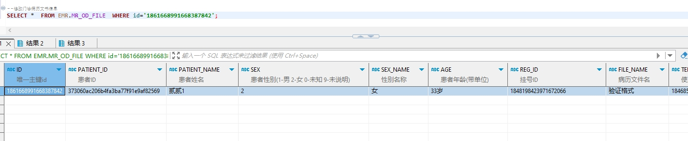

# 领域服务/病历领域 - 修改门诊病历文书信息 - 修改门诊病历文书信息 正向用例
## 请求参数：
``` json
{
  "orgName": "版本测试环境",
  "hospCode": "NXRY",
  "hospName": "版本测试环境",
  "orgCode": "NXRMYY",
  "list": [
    {
      "id": "1861668991668387842",
      "deptName": "呼吸内科(门)",
      "signFlag": "0",
      "fileName": "验证格式",
      "datasetCode": "03#23#08",
      "patientId": "373060ac206b4fa3ba77f91e9af82569",
      "contentText": "[备注]\n患病天数：[天假数据元]\n起病时间：[起病时间]\n过敏源：[过敏源]\n体温：[0℃]\n心率：[心率]\n签名：[医师签名]",
      "templateId": "1846855098186145794",
      "titleDate": "2024-10-22 09:27:49",
      "sexName": "女",
      "patientName": "贰贰1",
      "sex": "2",
      "deptId": "224707726571106304",
      "stdRecordCode": "EMR020001",
      "isPrint": "0",
      "folderId": "1843188383036264449",
      "stdRecordName": "门(急)诊病历",
      "regId": "1848198423971672066",
      "age": "33岁",
      "fileContent": "test",
      "fileNodeValueList": [
        {
          "nodeName": "患者姓名",
          "code": "",
          "patientId": "373060ac206b4fa3ba77f91e9af82569",
          "isMultiplex": "0",
          "deId": "08ef0fdbb81673d284de66dd9b885f38",
          "dictCode": "",
          "deCode": "DE02.01.039.00",
          "value": "贰贰1",
          "dataType": "0",
          "stdRecordCode": "EMR020001",
          "controlId": "68bb3cb0-4dad-40da-87a5-eee08ac28ea6",
          "nodeType": "0",
          "recordNodeId": "1843949154972266499",
          "stdRecordName": "门(急)诊病历",
          "deName": "姓名",
          "regId": "1848198423971672066",
          "stdRecordId": "5a7064dd26bd4ac7a3eab64194e7304b",
          "fileId": "1848536947740409857"
        }
      ]
    }
  ],
  "operatorId": "349365436797001728",
  "operatorName": "测试医生",
  "operateDate": "2024-10-22 09:27:50"
}
```
## 返回参数：
``` json
{
    "exception": null,
    "apiCode": null,
    "data": null,
    "Code": 200,
    "Message": "操作成功"
}
```
## 数据校验：

# 领域服务/病历领域 - 修改门诊病历文书信息 - 必填校验-[orgCode]为空
## 请求参数：
``` json
{
  "orgName": "版本测试环境",
  "hospCode": "NXRY",
  "hospName": "版本测试环境",
  "orgCode": "",
  "list": [
    {
      "deptName": "呼吸内科(门)",
      "signFlag": "0",
      "fileName": "机构",
      "datasetCode": "06#07#23#01#03",
      "patientId": "373060ac206b4fa3ba77f91e9af82569",
      "contentText": "姓名 [贰贰1] 性别 [女性] 年龄 [33] \n科室 [呼吸内科(门)] 门诊号 [2024102100006] 过敏史 [] \n就诊时间 [0001-01-01 00:00:00]     体重 （kg）Kg \nT:[0℃]℃ P:[脉率]次/分 R:[呼吸频率]次/分 BP:[收缩压]/[舒张压]mmHg 体重:[体重]kg\n主诉：[]\n现病史：[]\n既往史：[]   职业：\n\n个人史：\n月经婚育史：\n家族史：\n体格检查：\n专科检查：\n辅助检查：[辅助检查项目]\n\n\n月经史： \n\n初步诊断：\n\n[诊断前缀] \n\n处理意见：[处理：处理]\n[2]",
      "templateId": "1844677382372417537",
      "titleDate": "2024-10-22 09:28:46",
      "fileNodeValueList": [
        {
          "nodeName": "患者姓名",
          "code": "",
          "patientId": "373060ac206b4fa3ba77f91e9af82569",
          "isMultiplex": "0",
          "deId": "08ef0fdbb81673d284de66dd9b885f38",
          "dictCode": "",
          "deCode": "DE02.01.039.00",
          "value": "贰贰1",
          "dataType": "0",
          "stdRecordCode": "EMR020001",
          "controlId": "68bb3cb0-4dad-40da-87a5-eee08ac28ea6",
          "nodeType": "0",
          "recordNodeId": "1843949154972266499",
          "stdRecordName": "门(急)诊病历",
          "deName": "姓名",
          "regId": "1848198423971672066",
          "stdRecordId": "5a7064dd26bd4ac7a3eab64194e7304b",
          "fileId": "1848536947740409857"
        },
        {
          "nodeName": "性别代码",
          "code": "2",
          "patientId": "373060ac206b4fa3ba77f91e9af82569",
          "isMultiplex": "0",
          "deId": "7fd908e9943b47331e5bcba37798beb7",
          "dictCode": "GBT2261-2003.01.001",
          "deCode": "DE02.01.040.00",
          "value": "女性",
          "dataType": "3",
          "stdRecordCode": "EMR020001",
          "controlId": "ee4c0253-61e5-4923-8b11-09bd52ab2074",
          "nodeType": "0",
          "recordNodeId": "1846800262480637954",
          "stdRecordName": "门(急)诊病历",
          "deName": "性别代码",
          "regId": "1848198423971672066",
          "stdRecordId": "5a7064dd26bd4ac7a3eab64194e7304b",
          "fileId": "1848536947740409857"
        },
        {
          "nodeName": "年龄（岁）",
          "code": "",
          "patientId": "373060ac206b4fa3ba77f91e9af82569",
          "isMultiplex": "0",
          "deId": "3aec7889175f4ae52dacfe6758f5690f",
          "dictCode": "",
          "deCode": "DE02.01.026.00",
          "value": "33",
          "dataType": "1",
          "stdRecordCode": "EMR020001",
          "controlId": "6fc4dd42-216d-41bf-9fcb-d0025e6a0bc0",
          "nodeType": "0",
          "recordNodeId": "877648f7dd494da69631e6fa1ff937bb",
          "stdRecordName": "门(急)诊病历",
          "deName": "年龄（岁）",
          "regId": "1848198423971672066",
          "stdRecordId": "5a7064dd26bd4ac7a3eab64194e7304b",
          "fileId": "1848536947740409857"
        },
        {
          "nodeName": "就诊科室",
          "code": "",
          "patientId": "373060ac206b4fa3ba77f91e9af82569",
          "isMultiplex": "0",
          "deId": "5dc8e0b08f964e376ff8e555f8863342",
          "dictCode": "",
          "deCode": "DE08.10.026.00",
          "value": "呼吸内科(门)",
          "dataType": "0",
          "stdRecordCode": "EMR020001",
          "controlId": "1b57b62b-dd15-4b3f-a472-1b645bcb9921",
          "nodeType": "0",
          "recordNodeId": "1784415557823549441",
          "stdRecordName": "门(急)诊病历",
          "deName": "科室名称",
          "regId": "1848198423971672066",
          "stdRecordId": "5a7064dd26bd4ac7a3eab64194e7304b",
          "fileId": "1848536947740409857"
        },
        {
          "nodeName": "门（急）诊号",
          "code": "",
          "patientId": "373060ac206b4fa3ba77f91e9af82569",
          "isMultiplex": "0",
          "deId": "1e8b704b3186022e367cd1376a5c5030",
          "dictCode": "",
          "deCode": "DE01.00.010.00",
          "value": "2024102100006",
          "dataType": "0",
          "stdRecordCode": "EMR020001",
          "controlId": "69d9985a-c5e2-40f3-883e-c9e4dd8b3a63",
          "nodeType": "0",
          "recordNodeId": "1846801803996409858",
          "stdRecordName": "门(急)诊病历",
          "deName": "门诊号",
          "regId": "1848198423971672066",
          "stdRecordId": "5a7064dd26bd4ac7a3eab64194e7304b",
          "fileId": "1848536947740409857"
        },
        {
          "nodeName": "过敏史",
          "code": "",
          "patientId": "373060ac206b4fa3ba77f91e9af82569",
          "isMultiplex": "0",
          "deId": "F6B23B5352FA4B5885E00D8B53583EB5",
          "dictCode": "",
          "deCode": "DE02.10.022.00",
          "value": "",
          "dataType": "0",
          "stdRecordCode": "EMR020001",
          "controlId": "3ce72825-b550-4808-8b45-73d82c81d3ee",
          "nodeType": "1",
          "recordNodeId": "1788848647425802241",
          "stdRecordName": "门(急)诊病历",
          "deName": "过敏史",
          "regId": "1848198423971672066",
          "stdRecordId": "5a7064dd26bd4ac7a3eab64194e7304b",
          "fileId": "1848536947740409857"
        },
        {
          "nodeName": "就诊日期时间",
          "code": "",
          "patientId": "373060ac206b4fa3ba77f91e9af82569",
          "isMultiplex": "0",
          "deId": "6b1ebb9f1d925f10b8cc36febd02b13d",
          "dictCode": "",
          "deCode": "DE06.00.062.00",
          "value": "0001-01-01 00:00:00",
          "dataType": "2",
          "stdRecordCode": "EMR020001",
          "controlId": "665c895b-8957-4f13-8c68-b75122120cb1",
          "nodeType": "0",
          "recordNodeId": "1846798394899673090",
          "stdRecordName": "门(急)诊病历",
          "deName": "就诊日期时间",
          "regId": "1848198423971672066",
          "stdRecordId": "5a7064dd26bd4ac7a3eab64194e7304b",
          "fileId": "1848536947740409857"
        },
        {
          "nodeName": "体温",
          "code": "",
          "patientId": "373060ac206b4fa3ba77f91e9af82569",
          "isMultiplex": "0",
          "deId": "24a23d3d1aea75c43fe9fc5c5572630b",
          "dictCode": "",
          "deCode": "DE04.10.186.00",
          "value": "0",
          "dataType": "1",
          "stdRecordCode": "EMR020001",
          "controlId": "1652d74a-0844-4978-afb5-c037ea84484e",
          "nodeType": "0",
          "recordNodeId": "1788840854740320258NXRMYY",
          "stdRecordName": "门(急)诊病历",
          "deName": "体温（℃）",
          "regId": "1848198423971672066",
          "stdRecordId": "5a7064dd26bd4ac7a3eab64194e7304b",
          "fileId": "1848536947740409857"
        },
        {
          "nodeName": "脉率",
          "code": "",
          "patientId": "373060ac206b4fa3ba77f91e9af82569",
          "isMultiplex": "0",
          "deId": "64688bf8deefd9ca815942c9d50e987e",
          "dictCode": "",
          "deCode": "DE04.10.118.00",
          "value": "",
          "dataType": "0",
          "stdRecordCode": "EMR020001",
          "controlId": "7d33c8e3-ecec-47be-9626-9745d43069f1",
          "nodeType": "0",
          "recordNodeId": "1788840211346669569NXRMYY",
          "stdRecordName": "门(急)诊病历",
          "deName": "脉率（次/min）",
          "regId": "1848198423971672066",
          "stdRecordId": "5a7064dd26bd4ac7a3eab64194e7304b",
          "fileId": "1848536947740409857"
        },
        {
          "nodeName": "呼吸频率",
          "code": "",
          "patientId": "373060ac206b4fa3ba77f91e9af82569",
          "isMultiplex": "0",
          "deId": "5d65deb8219992a425fe9f85082b54b3",
          "dictCode": "",
          "deCode": "DE04.10.082.00",
          "value": "",
          "dataType": "0",
          "stdRecordCode": "EMR020001",
          "controlId": "e9d53ad8-104e-472e-9f50-b2702e2fe1b4",
          "nodeType": "0",
          "recordNodeId": "1788840377772457985NXRMYY",
          "stdRecordName": "门(急)诊病历",
          "deName": "呼吸频率（次/min）",
          "regId": "1848198423971672066",
          "stdRecordId": "5a7064dd26bd4ac7a3eab64194e7304b",
          "fileId": "1848536947740409857"
        },
        {
          "nodeName": "收缩压",
          "code": "",
          "patientId": "373060ac206b4fa3ba77f91e9af82569",
          "isMultiplex": "0",
          "deId": "68fc977374c0f248d23fce41222111cf",
          "dictCode": "",
          "deCode": "DE04.10.174.00",
          "value": "",
          "dataType": "0",
          "stdRecordCode": "EMR020001",
          "controlId": "05e9edf9-cdce-41f2-965b-21a8fce8c0a2",
          "nodeType": "0",
          "recordNodeId": "1788837341591289857NXRMYY",
          "stdRecordName": "门(急)诊病历",
          "deName": "收缩压（mmHg）",
          "regId": "1848198423971672066",
          "stdRecordId": "5a7064dd26bd4ac7a3eab64194e7304b",
          "fileId": "1848536947740409857"
        },
        {
          "nodeName": "舒张压",
          "code": "",
          "patientId": "373060ac206b4fa3ba77f91e9af82569",
          "isMultiplex": "0",
          "deId": "3691d7858a12ff10f802c2d4eb7c5dd1",
          "dictCode": "",
          "deCode": "DE04.10.176.00",
          "value": "",
          "dataType": "0",
          "stdRecordCode": "EMR020001",
          "controlId": "dc636a32-7a10-4dba-b2e5-4b2ed375a9ee",
          "nodeType": "0",
          "recordNodeId": "1788837618373410817NXRMYY",
          "stdRecordName": "门(急)诊病历",
          "deName": "舒张压（mmHg）",
          "regId": "1848198423971672066",
          "stdRecordId": "5a7064dd26bd4ac7a3eab64194e7304b",
          "fileId": "1848536947740409857"
        },
        {
          "nodeName": "体重",
          "code": "",
          "patientId": "373060ac206b4fa3ba77f91e9af82569",
          "isMultiplex": "0",
          "deId": "4d5e614f257d4641bd67cea8ed52439f",
          "dictCode": "",
          "deCode": "DE04.10.188.00",
          "value": "",
          "dataType": "0",
          "stdRecordCode": "EMR020001",
          "controlId": "e7a61cd4-3bf7-415d-b27f-8d05a752c092",
          "nodeType": "0",
          "recordNodeId": "1788839342827945985NXRMYY",
          "stdRecordName": "门(急)诊病历",
          "deName": "体重（kg）",
          "regId": "1848198423971672066",
          "stdRecordId": "5a7064dd26bd4ac7a3eab64194e7304b",
          "fileId": "1848536947740409857"
        },
        {
          "nodeName": "主诉",
          "code": "",
          "patientId": "373060ac206b4fa3ba77f91e9af82569",
          "isMultiplex": "0",
          "deId": "6c4a354001d81fe11a70e7e5aa8b540f",
          "dictCode": "",
          "deCode": "DE04.01.119.00",
          "value": "",
          "dataType": "0",
          "stdRecordCode": "EMR020001",
          "controlId": "e9136cc2-8202-4519-9feb-d3fe3894a9bb",
          "nodeType": "1",
          "recordNodeId": "1843947401442816002",
          "stdRecordName": "门(急)诊病历",
          "deName": "主诉",
          "regId": "1848198423971672066",
          "stdRecordId": "5a7064dd26bd4ac7a3eab64194e7304b",
          "fileId": "1848536947740409857"
        },
        {
          "nodeName": "现病史",
          "code": "",
          "patientId": "373060ac206b4fa3ba77f91e9af82569",
          "isMultiplex": "0",
          "deId": "bf036f552f150addf594170c5569c552",
          "dictCode": "",
          "deCode": "DE02.10.071.00",
          "value": "",
          "dataType": "0",
          "stdRecordCode": "EMR020001",
          "controlId": "29c254a5-6f72-405b-96d8-8cb693c1f5da",
          "nodeType": "1",
          "recordNodeId": "1843947645492588545",
          "stdRecordName": "门(急)诊病历",
          "deName": "现病史",
          "regId": "1848198423971672066",
          "stdRecordId": "5a7064dd26bd4ac7a3eab64194e7304b",
          "fileId": "1848536947740409857"
        },
        {
          "nodeName": "既往史",
          "code": "",
          "patientId": "373060ac206b4fa3ba77f91e9af82569",
          "isMultiplex": "0",
          "deId": "bba372555636210218b6e669885b6de3",
          "dictCode": "",
          "deCode": "DE02.10.099.00",
          "value": "",
          "dataType": "0",
          "stdRecordCode": "EMR020001",
          "controlId": "210b0421-592d-4f9f-a814-fa163303c722",
          "nodeType": "1",
          "recordNodeId": "1843947844529090561",
          "stdRecordName": "门(急)诊病历",
          "deName": "既往史",
          "regId": "1848198423971672066",
          "stdRecordId": "5a7064dd26bd4ac7a3eab64194e7304b",
          "fileId": "1848536947740409857"
        },
        {
          "nodeName": "辅助检查项目",
          "code": "",
          "patientId": "373060ac206b4fa3ba77f91e9af82569",
          "isMultiplex": "0",
          "deId": "555d56ef9871a4d863c184b3a51e1812",
          "dictCode": "",
          "deCode": "DE04.30.010.00",
          "value": "",
          "dataType": "0",
          "stdRecordCode": "EMR020001",
          "controlId": "e3ce10b0-1cb0-4954-8b94-564774472010",
          "nodeType": "0",
          "recordNodeId": "1784466912999112706NXRMYY",
          "stdRecordName": "门(急)诊病历",
          "deName": "辅助检查项目",
          "regId": "1848198423971672066",
          "stdRecordId": "5a7064dd26bd4ac7a3eab64194e7304b",
          "fileId": "1848536947740409857"
        },
        {
          "nodeName": "诊断前缀",
          "code": "",
          "patientId": "373060ac206b4fa3ba77f91e9af82569",
          "isMultiplex": "0",
          "deId": "dc842fab3eee7c0e4124e7d2bdff0efe",
          "dictCode": "",
          "deCode": "DE05.01.025.00",
          "value": "",
          "dataType": "0",
          "stdRecordCode": "EMR020001",
          "controlId": "5a0e47cf-4ad3-4d02-be68-7ed2d2294b1a",
          "nodeType": "0",
          "recordNodeId": "1784852836140474370NXRMYY",
          "stdRecordName": "门(急)诊病历",
          "deName": "西医疾病诊断名称",
          "regId": "1848198423971672066",
          "stdRecordId": "5a7064dd26bd4ac7a3eab64194e7304b",
          "fileId": "1848536947740409857"
        },
        {
          "nodeName": "处理",
          "code": "",
          "patientId": "373060ac206b4fa3ba77f91e9af82569",
          "isMultiplex": "0",
          "deId": "86c68bf3ffd8c674a685f7c05344cd9d",
          "dictCode": "",
          "deCode": "DE06.00.018.00",
          "value": "",
          "dataType": "0",
          "stdRecordCode": "EMR020001",
          "controlId": "24770abd-8a02-41b5-bee5-0e683b7c8b75",
          "nodeType": "0",
          "recordNodeId": "1801137994866896898NXRMYY",
          "stdRecordName": "门(急)诊病历",
          "deName": "处理及指导意见",
          "regId": "1848198423971672066",
          "stdRecordId": "5a7064dd26bd4ac7a3eab64194e7304b",
          "fileId": "1848536947740409857"
        },
        {
          "nodeName": "医师签名",
          "code": "",
          "patientId": "373060ac206b4fa3ba77f91e9af82569",
          "isMultiplex": "0",
          "deId": "08ef0fdbb81673d284de66dd9b885f38",
          "dictCode": "",
          "deCode": "DE02.01.039.00",
          "value": "2",
          "dataType": "0",
          "stdRecordCode": "EMR020001",
          "controlId": "379c4ec3-ed59-450d-8630-2876fe83222d",
          "nodeType": "0",
          "recordNodeId": "1843949154972266498",
          "stdRecordName": "门(急)诊病历",
          "deName": "姓名",
          "regId": "1848198423971672066",
          "stdRecordId": "5a7064dd26bd4ac7a3eab64194e7304b",
          "fileId": "1848536947740409857"
        }
      ],
      "sexName": "女",
      "id": "1848536947740409857",
      "patientName": "贰贰1",
      "sex": "2",
      "deptId": "224707726571106304",
      "stdRecordCode": "EMR020001",
      "folderId": "1843188383036264449",
      "stdRecordName": "门(急)诊病历",
      "regId": "1848198423971672066",
      "age": "33岁",
      "fileContent": "test"
    }
  ],
  "operatorId": "349365436797001728",
  "operatorName": "测试医生",
  "operateDate": "2024-10-22 09:30:25"
}
```
## 返回参数：
``` json
{
  "exception": null,
  "apiCode": null,
  "data": null,
  "Code": 1,
  "Message": "机构编码不能为空"
}
```
# 领域服务/病历领域 - 修改门诊病历文书信息 - 必填校验-[orgName]为空
## 请求参数：
``` json
{
  "orgName": "",
  "hospCode": "NXRY",
  "hospName": "版本测试环境",
  "orgCode": "NXRMYY",
  "list": [
    {
      "deptName": "呼吸内科(门)",
      "signFlag": "0",
      "fileName": "机构",
      "datasetCode": "06#07#23#01#03",
      "patientId": "373060ac206b4fa3ba77f91e9af82569",
      "contentText": "姓名 [贰贰1] 性别 [女性] 年龄 [33] \n科室 [呼吸内科(门)] 门诊号 [2024102100006] 过敏史 [] \n就诊时间 [0001-01-01 00:00:00]     体重 （kg）Kg \nT:[0℃]℃ P:[脉率]次/分 R:[呼吸频率]次/分 BP:[收缩压]/[舒张压]mmHg 体重:[体重]kg\n主诉：[]\n现病史：[]\n既往史：[]   职业：\n\n个人史：\n月经婚育史：\n家族史：\n体格检查：\n专科检查：\n辅助检查：[辅助检查项目]\n\n\n月经史： \n\n初步诊断：\n\n[诊断前缀] \n\n处理意见：[处理：处理]\n[2]",
      "templateId": "1844677382372417537",
      "titleDate": "2024-10-22 09:28:46",
      "fileNodeValueList": [
        {
          "nodeName": "患者姓名",
          "code": "",
          "patientId": "373060ac206b4fa3ba77f91e9af82569",
          "isMultiplex": "0",
          "deId": "08ef0fdbb81673d284de66dd9b885f38",
          "dictCode": "",
          "deCode": "DE02.01.039.00",
          "value": "贰贰1",
          "dataType": "0",
          "stdRecordCode": "EMR020001",
          "controlId": "68bb3cb0-4dad-40da-87a5-eee08ac28ea6",
          "nodeType": "0",
          "recordNodeId": "1843949154972266499",
          "stdRecordName": "门(急)诊病历",
          "deName": "姓名",
          "regId": "1848198423971672066",
          "stdRecordId": "5a7064dd26bd4ac7a3eab64194e7304b",
          "fileId": "1848536947740409857"
        },
        {
          "nodeName": "性别代码",
          "code": "2",
          "patientId": "373060ac206b4fa3ba77f91e9af82569",
          "isMultiplex": "0",
          "deId": "7fd908e9943b47331e5bcba37798beb7",
          "dictCode": "GBT2261-2003.01.001",
          "deCode": "DE02.01.040.00",
          "value": "女性",
          "dataType": "3",
          "stdRecordCode": "EMR020001",
          "controlId": "ee4c0253-61e5-4923-8b11-09bd52ab2074",
          "nodeType": "0",
          "recordNodeId": "1846800262480637954",
          "stdRecordName": "门(急)诊病历",
          "deName": "性别代码",
          "regId": "1848198423971672066",
          "stdRecordId": "5a7064dd26bd4ac7a3eab64194e7304b",
          "fileId": "1848536947740409857"
        },
        {
          "nodeName": "年龄（岁）",
          "code": "",
          "patientId": "373060ac206b4fa3ba77f91e9af82569",
          "isMultiplex": "0",
          "deId": "3aec7889175f4ae52dacfe6758f5690f",
          "dictCode": "",
          "deCode": "DE02.01.026.00",
          "value": "33",
          "dataType": "1",
          "stdRecordCode": "EMR020001",
          "controlId": "6fc4dd42-216d-41bf-9fcb-d0025e6a0bc0",
          "nodeType": "0",
          "recordNodeId": "877648f7dd494da69631e6fa1ff937bb",
          "stdRecordName": "门(急)诊病历",
          "deName": "年龄（岁）",
          "regId": "1848198423971672066",
          "stdRecordId": "5a7064dd26bd4ac7a3eab64194e7304b",
          "fileId": "1848536947740409857"
        },
        {
          "nodeName": "就诊科室",
          "code": "",
          "patientId": "373060ac206b4fa3ba77f91e9af82569",
          "isMultiplex": "0",
          "deId": "5dc8e0b08f964e376ff8e555f8863342",
          "dictCode": "",
          "deCode": "DE08.10.026.00",
          "value": "呼吸内科(门)",
          "dataType": "0",
          "stdRecordCode": "EMR020001",
          "controlId": "1b57b62b-dd15-4b3f-a472-1b645bcb9921",
          "nodeType": "0",
          "recordNodeId": "1784415557823549441",
          "stdRecordName": "门(急)诊病历",
          "deName": "科室名称",
          "regId": "1848198423971672066",
          "stdRecordId": "5a7064dd26bd4ac7a3eab64194e7304b",
          "fileId": "1848536947740409857"
        },
        {
          "nodeName": "门（急）诊号",
          "code": "",
          "patientId": "373060ac206b4fa3ba77f91e9af82569",
          "isMultiplex": "0",
          "deId": "1e8b704b3186022e367cd1376a5c5030",
          "dictCode": "",
          "deCode": "DE01.00.010.00",
          "value": "2024102100006",
          "dataType": "0",
          "stdRecordCode": "EMR020001",
          "controlId": "69d9985a-c5e2-40f3-883e-c9e4dd8b3a63",
          "nodeType": "0",
          "recordNodeId": "1846801803996409858",
          "stdRecordName": "门(急)诊病历",
          "deName": "门诊号",
          "regId": "1848198423971672066",
          "stdRecordId": "5a7064dd26bd4ac7a3eab64194e7304b",
          "fileId": "1848536947740409857"
        },
        {
          "nodeName": "过敏史",
          "code": "",
          "patientId": "373060ac206b4fa3ba77f91e9af82569",
          "isMultiplex": "0",
          "deId": "F6B23B5352FA4B5885E00D8B53583EB5",
          "dictCode": "",
          "deCode": "DE02.10.022.00",
          "value": "",
          "dataType": "0",
          "stdRecordCode": "EMR020001",
          "controlId": "3ce72825-b550-4808-8b45-73d82c81d3ee",
          "nodeType": "1",
          "recordNodeId": "1788848647425802241",
          "stdRecordName": "门(急)诊病历",
          "deName": "过敏史",
          "regId": "1848198423971672066",
          "stdRecordId": "5a7064dd26bd4ac7a3eab64194e7304b",
          "fileId": "1848536947740409857"
        },
        {
          "nodeName": "就诊日期时间",
          "code": "",
          "patientId": "373060ac206b4fa3ba77f91e9af82569",
          "isMultiplex": "0",
          "deId": "6b1ebb9f1d925f10b8cc36febd02b13d",
          "dictCode": "",
          "deCode": "DE06.00.062.00",
          "value": "0001-01-01 00:00:00",
          "dataType": "2",
          "stdRecordCode": "EMR020001",
          "controlId": "665c895b-8957-4f13-8c68-b75122120cb1",
          "nodeType": "0",
          "recordNodeId": "1846798394899673090",
          "stdRecordName": "门(急)诊病历",
          "deName": "就诊日期时间",
          "regId": "1848198423971672066",
          "stdRecordId": "5a7064dd26bd4ac7a3eab64194e7304b",
          "fileId": "1848536947740409857"
        },
        {
          "nodeName": "体温",
          "code": "",
          "patientId": "373060ac206b4fa3ba77f91e9af82569",
          "isMultiplex": "0",
          "deId": "24a23d3d1aea75c43fe9fc5c5572630b",
          "dictCode": "",
          "deCode": "DE04.10.186.00",
          "value": "0",
          "dataType": "1",
          "stdRecordCode": "EMR020001",
          "controlId": "1652d74a-0844-4978-afb5-c037ea84484e",
          "nodeType": "0",
          "recordNodeId": "1788840854740320258NXRMYY",
          "stdRecordName": "门(急)诊病历",
          "deName": "体温（℃）",
          "regId": "1848198423971672066",
          "stdRecordId": "5a7064dd26bd4ac7a3eab64194e7304b",
          "fileId": "1848536947740409857"
        },
        {
          "nodeName": "脉率",
          "code": "",
          "patientId": "373060ac206b4fa3ba77f91e9af82569",
          "isMultiplex": "0",
          "deId": "64688bf8deefd9ca815942c9d50e987e",
          "dictCode": "",
          "deCode": "DE04.10.118.00",
          "value": "",
          "dataType": "0",
          "stdRecordCode": "EMR020001",
          "controlId": "7d33c8e3-ecec-47be-9626-9745d43069f1",
          "nodeType": "0",
          "recordNodeId": "1788840211346669569NXRMYY",
          "stdRecordName": "门(急)诊病历",
          "deName": "脉率（次/min）",
          "regId": "1848198423971672066",
          "stdRecordId": "5a7064dd26bd4ac7a3eab64194e7304b",
          "fileId": "1848536947740409857"
        },
        {
          "nodeName": "呼吸频率",
          "code": "",
          "patientId": "373060ac206b4fa3ba77f91e9af82569",
          "isMultiplex": "0",
          "deId": "5d65deb8219992a425fe9f85082b54b3",
          "dictCode": "",
          "deCode": "DE04.10.082.00",
          "value": "",
          "dataType": "0",
          "stdRecordCode": "EMR020001",
          "controlId": "e9d53ad8-104e-472e-9f50-b2702e2fe1b4",
          "nodeType": "0",
          "recordNodeId": "1788840377772457985NXRMYY",
          "stdRecordName": "门(急)诊病历",
          "deName": "呼吸频率（次/min）",
          "regId": "1848198423971672066",
          "stdRecordId": "5a7064dd26bd4ac7a3eab64194e7304b",
          "fileId": "1848536947740409857"
        },
        {
          "nodeName": "收缩压",
          "code": "",
          "patientId": "373060ac206b4fa3ba77f91e9af82569",
          "isMultiplex": "0",
          "deId": "68fc977374c0f248d23fce41222111cf",
          "dictCode": "",
          "deCode": "DE04.10.174.00",
          "value": "",
          "dataType": "0",
          "stdRecordCode": "EMR020001",
          "controlId": "05e9edf9-cdce-41f2-965b-21a8fce8c0a2",
          "nodeType": "0",
          "recordNodeId": "1788837341591289857NXRMYY",
          "stdRecordName": "门(急)诊病历",
          "deName": "收缩压（mmHg）",
          "regId": "1848198423971672066",
          "stdRecordId": "5a7064dd26bd4ac7a3eab64194e7304b",
          "fileId": "1848536947740409857"
        },
        {
          "nodeName": "舒张压",
          "code": "",
          "patientId": "373060ac206b4fa3ba77f91e9af82569",
          "isMultiplex": "0",
          "deId": "3691d7858a12ff10f802c2d4eb7c5dd1",
          "dictCode": "",
          "deCode": "DE04.10.176.00",
          "value": "",
          "dataType": "0",
          "stdRecordCode": "EMR020001",
          "controlId": "dc636a32-7a10-4dba-b2e5-4b2ed375a9ee",
          "nodeType": "0",
          "recordNodeId": "1788837618373410817NXRMYY",
          "stdRecordName": "门(急)诊病历",
          "deName": "舒张压（mmHg）",
          "regId": "1848198423971672066",
          "stdRecordId": "5a7064dd26bd4ac7a3eab64194e7304b",
          "fileId": "1848536947740409857"
        },
        {
          "nodeName": "体重",
          "code": "",
          "patientId": "373060ac206b4fa3ba77f91e9af82569",
          "isMultiplex": "0",
          "deId": "4d5e614f257d4641bd67cea8ed52439f",
          "dictCode": "",
          "deCode": "DE04.10.188.00",
          "value": "",
          "dataType": "0",
          "stdRecordCode": "EMR020001",
          "controlId": "e7a61cd4-3bf7-415d-b27f-8d05a752c092",
          "nodeType": "0",
          "recordNodeId": "1788839342827945985NXRMYY",
          "stdRecordName": "门(急)诊病历",
          "deName": "体重（kg）",
          "regId": "1848198423971672066",
          "stdRecordId": "5a7064dd26bd4ac7a3eab64194e7304b",
          "fileId": "1848536947740409857"
        },
        {
          "nodeName": "主诉",
          "code": "",
          "patientId": "373060ac206b4fa3ba77f91e9af82569",
          "isMultiplex": "0",
          "deId": "6c4a354001d81fe11a70e7e5aa8b540f",
          "dictCode": "",
          "deCode": "DE04.01.119.00",
          "value": "",
          "dataType": "0",
          "stdRecordCode": "EMR020001",
          "controlId": "e9136cc2-8202-4519-9feb-d3fe3894a9bb",
          "nodeType": "1",
          "recordNodeId": "1843947401442816002",
          "stdRecordName": "门(急)诊病历",
          "deName": "主诉",
          "regId": "1848198423971672066",
          "stdRecordId": "5a7064dd26bd4ac7a3eab64194e7304b",
          "fileId": "1848536947740409857"
        },
        {
          "nodeName": "现病史",
          "code": "",
          "patientId": "373060ac206b4fa3ba77f91e9af82569",
          "isMultiplex": "0",
          "deId": "bf036f552f150addf594170c5569c552",
          "dictCode": "",
          "deCode": "DE02.10.071.00",
          "value": "",
          "dataType": "0",
          "stdRecordCode": "EMR020001",
          "controlId": "29c254a5-6f72-405b-96d8-8cb693c1f5da",
          "nodeType": "1",
          "recordNodeId": "1843947645492588545",
          "stdRecordName": "门(急)诊病历",
          "deName": "现病史",
          "regId": "1848198423971672066",
          "stdRecordId": "5a7064dd26bd4ac7a3eab64194e7304b",
          "fileId": "1848536947740409857"
        },
        {
          "nodeName": "既往史",
          "code": "",
          "patientId": "373060ac206b4fa3ba77f91e9af82569",
          "isMultiplex": "0",
          "deId": "bba372555636210218b6e669885b6de3",
          "dictCode": "",
          "deCode": "DE02.10.099.00",
          "value": "",
          "dataType": "0",
          "stdRecordCode": "EMR020001",
          "controlId": "210b0421-592d-4f9f-a814-fa163303c722",
          "nodeType": "1",
          "recordNodeId": "1843947844529090561",
          "stdRecordName": "门(急)诊病历",
          "deName": "既往史",
          "regId": "1848198423971672066",
          "stdRecordId": "5a7064dd26bd4ac7a3eab64194e7304b",
          "fileId": "1848536947740409857"
        },
        {
          "nodeName": "辅助检查项目",
          "code": "",
          "patientId": "373060ac206b4fa3ba77f91e9af82569",
          "isMultiplex": "0",
          "deId": "555d56ef9871a4d863c184b3a51e1812",
          "dictCode": "",
          "deCode": "DE04.30.010.00",
          "value": "",
          "dataType": "0",
          "stdRecordCode": "EMR020001",
          "controlId": "e3ce10b0-1cb0-4954-8b94-564774472010",
          "nodeType": "0",
          "recordNodeId": "1784466912999112706NXRMYY",
          "stdRecordName": "门(急)诊病历",
          "deName": "辅助检查项目",
          "regId": "1848198423971672066",
          "stdRecordId": "5a7064dd26bd4ac7a3eab64194e7304b",
          "fileId": "1848536947740409857"
        },
        {
          "nodeName": "诊断前缀",
          "code": "",
          "patientId": "373060ac206b4fa3ba77f91e9af82569",
          "isMultiplex": "0",
          "deId": "dc842fab3eee7c0e4124e7d2bdff0efe",
          "dictCode": "",
          "deCode": "DE05.01.025.00",
          "value": "",
          "dataType": "0",
          "stdRecordCode": "EMR020001",
          "controlId": "5a0e47cf-4ad3-4d02-be68-7ed2d2294b1a",
          "nodeType": "0",
          "recordNodeId": "1784852836140474370NXRMYY",
          "stdRecordName": "门(急)诊病历",
          "deName": "西医疾病诊断名称",
          "regId": "1848198423971672066",
          "stdRecordId": "5a7064dd26bd4ac7a3eab64194e7304b",
          "fileId": "1848536947740409857"
        },
        {
          "nodeName": "处理",
          "code": "",
          "patientId": "373060ac206b4fa3ba77f91e9af82569",
          "isMultiplex": "0",
          "deId": "86c68bf3ffd8c674a685f7c05344cd9d",
          "dictCode": "",
          "deCode": "DE06.00.018.00",
          "value": "",
          "dataType": "0",
          "stdRecordCode": "EMR020001",
          "controlId": "24770abd-8a02-41b5-bee5-0e683b7c8b75",
          "nodeType": "0",
          "recordNodeId": "1801137994866896898NXRMYY",
          "stdRecordName": "门(急)诊病历",
          "deName": "处理及指导意见",
          "regId": "1848198423971672066",
          "stdRecordId": "5a7064dd26bd4ac7a3eab64194e7304b",
          "fileId": "1848536947740409857"
        },
        {
          "nodeName": "医师签名",
          "code": "",
          "patientId": "373060ac206b4fa3ba77f91e9af82569",
          "isMultiplex": "0",
          "deId": "08ef0fdbb81673d284de66dd9b885f38",
          "dictCode": "",
          "deCode": "DE02.01.039.00",
          "value": "2",
          "dataType": "0",
          "stdRecordCode": "EMR020001",
          "controlId": "379c4ec3-ed59-450d-8630-2876fe83222d",
          "nodeType": "0",
          "recordNodeId": "1843949154972266498",
          "stdRecordName": "门(急)诊病历",
          "deName": "姓名",
          "regId": "1848198423971672066",
          "stdRecordId": "5a7064dd26bd4ac7a3eab64194e7304b",
          "fileId": "1848536947740409857"
        }
      ],
      "sexName": "女",
      "id": "1848536947740409857",
      "patientName": "贰贰1",
      "sex": "2",
      "deptId": "224707726571106304",
      "stdRecordCode": "EMR020001",
      "folderId": "1843188383036264449",
      "stdRecordName": "门(急)诊病历",
      "regId": "1848198423971672066",
      "age": "33岁",
      "fileContent": "test"
    }
  ],
  "operatorId": "349365436797001728",
  "operatorName": "测试医生",
  "operateDate": "2024-10-22 09:30:25"
}
```
## 返回参数：
``` json
{
  "exception": null,
  "apiCode": null,
  "data": null,
  "Code": 1,
  "Message": "机构名称不能为空"
}
```
# 领域服务/病历领域 - 修改门诊病历文书信息 - 必填校验-[hospCode]为空
## 请求参数：
``` json
{
  "orgName": "版本测试环境",
  "hospCode": "",
  "hospName": "版本测试环境",
  "orgCode": "NXRMYY",
  "list": [
    {
      "deptName": "呼吸内科(门)",
      "signFlag": "0",
      "fileName": "机构",
      "datasetCode": "06#07#23#01#03",
      "patientId": "373060ac206b4fa3ba77f91e9af82569",
      "contentText": "姓名 [贰贰1] 性别 [女性] 年龄 [33] \n科室 [呼吸内科(门)] 门诊号 [2024102100006] 过敏史 [] \n就诊时间 [0001-01-01 00:00:00]     体重 （kg）Kg \nT:[0℃]℃ P:[脉率]次/分 R:[呼吸频率]次/分 BP:[收缩压]/[舒张压]mmHg 体重:[体重]kg\n主诉：[]\n现病史：[]\n既往史：[]   职业：\n\n个人史：\n月经婚育史：\n家族史：\n体格检查：\n专科检查：\n辅助检查：[辅助检查项目]\n\n\n月经史： \n\n初步诊断：\n\n[诊断前缀] \n\n处理意见：[处理：处理]\n[2]",
      "templateId": "1844677382372417537",
      "titleDate": "2024-10-22 09:28:46",
      "fileNodeValueList": [
        {
          "nodeName": "患者姓名",
          "code": "",
          "patientId": "373060ac206b4fa3ba77f91e9af82569",
          "isMultiplex": "0",
          "deId": "08ef0fdbb81673d284de66dd9b885f38",
          "dictCode": "",
          "deCode": "DE02.01.039.00",
          "value": "贰贰1",
          "dataType": "0",
          "stdRecordCode": "EMR020001",
          "controlId": "68bb3cb0-4dad-40da-87a5-eee08ac28ea6",
          "nodeType": "0",
          "recordNodeId": "1843949154972266499",
          "stdRecordName": "门(急)诊病历",
          "deName": "姓名",
          "regId": "1848198423971672066",
          "stdRecordId": "5a7064dd26bd4ac7a3eab64194e7304b",
          "fileId": "1848536947740409857"
        },
        {
          "nodeName": "性别代码",
          "code": "2",
          "patientId": "373060ac206b4fa3ba77f91e9af82569",
          "isMultiplex": "0",
          "deId": "7fd908e9943b47331e5bcba37798beb7",
          "dictCode": "GBT2261-2003.01.001",
          "deCode": "DE02.01.040.00",
          "value": "女性",
          "dataType": "3",
          "stdRecordCode": "EMR020001",
          "controlId": "ee4c0253-61e5-4923-8b11-09bd52ab2074",
          "nodeType": "0",
          "recordNodeId": "1846800262480637954",
          "stdRecordName": "门(急)诊病历",
          "deName": "性别代码",
          "regId": "1848198423971672066",
          "stdRecordId": "5a7064dd26bd4ac7a3eab64194e7304b",
          "fileId": "1848536947740409857"
        },
        {
          "nodeName": "年龄（岁）",
          "code": "",
          "patientId": "373060ac206b4fa3ba77f91e9af82569",
          "isMultiplex": "0",
          "deId": "3aec7889175f4ae52dacfe6758f5690f",
          "dictCode": "",
          "deCode": "DE02.01.026.00",
          "value": "33",
          "dataType": "1",
          "stdRecordCode": "EMR020001",
          "controlId": "6fc4dd42-216d-41bf-9fcb-d0025e6a0bc0",
          "nodeType": "0",
          "recordNodeId": "877648f7dd494da69631e6fa1ff937bb",
          "stdRecordName": "门(急)诊病历",
          "deName": "年龄（岁）",
          "regId": "1848198423971672066",
          "stdRecordId": "5a7064dd26bd4ac7a3eab64194e7304b",
          "fileId": "1848536947740409857"
        },
        {
          "nodeName": "就诊科室",
          "code": "",
          "patientId": "373060ac206b4fa3ba77f91e9af82569",
          "isMultiplex": "0",
          "deId": "5dc8e0b08f964e376ff8e555f8863342",
          "dictCode": "",
          "deCode": "DE08.10.026.00",
          "value": "呼吸内科(门)",
          "dataType": "0",
          "stdRecordCode": "EMR020001",
          "controlId": "1b57b62b-dd15-4b3f-a472-1b645bcb9921",
          "nodeType": "0",
          "recordNodeId": "1784415557823549441",
          "stdRecordName": "门(急)诊病历",
          "deName": "科室名称",
          "regId": "1848198423971672066",
          "stdRecordId": "5a7064dd26bd4ac7a3eab64194e7304b",
          "fileId": "1848536947740409857"
        },
        {
          "nodeName": "门（急）诊号",
          "code": "",
          "patientId": "373060ac206b4fa3ba77f91e9af82569",
          "isMultiplex": "0",
          "deId": "1e8b704b3186022e367cd1376a5c5030",
          "dictCode": "",
          "deCode": "DE01.00.010.00",
          "value": "2024102100006",
          "dataType": "0",
          "stdRecordCode": "EMR020001",
          "controlId": "69d9985a-c5e2-40f3-883e-c9e4dd8b3a63",
          "nodeType": "0",
          "recordNodeId": "1846801803996409858",
          "stdRecordName": "门(急)诊病历",
          "deName": "门诊号",
          "regId": "1848198423971672066",
          "stdRecordId": "5a7064dd26bd4ac7a3eab64194e7304b",
          "fileId": "1848536947740409857"
        },
        {
          "nodeName": "过敏史",
          "code": "",
          "patientId": "373060ac206b4fa3ba77f91e9af82569",
          "isMultiplex": "0",
          "deId": "F6B23B5352FA4B5885E00D8B53583EB5",
          "dictCode": "",
          "deCode": "DE02.10.022.00",
          "value": "",
          "dataType": "0",
          "stdRecordCode": "EMR020001",
          "controlId": "3ce72825-b550-4808-8b45-73d82c81d3ee",
          "nodeType": "1",
          "recordNodeId": "1788848647425802241",
          "stdRecordName": "门(急)诊病历",
          "deName": "过敏史",
          "regId": "1848198423971672066",
          "stdRecordId": "5a7064dd26bd4ac7a3eab64194e7304b",
          "fileId": "1848536947740409857"
        },
        {
          "nodeName": "就诊日期时间",
          "code": "",
          "patientId": "373060ac206b4fa3ba77f91e9af82569",
          "isMultiplex": "0",
          "deId": "6b1ebb9f1d925f10b8cc36febd02b13d",
          "dictCode": "",
          "deCode": "DE06.00.062.00",
          "value": "0001-01-01 00:00:00",
          "dataType": "2",
          "stdRecordCode": "EMR020001",
          "controlId": "665c895b-8957-4f13-8c68-b75122120cb1",
          "nodeType": "0",
          "recordNodeId": "1846798394899673090",
          "stdRecordName": "门(急)诊病历",
          "deName": "就诊日期时间",
          "regId": "1848198423971672066",
          "stdRecordId": "5a7064dd26bd4ac7a3eab64194e7304b",
          "fileId": "1848536947740409857"
        },
        {
          "nodeName": "体温",
          "code": "",
          "patientId": "373060ac206b4fa3ba77f91e9af82569",
          "isMultiplex": "0",
          "deId": "24a23d3d1aea75c43fe9fc5c5572630b",
          "dictCode": "",
          "deCode": "DE04.10.186.00",
          "value": "0",
          "dataType": "1",
          "stdRecordCode": "EMR020001",
          "controlId": "1652d74a-0844-4978-afb5-c037ea84484e",
          "nodeType": "0",
          "recordNodeId": "1788840854740320258NXRMYY",
          "stdRecordName": "门(急)诊病历",
          "deName": "体温（℃）",
          "regId": "1848198423971672066",
          "stdRecordId": "5a7064dd26bd4ac7a3eab64194e7304b",
          "fileId": "1848536947740409857"
        },
        {
          "nodeName": "脉率",
          "code": "",
          "patientId": "373060ac206b4fa3ba77f91e9af82569",
          "isMultiplex": "0",
          "deId": "64688bf8deefd9ca815942c9d50e987e",
          "dictCode": "",
          "deCode": "DE04.10.118.00",
          "value": "",
          "dataType": "0",
          "stdRecordCode": "EMR020001",
          "controlId": "7d33c8e3-ecec-47be-9626-9745d43069f1",
          "nodeType": "0",
          "recordNodeId": "1788840211346669569NXRMYY",
          "stdRecordName": "门(急)诊病历",
          "deName": "脉率（次/min）",
          "regId": "1848198423971672066",
          "stdRecordId": "5a7064dd26bd4ac7a3eab64194e7304b",
          "fileId": "1848536947740409857"
        },
        {
          "nodeName": "呼吸频率",
          "code": "",
          "patientId": "373060ac206b4fa3ba77f91e9af82569",
          "isMultiplex": "0",
          "deId": "5d65deb8219992a425fe9f85082b54b3",
          "dictCode": "",
          "deCode": "DE04.10.082.00",
          "value": "",
          "dataType": "0",
          "stdRecordCode": "EMR020001",
          "controlId": "e9d53ad8-104e-472e-9f50-b2702e2fe1b4",
          "nodeType": "0",
          "recordNodeId": "1788840377772457985NXRMYY",
          "stdRecordName": "门(急)诊病历",
          "deName": "呼吸频率（次/min）",
          "regId": "1848198423971672066",
          "stdRecordId": "5a7064dd26bd4ac7a3eab64194e7304b",
          "fileId": "1848536947740409857"
        },
        {
          "nodeName": "收缩压",
          "code": "",
          "patientId": "373060ac206b4fa3ba77f91e9af82569",
          "isMultiplex": "0",
          "deId": "68fc977374c0f248d23fce41222111cf",
          "dictCode": "",
          "deCode": "DE04.10.174.00",
          "value": "",
          "dataType": "0",
          "stdRecordCode": "EMR020001",
          "controlId": "05e9edf9-cdce-41f2-965b-21a8fce8c0a2",
          "nodeType": "0",
          "recordNodeId": "1788837341591289857NXRMYY",
          "stdRecordName": "门(急)诊病历",
          "deName": "收缩压（mmHg）",
          "regId": "1848198423971672066",
          "stdRecordId": "5a7064dd26bd4ac7a3eab64194e7304b",
          "fileId": "1848536947740409857"
        },
        {
          "nodeName": "舒张压",
          "code": "",
          "patientId": "373060ac206b4fa3ba77f91e9af82569",
          "isMultiplex": "0",
          "deId": "3691d7858a12ff10f802c2d4eb7c5dd1",
          "dictCode": "",
          "deCode": "DE04.10.176.00",
          "value": "",
          "dataType": "0",
          "stdRecordCode": "EMR020001",
          "controlId": "dc636a32-7a10-4dba-b2e5-4b2ed375a9ee",
          "nodeType": "0",
          "recordNodeId": "1788837618373410817NXRMYY",
          "stdRecordName": "门(急)诊病历",
          "deName": "舒张压（mmHg）",
          "regId": "1848198423971672066",
          "stdRecordId": "5a7064dd26bd4ac7a3eab64194e7304b",
          "fileId": "1848536947740409857"
        },
        {
          "nodeName": "体重",
          "code": "",
          "patientId": "373060ac206b4fa3ba77f91e9af82569",
          "isMultiplex": "0",
          "deId": "4d5e614f257d4641bd67cea8ed52439f",
          "dictCode": "",
          "deCode": "DE04.10.188.00",
          "value": "",
          "dataType": "0",
          "stdRecordCode": "EMR020001",
          "controlId": "e7a61cd4-3bf7-415d-b27f-8d05a752c092",
          "nodeType": "0",
          "recordNodeId": "1788839342827945985NXRMYY",
          "stdRecordName": "门(急)诊病历",
          "deName": "体重（kg）",
          "regId": "1848198423971672066",
          "stdRecordId": "5a7064dd26bd4ac7a3eab64194e7304b",
          "fileId": "1848536947740409857"
        },
        {
          "nodeName": "主诉",
          "code": "",
          "patientId": "373060ac206b4fa3ba77f91e9af82569",
          "isMultiplex": "0",
          "deId": "6c4a354001d81fe11a70e7e5aa8b540f",
          "dictCode": "",
          "deCode": "DE04.01.119.00",
          "value": "",
          "dataType": "0",
          "stdRecordCode": "EMR020001",
          "controlId": "e9136cc2-8202-4519-9feb-d3fe3894a9bb",
          "nodeType": "1",
          "recordNodeId": "1843947401442816002",
          "stdRecordName": "门(急)诊病历",
          "deName": "主诉",
          "regId": "1848198423971672066",
          "stdRecordId": "5a7064dd26bd4ac7a3eab64194e7304b",
          "fileId": "1848536947740409857"
        },
        {
          "nodeName": "现病史",
          "code": "",
          "patientId": "373060ac206b4fa3ba77f91e9af82569",
          "isMultiplex": "0",
          "deId": "bf036f552f150addf594170c5569c552",
          "dictCode": "",
          "deCode": "DE02.10.071.00",
          "value": "",
          "dataType": "0",
          "stdRecordCode": "EMR020001",
          "controlId": "29c254a5-6f72-405b-96d8-8cb693c1f5da",
          "nodeType": "1",
          "recordNodeId": "1843947645492588545",
          "stdRecordName": "门(急)诊病历",
          "deName": "现病史",
          "regId": "1848198423971672066",
          "stdRecordId": "5a7064dd26bd4ac7a3eab64194e7304b",
          "fileId": "1848536947740409857"
        },
        {
          "nodeName": "既往史",
          "code": "",
          "patientId": "373060ac206b4fa3ba77f91e9af82569",
          "isMultiplex": "0",
          "deId": "bba372555636210218b6e669885b6de3",
          "dictCode": "",
          "deCode": "DE02.10.099.00",
          "value": "",
          "dataType": "0",
          "stdRecordCode": "EMR020001",
          "controlId": "210b0421-592d-4f9f-a814-fa163303c722",
          "nodeType": "1",
          "recordNodeId": "1843947844529090561",
          "stdRecordName": "门(急)诊病历",
          "deName": "既往史",
          "regId": "1848198423971672066",
          "stdRecordId": "5a7064dd26bd4ac7a3eab64194e7304b",
          "fileId": "1848536947740409857"
        },
        {
          "nodeName": "辅助检查项目",
          "code": "",
          "patientId": "373060ac206b4fa3ba77f91e9af82569",
          "isMultiplex": "0",
          "deId": "555d56ef9871a4d863c184b3a51e1812",
          "dictCode": "",
          "deCode": "DE04.30.010.00",
          "value": "",
          "dataType": "0",
          "stdRecordCode": "EMR020001",
          "controlId": "e3ce10b0-1cb0-4954-8b94-564774472010",
          "nodeType": "0",
          "recordNodeId": "1784466912999112706NXRMYY",
          "stdRecordName": "门(急)诊病历",
          "deName": "辅助检查项目",
          "regId": "1848198423971672066",
          "stdRecordId": "5a7064dd26bd4ac7a3eab64194e7304b",
          "fileId": "1848536947740409857"
        },
        {
          "nodeName": "诊断前缀",
          "code": "",
          "patientId": "373060ac206b4fa3ba77f91e9af82569",
          "isMultiplex": "0",
          "deId": "dc842fab3eee7c0e4124e7d2bdff0efe",
          "dictCode": "",
          "deCode": "DE05.01.025.00",
          "value": "",
          "dataType": "0",
          "stdRecordCode": "EMR020001",
          "controlId": "5a0e47cf-4ad3-4d02-be68-7ed2d2294b1a",
          "nodeType": "0",
          "recordNodeId": "1784852836140474370NXRMYY",
          "stdRecordName": "门(急)诊病历",
          "deName": "西医疾病诊断名称",
          "regId": "1848198423971672066",
          "stdRecordId": "5a7064dd26bd4ac7a3eab64194e7304b",
          "fileId": "1848536947740409857"
        },
        {
          "nodeName": "处理",
          "code": "",
          "patientId": "373060ac206b4fa3ba77f91e9af82569",
          "isMultiplex": "0",
          "deId": "86c68bf3ffd8c674a685f7c05344cd9d",
          "dictCode": "",
          "deCode": "DE06.00.018.00",
          "value": "",
          "dataType": "0",
          "stdRecordCode": "EMR020001",
          "controlId": "24770abd-8a02-41b5-bee5-0e683b7c8b75",
          "nodeType": "0",
          "recordNodeId": "1801137994866896898NXRMYY",
          "stdRecordName": "门(急)诊病历",
          "deName": "处理及指导意见",
          "regId": "1848198423971672066",
          "stdRecordId": "5a7064dd26bd4ac7a3eab64194e7304b",
          "fileId": "1848536947740409857"
        },
        {
          "nodeName": "医师签名",
          "code": "",
          "patientId": "373060ac206b4fa3ba77f91e9af82569",
          "isMultiplex": "0",
          "deId": "08ef0fdbb81673d284de66dd9b885f38",
          "dictCode": "",
          "deCode": "DE02.01.039.00",
          "value": "2",
          "dataType": "0",
          "stdRecordCode": "EMR020001",
          "controlId": "379c4ec3-ed59-450d-8630-2876fe83222d",
          "nodeType": "0",
          "recordNodeId": "1843949154972266498",
          "stdRecordName": "门(急)诊病历",
          "deName": "姓名",
          "regId": "1848198423971672066",
          "stdRecordId": "5a7064dd26bd4ac7a3eab64194e7304b",
          "fileId": "1848536947740409857"
        }
      ],
      "sexName": "女",
      "id": "1848536947740409857",
      "patientName": "贰贰1",
      "sex": "2",
      "deptId": "224707726571106304",
      "stdRecordCode": "EMR020001",
      "folderId": "1843188383036264449",
      "stdRecordName": "门(急)诊病历",
      "regId": "1848198423971672066",
      "age": "33岁",
      "fileContent": "test"
    }
  ],
  "operatorId": "349365436797001728",
  "operatorName": "测试医生",
  "operateDate": "2024-10-22 09:30:25"
}
```
## 返回参数：
``` json
{
  "exception": null,
  "apiCode": null,
  "data": null,
  "Code": 1,
  "Message": "院区编码不能为空"
}
```
# 领域服务/病历领域 - 修改门诊病历文书信息 - 必填校验-[hospName]为空
## 请求参数：
``` json
{
  "orgName": "版本测试环境",
  "hospCode": "NXRY",
  "hospName": "",
  "orgCode": "NXRMYY",
  "list": [
    {
      "deptName": "呼吸内科(门)",
      "signFlag": "0",
      "fileName": "机构",
      "datasetCode": "06#07#23#01#03",
      "patientId": "373060ac206b4fa3ba77f91e9af82569",
      "contentText": "姓名 [贰贰1] 性别 [女性] 年龄 [33] \n科室 [呼吸内科(门)] 门诊号 [2024102100006] 过敏史 [] \n就诊时间 [0001-01-01 00:00:00]     体重 （kg）Kg \nT:[0℃]℃ P:[脉率]次/分 R:[呼吸频率]次/分 BP:[收缩压]/[舒张压]mmHg 体重:[体重]kg\n主诉：[]\n现病史：[]\n既往史：[]   职业：\n\n个人史：\n月经婚育史：\n家族史：\n体格检查：\n专科检查：\n辅助检查：[辅助检查项目]\n\n\n月经史： \n\n初步诊断：\n\n[诊断前缀] \n\n处理意见：[处理：处理]\n[2]",
      "templateId": "1844677382372417537",
      "titleDate": "2024-10-22 09:28:46",
      "fileNodeValueList": [
        {
          "nodeName": "患者姓名",
          "code": "",
          "patientId": "373060ac206b4fa3ba77f91e9af82569",
          "isMultiplex": "0",
          "deId": "08ef0fdbb81673d284de66dd9b885f38",
          "dictCode": "",
          "deCode": "DE02.01.039.00",
          "value": "贰贰1",
          "dataType": "0",
          "stdRecordCode": "EMR020001",
          "controlId": "68bb3cb0-4dad-40da-87a5-eee08ac28ea6",
          "nodeType": "0",
          "recordNodeId": "1843949154972266499",
          "stdRecordName": "门(急)诊病历",
          "deName": "姓名",
          "regId": "1848198423971672066",
          "stdRecordId": "5a7064dd26bd4ac7a3eab64194e7304b",
          "fileId": "1848536947740409857"
        },
        {
          "nodeName": "性别代码",
          "code": "2",
          "patientId": "373060ac206b4fa3ba77f91e9af82569",
          "isMultiplex": "0",
          "deId": "7fd908e9943b47331e5bcba37798beb7",
          "dictCode": "GBT2261-2003.01.001",
          "deCode": "DE02.01.040.00",
          "value": "女性",
          "dataType": "3",
          "stdRecordCode": "EMR020001",
          "controlId": "ee4c0253-61e5-4923-8b11-09bd52ab2074",
          "nodeType": "0",
          "recordNodeId": "1846800262480637954",
          "stdRecordName": "门(急)诊病历",
          "deName": "性别代码",
          "regId": "1848198423971672066",
          "stdRecordId": "5a7064dd26bd4ac7a3eab64194e7304b",
          "fileId": "1848536947740409857"
        },
        {
          "nodeName": "年龄（岁）",
          "code": "",
          "patientId": "373060ac206b4fa3ba77f91e9af82569",
          "isMultiplex": "0",
          "deId": "3aec7889175f4ae52dacfe6758f5690f",
          "dictCode": "",
          "deCode": "DE02.01.026.00",
          "value": "33",
          "dataType": "1",
          "stdRecordCode": "EMR020001",
          "controlId": "6fc4dd42-216d-41bf-9fcb-d0025e6a0bc0",
          "nodeType": "0",
          "recordNodeId": "877648f7dd494da69631e6fa1ff937bb",
          "stdRecordName": "门(急)诊病历",
          "deName": "年龄（岁）",
          "regId": "1848198423971672066",
          "stdRecordId": "5a7064dd26bd4ac7a3eab64194e7304b",
          "fileId": "1848536947740409857"
        },
        {
          "nodeName": "就诊科室",
          "code": "",
          "patientId": "373060ac206b4fa3ba77f91e9af82569",
          "isMultiplex": "0",
          "deId": "5dc8e0b08f964e376ff8e555f8863342",
          "dictCode": "",
          "deCode": "DE08.10.026.00",
          "value": "呼吸内科(门)",
          "dataType": "0",
          "stdRecordCode": "EMR020001",
          "controlId": "1b57b62b-dd15-4b3f-a472-1b645bcb9921",
          "nodeType": "0",
          "recordNodeId": "1784415557823549441",
          "stdRecordName": "门(急)诊病历",
          "deName": "科室名称",
          "regId": "1848198423971672066",
          "stdRecordId": "5a7064dd26bd4ac7a3eab64194e7304b",
          "fileId": "1848536947740409857"
        },
        {
          "nodeName": "门（急）诊号",
          "code": "",
          "patientId": "373060ac206b4fa3ba77f91e9af82569",
          "isMultiplex": "0",
          "deId": "1e8b704b3186022e367cd1376a5c5030",
          "dictCode": "",
          "deCode": "DE01.00.010.00",
          "value": "2024102100006",
          "dataType": "0",
          "stdRecordCode": "EMR020001",
          "controlId": "69d9985a-c5e2-40f3-883e-c9e4dd8b3a63",
          "nodeType": "0",
          "recordNodeId": "1846801803996409858",
          "stdRecordName": "门(急)诊病历",
          "deName": "门诊号",
          "regId": "1848198423971672066",
          "stdRecordId": "5a7064dd26bd4ac7a3eab64194e7304b",
          "fileId": "1848536947740409857"
        },
        {
          "nodeName": "过敏史",
          "code": "",
          "patientId": "373060ac206b4fa3ba77f91e9af82569",
          "isMultiplex": "0",
          "deId": "F6B23B5352FA4B5885E00D8B53583EB5",
          "dictCode": "",
          "deCode": "DE02.10.022.00",
          "value": "",
          "dataType": "0",
          "stdRecordCode": "EMR020001",
          "controlId": "3ce72825-b550-4808-8b45-73d82c81d3ee",
          "nodeType": "1",
          "recordNodeId": "1788848647425802241",
          "stdRecordName": "门(急)诊病历",
          "deName": "过敏史",
          "regId": "1848198423971672066",
          "stdRecordId": "5a7064dd26bd4ac7a3eab64194e7304b",
          "fileId": "1848536947740409857"
        },
        {
          "nodeName": "就诊日期时间",
          "code": "",
          "patientId": "373060ac206b4fa3ba77f91e9af82569",
          "isMultiplex": "0",
          "deId": "6b1ebb9f1d925f10b8cc36febd02b13d",
          "dictCode": "",
          "deCode": "DE06.00.062.00",
          "value": "0001-01-01 00:00:00",
          "dataType": "2",
          "stdRecordCode": "EMR020001",
          "controlId": "665c895b-8957-4f13-8c68-b75122120cb1",
          "nodeType": "0",
          "recordNodeId": "1846798394899673090",
          "stdRecordName": "门(急)诊病历",
          "deName": "就诊日期时间",
          "regId": "1848198423971672066",
          "stdRecordId": "5a7064dd26bd4ac7a3eab64194e7304b",
          "fileId": "1848536947740409857"
        },
        {
          "nodeName": "体温",
          "code": "",
          "patientId": "373060ac206b4fa3ba77f91e9af82569",
          "isMultiplex": "0",
          "deId": "24a23d3d1aea75c43fe9fc5c5572630b",
          "dictCode": "",
          "deCode": "DE04.10.186.00",
          "value": "0",
          "dataType": "1",
          "stdRecordCode": "EMR020001",
          "controlId": "1652d74a-0844-4978-afb5-c037ea84484e",
          "nodeType": "0",
          "recordNodeId": "1788840854740320258NXRMYY",
          "stdRecordName": "门(急)诊病历",
          "deName": "体温（℃）",
          "regId": "1848198423971672066",
          "stdRecordId": "5a7064dd26bd4ac7a3eab64194e7304b",
          "fileId": "1848536947740409857"
        },
        {
          "nodeName": "脉率",
          "code": "",
          "patientId": "373060ac206b4fa3ba77f91e9af82569",
          "isMultiplex": "0",
          "deId": "64688bf8deefd9ca815942c9d50e987e",
          "dictCode": "",
          "deCode": "DE04.10.118.00",
          "value": "",
          "dataType": "0",
          "stdRecordCode": "EMR020001",
          "controlId": "7d33c8e3-ecec-47be-9626-9745d43069f1",
          "nodeType": "0",
          "recordNodeId": "1788840211346669569NXRMYY",
          "stdRecordName": "门(急)诊病历",
          "deName": "脉率（次/min）",
          "regId": "1848198423971672066",
          "stdRecordId": "5a7064dd26bd4ac7a3eab64194e7304b",
          "fileId": "1848536947740409857"
        },
        {
          "nodeName": "呼吸频率",
          "code": "",
          "patientId": "373060ac206b4fa3ba77f91e9af82569",
          "isMultiplex": "0",
          "deId": "5d65deb8219992a425fe9f85082b54b3",
          "dictCode": "",
          "deCode": "DE04.10.082.00",
          "value": "",
          "dataType": "0",
          "stdRecordCode": "EMR020001",
          "controlId": "e9d53ad8-104e-472e-9f50-b2702e2fe1b4",
          "nodeType": "0",
          "recordNodeId": "1788840377772457985NXRMYY",
          "stdRecordName": "门(急)诊病历",
          "deName": "呼吸频率（次/min）",
          "regId": "1848198423971672066",
          "stdRecordId": "5a7064dd26bd4ac7a3eab64194e7304b",
          "fileId": "1848536947740409857"
        },
        {
          "nodeName": "收缩压",
          "code": "",
          "patientId": "373060ac206b4fa3ba77f91e9af82569",
          "isMultiplex": "0",
          "deId": "68fc977374c0f248d23fce41222111cf",
          "dictCode": "",
          "deCode": "DE04.10.174.00",
          "value": "",
          "dataType": "0",
          "stdRecordCode": "EMR020001",
          "controlId": "05e9edf9-cdce-41f2-965b-21a8fce8c0a2",
          "nodeType": "0",
          "recordNodeId": "1788837341591289857NXRMYY",
          "stdRecordName": "门(急)诊病历",
          "deName": "收缩压（mmHg）",
          "regId": "1848198423971672066",
          "stdRecordId": "5a7064dd26bd4ac7a3eab64194e7304b",
          "fileId": "1848536947740409857"
        },
        {
          "nodeName": "舒张压",
          "code": "",
          "patientId": "373060ac206b4fa3ba77f91e9af82569",
          "isMultiplex": "0",
          "deId": "3691d7858a12ff10f802c2d4eb7c5dd1",
          "dictCode": "",
          "deCode": "DE04.10.176.00",
          "value": "",
          "dataType": "0",
          "stdRecordCode": "EMR020001",
          "controlId": "dc636a32-7a10-4dba-b2e5-4b2ed375a9ee",
          "nodeType": "0",
          "recordNodeId": "1788837618373410817NXRMYY",
          "stdRecordName": "门(急)诊病历",
          "deName": "舒张压（mmHg）",
          "regId": "1848198423971672066",
          "stdRecordId": "5a7064dd26bd4ac7a3eab64194e7304b",
          "fileId": "1848536947740409857"
        },
        {
          "nodeName": "体重",
          "code": "",
          "patientId": "373060ac206b4fa3ba77f91e9af82569",
          "isMultiplex": "0",
          "deId": "4d5e614f257d4641bd67cea8ed52439f",
          "dictCode": "",
          "deCode": "DE04.10.188.00",
          "value": "",
          "dataType": "0",
          "stdRecordCode": "EMR020001",
          "controlId": "e7a61cd4-3bf7-415d-b27f-8d05a752c092",
          "nodeType": "0",
          "recordNodeId": "1788839342827945985NXRMYY",
          "stdRecordName": "门(急)诊病历",
          "deName": "体重（kg）",
          "regId": "1848198423971672066",
          "stdRecordId": "5a7064dd26bd4ac7a3eab64194e7304b",
          "fileId": "1848536947740409857"
        },
        {
          "nodeName": "主诉",
          "code": "",
          "patientId": "373060ac206b4fa3ba77f91e9af82569",
          "isMultiplex": "0",
          "deId": "6c4a354001d81fe11a70e7e5aa8b540f",
          "dictCode": "",
          "deCode": "DE04.01.119.00",
          "value": "",
          "dataType": "0",
          "stdRecordCode": "EMR020001",
          "controlId": "e9136cc2-8202-4519-9feb-d3fe3894a9bb",
          "nodeType": "1",
          "recordNodeId": "1843947401442816002",
          "stdRecordName": "门(急)诊病历",
          "deName": "主诉",
          "regId": "1848198423971672066",
          "stdRecordId": "5a7064dd26bd4ac7a3eab64194e7304b",
          "fileId": "1848536947740409857"
        },
        {
          "nodeName": "现病史",
          "code": "",
          "patientId": "373060ac206b4fa3ba77f91e9af82569",
          "isMultiplex": "0",
          "deId": "bf036f552f150addf594170c5569c552",
          "dictCode": "",
          "deCode": "DE02.10.071.00",
          "value": "",
          "dataType": "0",
          "stdRecordCode": "EMR020001",
          "controlId": "29c254a5-6f72-405b-96d8-8cb693c1f5da",
          "nodeType": "1",
          "recordNodeId": "1843947645492588545",
          "stdRecordName": "门(急)诊病历",
          "deName": "现病史",
          "regId": "1848198423971672066",
          "stdRecordId": "5a7064dd26bd4ac7a3eab64194e7304b",
          "fileId": "1848536947740409857"
        },
        {
          "nodeName": "既往史",
          "code": "",
          "patientId": "373060ac206b4fa3ba77f91e9af82569",
          "isMultiplex": "0",
          "deId": "bba372555636210218b6e669885b6de3",
          "dictCode": "",
          "deCode": "DE02.10.099.00",
          "value": "",
          "dataType": "0",
          "stdRecordCode": "EMR020001",
          "controlId": "210b0421-592d-4f9f-a814-fa163303c722",
          "nodeType": "1",
          "recordNodeId": "1843947844529090561",
          "stdRecordName": "门(急)诊病历",
          "deName": "既往史",
          "regId": "1848198423971672066",
          "stdRecordId": "5a7064dd26bd4ac7a3eab64194e7304b",
          "fileId": "1848536947740409857"
        },
        {
          "nodeName": "辅助检查项目",
          "code": "",
          "patientId": "373060ac206b4fa3ba77f91e9af82569",
          "isMultiplex": "0",
          "deId": "555d56ef9871a4d863c184b3a51e1812",
          "dictCode": "",
          "deCode": "DE04.30.010.00",
          "value": "",
          "dataType": "0",
          "stdRecordCode": "EMR020001",
          "controlId": "e3ce10b0-1cb0-4954-8b94-564774472010",
          "nodeType": "0",
          "recordNodeId": "1784466912999112706NXRMYY",
          "stdRecordName": "门(急)诊病历",
          "deName": "辅助检查项目",
          "regId": "1848198423971672066",
          "stdRecordId": "5a7064dd26bd4ac7a3eab64194e7304b",
          "fileId": "1848536947740409857"
        },
        {
          "nodeName": "诊断前缀",
          "code": "",
          "patientId": "373060ac206b4fa3ba77f91e9af82569",
          "isMultiplex": "0",
          "deId": "dc842fab3eee7c0e4124e7d2bdff0efe",
          "dictCode": "",
          "deCode": "DE05.01.025.00",
          "value": "",
          "dataType": "0",
          "stdRecordCode": "EMR020001",
          "controlId": "5a0e47cf-4ad3-4d02-be68-7ed2d2294b1a",
          "nodeType": "0",
          "recordNodeId": "1784852836140474370NXRMYY",
          "stdRecordName": "门(急)诊病历",
          "deName": "西医疾病诊断名称",
          "regId": "1848198423971672066",
          "stdRecordId": "5a7064dd26bd4ac7a3eab64194e7304b",
          "fileId": "1848536947740409857"
        },
        {
          "nodeName": "处理",
          "code": "",
          "patientId": "373060ac206b4fa3ba77f91e9af82569",
          "isMultiplex": "0",
          "deId": "86c68bf3ffd8c674a685f7c05344cd9d",
          "dictCode": "",
          "deCode": "DE06.00.018.00",
          "value": "",
          "dataType": "0",
          "stdRecordCode": "EMR020001",
          "controlId": "24770abd-8a02-41b5-bee5-0e683b7c8b75",
          "nodeType": "0",
          "recordNodeId": "1801137994866896898NXRMYY",
          "stdRecordName": "门(急)诊病历",
          "deName": "处理及指导意见",
          "regId": "1848198423971672066",
          "stdRecordId": "5a7064dd26bd4ac7a3eab64194e7304b",
          "fileId": "1848536947740409857"
        },
        {
          "nodeName": "医师签名",
          "code": "",
          "patientId": "373060ac206b4fa3ba77f91e9af82569",
          "isMultiplex": "0",
          "deId": "08ef0fdbb81673d284de66dd9b885f38",
          "dictCode": "",
          "deCode": "DE02.01.039.00",
          "value": "2",
          "dataType": "0",
          "stdRecordCode": "EMR020001",
          "controlId": "379c4ec3-ed59-450d-8630-2876fe83222d",
          "nodeType": "0",
          "recordNodeId": "1843949154972266498",
          "stdRecordName": "门(急)诊病历",
          "deName": "姓名",
          "regId": "1848198423971672066",
          "stdRecordId": "5a7064dd26bd4ac7a3eab64194e7304b",
          "fileId": "1848536947740409857"
        }
      ],
      "sexName": "女",
      "id": "1848536947740409857",
      "patientName": "贰贰1",
      "sex": "2",
      "deptId": "224707726571106304",
      "stdRecordCode": "EMR020001",
      "folderId": "1843188383036264449",
      "stdRecordName": "门(急)诊病历",
      "regId": "1848198423971672066",
      "age": "33岁",
      "fileContent": "test"
    }
  ],
  "operatorId": "349365436797001728",
  "operatorName": "测试医生",
  "operateDate": "2024-10-22 09:30:25"
}
```
## 返回参数：
``` json
{
  "exception": null,
  "apiCode": null,
  "data": null,
  "Code": 1,
  "Message": "院区名称不能为空"
}
```
# 领域服务/病历领域 - 修改门诊病历文书信息 - 必填校验-[operatorId]为空
## 请求参数：
``` json
{
  "orgName": "版本测试环境",
  "hospCode": "NXRY",
  "hospName": "版本测试环境",
  "orgCode": "NXRMYY",
  "list": [
    {
      "deptName": "呼吸内科(门)",
      "signFlag": "0",
      "fileName": "机构",
      "datasetCode": "06#07#23#01#03",
      "patientId": "373060ac206b4fa3ba77f91e9af82569",
      "contentText": "姓名 [贰贰1] 性别 [女性] 年龄 [33] \n科室 [呼吸内科(门)] 门诊号 [2024102100006] 过敏史 [] \n就诊时间 [0001-01-01 00:00:00]     体重 （kg）Kg \nT:[0℃]℃ P:[脉率]次/分 R:[呼吸频率]次/分 BP:[收缩压]/[舒张压]mmHg 体重:[体重]kg\n主诉：[]\n现病史：[]\n既往史：[]   职业：\n\n个人史：\n月经婚育史：\n家族史：\n体格检查：\n专科检查：\n辅助检查：[辅助检查项目]\n\n\n月经史： \n\n初步诊断：\n\n[诊断前缀] \n\n处理意见：[处理：处理]\n[2]",
      "templateId": "1844677382372417537",
      "titleDate": "2024-10-22 09:28:46",
      "fileNodeValueList": [
        {
          "nodeName": "患者姓名",
          "code": "",
          "patientId": "373060ac206b4fa3ba77f91e9af82569",
          "isMultiplex": "0",
          "deId": "08ef0fdbb81673d284de66dd9b885f38",
          "dictCode": "",
          "deCode": "DE02.01.039.00",
          "value": "贰贰1",
          "dataType": "0",
          "stdRecordCode": "EMR020001",
          "controlId": "68bb3cb0-4dad-40da-87a5-eee08ac28ea6",
          "nodeType": "0",
          "recordNodeId": "1843949154972266499",
          "stdRecordName": "门(急)诊病历",
          "deName": "姓名",
          "regId": "1848198423971672066",
          "stdRecordId": "5a7064dd26bd4ac7a3eab64194e7304b",
          "fileId": "1848536947740409857"
        },
        {
          "nodeName": "性别代码",
          "code": "2",
          "patientId": "373060ac206b4fa3ba77f91e9af82569",
          "isMultiplex": "0",
          "deId": "7fd908e9943b47331e5bcba37798beb7",
          "dictCode": "GBT2261-2003.01.001",
          "deCode": "DE02.01.040.00",
          "value": "女性",
          "dataType": "3",
          "stdRecordCode": "EMR020001",
          "controlId": "ee4c0253-61e5-4923-8b11-09bd52ab2074",
          "nodeType": "0",
          "recordNodeId": "1846800262480637954",
          "stdRecordName": "门(急)诊病历",
          "deName": "性别代码",
          "regId": "1848198423971672066",
          "stdRecordId": "5a7064dd26bd4ac7a3eab64194e7304b",
          "fileId": "1848536947740409857"
        },
        {
          "nodeName": "年龄（岁）",
          "code": "",
          "patientId": "373060ac206b4fa3ba77f91e9af82569",
          "isMultiplex": "0",
          "deId": "3aec7889175f4ae52dacfe6758f5690f",
          "dictCode": "",
          "deCode": "DE02.01.026.00",
          "value": "33",
          "dataType": "1",
          "stdRecordCode": "EMR020001",
          "controlId": "6fc4dd42-216d-41bf-9fcb-d0025e6a0bc0",
          "nodeType": "0",
          "recordNodeId": "877648f7dd494da69631e6fa1ff937bb",
          "stdRecordName": "门(急)诊病历",
          "deName": "年龄（岁）",
          "regId": "1848198423971672066",
          "stdRecordId": "5a7064dd26bd4ac7a3eab64194e7304b",
          "fileId": "1848536947740409857"
        },
        {
          "nodeName": "就诊科室",
          "code": "",
          "patientId": "373060ac206b4fa3ba77f91e9af82569",
          "isMultiplex": "0",
          "deId": "5dc8e0b08f964e376ff8e555f8863342",
          "dictCode": "",
          "deCode": "DE08.10.026.00",
          "value": "呼吸内科(门)",
          "dataType": "0",
          "stdRecordCode": "EMR020001",
          "controlId": "1b57b62b-dd15-4b3f-a472-1b645bcb9921",
          "nodeType": "0",
          "recordNodeId": "1784415557823549441",
          "stdRecordName": "门(急)诊病历",
          "deName": "科室名称",
          "regId": "1848198423971672066",
          "stdRecordId": "5a7064dd26bd4ac7a3eab64194e7304b",
          "fileId": "1848536947740409857"
        },
        {
          "nodeName": "门（急）诊号",
          "code": "",
          "patientId": "373060ac206b4fa3ba77f91e9af82569",
          "isMultiplex": "0",
          "deId": "1e8b704b3186022e367cd1376a5c5030",
          "dictCode": "",
          "deCode": "DE01.00.010.00",
          "value": "2024102100006",
          "dataType": "0",
          "stdRecordCode": "EMR020001",
          "controlId": "69d9985a-c5e2-40f3-883e-c9e4dd8b3a63",
          "nodeType": "0",
          "recordNodeId": "1846801803996409858",
          "stdRecordName": "门(急)诊病历",
          "deName": "门诊号",
          "regId": "1848198423971672066",
          "stdRecordId": "5a7064dd26bd4ac7a3eab64194e7304b",
          "fileId": "1848536947740409857"
        },
        {
          "nodeName": "过敏史",
          "code": "",
          "patientId": "373060ac206b4fa3ba77f91e9af82569",
          "isMultiplex": "0",
          "deId": "F6B23B5352FA4B5885E00D8B53583EB5",
          "dictCode": "",
          "deCode": "DE02.10.022.00",
          "value": "",
          "dataType": "0",
          "stdRecordCode": "EMR020001",
          "controlId": "3ce72825-b550-4808-8b45-73d82c81d3ee",
          "nodeType": "1",
          "recordNodeId": "1788848647425802241",
          "stdRecordName": "门(急)诊病历",
          "deName": "过敏史",
          "regId": "1848198423971672066",
          "stdRecordId": "5a7064dd26bd4ac7a3eab64194e7304b",
          "fileId": "1848536947740409857"
        },
        {
          "nodeName": "就诊日期时间",
          "code": "",
          "patientId": "373060ac206b4fa3ba77f91e9af82569",
          "isMultiplex": "0",
          "deId": "6b1ebb9f1d925f10b8cc36febd02b13d",
          "dictCode": "",
          "deCode": "DE06.00.062.00",
          "value": "0001-01-01 00:00:00",
          "dataType": "2",
          "stdRecordCode": "EMR020001",
          "controlId": "665c895b-8957-4f13-8c68-b75122120cb1",
          "nodeType": "0",
          "recordNodeId": "1846798394899673090",
          "stdRecordName": "门(急)诊病历",
          "deName": "就诊日期时间",
          "regId": "1848198423971672066",
          "stdRecordId": "5a7064dd26bd4ac7a3eab64194e7304b",
          "fileId": "1848536947740409857"
        },
        {
          "nodeName": "体温",
          "code": "",
          "patientId": "373060ac206b4fa3ba77f91e9af82569",
          "isMultiplex": "0",
          "deId": "24a23d3d1aea75c43fe9fc5c5572630b",
          "dictCode": "",
          "deCode": "DE04.10.186.00",
          "value": "0",
          "dataType": "1",
          "stdRecordCode": "EMR020001",
          "controlId": "1652d74a-0844-4978-afb5-c037ea84484e",
          "nodeType": "0",
          "recordNodeId": "1788840854740320258NXRMYY",
          "stdRecordName": "门(急)诊病历",
          "deName": "体温（℃）",
          "regId": "1848198423971672066",
          "stdRecordId": "5a7064dd26bd4ac7a3eab64194e7304b",
          "fileId": "1848536947740409857"
        },
        {
          "nodeName": "脉率",
          "code": "",
          "patientId": "373060ac206b4fa3ba77f91e9af82569",
          "isMultiplex": "0",
          "deId": "64688bf8deefd9ca815942c9d50e987e",
          "dictCode": "",
          "deCode": "DE04.10.118.00",
          "value": "",
          "dataType": "0",
          "stdRecordCode": "EMR020001",
          "controlId": "7d33c8e3-ecec-47be-9626-9745d43069f1",
          "nodeType": "0",
          "recordNodeId": "1788840211346669569NXRMYY",
          "stdRecordName": "门(急)诊病历",
          "deName": "脉率（次/min）",
          "regId": "1848198423971672066",
          "stdRecordId": "5a7064dd26bd4ac7a3eab64194e7304b",
          "fileId": "1848536947740409857"
        },
        {
          "nodeName": "呼吸频率",
          "code": "",
          "patientId": "373060ac206b4fa3ba77f91e9af82569",
          "isMultiplex": "0",
          "deId": "5d65deb8219992a425fe9f85082b54b3",
          "dictCode": "",
          "deCode": "DE04.10.082.00",
          "value": "",
          "dataType": "0",
          "stdRecordCode": "EMR020001",
          "controlId": "e9d53ad8-104e-472e-9f50-b2702e2fe1b4",
          "nodeType": "0",
          "recordNodeId": "1788840377772457985NXRMYY",
          "stdRecordName": "门(急)诊病历",
          "deName": "呼吸频率（次/min）",
          "regId": "1848198423971672066",
          "stdRecordId": "5a7064dd26bd4ac7a3eab64194e7304b",
          "fileId": "1848536947740409857"
        },
        {
          "nodeName": "收缩压",
          "code": "",
          "patientId": "373060ac206b4fa3ba77f91e9af82569",
          "isMultiplex": "0",
          "deId": "68fc977374c0f248d23fce41222111cf",
          "dictCode": "",
          "deCode": "DE04.10.174.00",
          "value": "",
          "dataType": "0",
          "stdRecordCode": "EMR020001",
          "controlId": "05e9edf9-cdce-41f2-965b-21a8fce8c0a2",
          "nodeType": "0",
          "recordNodeId": "1788837341591289857NXRMYY",
          "stdRecordName": "门(急)诊病历",
          "deName": "收缩压（mmHg）",
          "regId": "1848198423971672066",
          "stdRecordId": "5a7064dd26bd4ac7a3eab64194e7304b",
          "fileId": "1848536947740409857"
        },
        {
          "nodeName": "舒张压",
          "code": "",
          "patientId": "373060ac206b4fa3ba77f91e9af82569",
          "isMultiplex": "0",
          "deId": "3691d7858a12ff10f802c2d4eb7c5dd1",
          "dictCode": "",
          "deCode": "DE04.10.176.00",
          "value": "",
          "dataType": "0",
          "stdRecordCode": "EMR020001",
          "controlId": "dc636a32-7a10-4dba-b2e5-4b2ed375a9ee",
          "nodeType": "0",
          "recordNodeId": "1788837618373410817NXRMYY",
          "stdRecordName": "门(急)诊病历",
          "deName": "舒张压（mmHg）",
          "regId": "1848198423971672066",
          "stdRecordId": "5a7064dd26bd4ac7a3eab64194e7304b",
          "fileId": "1848536947740409857"
        },
        {
          "nodeName": "体重",
          "code": "",
          "patientId": "373060ac206b4fa3ba77f91e9af82569",
          "isMultiplex": "0",
          "deId": "4d5e614f257d4641bd67cea8ed52439f",
          "dictCode": "",
          "deCode": "DE04.10.188.00",
          "value": "",
          "dataType": "0",
          "stdRecordCode": "EMR020001",
          "controlId": "e7a61cd4-3bf7-415d-b27f-8d05a752c092",
          "nodeType": "0",
          "recordNodeId": "1788839342827945985NXRMYY",
          "stdRecordName": "门(急)诊病历",
          "deName": "体重（kg）",
          "regId": "1848198423971672066",
          "stdRecordId": "5a7064dd26bd4ac7a3eab64194e7304b",
          "fileId": "1848536947740409857"
        },
        {
          "nodeName": "主诉",
          "code": "",
          "patientId": "373060ac206b4fa3ba77f91e9af82569",
          "isMultiplex": "0",
          "deId": "6c4a354001d81fe11a70e7e5aa8b540f",
          "dictCode": "",
          "deCode": "DE04.01.119.00",
          "value": "",
          "dataType": "0",
          "stdRecordCode": "EMR020001",
          "controlId": "e9136cc2-8202-4519-9feb-d3fe3894a9bb",
          "nodeType": "1",
          "recordNodeId": "1843947401442816002",
          "stdRecordName": "门(急)诊病历",
          "deName": "主诉",
          "regId": "1848198423971672066",
          "stdRecordId": "5a7064dd26bd4ac7a3eab64194e7304b",
          "fileId": "1848536947740409857"
        },
        {
          "nodeName": "现病史",
          "code": "",
          "patientId": "373060ac206b4fa3ba77f91e9af82569",
          "isMultiplex": "0",
          "deId": "bf036f552f150addf594170c5569c552",
          "dictCode": "",
          "deCode": "DE02.10.071.00",
          "value": "",
          "dataType": "0",
          "stdRecordCode": "EMR020001",
          "controlId": "29c254a5-6f72-405b-96d8-8cb693c1f5da",
          "nodeType": "1",
          "recordNodeId": "1843947645492588545",
          "stdRecordName": "门(急)诊病历",
          "deName": "现病史",
          "regId": "1848198423971672066",
          "stdRecordId": "5a7064dd26bd4ac7a3eab64194e7304b",
          "fileId": "1848536947740409857"
        },
        {
          "nodeName": "既往史",
          "code": "",
          "patientId": "373060ac206b4fa3ba77f91e9af82569",
          "isMultiplex": "0",
          "deId": "bba372555636210218b6e669885b6de3",
          "dictCode": "",
          "deCode": "DE02.10.099.00",
          "value": "",
          "dataType": "0",
          "stdRecordCode": "EMR020001",
          "controlId": "210b0421-592d-4f9f-a814-fa163303c722",
          "nodeType": "1",
          "recordNodeId": "1843947844529090561",
          "stdRecordName": "门(急)诊病历",
          "deName": "既往史",
          "regId": "1848198423971672066",
          "stdRecordId": "5a7064dd26bd4ac7a3eab64194e7304b",
          "fileId": "1848536947740409857"
        },
        {
          "nodeName": "辅助检查项目",
          "code": "",
          "patientId": "373060ac206b4fa3ba77f91e9af82569",
          "isMultiplex": "0",
          "deId": "555d56ef9871a4d863c184b3a51e1812",
          "dictCode": "",
          "deCode": "DE04.30.010.00",
          "value": "",
          "dataType": "0",
          "stdRecordCode": "EMR020001",
          "controlId": "e3ce10b0-1cb0-4954-8b94-564774472010",
          "nodeType": "0",
          "recordNodeId": "1784466912999112706NXRMYY",
          "stdRecordName": "门(急)诊病历",
          "deName": "辅助检查项目",
          "regId": "1848198423971672066",
          "stdRecordId": "5a7064dd26bd4ac7a3eab64194e7304b",
          "fileId": "1848536947740409857"
        },
        {
          "nodeName": "诊断前缀",
          "code": "",
          "patientId": "373060ac206b4fa3ba77f91e9af82569",
          "isMultiplex": "0",
          "deId": "dc842fab3eee7c0e4124e7d2bdff0efe",
          "dictCode": "",
          "deCode": "DE05.01.025.00",
          "value": "",
          "dataType": "0",
          "stdRecordCode": "EMR020001",
          "controlId": "5a0e47cf-4ad3-4d02-be68-7ed2d2294b1a",
          "nodeType": "0",
          "recordNodeId": "1784852836140474370NXRMYY",
          "stdRecordName": "门(急)诊病历",
          "deName": "西医疾病诊断名称",
          "regId": "1848198423971672066",
          "stdRecordId": "5a7064dd26bd4ac7a3eab64194e7304b",
          "fileId": "1848536947740409857"
        },
        {
          "nodeName": "处理",
          "code": "",
          "patientId": "373060ac206b4fa3ba77f91e9af82569",
          "isMultiplex": "0",
          "deId": "86c68bf3ffd8c674a685f7c05344cd9d",
          "dictCode": "",
          "deCode": "DE06.00.018.00",
          "value": "",
          "dataType": "0",
          "stdRecordCode": "EMR020001",
          "controlId": "24770abd-8a02-41b5-bee5-0e683b7c8b75",
          "nodeType": "0",
          "recordNodeId": "1801137994866896898NXRMYY",
          "stdRecordName": "门(急)诊病历",
          "deName": "处理及指导意见",
          "regId": "1848198423971672066",
          "stdRecordId": "5a7064dd26bd4ac7a3eab64194e7304b",
          "fileId": "1848536947740409857"
        },
        {
          "nodeName": "医师签名",
          "code": "",
          "patientId": "373060ac206b4fa3ba77f91e9af82569",
          "isMultiplex": "0",
          "deId": "08ef0fdbb81673d284de66dd9b885f38",
          "dictCode": "",
          "deCode": "DE02.01.039.00",
          "value": "2",
          "dataType": "0",
          "stdRecordCode": "EMR020001",
          "controlId": "379c4ec3-ed59-450d-8630-2876fe83222d",
          "nodeType": "0",
          "recordNodeId": "1843949154972266498",
          "stdRecordName": "门(急)诊病历",
          "deName": "姓名",
          "regId": "1848198423971672066",
          "stdRecordId": "5a7064dd26bd4ac7a3eab64194e7304b",
          "fileId": "1848536947740409857"
        }
      ],
      "sexName": "女",
      "id": "1848536947740409857",
      "patientName": "贰贰1",
      "sex": "2",
      "deptId": "224707726571106304",
      "stdRecordCode": "EMR020001",
      "folderId": "1843188383036264449",
      "stdRecordName": "门(急)诊病历",
      "regId": "1848198423971672066",
      "age": "33岁",
      "fileContent": "test"
    }
  ],
  "operatorId": "",
  "operatorName": "测试医生",
  "operateDate": "2024-10-22 09:30:25"
}
```
## 返回参数：
``` json
{
  "exception": null,
  "apiCode": null,
  "data": null,
  "Code": 1,
  "Message": "操作人id不能为空"
}
```
# 领域服务/病历领域 - 修改门诊病历文书信息 - 必填校验-[operatorName]为空
## 请求参数：
``` json
{
  "orgName": "版本测试环境",
  "hospCode": "NXRY",
  "hospName": "版本测试环境",
  "orgCode": "NXRMYY",
  "list": [
    {
      "deptName": "呼吸内科(门)",
      "signFlag": "0",
      "fileName": "机构",
      "datasetCode": "06#07#23#01#03",
      "patientId": "373060ac206b4fa3ba77f91e9af82569",
      "contentText": "姓名 [贰贰1] 性别 [女性] 年龄 [33] \n科室 [呼吸内科(门)] 门诊号 [2024102100006] 过敏史 [] \n就诊时间 [0001-01-01 00:00:00]     体重 （kg）Kg \nT:[0℃]℃ P:[脉率]次/分 R:[呼吸频率]次/分 BP:[收缩压]/[舒张压]mmHg 体重:[体重]kg\n主诉：[]\n现病史：[]\n既往史：[]   职业：\n\n个人史：\n月经婚育史：\n家族史：\n体格检查：\n专科检查：\n辅助检查：[辅助检查项目]\n\n\n月经史： \n\n初步诊断：\n\n[诊断前缀] \n\n处理意见：[处理：处理]\n[2]",
      "templateId": "1844677382372417537",
      "titleDate": "2024-10-22 09:28:46",
      "fileNodeValueList": [
        {
          "nodeName": "患者姓名",
          "code": "",
          "patientId": "373060ac206b4fa3ba77f91e9af82569",
          "isMultiplex": "0",
          "deId": "08ef0fdbb81673d284de66dd9b885f38",
          "dictCode": "",
          "deCode": "DE02.01.039.00",
          "value": "贰贰1",
          "dataType": "0",
          "stdRecordCode": "EMR020001",
          "controlId": "68bb3cb0-4dad-40da-87a5-eee08ac28ea6",
          "nodeType": "0",
          "recordNodeId": "1843949154972266499",
          "stdRecordName": "门(急)诊病历",
          "deName": "姓名",
          "regId": "1848198423971672066",
          "stdRecordId": "5a7064dd26bd4ac7a3eab64194e7304b",
          "fileId": "1848536947740409857"
        },
        {
          "nodeName": "性别代码",
          "code": "2",
          "patientId": "373060ac206b4fa3ba77f91e9af82569",
          "isMultiplex": "0",
          "deId": "7fd908e9943b47331e5bcba37798beb7",
          "dictCode": "GBT2261-2003.01.001",
          "deCode": "DE02.01.040.00",
          "value": "女性",
          "dataType": "3",
          "stdRecordCode": "EMR020001",
          "controlId": "ee4c0253-61e5-4923-8b11-09bd52ab2074",
          "nodeType": "0",
          "recordNodeId": "1846800262480637954",
          "stdRecordName": "门(急)诊病历",
          "deName": "性别代码",
          "regId": "1848198423971672066",
          "stdRecordId": "5a7064dd26bd4ac7a3eab64194e7304b",
          "fileId": "1848536947740409857"
        },
        {
          "nodeName": "年龄（岁）",
          "code": "",
          "patientId": "373060ac206b4fa3ba77f91e9af82569",
          "isMultiplex": "0",
          "deId": "3aec7889175f4ae52dacfe6758f5690f",
          "dictCode": "",
          "deCode": "DE02.01.026.00",
          "value": "33",
          "dataType": "1",
          "stdRecordCode": "EMR020001",
          "controlId": "6fc4dd42-216d-41bf-9fcb-d0025e6a0bc0",
          "nodeType": "0",
          "recordNodeId": "877648f7dd494da69631e6fa1ff937bb",
          "stdRecordName": "门(急)诊病历",
          "deName": "年龄（岁）",
          "regId": "1848198423971672066",
          "stdRecordId": "5a7064dd26bd4ac7a3eab64194e7304b",
          "fileId": "1848536947740409857"
        },
        {
          "nodeName": "就诊科室",
          "code": "",
          "patientId": "373060ac206b4fa3ba77f91e9af82569",
          "isMultiplex": "0",
          "deId": "5dc8e0b08f964e376ff8e555f8863342",
          "dictCode": "",
          "deCode": "DE08.10.026.00",
          "value": "呼吸内科(门)",
          "dataType": "0",
          "stdRecordCode": "EMR020001",
          "controlId": "1b57b62b-dd15-4b3f-a472-1b645bcb9921",
          "nodeType": "0",
          "recordNodeId": "1784415557823549441",
          "stdRecordName": "门(急)诊病历",
          "deName": "科室名称",
          "regId": "1848198423971672066",
          "stdRecordId": "5a7064dd26bd4ac7a3eab64194e7304b",
          "fileId": "1848536947740409857"
        },
        {
          "nodeName": "门（急）诊号",
          "code": "",
          "patientId": "373060ac206b4fa3ba77f91e9af82569",
          "isMultiplex": "0",
          "deId": "1e8b704b3186022e367cd1376a5c5030",
          "dictCode": "",
          "deCode": "DE01.00.010.00",
          "value": "2024102100006",
          "dataType": "0",
          "stdRecordCode": "EMR020001",
          "controlId": "69d9985a-c5e2-40f3-883e-c9e4dd8b3a63",
          "nodeType": "0",
          "recordNodeId": "1846801803996409858",
          "stdRecordName": "门(急)诊病历",
          "deName": "门诊号",
          "regId": "1848198423971672066",
          "stdRecordId": "5a7064dd26bd4ac7a3eab64194e7304b",
          "fileId": "1848536947740409857"
        },
        {
          "nodeName": "过敏史",
          "code": "",
          "patientId": "373060ac206b4fa3ba77f91e9af82569",
          "isMultiplex": "0",
          "deId": "F6B23B5352FA4B5885E00D8B53583EB5",
          "dictCode": "",
          "deCode": "DE02.10.022.00",
          "value": "",
          "dataType": "0",
          "stdRecordCode": "EMR020001",
          "controlId": "3ce72825-b550-4808-8b45-73d82c81d3ee",
          "nodeType": "1",
          "recordNodeId": "1788848647425802241",
          "stdRecordName": "门(急)诊病历",
          "deName": "过敏史",
          "regId": "1848198423971672066",
          "stdRecordId": "5a7064dd26bd4ac7a3eab64194e7304b",
          "fileId": "1848536947740409857"
        },
        {
          "nodeName": "就诊日期时间",
          "code": "",
          "patientId": "373060ac206b4fa3ba77f91e9af82569",
          "isMultiplex": "0",
          "deId": "6b1ebb9f1d925f10b8cc36febd02b13d",
          "dictCode": "",
          "deCode": "DE06.00.062.00",
          "value": "0001-01-01 00:00:00",
          "dataType": "2",
          "stdRecordCode": "EMR020001",
          "controlId": "665c895b-8957-4f13-8c68-b75122120cb1",
          "nodeType": "0",
          "recordNodeId": "1846798394899673090",
          "stdRecordName": "门(急)诊病历",
          "deName": "就诊日期时间",
          "regId": "1848198423971672066",
          "stdRecordId": "5a7064dd26bd4ac7a3eab64194e7304b",
          "fileId": "1848536947740409857"
        },
        {
          "nodeName": "体温",
          "code": "",
          "patientId": "373060ac206b4fa3ba77f91e9af82569",
          "isMultiplex": "0",
          "deId": "24a23d3d1aea75c43fe9fc5c5572630b",
          "dictCode": "",
          "deCode": "DE04.10.186.00",
          "value": "0",
          "dataType": "1",
          "stdRecordCode": "EMR020001",
          "controlId": "1652d74a-0844-4978-afb5-c037ea84484e",
          "nodeType": "0",
          "recordNodeId": "1788840854740320258NXRMYY",
          "stdRecordName": "门(急)诊病历",
          "deName": "体温（℃）",
          "regId": "1848198423971672066",
          "stdRecordId": "5a7064dd26bd4ac7a3eab64194e7304b",
          "fileId": "1848536947740409857"
        },
        {
          "nodeName": "脉率",
          "code": "",
          "patientId": "373060ac206b4fa3ba77f91e9af82569",
          "isMultiplex": "0",
          "deId": "64688bf8deefd9ca815942c9d50e987e",
          "dictCode": "",
          "deCode": "DE04.10.118.00",
          "value": "",
          "dataType": "0",
          "stdRecordCode": "EMR020001",
          "controlId": "7d33c8e3-ecec-47be-9626-9745d43069f1",
          "nodeType": "0",
          "recordNodeId": "1788840211346669569NXRMYY",
          "stdRecordName": "门(急)诊病历",
          "deName": "脉率（次/min）",
          "regId": "1848198423971672066",
          "stdRecordId": "5a7064dd26bd4ac7a3eab64194e7304b",
          "fileId": "1848536947740409857"
        },
        {
          "nodeName": "呼吸频率",
          "code": "",
          "patientId": "373060ac206b4fa3ba77f91e9af82569",
          "isMultiplex": "0",
          "deId": "5d65deb8219992a425fe9f85082b54b3",
          "dictCode": "",
          "deCode": "DE04.10.082.00",
          "value": "",
          "dataType": "0",
          "stdRecordCode": "EMR020001",
          "controlId": "e9d53ad8-104e-472e-9f50-b2702e2fe1b4",
          "nodeType": "0",
          "recordNodeId": "1788840377772457985NXRMYY",
          "stdRecordName": "门(急)诊病历",
          "deName": "呼吸频率（次/min）",
          "regId": "1848198423971672066",
          "stdRecordId": "5a7064dd26bd4ac7a3eab64194e7304b",
          "fileId": "1848536947740409857"
        },
        {
          "nodeName": "收缩压",
          "code": "",
          "patientId": "373060ac206b4fa3ba77f91e9af82569",
          "isMultiplex": "0",
          "deId": "68fc977374c0f248d23fce41222111cf",
          "dictCode": "",
          "deCode": "DE04.10.174.00",
          "value": "",
          "dataType": "0",
          "stdRecordCode": "EMR020001",
          "controlId": "05e9edf9-cdce-41f2-965b-21a8fce8c0a2",
          "nodeType": "0",
          "recordNodeId": "1788837341591289857NXRMYY",
          "stdRecordName": "门(急)诊病历",
          "deName": "收缩压（mmHg）",
          "regId": "1848198423971672066",
          "stdRecordId": "5a7064dd26bd4ac7a3eab64194e7304b",
          "fileId": "1848536947740409857"
        },
        {
          "nodeName": "舒张压",
          "code": "",
          "patientId": "373060ac206b4fa3ba77f91e9af82569",
          "isMultiplex": "0",
          "deId": "3691d7858a12ff10f802c2d4eb7c5dd1",
          "dictCode": "",
          "deCode": "DE04.10.176.00",
          "value": "",
          "dataType": "0",
          "stdRecordCode": "EMR020001",
          "controlId": "dc636a32-7a10-4dba-b2e5-4b2ed375a9ee",
          "nodeType": "0",
          "recordNodeId": "1788837618373410817NXRMYY",
          "stdRecordName": "门(急)诊病历",
          "deName": "舒张压（mmHg）",
          "regId": "1848198423971672066",
          "stdRecordId": "5a7064dd26bd4ac7a3eab64194e7304b",
          "fileId": "1848536947740409857"
        },
        {
          "nodeName": "体重",
          "code": "",
          "patientId": "373060ac206b4fa3ba77f91e9af82569",
          "isMultiplex": "0",
          "deId": "4d5e614f257d4641bd67cea8ed52439f",
          "dictCode": "",
          "deCode": "DE04.10.188.00",
          "value": "",
          "dataType": "0",
          "stdRecordCode": "EMR020001",
          "controlId": "e7a61cd4-3bf7-415d-b27f-8d05a752c092",
          "nodeType": "0",
          "recordNodeId": "1788839342827945985NXRMYY",
          "stdRecordName": "门(急)诊病历",
          "deName": "体重（kg）",
          "regId": "1848198423971672066",
          "stdRecordId": "5a7064dd26bd4ac7a3eab64194e7304b",
          "fileId": "1848536947740409857"
        },
        {
          "nodeName": "主诉",
          "code": "",
          "patientId": "373060ac206b4fa3ba77f91e9af82569",
          "isMultiplex": "0",
          "deId": "6c4a354001d81fe11a70e7e5aa8b540f",
          "dictCode": "",
          "deCode": "DE04.01.119.00",
          "value": "",
          "dataType": "0",
          "stdRecordCode": "EMR020001",
          "controlId": "e9136cc2-8202-4519-9feb-d3fe3894a9bb",
          "nodeType": "1",
          "recordNodeId": "1843947401442816002",
          "stdRecordName": "门(急)诊病历",
          "deName": "主诉",
          "regId": "1848198423971672066",
          "stdRecordId": "5a7064dd26bd4ac7a3eab64194e7304b",
          "fileId": "1848536947740409857"
        },
        {
          "nodeName": "现病史",
          "code": "",
          "patientId": "373060ac206b4fa3ba77f91e9af82569",
          "isMultiplex": "0",
          "deId": "bf036f552f150addf594170c5569c552",
          "dictCode": "",
          "deCode": "DE02.10.071.00",
          "value": "",
          "dataType": "0",
          "stdRecordCode": "EMR020001",
          "controlId": "29c254a5-6f72-405b-96d8-8cb693c1f5da",
          "nodeType": "1",
          "recordNodeId": "1843947645492588545",
          "stdRecordName": "门(急)诊病历",
          "deName": "现病史",
          "regId": "1848198423971672066",
          "stdRecordId": "5a7064dd26bd4ac7a3eab64194e7304b",
          "fileId": "1848536947740409857"
        },
        {
          "nodeName": "既往史",
          "code": "",
          "patientId": "373060ac206b4fa3ba77f91e9af82569",
          "isMultiplex": "0",
          "deId": "bba372555636210218b6e669885b6de3",
          "dictCode": "",
          "deCode": "DE02.10.099.00",
          "value": "",
          "dataType": "0",
          "stdRecordCode": "EMR020001",
          "controlId": "210b0421-592d-4f9f-a814-fa163303c722",
          "nodeType": "1",
          "recordNodeId": "1843947844529090561",
          "stdRecordName": "门(急)诊病历",
          "deName": "既往史",
          "regId": "1848198423971672066",
          "stdRecordId": "5a7064dd26bd4ac7a3eab64194e7304b",
          "fileId": "1848536947740409857"
        },
        {
          "nodeName": "辅助检查项目",
          "code": "",
          "patientId": "373060ac206b4fa3ba77f91e9af82569",
          "isMultiplex": "0",
          "deId": "555d56ef9871a4d863c184b3a51e1812",
          "dictCode": "",
          "deCode": "DE04.30.010.00",
          "value": "",
          "dataType": "0",
          "stdRecordCode": "EMR020001",
          "controlId": "e3ce10b0-1cb0-4954-8b94-564774472010",
          "nodeType": "0",
          "recordNodeId": "1784466912999112706NXRMYY",
          "stdRecordName": "门(急)诊病历",
          "deName": "辅助检查项目",
          "regId": "1848198423971672066",
          "stdRecordId": "5a7064dd26bd4ac7a3eab64194e7304b",
          "fileId": "1848536947740409857"
        },
        {
          "nodeName": "诊断前缀",
          "code": "",
          "patientId": "373060ac206b4fa3ba77f91e9af82569",
          "isMultiplex": "0",
          "deId": "dc842fab3eee7c0e4124e7d2bdff0efe",
          "dictCode": "",
          "deCode": "DE05.01.025.00",
          "value": "",
          "dataType": "0",
          "stdRecordCode": "EMR020001",
          "controlId": "5a0e47cf-4ad3-4d02-be68-7ed2d2294b1a",
          "nodeType": "0",
          "recordNodeId": "1784852836140474370NXRMYY",
          "stdRecordName": "门(急)诊病历",
          "deName": "西医疾病诊断名称",
          "regId": "1848198423971672066",
          "stdRecordId": "5a7064dd26bd4ac7a3eab64194e7304b",
          "fileId": "1848536947740409857"
        },
        {
          "nodeName": "处理",
          "code": "",
          "patientId": "373060ac206b4fa3ba77f91e9af82569",
          "isMultiplex": "0",
          "deId": "86c68bf3ffd8c674a685f7c05344cd9d",
          "dictCode": "",
          "deCode": "DE06.00.018.00",
          "value": "",
          "dataType": "0",
          "stdRecordCode": "EMR020001",
          "controlId": "24770abd-8a02-41b5-bee5-0e683b7c8b75",
          "nodeType": "0",
          "recordNodeId": "1801137994866896898NXRMYY",
          "stdRecordName": "门(急)诊病历",
          "deName": "处理及指导意见",
          "regId": "1848198423971672066",
          "stdRecordId": "5a7064dd26bd4ac7a3eab64194e7304b",
          "fileId": "1848536947740409857"
        },
        {
          "nodeName": "医师签名",
          "code": "",
          "patientId": "373060ac206b4fa3ba77f91e9af82569",
          "isMultiplex": "0",
          "deId": "08ef0fdbb81673d284de66dd9b885f38",
          "dictCode": "",
          "deCode": "DE02.01.039.00",
          "value": "2",
          "dataType": "0",
          "stdRecordCode": "EMR020001",
          "controlId": "379c4ec3-ed59-450d-8630-2876fe83222d",
          "nodeType": "0",
          "recordNodeId": "1843949154972266498",
          "stdRecordName": "门(急)诊病历",
          "deName": "姓名",
          "regId": "1848198423971672066",
          "stdRecordId": "5a7064dd26bd4ac7a3eab64194e7304b",
          "fileId": "1848536947740409857"
        }
      ],
      "sexName": "女",
      "id": "1848536947740409857",
      "patientName": "贰贰1",
      "sex": "2",
      "deptId": "224707726571106304",
      "stdRecordCode": "EMR020001",
      "folderId": "1843188383036264449",
      "stdRecordName": "门(急)诊病历",
      "regId": "1848198423971672066",
      "age": "33岁",
      "fileContent": "test"
    }
  ],
  "operatorId": "349365436797001728",
  "operatorName": "",
  "operateDate": "2024-10-22 09:30:25"
}
```
## 返回参数：
``` json
{
  "exception": null,
  "apiCode": null,
  "data": null,
  "Code": 1,
  "Message": "操作人姓名不能为空"
}
```
# 领域服务/病历领域 - 修改门诊病历文书信息 - 必填校验-[operateDate]为空
## 请求参数：
``` json
{
  "orgName": "版本测试环境",
  "hospCode": "NXRY",
  "hospName": "版本测试环境",
  "orgCode": "NXRMYY",
  "list": [
    {
      "deptName": "呼吸内科(门)",
      "signFlag": "0",
      "fileName": "机构",
      "datasetCode": "06#07#23#01#03",
      "patientId": "373060ac206b4fa3ba77f91e9af82569",
      "contentText": "姓名 [贰贰1] 性别 [女性] 年龄 [33] \n科室 [呼吸内科(门)] 门诊号 [2024102100006] 过敏史 [] \n就诊时间 [0001-01-01 00:00:00]     体重 （kg）Kg \nT:[0℃]℃ P:[脉率]次/分 R:[呼吸频率]次/分 BP:[收缩压]/[舒张压]mmHg 体重:[体重]kg\n主诉：[]\n现病史：[]\n既往史：[]   职业：\n\n个人史：\n月经婚育史：\n家族史：\n体格检查：\n专科检查：\n辅助检查：[辅助检查项目]\n\n\n月经史： \n\n初步诊断：\n\n[诊断前缀] \n\n处理意见：[处理：处理]\n[2]",
      "templateId": "1844677382372417537",
      "titleDate": "2024-10-22 09:28:46",
      "fileNodeValueList": [
        {
          "nodeName": "患者姓名",
          "code": "",
          "patientId": "373060ac206b4fa3ba77f91e9af82569",
          "isMultiplex": "0",
          "deId": "08ef0fdbb81673d284de66dd9b885f38",
          "dictCode": "",
          "deCode": "DE02.01.039.00",
          "value": "贰贰1",
          "dataType": "0",
          "stdRecordCode": "EMR020001",
          "controlId": "68bb3cb0-4dad-40da-87a5-eee08ac28ea6",
          "nodeType": "0",
          "recordNodeId": "1843949154972266499",
          "stdRecordName": "门(急)诊病历",
          "deName": "姓名",
          "regId": "1848198423971672066",
          "stdRecordId": "5a7064dd26bd4ac7a3eab64194e7304b",
          "fileId": "1848536947740409857"
        },
        {
          "nodeName": "性别代码",
          "code": "2",
          "patientId": "373060ac206b4fa3ba77f91e9af82569",
          "isMultiplex": "0",
          "deId": "7fd908e9943b47331e5bcba37798beb7",
          "dictCode": "GBT2261-2003.01.001",
          "deCode": "DE02.01.040.00",
          "value": "女性",
          "dataType": "3",
          "stdRecordCode": "EMR020001",
          "controlId": "ee4c0253-61e5-4923-8b11-09bd52ab2074",
          "nodeType": "0",
          "recordNodeId": "1846800262480637954",
          "stdRecordName": "门(急)诊病历",
          "deName": "性别代码",
          "regId": "1848198423971672066",
          "stdRecordId": "5a7064dd26bd4ac7a3eab64194e7304b",
          "fileId": "1848536947740409857"
        },
        {
          "nodeName": "年龄（岁）",
          "code": "",
          "patientId": "373060ac206b4fa3ba77f91e9af82569",
          "isMultiplex": "0",
          "deId": "3aec7889175f4ae52dacfe6758f5690f",
          "dictCode": "",
          "deCode": "DE02.01.026.00",
          "value": "33",
          "dataType": "1",
          "stdRecordCode": "EMR020001",
          "controlId": "6fc4dd42-216d-41bf-9fcb-d0025e6a0bc0",
          "nodeType": "0",
          "recordNodeId": "877648f7dd494da69631e6fa1ff937bb",
          "stdRecordName": "门(急)诊病历",
          "deName": "年龄（岁）",
          "regId": "1848198423971672066",
          "stdRecordId": "5a7064dd26bd4ac7a3eab64194e7304b",
          "fileId": "1848536947740409857"
        },
        {
          "nodeName": "就诊科室",
          "code": "",
          "patientId": "373060ac206b4fa3ba77f91e9af82569",
          "isMultiplex": "0",
          "deId": "5dc8e0b08f964e376ff8e555f8863342",
          "dictCode": "",
          "deCode": "DE08.10.026.00",
          "value": "呼吸内科(门)",
          "dataType": "0",
          "stdRecordCode": "EMR020001",
          "controlId": "1b57b62b-dd15-4b3f-a472-1b645bcb9921",
          "nodeType": "0",
          "recordNodeId": "1784415557823549441",
          "stdRecordName": "门(急)诊病历",
          "deName": "科室名称",
          "regId": "1848198423971672066",
          "stdRecordId": "5a7064dd26bd4ac7a3eab64194e7304b",
          "fileId": "1848536947740409857"
        },
        {
          "nodeName": "门（急）诊号",
          "code": "",
          "patientId": "373060ac206b4fa3ba77f91e9af82569",
          "isMultiplex": "0",
          "deId": "1e8b704b3186022e367cd1376a5c5030",
          "dictCode": "",
          "deCode": "DE01.00.010.00",
          "value": "2024102100006",
          "dataType": "0",
          "stdRecordCode": "EMR020001",
          "controlId": "69d9985a-c5e2-40f3-883e-c9e4dd8b3a63",
          "nodeType": "0",
          "recordNodeId": "1846801803996409858",
          "stdRecordName": "门(急)诊病历",
          "deName": "门诊号",
          "regId": "1848198423971672066",
          "stdRecordId": "5a7064dd26bd4ac7a3eab64194e7304b",
          "fileId": "1848536947740409857"
        },
        {
          "nodeName": "过敏史",
          "code": "",
          "patientId": "373060ac206b4fa3ba77f91e9af82569",
          "isMultiplex": "0",
          "deId": "F6B23B5352FA4B5885E00D8B53583EB5",
          "dictCode": "",
          "deCode": "DE02.10.022.00",
          "value": "",
          "dataType": "0",
          "stdRecordCode": "EMR020001",
          "controlId": "3ce72825-b550-4808-8b45-73d82c81d3ee",
          "nodeType": "1",
          "recordNodeId": "1788848647425802241",
          "stdRecordName": "门(急)诊病历",
          "deName": "过敏史",
          "regId": "1848198423971672066",
          "stdRecordId": "5a7064dd26bd4ac7a3eab64194e7304b",
          "fileId": "1848536947740409857"
        },
        {
          "nodeName": "就诊日期时间",
          "code": "",
          "patientId": "373060ac206b4fa3ba77f91e9af82569",
          "isMultiplex": "0",
          "deId": "6b1ebb9f1d925f10b8cc36febd02b13d",
          "dictCode": "",
          "deCode": "DE06.00.062.00",
          "value": "0001-01-01 00:00:00",
          "dataType": "2",
          "stdRecordCode": "EMR020001",
          "controlId": "665c895b-8957-4f13-8c68-b75122120cb1",
          "nodeType": "0",
          "recordNodeId": "1846798394899673090",
          "stdRecordName": "门(急)诊病历",
          "deName": "就诊日期时间",
          "regId": "1848198423971672066",
          "stdRecordId": "5a7064dd26bd4ac7a3eab64194e7304b",
          "fileId": "1848536947740409857"
        },
        {
          "nodeName": "体温",
          "code": "",
          "patientId": "373060ac206b4fa3ba77f91e9af82569",
          "isMultiplex": "0",
          "deId": "24a23d3d1aea75c43fe9fc5c5572630b",
          "dictCode": "",
          "deCode": "DE04.10.186.00",
          "value": "0",
          "dataType": "1",
          "stdRecordCode": "EMR020001",
          "controlId": "1652d74a-0844-4978-afb5-c037ea84484e",
          "nodeType": "0",
          "recordNodeId": "1788840854740320258NXRMYY",
          "stdRecordName": "门(急)诊病历",
          "deName": "体温（℃）",
          "regId": "1848198423971672066",
          "stdRecordId": "5a7064dd26bd4ac7a3eab64194e7304b",
          "fileId": "1848536947740409857"
        },
        {
          "nodeName": "脉率",
          "code": "",
          "patientId": "373060ac206b4fa3ba77f91e9af82569",
          "isMultiplex": "0",
          "deId": "64688bf8deefd9ca815942c9d50e987e",
          "dictCode": "",
          "deCode": "DE04.10.118.00",
          "value": "",
          "dataType": "0",
          "stdRecordCode": "EMR020001",
          "controlId": "7d33c8e3-ecec-47be-9626-9745d43069f1",
          "nodeType": "0",
          "recordNodeId": "1788840211346669569NXRMYY",
          "stdRecordName": "门(急)诊病历",
          "deName": "脉率（次/min）",
          "regId": "1848198423971672066",
          "stdRecordId": "5a7064dd26bd4ac7a3eab64194e7304b",
          "fileId": "1848536947740409857"
        },
        {
          "nodeName": "呼吸频率",
          "code": "",
          "patientId": "373060ac206b4fa3ba77f91e9af82569",
          "isMultiplex": "0",
          "deId": "5d65deb8219992a425fe9f85082b54b3",
          "dictCode": "",
          "deCode": "DE04.10.082.00",
          "value": "",
          "dataType": "0",
          "stdRecordCode": "EMR020001",
          "controlId": "e9d53ad8-104e-472e-9f50-b2702e2fe1b4",
          "nodeType": "0",
          "recordNodeId": "1788840377772457985NXRMYY",
          "stdRecordName": "门(急)诊病历",
          "deName": "呼吸频率（次/min）",
          "regId": "1848198423971672066",
          "stdRecordId": "5a7064dd26bd4ac7a3eab64194e7304b",
          "fileId": "1848536947740409857"
        },
        {
          "nodeName": "收缩压",
          "code": "",
          "patientId": "373060ac206b4fa3ba77f91e9af82569",
          "isMultiplex": "0",
          "deId": "68fc977374c0f248d23fce41222111cf",
          "dictCode": "",
          "deCode": "DE04.10.174.00",
          "value": "",
          "dataType": "0",
          "stdRecordCode": "EMR020001",
          "controlId": "05e9edf9-cdce-41f2-965b-21a8fce8c0a2",
          "nodeType": "0",
          "recordNodeId": "1788837341591289857NXRMYY",
          "stdRecordName": "门(急)诊病历",
          "deName": "收缩压（mmHg）",
          "regId": "1848198423971672066",
          "stdRecordId": "5a7064dd26bd4ac7a3eab64194e7304b",
          "fileId": "1848536947740409857"
        },
        {
          "nodeName": "舒张压",
          "code": "",
          "patientId": "373060ac206b4fa3ba77f91e9af82569",
          "isMultiplex": "0",
          "deId": "3691d7858a12ff10f802c2d4eb7c5dd1",
          "dictCode": "",
          "deCode": "DE04.10.176.00",
          "value": "",
          "dataType": "0",
          "stdRecordCode": "EMR020001",
          "controlId": "dc636a32-7a10-4dba-b2e5-4b2ed375a9ee",
          "nodeType": "0",
          "recordNodeId": "1788837618373410817NXRMYY",
          "stdRecordName": "门(急)诊病历",
          "deName": "舒张压（mmHg）",
          "regId": "1848198423971672066",
          "stdRecordId": "5a7064dd26bd4ac7a3eab64194e7304b",
          "fileId": "1848536947740409857"
        },
        {
          "nodeName": "体重",
          "code": "",
          "patientId": "373060ac206b4fa3ba77f91e9af82569",
          "isMultiplex": "0",
          "deId": "4d5e614f257d4641bd67cea8ed52439f",
          "dictCode": "",
          "deCode": "DE04.10.188.00",
          "value": "",
          "dataType": "0",
          "stdRecordCode": "EMR020001",
          "controlId": "e7a61cd4-3bf7-415d-b27f-8d05a752c092",
          "nodeType": "0",
          "recordNodeId": "1788839342827945985NXRMYY",
          "stdRecordName": "门(急)诊病历",
          "deName": "体重（kg）",
          "regId": "1848198423971672066",
          "stdRecordId": "5a7064dd26bd4ac7a3eab64194e7304b",
          "fileId": "1848536947740409857"
        },
        {
          "nodeName": "主诉",
          "code": "",
          "patientId": "373060ac206b4fa3ba77f91e9af82569",
          "isMultiplex": "0",
          "deId": "6c4a354001d81fe11a70e7e5aa8b540f",
          "dictCode": "",
          "deCode": "DE04.01.119.00",
          "value": "",
          "dataType": "0",
          "stdRecordCode": "EMR020001",
          "controlId": "e9136cc2-8202-4519-9feb-d3fe3894a9bb",
          "nodeType": "1",
          "recordNodeId": "1843947401442816002",
          "stdRecordName": "门(急)诊病历",
          "deName": "主诉",
          "regId": "1848198423971672066",
          "stdRecordId": "5a7064dd26bd4ac7a3eab64194e7304b",
          "fileId": "1848536947740409857"
        },
        {
          "nodeName": "现病史",
          "code": "",
          "patientId": "373060ac206b4fa3ba77f91e9af82569",
          "isMultiplex": "0",
          "deId": "bf036f552f150addf594170c5569c552",
          "dictCode": "",
          "deCode": "DE02.10.071.00",
          "value": "",
          "dataType": "0",
          "stdRecordCode": "EMR020001",
          "controlId": "29c254a5-6f72-405b-96d8-8cb693c1f5da",
          "nodeType": "1",
          "recordNodeId": "1843947645492588545",
          "stdRecordName": "门(急)诊病历",
          "deName": "现病史",
          "regId": "1848198423971672066",
          "stdRecordId": "5a7064dd26bd4ac7a3eab64194e7304b",
          "fileId": "1848536947740409857"
        },
        {
          "nodeName": "既往史",
          "code": "",
          "patientId": "373060ac206b4fa3ba77f91e9af82569",
          "isMultiplex": "0",
          "deId": "bba372555636210218b6e669885b6de3",
          "dictCode": "",
          "deCode": "DE02.10.099.00",
          "value": "",
          "dataType": "0",
          "stdRecordCode": "EMR020001",
          "controlId": "210b0421-592d-4f9f-a814-fa163303c722",
          "nodeType": "1",
          "recordNodeId": "1843947844529090561",
          "stdRecordName": "门(急)诊病历",
          "deName": "既往史",
          "regId": "1848198423971672066",
          "stdRecordId": "5a7064dd26bd4ac7a3eab64194e7304b",
          "fileId": "1848536947740409857"
        },
        {
          "nodeName": "辅助检查项目",
          "code": "",
          "patientId": "373060ac206b4fa3ba77f91e9af82569",
          "isMultiplex": "0",
          "deId": "555d56ef9871a4d863c184b3a51e1812",
          "dictCode": "",
          "deCode": "DE04.30.010.00",
          "value": "",
          "dataType": "0",
          "stdRecordCode": "EMR020001",
          "controlId": "e3ce10b0-1cb0-4954-8b94-564774472010",
          "nodeType": "0",
          "recordNodeId": "1784466912999112706NXRMYY",
          "stdRecordName": "门(急)诊病历",
          "deName": "辅助检查项目",
          "regId": "1848198423971672066",
          "stdRecordId": "5a7064dd26bd4ac7a3eab64194e7304b",
          "fileId": "1848536947740409857"
        },
        {
          "nodeName": "诊断前缀",
          "code": "",
          "patientId": "373060ac206b4fa3ba77f91e9af82569",
          "isMultiplex": "0",
          "deId": "dc842fab3eee7c0e4124e7d2bdff0efe",
          "dictCode": "",
          "deCode": "DE05.01.025.00",
          "value": "",
          "dataType": "0",
          "stdRecordCode": "EMR020001",
          "controlId": "5a0e47cf-4ad3-4d02-be68-7ed2d2294b1a",
          "nodeType": "0",
          "recordNodeId": "1784852836140474370NXRMYY",
          "stdRecordName": "门(急)诊病历",
          "deName": "西医疾病诊断名称",
          "regId": "1848198423971672066",
          "stdRecordId": "5a7064dd26bd4ac7a3eab64194e7304b",
          "fileId": "1848536947740409857"
        },
        {
          "nodeName": "处理",
          "code": "",
          "patientId": "373060ac206b4fa3ba77f91e9af82569",
          "isMultiplex": "0",
          "deId": "86c68bf3ffd8c674a685f7c05344cd9d",
          "dictCode": "",
          "deCode": "DE06.00.018.00",
          "value": "",
          "dataType": "0",
          "stdRecordCode": "EMR020001",
          "controlId": "24770abd-8a02-41b5-bee5-0e683b7c8b75",
          "nodeType": "0",
          "recordNodeId": "1801137994866896898NXRMYY",
          "stdRecordName": "门(急)诊病历",
          "deName": "处理及指导意见",
          "regId": "1848198423971672066",
          "stdRecordId": "5a7064dd26bd4ac7a3eab64194e7304b",
          "fileId": "1848536947740409857"
        },
        {
          "nodeName": "医师签名",
          "code": "",
          "patientId": "373060ac206b4fa3ba77f91e9af82569",
          "isMultiplex": "0",
          "deId": "08ef0fdbb81673d284de66dd9b885f38",
          "dictCode": "",
          "deCode": "DE02.01.039.00",
          "value": "2",
          "dataType": "0",
          "stdRecordCode": "EMR020001",
          "controlId": "379c4ec3-ed59-450d-8630-2876fe83222d",
          "nodeType": "0",
          "recordNodeId": "1843949154972266498",
          "stdRecordName": "门(急)诊病历",
          "deName": "姓名",
          "regId": "1848198423971672066",
          "stdRecordId": "5a7064dd26bd4ac7a3eab64194e7304b",
          "fileId": "1848536947740409857"
        }
      ],
      "sexName": "女",
      "id": "1848536947740409857",
      "patientName": "贰贰1",
      "sex": "2",
      "deptId": "224707726571106304",
      "stdRecordCode": "EMR020001",
      "folderId": "1843188383036264449",
      "stdRecordName": "门(急)诊病历",
      "regId": "1848198423971672066",
      "age": "33岁",
      "fileContent": "test"
    }
  ],
  "operatorId": "349365436797001728",
  "operatorName": "测试医生",
  "operateDate": ""
}
```
## 返回参数：
``` json
{
  "exception": null,
  "apiCode": null,
  "data": null,
  "Code": 1,
  "Message": "操作时间不能为空"
}
```
# 领域服务/病历领域 - 修改门诊病历文书信息 - 必填校验-[list]为空
## 请求参数：
``` json
{
  "orgName": "版本测试环境",
  "hospCode": "NXRY",
  "hospName": "版本测试环境",
  "orgCode": "NXRMYY",
  "list": null,
  "operatorId": "349365436797001728",
  "operatorName": "测试医生",
  "operateDate": "2024-10-22 09:30:25"
}
```
## 返回参数：
``` json
{
  "exception": null,
  "apiCode": null,
  "data": null,
  "Code": 1,
  "Message": "待新增的门诊病历文书对象集合不能为空"
}
```
# 领域服务/病历领域 - 修改门诊病历文书信息 - 必填校验-[list.id]为空
## 请求参数：
``` json
{
  "orgName": "版本测试环境",
  "hospCode": "NXRY",
  "hospName": "版本测试环境",
  "orgCode": "NXRMYY",
  "list": [
    {
      "deptName": "呼吸内科(门)",
      "signFlag": "0",
      "fileName": "机构",
      "datasetCode": "06#07#23#01#03",
      "patientId": "373060ac206b4fa3ba77f91e9af82569",
      "contentText": "姓名 [贰贰1] 性别 [女性] 年龄 [33] \n科室 [呼吸内科(门)] 门诊号 [2024102100006] 过敏史 [] \n就诊时间 [0001-01-01 00:00:00]     体重 （kg）Kg \nT:[0℃]℃ P:[脉率]次/分 R:[呼吸频率]次/分 BP:[收缩压]/[舒张压]mmHg 体重:[体重]kg\n主诉：[]\n现病史：[]\n既往史：[]   职业：\n\n个人史：\n月经婚育史：\n家族史：\n体格检查：\n专科检查：\n辅助检查：[辅助检查项目]\n\n\n月经史： \n\n初步诊断：\n\n[诊断前缀] \n\n处理意见：[处理：处理]\n[2]",
      "templateId": "1844677382372417537",
      "titleDate": "2024-10-22 09:28:46",
      "fileNodeValueList": [
        {
          "nodeName": "患者姓名",
          "code": "",
          "patientId": "373060ac206b4fa3ba77f91e9af82569",
          "isMultiplex": "0",
          "deId": "08ef0fdbb81673d284de66dd9b885f38",
          "dictCode": "",
          "deCode": "DE02.01.039.00",
          "value": "贰贰1",
          "dataType": "0",
          "stdRecordCode": "EMR020001",
          "controlId": "68bb3cb0-4dad-40da-87a5-eee08ac28ea6",
          "nodeType": "0",
          "recordNodeId": "1843949154972266499",
          "stdRecordName": "门(急)诊病历",
          "deName": "姓名",
          "regId": "1848198423971672066",
          "stdRecordId": "5a7064dd26bd4ac7a3eab64194e7304b",
          "fileId": "1848536947740409857"
        },
        {
          "nodeName": "性别代码",
          "code": "2",
          "patientId": "373060ac206b4fa3ba77f91e9af82569",
          "isMultiplex": "0",
          "deId": "7fd908e9943b47331e5bcba37798beb7",
          "dictCode": "GBT2261-2003.01.001",
          "deCode": "DE02.01.040.00",
          "value": "女性",
          "dataType": "3",
          "stdRecordCode": "EMR020001",
          "controlId": "ee4c0253-61e5-4923-8b11-09bd52ab2074",
          "nodeType": "0",
          "recordNodeId": "1846800262480637954",
          "stdRecordName": "门(急)诊病历",
          "deName": "性别代码",
          "regId": "1848198423971672066",
          "stdRecordId": "5a7064dd26bd4ac7a3eab64194e7304b",
          "fileId": "1848536947740409857"
        },
        {
          "nodeName": "年龄（岁）",
          "code": "",
          "patientId": "373060ac206b4fa3ba77f91e9af82569",
          "isMultiplex": "0",
          "deId": "3aec7889175f4ae52dacfe6758f5690f",
          "dictCode": "",
          "deCode": "DE02.01.026.00",
          "value": "33",
          "dataType": "1",
          "stdRecordCode": "EMR020001",
          "controlId": "6fc4dd42-216d-41bf-9fcb-d0025e6a0bc0",
          "nodeType": "0",
          "recordNodeId": "877648f7dd494da69631e6fa1ff937bb",
          "stdRecordName": "门(急)诊病历",
          "deName": "年龄（岁）",
          "regId": "1848198423971672066",
          "stdRecordId": "5a7064dd26bd4ac7a3eab64194e7304b",
          "fileId": "1848536947740409857"
        },
        {
          "nodeName": "就诊科室",
          "code": "",
          "patientId": "373060ac206b4fa3ba77f91e9af82569",
          "isMultiplex": "0",
          "deId": "5dc8e0b08f964e376ff8e555f8863342",
          "dictCode": "",
          "deCode": "DE08.10.026.00",
          "value": "呼吸内科(门)",
          "dataType": "0",
          "stdRecordCode": "EMR020001",
          "controlId": "1b57b62b-dd15-4b3f-a472-1b645bcb9921",
          "nodeType": "0",
          "recordNodeId": "1784415557823549441",
          "stdRecordName": "门(急)诊病历",
          "deName": "科室名称",
          "regId": "1848198423971672066",
          "stdRecordId": "5a7064dd26bd4ac7a3eab64194e7304b",
          "fileId": "1848536947740409857"
        },
        {
          "nodeName": "门（急）诊号",
          "code": "",
          "patientId": "373060ac206b4fa3ba77f91e9af82569",
          "isMultiplex": "0",
          "deId": "1e8b704b3186022e367cd1376a5c5030",
          "dictCode": "",
          "deCode": "DE01.00.010.00",
          "value": "2024102100006",
          "dataType": "0",
          "stdRecordCode": "EMR020001",
          "controlId": "69d9985a-c5e2-40f3-883e-c9e4dd8b3a63",
          "nodeType": "0",
          "recordNodeId": "1846801803996409858",
          "stdRecordName": "门(急)诊病历",
          "deName": "门诊号",
          "regId": "1848198423971672066",
          "stdRecordId": "5a7064dd26bd4ac7a3eab64194e7304b",
          "fileId": "1848536947740409857"
        },
        {
          "nodeName": "过敏史",
          "code": "",
          "patientId": "373060ac206b4fa3ba77f91e9af82569",
          "isMultiplex": "0",
          "deId": "F6B23B5352FA4B5885E00D8B53583EB5",
          "dictCode": "",
          "deCode": "DE02.10.022.00",
          "value": "",
          "dataType": "0",
          "stdRecordCode": "EMR020001",
          "controlId": "3ce72825-b550-4808-8b45-73d82c81d3ee",
          "nodeType": "1",
          "recordNodeId": "1788848647425802241",
          "stdRecordName": "门(急)诊病历",
          "deName": "过敏史",
          "regId": "1848198423971672066",
          "stdRecordId": "5a7064dd26bd4ac7a3eab64194e7304b",
          "fileId": "1848536947740409857"
        },
        {
          "nodeName": "就诊日期时间",
          "code": "",
          "patientId": "373060ac206b4fa3ba77f91e9af82569",
          "isMultiplex": "0",
          "deId": "6b1ebb9f1d925f10b8cc36febd02b13d",
          "dictCode": "",
          "deCode": "DE06.00.062.00",
          "value": "0001-01-01 00:00:00",
          "dataType": "2",
          "stdRecordCode": "EMR020001",
          "controlId": "665c895b-8957-4f13-8c68-b75122120cb1",
          "nodeType": "0",
          "recordNodeId": "1846798394899673090",
          "stdRecordName": "门(急)诊病历",
          "deName": "就诊日期时间",
          "regId": "1848198423971672066",
          "stdRecordId": "5a7064dd26bd4ac7a3eab64194e7304b",
          "fileId": "1848536947740409857"
        },
        {
          "nodeName": "体温",
          "code": "",
          "patientId": "373060ac206b4fa3ba77f91e9af82569",
          "isMultiplex": "0",
          "deId": "24a23d3d1aea75c43fe9fc5c5572630b",
          "dictCode": "",
          "deCode": "DE04.10.186.00",
          "value": "0",
          "dataType": "1",
          "stdRecordCode": "EMR020001",
          "controlId": "1652d74a-0844-4978-afb5-c037ea84484e",
          "nodeType": "0",
          "recordNodeId": "1788840854740320258NXRMYY",
          "stdRecordName": "门(急)诊病历",
          "deName": "体温（℃）",
          "regId": "1848198423971672066",
          "stdRecordId": "5a7064dd26bd4ac7a3eab64194e7304b",
          "fileId": "1848536947740409857"
        },
        {
          "nodeName": "脉率",
          "code": "",
          "patientId": "373060ac206b4fa3ba77f91e9af82569",
          "isMultiplex": "0",
          "deId": "64688bf8deefd9ca815942c9d50e987e",
          "dictCode": "",
          "deCode": "DE04.10.118.00",
          "value": "",
          "dataType": "0",
          "stdRecordCode": "EMR020001",
          "controlId": "7d33c8e3-ecec-47be-9626-9745d43069f1",
          "nodeType": "0",
          "recordNodeId": "1788840211346669569NXRMYY",
          "stdRecordName": "门(急)诊病历",
          "deName": "脉率（次/min）",
          "regId": "1848198423971672066",
          "stdRecordId": "5a7064dd26bd4ac7a3eab64194e7304b",
          "fileId": "1848536947740409857"
        },
        {
          "nodeName": "呼吸频率",
          "code": "",
          "patientId": "373060ac206b4fa3ba77f91e9af82569",
          "isMultiplex": "0",
          "deId": "5d65deb8219992a425fe9f85082b54b3",
          "dictCode": "",
          "deCode": "DE04.10.082.00",
          "value": "",
          "dataType": "0",
          "stdRecordCode": "EMR020001",
          "controlId": "e9d53ad8-104e-472e-9f50-b2702e2fe1b4",
          "nodeType": "0",
          "recordNodeId": "1788840377772457985NXRMYY",
          "stdRecordName": "门(急)诊病历",
          "deName": "呼吸频率（次/min）",
          "regId": "1848198423971672066",
          "stdRecordId": "5a7064dd26bd4ac7a3eab64194e7304b",
          "fileId": "1848536947740409857"
        },
        {
          "nodeName": "收缩压",
          "code": "",
          "patientId": "373060ac206b4fa3ba77f91e9af82569",
          "isMultiplex": "0",
          "deId": "68fc977374c0f248d23fce41222111cf",
          "dictCode": "",
          "deCode": "DE04.10.174.00",
          "value": "",
          "dataType": "0",
          "stdRecordCode": "EMR020001",
          "controlId": "05e9edf9-cdce-41f2-965b-21a8fce8c0a2",
          "nodeType": "0",
          "recordNodeId": "1788837341591289857NXRMYY",
          "stdRecordName": "门(急)诊病历",
          "deName": "收缩压（mmHg）",
          "regId": "1848198423971672066",
          "stdRecordId": "5a7064dd26bd4ac7a3eab64194e7304b",
          "fileId": "1848536947740409857"
        },
        {
          "nodeName": "舒张压",
          "code": "",
          "patientId": "373060ac206b4fa3ba77f91e9af82569",
          "isMultiplex": "0",
          "deId": "3691d7858a12ff10f802c2d4eb7c5dd1",
          "dictCode": "",
          "deCode": "DE04.10.176.00",
          "value": "",
          "dataType": "0",
          "stdRecordCode": "EMR020001",
          "controlId": "dc636a32-7a10-4dba-b2e5-4b2ed375a9ee",
          "nodeType": "0",
          "recordNodeId": "1788837618373410817NXRMYY",
          "stdRecordName": "门(急)诊病历",
          "deName": "舒张压（mmHg）",
          "regId": "1848198423971672066",
          "stdRecordId": "5a7064dd26bd4ac7a3eab64194e7304b",
          "fileId": "1848536947740409857"
        },
        {
          "nodeName": "体重",
          "code": "",
          "patientId": "373060ac206b4fa3ba77f91e9af82569",
          "isMultiplex": "0",
          "deId": "4d5e614f257d4641bd67cea8ed52439f",
          "dictCode": "",
          "deCode": "DE04.10.188.00",
          "value": "",
          "dataType": "0",
          "stdRecordCode": "EMR020001",
          "controlId": "e7a61cd4-3bf7-415d-b27f-8d05a752c092",
          "nodeType": "0",
          "recordNodeId": "1788839342827945985NXRMYY",
          "stdRecordName": "门(急)诊病历",
          "deName": "体重（kg）",
          "regId": "1848198423971672066",
          "stdRecordId": "5a7064dd26bd4ac7a3eab64194e7304b",
          "fileId": "1848536947740409857"
        },
        {
          "nodeName": "主诉",
          "code": "",
          "patientId": "373060ac206b4fa3ba77f91e9af82569",
          "isMultiplex": "0",
          "deId": "6c4a354001d81fe11a70e7e5aa8b540f",
          "dictCode": "",
          "deCode": "DE04.01.119.00",
          "value": "",
          "dataType": "0",
          "stdRecordCode": "EMR020001",
          "controlId": "e9136cc2-8202-4519-9feb-d3fe3894a9bb",
          "nodeType": "1",
          "recordNodeId": "1843947401442816002",
          "stdRecordName": "门(急)诊病历",
          "deName": "主诉",
          "regId": "1848198423971672066",
          "stdRecordId": "5a7064dd26bd4ac7a3eab64194e7304b",
          "fileId": "1848536947740409857"
        },
        {
          "nodeName": "现病史",
          "code": "",
          "patientId": "373060ac206b4fa3ba77f91e9af82569",
          "isMultiplex": "0",
          "deId": "bf036f552f150addf594170c5569c552",
          "dictCode": "",
          "deCode": "DE02.10.071.00",
          "value": "",
          "dataType": "0",
          "stdRecordCode": "EMR020001",
          "controlId": "29c254a5-6f72-405b-96d8-8cb693c1f5da",
          "nodeType": "1",
          "recordNodeId": "1843947645492588545",
          "stdRecordName": "门(急)诊病历",
          "deName": "现病史",
          "regId": "1848198423971672066",
          "stdRecordId": "5a7064dd26bd4ac7a3eab64194e7304b",
          "fileId": "1848536947740409857"
        },
        {
          "nodeName": "既往史",
          "code": "",
          "patientId": "373060ac206b4fa3ba77f91e9af82569",
          "isMultiplex": "0",
          "deId": "bba372555636210218b6e669885b6de3",
          "dictCode": "",
          "deCode": "DE02.10.099.00",
          "value": "",
          "dataType": "0",
          "stdRecordCode": "EMR020001",
          "controlId": "210b0421-592d-4f9f-a814-fa163303c722",
          "nodeType": "1",
          "recordNodeId": "1843947844529090561",
          "stdRecordName": "门(急)诊病历",
          "deName": "既往史",
          "regId": "1848198423971672066",
          "stdRecordId": "5a7064dd26bd4ac7a3eab64194e7304b",
          "fileId": "1848536947740409857"
        },
        {
          "nodeName": "辅助检查项目",
          "code": "",
          "patientId": "373060ac206b4fa3ba77f91e9af82569",
          "isMultiplex": "0",
          "deId": "555d56ef9871a4d863c184b3a51e1812",
          "dictCode": "",
          "deCode": "DE04.30.010.00",
          "value": "",
          "dataType": "0",
          "stdRecordCode": "EMR020001",
          "controlId": "e3ce10b0-1cb0-4954-8b94-564774472010",
          "nodeType": "0",
          "recordNodeId": "1784466912999112706NXRMYY",
          "stdRecordName": "门(急)诊病历",
          "deName": "辅助检查项目",
          "regId": "1848198423971672066",
          "stdRecordId": "5a7064dd26bd4ac7a3eab64194e7304b",
          "fileId": "1848536947740409857"
        },
        {
          "nodeName": "诊断前缀",
          "code": "",
          "patientId": "373060ac206b4fa3ba77f91e9af82569",
          "isMultiplex": "0",
          "deId": "dc842fab3eee7c0e4124e7d2bdff0efe",
          "dictCode": "",
          "deCode": "DE05.01.025.00",
          "value": "",
          "dataType": "0",
          "stdRecordCode": "EMR020001",
          "controlId": "5a0e47cf-4ad3-4d02-be68-7ed2d2294b1a",
          "nodeType": "0",
          "recordNodeId": "1784852836140474370NXRMYY",
          "stdRecordName": "门(急)诊病历",
          "deName": "西医疾病诊断名称",
          "regId": "1848198423971672066",
          "stdRecordId": "5a7064dd26bd4ac7a3eab64194e7304b",
          "fileId": "1848536947740409857"
        },
        {
          "nodeName": "处理",
          "code": "",
          "patientId": "373060ac206b4fa3ba77f91e9af82569",
          "isMultiplex": "0",
          "deId": "86c68bf3ffd8c674a685f7c05344cd9d",
          "dictCode": "",
          "deCode": "DE06.00.018.00",
          "value": "",
          "dataType": "0",
          "stdRecordCode": "EMR020001",
          "controlId": "24770abd-8a02-41b5-bee5-0e683b7c8b75",
          "nodeType": "0",
          "recordNodeId": "1801137994866896898NXRMYY",
          "stdRecordName": "门(急)诊病历",
          "deName": "处理及指导意见",
          "regId": "1848198423971672066",
          "stdRecordId": "5a7064dd26bd4ac7a3eab64194e7304b",
          "fileId": "1848536947740409857"
        },
        {
          "nodeName": "医师签名",
          "code": "",
          "patientId": "373060ac206b4fa3ba77f91e9af82569",
          "isMultiplex": "0",
          "deId": "08ef0fdbb81673d284de66dd9b885f38",
          "dictCode": "",
          "deCode": "DE02.01.039.00",
          "value": "2",
          "dataType": "0",
          "stdRecordCode": "EMR020001",
          "controlId": "379c4ec3-ed59-450d-8630-2876fe83222d",
          "nodeType": "0",
          "recordNodeId": "1843949154972266498",
          "stdRecordName": "门(急)诊病历",
          "deName": "姓名",
          "regId": "1848198423971672066",
          "stdRecordId": "5a7064dd26bd4ac7a3eab64194e7304b",
          "fileId": "1848536947740409857"
        }
      ],
      "sexName": "女",
      "id": null,
      "patientName": "贰贰1",
      "sex": "2",
      "deptId": "224707726571106304",
      "stdRecordCode": "EMR020001",
      "folderId": "1843188383036264449",
      "stdRecordName": "门(急)诊病历",
      "regId": "1848198423971672066",
      "age": "33岁",
      "fileContent": "test"
    }
  ],
  "operatorId": "349365436797001728",
  "operatorName": "测试医生",
  "operateDate": "2024-10-22 09:30:25"
}
```
## 返回参数：
``` json
{
  "exception": null,
  "apiCode": null,
  "data": null,
  "Code": 1,
  "Message": "主键id不能为空"
}
```
# 领域服务/病历领域 - 修改门诊病历文书信息 - 必填校验-[list.patientName]为空
## 请求参数：
``` json
{
  "orgName": "版本测试环境",
  "hospCode": "NXRY",
  "hospName": "版本测试环境",
  "orgCode": "NXRMYY",
  "list": [
    {
      "deptName": "呼吸内科(门)",
      "signFlag": "0",
      "fileName": "机构",
      "datasetCode": "06#07#23#01#03",
      "patientId": "373060ac206b4fa3ba77f91e9af82569",
      "contentText": "姓名 [贰贰1] 性别 [女性] 年龄 [33] \n科室 [呼吸内科(门)] 门诊号 [2024102100006] 过敏史 [] \n就诊时间 [0001-01-01 00:00:00]     体重 （kg）Kg \nT:[0℃]℃ P:[脉率]次/分 R:[呼吸频率]次/分 BP:[收缩压]/[舒张压]mmHg 体重:[体重]kg\n主诉：[]\n现病史：[]\n既往史：[]   职业：\n\n个人史：\n月经婚育史：\n家族史：\n体格检查：\n专科检查：\n辅助检查：[辅助检查项目]\n\n\n月经史： \n\n初步诊断：\n\n[诊断前缀] \n\n处理意见：[处理：处理]\n[2]",
      "templateId": "1844677382372417537",
      "titleDate": "2024-10-22 09:28:46",
      "fileNodeValueList": [
        {
          "nodeName": "患者姓名",
          "code": "",
          "patientId": "373060ac206b4fa3ba77f91e9af82569",
          "isMultiplex": "0",
          "deId": "08ef0fdbb81673d284de66dd9b885f38",
          "dictCode": "",
          "deCode": "DE02.01.039.00",
          "value": "贰贰1",
          "dataType": "0",
          "stdRecordCode": "EMR020001",
          "controlId": "68bb3cb0-4dad-40da-87a5-eee08ac28ea6",
          "nodeType": "0",
          "recordNodeId": "1843949154972266499",
          "stdRecordName": "门(急)诊病历",
          "deName": "姓名",
          "regId": "1848198423971672066",
          "stdRecordId": "5a7064dd26bd4ac7a3eab64194e7304b",
          "fileId": "1848536947740409857"
        },
        {
          "nodeName": "性别代码",
          "code": "2",
          "patientId": "373060ac206b4fa3ba77f91e9af82569",
          "isMultiplex": "0",
          "deId": "7fd908e9943b47331e5bcba37798beb7",
          "dictCode": "GBT2261-2003.01.001",
          "deCode": "DE02.01.040.00",
          "value": "女性",
          "dataType": "3",
          "stdRecordCode": "EMR020001",
          "controlId": "ee4c0253-61e5-4923-8b11-09bd52ab2074",
          "nodeType": "0",
          "recordNodeId": "1846800262480637954",
          "stdRecordName": "门(急)诊病历",
          "deName": "性别代码",
          "regId": "1848198423971672066",
          "stdRecordId": "5a7064dd26bd4ac7a3eab64194e7304b",
          "fileId": "1848536947740409857"
        },
        {
          "nodeName": "年龄（岁）",
          "code": "",
          "patientId": "373060ac206b4fa3ba77f91e9af82569",
          "isMultiplex": "0",
          "deId": "3aec7889175f4ae52dacfe6758f5690f",
          "dictCode": "",
          "deCode": "DE02.01.026.00",
          "value": "33",
          "dataType": "1",
          "stdRecordCode": "EMR020001",
          "controlId": "6fc4dd42-216d-41bf-9fcb-d0025e6a0bc0",
          "nodeType": "0",
          "recordNodeId": "877648f7dd494da69631e6fa1ff937bb",
          "stdRecordName": "门(急)诊病历",
          "deName": "年龄（岁）",
          "regId": "1848198423971672066",
          "stdRecordId": "5a7064dd26bd4ac7a3eab64194e7304b",
          "fileId": "1848536947740409857"
        },
        {
          "nodeName": "就诊科室",
          "code": "",
          "patientId": "373060ac206b4fa3ba77f91e9af82569",
          "isMultiplex": "0",
          "deId": "5dc8e0b08f964e376ff8e555f8863342",
          "dictCode": "",
          "deCode": "DE08.10.026.00",
          "value": "呼吸内科(门)",
          "dataType": "0",
          "stdRecordCode": "EMR020001",
          "controlId": "1b57b62b-dd15-4b3f-a472-1b645bcb9921",
          "nodeType": "0",
          "recordNodeId": "1784415557823549441",
          "stdRecordName": "门(急)诊病历",
          "deName": "科室名称",
          "regId": "1848198423971672066",
          "stdRecordId": "5a7064dd26bd4ac7a3eab64194e7304b",
          "fileId": "1848536947740409857"
        },
        {
          "nodeName": "门（急）诊号",
          "code": "",
          "patientId": "373060ac206b4fa3ba77f91e9af82569",
          "isMultiplex": "0",
          "deId": "1e8b704b3186022e367cd1376a5c5030",
          "dictCode": "",
          "deCode": "DE01.00.010.00",
          "value": "2024102100006",
          "dataType": "0",
          "stdRecordCode": "EMR020001",
          "controlId": "69d9985a-c5e2-40f3-883e-c9e4dd8b3a63",
          "nodeType": "0",
          "recordNodeId": "1846801803996409858",
          "stdRecordName": "门(急)诊病历",
          "deName": "门诊号",
          "regId": "1848198423971672066",
          "stdRecordId": "5a7064dd26bd4ac7a3eab64194e7304b",
          "fileId": "1848536947740409857"
        },
        {
          "nodeName": "过敏史",
          "code": "",
          "patientId": "373060ac206b4fa3ba77f91e9af82569",
          "isMultiplex": "0",
          "deId": "F6B23B5352FA4B5885E00D8B53583EB5",
          "dictCode": "",
          "deCode": "DE02.10.022.00",
          "value": "",
          "dataType": "0",
          "stdRecordCode": "EMR020001",
          "controlId": "3ce72825-b550-4808-8b45-73d82c81d3ee",
          "nodeType": "1",
          "recordNodeId": "1788848647425802241",
          "stdRecordName": "门(急)诊病历",
          "deName": "过敏史",
          "regId": "1848198423971672066",
          "stdRecordId": "5a7064dd26bd4ac7a3eab64194e7304b",
          "fileId": "1848536947740409857"
        },
        {
          "nodeName": "就诊日期时间",
          "code": "",
          "patientId": "373060ac206b4fa3ba77f91e9af82569",
          "isMultiplex": "0",
          "deId": "6b1ebb9f1d925f10b8cc36febd02b13d",
          "dictCode": "",
          "deCode": "DE06.00.062.00",
          "value": "0001-01-01 00:00:00",
          "dataType": "2",
          "stdRecordCode": "EMR020001",
          "controlId": "665c895b-8957-4f13-8c68-b75122120cb1",
          "nodeType": "0",
          "recordNodeId": "1846798394899673090",
          "stdRecordName": "门(急)诊病历",
          "deName": "就诊日期时间",
          "regId": "1848198423971672066",
          "stdRecordId": "5a7064dd26bd4ac7a3eab64194e7304b",
          "fileId": "1848536947740409857"
        },
        {
          "nodeName": "体温",
          "code": "",
          "patientId": "373060ac206b4fa3ba77f91e9af82569",
          "isMultiplex": "0",
          "deId": "24a23d3d1aea75c43fe9fc5c5572630b",
          "dictCode": "",
          "deCode": "DE04.10.186.00",
          "value": "0",
          "dataType": "1",
          "stdRecordCode": "EMR020001",
          "controlId": "1652d74a-0844-4978-afb5-c037ea84484e",
          "nodeType": "0",
          "recordNodeId": "1788840854740320258NXRMYY",
          "stdRecordName": "门(急)诊病历",
          "deName": "体温（℃）",
          "regId": "1848198423971672066",
          "stdRecordId": "5a7064dd26bd4ac7a3eab64194e7304b",
          "fileId": "1848536947740409857"
        },
        {
          "nodeName": "脉率",
          "code": "",
          "patientId": "373060ac206b4fa3ba77f91e9af82569",
          "isMultiplex": "0",
          "deId": "64688bf8deefd9ca815942c9d50e987e",
          "dictCode": "",
          "deCode": "DE04.10.118.00",
          "value": "",
          "dataType": "0",
          "stdRecordCode": "EMR020001",
          "controlId": "7d33c8e3-ecec-47be-9626-9745d43069f1",
          "nodeType": "0",
          "recordNodeId": "1788840211346669569NXRMYY",
          "stdRecordName": "门(急)诊病历",
          "deName": "脉率（次/min）",
          "regId": "1848198423971672066",
          "stdRecordId": "5a7064dd26bd4ac7a3eab64194e7304b",
          "fileId": "1848536947740409857"
        },
        {
          "nodeName": "呼吸频率",
          "code": "",
          "patientId": "373060ac206b4fa3ba77f91e9af82569",
          "isMultiplex": "0",
          "deId": "5d65deb8219992a425fe9f85082b54b3",
          "dictCode": "",
          "deCode": "DE04.10.082.00",
          "value": "",
          "dataType": "0",
          "stdRecordCode": "EMR020001",
          "controlId": "e9d53ad8-104e-472e-9f50-b2702e2fe1b4",
          "nodeType": "0",
          "recordNodeId": "1788840377772457985NXRMYY",
          "stdRecordName": "门(急)诊病历",
          "deName": "呼吸频率（次/min）",
          "regId": "1848198423971672066",
          "stdRecordId": "5a7064dd26bd4ac7a3eab64194e7304b",
          "fileId": "1848536947740409857"
        },
        {
          "nodeName": "收缩压",
          "code": "",
          "patientId": "373060ac206b4fa3ba77f91e9af82569",
          "isMultiplex": "0",
          "deId": "68fc977374c0f248d23fce41222111cf",
          "dictCode": "",
          "deCode": "DE04.10.174.00",
          "value": "",
          "dataType": "0",
          "stdRecordCode": "EMR020001",
          "controlId": "05e9edf9-cdce-41f2-965b-21a8fce8c0a2",
          "nodeType": "0",
          "recordNodeId": "1788837341591289857NXRMYY",
          "stdRecordName": "门(急)诊病历",
          "deName": "收缩压（mmHg）",
          "regId": "1848198423971672066",
          "stdRecordId": "5a7064dd26bd4ac7a3eab64194e7304b",
          "fileId": "1848536947740409857"
        },
        {
          "nodeName": "舒张压",
          "code": "",
          "patientId": "373060ac206b4fa3ba77f91e9af82569",
          "isMultiplex": "0",
          "deId": "3691d7858a12ff10f802c2d4eb7c5dd1",
          "dictCode": "",
          "deCode": "DE04.10.176.00",
          "value": "",
          "dataType": "0",
          "stdRecordCode": "EMR020001",
          "controlId": "dc636a32-7a10-4dba-b2e5-4b2ed375a9ee",
          "nodeType": "0",
          "recordNodeId": "1788837618373410817NXRMYY",
          "stdRecordName": "门(急)诊病历",
          "deName": "舒张压（mmHg）",
          "regId": "1848198423971672066",
          "stdRecordId": "5a7064dd26bd4ac7a3eab64194e7304b",
          "fileId": "1848536947740409857"
        },
        {
          "nodeName": "体重",
          "code": "",
          "patientId": "373060ac206b4fa3ba77f91e9af82569",
          "isMultiplex": "0",
          "deId": "4d5e614f257d4641bd67cea8ed52439f",
          "dictCode": "",
          "deCode": "DE04.10.188.00",
          "value": "",
          "dataType": "0",
          "stdRecordCode": "EMR020001",
          "controlId": "e7a61cd4-3bf7-415d-b27f-8d05a752c092",
          "nodeType": "0",
          "recordNodeId": "1788839342827945985NXRMYY",
          "stdRecordName": "门(急)诊病历",
          "deName": "体重（kg）",
          "regId": "1848198423971672066",
          "stdRecordId": "5a7064dd26bd4ac7a3eab64194e7304b",
          "fileId": "1848536947740409857"
        },
        {
          "nodeName": "主诉",
          "code": "",
          "patientId": "373060ac206b4fa3ba77f91e9af82569",
          "isMultiplex": "0",
          "deId": "6c4a354001d81fe11a70e7e5aa8b540f",
          "dictCode": "",
          "deCode": "DE04.01.119.00",
          "value": "",
          "dataType": "0",
          "stdRecordCode": "EMR020001",
          "controlId": "e9136cc2-8202-4519-9feb-d3fe3894a9bb",
          "nodeType": "1",
          "recordNodeId": "1843947401442816002",
          "stdRecordName": "门(急)诊病历",
          "deName": "主诉",
          "regId": "1848198423971672066",
          "stdRecordId": "5a7064dd26bd4ac7a3eab64194e7304b",
          "fileId": "1848536947740409857"
        },
        {
          "nodeName": "现病史",
          "code": "",
          "patientId": "373060ac206b4fa3ba77f91e9af82569",
          "isMultiplex": "0",
          "deId": "bf036f552f150addf594170c5569c552",
          "dictCode": "",
          "deCode": "DE02.10.071.00",
          "value": "",
          "dataType": "0",
          "stdRecordCode": "EMR020001",
          "controlId": "29c254a5-6f72-405b-96d8-8cb693c1f5da",
          "nodeType": "1",
          "recordNodeId": "1843947645492588545",
          "stdRecordName": "门(急)诊病历",
          "deName": "现病史",
          "regId": "1848198423971672066",
          "stdRecordId": "5a7064dd26bd4ac7a3eab64194e7304b",
          "fileId": "1848536947740409857"
        },
        {
          "nodeName": "既往史",
          "code": "",
          "patientId": "373060ac206b4fa3ba77f91e9af82569",
          "isMultiplex": "0",
          "deId": "bba372555636210218b6e669885b6de3",
          "dictCode": "",
          "deCode": "DE02.10.099.00",
          "value": "",
          "dataType": "0",
          "stdRecordCode": "EMR020001",
          "controlId": "210b0421-592d-4f9f-a814-fa163303c722",
          "nodeType": "1",
          "recordNodeId": "1843947844529090561",
          "stdRecordName": "门(急)诊病历",
          "deName": "既往史",
          "regId": "1848198423971672066",
          "stdRecordId": "5a7064dd26bd4ac7a3eab64194e7304b",
          "fileId": "1848536947740409857"
        },
        {
          "nodeName": "辅助检查项目",
          "code": "",
          "patientId": "373060ac206b4fa3ba77f91e9af82569",
          "isMultiplex": "0",
          "deId": "555d56ef9871a4d863c184b3a51e1812",
          "dictCode": "",
          "deCode": "DE04.30.010.00",
          "value": "",
          "dataType": "0",
          "stdRecordCode": "EMR020001",
          "controlId": "e3ce10b0-1cb0-4954-8b94-564774472010",
          "nodeType": "0",
          "recordNodeId": "1784466912999112706NXRMYY",
          "stdRecordName": "门(急)诊病历",
          "deName": "辅助检查项目",
          "regId": "1848198423971672066",
          "stdRecordId": "5a7064dd26bd4ac7a3eab64194e7304b",
          "fileId": "1848536947740409857"
        },
        {
          "nodeName": "诊断前缀",
          "code": "",
          "patientId": "373060ac206b4fa3ba77f91e9af82569",
          "isMultiplex": "0",
          "deId": "dc842fab3eee7c0e4124e7d2bdff0efe",
          "dictCode": "",
          "deCode": "DE05.01.025.00",
          "value": "",
          "dataType": "0",
          "stdRecordCode": "EMR020001",
          "controlId": "5a0e47cf-4ad3-4d02-be68-7ed2d2294b1a",
          "nodeType": "0",
          "recordNodeId": "1784852836140474370NXRMYY",
          "stdRecordName": "门(急)诊病历",
          "deName": "西医疾病诊断名称",
          "regId": "1848198423971672066",
          "stdRecordId": "5a7064dd26bd4ac7a3eab64194e7304b",
          "fileId": "1848536947740409857"
        },
        {
          "nodeName": "处理",
          "code": "",
          "patientId": "373060ac206b4fa3ba77f91e9af82569",
          "isMultiplex": "0",
          "deId": "86c68bf3ffd8c674a685f7c05344cd9d",
          "dictCode": "",
          "deCode": "DE06.00.018.00",
          "value": "",
          "dataType": "0",
          "stdRecordCode": "EMR020001",
          "controlId": "24770abd-8a02-41b5-bee5-0e683b7c8b75",
          "nodeType": "0",
          "recordNodeId": "1801137994866896898NXRMYY",
          "stdRecordName": "门(急)诊病历",
          "deName": "处理及指导意见",
          "regId": "1848198423971672066",
          "stdRecordId": "5a7064dd26bd4ac7a3eab64194e7304b",
          "fileId": "1848536947740409857"
        },
        {
          "nodeName": "医师签名",
          "code": "",
          "patientId": "373060ac206b4fa3ba77f91e9af82569",
          "isMultiplex": "0",
          "deId": "08ef0fdbb81673d284de66dd9b885f38",
          "dictCode": "",
          "deCode": "DE02.01.039.00",
          "value": "2",
          "dataType": "0",
          "stdRecordCode": "EMR020001",
          "controlId": "379c4ec3-ed59-450d-8630-2876fe83222d",
          "nodeType": "0",
          "recordNodeId": "1843949154972266498",
          "stdRecordName": "门(急)诊病历",
          "deName": "姓名",
          "regId": "1848198423971672066",
          "stdRecordId": "5a7064dd26bd4ac7a3eab64194e7304b",
          "fileId": "1848536947740409857"
        }
      ],
      "sexName": "女",
      "id": "1848536947740409857",
      "patientName": null,
      "sex": "2",
      "deptId": "224707726571106304",
      "stdRecordCode": "EMR020001",
      "folderId": "1843188383036264449",
      "stdRecordName": "门(急)诊病历",
      "regId": "1848198423971672066",
      "age": "33岁",
      "fileContent": "test"
    }
  ],
  "operatorId": "349365436797001728",
  "operatorName": "测试医生",
  "operateDate": "2024-10-22 09:30:25"
}
```
## 返回参数：
``` json
{
  "exception": null,
  "apiCode": null,
  "data": null,
  "Code": 1,
  "Message": "患者姓名不能为空"
}
```
# 领域服务/病历领域 - 修改门诊病历文书信息 - 必填校验-[list.sex]为空
## 请求参数：
``` json
{
  "orgName": "版本测试环境",
  "hospCode": "NXRY",
  "hospName": "版本测试环境",
  "orgCode": "NXRMYY",
  "list": [
    {
      "deptName": "呼吸内科(门)",
      "signFlag": "0",
      "fileName": "机构",
      "datasetCode": "06#07#23#01#03",
      "patientId": "373060ac206b4fa3ba77f91e9af82569",
      "contentText": "姓名 [贰贰1] 性别 [女性] 年龄 [33] \n科室 [呼吸内科(门)] 门诊号 [2024102100006] 过敏史 [] \n就诊时间 [0001-01-01 00:00:00]     体重 （kg）Kg \nT:[0℃]℃ P:[脉率]次/分 R:[呼吸频率]次/分 BP:[收缩压]/[舒张压]mmHg 体重:[体重]kg\n主诉：[]\n现病史：[]\n既往史：[]   职业：\n\n个人史：\n月经婚育史：\n家族史：\n体格检查：\n专科检查：\n辅助检查：[辅助检查项目]\n\n\n月经史： \n\n初步诊断：\n\n[诊断前缀] \n\n处理意见：[处理：处理]\n[2]",
      "templateId": "1844677382372417537",
      "titleDate": "2024-10-22 09:28:46",
      "fileNodeValueList": [
        {
          "nodeName": "患者姓名",
          "code": "",
          "patientId": "373060ac206b4fa3ba77f91e9af82569",
          "isMultiplex": "0",
          "deId": "08ef0fdbb81673d284de66dd9b885f38",
          "dictCode": "",
          "deCode": "DE02.01.039.00",
          "value": "贰贰1",
          "dataType": "0",
          "stdRecordCode": "EMR020001",
          "controlId": "68bb3cb0-4dad-40da-87a5-eee08ac28ea6",
          "nodeType": "0",
          "recordNodeId": "1843949154972266499",
          "stdRecordName": "门(急)诊病历",
          "deName": "姓名",
          "regId": "1848198423971672066",
          "stdRecordId": "5a7064dd26bd4ac7a3eab64194e7304b",
          "fileId": "1848536947740409857"
        },
        {
          "nodeName": "性别代码",
          "code": "2",
          "patientId": "373060ac206b4fa3ba77f91e9af82569",
          "isMultiplex": "0",
          "deId": "7fd908e9943b47331e5bcba37798beb7",
          "dictCode": "GBT2261-2003.01.001",
          "deCode": "DE02.01.040.00",
          "value": "女性",
          "dataType": "3",
          "stdRecordCode": "EMR020001",
          "controlId": "ee4c0253-61e5-4923-8b11-09bd52ab2074",
          "nodeType": "0",
          "recordNodeId": "1846800262480637954",
          "stdRecordName": "门(急)诊病历",
          "deName": "性别代码",
          "regId": "1848198423971672066",
          "stdRecordId": "5a7064dd26bd4ac7a3eab64194e7304b",
          "fileId": "1848536947740409857"
        },
        {
          "nodeName": "年龄（岁）",
          "code": "",
          "patientId": "373060ac206b4fa3ba77f91e9af82569",
          "isMultiplex": "0",
          "deId": "3aec7889175f4ae52dacfe6758f5690f",
          "dictCode": "",
          "deCode": "DE02.01.026.00",
          "value": "33",
          "dataType": "1",
          "stdRecordCode": "EMR020001",
          "controlId": "6fc4dd42-216d-41bf-9fcb-d0025e6a0bc0",
          "nodeType": "0",
          "recordNodeId": "877648f7dd494da69631e6fa1ff937bb",
          "stdRecordName": "门(急)诊病历",
          "deName": "年龄（岁）",
          "regId": "1848198423971672066",
          "stdRecordId": "5a7064dd26bd4ac7a3eab64194e7304b",
          "fileId": "1848536947740409857"
        },
        {
          "nodeName": "就诊科室",
          "code": "",
          "patientId": "373060ac206b4fa3ba77f91e9af82569",
          "isMultiplex": "0",
          "deId": "5dc8e0b08f964e376ff8e555f8863342",
          "dictCode": "",
          "deCode": "DE08.10.026.00",
          "value": "呼吸内科(门)",
          "dataType": "0",
          "stdRecordCode": "EMR020001",
          "controlId": "1b57b62b-dd15-4b3f-a472-1b645bcb9921",
          "nodeType": "0",
          "recordNodeId": "1784415557823549441",
          "stdRecordName": "门(急)诊病历",
          "deName": "科室名称",
          "regId": "1848198423971672066",
          "stdRecordId": "5a7064dd26bd4ac7a3eab64194e7304b",
          "fileId": "1848536947740409857"
        },
        {
          "nodeName": "门（急）诊号",
          "code": "",
          "patientId": "373060ac206b4fa3ba77f91e9af82569",
          "isMultiplex": "0",
          "deId": "1e8b704b3186022e367cd1376a5c5030",
          "dictCode": "",
          "deCode": "DE01.00.010.00",
          "value": "2024102100006",
          "dataType": "0",
          "stdRecordCode": "EMR020001",
          "controlId": "69d9985a-c5e2-40f3-883e-c9e4dd8b3a63",
          "nodeType": "0",
          "recordNodeId": "1846801803996409858",
          "stdRecordName": "门(急)诊病历",
          "deName": "门诊号",
          "regId": "1848198423971672066",
          "stdRecordId": "5a7064dd26bd4ac7a3eab64194e7304b",
          "fileId": "1848536947740409857"
        },
        {
          "nodeName": "过敏史",
          "code": "",
          "patientId": "373060ac206b4fa3ba77f91e9af82569",
          "isMultiplex": "0",
          "deId": "F6B23B5352FA4B5885E00D8B53583EB5",
          "dictCode": "",
          "deCode": "DE02.10.022.00",
          "value": "",
          "dataType": "0",
          "stdRecordCode": "EMR020001",
          "controlId": "3ce72825-b550-4808-8b45-73d82c81d3ee",
          "nodeType": "1",
          "recordNodeId": "1788848647425802241",
          "stdRecordName": "门(急)诊病历",
          "deName": "过敏史",
          "regId": "1848198423971672066",
          "stdRecordId": "5a7064dd26bd4ac7a3eab64194e7304b",
          "fileId": "1848536947740409857"
        },
        {
          "nodeName": "就诊日期时间",
          "code": "",
          "patientId": "373060ac206b4fa3ba77f91e9af82569",
          "isMultiplex": "0",
          "deId": "6b1ebb9f1d925f10b8cc36febd02b13d",
          "dictCode": "",
          "deCode": "DE06.00.062.00",
          "value": "0001-01-01 00:00:00",
          "dataType": "2",
          "stdRecordCode": "EMR020001",
          "controlId": "665c895b-8957-4f13-8c68-b75122120cb1",
          "nodeType": "0",
          "recordNodeId": "1846798394899673090",
          "stdRecordName": "门(急)诊病历",
          "deName": "就诊日期时间",
          "regId": "1848198423971672066",
          "stdRecordId": "5a7064dd26bd4ac7a3eab64194e7304b",
          "fileId": "1848536947740409857"
        },
        {
          "nodeName": "体温",
          "code": "",
          "patientId": "373060ac206b4fa3ba77f91e9af82569",
          "isMultiplex": "0",
          "deId": "24a23d3d1aea75c43fe9fc5c5572630b",
          "dictCode": "",
          "deCode": "DE04.10.186.00",
          "value": "0",
          "dataType": "1",
          "stdRecordCode": "EMR020001",
          "controlId": "1652d74a-0844-4978-afb5-c037ea84484e",
          "nodeType": "0",
          "recordNodeId": "1788840854740320258NXRMYY",
          "stdRecordName": "门(急)诊病历",
          "deName": "体温（℃）",
          "regId": "1848198423971672066",
          "stdRecordId": "5a7064dd26bd4ac7a3eab64194e7304b",
          "fileId": "1848536947740409857"
        },
        {
          "nodeName": "脉率",
          "code": "",
          "patientId": "373060ac206b4fa3ba77f91e9af82569",
          "isMultiplex": "0",
          "deId": "64688bf8deefd9ca815942c9d50e987e",
          "dictCode": "",
          "deCode": "DE04.10.118.00",
          "value": "",
          "dataType": "0",
          "stdRecordCode": "EMR020001",
          "controlId": "7d33c8e3-ecec-47be-9626-9745d43069f1",
          "nodeType": "0",
          "recordNodeId": "1788840211346669569NXRMYY",
          "stdRecordName": "门(急)诊病历",
          "deName": "脉率（次/min）",
          "regId": "1848198423971672066",
          "stdRecordId": "5a7064dd26bd4ac7a3eab64194e7304b",
          "fileId": "1848536947740409857"
        },
        {
          "nodeName": "呼吸频率",
          "code": "",
          "patientId": "373060ac206b4fa3ba77f91e9af82569",
          "isMultiplex": "0",
          "deId": "5d65deb8219992a425fe9f85082b54b3",
          "dictCode": "",
          "deCode": "DE04.10.082.00",
          "value": "",
          "dataType": "0",
          "stdRecordCode": "EMR020001",
          "controlId": "e9d53ad8-104e-472e-9f50-b2702e2fe1b4",
          "nodeType": "0",
          "recordNodeId": "1788840377772457985NXRMYY",
          "stdRecordName": "门(急)诊病历",
          "deName": "呼吸频率（次/min）",
          "regId": "1848198423971672066",
          "stdRecordId": "5a7064dd26bd4ac7a3eab64194e7304b",
          "fileId": "1848536947740409857"
        },
        {
          "nodeName": "收缩压",
          "code": "",
          "patientId": "373060ac206b4fa3ba77f91e9af82569",
          "isMultiplex": "0",
          "deId": "68fc977374c0f248d23fce41222111cf",
          "dictCode": "",
          "deCode": "DE04.10.174.00",
          "value": "",
          "dataType": "0",
          "stdRecordCode": "EMR020001",
          "controlId": "05e9edf9-cdce-41f2-965b-21a8fce8c0a2",
          "nodeType": "0",
          "recordNodeId": "1788837341591289857NXRMYY",
          "stdRecordName": "门(急)诊病历",
          "deName": "收缩压（mmHg）",
          "regId": "1848198423971672066",
          "stdRecordId": "5a7064dd26bd4ac7a3eab64194e7304b",
          "fileId": "1848536947740409857"
        },
        {
          "nodeName": "舒张压",
          "code": "",
          "patientId": "373060ac206b4fa3ba77f91e9af82569",
          "isMultiplex": "0",
          "deId": "3691d7858a12ff10f802c2d4eb7c5dd1",
          "dictCode": "",
          "deCode": "DE04.10.176.00",
          "value": "",
          "dataType": "0",
          "stdRecordCode": "EMR020001",
          "controlId": "dc636a32-7a10-4dba-b2e5-4b2ed375a9ee",
          "nodeType": "0",
          "recordNodeId": "1788837618373410817NXRMYY",
          "stdRecordName": "门(急)诊病历",
          "deName": "舒张压（mmHg）",
          "regId": "1848198423971672066",
          "stdRecordId": "5a7064dd26bd4ac7a3eab64194e7304b",
          "fileId": "1848536947740409857"
        },
        {
          "nodeName": "体重",
          "code": "",
          "patientId": "373060ac206b4fa3ba77f91e9af82569",
          "isMultiplex": "0",
          "deId": "4d5e614f257d4641bd67cea8ed52439f",
          "dictCode": "",
          "deCode": "DE04.10.188.00",
          "value": "",
          "dataType": "0",
          "stdRecordCode": "EMR020001",
          "controlId": "e7a61cd4-3bf7-415d-b27f-8d05a752c092",
          "nodeType": "0",
          "recordNodeId": "1788839342827945985NXRMYY",
          "stdRecordName": "门(急)诊病历",
          "deName": "体重（kg）",
          "regId": "1848198423971672066",
          "stdRecordId": "5a7064dd26bd4ac7a3eab64194e7304b",
          "fileId": "1848536947740409857"
        },
        {
          "nodeName": "主诉",
          "code": "",
          "patientId": "373060ac206b4fa3ba77f91e9af82569",
          "isMultiplex": "0",
          "deId": "6c4a354001d81fe11a70e7e5aa8b540f",
          "dictCode": "",
          "deCode": "DE04.01.119.00",
          "value": "",
          "dataType": "0",
          "stdRecordCode": "EMR020001",
          "controlId": "e9136cc2-8202-4519-9feb-d3fe3894a9bb",
          "nodeType": "1",
          "recordNodeId": "1843947401442816002",
          "stdRecordName": "门(急)诊病历",
          "deName": "主诉",
          "regId": "1848198423971672066",
          "stdRecordId": "5a7064dd26bd4ac7a3eab64194e7304b",
          "fileId": "1848536947740409857"
        },
        {
          "nodeName": "现病史",
          "code": "",
          "patientId": "373060ac206b4fa3ba77f91e9af82569",
          "isMultiplex": "0",
          "deId": "bf036f552f150addf594170c5569c552",
          "dictCode": "",
          "deCode": "DE02.10.071.00",
          "value": "",
          "dataType": "0",
          "stdRecordCode": "EMR020001",
          "controlId": "29c254a5-6f72-405b-96d8-8cb693c1f5da",
          "nodeType": "1",
          "recordNodeId": "1843947645492588545",
          "stdRecordName": "门(急)诊病历",
          "deName": "现病史",
          "regId": "1848198423971672066",
          "stdRecordId": "5a7064dd26bd4ac7a3eab64194e7304b",
          "fileId": "1848536947740409857"
        },
        {
          "nodeName": "既往史",
          "code": "",
          "patientId": "373060ac206b4fa3ba77f91e9af82569",
          "isMultiplex": "0",
          "deId": "bba372555636210218b6e669885b6de3",
          "dictCode": "",
          "deCode": "DE02.10.099.00",
          "value": "",
          "dataType": "0",
          "stdRecordCode": "EMR020001",
          "controlId": "210b0421-592d-4f9f-a814-fa163303c722",
          "nodeType": "1",
          "recordNodeId": "1843947844529090561",
          "stdRecordName": "门(急)诊病历",
          "deName": "既往史",
          "regId": "1848198423971672066",
          "stdRecordId": "5a7064dd26bd4ac7a3eab64194e7304b",
          "fileId": "1848536947740409857"
        },
        {
          "nodeName": "辅助检查项目",
          "code": "",
          "patientId": "373060ac206b4fa3ba77f91e9af82569",
          "isMultiplex": "0",
          "deId": "555d56ef9871a4d863c184b3a51e1812",
          "dictCode": "",
          "deCode": "DE04.30.010.00",
          "value": "",
          "dataType": "0",
          "stdRecordCode": "EMR020001",
          "controlId": "e3ce10b0-1cb0-4954-8b94-564774472010",
          "nodeType": "0",
          "recordNodeId": "1784466912999112706NXRMYY",
          "stdRecordName": "门(急)诊病历",
          "deName": "辅助检查项目",
          "regId": "1848198423971672066",
          "stdRecordId": "5a7064dd26bd4ac7a3eab64194e7304b",
          "fileId": "1848536947740409857"
        },
        {
          "nodeName": "诊断前缀",
          "code": "",
          "patientId": "373060ac206b4fa3ba77f91e9af82569",
          "isMultiplex": "0",
          "deId": "dc842fab3eee7c0e4124e7d2bdff0efe",
          "dictCode": "",
          "deCode": "DE05.01.025.00",
          "value": "",
          "dataType": "0",
          "stdRecordCode": "EMR020001",
          "controlId": "5a0e47cf-4ad3-4d02-be68-7ed2d2294b1a",
          "nodeType": "0",
          "recordNodeId": "1784852836140474370NXRMYY",
          "stdRecordName": "门(急)诊病历",
          "deName": "西医疾病诊断名称",
          "regId": "1848198423971672066",
          "stdRecordId": "5a7064dd26bd4ac7a3eab64194e7304b",
          "fileId": "1848536947740409857"
        },
        {
          "nodeName": "处理",
          "code": "",
          "patientId": "373060ac206b4fa3ba77f91e9af82569",
          "isMultiplex": "0",
          "deId": "86c68bf3ffd8c674a685f7c05344cd9d",
          "dictCode": "",
          "deCode": "DE06.00.018.00",
          "value": "",
          "dataType": "0",
          "stdRecordCode": "EMR020001",
          "controlId": "24770abd-8a02-41b5-bee5-0e683b7c8b75",
          "nodeType": "0",
          "recordNodeId": "1801137994866896898NXRMYY",
          "stdRecordName": "门(急)诊病历",
          "deName": "处理及指导意见",
          "regId": "1848198423971672066",
          "stdRecordId": "5a7064dd26bd4ac7a3eab64194e7304b",
          "fileId": "1848536947740409857"
        },
        {
          "nodeName": "医师签名",
          "code": "",
          "patientId": "373060ac206b4fa3ba77f91e9af82569",
          "isMultiplex": "0",
          "deId": "08ef0fdbb81673d284de66dd9b885f38",
          "dictCode": "",
          "deCode": "DE02.01.039.00",
          "value": "2",
          "dataType": "0",
          "stdRecordCode": "EMR020001",
          "controlId": "379c4ec3-ed59-450d-8630-2876fe83222d",
          "nodeType": "0",
          "recordNodeId": "1843949154972266498",
          "stdRecordName": "门(急)诊病历",
          "deName": "姓名",
          "regId": "1848198423971672066",
          "stdRecordId": "5a7064dd26bd4ac7a3eab64194e7304b",
          "fileId": "1848536947740409857"
        }
      ],
      "sexName": "女",
      "id": "1848536947740409857",
      "patientName": "贰贰1",
      "sex": null,
      "deptId": "224707726571106304",
      "stdRecordCode": "EMR020001",
      "folderId": "1843188383036264449",
      "stdRecordName": "门(急)诊病历",
      "regId": "1848198423971672066",
      "age": "33岁",
      "fileContent": "test"
    }
  ],
  "operatorId": "349365436797001728",
  "operatorName": "测试医生",
  "operateDate": "2024-10-22 09:30:25"
}
```
## 返回参数：
``` json
{
  "exception": null,
  "apiCode": null,
  "data": null,
  "Code": 1,
  "Message": "患者性别不能为空"
}
```
# 领域服务/病历领域 - 修改门诊病历文书信息 - 必填校验-[list.sexName]为空
## 请求参数：
``` json
{
  "orgName": "版本测试环境",
  "hospCode": "NXRY",
  "hospName": "版本测试环境",
  "orgCode": "NXRMYY",
  "list": [
    {
      "deptName": "呼吸内科(门)",
      "signFlag": "0",
      "fileName": "机构",
      "datasetCode": "06#07#23#01#03",
      "patientId": "373060ac206b4fa3ba77f91e9af82569",
      "contentText": "姓名 [贰贰1] 性别 [女性] 年龄 [33] \n科室 [呼吸内科(门)] 门诊号 [2024102100006] 过敏史 [] \n就诊时间 [0001-01-01 00:00:00]     体重 （kg）Kg \nT:[0℃]℃ P:[脉率]次/分 R:[呼吸频率]次/分 BP:[收缩压]/[舒张压]mmHg 体重:[体重]kg\n主诉：[]\n现病史：[]\n既往史：[]   职业：\n\n个人史：\n月经婚育史：\n家族史：\n体格检查：\n专科检查：\n辅助检查：[辅助检查项目]\n\n\n月经史： \n\n初步诊断：\n\n[诊断前缀] \n\n处理意见：[处理：处理]\n[2]",
      "templateId": "1844677382372417537",
      "titleDate": "2024-10-22 09:28:46",
      "fileNodeValueList": [
        {
          "nodeName": "患者姓名",
          "code": "",
          "patientId": "373060ac206b4fa3ba77f91e9af82569",
          "isMultiplex": "0",
          "deId": "08ef0fdbb81673d284de66dd9b885f38",
          "dictCode": "",
          "deCode": "DE02.01.039.00",
          "value": "贰贰1",
          "dataType": "0",
          "stdRecordCode": "EMR020001",
          "controlId": "68bb3cb0-4dad-40da-87a5-eee08ac28ea6",
          "nodeType": "0",
          "recordNodeId": "1843949154972266499",
          "stdRecordName": "门(急)诊病历",
          "deName": "姓名",
          "regId": "1848198423971672066",
          "stdRecordId": "5a7064dd26bd4ac7a3eab64194e7304b",
          "fileId": "1848536947740409857"
        },
        {
          "nodeName": "性别代码",
          "code": "2",
          "patientId": "373060ac206b4fa3ba77f91e9af82569",
          "isMultiplex": "0",
          "deId": "7fd908e9943b47331e5bcba37798beb7",
          "dictCode": "GBT2261-2003.01.001",
          "deCode": "DE02.01.040.00",
          "value": "女性",
          "dataType": "3",
          "stdRecordCode": "EMR020001",
          "controlId": "ee4c0253-61e5-4923-8b11-09bd52ab2074",
          "nodeType": "0",
          "recordNodeId": "1846800262480637954",
          "stdRecordName": "门(急)诊病历",
          "deName": "性别代码",
          "regId": "1848198423971672066",
          "stdRecordId": "5a7064dd26bd4ac7a3eab64194e7304b",
          "fileId": "1848536947740409857"
        },
        {
          "nodeName": "年龄（岁）",
          "code": "",
          "patientId": "373060ac206b4fa3ba77f91e9af82569",
          "isMultiplex": "0",
          "deId": "3aec7889175f4ae52dacfe6758f5690f",
          "dictCode": "",
          "deCode": "DE02.01.026.00",
          "value": "33",
          "dataType": "1",
          "stdRecordCode": "EMR020001",
          "controlId": "6fc4dd42-216d-41bf-9fcb-d0025e6a0bc0",
          "nodeType": "0",
          "recordNodeId": "877648f7dd494da69631e6fa1ff937bb",
          "stdRecordName": "门(急)诊病历",
          "deName": "年龄（岁）",
          "regId": "1848198423971672066",
          "stdRecordId": "5a7064dd26bd4ac7a3eab64194e7304b",
          "fileId": "1848536947740409857"
        },
        {
          "nodeName": "就诊科室",
          "code": "",
          "patientId": "373060ac206b4fa3ba77f91e9af82569",
          "isMultiplex": "0",
          "deId": "5dc8e0b08f964e376ff8e555f8863342",
          "dictCode": "",
          "deCode": "DE08.10.026.00",
          "value": "呼吸内科(门)",
          "dataType": "0",
          "stdRecordCode": "EMR020001",
          "controlId": "1b57b62b-dd15-4b3f-a472-1b645bcb9921",
          "nodeType": "0",
          "recordNodeId": "1784415557823549441",
          "stdRecordName": "门(急)诊病历",
          "deName": "科室名称",
          "regId": "1848198423971672066",
          "stdRecordId": "5a7064dd26bd4ac7a3eab64194e7304b",
          "fileId": "1848536947740409857"
        },
        {
          "nodeName": "门（急）诊号",
          "code": "",
          "patientId": "373060ac206b4fa3ba77f91e9af82569",
          "isMultiplex": "0",
          "deId": "1e8b704b3186022e367cd1376a5c5030",
          "dictCode": "",
          "deCode": "DE01.00.010.00",
          "value": "2024102100006",
          "dataType": "0",
          "stdRecordCode": "EMR020001",
          "controlId": "69d9985a-c5e2-40f3-883e-c9e4dd8b3a63",
          "nodeType": "0",
          "recordNodeId": "1846801803996409858",
          "stdRecordName": "门(急)诊病历",
          "deName": "门诊号",
          "regId": "1848198423971672066",
          "stdRecordId": "5a7064dd26bd4ac7a3eab64194e7304b",
          "fileId": "1848536947740409857"
        },
        {
          "nodeName": "过敏史",
          "code": "",
          "patientId": "373060ac206b4fa3ba77f91e9af82569",
          "isMultiplex": "0",
          "deId": "F6B23B5352FA4B5885E00D8B53583EB5",
          "dictCode": "",
          "deCode": "DE02.10.022.00",
          "value": "",
          "dataType": "0",
          "stdRecordCode": "EMR020001",
          "controlId": "3ce72825-b550-4808-8b45-73d82c81d3ee",
          "nodeType": "1",
          "recordNodeId": "1788848647425802241",
          "stdRecordName": "门(急)诊病历",
          "deName": "过敏史",
          "regId": "1848198423971672066",
          "stdRecordId": "5a7064dd26bd4ac7a3eab64194e7304b",
          "fileId": "1848536947740409857"
        },
        {
          "nodeName": "就诊日期时间",
          "code": "",
          "patientId": "373060ac206b4fa3ba77f91e9af82569",
          "isMultiplex": "0",
          "deId": "6b1ebb9f1d925f10b8cc36febd02b13d",
          "dictCode": "",
          "deCode": "DE06.00.062.00",
          "value": "0001-01-01 00:00:00",
          "dataType": "2",
          "stdRecordCode": "EMR020001",
          "controlId": "665c895b-8957-4f13-8c68-b75122120cb1",
          "nodeType": "0",
          "recordNodeId": "1846798394899673090",
          "stdRecordName": "门(急)诊病历",
          "deName": "就诊日期时间",
          "regId": "1848198423971672066",
          "stdRecordId": "5a7064dd26bd4ac7a3eab64194e7304b",
          "fileId": "1848536947740409857"
        },
        {
          "nodeName": "体温",
          "code": "",
          "patientId": "373060ac206b4fa3ba77f91e9af82569",
          "isMultiplex": "0",
          "deId": "24a23d3d1aea75c43fe9fc5c5572630b",
          "dictCode": "",
          "deCode": "DE04.10.186.00",
          "value": "0",
          "dataType": "1",
          "stdRecordCode": "EMR020001",
          "controlId": "1652d74a-0844-4978-afb5-c037ea84484e",
          "nodeType": "0",
          "recordNodeId": "1788840854740320258NXRMYY",
          "stdRecordName": "门(急)诊病历",
          "deName": "体温（℃）",
          "regId": "1848198423971672066",
          "stdRecordId": "5a7064dd26bd4ac7a3eab64194e7304b",
          "fileId": "1848536947740409857"
        },
        {
          "nodeName": "脉率",
          "code": "",
          "patientId": "373060ac206b4fa3ba77f91e9af82569",
          "isMultiplex": "0",
          "deId": "64688bf8deefd9ca815942c9d50e987e",
          "dictCode": "",
          "deCode": "DE04.10.118.00",
          "value": "",
          "dataType": "0",
          "stdRecordCode": "EMR020001",
          "controlId": "7d33c8e3-ecec-47be-9626-9745d43069f1",
          "nodeType": "0",
          "recordNodeId": "1788840211346669569NXRMYY",
          "stdRecordName": "门(急)诊病历",
          "deName": "脉率（次/min）",
          "regId": "1848198423971672066",
          "stdRecordId": "5a7064dd26bd4ac7a3eab64194e7304b",
          "fileId": "1848536947740409857"
        },
        {
          "nodeName": "呼吸频率",
          "code": "",
          "patientId": "373060ac206b4fa3ba77f91e9af82569",
          "isMultiplex": "0",
          "deId": "5d65deb8219992a425fe9f85082b54b3",
          "dictCode": "",
          "deCode": "DE04.10.082.00",
          "value": "",
          "dataType": "0",
          "stdRecordCode": "EMR020001",
          "controlId": "e9d53ad8-104e-472e-9f50-b2702e2fe1b4",
          "nodeType": "0",
          "recordNodeId": "1788840377772457985NXRMYY",
          "stdRecordName": "门(急)诊病历",
          "deName": "呼吸频率（次/min）",
          "regId": "1848198423971672066",
          "stdRecordId": "5a7064dd26bd4ac7a3eab64194e7304b",
          "fileId": "1848536947740409857"
        },
        {
          "nodeName": "收缩压",
          "code": "",
          "patientId": "373060ac206b4fa3ba77f91e9af82569",
          "isMultiplex": "0",
          "deId": "68fc977374c0f248d23fce41222111cf",
          "dictCode": "",
          "deCode": "DE04.10.174.00",
          "value": "",
          "dataType": "0",
          "stdRecordCode": "EMR020001",
          "controlId": "05e9edf9-cdce-41f2-965b-21a8fce8c0a2",
          "nodeType": "0",
          "recordNodeId": "1788837341591289857NXRMYY",
          "stdRecordName": "门(急)诊病历",
          "deName": "收缩压（mmHg）",
          "regId": "1848198423971672066",
          "stdRecordId": "5a7064dd26bd4ac7a3eab64194e7304b",
          "fileId": "1848536947740409857"
        },
        {
          "nodeName": "舒张压",
          "code": "",
          "patientId": "373060ac206b4fa3ba77f91e9af82569",
          "isMultiplex": "0",
          "deId": "3691d7858a12ff10f802c2d4eb7c5dd1",
          "dictCode": "",
          "deCode": "DE04.10.176.00",
          "value": "",
          "dataType": "0",
          "stdRecordCode": "EMR020001",
          "controlId": "dc636a32-7a10-4dba-b2e5-4b2ed375a9ee",
          "nodeType": "0",
          "recordNodeId": "1788837618373410817NXRMYY",
          "stdRecordName": "门(急)诊病历",
          "deName": "舒张压（mmHg）",
          "regId": "1848198423971672066",
          "stdRecordId": "5a7064dd26bd4ac7a3eab64194e7304b",
          "fileId": "1848536947740409857"
        },
        {
          "nodeName": "体重",
          "code": "",
          "patientId": "373060ac206b4fa3ba77f91e9af82569",
          "isMultiplex": "0",
          "deId": "4d5e614f257d4641bd67cea8ed52439f",
          "dictCode": "",
          "deCode": "DE04.10.188.00",
          "value": "",
          "dataType": "0",
          "stdRecordCode": "EMR020001",
          "controlId": "e7a61cd4-3bf7-415d-b27f-8d05a752c092",
          "nodeType": "0",
          "recordNodeId": "1788839342827945985NXRMYY",
          "stdRecordName": "门(急)诊病历",
          "deName": "体重（kg）",
          "regId": "1848198423971672066",
          "stdRecordId": "5a7064dd26bd4ac7a3eab64194e7304b",
          "fileId": "1848536947740409857"
        },
        {
          "nodeName": "主诉",
          "code": "",
          "patientId": "373060ac206b4fa3ba77f91e9af82569",
          "isMultiplex": "0",
          "deId": "6c4a354001d81fe11a70e7e5aa8b540f",
          "dictCode": "",
          "deCode": "DE04.01.119.00",
          "value": "",
          "dataType": "0",
          "stdRecordCode": "EMR020001",
          "controlId": "e9136cc2-8202-4519-9feb-d3fe3894a9bb",
          "nodeType": "1",
          "recordNodeId": "1843947401442816002",
          "stdRecordName": "门(急)诊病历",
          "deName": "主诉",
          "regId": "1848198423971672066",
          "stdRecordId": "5a7064dd26bd4ac7a3eab64194e7304b",
          "fileId": "1848536947740409857"
        },
        {
          "nodeName": "现病史",
          "code": "",
          "patientId": "373060ac206b4fa3ba77f91e9af82569",
          "isMultiplex": "0",
          "deId": "bf036f552f150addf594170c5569c552",
          "dictCode": "",
          "deCode": "DE02.10.071.00",
          "value": "",
          "dataType": "0",
          "stdRecordCode": "EMR020001",
          "controlId": "29c254a5-6f72-405b-96d8-8cb693c1f5da",
          "nodeType": "1",
          "recordNodeId": "1843947645492588545",
          "stdRecordName": "门(急)诊病历",
          "deName": "现病史",
          "regId": "1848198423971672066",
          "stdRecordId": "5a7064dd26bd4ac7a3eab64194e7304b",
          "fileId": "1848536947740409857"
        },
        {
          "nodeName": "既往史",
          "code": "",
          "patientId": "373060ac206b4fa3ba77f91e9af82569",
          "isMultiplex": "0",
          "deId": "bba372555636210218b6e669885b6de3",
          "dictCode": "",
          "deCode": "DE02.10.099.00",
          "value": "",
          "dataType": "0",
          "stdRecordCode": "EMR020001",
          "controlId": "210b0421-592d-4f9f-a814-fa163303c722",
          "nodeType": "1",
          "recordNodeId": "1843947844529090561",
          "stdRecordName": "门(急)诊病历",
          "deName": "既往史",
          "regId": "1848198423971672066",
          "stdRecordId": "5a7064dd26bd4ac7a3eab64194e7304b",
          "fileId": "1848536947740409857"
        },
        {
          "nodeName": "辅助检查项目",
          "code": "",
          "patientId": "373060ac206b4fa3ba77f91e9af82569",
          "isMultiplex": "0",
          "deId": "555d56ef9871a4d863c184b3a51e1812",
          "dictCode": "",
          "deCode": "DE04.30.010.00",
          "value": "",
          "dataType": "0",
          "stdRecordCode": "EMR020001",
          "controlId": "e3ce10b0-1cb0-4954-8b94-564774472010",
          "nodeType": "0",
          "recordNodeId": "1784466912999112706NXRMYY",
          "stdRecordName": "门(急)诊病历",
          "deName": "辅助检查项目",
          "regId": "1848198423971672066",
          "stdRecordId": "5a7064dd26bd4ac7a3eab64194e7304b",
          "fileId": "1848536947740409857"
        },
        {
          "nodeName": "诊断前缀",
          "code": "",
          "patientId": "373060ac206b4fa3ba77f91e9af82569",
          "isMultiplex": "0",
          "deId": "dc842fab3eee7c0e4124e7d2bdff0efe",
          "dictCode": "",
          "deCode": "DE05.01.025.00",
          "value": "",
          "dataType": "0",
          "stdRecordCode": "EMR020001",
          "controlId": "5a0e47cf-4ad3-4d02-be68-7ed2d2294b1a",
          "nodeType": "0",
          "recordNodeId": "1784852836140474370NXRMYY",
          "stdRecordName": "门(急)诊病历",
          "deName": "西医疾病诊断名称",
          "regId": "1848198423971672066",
          "stdRecordId": "5a7064dd26bd4ac7a3eab64194e7304b",
          "fileId": "1848536947740409857"
        },
        {
          "nodeName": "处理",
          "code": "",
          "patientId": "373060ac206b4fa3ba77f91e9af82569",
          "isMultiplex": "0",
          "deId": "86c68bf3ffd8c674a685f7c05344cd9d",
          "dictCode": "",
          "deCode": "DE06.00.018.00",
          "value": "",
          "dataType": "0",
          "stdRecordCode": "EMR020001",
          "controlId": "24770abd-8a02-41b5-bee5-0e683b7c8b75",
          "nodeType": "0",
          "recordNodeId": "1801137994866896898NXRMYY",
          "stdRecordName": "门(急)诊病历",
          "deName": "处理及指导意见",
          "regId": "1848198423971672066",
          "stdRecordId": "5a7064dd26bd4ac7a3eab64194e7304b",
          "fileId": "1848536947740409857"
        },
        {
          "nodeName": "医师签名",
          "code": "",
          "patientId": "373060ac206b4fa3ba77f91e9af82569",
          "isMultiplex": "0",
          "deId": "08ef0fdbb81673d284de66dd9b885f38",
          "dictCode": "",
          "deCode": "DE02.01.039.00",
          "value": "2",
          "dataType": "0",
          "stdRecordCode": "EMR020001",
          "controlId": "379c4ec3-ed59-450d-8630-2876fe83222d",
          "nodeType": "0",
          "recordNodeId": "1843949154972266498",
          "stdRecordName": "门(急)诊病历",
          "deName": "姓名",
          "regId": "1848198423971672066",
          "stdRecordId": "5a7064dd26bd4ac7a3eab64194e7304b",
          "fileId": "1848536947740409857"
        }
      ],
      "sexName": null,
      "id": "1848536947740409857",
      "patientName": "贰贰1",
      "sex": "2",
      "deptId": "224707726571106304",
      "stdRecordCode": "EMR020001",
      "folderId": "1843188383036264449",
      "stdRecordName": "门(急)诊病历",
      "regId": "1848198423971672066",
      "age": "33岁",
      "fileContent": "test"
    }
  ],
  "operatorId": "349365436797001728",
  "operatorName": "测试医生",
  "operateDate": "2024-10-22 09:30:25"
}
```
## 返回参数：
``` json
{
  "exception": null,
  "apiCode": null,
  "data": null,
  "Code": 1,
  "Message": "性别名称不能为空"
}
```
# 领域服务/病历领域 - 修改门诊病历文书信息 - 必填校验-[list.age]为空
## 请求参数：
``` json
{
  "orgName": "版本测试环境",
  "hospCode": "NXRY",
  "hospName": "版本测试环境",
  "orgCode": "NXRMYY",
  "list": [
    {
      "deptName": "呼吸内科(门)",
      "signFlag": "0",
      "fileName": "机构",
      "datasetCode": "06#07#23#01#03",
      "patientId": "373060ac206b4fa3ba77f91e9af82569",
      "contentText": "姓名 [贰贰1] 性别 [女性] 年龄 [33] \n科室 [呼吸内科(门)] 门诊号 [2024102100006] 过敏史 [] \n就诊时间 [0001-01-01 00:00:00]     体重 （kg）Kg \nT:[0℃]℃ P:[脉率]次/分 R:[呼吸频率]次/分 BP:[收缩压]/[舒张压]mmHg 体重:[体重]kg\n主诉：[]\n现病史：[]\n既往史：[]   职业：\n\n个人史：\n月经婚育史：\n家族史：\n体格检查：\n专科检查：\n辅助检查：[辅助检查项目]\n\n\n月经史： \n\n初步诊断：\n\n[诊断前缀] \n\n处理意见：[处理：处理]\n[2]",
      "templateId": "1844677382372417537",
      "titleDate": "2024-10-22 09:28:46",
      "fileNodeValueList": [
        {
          "nodeName": "患者姓名",
          "code": "",
          "patientId": "373060ac206b4fa3ba77f91e9af82569",
          "isMultiplex": "0",
          "deId": "08ef0fdbb81673d284de66dd9b885f38",
          "dictCode": "",
          "deCode": "DE02.01.039.00",
          "value": "贰贰1",
          "dataType": "0",
          "stdRecordCode": "EMR020001",
          "controlId": "68bb3cb0-4dad-40da-87a5-eee08ac28ea6",
          "nodeType": "0",
          "recordNodeId": "1843949154972266499",
          "stdRecordName": "门(急)诊病历",
          "deName": "姓名",
          "regId": "1848198423971672066",
          "stdRecordId": "5a7064dd26bd4ac7a3eab64194e7304b",
          "fileId": "1848536947740409857"
        },
        {
          "nodeName": "性别代码",
          "code": "2",
          "patientId": "373060ac206b4fa3ba77f91e9af82569",
          "isMultiplex": "0",
          "deId": "7fd908e9943b47331e5bcba37798beb7",
          "dictCode": "GBT2261-2003.01.001",
          "deCode": "DE02.01.040.00",
          "value": "女性",
          "dataType": "3",
          "stdRecordCode": "EMR020001",
          "controlId": "ee4c0253-61e5-4923-8b11-09bd52ab2074",
          "nodeType": "0",
          "recordNodeId": "1846800262480637954",
          "stdRecordName": "门(急)诊病历",
          "deName": "性别代码",
          "regId": "1848198423971672066",
          "stdRecordId": "5a7064dd26bd4ac7a3eab64194e7304b",
          "fileId": "1848536947740409857"
        },
        {
          "nodeName": "年龄（岁）",
          "code": "",
          "patientId": "373060ac206b4fa3ba77f91e9af82569",
          "isMultiplex": "0",
          "deId": "3aec7889175f4ae52dacfe6758f5690f",
          "dictCode": "",
          "deCode": "DE02.01.026.00",
          "value": "33",
          "dataType": "1",
          "stdRecordCode": "EMR020001",
          "controlId": "6fc4dd42-216d-41bf-9fcb-d0025e6a0bc0",
          "nodeType": "0",
          "recordNodeId": "877648f7dd494da69631e6fa1ff937bb",
          "stdRecordName": "门(急)诊病历",
          "deName": "年龄（岁）",
          "regId": "1848198423971672066",
          "stdRecordId": "5a7064dd26bd4ac7a3eab64194e7304b",
          "fileId": "1848536947740409857"
        },
        {
          "nodeName": "就诊科室",
          "code": "",
          "patientId": "373060ac206b4fa3ba77f91e9af82569",
          "isMultiplex": "0",
          "deId": "5dc8e0b08f964e376ff8e555f8863342",
          "dictCode": "",
          "deCode": "DE08.10.026.00",
          "value": "呼吸内科(门)",
          "dataType": "0",
          "stdRecordCode": "EMR020001",
          "controlId": "1b57b62b-dd15-4b3f-a472-1b645bcb9921",
          "nodeType": "0",
          "recordNodeId": "1784415557823549441",
          "stdRecordName": "门(急)诊病历",
          "deName": "科室名称",
          "regId": "1848198423971672066",
          "stdRecordId": "5a7064dd26bd4ac7a3eab64194e7304b",
          "fileId": "1848536947740409857"
        },
        {
          "nodeName": "门（急）诊号",
          "code": "",
          "patientId": "373060ac206b4fa3ba77f91e9af82569",
          "isMultiplex": "0",
          "deId": "1e8b704b3186022e367cd1376a5c5030",
          "dictCode": "",
          "deCode": "DE01.00.010.00",
          "value": "2024102100006",
          "dataType": "0",
          "stdRecordCode": "EMR020001",
          "controlId": "69d9985a-c5e2-40f3-883e-c9e4dd8b3a63",
          "nodeType": "0",
          "recordNodeId": "1846801803996409858",
          "stdRecordName": "门(急)诊病历",
          "deName": "门诊号",
          "regId": "1848198423971672066",
          "stdRecordId": "5a7064dd26bd4ac7a3eab64194e7304b",
          "fileId": "1848536947740409857"
        },
        {
          "nodeName": "过敏史",
          "code": "",
          "patientId": "373060ac206b4fa3ba77f91e9af82569",
          "isMultiplex": "0",
          "deId": "F6B23B5352FA4B5885E00D8B53583EB5",
          "dictCode": "",
          "deCode": "DE02.10.022.00",
          "value": "",
          "dataType": "0",
          "stdRecordCode": "EMR020001",
          "controlId": "3ce72825-b550-4808-8b45-73d82c81d3ee",
          "nodeType": "1",
          "recordNodeId": "1788848647425802241",
          "stdRecordName": "门(急)诊病历",
          "deName": "过敏史",
          "regId": "1848198423971672066",
          "stdRecordId": "5a7064dd26bd4ac7a3eab64194e7304b",
          "fileId": "1848536947740409857"
        },
        {
          "nodeName": "就诊日期时间",
          "code": "",
          "patientId": "373060ac206b4fa3ba77f91e9af82569",
          "isMultiplex": "0",
          "deId": "6b1ebb9f1d925f10b8cc36febd02b13d",
          "dictCode": "",
          "deCode": "DE06.00.062.00",
          "value": "0001-01-01 00:00:00",
          "dataType": "2",
          "stdRecordCode": "EMR020001",
          "controlId": "665c895b-8957-4f13-8c68-b75122120cb1",
          "nodeType": "0",
          "recordNodeId": "1846798394899673090",
          "stdRecordName": "门(急)诊病历",
          "deName": "就诊日期时间",
          "regId": "1848198423971672066",
          "stdRecordId": "5a7064dd26bd4ac7a3eab64194e7304b",
          "fileId": "1848536947740409857"
        },
        {
          "nodeName": "体温",
          "code": "",
          "patientId": "373060ac206b4fa3ba77f91e9af82569",
          "isMultiplex": "0",
          "deId": "24a23d3d1aea75c43fe9fc5c5572630b",
          "dictCode": "",
          "deCode": "DE04.10.186.00",
          "value": "0",
          "dataType": "1",
          "stdRecordCode": "EMR020001",
          "controlId": "1652d74a-0844-4978-afb5-c037ea84484e",
          "nodeType": "0",
          "recordNodeId": "1788840854740320258NXRMYY",
          "stdRecordName": "门(急)诊病历",
          "deName": "体温（℃）",
          "regId": "1848198423971672066",
          "stdRecordId": "5a7064dd26bd4ac7a3eab64194e7304b",
          "fileId": "1848536947740409857"
        },
        {
          "nodeName": "脉率",
          "code": "",
          "patientId": "373060ac206b4fa3ba77f91e9af82569",
          "isMultiplex": "0",
          "deId": "64688bf8deefd9ca815942c9d50e987e",
          "dictCode": "",
          "deCode": "DE04.10.118.00",
          "value": "",
          "dataType": "0",
          "stdRecordCode": "EMR020001",
          "controlId": "7d33c8e3-ecec-47be-9626-9745d43069f1",
          "nodeType": "0",
          "recordNodeId": "1788840211346669569NXRMYY",
          "stdRecordName": "门(急)诊病历",
          "deName": "脉率（次/min）",
          "regId": "1848198423971672066",
          "stdRecordId": "5a7064dd26bd4ac7a3eab64194e7304b",
          "fileId": "1848536947740409857"
        },
        {
          "nodeName": "呼吸频率",
          "code": "",
          "patientId": "373060ac206b4fa3ba77f91e9af82569",
          "isMultiplex": "0",
          "deId": "5d65deb8219992a425fe9f85082b54b3",
          "dictCode": "",
          "deCode": "DE04.10.082.00",
          "value": "",
          "dataType": "0",
          "stdRecordCode": "EMR020001",
          "controlId": "e9d53ad8-104e-472e-9f50-b2702e2fe1b4",
          "nodeType": "0",
          "recordNodeId": "1788840377772457985NXRMYY",
          "stdRecordName": "门(急)诊病历",
          "deName": "呼吸频率（次/min）",
          "regId": "1848198423971672066",
          "stdRecordId": "5a7064dd26bd4ac7a3eab64194e7304b",
          "fileId": "1848536947740409857"
        },
        {
          "nodeName": "收缩压",
          "code": "",
          "patientId": "373060ac206b4fa3ba77f91e9af82569",
          "isMultiplex": "0",
          "deId": "68fc977374c0f248d23fce41222111cf",
          "dictCode": "",
          "deCode": "DE04.10.174.00",
          "value": "",
          "dataType": "0",
          "stdRecordCode": "EMR020001",
          "controlId": "05e9edf9-cdce-41f2-965b-21a8fce8c0a2",
          "nodeType": "0",
          "recordNodeId": "1788837341591289857NXRMYY",
          "stdRecordName": "门(急)诊病历",
          "deName": "收缩压（mmHg）",
          "regId": "1848198423971672066",
          "stdRecordId": "5a7064dd26bd4ac7a3eab64194e7304b",
          "fileId": "1848536947740409857"
        },
        {
          "nodeName": "舒张压",
          "code": "",
          "patientId": "373060ac206b4fa3ba77f91e9af82569",
          "isMultiplex": "0",
          "deId": "3691d7858a12ff10f802c2d4eb7c5dd1",
          "dictCode": "",
          "deCode": "DE04.10.176.00",
          "value": "",
          "dataType": "0",
          "stdRecordCode": "EMR020001",
          "controlId": "dc636a32-7a10-4dba-b2e5-4b2ed375a9ee",
          "nodeType": "0",
          "recordNodeId": "1788837618373410817NXRMYY",
          "stdRecordName": "门(急)诊病历",
          "deName": "舒张压（mmHg）",
          "regId": "1848198423971672066",
          "stdRecordId": "5a7064dd26bd4ac7a3eab64194e7304b",
          "fileId": "1848536947740409857"
        },
        {
          "nodeName": "体重",
          "code": "",
          "patientId": "373060ac206b4fa3ba77f91e9af82569",
          "isMultiplex": "0",
          "deId": "4d5e614f257d4641bd67cea8ed52439f",
          "dictCode": "",
          "deCode": "DE04.10.188.00",
          "value": "",
          "dataType": "0",
          "stdRecordCode": "EMR020001",
          "controlId": "e7a61cd4-3bf7-415d-b27f-8d05a752c092",
          "nodeType": "0",
          "recordNodeId": "1788839342827945985NXRMYY",
          "stdRecordName": "门(急)诊病历",
          "deName": "体重（kg）",
          "regId": "1848198423971672066",
          "stdRecordId": "5a7064dd26bd4ac7a3eab64194e7304b",
          "fileId": "1848536947740409857"
        },
        {
          "nodeName": "主诉",
          "code": "",
          "patientId": "373060ac206b4fa3ba77f91e9af82569",
          "isMultiplex": "0",
          "deId": "6c4a354001d81fe11a70e7e5aa8b540f",
          "dictCode": "",
          "deCode": "DE04.01.119.00",
          "value": "",
          "dataType": "0",
          "stdRecordCode": "EMR020001",
          "controlId": "e9136cc2-8202-4519-9feb-d3fe3894a9bb",
          "nodeType": "1",
          "recordNodeId": "1843947401442816002",
          "stdRecordName": "门(急)诊病历",
          "deName": "主诉",
          "regId": "1848198423971672066",
          "stdRecordId": "5a7064dd26bd4ac7a3eab64194e7304b",
          "fileId": "1848536947740409857"
        },
        {
          "nodeName": "现病史",
          "code": "",
          "patientId": "373060ac206b4fa3ba77f91e9af82569",
          "isMultiplex": "0",
          "deId": "bf036f552f150addf594170c5569c552",
          "dictCode": "",
          "deCode": "DE02.10.071.00",
          "value": "",
          "dataType": "0",
          "stdRecordCode": "EMR020001",
          "controlId": "29c254a5-6f72-405b-96d8-8cb693c1f5da",
          "nodeType": "1",
          "recordNodeId": "1843947645492588545",
          "stdRecordName": "门(急)诊病历",
          "deName": "现病史",
          "regId": "1848198423971672066",
          "stdRecordId": "5a7064dd26bd4ac7a3eab64194e7304b",
          "fileId": "1848536947740409857"
        },
        {
          "nodeName": "既往史",
          "code": "",
          "patientId": "373060ac206b4fa3ba77f91e9af82569",
          "isMultiplex": "0",
          "deId": "bba372555636210218b6e669885b6de3",
          "dictCode": "",
          "deCode": "DE02.10.099.00",
          "value": "",
          "dataType": "0",
          "stdRecordCode": "EMR020001",
          "controlId": "210b0421-592d-4f9f-a814-fa163303c722",
          "nodeType": "1",
          "recordNodeId": "1843947844529090561",
          "stdRecordName": "门(急)诊病历",
          "deName": "既往史",
          "regId": "1848198423971672066",
          "stdRecordId": "5a7064dd26bd4ac7a3eab64194e7304b",
          "fileId": "1848536947740409857"
        },
        {
          "nodeName": "辅助检查项目",
          "code": "",
          "patientId": "373060ac206b4fa3ba77f91e9af82569",
          "isMultiplex": "0",
          "deId": "555d56ef9871a4d863c184b3a51e1812",
          "dictCode": "",
          "deCode": "DE04.30.010.00",
          "value": "",
          "dataType": "0",
          "stdRecordCode": "EMR020001",
          "controlId": "e3ce10b0-1cb0-4954-8b94-564774472010",
          "nodeType": "0",
          "recordNodeId": "1784466912999112706NXRMYY",
          "stdRecordName": "门(急)诊病历",
          "deName": "辅助检查项目",
          "regId": "1848198423971672066",
          "stdRecordId": "5a7064dd26bd4ac7a3eab64194e7304b",
          "fileId": "1848536947740409857"
        },
        {
          "nodeName": "诊断前缀",
          "code": "",
          "patientId": "373060ac206b4fa3ba77f91e9af82569",
          "isMultiplex": "0",
          "deId": "dc842fab3eee7c0e4124e7d2bdff0efe",
          "dictCode": "",
          "deCode": "DE05.01.025.00",
          "value": "",
          "dataType": "0",
          "stdRecordCode": "EMR020001",
          "controlId": "5a0e47cf-4ad3-4d02-be68-7ed2d2294b1a",
          "nodeType": "0",
          "recordNodeId": "1784852836140474370NXRMYY",
          "stdRecordName": "门(急)诊病历",
          "deName": "西医疾病诊断名称",
          "regId": "1848198423971672066",
          "stdRecordId": "5a7064dd26bd4ac7a3eab64194e7304b",
          "fileId": "1848536947740409857"
        },
        {
          "nodeName": "处理",
          "code": "",
          "patientId": "373060ac206b4fa3ba77f91e9af82569",
          "isMultiplex": "0",
          "deId": "86c68bf3ffd8c674a685f7c05344cd9d",
          "dictCode": "",
          "deCode": "DE06.00.018.00",
          "value": "",
          "dataType": "0",
          "stdRecordCode": "EMR020001",
          "controlId": "24770abd-8a02-41b5-bee5-0e683b7c8b75",
          "nodeType": "0",
          "recordNodeId": "1801137994866896898NXRMYY",
          "stdRecordName": "门(急)诊病历",
          "deName": "处理及指导意见",
          "regId": "1848198423971672066",
          "stdRecordId": "5a7064dd26bd4ac7a3eab64194e7304b",
          "fileId": "1848536947740409857"
        },
        {
          "nodeName": "医师签名",
          "code": "",
          "patientId": "373060ac206b4fa3ba77f91e9af82569",
          "isMultiplex": "0",
          "deId": "08ef0fdbb81673d284de66dd9b885f38",
          "dictCode": "",
          "deCode": "DE02.01.039.00",
          "value": "2",
          "dataType": "0",
          "stdRecordCode": "EMR020001",
          "controlId": "379c4ec3-ed59-450d-8630-2876fe83222d",
          "nodeType": "0",
          "recordNodeId": "1843949154972266498",
          "stdRecordName": "门(急)诊病历",
          "deName": "姓名",
          "regId": "1848198423971672066",
          "stdRecordId": "5a7064dd26bd4ac7a3eab64194e7304b",
          "fileId": "1848536947740409857"
        }
      ],
      "sexName": "女",
      "id": "1848536947740409857",
      "patientName": "贰贰1",
      "sex": "2",
      "deptId": "224707726571106304",
      "stdRecordCode": "EMR020001",
      "folderId": "1843188383036264449",
      "stdRecordName": "门(急)诊病历",
      "regId": "1848198423971672066",
      "age": null,
      "fileContent": "test"
    }
  ],
  "operatorId": "349365436797001728",
  "operatorName": "测试医生",
  "operateDate": "2024-10-22 09:30:25"
}
```
## 返回参数：
``` json
{
  "exception": null,
  "apiCode": null,
  "data": null,
  "Code": 1,
  "Message": "年龄不能为空"
}
```
# 领域服务/病历领域 - 修改门诊病历文书信息 - 必填校验-[list.regId]为空
## 请求参数：
``` json
{
  "orgName": "版本测试环境",
  "hospCode": "NXRY",
  "hospName": "版本测试环境",
  "orgCode": "NXRMYY",
  "list": [
    {
      "deptName": "呼吸内科(门)",
      "signFlag": "0",
      "fileName": "机构",
      "datasetCode": "06#07#23#01#03",
      "patientId": "373060ac206b4fa3ba77f91e9af82569",
      "contentText": "姓名 [贰贰1] 性别 [女性] 年龄 [33] \n科室 [呼吸内科(门)] 门诊号 [2024102100006] 过敏史 [] \n就诊时间 [0001-01-01 00:00:00]     体重 （kg）Kg \nT:[0℃]℃ P:[脉率]次/分 R:[呼吸频率]次/分 BP:[收缩压]/[舒张压]mmHg 体重:[体重]kg\n主诉：[]\n现病史：[]\n既往史：[]   职业：\n\n个人史：\n月经婚育史：\n家族史：\n体格检查：\n专科检查：\n辅助检查：[辅助检查项目]\n\n\n月经史： \n\n初步诊断：\n\n[诊断前缀] \n\n处理意见：[处理：处理]\n[2]",
      "templateId": "1844677382372417537",
      "titleDate": "2024-10-22 09:28:46",
      "fileNodeValueList": [
        {
          "nodeName": "患者姓名",
          "code": "",
          "patientId": "373060ac206b4fa3ba77f91e9af82569",
          "isMultiplex": "0",
          "deId": "08ef0fdbb81673d284de66dd9b885f38",
          "dictCode": "",
          "deCode": "DE02.01.039.00",
          "value": "贰贰1",
          "dataType": "0",
          "stdRecordCode": "EMR020001",
          "controlId": "68bb3cb0-4dad-40da-87a5-eee08ac28ea6",
          "nodeType": "0",
          "recordNodeId": "1843949154972266499",
          "stdRecordName": "门(急)诊病历",
          "deName": "姓名",
          "regId": "1848198423971672066",
          "stdRecordId": "5a7064dd26bd4ac7a3eab64194e7304b",
          "fileId": "1848536947740409857"
        },
        {
          "nodeName": "性别代码",
          "code": "2",
          "patientId": "373060ac206b4fa3ba77f91e9af82569",
          "isMultiplex": "0",
          "deId": "7fd908e9943b47331e5bcba37798beb7",
          "dictCode": "GBT2261-2003.01.001",
          "deCode": "DE02.01.040.00",
          "value": "女性",
          "dataType": "3",
          "stdRecordCode": "EMR020001",
          "controlId": "ee4c0253-61e5-4923-8b11-09bd52ab2074",
          "nodeType": "0",
          "recordNodeId": "1846800262480637954",
          "stdRecordName": "门(急)诊病历",
          "deName": "性别代码",
          "regId": "1848198423971672066",
          "stdRecordId": "5a7064dd26bd4ac7a3eab64194e7304b",
          "fileId": "1848536947740409857"
        },
        {
          "nodeName": "年龄（岁）",
          "code": "",
          "patientId": "373060ac206b4fa3ba77f91e9af82569",
          "isMultiplex": "0",
          "deId": "3aec7889175f4ae52dacfe6758f5690f",
          "dictCode": "",
          "deCode": "DE02.01.026.00",
          "value": "33",
          "dataType": "1",
          "stdRecordCode": "EMR020001",
          "controlId": "6fc4dd42-216d-41bf-9fcb-d0025e6a0bc0",
          "nodeType": "0",
          "recordNodeId": "877648f7dd494da69631e6fa1ff937bb",
          "stdRecordName": "门(急)诊病历",
          "deName": "年龄（岁）",
          "regId": "1848198423971672066",
          "stdRecordId": "5a7064dd26bd4ac7a3eab64194e7304b",
          "fileId": "1848536947740409857"
        },
        {
          "nodeName": "就诊科室",
          "code": "",
          "patientId": "373060ac206b4fa3ba77f91e9af82569",
          "isMultiplex": "0",
          "deId": "5dc8e0b08f964e376ff8e555f8863342",
          "dictCode": "",
          "deCode": "DE08.10.026.00",
          "value": "呼吸内科(门)",
          "dataType": "0",
          "stdRecordCode": "EMR020001",
          "controlId": "1b57b62b-dd15-4b3f-a472-1b645bcb9921",
          "nodeType": "0",
          "recordNodeId": "1784415557823549441",
          "stdRecordName": "门(急)诊病历",
          "deName": "科室名称",
          "regId": "1848198423971672066",
          "stdRecordId": "5a7064dd26bd4ac7a3eab64194e7304b",
          "fileId": "1848536947740409857"
        },
        {
          "nodeName": "门（急）诊号",
          "code": "",
          "patientId": "373060ac206b4fa3ba77f91e9af82569",
          "isMultiplex": "0",
          "deId": "1e8b704b3186022e367cd1376a5c5030",
          "dictCode": "",
          "deCode": "DE01.00.010.00",
          "value": "2024102100006",
          "dataType": "0",
          "stdRecordCode": "EMR020001",
          "controlId": "69d9985a-c5e2-40f3-883e-c9e4dd8b3a63",
          "nodeType": "0",
          "recordNodeId": "1846801803996409858",
          "stdRecordName": "门(急)诊病历",
          "deName": "门诊号",
          "regId": "1848198423971672066",
          "stdRecordId": "5a7064dd26bd4ac7a3eab64194e7304b",
          "fileId": "1848536947740409857"
        },
        {
          "nodeName": "过敏史",
          "code": "",
          "patientId": "373060ac206b4fa3ba77f91e9af82569",
          "isMultiplex": "0",
          "deId": "F6B23B5352FA4B5885E00D8B53583EB5",
          "dictCode": "",
          "deCode": "DE02.10.022.00",
          "value": "",
          "dataType": "0",
          "stdRecordCode": "EMR020001",
          "controlId": "3ce72825-b550-4808-8b45-73d82c81d3ee",
          "nodeType": "1",
          "recordNodeId": "1788848647425802241",
          "stdRecordName": "门(急)诊病历",
          "deName": "过敏史",
          "regId": "1848198423971672066",
          "stdRecordId": "5a7064dd26bd4ac7a3eab64194e7304b",
          "fileId": "1848536947740409857"
        },
        {
          "nodeName": "就诊日期时间",
          "code": "",
          "patientId": "373060ac206b4fa3ba77f91e9af82569",
          "isMultiplex": "0",
          "deId": "6b1ebb9f1d925f10b8cc36febd02b13d",
          "dictCode": "",
          "deCode": "DE06.00.062.00",
          "value": "0001-01-01 00:00:00",
          "dataType": "2",
          "stdRecordCode": "EMR020001",
          "controlId": "665c895b-8957-4f13-8c68-b75122120cb1",
          "nodeType": "0",
          "recordNodeId": "1846798394899673090",
          "stdRecordName": "门(急)诊病历",
          "deName": "就诊日期时间",
          "regId": "1848198423971672066",
          "stdRecordId": "5a7064dd26bd4ac7a3eab64194e7304b",
          "fileId": "1848536947740409857"
        },
        {
          "nodeName": "体温",
          "code": "",
          "patientId": "373060ac206b4fa3ba77f91e9af82569",
          "isMultiplex": "0",
          "deId": "24a23d3d1aea75c43fe9fc5c5572630b",
          "dictCode": "",
          "deCode": "DE04.10.186.00",
          "value": "0",
          "dataType": "1",
          "stdRecordCode": "EMR020001",
          "controlId": "1652d74a-0844-4978-afb5-c037ea84484e",
          "nodeType": "0",
          "recordNodeId": "1788840854740320258NXRMYY",
          "stdRecordName": "门(急)诊病历",
          "deName": "体温（℃）",
          "regId": "1848198423971672066",
          "stdRecordId": "5a7064dd26bd4ac7a3eab64194e7304b",
          "fileId": "1848536947740409857"
        },
        {
          "nodeName": "脉率",
          "code": "",
          "patientId": "373060ac206b4fa3ba77f91e9af82569",
          "isMultiplex": "0",
          "deId": "64688bf8deefd9ca815942c9d50e987e",
          "dictCode": "",
          "deCode": "DE04.10.118.00",
          "value": "",
          "dataType": "0",
          "stdRecordCode": "EMR020001",
          "controlId": "7d33c8e3-ecec-47be-9626-9745d43069f1",
          "nodeType": "0",
          "recordNodeId": "1788840211346669569NXRMYY",
          "stdRecordName": "门(急)诊病历",
          "deName": "脉率（次/min）",
          "regId": "1848198423971672066",
          "stdRecordId": "5a7064dd26bd4ac7a3eab64194e7304b",
          "fileId": "1848536947740409857"
        },
        {
          "nodeName": "呼吸频率",
          "code": "",
          "patientId": "373060ac206b4fa3ba77f91e9af82569",
          "isMultiplex": "0",
          "deId": "5d65deb8219992a425fe9f85082b54b3",
          "dictCode": "",
          "deCode": "DE04.10.082.00",
          "value": "",
          "dataType": "0",
          "stdRecordCode": "EMR020001",
          "controlId": "e9d53ad8-104e-472e-9f50-b2702e2fe1b4",
          "nodeType": "0",
          "recordNodeId": "1788840377772457985NXRMYY",
          "stdRecordName": "门(急)诊病历",
          "deName": "呼吸频率（次/min）",
          "regId": "1848198423971672066",
          "stdRecordId": "5a7064dd26bd4ac7a3eab64194e7304b",
          "fileId": "1848536947740409857"
        },
        {
          "nodeName": "收缩压",
          "code": "",
          "patientId": "373060ac206b4fa3ba77f91e9af82569",
          "isMultiplex": "0",
          "deId": "68fc977374c0f248d23fce41222111cf",
          "dictCode": "",
          "deCode": "DE04.10.174.00",
          "value": "",
          "dataType": "0",
          "stdRecordCode": "EMR020001",
          "controlId": "05e9edf9-cdce-41f2-965b-21a8fce8c0a2",
          "nodeType": "0",
          "recordNodeId": "1788837341591289857NXRMYY",
          "stdRecordName": "门(急)诊病历",
          "deName": "收缩压（mmHg）",
          "regId": "1848198423971672066",
          "stdRecordId": "5a7064dd26bd4ac7a3eab64194e7304b",
          "fileId": "1848536947740409857"
        },
        {
          "nodeName": "舒张压",
          "code": "",
          "patientId": "373060ac206b4fa3ba77f91e9af82569",
          "isMultiplex": "0",
          "deId": "3691d7858a12ff10f802c2d4eb7c5dd1",
          "dictCode": "",
          "deCode": "DE04.10.176.00",
          "value": "",
          "dataType": "0",
          "stdRecordCode": "EMR020001",
          "controlId": "dc636a32-7a10-4dba-b2e5-4b2ed375a9ee",
          "nodeType": "0",
          "recordNodeId": "1788837618373410817NXRMYY",
          "stdRecordName": "门(急)诊病历",
          "deName": "舒张压（mmHg）",
          "regId": "1848198423971672066",
          "stdRecordId": "5a7064dd26bd4ac7a3eab64194e7304b",
          "fileId": "1848536947740409857"
        },
        {
          "nodeName": "体重",
          "code": "",
          "patientId": "373060ac206b4fa3ba77f91e9af82569",
          "isMultiplex": "0",
          "deId": "4d5e614f257d4641bd67cea8ed52439f",
          "dictCode": "",
          "deCode": "DE04.10.188.00",
          "value": "",
          "dataType": "0",
          "stdRecordCode": "EMR020001",
          "controlId": "e7a61cd4-3bf7-415d-b27f-8d05a752c092",
          "nodeType": "0",
          "recordNodeId": "1788839342827945985NXRMYY",
          "stdRecordName": "门(急)诊病历",
          "deName": "体重（kg）",
          "regId": "1848198423971672066",
          "stdRecordId": "5a7064dd26bd4ac7a3eab64194e7304b",
          "fileId": "1848536947740409857"
        },
        {
          "nodeName": "主诉",
          "code": "",
          "patientId": "373060ac206b4fa3ba77f91e9af82569",
          "isMultiplex": "0",
          "deId": "6c4a354001d81fe11a70e7e5aa8b540f",
          "dictCode": "",
          "deCode": "DE04.01.119.00",
          "value": "",
          "dataType": "0",
          "stdRecordCode": "EMR020001",
          "controlId": "e9136cc2-8202-4519-9feb-d3fe3894a9bb",
          "nodeType": "1",
          "recordNodeId": "1843947401442816002",
          "stdRecordName": "门(急)诊病历",
          "deName": "主诉",
          "regId": "1848198423971672066",
          "stdRecordId": "5a7064dd26bd4ac7a3eab64194e7304b",
          "fileId": "1848536947740409857"
        },
        {
          "nodeName": "现病史",
          "code": "",
          "patientId": "373060ac206b4fa3ba77f91e9af82569",
          "isMultiplex": "0",
          "deId": "bf036f552f150addf594170c5569c552",
          "dictCode": "",
          "deCode": "DE02.10.071.00",
          "value": "",
          "dataType": "0",
          "stdRecordCode": "EMR020001",
          "controlId": "29c254a5-6f72-405b-96d8-8cb693c1f5da",
          "nodeType": "1",
          "recordNodeId": "1843947645492588545",
          "stdRecordName": "门(急)诊病历",
          "deName": "现病史",
          "regId": "1848198423971672066",
          "stdRecordId": "5a7064dd26bd4ac7a3eab64194e7304b",
          "fileId": "1848536947740409857"
        },
        {
          "nodeName": "既往史",
          "code": "",
          "patientId": "373060ac206b4fa3ba77f91e9af82569",
          "isMultiplex": "0",
          "deId": "bba372555636210218b6e669885b6de3",
          "dictCode": "",
          "deCode": "DE02.10.099.00",
          "value": "",
          "dataType": "0",
          "stdRecordCode": "EMR020001",
          "controlId": "210b0421-592d-4f9f-a814-fa163303c722",
          "nodeType": "1",
          "recordNodeId": "1843947844529090561",
          "stdRecordName": "门(急)诊病历",
          "deName": "既往史",
          "regId": "1848198423971672066",
          "stdRecordId": "5a7064dd26bd4ac7a3eab64194e7304b",
          "fileId": "1848536947740409857"
        },
        {
          "nodeName": "辅助检查项目",
          "code": "",
          "patientId": "373060ac206b4fa3ba77f91e9af82569",
          "isMultiplex": "0",
          "deId": "555d56ef9871a4d863c184b3a51e1812",
          "dictCode": "",
          "deCode": "DE04.30.010.00",
          "value": "",
          "dataType": "0",
          "stdRecordCode": "EMR020001",
          "controlId": "e3ce10b0-1cb0-4954-8b94-564774472010",
          "nodeType": "0",
          "recordNodeId": "1784466912999112706NXRMYY",
          "stdRecordName": "门(急)诊病历",
          "deName": "辅助检查项目",
          "regId": "1848198423971672066",
          "stdRecordId": "5a7064dd26bd4ac7a3eab64194e7304b",
          "fileId": "1848536947740409857"
        },
        {
          "nodeName": "诊断前缀",
          "code": "",
          "patientId": "373060ac206b4fa3ba77f91e9af82569",
          "isMultiplex": "0",
          "deId": "dc842fab3eee7c0e4124e7d2bdff0efe",
          "dictCode": "",
          "deCode": "DE05.01.025.00",
          "value": "",
          "dataType": "0",
          "stdRecordCode": "EMR020001",
          "controlId": "5a0e47cf-4ad3-4d02-be68-7ed2d2294b1a",
          "nodeType": "0",
          "recordNodeId": "1784852836140474370NXRMYY",
          "stdRecordName": "门(急)诊病历",
          "deName": "西医疾病诊断名称",
          "regId": "1848198423971672066",
          "stdRecordId": "5a7064dd26bd4ac7a3eab64194e7304b",
          "fileId": "1848536947740409857"
        },
        {
          "nodeName": "处理",
          "code": "",
          "patientId": "373060ac206b4fa3ba77f91e9af82569",
          "isMultiplex": "0",
          "deId": "86c68bf3ffd8c674a685f7c05344cd9d",
          "dictCode": "",
          "deCode": "DE06.00.018.00",
          "value": "",
          "dataType": "0",
          "stdRecordCode": "EMR020001",
          "controlId": "24770abd-8a02-41b5-bee5-0e683b7c8b75",
          "nodeType": "0",
          "recordNodeId": "1801137994866896898NXRMYY",
          "stdRecordName": "门(急)诊病历",
          "deName": "处理及指导意见",
          "regId": "1848198423971672066",
          "stdRecordId": "5a7064dd26bd4ac7a3eab64194e7304b",
          "fileId": "1848536947740409857"
        },
        {
          "nodeName": "医师签名",
          "code": "",
          "patientId": "373060ac206b4fa3ba77f91e9af82569",
          "isMultiplex": "0",
          "deId": "08ef0fdbb81673d284de66dd9b885f38",
          "dictCode": "",
          "deCode": "DE02.01.039.00",
          "value": "2",
          "dataType": "0",
          "stdRecordCode": "EMR020001",
          "controlId": "379c4ec3-ed59-450d-8630-2876fe83222d",
          "nodeType": "0",
          "recordNodeId": "1843949154972266498",
          "stdRecordName": "门(急)诊病历",
          "deName": "姓名",
          "regId": "1848198423971672066",
          "stdRecordId": "5a7064dd26bd4ac7a3eab64194e7304b",
          "fileId": "1848536947740409857"
        }
      ],
      "sexName": "女",
      "id": "1848536947740409857",
      "patientName": "贰贰1",
      "sex": "2",
      "deptId": "224707726571106304",
      "stdRecordCode": "EMR020001",
      "folderId": "1843188383036264449",
      "stdRecordName": "门(急)诊病历",
      "regId": null,
      "age": "33岁",
      "fileContent": "test"
    }
  ],
  "operatorId": "349365436797001728",
  "operatorName": "测试医生",
  "operateDate": "2024-10-22 09:30:25"
}
```
## 返回参数：
``` json
{
  "exception": null,
  "apiCode": null,
  "data": null,
  "Code": 1,
  "Message": "挂号id不能为空"
}
```
# 领域服务/病历领域 - 修改门诊病历文书信息 - 必填校验-[list.fileName]为空
## 请求参数：
``` json
{
  "orgName": "版本测试环境",
  "hospCode": "NXRY",
  "hospName": "版本测试环境",
  "orgCode": "NXRMYY",
  "list": [
    {
      "deptName": "呼吸内科(门)",
      "signFlag": "0",
      "fileName": null,
      "datasetCode": "06#07#23#01#03",
      "patientId": "373060ac206b4fa3ba77f91e9af82569",
      "contentText": "姓名 [贰贰1] 性别 [女性] 年龄 [33] \n科室 [呼吸内科(门)] 门诊号 [2024102100006] 过敏史 [] \n就诊时间 [0001-01-01 00:00:00]     体重 （kg）Kg \nT:[0℃]℃ P:[脉率]次/分 R:[呼吸频率]次/分 BP:[收缩压]/[舒张压]mmHg 体重:[体重]kg\n主诉：[]\n现病史：[]\n既往史：[]   职业：\n\n个人史：\n月经婚育史：\n家族史：\n体格检查：\n专科检查：\n辅助检查：[辅助检查项目]\n\n\n月经史： \n\n初步诊断：\n\n[诊断前缀] \n\n处理意见：[处理：处理]\n[2]",
      "templateId": "1844677382372417537",
      "titleDate": "2024-10-22 09:28:46",
      "fileNodeValueList": [
        {
          "nodeName": "患者姓名",
          "code": "",
          "patientId": "373060ac206b4fa3ba77f91e9af82569",
          "isMultiplex": "0",
          "deId": "08ef0fdbb81673d284de66dd9b885f38",
          "dictCode": "",
          "deCode": "DE02.01.039.00",
          "value": "贰贰1",
          "dataType": "0",
          "stdRecordCode": "EMR020001",
          "controlId": "68bb3cb0-4dad-40da-87a5-eee08ac28ea6",
          "nodeType": "0",
          "recordNodeId": "1843949154972266499",
          "stdRecordName": "门(急)诊病历",
          "deName": "姓名",
          "regId": "1848198423971672066",
          "stdRecordId": "5a7064dd26bd4ac7a3eab64194e7304b",
          "fileId": "1848536947740409857"
        },
        {
          "nodeName": "性别代码",
          "code": "2",
          "patientId": "373060ac206b4fa3ba77f91e9af82569",
          "isMultiplex": "0",
          "deId": "7fd908e9943b47331e5bcba37798beb7",
          "dictCode": "GBT2261-2003.01.001",
          "deCode": "DE02.01.040.00",
          "value": "女性",
          "dataType": "3",
          "stdRecordCode": "EMR020001",
          "controlId": "ee4c0253-61e5-4923-8b11-09bd52ab2074",
          "nodeType": "0",
          "recordNodeId": "1846800262480637954",
          "stdRecordName": "门(急)诊病历",
          "deName": "性别代码",
          "regId": "1848198423971672066",
          "stdRecordId": "5a7064dd26bd4ac7a3eab64194e7304b",
          "fileId": "1848536947740409857"
        },
        {
          "nodeName": "年龄（岁）",
          "code": "",
          "patientId": "373060ac206b4fa3ba77f91e9af82569",
          "isMultiplex": "0",
          "deId": "3aec7889175f4ae52dacfe6758f5690f",
          "dictCode": "",
          "deCode": "DE02.01.026.00",
          "value": "33",
          "dataType": "1",
          "stdRecordCode": "EMR020001",
          "controlId": "6fc4dd42-216d-41bf-9fcb-d0025e6a0bc0",
          "nodeType": "0",
          "recordNodeId": "877648f7dd494da69631e6fa1ff937bb",
          "stdRecordName": "门(急)诊病历",
          "deName": "年龄（岁）",
          "regId": "1848198423971672066",
          "stdRecordId": "5a7064dd26bd4ac7a3eab64194e7304b",
          "fileId": "1848536947740409857"
        },
        {
          "nodeName": "就诊科室",
          "code": "",
          "patientId": "373060ac206b4fa3ba77f91e9af82569",
          "isMultiplex": "0",
          "deId": "5dc8e0b08f964e376ff8e555f8863342",
          "dictCode": "",
          "deCode": "DE08.10.026.00",
          "value": "呼吸内科(门)",
          "dataType": "0",
          "stdRecordCode": "EMR020001",
          "controlId": "1b57b62b-dd15-4b3f-a472-1b645bcb9921",
          "nodeType": "0",
          "recordNodeId": "1784415557823549441",
          "stdRecordName": "门(急)诊病历",
          "deName": "科室名称",
          "regId": "1848198423971672066",
          "stdRecordId": "5a7064dd26bd4ac7a3eab64194e7304b",
          "fileId": "1848536947740409857"
        },
        {
          "nodeName": "门（急）诊号",
          "code": "",
          "patientId": "373060ac206b4fa3ba77f91e9af82569",
          "isMultiplex": "0",
          "deId": "1e8b704b3186022e367cd1376a5c5030",
          "dictCode": "",
          "deCode": "DE01.00.010.00",
          "value": "2024102100006",
          "dataType": "0",
          "stdRecordCode": "EMR020001",
          "controlId": "69d9985a-c5e2-40f3-883e-c9e4dd8b3a63",
          "nodeType": "0",
          "recordNodeId": "1846801803996409858",
          "stdRecordName": "门(急)诊病历",
          "deName": "门诊号",
          "regId": "1848198423971672066",
          "stdRecordId": "5a7064dd26bd4ac7a3eab64194e7304b",
          "fileId": "1848536947740409857"
        },
        {
          "nodeName": "过敏史",
          "code": "",
          "patientId": "373060ac206b4fa3ba77f91e9af82569",
          "isMultiplex": "0",
          "deId": "F6B23B5352FA4B5885E00D8B53583EB5",
          "dictCode": "",
          "deCode": "DE02.10.022.00",
          "value": "",
          "dataType": "0",
          "stdRecordCode": "EMR020001",
          "controlId": "3ce72825-b550-4808-8b45-73d82c81d3ee",
          "nodeType": "1",
          "recordNodeId": "1788848647425802241",
          "stdRecordName": "门(急)诊病历",
          "deName": "过敏史",
          "regId": "1848198423971672066",
          "stdRecordId": "5a7064dd26bd4ac7a3eab64194e7304b",
          "fileId": "1848536947740409857"
        },
        {
          "nodeName": "就诊日期时间",
          "code": "",
          "patientId": "373060ac206b4fa3ba77f91e9af82569",
          "isMultiplex": "0",
          "deId": "6b1ebb9f1d925f10b8cc36febd02b13d",
          "dictCode": "",
          "deCode": "DE06.00.062.00",
          "value": "0001-01-01 00:00:00",
          "dataType": "2",
          "stdRecordCode": "EMR020001",
          "controlId": "665c895b-8957-4f13-8c68-b75122120cb1",
          "nodeType": "0",
          "recordNodeId": "1846798394899673090",
          "stdRecordName": "门(急)诊病历",
          "deName": "就诊日期时间",
          "regId": "1848198423971672066",
          "stdRecordId": "5a7064dd26bd4ac7a3eab64194e7304b",
          "fileId": "1848536947740409857"
        },
        {
          "nodeName": "体温",
          "code": "",
          "patientId": "373060ac206b4fa3ba77f91e9af82569",
          "isMultiplex": "0",
          "deId": "24a23d3d1aea75c43fe9fc5c5572630b",
          "dictCode": "",
          "deCode": "DE04.10.186.00",
          "value": "0",
          "dataType": "1",
          "stdRecordCode": "EMR020001",
          "controlId": "1652d74a-0844-4978-afb5-c037ea84484e",
          "nodeType": "0",
          "recordNodeId": "1788840854740320258NXRMYY",
          "stdRecordName": "门(急)诊病历",
          "deName": "体温（℃）",
          "regId": "1848198423971672066",
          "stdRecordId": "5a7064dd26bd4ac7a3eab64194e7304b",
          "fileId": "1848536947740409857"
        },
        {
          "nodeName": "脉率",
          "code": "",
          "patientId": "373060ac206b4fa3ba77f91e9af82569",
          "isMultiplex": "0",
          "deId": "64688bf8deefd9ca815942c9d50e987e",
          "dictCode": "",
          "deCode": "DE04.10.118.00",
          "value": "",
          "dataType": "0",
          "stdRecordCode": "EMR020001",
          "controlId": "7d33c8e3-ecec-47be-9626-9745d43069f1",
          "nodeType": "0",
          "recordNodeId": "1788840211346669569NXRMYY",
          "stdRecordName": "门(急)诊病历",
          "deName": "脉率（次/min）",
          "regId": "1848198423971672066",
          "stdRecordId": "5a7064dd26bd4ac7a3eab64194e7304b",
          "fileId": "1848536947740409857"
        },
        {
          "nodeName": "呼吸频率",
          "code": "",
          "patientId": "373060ac206b4fa3ba77f91e9af82569",
          "isMultiplex": "0",
          "deId": "5d65deb8219992a425fe9f85082b54b3",
          "dictCode": "",
          "deCode": "DE04.10.082.00",
          "value": "",
          "dataType": "0",
          "stdRecordCode": "EMR020001",
          "controlId": "e9d53ad8-104e-472e-9f50-b2702e2fe1b4",
          "nodeType": "0",
          "recordNodeId": "1788840377772457985NXRMYY",
          "stdRecordName": "门(急)诊病历",
          "deName": "呼吸频率（次/min）",
          "regId": "1848198423971672066",
          "stdRecordId": "5a7064dd26bd4ac7a3eab64194e7304b",
          "fileId": "1848536947740409857"
        },
        {
          "nodeName": "收缩压",
          "code": "",
          "patientId": "373060ac206b4fa3ba77f91e9af82569",
          "isMultiplex": "0",
          "deId": "68fc977374c0f248d23fce41222111cf",
          "dictCode": "",
          "deCode": "DE04.10.174.00",
          "value": "",
          "dataType": "0",
          "stdRecordCode": "EMR020001",
          "controlId": "05e9edf9-cdce-41f2-965b-21a8fce8c0a2",
          "nodeType": "0",
          "recordNodeId": "1788837341591289857NXRMYY",
          "stdRecordName": "门(急)诊病历",
          "deName": "收缩压（mmHg）",
          "regId": "1848198423971672066",
          "stdRecordId": "5a7064dd26bd4ac7a3eab64194e7304b",
          "fileId": "1848536947740409857"
        },
        {
          "nodeName": "舒张压",
          "code": "",
          "patientId": "373060ac206b4fa3ba77f91e9af82569",
          "isMultiplex": "0",
          "deId": "3691d7858a12ff10f802c2d4eb7c5dd1",
          "dictCode": "",
          "deCode": "DE04.10.176.00",
          "value": "",
          "dataType": "0",
          "stdRecordCode": "EMR020001",
          "controlId": "dc636a32-7a10-4dba-b2e5-4b2ed375a9ee",
          "nodeType": "0",
          "recordNodeId": "1788837618373410817NXRMYY",
          "stdRecordName": "门(急)诊病历",
          "deName": "舒张压（mmHg）",
          "regId": "1848198423971672066",
          "stdRecordId": "5a7064dd26bd4ac7a3eab64194e7304b",
          "fileId": "1848536947740409857"
        },
        {
          "nodeName": "体重",
          "code": "",
          "patientId": "373060ac206b4fa3ba77f91e9af82569",
          "isMultiplex": "0",
          "deId": "4d5e614f257d4641bd67cea8ed52439f",
          "dictCode": "",
          "deCode": "DE04.10.188.00",
          "value": "",
          "dataType": "0",
          "stdRecordCode": "EMR020001",
          "controlId": "e7a61cd4-3bf7-415d-b27f-8d05a752c092",
          "nodeType": "0",
          "recordNodeId": "1788839342827945985NXRMYY",
          "stdRecordName": "门(急)诊病历",
          "deName": "体重（kg）",
          "regId": "1848198423971672066",
          "stdRecordId": "5a7064dd26bd4ac7a3eab64194e7304b",
          "fileId": "1848536947740409857"
        },
        {
          "nodeName": "主诉",
          "code": "",
          "patientId": "373060ac206b4fa3ba77f91e9af82569",
          "isMultiplex": "0",
          "deId": "6c4a354001d81fe11a70e7e5aa8b540f",
          "dictCode": "",
          "deCode": "DE04.01.119.00",
          "value": "",
          "dataType": "0",
          "stdRecordCode": "EMR020001",
          "controlId": "e9136cc2-8202-4519-9feb-d3fe3894a9bb",
          "nodeType": "1",
          "recordNodeId": "1843947401442816002",
          "stdRecordName": "门(急)诊病历",
          "deName": "主诉",
          "regId": "1848198423971672066",
          "stdRecordId": "5a7064dd26bd4ac7a3eab64194e7304b",
          "fileId": "1848536947740409857"
        },
        {
          "nodeName": "现病史",
          "code": "",
          "patientId": "373060ac206b4fa3ba77f91e9af82569",
          "isMultiplex": "0",
          "deId": "bf036f552f150addf594170c5569c552",
          "dictCode": "",
          "deCode": "DE02.10.071.00",
          "value": "",
          "dataType": "0",
          "stdRecordCode": "EMR020001",
          "controlId": "29c254a5-6f72-405b-96d8-8cb693c1f5da",
          "nodeType": "1",
          "recordNodeId": "1843947645492588545",
          "stdRecordName": "门(急)诊病历",
          "deName": "现病史",
          "regId": "1848198423971672066",
          "stdRecordId": "5a7064dd26bd4ac7a3eab64194e7304b",
          "fileId": "1848536947740409857"
        },
        {
          "nodeName": "既往史",
          "code": "",
          "patientId": "373060ac206b4fa3ba77f91e9af82569",
          "isMultiplex": "0",
          "deId": "bba372555636210218b6e669885b6de3",
          "dictCode": "",
          "deCode": "DE02.10.099.00",
          "value": "",
          "dataType": "0",
          "stdRecordCode": "EMR020001",
          "controlId": "210b0421-592d-4f9f-a814-fa163303c722",
          "nodeType": "1",
          "recordNodeId": "1843947844529090561",
          "stdRecordName": "门(急)诊病历",
          "deName": "既往史",
          "regId": "1848198423971672066",
          "stdRecordId": "5a7064dd26bd4ac7a3eab64194e7304b",
          "fileId": "1848536947740409857"
        },
        {
          "nodeName": "辅助检查项目",
          "code": "",
          "patientId": "373060ac206b4fa3ba77f91e9af82569",
          "isMultiplex": "0",
          "deId": "555d56ef9871a4d863c184b3a51e1812",
          "dictCode": "",
          "deCode": "DE04.30.010.00",
          "value": "",
          "dataType": "0",
          "stdRecordCode": "EMR020001",
          "controlId": "e3ce10b0-1cb0-4954-8b94-564774472010",
          "nodeType": "0",
          "recordNodeId": "1784466912999112706NXRMYY",
          "stdRecordName": "门(急)诊病历",
          "deName": "辅助检查项目",
          "regId": "1848198423971672066",
          "stdRecordId": "5a7064dd26bd4ac7a3eab64194e7304b",
          "fileId": "1848536947740409857"
        },
        {
          "nodeName": "诊断前缀",
          "code": "",
          "patientId": "373060ac206b4fa3ba77f91e9af82569",
          "isMultiplex": "0",
          "deId": "dc842fab3eee7c0e4124e7d2bdff0efe",
          "dictCode": "",
          "deCode": "DE05.01.025.00",
          "value": "",
          "dataType": "0",
          "stdRecordCode": "EMR020001",
          "controlId": "5a0e47cf-4ad3-4d02-be68-7ed2d2294b1a",
          "nodeType": "0",
          "recordNodeId": "1784852836140474370NXRMYY",
          "stdRecordName": "门(急)诊病历",
          "deName": "西医疾病诊断名称",
          "regId": "1848198423971672066",
          "stdRecordId": "5a7064dd26bd4ac7a3eab64194e7304b",
          "fileId": "1848536947740409857"
        },
        {
          "nodeName": "处理",
          "code": "",
          "patientId": "373060ac206b4fa3ba77f91e9af82569",
          "isMultiplex": "0",
          "deId": "86c68bf3ffd8c674a685f7c05344cd9d",
          "dictCode": "",
          "deCode": "DE06.00.018.00",
          "value": "",
          "dataType": "0",
          "stdRecordCode": "EMR020001",
          "controlId": "24770abd-8a02-41b5-bee5-0e683b7c8b75",
          "nodeType": "0",
          "recordNodeId": "1801137994866896898NXRMYY",
          "stdRecordName": "门(急)诊病历",
          "deName": "处理及指导意见",
          "regId": "1848198423971672066",
          "stdRecordId": "5a7064dd26bd4ac7a3eab64194e7304b",
          "fileId": "1848536947740409857"
        },
        {
          "nodeName": "医师签名",
          "code": "",
          "patientId": "373060ac206b4fa3ba77f91e9af82569",
          "isMultiplex": "0",
          "deId": "08ef0fdbb81673d284de66dd9b885f38",
          "dictCode": "",
          "deCode": "DE02.01.039.00",
          "value": "2",
          "dataType": "0",
          "stdRecordCode": "EMR020001",
          "controlId": "379c4ec3-ed59-450d-8630-2876fe83222d",
          "nodeType": "0",
          "recordNodeId": "1843949154972266498",
          "stdRecordName": "门(急)诊病历",
          "deName": "姓名",
          "regId": "1848198423971672066",
          "stdRecordId": "5a7064dd26bd4ac7a3eab64194e7304b",
          "fileId": "1848536947740409857"
        }
      ],
      "sexName": "女",
      "id": "1848536947740409857",
      "patientName": "贰贰1",
      "sex": "2",
      "deptId": "224707726571106304",
      "stdRecordCode": "EMR020001",
      "folderId": "1843188383036264449",
      "stdRecordName": "门(急)诊病历",
      "regId": "1848198423971672066",
      "age": "33岁",
      "fileContent": "test"
    }
  ],
  "operatorId": "349365436797001728",
  "operatorName": "测试医生",
  "operateDate": "2024-10-22 09:30:25"
}
```
## 返回参数：
``` json
{
  "exception": null,
  "apiCode": null,
  "data": null,
  "Code": 1,
  "Message": "病历文件名不能为空"
}
```
# 领域服务/病历领域 - 修改门诊病历文书信息 - 必填校验-[list.templateId]为空
## 请求参数：
``` json
{
  "orgName": "版本测试环境",
  "hospCode": "NXRY",
  "hospName": "版本测试环境",
  "orgCode": "NXRMYY",
  "list": [
    {
      "deptName": "呼吸内科(门)",
      "signFlag": "0",
      "fileName": "机构",
      "datasetCode": "06#07#23#01#03",
      "patientId": "373060ac206b4fa3ba77f91e9af82569",
      "contentText": "姓名 [贰贰1] 性别 [女性] 年龄 [33] \n科室 [呼吸内科(门)] 门诊号 [2024102100006] 过敏史 [] \n就诊时间 [0001-01-01 00:00:00]     体重 （kg）Kg \nT:[0℃]℃ P:[脉率]次/分 R:[呼吸频率]次/分 BP:[收缩压]/[舒张压]mmHg 体重:[体重]kg\n主诉：[]\n现病史：[]\n既往史：[]   职业：\n\n个人史：\n月经婚育史：\n家族史：\n体格检查：\n专科检查：\n辅助检查：[辅助检查项目]\n\n\n月经史： \n\n初步诊断：\n\n[诊断前缀] \n\n处理意见：[处理：处理]\n[2]",
      "templateId": null,
      "titleDate": "2024-10-22 09:28:46",
      "fileNodeValueList": [
        {
          "nodeName": "患者姓名",
          "code": "",
          "patientId": "373060ac206b4fa3ba77f91e9af82569",
          "isMultiplex": "0",
          "deId": "08ef0fdbb81673d284de66dd9b885f38",
          "dictCode": "",
          "deCode": "DE02.01.039.00",
          "value": "贰贰1",
          "dataType": "0",
          "stdRecordCode": "EMR020001",
          "controlId": "68bb3cb0-4dad-40da-87a5-eee08ac28ea6",
          "nodeType": "0",
          "recordNodeId": "1843949154972266499",
          "stdRecordName": "门(急)诊病历",
          "deName": "姓名",
          "regId": "1848198423971672066",
          "stdRecordId": "5a7064dd26bd4ac7a3eab64194e7304b",
          "fileId": "1848536947740409857"
        },
        {
          "nodeName": "性别代码",
          "code": "2",
          "patientId": "373060ac206b4fa3ba77f91e9af82569",
          "isMultiplex": "0",
          "deId": "7fd908e9943b47331e5bcba37798beb7",
          "dictCode": "GBT2261-2003.01.001",
          "deCode": "DE02.01.040.00",
          "value": "女性",
          "dataType": "3",
          "stdRecordCode": "EMR020001",
          "controlId": "ee4c0253-61e5-4923-8b11-09bd52ab2074",
          "nodeType": "0",
          "recordNodeId": "1846800262480637954",
          "stdRecordName": "门(急)诊病历",
          "deName": "性别代码",
          "regId": "1848198423971672066",
          "stdRecordId": "5a7064dd26bd4ac7a3eab64194e7304b",
          "fileId": "1848536947740409857"
        },
        {
          "nodeName": "年龄（岁）",
          "code": "",
          "patientId": "373060ac206b4fa3ba77f91e9af82569",
          "isMultiplex": "0",
          "deId": "3aec7889175f4ae52dacfe6758f5690f",
          "dictCode": "",
          "deCode": "DE02.01.026.00",
          "value": "33",
          "dataType": "1",
          "stdRecordCode": "EMR020001",
          "controlId": "6fc4dd42-216d-41bf-9fcb-d0025e6a0bc0",
          "nodeType": "0",
          "recordNodeId": "877648f7dd494da69631e6fa1ff937bb",
          "stdRecordName": "门(急)诊病历",
          "deName": "年龄（岁）",
          "regId": "1848198423971672066",
          "stdRecordId": "5a7064dd26bd4ac7a3eab64194e7304b",
          "fileId": "1848536947740409857"
        },
        {
          "nodeName": "就诊科室",
          "code": "",
          "patientId": "373060ac206b4fa3ba77f91e9af82569",
          "isMultiplex": "0",
          "deId": "5dc8e0b08f964e376ff8e555f8863342",
          "dictCode": "",
          "deCode": "DE08.10.026.00",
          "value": "呼吸内科(门)",
          "dataType": "0",
          "stdRecordCode": "EMR020001",
          "controlId": "1b57b62b-dd15-4b3f-a472-1b645bcb9921",
          "nodeType": "0",
          "recordNodeId": "1784415557823549441",
          "stdRecordName": "门(急)诊病历",
          "deName": "科室名称",
          "regId": "1848198423971672066",
          "stdRecordId": "5a7064dd26bd4ac7a3eab64194e7304b",
          "fileId": "1848536947740409857"
        },
        {
          "nodeName": "门（急）诊号",
          "code": "",
          "patientId": "373060ac206b4fa3ba77f91e9af82569",
          "isMultiplex": "0",
          "deId": "1e8b704b3186022e367cd1376a5c5030",
          "dictCode": "",
          "deCode": "DE01.00.010.00",
          "value": "2024102100006",
          "dataType": "0",
          "stdRecordCode": "EMR020001",
          "controlId": "69d9985a-c5e2-40f3-883e-c9e4dd8b3a63",
          "nodeType": "0",
          "recordNodeId": "1846801803996409858",
          "stdRecordName": "门(急)诊病历",
          "deName": "门诊号",
          "regId": "1848198423971672066",
          "stdRecordId": "5a7064dd26bd4ac7a3eab64194e7304b",
          "fileId": "1848536947740409857"
        },
        {
          "nodeName": "过敏史",
          "code": "",
          "patientId": "373060ac206b4fa3ba77f91e9af82569",
          "isMultiplex": "0",
          "deId": "F6B23B5352FA4B5885E00D8B53583EB5",
          "dictCode": "",
          "deCode": "DE02.10.022.00",
          "value": "",
          "dataType": "0",
          "stdRecordCode": "EMR020001",
          "controlId": "3ce72825-b550-4808-8b45-73d82c81d3ee",
          "nodeType": "1",
          "recordNodeId": "1788848647425802241",
          "stdRecordName": "门(急)诊病历",
          "deName": "过敏史",
          "regId": "1848198423971672066",
          "stdRecordId": "5a7064dd26bd4ac7a3eab64194e7304b",
          "fileId": "1848536947740409857"
        },
        {
          "nodeName": "就诊日期时间",
          "code": "",
          "patientId": "373060ac206b4fa3ba77f91e9af82569",
          "isMultiplex": "0",
          "deId": "6b1ebb9f1d925f10b8cc36febd02b13d",
          "dictCode": "",
          "deCode": "DE06.00.062.00",
          "value": "0001-01-01 00:00:00",
          "dataType": "2",
          "stdRecordCode": "EMR020001",
          "controlId": "665c895b-8957-4f13-8c68-b75122120cb1",
          "nodeType": "0",
          "recordNodeId": "1846798394899673090",
          "stdRecordName": "门(急)诊病历",
          "deName": "就诊日期时间",
          "regId": "1848198423971672066",
          "stdRecordId": "5a7064dd26bd4ac7a3eab64194e7304b",
          "fileId": "1848536947740409857"
        },
        {
          "nodeName": "体温",
          "code": "",
          "patientId": "373060ac206b4fa3ba77f91e9af82569",
          "isMultiplex": "0",
          "deId": "24a23d3d1aea75c43fe9fc5c5572630b",
          "dictCode": "",
          "deCode": "DE04.10.186.00",
          "value": "0",
          "dataType": "1",
          "stdRecordCode": "EMR020001",
          "controlId": "1652d74a-0844-4978-afb5-c037ea84484e",
          "nodeType": "0",
          "recordNodeId": "1788840854740320258NXRMYY",
          "stdRecordName": "门(急)诊病历",
          "deName": "体温（℃）",
          "regId": "1848198423971672066",
          "stdRecordId": "5a7064dd26bd4ac7a3eab64194e7304b",
          "fileId": "1848536947740409857"
        },
        {
          "nodeName": "脉率",
          "code": "",
          "patientId": "373060ac206b4fa3ba77f91e9af82569",
          "isMultiplex": "0",
          "deId": "64688bf8deefd9ca815942c9d50e987e",
          "dictCode": "",
          "deCode": "DE04.10.118.00",
          "value": "",
          "dataType": "0",
          "stdRecordCode": "EMR020001",
          "controlId": "7d33c8e3-ecec-47be-9626-9745d43069f1",
          "nodeType": "0",
          "recordNodeId": "1788840211346669569NXRMYY",
          "stdRecordName": "门(急)诊病历",
          "deName": "脉率（次/min）",
          "regId": "1848198423971672066",
          "stdRecordId": "5a7064dd26bd4ac7a3eab64194e7304b",
          "fileId": "1848536947740409857"
        },
        {
          "nodeName": "呼吸频率",
          "code": "",
          "patientId": "373060ac206b4fa3ba77f91e9af82569",
          "isMultiplex": "0",
          "deId": "5d65deb8219992a425fe9f85082b54b3",
          "dictCode": "",
          "deCode": "DE04.10.082.00",
          "value": "",
          "dataType": "0",
          "stdRecordCode": "EMR020001",
          "controlId": "e9d53ad8-104e-472e-9f50-b2702e2fe1b4",
          "nodeType": "0",
          "recordNodeId": "1788840377772457985NXRMYY",
          "stdRecordName": "门(急)诊病历",
          "deName": "呼吸频率（次/min）",
          "regId": "1848198423971672066",
          "stdRecordId": "5a7064dd26bd4ac7a3eab64194e7304b",
          "fileId": "1848536947740409857"
        },
        {
          "nodeName": "收缩压",
          "code": "",
          "patientId": "373060ac206b4fa3ba77f91e9af82569",
          "isMultiplex": "0",
          "deId": "68fc977374c0f248d23fce41222111cf",
          "dictCode": "",
          "deCode": "DE04.10.174.00",
          "value": "",
          "dataType": "0",
          "stdRecordCode": "EMR020001",
          "controlId": "05e9edf9-cdce-41f2-965b-21a8fce8c0a2",
          "nodeType": "0",
          "recordNodeId": "1788837341591289857NXRMYY",
          "stdRecordName": "门(急)诊病历",
          "deName": "收缩压（mmHg）",
          "regId": "1848198423971672066",
          "stdRecordId": "5a7064dd26bd4ac7a3eab64194e7304b",
          "fileId": "1848536947740409857"
        },
        {
          "nodeName": "舒张压",
          "code": "",
          "patientId": "373060ac206b4fa3ba77f91e9af82569",
          "isMultiplex": "0",
          "deId": "3691d7858a12ff10f802c2d4eb7c5dd1",
          "dictCode": "",
          "deCode": "DE04.10.176.00",
          "value": "",
          "dataType": "0",
          "stdRecordCode": "EMR020001",
          "controlId": "dc636a32-7a10-4dba-b2e5-4b2ed375a9ee",
          "nodeType": "0",
          "recordNodeId": "1788837618373410817NXRMYY",
          "stdRecordName": "门(急)诊病历",
          "deName": "舒张压（mmHg）",
          "regId": "1848198423971672066",
          "stdRecordId": "5a7064dd26bd4ac7a3eab64194e7304b",
          "fileId": "1848536947740409857"
        },
        {
          "nodeName": "体重",
          "code": "",
          "patientId": "373060ac206b4fa3ba77f91e9af82569",
          "isMultiplex": "0",
          "deId": "4d5e614f257d4641bd67cea8ed52439f",
          "dictCode": "",
          "deCode": "DE04.10.188.00",
          "value": "",
          "dataType": "0",
          "stdRecordCode": "EMR020001",
          "controlId": "e7a61cd4-3bf7-415d-b27f-8d05a752c092",
          "nodeType": "0",
          "recordNodeId": "1788839342827945985NXRMYY",
          "stdRecordName": "门(急)诊病历",
          "deName": "体重（kg）",
          "regId": "1848198423971672066",
          "stdRecordId": "5a7064dd26bd4ac7a3eab64194e7304b",
          "fileId": "1848536947740409857"
        },
        {
          "nodeName": "主诉",
          "code": "",
          "patientId": "373060ac206b4fa3ba77f91e9af82569",
          "isMultiplex": "0",
          "deId": "6c4a354001d81fe11a70e7e5aa8b540f",
          "dictCode": "",
          "deCode": "DE04.01.119.00",
          "value": "",
          "dataType": "0",
          "stdRecordCode": "EMR020001",
          "controlId": "e9136cc2-8202-4519-9feb-d3fe3894a9bb",
          "nodeType": "1",
          "recordNodeId": "1843947401442816002",
          "stdRecordName": "门(急)诊病历",
          "deName": "主诉",
          "regId": "1848198423971672066",
          "stdRecordId": "5a7064dd26bd4ac7a3eab64194e7304b",
          "fileId": "1848536947740409857"
        },
        {
          "nodeName": "现病史",
          "code": "",
          "patientId": "373060ac206b4fa3ba77f91e9af82569",
          "isMultiplex": "0",
          "deId": "bf036f552f150addf594170c5569c552",
          "dictCode": "",
          "deCode": "DE02.10.071.00",
          "value": "",
          "dataType": "0",
          "stdRecordCode": "EMR020001",
          "controlId": "29c254a5-6f72-405b-96d8-8cb693c1f5da",
          "nodeType": "1",
          "recordNodeId": "1843947645492588545",
          "stdRecordName": "门(急)诊病历",
          "deName": "现病史",
          "regId": "1848198423971672066",
          "stdRecordId": "5a7064dd26bd4ac7a3eab64194e7304b",
          "fileId": "1848536947740409857"
        },
        {
          "nodeName": "既往史",
          "code": "",
          "patientId": "373060ac206b4fa3ba77f91e9af82569",
          "isMultiplex": "0",
          "deId": "bba372555636210218b6e669885b6de3",
          "dictCode": "",
          "deCode": "DE02.10.099.00",
          "value": "",
          "dataType": "0",
          "stdRecordCode": "EMR020001",
          "controlId": "210b0421-592d-4f9f-a814-fa163303c722",
          "nodeType": "1",
          "recordNodeId": "1843947844529090561",
          "stdRecordName": "门(急)诊病历",
          "deName": "既往史",
          "regId": "1848198423971672066",
          "stdRecordId": "5a7064dd26bd4ac7a3eab64194e7304b",
          "fileId": "1848536947740409857"
        },
        {
          "nodeName": "辅助检查项目",
          "code": "",
          "patientId": "373060ac206b4fa3ba77f91e9af82569",
          "isMultiplex": "0",
          "deId": "555d56ef9871a4d863c184b3a51e1812",
          "dictCode": "",
          "deCode": "DE04.30.010.00",
          "value": "",
          "dataType": "0",
          "stdRecordCode": "EMR020001",
          "controlId": "e3ce10b0-1cb0-4954-8b94-564774472010",
          "nodeType": "0",
          "recordNodeId": "1784466912999112706NXRMYY",
          "stdRecordName": "门(急)诊病历",
          "deName": "辅助检查项目",
          "regId": "1848198423971672066",
          "stdRecordId": "5a7064dd26bd4ac7a3eab64194e7304b",
          "fileId": "1848536947740409857"
        },
        {
          "nodeName": "诊断前缀",
          "code": "",
          "patientId": "373060ac206b4fa3ba77f91e9af82569",
          "isMultiplex": "0",
          "deId": "dc842fab3eee7c0e4124e7d2bdff0efe",
          "dictCode": "",
          "deCode": "DE05.01.025.00",
          "value": "",
          "dataType": "0",
          "stdRecordCode": "EMR020001",
          "controlId": "5a0e47cf-4ad3-4d02-be68-7ed2d2294b1a",
          "nodeType": "0",
          "recordNodeId": "1784852836140474370NXRMYY",
          "stdRecordName": "门(急)诊病历",
          "deName": "西医疾病诊断名称",
          "regId": "1848198423971672066",
          "stdRecordId": "5a7064dd26bd4ac7a3eab64194e7304b",
          "fileId": "1848536947740409857"
        },
        {
          "nodeName": "处理",
          "code": "",
          "patientId": "373060ac206b4fa3ba77f91e9af82569",
          "isMultiplex": "0",
          "deId": "86c68bf3ffd8c674a685f7c05344cd9d",
          "dictCode": "",
          "deCode": "DE06.00.018.00",
          "value": "",
          "dataType": "0",
          "stdRecordCode": "EMR020001",
          "controlId": "24770abd-8a02-41b5-bee5-0e683b7c8b75",
          "nodeType": "0",
          "recordNodeId": "1801137994866896898NXRMYY",
          "stdRecordName": "门(急)诊病历",
          "deName": "处理及指导意见",
          "regId": "1848198423971672066",
          "stdRecordId": "5a7064dd26bd4ac7a3eab64194e7304b",
          "fileId": "1848536947740409857"
        },
        {
          "nodeName": "医师签名",
          "code": "",
          "patientId": "373060ac206b4fa3ba77f91e9af82569",
          "isMultiplex": "0",
          "deId": "08ef0fdbb81673d284de66dd9b885f38",
          "dictCode": "",
          "deCode": "DE02.01.039.00",
          "value": "2",
          "dataType": "0",
          "stdRecordCode": "EMR020001",
          "controlId": "379c4ec3-ed59-450d-8630-2876fe83222d",
          "nodeType": "0",
          "recordNodeId": "1843949154972266498",
          "stdRecordName": "门(急)诊病历",
          "deName": "姓名",
          "regId": "1848198423971672066",
          "stdRecordId": "5a7064dd26bd4ac7a3eab64194e7304b",
          "fileId": "1848536947740409857"
        }
      ],
      "sexName": "女",
      "id": "1848536947740409857",
      "patientName": "贰贰1",
      "sex": "2",
      "deptId": "224707726571106304",
      "stdRecordCode": "EMR020001",
      "folderId": "1843188383036264449",
      "stdRecordName": "门(急)诊病历",
      "regId": "1848198423971672066",
      "age": "33岁",
      "fileContent": "test"
    }
  ],
  "operatorId": "349365436797001728",
  "operatorName": "测试医生",
  "operateDate": "2024-10-22 09:30:25"
}
```
## 返回参数：
``` json
{
  "exception": null,
  "apiCode": null,
  "data": null,
  "Code": 1,
  "Message": "使用模板ID不能为空"
}
```
# 领域服务/病历领域 - 修改门诊病历文书信息 - 必填校验-[list.titleDate]为空
## 请求参数：
``` json
{
  "orgName": "版本测试环境",
  "hospCode": "NXRY",
  "hospName": "版本测试环境",
  "orgCode": "NXRMYY",
  "list": [
    {
      "deptName": "呼吸内科(门)",
      "signFlag": "0",
      "fileName": "机构",
      "datasetCode": "06#07#23#01#03",
      "patientId": "373060ac206b4fa3ba77f91e9af82569",
      "contentText": "姓名 [贰贰1] 性别 [女性] 年龄 [33] \n科室 [呼吸内科(门)] 门诊号 [2024102100006] 过敏史 [] \n就诊时间 [0001-01-01 00:00:00]     体重 （kg）Kg \nT:[0℃]℃ P:[脉率]次/分 R:[呼吸频率]次/分 BP:[收缩压]/[舒张压]mmHg 体重:[体重]kg\n主诉：[]\n现病史：[]\n既往史：[]   职业：\n\n个人史：\n月经婚育史：\n家族史：\n体格检查：\n专科检查：\n辅助检查：[辅助检查项目]\n\n\n月经史： \n\n初步诊断：\n\n[诊断前缀] \n\n处理意见：[处理：处理]\n[2]",
      "templateId": "1844677382372417537",
      "titleDate": null,
      "fileNodeValueList": [
        {
          "nodeName": "患者姓名",
          "code": "",
          "patientId": "373060ac206b4fa3ba77f91e9af82569",
          "isMultiplex": "0",
          "deId": "08ef0fdbb81673d284de66dd9b885f38",
          "dictCode": "",
          "deCode": "DE02.01.039.00",
          "value": "贰贰1",
          "dataType": "0",
          "stdRecordCode": "EMR020001",
          "controlId": "68bb3cb0-4dad-40da-87a5-eee08ac28ea6",
          "nodeType": "0",
          "recordNodeId": "1843949154972266499",
          "stdRecordName": "门(急)诊病历",
          "deName": "姓名",
          "regId": "1848198423971672066",
          "stdRecordId": "5a7064dd26bd4ac7a3eab64194e7304b",
          "fileId": "1848536947740409857"
        },
        {
          "nodeName": "性别代码",
          "code": "2",
          "patientId": "373060ac206b4fa3ba77f91e9af82569",
          "isMultiplex": "0",
          "deId": "7fd908e9943b47331e5bcba37798beb7",
          "dictCode": "GBT2261-2003.01.001",
          "deCode": "DE02.01.040.00",
          "value": "女性",
          "dataType": "3",
          "stdRecordCode": "EMR020001",
          "controlId": "ee4c0253-61e5-4923-8b11-09bd52ab2074",
          "nodeType": "0",
          "recordNodeId": "1846800262480637954",
          "stdRecordName": "门(急)诊病历",
          "deName": "性别代码",
          "regId": "1848198423971672066",
          "stdRecordId": "5a7064dd26bd4ac7a3eab64194e7304b",
          "fileId": "1848536947740409857"
        },
        {
          "nodeName": "年龄（岁）",
          "code": "",
          "patientId": "373060ac206b4fa3ba77f91e9af82569",
          "isMultiplex": "0",
          "deId": "3aec7889175f4ae52dacfe6758f5690f",
          "dictCode": "",
          "deCode": "DE02.01.026.00",
          "value": "33",
          "dataType": "1",
          "stdRecordCode": "EMR020001",
          "controlId": "6fc4dd42-216d-41bf-9fcb-d0025e6a0bc0",
          "nodeType": "0",
          "recordNodeId": "877648f7dd494da69631e6fa1ff937bb",
          "stdRecordName": "门(急)诊病历",
          "deName": "年龄（岁）",
          "regId": "1848198423971672066",
          "stdRecordId": "5a7064dd26bd4ac7a3eab64194e7304b",
          "fileId": "1848536947740409857"
        },
        {
          "nodeName": "就诊科室",
          "code": "",
          "patientId": "373060ac206b4fa3ba77f91e9af82569",
          "isMultiplex": "0",
          "deId": "5dc8e0b08f964e376ff8e555f8863342",
          "dictCode": "",
          "deCode": "DE08.10.026.00",
          "value": "呼吸内科(门)",
          "dataType": "0",
          "stdRecordCode": "EMR020001",
          "controlId": "1b57b62b-dd15-4b3f-a472-1b645bcb9921",
          "nodeType": "0",
          "recordNodeId": "1784415557823549441",
          "stdRecordName": "门(急)诊病历",
          "deName": "科室名称",
          "regId": "1848198423971672066",
          "stdRecordId": "5a7064dd26bd4ac7a3eab64194e7304b",
          "fileId": "1848536947740409857"
        },
        {
          "nodeName": "门（急）诊号",
          "code": "",
          "patientId": "373060ac206b4fa3ba77f91e9af82569",
          "isMultiplex": "0",
          "deId": "1e8b704b3186022e367cd1376a5c5030",
          "dictCode": "",
          "deCode": "DE01.00.010.00",
          "value": "2024102100006",
          "dataType": "0",
          "stdRecordCode": "EMR020001",
          "controlId": "69d9985a-c5e2-40f3-883e-c9e4dd8b3a63",
          "nodeType": "0",
          "recordNodeId": "1846801803996409858",
          "stdRecordName": "门(急)诊病历",
          "deName": "门诊号",
          "regId": "1848198423971672066",
          "stdRecordId": "5a7064dd26bd4ac7a3eab64194e7304b",
          "fileId": "1848536947740409857"
        },
        {
          "nodeName": "过敏史",
          "code": "",
          "patientId": "373060ac206b4fa3ba77f91e9af82569",
          "isMultiplex": "0",
          "deId": "F6B23B5352FA4B5885E00D8B53583EB5",
          "dictCode": "",
          "deCode": "DE02.10.022.00",
          "value": "",
          "dataType": "0",
          "stdRecordCode": "EMR020001",
          "controlId": "3ce72825-b550-4808-8b45-73d82c81d3ee",
          "nodeType": "1",
          "recordNodeId": "1788848647425802241",
          "stdRecordName": "门(急)诊病历",
          "deName": "过敏史",
          "regId": "1848198423971672066",
          "stdRecordId": "5a7064dd26bd4ac7a3eab64194e7304b",
          "fileId": "1848536947740409857"
        },
        {
          "nodeName": "就诊日期时间",
          "code": "",
          "patientId": "373060ac206b4fa3ba77f91e9af82569",
          "isMultiplex": "0",
          "deId": "6b1ebb9f1d925f10b8cc36febd02b13d",
          "dictCode": "",
          "deCode": "DE06.00.062.00",
          "value": "0001-01-01 00:00:00",
          "dataType": "2",
          "stdRecordCode": "EMR020001",
          "controlId": "665c895b-8957-4f13-8c68-b75122120cb1",
          "nodeType": "0",
          "recordNodeId": "1846798394899673090",
          "stdRecordName": "门(急)诊病历",
          "deName": "就诊日期时间",
          "regId": "1848198423971672066",
          "stdRecordId": "5a7064dd26bd4ac7a3eab64194e7304b",
          "fileId": "1848536947740409857"
        },
        {
          "nodeName": "体温",
          "code": "",
          "patientId": "373060ac206b4fa3ba77f91e9af82569",
          "isMultiplex": "0",
          "deId": "24a23d3d1aea75c43fe9fc5c5572630b",
          "dictCode": "",
          "deCode": "DE04.10.186.00",
          "value": "0",
          "dataType": "1",
          "stdRecordCode": "EMR020001",
          "controlId": "1652d74a-0844-4978-afb5-c037ea84484e",
          "nodeType": "0",
          "recordNodeId": "1788840854740320258NXRMYY",
          "stdRecordName": "门(急)诊病历",
          "deName": "体温（℃）",
          "regId": "1848198423971672066",
          "stdRecordId": "5a7064dd26bd4ac7a3eab64194e7304b",
          "fileId": "1848536947740409857"
        },
        {
          "nodeName": "脉率",
          "code": "",
          "patientId": "373060ac206b4fa3ba77f91e9af82569",
          "isMultiplex": "0",
          "deId": "64688bf8deefd9ca815942c9d50e987e",
          "dictCode": "",
          "deCode": "DE04.10.118.00",
          "value": "",
          "dataType": "0",
          "stdRecordCode": "EMR020001",
          "controlId": "7d33c8e3-ecec-47be-9626-9745d43069f1",
          "nodeType": "0",
          "recordNodeId": "1788840211346669569NXRMYY",
          "stdRecordName": "门(急)诊病历",
          "deName": "脉率（次/min）",
          "regId": "1848198423971672066",
          "stdRecordId": "5a7064dd26bd4ac7a3eab64194e7304b",
          "fileId": "1848536947740409857"
        },
        {
          "nodeName": "呼吸频率",
          "code": "",
          "patientId": "373060ac206b4fa3ba77f91e9af82569",
          "isMultiplex": "0",
          "deId": "5d65deb8219992a425fe9f85082b54b3",
          "dictCode": "",
          "deCode": "DE04.10.082.00",
          "value": "",
          "dataType": "0",
          "stdRecordCode": "EMR020001",
          "controlId": "e9d53ad8-104e-472e-9f50-b2702e2fe1b4",
          "nodeType": "0",
          "recordNodeId": "1788840377772457985NXRMYY",
          "stdRecordName": "门(急)诊病历",
          "deName": "呼吸频率（次/min）",
          "regId": "1848198423971672066",
          "stdRecordId": "5a7064dd26bd4ac7a3eab64194e7304b",
          "fileId": "1848536947740409857"
        },
        {
          "nodeName": "收缩压",
          "code": "",
          "patientId": "373060ac206b4fa3ba77f91e9af82569",
          "isMultiplex": "0",
          "deId": "68fc977374c0f248d23fce41222111cf",
          "dictCode": "",
          "deCode": "DE04.10.174.00",
          "value": "",
          "dataType": "0",
          "stdRecordCode": "EMR020001",
          "controlId": "05e9edf9-cdce-41f2-965b-21a8fce8c0a2",
          "nodeType": "0",
          "recordNodeId": "1788837341591289857NXRMYY",
          "stdRecordName": "门(急)诊病历",
          "deName": "收缩压（mmHg）",
          "regId": "1848198423971672066",
          "stdRecordId": "5a7064dd26bd4ac7a3eab64194e7304b",
          "fileId": "1848536947740409857"
        },
        {
          "nodeName": "舒张压",
          "code": "",
          "patientId": "373060ac206b4fa3ba77f91e9af82569",
          "isMultiplex": "0",
          "deId": "3691d7858a12ff10f802c2d4eb7c5dd1",
          "dictCode": "",
          "deCode": "DE04.10.176.00",
          "value": "",
          "dataType": "0",
          "stdRecordCode": "EMR020001",
          "controlId": "dc636a32-7a10-4dba-b2e5-4b2ed375a9ee",
          "nodeType": "0",
          "recordNodeId": "1788837618373410817NXRMYY",
          "stdRecordName": "门(急)诊病历",
          "deName": "舒张压（mmHg）",
          "regId": "1848198423971672066",
          "stdRecordId": "5a7064dd26bd4ac7a3eab64194e7304b",
          "fileId": "1848536947740409857"
        },
        {
          "nodeName": "体重",
          "code": "",
          "patientId": "373060ac206b4fa3ba77f91e9af82569",
          "isMultiplex": "0",
          "deId": "4d5e614f257d4641bd67cea8ed52439f",
          "dictCode": "",
          "deCode": "DE04.10.188.00",
          "value": "",
          "dataType": "0",
          "stdRecordCode": "EMR020001",
          "controlId": "e7a61cd4-3bf7-415d-b27f-8d05a752c092",
          "nodeType": "0",
          "recordNodeId": "1788839342827945985NXRMYY",
          "stdRecordName": "门(急)诊病历",
          "deName": "体重（kg）",
          "regId": "1848198423971672066",
          "stdRecordId": "5a7064dd26bd4ac7a3eab64194e7304b",
          "fileId": "1848536947740409857"
        },
        {
          "nodeName": "主诉",
          "code": "",
          "patientId": "373060ac206b4fa3ba77f91e9af82569",
          "isMultiplex": "0",
          "deId": "6c4a354001d81fe11a70e7e5aa8b540f",
          "dictCode": "",
          "deCode": "DE04.01.119.00",
          "value": "",
          "dataType": "0",
          "stdRecordCode": "EMR020001",
          "controlId": "e9136cc2-8202-4519-9feb-d3fe3894a9bb",
          "nodeType": "1",
          "recordNodeId": "1843947401442816002",
          "stdRecordName": "门(急)诊病历",
          "deName": "主诉",
          "regId": "1848198423971672066",
          "stdRecordId": "5a7064dd26bd4ac7a3eab64194e7304b",
          "fileId": "1848536947740409857"
        },
        {
          "nodeName": "现病史",
          "code": "",
          "patientId": "373060ac206b4fa3ba77f91e9af82569",
          "isMultiplex": "0",
          "deId": "bf036f552f150addf594170c5569c552",
          "dictCode": "",
          "deCode": "DE02.10.071.00",
          "value": "",
          "dataType": "0",
          "stdRecordCode": "EMR020001",
          "controlId": "29c254a5-6f72-405b-96d8-8cb693c1f5da",
          "nodeType": "1",
          "recordNodeId": "1843947645492588545",
          "stdRecordName": "门(急)诊病历",
          "deName": "现病史",
          "regId": "1848198423971672066",
          "stdRecordId": "5a7064dd26bd4ac7a3eab64194e7304b",
          "fileId": "1848536947740409857"
        },
        {
          "nodeName": "既往史",
          "code": "",
          "patientId": "373060ac206b4fa3ba77f91e9af82569",
          "isMultiplex": "0",
          "deId": "bba372555636210218b6e669885b6de3",
          "dictCode": "",
          "deCode": "DE02.10.099.00",
          "value": "",
          "dataType": "0",
          "stdRecordCode": "EMR020001",
          "controlId": "210b0421-592d-4f9f-a814-fa163303c722",
          "nodeType": "1",
          "recordNodeId": "1843947844529090561",
          "stdRecordName": "门(急)诊病历",
          "deName": "既往史",
          "regId": "1848198423971672066",
          "stdRecordId": "5a7064dd26bd4ac7a3eab64194e7304b",
          "fileId": "1848536947740409857"
        },
        {
          "nodeName": "辅助检查项目",
          "code": "",
          "patientId": "373060ac206b4fa3ba77f91e9af82569",
          "isMultiplex": "0",
          "deId": "555d56ef9871a4d863c184b3a51e1812",
          "dictCode": "",
          "deCode": "DE04.30.010.00",
          "value": "",
          "dataType": "0",
          "stdRecordCode": "EMR020001",
          "controlId": "e3ce10b0-1cb0-4954-8b94-564774472010",
          "nodeType": "0",
          "recordNodeId": "1784466912999112706NXRMYY",
          "stdRecordName": "门(急)诊病历",
          "deName": "辅助检查项目",
          "regId": "1848198423971672066",
          "stdRecordId": "5a7064dd26bd4ac7a3eab64194e7304b",
          "fileId": "1848536947740409857"
        },
        {
          "nodeName": "诊断前缀",
          "code": "",
          "patientId": "373060ac206b4fa3ba77f91e9af82569",
          "isMultiplex": "0",
          "deId": "dc842fab3eee7c0e4124e7d2bdff0efe",
          "dictCode": "",
          "deCode": "DE05.01.025.00",
          "value": "",
          "dataType": "0",
          "stdRecordCode": "EMR020001",
          "controlId": "5a0e47cf-4ad3-4d02-be68-7ed2d2294b1a",
          "nodeType": "0",
          "recordNodeId": "1784852836140474370NXRMYY",
          "stdRecordName": "门(急)诊病历",
          "deName": "西医疾病诊断名称",
          "regId": "1848198423971672066",
          "stdRecordId": "5a7064dd26bd4ac7a3eab64194e7304b",
          "fileId": "1848536947740409857"
        },
        {
          "nodeName": "处理",
          "code": "",
          "patientId": "373060ac206b4fa3ba77f91e9af82569",
          "isMultiplex": "0",
          "deId": "86c68bf3ffd8c674a685f7c05344cd9d",
          "dictCode": "",
          "deCode": "DE06.00.018.00",
          "value": "",
          "dataType": "0",
          "stdRecordCode": "EMR020001",
          "controlId": "24770abd-8a02-41b5-bee5-0e683b7c8b75",
          "nodeType": "0",
          "recordNodeId": "1801137994866896898NXRMYY",
          "stdRecordName": "门(急)诊病历",
          "deName": "处理及指导意见",
          "regId": "1848198423971672066",
          "stdRecordId": "5a7064dd26bd4ac7a3eab64194e7304b",
          "fileId": "1848536947740409857"
        },
        {
          "nodeName": "医师签名",
          "code": "",
          "patientId": "373060ac206b4fa3ba77f91e9af82569",
          "isMultiplex": "0",
          "deId": "08ef0fdbb81673d284de66dd9b885f38",
          "dictCode": "",
          "deCode": "DE02.01.039.00",
          "value": "2",
          "dataType": "0",
          "stdRecordCode": "EMR020001",
          "controlId": "379c4ec3-ed59-450d-8630-2876fe83222d",
          "nodeType": "0",
          "recordNodeId": "1843949154972266498",
          "stdRecordName": "门(急)诊病历",
          "deName": "姓名",
          "regId": "1848198423971672066",
          "stdRecordId": "5a7064dd26bd4ac7a3eab64194e7304b",
          "fileId": "1848536947740409857"
        }
      ],
      "sexName": "女",
      "id": "1848536947740409857",
      "patientName": "贰贰1",
      "sex": "2",
      "deptId": "224707726571106304",
      "stdRecordCode": "EMR020001",
      "folderId": "1843188383036264449",
      "stdRecordName": "门(急)诊病历",
      "regId": "1848198423971672066",
      "age": "33岁",
      "fileContent": "test"
    }
  ],
  "operatorId": "349365436797001728",
  "operatorName": "测试医生",
  "operateDate": "2024-10-22 09:30:25"
}
```
## 返回参数：
``` json
{
  "exception": null,
  "apiCode": null,
  "data": null,
  "Code": 1,
  "Message": "标题时间不能为空"
}
```
# 领域服务/病历领域 - 修改门诊病历文书信息 - 必填校验-[list.deptId]为空
## 请求参数：
``` json
{
  "orgName": "版本测试环境",
  "hospCode": "NXRY",
  "hospName": "版本测试环境",
  "orgCode": "NXRMYY",
  "list": [
    {
      "deptName": "呼吸内科(门)",
      "signFlag": "0",
      "fileName": "机构",
      "datasetCode": "06#07#23#01#03",
      "patientId": "373060ac206b4fa3ba77f91e9af82569",
      "contentText": "姓名 [贰贰1] 性别 [女性] 年龄 [33] \n科室 [呼吸内科(门)] 门诊号 [2024102100006] 过敏史 [] \n就诊时间 [0001-01-01 00:00:00]     体重 （kg）Kg \nT:[0℃]℃ P:[脉率]次/分 R:[呼吸频率]次/分 BP:[收缩压]/[舒张压]mmHg 体重:[体重]kg\n主诉：[]\n现病史：[]\n既往史：[]   职业：\n\n个人史：\n月经婚育史：\n家族史：\n体格检查：\n专科检查：\n辅助检查：[辅助检查项目]\n\n\n月经史： \n\n初步诊断：\n\n[诊断前缀] \n\n处理意见：[处理：处理]\n[2]",
      "templateId": "1844677382372417537",
      "titleDate": "2024-10-22 09:28:46",
      "fileNodeValueList": [
        {
          "nodeName": "患者姓名",
          "code": "",
          "patientId": "373060ac206b4fa3ba77f91e9af82569",
          "isMultiplex": "0",
          "deId": "08ef0fdbb81673d284de66dd9b885f38",
          "dictCode": "",
          "deCode": "DE02.01.039.00",
          "value": "贰贰1",
          "dataType": "0",
          "stdRecordCode": "EMR020001",
          "controlId": "68bb3cb0-4dad-40da-87a5-eee08ac28ea6",
          "nodeType": "0",
          "recordNodeId": "1843949154972266499",
          "stdRecordName": "门(急)诊病历",
          "deName": "姓名",
          "regId": "1848198423971672066",
          "stdRecordId": "5a7064dd26bd4ac7a3eab64194e7304b",
          "fileId": "1848536947740409857"
        },
        {
          "nodeName": "性别代码",
          "code": "2",
          "patientId": "373060ac206b4fa3ba77f91e9af82569",
          "isMultiplex": "0",
          "deId": "7fd908e9943b47331e5bcba37798beb7",
          "dictCode": "GBT2261-2003.01.001",
          "deCode": "DE02.01.040.00",
          "value": "女性",
          "dataType": "3",
          "stdRecordCode": "EMR020001",
          "controlId": "ee4c0253-61e5-4923-8b11-09bd52ab2074",
          "nodeType": "0",
          "recordNodeId": "1846800262480637954",
          "stdRecordName": "门(急)诊病历",
          "deName": "性别代码",
          "regId": "1848198423971672066",
          "stdRecordId": "5a7064dd26bd4ac7a3eab64194e7304b",
          "fileId": "1848536947740409857"
        },
        {
          "nodeName": "年龄（岁）",
          "code": "",
          "patientId": "373060ac206b4fa3ba77f91e9af82569",
          "isMultiplex": "0",
          "deId": "3aec7889175f4ae52dacfe6758f5690f",
          "dictCode": "",
          "deCode": "DE02.01.026.00",
          "value": "33",
          "dataType": "1",
          "stdRecordCode": "EMR020001",
          "controlId": "6fc4dd42-216d-41bf-9fcb-d0025e6a0bc0",
          "nodeType": "0",
          "recordNodeId": "877648f7dd494da69631e6fa1ff937bb",
          "stdRecordName": "门(急)诊病历",
          "deName": "年龄（岁）",
          "regId": "1848198423971672066",
          "stdRecordId": "5a7064dd26bd4ac7a3eab64194e7304b",
          "fileId": "1848536947740409857"
        },
        {
          "nodeName": "就诊科室",
          "code": "",
          "patientId": "373060ac206b4fa3ba77f91e9af82569",
          "isMultiplex": "0",
          "deId": "5dc8e0b08f964e376ff8e555f8863342",
          "dictCode": "",
          "deCode": "DE08.10.026.00",
          "value": "呼吸内科(门)",
          "dataType": "0",
          "stdRecordCode": "EMR020001",
          "controlId": "1b57b62b-dd15-4b3f-a472-1b645bcb9921",
          "nodeType": "0",
          "recordNodeId": "1784415557823549441",
          "stdRecordName": "门(急)诊病历",
          "deName": "科室名称",
          "regId": "1848198423971672066",
          "stdRecordId": "5a7064dd26bd4ac7a3eab64194e7304b",
          "fileId": "1848536947740409857"
        },
        {
          "nodeName": "门（急）诊号",
          "code": "",
          "patientId": "373060ac206b4fa3ba77f91e9af82569",
          "isMultiplex": "0",
          "deId": "1e8b704b3186022e367cd1376a5c5030",
          "dictCode": "",
          "deCode": "DE01.00.010.00",
          "value": "2024102100006",
          "dataType": "0",
          "stdRecordCode": "EMR020001",
          "controlId": "69d9985a-c5e2-40f3-883e-c9e4dd8b3a63",
          "nodeType": "0",
          "recordNodeId": "1846801803996409858",
          "stdRecordName": "门(急)诊病历",
          "deName": "门诊号",
          "regId": "1848198423971672066",
          "stdRecordId": "5a7064dd26bd4ac7a3eab64194e7304b",
          "fileId": "1848536947740409857"
        },
        {
          "nodeName": "过敏史",
          "code": "",
          "patientId": "373060ac206b4fa3ba77f91e9af82569",
          "isMultiplex": "0",
          "deId": "F6B23B5352FA4B5885E00D8B53583EB5",
          "dictCode": "",
          "deCode": "DE02.10.022.00",
          "value": "",
          "dataType": "0",
          "stdRecordCode": "EMR020001",
          "controlId": "3ce72825-b550-4808-8b45-73d82c81d3ee",
          "nodeType": "1",
          "recordNodeId": "1788848647425802241",
          "stdRecordName": "门(急)诊病历",
          "deName": "过敏史",
          "regId": "1848198423971672066",
          "stdRecordId": "5a7064dd26bd4ac7a3eab64194e7304b",
          "fileId": "1848536947740409857"
        },
        {
          "nodeName": "就诊日期时间",
          "code": "",
          "patientId": "373060ac206b4fa3ba77f91e9af82569",
          "isMultiplex": "0",
          "deId": "6b1ebb9f1d925f10b8cc36febd02b13d",
          "dictCode": "",
          "deCode": "DE06.00.062.00",
          "value": "0001-01-01 00:00:00",
          "dataType": "2",
          "stdRecordCode": "EMR020001",
          "controlId": "665c895b-8957-4f13-8c68-b75122120cb1",
          "nodeType": "0",
          "recordNodeId": "1846798394899673090",
          "stdRecordName": "门(急)诊病历",
          "deName": "就诊日期时间",
          "regId": "1848198423971672066",
          "stdRecordId": "5a7064dd26bd4ac7a3eab64194e7304b",
          "fileId": "1848536947740409857"
        },
        {
          "nodeName": "体温",
          "code": "",
          "patientId": "373060ac206b4fa3ba77f91e9af82569",
          "isMultiplex": "0",
          "deId": "24a23d3d1aea75c43fe9fc5c5572630b",
          "dictCode": "",
          "deCode": "DE04.10.186.00",
          "value": "0",
          "dataType": "1",
          "stdRecordCode": "EMR020001",
          "controlId": "1652d74a-0844-4978-afb5-c037ea84484e",
          "nodeType": "0",
          "recordNodeId": "1788840854740320258NXRMYY",
          "stdRecordName": "门(急)诊病历",
          "deName": "体温（℃）",
          "regId": "1848198423971672066",
          "stdRecordId": "5a7064dd26bd4ac7a3eab64194e7304b",
          "fileId": "1848536947740409857"
        },
        {
          "nodeName": "脉率",
          "code": "",
          "patientId": "373060ac206b4fa3ba77f91e9af82569",
          "isMultiplex": "0",
          "deId": "64688bf8deefd9ca815942c9d50e987e",
          "dictCode": "",
          "deCode": "DE04.10.118.00",
          "value": "",
          "dataType": "0",
          "stdRecordCode": "EMR020001",
          "controlId": "7d33c8e3-ecec-47be-9626-9745d43069f1",
          "nodeType": "0",
          "recordNodeId": "1788840211346669569NXRMYY",
          "stdRecordName": "门(急)诊病历",
          "deName": "脉率（次/min）",
          "regId": "1848198423971672066",
          "stdRecordId": "5a7064dd26bd4ac7a3eab64194e7304b",
          "fileId": "1848536947740409857"
        },
        {
          "nodeName": "呼吸频率",
          "code": "",
          "patientId": "373060ac206b4fa3ba77f91e9af82569",
          "isMultiplex": "0",
          "deId": "5d65deb8219992a425fe9f85082b54b3",
          "dictCode": "",
          "deCode": "DE04.10.082.00",
          "value": "",
          "dataType": "0",
          "stdRecordCode": "EMR020001",
          "controlId": "e9d53ad8-104e-472e-9f50-b2702e2fe1b4",
          "nodeType": "0",
          "recordNodeId": "1788840377772457985NXRMYY",
          "stdRecordName": "门(急)诊病历",
          "deName": "呼吸频率（次/min）",
          "regId": "1848198423971672066",
          "stdRecordId": "5a7064dd26bd4ac7a3eab64194e7304b",
          "fileId": "1848536947740409857"
        },
        {
          "nodeName": "收缩压",
          "code": "",
          "patientId": "373060ac206b4fa3ba77f91e9af82569",
          "isMultiplex": "0",
          "deId": "68fc977374c0f248d23fce41222111cf",
          "dictCode": "",
          "deCode": "DE04.10.174.00",
          "value": "",
          "dataType": "0",
          "stdRecordCode": "EMR020001",
          "controlId": "05e9edf9-cdce-41f2-965b-21a8fce8c0a2",
          "nodeType": "0",
          "recordNodeId": "1788837341591289857NXRMYY",
          "stdRecordName": "门(急)诊病历",
          "deName": "收缩压（mmHg）",
          "regId": "1848198423971672066",
          "stdRecordId": "5a7064dd26bd4ac7a3eab64194e7304b",
          "fileId": "1848536947740409857"
        },
        {
          "nodeName": "舒张压",
          "code": "",
          "patientId": "373060ac206b4fa3ba77f91e9af82569",
          "isMultiplex": "0",
          "deId": "3691d7858a12ff10f802c2d4eb7c5dd1",
          "dictCode": "",
          "deCode": "DE04.10.176.00",
          "value": "",
          "dataType": "0",
          "stdRecordCode": "EMR020001",
          "controlId": "dc636a32-7a10-4dba-b2e5-4b2ed375a9ee",
          "nodeType": "0",
          "recordNodeId": "1788837618373410817NXRMYY",
          "stdRecordName": "门(急)诊病历",
          "deName": "舒张压（mmHg）",
          "regId": "1848198423971672066",
          "stdRecordId": "5a7064dd26bd4ac7a3eab64194e7304b",
          "fileId": "1848536947740409857"
        },
        {
          "nodeName": "体重",
          "code": "",
          "patientId": "373060ac206b4fa3ba77f91e9af82569",
          "isMultiplex": "0",
          "deId": "4d5e614f257d4641bd67cea8ed52439f",
          "dictCode": "",
          "deCode": "DE04.10.188.00",
          "value": "",
          "dataType": "0",
          "stdRecordCode": "EMR020001",
          "controlId": "e7a61cd4-3bf7-415d-b27f-8d05a752c092",
          "nodeType": "0",
          "recordNodeId": "1788839342827945985NXRMYY",
          "stdRecordName": "门(急)诊病历",
          "deName": "体重（kg）",
          "regId": "1848198423971672066",
          "stdRecordId": "5a7064dd26bd4ac7a3eab64194e7304b",
          "fileId": "1848536947740409857"
        },
        {
          "nodeName": "主诉",
          "code": "",
          "patientId": "373060ac206b4fa3ba77f91e9af82569",
          "isMultiplex": "0",
          "deId": "6c4a354001d81fe11a70e7e5aa8b540f",
          "dictCode": "",
          "deCode": "DE04.01.119.00",
          "value": "",
          "dataType": "0",
          "stdRecordCode": "EMR020001",
          "controlId": "e9136cc2-8202-4519-9feb-d3fe3894a9bb",
          "nodeType": "1",
          "recordNodeId": "1843947401442816002",
          "stdRecordName": "门(急)诊病历",
          "deName": "主诉",
          "regId": "1848198423971672066",
          "stdRecordId": "5a7064dd26bd4ac7a3eab64194e7304b",
          "fileId": "1848536947740409857"
        },
        {
          "nodeName": "现病史",
          "code": "",
          "patientId": "373060ac206b4fa3ba77f91e9af82569",
          "isMultiplex": "0",
          "deId": "bf036f552f150addf594170c5569c552",
          "dictCode": "",
          "deCode": "DE02.10.071.00",
          "value": "",
          "dataType": "0",
          "stdRecordCode": "EMR020001",
          "controlId": "29c254a5-6f72-405b-96d8-8cb693c1f5da",
          "nodeType": "1",
          "recordNodeId": "1843947645492588545",
          "stdRecordName": "门(急)诊病历",
          "deName": "现病史",
          "regId": "1848198423971672066",
          "stdRecordId": "5a7064dd26bd4ac7a3eab64194e7304b",
          "fileId": "1848536947740409857"
        },
        {
          "nodeName": "既往史",
          "code": "",
          "patientId": "373060ac206b4fa3ba77f91e9af82569",
          "isMultiplex": "0",
          "deId": "bba372555636210218b6e669885b6de3",
          "dictCode": "",
          "deCode": "DE02.10.099.00",
          "value": "",
          "dataType": "0",
          "stdRecordCode": "EMR020001",
          "controlId": "210b0421-592d-4f9f-a814-fa163303c722",
          "nodeType": "1",
          "recordNodeId": "1843947844529090561",
          "stdRecordName": "门(急)诊病历",
          "deName": "既往史",
          "regId": "1848198423971672066",
          "stdRecordId": "5a7064dd26bd4ac7a3eab64194e7304b",
          "fileId": "1848536947740409857"
        },
        {
          "nodeName": "辅助检查项目",
          "code": "",
          "patientId": "373060ac206b4fa3ba77f91e9af82569",
          "isMultiplex": "0",
          "deId": "555d56ef9871a4d863c184b3a51e1812",
          "dictCode": "",
          "deCode": "DE04.30.010.00",
          "value": "",
          "dataType": "0",
          "stdRecordCode": "EMR020001",
          "controlId": "e3ce10b0-1cb0-4954-8b94-564774472010",
          "nodeType": "0",
          "recordNodeId": "1784466912999112706NXRMYY",
          "stdRecordName": "门(急)诊病历",
          "deName": "辅助检查项目",
          "regId": "1848198423971672066",
          "stdRecordId": "5a7064dd26bd4ac7a3eab64194e7304b",
          "fileId": "1848536947740409857"
        },
        {
          "nodeName": "诊断前缀",
          "code": "",
          "patientId": "373060ac206b4fa3ba77f91e9af82569",
          "isMultiplex": "0",
          "deId": "dc842fab3eee7c0e4124e7d2bdff0efe",
          "dictCode": "",
          "deCode": "DE05.01.025.00",
          "value": "",
          "dataType": "0",
          "stdRecordCode": "EMR020001",
          "controlId": "5a0e47cf-4ad3-4d02-be68-7ed2d2294b1a",
          "nodeType": "0",
          "recordNodeId": "1784852836140474370NXRMYY",
          "stdRecordName": "门(急)诊病历",
          "deName": "西医疾病诊断名称",
          "regId": "1848198423971672066",
          "stdRecordId": "5a7064dd26bd4ac7a3eab64194e7304b",
          "fileId": "1848536947740409857"
        },
        {
          "nodeName": "处理",
          "code": "",
          "patientId": "373060ac206b4fa3ba77f91e9af82569",
          "isMultiplex": "0",
          "deId": "86c68bf3ffd8c674a685f7c05344cd9d",
          "dictCode": "",
          "deCode": "DE06.00.018.00",
          "value": "",
          "dataType": "0",
          "stdRecordCode": "EMR020001",
          "controlId": "24770abd-8a02-41b5-bee5-0e683b7c8b75",
          "nodeType": "0",
          "recordNodeId": "1801137994866896898NXRMYY",
          "stdRecordName": "门(急)诊病历",
          "deName": "处理及指导意见",
          "regId": "1848198423971672066",
          "stdRecordId": "5a7064dd26bd4ac7a3eab64194e7304b",
          "fileId": "1848536947740409857"
        },
        {
          "nodeName": "医师签名",
          "code": "",
          "patientId": "373060ac206b4fa3ba77f91e9af82569",
          "isMultiplex": "0",
          "deId": "08ef0fdbb81673d284de66dd9b885f38",
          "dictCode": "",
          "deCode": "DE02.01.039.00",
          "value": "2",
          "dataType": "0",
          "stdRecordCode": "EMR020001",
          "controlId": "379c4ec3-ed59-450d-8630-2876fe83222d",
          "nodeType": "0",
          "recordNodeId": "1843949154972266498",
          "stdRecordName": "门(急)诊病历",
          "deName": "姓名",
          "regId": "1848198423971672066",
          "stdRecordId": "5a7064dd26bd4ac7a3eab64194e7304b",
          "fileId": "1848536947740409857"
        }
      ],
      "sexName": "女",
      "id": "1848536947740409857",
      "patientName": "贰贰1",
      "sex": "2",
      "deptId": null,
      "stdRecordCode": "EMR020001",
      "folderId": "1843188383036264449",
      "stdRecordName": "门(急)诊病历",
      "regId": "1848198423971672066",
      "age": "33岁",
      "fileContent": "test"
    }
  ],
  "operatorId": "349365436797001728",
  "operatorName": "测试医生",
  "operateDate": "2024-10-22 09:30:25"
}
```
## 返回参数：
``` json
{
  "exception": null,
  "apiCode": null,
  "data": null,
  "Code": 1,
  "Message": "创建科室ID不能为空"
}
```
# 领域服务/病历领域 - 修改门诊病历文书信息 - 必填校验-[list.deptName]为空
## 请求参数：
``` json
{
  "orgName": "版本测试环境",
  "hospCode": "NXRY",
  "hospName": "版本测试环境",
  "orgCode": "NXRMYY",
  "list": [
    {
      "deptName": null,
      "signFlag": "0",
      "fileName": "机构",
      "datasetCode": "06#07#23#01#03",
      "patientId": "373060ac206b4fa3ba77f91e9af82569",
      "contentText": "姓名 [贰贰1] 性别 [女性] 年龄 [33] \n科室 [呼吸内科(门)] 门诊号 [2024102100006] 过敏史 [] \n就诊时间 [0001-01-01 00:00:00]     体重 （kg）Kg \nT:[0℃]℃ P:[脉率]次/分 R:[呼吸频率]次/分 BP:[收缩压]/[舒张压]mmHg 体重:[体重]kg\n主诉：[]\n现病史：[]\n既往史：[]   职业：\n\n个人史：\n月经婚育史：\n家族史：\n体格检查：\n专科检查：\n辅助检查：[辅助检查项目]\n\n\n月经史： \n\n初步诊断：\n\n[诊断前缀] \n\n处理意见：[处理：处理]\n[2]",
      "templateId": "1844677382372417537",
      "titleDate": "2024-10-22 09:28:46",
      "fileNodeValueList": [
        {
          "nodeName": "患者姓名",
          "code": "",
          "patientId": "373060ac206b4fa3ba77f91e9af82569",
          "isMultiplex": "0",
          "deId": "08ef0fdbb81673d284de66dd9b885f38",
          "dictCode": "",
          "deCode": "DE02.01.039.00",
          "value": "贰贰1",
          "dataType": "0",
          "stdRecordCode": "EMR020001",
          "controlId": "68bb3cb0-4dad-40da-87a5-eee08ac28ea6",
          "nodeType": "0",
          "recordNodeId": "1843949154972266499",
          "stdRecordName": "门(急)诊病历",
          "deName": "姓名",
          "regId": "1848198423971672066",
          "stdRecordId": "5a7064dd26bd4ac7a3eab64194e7304b",
          "fileId": "1848536947740409857"
        },
        {
          "nodeName": "性别代码",
          "code": "2",
          "patientId": "373060ac206b4fa3ba77f91e9af82569",
          "isMultiplex": "0",
          "deId": "7fd908e9943b47331e5bcba37798beb7",
          "dictCode": "GBT2261-2003.01.001",
          "deCode": "DE02.01.040.00",
          "value": "女性",
          "dataType": "3",
          "stdRecordCode": "EMR020001",
          "controlId": "ee4c0253-61e5-4923-8b11-09bd52ab2074",
          "nodeType": "0",
          "recordNodeId": "1846800262480637954",
          "stdRecordName": "门(急)诊病历",
          "deName": "性别代码",
          "regId": "1848198423971672066",
          "stdRecordId": "5a7064dd26bd4ac7a3eab64194e7304b",
          "fileId": "1848536947740409857"
        },
        {
          "nodeName": "年龄（岁）",
          "code": "",
          "patientId": "373060ac206b4fa3ba77f91e9af82569",
          "isMultiplex": "0",
          "deId": "3aec7889175f4ae52dacfe6758f5690f",
          "dictCode": "",
          "deCode": "DE02.01.026.00",
          "value": "33",
          "dataType": "1",
          "stdRecordCode": "EMR020001",
          "controlId": "6fc4dd42-216d-41bf-9fcb-d0025e6a0bc0",
          "nodeType": "0",
          "recordNodeId": "877648f7dd494da69631e6fa1ff937bb",
          "stdRecordName": "门(急)诊病历",
          "deName": "年龄（岁）",
          "regId": "1848198423971672066",
          "stdRecordId": "5a7064dd26bd4ac7a3eab64194e7304b",
          "fileId": "1848536947740409857"
        },
        {
          "nodeName": "就诊科室",
          "code": "",
          "patientId": "373060ac206b4fa3ba77f91e9af82569",
          "isMultiplex": "0",
          "deId": "5dc8e0b08f964e376ff8e555f8863342",
          "dictCode": "",
          "deCode": "DE08.10.026.00",
          "value": "呼吸内科(门)",
          "dataType": "0",
          "stdRecordCode": "EMR020001",
          "controlId": "1b57b62b-dd15-4b3f-a472-1b645bcb9921",
          "nodeType": "0",
          "recordNodeId": "1784415557823549441",
          "stdRecordName": "门(急)诊病历",
          "deName": "科室名称",
          "regId": "1848198423971672066",
          "stdRecordId": "5a7064dd26bd4ac7a3eab64194e7304b",
          "fileId": "1848536947740409857"
        },
        {
          "nodeName": "门（急）诊号",
          "code": "",
          "patientId": "373060ac206b4fa3ba77f91e9af82569",
          "isMultiplex": "0",
          "deId": "1e8b704b3186022e367cd1376a5c5030",
          "dictCode": "",
          "deCode": "DE01.00.010.00",
          "value": "2024102100006",
          "dataType": "0",
          "stdRecordCode": "EMR020001",
          "controlId": "69d9985a-c5e2-40f3-883e-c9e4dd8b3a63",
          "nodeType": "0",
          "recordNodeId": "1846801803996409858",
          "stdRecordName": "门(急)诊病历",
          "deName": "门诊号",
          "regId": "1848198423971672066",
          "stdRecordId": "5a7064dd26bd4ac7a3eab64194e7304b",
          "fileId": "1848536947740409857"
        },
        {
          "nodeName": "过敏史",
          "code": "",
          "patientId": "373060ac206b4fa3ba77f91e9af82569",
          "isMultiplex": "0",
          "deId": "F6B23B5352FA4B5885E00D8B53583EB5",
          "dictCode": "",
          "deCode": "DE02.10.022.00",
          "value": "",
          "dataType": "0",
          "stdRecordCode": "EMR020001",
          "controlId": "3ce72825-b550-4808-8b45-73d82c81d3ee",
          "nodeType": "1",
          "recordNodeId": "1788848647425802241",
          "stdRecordName": "门(急)诊病历",
          "deName": "过敏史",
          "regId": "1848198423971672066",
          "stdRecordId": "5a7064dd26bd4ac7a3eab64194e7304b",
          "fileId": "1848536947740409857"
        },
        {
          "nodeName": "就诊日期时间",
          "code": "",
          "patientId": "373060ac206b4fa3ba77f91e9af82569",
          "isMultiplex": "0",
          "deId": "6b1ebb9f1d925f10b8cc36febd02b13d",
          "dictCode": "",
          "deCode": "DE06.00.062.00",
          "value": "0001-01-01 00:00:00",
          "dataType": "2",
          "stdRecordCode": "EMR020001",
          "controlId": "665c895b-8957-4f13-8c68-b75122120cb1",
          "nodeType": "0",
          "recordNodeId": "1846798394899673090",
          "stdRecordName": "门(急)诊病历",
          "deName": "就诊日期时间",
          "regId": "1848198423971672066",
          "stdRecordId": "5a7064dd26bd4ac7a3eab64194e7304b",
          "fileId": "1848536947740409857"
        },
        {
          "nodeName": "体温",
          "code": "",
          "patientId": "373060ac206b4fa3ba77f91e9af82569",
          "isMultiplex": "0",
          "deId": "24a23d3d1aea75c43fe9fc5c5572630b",
          "dictCode": "",
          "deCode": "DE04.10.186.00",
          "value": "0",
          "dataType": "1",
          "stdRecordCode": "EMR020001",
          "controlId": "1652d74a-0844-4978-afb5-c037ea84484e",
          "nodeType": "0",
          "recordNodeId": "1788840854740320258NXRMYY",
          "stdRecordName": "门(急)诊病历",
          "deName": "体温（℃）",
          "regId": "1848198423971672066",
          "stdRecordId": "5a7064dd26bd4ac7a3eab64194e7304b",
          "fileId": "1848536947740409857"
        },
        {
          "nodeName": "脉率",
          "code": "",
          "patientId": "373060ac206b4fa3ba77f91e9af82569",
          "isMultiplex": "0",
          "deId": "64688bf8deefd9ca815942c9d50e987e",
          "dictCode": "",
          "deCode": "DE04.10.118.00",
          "value": "",
          "dataType": "0",
          "stdRecordCode": "EMR020001",
          "controlId": "7d33c8e3-ecec-47be-9626-9745d43069f1",
          "nodeType": "0",
          "recordNodeId": "1788840211346669569NXRMYY",
          "stdRecordName": "门(急)诊病历",
          "deName": "脉率（次/min）",
          "regId": "1848198423971672066",
          "stdRecordId": "5a7064dd26bd4ac7a3eab64194e7304b",
          "fileId": "1848536947740409857"
        },
        {
          "nodeName": "呼吸频率",
          "code": "",
          "patientId": "373060ac206b4fa3ba77f91e9af82569",
          "isMultiplex": "0",
          "deId": "5d65deb8219992a425fe9f85082b54b3",
          "dictCode": "",
          "deCode": "DE04.10.082.00",
          "value": "",
          "dataType": "0",
          "stdRecordCode": "EMR020001",
          "controlId": "e9d53ad8-104e-472e-9f50-b2702e2fe1b4",
          "nodeType": "0",
          "recordNodeId": "1788840377772457985NXRMYY",
          "stdRecordName": "门(急)诊病历",
          "deName": "呼吸频率（次/min）",
          "regId": "1848198423971672066",
          "stdRecordId": "5a7064dd26bd4ac7a3eab64194e7304b",
          "fileId": "1848536947740409857"
        },
        {
          "nodeName": "收缩压",
          "code": "",
          "patientId": "373060ac206b4fa3ba77f91e9af82569",
          "isMultiplex": "0",
          "deId": "68fc977374c0f248d23fce41222111cf",
          "dictCode": "",
          "deCode": "DE04.10.174.00",
          "value": "",
          "dataType": "0",
          "stdRecordCode": "EMR020001",
          "controlId": "05e9edf9-cdce-41f2-965b-21a8fce8c0a2",
          "nodeType": "0",
          "recordNodeId": "1788837341591289857NXRMYY",
          "stdRecordName": "门(急)诊病历",
          "deName": "收缩压（mmHg）",
          "regId": "1848198423971672066",
          "stdRecordId": "5a7064dd26bd4ac7a3eab64194e7304b",
          "fileId": "1848536947740409857"
        },
        {
          "nodeName": "舒张压",
          "code": "",
          "patientId": "373060ac206b4fa3ba77f91e9af82569",
          "isMultiplex": "0",
          "deId": "3691d7858a12ff10f802c2d4eb7c5dd1",
          "dictCode": "",
          "deCode": "DE04.10.176.00",
          "value": "",
          "dataType": "0",
          "stdRecordCode": "EMR020001",
          "controlId": "dc636a32-7a10-4dba-b2e5-4b2ed375a9ee",
          "nodeType": "0",
          "recordNodeId": "1788837618373410817NXRMYY",
          "stdRecordName": "门(急)诊病历",
          "deName": "舒张压（mmHg）",
          "regId": "1848198423971672066",
          "stdRecordId": "5a7064dd26bd4ac7a3eab64194e7304b",
          "fileId": "1848536947740409857"
        },
        {
          "nodeName": "体重",
          "code": "",
          "patientId": "373060ac206b4fa3ba77f91e9af82569",
          "isMultiplex": "0",
          "deId": "4d5e614f257d4641bd67cea8ed52439f",
          "dictCode": "",
          "deCode": "DE04.10.188.00",
          "value": "",
          "dataType": "0",
          "stdRecordCode": "EMR020001",
          "controlId": "e7a61cd4-3bf7-415d-b27f-8d05a752c092",
          "nodeType": "0",
          "recordNodeId": "1788839342827945985NXRMYY",
          "stdRecordName": "门(急)诊病历",
          "deName": "体重（kg）",
          "regId": "1848198423971672066",
          "stdRecordId": "5a7064dd26bd4ac7a3eab64194e7304b",
          "fileId": "1848536947740409857"
        },
        {
          "nodeName": "主诉",
          "code": "",
          "patientId": "373060ac206b4fa3ba77f91e9af82569",
          "isMultiplex": "0",
          "deId": "6c4a354001d81fe11a70e7e5aa8b540f",
          "dictCode": "",
          "deCode": "DE04.01.119.00",
          "value": "",
          "dataType": "0",
          "stdRecordCode": "EMR020001",
          "controlId": "e9136cc2-8202-4519-9feb-d3fe3894a9bb",
          "nodeType": "1",
          "recordNodeId": "1843947401442816002",
          "stdRecordName": "门(急)诊病历",
          "deName": "主诉",
          "regId": "1848198423971672066",
          "stdRecordId": "5a7064dd26bd4ac7a3eab64194e7304b",
          "fileId": "1848536947740409857"
        },
        {
          "nodeName": "现病史",
          "code": "",
          "patientId": "373060ac206b4fa3ba77f91e9af82569",
          "isMultiplex": "0",
          "deId": "bf036f552f150addf594170c5569c552",
          "dictCode": "",
          "deCode": "DE02.10.071.00",
          "value": "",
          "dataType": "0",
          "stdRecordCode": "EMR020001",
          "controlId": "29c254a5-6f72-405b-96d8-8cb693c1f5da",
          "nodeType": "1",
          "recordNodeId": "1843947645492588545",
          "stdRecordName": "门(急)诊病历",
          "deName": "现病史",
          "regId": "1848198423971672066",
          "stdRecordId": "5a7064dd26bd4ac7a3eab64194e7304b",
          "fileId": "1848536947740409857"
        },
        {
          "nodeName": "既往史",
          "code": "",
          "patientId": "373060ac206b4fa3ba77f91e9af82569",
          "isMultiplex": "0",
          "deId": "bba372555636210218b6e669885b6de3",
          "dictCode": "",
          "deCode": "DE02.10.099.00",
          "value": "",
          "dataType": "0",
          "stdRecordCode": "EMR020001",
          "controlId": "210b0421-592d-4f9f-a814-fa163303c722",
          "nodeType": "1",
          "recordNodeId": "1843947844529090561",
          "stdRecordName": "门(急)诊病历",
          "deName": "既往史",
          "regId": "1848198423971672066",
          "stdRecordId": "5a7064dd26bd4ac7a3eab64194e7304b",
          "fileId": "1848536947740409857"
        },
        {
          "nodeName": "辅助检查项目",
          "code": "",
          "patientId": "373060ac206b4fa3ba77f91e9af82569",
          "isMultiplex": "0",
          "deId": "555d56ef9871a4d863c184b3a51e1812",
          "dictCode": "",
          "deCode": "DE04.30.010.00",
          "value": "",
          "dataType": "0",
          "stdRecordCode": "EMR020001",
          "controlId": "e3ce10b0-1cb0-4954-8b94-564774472010",
          "nodeType": "0",
          "recordNodeId": "1784466912999112706NXRMYY",
          "stdRecordName": "门(急)诊病历",
          "deName": "辅助检查项目",
          "regId": "1848198423971672066",
          "stdRecordId": "5a7064dd26bd4ac7a3eab64194e7304b",
          "fileId": "1848536947740409857"
        },
        {
          "nodeName": "诊断前缀",
          "code": "",
          "patientId": "373060ac206b4fa3ba77f91e9af82569",
          "isMultiplex": "0",
          "deId": "dc842fab3eee7c0e4124e7d2bdff0efe",
          "dictCode": "",
          "deCode": "DE05.01.025.00",
          "value": "",
          "dataType": "0",
          "stdRecordCode": "EMR020001",
          "controlId": "5a0e47cf-4ad3-4d02-be68-7ed2d2294b1a",
          "nodeType": "0",
          "recordNodeId": "1784852836140474370NXRMYY",
          "stdRecordName": "门(急)诊病历",
          "deName": "西医疾病诊断名称",
          "regId": "1848198423971672066",
          "stdRecordId": "5a7064dd26bd4ac7a3eab64194e7304b",
          "fileId": "1848536947740409857"
        },
        {
          "nodeName": "处理",
          "code": "",
          "patientId": "373060ac206b4fa3ba77f91e9af82569",
          "isMultiplex": "0",
          "deId": "86c68bf3ffd8c674a685f7c05344cd9d",
          "dictCode": "",
          "deCode": "DE06.00.018.00",
          "value": "",
          "dataType": "0",
          "stdRecordCode": "EMR020001",
          "controlId": "24770abd-8a02-41b5-bee5-0e683b7c8b75",
          "nodeType": "0",
          "recordNodeId": "1801137994866896898NXRMYY",
          "stdRecordName": "门(急)诊病历",
          "deName": "处理及指导意见",
          "regId": "1848198423971672066",
          "stdRecordId": "5a7064dd26bd4ac7a3eab64194e7304b",
          "fileId": "1848536947740409857"
        },
        {
          "nodeName": "医师签名",
          "code": "",
          "patientId": "373060ac206b4fa3ba77f91e9af82569",
          "isMultiplex": "0",
          "deId": "08ef0fdbb81673d284de66dd9b885f38",
          "dictCode": "",
          "deCode": "DE02.01.039.00",
          "value": "2",
          "dataType": "0",
          "stdRecordCode": "EMR020001",
          "controlId": "379c4ec3-ed59-450d-8630-2876fe83222d",
          "nodeType": "0",
          "recordNodeId": "1843949154972266498",
          "stdRecordName": "门(急)诊病历",
          "deName": "姓名",
          "regId": "1848198423971672066",
          "stdRecordId": "5a7064dd26bd4ac7a3eab64194e7304b",
          "fileId": "1848536947740409857"
        }
      ],
      "sexName": "女",
      "id": "1848536947740409857",
      "patientName": "贰贰1",
      "sex": "2",
      "deptId": "224707726571106304",
      "stdRecordCode": "EMR020001",
      "folderId": "1843188383036264449",
      "stdRecordName": "门(急)诊病历",
      "regId": "1848198423971672066",
      "age": "33岁",
      "fileContent": "test"
    }
  ],
  "operatorId": "349365436797001728",
  "operatorName": "测试医生",
  "operateDate": "2024-10-22 09:30:25"
}
```
## 返回参数：
``` json
{
  "exception": null,
  "apiCode": null,
  "data": null,
  "Code": 1,
  "Message": "创建科室名称不能为空"
}
```
# 领域服务/病历领域 - 修改门诊病历文书信息 - 必填校验-[list.stdRecordCode]为空
## 请求参数：
``` json
{
  "orgName": "版本测试环境",
  "hospCode": "NXRY",
  "hospName": "版本测试环境",
  "orgCode": "NXRMYY",
  "list": [
    {
      "deptName": "呼吸内科(门)",
      "signFlag": "0",
      "fileName": "机构",
      "datasetCode": "06#07#23#01#03",
      "patientId": "373060ac206b4fa3ba77f91e9af82569",
      "contentText": "姓名 [贰贰1] 性别 [女性] 年龄 [33] \n科室 [呼吸内科(门)] 门诊号 [2024102100006] 过敏史 [] \n就诊时间 [0001-01-01 00:00:00]     体重 （kg）Kg \nT:[0℃]℃ P:[脉率]次/分 R:[呼吸频率]次/分 BP:[收缩压]/[舒张压]mmHg 体重:[体重]kg\n主诉：[]\n现病史：[]\n既往史：[]   职业：\n\n个人史：\n月经婚育史：\n家族史：\n体格检查：\n专科检查：\n辅助检查：[辅助检查项目]\n\n\n月经史： \n\n初步诊断：\n\n[诊断前缀] \n\n处理意见：[处理：处理]\n[2]",
      "templateId": "1844677382372417537",
      "titleDate": "2024-10-22 09:28:46",
      "fileNodeValueList": [
        {
          "nodeName": "患者姓名",
          "code": "",
          "patientId": "373060ac206b4fa3ba77f91e9af82569",
          "isMultiplex": "0",
          "deId": "08ef0fdbb81673d284de66dd9b885f38",
          "dictCode": "",
          "deCode": "DE02.01.039.00",
          "value": "贰贰1",
          "dataType": "0",
          "stdRecordCode": "EMR020001",
          "controlId": "68bb3cb0-4dad-40da-87a5-eee08ac28ea6",
          "nodeType": "0",
          "recordNodeId": "1843949154972266499",
          "stdRecordName": "门(急)诊病历",
          "deName": "姓名",
          "regId": "1848198423971672066",
          "stdRecordId": "5a7064dd26bd4ac7a3eab64194e7304b",
          "fileId": "1848536947740409857"
        },
        {
          "nodeName": "性别代码",
          "code": "2",
          "patientId": "373060ac206b4fa3ba77f91e9af82569",
          "isMultiplex": "0",
          "deId": "7fd908e9943b47331e5bcba37798beb7",
          "dictCode": "GBT2261-2003.01.001",
          "deCode": "DE02.01.040.00",
          "value": "女性",
          "dataType": "3",
          "stdRecordCode": "EMR020001",
          "controlId": "ee4c0253-61e5-4923-8b11-09bd52ab2074",
          "nodeType": "0",
          "recordNodeId": "1846800262480637954",
          "stdRecordName": "门(急)诊病历",
          "deName": "性别代码",
          "regId": "1848198423971672066",
          "stdRecordId": "5a7064dd26bd4ac7a3eab64194e7304b",
          "fileId": "1848536947740409857"
        },
        {
          "nodeName": "年龄（岁）",
          "code": "",
          "patientId": "373060ac206b4fa3ba77f91e9af82569",
          "isMultiplex": "0",
          "deId": "3aec7889175f4ae52dacfe6758f5690f",
          "dictCode": "",
          "deCode": "DE02.01.026.00",
          "value": "33",
          "dataType": "1",
          "stdRecordCode": "EMR020001",
          "controlId": "6fc4dd42-216d-41bf-9fcb-d0025e6a0bc0",
          "nodeType": "0",
          "recordNodeId": "877648f7dd494da69631e6fa1ff937bb",
          "stdRecordName": "门(急)诊病历",
          "deName": "年龄（岁）",
          "regId": "1848198423971672066",
          "stdRecordId": "5a7064dd26bd4ac7a3eab64194e7304b",
          "fileId": "1848536947740409857"
        },
        {
          "nodeName": "就诊科室",
          "code": "",
          "patientId": "373060ac206b4fa3ba77f91e9af82569",
          "isMultiplex": "0",
          "deId": "5dc8e0b08f964e376ff8e555f8863342",
          "dictCode": "",
          "deCode": "DE08.10.026.00",
          "value": "呼吸内科(门)",
          "dataType": "0",
          "stdRecordCode": "EMR020001",
          "controlId": "1b57b62b-dd15-4b3f-a472-1b645bcb9921",
          "nodeType": "0",
          "recordNodeId": "1784415557823549441",
          "stdRecordName": "门(急)诊病历",
          "deName": "科室名称",
          "regId": "1848198423971672066",
          "stdRecordId": "5a7064dd26bd4ac7a3eab64194e7304b",
          "fileId": "1848536947740409857"
        },
        {
          "nodeName": "门（急）诊号",
          "code": "",
          "patientId": "373060ac206b4fa3ba77f91e9af82569",
          "isMultiplex": "0",
          "deId": "1e8b704b3186022e367cd1376a5c5030",
          "dictCode": "",
          "deCode": "DE01.00.010.00",
          "value": "2024102100006",
          "dataType": "0",
          "stdRecordCode": "EMR020001",
          "controlId": "69d9985a-c5e2-40f3-883e-c9e4dd8b3a63",
          "nodeType": "0",
          "recordNodeId": "1846801803996409858",
          "stdRecordName": "门(急)诊病历",
          "deName": "门诊号",
          "regId": "1848198423971672066",
          "stdRecordId": "5a7064dd26bd4ac7a3eab64194e7304b",
          "fileId": "1848536947740409857"
        },
        {
          "nodeName": "过敏史",
          "code": "",
          "patientId": "373060ac206b4fa3ba77f91e9af82569",
          "isMultiplex": "0",
          "deId": "F6B23B5352FA4B5885E00D8B53583EB5",
          "dictCode": "",
          "deCode": "DE02.10.022.00",
          "value": "",
          "dataType": "0",
          "stdRecordCode": "EMR020001",
          "controlId": "3ce72825-b550-4808-8b45-73d82c81d3ee",
          "nodeType": "1",
          "recordNodeId": "1788848647425802241",
          "stdRecordName": "门(急)诊病历",
          "deName": "过敏史",
          "regId": "1848198423971672066",
          "stdRecordId": "5a7064dd26bd4ac7a3eab64194e7304b",
          "fileId": "1848536947740409857"
        },
        {
          "nodeName": "就诊日期时间",
          "code": "",
          "patientId": "373060ac206b4fa3ba77f91e9af82569",
          "isMultiplex": "0",
          "deId": "6b1ebb9f1d925f10b8cc36febd02b13d",
          "dictCode": "",
          "deCode": "DE06.00.062.00",
          "value": "0001-01-01 00:00:00",
          "dataType": "2",
          "stdRecordCode": "EMR020001",
          "controlId": "665c895b-8957-4f13-8c68-b75122120cb1",
          "nodeType": "0",
          "recordNodeId": "1846798394899673090",
          "stdRecordName": "门(急)诊病历",
          "deName": "就诊日期时间",
          "regId": "1848198423971672066",
          "stdRecordId": "5a7064dd26bd4ac7a3eab64194e7304b",
          "fileId": "1848536947740409857"
        },
        {
          "nodeName": "体温",
          "code": "",
          "patientId": "373060ac206b4fa3ba77f91e9af82569",
          "isMultiplex": "0",
          "deId": "24a23d3d1aea75c43fe9fc5c5572630b",
          "dictCode": "",
          "deCode": "DE04.10.186.00",
          "value": "0",
          "dataType": "1",
          "stdRecordCode": "EMR020001",
          "controlId": "1652d74a-0844-4978-afb5-c037ea84484e",
          "nodeType": "0",
          "recordNodeId": "1788840854740320258NXRMYY",
          "stdRecordName": "门(急)诊病历",
          "deName": "体温（℃）",
          "regId": "1848198423971672066",
          "stdRecordId": "5a7064dd26bd4ac7a3eab64194e7304b",
          "fileId": "1848536947740409857"
        },
        {
          "nodeName": "脉率",
          "code": "",
          "patientId": "373060ac206b4fa3ba77f91e9af82569",
          "isMultiplex": "0",
          "deId": "64688bf8deefd9ca815942c9d50e987e",
          "dictCode": "",
          "deCode": "DE04.10.118.00",
          "value": "",
          "dataType": "0",
          "stdRecordCode": "EMR020001",
          "controlId": "7d33c8e3-ecec-47be-9626-9745d43069f1",
          "nodeType": "0",
          "recordNodeId": "1788840211346669569NXRMYY",
          "stdRecordName": "门(急)诊病历",
          "deName": "脉率（次/min）",
          "regId": "1848198423971672066",
          "stdRecordId": "5a7064dd26bd4ac7a3eab64194e7304b",
          "fileId": "1848536947740409857"
        },
        {
          "nodeName": "呼吸频率",
          "code": "",
          "patientId": "373060ac206b4fa3ba77f91e9af82569",
          "isMultiplex": "0",
          "deId": "5d65deb8219992a425fe9f85082b54b3",
          "dictCode": "",
          "deCode": "DE04.10.082.00",
          "value": "",
          "dataType": "0",
          "stdRecordCode": "EMR020001",
          "controlId": "e9d53ad8-104e-472e-9f50-b2702e2fe1b4",
          "nodeType": "0",
          "recordNodeId": "1788840377772457985NXRMYY",
          "stdRecordName": "门(急)诊病历",
          "deName": "呼吸频率（次/min）",
          "regId": "1848198423971672066",
          "stdRecordId": "5a7064dd26bd4ac7a3eab64194e7304b",
          "fileId": "1848536947740409857"
        },
        {
          "nodeName": "收缩压",
          "code": "",
          "patientId": "373060ac206b4fa3ba77f91e9af82569",
          "isMultiplex": "0",
          "deId": "68fc977374c0f248d23fce41222111cf",
          "dictCode": "",
          "deCode": "DE04.10.174.00",
          "value": "",
          "dataType": "0",
          "stdRecordCode": "EMR020001",
          "controlId": "05e9edf9-cdce-41f2-965b-21a8fce8c0a2",
          "nodeType": "0",
          "recordNodeId": "1788837341591289857NXRMYY",
          "stdRecordName": "门(急)诊病历",
          "deName": "收缩压（mmHg）",
          "regId": "1848198423971672066",
          "stdRecordId": "5a7064dd26bd4ac7a3eab64194e7304b",
          "fileId": "1848536947740409857"
        },
        {
          "nodeName": "舒张压",
          "code": "",
          "patientId": "373060ac206b4fa3ba77f91e9af82569",
          "isMultiplex": "0",
          "deId": "3691d7858a12ff10f802c2d4eb7c5dd1",
          "dictCode": "",
          "deCode": "DE04.10.176.00",
          "value": "",
          "dataType": "0",
          "stdRecordCode": "EMR020001",
          "controlId": "dc636a32-7a10-4dba-b2e5-4b2ed375a9ee",
          "nodeType": "0",
          "recordNodeId": "1788837618373410817NXRMYY",
          "stdRecordName": "门(急)诊病历",
          "deName": "舒张压（mmHg）",
          "regId": "1848198423971672066",
          "stdRecordId": "5a7064dd26bd4ac7a3eab64194e7304b",
          "fileId": "1848536947740409857"
        },
        {
          "nodeName": "体重",
          "code": "",
          "patientId": "373060ac206b4fa3ba77f91e9af82569",
          "isMultiplex": "0",
          "deId": "4d5e614f257d4641bd67cea8ed52439f",
          "dictCode": "",
          "deCode": "DE04.10.188.00",
          "value": "",
          "dataType": "0",
          "stdRecordCode": "EMR020001",
          "controlId": "e7a61cd4-3bf7-415d-b27f-8d05a752c092",
          "nodeType": "0",
          "recordNodeId": "1788839342827945985NXRMYY",
          "stdRecordName": "门(急)诊病历",
          "deName": "体重（kg）",
          "regId": "1848198423971672066",
          "stdRecordId": "5a7064dd26bd4ac7a3eab64194e7304b",
          "fileId": "1848536947740409857"
        },
        {
          "nodeName": "主诉",
          "code": "",
          "patientId": "373060ac206b4fa3ba77f91e9af82569",
          "isMultiplex": "0",
          "deId": "6c4a354001d81fe11a70e7e5aa8b540f",
          "dictCode": "",
          "deCode": "DE04.01.119.00",
          "value": "",
          "dataType": "0",
          "stdRecordCode": "EMR020001",
          "controlId": "e9136cc2-8202-4519-9feb-d3fe3894a9bb",
          "nodeType": "1",
          "recordNodeId": "1843947401442816002",
          "stdRecordName": "门(急)诊病历",
          "deName": "主诉",
          "regId": "1848198423971672066",
          "stdRecordId": "5a7064dd26bd4ac7a3eab64194e7304b",
          "fileId": "1848536947740409857"
        },
        {
          "nodeName": "现病史",
          "code": "",
          "patientId": "373060ac206b4fa3ba77f91e9af82569",
          "isMultiplex": "0",
          "deId": "bf036f552f150addf594170c5569c552",
          "dictCode": "",
          "deCode": "DE02.10.071.00",
          "value": "",
          "dataType": "0",
          "stdRecordCode": "EMR020001",
          "controlId": "29c254a5-6f72-405b-96d8-8cb693c1f5da",
          "nodeType": "1",
          "recordNodeId": "1843947645492588545",
          "stdRecordName": "门(急)诊病历",
          "deName": "现病史",
          "regId": "1848198423971672066",
          "stdRecordId": "5a7064dd26bd4ac7a3eab64194e7304b",
          "fileId": "1848536947740409857"
        },
        {
          "nodeName": "既往史",
          "code": "",
          "patientId": "373060ac206b4fa3ba77f91e9af82569",
          "isMultiplex": "0",
          "deId": "bba372555636210218b6e669885b6de3",
          "dictCode": "",
          "deCode": "DE02.10.099.00",
          "value": "",
          "dataType": "0",
          "stdRecordCode": "EMR020001",
          "controlId": "210b0421-592d-4f9f-a814-fa163303c722",
          "nodeType": "1",
          "recordNodeId": "1843947844529090561",
          "stdRecordName": "门(急)诊病历",
          "deName": "既往史",
          "regId": "1848198423971672066",
          "stdRecordId": "5a7064dd26bd4ac7a3eab64194e7304b",
          "fileId": "1848536947740409857"
        },
        {
          "nodeName": "辅助检查项目",
          "code": "",
          "patientId": "373060ac206b4fa3ba77f91e9af82569",
          "isMultiplex": "0",
          "deId": "555d56ef9871a4d863c184b3a51e1812",
          "dictCode": "",
          "deCode": "DE04.30.010.00",
          "value": "",
          "dataType": "0",
          "stdRecordCode": "EMR020001",
          "controlId": "e3ce10b0-1cb0-4954-8b94-564774472010",
          "nodeType": "0",
          "recordNodeId": "1784466912999112706NXRMYY",
          "stdRecordName": "门(急)诊病历",
          "deName": "辅助检查项目",
          "regId": "1848198423971672066",
          "stdRecordId": "5a7064dd26bd4ac7a3eab64194e7304b",
          "fileId": "1848536947740409857"
        },
        {
          "nodeName": "诊断前缀",
          "code": "",
          "patientId": "373060ac206b4fa3ba77f91e9af82569",
          "isMultiplex": "0",
          "deId": "dc842fab3eee7c0e4124e7d2bdff0efe",
          "dictCode": "",
          "deCode": "DE05.01.025.00",
          "value": "",
          "dataType": "0",
          "stdRecordCode": "EMR020001",
          "controlId": "5a0e47cf-4ad3-4d02-be68-7ed2d2294b1a",
          "nodeType": "0",
          "recordNodeId": "1784852836140474370NXRMYY",
          "stdRecordName": "门(急)诊病历",
          "deName": "西医疾病诊断名称",
          "regId": "1848198423971672066",
          "stdRecordId": "5a7064dd26bd4ac7a3eab64194e7304b",
          "fileId": "1848536947740409857"
        },
        {
          "nodeName": "处理",
          "code": "",
          "patientId": "373060ac206b4fa3ba77f91e9af82569",
          "isMultiplex": "0",
          "deId": "86c68bf3ffd8c674a685f7c05344cd9d",
          "dictCode": "",
          "deCode": "DE06.00.018.00",
          "value": "",
          "dataType": "0",
          "stdRecordCode": "EMR020001",
          "controlId": "24770abd-8a02-41b5-bee5-0e683b7c8b75",
          "nodeType": "0",
          "recordNodeId": "1801137994866896898NXRMYY",
          "stdRecordName": "门(急)诊病历",
          "deName": "处理及指导意见",
          "regId": "1848198423971672066",
          "stdRecordId": "5a7064dd26bd4ac7a3eab64194e7304b",
          "fileId": "1848536947740409857"
        },
        {
          "nodeName": "医师签名",
          "code": "",
          "patientId": "373060ac206b4fa3ba77f91e9af82569",
          "isMultiplex": "0",
          "deId": "08ef0fdbb81673d284de66dd9b885f38",
          "dictCode": "",
          "deCode": "DE02.01.039.00",
          "value": "2",
          "dataType": "0",
          "stdRecordCode": "EMR020001",
          "controlId": "379c4ec3-ed59-450d-8630-2876fe83222d",
          "nodeType": "0",
          "recordNodeId": "1843949154972266498",
          "stdRecordName": "门(急)诊病历",
          "deName": "姓名",
          "regId": "1848198423971672066",
          "stdRecordId": "5a7064dd26bd4ac7a3eab64194e7304b",
          "fileId": "1848536947740409857"
        }
      ],
      "sexName": "女",
      "id": "1848536947740409857",
      "patientName": "贰贰1",
      "sex": "2",
      "deptId": "224707726571106304",
      "stdRecordCode": null,
      "folderId": "1843188383036264449",
      "stdRecordName": "门(急)诊病历",
      "regId": "1848198423971672066",
      "age": "33岁",
      "fileContent": "test"
    }
  ],
  "operatorId": "349365436797001728",
  "operatorName": "测试医生",
  "operateDate": "2024-10-22 09:30:25"
}
```
## 返回参数：
``` json
{
  "exception": null,
  "apiCode": null,
  "data": null,
  "Code": 1,
  "Message": "对应的业务活动记录编码不能为空"
}
```
# 领域服务/病历领域 - 修改门诊病历文书信息 - 必填校验-[list.stdRecordName]为空
## 请求参数：
``` json
{
  "orgName": "版本测试环境",
  "hospCode": "NXRY",
  "hospName": "版本测试环境",
  "orgCode": "NXRMYY",
  "list": [
    {
      "deptName": "呼吸内科(门)",
      "signFlag": "0",
      "fileName": "机构",
      "datasetCode": "06#07#23#01#03",
      "patientId": "373060ac206b4fa3ba77f91e9af82569",
      "contentText": "姓名 [贰贰1] 性别 [女性] 年龄 [33] \n科室 [呼吸内科(门)] 门诊号 [2024102100006] 过敏史 [] \n就诊时间 [0001-01-01 00:00:00]     体重 （kg）Kg \nT:[0℃]℃ P:[脉率]次/分 R:[呼吸频率]次/分 BP:[收缩压]/[舒张压]mmHg 体重:[体重]kg\n主诉：[]\n现病史：[]\n既往史：[]   职业：\n\n个人史：\n月经婚育史：\n家族史：\n体格检查：\n专科检查：\n辅助检查：[辅助检查项目]\n\n\n月经史： \n\n初步诊断：\n\n[诊断前缀] \n\n处理意见：[处理：处理]\n[2]",
      "templateId": "1844677382372417537",
      "titleDate": "2024-10-22 09:28:46",
      "fileNodeValueList": [
        {
          "nodeName": "患者姓名",
          "code": "",
          "patientId": "373060ac206b4fa3ba77f91e9af82569",
          "isMultiplex": "0",
          "deId": "08ef0fdbb81673d284de66dd9b885f38",
          "dictCode": "",
          "deCode": "DE02.01.039.00",
          "value": "贰贰1",
          "dataType": "0",
          "stdRecordCode": "EMR020001",
          "controlId": "68bb3cb0-4dad-40da-87a5-eee08ac28ea6",
          "nodeType": "0",
          "recordNodeId": "1843949154972266499",
          "stdRecordName": "门(急)诊病历",
          "deName": "姓名",
          "regId": "1848198423971672066",
          "stdRecordId": "5a7064dd26bd4ac7a3eab64194e7304b",
          "fileId": "1848536947740409857"
        },
        {
          "nodeName": "性别代码",
          "code": "2",
          "patientId": "373060ac206b4fa3ba77f91e9af82569",
          "isMultiplex": "0",
          "deId": "7fd908e9943b47331e5bcba37798beb7",
          "dictCode": "GBT2261-2003.01.001",
          "deCode": "DE02.01.040.00",
          "value": "女性",
          "dataType": "3",
          "stdRecordCode": "EMR020001",
          "controlId": "ee4c0253-61e5-4923-8b11-09bd52ab2074",
          "nodeType": "0",
          "recordNodeId": "1846800262480637954",
          "stdRecordName": "门(急)诊病历",
          "deName": "性别代码",
          "regId": "1848198423971672066",
          "stdRecordId": "5a7064dd26bd4ac7a3eab64194e7304b",
          "fileId": "1848536947740409857"
        },
        {
          "nodeName": "年龄（岁）",
          "code": "",
          "patientId": "373060ac206b4fa3ba77f91e9af82569",
          "isMultiplex": "0",
          "deId": "3aec7889175f4ae52dacfe6758f5690f",
          "dictCode": "",
          "deCode": "DE02.01.026.00",
          "value": "33",
          "dataType": "1",
          "stdRecordCode": "EMR020001",
          "controlId": "6fc4dd42-216d-41bf-9fcb-d0025e6a0bc0",
          "nodeType": "0",
          "recordNodeId": "877648f7dd494da69631e6fa1ff937bb",
          "stdRecordName": "门(急)诊病历",
          "deName": "年龄（岁）",
          "regId": "1848198423971672066",
          "stdRecordId": "5a7064dd26bd4ac7a3eab64194e7304b",
          "fileId": "1848536947740409857"
        },
        {
          "nodeName": "就诊科室",
          "code": "",
          "patientId": "373060ac206b4fa3ba77f91e9af82569",
          "isMultiplex": "0",
          "deId": "5dc8e0b08f964e376ff8e555f8863342",
          "dictCode": "",
          "deCode": "DE08.10.026.00",
          "value": "呼吸内科(门)",
          "dataType": "0",
          "stdRecordCode": "EMR020001",
          "controlId": "1b57b62b-dd15-4b3f-a472-1b645bcb9921",
          "nodeType": "0",
          "recordNodeId": "1784415557823549441",
          "stdRecordName": "门(急)诊病历",
          "deName": "科室名称",
          "regId": "1848198423971672066",
          "stdRecordId": "5a7064dd26bd4ac7a3eab64194e7304b",
          "fileId": "1848536947740409857"
        },
        {
          "nodeName": "门（急）诊号",
          "code": "",
          "patientId": "373060ac206b4fa3ba77f91e9af82569",
          "isMultiplex": "0",
          "deId": "1e8b704b3186022e367cd1376a5c5030",
          "dictCode": "",
          "deCode": "DE01.00.010.00",
          "value": "2024102100006",
          "dataType": "0",
          "stdRecordCode": "EMR020001",
          "controlId": "69d9985a-c5e2-40f3-883e-c9e4dd8b3a63",
          "nodeType": "0",
          "recordNodeId": "1846801803996409858",
          "stdRecordName": "门(急)诊病历",
          "deName": "门诊号",
          "regId": "1848198423971672066",
          "stdRecordId": "5a7064dd26bd4ac7a3eab64194e7304b",
          "fileId": "1848536947740409857"
        },
        {
          "nodeName": "过敏史",
          "code": "",
          "patientId": "373060ac206b4fa3ba77f91e9af82569",
          "isMultiplex": "0",
          "deId": "F6B23B5352FA4B5885E00D8B53583EB5",
          "dictCode": "",
          "deCode": "DE02.10.022.00",
          "value": "",
          "dataType": "0",
          "stdRecordCode": "EMR020001",
          "controlId": "3ce72825-b550-4808-8b45-73d82c81d3ee",
          "nodeType": "1",
          "recordNodeId": "1788848647425802241",
          "stdRecordName": "门(急)诊病历",
          "deName": "过敏史",
          "regId": "1848198423971672066",
          "stdRecordId": "5a7064dd26bd4ac7a3eab64194e7304b",
          "fileId": "1848536947740409857"
        },
        {
          "nodeName": "就诊日期时间",
          "code": "",
          "patientId": "373060ac206b4fa3ba77f91e9af82569",
          "isMultiplex": "0",
          "deId": "6b1ebb9f1d925f10b8cc36febd02b13d",
          "dictCode": "",
          "deCode": "DE06.00.062.00",
          "value": "0001-01-01 00:00:00",
          "dataType": "2",
          "stdRecordCode": "EMR020001",
          "controlId": "665c895b-8957-4f13-8c68-b75122120cb1",
          "nodeType": "0",
          "recordNodeId": "1846798394899673090",
          "stdRecordName": "门(急)诊病历",
          "deName": "就诊日期时间",
          "regId": "1848198423971672066",
          "stdRecordId": "5a7064dd26bd4ac7a3eab64194e7304b",
          "fileId": "1848536947740409857"
        },
        {
          "nodeName": "体温",
          "code": "",
          "patientId": "373060ac206b4fa3ba77f91e9af82569",
          "isMultiplex": "0",
          "deId": "24a23d3d1aea75c43fe9fc5c5572630b",
          "dictCode": "",
          "deCode": "DE04.10.186.00",
          "value": "0",
          "dataType": "1",
          "stdRecordCode": "EMR020001",
          "controlId": "1652d74a-0844-4978-afb5-c037ea84484e",
          "nodeType": "0",
          "recordNodeId": "1788840854740320258NXRMYY",
          "stdRecordName": "门(急)诊病历",
          "deName": "体温（℃）",
          "regId": "1848198423971672066",
          "stdRecordId": "5a7064dd26bd4ac7a3eab64194e7304b",
          "fileId": "1848536947740409857"
        },
        {
          "nodeName": "脉率",
          "code": "",
          "patientId": "373060ac206b4fa3ba77f91e9af82569",
          "isMultiplex": "0",
          "deId": "64688bf8deefd9ca815942c9d50e987e",
          "dictCode": "",
          "deCode": "DE04.10.118.00",
          "value": "",
          "dataType": "0",
          "stdRecordCode": "EMR020001",
          "controlId": "7d33c8e3-ecec-47be-9626-9745d43069f1",
          "nodeType": "0",
          "recordNodeId": "1788840211346669569NXRMYY",
          "stdRecordName": "门(急)诊病历",
          "deName": "脉率（次/min）",
          "regId": "1848198423971672066",
          "stdRecordId": "5a7064dd26bd4ac7a3eab64194e7304b",
          "fileId": "1848536947740409857"
        },
        {
          "nodeName": "呼吸频率",
          "code": "",
          "patientId": "373060ac206b4fa3ba77f91e9af82569",
          "isMultiplex": "0",
          "deId": "5d65deb8219992a425fe9f85082b54b3",
          "dictCode": "",
          "deCode": "DE04.10.082.00",
          "value": "",
          "dataType": "0",
          "stdRecordCode": "EMR020001",
          "controlId": "e9d53ad8-104e-472e-9f50-b2702e2fe1b4",
          "nodeType": "0",
          "recordNodeId": "1788840377772457985NXRMYY",
          "stdRecordName": "门(急)诊病历",
          "deName": "呼吸频率（次/min）",
          "regId": "1848198423971672066",
          "stdRecordId": "5a7064dd26bd4ac7a3eab64194e7304b",
          "fileId": "1848536947740409857"
        },
        {
          "nodeName": "收缩压",
          "code": "",
          "patientId": "373060ac206b4fa3ba77f91e9af82569",
          "isMultiplex": "0",
          "deId": "68fc977374c0f248d23fce41222111cf",
          "dictCode": "",
          "deCode": "DE04.10.174.00",
          "value": "",
          "dataType": "0",
          "stdRecordCode": "EMR020001",
          "controlId": "05e9edf9-cdce-41f2-965b-21a8fce8c0a2",
          "nodeType": "0",
          "recordNodeId": "1788837341591289857NXRMYY",
          "stdRecordName": "门(急)诊病历",
          "deName": "收缩压（mmHg）",
          "regId": "1848198423971672066",
          "stdRecordId": "5a7064dd26bd4ac7a3eab64194e7304b",
          "fileId": "1848536947740409857"
        },
        {
          "nodeName": "舒张压",
          "code": "",
          "patientId": "373060ac206b4fa3ba77f91e9af82569",
          "isMultiplex": "0",
          "deId": "3691d7858a12ff10f802c2d4eb7c5dd1",
          "dictCode": "",
          "deCode": "DE04.10.176.00",
          "value": "",
          "dataType": "0",
          "stdRecordCode": "EMR020001",
          "controlId": "dc636a32-7a10-4dba-b2e5-4b2ed375a9ee",
          "nodeType": "0",
          "recordNodeId": "1788837618373410817NXRMYY",
          "stdRecordName": "门(急)诊病历",
          "deName": "舒张压（mmHg）",
          "regId": "1848198423971672066",
          "stdRecordId": "5a7064dd26bd4ac7a3eab64194e7304b",
          "fileId": "1848536947740409857"
        },
        {
          "nodeName": "体重",
          "code": "",
          "patientId": "373060ac206b4fa3ba77f91e9af82569",
          "isMultiplex": "0",
          "deId": "4d5e614f257d4641bd67cea8ed52439f",
          "dictCode": "",
          "deCode": "DE04.10.188.00",
          "value": "",
          "dataType": "0",
          "stdRecordCode": "EMR020001",
          "controlId": "e7a61cd4-3bf7-415d-b27f-8d05a752c092",
          "nodeType": "0",
          "recordNodeId": "1788839342827945985NXRMYY",
          "stdRecordName": "门(急)诊病历",
          "deName": "体重（kg）",
          "regId": "1848198423971672066",
          "stdRecordId": "5a7064dd26bd4ac7a3eab64194e7304b",
          "fileId": "1848536947740409857"
        },
        {
          "nodeName": "主诉",
          "code": "",
          "patientId": "373060ac206b4fa3ba77f91e9af82569",
          "isMultiplex": "0",
          "deId": "6c4a354001d81fe11a70e7e5aa8b540f",
          "dictCode": "",
          "deCode": "DE04.01.119.00",
          "value": "",
          "dataType": "0",
          "stdRecordCode": "EMR020001",
          "controlId": "e9136cc2-8202-4519-9feb-d3fe3894a9bb",
          "nodeType": "1",
          "recordNodeId": "1843947401442816002",
          "stdRecordName": "门(急)诊病历",
          "deName": "主诉",
          "regId": "1848198423971672066",
          "stdRecordId": "5a7064dd26bd4ac7a3eab64194e7304b",
          "fileId": "1848536947740409857"
        },
        {
          "nodeName": "现病史",
          "code": "",
          "patientId": "373060ac206b4fa3ba77f91e9af82569",
          "isMultiplex": "0",
          "deId": "bf036f552f150addf594170c5569c552",
          "dictCode": "",
          "deCode": "DE02.10.071.00",
          "value": "",
          "dataType": "0",
          "stdRecordCode": "EMR020001",
          "controlId": "29c254a5-6f72-405b-96d8-8cb693c1f5da",
          "nodeType": "1",
          "recordNodeId": "1843947645492588545",
          "stdRecordName": "门(急)诊病历",
          "deName": "现病史",
          "regId": "1848198423971672066",
          "stdRecordId": "5a7064dd26bd4ac7a3eab64194e7304b",
          "fileId": "1848536947740409857"
        },
        {
          "nodeName": "既往史",
          "code": "",
          "patientId": "373060ac206b4fa3ba77f91e9af82569",
          "isMultiplex": "0",
          "deId": "bba372555636210218b6e669885b6de3",
          "dictCode": "",
          "deCode": "DE02.10.099.00",
          "value": "",
          "dataType": "0",
          "stdRecordCode": "EMR020001",
          "controlId": "210b0421-592d-4f9f-a814-fa163303c722",
          "nodeType": "1",
          "recordNodeId": "1843947844529090561",
          "stdRecordName": "门(急)诊病历",
          "deName": "既往史",
          "regId": "1848198423971672066",
          "stdRecordId": "5a7064dd26bd4ac7a3eab64194e7304b",
          "fileId": "1848536947740409857"
        },
        {
          "nodeName": "辅助检查项目",
          "code": "",
          "patientId": "373060ac206b4fa3ba77f91e9af82569",
          "isMultiplex": "0",
          "deId": "555d56ef9871a4d863c184b3a51e1812",
          "dictCode": "",
          "deCode": "DE04.30.010.00",
          "value": "",
          "dataType": "0",
          "stdRecordCode": "EMR020001",
          "controlId": "e3ce10b0-1cb0-4954-8b94-564774472010",
          "nodeType": "0",
          "recordNodeId": "1784466912999112706NXRMYY",
          "stdRecordName": "门(急)诊病历",
          "deName": "辅助检查项目",
          "regId": "1848198423971672066",
          "stdRecordId": "5a7064dd26bd4ac7a3eab64194e7304b",
          "fileId": "1848536947740409857"
        },
        {
          "nodeName": "诊断前缀",
          "code": "",
          "patientId": "373060ac206b4fa3ba77f91e9af82569",
          "isMultiplex": "0",
          "deId": "dc842fab3eee7c0e4124e7d2bdff0efe",
          "dictCode": "",
          "deCode": "DE05.01.025.00",
          "value": "",
          "dataType": "0",
          "stdRecordCode": "EMR020001",
          "controlId": "5a0e47cf-4ad3-4d02-be68-7ed2d2294b1a",
          "nodeType": "0",
          "recordNodeId": "1784852836140474370NXRMYY",
          "stdRecordName": "门(急)诊病历",
          "deName": "西医疾病诊断名称",
          "regId": "1848198423971672066",
          "stdRecordId": "5a7064dd26bd4ac7a3eab64194e7304b",
          "fileId": "1848536947740409857"
        },
        {
          "nodeName": "处理",
          "code": "",
          "patientId": "373060ac206b4fa3ba77f91e9af82569",
          "isMultiplex": "0",
          "deId": "86c68bf3ffd8c674a685f7c05344cd9d",
          "dictCode": "",
          "deCode": "DE06.00.018.00",
          "value": "",
          "dataType": "0",
          "stdRecordCode": "EMR020001",
          "controlId": "24770abd-8a02-41b5-bee5-0e683b7c8b75",
          "nodeType": "0",
          "recordNodeId": "1801137994866896898NXRMYY",
          "stdRecordName": "门(急)诊病历",
          "deName": "处理及指导意见",
          "regId": "1848198423971672066",
          "stdRecordId": "5a7064dd26bd4ac7a3eab64194e7304b",
          "fileId": "1848536947740409857"
        },
        {
          "nodeName": "医师签名",
          "code": "",
          "patientId": "373060ac206b4fa3ba77f91e9af82569",
          "isMultiplex": "0",
          "deId": "08ef0fdbb81673d284de66dd9b885f38",
          "dictCode": "",
          "deCode": "DE02.01.039.00",
          "value": "2",
          "dataType": "0",
          "stdRecordCode": "EMR020001",
          "controlId": "379c4ec3-ed59-450d-8630-2876fe83222d",
          "nodeType": "0",
          "recordNodeId": "1843949154972266498",
          "stdRecordName": "门(急)诊病历",
          "deName": "姓名",
          "regId": "1848198423971672066",
          "stdRecordId": "5a7064dd26bd4ac7a3eab64194e7304b",
          "fileId": "1848536947740409857"
        }
      ],
      "sexName": "女",
      "id": "1848536947740409857",
      "patientName": "贰贰1",
      "sex": "2",
      "deptId": "224707726571106304",
      "stdRecordCode": "EMR020001",
      "folderId": "1843188383036264449",
      "stdRecordName": null,
      "regId": "1848198423971672066",
      "age": "33岁",
      "fileContent": "test"
    }
  ],
  "operatorId": "349365436797001728",
  "operatorName": "测试医生",
  "operateDate": "2024-10-22 09:30:25"
}
```
## 返回参数：
``` json
{
  "exception": null,
  "apiCode": null,
  "data": null,
  "Code": 1,
  "Message": "对应的业务活动记录名称不能为空"
}
```
# 领域服务/病历领域 - 修改门诊病历文书信息 - 必填校验-[list.folderId]为空
## 请求参数：
``` json
{
  "orgName": "版本测试环境",
  "hospCode": "NXRY",
  "hospName": "版本测试环境",
  "orgCode": "NXRMYY",
  "list": [
    {
      "deptName": "呼吸内科(门)",
      "signFlag": "0",
      "fileName": "机构",
      "datasetCode": "06#07#23#01#03",
      "patientId": "373060ac206b4fa3ba77f91e9af82569",
      "contentText": "姓名 [贰贰1] 性别 [女性] 年龄 [33] \n科室 [呼吸内科(门)] 门诊号 [2024102100006] 过敏史 [] \n就诊时间 [0001-01-01 00:00:00]     体重 （kg）Kg \nT:[0℃]℃ P:[脉率]次/分 R:[呼吸频率]次/分 BP:[收缩压]/[舒张压]mmHg 体重:[体重]kg\n主诉：[]\n现病史：[]\n既往史：[]   职业：\n\n个人史：\n月经婚育史：\n家族史：\n体格检查：\n专科检查：\n辅助检查：[辅助检查项目]\n\n\n月经史： \n\n初步诊断：\n\n[诊断前缀] \n\n处理意见：[处理：处理]\n[2]",
      "templateId": "1844677382372417537",
      "titleDate": "2024-10-22 09:28:46",
      "fileNodeValueList": [
        {
          "nodeName": "患者姓名",
          "code": "",
          "patientId": "373060ac206b4fa3ba77f91e9af82569",
          "isMultiplex": "0",
          "deId": "08ef0fdbb81673d284de66dd9b885f38",
          "dictCode": "",
          "deCode": "DE02.01.039.00",
          "value": "贰贰1",
          "dataType": "0",
          "stdRecordCode": "EMR020001",
          "controlId": "68bb3cb0-4dad-40da-87a5-eee08ac28ea6",
          "nodeType": "0",
          "recordNodeId": "1843949154972266499",
          "stdRecordName": "门(急)诊病历",
          "deName": "姓名",
          "regId": "1848198423971672066",
          "stdRecordId": "5a7064dd26bd4ac7a3eab64194e7304b",
          "fileId": "1848536947740409857"
        },
        {
          "nodeName": "性别代码",
          "code": "2",
          "patientId": "373060ac206b4fa3ba77f91e9af82569",
          "isMultiplex": "0",
          "deId": "7fd908e9943b47331e5bcba37798beb7",
          "dictCode": "GBT2261-2003.01.001",
          "deCode": "DE02.01.040.00",
          "value": "女性",
          "dataType": "3",
          "stdRecordCode": "EMR020001",
          "controlId": "ee4c0253-61e5-4923-8b11-09bd52ab2074",
          "nodeType": "0",
          "recordNodeId": "1846800262480637954",
          "stdRecordName": "门(急)诊病历",
          "deName": "性别代码",
          "regId": "1848198423971672066",
          "stdRecordId": "5a7064dd26bd4ac7a3eab64194e7304b",
          "fileId": "1848536947740409857"
        },
        {
          "nodeName": "年龄（岁）",
          "code": "",
          "patientId": "373060ac206b4fa3ba77f91e9af82569",
          "isMultiplex": "0",
          "deId": "3aec7889175f4ae52dacfe6758f5690f",
          "dictCode": "",
          "deCode": "DE02.01.026.00",
          "value": "33",
          "dataType": "1",
          "stdRecordCode": "EMR020001",
          "controlId": "6fc4dd42-216d-41bf-9fcb-d0025e6a0bc0",
          "nodeType": "0",
          "recordNodeId": "877648f7dd494da69631e6fa1ff937bb",
          "stdRecordName": "门(急)诊病历",
          "deName": "年龄（岁）",
          "regId": "1848198423971672066",
          "stdRecordId": "5a7064dd26bd4ac7a3eab64194e7304b",
          "fileId": "1848536947740409857"
        },
        {
          "nodeName": "就诊科室",
          "code": "",
          "patientId": "373060ac206b4fa3ba77f91e9af82569",
          "isMultiplex": "0",
          "deId": "5dc8e0b08f964e376ff8e555f8863342",
          "dictCode": "",
          "deCode": "DE08.10.026.00",
          "value": "呼吸内科(门)",
          "dataType": "0",
          "stdRecordCode": "EMR020001",
          "controlId": "1b57b62b-dd15-4b3f-a472-1b645bcb9921",
          "nodeType": "0",
          "recordNodeId": "1784415557823549441",
          "stdRecordName": "门(急)诊病历",
          "deName": "科室名称",
          "regId": "1848198423971672066",
          "stdRecordId": "5a7064dd26bd4ac7a3eab64194e7304b",
          "fileId": "1848536947740409857"
        },
        {
          "nodeName": "门（急）诊号",
          "code": "",
          "patientId": "373060ac206b4fa3ba77f91e9af82569",
          "isMultiplex": "0",
          "deId": "1e8b704b3186022e367cd1376a5c5030",
          "dictCode": "",
          "deCode": "DE01.00.010.00",
          "value": "2024102100006",
          "dataType": "0",
          "stdRecordCode": "EMR020001",
          "controlId": "69d9985a-c5e2-40f3-883e-c9e4dd8b3a63",
          "nodeType": "0",
          "recordNodeId": "1846801803996409858",
          "stdRecordName": "门(急)诊病历",
          "deName": "门诊号",
          "regId": "1848198423971672066",
          "stdRecordId": "5a7064dd26bd4ac7a3eab64194e7304b",
          "fileId": "1848536947740409857"
        },
        {
          "nodeName": "过敏史",
          "code": "",
          "patientId": "373060ac206b4fa3ba77f91e9af82569",
          "isMultiplex": "0",
          "deId": "F6B23B5352FA4B5885E00D8B53583EB5",
          "dictCode": "",
          "deCode": "DE02.10.022.00",
          "value": "",
          "dataType": "0",
          "stdRecordCode": "EMR020001",
          "controlId": "3ce72825-b550-4808-8b45-73d82c81d3ee",
          "nodeType": "1",
          "recordNodeId": "1788848647425802241",
          "stdRecordName": "门(急)诊病历",
          "deName": "过敏史",
          "regId": "1848198423971672066",
          "stdRecordId": "5a7064dd26bd4ac7a3eab64194e7304b",
          "fileId": "1848536947740409857"
        },
        {
          "nodeName": "就诊日期时间",
          "code": "",
          "patientId": "373060ac206b4fa3ba77f91e9af82569",
          "isMultiplex": "0",
          "deId": "6b1ebb9f1d925f10b8cc36febd02b13d",
          "dictCode": "",
          "deCode": "DE06.00.062.00",
          "value": "0001-01-01 00:00:00",
          "dataType": "2",
          "stdRecordCode": "EMR020001",
          "controlId": "665c895b-8957-4f13-8c68-b75122120cb1",
          "nodeType": "0",
          "recordNodeId": "1846798394899673090",
          "stdRecordName": "门(急)诊病历",
          "deName": "就诊日期时间",
          "regId": "1848198423971672066",
          "stdRecordId": "5a7064dd26bd4ac7a3eab64194e7304b",
          "fileId": "1848536947740409857"
        },
        {
          "nodeName": "体温",
          "code": "",
          "patientId": "373060ac206b4fa3ba77f91e9af82569",
          "isMultiplex": "0",
          "deId": "24a23d3d1aea75c43fe9fc5c5572630b",
          "dictCode": "",
          "deCode": "DE04.10.186.00",
          "value": "0",
          "dataType": "1",
          "stdRecordCode": "EMR020001",
          "controlId": "1652d74a-0844-4978-afb5-c037ea84484e",
          "nodeType": "0",
          "recordNodeId": "1788840854740320258NXRMYY",
          "stdRecordName": "门(急)诊病历",
          "deName": "体温（℃）",
          "regId": "1848198423971672066",
          "stdRecordId": "5a7064dd26bd4ac7a3eab64194e7304b",
          "fileId": "1848536947740409857"
        },
        {
          "nodeName": "脉率",
          "code": "",
          "patientId": "373060ac206b4fa3ba77f91e9af82569",
          "isMultiplex": "0",
          "deId": "64688bf8deefd9ca815942c9d50e987e",
          "dictCode": "",
          "deCode": "DE04.10.118.00",
          "value": "",
          "dataType": "0",
          "stdRecordCode": "EMR020001",
          "controlId": "7d33c8e3-ecec-47be-9626-9745d43069f1",
          "nodeType": "0",
          "recordNodeId": "1788840211346669569NXRMYY",
          "stdRecordName": "门(急)诊病历",
          "deName": "脉率（次/min）",
          "regId": "1848198423971672066",
          "stdRecordId": "5a7064dd26bd4ac7a3eab64194e7304b",
          "fileId": "1848536947740409857"
        },
        {
          "nodeName": "呼吸频率",
          "code": "",
          "patientId": "373060ac206b4fa3ba77f91e9af82569",
          "isMultiplex": "0",
          "deId": "5d65deb8219992a425fe9f85082b54b3",
          "dictCode": "",
          "deCode": "DE04.10.082.00",
          "value": "",
          "dataType": "0",
          "stdRecordCode": "EMR020001",
          "controlId": "e9d53ad8-104e-472e-9f50-b2702e2fe1b4",
          "nodeType": "0",
          "recordNodeId": "1788840377772457985NXRMYY",
          "stdRecordName": "门(急)诊病历",
          "deName": "呼吸频率（次/min）",
          "regId": "1848198423971672066",
          "stdRecordId": "5a7064dd26bd4ac7a3eab64194e7304b",
          "fileId": "1848536947740409857"
        },
        {
          "nodeName": "收缩压",
          "code": "",
          "patientId": "373060ac206b4fa3ba77f91e9af82569",
          "isMultiplex": "0",
          "deId": "68fc977374c0f248d23fce41222111cf",
          "dictCode": "",
          "deCode": "DE04.10.174.00",
          "value": "",
          "dataType": "0",
          "stdRecordCode": "EMR020001",
          "controlId": "05e9edf9-cdce-41f2-965b-21a8fce8c0a2",
          "nodeType": "0",
          "recordNodeId": "1788837341591289857NXRMYY",
          "stdRecordName": "门(急)诊病历",
          "deName": "收缩压（mmHg）",
          "regId": "1848198423971672066",
          "stdRecordId": "5a7064dd26bd4ac7a3eab64194e7304b",
          "fileId": "1848536947740409857"
        },
        {
          "nodeName": "舒张压",
          "code": "",
          "patientId": "373060ac206b4fa3ba77f91e9af82569",
          "isMultiplex": "0",
          "deId": "3691d7858a12ff10f802c2d4eb7c5dd1",
          "dictCode": "",
          "deCode": "DE04.10.176.00",
          "value": "",
          "dataType": "0",
          "stdRecordCode": "EMR020001",
          "controlId": "dc636a32-7a10-4dba-b2e5-4b2ed375a9ee",
          "nodeType": "0",
          "recordNodeId": "1788837618373410817NXRMYY",
          "stdRecordName": "门(急)诊病历",
          "deName": "舒张压（mmHg）",
          "regId": "1848198423971672066",
          "stdRecordId": "5a7064dd26bd4ac7a3eab64194e7304b",
          "fileId": "1848536947740409857"
        },
        {
          "nodeName": "体重",
          "code": "",
          "patientId": "373060ac206b4fa3ba77f91e9af82569",
          "isMultiplex": "0",
          "deId": "4d5e614f257d4641bd67cea8ed52439f",
          "dictCode": "",
          "deCode": "DE04.10.188.00",
          "value": "",
          "dataType": "0",
          "stdRecordCode": "EMR020001",
          "controlId": "e7a61cd4-3bf7-415d-b27f-8d05a752c092",
          "nodeType": "0",
          "recordNodeId": "1788839342827945985NXRMYY",
          "stdRecordName": "门(急)诊病历",
          "deName": "体重（kg）",
          "regId": "1848198423971672066",
          "stdRecordId": "5a7064dd26bd4ac7a3eab64194e7304b",
          "fileId": "1848536947740409857"
        },
        {
          "nodeName": "主诉",
          "code": "",
          "patientId": "373060ac206b4fa3ba77f91e9af82569",
          "isMultiplex": "0",
          "deId": "6c4a354001d81fe11a70e7e5aa8b540f",
          "dictCode": "",
          "deCode": "DE04.01.119.00",
          "value": "",
          "dataType": "0",
          "stdRecordCode": "EMR020001",
          "controlId": "e9136cc2-8202-4519-9feb-d3fe3894a9bb",
          "nodeType": "1",
          "recordNodeId": "1843947401442816002",
          "stdRecordName": "门(急)诊病历",
          "deName": "主诉",
          "regId": "1848198423971672066",
          "stdRecordId": "5a7064dd26bd4ac7a3eab64194e7304b",
          "fileId": "1848536947740409857"
        },
        {
          "nodeName": "现病史",
          "code": "",
          "patientId": "373060ac206b4fa3ba77f91e9af82569",
          "isMultiplex": "0",
          "deId": "bf036f552f150addf594170c5569c552",
          "dictCode": "",
          "deCode": "DE02.10.071.00",
          "value": "",
          "dataType": "0",
          "stdRecordCode": "EMR020001",
          "controlId": "29c254a5-6f72-405b-96d8-8cb693c1f5da",
          "nodeType": "1",
          "recordNodeId": "1843947645492588545",
          "stdRecordName": "门(急)诊病历",
          "deName": "现病史",
          "regId": "1848198423971672066",
          "stdRecordId": "5a7064dd26bd4ac7a3eab64194e7304b",
          "fileId": "1848536947740409857"
        },
        {
          "nodeName": "既往史",
          "code": "",
          "patientId": "373060ac206b4fa3ba77f91e9af82569",
          "isMultiplex": "0",
          "deId": "bba372555636210218b6e669885b6de3",
          "dictCode": "",
          "deCode": "DE02.10.099.00",
          "value": "",
          "dataType": "0",
          "stdRecordCode": "EMR020001",
          "controlId": "210b0421-592d-4f9f-a814-fa163303c722",
          "nodeType": "1",
          "recordNodeId": "1843947844529090561",
          "stdRecordName": "门(急)诊病历",
          "deName": "既往史",
          "regId": "1848198423971672066",
          "stdRecordId": "5a7064dd26bd4ac7a3eab64194e7304b",
          "fileId": "1848536947740409857"
        },
        {
          "nodeName": "辅助检查项目",
          "code": "",
          "patientId": "373060ac206b4fa3ba77f91e9af82569",
          "isMultiplex": "0",
          "deId": "555d56ef9871a4d863c184b3a51e1812",
          "dictCode": "",
          "deCode": "DE04.30.010.00",
          "value": "",
          "dataType": "0",
          "stdRecordCode": "EMR020001",
          "controlId": "e3ce10b0-1cb0-4954-8b94-564774472010",
          "nodeType": "0",
          "recordNodeId": "1784466912999112706NXRMYY",
          "stdRecordName": "门(急)诊病历",
          "deName": "辅助检查项目",
          "regId": "1848198423971672066",
          "stdRecordId": "5a7064dd26bd4ac7a3eab64194e7304b",
          "fileId": "1848536947740409857"
        },
        {
          "nodeName": "诊断前缀",
          "code": "",
          "patientId": "373060ac206b4fa3ba77f91e9af82569",
          "isMultiplex": "0",
          "deId": "dc842fab3eee7c0e4124e7d2bdff0efe",
          "dictCode": "",
          "deCode": "DE05.01.025.00",
          "value": "",
          "dataType": "0",
          "stdRecordCode": "EMR020001",
          "controlId": "5a0e47cf-4ad3-4d02-be68-7ed2d2294b1a",
          "nodeType": "0",
          "recordNodeId": "1784852836140474370NXRMYY",
          "stdRecordName": "门(急)诊病历",
          "deName": "西医疾病诊断名称",
          "regId": "1848198423971672066",
          "stdRecordId": "5a7064dd26bd4ac7a3eab64194e7304b",
          "fileId": "1848536947740409857"
        },
        {
          "nodeName": "处理",
          "code": "",
          "patientId": "373060ac206b4fa3ba77f91e9af82569",
          "isMultiplex": "0",
          "deId": "86c68bf3ffd8c674a685f7c05344cd9d",
          "dictCode": "",
          "deCode": "DE06.00.018.00",
          "value": "",
          "dataType": "0",
          "stdRecordCode": "EMR020001",
          "controlId": "24770abd-8a02-41b5-bee5-0e683b7c8b75",
          "nodeType": "0",
          "recordNodeId": "1801137994866896898NXRMYY",
          "stdRecordName": "门(急)诊病历",
          "deName": "处理及指导意见",
          "regId": "1848198423971672066",
          "stdRecordId": "5a7064dd26bd4ac7a3eab64194e7304b",
          "fileId": "1848536947740409857"
        },
        {
          "nodeName": "医师签名",
          "code": "",
          "patientId": "373060ac206b4fa3ba77f91e9af82569",
          "isMultiplex": "0",
          "deId": "08ef0fdbb81673d284de66dd9b885f38",
          "dictCode": "",
          "deCode": "DE02.01.039.00",
          "value": "2",
          "dataType": "0",
          "stdRecordCode": "EMR020001",
          "controlId": "379c4ec3-ed59-450d-8630-2876fe83222d",
          "nodeType": "0",
          "recordNodeId": "1843949154972266498",
          "stdRecordName": "门(急)诊病历",
          "deName": "姓名",
          "regId": "1848198423971672066",
          "stdRecordId": "5a7064dd26bd4ac7a3eab64194e7304b",
          "fileId": "1848536947740409857"
        }
      ],
      "sexName": "女",
      "id": "1848536947740409857",
      "patientName": "贰贰1",
      "sex": "2",
      "deptId": "224707726571106304",
      "stdRecordCode": "EMR020001",
      "folderId": null,
      "stdRecordName": "门(急)诊病历",
      "regId": "1848198423971672066",
      "age": "33岁",
      "fileContent": "test"
    }
  ],
  "operatorId": "349365436797001728",
  "operatorName": "测试医生",
  "operateDate": "2024-10-22 09:30:25"
}
```
## 返回参数：
``` json
{
  "exception": null,
  "apiCode": null,
  "data": null,
  "Code": 1,
  "Message": "所属配置的标准病历文件夹id不能为空"
}
```
# 领域服务/病历领域 - 修改门诊病历文书信息 - 必填校验-[list.fileContent]为空
## 请求参数：
``` json
{
  "orgName": "版本测试环境",
  "hospCode": "NXRY",
  "hospName": "版本测试环境",
  "orgCode": "NXRMYY",
  "list": [
    {
      "deptName": "呼吸内科(门)",
      "signFlag": "0",
      "fileName": "机构",
      "datasetCode": "06#07#23#01#03",
      "patientId": "373060ac206b4fa3ba77f91e9af82569",
      "contentText": "姓名 [贰贰1] 性别 [女性] 年龄 [33] \n科室 [呼吸内科(门)] 门诊号 [2024102100006] 过敏史 [] \n就诊时间 [0001-01-01 00:00:00]     体重 （kg）Kg \nT:[0℃]℃ P:[脉率]次/分 R:[呼吸频率]次/分 BP:[收缩压]/[舒张压]mmHg 体重:[体重]kg\n主诉：[]\n现病史：[]\n既往史：[]   职业：\n\n个人史：\n月经婚育史：\n家族史：\n体格检查：\n专科检查：\n辅助检查：[辅助检查项目]\n\n\n月经史： \n\n初步诊断：\n\n[诊断前缀] \n\n处理意见：[处理：处理]\n[2]",
      "templateId": "1844677382372417537",
      "titleDate": "2024-10-22 09:28:46",
      "fileNodeValueList": [
        {
          "nodeName": "患者姓名",
          "code": "",
          "patientId": "373060ac206b4fa3ba77f91e9af82569",
          "isMultiplex": "0",
          "deId": "08ef0fdbb81673d284de66dd9b885f38",
          "dictCode": "",
          "deCode": "DE02.01.039.00",
          "value": "贰贰1",
          "dataType": "0",
          "stdRecordCode": "EMR020001",
          "controlId": "68bb3cb0-4dad-40da-87a5-eee08ac28ea6",
          "nodeType": "0",
          "recordNodeId": "1843949154972266499",
          "stdRecordName": "门(急)诊病历",
          "deName": "姓名",
          "regId": "1848198423971672066",
          "stdRecordId": "5a7064dd26bd4ac7a3eab64194e7304b",
          "fileId": "1848536947740409857"
        },
        {
          "nodeName": "性别代码",
          "code": "2",
          "patientId": "373060ac206b4fa3ba77f91e9af82569",
          "isMultiplex": "0",
          "deId": "7fd908e9943b47331e5bcba37798beb7",
          "dictCode": "GBT2261-2003.01.001",
          "deCode": "DE02.01.040.00",
          "value": "女性",
          "dataType": "3",
          "stdRecordCode": "EMR020001",
          "controlId": "ee4c0253-61e5-4923-8b11-09bd52ab2074",
          "nodeType": "0",
          "recordNodeId": "1846800262480637954",
          "stdRecordName": "门(急)诊病历",
          "deName": "性别代码",
          "regId": "1848198423971672066",
          "stdRecordId": "5a7064dd26bd4ac7a3eab64194e7304b",
          "fileId": "1848536947740409857"
        },
        {
          "nodeName": "年龄（岁）",
          "code": "",
          "patientId": "373060ac206b4fa3ba77f91e9af82569",
          "isMultiplex": "0",
          "deId": "3aec7889175f4ae52dacfe6758f5690f",
          "dictCode": "",
          "deCode": "DE02.01.026.00",
          "value": "33",
          "dataType": "1",
          "stdRecordCode": "EMR020001",
          "controlId": "6fc4dd42-216d-41bf-9fcb-d0025e6a0bc0",
          "nodeType": "0",
          "recordNodeId": "877648f7dd494da69631e6fa1ff937bb",
          "stdRecordName": "门(急)诊病历",
          "deName": "年龄（岁）",
          "regId": "1848198423971672066",
          "stdRecordId": "5a7064dd26bd4ac7a3eab64194e7304b",
          "fileId": "1848536947740409857"
        },
        {
          "nodeName": "就诊科室",
          "code": "",
          "patientId": "373060ac206b4fa3ba77f91e9af82569",
          "isMultiplex": "0",
          "deId": "5dc8e0b08f964e376ff8e555f8863342",
          "dictCode": "",
          "deCode": "DE08.10.026.00",
          "value": "呼吸内科(门)",
          "dataType": "0",
          "stdRecordCode": "EMR020001",
          "controlId": "1b57b62b-dd15-4b3f-a472-1b645bcb9921",
          "nodeType": "0",
          "recordNodeId": "1784415557823549441",
          "stdRecordName": "门(急)诊病历",
          "deName": "科室名称",
          "regId": "1848198423971672066",
          "stdRecordId": "5a7064dd26bd4ac7a3eab64194e7304b",
          "fileId": "1848536947740409857"
        },
        {
          "nodeName": "门（急）诊号",
          "code": "",
          "patientId": "373060ac206b4fa3ba77f91e9af82569",
          "isMultiplex": "0",
          "deId": "1e8b704b3186022e367cd1376a5c5030",
          "dictCode": "",
          "deCode": "DE01.00.010.00",
          "value": "2024102100006",
          "dataType": "0",
          "stdRecordCode": "EMR020001",
          "controlId": "69d9985a-c5e2-40f3-883e-c9e4dd8b3a63",
          "nodeType": "0",
          "recordNodeId": "1846801803996409858",
          "stdRecordName": "门(急)诊病历",
          "deName": "门诊号",
          "regId": "1848198423971672066",
          "stdRecordId": "5a7064dd26bd4ac7a3eab64194e7304b",
          "fileId": "1848536947740409857"
        },
        {
          "nodeName": "过敏史",
          "code": "",
          "patientId": "373060ac206b4fa3ba77f91e9af82569",
          "isMultiplex": "0",
          "deId": "F6B23B5352FA4B5885E00D8B53583EB5",
          "dictCode": "",
          "deCode": "DE02.10.022.00",
          "value": "",
          "dataType": "0",
          "stdRecordCode": "EMR020001",
          "controlId": "3ce72825-b550-4808-8b45-73d82c81d3ee",
          "nodeType": "1",
          "recordNodeId": "1788848647425802241",
          "stdRecordName": "门(急)诊病历",
          "deName": "过敏史",
          "regId": "1848198423971672066",
          "stdRecordId": "5a7064dd26bd4ac7a3eab64194e7304b",
          "fileId": "1848536947740409857"
        },
        {
          "nodeName": "就诊日期时间",
          "code": "",
          "patientId": "373060ac206b4fa3ba77f91e9af82569",
          "isMultiplex": "0",
          "deId": "6b1ebb9f1d925f10b8cc36febd02b13d",
          "dictCode": "",
          "deCode": "DE06.00.062.00",
          "value": "0001-01-01 00:00:00",
          "dataType": "2",
          "stdRecordCode": "EMR020001",
          "controlId": "665c895b-8957-4f13-8c68-b75122120cb1",
          "nodeType": "0",
          "recordNodeId": "1846798394899673090",
          "stdRecordName": "门(急)诊病历",
          "deName": "就诊日期时间",
          "regId": "1848198423971672066",
          "stdRecordId": "5a7064dd26bd4ac7a3eab64194e7304b",
          "fileId": "1848536947740409857"
        },
        {
          "nodeName": "体温",
          "code": "",
          "patientId": "373060ac206b4fa3ba77f91e9af82569",
          "isMultiplex": "0",
          "deId": "24a23d3d1aea75c43fe9fc5c5572630b",
          "dictCode": "",
          "deCode": "DE04.10.186.00",
          "value": "0",
          "dataType": "1",
          "stdRecordCode": "EMR020001",
          "controlId": "1652d74a-0844-4978-afb5-c037ea84484e",
          "nodeType": "0",
          "recordNodeId": "1788840854740320258NXRMYY",
          "stdRecordName": "门(急)诊病历",
          "deName": "体温（℃）",
          "regId": "1848198423971672066",
          "stdRecordId": "5a7064dd26bd4ac7a3eab64194e7304b",
          "fileId": "1848536947740409857"
        },
        {
          "nodeName": "脉率",
          "code": "",
          "patientId": "373060ac206b4fa3ba77f91e9af82569",
          "isMultiplex": "0",
          "deId": "64688bf8deefd9ca815942c9d50e987e",
          "dictCode": "",
          "deCode": "DE04.10.118.00",
          "value": "",
          "dataType": "0",
          "stdRecordCode": "EMR020001",
          "controlId": "7d33c8e3-ecec-47be-9626-9745d43069f1",
          "nodeType": "0",
          "recordNodeId": "1788840211346669569NXRMYY",
          "stdRecordName": "门(急)诊病历",
          "deName": "脉率（次/min）",
          "regId": "1848198423971672066",
          "stdRecordId": "5a7064dd26bd4ac7a3eab64194e7304b",
          "fileId": "1848536947740409857"
        },
        {
          "nodeName": "呼吸频率",
          "code": "",
          "patientId": "373060ac206b4fa3ba77f91e9af82569",
          "isMultiplex": "0",
          "deId": "5d65deb8219992a425fe9f85082b54b3",
          "dictCode": "",
          "deCode": "DE04.10.082.00",
          "value": "",
          "dataType": "0",
          "stdRecordCode": "EMR020001",
          "controlId": "e9d53ad8-104e-472e-9f50-b2702e2fe1b4",
          "nodeType": "0",
          "recordNodeId": "1788840377772457985NXRMYY",
          "stdRecordName": "门(急)诊病历",
          "deName": "呼吸频率（次/min）",
          "regId": "1848198423971672066",
          "stdRecordId": "5a7064dd26bd4ac7a3eab64194e7304b",
          "fileId": "1848536947740409857"
        },
        {
          "nodeName": "收缩压",
          "code": "",
          "patientId": "373060ac206b4fa3ba77f91e9af82569",
          "isMultiplex": "0",
          "deId": "68fc977374c0f248d23fce41222111cf",
          "dictCode": "",
          "deCode": "DE04.10.174.00",
          "value": "",
          "dataType": "0",
          "stdRecordCode": "EMR020001",
          "controlId": "05e9edf9-cdce-41f2-965b-21a8fce8c0a2",
          "nodeType": "0",
          "recordNodeId": "1788837341591289857NXRMYY",
          "stdRecordName": "门(急)诊病历",
          "deName": "收缩压（mmHg）",
          "regId": "1848198423971672066",
          "stdRecordId": "5a7064dd26bd4ac7a3eab64194e7304b",
          "fileId": "1848536947740409857"
        },
        {
          "nodeName": "舒张压",
          "code": "",
          "patientId": "373060ac206b4fa3ba77f91e9af82569",
          "isMultiplex": "0",
          "deId": "3691d7858a12ff10f802c2d4eb7c5dd1",
          "dictCode": "",
          "deCode": "DE04.10.176.00",
          "value": "",
          "dataType": "0",
          "stdRecordCode": "EMR020001",
          "controlId": "dc636a32-7a10-4dba-b2e5-4b2ed375a9ee",
          "nodeType": "0",
          "recordNodeId": "1788837618373410817NXRMYY",
          "stdRecordName": "门(急)诊病历",
          "deName": "舒张压（mmHg）",
          "regId": "1848198423971672066",
          "stdRecordId": "5a7064dd26bd4ac7a3eab64194e7304b",
          "fileId": "1848536947740409857"
        },
        {
          "nodeName": "体重",
          "code": "",
          "patientId": "373060ac206b4fa3ba77f91e9af82569",
          "isMultiplex": "0",
          "deId": "4d5e614f257d4641bd67cea8ed52439f",
          "dictCode": "",
          "deCode": "DE04.10.188.00",
          "value": "",
          "dataType": "0",
          "stdRecordCode": "EMR020001",
          "controlId": "e7a61cd4-3bf7-415d-b27f-8d05a752c092",
          "nodeType": "0",
          "recordNodeId": "1788839342827945985NXRMYY",
          "stdRecordName": "门(急)诊病历",
          "deName": "体重（kg）",
          "regId": "1848198423971672066",
          "stdRecordId": "5a7064dd26bd4ac7a3eab64194e7304b",
          "fileId": "1848536947740409857"
        },
        {
          "nodeName": "主诉",
          "code": "",
          "patientId": "373060ac206b4fa3ba77f91e9af82569",
          "isMultiplex": "0",
          "deId": "6c4a354001d81fe11a70e7e5aa8b540f",
          "dictCode": "",
          "deCode": "DE04.01.119.00",
          "value": "",
          "dataType": "0",
          "stdRecordCode": "EMR020001",
          "controlId": "e9136cc2-8202-4519-9feb-d3fe3894a9bb",
          "nodeType": "1",
          "recordNodeId": "1843947401442816002",
          "stdRecordName": "门(急)诊病历",
          "deName": "主诉",
          "regId": "1848198423971672066",
          "stdRecordId": "5a7064dd26bd4ac7a3eab64194e7304b",
          "fileId": "1848536947740409857"
        },
        {
          "nodeName": "现病史",
          "code": "",
          "patientId": "373060ac206b4fa3ba77f91e9af82569",
          "isMultiplex": "0",
          "deId": "bf036f552f150addf594170c5569c552",
          "dictCode": "",
          "deCode": "DE02.10.071.00",
          "value": "",
          "dataType": "0",
          "stdRecordCode": "EMR020001",
          "controlId": "29c254a5-6f72-405b-96d8-8cb693c1f5da",
          "nodeType": "1",
          "recordNodeId": "1843947645492588545",
          "stdRecordName": "门(急)诊病历",
          "deName": "现病史",
          "regId": "1848198423971672066",
          "stdRecordId": "5a7064dd26bd4ac7a3eab64194e7304b",
          "fileId": "1848536947740409857"
        },
        {
          "nodeName": "既往史",
          "code": "",
          "patientId": "373060ac206b4fa3ba77f91e9af82569",
          "isMultiplex": "0",
          "deId": "bba372555636210218b6e669885b6de3",
          "dictCode": "",
          "deCode": "DE02.10.099.00",
          "value": "",
          "dataType": "0",
          "stdRecordCode": "EMR020001",
          "controlId": "210b0421-592d-4f9f-a814-fa163303c722",
          "nodeType": "1",
          "recordNodeId": "1843947844529090561",
          "stdRecordName": "门(急)诊病历",
          "deName": "既往史",
          "regId": "1848198423971672066",
          "stdRecordId": "5a7064dd26bd4ac7a3eab64194e7304b",
          "fileId": "1848536947740409857"
        },
        {
          "nodeName": "辅助检查项目",
          "code": "",
          "patientId": "373060ac206b4fa3ba77f91e9af82569",
          "isMultiplex": "0",
          "deId": "555d56ef9871a4d863c184b3a51e1812",
          "dictCode": "",
          "deCode": "DE04.30.010.00",
          "value": "",
          "dataType": "0",
          "stdRecordCode": "EMR020001",
          "controlId": "e3ce10b0-1cb0-4954-8b94-564774472010",
          "nodeType": "0",
          "recordNodeId": "1784466912999112706NXRMYY",
          "stdRecordName": "门(急)诊病历",
          "deName": "辅助检查项目",
          "regId": "1848198423971672066",
          "stdRecordId": "5a7064dd26bd4ac7a3eab64194e7304b",
          "fileId": "1848536947740409857"
        },
        {
          "nodeName": "诊断前缀",
          "code": "",
          "patientId": "373060ac206b4fa3ba77f91e9af82569",
          "isMultiplex": "0",
          "deId": "dc842fab3eee7c0e4124e7d2bdff0efe",
          "dictCode": "",
          "deCode": "DE05.01.025.00",
          "value": "",
          "dataType": "0",
          "stdRecordCode": "EMR020001",
          "controlId": "5a0e47cf-4ad3-4d02-be68-7ed2d2294b1a",
          "nodeType": "0",
          "recordNodeId": "1784852836140474370NXRMYY",
          "stdRecordName": "门(急)诊病历",
          "deName": "西医疾病诊断名称",
          "regId": "1848198423971672066",
          "stdRecordId": "5a7064dd26bd4ac7a3eab64194e7304b",
          "fileId": "1848536947740409857"
        },
        {
          "nodeName": "处理",
          "code": "",
          "patientId": "373060ac206b4fa3ba77f91e9af82569",
          "isMultiplex": "0",
          "deId": "86c68bf3ffd8c674a685f7c05344cd9d",
          "dictCode": "",
          "deCode": "DE06.00.018.00",
          "value": "",
          "dataType": "0",
          "stdRecordCode": "EMR020001",
          "controlId": "24770abd-8a02-41b5-bee5-0e683b7c8b75",
          "nodeType": "0",
          "recordNodeId": "1801137994866896898NXRMYY",
          "stdRecordName": "门(急)诊病历",
          "deName": "处理及指导意见",
          "regId": "1848198423971672066",
          "stdRecordId": "5a7064dd26bd4ac7a3eab64194e7304b",
          "fileId": "1848536947740409857"
        },
        {
          "nodeName": "医师签名",
          "code": "",
          "patientId": "373060ac206b4fa3ba77f91e9af82569",
          "isMultiplex": "0",
          "deId": "08ef0fdbb81673d284de66dd9b885f38",
          "dictCode": "",
          "deCode": "DE02.01.039.00",
          "value": "2",
          "dataType": "0",
          "stdRecordCode": "EMR020001",
          "controlId": "379c4ec3-ed59-450d-8630-2876fe83222d",
          "nodeType": "0",
          "recordNodeId": "1843949154972266498",
          "stdRecordName": "门(急)诊病历",
          "deName": "姓名",
          "regId": "1848198423971672066",
          "stdRecordId": "5a7064dd26bd4ac7a3eab64194e7304b",
          "fileId": "1848536947740409857"
        }
      ],
      "sexName": "女",
      "id": "1848536947740409857",
      "patientName": "贰贰1",
      "sex": "2",
      "deptId": "224707726571106304",
      "stdRecordCode": "EMR020001",
      "folderId": "1843188383036264449",
      "stdRecordName": "门(急)诊病历",
      "regId": "1848198423971672066",
      "age": "33岁",
      "fileContent": null
    }
  ],
  "operatorId": "349365436797001728",
  "operatorName": "测试医生",
  "operateDate": "2024-10-22 09:30:25"
}
```
## 返回参数：
``` json
{
  "exception": null,
  "apiCode": null,
  "data": null,
  "Code": 1,
  "Message": "病历文书带结构的内容不能为空"
}
```
# 领域服务/病历领域 - 修改门诊病历文书信息 - 必填校验-[list.contentText]为空
## 请求参数：
``` json
{
  "orgName": "版本测试环境",
  "hospCode": "NXRY",
  "hospName": "版本测试环境",
  "orgCode": "NXRMYY",
  "list": [
    {
      "deptName": "呼吸内科(门)",
      "signFlag": "0",
      "fileName": "机构",
      "datasetCode": "06#07#23#01#03",
      "patientId": "373060ac206b4fa3ba77f91e9af82569",
      "contentText": null,
      "templateId": "1844677382372417537",
      "titleDate": "2024-10-22 09:28:46",
      "fileNodeValueList": [
        {
          "nodeName": "患者姓名",
          "code": "",
          "patientId": "373060ac206b4fa3ba77f91e9af82569",
          "isMultiplex": "0",
          "deId": "08ef0fdbb81673d284de66dd9b885f38",
          "dictCode": "",
          "deCode": "DE02.01.039.00",
          "value": "贰贰1",
          "dataType": "0",
          "stdRecordCode": "EMR020001",
          "controlId": "68bb3cb0-4dad-40da-87a5-eee08ac28ea6",
          "nodeType": "0",
          "recordNodeId": "1843949154972266499",
          "stdRecordName": "门(急)诊病历",
          "deName": "姓名",
          "regId": "1848198423971672066",
          "stdRecordId": "5a7064dd26bd4ac7a3eab64194e7304b",
          "fileId": "1848536947740409857"
        },
        {
          "nodeName": "性别代码",
          "code": "2",
          "patientId": "373060ac206b4fa3ba77f91e9af82569",
          "isMultiplex": "0",
          "deId": "7fd908e9943b47331e5bcba37798beb7",
          "dictCode": "GBT2261-2003.01.001",
          "deCode": "DE02.01.040.00",
          "value": "女性",
          "dataType": "3",
          "stdRecordCode": "EMR020001",
          "controlId": "ee4c0253-61e5-4923-8b11-09bd52ab2074",
          "nodeType": "0",
          "recordNodeId": "1846800262480637954",
          "stdRecordName": "门(急)诊病历",
          "deName": "性别代码",
          "regId": "1848198423971672066",
          "stdRecordId": "5a7064dd26bd4ac7a3eab64194e7304b",
          "fileId": "1848536947740409857"
        },
        {
          "nodeName": "年龄（岁）",
          "code": "",
          "patientId": "373060ac206b4fa3ba77f91e9af82569",
          "isMultiplex": "0",
          "deId": "3aec7889175f4ae52dacfe6758f5690f",
          "dictCode": "",
          "deCode": "DE02.01.026.00",
          "value": "33",
          "dataType": "1",
          "stdRecordCode": "EMR020001",
          "controlId": "6fc4dd42-216d-41bf-9fcb-d0025e6a0bc0",
          "nodeType": "0",
          "recordNodeId": "877648f7dd494da69631e6fa1ff937bb",
          "stdRecordName": "门(急)诊病历",
          "deName": "年龄（岁）",
          "regId": "1848198423971672066",
          "stdRecordId": "5a7064dd26bd4ac7a3eab64194e7304b",
          "fileId": "1848536947740409857"
        },
        {
          "nodeName": "就诊科室",
          "code": "",
          "patientId": "373060ac206b4fa3ba77f91e9af82569",
          "isMultiplex": "0",
          "deId": "5dc8e0b08f964e376ff8e555f8863342",
          "dictCode": "",
          "deCode": "DE08.10.026.00",
          "value": "呼吸内科(门)",
          "dataType": "0",
          "stdRecordCode": "EMR020001",
          "controlId": "1b57b62b-dd15-4b3f-a472-1b645bcb9921",
          "nodeType": "0",
          "recordNodeId": "1784415557823549441",
          "stdRecordName": "门(急)诊病历",
          "deName": "科室名称",
          "regId": "1848198423971672066",
          "stdRecordId": "5a7064dd26bd4ac7a3eab64194e7304b",
          "fileId": "1848536947740409857"
        },
        {
          "nodeName": "门（急）诊号",
          "code": "",
          "patientId": "373060ac206b4fa3ba77f91e9af82569",
          "isMultiplex": "0",
          "deId": "1e8b704b3186022e367cd1376a5c5030",
          "dictCode": "",
          "deCode": "DE01.00.010.00",
          "value": "2024102100006",
          "dataType": "0",
          "stdRecordCode": "EMR020001",
          "controlId": "69d9985a-c5e2-40f3-883e-c9e4dd8b3a63",
          "nodeType": "0",
          "recordNodeId": "1846801803996409858",
          "stdRecordName": "门(急)诊病历",
          "deName": "门诊号",
          "regId": "1848198423971672066",
          "stdRecordId": "5a7064dd26bd4ac7a3eab64194e7304b",
          "fileId": "1848536947740409857"
        },
        {
          "nodeName": "过敏史",
          "code": "",
          "patientId": "373060ac206b4fa3ba77f91e9af82569",
          "isMultiplex": "0",
          "deId": "F6B23B5352FA4B5885E00D8B53583EB5",
          "dictCode": "",
          "deCode": "DE02.10.022.00",
          "value": "",
          "dataType": "0",
          "stdRecordCode": "EMR020001",
          "controlId": "3ce72825-b550-4808-8b45-73d82c81d3ee",
          "nodeType": "1",
          "recordNodeId": "1788848647425802241",
          "stdRecordName": "门(急)诊病历",
          "deName": "过敏史",
          "regId": "1848198423971672066",
          "stdRecordId": "5a7064dd26bd4ac7a3eab64194e7304b",
          "fileId": "1848536947740409857"
        },
        {
          "nodeName": "就诊日期时间",
          "code": "",
          "patientId": "373060ac206b4fa3ba77f91e9af82569",
          "isMultiplex": "0",
          "deId": "6b1ebb9f1d925f10b8cc36febd02b13d",
          "dictCode": "",
          "deCode": "DE06.00.062.00",
          "value": "0001-01-01 00:00:00",
          "dataType": "2",
          "stdRecordCode": "EMR020001",
          "controlId": "665c895b-8957-4f13-8c68-b75122120cb1",
          "nodeType": "0",
          "recordNodeId": "1846798394899673090",
          "stdRecordName": "门(急)诊病历",
          "deName": "就诊日期时间",
          "regId": "1848198423971672066",
          "stdRecordId": "5a7064dd26bd4ac7a3eab64194e7304b",
          "fileId": "1848536947740409857"
        },
        {
          "nodeName": "体温",
          "code": "",
          "patientId": "373060ac206b4fa3ba77f91e9af82569",
          "isMultiplex": "0",
          "deId": "24a23d3d1aea75c43fe9fc5c5572630b",
          "dictCode": "",
          "deCode": "DE04.10.186.00",
          "value": "0",
          "dataType": "1",
          "stdRecordCode": "EMR020001",
          "controlId": "1652d74a-0844-4978-afb5-c037ea84484e",
          "nodeType": "0",
          "recordNodeId": "1788840854740320258NXRMYY",
          "stdRecordName": "门(急)诊病历",
          "deName": "体温（℃）",
          "regId": "1848198423971672066",
          "stdRecordId": "5a7064dd26bd4ac7a3eab64194e7304b",
          "fileId": "1848536947740409857"
        },
        {
          "nodeName": "脉率",
          "code": "",
          "patientId": "373060ac206b4fa3ba77f91e9af82569",
          "isMultiplex": "0",
          "deId": "64688bf8deefd9ca815942c9d50e987e",
          "dictCode": "",
          "deCode": "DE04.10.118.00",
          "value": "",
          "dataType": "0",
          "stdRecordCode": "EMR020001",
          "controlId": "7d33c8e3-ecec-47be-9626-9745d43069f1",
          "nodeType": "0",
          "recordNodeId": "1788840211346669569NXRMYY",
          "stdRecordName": "门(急)诊病历",
          "deName": "脉率（次/min）",
          "regId": "1848198423971672066",
          "stdRecordId": "5a7064dd26bd4ac7a3eab64194e7304b",
          "fileId": "1848536947740409857"
        },
        {
          "nodeName": "呼吸频率",
          "code": "",
          "patientId": "373060ac206b4fa3ba77f91e9af82569",
          "isMultiplex": "0",
          "deId": "5d65deb8219992a425fe9f85082b54b3",
          "dictCode": "",
          "deCode": "DE04.10.082.00",
          "value": "",
          "dataType": "0",
          "stdRecordCode": "EMR020001",
          "controlId": "e9d53ad8-104e-472e-9f50-b2702e2fe1b4",
          "nodeType": "0",
          "recordNodeId": "1788840377772457985NXRMYY",
          "stdRecordName": "门(急)诊病历",
          "deName": "呼吸频率（次/min）",
          "regId": "1848198423971672066",
          "stdRecordId": "5a7064dd26bd4ac7a3eab64194e7304b",
          "fileId": "1848536947740409857"
        },
        {
          "nodeName": "收缩压",
          "code": "",
          "patientId": "373060ac206b4fa3ba77f91e9af82569",
          "isMultiplex": "0",
          "deId": "68fc977374c0f248d23fce41222111cf",
          "dictCode": "",
          "deCode": "DE04.10.174.00",
          "value": "",
          "dataType": "0",
          "stdRecordCode": "EMR020001",
          "controlId": "05e9edf9-cdce-41f2-965b-21a8fce8c0a2",
          "nodeType": "0",
          "recordNodeId": "1788837341591289857NXRMYY",
          "stdRecordName": "门(急)诊病历",
          "deName": "收缩压（mmHg）",
          "regId": "1848198423971672066",
          "stdRecordId": "5a7064dd26bd4ac7a3eab64194e7304b",
          "fileId": "1848536947740409857"
        },
        {
          "nodeName": "舒张压",
          "code": "",
          "patientId": "373060ac206b4fa3ba77f91e9af82569",
          "isMultiplex": "0",
          "deId": "3691d7858a12ff10f802c2d4eb7c5dd1",
          "dictCode": "",
          "deCode": "DE04.10.176.00",
          "value": "",
          "dataType": "0",
          "stdRecordCode": "EMR020001",
          "controlId": "dc636a32-7a10-4dba-b2e5-4b2ed375a9ee",
          "nodeType": "0",
          "recordNodeId": "1788837618373410817NXRMYY",
          "stdRecordName": "门(急)诊病历",
          "deName": "舒张压（mmHg）",
          "regId": "1848198423971672066",
          "stdRecordId": "5a7064dd26bd4ac7a3eab64194e7304b",
          "fileId": "1848536947740409857"
        },
        {
          "nodeName": "体重",
          "code": "",
          "patientId": "373060ac206b4fa3ba77f91e9af82569",
          "isMultiplex": "0",
          "deId": "4d5e614f257d4641bd67cea8ed52439f",
          "dictCode": "",
          "deCode": "DE04.10.188.00",
          "value": "",
          "dataType": "0",
          "stdRecordCode": "EMR020001",
          "controlId": "e7a61cd4-3bf7-415d-b27f-8d05a752c092",
          "nodeType": "0",
          "recordNodeId": "1788839342827945985NXRMYY",
          "stdRecordName": "门(急)诊病历",
          "deName": "体重（kg）",
          "regId": "1848198423971672066",
          "stdRecordId": "5a7064dd26bd4ac7a3eab64194e7304b",
          "fileId": "1848536947740409857"
        },
        {
          "nodeName": "主诉",
          "code": "",
          "patientId": "373060ac206b4fa3ba77f91e9af82569",
          "isMultiplex": "0",
          "deId": "6c4a354001d81fe11a70e7e5aa8b540f",
          "dictCode": "",
          "deCode": "DE04.01.119.00",
          "value": "",
          "dataType": "0",
          "stdRecordCode": "EMR020001",
          "controlId": "e9136cc2-8202-4519-9feb-d3fe3894a9bb",
          "nodeType": "1",
          "recordNodeId": "1843947401442816002",
          "stdRecordName": "门(急)诊病历",
          "deName": "主诉",
          "regId": "1848198423971672066",
          "stdRecordId": "5a7064dd26bd4ac7a3eab64194e7304b",
          "fileId": "1848536947740409857"
        },
        {
          "nodeName": "现病史",
          "code": "",
          "patientId": "373060ac206b4fa3ba77f91e9af82569",
          "isMultiplex": "0",
          "deId": "bf036f552f150addf594170c5569c552",
          "dictCode": "",
          "deCode": "DE02.10.071.00",
          "value": "",
          "dataType": "0",
          "stdRecordCode": "EMR020001",
          "controlId": "29c254a5-6f72-405b-96d8-8cb693c1f5da",
          "nodeType": "1",
          "recordNodeId": "1843947645492588545",
          "stdRecordName": "门(急)诊病历",
          "deName": "现病史",
          "regId": "1848198423971672066",
          "stdRecordId": "5a7064dd26bd4ac7a3eab64194e7304b",
          "fileId": "1848536947740409857"
        },
        {
          "nodeName": "既往史",
          "code": "",
          "patientId": "373060ac206b4fa3ba77f91e9af82569",
          "isMultiplex": "0",
          "deId": "bba372555636210218b6e669885b6de3",
          "dictCode": "",
          "deCode": "DE02.10.099.00",
          "value": "",
          "dataType": "0",
          "stdRecordCode": "EMR020001",
          "controlId": "210b0421-592d-4f9f-a814-fa163303c722",
          "nodeType": "1",
          "recordNodeId": "1843947844529090561",
          "stdRecordName": "门(急)诊病历",
          "deName": "既往史",
          "regId": "1848198423971672066",
          "stdRecordId": "5a7064dd26bd4ac7a3eab64194e7304b",
          "fileId": "1848536947740409857"
        },
        {
          "nodeName": "辅助检查项目",
          "code": "",
          "patientId": "373060ac206b4fa3ba77f91e9af82569",
          "isMultiplex": "0",
          "deId": "555d56ef9871a4d863c184b3a51e1812",
          "dictCode": "",
          "deCode": "DE04.30.010.00",
          "value": "",
          "dataType": "0",
          "stdRecordCode": "EMR020001",
          "controlId": "e3ce10b0-1cb0-4954-8b94-564774472010",
          "nodeType": "0",
          "recordNodeId": "1784466912999112706NXRMYY",
          "stdRecordName": "门(急)诊病历",
          "deName": "辅助检查项目",
          "regId": "1848198423971672066",
          "stdRecordId": "5a7064dd26bd4ac7a3eab64194e7304b",
          "fileId": "1848536947740409857"
        },
        {
          "nodeName": "诊断前缀",
          "code": "",
          "patientId": "373060ac206b4fa3ba77f91e9af82569",
          "isMultiplex": "0",
          "deId": "dc842fab3eee7c0e4124e7d2bdff0efe",
          "dictCode": "",
          "deCode": "DE05.01.025.00",
          "value": "",
          "dataType": "0",
          "stdRecordCode": "EMR020001",
          "controlId": "5a0e47cf-4ad3-4d02-be68-7ed2d2294b1a",
          "nodeType": "0",
          "recordNodeId": "1784852836140474370NXRMYY",
          "stdRecordName": "门(急)诊病历",
          "deName": "西医疾病诊断名称",
          "regId": "1848198423971672066",
          "stdRecordId": "5a7064dd26bd4ac7a3eab64194e7304b",
          "fileId": "1848536947740409857"
        },
        {
          "nodeName": "处理",
          "code": "",
          "patientId": "373060ac206b4fa3ba77f91e9af82569",
          "isMultiplex": "0",
          "deId": "86c68bf3ffd8c674a685f7c05344cd9d",
          "dictCode": "",
          "deCode": "DE06.00.018.00",
          "value": "",
          "dataType": "0",
          "stdRecordCode": "EMR020001",
          "controlId": "24770abd-8a02-41b5-bee5-0e683b7c8b75",
          "nodeType": "0",
          "recordNodeId": "1801137994866896898NXRMYY",
          "stdRecordName": "门(急)诊病历",
          "deName": "处理及指导意见",
          "regId": "1848198423971672066",
          "stdRecordId": "5a7064dd26bd4ac7a3eab64194e7304b",
          "fileId": "1848536947740409857"
        },
        {
          "nodeName": "医师签名",
          "code": "",
          "patientId": "373060ac206b4fa3ba77f91e9af82569",
          "isMultiplex": "0",
          "deId": "08ef0fdbb81673d284de66dd9b885f38",
          "dictCode": "",
          "deCode": "DE02.01.039.00",
          "value": "2",
          "dataType": "0",
          "stdRecordCode": "EMR020001",
          "controlId": "379c4ec3-ed59-450d-8630-2876fe83222d",
          "nodeType": "0",
          "recordNodeId": "1843949154972266498",
          "stdRecordName": "门(急)诊病历",
          "deName": "姓名",
          "regId": "1848198423971672066",
          "stdRecordId": "5a7064dd26bd4ac7a3eab64194e7304b",
          "fileId": "1848536947740409857"
        }
      ],
      "sexName": "女",
      "id": "1848536947740409857",
      "patientName": "贰贰1",
      "sex": "2",
      "deptId": "224707726571106304",
      "stdRecordCode": "EMR020001",
      "folderId": "1843188383036264449",
      "stdRecordName": "门(急)诊病历",
      "regId": "1848198423971672066",
      "age": "33岁",
      "fileContent": "test"
    }
  ],
  "operatorId": "349365436797001728",
  "operatorName": "测试医生",
  "operateDate": "2024-10-22 09:30:25"
}
```
## 返回参数：
``` json
{
  "exception": null,
  "apiCode": null,
  "data": null,
  "Code": 1,
  "Message": "病历文书纯文本内容不能为空"
}
```
# 领域服务/病历领域 - 修改门诊病历文书信息 - 必填校验-[list.fileNodeValueList]为空
## 请求参数：
``` json
{
  "orgName": "版本测试环境",
  "hospCode": "NXRY",
  "hospName": "版本测试环境",
  "orgCode": "NXRMYY",
  "list": [
    {
      "deptName": "呼吸内科(门)",
      "signFlag": "0",
      "fileName": "机构",
      "datasetCode": "06#07#23#01#03",
      "patientId": "373060ac206b4fa3ba77f91e9af82569",
      "contentText": "姓名 [贰贰1] 性别 [女性] 年龄 [33] \n科室 [呼吸内科(门)] 门诊号 [2024102100006] 过敏史 [] \n就诊时间 [0001-01-01 00:00:00]     体重 （kg）Kg \nT:[0℃]℃ P:[脉率]次/分 R:[呼吸频率]次/分 BP:[收缩压]/[舒张压]mmHg 体重:[体重]kg\n主诉：[]\n现病史：[]\n既往史：[]   职业：\n\n个人史：\n月经婚育史：\n家族史：\n体格检查：\n专科检查：\n辅助检查：[辅助检查项目]\n\n\n月经史： \n\n初步诊断：\n\n[诊断前缀] \n\n处理意见：[处理：处理]\n[2]",
      "templateId": "1844677382372417537",
      "titleDate": "2024-10-22 09:28:46",
      "fileNodeValueList": null,
      "sexName": "女",
      "id": "1848536947740409857",
      "patientName": "贰贰1",
      "sex": "2",
      "deptId": "224707726571106304",
      "stdRecordCode": "EMR020001",
      "folderId": "1843188383036264449",
      "stdRecordName": "门(急)诊病历",
      "regId": "1848198423971672066",
      "age": "33岁",
      "fileContent": "test"
    }
  ],
  "operatorId": "349365436797001728",
  "operatorName": "测试医生",
  "operateDate": "2024-10-22 09:30:25"
}
```
## 返回参数：
``` json
{
  "exception": null,
  "apiCode": null,
  "data": null,
  "Code": 1,
  "Message": "门诊病历结构化值集合不能为空"
}
```
# 领域服务/病历领域 - 修改门诊病历文书信息 - 必填校验-[list.fileNodeValueList.patientId]为空
## 请求参数：
``` json
{
  "orgName": "版本测试环境",
  "hospCode": "NXRY",
  "hospName": "版本测试环境",
  "orgCode": "NXRMYY",
  "list": [
    {
      "deptName": "呼吸内科(门)",
      "signFlag": "0",
      "fileName": "机构",
      "datasetCode": "06#07#23#01#03",
      "patientId": "373060ac206b4fa3ba77f91e9af82569",
      "contentText": "姓名 [贰贰1] 性别 [女性] 年龄 [33] \n科室 [呼吸内科(门)] 门诊号 [2024102100006] 过敏史 [] \n就诊时间 [0001-01-01 00:00:00]     体重 （kg）Kg \nT:[0℃]℃ P:[脉率]次/分 R:[呼吸频率]次/分 BP:[收缩压]/[舒张压]mmHg 体重:[体重]kg\n主诉：[]\n现病史：[]\n既往史：[]   职业：\n\n个人史：\n月经婚育史：\n家族史：\n体格检查：\n专科检查：\n辅助检查：[辅助检查项目]\n\n\n月经史： \n\n初步诊断：\n\n[诊断前缀] \n\n处理意见：[处理：处理]\n[2]",
      "templateId": "1844677382372417537",
      "titleDate": "2024-10-22 09:28:46",
      "fileNodeValueList": [
        {
          "nodeName": "患者姓名",
          "code": "",
          "patientId": null,
          "isMultiplex": "0",
          "deId": "08ef0fdbb81673d284de66dd9b885f38",
          "dictCode": "",
          "deCode": "DE02.01.039.00",
          "value": "贰贰1",
          "dataType": "0",
          "stdRecordCode": "EMR020001",
          "controlId": "68bb3cb0-4dad-40da-87a5-eee08ac28ea6",
          "nodeType": "0",
          "recordNodeId": "1843949154972266499",
          "stdRecordName": "门(急)诊病历",
          "deName": "姓名",
          "regId": "1848198423971672066",
          "stdRecordId": "5a7064dd26bd4ac7a3eab64194e7304b",
          "fileId": "1848536947740409857"
        },
        {
          "nodeName": "性别代码",
          "code": "2",
          "patientId": "373060ac206b4fa3ba77f91e9af82569",
          "isMultiplex": "0",
          "deId": "7fd908e9943b47331e5bcba37798beb7",
          "dictCode": "GBT2261-2003.01.001",
          "deCode": "DE02.01.040.00",
          "value": "女性",
          "dataType": "3",
          "stdRecordCode": "EMR020001",
          "controlId": "ee4c0253-61e5-4923-8b11-09bd52ab2074",
          "nodeType": "0",
          "recordNodeId": "1846800262480637954",
          "stdRecordName": "门(急)诊病历",
          "deName": "性别代码",
          "regId": "1848198423971672066",
          "stdRecordId": "5a7064dd26bd4ac7a3eab64194e7304b",
          "fileId": "1848536947740409857"
        },
        {
          "nodeName": "年龄（岁）",
          "code": "",
          "patientId": "373060ac206b4fa3ba77f91e9af82569",
          "isMultiplex": "0",
          "deId": "3aec7889175f4ae52dacfe6758f5690f",
          "dictCode": "",
          "deCode": "DE02.01.026.00",
          "value": "33",
          "dataType": "1",
          "stdRecordCode": "EMR020001",
          "controlId": "6fc4dd42-216d-41bf-9fcb-d0025e6a0bc0",
          "nodeType": "0",
          "recordNodeId": "877648f7dd494da69631e6fa1ff937bb",
          "stdRecordName": "门(急)诊病历",
          "deName": "年龄（岁）",
          "regId": "1848198423971672066",
          "stdRecordId": "5a7064dd26bd4ac7a3eab64194e7304b",
          "fileId": "1848536947740409857"
        },
        {
          "nodeName": "就诊科室",
          "code": "",
          "patientId": "373060ac206b4fa3ba77f91e9af82569",
          "isMultiplex": "0",
          "deId": "5dc8e0b08f964e376ff8e555f8863342",
          "dictCode": "",
          "deCode": "DE08.10.026.00",
          "value": "呼吸内科(门)",
          "dataType": "0",
          "stdRecordCode": "EMR020001",
          "controlId": "1b57b62b-dd15-4b3f-a472-1b645bcb9921",
          "nodeType": "0",
          "recordNodeId": "1784415557823549441",
          "stdRecordName": "门(急)诊病历",
          "deName": "科室名称",
          "regId": "1848198423971672066",
          "stdRecordId": "5a7064dd26bd4ac7a3eab64194e7304b",
          "fileId": "1848536947740409857"
        },
        {
          "nodeName": "门（急）诊号",
          "code": "",
          "patientId": "373060ac206b4fa3ba77f91e9af82569",
          "isMultiplex": "0",
          "deId": "1e8b704b3186022e367cd1376a5c5030",
          "dictCode": "",
          "deCode": "DE01.00.010.00",
          "value": "2024102100006",
          "dataType": "0",
          "stdRecordCode": "EMR020001",
          "controlId": "69d9985a-c5e2-40f3-883e-c9e4dd8b3a63",
          "nodeType": "0",
          "recordNodeId": "1846801803996409858",
          "stdRecordName": "门(急)诊病历",
          "deName": "门诊号",
          "regId": "1848198423971672066",
          "stdRecordId": "5a7064dd26bd4ac7a3eab64194e7304b",
          "fileId": "1848536947740409857"
        },
        {
          "nodeName": "过敏史",
          "code": "",
          "patientId": "373060ac206b4fa3ba77f91e9af82569",
          "isMultiplex": "0",
          "deId": "F6B23B5352FA4B5885E00D8B53583EB5",
          "dictCode": "",
          "deCode": "DE02.10.022.00",
          "value": "",
          "dataType": "0",
          "stdRecordCode": "EMR020001",
          "controlId": "3ce72825-b550-4808-8b45-73d82c81d3ee",
          "nodeType": "1",
          "recordNodeId": "1788848647425802241",
          "stdRecordName": "门(急)诊病历",
          "deName": "过敏史",
          "regId": "1848198423971672066",
          "stdRecordId": "5a7064dd26bd4ac7a3eab64194e7304b",
          "fileId": "1848536947740409857"
        },
        {
          "nodeName": "就诊日期时间",
          "code": "",
          "patientId": "373060ac206b4fa3ba77f91e9af82569",
          "isMultiplex": "0",
          "deId": "6b1ebb9f1d925f10b8cc36febd02b13d",
          "dictCode": "",
          "deCode": "DE06.00.062.00",
          "value": "0001-01-01 00:00:00",
          "dataType": "2",
          "stdRecordCode": "EMR020001",
          "controlId": "665c895b-8957-4f13-8c68-b75122120cb1",
          "nodeType": "0",
          "recordNodeId": "1846798394899673090",
          "stdRecordName": "门(急)诊病历",
          "deName": "就诊日期时间",
          "regId": "1848198423971672066",
          "stdRecordId": "5a7064dd26bd4ac7a3eab64194e7304b",
          "fileId": "1848536947740409857"
        },
        {
          "nodeName": "体温",
          "code": "",
          "patientId": "373060ac206b4fa3ba77f91e9af82569",
          "isMultiplex": "0",
          "deId": "24a23d3d1aea75c43fe9fc5c5572630b",
          "dictCode": "",
          "deCode": "DE04.10.186.00",
          "value": "0",
          "dataType": "1",
          "stdRecordCode": "EMR020001",
          "controlId": "1652d74a-0844-4978-afb5-c037ea84484e",
          "nodeType": "0",
          "recordNodeId": "1788840854740320258NXRMYY",
          "stdRecordName": "门(急)诊病历",
          "deName": "体温（℃）",
          "regId": "1848198423971672066",
          "stdRecordId": "5a7064dd26bd4ac7a3eab64194e7304b",
          "fileId": "1848536947740409857"
        },
        {
          "nodeName": "脉率",
          "code": "",
          "patientId": "373060ac206b4fa3ba77f91e9af82569",
          "isMultiplex": "0",
          "deId": "64688bf8deefd9ca815942c9d50e987e",
          "dictCode": "",
          "deCode": "DE04.10.118.00",
          "value": "",
          "dataType": "0",
          "stdRecordCode": "EMR020001",
          "controlId": "7d33c8e3-ecec-47be-9626-9745d43069f1",
          "nodeType": "0",
          "recordNodeId": "1788840211346669569NXRMYY",
          "stdRecordName": "门(急)诊病历",
          "deName": "脉率（次/min）",
          "regId": "1848198423971672066",
          "stdRecordId": "5a7064dd26bd4ac7a3eab64194e7304b",
          "fileId": "1848536947740409857"
        },
        {
          "nodeName": "呼吸频率",
          "code": "",
          "patientId": "373060ac206b4fa3ba77f91e9af82569",
          "isMultiplex": "0",
          "deId": "5d65deb8219992a425fe9f85082b54b3",
          "dictCode": "",
          "deCode": "DE04.10.082.00",
          "value": "",
          "dataType": "0",
          "stdRecordCode": "EMR020001",
          "controlId": "e9d53ad8-104e-472e-9f50-b2702e2fe1b4",
          "nodeType": "0",
          "recordNodeId": "1788840377772457985NXRMYY",
          "stdRecordName": "门(急)诊病历",
          "deName": "呼吸频率（次/min）",
          "regId": "1848198423971672066",
          "stdRecordId": "5a7064dd26bd4ac7a3eab64194e7304b",
          "fileId": "1848536947740409857"
        },
        {
          "nodeName": "收缩压",
          "code": "",
          "patientId": "373060ac206b4fa3ba77f91e9af82569",
          "isMultiplex": "0",
          "deId": "68fc977374c0f248d23fce41222111cf",
          "dictCode": "",
          "deCode": "DE04.10.174.00",
          "value": "",
          "dataType": "0",
          "stdRecordCode": "EMR020001",
          "controlId": "05e9edf9-cdce-41f2-965b-21a8fce8c0a2",
          "nodeType": "0",
          "recordNodeId": "1788837341591289857NXRMYY",
          "stdRecordName": "门(急)诊病历",
          "deName": "收缩压（mmHg）",
          "regId": "1848198423971672066",
          "stdRecordId": "5a7064dd26bd4ac7a3eab64194e7304b",
          "fileId": "1848536947740409857"
        },
        {
          "nodeName": "舒张压",
          "code": "",
          "patientId": "373060ac206b4fa3ba77f91e9af82569",
          "isMultiplex": "0",
          "deId": "3691d7858a12ff10f802c2d4eb7c5dd1",
          "dictCode": "",
          "deCode": "DE04.10.176.00",
          "value": "",
          "dataType": "0",
          "stdRecordCode": "EMR020001",
          "controlId": "dc636a32-7a10-4dba-b2e5-4b2ed375a9ee",
          "nodeType": "0",
          "recordNodeId": "1788837618373410817NXRMYY",
          "stdRecordName": "门(急)诊病历",
          "deName": "舒张压（mmHg）",
          "regId": "1848198423971672066",
          "stdRecordId": "5a7064dd26bd4ac7a3eab64194e7304b",
          "fileId": "1848536947740409857"
        },
        {
          "nodeName": "体重",
          "code": "",
          "patientId": "373060ac206b4fa3ba77f91e9af82569",
          "isMultiplex": "0",
          "deId": "4d5e614f257d4641bd67cea8ed52439f",
          "dictCode": "",
          "deCode": "DE04.10.188.00",
          "value": "",
          "dataType": "0",
          "stdRecordCode": "EMR020001",
          "controlId": "e7a61cd4-3bf7-415d-b27f-8d05a752c092",
          "nodeType": "0",
          "recordNodeId": "1788839342827945985NXRMYY",
          "stdRecordName": "门(急)诊病历",
          "deName": "体重（kg）",
          "regId": "1848198423971672066",
          "stdRecordId": "5a7064dd26bd4ac7a3eab64194e7304b",
          "fileId": "1848536947740409857"
        },
        {
          "nodeName": "主诉",
          "code": "",
          "patientId": "373060ac206b4fa3ba77f91e9af82569",
          "isMultiplex": "0",
          "deId": "6c4a354001d81fe11a70e7e5aa8b540f",
          "dictCode": "",
          "deCode": "DE04.01.119.00",
          "value": "",
          "dataType": "0",
          "stdRecordCode": "EMR020001",
          "controlId": "e9136cc2-8202-4519-9feb-d3fe3894a9bb",
          "nodeType": "1",
          "recordNodeId": "1843947401442816002",
          "stdRecordName": "门(急)诊病历",
          "deName": "主诉",
          "regId": "1848198423971672066",
          "stdRecordId": "5a7064dd26bd4ac7a3eab64194e7304b",
          "fileId": "1848536947740409857"
        },
        {
          "nodeName": "现病史",
          "code": "",
          "patientId": "373060ac206b4fa3ba77f91e9af82569",
          "isMultiplex": "0",
          "deId": "bf036f552f150addf594170c5569c552",
          "dictCode": "",
          "deCode": "DE02.10.071.00",
          "value": "",
          "dataType": "0",
          "stdRecordCode": "EMR020001",
          "controlId": "29c254a5-6f72-405b-96d8-8cb693c1f5da",
          "nodeType": "1",
          "recordNodeId": "1843947645492588545",
          "stdRecordName": "门(急)诊病历",
          "deName": "现病史",
          "regId": "1848198423971672066",
          "stdRecordId": "5a7064dd26bd4ac7a3eab64194e7304b",
          "fileId": "1848536947740409857"
        },
        {
          "nodeName": "既往史",
          "code": "",
          "patientId": "373060ac206b4fa3ba77f91e9af82569",
          "isMultiplex": "0",
          "deId": "bba372555636210218b6e669885b6de3",
          "dictCode": "",
          "deCode": "DE02.10.099.00",
          "value": "",
          "dataType": "0",
          "stdRecordCode": "EMR020001",
          "controlId": "210b0421-592d-4f9f-a814-fa163303c722",
          "nodeType": "1",
          "recordNodeId": "1843947844529090561",
          "stdRecordName": "门(急)诊病历",
          "deName": "既往史",
          "regId": "1848198423971672066",
          "stdRecordId": "5a7064dd26bd4ac7a3eab64194e7304b",
          "fileId": "1848536947740409857"
        },
        {
          "nodeName": "辅助检查项目",
          "code": "",
          "patientId": "373060ac206b4fa3ba77f91e9af82569",
          "isMultiplex": "0",
          "deId": "555d56ef9871a4d863c184b3a51e1812",
          "dictCode": "",
          "deCode": "DE04.30.010.00",
          "value": "",
          "dataType": "0",
          "stdRecordCode": "EMR020001",
          "controlId": "e3ce10b0-1cb0-4954-8b94-564774472010",
          "nodeType": "0",
          "recordNodeId": "1784466912999112706NXRMYY",
          "stdRecordName": "门(急)诊病历",
          "deName": "辅助检查项目",
          "regId": "1848198423971672066",
          "stdRecordId": "5a7064dd26bd4ac7a3eab64194e7304b",
          "fileId": "1848536947740409857"
        },
        {
          "nodeName": "诊断前缀",
          "code": "",
          "patientId": "373060ac206b4fa3ba77f91e9af82569",
          "isMultiplex": "0",
          "deId": "dc842fab3eee7c0e4124e7d2bdff0efe",
          "dictCode": "",
          "deCode": "DE05.01.025.00",
          "value": "",
          "dataType": "0",
          "stdRecordCode": "EMR020001",
          "controlId": "5a0e47cf-4ad3-4d02-be68-7ed2d2294b1a",
          "nodeType": "0",
          "recordNodeId": "1784852836140474370NXRMYY",
          "stdRecordName": "门(急)诊病历",
          "deName": "西医疾病诊断名称",
          "regId": "1848198423971672066",
          "stdRecordId": "5a7064dd26bd4ac7a3eab64194e7304b",
          "fileId": "1848536947740409857"
        },
        {
          "nodeName": "处理",
          "code": "",
          "patientId": "373060ac206b4fa3ba77f91e9af82569",
          "isMultiplex": "0",
          "deId": "86c68bf3ffd8c674a685f7c05344cd9d",
          "dictCode": "",
          "deCode": "DE06.00.018.00",
          "value": "",
          "dataType": "0",
          "stdRecordCode": "EMR020001",
          "controlId": "24770abd-8a02-41b5-bee5-0e683b7c8b75",
          "nodeType": "0",
          "recordNodeId": "1801137994866896898NXRMYY",
          "stdRecordName": "门(急)诊病历",
          "deName": "处理及指导意见",
          "regId": "1848198423971672066",
          "stdRecordId": "5a7064dd26bd4ac7a3eab64194e7304b",
          "fileId": "1848536947740409857"
        },
        {
          "nodeName": "医师签名",
          "code": "",
          "patientId": "373060ac206b4fa3ba77f91e9af82569",
          "isMultiplex": "0",
          "deId": "08ef0fdbb81673d284de66dd9b885f38",
          "dictCode": "",
          "deCode": "DE02.01.039.00",
          "value": "2",
          "dataType": "0",
          "stdRecordCode": "EMR020001",
          "controlId": "379c4ec3-ed59-450d-8630-2876fe83222d",
          "nodeType": "0",
          "recordNodeId": "1843949154972266498",
          "stdRecordName": "门(急)诊病历",
          "deName": "姓名",
          "regId": "1848198423971672066",
          "stdRecordId": "5a7064dd26bd4ac7a3eab64194e7304b",
          "fileId": "1848536947740409857"
        }
      ],
      "sexName": "女",
      "id": "1848536947740409857",
      "patientName": "贰贰1",
      "sex": "2",
      "deptId": "224707726571106304",
      "stdRecordCode": "EMR020001",
      "folderId": "1843188383036264449",
      "stdRecordName": "门(急)诊病历",
      "regId": "1848198423971672066",
      "age": "33岁",
      "fileContent": "test"
    }
  ],
  "operatorId": "349365436797001728",
  "operatorName": "测试医生",
  "operateDate": "2024-10-22 09:30:25"
}
```
## 返回参数：
``` json
{
  "exception": null,
  "apiCode": null,
  "data": null,
  "Code": 1,
  "Message": "该门诊病历文书已经存在"
}
```
# 领域服务/病历领域 - 修改门诊病历文书信息 - 必填校验-[list.fileNodeValueList.fileId]为空
## 请求参数：
``` json
{
  "orgName": "版本测试环境",
  "hospCode": "NXRY",
  "hospName": "版本测试环境",
  "orgCode": "NXRMYY",
  "list": [
    {
      "deptName": "呼吸内科(门)",
      "signFlag": "0",
      "fileName": "机构",
      "datasetCode": "06#07#23#01#03",
      "patientId": "373060ac206b4fa3ba77f91e9af82569",
      "contentText": "姓名 [贰贰1] 性别 [女性] 年龄 [33] \n科室 [呼吸内科(门)] 门诊号 [2024102100006] 过敏史 [] \n就诊时间 [0001-01-01 00:00:00]     体重 （kg）Kg \nT:[0℃]℃ P:[脉率]次/分 R:[呼吸频率]次/分 BP:[收缩压]/[舒张压]mmHg 体重:[体重]kg\n主诉：[]\n现病史：[]\n既往史：[]   职业：\n\n个人史：\n月经婚育史：\n家族史：\n体格检查：\n专科检查：\n辅助检查：[辅助检查项目]\n\n\n月经史： \n\n初步诊断：\n\n[诊断前缀] \n\n处理意见：[处理：处理]\n[2]",
      "templateId": "1844677382372417537",
      "titleDate": "2024-10-22 09:28:46",
      "fileNodeValueList": [
        {
          "nodeName": "患者姓名",
          "code": "",
          "patientId": "373060ac206b4fa3ba77f91e9af82569",
          "isMultiplex": "0",
          "deId": "08ef0fdbb81673d284de66dd9b885f38",
          "dictCode": "",
          "deCode": "DE02.01.039.00",
          "value": "贰贰1",
          "dataType": "0",
          "stdRecordCode": "EMR020001",
          "controlId": "68bb3cb0-4dad-40da-87a5-eee08ac28ea6",
          "nodeType": "0",
          "recordNodeId": "1843949154972266499",
          "stdRecordName": "门(急)诊病历",
          "deName": "姓名",
          "regId": "1848198423971672066",
          "stdRecordId": "5a7064dd26bd4ac7a3eab64194e7304b",
          "fileId": null
        },
        {
          "nodeName": "性别代码",
          "code": "2",
          "patientId": "373060ac206b4fa3ba77f91e9af82569",
          "isMultiplex": "0",
          "deId": "7fd908e9943b47331e5bcba37798beb7",
          "dictCode": "GBT2261-2003.01.001",
          "deCode": "DE02.01.040.00",
          "value": "女性",
          "dataType": "3",
          "stdRecordCode": "EMR020001",
          "controlId": "ee4c0253-61e5-4923-8b11-09bd52ab2074",
          "nodeType": "0",
          "recordNodeId": "1846800262480637954",
          "stdRecordName": "门(急)诊病历",
          "deName": "性别代码",
          "regId": "1848198423971672066",
          "stdRecordId": "5a7064dd26bd4ac7a3eab64194e7304b",
          "fileId": "1848536947740409857"
        },
        {
          "nodeName": "年龄（岁）",
          "code": "",
          "patientId": "373060ac206b4fa3ba77f91e9af82569",
          "isMultiplex": "0",
          "deId": "3aec7889175f4ae52dacfe6758f5690f",
          "dictCode": "",
          "deCode": "DE02.01.026.00",
          "value": "33",
          "dataType": "1",
          "stdRecordCode": "EMR020001",
          "controlId": "6fc4dd42-216d-41bf-9fcb-d0025e6a0bc0",
          "nodeType": "0",
          "recordNodeId": "877648f7dd494da69631e6fa1ff937bb",
          "stdRecordName": "门(急)诊病历",
          "deName": "年龄（岁）",
          "regId": "1848198423971672066",
          "stdRecordId": "5a7064dd26bd4ac7a3eab64194e7304b",
          "fileId": "1848536947740409857"
        },
        {
          "nodeName": "就诊科室",
          "code": "",
          "patientId": "373060ac206b4fa3ba77f91e9af82569",
          "isMultiplex": "0",
          "deId": "5dc8e0b08f964e376ff8e555f8863342",
          "dictCode": "",
          "deCode": "DE08.10.026.00",
          "value": "呼吸内科(门)",
          "dataType": "0",
          "stdRecordCode": "EMR020001",
          "controlId": "1b57b62b-dd15-4b3f-a472-1b645bcb9921",
          "nodeType": "0",
          "recordNodeId": "1784415557823549441",
          "stdRecordName": "门(急)诊病历",
          "deName": "科室名称",
          "regId": "1848198423971672066",
          "stdRecordId": "5a7064dd26bd4ac7a3eab64194e7304b",
          "fileId": "1848536947740409857"
        },
        {
          "nodeName": "门（急）诊号",
          "code": "",
          "patientId": "373060ac206b4fa3ba77f91e9af82569",
          "isMultiplex": "0",
          "deId": "1e8b704b3186022e367cd1376a5c5030",
          "dictCode": "",
          "deCode": "DE01.00.010.00",
          "value": "2024102100006",
          "dataType": "0",
          "stdRecordCode": "EMR020001",
          "controlId": "69d9985a-c5e2-40f3-883e-c9e4dd8b3a63",
          "nodeType": "0",
          "recordNodeId": "1846801803996409858",
          "stdRecordName": "门(急)诊病历",
          "deName": "门诊号",
          "regId": "1848198423971672066",
          "stdRecordId": "5a7064dd26bd4ac7a3eab64194e7304b",
          "fileId": "1848536947740409857"
        },
        {
          "nodeName": "过敏史",
          "code": "",
          "patientId": "373060ac206b4fa3ba77f91e9af82569",
          "isMultiplex": "0",
          "deId": "F6B23B5352FA4B5885E00D8B53583EB5",
          "dictCode": "",
          "deCode": "DE02.10.022.00",
          "value": "",
          "dataType": "0",
          "stdRecordCode": "EMR020001",
          "controlId": "3ce72825-b550-4808-8b45-73d82c81d3ee",
          "nodeType": "1",
          "recordNodeId": "1788848647425802241",
          "stdRecordName": "门(急)诊病历",
          "deName": "过敏史",
          "regId": "1848198423971672066",
          "stdRecordId": "5a7064dd26bd4ac7a3eab64194e7304b",
          "fileId": "1848536947740409857"
        },
        {
          "nodeName": "就诊日期时间",
          "code": "",
          "patientId": "373060ac206b4fa3ba77f91e9af82569",
          "isMultiplex": "0",
          "deId": "6b1ebb9f1d925f10b8cc36febd02b13d",
          "dictCode": "",
          "deCode": "DE06.00.062.00",
          "value": "0001-01-01 00:00:00",
          "dataType": "2",
          "stdRecordCode": "EMR020001",
          "controlId": "665c895b-8957-4f13-8c68-b75122120cb1",
          "nodeType": "0",
          "recordNodeId": "1846798394899673090",
          "stdRecordName": "门(急)诊病历",
          "deName": "就诊日期时间",
          "regId": "1848198423971672066",
          "stdRecordId": "5a7064dd26bd4ac7a3eab64194e7304b",
          "fileId": "1848536947740409857"
        },
        {
          "nodeName": "体温",
          "code": "",
          "patientId": "373060ac206b4fa3ba77f91e9af82569",
          "isMultiplex": "0",
          "deId": "24a23d3d1aea75c43fe9fc5c5572630b",
          "dictCode": "",
          "deCode": "DE04.10.186.00",
          "value": "0",
          "dataType": "1",
          "stdRecordCode": "EMR020001",
          "controlId": "1652d74a-0844-4978-afb5-c037ea84484e",
          "nodeType": "0",
          "recordNodeId": "1788840854740320258NXRMYY",
          "stdRecordName": "门(急)诊病历",
          "deName": "体温（℃）",
          "regId": "1848198423971672066",
          "stdRecordId": "5a7064dd26bd4ac7a3eab64194e7304b",
          "fileId": "1848536947740409857"
        },
        {
          "nodeName": "脉率",
          "code": "",
          "patientId": "373060ac206b4fa3ba77f91e9af82569",
          "isMultiplex": "0",
          "deId": "64688bf8deefd9ca815942c9d50e987e",
          "dictCode": "",
          "deCode": "DE04.10.118.00",
          "value": "",
          "dataType": "0",
          "stdRecordCode": "EMR020001",
          "controlId": "7d33c8e3-ecec-47be-9626-9745d43069f1",
          "nodeType": "0",
          "recordNodeId": "1788840211346669569NXRMYY",
          "stdRecordName": "门(急)诊病历",
          "deName": "脉率（次/min）",
          "regId": "1848198423971672066",
          "stdRecordId": "5a7064dd26bd4ac7a3eab64194e7304b",
          "fileId": "1848536947740409857"
        },
        {
          "nodeName": "呼吸频率",
          "code": "",
          "patientId": "373060ac206b4fa3ba77f91e9af82569",
          "isMultiplex": "0",
          "deId": "5d65deb8219992a425fe9f85082b54b3",
          "dictCode": "",
          "deCode": "DE04.10.082.00",
          "value": "",
          "dataType": "0",
          "stdRecordCode": "EMR020001",
          "controlId": "e9d53ad8-104e-472e-9f50-b2702e2fe1b4",
          "nodeType": "0",
          "recordNodeId": "1788840377772457985NXRMYY",
          "stdRecordName": "门(急)诊病历",
          "deName": "呼吸频率（次/min）",
          "regId": "1848198423971672066",
          "stdRecordId": "5a7064dd26bd4ac7a3eab64194e7304b",
          "fileId": "1848536947740409857"
        },
        {
          "nodeName": "收缩压",
          "code": "",
          "patientId": "373060ac206b4fa3ba77f91e9af82569",
          "isMultiplex": "0",
          "deId": "68fc977374c0f248d23fce41222111cf",
          "dictCode": "",
          "deCode": "DE04.10.174.00",
          "value": "",
          "dataType": "0",
          "stdRecordCode": "EMR020001",
          "controlId": "05e9edf9-cdce-41f2-965b-21a8fce8c0a2",
          "nodeType": "0",
          "recordNodeId": "1788837341591289857NXRMYY",
          "stdRecordName": "门(急)诊病历",
          "deName": "收缩压（mmHg）",
          "regId": "1848198423971672066",
          "stdRecordId": "5a7064dd26bd4ac7a3eab64194e7304b",
          "fileId": "1848536947740409857"
        },
        {
          "nodeName": "舒张压",
          "code": "",
          "patientId": "373060ac206b4fa3ba77f91e9af82569",
          "isMultiplex": "0",
          "deId": "3691d7858a12ff10f802c2d4eb7c5dd1",
          "dictCode": "",
          "deCode": "DE04.10.176.00",
          "value": "",
          "dataType": "0",
          "stdRecordCode": "EMR020001",
          "controlId": "dc636a32-7a10-4dba-b2e5-4b2ed375a9ee",
          "nodeType": "0",
          "recordNodeId": "1788837618373410817NXRMYY",
          "stdRecordName": "门(急)诊病历",
          "deName": "舒张压（mmHg）",
          "regId": "1848198423971672066",
          "stdRecordId": "5a7064dd26bd4ac7a3eab64194e7304b",
          "fileId": "1848536947740409857"
        },
        {
          "nodeName": "体重",
          "code": "",
          "patientId": "373060ac206b4fa3ba77f91e9af82569",
          "isMultiplex": "0",
          "deId": "4d5e614f257d4641bd67cea8ed52439f",
          "dictCode": "",
          "deCode": "DE04.10.188.00",
          "value": "",
          "dataType": "0",
          "stdRecordCode": "EMR020001",
          "controlId": "e7a61cd4-3bf7-415d-b27f-8d05a752c092",
          "nodeType": "0",
          "recordNodeId": "1788839342827945985NXRMYY",
          "stdRecordName": "门(急)诊病历",
          "deName": "体重（kg）",
          "regId": "1848198423971672066",
          "stdRecordId": "5a7064dd26bd4ac7a3eab64194e7304b",
          "fileId": "1848536947740409857"
        },
        {
          "nodeName": "主诉",
          "code": "",
          "patientId": "373060ac206b4fa3ba77f91e9af82569",
          "isMultiplex": "0",
          "deId": "6c4a354001d81fe11a70e7e5aa8b540f",
          "dictCode": "",
          "deCode": "DE04.01.119.00",
          "value": "",
          "dataType": "0",
          "stdRecordCode": "EMR020001",
          "controlId": "e9136cc2-8202-4519-9feb-d3fe3894a9bb",
          "nodeType": "1",
          "recordNodeId": "1843947401442816002",
          "stdRecordName": "门(急)诊病历",
          "deName": "主诉",
          "regId": "1848198423971672066",
          "stdRecordId": "5a7064dd26bd4ac7a3eab64194e7304b",
          "fileId": "1848536947740409857"
        },
        {
          "nodeName": "现病史",
          "code": "",
          "patientId": "373060ac206b4fa3ba77f91e9af82569",
          "isMultiplex": "0",
          "deId": "bf036f552f150addf594170c5569c552",
          "dictCode": "",
          "deCode": "DE02.10.071.00",
          "value": "",
          "dataType": "0",
          "stdRecordCode": "EMR020001",
          "controlId": "29c254a5-6f72-405b-96d8-8cb693c1f5da",
          "nodeType": "1",
          "recordNodeId": "1843947645492588545",
          "stdRecordName": "门(急)诊病历",
          "deName": "现病史",
          "regId": "1848198423971672066",
          "stdRecordId": "5a7064dd26bd4ac7a3eab64194e7304b",
          "fileId": "1848536947740409857"
        },
        {
          "nodeName": "既往史",
          "code": "",
          "patientId": "373060ac206b4fa3ba77f91e9af82569",
          "isMultiplex": "0",
          "deId": "bba372555636210218b6e669885b6de3",
          "dictCode": "",
          "deCode": "DE02.10.099.00",
          "value": "",
          "dataType": "0",
          "stdRecordCode": "EMR020001",
          "controlId": "210b0421-592d-4f9f-a814-fa163303c722",
          "nodeType": "1",
          "recordNodeId": "1843947844529090561",
          "stdRecordName": "门(急)诊病历",
          "deName": "既往史",
          "regId": "1848198423971672066",
          "stdRecordId": "5a7064dd26bd4ac7a3eab64194e7304b",
          "fileId": "1848536947740409857"
        },
        {
          "nodeName": "辅助检查项目",
          "code": "",
          "patientId": "373060ac206b4fa3ba77f91e9af82569",
          "isMultiplex": "0",
          "deId": "555d56ef9871a4d863c184b3a51e1812",
          "dictCode": "",
          "deCode": "DE04.30.010.00",
          "value": "",
          "dataType": "0",
          "stdRecordCode": "EMR020001",
          "controlId": "e3ce10b0-1cb0-4954-8b94-564774472010",
          "nodeType": "0",
          "recordNodeId": "1784466912999112706NXRMYY",
          "stdRecordName": "门(急)诊病历",
          "deName": "辅助检查项目",
          "regId": "1848198423971672066",
          "stdRecordId": "5a7064dd26bd4ac7a3eab64194e7304b",
          "fileId": "1848536947740409857"
        },
        {
          "nodeName": "诊断前缀",
          "code": "",
          "patientId": "373060ac206b4fa3ba77f91e9af82569",
          "isMultiplex": "0",
          "deId": "dc842fab3eee7c0e4124e7d2bdff0efe",
          "dictCode": "",
          "deCode": "DE05.01.025.00",
          "value": "",
          "dataType": "0",
          "stdRecordCode": "EMR020001",
          "controlId": "5a0e47cf-4ad3-4d02-be68-7ed2d2294b1a",
          "nodeType": "0",
          "recordNodeId": "1784852836140474370NXRMYY",
          "stdRecordName": "门(急)诊病历",
          "deName": "西医疾病诊断名称",
          "regId": "1848198423971672066",
          "stdRecordId": "5a7064dd26bd4ac7a3eab64194e7304b",
          "fileId": "1848536947740409857"
        },
        {
          "nodeName": "处理",
          "code": "",
          "patientId": "373060ac206b4fa3ba77f91e9af82569",
          "isMultiplex": "0",
          "deId": "86c68bf3ffd8c674a685f7c05344cd9d",
          "dictCode": "",
          "deCode": "DE06.00.018.00",
          "value": "",
          "dataType": "0",
          "stdRecordCode": "EMR020001",
          "controlId": "24770abd-8a02-41b5-bee5-0e683b7c8b75",
          "nodeType": "0",
          "recordNodeId": "1801137994866896898NXRMYY",
          "stdRecordName": "门(急)诊病历",
          "deName": "处理及指导意见",
          "regId": "1848198423971672066",
          "stdRecordId": "5a7064dd26bd4ac7a3eab64194e7304b",
          "fileId": "1848536947740409857"
        },
        {
          "nodeName": "医师签名",
          "code": "",
          "patientId": "373060ac206b4fa3ba77f91e9af82569",
          "isMultiplex": "0",
          "deId": "08ef0fdbb81673d284de66dd9b885f38",
          "dictCode": "",
          "deCode": "DE02.01.039.00",
          "value": "2",
          "dataType": "0",
          "stdRecordCode": "EMR020001",
          "controlId": "379c4ec3-ed59-450d-8630-2876fe83222d",
          "nodeType": "0",
          "recordNodeId": "1843949154972266498",
          "stdRecordName": "门(急)诊病历",
          "deName": "姓名",
          "regId": "1848198423971672066",
          "stdRecordId": "5a7064dd26bd4ac7a3eab64194e7304b",
          "fileId": "1848536947740409857"
        }
      ],
      "sexName": "女",
      "id": "1848536947740409857",
      "patientName": "贰贰1",
      "sex": "2",
      "deptId": "224707726571106304",
      "stdRecordCode": "EMR020001",
      "folderId": "1843188383036264449",
      "stdRecordName": "门(急)诊病历",
      "regId": "1848198423971672066",
      "age": "33岁",
      "fileContent": "test"
    }
  ],
  "operatorId": "349365436797001728",
  "operatorName": "测试医生",
  "operateDate": "2024-10-22 09:30:25"
}
```
## 返回参数：
``` json
{
  "exception": null,
  "apiCode": null,
  "data": null,
  "Code": 1,
  "Message": "该门诊病历文书已经存在"
}
```
# 领域服务/病历领域 - 修改门诊病历文书信息 - 必填校验-[list.fileNodeValueList.nodeType]为空
## 请求参数：
``` json
{
  "orgName": "版本测试环境",
  "hospCode": "NXRY",
  "hospName": "版本测试环境",
  "orgCode": "NXRMYY",
  "list": [
    {
      "deptName": "呼吸内科(门)",
      "signFlag": "0",
      "fileName": "机构",
      "datasetCode": "06#07#23#01#03",
      "patientId": "373060ac206b4fa3ba77f91e9af82569",
      "contentText": "姓名 [贰贰1] 性别 [女性] 年龄 [33] \n科室 [呼吸内科(门)] 门诊号 [2024102100006] 过敏史 [] \n就诊时间 [0001-01-01 00:00:00]     体重 （kg）Kg \nT:[0℃]℃ P:[脉率]次/分 R:[呼吸频率]次/分 BP:[收缩压]/[舒张压]mmHg 体重:[体重]kg\n主诉：[]\n现病史：[]\n既往史：[]   职业：\n\n个人史：\n月经婚育史：\n家族史：\n体格检查：\n专科检查：\n辅助检查：[辅助检查项目]\n\n\n月经史： \n\n初步诊断：\n\n[诊断前缀] \n\n处理意见：[处理：处理]\n[2]",
      "templateId": "1844677382372417537",
      "titleDate": "2024-10-22 09:28:46",
      "fileNodeValueList": [
        {
          "nodeName": "患者姓名",
          "code": "",
          "patientId": "373060ac206b4fa3ba77f91e9af82569",
          "isMultiplex": "0",
          "deId": "08ef0fdbb81673d284de66dd9b885f38",
          "dictCode": "",
          "deCode": "DE02.01.039.00",
          "value": "贰贰1",
          "dataType": "0",
          "stdRecordCode": "EMR020001",
          "controlId": "68bb3cb0-4dad-40da-87a5-eee08ac28ea6",
          "nodeType": null,
          "recordNodeId": "1843949154972266499",
          "stdRecordName": "门(急)诊病历",
          "deName": "姓名",
          "regId": "1848198423971672066",
          "stdRecordId": "5a7064dd26bd4ac7a3eab64194e7304b",
          "fileId": "1848536947740409857"
        },
        {
          "nodeName": "性别代码",
          "code": "2",
          "patientId": "373060ac206b4fa3ba77f91e9af82569",
          "isMultiplex": "0",
          "deId": "7fd908e9943b47331e5bcba37798beb7",
          "dictCode": "GBT2261-2003.01.001",
          "deCode": "DE02.01.040.00",
          "value": "女性",
          "dataType": "3",
          "stdRecordCode": "EMR020001",
          "controlId": "ee4c0253-61e5-4923-8b11-09bd52ab2074",
          "nodeType": "0",
          "recordNodeId": "1846800262480637954",
          "stdRecordName": "门(急)诊病历",
          "deName": "性别代码",
          "regId": "1848198423971672066",
          "stdRecordId": "5a7064dd26bd4ac7a3eab64194e7304b",
          "fileId": "1848536947740409857"
        },
        {
          "nodeName": "年龄（岁）",
          "code": "",
          "patientId": "373060ac206b4fa3ba77f91e9af82569",
          "isMultiplex": "0",
          "deId": "3aec7889175f4ae52dacfe6758f5690f",
          "dictCode": "",
          "deCode": "DE02.01.026.00",
          "value": "33",
          "dataType": "1",
          "stdRecordCode": "EMR020001",
          "controlId": "6fc4dd42-216d-41bf-9fcb-d0025e6a0bc0",
          "nodeType": "0",
          "recordNodeId": "877648f7dd494da69631e6fa1ff937bb",
          "stdRecordName": "门(急)诊病历",
          "deName": "年龄（岁）",
          "regId": "1848198423971672066",
          "stdRecordId": "5a7064dd26bd4ac7a3eab64194e7304b",
          "fileId": "1848536947740409857"
        },
        {
          "nodeName": "就诊科室",
          "code": "",
          "patientId": "373060ac206b4fa3ba77f91e9af82569",
          "isMultiplex": "0",
          "deId": "5dc8e0b08f964e376ff8e555f8863342",
          "dictCode": "",
          "deCode": "DE08.10.026.00",
          "value": "呼吸内科(门)",
          "dataType": "0",
          "stdRecordCode": "EMR020001",
          "controlId": "1b57b62b-dd15-4b3f-a472-1b645bcb9921",
          "nodeType": "0",
          "recordNodeId": "1784415557823549441",
          "stdRecordName": "门(急)诊病历",
          "deName": "科室名称",
          "regId": "1848198423971672066",
          "stdRecordId": "5a7064dd26bd4ac7a3eab64194e7304b",
          "fileId": "1848536947740409857"
        },
        {
          "nodeName": "门（急）诊号",
          "code": "",
          "patientId": "373060ac206b4fa3ba77f91e9af82569",
          "isMultiplex": "0",
          "deId": "1e8b704b3186022e367cd1376a5c5030",
          "dictCode": "",
          "deCode": "DE01.00.010.00",
          "value": "2024102100006",
          "dataType": "0",
          "stdRecordCode": "EMR020001",
          "controlId": "69d9985a-c5e2-40f3-883e-c9e4dd8b3a63",
          "nodeType": "0",
          "recordNodeId": "1846801803996409858",
          "stdRecordName": "门(急)诊病历",
          "deName": "门诊号",
          "regId": "1848198423971672066",
          "stdRecordId": "5a7064dd26bd4ac7a3eab64194e7304b",
          "fileId": "1848536947740409857"
        },
        {
          "nodeName": "过敏史",
          "code": "",
          "patientId": "373060ac206b4fa3ba77f91e9af82569",
          "isMultiplex": "0",
          "deId": "F6B23B5352FA4B5885E00D8B53583EB5",
          "dictCode": "",
          "deCode": "DE02.10.022.00",
          "value": "",
          "dataType": "0",
          "stdRecordCode": "EMR020001",
          "controlId": "3ce72825-b550-4808-8b45-73d82c81d3ee",
          "nodeType": "1",
          "recordNodeId": "1788848647425802241",
          "stdRecordName": "门(急)诊病历",
          "deName": "过敏史",
          "regId": "1848198423971672066",
          "stdRecordId": "5a7064dd26bd4ac7a3eab64194e7304b",
          "fileId": "1848536947740409857"
        },
        {
          "nodeName": "就诊日期时间",
          "code": "",
          "patientId": "373060ac206b4fa3ba77f91e9af82569",
          "isMultiplex": "0",
          "deId": "6b1ebb9f1d925f10b8cc36febd02b13d",
          "dictCode": "",
          "deCode": "DE06.00.062.00",
          "value": "0001-01-01 00:00:00",
          "dataType": "2",
          "stdRecordCode": "EMR020001",
          "controlId": "665c895b-8957-4f13-8c68-b75122120cb1",
          "nodeType": "0",
          "recordNodeId": "1846798394899673090",
          "stdRecordName": "门(急)诊病历",
          "deName": "就诊日期时间",
          "regId": "1848198423971672066",
          "stdRecordId": "5a7064dd26bd4ac7a3eab64194e7304b",
          "fileId": "1848536947740409857"
        },
        {
          "nodeName": "体温",
          "code": "",
          "patientId": "373060ac206b4fa3ba77f91e9af82569",
          "isMultiplex": "0",
          "deId": "24a23d3d1aea75c43fe9fc5c5572630b",
          "dictCode": "",
          "deCode": "DE04.10.186.00",
          "value": "0",
          "dataType": "1",
          "stdRecordCode": "EMR020001",
          "controlId": "1652d74a-0844-4978-afb5-c037ea84484e",
          "nodeType": "0",
          "recordNodeId": "1788840854740320258NXRMYY",
          "stdRecordName": "门(急)诊病历",
          "deName": "体温（℃）",
          "regId": "1848198423971672066",
          "stdRecordId": "5a7064dd26bd4ac7a3eab64194e7304b",
          "fileId": "1848536947740409857"
        },
        {
          "nodeName": "脉率",
          "code": "",
          "patientId": "373060ac206b4fa3ba77f91e9af82569",
          "isMultiplex": "0",
          "deId": "64688bf8deefd9ca815942c9d50e987e",
          "dictCode": "",
          "deCode": "DE04.10.118.00",
          "value": "",
          "dataType": "0",
          "stdRecordCode": "EMR020001",
          "controlId": "7d33c8e3-ecec-47be-9626-9745d43069f1",
          "nodeType": "0",
          "recordNodeId": "1788840211346669569NXRMYY",
          "stdRecordName": "门(急)诊病历",
          "deName": "脉率（次/min）",
          "regId": "1848198423971672066",
          "stdRecordId": "5a7064dd26bd4ac7a3eab64194e7304b",
          "fileId": "1848536947740409857"
        },
        {
          "nodeName": "呼吸频率",
          "code": "",
          "patientId": "373060ac206b4fa3ba77f91e9af82569",
          "isMultiplex": "0",
          "deId": "5d65deb8219992a425fe9f85082b54b3",
          "dictCode": "",
          "deCode": "DE04.10.082.00",
          "value": "",
          "dataType": "0",
          "stdRecordCode": "EMR020001",
          "controlId": "e9d53ad8-104e-472e-9f50-b2702e2fe1b4",
          "nodeType": "0",
          "recordNodeId": "1788840377772457985NXRMYY",
          "stdRecordName": "门(急)诊病历",
          "deName": "呼吸频率（次/min）",
          "regId": "1848198423971672066",
          "stdRecordId": "5a7064dd26bd4ac7a3eab64194e7304b",
          "fileId": "1848536947740409857"
        },
        {
          "nodeName": "收缩压",
          "code": "",
          "patientId": "373060ac206b4fa3ba77f91e9af82569",
          "isMultiplex": "0",
          "deId": "68fc977374c0f248d23fce41222111cf",
          "dictCode": "",
          "deCode": "DE04.10.174.00",
          "value": "",
          "dataType": "0",
          "stdRecordCode": "EMR020001",
          "controlId": "05e9edf9-cdce-41f2-965b-21a8fce8c0a2",
          "nodeType": "0",
          "recordNodeId": "1788837341591289857NXRMYY",
          "stdRecordName": "门(急)诊病历",
          "deName": "收缩压（mmHg）",
          "regId": "1848198423971672066",
          "stdRecordId": "5a7064dd26bd4ac7a3eab64194e7304b",
          "fileId": "1848536947740409857"
        },
        {
          "nodeName": "舒张压",
          "code": "",
          "patientId": "373060ac206b4fa3ba77f91e9af82569",
          "isMultiplex": "0",
          "deId": "3691d7858a12ff10f802c2d4eb7c5dd1",
          "dictCode": "",
          "deCode": "DE04.10.176.00",
          "value": "",
          "dataType": "0",
          "stdRecordCode": "EMR020001",
          "controlId": "dc636a32-7a10-4dba-b2e5-4b2ed375a9ee",
          "nodeType": "0",
          "recordNodeId": "1788837618373410817NXRMYY",
          "stdRecordName": "门(急)诊病历",
          "deName": "舒张压（mmHg）",
          "regId": "1848198423971672066",
          "stdRecordId": "5a7064dd26bd4ac7a3eab64194e7304b",
          "fileId": "1848536947740409857"
        },
        {
          "nodeName": "体重",
          "code": "",
          "patientId": "373060ac206b4fa3ba77f91e9af82569",
          "isMultiplex": "0",
          "deId": "4d5e614f257d4641bd67cea8ed52439f",
          "dictCode": "",
          "deCode": "DE04.10.188.00",
          "value": "",
          "dataType": "0",
          "stdRecordCode": "EMR020001",
          "controlId": "e7a61cd4-3bf7-415d-b27f-8d05a752c092",
          "nodeType": "0",
          "recordNodeId": "1788839342827945985NXRMYY",
          "stdRecordName": "门(急)诊病历",
          "deName": "体重（kg）",
          "regId": "1848198423971672066",
          "stdRecordId": "5a7064dd26bd4ac7a3eab64194e7304b",
          "fileId": "1848536947740409857"
        },
        {
          "nodeName": "主诉",
          "code": "",
          "patientId": "373060ac206b4fa3ba77f91e9af82569",
          "isMultiplex": "0",
          "deId": "6c4a354001d81fe11a70e7e5aa8b540f",
          "dictCode": "",
          "deCode": "DE04.01.119.00",
          "value": "",
          "dataType": "0",
          "stdRecordCode": "EMR020001",
          "controlId": "e9136cc2-8202-4519-9feb-d3fe3894a9bb",
          "nodeType": "1",
          "recordNodeId": "1843947401442816002",
          "stdRecordName": "门(急)诊病历",
          "deName": "主诉",
          "regId": "1848198423971672066",
          "stdRecordId": "5a7064dd26bd4ac7a3eab64194e7304b",
          "fileId": "1848536947740409857"
        },
        {
          "nodeName": "现病史",
          "code": "",
          "patientId": "373060ac206b4fa3ba77f91e9af82569",
          "isMultiplex": "0",
          "deId": "bf036f552f150addf594170c5569c552",
          "dictCode": "",
          "deCode": "DE02.10.071.00",
          "value": "",
          "dataType": "0",
          "stdRecordCode": "EMR020001",
          "controlId": "29c254a5-6f72-405b-96d8-8cb693c1f5da",
          "nodeType": "1",
          "recordNodeId": "1843947645492588545",
          "stdRecordName": "门(急)诊病历",
          "deName": "现病史",
          "regId": "1848198423971672066",
          "stdRecordId": "5a7064dd26bd4ac7a3eab64194e7304b",
          "fileId": "1848536947740409857"
        },
        {
          "nodeName": "既往史",
          "code": "",
          "patientId": "373060ac206b4fa3ba77f91e9af82569",
          "isMultiplex": "0",
          "deId": "bba372555636210218b6e669885b6de3",
          "dictCode": "",
          "deCode": "DE02.10.099.00",
          "value": "",
          "dataType": "0",
          "stdRecordCode": "EMR020001",
          "controlId": "210b0421-592d-4f9f-a814-fa163303c722",
          "nodeType": "1",
          "recordNodeId": "1843947844529090561",
          "stdRecordName": "门(急)诊病历",
          "deName": "既往史",
          "regId": "1848198423971672066",
          "stdRecordId": "5a7064dd26bd4ac7a3eab64194e7304b",
          "fileId": "1848536947740409857"
        },
        {
          "nodeName": "辅助检查项目",
          "code": "",
          "patientId": "373060ac206b4fa3ba77f91e9af82569",
          "isMultiplex": "0",
          "deId": "555d56ef9871a4d863c184b3a51e1812",
          "dictCode": "",
          "deCode": "DE04.30.010.00",
          "value": "",
          "dataType": "0",
          "stdRecordCode": "EMR020001",
          "controlId": "e3ce10b0-1cb0-4954-8b94-564774472010",
          "nodeType": "0",
          "recordNodeId": "1784466912999112706NXRMYY",
          "stdRecordName": "门(急)诊病历",
          "deName": "辅助检查项目",
          "regId": "1848198423971672066",
          "stdRecordId": "5a7064dd26bd4ac7a3eab64194e7304b",
          "fileId": "1848536947740409857"
        },
        {
          "nodeName": "诊断前缀",
          "code": "",
          "patientId": "373060ac206b4fa3ba77f91e9af82569",
          "isMultiplex": "0",
          "deId": "dc842fab3eee7c0e4124e7d2bdff0efe",
          "dictCode": "",
          "deCode": "DE05.01.025.00",
          "value": "",
          "dataType": "0",
          "stdRecordCode": "EMR020001",
          "controlId": "5a0e47cf-4ad3-4d02-be68-7ed2d2294b1a",
          "nodeType": "0",
          "recordNodeId": "1784852836140474370NXRMYY",
          "stdRecordName": "门(急)诊病历",
          "deName": "西医疾病诊断名称",
          "regId": "1848198423971672066",
          "stdRecordId": "5a7064dd26bd4ac7a3eab64194e7304b",
          "fileId": "1848536947740409857"
        },
        {
          "nodeName": "处理",
          "code": "",
          "patientId": "373060ac206b4fa3ba77f91e9af82569",
          "isMultiplex": "0",
          "deId": "86c68bf3ffd8c674a685f7c05344cd9d",
          "dictCode": "",
          "deCode": "DE06.00.018.00",
          "value": "",
          "dataType": "0",
          "stdRecordCode": "EMR020001",
          "controlId": "24770abd-8a02-41b5-bee5-0e683b7c8b75",
          "nodeType": "0",
          "recordNodeId": "1801137994866896898NXRMYY",
          "stdRecordName": "门(急)诊病历",
          "deName": "处理及指导意见",
          "regId": "1848198423971672066",
          "stdRecordId": "5a7064dd26bd4ac7a3eab64194e7304b",
          "fileId": "1848536947740409857"
        },
        {
          "nodeName": "医师签名",
          "code": "",
          "patientId": "373060ac206b4fa3ba77f91e9af82569",
          "isMultiplex": "0",
          "deId": "08ef0fdbb81673d284de66dd9b885f38",
          "dictCode": "",
          "deCode": "DE02.01.039.00",
          "value": "2",
          "dataType": "0",
          "stdRecordCode": "EMR020001",
          "controlId": "379c4ec3-ed59-450d-8630-2876fe83222d",
          "nodeType": "0",
          "recordNodeId": "1843949154972266498",
          "stdRecordName": "门(急)诊病历",
          "deName": "姓名",
          "regId": "1848198423971672066",
          "stdRecordId": "5a7064dd26bd4ac7a3eab64194e7304b",
          "fileId": "1848536947740409857"
        }
      ],
      "sexName": "女",
      "id": "1848536947740409857",
      "patientName": "贰贰1",
      "sex": "2",
      "deptId": "224707726571106304",
      "stdRecordCode": "EMR020001",
      "folderId": "1843188383036264449",
      "stdRecordName": "门(急)诊病历",
      "regId": "1848198423971672066",
      "age": "33岁",
      "fileContent": "test"
    }
  ],
  "operatorId": "349365436797001728",
  "operatorName": "测试医生",
  "operateDate": "2024-10-22 09:30:25"
}
```
## 返回参数：
``` json
{
  "exception": null,
  "apiCode": null,
  "data": null,
  "Code": 1,
  "Message": "该门诊病历文书已经存在"
}
```
# 领域服务/病历领域 - 修改门诊病历文书信息 - 必填校验-[list.fileNodeValueList.deId]为空
## 请求参数：
``` json
{
  "orgName": "版本测试环境",
  "hospCode": "NXRY",
  "hospName": "版本测试环境",
  "orgCode": "NXRMYY",
  "list": [
    {
      "deptName": "呼吸内科(门)",
      "signFlag": "0",
      "fileName": "机构",
      "datasetCode": "06#07#23#01#03",
      "patientId": "373060ac206b4fa3ba77f91e9af82569",
      "contentText": "姓名 [贰贰1] 性别 [女性] 年龄 [33] \n科室 [呼吸内科(门)] 门诊号 [2024102100006] 过敏史 [] \n就诊时间 [0001-01-01 00:00:00]     体重 （kg）Kg \nT:[0℃]℃ P:[脉率]次/分 R:[呼吸频率]次/分 BP:[收缩压]/[舒张压]mmHg 体重:[体重]kg\n主诉：[]\n现病史：[]\n既往史：[]   职业：\n\n个人史：\n月经婚育史：\n家族史：\n体格检查：\n专科检查：\n辅助检查：[辅助检查项目]\n\n\n月经史： \n\n初步诊断：\n\n[诊断前缀] \n\n处理意见：[处理：处理]\n[2]",
      "templateId": "1844677382372417537",
      "titleDate": "2024-10-22 09:28:46",
      "fileNodeValueList": [
        {
          "nodeName": "患者姓名",
          "code": "",
          "patientId": "373060ac206b4fa3ba77f91e9af82569",
          "isMultiplex": "0",
          "deId": null,
          "dictCode": "",
          "deCode": "DE02.01.039.00",
          "value": "贰贰1",
          "dataType": "0",
          "stdRecordCode": "EMR020001",
          "controlId": "68bb3cb0-4dad-40da-87a5-eee08ac28ea6",
          "nodeType": "0",
          "recordNodeId": "1843949154972266499",
          "stdRecordName": "门(急)诊病历",
          "deName": "姓名",
          "regId": "1848198423971672066",
          "stdRecordId": "5a7064dd26bd4ac7a3eab64194e7304b",
          "fileId": "1848536947740409857"
        },
        {
          "nodeName": "性别代码",
          "code": "2",
          "patientId": "373060ac206b4fa3ba77f91e9af82569",
          "isMultiplex": "0",
          "deId": "7fd908e9943b47331e5bcba37798beb7",
          "dictCode": "GBT2261-2003.01.001",
          "deCode": "DE02.01.040.00",
          "value": "女性",
          "dataType": "3",
          "stdRecordCode": "EMR020001",
          "controlId": "ee4c0253-61e5-4923-8b11-09bd52ab2074",
          "nodeType": "0",
          "recordNodeId": "1846800262480637954",
          "stdRecordName": "门(急)诊病历",
          "deName": "性别代码",
          "regId": "1848198423971672066",
          "stdRecordId": "5a7064dd26bd4ac7a3eab64194e7304b",
          "fileId": "1848536947740409857"
        },
        {
          "nodeName": "年龄（岁）",
          "code": "",
          "patientId": "373060ac206b4fa3ba77f91e9af82569",
          "isMultiplex": "0",
          "deId": "3aec7889175f4ae52dacfe6758f5690f",
          "dictCode": "",
          "deCode": "DE02.01.026.00",
          "value": "33",
          "dataType": "1",
          "stdRecordCode": "EMR020001",
          "controlId": "6fc4dd42-216d-41bf-9fcb-d0025e6a0bc0",
          "nodeType": "0",
          "recordNodeId": "877648f7dd494da69631e6fa1ff937bb",
          "stdRecordName": "门(急)诊病历",
          "deName": "年龄（岁）",
          "regId": "1848198423971672066",
          "stdRecordId": "5a7064dd26bd4ac7a3eab64194e7304b",
          "fileId": "1848536947740409857"
        },
        {
          "nodeName": "就诊科室",
          "code": "",
          "patientId": "373060ac206b4fa3ba77f91e9af82569",
          "isMultiplex": "0",
          "deId": "5dc8e0b08f964e376ff8e555f8863342",
          "dictCode": "",
          "deCode": "DE08.10.026.00",
          "value": "呼吸内科(门)",
          "dataType": "0",
          "stdRecordCode": "EMR020001",
          "controlId": "1b57b62b-dd15-4b3f-a472-1b645bcb9921",
          "nodeType": "0",
          "recordNodeId": "1784415557823549441",
          "stdRecordName": "门(急)诊病历",
          "deName": "科室名称",
          "regId": "1848198423971672066",
          "stdRecordId": "5a7064dd26bd4ac7a3eab64194e7304b",
          "fileId": "1848536947740409857"
        },
        {
          "nodeName": "门（急）诊号",
          "code": "",
          "patientId": "373060ac206b4fa3ba77f91e9af82569",
          "isMultiplex": "0",
          "deId": "1e8b704b3186022e367cd1376a5c5030",
          "dictCode": "",
          "deCode": "DE01.00.010.00",
          "value": "2024102100006",
          "dataType": "0",
          "stdRecordCode": "EMR020001",
          "controlId": "69d9985a-c5e2-40f3-883e-c9e4dd8b3a63",
          "nodeType": "0",
          "recordNodeId": "1846801803996409858",
          "stdRecordName": "门(急)诊病历",
          "deName": "门诊号",
          "regId": "1848198423971672066",
          "stdRecordId": "5a7064dd26bd4ac7a3eab64194e7304b",
          "fileId": "1848536947740409857"
        },
        {
          "nodeName": "过敏史",
          "code": "",
          "patientId": "373060ac206b4fa3ba77f91e9af82569",
          "isMultiplex": "0",
          "deId": "F6B23B5352FA4B5885E00D8B53583EB5",
          "dictCode": "",
          "deCode": "DE02.10.022.00",
          "value": "",
          "dataType": "0",
          "stdRecordCode": "EMR020001",
          "controlId": "3ce72825-b550-4808-8b45-73d82c81d3ee",
          "nodeType": "1",
          "recordNodeId": "1788848647425802241",
          "stdRecordName": "门(急)诊病历",
          "deName": "过敏史",
          "regId": "1848198423971672066",
          "stdRecordId": "5a7064dd26bd4ac7a3eab64194e7304b",
          "fileId": "1848536947740409857"
        },
        {
          "nodeName": "就诊日期时间",
          "code": "",
          "patientId": "373060ac206b4fa3ba77f91e9af82569",
          "isMultiplex": "0",
          "deId": "6b1ebb9f1d925f10b8cc36febd02b13d",
          "dictCode": "",
          "deCode": "DE06.00.062.00",
          "value": "0001-01-01 00:00:00",
          "dataType": "2",
          "stdRecordCode": "EMR020001",
          "controlId": "665c895b-8957-4f13-8c68-b75122120cb1",
          "nodeType": "0",
          "recordNodeId": "1846798394899673090",
          "stdRecordName": "门(急)诊病历",
          "deName": "就诊日期时间",
          "regId": "1848198423971672066",
          "stdRecordId": "5a7064dd26bd4ac7a3eab64194e7304b",
          "fileId": "1848536947740409857"
        },
        {
          "nodeName": "体温",
          "code": "",
          "patientId": "373060ac206b4fa3ba77f91e9af82569",
          "isMultiplex": "0",
          "deId": "24a23d3d1aea75c43fe9fc5c5572630b",
          "dictCode": "",
          "deCode": "DE04.10.186.00",
          "value": "0",
          "dataType": "1",
          "stdRecordCode": "EMR020001",
          "controlId": "1652d74a-0844-4978-afb5-c037ea84484e",
          "nodeType": "0",
          "recordNodeId": "1788840854740320258NXRMYY",
          "stdRecordName": "门(急)诊病历",
          "deName": "体温（℃）",
          "regId": "1848198423971672066",
          "stdRecordId": "5a7064dd26bd4ac7a3eab64194e7304b",
          "fileId": "1848536947740409857"
        },
        {
          "nodeName": "脉率",
          "code": "",
          "patientId": "373060ac206b4fa3ba77f91e9af82569",
          "isMultiplex": "0",
          "deId": "64688bf8deefd9ca815942c9d50e987e",
          "dictCode": "",
          "deCode": "DE04.10.118.00",
          "value": "",
          "dataType": "0",
          "stdRecordCode": "EMR020001",
          "controlId": "7d33c8e3-ecec-47be-9626-9745d43069f1",
          "nodeType": "0",
          "recordNodeId": "1788840211346669569NXRMYY",
          "stdRecordName": "门(急)诊病历",
          "deName": "脉率（次/min）",
          "regId": "1848198423971672066",
          "stdRecordId": "5a7064dd26bd4ac7a3eab64194e7304b",
          "fileId": "1848536947740409857"
        },
        {
          "nodeName": "呼吸频率",
          "code": "",
          "patientId": "373060ac206b4fa3ba77f91e9af82569",
          "isMultiplex": "0",
          "deId": "5d65deb8219992a425fe9f85082b54b3",
          "dictCode": "",
          "deCode": "DE04.10.082.00",
          "value": "",
          "dataType": "0",
          "stdRecordCode": "EMR020001",
          "controlId": "e9d53ad8-104e-472e-9f50-b2702e2fe1b4",
          "nodeType": "0",
          "recordNodeId": "1788840377772457985NXRMYY",
          "stdRecordName": "门(急)诊病历",
          "deName": "呼吸频率（次/min）",
          "regId": "1848198423971672066",
          "stdRecordId": "5a7064dd26bd4ac7a3eab64194e7304b",
          "fileId": "1848536947740409857"
        },
        {
          "nodeName": "收缩压",
          "code": "",
          "patientId": "373060ac206b4fa3ba77f91e9af82569",
          "isMultiplex": "0",
          "deId": "68fc977374c0f248d23fce41222111cf",
          "dictCode": "",
          "deCode": "DE04.10.174.00",
          "value": "",
          "dataType": "0",
          "stdRecordCode": "EMR020001",
          "controlId": "05e9edf9-cdce-41f2-965b-21a8fce8c0a2",
          "nodeType": "0",
          "recordNodeId": "1788837341591289857NXRMYY",
          "stdRecordName": "门(急)诊病历",
          "deName": "收缩压（mmHg）",
          "regId": "1848198423971672066",
          "stdRecordId": "5a7064dd26bd4ac7a3eab64194e7304b",
          "fileId": "1848536947740409857"
        },
        {
          "nodeName": "舒张压",
          "code": "",
          "patientId": "373060ac206b4fa3ba77f91e9af82569",
          "isMultiplex": "0",
          "deId": "3691d7858a12ff10f802c2d4eb7c5dd1",
          "dictCode": "",
          "deCode": "DE04.10.176.00",
          "value": "",
          "dataType": "0",
          "stdRecordCode": "EMR020001",
          "controlId": "dc636a32-7a10-4dba-b2e5-4b2ed375a9ee",
          "nodeType": "0",
          "recordNodeId": "1788837618373410817NXRMYY",
          "stdRecordName": "门(急)诊病历",
          "deName": "舒张压（mmHg）",
          "regId": "1848198423971672066",
          "stdRecordId": "5a7064dd26bd4ac7a3eab64194e7304b",
          "fileId": "1848536947740409857"
        },
        {
          "nodeName": "体重",
          "code": "",
          "patientId": "373060ac206b4fa3ba77f91e9af82569",
          "isMultiplex": "0",
          "deId": "4d5e614f257d4641bd67cea8ed52439f",
          "dictCode": "",
          "deCode": "DE04.10.188.00",
          "value": "",
          "dataType": "0",
          "stdRecordCode": "EMR020001",
          "controlId": "e7a61cd4-3bf7-415d-b27f-8d05a752c092",
          "nodeType": "0",
          "recordNodeId": "1788839342827945985NXRMYY",
          "stdRecordName": "门(急)诊病历",
          "deName": "体重（kg）",
          "regId": "1848198423971672066",
          "stdRecordId": "5a7064dd26bd4ac7a3eab64194e7304b",
          "fileId": "1848536947740409857"
        },
        {
          "nodeName": "主诉",
          "code": "",
          "patientId": "373060ac206b4fa3ba77f91e9af82569",
          "isMultiplex": "0",
          "deId": "6c4a354001d81fe11a70e7e5aa8b540f",
          "dictCode": "",
          "deCode": "DE04.01.119.00",
          "value": "",
          "dataType": "0",
          "stdRecordCode": "EMR020001",
          "controlId": "e9136cc2-8202-4519-9feb-d3fe3894a9bb",
          "nodeType": "1",
          "recordNodeId": "1843947401442816002",
          "stdRecordName": "门(急)诊病历",
          "deName": "主诉",
          "regId": "1848198423971672066",
          "stdRecordId": "5a7064dd26bd4ac7a3eab64194e7304b",
          "fileId": "1848536947740409857"
        },
        {
          "nodeName": "现病史",
          "code": "",
          "patientId": "373060ac206b4fa3ba77f91e9af82569",
          "isMultiplex": "0",
          "deId": "bf036f552f150addf594170c5569c552",
          "dictCode": "",
          "deCode": "DE02.10.071.00",
          "value": "",
          "dataType": "0",
          "stdRecordCode": "EMR020001",
          "controlId": "29c254a5-6f72-405b-96d8-8cb693c1f5da",
          "nodeType": "1",
          "recordNodeId": "1843947645492588545",
          "stdRecordName": "门(急)诊病历",
          "deName": "现病史",
          "regId": "1848198423971672066",
          "stdRecordId": "5a7064dd26bd4ac7a3eab64194e7304b",
          "fileId": "1848536947740409857"
        },
        {
          "nodeName": "既往史",
          "code": "",
          "patientId": "373060ac206b4fa3ba77f91e9af82569",
          "isMultiplex": "0",
          "deId": "bba372555636210218b6e669885b6de3",
          "dictCode": "",
          "deCode": "DE02.10.099.00",
          "value": "",
          "dataType": "0",
          "stdRecordCode": "EMR020001",
          "controlId": "210b0421-592d-4f9f-a814-fa163303c722",
          "nodeType": "1",
          "recordNodeId": "1843947844529090561",
          "stdRecordName": "门(急)诊病历",
          "deName": "既往史",
          "regId": "1848198423971672066",
          "stdRecordId": "5a7064dd26bd4ac7a3eab64194e7304b",
          "fileId": "1848536947740409857"
        },
        {
          "nodeName": "辅助检查项目",
          "code": "",
          "patientId": "373060ac206b4fa3ba77f91e9af82569",
          "isMultiplex": "0",
          "deId": "555d56ef9871a4d863c184b3a51e1812",
          "dictCode": "",
          "deCode": "DE04.30.010.00",
          "value": "",
          "dataType": "0",
          "stdRecordCode": "EMR020001",
          "controlId": "e3ce10b0-1cb0-4954-8b94-564774472010",
          "nodeType": "0",
          "recordNodeId": "1784466912999112706NXRMYY",
          "stdRecordName": "门(急)诊病历",
          "deName": "辅助检查项目",
          "regId": "1848198423971672066",
          "stdRecordId": "5a7064dd26bd4ac7a3eab64194e7304b",
          "fileId": "1848536947740409857"
        },
        {
          "nodeName": "诊断前缀",
          "code": "",
          "patientId": "373060ac206b4fa3ba77f91e9af82569",
          "isMultiplex": "0",
          "deId": "dc842fab3eee7c0e4124e7d2bdff0efe",
          "dictCode": "",
          "deCode": "DE05.01.025.00",
          "value": "",
          "dataType": "0",
          "stdRecordCode": "EMR020001",
          "controlId": "5a0e47cf-4ad3-4d02-be68-7ed2d2294b1a",
          "nodeType": "0",
          "recordNodeId": "1784852836140474370NXRMYY",
          "stdRecordName": "门(急)诊病历",
          "deName": "西医疾病诊断名称",
          "regId": "1848198423971672066",
          "stdRecordId": "5a7064dd26bd4ac7a3eab64194e7304b",
          "fileId": "1848536947740409857"
        },
        {
          "nodeName": "处理",
          "code": "",
          "patientId": "373060ac206b4fa3ba77f91e9af82569",
          "isMultiplex": "0",
          "deId": "86c68bf3ffd8c674a685f7c05344cd9d",
          "dictCode": "",
          "deCode": "DE06.00.018.00",
          "value": "",
          "dataType": "0",
          "stdRecordCode": "EMR020001",
          "controlId": "24770abd-8a02-41b5-bee5-0e683b7c8b75",
          "nodeType": "0",
          "recordNodeId": "1801137994866896898NXRMYY",
          "stdRecordName": "门(急)诊病历",
          "deName": "处理及指导意见",
          "regId": "1848198423971672066",
          "stdRecordId": "5a7064dd26bd4ac7a3eab64194e7304b",
          "fileId": "1848536947740409857"
        },
        {
          "nodeName": "医师签名",
          "code": "",
          "patientId": "373060ac206b4fa3ba77f91e9af82569",
          "isMultiplex": "0",
          "deId": "08ef0fdbb81673d284de66dd9b885f38",
          "dictCode": "",
          "deCode": "DE02.01.039.00",
          "value": "2",
          "dataType": "0",
          "stdRecordCode": "EMR020001",
          "controlId": "379c4ec3-ed59-450d-8630-2876fe83222d",
          "nodeType": "0",
          "recordNodeId": "1843949154972266498",
          "stdRecordName": "门(急)诊病历",
          "deName": "姓名",
          "regId": "1848198423971672066",
          "stdRecordId": "5a7064dd26bd4ac7a3eab64194e7304b",
          "fileId": "1848536947740409857"
        }
      ],
      "sexName": "女",
      "id": "1848536947740409857",
      "patientName": "贰贰1",
      "sex": "2",
      "deptId": "224707726571106304",
      "stdRecordCode": "EMR020001",
      "folderId": "1843188383036264449",
      "stdRecordName": "门(急)诊病历",
      "regId": "1848198423971672066",
      "age": "33岁",
      "fileContent": "test"
    }
  ],
  "operatorId": "349365436797001728",
  "operatorName": "测试医生",
  "operateDate": "2024-10-22 09:30:25"
}
```
## 返回参数：
``` json
{
  "exception": null,
  "apiCode": null,
  "data": null,
  "Code": 1,
  "Message": "该门诊病历文书已经存在"
}
```
# 领域服务/病历领域 - 修改门诊病历文书信息 - 必填校验-[list.fileNodeValueList.recordNodeId]为空
## 请求参数：
``` json
{
  "orgName": "版本测试环境",
  "hospCode": "NXRY",
  "hospName": "版本测试环境",
  "orgCode": "NXRMYY",
  "list": [
    {
      "deptName": "呼吸内科(门)",
      "signFlag": "0",
      "fileName": "机构",
      "datasetCode": "06#07#23#01#03",
      "patientId": "373060ac206b4fa3ba77f91e9af82569",
      "contentText": "姓名 [贰贰1] 性别 [女性] 年龄 [33] \n科室 [呼吸内科(门)] 门诊号 [2024102100006] 过敏史 [] \n就诊时间 [0001-01-01 00:00:00]     体重 （kg）Kg \nT:[0℃]℃ P:[脉率]次/分 R:[呼吸频率]次/分 BP:[收缩压]/[舒张压]mmHg 体重:[体重]kg\n主诉：[]\n现病史：[]\n既往史：[]   职业：\n\n个人史：\n月经婚育史：\n家族史：\n体格检查：\n专科检查：\n辅助检查：[辅助检查项目]\n\n\n月经史： \n\n初步诊断：\n\n[诊断前缀] \n\n处理意见：[处理：处理]\n[2]",
      "templateId": "1844677382372417537",
      "titleDate": "2024-10-22 09:28:46",
      "fileNodeValueList": [
        {
          "nodeName": "患者姓名",
          "code": "",
          "patientId": "373060ac206b4fa3ba77f91e9af82569",
          "isMultiplex": "0",
          "deId": "08ef0fdbb81673d284de66dd9b885f38",
          "dictCode": "",
          "deCode": "DE02.01.039.00",
          "value": "贰贰1",
          "dataType": "0",
          "stdRecordCode": "EMR020001",
          "controlId": "68bb3cb0-4dad-40da-87a5-eee08ac28ea6",
          "nodeType": "0",
          "recordNodeId": null,
          "stdRecordName": "门(急)诊病历",
          "deName": "姓名",
          "regId": "1848198423971672066",
          "stdRecordId": "5a7064dd26bd4ac7a3eab64194e7304b",
          "fileId": "1848536947740409857"
        },
        {
          "nodeName": "性别代码",
          "code": "2",
          "patientId": "373060ac206b4fa3ba77f91e9af82569",
          "isMultiplex": "0",
          "deId": "7fd908e9943b47331e5bcba37798beb7",
          "dictCode": "GBT2261-2003.01.001",
          "deCode": "DE02.01.040.00",
          "value": "女性",
          "dataType": "3",
          "stdRecordCode": "EMR020001",
          "controlId": "ee4c0253-61e5-4923-8b11-09bd52ab2074",
          "nodeType": "0",
          "recordNodeId": "1846800262480637954",
          "stdRecordName": "门(急)诊病历",
          "deName": "性别代码",
          "regId": "1848198423971672066",
          "stdRecordId": "5a7064dd26bd4ac7a3eab64194e7304b",
          "fileId": "1848536947740409857"
        },
        {
          "nodeName": "年龄（岁）",
          "code": "",
          "patientId": "373060ac206b4fa3ba77f91e9af82569",
          "isMultiplex": "0",
          "deId": "3aec7889175f4ae52dacfe6758f5690f",
          "dictCode": "",
          "deCode": "DE02.01.026.00",
          "value": "33",
          "dataType": "1",
          "stdRecordCode": "EMR020001",
          "controlId": "6fc4dd42-216d-41bf-9fcb-d0025e6a0bc0",
          "nodeType": "0",
          "recordNodeId": "877648f7dd494da69631e6fa1ff937bb",
          "stdRecordName": "门(急)诊病历",
          "deName": "年龄（岁）",
          "regId": "1848198423971672066",
          "stdRecordId": "5a7064dd26bd4ac7a3eab64194e7304b",
          "fileId": "1848536947740409857"
        },
        {
          "nodeName": "就诊科室",
          "code": "",
          "patientId": "373060ac206b4fa3ba77f91e9af82569",
          "isMultiplex": "0",
          "deId": "5dc8e0b08f964e376ff8e555f8863342",
          "dictCode": "",
          "deCode": "DE08.10.026.00",
          "value": "呼吸内科(门)",
          "dataType": "0",
          "stdRecordCode": "EMR020001",
          "controlId": "1b57b62b-dd15-4b3f-a472-1b645bcb9921",
          "nodeType": "0",
          "recordNodeId": "1784415557823549441",
          "stdRecordName": "门(急)诊病历",
          "deName": "科室名称",
          "regId": "1848198423971672066",
          "stdRecordId": "5a7064dd26bd4ac7a3eab64194e7304b",
          "fileId": "1848536947740409857"
        },
        {
          "nodeName": "门（急）诊号",
          "code": "",
          "patientId": "373060ac206b4fa3ba77f91e9af82569",
          "isMultiplex": "0",
          "deId": "1e8b704b3186022e367cd1376a5c5030",
          "dictCode": "",
          "deCode": "DE01.00.010.00",
          "value": "2024102100006",
          "dataType": "0",
          "stdRecordCode": "EMR020001",
          "controlId": "69d9985a-c5e2-40f3-883e-c9e4dd8b3a63",
          "nodeType": "0",
          "recordNodeId": "1846801803996409858",
          "stdRecordName": "门(急)诊病历",
          "deName": "门诊号",
          "regId": "1848198423971672066",
          "stdRecordId": "5a7064dd26bd4ac7a3eab64194e7304b",
          "fileId": "1848536947740409857"
        },
        {
          "nodeName": "过敏史",
          "code": "",
          "patientId": "373060ac206b4fa3ba77f91e9af82569",
          "isMultiplex": "0",
          "deId": "F6B23B5352FA4B5885E00D8B53583EB5",
          "dictCode": "",
          "deCode": "DE02.10.022.00",
          "value": "",
          "dataType": "0",
          "stdRecordCode": "EMR020001",
          "controlId": "3ce72825-b550-4808-8b45-73d82c81d3ee",
          "nodeType": "1",
          "recordNodeId": "1788848647425802241",
          "stdRecordName": "门(急)诊病历",
          "deName": "过敏史",
          "regId": "1848198423971672066",
          "stdRecordId": "5a7064dd26bd4ac7a3eab64194e7304b",
          "fileId": "1848536947740409857"
        },
        {
          "nodeName": "就诊日期时间",
          "code": "",
          "patientId": "373060ac206b4fa3ba77f91e9af82569",
          "isMultiplex": "0",
          "deId": "6b1ebb9f1d925f10b8cc36febd02b13d",
          "dictCode": "",
          "deCode": "DE06.00.062.00",
          "value": "0001-01-01 00:00:00",
          "dataType": "2",
          "stdRecordCode": "EMR020001",
          "controlId": "665c895b-8957-4f13-8c68-b75122120cb1",
          "nodeType": "0",
          "recordNodeId": "1846798394899673090",
          "stdRecordName": "门(急)诊病历",
          "deName": "就诊日期时间",
          "regId": "1848198423971672066",
          "stdRecordId": "5a7064dd26bd4ac7a3eab64194e7304b",
          "fileId": "1848536947740409857"
        },
        {
          "nodeName": "体温",
          "code": "",
          "patientId": "373060ac206b4fa3ba77f91e9af82569",
          "isMultiplex": "0",
          "deId": "24a23d3d1aea75c43fe9fc5c5572630b",
          "dictCode": "",
          "deCode": "DE04.10.186.00",
          "value": "0",
          "dataType": "1",
          "stdRecordCode": "EMR020001",
          "controlId": "1652d74a-0844-4978-afb5-c037ea84484e",
          "nodeType": "0",
          "recordNodeId": "1788840854740320258NXRMYY",
          "stdRecordName": "门(急)诊病历",
          "deName": "体温（℃）",
          "regId": "1848198423971672066",
          "stdRecordId": "5a7064dd26bd4ac7a3eab64194e7304b",
          "fileId": "1848536947740409857"
        },
        {
          "nodeName": "脉率",
          "code": "",
          "patientId": "373060ac206b4fa3ba77f91e9af82569",
          "isMultiplex": "0",
          "deId": "64688bf8deefd9ca815942c9d50e987e",
          "dictCode": "",
          "deCode": "DE04.10.118.00",
          "value": "",
          "dataType": "0",
          "stdRecordCode": "EMR020001",
          "controlId": "7d33c8e3-ecec-47be-9626-9745d43069f1",
          "nodeType": "0",
          "recordNodeId": "1788840211346669569NXRMYY",
          "stdRecordName": "门(急)诊病历",
          "deName": "脉率（次/min）",
          "regId": "1848198423971672066",
          "stdRecordId": "5a7064dd26bd4ac7a3eab64194e7304b",
          "fileId": "1848536947740409857"
        },
        {
          "nodeName": "呼吸频率",
          "code": "",
          "patientId": "373060ac206b4fa3ba77f91e9af82569",
          "isMultiplex": "0",
          "deId": "5d65deb8219992a425fe9f85082b54b3",
          "dictCode": "",
          "deCode": "DE04.10.082.00",
          "value": "",
          "dataType": "0",
          "stdRecordCode": "EMR020001",
          "controlId": "e9d53ad8-104e-472e-9f50-b2702e2fe1b4",
          "nodeType": "0",
          "recordNodeId": "1788840377772457985NXRMYY",
          "stdRecordName": "门(急)诊病历",
          "deName": "呼吸频率（次/min）",
          "regId": "1848198423971672066",
          "stdRecordId": "5a7064dd26bd4ac7a3eab64194e7304b",
          "fileId": "1848536947740409857"
        },
        {
          "nodeName": "收缩压",
          "code": "",
          "patientId": "373060ac206b4fa3ba77f91e9af82569",
          "isMultiplex": "0",
          "deId": "68fc977374c0f248d23fce41222111cf",
          "dictCode": "",
          "deCode": "DE04.10.174.00",
          "value": "",
          "dataType": "0",
          "stdRecordCode": "EMR020001",
          "controlId": "05e9edf9-cdce-41f2-965b-21a8fce8c0a2",
          "nodeType": "0",
          "recordNodeId": "1788837341591289857NXRMYY",
          "stdRecordName": "门(急)诊病历",
          "deName": "收缩压（mmHg）",
          "regId": "1848198423971672066",
          "stdRecordId": "5a7064dd26bd4ac7a3eab64194e7304b",
          "fileId": "1848536947740409857"
        },
        {
          "nodeName": "舒张压",
          "code": "",
          "patientId": "373060ac206b4fa3ba77f91e9af82569",
          "isMultiplex": "0",
          "deId": "3691d7858a12ff10f802c2d4eb7c5dd1",
          "dictCode": "",
          "deCode": "DE04.10.176.00",
          "value": "",
          "dataType": "0",
          "stdRecordCode": "EMR020001",
          "controlId": "dc636a32-7a10-4dba-b2e5-4b2ed375a9ee",
          "nodeType": "0",
          "recordNodeId": "1788837618373410817NXRMYY",
          "stdRecordName": "门(急)诊病历",
          "deName": "舒张压（mmHg）",
          "regId": "1848198423971672066",
          "stdRecordId": "5a7064dd26bd4ac7a3eab64194e7304b",
          "fileId": "1848536947740409857"
        },
        {
          "nodeName": "体重",
          "code": "",
          "patientId": "373060ac206b4fa3ba77f91e9af82569",
          "isMultiplex": "0",
          "deId": "4d5e614f257d4641bd67cea8ed52439f",
          "dictCode": "",
          "deCode": "DE04.10.188.00",
          "value": "",
          "dataType": "0",
          "stdRecordCode": "EMR020001",
          "controlId": "e7a61cd4-3bf7-415d-b27f-8d05a752c092",
          "nodeType": "0",
          "recordNodeId": "1788839342827945985NXRMYY",
          "stdRecordName": "门(急)诊病历",
          "deName": "体重（kg）",
          "regId": "1848198423971672066",
          "stdRecordId": "5a7064dd26bd4ac7a3eab64194e7304b",
          "fileId": "1848536947740409857"
        },
        {
          "nodeName": "主诉",
          "code": "",
          "patientId": "373060ac206b4fa3ba77f91e9af82569",
          "isMultiplex": "0",
          "deId": "6c4a354001d81fe11a70e7e5aa8b540f",
          "dictCode": "",
          "deCode": "DE04.01.119.00",
          "value": "",
          "dataType": "0",
          "stdRecordCode": "EMR020001",
          "controlId": "e9136cc2-8202-4519-9feb-d3fe3894a9bb",
          "nodeType": "1",
          "recordNodeId": "1843947401442816002",
          "stdRecordName": "门(急)诊病历",
          "deName": "主诉",
          "regId": "1848198423971672066",
          "stdRecordId": "5a7064dd26bd4ac7a3eab64194e7304b",
          "fileId": "1848536947740409857"
        },
        {
          "nodeName": "现病史",
          "code": "",
          "patientId": "373060ac206b4fa3ba77f91e9af82569",
          "isMultiplex": "0",
          "deId": "bf036f552f150addf594170c5569c552",
          "dictCode": "",
          "deCode": "DE02.10.071.00",
          "value": "",
          "dataType": "0",
          "stdRecordCode": "EMR020001",
          "controlId": "29c254a5-6f72-405b-96d8-8cb693c1f5da",
          "nodeType": "1",
          "recordNodeId": "1843947645492588545",
          "stdRecordName": "门(急)诊病历",
          "deName": "现病史",
          "regId": "1848198423971672066",
          "stdRecordId": "5a7064dd26bd4ac7a3eab64194e7304b",
          "fileId": "1848536947740409857"
        },
        {
          "nodeName": "既往史",
          "code": "",
          "patientId": "373060ac206b4fa3ba77f91e9af82569",
          "isMultiplex": "0",
          "deId": "bba372555636210218b6e669885b6de3",
          "dictCode": "",
          "deCode": "DE02.10.099.00",
          "value": "",
          "dataType": "0",
          "stdRecordCode": "EMR020001",
          "controlId": "210b0421-592d-4f9f-a814-fa163303c722",
          "nodeType": "1",
          "recordNodeId": "1843947844529090561",
          "stdRecordName": "门(急)诊病历",
          "deName": "既往史",
          "regId": "1848198423971672066",
          "stdRecordId": "5a7064dd26bd4ac7a3eab64194e7304b",
          "fileId": "1848536947740409857"
        },
        {
          "nodeName": "辅助检查项目",
          "code": "",
          "patientId": "373060ac206b4fa3ba77f91e9af82569",
          "isMultiplex": "0",
          "deId": "555d56ef9871a4d863c184b3a51e1812",
          "dictCode": "",
          "deCode": "DE04.30.010.00",
          "value": "",
          "dataType": "0",
          "stdRecordCode": "EMR020001",
          "controlId": "e3ce10b0-1cb0-4954-8b94-564774472010",
          "nodeType": "0",
          "recordNodeId": "1784466912999112706NXRMYY",
          "stdRecordName": "门(急)诊病历",
          "deName": "辅助检查项目",
          "regId": "1848198423971672066",
          "stdRecordId": "5a7064dd26bd4ac7a3eab64194e7304b",
          "fileId": "1848536947740409857"
        },
        {
          "nodeName": "诊断前缀",
          "code": "",
          "patientId": "373060ac206b4fa3ba77f91e9af82569",
          "isMultiplex": "0",
          "deId": "dc842fab3eee7c0e4124e7d2bdff0efe",
          "dictCode": "",
          "deCode": "DE05.01.025.00",
          "value": "",
          "dataType": "0",
          "stdRecordCode": "EMR020001",
          "controlId": "5a0e47cf-4ad3-4d02-be68-7ed2d2294b1a",
          "nodeType": "0",
          "recordNodeId": "1784852836140474370NXRMYY",
          "stdRecordName": "门(急)诊病历",
          "deName": "西医疾病诊断名称",
          "regId": "1848198423971672066",
          "stdRecordId": "5a7064dd26bd4ac7a3eab64194e7304b",
          "fileId": "1848536947740409857"
        },
        {
          "nodeName": "处理",
          "code": "",
          "patientId": "373060ac206b4fa3ba77f91e9af82569",
          "isMultiplex": "0",
          "deId": "86c68bf3ffd8c674a685f7c05344cd9d",
          "dictCode": "",
          "deCode": "DE06.00.018.00",
          "value": "",
          "dataType": "0",
          "stdRecordCode": "EMR020001",
          "controlId": "24770abd-8a02-41b5-bee5-0e683b7c8b75",
          "nodeType": "0",
          "recordNodeId": "1801137994866896898NXRMYY",
          "stdRecordName": "门(急)诊病历",
          "deName": "处理及指导意见",
          "regId": "1848198423971672066",
          "stdRecordId": "5a7064dd26bd4ac7a3eab64194e7304b",
          "fileId": "1848536947740409857"
        },
        {
          "nodeName": "医师签名",
          "code": "",
          "patientId": "373060ac206b4fa3ba77f91e9af82569",
          "isMultiplex": "0",
          "deId": "08ef0fdbb81673d284de66dd9b885f38",
          "dictCode": "",
          "deCode": "DE02.01.039.00",
          "value": "2",
          "dataType": "0",
          "stdRecordCode": "EMR020001",
          "controlId": "379c4ec3-ed59-450d-8630-2876fe83222d",
          "nodeType": "0",
          "recordNodeId": "1843949154972266498",
          "stdRecordName": "门(急)诊病历",
          "deName": "姓名",
          "regId": "1848198423971672066",
          "stdRecordId": "5a7064dd26bd4ac7a3eab64194e7304b",
          "fileId": "1848536947740409857"
        }
      ],
      "sexName": "女",
      "id": "1848536947740409857",
      "patientName": "贰贰1",
      "sex": "2",
      "deptId": "224707726571106304",
      "stdRecordCode": "EMR020001",
      "folderId": "1843188383036264449",
      "stdRecordName": "门(急)诊病历",
      "regId": "1848198423971672066",
      "age": "33岁",
      "fileContent": "test"
    }
  ],
  "operatorId": "349365436797001728",
  "operatorName": "测试医生",
  "operateDate": "2024-10-22 09:30:25"
}
```
## 返回参数：
``` json
{
  "exception": null,
  "apiCode": null,
  "data": null,
  "Code": 1,
  "Message": "该门诊病历文书已经存在"
}
```
# 领域服务/病历领域 - 修改门诊病历文书信息 - 必填校验-[list.fileNodeValueList.deCode]为空
## 请求参数：
``` json
{
  "orgName": "版本测试环境",
  "hospCode": "NXRY",
  "hospName": "版本测试环境",
  "orgCode": "NXRMYY",
  "list": [
    {
      "deptName": "呼吸内科(门)",
      "signFlag": "0",
      "fileName": "机构",
      "datasetCode": "06#07#23#01#03",
      "patientId": "373060ac206b4fa3ba77f91e9af82569",
      "contentText": "姓名 [贰贰1] 性别 [女性] 年龄 [33] \n科室 [呼吸内科(门)] 门诊号 [2024102100006] 过敏史 [] \n就诊时间 [0001-01-01 00:00:00]     体重 （kg）Kg \nT:[0℃]℃ P:[脉率]次/分 R:[呼吸频率]次/分 BP:[收缩压]/[舒张压]mmHg 体重:[体重]kg\n主诉：[]\n现病史：[]\n既往史：[]   职业：\n\n个人史：\n月经婚育史：\n家族史：\n体格检查：\n专科检查：\n辅助检查：[辅助检查项目]\n\n\n月经史： \n\n初步诊断：\n\n[诊断前缀] \n\n处理意见：[处理：处理]\n[2]",
      "templateId": "1844677382372417537",
      "titleDate": "2024-10-22 09:28:46",
      "fileNodeValueList": [
        {
          "nodeName": "患者姓名",
          "code": "",
          "patientId": "373060ac206b4fa3ba77f91e9af82569",
          "isMultiplex": "0",
          "deId": "08ef0fdbb81673d284de66dd9b885f38",
          "dictCode": "",
          "deCode": null,
          "value": "贰贰1",
          "dataType": "0",
          "stdRecordCode": "EMR020001",
          "controlId": "68bb3cb0-4dad-40da-87a5-eee08ac28ea6",
          "nodeType": "0",
          "recordNodeId": "1843949154972266499",
          "stdRecordName": "门(急)诊病历",
          "deName": "姓名",
          "regId": "1848198423971672066",
          "stdRecordId": "5a7064dd26bd4ac7a3eab64194e7304b",
          "fileId": "1848536947740409857"
        },
        {
          "nodeName": "性别代码",
          "code": "2",
          "patientId": "373060ac206b4fa3ba77f91e9af82569",
          "isMultiplex": "0",
          "deId": "7fd908e9943b47331e5bcba37798beb7",
          "dictCode": "GBT2261-2003.01.001",
          "deCode": "DE02.01.040.00",
          "value": "女性",
          "dataType": "3",
          "stdRecordCode": "EMR020001",
          "controlId": "ee4c0253-61e5-4923-8b11-09bd52ab2074",
          "nodeType": "0",
          "recordNodeId": "1846800262480637954",
          "stdRecordName": "门(急)诊病历",
          "deName": "性别代码",
          "regId": "1848198423971672066",
          "stdRecordId": "5a7064dd26bd4ac7a3eab64194e7304b",
          "fileId": "1848536947740409857"
        },
        {
          "nodeName": "年龄（岁）",
          "code": "",
          "patientId": "373060ac206b4fa3ba77f91e9af82569",
          "isMultiplex": "0",
          "deId": "3aec7889175f4ae52dacfe6758f5690f",
          "dictCode": "",
          "deCode": "DE02.01.026.00",
          "value": "33",
          "dataType": "1",
          "stdRecordCode": "EMR020001",
          "controlId": "6fc4dd42-216d-41bf-9fcb-d0025e6a0bc0",
          "nodeType": "0",
          "recordNodeId": "877648f7dd494da69631e6fa1ff937bb",
          "stdRecordName": "门(急)诊病历",
          "deName": "年龄（岁）",
          "regId": "1848198423971672066",
          "stdRecordId": "5a7064dd26bd4ac7a3eab64194e7304b",
          "fileId": "1848536947740409857"
        },
        {
          "nodeName": "就诊科室",
          "code": "",
          "patientId": "373060ac206b4fa3ba77f91e9af82569",
          "isMultiplex": "0",
          "deId": "5dc8e0b08f964e376ff8e555f8863342",
          "dictCode": "",
          "deCode": "DE08.10.026.00",
          "value": "呼吸内科(门)",
          "dataType": "0",
          "stdRecordCode": "EMR020001",
          "controlId": "1b57b62b-dd15-4b3f-a472-1b645bcb9921",
          "nodeType": "0",
          "recordNodeId": "1784415557823549441",
          "stdRecordName": "门(急)诊病历",
          "deName": "科室名称",
          "regId": "1848198423971672066",
          "stdRecordId": "5a7064dd26bd4ac7a3eab64194e7304b",
          "fileId": "1848536947740409857"
        },
        {
          "nodeName": "门（急）诊号",
          "code": "",
          "patientId": "373060ac206b4fa3ba77f91e9af82569",
          "isMultiplex": "0",
          "deId": "1e8b704b3186022e367cd1376a5c5030",
          "dictCode": "",
          "deCode": "DE01.00.010.00",
          "value": "2024102100006",
          "dataType": "0",
          "stdRecordCode": "EMR020001",
          "controlId": "69d9985a-c5e2-40f3-883e-c9e4dd8b3a63",
          "nodeType": "0",
          "recordNodeId": "1846801803996409858",
          "stdRecordName": "门(急)诊病历",
          "deName": "门诊号",
          "regId": "1848198423971672066",
          "stdRecordId": "5a7064dd26bd4ac7a3eab64194e7304b",
          "fileId": "1848536947740409857"
        },
        {
          "nodeName": "过敏史",
          "code": "",
          "patientId": "373060ac206b4fa3ba77f91e9af82569",
          "isMultiplex": "0",
          "deId": "F6B23B5352FA4B5885E00D8B53583EB5",
          "dictCode": "",
          "deCode": "DE02.10.022.00",
          "value": "",
          "dataType": "0",
          "stdRecordCode": "EMR020001",
          "controlId": "3ce72825-b550-4808-8b45-73d82c81d3ee",
          "nodeType": "1",
          "recordNodeId": "1788848647425802241",
          "stdRecordName": "门(急)诊病历",
          "deName": "过敏史",
          "regId": "1848198423971672066",
          "stdRecordId": "5a7064dd26bd4ac7a3eab64194e7304b",
          "fileId": "1848536947740409857"
        },
        {
          "nodeName": "就诊日期时间",
          "code": "",
          "patientId": "373060ac206b4fa3ba77f91e9af82569",
          "isMultiplex": "0",
          "deId": "6b1ebb9f1d925f10b8cc36febd02b13d",
          "dictCode": "",
          "deCode": "DE06.00.062.00",
          "value": "0001-01-01 00:00:00",
          "dataType": "2",
          "stdRecordCode": "EMR020001",
          "controlId": "665c895b-8957-4f13-8c68-b75122120cb1",
          "nodeType": "0",
          "recordNodeId": "1846798394899673090",
          "stdRecordName": "门(急)诊病历",
          "deName": "就诊日期时间",
          "regId": "1848198423971672066",
          "stdRecordId": "5a7064dd26bd4ac7a3eab64194e7304b",
          "fileId": "1848536947740409857"
        },
        {
          "nodeName": "体温",
          "code": "",
          "patientId": "373060ac206b4fa3ba77f91e9af82569",
          "isMultiplex": "0",
          "deId": "24a23d3d1aea75c43fe9fc5c5572630b",
          "dictCode": "",
          "deCode": "DE04.10.186.00",
          "value": "0",
          "dataType": "1",
          "stdRecordCode": "EMR020001",
          "controlId": "1652d74a-0844-4978-afb5-c037ea84484e",
          "nodeType": "0",
          "recordNodeId": "1788840854740320258NXRMYY",
          "stdRecordName": "门(急)诊病历",
          "deName": "体温（℃）",
          "regId": "1848198423971672066",
          "stdRecordId": "5a7064dd26bd4ac7a3eab64194e7304b",
          "fileId": "1848536947740409857"
        },
        {
          "nodeName": "脉率",
          "code": "",
          "patientId": "373060ac206b4fa3ba77f91e9af82569",
          "isMultiplex": "0",
          "deId": "64688bf8deefd9ca815942c9d50e987e",
          "dictCode": "",
          "deCode": "DE04.10.118.00",
          "value": "",
          "dataType": "0",
          "stdRecordCode": "EMR020001",
          "controlId": "7d33c8e3-ecec-47be-9626-9745d43069f1",
          "nodeType": "0",
          "recordNodeId": "1788840211346669569NXRMYY",
          "stdRecordName": "门(急)诊病历",
          "deName": "脉率（次/min）",
          "regId": "1848198423971672066",
          "stdRecordId": "5a7064dd26bd4ac7a3eab64194e7304b",
          "fileId": "1848536947740409857"
        },
        {
          "nodeName": "呼吸频率",
          "code": "",
          "patientId": "373060ac206b4fa3ba77f91e9af82569",
          "isMultiplex": "0",
          "deId": "5d65deb8219992a425fe9f85082b54b3",
          "dictCode": "",
          "deCode": "DE04.10.082.00",
          "value": "",
          "dataType": "0",
          "stdRecordCode": "EMR020001",
          "controlId": "e9d53ad8-104e-472e-9f50-b2702e2fe1b4",
          "nodeType": "0",
          "recordNodeId": "1788840377772457985NXRMYY",
          "stdRecordName": "门(急)诊病历",
          "deName": "呼吸频率（次/min）",
          "regId": "1848198423971672066",
          "stdRecordId": "5a7064dd26bd4ac7a3eab64194e7304b",
          "fileId": "1848536947740409857"
        },
        {
          "nodeName": "收缩压",
          "code": "",
          "patientId": "373060ac206b4fa3ba77f91e9af82569",
          "isMultiplex": "0",
          "deId": "68fc977374c0f248d23fce41222111cf",
          "dictCode": "",
          "deCode": "DE04.10.174.00",
          "value": "",
          "dataType": "0",
          "stdRecordCode": "EMR020001",
          "controlId": "05e9edf9-cdce-41f2-965b-21a8fce8c0a2",
          "nodeType": "0",
          "recordNodeId": "1788837341591289857NXRMYY",
          "stdRecordName": "门(急)诊病历",
          "deName": "收缩压（mmHg）",
          "regId": "1848198423971672066",
          "stdRecordId": "5a7064dd26bd4ac7a3eab64194e7304b",
          "fileId": "1848536947740409857"
        },
        {
          "nodeName": "舒张压",
          "code": "",
          "patientId": "373060ac206b4fa3ba77f91e9af82569",
          "isMultiplex": "0",
          "deId": "3691d7858a12ff10f802c2d4eb7c5dd1",
          "dictCode": "",
          "deCode": "DE04.10.176.00",
          "value": "",
          "dataType": "0",
          "stdRecordCode": "EMR020001",
          "controlId": "dc636a32-7a10-4dba-b2e5-4b2ed375a9ee",
          "nodeType": "0",
          "recordNodeId": "1788837618373410817NXRMYY",
          "stdRecordName": "门(急)诊病历",
          "deName": "舒张压（mmHg）",
          "regId": "1848198423971672066",
          "stdRecordId": "5a7064dd26bd4ac7a3eab64194e7304b",
          "fileId": "1848536947740409857"
        },
        {
          "nodeName": "体重",
          "code": "",
          "patientId": "373060ac206b4fa3ba77f91e9af82569",
          "isMultiplex": "0",
          "deId": "4d5e614f257d4641bd67cea8ed52439f",
          "dictCode": "",
          "deCode": "DE04.10.188.00",
          "value": "",
          "dataType": "0",
          "stdRecordCode": "EMR020001",
          "controlId": "e7a61cd4-3bf7-415d-b27f-8d05a752c092",
          "nodeType": "0",
          "recordNodeId": "1788839342827945985NXRMYY",
          "stdRecordName": "门(急)诊病历",
          "deName": "体重（kg）",
          "regId": "1848198423971672066",
          "stdRecordId": "5a7064dd26bd4ac7a3eab64194e7304b",
          "fileId": "1848536947740409857"
        },
        {
          "nodeName": "主诉",
          "code": "",
          "patientId": "373060ac206b4fa3ba77f91e9af82569",
          "isMultiplex": "0",
          "deId": "6c4a354001d81fe11a70e7e5aa8b540f",
          "dictCode": "",
          "deCode": "DE04.01.119.00",
          "value": "",
          "dataType": "0",
          "stdRecordCode": "EMR020001",
          "controlId": "e9136cc2-8202-4519-9feb-d3fe3894a9bb",
          "nodeType": "1",
          "recordNodeId": "1843947401442816002",
          "stdRecordName": "门(急)诊病历",
          "deName": "主诉",
          "regId": "1848198423971672066",
          "stdRecordId": "5a7064dd26bd4ac7a3eab64194e7304b",
          "fileId": "1848536947740409857"
        },
        {
          "nodeName": "现病史",
          "code": "",
          "patientId": "373060ac206b4fa3ba77f91e9af82569",
          "isMultiplex": "0",
          "deId": "bf036f552f150addf594170c5569c552",
          "dictCode": "",
          "deCode": "DE02.10.071.00",
          "value": "",
          "dataType": "0",
          "stdRecordCode": "EMR020001",
          "controlId": "29c254a5-6f72-405b-96d8-8cb693c1f5da",
          "nodeType": "1",
          "recordNodeId": "1843947645492588545",
          "stdRecordName": "门(急)诊病历",
          "deName": "现病史",
          "regId": "1848198423971672066",
          "stdRecordId": "5a7064dd26bd4ac7a3eab64194e7304b",
          "fileId": "1848536947740409857"
        },
        {
          "nodeName": "既往史",
          "code": "",
          "patientId": "373060ac206b4fa3ba77f91e9af82569",
          "isMultiplex": "0",
          "deId": "bba372555636210218b6e669885b6de3",
          "dictCode": "",
          "deCode": "DE02.10.099.00",
          "value": "",
          "dataType": "0",
          "stdRecordCode": "EMR020001",
          "controlId": "210b0421-592d-4f9f-a814-fa163303c722",
          "nodeType": "1",
          "recordNodeId": "1843947844529090561",
          "stdRecordName": "门(急)诊病历",
          "deName": "既往史",
          "regId": "1848198423971672066",
          "stdRecordId": "5a7064dd26bd4ac7a3eab64194e7304b",
          "fileId": "1848536947740409857"
        },
        {
          "nodeName": "辅助检查项目",
          "code": "",
          "patientId": "373060ac206b4fa3ba77f91e9af82569",
          "isMultiplex": "0",
          "deId": "555d56ef9871a4d863c184b3a51e1812",
          "dictCode": "",
          "deCode": "DE04.30.010.00",
          "value": "",
          "dataType": "0",
          "stdRecordCode": "EMR020001",
          "controlId": "e3ce10b0-1cb0-4954-8b94-564774472010",
          "nodeType": "0",
          "recordNodeId": "1784466912999112706NXRMYY",
          "stdRecordName": "门(急)诊病历",
          "deName": "辅助检查项目",
          "regId": "1848198423971672066",
          "stdRecordId": "5a7064dd26bd4ac7a3eab64194e7304b",
          "fileId": "1848536947740409857"
        },
        {
          "nodeName": "诊断前缀",
          "code": "",
          "patientId": "373060ac206b4fa3ba77f91e9af82569",
          "isMultiplex": "0",
          "deId": "dc842fab3eee7c0e4124e7d2bdff0efe",
          "dictCode": "",
          "deCode": "DE05.01.025.00",
          "value": "",
          "dataType": "0",
          "stdRecordCode": "EMR020001",
          "controlId": "5a0e47cf-4ad3-4d02-be68-7ed2d2294b1a",
          "nodeType": "0",
          "recordNodeId": "1784852836140474370NXRMYY",
          "stdRecordName": "门(急)诊病历",
          "deName": "西医疾病诊断名称",
          "regId": "1848198423971672066",
          "stdRecordId": "5a7064dd26bd4ac7a3eab64194e7304b",
          "fileId": "1848536947740409857"
        },
        {
          "nodeName": "处理",
          "code": "",
          "patientId": "373060ac206b4fa3ba77f91e9af82569",
          "isMultiplex": "0",
          "deId": "86c68bf3ffd8c674a685f7c05344cd9d",
          "dictCode": "",
          "deCode": "DE06.00.018.00",
          "value": "",
          "dataType": "0",
          "stdRecordCode": "EMR020001",
          "controlId": "24770abd-8a02-41b5-bee5-0e683b7c8b75",
          "nodeType": "0",
          "recordNodeId": "1801137994866896898NXRMYY",
          "stdRecordName": "门(急)诊病历",
          "deName": "处理及指导意见",
          "regId": "1848198423971672066",
          "stdRecordId": "5a7064dd26bd4ac7a3eab64194e7304b",
          "fileId": "1848536947740409857"
        },
        {
          "nodeName": "医师签名",
          "code": "",
          "patientId": "373060ac206b4fa3ba77f91e9af82569",
          "isMultiplex": "0",
          "deId": "08ef0fdbb81673d284de66dd9b885f38",
          "dictCode": "",
          "deCode": "DE02.01.039.00",
          "value": "2",
          "dataType": "0",
          "stdRecordCode": "EMR020001",
          "controlId": "379c4ec3-ed59-450d-8630-2876fe83222d",
          "nodeType": "0",
          "recordNodeId": "1843949154972266498",
          "stdRecordName": "门(急)诊病历",
          "deName": "姓名",
          "regId": "1848198423971672066",
          "stdRecordId": "5a7064dd26bd4ac7a3eab64194e7304b",
          "fileId": "1848536947740409857"
        }
      ],
      "sexName": "女",
      "id": "1848536947740409857",
      "patientName": "贰贰1",
      "sex": "2",
      "deptId": "224707726571106304",
      "stdRecordCode": "EMR020001",
      "folderId": "1843188383036264449",
      "stdRecordName": "门(急)诊病历",
      "regId": "1848198423971672066",
      "age": "33岁",
      "fileContent": "test"
    }
  ],
  "operatorId": "349365436797001728",
  "operatorName": "测试医生",
  "operateDate": "2024-10-22 09:30:25"
}
```
## 返回参数：
``` json
{
  "exception": null,
  "apiCode": null,
  "data": null,
  "Code": 1,
  "Message": "该门诊病历文书已经存在"
}
```
# 领域服务/病历领域 - 修改门诊病历文书信息 - 必填校验-[list.fileNodeValueList.deName]为空
## 请求参数：
``` json
{
  "orgName": "版本测试环境",
  "hospCode": "NXRY",
  "hospName": "版本测试环境",
  "orgCode": "NXRMYY",
  "list": [
    {
      "deptName": "呼吸内科(门)",
      "signFlag": "0",
      "fileName": "机构",
      "datasetCode": "06#07#23#01#03",
      "patientId": "373060ac206b4fa3ba77f91e9af82569",
      "contentText": "姓名 [贰贰1] 性别 [女性] 年龄 [33] \n科室 [呼吸内科(门)] 门诊号 [2024102100006] 过敏史 [] \n就诊时间 [0001-01-01 00:00:00]     体重 （kg）Kg \nT:[0℃]℃ P:[脉率]次/分 R:[呼吸频率]次/分 BP:[收缩压]/[舒张压]mmHg 体重:[体重]kg\n主诉：[]\n现病史：[]\n既往史：[]   职业：\n\n个人史：\n月经婚育史：\n家族史：\n体格检查：\n专科检查：\n辅助检查：[辅助检查项目]\n\n\n月经史： \n\n初步诊断：\n\n[诊断前缀] \n\n处理意见：[处理：处理]\n[2]",
      "templateId": "1844677382372417537",
      "titleDate": "2024-10-22 09:28:46",
      "fileNodeValueList": [
        {
          "nodeName": "患者姓名",
          "code": "",
          "patientId": "373060ac206b4fa3ba77f91e9af82569",
          "isMultiplex": "0",
          "deId": "08ef0fdbb81673d284de66dd9b885f38",
          "dictCode": "",
          "deCode": "DE02.01.039.00",
          "value": "贰贰1",
          "dataType": "0",
          "stdRecordCode": "EMR020001",
          "controlId": "68bb3cb0-4dad-40da-87a5-eee08ac28ea6",
          "nodeType": "0",
          "recordNodeId": "1843949154972266499",
          "stdRecordName": "门(急)诊病历",
          "deName": null,
          "regId": "1848198423971672066",
          "stdRecordId": "5a7064dd26bd4ac7a3eab64194e7304b",
          "fileId": "1848536947740409857"
        },
        {
          "nodeName": "性别代码",
          "code": "2",
          "patientId": "373060ac206b4fa3ba77f91e9af82569",
          "isMultiplex": "0",
          "deId": "7fd908e9943b47331e5bcba37798beb7",
          "dictCode": "GBT2261-2003.01.001",
          "deCode": "DE02.01.040.00",
          "value": "女性",
          "dataType": "3",
          "stdRecordCode": "EMR020001",
          "controlId": "ee4c0253-61e5-4923-8b11-09bd52ab2074",
          "nodeType": "0",
          "recordNodeId": "1846800262480637954",
          "stdRecordName": "门(急)诊病历",
          "deName": "性别代码",
          "regId": "1848198423971672066",
          "stdRecordId": "5a7064dd26bd4ac7a3eab64194e7304b",
          "fileId": "1848536947740409857"
        },
        {
          "nodeName": "年龄（岁）",
          "code": "",
          "patientId": "373060ac206b4fa3ba77f91e9af82569",
          "isMultiplex": "0",
          "deId": "3aec7889175f4ae52dacfe6758f5690f",
          "dictCode": "",
          "deCode": "DE02.01.026.00",
          "value": "33",
          "dataType": "1",
          "stdRecordCode": "EMR020001",
          "controlId": "6fc4dd42-216d-41bf-9fcb-d0025e6a0bc0",
          "nodeType": "0",
          "recordNodeId": "877648f7dd494da69631e6fa1ff937bb",
          "stdRecordName": "门(急)诊病历",
          "deName": "年龄（岁）",
          "regId": "1848198423971672066",
          "stdRecordId": "5a7064dd26bd4ac7a3eab64194e7304b",
          "fileId": "1848536947740409857"
        },
        {
          "nodeName": "就诊科室",
          "code": "",
          "patientId": "373060ac206b4fa3ba77f91e9af82569",
          "isMultiplex": "0",
          "deId": "5dc8e0b08f964e376ff8e555f8863342",
          "dictCode": "",
          "deCode": "DE08.10.026.00",
          "value": "呼吸内科(门)",
          "dataType": "0",
          "stdRecordCode": "EMR020001",
          "controlId": "1b57b62b-dd15-4b3f-a472-1b645bcb9921",
          "nodeType": "0",
          "recordNodeId": "1784415557823549441",
          "stdRecordName": "门(急)诊病历",
          "deName": "科室名称",
          "regId": "1848198423971672066",
          "stdRecordId": "5a7064dd26bd4ac7a3eab64194e7304b",
          "fileId": "1848536947740409857"
        },
        {
          "nodeName": "门（急）诊号",
          "code": "",
          "patientId": "373060ac206b4fa3ba77f91e9af82569",
          "isMultiplex": "0",
          "deId": "1e8b704b3186022e367cd1376a5c5030",
          "dictCode": "",
          "deCode": "DE01.00.010.00",
          "value": "2024102100006",
          "dataType": "0",
          "stdRecordCode": "EMR020001",
          "controlId": "69d9985a-c5e2-40f3-883e-c9e4dd8b3a63",
          "nodeType": "0",
          "recordNodeId": "1846801803996409858",
          "stdRecordName": "门(急)诊病历",
          "deName": "门诊号",
          "regId": "1848198423971672066",
          "stdRecordId": "5a7064dd26bd4ac7a3eab64194e7304b",
          "fileId": "1848536947740409857"
        },
        {
          "nodeName": "过敏史",
          "code": "",
          "patientId": "373060ac206b4fa3ba77f91e9af82569",
          "isMultiplex": "0",
          "deId": "F6B23B5352FA4B5885E00D8B53583EB5",
          "dictCode": "",
          "deCode": "DE02.10.022.00",
          "value": "",
          "dataType": "0",
          "stdRecordCode": "EMR020001",
          "controlId": "3ce72825-b550-4808-8b45-73d82c81d3ee",
          "nodeType": "1",
          "recordNodeId": "1788848647425802241",
          "stdRecordName": "门(急)诊病历",
          "deName": "过敏史",
          "regId": "1848198423971672066",
          "stdRecordId": "5a7064dd26bd4ac7a3eab64194e7304b",
          "fileId": "1848536947740409857"
        },
        {
          "nodeName": "就诊日期时间",
          "code": "",
          "patientId": "373060ac206b4fa3ba77f91e9af82569",
          "isMultiplex": "0",
          "deId": "6b1ebb9f1d925f10b8cc36febd02b13d",
          "dictCode": "",
          "deCode": "DE06.00.062.00",
          "value": "0001-01-01 00:00:00",
          "dataType": "2",
          "stdRecordCode": "EMR020001",
          "controlId": "665c895b-8957-4f13-8c68-b75122120cb1",
          "nodeType": "0",
          "recordNodeId": "1846798394899673090",
          "stdRecordName": "门(急)诊病历",
          "deName": "就诊日期时间",
          "regId": "1848198423971672066",
          "stdRecordId": "5a7064dd26bd4ac7a3eab64194e7304b",
          "fileId": "1848536947740409857"
        },
        {
          "nodeName": "体温",
          "code": "",
          "patientId": "373060ac206b4fa3ba77f91e9af82569",
          "isMultiplex": "0",
          "deId": "24a23d3d1aea75c43fe9fc5c5572630b",
          "dictCode": "",
          "deCode": "DE04.10.186.00",
          "value": "0",
          "dataType": "1",
          "stdRecordCode": "EMR020001",
          "controlId": "1652d74a-0844-4978-afb5-c037ea84484e",
          "nodeType": "0",
          "recordNodeId": "1788840854740320258NXRMYY",
          "stdRecordName": "门(急)诊病历",
          "deName": "体温（℃）",
          "regId": "1848198423971672066",
          "stdRecordId": "5a7064dd26bd4ac7a3eab64194e7304b",
          "fileId": "1848536947740409857"
        },
        {
          "nodeName": "脉率",
          "code": "",
          "patientId": "373060ac206b4fa3ba77f91e9af82569",
          "isMultiplex": "0",
          "deId": "64688bf8deefd9ca815942c9d50e987e",
          "dictCode": "",
          "deCode": "DE04.10.118.00",
          "value": "",
          "dataType": "0",
          "stdRecordCode": "EMR020001",
          "controlId": "7d33c8e3-ecec-47be-9626-9745d43069f1",
          "nodeType": "0",
          "recordNodeId": "1788840211346669569NXRMYY",
          "stdRecordName": "门(急)诊病历",
          "deName": "脉率（次/min）",
          "regId": "1848198423971672066",
          "stdRecordId": "5a7064dd26bd4ac7a3eab64194e7304b",
          "fileId": "1848536947740409857"
        },
        {
          "nodeName": "呼吸频率",
          "code": "",
          "patientId": "373060ac206b4fa3ba77f91e9af82569",
          "isMultiplex": "0",
          "deId": "5d65deb8219992a425fe9f85082b54b3",
          "dictCode": "",
          "deCode": "DE04.10.082.00",
          "value": "",
          "dataType": "0",
          "stdRecordCode": "EMR020001",
          "controlId": "e9d53ad8-104e-472e-9f50-b2702e2fe1b4",
          "nodeType": "0",
          "recordNodeId": "1788840377772457985NXRMYY",
          "stdRecordName": "门(急)诊病历",
          "deName": "呼吸频率（次/min）",
          "regId": "1848198423971672066",
          "stdRecordId": "5a7064dd26bd4ac7a3eab64194e7304b",
          "fileId": "1848536947740409857"
        },
        {
          "nodeName": "收缩压",
          "code": "",
          "patientId": "373060ac206b4fa3ba77f91e9af82569",
          "isMultiplex": "0",
          "deId": "68fc977374c0f248d23fce41222111cf",
          "dictCode": "",
          "deCode": "DE04.10.174.00",
          "value": "",
          "dataType": "0",
          "stdRecordCode": "EMR020001",
          "controlId": "05e9edf9-cdce-41f2-965b-21a8fce8c0a2",
          "nodeType": "0",
          "recordNodeId": "1788837341591289857NXRMYY",
          "stdRecordName": "门(急)诊病历",
          "deName": "收缩压（mmHg）",
          "regId": "1848198423971672066",
          "stdRecordId": "5a7064dd26bd4ac7a3eab64194e7304b",
          "fileId": "1848536947740409857"
        },
        {
          "nodeName": "舒张压",
          "code": "",
          "patientId": "373060ac206b4fa3ba77f91e9af82569",
          "isMultiplex": "0",
          "deId": "3691d7858a12ff10f802c2d4eb7c5dd1",
          "dictCode": "",
          "deCode": "DE04.10.176.00",
          "value": "",
          "dataType": "0",
          "stdRecordCode": "EMR020001",
          "controlId": "dc636a32-7a10-4dba-b2e5-4b2ed375a9ee",
          "nodeType": "0",
          "recordNodeId": "1788837618373410817NXRMYY",
          "stdRecordName": "门(急)诊病历",
          "deName": "舒张压（mmHg）",
          "regId": "1848198423971672066",
          "stdRecordId": "5a7064dd26bd4ac7a3eab64194e7304b",
          "fileId": "1848536947740409857"
        },
        {
          "nodeName": "体重",
          "code": "",
          "patientId": "373060ac206b4fa3ba77f91e9af82569",
          "isMultiplex": "0",
          "deId": "4d5e614f257d4641bd67cea8ed52439f",
          "dictCode": "",
          "deCode": "DE04.10.188.00",
          "value": "",
          "dataType": "0",
          "stdRecordCode": "EMR020001",
          "controlId": "e7a61cd4-3bf7-415d-b27f-8d05a752c092",
          "nodeType": "0",
          "recordNodeId": "1788839342827945985NXRMYY",
          "stdRecordName": "门(急)诊病历",
          "deName": "体重（kg）",
          "regId": "1848198423971672066",
          "stdRecordId": "5a7064dd26bd4ac7a3eab64194e7304b",
          "fileId": "1848536947740409857"
        },
        {
          "nodeName": "主诉",
          "code": "",
          "patientId": "373060ac206b4fa3ba77f91e9af82569",
          "isMultiplex": "0",
          "deId": "6c4a354001d81fe11a70e7e5aa8b540f",
          "dictCode": "",
          "deCode": "DE04.01.119.00",
          "value": "",
          "dataType": "0",
          "stdRecordCode": "EMR020001",
          "controlId": "e9136cc2-8202-4519-9feb-d3fe3894a9bb",
          "nodeType": "1",
          "recordNodeId": "1843947401442816002",
          "stdRecordName": "门(急)诊病历",
          "deName": "主诉",
          "regId": "1848198423971672066",
          "stdRecordId": "5a7064dd26bd4ac7a3eab64194e7304b",
          "fileId": "1848536947740409857"
        },
        {
          "nodeName": "现病史",
          "code": "",
          "patientId": "373060ac206b4fa3ba77f91e9af82569",
          "isMultiplex": "0",
          "deId": "bf036f552f150addf594170c5569c552",
          "dictCode": "",
          "deCode": "DE02.10.071.00",
          "value": "",
          "dataType": "0",
          "stdRecordCode": "EMR020001",
          "controlId": "29c254a5-6f72-405b-96d8-8cb693c1f5da",
          "nodeType": "1",
          "recordNodeId": "1843947645492588545",
          "stdRecordName": "门(急)诊病历",
          "deName": "现病史",
          "regId": "1848198423971672066",
          "stdRecordId": "5a7064dd26bd4ac7a3eab64194e7304b",
          "fileId": "1848536947740409857"
        },
        {
          "nodeName": "既往史",
          "code": "",
          "patientId": "373060ac206b4fa3ba77f91e9af82569",
          "isMultiplex": "0",
          "deId": "bba372555636210218b6e669885b6de3",
          "dictCode": "",
          "deCode": "DE02.10.099.00",
          "value": "",
          "dataType": "0",
          "stdRecordCode": "EMR020001",
          "controlId": "210b0421-592d-4f9f-a814-fa163303c722",
          "nodeType": "1",
          "recordNodeId": "1843947844529090561",
          "stdRecordName": "门(急)诊病历",
          "deName": "既往史",
          "regId": "1848198423971672066",
          "stdRecordId": "5a7064dd26bd4ac7a3eab64194e7304b",
          "fileId": "1848536947740409857"
        },
        {
          "nodeName": "辅助检查项目",
          "code": "",
          "patientId": "373060ac206b4fa3ba77f91e9af82569",
          "isMultiplex": "0",
          "deId": "555d56ef9871a4d863c184b3a51e1812",
          "dictCode": "",
          "deCode": "DE04.30.010.00",
          "value": "",
          "dataType": "0",
          "stdRecordCode": "EMR020001",
          "controlId": "e3ce10b0-1cb0-4954-8b94-564774472010",
          "nodeType": "0",
          "recordNodeId": "1784466912999112706NXRMYY",
          "stdRecordName": "门(急)诊病历",
          "deName": "辅助检查项目",
          "regId": "1848198423971672066",
          "stdRecordId": "5a7064dd26bd4ac7a3eab64194e7304b",
          "fileId": "1848536947740409857"
        },
        {
          "nodeName": "诊断前缀",
          "code": "",
          "patientId": "373060ac206b4fa3ba77f91e9af82569",
          "isMultiplex": "0",
          "deId": "dc842fab3eee7c0e4124e7d2bdff0efe",
          "dictCode": "",
          "deCode": "DE05.01.025.00",
          "value": "",
          "dataType": "0",
          "stdRecordCode": "EMR020001",
          "controlId": "5a0e47cf-4ad3-4d02-be68-7ed2d2294b1a",
          "nodeType": "0",
          "recordNodeId": "1784852836140474370NXRMYY",
          "stdRecordName": "门(急)诊病历",
          "deName": "西医疾病诊断名称",
          "regId": "1848198423971672066",
          "stdRecordId": "5a7064dd26bd4ac7a3eab64194e7304b",
          "fileId": "1848536947740409857"
        },
        {
          "nodeName": "处理",
          "code": "",
          "patientId": "373060ac206b4fa3ba77f91e9af82569",
          "isMultiplex": "0",
          "deId": "86c68bf3ffd8c674a685f7c05344cd9d",
          "dictCode": "",
          "deCode": "DE06.00.018.00",
          "value": "",
          "dataType": "0",
          "stdRecordCode": "EMR020001",
          "controlId": "24770abd-8a02-41b5-bee5-0e683b7c8b75",
          "nodeType": "0",
          "recordNodeId": "1801137994866896898NXRMYY",
          "stdRecordName": "门(急)诊病历",
          "deName": "处理及指导意见",
          "regId": "1848198423971672066",
          "stdRecordId": "5a7064dd26bd4ac7a3eab64194e7304b",
          "fileId": "1848536947740409857"
        },
        {
          "nodeName": "医师签名",
          "code": "",
          "patientId": "373060ac206b4fa3ba77f91e9af82569",
          "isMultiplex": "0",
          "deId": "08ef0fdbb81673d284de66dd9b885f38",
          "dictCode": "",
          "deCode": "DE02.01.039.00",
          "value": "2",
          "dataType": "0",
          "stdRecordCode": "EMR020001",
          "controlId": "379c4ec3-ed59-450d-8630-2876fe83222d",
          "nodeType": "0",
          "recordNodeId": "1843949154972266498",
          "stdRecordName": "门(急)诊病历",
          "deName": "姓名",
          "regId": "1848198423971672066",
          "stdRecordId": "5a7064dd26bd4ac7a3eab64194e7304b",
          "fileId": "1848536947740409857"
        }
      ],
      "sexName": "女",
      "id": "1848536947740409857",
      "patientName": "贰贰1",
      "sex": "2",
      "deptId": "224707726571106304",
      "stdRecordCode": "EMR020001",
      "folderId": "1843188383036264449",
      "stdRecordName": "门(急)诊病历",
      "regId": "1848198423971672066",
      "age": "33岁",
      "fileContent": "test"
    }
  ],
  "operatorId": "349365436797001728",
  "operatorName": "测试医生",
  "operateDate": "2024-10-22 09:30:25"
}
```
## 返回参数：
``` json
{
  "exception": null,
  "apiCode": null,
  "data": null,
  "Code": 1,
  "Message": "该门诊病历文书已经存在"
}
```
# 领域服务/病历领域 - 修改门诊病历文书信息 - 必填校验-[list.fileNodeValueList.controlId]为空
## 请求参数：
``` json
{
  "orgName": "版本测试环境",
  "hospCode": "NXRY",
  "hospName": "版本测试环境",
  "orgCode": "NXRMYY",
  "list": [
    {
      "deptName": "呼吸内科(门)",
      "signFlag": "0",
      "fileName": "机构",
      "datasetCode": "06#07#23#01#03",
      "patientId": "373060ac206b4fa3ba77f91e9af82569",
      "contentText": "姓名 [贰贰1] 性别 [女性] 年龄 [33] \n科室 [呼吸内科(门)] 门诊号 [2024102100006] 过敏史 [] \n就诊时间 [0001-01-01 00:00:00]     体重 （kg）Kg \nT:[0℃]℃ P:[脉率]次/分 R:[呼吸频率]次/分 BP:[收缩压]/[舒张压]mmHg 体重:[体重]kg\n主诉：[]\n现病史：[]\n既往史：[]   职业：\n\n个人史：\n月经婚育史：\n家族史：\n体格检查：\n专科检查：\n辅助检查：[辅助检查项目]\n\n\n月经史： \n\n初步诊断：\n\n[诊断前缀] \n\n处理意见：[处理：处理]\n[2]",
      "templateId": "1844677382372417537",
      "titleDate": "2024-10-22 09:28:46",
      "fileNodeValueList": [
        {
          "nodeName": "患者姓名",
          "code": "",
          "patientId": "373060ac206b4fa3ba77f91e9af82569",
          "isMultiplex": "0",
          "deId": "08ef0fdbb81673d284de66dd9b885f38",
          "dictCode": "",
          "deCode": "DE02.01.039.00",
          "value": "贰贰1",
          "dataType": "0",
          "stdRecordCode": "EMR020001",
          "controlId": null,
          "nodeType": "0",
          "recordNodeId": "1843949154972266499",
          "stdRecordName": "门(急)诊病历",
          "deName": "姓名",
          "regId": "1848198423971672066",
          "stdRecordId": "5a7064dd26bd4ac7a3eab64194e7304b",
          "fileId": "1848536947740409857"
        },
        {
          "nodeName": "性别代码",
          "code": "2",
          "patientId": "373060ac206b4fa3ba77f91e9af82569",
          "isMultiplex": "0",
          "deId": "7fd908e9943b47331e5bcba37798beb7",
          "dictCode": "GBT2261-2003.01.001",
          "deCode": "DE02.01.040.00",
          "value": "女性",
          "dataType": "3",
          "stdRecordCode": "EMR020001",
          "controlId": "ee4c0253-61e5-4923-8b11-09bd52ab2074",
          "nodeType": "0",
          "recordNodeId": "1846800262480637954",
          "stdRecordName": "门(急)诊病历",
          "deName": "性别代码",
          "regId": "1848198423971672066",
          "stdRecordId": "5a7064dd26bd4ac7a3eab64194e7304b",
          "fileId": "1848536947740409857"
        },
        {
          "nodeName": "年龄（岁）",
          "code": "",
          "patientId": "373060ac206b4fa3ba77f91e9af82569",
          "isMultiplex": "0",
          "deId": "3aec7889175f4ae52dacfe6758f5690f",
          "dictCode": "",
          "deCode": "DE02.01.026.00",
          "value": "33",
          "dataType": "1",
          "stdRecordCode": "EMR020001",
          "controlId": "6fc4dd42-216d-41bf-9fcb-d0025e6a0bc0",
          "nodeType": "0",
          "recordNodeId": "877648f7dd494da69631e6fa1ff937bb",
          "stdRecordName": "门(急)诊病历",
          "deName": "年龄（岁）",
          "regId": "1848198423971672066",
          "stdRecordId": "5a7064dd26bd4ac7a3eab64194e7304b",
          "fileId": "1848536947740409857"
        },
        {
          "nodeName": "就诊科室",
          "code": "",
          "patientId": "373060ac206b4fa3ba77f91e9af82569",
          "isMultiplex": "0",
          "deId": "5dc8e0b08f964e376ff8e555f8863342",
          "dictCode": "",
          "deCode": "DE08.10.026.00",
          "value": "呼吸内科(门)",
          "dataType": "0",
          "stdRecordCode": "EMR020001",
          "controlId": "1b57b62b-dd15-4b3f-a472-1b645bcb9921",
          "nodeType": "0",
          "recordNodeId": "1784415557823549441",
          "stdRecordName": "门(急)诊病历",
          "deName": "科室名称",
          "regId": "1848198423971672066",
          "stdRecordId": "5a7064dd26bd4ac7a3eab64194e7304b",
          "fileId": "1848536947740409857"
        },
        {
          "nodeName": "门（急）诊号",
          "code": "",
          "patientId": "373060ac206b4fa3ba77f91e9af82569",
          "isMultiplex": "0",
          "deId": "1e8b704b3186022e367cd1376a5c5030",
          "dictCode": "",
          "deCode": "DE01.00.010.00",
          "value": "2024102100006",
          "dataType": "0",
          "stdRecordCode": "EMR020001",
          "controlId": "69d9985a-c5e2-40f3-883e-c9e4dd8b3a63",
          "nodeType": "0",
          "recordNodeId": "1846801803996409858",
          "stdRecordName": "门(急)诊病历",
          "deName": "门诊号",
          "regId": "1848198423971672066",
          "stdRecordId": "5a7064dd26bd4ac7a3eab64194e7304b",
          "fileId": "1848536947740409857"
        },
        {
          "nodeName": "过敏史",
          "code": "",
          "patientId": "373060ac206b4fa3ba77f91e9af82569",
          "isMultiplex": "0",
          "deId": "F6B23B5352FA4B5885E00D8B53583EB5",
          "dictCode": "",
          "deCode": "DE02.10.022.00",
          "value": "",
          "dataType": "0",
          "stdRecordCode": "EMR020001",
          "controlId": "3ce72825-b550-4808-8b45-73d82c81d3ee",
          "nodeType": "1",
          "recordNodeId": "1788848647425802241",
          "stdRecordName": "门(急)诊病历",
          "deName": "过敏史",
          "regId": "1848198423971672066",
          "stdRecordId": "5a7064dd26bd4ac7a3eab64194e7304b",
          "fileId": "1848536947740409857"
        },
        {
          "nodeName": "就诊日期时间",
          "code": "",
          "patientId": "373060ac206b4fa3ba77f91e9af82569",
          "isMultiplex": "0",
          "deId": "6b1ebb9f1d925f10b8cc36febd02b13d",
          "dictCode": "",
          "deCode": "DE06.00.062.00",
          "value": "0001-01-01 00:00:00",
          "dataType": "2",
          "stdRecordCode": "EMR020001",
          "controlId": "665c895b-8957-4f13-8c68-b75122120cb1",
          "nodeType": "0",
          "recordNodeId": "1846798394899673090",
          "stdRecordName": "门(急)诊病历",
          "deName": "就诊日期时间",
          "regId": "1848198423971672066",
          "stdRecordId": "5a7064dd26bd4ac7a3eab64194e7304b",
          "fileId": "1848536947740409857"
        },
        {
          "nodeName": "体温",
          "code": "",
          "patientId": "373060ac206b4fa3ba77f91e9af82569",
          "isMultiplex": "0",
          "deId": "24a23d3d1aea75c43fe9fc5c5572630b",
          "dictCode": "",
          "deCode": "DE04.10.186.00",
          "value": "0",
          "dataType": "1",
          "stdRecordCode": "EMR020001",
          "controlId": "1652d74a-0844-4978-afb5-c037ea84484e",
          "nodeType": "0",
          "recordNodeId": "1788840854740320258NXRMYY",
          "stdRecordName": "门(急)诊病历",
          "deName": "体温（℃）",
          "regId": "1848198423971672066",
          "stdRecordId": "5a7064dd26bd4ac7a3eab64194e7304b",
          "fileId": "1848536947740409857"
        },
        {
          "nodeName": "脉率",
          "code": "",
          "patientId": "373060ac206b4fa3ba77f91e9af82569",
          "isMultiplex": "0",
          "deId": "64688bf8deefd9ca815942c9d50e987e",
          "dictCode": "",
          "deCode": "DE04.10.118.00",
          "value": "",
          "dataType": "0",
          "stdRecordCode": "EMR020001",
          "controlId": "7d33c8e3-ecec-47be-9626-9745d43069f1",
          "nodeType": "0",
          "recordNodeId": "1788840211346669569NXRMYY",
          "stdRecordName": "门(急)诊病历",
          "deName": "脉率（次/min）",
          "regId": "1848198423971672066",
          "stdRecordId": "5a7064dd26bd4ac7a3eab64194e7304b",
          "fileId": "1848536947740409857"
        },
        {
          "nodeName": "呼吸频率",
          "code": "",
          "patientId": "373060ac206b4fa3ba77f91e9af82569",
          "isMultiplex": "0",
          "deId": "5d65deb8219992a425fe9f85082b54b3",
          "dictCode": "",
          "deCode": "DE04.10.082.00",
          "value": "",
          "dataType": "0",
          "stdRecordCode": "EMR020001",
          "controlId": "e9d53ad8-104e-472e-9f50-b2702e2fe1b4",
          "nodeType": "0",
          "recordNodeId": "1788840377772457985NXRMYY",
          "stdRecordName": "门(急)诊病历",
          "deName": "呼吸频率（次/min）",
          "regId": "1848198423971672066",
          "stdRecordId": "5a7064dd26bd4ac7a3eab64194e7304b",
          "fileId": "1848536947740409857"
        },
        {
          "nodeName": "收缩压",
          "code": "",
          "patientId": "373060ac206b4fa3ba77f91e9af82569",
          "isMultiplex": "0",
          "deId": "68fc977374c0f248d23fce41222111cf",
          "dictCode": "",
          "deCode": "DE04.10.174.00",
          "value": "",
          "dataType": "0",
          "stdRecordCode": "EMR020001",
          "controlId": "05e9edf9-cdce-41f2-965b-21a8fce8c0a2",
          "nodeType": "0",
          "recordNodeId": "1788837341591289857NXRMYY",
          "stdRecordName": "门(急)诊病历",
          "deName": "收缩压（mmHg）",
          "regId": "1848198423971672066",
          "stdRecordId": "5a7064dd26bd4ac7a3eab64194e7304b",
          "fileId": "1848536947740409857"
        },
        {
          "nodeName": "舒张压",
          "code": "",
          "patientId": "373060ac206b4fa3ba77f91e9af82569",
          "isMultiplex": "0",
          "deId": "3691d7858a12ff10f802c2d4eb7c5dd1",
          "dictCode": "",
          "deCode": "DE04.10.176.00",
          "value": "",
          "dataType": "0",
          "stdRecordCode": "EMR020001",
          "controlId": "dc636a32-7a10-4dba-b2e5-4b2ed375a9ee",
          "nodeType": "0",
          "recordNodeId": "1788837618373410817NXRMYY",
          "stdRecordName": "门(急)诊病历",
          "deName": "舒张压（mmHg）",
          "regId": "1848198423971672066",
          "stdRecordId": "5a7064dd26bd4ac7a3eab64194e7304b",
          "fileId": "1848536947740409857"
        },
        {
          "nodeName": "体重",
          "code": "",
          "patientId": "373060ac206b4fa3ba77f91e9af82569",
          "isMultiplex": "0",
          "deId": "4d5e614f257d4641bd67cea8ed52439f",
          "dictCode": "",
          "deCode": "DE04.10.188.00",
          "value": "",
          "dataType": "0",
          "stdRecordCode": "EMR020001",
          "controlId": "e7a61cd4-3bf7-415d-b27f-8d05a752c092",
          "nodeType": "0",
          "recordNodeId": "1788839342827945985NXRMYY",
          "stdRecordName": "门(急)诊病历",
          "deName": "体重（kg）",
          "regId": "1848198423971672066",
          "stdRecordId": "5a7064dd26bd4ac7a3eab64194e7304b",
          "fileId": "1848536947740409857"
        },
        {
          "nodeName": "主诉",
          "code": "",
          "patientId": "373060ac206b4fa3ba77f91e9af82569",
          "isMultiplex": "0",
          "deId": "6c4a354001d81fe11a70e7e5aa8b540f",
          "dictCode": "",
          "deCode": "DE04.01.119.00",
          "value": "",
          "dataType": "0",
          "stdRecordCode": "EMR020001",
          "controlId": "e9136cc2-8202-4519-9feb-d3fe3894a9bb",
          "nodeType": "1",
          "recordNodeId": "1843947401442816002",
          "stdRecordName": "门(急)诊病历",
          "deName": "主诉",
          "regId": "1848198423971672066",
          "stdRecordId": "5a7064dd26bd4ac7a3eab64194e7304b",
          "fileId": "1848536947740409857"
        },
        {
          "nodeName": "现病史",
          "code": "",
          "patientId": "373060ac206b4fa3ba77f91e9af82569",
          "isMultiplex": "0",
          "deId": "bf036f552f150addf594170c5569c552",
          "dictCode": "",
          "deCode": "DE02.10.071.00",
          "value": "",
          "dataType": "0",
          "stdRecordCode": "EMR020001",
          "controlId": "29c254a5-6f72-405b-96d8-8cb693c1f5da",
          "nodeType": "1",
          "recordNodeId": "1843947645492588545",
          "stdRecordName": "门(急)诊病历",
          "deName": "现病史",
          "regId": "1848198423971672066",
          "stdRecordId": "5a7064dd26bd4ac7a3eab64194e7304b",
          "fileId": "1848536947740409857"
        },
        {
          "nodeName": "既往史",
          "code": "",
          "patientId": "373060ac206b4fa3ba77f91e9af82569",
          "isMultiplex": "0",
          "deId": "bba372555636210218b6e669885b6de3",
          "dictCode": "",
          "deCode": "DE02.10.099.00",
          "value": "",
          "dataType": "0",
          "stdRecordCode": "EMR020001",
          "controlId": "210b0421-592d-4f9f-a814-fa163303c722",
          "nodeType": "1",
          "recordNodeId": "1843947844529090561",
          "stdRecordName": "门(急)诊病历",
          "deName": "既往史",
          "regId": "1848198423971672066",
          "stdRecordId": "5a7064dd26bd4ac7a3eab64194e7304b",
          "fileId": "1848536947740409857"
        },
        {
          "nodeName": "辅助检查项目",
          "code": "",
          "patientId": "373060ac206b4fa3ba77f91e9af82569",
          "isMultiplex": "0",
          "deId": "555d56ef9871a4d863c184b3a51e1812",
          "dictCode": "",
          "deCode": "DE04.30.010.00",
          "value": "",
          "dataType": "0",
          "stdRecordCode": "EMR020001",
          "controlId": "e3ce10b0-1cb0-4954-8b94-564774472010",
          "nodeType": "0",
          "recordNodeId": "1784466912999112706NXRMYY",
          "stdRecordName": "门(急)诊病历",
          "deName": "辅助检查项目",
          "regId": "1848198423971672066",
          "stdRecordId": "5a7064dd26bd4ac7a3eab64194e7304b",
          "fileId": "1848536947740409857"
        },
        {
          "nodeName": "诊断前缀",
          "code": "",
          "patientId": "373060ac206b4fa3ba77f91e9af82569",
          "isMultiplex": "0",
          "deId": "dc842fab3eee7c0e4124e7d2bdff0efe",
          "dictCode": "",
          "deCode": "DE05.01.025.00",
          "value": "",
          "dataType": "0",
          "stdRecordCode": "EMR020001",
          "controlId": "5a0e47cf-4ad3-4d02-be68-7ed2d2294b1a",
          "nodeType": "0",
          "recordNodeId": "1784852836140474370NXRMYY",
          "stdRecordName": "门(急)诊病历",
          "deName": "西医疾病诊断名称",
          "regId": "1848198423971672066",
          "stdRecordId": "5a7064dd26bd4ac7a3eab64194e7304b",
          "fileId": "1848536947740409857"
        },
        {
          "nodeName": "处理",
          "code": "",
          "patientId": "373060ac206b4fa3ba77f91e9af82569",
          "isMultiplex": "0",
          "deId": "86c68bf3ffd8c674a685f7c05344cd9d",
          "dictCode": "",
          "deCode": "DE06.00.018.00",
          "value": "",
          "dataType": "0",
          "stdRecordCode": "EMR020001",
          "controlId": "24770abd-8a02-41b5-bee5-0e683b7c8b75",
          "nodeType": "0",
          "recordNodeId": "1801137994866896898NXRMYY",
          "stdRecordName": "门(急)诊病历",
          "deName": "处理及指导意见",
          "regId": "1848198423971672066",
          "stdRecordId": "5a7064dd26bd4ac7a3eab64194e7304b",
          "fileId": "1848536947740409857"
        },
        {
          "nodeName": "医师签名",
          "code": "",
          "patientId": "373060ac206b4fa3ba77f91e9af82569",
          "isMultiplex": "0",
          "deId": "08ef0fdbb81673d284de66dd9b885f38",
          "dictCode": "",
          "deCode": "DE02.01.039.00",
          "value": "2",
          "dataType": "0",
          "stdRecordCode": "EMR020001",
          "controlId": "379c4ec3-ed59-450d-8630-2876fe83222d",
          "nodeType": "0",
          "recordNodeId": "1843949154972266498",
          "stdRecordName": "门(急)诊病历",
          "deName": "姓名",
          "regId": "1848198423971672066",
          "stdRecordId": "5a7064dd26bd4ac7a3eab64194e7304b",
          "fileId": "1848536947740409857"
        }
      ],
      "sexName": "女",
      "id": "1848536947740409857",
      "patientName": "贰贰1",
      "sex": "2",
      "deptId": "224707726571106304",
      "stdRecordCode": "EMR020001",
      "folderId": "1843188383036264449",
      "stdRecordName": "门(急)诊病历",
      "regId": "1848198423971672066",
      "age": "33岁",
      "fileContent": "test"
    }
  ],
  "operatorId": "349365436797001728",
  "operatorName": "测试医生",
  "operateDate": "2024-10-22 09:30:25"
}
```
## 返回参数：
``` json
{
  "exception": null,
  "apiCode": null,
  "data": null,
  "Code": 1,
  "Message": "该门诊病历文书已经存在"
}
```
# 领域服务/病历领域 - 修改门诊病历文书信息 - 必填校验-[list.fileNodeValueList.stdRecordId]为空
## 请求参数：
``` json
{
  "orgName": "版本测试环境",
  "hospCode": "NXRY",
  "hospName": "版本测试环境",
  "orgCode": "NXRMYY",
  "list": [
    {
      "deptName": "呼吸内科(门)",
      "signFlag": "0",
      "fileName": "机构",
      "datasetCode": "06#07#23#01#03",
      "patientId": "373060ac206b4fa3ba77f91e9af82569",
      "contentText": "姓名 [贰贰1] 性别 [女性] 年龄 [33] \n科室 [呼吸内科(门)] 门诊号 [2024102100006] 过敏史 [] \n就诊时间 [0001-01-01 00:00:00]     体重 （kg）Kg \nT:[0℃]℃ P:[脉率]次/分 R:[呼吸频率]次/分 BP:[收缩压]/[舒张压]mmHg 体重:[体重]kg\n主诉：[]\n现病史：[]\n既往史：[]   职业：\n\n个人史：\n月经婚育史：\n家族史：\n体格检查：\n专科检查：\n辅助检查：[辅助检查项目]\n\n\n月经史： \n\n初步诊断：\n\n[诊断前缀] \n\n处理意见：[处理：处理]\n[2]",
      "templateId": "1844677382372417537",
      "titleDate": "2024-10-22 09:28:46",
      "fileNodeValueList": [
        {
          "nodeName": "患者姓名",
          "code": "",
          "patientId": "373060ac206b4fa3ba77f91e9af82569",
          "isMultiplex": "0",
          "deId": "08ef0fdbb81673d284de66dd9b885f38",
          "dictCode": "",
          "deCode": "DE02.01.039.00",
          "value": "贰贰1",
          "dataType": "0",
          "stdRecordCode": "EMR020001",
          "controlId": "68bb3cb0-4dad-40da-87a5-eee08ac28ea6",
          "nodeType": "0",
          "recordNodeId": "1843949154972266499",
          "stdRecordName": "门(急)诊病历",
          "deName": "姓名",
          "regId": "1848198423971672066",
          "stdRecordId": null,
          "fileId": "1848536947740409857"
        },
        {
          "nodeName": "性别代码",
          "code": "2",
          "patientId": "373060ac206b4fa3ba77f91e9af82569",
          "isMultiplex": "0",
          "deId": "7fd908e9943b47331e5bcba37798beb7",
          "dictCode": "GBT2261-2003.01.001",
          "deCode": "DE02.01.040.00",
          "value": "女性",
          "dataType": "3",
          "stdRecordCode": "EMR020001",
          "controlId": "ee4c0253-61e5-4923-8b11-09bd52ab2074",
          "nodeType": "0",
          "recordNodeId": "1846800262480637954",
          "stdRecordName": "门(急)诊病历",
          "deName": "性别代码",
          "regId": "1848198423971672066",
          "stdRecordId": "5a7064dd26bd4ac7a3eab64194e7304b",
          "fileId": "1848536947740409857"
        },
        {
          "nodeName": "年龄（岁）",
          "code": "",
          "patientId": "373060ac206b4fa3ba77f91e9af82569",
          "isMultiplex": "0",
          "deId": "3aec7889175f4ae52dacfe6758f5690f",
          "dictCode": "",
          "deCode": "DE02.01.026.00",
          "value": "33",
          "dataType": "1",
          "stdRecordCode": "EMR020001",
          "controlId": "6fc4dd42-216d-41bf-9fcb-d0025e6a0bc0",
          "nodeType": "0",
          "recordNodeId": "877648f7dd494da69631e6fa1ff937bb",
          "stdRecordName": "门(急)诊病历",
          "deName": "年龄（岁）",
          "regId": "1848198423971672066",
          "stdRecordId": "5a7064dd26bd4ac7a3eab64194e7304b",
          "fileId": "1848536947740409857"
        },
        {
          "nodeName": "就诊科室",
          "code": "",
          "patientId": "373060ac206b4fa3ba77f91e9af82569",
          "isMultiplex": "0",
          "deId": "5dc8e0b08f964e376ff8e555f8863342",
          "dictCode": "",
          "deCode": "DE08.10.026.00",
          "value": "呼吸内科(门)",
          "dataType": "0",
          "stdRecordCode": "EMR020001",
          "controlId": "1b57b62b-dd15-4b3f-a472-1b645bcb9921",
          "nodeType": "0",
          "recordNodeId": "1784415557823549441",
          "stdRecordName": "门(急)诊病历",
          "deName": "科室名称",
          "regId": "1848198423971672066",
          "stdRecordId": "5a7064dd26bd4ac7a3eab64194e7304b",
          "fileId": "1848536947740409857"
        },
        {
          "nodeName": "门（急）诊号",
          "code": "",
          "patientId": "373060ac206b4fa3ba77f91e9af82569",
          "isMultiplex": "0",
          "deId": "1e8b704b3186022e367cd1376a5c5030",
          "dictCode": "",
          "deCode": "DE01.00.010.00",
          "value": "2024102100006",
          "dataType": "0",
          "stdRecordCode": "EMR020001",
          "controlId": "69d9985a-c5e2-40f3-883e-c9e4dd8b3a63",
          "nodeType": "0",
          "recordNodeId": "1846801803996409858",
          "stdRecordName": "门(急)诊病历",
          "deName": "门诊号",
          "regId": "1848198423971672066",
          "stdRecordId": "5a7064dd26bd4ac7a3eab64194e7304b",
          "fileId": "1848536947740409857"
        },
        {
          "nodeName": "过敏史",
          "code": "",
          "patientId": "373060ac206b4fa3ba77f91e9af82569",
          "isMultiplex": "0",
          "deId": "F6B23B5352FA4B5885E00D8B53583EB5",
          "dictCode": "",
          "deCode": "DE02.10.022.00",
          "value": "",
          "dataType": "0",
          "stdRecordCode": "EMR020001",
          "controlId": "3ce72825-b550-4808-8b45-73d82c81d3ee",
          "nodeType": "1",
          "recordNodeId": "1788848647425802241",
          "stdRecordName": "门(急)诊病历",
          "deName": "过敏史",
          "regId": "1848198423971672066",
          "stdRecordId": "5a7064dd26bd4ac7a3eab64194e7304b",
          "fileId": "1848536947740409857"
        },
        {
          "nodeName": "就诊日期时间",
          "code": "",
          "patientId": "373060ac206b4fa3ba77f91e9af82569",
          "isMultiplex": "0",
          "deId": "6b1ebb9f1d925f10b8cc36febd02b13d",
          "dictCode": "",
          "deCode": "DE06.00.062.00",
          "value": "0001-01-01 00:00:00",
          "dataType": "2",
          "stdRecordCode": "EMR020001",
          "controlId": "665c895b-8957-4f13-8c68-b75122120cb1",
          "nodeType": "0",
          "recordNodeId": "1846798394899673090",
          "stdRecordName": "门(急)诊病历",
          "deName": "就诊日期时间",
          "regId": "1848198423971672066",
          "stdRecordId": "5a7064dd26bd4ac7a3eab64194e7304b",
          "fileId": "1848536947740409857"
        },
        {
          "nodeName": "体温",
          "code": "",
          "patientId": "373060ac206b4fa3ba77f91e9af82569",
          "isMultiplex": "0",
          "deId": "24a23d3d1aea75c43fe9fc5c5572630b",
          "dictCode": "",
          "deCode": "DE04.10.186.00",
          "value": "0",
          "dataType": "1",
          "stdRecordCode": "EMR020001",
          "controlId": "1652d74a-0844-4978-afb5-c037ea84484e",
          "nodeType": "0",
          "recordNodeId": "1788840854740320258NXRMYY",
          "stdRecordName": "门(急)诊病历",
          "deName": "体温（℃）",
          "regId": "1848198423971672066",
          "stdRecordId": "5a7064dd26bd4ac7a3eab64194e7304b",
          "fileId": "1848536947740409857"
        },
        {
          "nodeName": "脉率",
          "code": "",
          "patientId": "373060ac206b4fa3ba77f91e9af82569",
          "isMultiplex": "0",
          "deId": "64688bf8deefd9ca815942c9d50e987e",
          "dictCode": "",
          "deCode": "DE04.10.118.00",
          "value": "",
          "dataType": "0",
          "stdRecordCode": "EMR020001",
          "controlId": "7d33c8e3-ecec-47be-9626-9745d43069f1",
          "nodeType": "0",
          "recordNodeId": "1788840211346669569NXRMYY",
          "stdRecordName": "门(急)诊病历",
          "deName": "脉率（次/min）",
          "regId": "1848198423971672066",
          "stdRecordId": "5a7064dd26bd4ac7a3eab64194e7304b",
          "fileId": "1848536947740409857"
        },
        {
          "nodeName": "呼吸频率",
          "code": "",
          "patientId": "373060ac206b4fa3ba77f91e9af82569",
          "isMultiplex": "0",
          "deId": "5d65deb8219992a425fe9f85082b54b3",
          "dictCode": "",
          "deCode": "DE04.10.082.00",
          "value": "",
          "dataType": "0",
          "stdRecordCode": "EMR020001",
          "controlId": "e9d53ad8-104e-472e-9f50-b2702e2fe1b4",
          "nodeType": "0",
          "recordNodeId": "1788840377772457985NXRMYY",
          "stdRecordName": "门(急)诊病历",
          "deName": "呼吸频率（次/min）",
          "regId": "1848198423971672066",
          "stdRecordId": "5a7064dd26bd4ac7a3eab64194e7304b",
          "fileId": "1848536947740409857"
        },
        {
          "nodeName": "收缩压",
          "code": "",
          "patientId": "373060ac206b4fa3ba77f91e9af82569",
          "isMultiplex": "0",
          "deId": "68fc977374c0f248d23fce41222111cf",
          "dictCode": "",
          "deCode": "DE04.10.174.00",
          "value": "",
          "dataType": "0",
          "stdRecordCode": "EMR020001",
          "controlId": "05e9edf9-cdce-41f2-965b-21a8fce8c0a2",
          "nodeType": "0",
          "recordNodeId": "1788837341591289857NXRMYY",
          "stdRecordName": "门(急)诊病历",
          "deName": "收缩压（mmHg）",
          "regId": "1848198423971672066",
          "stdRecordId": "5a7064dd26bd4ac7a3eab64194e7304b",
          "fileId": "1848536947740409857"
        },
        {
          "nodeName": "舒张压",
          "code": "",
          "patientId": "373060ac206b4fa3ba77f91e9af82569",
          "isMultiplex": "0",
          "deId": "3691d7858a12ff10f802c2d4eb7c5dd1",
          "dictCode": "",
          "deCode": "DE04.10.176.00",
          "value": "",
          "dataType": "0",
          "stdRecordCode": "EMR020001",
          "controlId": "dc636a32-7a10-4dba-b2e5-4b2ed375a9ee",
          "nodeType": "0",
          "recordNodeId": "1788837618373410817NXRMYY",
          "stdRecordName": "门(急)诊病历",
          "deName": "舒张压（mmHg）",
          "regId": "1848198423971672066",
          "stdRecordId": "5a7064dd26bd4ac7a3eab64194e7304b",
          "fileId": "1848536947740409857"
        },
        {
          "nodeName": "体重",
          "code": "",
          "patientId": "373060ac206b4fa3ba77f91e9af82569",
          "isMultiplex": "0",
          "deId": "4d5e614f257d4641bd67cea8ed52439f",
          "dictCode": "",
          "deCode": "DE04.10.188.00",
          "value": "",
          "dataType": "0",
          "stdRecordCode": "EMR020001",
          "controlId": "e7a61cd4-3bf7-415d-b27f-8d05a752c092",
          "nodeType": "0",
          "recordNodeId": "1788839342827945985NXRMYY",
          "stdRecordName": "门(急)诊病历",
          "deName": "体重（kg）",
          "regId": "1848198423971672066",
          "stdRecordId": "5a7064dd26bd4ac7a3eab64194e7304b",
          "fileId": "1848536947740409857"
        },
        {
          "nodeName": "主诉",
          "code": "",
          "patientId": "373060ac206b4fa3ba77f91e9af82569",
          "isMultiplex": "0",
          "deId": "6c4a354001d81fe11a70e7e5aa8b540f",
          "dictCode": "",
          "deCode": "DE04.01.119.00",
          "value": "",
          "dataType": "0",
          "stdRecordCode": "EMR020001",
          "controlId": "e9136cc2-8202-4519-9feb-d3fe3894a9bb",
          "nodeType": "1",
          "recordNodeId": "1843947401442816002",
          "stdRecordName": "门(急)诊病历",
          "deName": "主诉",
          "regId": "1848198423971672066",
          "stdRecordId": "5a7064dd26bd4ac7a3eab64194e7304b",
          "fileId": "1848536947740409857"
        },
        {
          "nodeName": "现病史",
          "code": "",
          "patientId": "373060ac206b4fa3ba77f91e9af82569",
          "isMultiplex": "0",
          "deId": "bf036f552f150addf594170c5569c552",
          "dictCode": "",
          "deCode": "DE02.10.071.00",
          "value": "",
          "dataType": "0",
          "stdRecordCode": "EMR020001",
          "controlId": "29c254a5-6f72-405b-96d8-8cb693c1f5da",
          "nodeType": "1",
          "recordNodeId": "1843947645492588545",
          "stdRecordName": "门(急)诊病历",
          "deName": "现病史",
          "regId": "1848198423971672066",
          "stdRecordId": "5a7064dd26bd4ac7a3eab64194e7304b",
          "fileId": "1848536947740409857"
        },
        {
          "nodeName": "既往史",
          "code": "",
          "patientId": "373060ac206b4fa3ba77f91e9af82569",
          "isMultiplex": "0",
          "deId": "bba372555636210218b6e669885b6de3",
          "dictCode": "",
          "deCode": "DE02.10.099.00",
          "value": "",
          "dataType": "0",
          "stdRecordCode": "EMR020001",
          "controlId": "210b0421-592d-4f9f-a814-fa163303c722",
          "nodeType": "1",
          "recordNodeId": "1843947844529090561",
          "stdRecordName": "门(急)诊病历",
          "deName": "既往史",
          "regId": "1848198423971672066",
          "stdRecordId": "5a7064dd26bd4ac7a3eab64194e7304b",
          "fileId": "1848536947740409857"
        },
        {
          "nodeName": "辅助检查项目",
          "code": "",
          "patientId": "373060ac206b4fa3ba77f91e9af82569",
          "isMultiplex": "0",
          "deId": "555d56ef9871a4d863c184b3a51e1812",
          "dictCode": "",
          "deCode": "DE04.30.010.00",
          "value": "",
          "dataType": "0",
          "stdRecordCode": "EMR020001",
          "controlId": "e3ce10b0-1cb0-4954-8b94-564774472010",
          "nodeType": "0",
          "recordNodeId": "1784466912999112706NXRMYY",
          "stdRecordName": "门(急)诊病历",
          "deName": "辅助检查项目",
          "regId": "1848198423971672066",
          "stdRecordId": "5a7064dd26bd4ac7a3eab64194e7304b",
          "fileId": "1848536947740409857"
        },
        {
          "nodeName": "诊断前缀",
          "code": "",
          "patientId": "373060ac206b4fa3ba77f91e9af82569",
          "isMultiplex": "0",
          "deId": "dc842fab3eee7c0e4124e7d2bdff0efe",
          "dictCode": "",
          "deCode": "DE05.01.025.00",
          "value": "",
          "dataType": "0",
          "stdRecordCode": "EMR020001",
          "controlId": "5a0e47cf-4ad3-4d02-be68-7ed2d2294b1a",
          "nodeType": "0",
          "recordNodeId": "1784852836140474370NXRMYY",
          "stdRecordName": "门(急)诊病历",
          "deName": "西医疾病诊断名称",
          "regId": "1848198423971672066",
          "stdRecordId": "5a7064dd26bd4ac7a3eab64194e7304b",
          "fileId": "1848536947740409857"
        },
        {
          "nodeName": "处理",
          "code": "",
          "patientId": "373060ac206b4fa3ba77f91e9af82569",
          "isMultiplex": "0",
          "deId": "86c68bf3ffd8c674a685f7c05344cd9d",
          "dictCode": "",
          "deCode": "DE06.00.018.00",
          "value": "",
          "dataType": "0",
          "stdRecordCode": "EMR020001",
          "controlId": "24770abd-8a02-41b5-bee5-0e683b7c8b75",
          "nodeType": "0",
          "recordNodeId": "1801137994866896898NXRMYY",
          "stdRecordName": "门(急)诊病历",
          "deName": "处理及指导意见",
          "regId": "1848198423971672066",
          "stdRecordId": "5a7064dd26bd4ac7a3eab64194e7304b",
          "fileId": "1848536947740409857"
        },
        {
          "nodeName": "医师签名",
          "code": "",
          "patientId": "373060ac206b4fa3ba77f91e9af82569",
          "isMultiplex": "0",
          "deId": "08ef0fdbb81673d284de66dd9b885f38",
          "dictCode": "",
          "deCode": "DE02.01.039.00",
          "value": "2",
          "dataType": "0",
          "stdRecordCode": "EMR020001",
          "controlId": "379c4ec3-ed59-450d-8630-2876fe83222d",
          "nodeType": "0",
          "recordNodeId": "1843949154972266498",
          "stdRecordName": "门(急)诊病历",
          "deName": "姓名",
          "regId": "1848198423971672066",
          "stdRecordId": "5a7064dd26bd4ac7a3eab64194e7304b",
          "fileId": "1848536947740409857"
        }
      ],
      "sexName": "女",
      "id": "1848536947740409857",
      "patientName": "贰贰1",
      "sex": "2",
      "deptId": "224707726571106304",
      "stdRecordCode": "EMR020001",
      "folderId": "1843188383036264449",
      "stdRecordName": "门(急)诊病历",
      "regId": "1848198423971672066",
      "age": "33岁",
      "fileContent": "test"
    }
  ],
  "operatorId": "349365436797001728",
  "operatorName": "测试医生",
  "operateDate": "2024-10-22 09:30:25"
}
```
## 返回参数：
``` json
{
  "exception": null,
  "apiCode": null,
  "data": null,
  "Code": 1,
  "Message": "该门诊病历文书已经存在"
}
```
# 领域服务/病历领域 - 修改门诊病历文书信息 - 必填校验-[list.fileNodeValueList.stdRecordCode]为空
## 请求参数：
``` json
{
  "orgName": "版本测试环境",
  "hospCode": "NXRY",
  "hospName": "版本测试环境",
  "orgCode": "NXRMYY",
  "list": [
    {
      "deptName": "呼吸内科(门)",
      "signFlag": "0",
      "fileName": "机构",
      "datasetCode": "06#07#23#01#03",
      "patientId": "373060ac206b4fa3ba77f91e9af82569",
      "contentText": "姓名 [贰贰1] 性别 [女性] 年龄 [33] \n科室 [呼吸内科(门)] 门诊号 [2024102100006] 过敏史 [] \n就诊时间 [0001-01-01 00:00:00]     体重 （kg）Kg \nT:[0℃]℃ P:[脉率]次/分 R:[呼吸频率]次/分 BP:[收缩压]/[舒张压]mmHg 体重:[体重]kg\n主诉：[]\n现病史：[]\n既往史：[]   职业：\n\n个人史：\n月经婚育史：\n家族史：\n体格检查：\n专科检查：\n辅助检查：[辅助检查项目]\n\n\n月经史： \n\n初步诊断：\n\n[诊断前缀] \n\n处理意见：[处理：处理]\n[2]",
      "templateId": "1844677382372417537",
      "titleDate": "2024-10-22 09:28:46",
      "fileNodeValueList": [
        {
          "nodeName": "患者姓名",
          "code": "",
          "patientId": "373060ac206b4fa3ba77f91e9af82569",
          "isMultiplex": "0",
          "deId": "08ef0fdbb81673d284de66dd9b885f38",
          "dictCode": "",
          "deCode": "DE02.01.039.00",
          "value": "贰贰1",
          "dataType": "0",
          "stdRecordCode": null,
          "controlId": "68bb3cb0-4dad-40da-87a5-eee08ac28ea6",
          "nodeType": "0",
          "recordNodeId": "1843949154972266499",
          "stdRecordName": "门(急)诊病历",
          "deName": "姓名",
          "regId": "1848198423971672066",
          "stdRecordId": "5a7064dd26bd4ac7a3eab64194e7304b",
          "fileId": "1848536947740409857"
        },
        {
          "nodeName": "性别代码",
          "code": "2",
          "patientId": "373060ac206b4fa3ba77f91e9af82569",
          "isMultiplex": "0",
          "deId": "7fd908e9943b47331e5bcba37798beb7",
          "dictCode": "GBT2261-2003.01.001",
          "deCode": "DE02.01.040.00",
          "value": "女性",
          "dataType": "3",
          "stdRecordCode": "EMR020001",
          "controlId": "ee4c0253-61e5-4923-8b11-09bd52ab2074",
          "nodeType": "0",
          "recordNodeId": "1846800262480637954",
          "stdRecordName": "门(急)诊病历",
          "deName": "性别代码",
          "regId": "1848198423971672066",
          "stdRecordId": "5a7064dd26bd4ac7a3eab64194e7304b",
          "fileId": "1848536947740409857"
        },
        {
          "nodeName": "年龄（岁）",
          "code": "",
          "patientId": "373060ac206b4fa3ba77f91e9af82569",
          "isMultiplex": "0",
          "deId": "3aec7889175f4ae52dacfe6758f5690f",
          "dictCode": "",
          "deCode": "DE02.01.026.00",
          "value": "33",
          "dataType": "1",
          "stdRecordCode": "EMR020001",
          "controlId": "6fc4dd42-216d-41bf-9fcb-d0025e6a0bc0",
          "nodeType": "0",
          "recordNodeId": "877648f7dd494da69631e6fa1ff937bb",
          "stdRecordName": "门(急)诊病历",
          "deName": "年龄（岁）",
          "regId": "1848198423971672066",
          "stdRecordId": "5a7064dd26bd4ac7a3eab64194e7304b",
          "fileId": "1848536947740409857"
        },
        {
          "nodeName": "就诊科室",
          "code": "",
          "patientId": "373060ac206b4fa3ba77f91e9af82569",
          "isMultiplex": "0",
          "deId": "5dc8e0b08f964e376ff8e555f8863342",
          "dictCode": "",
          "deCode": "DE08.10.026.00",
          "value": "呼吸内科(门)",
          "dataType": "0",
          "stdRecordCode": "EMR020001",
          "controlId": "1b57b62b-dd15-4b3f-a472-1b645bcb9921",
          "nodeType": "0",
          "recordNodeId": "1784415557823549441",
          "stdRecordName": "门(急)诊病历",
          "deName": "科室名称",
          "regId": "1848198423971672066",
          "stdRecordId": "5a7064dd26bd4ac7a3eab64194e7304b",
          "fileId": "1848536947740409857"
        },
        {
          "nodeName": "门（急）诊号",
          "code": "",
          "patientId": "373060ac206b4fa3ba77f91e9af82569",
          "isMultiplex": "0",
          "deId": "1e8b704b3186022e367cd1376a5c5030",
          "dictCode": "",
          "deCode": "DE01.00.010.00",
          "value": "2024102100006",
          "dataType": "0",
          "stdRecordCode": "EMR020001",
          "controlId": "69d9985a-c5e2-40f3-883e-c9e4dd8b3a63",
          "nodeType": "0",
          "recordNodeId": "1846801803996409858",
          "stdRecordName": "门(急)诊病历",
          "deName": "门诊号",
          "regId": "1848198423971672066",
          "stdRecordId": "5a7064dd26bd4ac7a3eab64194e7304b",
          "fileId": "1848536947740409857"
        },
        {
          "nodeName": "过敏史",
          "code": "",
          "patientId": "373060ac206b4fa3ba77f91e9af82569",
          "isMultiplex": "0",
          "deId": "F6B23B5352FA4B5885E00D8B53583EB5",
          "dictCode": "",
          "deCode": "DE02.10.022.00",
          "value": "",
          "dataType": "0",
          "stdRecordCode": "EMR020001",
          "controlId": "3ce72825-b550-4808-8b45-73d82c81d3ee",
          "nodeType": "1",
          "recordNodeId": "1788848647425802241",
          "stdRecordName": "门(急)诊病历",
          "deName": "过敏史",
          "regId": "1848198423971672066",
          "stdRecordId": "5a7064dd26bd4ac7a3eab64194e7304b",
          "fileId": "1848536947740409857"
        },
        {
          "nodeName": "就诊日期时间",
          "code": "",
          "patientId": "373060ac206b4fa3ba77f91e9af82569",
          "isMultiplex": "0",
          "deId": "6b1ebb9f1d925f10b8cc36febd02b13d",
          "dictCode": "",
          "deCode": "DE06.00.062.00",
          "value": "0001-01-01 00:00:00",
          "dataType": "2",
          "stdRecordCode": "EMR020001",
          "controlId": "665c895b-8957-4f13-8c68-b75122120cb1",
          "nodeType": "0",
          "recordNodeId": "1846798394899673090",
          "stdRecordName": "门(急)诊病历",
          "deName": "就诊日期时间",
          "regId": "1848198423971672066",
          "stdRecordId": "5a7064dd26bd4ac7a3eab64194e7304b",
          "fileId": "1848536947740409857"
        },
        {
          "nodeName": "体温",
          "code": "",
          "patientId": "373060ac206b4fa3ba77f91e9af82569",
          "isMultiplex": "0",
          "deId": "24a23d3d1aea75c43fe9fc5c5572630b",
          "dictCode": "",
          "deCode": "DE04.10.186.00",
          "value": "0",
          "dataType": "1",
          "stdRecordCode": "EMR020001",
          "controlId": "1652d74a-0844-4978-afb5-c037ea84484e",
          "nodeType": "0",
          "recordNodeId": "1788840854740320258NXRMYY",
          "stdRecordName": "门(急)诊病历",
          "deName": "体温（℃）",
          "regId": "1848198423971672066",
          "stdRecordId": "5a7064dd26bd4ac7a3eab64194e7304b",
          "fileId": "1848536947740409857"
        },
        {
          "nodeName": "脉率",
          "code": "",
          "patientId": "373060ac206b4fa3ba77f91e9af82569",
          "isMultiplex": "0",
          "deId": "64688bf8deefd9ca815942c9d50e987e",
          "dictCode": "",
          "deCode": "DE04.10.118.00",
          "value": "",
          "dataType": "0",
          "stdRecordCode": "EMR020001",
          "controlId": "7d33c8e3-ecec-47be-9626-9745d43069f1",
          "nodeType": "0",
          "recordNodeId": "1788840211346669569NXRMYY",
          "stdRecordName": "门(急)诊病历",
          "deName": "脉率（次/min）",
          "regId": "1848198423971672066",
          "stdRecordId": "5a7064dd26bd4ac7a3eab64194e7304b",
          "fileId": "1848536947740409857"
        },
        {
          "nodeName": "呼吸频率",
          "code": "",
          "patientId": "373060ac206b4fa3ba77f91e9af82569",
          "isMultiplex": "0",
          "deId": "5d65deb8219992a425fe9f85082b54b3",
          "dictCode": "",
          "deCode": "DE04.10.082.00",
          "value": "",
          "dataType": "0",
          "stdRecordCode": "EMR020001",
          "controlId": "e9d53ad8-104e-472e-9f50-b2702e2fe1b4",
          "nodeType": "0",
          "recordNodeId": "1788840377772457985NXRMYY",
          "stdRecordName": "门(急)诊病历",
          "deName": "呼吸频率（次/min）",
          "regId": "1848198423971672066",
          "stdRecordId": "5a7064dd26bd4ac7a3eab64194e7304b",
          "fileId": "1848536947740409857"
        },
        {
          "nodeName": "收缩压",
          "code": "",
          "patientId": "373060ac206b4fa3ba77f91e9af82569",
          "isMultiplex": "0",
          "deId": "68fc977374c0f248d23fce41222111cf",
          "dictCode": "",
          "deCode": "DE04.10.174.00",
          "value": "",
          "dataType": "0",
          "stdRecordCode": "EMR020001",
          "controlId": "05e9edf9-cdce-41f2-965b-21a8fce8c0a2",
          "nodeType": "0",
          "recordNodeId": "1788837341591289857NXRMYY",
          "stdRecordName": "门(急)诊病历",
          "deName": "收缩压（mmHg）",
          "regId": "1848198423971672066",
          "stdRecordId": "5a7064dd26bd4ac7a3eab64194e7304b",
          "fileId": "1848536947740409857"
        },
        {
          "nodeName": "舒张压",
          "code": "",
          "patientId": "373060ac206b4fa3ba77f91e9af82569",
          "isMultiplex": "0",
          "deId": "3691d7858a12ff10f802c2d4eb7c5dd1",
          "dictCode": "",
          "deCode": "DE04.10.176.00",
          "value": "",
          "dataType": "0",
          "stdRecordCode": "EMR020001",
          "controlId": "dc636a32-7a10-4dba-b2e5-4b2ed375a9ee",
          "nodeType": "0",
          "recordNodeId": "1788837618373410817NXRMYY",
          "stdRecordName": "门(急)诊病历",
          "deName": "舒张压（mmHg）",
          "regId": "1848198423971672066",
          "stdRecordId": "5a7064dd26bd4ac7a3eab64194e7304b",
          "fileId": "1848536947740409857"
        },
        {
          "nodeName": "体重",
          "code": "",
          "patientId": "373060ac206b4fa3ba77f91e9af82569",
          "isMultiplex": "0",
          "deId": "4d5e614f257d4641bd67cea8ed52439f",
          "dictCode": "",
          "deCode": "DE04.10.188.00",
          "value": "",
          "dataType": "0",
          "stdRecordCode": "EMR020001",
          "controlId": "e7a61cd4-3bf7-415d-b27f-8d05a752c092",
          "nodeType": "0",
          "recordNodeId": "1788839342827945985NXRMYY",
          "stdRecordName": "门(急)诊病历",
          "deName": "体重（kg）",
          "regId": "1848198423971672066",
          "stdRecordId": "5a7064dd26bd4ac7a3eab64194e7304b",
          "fileId": "1848536947740409857"
        },
        {
          "nodeName": "主诉",
          "code": "",
          "patientId": "373060ac206b4fa3ba77f91e9af82569",
          "isMultiplex": "0",
          "deId": "6c4a354001d81fe11a70e7e5aa8b540f",
          "dictCode": "",
          "deCode": "DE04.01.119.00",
          "value": "",
          "dataType": "0",
          "stdRecordCode": "EMR020001",
          "controlId": "e9136cc2-8202-4519-9feb-d3fe3894a9bb",
          "nodeType": "1",
          "recordNodeId": "1843947401442816002",
          "stdRecordName": "门(急)诊病历",
          "deName": "主诉",
          "regId": "1848198423971672066",
          "stdRecordId": "5a7064dd26bd4ac7a3eab64194e7304b",
          "fileId": "1848536947740409857"
        },
        {
          "nodeName": "现病史",
          "code": "",
          "patientId": "373060ac206b4fa3ba77f91e9af82569",
          "isMultiplex": "0",
          "deId": "bf036f552f150addf594170c5569c552",
          "dictCode": "",
          "deCode": "DE02.10.071.00",
          "value": "",
          "dataType": "0",
          "stdRecordCode": "EMR020001",
          "controlId": "29c254a5-6f72-405b-96d8-8cb693c1f5da",
          "nodeType": "1",
          "recordNodeId": "1843947645492588545",
          "stdRecordName": "门(急)诊病历",
          "deName": "现病史",
          "regId": "1848198423971672066",
          "stdRecordId": "5a7064dd26bd4ac7a3eab64194e7304b",
          "fileId": "1848536947740409857"
        },
        {
          "nodeName": "既往史",
          "code": "",
          "patientId": "373060ac206b4fa3ba77f91e9af82569",
          "isMultiplex": "0",
          "deId": "bba372555636210218b6e669885b6de3",
          "dictCode": "",
          "deCode": "DE02.10.099.00",
          "value": "",
          "dataType": "0",
          "stdRecordCode": "EMR020001",
          "controlId": "210b0421-592d-4f9f-a814-fa163303c722",
          "nodeType": "1",
          "recordNodeId": "1843947844529090561",
          "stdRecordName": "门(急)诊病历",
          "deName": "既往史",
          "regId": "1848198423971672066",
          "stdRecordId": "5a7064dd26bd4ac7a3eab64194e7304b",
          "fileId": "1848536947740409857"
        },
        {
          "nodeName": "辅助检查项目",
          "code": "",
          "patientId": "373060ac206b4fa3ba77f91e9af82569",
          "isMultiplex": "0",
          "deId": "555d56ef9871a4d863c184b3a51e1812",
          "dictCode": "",
          "deCode": "DE04.30.010.00",
          "value": "",
          "dataType": "0",
          "stdRecordCode": "EMR020001",
          "controlId": "e3ce10b0-1cb0-4954-8b94-564774472010",
          "nodeType": "0",
          "recordNodeId": "1784466912999112706NXRMYY",
          "stdRecordName": "门(急)诊病历",
          "deName": "辅助检查项目",
          "regId": "1848198423971672066",
          "stdRecordId": "5a7064dd26bd4ac7a3eab64194e7304b",
          "fileId": "1848536947740409857"
        },
        {
          "nodeName": "诊断前缀",
          "code": "",
          "patientId": "373060ac206b4fa3ba77f91e9af82569",
          "isMultiplex": "0",
          "deId": "dc842fab3eee7c0e4124e7d2bdff0efe",
          "dictCode": "",
          "deCode": "DE05.01.025.00",
          "value": "",
          "dataType": "0",
          "stdRecordCode": "EMR020001",
          "controlId": "5a0e47cf-4ad3-4d02-be68-7ed2d2294b1a",
          "nodeType": "0",
          "recordNodeId": "1784852836140474370NXRMYY",
          "stdRecordName": "门(急)诊病历",
          "deName": "西医疾病诊断名称",
          "regId": "1848198423971672066",
          "stdRecordId": "5a7064dd26bd4ac7a3eab64194e7304b",
          "fileId": "1848536947740409857"
        },
        {
          "nodeName": "处理",
          "code": "",
          "patientId": "373060ac206b4fa3ba77f91e9af82569",
          "isMultiplex": "0",
          "deId": "86c68bf3ffd8c674a685f7c05344cd9d",
          "dictCode": "",
          "deCode": "DE06.00.018.00",
          "value": "",
          "dataType": "0",
          "stdRecordCode": "EMR020001",
          "controlId": "24770abd-8a02-41b5-bee5-0e683b7c8b75",
          "nodeType": "0",
          "recordNodeId": "1801137994866896898NXRMYY",
          "stdRecordName": "门(急)诊病历",
          "deName": "处理及指导意见",
          "regId": "1848198423971672066",
          "stdRecordId": "5a7064dd26bd4ac7a3eab64194e7304b",
          "fileId": "1848536947740409857"
        },
        {
          "nodeName": "医师签名",
          "code": "",
          "patientId": "373060ac206b4fa3ba77f91e9af82569",
          "isMultiplex": "0",
          "deId": "08ef0fdbb81673d284de66dd9b885f38",
          "dictCode": "",
          "deCode": "DE02.01.039.00",
          "value": "2",
          "dataType": "0",
          "stdRecordCode": "EMR020001",
          "controlId": "379c4ec3-ed59-450d-8630-2876fe83222d",
          "nodeType": "0",
          "recordNodeId": "1843949154972266498",
          "stdRecordName": "门(急)诊病历",
          "deName": "姓名",
          "regId": "1848198423971672066",
          "stdRecordId": "5a7064dd26bd4ac7a3eab64194e7304b",
          "fileId": "1848536947740409857"
        }
      ],
      "sexName": "女",
      "id": "1848536947740409857",
      "patientName": "贰贰1",
      "sex": "2",
      "deptId": "224707726571106304",
      "stdRecordCode": "EMR020001",
      "folderId": "1843188383036264449",
      "stdRecordName": "门(急)诊病历",
      "regId": "1848198423971672066",
      "age": "33岁",
      "fileContent": "test"
    }
  ],
  "operatorId": "349365436797001728",
  "operatorName": "测试医生",
  "operateDate": "2024-10-22 09:30:25"
}
```
## 返回参数：
``` json
{
  "exception": null,
  "apiCode": null,
  "data": null,
  "Code": 1,
  "Message": "该门诊病历文书已经存在"
}
```
# 领域服务/病历领域 - 修改门诊病历文书信息 - 必填校验-[list.fileNodeValueList.nodeName]为空
## 请求参数：
``` json
{
  "orgName": "版本测试环境",
  "hospCode": "NXRY",
  "hospName": "版本测试环境",
  "orgCode": "NXRMYY",
  "list": [
    {
      "deptName": "呼吸内科(门)",
      "signFlag": "0",
      "fileName": "机构",
      "datasetCode": "06#07#23#01#03",
      "patientId": "373060ac206b4fa3ba77f91e9af82569",
      "contentText": "姓名 [贰贰1] 性别 [女性] 年龄 [33] \n科室 [呼吸内科(门)] 门诊号 [2024102100006] 过敏史 [] \n就诊时间 [0001-01-01 00:00:00]     体重 （kg）Kg \nT:[0℃]℃ P:[脉率]次/分 R:[呼吸频率]次/分 BP:[收缩压]/[舒张压]mmHg 体重:[体重]kg\n主诉：[]\n现病史：[]\n既往史：[]   职业：\n\n个人史：\n月经婚育史：\n家族史：\n体格检查：\n专科检查：\n辅助检查：[辅助检查项目]\n\n\n月经史： \n\n初步诊断：\n\n[诊断前缀] \n\n处理意见：[处理：处理]\n[2]",
      "templateId": "1844677382372417537",
      "titleDate": "2024-10-22 09:28:46",
      "fileNodeValueList": [
        {
          "nodeName": null,
          "code": "",
          "patientId": "373060ac206b4fa3ba77f91e9af82569",
          "isMultiplex": "0",
          "deId": "08ef0fdbb81673d284de66dd9b885f38",
          "dictCode": "",
          "deCode": "DE02.01.039.00",
          "value": "贰贰1",
          "dataType": "0",
          "stdRecordCode": "EMR020001",
          "controlId": "68bb3cb0-4dad-40da-87a5-eee08ac28ea6",
          "nodeType": "0",
          "recordNodeId": "1843949154972266499",
          "stdRecordName": "门(急)诊病历",
          "deName": "姓名",
          "regId": "1848198423971672066",
          "stdRecordId": "5a7064dd26bd4ac7a3eab64194e7304b",
          "fileId": "1848536947740409857"
        },
        {
          "nodeName": "性别代码",
          "code": "2",
          "patientId": "373060ac206b4fa3ba77f91e9af82569",
          "isMultiplex": "0",
          "deId": "7fd908e9943b47331e5bcba37798beb7",
          "dictCode": "GBT2261-2003.01.001",
          "deCode": "DE02.01.040.00",
          "value": "女性",
          "dataType": "3",
          "stdRecordCode": "EMR020001",
          "controlId": "ee4c0253-61e5-4923-8b11-09bd52ab2074",
          "nodeType": "0",
          "recordNodeId": "1846800262480637954",
          "stdRecordName": "门(急)诊病历",
          "deName": "性别代码",
          "regId": "1848198423971672066",
          "stdRecordId": "5a7064dd26bd4ac7a3eab64194e7304b",
          "fileId": "1848536947740409857"
        },
        {
          "nodeName": "年龄（岁）",
          "code": "",
          "patientId": "373060ac206b4fa3ba77f91e9af82569",
          "isMultiplex": "0",
          "deId": "3aec7889175f4ae52dacfe6758f5690f",
          "dictCode": "",
          "deCode": "DE02.01.026.00",
          "value": "33",
          "dataType": "1",
          "stdRecordCode": "EMR020001",
          "controlId": "6fc4dd42-216d-41bf-9fcb-d0025e6a0bc0",
          "nodeType": "0",
          "recordNodeId": "877648f7dd494da69631e6fa1ff937bb",
          "stdRecordName": "门(急)诊病历",
          "deName": "年龄（岁）",
          "regId": "1848198423971672066",
          "stdRecordId": "5a7064dd26bd4ac7a3eab64194e7304b",
          "fileId": "1848536947740409857"
        },
        {
          "nodeName": "就诊科室",
          "code": "",
          "patientId": "373060ac206b4fa3ba77f91e9af82569",
          "isMultiplex": "0",
          "deId": "5dc8e0b08f964e376ff8e555f8863342",
          "dictCode": "",
          "deCode": "DE08.10.026.00",
          "value": "呼吸内科(门)",
          "dataType": "0",
          "stdRecordCode": "EMR020001",
          "controlId": "1b57b62b-dd15-4b3f-a472-1b645bcb9921",
          "nodeType": "0",
          "recordNodeId": "1784415557823549441",
          "stdRecordName": "门(急)诊病历",
          "deName": "科室名称",
          "regId": "1848198423971672066",
          "stdRecordId": "5a7064dd26bd4ac7a3eab64194e7304b",
          "fileId": "1848536947740409857"
        },
        {
          "nodeName": "门（急）诊号",
          "code": "",
          "patientId": "373060ac206b4fa3ba77f91e9af82569",
          "isMultiplex": "0",
          "deId": "1e8b704b3186022e367cd1376a5c5030",
          "dictCode": "",
          "deCode": "DE01.00.010.00",
          "value": "2024102100006",
          "dataType": "0",
          "stdRecordCode": "EMR020001",
          "controlId": "69d9985a-c5e2-40f3-883e-c9e4dd8b3a63",
          "nodeType": "0",
          "recordNodeId": "1846801803996409858",
          "stdRecordName": "门(急)诊病历",
          "deName": "门诊号",
          "regId": "1848198423971672066",
          "stdRecordId": "5a7064dd26bd4ac7a3eab64194e7304b",
          "fileId": "1848536947740409857"
        },
        {
          "nodeName": "过敏史",
          "code": "",
          "patientId": "373060ac206b4fa3ba77f91e9af82569",
          "isMultiplex": "0",
          "deId": "F6B23B5352FA4B5885E00D8B53583EB5",
          "dictCode": "",
          "deCode": "DE02.10.022.00",
          "value": "",
          "dataType": "0",
          "stdRecordCode": "EMR020001",
          "controlId": "3ce72825-b550-4808-8b45-73d82c81d3ee",
          "nodeType": "1",
          "recordNodeId": "1788848647425802241",
          "stdRecordName": "门(急)诊病历",
          "deName": "过敏史",
          "regId": "1848198423971672066",
          "stdRecordId": "5a7064dd26bd4ac7a3eab64194e7304b",
          "fileId": "1848536947740409857"
        },
        {
          "nodeName": "就诊日期时间",
          "code": "",
          "patientId": "373060ac206b4fa3ba77f91e9af82569",
          "isMultiplex": "0",
          "deId": "6b1ebb9f1d925f10b8cc36febd02b13d",
          "dictCode": "",
          "deCode": "DE06.00.062.00",
          "value": "0001-01-01 00:00:00",
          "dataType": "2",
          "stdRecordCode": "EMR020001",
          "controlId": "665c895b-8957-4f13-8c68-b75122120cb1",
          "nodeType": "0",
          "recordNodeId": "1846798394899673090",
          "stdRecordName": "门(急)诊病历",
          "deName": "就诊日期时间",
          "regId": "1848198423971672066",
          "stdRecordId": "5a7064dd26bd4ac7a3eab64194e7304b",
          "fileId": "1848536947740409857"
        },
        {
          "nodeName": "体温",
          "code": "",
          "patientId": "373060ac206b4fa3ba77f91e9af82569",
          "isMultiplex": "0",
          "deId": "24a23d3d1aea75c43fe9fc5c5572630b",
          "dictCode": "",
          "deCode": "DE04.10.186.00",
          "value": "0",
          "dataType": "1",
          "stdRecordCode": "EMR020001",
          "controlId": "1652d74a-0844-4978-afb5-c037ea84484e",
          "nodeType": "0",
          "recordNodeId": "1788840854740320258NXRMYY",
          "stdRecordName": "门(急)诊病历",
          "deName": "体温（℃）",
          "regId": "1848198423971672066",
          "stdRecordId": "5a7064dd26bd4ac7a3eab64194e7304b",
          "fileId": "1848536947740409857"
        },
        {
          "nodeName": "脉率",
          "code": "",
          "patientId": "373060ac206b4fa3ba77f91e9af82569",
          "isMultiplex": "0",
          "deId": "64688bf8deefd9ca815942c9d50e987e",
          "dictCode": "",
          "deCode": "DE04.10.118.00",
          "value": "",
          "dataType": "0",
          "stdRecordCode": "EMR020001",
          "controlId": "7d33c8e3-ecec-47be-9626-9745d43069f1",
          "nodeType": "0",
          "recordNodeId": "1788840211346669569NXRMYY",
          "stdRecordName": "门(急)诊病历",
          "deName": "脉率（次/min）",
          "regId": "1848198423971672066",
          "stdRecordId": "5a7064dd26bd4ac7a3eab64194e7304b",
          "fileId": "1848536947740409857"
        },
        {
          "nodeName": "呼吸频率",
          "code": "",
          "patientId": "373060ac206b4fa3ba77f91e9af82569",
          "isMultiplex": "0",
          "deId": "5d65deb8219992a425fe9f85082b54b3",
          "dictCode": "",
          "deCode": "DE04.10.082.00",
          "value": "",
          "dataType": "0",
          "stdRecordCode": "EMR020001",
          "controlId": "e9d53ad8-104e-472e-9f50-b2702e2fe1b4",
          "nodeType": "0",
          "recordNodeId": "1788840377772457985NXRMYY",
          "stdRecordName": "门(急)诊病历",
          "deName": "呼吸频率（次/min）",
          "regId": "1848198423971672066",
          "stdRecordId": "5a7064dd26bd4ac7a3eab64194e7304b",
          "fileId": "1848536947740409857"
        },
        {
          "nodeName": "收缩压",
          "code": "",
          "patientId": "373060ac206b4fa3ba77f91e9af82569",
          "isMultiplex": "0",
          "deId": "68fc977374c0f248d23fce41222111cf",
          "dictCode": "",
          "deCode": "DE04.10.174.00",
          "value": "",
          "dataType": "0",
          "stdRecordCode": "EMR020001",
          "controlId": "05e9edf9-cdce-41f2-965b-21a8fce8c0a2",
          "nodeType": "0",
          "recordNodeId": "1788837341591289857NXRMYY",
          "stdRecordName": "门(急)诊病历",
          "deName": "收缩压（mmHg）",
          "regId": "1848198423971672066",
          "stdRecordId": "5a7064dd26bd4ac7a3eab64194e7304b",
          "fileId": "1848536947740409857"
        },
        {
          "nodeName": "舒张压",
          "code": "",
          "patientId": "373060ac206b4fa3ba77f91e9af82569",
          "isMultiplex": "0",
          "deId": "3691d7858a12ff10f802c2d4eb7c5dd1",
          "dictCode": "",
          "deCode": "DE04.10.176.00",
          "value": "",
          "dataType": "0",
          "stdRecordCode": "EMR020001",
          "controlId": "dc636a32-7a10-4dba-b2e5-4b2ed375a9ee",
          "nodeType": "0",
          "recordNodeId": "1788837618373410817NXRMYY",
          "stdRecordName": "门(急)诊病历",
          "deName": "舒张压（mmHg）",
          "regId": "1848198423971672066",
          "stdRecordId": "5a7064dd26bd4ac7a3eab64194e7304b",
          "fileId": "1848536947740409857"
        },
        {
          "nodeName": "体重",
          "code": "",
          "patientId": "373060ac206b4fa3ba77f91e9af82569",
          "isMultiplex": "0",
          "deId": "4d5e614f257d4641bd67cea8ed52439f",
          "dictCode": "",
          "deCode": "DE04.10.188.00",
          "value": "",
          "dataType": "0",
          "stdRecordCode": "EMR020001",
          "controlId": "e7a61cd4-3bf7-415d-b27f-8d05a752c092",
          "nodeType": "0",
          "recordNodeId": "1788839342827945985NXRMYY",
          "stdRecordName": "门(急)诊病历",
          "deName": "体重（kg）",
          "regId": "1848198423971672066",
          "stdRecordId": "5a7064dd26bd4ac7a3eab64194e7304b",
          "fileId": "1848536947740409857"
        },
        {
          "nodeName": "主诉",
          "code": "",
          "patientId": "373060ac206b4fa3ba77f91e9af82569",
          "isMultiplex": "0",
          "deId": "6c4a354001d81fe11a70e7e5aa8b540f",
          "dictCode": "",
          "deCode": "DE04.01.119.00",
          "value": "",
          "dataType": "0",
          "stdRecordCode": "EMR020001",
          "controlId": "e9136cc2-8202-4519-9feb-d3fe3894a9bb",
          "nodeType": "1",
          "recordNodeId": "1843947401442816002",
          "stdRecordName": "门(急)诊病历",
          "deName": "主诉",
          "regId": "1848198423971672066",
          "stdRecordId": "5a7064dd26bd4ac7a3eab64194e7304b",
          "fileId": "1848536947740409857"
        },
        {
          "nodeName": "现病史",
          "code": "",
          "patientId": "373060ac206b4fa3ba77f91e9af82569",
          "isMultiplex": "0",
          "deId": "bf036f552f150addf594170c5569c552",
          "dictCode": "",
          "deCode": "DE02.10.071.00",
          "value": "",
          "dataType": "0",
          "stdRecordCode": "EMR020001",
          "controlId": "29c254a5-6f72-405b-96d8-8cb693c1f5da",
          "nodeType": "1",
          "recordNodeId": "1843947645492588545",
          "stdRecordName": "门(急)诊病历",
          "deName": "现病史",
          "regId": "1848198423971672066",
          "stdRecordId": "5a7064dd26bd4ac7a3eab64194e7304b",
          "fileId": "1848536947740409857"
        },
        {
          "nodeName": "既往史",
          "code": "",
          "patientId": "373060ac206b4fa3ba77f91e9af82569",
          "isMultiplex": "0",
          "deId": "bba372555636210218b6e669885b6de3",
          "dictCode": "",
          "deCode": "DE02.10.099.00",
          "value": "",
          "dataType": "0",
          "stdRecordCode": "EMR020001",
          "controlId": "210b0421-592d-4f9f-a814-fa163303c722",
          "nodeType": "1",
          "recordNodeId": "1843947844529090561",
          "stdRecordName": "门(急)诊病历",
          "deName": "既往史",
          "regId": "1848198423971672066",
          "stdRecordId": "5a7064dd26bd4ac7a3eab64194e7304b",
          "fileId": "1848536947740409857"
        },
        {
          "nodeName": "辅助检查项目",
          "code": "",
          "patientId": "373060ac206b4fa3ba77f91e9af82569",
          "isMultiplex": "0",
          "deId": "555d56ef9871a4d863c184b3a51e1812",
          "dictCode": "",
          "deCode": "DE04.30.010.00",
          "value": "",
          "dataType": "0",
          "stdRecordCode": "EMR020001",
          "controlId": "e3ce10b0-1cb0-4954-8b94-564774472010",
          "nodeType": "0",
          "recordNodeId": "1784466912999112706NXRMYY",
          "stdRecordName": "门(急)诊病历",
          "deName": "辅助检查项目",
          "regId": "1848198423971672066",
          "stdRecordId": "5a7064dd26bd4ac7a3eab64194e7304b",
          "fileId": "1848536947740409857"
        },
        {
          "nodeName": "诊断前缀",
          "code": "",
          "patientId": "373060ac206b4fa3ba77f91e9af82569",
          "isMultiplex": "0",
          "deId": "dc842fab3eee7c0e4124e7d2bdff0efe",
          "dictCode": "",
          "deCode": "DE05.01.025.00",
          "value": "",
          "dataType": "0",
          "stdRecordCode": "EMR020001",
          "controlId": "5a0e47cf-4ad3-4d02-be68-7ed2d2294b1a",
          "nodeType": "0",
          "recordNodeId": "1784852836140474370NXRMYY",
          "stdRecordName": "门(急)诊病历",
          "deName": "西医疾病诊断名称",
          "regId": "1848198423971672066",
          "stdRecordId": "5a7064dd26bd4ac7a3eab64194e7304b",
          "fileId": "1848536947740409857"
        },
        {
          "nodeName": "处理",
          "code": "",
          "patientId": "373060ac206b4fa3ba77f91e9af82569",
          "isMultiplex": "0",
          "deId": "86c68bf3ffd8c674a685f7c05344cd9d",
          "dictCode": "",
          "deCode": "DE06.00.018.00",
          "value": "",
          "dataType": "0",
          "stdRecordCode": "EMR020001",
          "controlId": "24770abd-8a02-41b5-bee5-0e683b7c8b75",
          "nodeType": "0",
          "recordNodeId": "1801137994866896898NXRMYY",
          "stdRecordName": "门(急)诊病历",
          "deName": "处理及指导意见",
          "regId": "1848198423971672066",
          "stdRecordId": "5a7064dd26bd4ac7a3eab64194e7304b",
          "fileId": "1848536947740409857"
        },
        {
          "nodeName": "医师签名",
          "code": "",
          "patientId": "373060ac206b4fa3ba77f91e9af82569",
          "isMultiplex": "0",
          "deId": "08ef0fdbb81673d284de66dd9b885f38",
          "dictCode": "",
          "deCode": "DE02.01.039.00",
          "value": "2",
          "dataType": "0",
          "stdRecordCode": "EMR020001",
          "controlId": "379c4ec3-ed59-450d-8630-2876fe83222d",
          "nodeType": "0",
          "recordNodeId": "1843949154972266498",
          "stdRecordName": "门(急)诊病历",
          "deName": "姓名",
          "regId": "1848198423971672066",
          "stdRecordId": "5a7064dd26bd4ac7a3eab64194e7304b",
          "fileId": "1848536947740409857"
        }
      ],
      "sexName": "女",
      "id": "1848536947740409857",
      "patientName": "贰贰1",
      "sex": "2",
      "deptId": "224707726571106304",
      "stdRecordCode": "EMR020001",
      "folderId": "1843188383036264449",
      "stdRecordName": "门(急)诊病历",
      "regId": "1848198423971672066",
      "age": "33岁",
      "fileContent": "test"
    }
  ],
  "operatorId": "349365436797001728",
  "operatorName": "测试医生",
  "operateDate": "2024-10-22 09:30:25"
}
```
## 返回参数：
``` json
{
  "exception": null,
  "apiCode": null,
  "data": null,
  "Code": 1,
  "Message": "该门诊病历文书已经存在"
}
```
# 领域服务/病历领域 - 修改门诊病历文书信息 - 必填校验-[list.fileNodeValueList.dataType]为空
## 请求参数：
``` json
{
  "orgName": "版本测试环境",
  "hospCode": "NXRY",
  "hospName": "版本测试环境",
  "orgCode": "NXRMYY",
  "list": [
    {
      "deptName": "呼吸内科(门)",
      "signFlag": "0",
      "fileName": "机构",
      "datasetCode": "06#07#23#01#03",
      "patientId": "373060ac206b4fa3ba77f91e9af82569",
      "contentText": "姓名 [贰贰1] 性别 [女性] 年龄 [33] \n科室 [呼吸内科(门)] 门诊号 [2024102100006] 过敏史 [] \n就诊时间 [0001-01-01 00:00:00]     体重 （kg）Kg \nT:[0℃]℃ P:[脉率]次/分 R:[呼吸频率]次/分 BP:[收缩压]/[舒张压]mmHg 体重:[体重]kg\n主诉：[]\n现病史：[]\n既往史：[]   职业：\n\n个人史：\n月经婚育史：\n家族史：\n体格检查：\n专科检查：\n辅助检查：[辅助检查项目]\n\n\n月经史： \n\n初步诊断：\n\n[诊断前缀] \n\n处理意见：[处理：处理]\n[2]",
      "templateId": "1844677382372417537",
      "titleDate": "2024-10-22 09:28:46",
      "fileNodeValueList": [
        {
          "nodeName": "患者姓名",
          "code": "",
          "patientId": "373060ac206b4fa3ba77f91e9af82569",
          "isMultiplex": "0",
          "deId": "08ef0fdbb81673d284de66dd9b885f38",
          "dictCode": "",
          "deCode": "DE02.01.039.00",
          "value": "贰贰1",
          "dataType": null,
          "stdRecordCode": "EMR020001",
          "controlId": "68bb3cb0-4dad-40da-87a5-eee08ac28ea6",
          "nodeType": "0",
          "recordNodeId": "1843949154972266499",
          "stdRecordName": "门(急)诊病历",
          "deName": "姓名",
          "regId": "1848198423971672066",
          "stdRecordId": "5a7064dd26bd4ac7a3eab64194e7304b",
          "fileId": "1848536947740409857"
        },
        {
          "nodeName": "性别代码",
          "code": "2",
          "patientId": "373060ac206b4fa3ba77f91e9af82569",
          "isMultiplex": "0",
          "deId": "7fd908e9943b47331e5bcba37798beb7",
          "dictCode": "GBT2261-2003.01.001",
          "deCode": "DE02.01.040.00",
          "value": "女性",
          "dataType": "3",
          "stdRecordCode": "EMR020001",
          "controlId": "ee4c0253-61e5-4923-8b11-09bd52ab2074",
          "nodeType": "0",
          "recordNodeId": "1846800262480637954",
          "stdRecordName": "门(急)诊病历",
          "deName": "性别代码",
          "regId": "1848198423971672066",
          "stdRecordId": "5a7064dd26bd4ac7a3eab64194e7304b",
          "fileId": "1848536947740409857"
        },
        {
          "nodeName": "年龄（岁）",
          "code": "",
          "patientId": "373060ac206b4fa3ba77f91e9af82569",
          "isMultiplex": "0",
          "deId": "3aec7889175f4ae52dacfe6758f5690f",
          "dictCode": "",
          "deCode": "DE02.01.026.00",
          "value": "33",
          "dataType": "1",
          "stdRecordCode": "EMR020001",
          "controlId": "6fc4dd42-216d-41bf-9fcb-d0025e6a0bc0",
          "nodeType": "0",
          "recordNodeId": "877648f7dd494da69631e6fa1ff937bb",
          "stdRecordName": "门(急)诊病历",
          "deName": "年龄（岁）",
          "regId": "1848198423971672066",
          "stdRecordId": "5a7064dd26bd4ac7a3eab64194e7304b",
          "fileId": "1848536947740409857"
        },
        {
          "nodeName": "就诊科室",
          "code": "",
          "patientId": "373060ac206b4fa3ba77f91e9af82569",
          "isMultiplex": "0",
          "deId": "5dc8e0b08f964e376ff8e555f8863342",
          "dictCode": "",
          "deCode": "DE08.10.026.00",
          "value": "呼吸内科(门)",
          "dataType": "0",
          "stdRecordCode": "EMR020001",
          "controlId": "1b57b62b-dd15-4b3f-a472-1b645bcb9921",
          "nodeType": "0",
          "recordNodeId": "1784415557823549441",
          "stdRecordName": "门(急)诊病历",
          "deName": "科室名称",
          "regId": "1848198423971672066",
          "stdRecordId": "5a7064dd26bd4ac7a3eab64194e7304b",
          "fileId": "1848536947740409857"
        },
        {
          "nodeName": "门（急）诊号",
          "code": "",
          "patientId": "373060ac206b4fa3ba77f91e9af82569",
          "isMultiplex": "0",
          "deId": "1e8b704b3186022e367cd1376a5c5030",
          "dictCode": "",
          "deCode": "DE01.00.010.00",
          "value": "2024102100006",
          "dataType": "0",
          "stdRecordCode": "EMR020001",
          "controlId": "69d9985a-c5e2-40f3-883e-c9e4dd8b3a63",
          "nodeType": "0",
          "recordNodeId": "1846801803996409858",
          "stdRecordName": "门(急)诊病历",
          "deName": "门诊号",
          "regId": "1848198423971672066",
          "stdRecordId": "5a7064dd26bd4ac7a3eab64194e7304b",
          "fileId": "1848536947740409857"
        },
        {
          "nodeName": "过敏史",
          "code": "",
          "patientId": "373060ac206b4fa3ba77f91e9af82569",
          "isMultiplex": "0",
          "deId": "F6B23B5352FA4B5885E00D8B53583EB5",
          "dictCode": "",
          "deCode": "DE02.10.022.00",
          "value": "",
          "dataType": "0",
          "stdRecordCode": "EMR020001",
          "controlId": "3ce72825-b550-4808-8b45-73d82c81d3ee",
          "nodeType": "1",
          "recordNodeId": "1788848647425802241",
          "stdRecordName": "门(急)诊病历",
          "deName": "过敏史",
          "regId": "1848198423971672066",
          "stdRecordId": "5a7064dd26bd4ac7a3eab64194e7304b",
          "fileId": "1848536947740409857"
        },
        {
          "nodeName": "就诊日期时间",
          "code": "",
          "patientId": "373060ac206b4fa3ba77f91e9af82569",
          "isMultiplex": "0",
          "deId": "6b1ebb9f1d925f10b8cc36febd02b13d",
          "dictCode": "",
          "deCode": "DE06.00.062.00",
          "value": "0001-01-01 00:00:00",
          "dataType": "2",
          "stdRecordCode": "EMR020001",
          "controlId": "665c895b-8957-4f13-8c68-b75122120cb1",
          "nodeType": "0",
          "recordNodeId": "1846798394899673090",
          "stdRecordName": "门(急)诊病历",
          "deName": "就诊日期时间",
          "regId": "1848198423971672066",
          "stdRecordId": "5a7064dd26bd4ac7a3eab64194e7304b",
          "fileId": "1848536947740409857"
        },
        {
          "nodeName": "体温",
          "code": "",
          "patientId": "373060ac206b4fa3ba77f91e9af82569",
          "isMultiplex": "0",
          "deId": "24a23d3d1aea75c43fe9fc5c5572630b",
          "dictCode": "",
          "deCode": "DE04.10.186.00",
          "value": "0",
          "dataType": "1",
          "stdRecordCode": "EMR020001",
          "controlId": "1652d74a-0844-4978-afb5-c037ea84484e",
          "nodeType": "0",
          "recordNodeId": "1788840854740320258NXRMYY",
          "stdRecordName": "门(急)诊病历",
          "deName": "体温（℃）",
          "regId": "1848198423971672066",
          "stdRecordId": "5a7064dd26bd4ac7a3eab64194e7304b",
          "fileId": "1848536947740409857"
        },
        {
          "nodeName": "脉率",
          "code": "",
          "patientId": "373060ac206b4fa3ba77f91e9af82569",
          "isMultiplex": "0",
          "deId": "64688bf8deefd9ca815942c9d50e987e",
          "dictCode": "",
          "deCode": "DE04.10.118.00",
          "value": "",
          "dataType": "0",
          "stdRecordCode": "EMR020001",
          "controlId": "7d33c8e3-ecec-47be-9626-9745d43069f1",
          "nodeType": "0",
          "recordNodeId": "1788840211346669569NXRMYY",
          "stdRecordName": "门(急)诊病历",
          "deName": "脉率（次/min）",
          "regId": "1848198423971672066",
          "stdRecordId": "5a7064dd26bd4ac7a3eab64194e7304b",
          "fileId": "1848536947740409857"
        },
        {
          "nodeName": "呼吸频率",
          "code": "",
          "patientId": "373060ac206b4fa3ba77f91e9af82569",
          "isMultiplex": "0",
          "deId": "5d65deb8219992a425fe9f85082b54b3",
          "dictCode": "",
          "deCode": "DE04.10.082.00",
          "value": "",
          "dataType": "0",
          "stdRecordCode": "EMR020001",
          "controlId": "e9d53ad8-104e-472e-9f50-b2702e2fe1b4",
          "nodeType": "0",
          "recordNodeId": "1788840377772457985NXRMYY",
          "stdRecordName": "门(急)诊病历",
          "deName": "呼吸频率（次/min）",
          "regId": "1848198423971672066",
          "stdRecordId": "5a7064dd26bd4ac7a3eab64194e7304b",
          "fileId": "1848536947740409857"
        },
        {
          "nodeName": "收缩压",
          "code": "",
          "patientId": "373060ac206b4fa3ba77f91e9af82569",
          "isMultiplex": "0",
          "deId": "68fc977374c0f248d23fce41222111cf",
          "dictCode": "",
          "deCode": "DE04.10.174.00",
          "value": "",
          "dataType": "0",
          "stdRecordCode": "EMR020001",
          "controlId": "05e9edf9-cdce-41f2-965b-21a8fce8c0a2",
          "nodeType": "0",
          "recordNodeId": "1788837341591289857NXRMYY",
          "stdRecordName": "门(急)诊病历",
          "deName": "收缩压（mmHg）",
          "regId": "1848198423971672066",
          "stdRecordId": "5a7064dd26bd4ac7a3eab64194e7304b",
          "fileId": "1848536947740409857"
        },
        {
          "nodeName": "舒张压",
          "code": "",
          "patientId": "373060ac206b4fa3ba77f91e9af82569",
          "isMultiplex": "0",
          "deId": "3691d7858a12ff10f802c2d4eb7c5dd1",
          "dictCode": "",
          "deCode": "DE04.10.176.00",
          "value": "",
          "dataType": "0",
          "stdRecordCode": "EMR020001",
          "controlId": "dc636a32-7a10-4dba-b2e5-4b2ed375a9ee",
          "nodeType": "0",
          "recordNodeId": "1788837618373410817NXRMYY",
          "stdRecordName": "门(急)诊病历",
          "deName": "舒张压（mmHg）",
          "regId": "1848198423971672066",
          "stdRecordId": "5a7064dd26bd4ac7a3eab64194e7304b",
          "fileId": "1848536947740409857"
        },
        {
          "nodeName": "体重",
          "code": "",
          "patientId": "373060ac206b4fa3ba77f91e9af82569",
          "isMultiplex": "0",
          "deId": "4d5e614f257d4641bd67cea8ed52439f",
          "dictCode": "",
          "deCode": "DE04.10.188.00",
          "value": "",
          "dataType": "0",
          "stdRecordCode": "EMR020001",
          "controlId": "e7a61cd4-3bf7-415d-b27f-8d05a752c092",
          "nodeType": "0",
          "recordNodeId": "1788839342827945985NXRMYY",
          "stdRecordName": "门(急)诊病历",
          "deName": "体重（kg）",
          "regId": "1848198423971672066",
          "stdRecordId": "5a7064dd26bd4ac7a3eab64194e7304b",
          "fileId": "1848536947740409857"
        },
        {
          "nodeName": "主诉",
          "code": "",
          "patientId": "373060ac206b4fa3ba77f91e9af82569",
          "isMultiplex": "0",
          "deId": "6c4a354001d81fe11a70e7e5aa8b540f",
          "dictCode": "",
          "deCode": "DE04.01.119.00",
          "value": "",
          "dataType": "0",
          "stdRecordCode": "EMR020001",
          "controlId": "e9136cc2-8202-4519-9feb-d3fe3894a9bb",
          "nodeType": "1",
          "recordNodeId": "1843947401442816002",
          "stdRecordName": "门(急)诊病历",
          "deName": "主诉",
          "regId": "1848198423971672066",
          "stdRecordId": "5a7064dd26bd4ac7a3eab64194e7304b",
          "fileId": "1848536947740409857"
        },
        {
          "nodeName": "现病史",
          "code": "",
          "patientId": "373060ac206b4fa3ba77f91e9af82569",
          "isMultiplex": "0",
          "deId": "bf036f552f150addf594170c5569c552",
          "dictCode": "",
          "deCode": "DE02.10.071.00",
          "value": "",
          "dataType": "0",
          "stdRecordCode": "EMR020001",
          "controlId": "29c254a5-6f72-405b-96d8-8cb693c1f5da",
          "nodeType": "1",
          "recordNodeId": "1843947645492588545",
          "stdRecordName": "门(急)诊病历",
          "deName": "现病史",
          "regId": "1848198423971672066",
          "stdRecordId": "5a7064dd26bd4ac7a3eab64194e7304b",
          "fileId": "1848536947740409857"
        },
        {
          "nodeName": "既往史",
          "code": "",
          "patientId": "373060ac206b4fa3ba77f91e9af82569",
          "isMultiplex": "0",
          "deId": "bba372555636210218b6e669885b6de3",
          "dictCode": "",
          "deCode": "DE02.10.099.00",
          "value": "",
          "dataType": "0",
          "stdRecordCode": "EMR020001",
          "controlId": "210b0421-592d-4f9f-a814-fa163303c722",
          "nodeType": "1",
          "recordNodeId": "1843947844529090561",
          "stdRecordName": "门(急)诊病历",
          "deName": "既往史",
          "regId": "1848198423971672066",
          "stdRecordId": "5a7064dd26bd4ac7a3eab64194e7304b",
          "fileId": "1848536947740409857"
        },
        {
          "nodeName": "辅助检查项目",
          "code": "",
          "patientId": "373060ac206b4fa3ba77f91e9af82569",
          "isMultiplex": "0",
          "deId": "555d56ef9871a4d863c184b3a51e1812",
          "dictCode": "",
          "deCode": "DE04.30.010.00",
          "value": "",
          "dataType": "0",
          "stdRecordCode": "EMR020001",
          "controlId": "e3ce10b0-1cb0-4954-8b94-564774472010",
          "nodeType": "0",
          "recordNodeId": "1784466912999112706NXRMYY",
          "stdRecordName": "门(急)诊病历",
          "deName": "辅助检查项目",
          "regId": "1848198423971672066",
          "stdRecordId": "5a7064dd26bd4ac7a3eab64194e7304b",
          "fileId": "1848536947740409857"
        },
        {
          "nodeName": "诊断前缀",
          "code": "",
          "patientId": "373060ac206b4fa3ba77f91e9af82569",
          "isMultiplex": "0",
          "deId": "dc842fab3eee7c0e4124e7d2bdff0efe",
          "dictCode": "",
          "deCode": "DE05.01.025.00",
          "value": "",
          "dataType": "0",
          "stdRecordCode": "EMR020001",
          "controlId": "5a0e47cf-4ad3-4d02-be68-7ed2d2294b1a",
          "nodeType": "0",
          "recordNodeId": "1784852836140474370NXRMYY",
          "stdRecordName": "门(急)诊病历",
          "deName": "西医疾病诊断名称",
          "regId": "1848198423971672066",
          "stdRecordId": "5a7064dd26bd4ac7a3eab64194e7304b",
          "fileId": "1848536947740409857"
        },
        {
          "nodeName": "处理",
          "code": "",
          "patientId": "373060ac206b4fa3ba77f91e9af82569",
          "isMultiplex": "0",
          "deId": "86c68bf3ffd8c674a685f7c05344cd9d",
          "dictCode": "",
          "deCode": "DE06.00.018.00",
          "value": "",
          "dataType": "0",
          "stdRecordCode": "EMR020001",
          "controlId": "24770abd-8a02-41b5-bee5-0e683b7c8b75",
          "nodeType": "0",
          "recordNodeId": "1801137994866896898NXRMYY",
          "stdRecordName": "门(急)诊病历",
          "deName": "处理及指导意见",
          "regId": "1848198423971672066",
          "stdRecordId": "5a7064dd26bd4ac7a3eab64194e7304b",
          "fileId": "1848536947740409857"
        },
        {
          "nodeName": "医师签名",
          "code": "",
          "patientId": "373060ac206b4fa3ba77f91e9af82569",
          "isMultiplex": "0",
          "deId": "08ef0fdbb81673d284de66dd9b885f38",
          "dictCode": "",
          "deCode": "DE02.01.039.00",
          "value": "2",
          "dataType": "0",
          "stdRecordCode": "EMR020001",
          "controlId": "379c4ec3-ed59-450d-8630-2876fe83222d",
          "nodeType": "0",
          "recordNodeId": "1843949154972266498",
          "stdRecordName": "门(急)诊病历",
          "deName": "姓名",
          "regId": "1848198423971672066",
          "stdRecordId": "5a7064dd26bd4ac7a3eab64194e7304b",
          "fileId": "1848536947740409857"
        }
      ],
      "sexName": "女",
      "id": "1848536947740409857",
      "patientName": "贰贰1",
      "sex": "2",
      "deptId": "224707726571106304",
      "stdRecordCode": "EMR020001",
      "folderId": "1843188383036264449",
      "stdRecordName": "门(急)诊病历",
      "regId": "1848198423971672066",
      "age": "33岁",
      "fileContent": "test"
    }
  ],
  "operatorId": "349365436797001728",
  "operatorName": "测试医生",
  "operateDate": "2024-10-22 09:30:25"
}
```
## 返回参数：
``` json
{
  "exception": null,
  "apiCode": null,
  "data": null,
  "Code": 1,
  "Message": "该门诊病历文书已经存在"
}
```
# 领域服务/病历领域 - 修改门诊病历文书信息 - 枚举用例-[list.fileNodeValueList.dataType] 枚举值为 0(输入样式为（)
## 请求参数：
``` json
{
  "orgName": "版本测试环境",
  "hospCode": "NXRY",
  "hospName": "版本测试环境",
  "orgCode": "NXRMYY",
  "list": [
    {
      "deptName": "呼吸内科(门)",
      "signFlag": "0",
      "fileName": "机构",
      "datasetCode": "06#07#23#01#03",
      "patientId": "373060ac206b4fa3ba77f91e9af82569",
      "contentText": "姓名 [贰贰1] 性别 [女性] 年龄 [33] \n科室 [呼吸内科(门)] 门诊号 [2024102100006] 过敏史 [] \n就诊时间 [0001-01-01 00:00:00]     体重 （kg）Kg \nT:[0℃]℃ P:[脉率]次/分 R:[呼吸频率]次/分 BP:[收缩压]/[舒张压]mmHg 体重:[体重]kg\n主诉：[]\n现病史：[]\n既往史：[]   职业：\n\n个人史：\n月经婚育史：\n家族史：\n体格检查：\n专科检查：\n辅助检查：[辅助检查项目]\n\n\n月经史： \n\n初步诊断：\n\n[诊断前缀] \n\n处理意见：[处理：处理]\n[2]",
      "templateId": "1844677382372417537",
      "titleDate": "2024-10-22 09:28:46",
      "fileNodeValueList": [
        {
          "nodeName": "患者姓名",
          "code": "",
          "patientId": "373060ac206b4fa3ba77f91e9af82569",
          "isMultiplex": "0",
          "deId": "08ef0fdbb81673d284de66dd9b885f38",
          "dictCode": "",
          "deCode": "DE02.01.039.00",
          "value": "贰贰1",
          "dataType": "0",
          "stdRecordCode": "EMR020001",
          "controlId": "68bb3cb0-4dad-40da-87a5-eee08ac28ea6",
          "nodeType": "0",
          "recordNodeId": "1843949154972266499",
          "stdRecordName": "门(急)诊病历",
          "deName": "姓名",
          "regId": "1848198423971672066",
          "stdRecordId": "5a7064dd26bd4ac7a3eab64194e7304b",
          "fileId": "1848536947740409857"
        },
        {
          "nodeName": "性别代码",
          "code": "2",
          "patientId": "373060ac206b4fa3ba77f91e9af82569",
          "isMultiplex": "0",
          "deId": "7fd908e9943b47331e5bcba37798beb7",
          "dictCode": "GBT2261-2003.01.001",
          "deCode": "DE02.01.040.00",
          "value": "女性",
          "dataType": "3",
          "stdRecordCode": "EMR020001",
          "controlId": "ee4c0253-61e5-4923-8b11-09bd52ab2074",
          "nodeType": "0",
          "recordNodeId": "1846800262480637954",
          "stdRecordName": "门(急)诊病历",
          "deName": "性别代码",
          "regId": "1848198423971672066",
          "stdRecordId": "5a7064dd26bd4ac7a3eab64194e7304b",
          "fileId": "1848536947740409857"
        },
        {
          "nodeName": "年龄（岁）",
          "code": "",
          "patientId": "373060ac206b4fa3ba77f91e9af82569",
          "isMultiplex": "0",
          "deId": "3aec7889175f4ae52dacfe6758f5690f",
          "dictCode": "",
          "deCode": "DE02.01.026.00",
          "value": "33",
          "dataType": "1",
          "stdRecordCode": "EMR020001",
          "controlId": "6fc4dd42-216d-41bf-9fcb-d0025e6a0bc0",
          "nodeType": "0",
          "recordNodeId": "877648f7dd494da69631e6fa1ff937bb",
          "stdRecordName": "门(急)诊病历",
          "deName": "年龄（岁）",
          "regId": "1848198423971672066",
          "stdRecordId": "5a7064dd26bd4ac7a3eab64194e7304b",
          "fileId": "1848536947740409857"
        },
        {
          "nodeName": "就诊科室",
          "code": "",
          "patientId": "373060ac206b4fa3ba77f91e9af82569",
          "isMultiplex": "0",
          "deId": "5dc8e0b08f964e376ff8e555f8863342",
          "dictCode": "",
          "deCode": "DE08.10.026.00",
          "value": "呼吸内科(门)",
          "dataType": "0",
          "stdRecordCode": "EMR020001",
          "controlId": "1b57b62b-dd15-4b3f-a472-1b645bcb9921",
          "nodeType": "0",
          "recordNodeId": "1784415557823549441",
          "stdRecordName": "门(急)诊病历",
          "deName": "科室名称",
          "regId": "1848198423971672066",
          "stdRecordId": "5a7064dd26bd4ac7a3eab64194e7304b",
          "fileId": "1848536947740409857"
        },
        {
          "nodeName": "门（急）诊号",
          "code": "",
          "patientId": "373060ac206b4fa3ba77f91e9af82569",
          "isMultiplex": "0",
          "deId": "1e8b704b3186022e367cd1376a5c5030",
          "dictCode": "",
          "deCode": "DE01.00.010.00",
          "value": "2024102100006",
          "dataType": "0",
          "stdRecordCode": "EMR020001",
          "controlId": "69d9985a-c5e2-40f3-883e-c9e4dd8b3a63",
          "nodeType": "0",
          "recordNodeId": "1846801803996409858",
          "stdRecordName": "门(急)诊病历",
          "deName": "门诊号",
          "regId": "1848198423971672066",
          "stdRecordId": "5a7064dd26bd4ac7a3eab64194e7304b",
          "fileId": "1848536947740409857"
        },
        {
          "nodeName": "过敏史",
          "code": "",
          "patientId": "373060ac206b4fa3ba77f91e9af82569",
          "isMultiplex": "0",
          "deId": "F6B23B5352FA4B5885E00D8B53583EB5",
          "dictCode": "",
          "deCode": "DE02.10.022.00",
          "value": "",
          "dataType": "0",
          "stdRecordCode": "EMR020001",
          "controlId": "3ce72825-b550-4808-8b45-73d82c81d3ee",
          "nodeType": "1",
          "recordNodeId": "1788848647425802241",
          "stdRecordName": "门(急)诊病历",
          "deName": "过敏史",
          "regId": "1848198423971672066",
          "stdRecordId": "5a7064dd26bd4ac7a3eab64194e7304b",
          "fileId": "1848536947740409857"
        },
        {
          "nodeName": "就诊日期时间",
          "code": "",
          "patientId": "373060ac206b4fa3ba77f91e9af82569",
          "isMultiplex": "0",
          "deId": "6b1ebb9f1d925f10b8cc36febd02b13d",
          "dictCode": "",
          "deCode": "DE06.00.062.00",
          "value": "0001-01-01 00:00:00",
          "dataType": "2",
          "stdRecordCode": "EMR020001",
          "controlId": "665c895b-8957-4f13-8c68-b75122120cb1",
          "nodeType": "0",
          "recordNodeId": "1846798394899673090",
          "stdRecordName": "门(急)诊病历",
          "deName": "就诊日期时间",
          "regId": "1848198423971672066",
          "stdRecordId": "5a7064dd26bd4ac7a3eab64194e7304b",
          "fileId": "1848536947740409857"
        },
        {
          "nodeName": "体温",
          "code": "",
          "patientId": "373060ac206b4fa3ba77f91e9af82569",
          "isMultiplex": "0",
          "deId": "24a23d3d1aea75c43fe9fc5c5572630b",
          "dictCode": "",
          "deCode": "DE04.10.186.00",
          "value": "0",
          "dataType": "1",
          "stdRecordCode": "EMR020001",
          "controlId": "1652d74a-0844-4978-afb5-c037ea84484e",
          "nodeType": "0",
          "recordNodeId": "1788840854740320258NXRMYY",
          "stdRecordName": "门(急)诊病历",
          "deName": "体温（℃）",
          "regId": "1848198423971672066",
          "stdRecordId": "5a7064dd26bd4ac7a3eab64194e7304b",
          "fileId": "1848536947740409857"
        },
        {
          "nodeName": "脉率",
          "code": "",
          "patientId": "373060ac206b4fa3ba77f91e9af82569",
          "isMultiplex": "0",
          "deId": "64688bf8deefd9ca815942c9d50e987e",
          "dictCode": "",
          "deCode": "DE04.10.118.00",
          "value": "",
          "dataType": "0",
          "stdRecordCode": "EMR020001",
          "controlId": "7d33c8e3-ecec-47be-9626-9745d43069f1",
          "nodeType": "0",
          "recordNodeId": "1788840211346669569NXRMYY",
          "stdRecordName": "门(急)诊病历",
          "deName": "脉率（次/min）",
          "regId": "1848198423971672066",
          "stdRecordId": "5a7064dd26bd4ac7a3eab64194e7304b",
          "fileId": "1848536947740409857"
        },
        {
          "nodeName": "呼吸频率",
          "code": "",
          "patientId": "373060ac206b4fa3ba77f91e9af82569",
          "isMultiplex": "0",
          "deId": "5d65deb8219992a425fe9f85082b54b3",
          "dictCode": "",
          "deCode": "DE04.10.082.00",
          "value": "",
          "dataType": "0",
          "stdRecordCode": "EMR020001",
          "controlId": "e9d53ad8-104e-472e-9f50-b2702e2fe1b4",
          "nodeType": "0",
          "recordNodeId": "1788840377772457985NXRMYY",
          "stdRecordName": "门(急)诊病历",
          "deName": "呼吸频率（次/min）",
          "regId": "1848198423971672066",
          "stdRecordId": "5a7064dd26bd4ac7a3eab64194e7304b",
          "fileId": "1848536947740409857"
        },
        {
          "nodeName": "收缩压",
          "code": "",
          "patientId": "373060ac206b4fa3ba77f91e9af82569",
          "isMultiplex": "0",
          "deId": "68fc977374c0f248d23fce41222111cf",
          "dictCode": "",
          "deCode": "DE04.10.174.00",
          "value": "",
          "dataType": "0",
          "stdRecordCode": "EMR020001",
          "controlId": "05e9edf9-cdce-41f2-965b-21a8fce8c0a2",
          "nodeType": "0",
          "recordNodeId": "1788837341591289857NXRMYY",
          "stdRecordName": "门(急)诊病历",
          "deName": "收缩压（mmHg）",
          "regId": "1848198423971672066",
          "stdRecordId": "5a7064dd26bd4ac7a3eab64194e7304b",
          "fileId": "1848536947740409857"
        },
        {
          "nodeName": "舒张压",
          "code": "",
          "patientId": "373060ac206b4fa3ba77f91e9af82569",
          "isMultiplex": "0",
          "deId": "3691d7858a12ff10f802c2d4eb7c5dd1",
          "dictCode": "",
          "deCode": "DE04.10.176.00",
          "value": "",
          "dataType": "0",
          "stdRecordCode": "EMR020001",
          "controlId": "dc636a32-7a10-4dba-b2e5-4b2ed375a9ee",
          "nodeType": "0",
          "recordNodeId": "1788837618373410817NXRMYY",
          "stdRecordName": "门(急)诊病历",
          "deName": "舒张压（mmHg）",
          "regId": "1848198423971672066",
          "stdRecordId": "5a7064dd26bd4ac7a3eab64194e7304b",
          "fileId": "1848536947740409857"
        },
        {
          "nodeName": "体重",
          "code": "",
          "patientId": "373060ac206b4fa3ba77f91e9af82569",
          "isMultiplex": "0",
          "deId": "4d5e614f257d4641bd67cea8ed52439f",
          "dictCode": "",
          "deCode": "DE04.10.188.00",
          "value": "",
          "dataType": "0",
          "stdRecordCode": "EMR020001",
          "controlId": "e7a61cd4-3bf7-415d-b27f-8d05a752c092",
          "nodeType": "0",
          "recordNodeId": "1788839342827945985NXRMYY",
          "stdRecordName": "门(急)诊病历",
          "deName": "体重（kg）",
          "regId": "1848198423971672066",
          "stdRecordId": "5a7064dd26bd4ac7a3eab64194e7304b",
          "fileId": "1848536947740409857"
        },
        {
          "nodeName": "主诉",
          "code": "",
          "patientId": "373060ac206b4fa3ba77f91e9af82569",
          "isMultiplex": "0",
          "deId": "6c4a354001d81fe11a70e7e5aa8b540f",
          "dictCode": "",
          "deCode": "DE04.01.119.00",
          "value": "",
          "dataType": "0",
          "stdRecordCode": "EMR020001",
          "controlId": "e9136cc2-8202-4519-9feb-d3fe3894a9bb",
          "nodeType": "1",
          "recordNodeId": "1843947401442816002",
          "stdRecordName": "门(急)诊病历",
          "deName": "主诉",
          "regId": "1848198423971672066",
          "stdRecordId": "5a7064dd26bd4ac7a3eab64194e7304b",
          "fileId": "1848536947740409857"
        },
        {
          "nodeName": "现病史",
          "code": "",
          "patientId": "373060ac206b4fa3ba77f91e9af82569",
          "isMultiplex": "0",
          "deId": "bf036f552f150addf594170c5569c552",
          "dictCode": "",
          "deCode": "DE02.10.071.00",
          "value": "",
          "dataType": "0",
          "stdRecordCode": "EMR020001",
          "controlId": "29c254a5-6f72-405b-96d8-8cb693c1f5da",
          "nodeType": "1",
          "recordNodeId": "1843947645492588545",
          "stdRecordName": "门(急)诊病历",
          "deName": "现病史",
          "regId": "1848198423971672066",
          "stdRecordId": "5a7064dd26bd4ac7a3eab64194e7304b",
          "fileId": "1848536947740409857"
        },
        {
          "nodeName": "既往史",
          "code": "",
          "patientId": "373060ac206b4fa3ba77f91e9af82569",
          "isMultiplex": "0",
          "deId": "bba372555636210218b6e669885b6de3",
          "dictCode": "",
          "deCode": "DE02.10.099.00",
          "value": "",
          "dataType": "0",
          "stdRecordCode": "EMR020001",
          "controlId": "210b0421-592d-4f9f-a814-fa163303c722",
          "nodeType": "1",
          "recordNodeId": "1843947844529090561",
          "stdRecordName": "门(急)诊病历",
          "deName": "既往史",
          "regId": "1848198423971672066",
          "stdRecordId": "5a7064dd26bd4ac7a3eab64194e7304b",
          "fileId": "1848536947740409857"
        },
        {
          "nodeName": "辅助检查项目",
          "code": "",
          "patientId": "373060ac206b4fa3ba77f91e9af82569",
          "isMultiplex": "0",
          "deId": "555d56ef9871a4d863c184b3a51e1812",
          "dictCode": "",
          "deCode": "DE04.30.010.00",
          "value": "",
          "dataType": "0",
          "stdRecordCode": "EMR020001",
          "controlId": "e3ce10b0-1cb0-4954-8b94-564774472010",
          "nodeType": "0",
          "recordNodeId": "1784466912999112706NXRMYY",
          "stdRecordName": "门(急)诊病历",
          "deName": "辅助检查项目",
          "regId": "1848198423971672066",
          "stdRecordId": "5a7064dd26bd4ac7a3eab64194e7304b",
          "fileId": "1848536947740409857"
        },
        {
          "nodeName": "诊断前缀",
          "code": "",
          "patientId": "373060ac206b4fa3ba77f91e9af82569",
          "isMultiplex": "0",
          "deId": "dc842fab3eee7c0e4124e7d2bdff0efe",
          "dictCode": "",
          "deCode": "DE05.01.025.00",
          "value": "",
          "dataType": "0",
          "stdRecordCode": "EMR020001",
          "controlId": "5a0e47cf-4ad3-4d02-be68-7ed2d2294b1a",
          "nodeType": "0",
          "recordNodeId": "1784852836140474370NXRMYY",
          "stdRecordName": "门(急)诊病历",
          "deName": "西医疾病诊断名称",
          "regId": "1848198423971672066",
          "stdRecordId": "5a7064dd26bd4ac7a3eab64194e7304b",
          "fileId": "1848536947740409857"
        },
        {
          "nodeName": "处理",
          "code": "",
          "patientId": "373060ac206b4fa3ba77f91e9af82569",
          "isMultiplex": "0",
          "deId": "86c68bf3ffd8c674a685f7c05344cd9d",
          "dictCode": "",
          "deCode": "DE06.00.018.00",
          "value": "",
          "dataType": "0",
          "stdRecordCode": "EMR020001",
          "controlId": "24770abd-8a02-41b5-bee5-0e683b7c8b75",
          "nodeType": "0",
          "recordNodeId": "1801137994866896898NXRMYY",
          "stdRecordName": "门(急)诊病历",
          "deName": "处理及指导意见",
          "regId": "1848198423971672066",
          "stdRecordId": "5a7064dd26bd4ac7a3eab64194e7304b",
          "fileId": "1848536947740409857"
        },
        {
          "nodeName": "医师签名",
          "code": "",
          "patientId": "373060ac206b4fa3ba77f91e9af82569",
          "isMultiplex": "0",
          "deId": "08ef0fdbb81673d284de66dd9b885f38",
          "dictCode": "",
          "deCode": "DE02.01.039.00",
          "value": "2",
          "dataType": "0",
          "stdRecordCode": "EMR020001",
          "controlId": "379c4ec3-ed59-450d-8630-2876fe83222d",
          "nodeType": "0",
          "recordNodeId": "1843949154972266498",
          "stdRecordName": "门(急)诊病历",
          "deName": "姓名",
          "regId": "1848198423971672066",
          "stdRecordId": "5a7064dd26bd4ac7a3eab64194e7304b",
          "fileId": "1848536947740409857"
        }
      ],
      "sexName": "女",
      "id": "1848536947740409857",
      "patientName": "贰贰1",
      "sex": "2",
      "deptId": "224707726571106304",
      "stdRecordCode": "EMR020001",
      "folderId": "1843188383036264449",
      "stdRecordName": "门(急)诊病历",
      "regId": "1848198423971672066",
      "age": "33岁",
      "fileContent": "test"
    }
  ],
  "operatorId": "349365436797001728",
  "operatorName": "测试医生",
  "operateDate": "2024-10-22 09:30:25"
}
```
## 返回参数：
``` json
{
  "exception": null,
  "apiCode": null,
  "data": null,
  "Code": 1,
  "Message": "该门诊病历文书已经存在"
}
```
# 领域服务/病历领域 - 修改门诊病历文书信息 - 枚举用例-[list.fileNodeValueList.dataType] 枚举值为 1(输入样式为文本)
## 请求参数：
``` json
{
  "orgName": "版本测试环境",
  "hospCode": "NXRY",
  "hospName": "版本测试环境",
  "orgCode": "NXRMYY",
  "list": [
    {
      "deptName": "呼吸内科(门)",
      "signFlag": "0",
      "fileName": "机构",
      "datasetCode": "06#07#23#01#03",
      "patientId": "373060ac206b4fa3ba77f91e9af82569",
      "contentText": "姓名 [贰贰1] 性别 [女性] 年龄 [33] \n科室 [呼吸内科(门)] 门诊号 [2024102100006] 过敏史 [] \n就诊时间 [0001-01-01 00:00:00]     体重 （kg）Kg \nT:[0℃]℃ P:[脉率]次/分 R:[呼吸频率]次/分 BP:[收缩压]/[舒张压]mmHg 体重:[体重]kg\n主诉：[]\n现病史：[]\n既往史：[]   职业：\n\n个人史：\n月经婚育史：\n家族史：\n体格检查：\n专科检查：\n辅助检查：[辅助检查项目]\n\n\n月经史： \n\n初步诊断：\n\n[诊断前缀] \n\n处理意见：[处理：处理]\n[2]",
      "templateId": "1844677382372417537",
      "titleDate": "2024-10-22 09:28:46",
      "fileNodeValueList": [
        {
          "nodeName": "患者姓名",
          "code": "",
          "patientId": "373060ac206b4fa3ba77f91e9af82569",
          "isMultiplex": "0",
          "deId": "08ef0fdbb81673d284de66dd9b885f38",
          "dictCode": "",
          "deCode": "DE02.01.039.00",
          "value": "贰贰1",
          "dataType": "1",
          "stdRecordCode": "EMR020001",
          "controlId": "68bb3cb0-4dad-40da-87a5-eee08ac28ea6",
          "nodeType": "0",
          "recordNodeId": "1843949154972266499",
          "stdRecordName": "门(急)诊病历",
          "deName": "姓名",
          "regId": "1848198423971672066",
          "stdRecordId": "5a7064dd26bd4ac7a3eab64194e7304b",
          "fileId": "1848536947740409857"
        },
        {
          "nodeName": "性别代码",
          "code": "2",
          "patientId": "373060ac206b4fa3ba77f91e9af82569",
          "isMultiplex": "0",
          "deId": "7fd908e9943b47331e5bcba37798beb7",
          "dictCode": "GBT2261-2003.01.001",
          "deCode": "DE02.01.040.00",
          "value": "女性",
          "dataType": "3",
          "stdRecordCode": "EMR020001",
          "controlId": "ee4c0253-61e5-4923-8b11-09bd52ab2074",
          "nodeType": "0",
          "recordNodeId": "1846800262480637954",
          "stdRecordName": "门(急)诊病历",
          "deName": "性别代码",
          "regId": "1848198423971672066",
          "stdRecordId": "5a7064dd26bd4ac7a3eab64194e7304b",
          "fileId": "1848536947740409857"
        },
        {
          "nodeName": "年龄（岁）",
          "code": "",
          "patientId": "373060ac206b4fa3ba77f91e9af82569",
          "isMultiplex": "0",
          "deId": "3aec7889175f4ae52dacfe6758f5690f",
          "dictCode": "",
          "deCode": "DE02.01.026.00",
          "value": "33",
          "dataType": "1",
          "stdRecordCode": "EMR020001",
          "controlId": "6fc4dd42-216d-41bf-9fcb-d0025e6a0bc0",
          "nodeType": "0",
          "recordNodeId": "877648f7dd494da69631e6fa1ff937bb",
          "stdRecordName": "门(急)诊病历",
          "deName": "年龄（岁）",
          "regId": "1848198423971672066",
          "stdRecordId": "5a7064dd26bd4ac7a3eab64194e7304b",
          "fileId": "1848536947740409857"
        },
        {
          "nodeName": "就诊科室",
          "code": "",
          "patientId": "373060ac206b4fa3ba77f91e9af82569",
          "isMultiplex": "0",
          "deId": "5dc8e0b08f964e376ff8e555f8863342",
          "dictCode": "",
          "deCode": "DE08.10.026.00",
          "value": "呼吸内科(门)",
          "dataType": "0",
          "stdRecordCode": "EMR020001",
          "controlId": "1b57b62b-dd15-4b3f-a472-1b645bcb9921",
          "nodeType": "0",
          "recordNodeId": "1784415557823549441",
          "stdRecordName": "门(急)诊病历",
          "deName": "科室名称",
          "regId": "1848198423971672066",
          "stdRecordId": "5a7064dd26bd4ac7a3eab64194e7304b",
          "fileId": "1848536947740409857"
        },
        {
          "nodeName": "门（急）诊号",
          "code": "",
          "patientId": "373060ac206b4fa3ba77f91e9af82569",
          "isMultiplex": "0",
          "deId": "1e8b704b3186022e367cd1376a5c5030",
          "dictCode": "",
          "deCode": "DE01.00.010.00",
          "value": "2024102100006",
          "dataType": "0",
          "stdRecordCode": "EMR020001",
          "controlId": "69d9985a-c5e2-40f3-883e-c9e4dd8b3a63",
          "nodeType": "0",
          "recordNodeId": "1846801803996409858",
          "stdRecordName": "门(急)诊病历",
          "deName": "门诊号",
          "regId": "1848198423971672066",
          "stdRecordId": "5a7064dd26bd4ac7a3eab64194e7304b",
          "fileId": "1848536947740409857"
        },
        {
          "nodeName": "过敏史",
          "code": "",
          "patientId": "373060ac206b4fa3ba77f91e9af82569",
          "isMultiplex": "0",
          "deId": "F6B23B5352FA4B5885E00D8B53583EB5",
          "dictCode": "",
          "deCode": "DE02.10.022.00",
          "value": "",
          "dataType": "0",
          "stdRecordCode": "EMR020001",
          "controlId": "3ce72825-b550-4808-8b45-73d82c81d3ee",
          "nodeType": "1",
          "recordNodeId": "1788848647425802241",
          "stdRecordName": "门(急)诊病历",
          "deName": "过敏史",
          "regId": "1848198423971672066",
          "stdRecordId": "5a7064dd26bd4ac7a3eab64194e7304b",
          "fileId": "1848536947740409857"
        },
        {
          "nodeName": "就诊日期时间",
          "code": "",
          "patientId": "373060ac206b4fa3ba77f91e9af82569",
          "isMultiplex": "0",
          "deId": "6b1ebb9f1d925f10b8cc36febd02b13d",
          "dictCode": "",
          "deCode": "DE06.00.062.00",
          "value": "0001-01-01 00:00:00",
          "dataType": "2",
          "stdRecordCode": "EMR020001",
          "controlId": "665c895b-8957-4f13-8c68-b75122120cb1",
          "nodeType": "0",
          "recordNodeId": "1846798394899673090",
          "stdRecordName": "门(急)诊病历",
          "deName": "就诊日期时间",
          "regId": "1848198423971672066",
          "stdRecordId": "5a7064dd26bd4ac7a3eab64194e7304b",
          "fileId": "1848536947740409857"
        },
        {
          "nodeName": "体温",
          "code": "",
          "patientId": "373060ac206b4fa3ba77f91e9af82569",
          "isMultiplex": "0",
          "deId": "24a23d3d1aea75c43fe9fc5c5572630b",
          "dictCode": "",
          "deCode": "DE04.10.186.00",
          "value": "0",
          "dataType": "1",
          "stdRecordCode": "EMR020001",
          "controlId": "1652d74a-0844-4978-afb5-c037ea84484e",
          "nodeType": "0",
          "recordNodeId": "1788840854740320258NXRMYY",
          "stdRecordName": "门(急)诊病历",
          "deName": "体温（℃）",
          "regId": "1848198423971672066",
          "stdRecordId": "5a7064dd26bd4ac7a3eab64194e7304b",
          "fileId": "1848536947740409857"
        },
        {
          "nodeName": "脉率",
          "code": "",
          "patientId": "373060ac206b4fa3ba77f91e9af82569",
          "isMultiplex": "0",
          "deId": "64688bf8deefd9ca815942c9d50e987e",
          "dictCode": "",
          "deCode": "DE04.10.118.00",
          "value": "",
          "dataType": "0",
          "stdRecordCode": "EMR020001",
          "controlId": "7d33c8e3-ecec-47be-9626-9745d43069f1",
          "nodeType": "0",
          "recordNodeId": "1788840211346669569NXRMYY",
          "stdRecordName": "门(急)诊病历",
          "deName": "脉率（次/min）",
          "regId": "1848198423971672066",
          "stdRecordId": "5a7064dd26bd4ac7a3eab64194e7304b",
          "fileId": "1848536947740409857"
        },
        {
          "nodeName": "呼吸频率",
          "code": "",
          "patientId": "373060ac206b4fa3ba77f91e9af82569",
          "isMultiplex": "0",
          "deId": "5d65deb8219992a425fe9f85082b54b3",
          "dictCode": "",
          "deCode": "DE04.10.082.00",
          "value": "",
          "dataType": "0",
          "stdRecordCode": "EMR020001",
          "controlId": "e9d53ad8-104e-472e-9f50-b2702e2fe1b4",
          "nodeType": "0",
          "recordNodeId": "1788840377772457985NXRMYY",
          "stdRecordName": "门(急)诊病历",
          "deName": "呼吸频率（次/min）",
          "regId": "1848198423971672066",
          "stdRecordId": "5a7064dd26bd4ac7a3eab64194e7304b",
          "fileId": "1848536947740409857"
        },
        {
          "nodeName": "收缩压",
          "code": "",
          "patientId": "373060ac206b4fa3ba77f91e9af82569",
          "isMultiplex": "0",
          "deId": "68fc977374c0f248d23fce41222111cf",
          "dictCode": "",
          "deCode": "DE04.10.174.00",
          "value": "",
          "dataType": "0",
          "stdRecordCode": "EMR020001",
          "controlId": "05e9edf9-cdce-41f2-965b-21a8fce8c0a2",
          "nodeType": "0",
          "recordNodeId": "1788837341591289857NXRMYY",
          "stdRecordName": "门(急)诊病历",
          "deName": "收缩压（mmHg）",
          "regId": "1848198423971672066",
          "stdRecordId": "5a7064dd26bd4ac7a3eab64194e7304b",
          "fileId": "1848536947740409857"
        },
        {
          "nodeName": "舒张压",
          "code": "",
          "patientId": "373060ac206b4fa3ba77f91e9af82569",
          "isMultiplex": "0",
          "deId": "3691d7858a12ff10f802c2d4eb7c5dd1",
          "dictCode": "",
          "deCode": "DE04.10.176.00",
          "value": "",
          "dataType": "0",
          "stdRecordCode": "EMR020001",
          "controlId": "dc636a32-7a10-4dba-b2e5-4b2ed375a9ee",
          "nodeType": "0",
          "recordNodeId": "1788837618373410817NXRMYY",
          "stdRecordName": "门(急)诊病历",
          "deName": "舒张压（mmHg）",
          "regId": "1848198423971672066",
          "stdRecordId": "5a7064dd26bd4ac7a3eab64194e7304b",
          "fileId": "1848536947740409857"
        },
        {
          "nodeName": "体重",
          "code": "",
          "patientId": "373060ac206b4fa3ba77f91e9af82569",
          "isMultiplex": "0",
          "deId": "4d5e614f257d4641bd67cea8ed52439f",
          "dictCode": "",
          "deCode": "DE04.10.188.00",
          "value": "",
          "dataType": "0",
          "stdRecordCode": "EMR020001",
          "controlId": "e7a61cd4-3bf7-415d-b27f-8d05a752c092",
          "nodeType": "0",
          "recordNodeId": "1788839342827945985NXRMYY",
          "stdRecordName": "门(急)诊病历",
          "deName": "体重（kg）",
          "regId": "1848198423971672066",
          "stdRecordId": "5a7064dd26bd4ac7a3eab64194e7304b",
          "fileId": "1848536947740409857"
        },
        {
          "nodeName": "主诉",
          "code": "",
          "patientId": "373060ac206b4fa3ba77f91e9af82569",
          "isMultiplex": "0",
          "deId": "6c4a354001d81fe11a70e7e5aa8b540f",
          "dictCode": "",
          "deCode": "DE04.01.119.00",
          "value": "",
          "dataType": "0",
          "stdRecordCode": "EMR020001",
          "controlId": "e9136cc2-8202-4519-9feb-d3fe3894a9bb",
          "nodeType": "1",
          "recordNodeId": "1843947401442816002",
          "stdRecordName": "门(急)诊病历",
          "deName": "主诉",
          "regId": "1848198423971672066",
          "stdRecordId": "5a7064dd26bd4ac7a3eab64194e7304b",
          "fileId": "1848536947740409857"
        },
        {
          "nodeName": "现病史",
          "code": "",
          "patientId": "373060ac206b4fa3ba77f91e9af82569",
          "isMultiplex": "0",
          "deId": "bf036f552f150addf594170c5569c552",
          "dictCode": "",
          "deCode": "DE02.10.071.00",
          "value": "",
          "dataType": "0",
          "stdRecordCode": "EMR020001",
          "controlId": "29c254a5-6f72-405b-96d8-8cb693c1f5da",
          "nodeType": "1",
          "recordNodeId": "1843947645492588545",
          "stdRecordName": "门(急)诊病历",
          "deName": "现病史",
          "regId": "1848198423971672066",
          "stdRecordId": "5a7064dd26bd4ac7a3eab64194e7304b",
          "fileId": "1848536947740409857"
        },
        {
          "nodeName": "既往史",
          "code": "",
          "patientId": "373060ac206b4fa3ba77f91e9af82569",
          "isMultiplex": "0",
          "deId": "bba372555636210218b6e669885b6de3",
          "dictCode": "",
          "deCode": "DE02.10.099.00",
          "value": "",
          "dataType": "0",
          "stdRecordCode": "EMR020001",
          "controlId": "210b0421-592d-4f9f-a814-fa163303c722",
          "nodeType": "1",
          "recordNodeId": "1843947844529090561",
          "stdRecordName": "门(急)诊病历",
          "deName": "既往史",
          "regId": "1848198423971672066",
          "stdRecordId": "5a7064dd26bd4ac7a3eab64194e7304b",
          "fileId": "1848536947740409857"
        },
        {
          "nodeName": "辅助检查项目",
          "code": "",
          "patientId": "373060ac206b4fa3ba77f91e9af82569",
          "isMultiplex": "0",
          "deId": "555d56ef9871a4d863c184b3a51e1812",
          "dictCode": "",
          "deCode": "DE04.30.010.00",
          "value": "",
          "dataType": "0",
          "stdRecordCode": "EMR020001",
          "controlId": "e3ce10b0-1cb0-4954-8b94-564774472010",
          "nodeType": "0",
          "recordNodeId": "1784466912999112706NXRMYY",
          "stdRecordName": "门(急)诊病历",
          "deName": "辅助检查项目",
          "regId": "1848198423971672066",
          "stdRecordId": "5a7064dd26bd4ac7a3eab64194e7304b",
          "fileId": "1848536947740409857"
        },
        {
          "nodeName": "诊断前缀",
          "code": "",
          "patientId": "373060ac206b4fa3ba77f91e9af82569",
          "isMultiplex": "0",
          "deId": "dc842fab3eee7c0e4124e7d2bdff0efe",
          "dictCode": "",
          "deCode": "DE05.01.025.00",
          "value": "",
          "dataType": "0",
          "stdRecordCode": "EMR020001",
          "controlId": "5a0e47cf-4ad3-4d02-be68-7ed2d2294b1a",
          "nodeType": "0",
          "recordNodeId": "1784852836140474370NXRMYY",
          "stdRecordName": "门(急)诊病历",
          "deName": "西医疾病诊断名称",
          "regId": "1848198423971672066",
          "stdRecordId": "5a7064dd26bd4ac7a3eab64194e7304b",
          "fileId": "1848536947740409857"
        },
        {
          "nodeName": "处理",
          "code": "",
          "patientId": "373060ac206b4fa3ba77f91e9af82569",
          "isMultiplex": "0",
          "deId": "86c68bf3ffd8c674a685f7c05344cd9d",
          "dictCode": "",
          "deCode": "DE06.00.018.00",
          "value": "",
          "dataType": "0",
          "stdRecordCode": "EMR020001",
          "controlId": "24770abd-8a02-41b5-bee5-0e683b7c8b75",
          "nodeType": "0",
          "recordNodeId": "1801137994866896898NXRMYY",
          "stdRecordName": "门(急)诊病历",
          "deName": "处理及指导意见",
          "regId": "1848198423971672066",
          "stdRecordId": "5a7064dd26bd4ac7a3eab64194e7304b",
          "fileId": "1848536947740409857"
        },
        {
          "nodeName": "医师签名",
          "code": "",
          "patientId": "373060ac206b4fa3ba77f91e9af82569",
          "isMultiplex": "0",
          "deId": "08ef0fdbb81673d284de66dd9b885f38",
          "dictCode": "",
          "deCode": "DE02.01.039.00",
          "value": "2",
          "dataType": "0",
          "stdRecordCode": "EMR020001",
          "controlId": "379c4ec3-ed59-450d-8630-2876fe83222d",
          "nodeType": "0",
          "recordNodeId": "1843949154972266498",
          "stdRecordName": "门(急)诊病历",
          "deName": "姓名",
          "regId": "1848198423971672066",
          "stdRecordId": "5a7064dd26bd4ac7a3eab64194e7304b",
          "fileId": "1848536947740409857"
        }
      ],
      "sexName": "女",
      "id": "1848536947740409857",
      "patientName": "贰贰1",
      "sex": "2",
      "deptId": "224707726571106304",
      "stdRecordCode": "EMR020001",
      "folderId": "1843188383036264449",
      "stdRecordName": "门(急)诊病历",
      "regId": "1848198423971672066",
      "age": "33岁",
      "fileContent": "test"
    }
  ],
  "operatorId": "349365436797001728",
  "operatorName": "测试医生",
  "operateDate": "2024-10-22 09:30:25"
}
```
## 返回参数：
``` json
{
  "exception": null,
  "apiCode": null,
  "data": null,
  "Code": 1,
  "Message": "该门诊病历文书已经存在"
}
```
# 领域服务/病历领域 - 修改门诊病历文书信息 - 枚举用例-[list.fileNodeValueList.dataType] 枚举值为 2(输入样式为数值)
## 请求参数：
``` json
{
  "orgName": "版本测试环境",
  "hospCode": "NXRY",
  "hospName": "版本测试环境",
  "orgCode": "NXRMYY",
  "list": [
    {
      "deptName": "呼吸内科(门)",
      "signFlag": "0",
      "fileName": "机构",
      "datasetCode": "06#07#23#01#03",
      "patientId": "373060ac206b4fa3ba77f91e9af82569",
      "contentText": "姓名 [贰贰1] 性别 [女性] 年龄 [33] \n科室 [呼吸内科(门)] 门诊号 [2024102100006] 过敏史 [] \n就诊时间 [0001-01-01 00:00:00]     体重 （kg）Kg \nT:[0℃]℃ P:[脉率]次/分 R:[呼吸频率]次/分 BP:[收缩压]/[舒张压]mmHg 体重:[体重]kg\n主诉：[]\n现病史：[]\n既往史：[]   职业：\n\n个人史：\n月经婚育史：\n家族史：\n体格检查：\n专科检查：\n辅助检查：[辅助检查项目]\n\n\n月经史： \n\n初步诊断：\n\n[诊断前缀] \n\n处理意见：[处理：处理]\n[2]",
      "templateId": "1844677382372417537",
      "titleDate": "2024-10-22 09:28:46",
      "fileNodeValueList": [
        {
          "nodeName": "患者姓名",
          "code": "",
          "patientId": "373060ac206b4fa3ba77f91e9af82569",
          "isMultiplex": "0",
          "deId": "08ef0fdbb81673d284de66dd9b885f38",
          "dictCode": "",
          "deCode": "DE02.01.039.00",
          "value": "贰贰1",
          "dataType": "2",
          "stdRecordCode": "EMR020001",
          "controlId": "68bb3cb0-4dad-40da-87a5-eee08ac28ea6",
          "nodeType": "0",
          "recordNodeId": "1843949154972266499",
          "stdRecordName": "门(急)诊病历",
          "deName": "姓名",
          "regId": "1848198423971672066",
          "stdRecordId": "5a7064dd26bd4ac7a3eab64194e7304b",
          "fileId": "1848536947740409857"
        },
        {
          "nodeName": "性别代码",
          "code": "2",
          "patientId": "373060ac206b4fa3ba77f91e9af82569",
          "isMultiplex": "0",
          "deId": "7fd908e9943b47331e5bcba37798beb7",
          "dictCode": "GBT2261-2003.01.001",
          "deCode": "DE02.01.040.00",
          "value": "女性",
          "dataType": "3",
          "stdRecordCode": "EMR020001",
          "controlId": "ee4c0253-61e5-4923-8b11-09bd52ab2074",
          "nodeType": "0",
          "recordNodeId": "1846800262480637954",
          "stdRecordName": "门(急)诊病历",
          "deName": "性别代码",
          "regId": "1848198423971672066",
          "stdRecordId": "5a7064dd26bd4ac7a3eab64194e7304b",
          "fileId": "1848536947740409857"
        },
        {
          "nodeName": "年龄（岁）",
          "code": "",
          "patientId": "373060ac206b4fa3ba77f91e9af82569",
          "isMultiplex": "0",
          "deId": "3aec7889175f4ae52dacfe6758f5690f",
          "dictCode": "",
          "deCode": "DE02.01.026.00",
          "value": "33",
          "dataType": "1",
          "stdRecordCode": "EMR020001",
          "controlId": "6fc4dd42-216d-41bf-9fcb-d0025e6a0bc0",
          "nodeType": "0",
          "recordNodeId": "877648f7dd494da69631e6fa1ff937bb",
          "stdRecordName": "门(急)诊病历",
          "deName": "年龄（岁）",
          "regId": "1848198423971672066",
          "stdRecordId": "5a7064dd26bd4ac7a3eab64194e7304b",
          "fileId": "1848536947740409857"
        },
        {
          "nodeName": "就诊科室",
          "code": "",
          "patientId": "373060ac206b4fa3ba77f91e9af82569",
          "isMultiplex": "0",
          "deId": "5dc8e0b08f964e376ff8e555f8863342",
          "dictCode": "",
          "deCode": "DE08.10.026.00",
          "value": "呼吸内科(门)",
          "dataType": "0",
          "stdRecordCode": "EMR020001",
          "controlId": "1b57b62b-dd15-4b3f-a472-1b645bcb9921",
          "nodeType": "0",
          "recordNodeId": "1784415557823549441",
          "stdRecordName": "门(急)诊病历",
          "deName": "科室名称",
          "regId": "1848198423971672066",
          "stdRecordId": "5a7064dd26bd4ac7a3eab64194e7304b",
          "fileId": "1848536947740409857"
        },
        {
          "nodeName": "门（急）诊号",
          "code": "",
          "patientId": "373060ac206b4fa3ba77f91e9af82569",
          "isMultiplex": "0",
          "deId": "1e8b704b3186022e367cd1376a5c5030",
          "dictCode": "",
          "deCode": "DE01.00.010.00",
          "value": "2024102100006",
          "dataType": "0",
          "stdRecordCode": "EMR020001",
          "controlId": "69d9985a-c5e2-40f3-883e-c9e4dd8b3a63",
          "nodeType": "0",
          "recordNodeId": "1846801803996409858",
          "stdRecordName": "门(急)诊病历",
          "deName": "门诊号",
          "regId": "1848198423971672066",
          "stdRecordId": "5a7064dd26bd4ac7a3eab64194e7304b",
          "fileId": "1848536947740409857"
        },
        {
          "nodeName": "过敏史",
          "code": "",
          "patientId": "373060ac206b4fa3ba77f91e9af82569",
          "isMultiplex": "0",
          "deId": "F6B23B5352FA4B5885E00D8B53583EB5",
          "dictCode": "",
          "deCode": "DE02.10.022.00",
          "value": "",
          "dataType": "0",
          "stdRecordCode": "EMR020001",
          "controlId": "3ce72825-b550-4808-8b45-73d82c81d3ee",
          "nodeType": "1",
          "recordNodeId": "1788848647425802241",
          "stdRecordName": "门(急)诊病历",
          "deName": "过敏史",
          "regId": "1848198423971672066",
          "stdRecordId": "5a7064dd26bd4ac7a3eab64194e7304b",
          "fileId": "1848536947740409857"
        },
        {
          "nodeName": "就诊日期时间",
          "code": "",
          "patientId": "373060ac206b4fa3ba77f91e9af82569",
          "isMultiplex": "0",
          "deId": "6b1ebb9f1d925f10b8cc36febd02b13d",
          "dictCode": "",
          "deCode": "DE06.00.062.00",
          "value": "0001-01-01 00:00:00",
          "dataType": "2",
          "stdRecordCode": "EMR020001",
          "controlId": "665c895b-8957-4f13-8c68-b75122120cb1",
          "nodeType": "0",
          "recordNodeId": "1846798394899673090",
          "stdRecordName": "门(急)诊病历",
          "deName": "就诊日期时间",
          "regId": "1848198423971672066",
          "stdRecordId": "5a7064dd26bd4ac7a3eab64194e7304b",
          "fileId": "1848536947740409857"
        },
        {
          "nodeName": "体温",
          "code": "",
          "patientId": "373060ac206b4fa3ba77f91e9af82569",
          "isMultiplex": "0",
          "deId": "24a23d3d1aea75c43fe9fc5c5572630b",
          "dictCode": "",
          "deCode": "DE04.10.186.00",
          "value": "0",
          "dataType": "1",
          "stdRecordCode": "EMR020001",
          "controlId": "1652d74a-0844-4978-afb5-c037ea84484e",
          "nodeType": "0",
          "recordNodeId": "1788840854740320258NXRMYY",
          "stdRecordName": "门(急)诊病历",
          "deName": "体温（℃）",
          "regId": "1848198423971672066",
          "stdRecordId": "5a7064dd26bd4ac7a3eab64194e7304b",
          "fileId": "1848536947740409857"
        },
        {
          "nodeName": "脉率",
          "code": "",
          "patientId": "373060ac206b4fa3ba77f91e9af82569",
          "isMultiplex": "0",
          "deId": "64688bf8deefd9ca815942c9d50e987e",
          "dictCode": "",
          "deCode": "DE04.10.118.00",
          "value": "",
          "dataType": "0",
          "stdRecordCode": "EMR020001",
          "controlId": "7d33c8e3-ecec-47be-9626-9745d43069f1",
          "nodeType": "0",
          "recordNodeId": "1788840211346669569NXRMYY",
          "stdRecordName": "门(急)诊病历",
          "deName": "脉率（次/min）",
          "regId": "1848198423971672066",
          "stdRecordId": "5a7064dd26bd4ac7a3eab64194e7304b",
          "fileId": "1848536947740409857"
        },
        {
          "nodeName": "呼吸频率",
          "code": "",
          "patientId": "373060ac206b4fa3ba77f91e9af82569",
          "isMultiplex": "0",
          "deId": "5d65deb8219992a425fe9f85082b54b3",
          "dictCode": "",
          "deCode": "DE04.10.082.00",
          "value": "",
          "dataType": "0",
          "stdRecordCode": "EMR020001",
          "controlId": "e9d53ad8-104e-472e-9f50-b2702e2fe1b4",
          "nodeType": "0",
          "recordNodeId": "1788840377772457985NXRMYY",
          "stdRecordName": "门(急)诊病历",
          "deName": "呼吸频率（次/min）",
          "regId": "1848198423971672066",
          "stdRecordId": "5a7064dd26bd4ac7a3eab64194e7304b",
          "fileId": "1848536947740409857"
        },
        {
          "nodeName": "收缩压",
          "code": "",
          "patientId": "373060ac206b4fa3ba77f91e9af82569",
          "isMultiplex": "0",
          "deId": "68fc977374c0f248d23fce41222111cf",
          "dictCode": "",
          "deCode": "DE04.10.174.00",
          "value": "",
          "dataType": "0",
          "stdRecordCode": "EMR020001",
          "controlId": "05e9edf9-cdce-41f2-965b-21a8fce8c0a2",
          "nodeType": "0",
          "recordNodeId": "1788837341591289857NXRMYY",
          "stdRecordName": "门(急)诊病历",
          "deName": "收缩压（mmHg）",
          "regId": "1848198423971672066",
          "stdRecordId": "5a7064dd26bd4ac7a3eab64194e7304b",
          "fileId": "1848536947740409857"
        },
        {
          "nodeName": "舒张压",
          "code": "",
          "patientId": "373060ac206b4fa3ba77f91e9af82569",
          "isMultiplex": "0",
          "deId": "3691d7858a12ff10f802c2d4eb7c5dd1",
          "dictCode": "",
          "deCode": "DE04.10.176.00",
          "value": "",
          "dataType": "0",
          "stdRecordCode": "EMR020001",
          "controlId": "dc636a32-7a10-4dba-b2e5-4b2ed375a9ee",
          "nodeType": "0",
          "recordNodeId": "1788837618373410817NXRMYY",
          "stdRecordName": "门(急)诊病历",
          "deName": "舒张压（mmHg）",
          "regId": "1848198423971672066",
          "stdRecordId": "5a7064dd26bd4ac7a3eab64194e7304b",
          "fileId": "1848536947740409857"
        },
        {
          "nodeName": "体重",
          "code": "",
          "patientId": "373060ac206b4fa3ba77f91e9af82569",
          "isMultiplex": "0",
          "deId": "4d5e614f257d4641bd67cea8ed52439f",
          "dictCode": "",
          "deCode": "DE04.10.188.00",
          "value": "",
          "dataType": "0",
          "stdRecordCode": "EMR020001",
          "controlId": "e7a61cd4-3bf7-415d-b27f-8d05a752c092",
          "nodeType": "0",
          "recordNodeId": "1788839342827945985NXRMYY",
          "stdRecordName": "门(急)诊病历",
          "deName": "体重（kg）",
          "regId": "1848198423971672066",
          "stdRecordId": "5a7064dd26bd4ac7a3eab64194e7304b",
          "fileId": "1848536947740409857"
        },
        {
          "nodeName": "主诉",
          "code": "",
          "patientId": "373060ac206b4fa3ba77f91e9af82569",
          "isMultiplex": "0",
          "deId": "6c4a354001d81fe11a70e7e5aa8b540f",
          "dictCode": "",
          "deCode": "DE04.01.119.00",
          "value": "",
          "dataType": "0",
          "stdRecordCode": "EMR020001",
          "controlId": "e9136cc2-8202-4519-9feb-d3fe3894a9bb",
          "nodeType": "1",
          "recordNodeId": "1843947401442816002",
          "stdRecordName": "门(急)诊病历",
          "deName": "主诉",
          "regId": "1848198423971672066",
          "stdRecordId": "5a7064dd26bd4ac7a3eab64194e7304b",
          "fileId": "1848536947740409857"
        },
        {
          "nodeName": "现病史",
          "code": "",
          "patientId": "373060ac206b4fa3ba77f91e9af82569",
          "isMultiplex": "0",
          "deId": "bf036f552f150addf594170c5569c552",
          "dictCode": "",
          "deCode": "DE02.10.071.00",
          "value": "",
          "dataType": "0",
          "stdRecordCode": "EMR020001",
          "controlId": "29c254a5-6f72-405b-96d8-8cb693c1f5da",
          "nodeType": "1",
          "recordNodeId": "1843947645492588545",
          "stdRecordName": "门(急)诊病历",
          "deName": "现病史",
          "regId": "1848198423971672066",
          "stdRecordId": "5a7064dd26bd4ac7a3eab64194e7304b",
          "fileId": "1848536947740409857"
        },
        {
          "nodeName": "既往史",
          "code": "",
          "patientId": "373060ac206b4fa3ba77f91e9af82569",
          "isMultiplex": "0",
          "deId": "bba372555636210218b6e669885b6de3",
          "dictCode": "",
          "deCode": "DE02.10.099.00",
          "value": "",
          "dataType": "0",
          "stdRecordCode": "EMR020001",
          "controlId": "210b0421-592d-4f9f-a814-fa163303c722",
          "nodeType": "1",
          "recordNodeId": "1843947844529090561",
          "stdRecordName": "门(急)诊病历",
          "deName": "既往史",
          "regId": "1848198423971672066",
          "stdRecordId": "5a7064dd26bd4ac7a3eab64194e7304b",
          "fileId": "1848536947740409857"
        },
        {
          "nodeName": "辅助检查项目",
          "code": "",
          "patientId": "373060ac206b4fa3ba77f91e9af82569",
          "isMultiplex": "0",
          "deId": "555d56ef9871a4d863c184b3a51e1812",
          "dictCode": "",
          "deCode": "DE04.30.010.00",
          "value": "",
          "dataType": "0",
          "stdRecordCode": "EMR020001",
          "controlId": "e3ce10b0-1cb0-4954-8b94-564774472010",
          "nodeType": "0",
          "recordNodeId": "1784466912999112706NXRMYY",
          "stdRecordName": "门(急)诊病历",
          "deName": "辅助检查项目",
          "regId": "1848198423971672066",
          "stdRecordId": "5a7064dd26bd4ac7a3eab64194e7304b",
          "fileId": "1848536947740409857"
        },
        {
          "nodeName": "诊断前缀",
          "code": "",
          "patientId": "373060ac206b4fa3ba77f91e9af82569",
          "isMultiplex": "0",
          "deId": "dc842fab3eee7c0e4124e7d2bdff0efe",
          "dictCode": "",
          "deCode": "DE05.01.025.00",
          "value": "",
          "dataType": "0",
          "stdRecordCode": "EMR020001",
          "controlId": "5a0e47cf-4ad3-4d02-be68-7ed2d2294b1a",
          "nodeType": "0",
          "recordNodeId": "1784852836140474370NXRMYY",
          "stdRecordName": "门(急)诊病历",
          "deName": "西医疾病诊断名称",
          "regId": "1848198423971672066",
          "stdRecordId": "5a7064dd26bd4ac7a3eab64194e7304b",
          "fileId": "1848536947740409857"
        },
        {
          "nodeName": "处理",
          "code": "",
          "patientId": "373060ac206b4fa3ba77f91e9af82569",
          "isMultiplex": "0",
          "deId": "86c68bf3ffd8c674a685f7c05344cd9d",
          "dictCode": "",
          "deCode": "DE06.00.018.00",
          "value": "",
          "dataType": "0",
          "stdRecordCode": "EMR020001",
          "controlId": "24770abd-8a02-41b5-bee5-0e683b7c8b75",
          "nodeType": "0",
          "recordNodeId": "1801137994866896898NXRMYY",
          "stdRecordName": "门(急)诊病历",
          "deName": "处理及指导意见",
          "regId": "1848198423971672066",
          "stdRecordId": "5a7064dd26bd4ac7a3eab64194e7304b",
          "fileId": "1848536947740409857"
        },
        {
          "nodeName": "医师签名",
          "code": "",
          "patientId": "373060ac206b4fa3ba77f91e9af82569",
          "isMultiplex": "0",
          "deId": "08ef0fdbb81673d284de66dd9b885f38",
          "dictCode": "",
          "deCode": "DE02.01.039.00",
          "value": "2",
          "dataType": "0",
          "stdRecordCode": "EMR020001",
          "controlId": "379c4ec3-ed59-450d-8630-2876fe83222d",
          "nodeType": "0",
          "recordNodeId": "1843949154972266498",
          "stdRecordName": "门(急)诊病历",
          "deName": "姓名",
          "regId": "1848198423971672066",
          "stdRecordId": "5a7064dd26bd4ac7a3eab64194e7304b",
          "fileId": "1848536947740409857"
        }
      ],
      "sexName": "女",
      "id": "1848536947740409857",
      "patientName": "贰贰1",
      "sex": "2",
      "deptId": "224707726571106304",
      "stdRecordCode": "EMR020001",
      "folderId": "1843188383036264449",
      "stdRecordName": "门(急)诊病历",
      "regId": "1848198423971672066",
      "age": "33岁",
      "fileContent": "test"
    }
  ],
  "operatorId": "349365436797001728",
  "operatorName": "测试医生",
  "operateDate": "2024-10-22 09:30:25"
}
```
## 返回参数：
``` json
{
  "exception": null,
  "apiCode": null,
  "data": null,
  "Code": 1,
  "Message": "该门诊病历文书已经存在"
}
```
# 领域服务/病历领域 - 修改门诊病历文书信息 - 枚举用例-[list.fileNodeValueList.dataType] 枚举值为 3(输入样式为日期时间)
## 请求参数：
``` json
{
  "orgName": "版本测试环境",
  "hospCode": "NXRY",
  "hospName": "版本测试环境",
  "orgCode": "NXRMYY",
  "list": [
    {
      "deptName": "呼吸内科(门)",
      "signFlag": "0",
      "fileName": "机构",
      "datasetCode": "06#07#23#01#03",
      "patientId": "373060ac206b4fa3ba77f91e9af82569",
      "contentText": "姓名 [贰贰1] 性别 [女性] 年龄 [33] \n科室 [呼吸内科(门)] 门诊号 [2024102100006] 过敏史 [] \n就诊时间 [0001-01-01 00:00:00]     体重 （kg）Kg \nT:[0℃]℃ P:[脉率]次/分 R:[呼吸频率]次/分 BP:[收缩压]/[舒张压]mmHg 体重:[体重]kg\n主诉：[]\n现病史：[]\n既往史：[]   职业：\n\n个人史：\n月经婚育史：\n家族史：\n体格检查：\n专科检查：\n辅助检查：[辅助检查项目]\n\n\n月经史： \n\n初步诊断：\n\n[诊断前缀] \n\n处理意见：[处理：处理]\n[2]",
      "templateId": "1844677382372417537",
      "titleDate": "2024-10-22 09:28:46",
      "fileNodeValueList": [
        {
          "nodeName": "患者姓名",
          "code": "",
          "patientId": "373060ac206b4fa3ba77f91e9af82569",
          "isMultiplex": "0",
          "deId": "08ef0fdbb81673d284de66dd9b885f38",
          "dictCode": "",
          "deCode": "DE02.01.039.00",
          "value": "贰贰1",
          "dataType": "3",
          "stdRecordCode": "EMR020001",
          "controlId": "68bb3cb0-4dad-40da-87a5-eee08ac28ea6",
          "nodeType": "0",
          "recordNodeId": "1843949154972266499",
          "stdRecordName": "门(急)诊病历",
          "deName": "姓名",
          "regId": "1848198423971672066",
          "stdRecordId": "5a7064dd26bd4ac7a3eab64194e7304b",
          "fileId": "1848536947740409857"
        },
        {
          "nodeName": "性别代码",
          "code": "2",
          "patientId": "373060ac206b4fa3ba77f91e9af82569",
          "isMultiplex": "0",
          "deId": "7fd908e9943b47331e5bcba37798beb7",
          "dictCode": "GBT2261-2003.01.001",
          "deCode": "DE02.01.040.00",
          "value": "女性",
          "dataType": "3",
          "stdRecordCode": "EMR020001",
          "controlId": "ee4c0253-61e5-4923-8b11-09bd52ab2074",
          "nodeType": "0",
          "recordNodeId": "1846800262480637954",
          "stdRecordName": "门(急)诊病历",
          "deName": "性别代码",
          "regId": "1848198423971672066",
          "stdRecordId": "5a7064dd26bd4ac7a3eab64194e7304b",
          "fileId": "1848536947740409857"
        },
        {
          "nodeName": "年龄（岁）",
          "code": "",
          "patientId": "373060ac206b4fa3ba77f91e9af82569",
          "isMultiplex": "0",
          "deId": "3aec7889175f4ae52dacfe6758f5690f",
          "dictCode": "",
          "deCode": "DE02.01.026.00",
          "value": "33",
          "dataType": "1",
          "stdRecordCode": "EMR020001",
          "controlId": "6fc4dd42-216d-41bf-9fcb-d0025e6a0bc0",
          "nodeType": "0",
          "recordNodeId": "877648f7dd494da69631e6fa1ff937bb",
          "stdRecordName": "门(急)诊病历",
          "deName": "年龄（岁）",
          "regId": "1848198423971672066",
          "stdRecordId": "5a7064dd26bd4ac7a3eab64194e7304b",
          "fileId": "1848536947740409857"
        },
        {
          "nodeName": "就诊科室",
          "code": "",
          "patientId": "373060ac206b4fa3ba77f91e9af82569",
          "isMultiplex": "0",
          "deId": "5dc8e0b08f964e376ff8e555f8863342",
          "dictCode": "",
          "deCode": "DE08.10.026.00",
          "value": "呼吸内科(门)",
          "dataType": "0",
          "stdRecordCode": "EMR020001",
          "controlId": "1b57b62b-dd15-4b3f-a472-1b645bcb9921",
          "nodeType": "0",
          "recordNodeId": "1784415557823549441",
          "stdRecordName": "门(急)诊病历",
          "deName": "科室名称",
          "regId": "1848198423971672066",
          "stdRecordId": "5a7064dd26bd4ac7a3eab64194e7304b",
          "fileId": "1848536947740409857"
        },
        {
          "nodeName": "门（急）诊号",
          "code": "",
          "patientId": "373060ac206b4fa3ba77f91e9af82569",
          "isMultiplex": "0",
          "deId": "1e8b704b3186022e367cd1376a5c5030",
          "dictCode": "",
          "deCode": "DE01.00.010.00",
          "value": "2024102100006",
          "dataType": "0",
          "stdRecordCode": "EMR020001",
          "controlId": "69d9985a-c5e2-40f3-883e-c9e4dd8b3a63",
          "nodeType": "0",
          "recordNodeId": "1846801803996409858",
          "stdRecordName": "门(急)诊病历",
          "deName": "门诊号",
          "regId": "1848198423971672066",
          "stdRecordId": "5a7064dd26bd4ac7a3eab64194e7304b",
          "fileId": "1848536947740409857"
        },
        {
          "nodeName": "过敏史",
          "code": "",
          "patientId": "373060ac206b4fa3ba77f91e9af82569",
          "isMultiplex": "0",
          "deId": "F6B23B5352FA4B5885E00D8B53583EB5",
          "dictCode": "",
          "deCode": "DE02.10.022.00",
          "value": "",
          "dataType": "0",
          "stdRecordCode": "EMR020001",
          "controlId": "3ce72825-b550-4808-8b45-73d82c81d3ee",
          "nodeType": "1",
          "recordNodeId": "1788848647425802241",
          "stdRecordName": "门(急)诊病历",
          "deName": "过敏史",
          "regId": "1848198423971672066",
          "stdRecordId": "5a7064dd26bd4ac7a3eab64194e7304b",
          "fileId": "1848536947740409857"
        },
        {
          "nodeName": "就诊日期时间",
          "code": "",
          "patientId": "373060ac206b4fa3ba77f91e9af82569",
          "isMultiplex": "0",
          "deId": "6b1ebb9f1d925f10b8cc36febd02b13d",
          "dictCode": "",
          "deCode": "DE06.00.062.00",
          "value": "0001-01-01 00:00:00",
          "dataType": "2",
          "stdRecordCode": "EMR020001",
          "controlId": "665c895b-8957-4f13-8c68-b75122120cb1",
          "nodeType": "0",
          "recordNodeId": "1846798394899673090",
          "stdRecordName": "门(急)诊病历",
          "deName": "就诊日期时间",
          "regId": "1848198423971672066",
          "stdRecordId": "5a7064dd26bd4ac7a3eab64194e7304b",
          "fileId": "1848536947740409857"
        },
        {
          "nodeName": "体温",
          "code": "",
          "patientId": "373060ac206b4fa3ba77f91e9af82569",
          "isMultiplex": "0",
          "deId": "24a23d3d1aea75c43fe9fc5c5572630b",
          "dictCode": "",
          "deCode": "DE04.10.186.00",
          "value": "0",
          "dataType": "1",
          "stdRecordCode": "EMR020001",
          "controlId": "1652d74a-0844-4978-afb5-c037ea84484e",
          "nodeType": "0",
          "recordNodeId": "1788840854740320258NXRMYY",
          "stdRecordName": "门(急)诊病历",
          "deName": "体温（℃）",
          "regId": "1848198423971672066",
          "stdRecordId": "5a7064dd26bd4ac7a3eab64194e7304b",
          "fileId": "1848536947740409857"
        },
        {
          "nodeName": "脉率",
          "code": "",
          "patientId": "373060ac206b4fa3ba77f91e9af82569",
          "isMultiplex": "0",
          "deId": "64688bf8deefd9ca815942c9d50e987e",
          "dictCode": "",
          "deCode": "DE04.10.118.00",
          "value": "",
          "dataType": "0",
          "stdRecordCode": "EMR020001",
          "controlId": "7d33c8e3-ecec-47be-9626-9745d43069f1",
          "nodeType": "0",
          "recordNodeId": "1788840211346669569NXRMYY",
          "stdRecordName": "门(急)诊病历",
          "deName": "脉率（次/min）",
          "regId": "1848198423971672066",
          "stdRecordId": "5a7064dd26bd4ac7a3eab64194e7304b",
          "fileId": "1848536947740409857"
        },
        {
          "nodeName": "呼吸频率",
          "code": "",
          "patientId": "373060ac206b4fa3ba77f91e9af82569",
          "isMultiplex": "0",
          "deId": "5d65deb8219992a425fe9f85082b54b3",
          "dictCode": "",
          "deCode": "DE04.10.082.00",
          "value": "",
          "dataType": "0",
          "stdRecordCode": "EMR020001",
          "controlId": "e9d53ad8-104e-472e-9f50-b2702e2fe1b4",
          "nodeType": "0",
          "recordNodeId": "1788840377772457985NXRMYY",
          "stdRecordName": "门(急)诊病历",
          "deName": "呼吸频率（次/min）",
          "regId": "1848198423971672066",
          "stdRecordId": "5a7064dd26bd4ac7a3eab64194e7304b",
          "fileId": "1848536947740409857"
        },
        {
          "nodeName": "收缩压",
          "code": "",
          "patientId": "373060ac206b4fa3ba77f91e9af82569",
          "isMultiplex": "0",
          "deId": "68fc977374c0f248d23fce41222111cf",
          "dictCode": "",
          "deCode": "DE04.10.174.00",
          "value": "",
          "dataType": "0",
          "stdRecordCode": "EMR020001",
          "controlId": "05e9edf9-cdce-41f2-965b-21a8fce8c0a2",
          "nodeType": "0",
          "recordNodeId": "1788837341591289857NXRMYY",
          "stdRecordName": "门(急)诊病历",
          "deName": "收缩压（mmHg）",
          "regId": "1848198423971672066",
          "stdRecordId": "5a7064dd26bd4ac7a3eab64194e7304b",
          "fileId": "1848536947740409857"
        },
        {
          "nodeName": "舒张压",
          "code": "",
          "patientId": "373060ac206b4fa3ba77f91e9af82569",
          "isMultiplex": "0",
          "deId": "3691d7858a12ff10f802c2d4eb7c5dd1",
          "dictCode": "",
          "deCode": "DE04.10.176.00",
          "value": "",
          "dataType": "0",
          "stdRecordCode": "EMR020001",
          "controlId": "dc636a32-7a10-4dba-b2e5-4b2ed375a9ee",
          "nodeType": "0",
          "recordNodeId": "1788837618373410817NXRMYY",
          "stdRecordName": "门(急)诊病历",
          "deName": "舒张压（mmHg）",
          "regId": "1848198423971672066",
          "stdRecordId": "5a7064dd26bd4ac7a3eab64194e7304b",
          "fileId": "1848536947740409857"
        },
        {
          "nodeName": "体重",
          "code": "",
          "patientId": "373060ac206b4fa3ba77f91e9af82569",
          "isMultiplex": "0",
          "deId": "4d5e614f257d4641bd67cea8ed52439f",
          "dictCode": "",
          "deCode": "DE04.10.188.00",
          "value": "",
          "dataType": "0",
          "stdRecordCode": "EMR020001",
          "controlId": "e7a61cd4-3bf7-415d-b27f-8d05a752c092",
          "nodeType": "0",
          "recordNodeId": "1788839342827945985NXRMYY",
          "stdRecordName": "门(急)诊病历",
          "deName": "体重（kg）",
          "regId": "1848198423971672066",
          "stdRecordId": "5a7064dd26bd4ac7a3eab64194e7304b",
          "fileId": "1848536947740409857"
        },
        {
          "nodeName": "主诉",
          "code": "",
          "patientId": "373060ac206b4fa3ba77f91e9af82569",
          "isMultiplex": "0",
          "deId": "6c4a354001d81fe11a70e7e5aa8b540f",
          "dictCode": "",
          "deCode": "DE04.01.119.00",
          "value": "",
          "dataType": "0",
          "stdRecordCode": "EMR020001",
          "controlId": "e9136cc2-8202-4519-9feb-d3fe3894a9bb",
          "nodeType": "1",
          "recordNodeId": "1843947401442816002",
          "stdRecordName": "门(急)诊病历",
          "deName": "主诉",
          "regId": "1848198423971672066",
          "stdRecordId": "5a7064dd26bd4ac7a3eab64194e7304b",
          "fileId": "1848536947740409857"
        },
        {
          "nodeName": "现病史",
          "code": "",
          "patientId": "373060ac206b4fa3ba77f91e9af82569",
          "isMultiplex": "0",
          "deId": "bf036f552f150addf594170c5569c552",
          "dictCode": "",
          "deCode": "DE02.10.071.00",
          "value": "",
          "dataType": "0",
          "stdRecordCode": "EMR020001",
          "controlId": "29c254a5-6f72-405b-96d8-8cb693c1f5da",
          "nodeType": "1",
          "recordNodeId": "1843947645492588545",
          "stdRecordName": "门(急)诊病历",
          "deName": "现病史",
          "regId": "1848198423971672066",
          "stdRecordId": "5a7064dd26bd4ac7a3eab64194e7304b",
          "fileId": "1848536947740409857"
        },
        {
          "nodeName": "既往史",
          "code": "",
          "patientId": "373060ac206b4fa3ba77f91e9af82569",
          "isMultiplex": "0",
          "deId": "bba372555636210218b6e669885b6de3",
          "dictCode": "",
          "deCode": "DE02.10.099.00",
          "value": "",
          "dataType": "0",
          "stdRecordCode": "EMR020001",
          "controlId": "210b0421-592d-4f9f-a814-fa163303c722",
          "nodeType": "1",
          "recordNodeId": "1843947844529090561",
          "stdRecordName": "门(急)诊病历",
          "deName": "既往史",
          "regId": "1848198423971672066",
          "stdRecordId": "5a7064dd26bd4ac7a3eab64194e7304b",
          "fileId": "1848536947740409857"
        },
        {
          "nodeName": "辅助检查项目",
          "code": "",
          "patientId": "373060ac206b4fa3ba77f91e9af82569",
          "isMultiplex": "0",
          "deId": "555d56ef9871a4d863c184b3a51e1812",
          "dictCode": "",
          "deCode": "DE04.30.010.00",
          "value": "",
          "dataType": "0",
          "stdRecordCode": "EMR020001",
          "controlId": "e3ce10b0-1cb0-4954-8b94-564774472010",
          "nodeType": "0",
          "recordNodeId": "1784466912999112706NXRMYY",
          "stdRecordName": "门(急)诊病历",
          "deName": "辅助检查项目",
          "regId": "1848198423971672066",
          "stdRecordId": "5a7064dd26bd4ac7a3eab64194e7304b",
          "fileId": "1848536947740409857"
        },
        {
          "nodeName": "诊断前缀",
          "code": "",
          "patientId": "373060ac206b4fa3ba77f91e9af82569",
          "isMultiplex": "0",
          "deId": "dc842fab3eee7c0e4124e7d2bdff0efe",
          "dictCode": "",
          "deCode": "DE05.01.025.00",
          "value": "",
          "dataType": "0",
          "stdRecordCode": "EMR020001",
          "controlId": "5a0e47cf-4ad3-4d02-be68-7ed2d2294b1a",
          "nodeType": "0",
          "recordNodeId": "1784852836140474370NXRMYY",
          "stdRecordName": "门(急)诊病历",
          "deName": "西医疾病诊断名称",
          "regId": "1848198423971672066",
          "stdRecordId": "5a7064dd26bd4ac7a3eab64194e7304b",
          "fileId": "1848536947740409857"
        },
        {
          "nodeName": "处理",
          "code": "",
          "patientId": "373060ac206b4fa3ba77f91e9af82569",
          "isMultiplex": "0",
          "deId": "86c68bf3ffd8c674a685f7c05344cd9d",
          "dictCode": "",
          "deCode": "DE06.00.018.00",
          "value": "",
          "dataType": "0",
          "stdRecordCode": "EMR020001",
          "controlId": "24770abd-8a02-41b5-bee5-0e683b7c8b75",
          "nodeType": "0",
          "recordNodeId": "1801137994866896898NXRMYY",
          "stdRecordName": "门(急)诊病历",
          "deName": "处理及指导意见",
          "regId": "1848198423971672066",
          "stdRecordId": "5a7064dd26bd4ac7a3eab64194e7304b",
          "fileId": "1848536947740409857"
        },
        {
          "nodeName": "医师签名",
          "code": "",
          "patientId": "373060ac206b4fa3ba77f91e9af82569",
          "isMultiplex": "0",
          "deId": "08ef0fdbb81673d284de66dd9b885f38",
          "dictCode": "",
          "deCode": "DE02.01.039.00",
          "value": "2",
          "dataType": "0",
          "stdRecordCode": "EMR020001",
          "controlId": "379c4ec3-ed59-450d-8630-2876fe83222d",
          "nodeType": "0",
          "recordNodeId": "1843949154972266498",
          "stdRecordName": "门(急)诊病历",
          "deName": "姓名",
          "regId": "1848198423971672066",
          "stdRecordId": "5a7064dd26bd4ac7a3eab64194e7304b",
          "fileId": "1848536947740409857"
        }
      ],
      "sexName": "女",
      "id": "1848536947740409857",
      "patientName": "贰贰1",
      "sex": "2",
      "deptId": "224707726571106304",
      "stdRecordCode": "EMR020001",
      "folderId": "1843188383036264449",
      "stdRecordName": "门(急)诊病历",
      "regId": "1848198423971672066",
      "age": "33岁",
      "fileContent": "test"
    }
  ],
  "operatorId": "349365436797001728",
  "operatorName": "测试医生",
  "operateDate": "2024-10-22 09:30:25"
}
```
## 返回参数：
``` json
{
  "exception": null,
  "apiCode": null,
  "data": null,
  "Code": 1,
  "Message": "该门诊病历文书已经存在"
}
```
# 领域服务/病历领域 - 修改门诊病历文书信息 - 枚举用例-[list.fileNodeValueList.dataType] 枚举值为 4(输入样式为字典)
## 请求参数：
``` json
{
  "orgName": "版本测试环境",
  "hospCode": "NXRY",
  "hospName": "版本测试环境",
  "orgCode": "NXRMYY",
  "list": [
    {
      "deptName": "呼吸内科(门)",
      "signFlag": "0",
      "fileName": "机构",
      "datasetCode": "06#07#23#01#03",
      "patientId": "373060ac206b4fa3ba77f91e9af82569",
      "contentText": "姓名 [贰贰1] 性别 [女性] 年龄 [33] \n科室 [呼吸内科(门)] 门诊号 [2024102100006] 过敏史 [] \n就诊时间 [0001-01-01 00:00:00]     体重 （kg）Kg \nT:[0℃]℃ P:[脉率]次/分 R:[呼吸频率]次/分 BP:[收缩压]/[舒张压]mmHg 体重:[体重]kg\n主诉：[]\n现病史：[]\n既往史：[]   职业：\n\n个人史：\n月经婚育史：\n家族史：\n体格检查：\n专科检查：\n辅助检查：[辅助检查项目]\n\n\n月经史： \n\n初步诊断：\n\n[诊断前缀] \n\n处理意见：[处理：处理]\n[2]",
      "templateId": "1844677382372417537",
      "titleDate": "2024-10-22 09:28:46",
      "fileNodeValueList": [
        {
          "nodeName": "患者姓名",
          "code": "",
          "patientId": "373060ac206b4fa3ba77f91e9af82569",
          "isMultiplex": "0",
          "deId": "08ef0fdbb81673d284de66dd9b885f38",
          "dictCode": "",
          "deCode": "DE02.01.039.00",
          "value": "贰贰1",
          "dataType": "4",
          "stdRecordCode": "EMR020001",
          "controlId": "68bb3cb0-4dad-40da-87a5-eee08ac28ea6",
          "nodeType": "0",
          "recordNodeId": "1843949154972266499",
          "stdRecordName": "门(急)诊病历",
          "deName": "姓名",
          "regId": "1848198423971672066",
          "stdRecordId": "5a7064dd26bd4ac7a3eab64194e7304b",
          "fileId": "1848536947740409857"
        },
        {
          "nodeName": "性别代码",
          "code": "2",
          "patientId": "373060ac206b4fa3ba77f91e9af82569",
          "isMultiplex": "0",
          "deId": "7fd908e9943b47331e5bcba37798beb7",
          "dictCode": "GBT2261-2003.01.001",
          "deCode": "DE02.01.040.00",
          "value": "女性",
          "dataType": "3",
          "stdRecordCode": "EMR020001",
          "controlId": "ee4c0253-61e5-4923-8b11-09bd52ab2074",
          "nodeType": "0",
          "recordNodeId": "1846800262480637954",
          "stdRecordName": "门(急)诊病历",
          "deName": "性别代码",
          "regId": "1848198423971672066",
          "stdRecordId": "5a7064dd26bd4ac7a3eab64194e7304b",
          "fileId": "1848536947740409857"
        },
        {
          "nodeName": "年龄（岁）",
          "code": "",
          "patientId": "373060ac206b4fa3ba77f91e9af82569",
          "isMultiplex": "0",
          "deId": "3aec7889175f4ae52dacfe6758f5690f",
          "dictCode": "",
          "deCode": "DE02.01.026.00",
          "value": "33",
          "dataType": "1",
          "stdRecordCode": "EMR020001",
          "controlId": "6fc4dd42-216d-41bf-9fcb-d0025e6a0bc0",
          "nodeType": "0",
          "recordNodeId": "877648f7dd494da69631e6fa1ff937bb",
          "stdRecordName": "门(急)诊病历",
          "deName": "年龄（岁）",
          "regId": "1848198423971672066",
          "stdRecordId": "5a7064dd26bd4ac7a3eab64194e7304b",
          "fileId": "1848536947740409857"
        },
        {
          "nodeName": "就诊科室",
          "code": "",
          "patientId": "373060ac206b4fa3ba77f91e9af82569",
          "isMultiplex": "0",
          "deId": "5dc8e0b08f964e376ff8e555f8863342",
          "dictCode": "",
          "deCode": "DE08.10.026.00",
          "value": "呼吸内科(门)",
          "dataType": "0",
          "stdRecordCode": "EMR020001",
          "controlId": "1b57b62b-dd15-4b3f-a472-1b645bcb9921",
          "nodeType": "0",
          "recordNodeId": "1784415557823549441",
          "stdRecordName": "门(急)诊病历",
          "deName": "科室名称",
          "regId": "1848198423971672066",
          "stdRecordId": "5a7064dd26bd4ac7a3eab64194e7304b",
          "fileId": "1848536947740409857"
        },
        {
          "nodeName": "门（急）诊号",
          "code": "",
          "patientId": "373060ac206b4fa3ba77f91e9af82569",
          "isMultiplex": "0",
          "deId": "1e8b704b3186022e367cd1376a5c5030",
          "dictCode": "",
          "deCode": "DE01.00.010.00",
          "value": "2024102100006",
          "dataType": "0",
          "stdRecordCode": "EMR020001",
          "controlId": "69d9985a-c5e2-40f3-883e-c9e4dd8b3a63",
          "nodeType": "0",
          "recordNodeId": "1846801803996409858",
          "stdRecordName": "门(急)诊病历",
          "deName": "门诊号",
          "regId": "1848198423971672066",
          "stdRecordId": "5a7064dd26bd4ac7a3eab64194e7304b",
          "fileId": "1848536947740409857"
        },
        {
          "nodeName": "过敏史",
          "code": "",
          "patientId": "373060ac206b4fa3ba77f91e9af82569",
          "isMultiplex": "0",
          "deId": "F6B23B5352FA4B5885E00D8B53583EB5",
          "dictCode": "",
          "deCode": "DE02.10.022.00",
          "value": "",
          "dataType": "0",
          "stdRecordCode": "EMR020001",
          "controlId": "3ce72825-b550-4808-8b45-73d82c81d3ee",
          "nodeType": "1",
          "recordNodeId": "1788848647425802241",
          "stdRecordName": "门(急)诊病历",
          "deName": "过敏史",
          "regId": "1848198423971672066",
          "stdRecordId": "5a7064dd26bd4ac7a3eab64194e7304b",
          "fileId": "1848536947740409857"
        },
        {
          "nodeName": "就诊日期时间",
          "code": "",
          "patientId": "373060ac206b4fa3ba77f91e9af82569",
          "isMultiplex": "0",
          "deId": "6b1ebb9f1d925f10b8cc36febd02b13d",
          "dictCode": "",
          "deCode": "DE06.00.062.00",
          "value": "0001-01-01 00:00:00",
          "dataType": "2",
          "stdRecordCode": "EMR020001",
          "controlId": "665c895b-8957-4f13-8c68-b75122120cb1",
          "nodeType": "0",
          "recordNodeId": "1846798394899673090",
          "stdRecordName": "门(急)诊病历",
          "deName": "就诊日期时间",
          "regId": "1848198423971672066",
          "stdRecordId": "5a7064dd26bd4ac7a3eab64194e7304b",
          "fileId": "1848536947740409857"
        },
        {
          "nodeName": "体温",
          "code": "",
          "patientId": "373060ac206b4fa3ba77f91e9af82569",
          "isMultiplex": "0",
          "deId": "24a23d3d1aea75c43fe9fc5c5572630b",
          "dictCode": "",
          "deCode": "DE04.10.186.00",
          "value": "0",
          "dataType": "1",
          "stdRecordCode": "EMR020001",
          "controlId": "1652d74a-0844-4978-afb5-c037ea84484e",
          "nodeType": "0",
          "recordNodeId": "1788840854740320258NXRMYY",
          "stdRecordName": "门(急)诊病历",
          "deName": "体温（℃）",
          "regId": "1848198423971672066",
          "stdRecordId": "5a7064dd26bd4ac7a3eab64194e7304b",
          "fileId": "1848536947740409857"
        },
        {
          "nodeName": "脉率",
          "code": "",
          "patientId": "373060ac206b4fa3ba77f91e9af82569",
          "isMultiplex": "0",
          "deId": "64688bf8deefd9ca815942c9d50e987e",
          "dictCode": "",
          "deCode": "DE04.10.118.00",
          "value": "",
          "dataType": "0",
          "stdRecordCode": "EMR020001",
          "controlId": "7d33c8e3-ecec-47be-9626-9745d43069f1",
          "nodeType": "0",
          "recordNodeId": "1788840211346669569NXRMYY",
          "stdRecordName": "门(急)诊病历",
          "deName": "脉率（次/min）",
          "regId": "1848198423971672066",
          "stdRecordId": "5a7064dd26bd4ac7a3eab64194e7304b",
          "fileId": "1848536947740409857"
        },
        {
          "nodeName": "呼吸频率",
          "code": "",
          "patientId": "373060ac206b4fa3ba77f91e9af82569",
          "isMultiplex": "0",
          "deId": "5d65deb8219992a425fe9f85082b54b3",
          "dictCode": "",
          "deCode": "DE04.10.082.00",
          "value": "",
          "dataType": "0",
          "stdRecordCode": "EMR020001",
          "controlId": "e9d53ad8-104e-472e-9f50-b2702e2fe1b4",
          "nodeType": "0",
          "recordNodeId": "1788840377772457985NXRMYY",
          "stdRecordName": "门(急)诊病历",
          "deName": "呼吸频率（次/min）",
          "regId": "1848198423971672066",
          "stdRecordId": "5a7064dd26bd4ac7a3eab64194e7304b",
          "fileId": "1848536947740409857"
        },
        {
          "nodeName": "收缩压",
          "code": "",
          "patientId": "373060ac206b4fa3ba77f91e9af82569",
          "isMultiplex": "0",
          "deId": "68fc977374c0f248d23fce41222111cf",
          "dictCode": "",
          "deCode": "DE04.10.174.00",
          "value": "",
          "dataType": "0",
          "stdRecordCode": "EMR020001",
          "controlId": "05e9edf9-cdce-41f2-965b-21a8fce8c0a2",
          "nodeType": "0",
          "recordNodeId": "1788837341591289857NXRMYY",
          "stdRecordName": "门(急)诊病历",
          "deName": "收缩压（mmHg）",
          "regId": "1848198423971672066",
          "stdRecordId": "5a7064dd26bd4ac7a3eab64194e7304b",
          "fileId": "1848536947740409857"
        },
        {
          "nodeName": "舒张压",
          "code": "",
          "patientId": "373060ac206b4fa3ba77f91e9af82569",
          "isMultiplex": "0",
          "deId": "3691d7858a12ff10f802c2d4eb7c5dd1",
          "dictCode": "",
          "deCode": "DE04.10.176.00",
          "value": "",
          "dataType": "0",
          "stdRecordCode": "EMR020001",
          "controlId": "dc636a32-7a10-4dba-b2e5-4b2ed375a9ee",
          "nodeType": "0",
          "recordNodeId": "1788837618373410817NXRMYY",
          "stdRecordName": "门(急)诊病历",
          "deName": "舒张压（mmHg）",
          "regId": "1848198423971672066",
          "stdRecordId": "5a7064dd26bd4ac7a3eab64194e7304b",
          "fileId": "1848536947740409857"
        },
        {
          "nodeName": "体重",
          "code": "",
          "patientId": "373060ac206b4fa3ba77f91e9af82569",
          "isMultiplex": "0",
          "deId": "4d5e614f257d4641bd67cea8ed52439f",
          "dictCode": "",
          "deCode": "DE04.10.188.00",
          "value": "",
          "dataType": "0",
          "stdRecordCode": "EMR020001",
          "controlId": "e7a61cd4-3bf7-415d-b27f-8d05a752c092",
          "nodeType": "0",
          "recordNodeId": "1788839342827945985NXRMYY",
          "stdRecordName": "门(急)诊病历",
          "deName": "体重（kg）",
          "regId": "1848198423971672066",
          "stdRecordId": "5a7064dd26bd4ac7a3eab64194e7304b",
          "fileId": "1848536947740409857"
        },
        {
          "nodeName": "主诉",
          "code": "",
          "patientId": "373060ac206b4fa3ba77f91e9af82569",
          "isMultiplex": "0",
          "deId": "6c4a354001d81fe11a70e7e5aa8b540f",
          "dictCode": "",
          "deCode": "DE04.01.119.00",
          "value": "",
          "dataType": "0",
          "stdRecordCode": "EMR020001",
          "controlId": "e9136cc2-8202-4519-9feb-d3fe3894a9bb",
          "nodeType": "1",
          "recordNodeId": "1843947401442816002",
          "stdRecordName": "门(急)诊病历",
          "deName": "主诉",
          "regId": "1848198423971672066",
          "stdRecordId": "5a7064dd26bd4ac7a3eab64194e7304b",
          "fileId": "1848536947740409857"
        },
        {
          "nodeName": "现病史",
          "code": "",
          "patientId": "373060ac206b4fa3ba77f91e9af82569",
          "isMultiplex": "0",
          "deId": "bf036f552f150addf594170c5569c552",
          "dictCode": "",
          "deCode": "DE02.10.071.00",
          "value": "",
          "dataType": "0",
          "stdRecordCode": "EMR020001",
          "controlId": "29c254a5-6f72-405b-96d8-8cb693c1f5da",
          "nodeType": "1",
          "recordNodeId": "1843947645492588545",
          "stdRecordName": "门(急)诊病历",
          "deName": "现病史",
          "regId": "1848198423971672066",
          "stdRecordId": "5a7064dd26bd4ac7a3eab64194e7304b",
          "fileId": "1848536947740409857"
        },
        {
          "nodeName": "既往史",
          "code": "",
          "patientId": "373060ac206b4fa3ba77f91e9af82569",
          "isMultiplex": "0",
          "deId": "bba372555636210218b6e669885b6de3",
          "dictCode": "",
          "deCode": "DE02.10.099.00",
          "value": "",
          "dataType": "0",
          "stdRecordCode": "EMR020001",
          "controlId": "210b0421-592d-4f9f-a814-fa163303c722",
          "nodeType": "1",
          "recordNodeId": "1843947844529090561",
          "stdRecordName": "门(急)诊病历",
          "deName": "既往史",
          "regId": "1848198423971672066",
          "stdRecordId": "5a7064dd26bd4ac7a3eab64194e7304b",
          "fileId": "1848536947740409857"
        },
        {
          "nodeName": "辅助检查项目",
          "code": "",
          "patientId": "373060ac206b4fa3ba77f91e9af82569",
          "isMultiplex": "0",
          "deId": "555d56ef9871a4d863c184b3a51e1812",
          "dictCode": "",
          "deCode": "DE04.30.010.00",
          "value": "",
          "dataType": "0",
          "stdRecordCode": "EMR020001",
          "controlId": "e3ce10b0-1cb0-4954-8b94-564774472010",
          "nodeType": "0",
          "recordNodeId": "1784466912999112706NXRMYY",
          "stdRecordName": "门(急)诊病历",
          "deName": "辅助检查项目",
          "regId": "1848198423971672066",
          "stdRecordId": "5a7064dd26bd4ac7a3eab64194e7304b",
          "fileId": "1848536947740409857"
        },
        {
          "nodeName": "诊断前缀",
          "code": "",
          "patientId": "373060ac206b4fa3ba77f91e9af82569",
          "isMultiplex": "0",
          "deId": "dc842fab3eee7c0e4124e7d2bdff0efe",
          "dictCode": "",
          "deCode": "DE05.01.025.00",
          "value": "",
          "dataType": "0",
          "stdRecordCode": "EMR020001",
          "controlId": "5a0e47cf-4ad3-4d02-be68-7ed2d2294b1a",
          "nodeType": "0",
          "recordNodeId": "1784852836140474370NXRMYY",
          "stdRecordName": "门(急)诊病历",
          "deName": "西医疾病诊断名称",
          "regId": "1848198423971672066",
          "stdRecordId": "5a7064dd26bd4ac7a3eab64194e7304b",
          "fileId": "1848536947740409857"
        },
        {
          "nodeName": "处理",
          "code": "",
          "patientId": "373060ac206b4fa3ba77f91e9af82569",
          "isMultiplex": "0",
          "deId": "86c68bf3ffd8c674a685f7c05344cd9d",
          "dictCode": "",
          "deCode": "DE06.00.018.00",
          "value": "",
          "dataType": "0",
          "stdRecordCode": "EMR020001",
          "controlId": "24770abd-8a02-41b5-bee5-0e683b7c8b75",
          "nodeType": "0",
          "recordNodeId": "1801137994866896898NXRMYY",
          "stdRecordName": "门(急)诊病历",
          "deName": "处理及指导意见",
          "regId": "1848198423971672066",
          "stdRecordId": "5a7064dd26bd4ac7a3eab64194e7304b",
          "fileId": "1848536947740409857"
        },
        {
          "nodeName": "医师签名",
          "code": "",
          "patientId": "373060ac206b4fa3ba77f91e9af82569",
          "isMultiplex": "0",
          "deId": "08ef0fdbb81673d284de66dd9b885f38",
          "dictCode": "",
          "deCode": "DE02.01.039.00",
          "value": "2",
          "dataType": "0",
          "stdRecordCode": "EMR020001",
          "controlId": "379c4ec3-ed59-450d-8630-2876fe83222d",
          "nodeType": "0",
          "recordNodeId": "1843949154972266498",
          "stdRecordName": "门(急)诊病历",
          "deName": "姓名",
          "regId": "1848198423971672066",
          "stdRecordId": "5a7064dd26bd4ac7a3eab64194e7304b",
          "fileId": "1848536947740409857"
        }
      ],
      "sexName": "女",
      "id": "1848536947740409857",
      "patientName": "贰贰1",
      "sex": "2",
      "deptId": "224707726571106304",
      "stdRecordCode": "EMR020001",
      "folderId": "1843188383036264449",
      "stdRecordName": "门(急)诊病历",
      "regId": "1848198423971672066",
      "age": "33岁",
      "fileContent": "test"
    }
  ],
  "operatorId": "349365436797001728",
  "operatorName": "测试医生",
  "operateDate": "2024-10-22 09:30:25"
}
```
## 返回参数：
``` json
{
  "exception": null,
  "apiCode": null,
  "data": null,
  "Code": 1,
  "Message": "该门诊病历文书已经存在"
}
```
# 领域服务/病历领域 - 修改门诊病历文书信息 - 枚举用例-[list.fileNodeValueList.dataType] 枚举值为 5(输入样式为布尔型)
## 请求参数：
``` json
{
  "orgName": "版本测试环境",
  "hospCode": "NXRY",
  "hospName": "版本测试环境",
  "orgCode": "NXRMYY",
  "list": [
    {
      "deptName": "呼吸内科(门)",
      "signFlag": "0",
      "fileName": "机构",
      "datasetCode": "06#07#23#01#03",
      "patientId": "373060ac206b4fa3ba77f91e9af82569",
      "contentText": "姓名 [贰贰1] 性别 [女性] 年龄 [33] \n科室 [呼吸内科(门)] 门诊号 [2024102100006] 过敏史 [] \n就诊时间 [0001-01-01 00:00:00]     体重 （kg）Kg \nT:[0℃]℃ P:[脉率]次/分 R:[呼吸频率]次/分 BP:[收缩压]/[舒张压]mmHg 体重:[体重]kg\n主诉：[]\n现病史：[]\n既往史：[]   职业：\n\n个人史：\n月经婚育史：\n家族史：\n体格检查：\n专科检查：\n辅助检查：[辅助检查项目]\n\n\n月经史： \n\n初步诊断：\n\n[诊断前缀] \n\n处理意见：[处理：处理]\n[2]",
      "templateId": "1844677382372417537",
      "titleDate": "2024-10-22 09:28:46",
      "fileNodeValueList": [
        {
          "nodeName": "患者姓名",
          "code": "",
          "patientId": "373060ac206b4fa3ba77f91e9af82569",
          "isMultiplex": "0",
          "deId": "08ef0fdbb81673d284de66dd9b885f38",
          "dictCode": "",
          "deCode": "DE02.01.039.00",
          "value": "贰贰1",
          "dataType": "5",
          "stdRecordCode": "EMR020001",
          "controlId": "68bb3cb0-4dad-40da-87a5-eee08ac28ea6",
          "nodeType": "0",
          "recordNodeId": "1843949154972266499",
          "stdRecordName": "门(急)诊病历",
          "deName": "姓名",
          "regId": "1848198423971672066",
          "stdRecordId": "5a7064dd26bd4ac7a3eab64194e7304b",
          "fileId": "1848536947740409857"
        },
        {
          "nodeName": "性别代码",
          "code": "2",
          "patientId": "373060ac206b4fa3ba77f91e9af82569",
          "isMultiplex": "0",
          "deId": "7fd908e9943b47331e5bcba37798beb7",
          "dictCode": "GBT2261-2003.01.001",
          "deCode": "DE02.01.040.00",
          "value": "女性",
          "dataType": "3",
          "stdRecordCode": "EMR020001",
          "controlId": "ee4c0253-61e5-4923-8b11-09bd52ab2074",
          "nodeType": "0",
          "recordNodeId": "1846800262480637954",
          "stdRecordName": "门(急)诊病历",
          "deName": "性别代码",
          "regId": "1848198423971672066",
          "stdRecordId": "5a7064dd26bd4ac7a3eab64194e7304b",
          "fileId": "1848536947740409857"
        },
        {
          "nodeName": "年龄（岁）",
          "code": "",
          "patientId": "373060ac206b4fa3ba77f91e9af82569",
          "isMultiplex": "0",
          "deId": "3aec7889175f4ae52dacfe6758f5690f",
          "dictCode": "",
          "deCode": "DE02.01.026.00",
          "value": "33",
          "dataType": "1",
          "stdRecordCode": "EMR020001",
          "controlId": "6fc4dd42-216d-41bf-9fcb-d0025e6a0bc0",
          "nodeType": "0",
          "recordNodeId": "877648f7dd494da69631e6fa1ff937bb",
          "stdRecordName": "门(急)诊病历",
          "deName": "年龄（岁）",
          "regId": "1848198423971672066",
          "stdRecordId": "5a7064dd26bd4ac7a3eab64194e7304b",
          "fileId": "1848536947740409857"
        },
        {
          "nodeName": "就诊科室",
          "code": "",
          "patientId": "373060ac206b4fa3ba77f91e9af82569",
          "isMultiplex": "0",
          "deId": "5dc8e0b08f964e376ff8e555f8863342",
          "dictCode": "",
          "deCode": "DE08.10.026.00",
          "value": "呼吸内科(门)",
          "dataType": "0",
          "stdRecordCode": "EMR020001",
          "controlId": "1b57b62b-dd15-4b3f-a472-1b645bcb9921",
          "nodeType": "0",
          "recordNodeId": "1784415557823549441",
          "stdRecordName": "门(急)诊病历",
          "deName": "科室名称",
          "regId": "1848198423971672066",
          "stdRecordId": "5a7064dd26bd4ac7a3eab64194e7304b",
          "fileId": "1848536947740409857"
        },
        {
          "nodeName": "门（急）诊号",
          "code": "",
          "patientId": "373060ac206b4fa3ba77f91e9af82569",
          "isMultiplex": "0",
          "deId": "1e8b704b3186022e367cd1376a5c5030",
          "dictCode": "",
          "deCode": "DE01.00.010.00",
          "value": "2024102100006",
          "dataType": "0",
          "stdRecordCode": "EMR020001",
          "controlId": "69d9985a-c5e2-40f3-883e-c9e4dd8b3a63",
          "nodeType": "0",
          "recordNodeId": "1846801803996409858",
          "stdRecordName": "门(急)诊病历",
          "deName": "门诊号",
          "regId": "1848198423971672066",
          "stdRecordId": "5a7064dd26bd4ac7a3eab64194e7304b",
          "fileId": "1848536947740409857"
        },
        {
          "nodeName": "过敏史",
          "code": "",
          "patientId": "373060ac206b4fa3ba77f91e9af82569",
          "isMultiplex": "0",
          "deId": "F6B23B5352FA4B5885E00D8B53583EB5",
          "dictCode": "",
          "deCode": "DE02.10.022.00",
          "value": "",
          "dataType": "0",
          "stdRecordCode": "EMR020001",
          "controlId": "3ce72825-b550-4808-8b45-73d82c81d3ee",
          "nodeType": "1",
          "recordNodeId": "1788848647425802241",
          "stdRecordName": "门(急)诊病历",
          "deName": "过敏史",
          "regId": "1848198423971672066",
          "stdRecordId": "5a7064dd26bd4ac7a3eab64194e7304b",
          "fileId": "1848536947740409857"
        },
        {
          "nodeName": "就诊日期时间",
          "code": "",
          "patientId": "373060ac206b4fa3ba77f91e9af82569",
          "isMultiplex": "0",
          "deId": "6b1ebb9f1d925f10b8cc36febd02b13d",
          "dictCode": "",
          "deCode": "DE06.00.062.00",
          "value": "0001-01-01 00:00:00",
          "dataType": "2",
          "stdRecordCode": "EMR020001",
          "controlId": "665c895b-8957-4f13-8c68-b75122120cb1",
          "nodeType": "0",
          "recordNodeId": "1846798394899673090",
          "stdRecordName": "门(急)诊病历",
          "deName": "就诊日期时间",
          "regId": "1848198423971672066",
          "stdRecordId": "5a7064dd26bd4ac7a3eab64194e7304b",
          "fileId": "1848536947740409857"
        },
        {
          "nodeName": "体温",
          "code": "",
          "patientId": "373060ac206b4fa3ba77f91e9af82569",
          "isMultiplex": "0",
          "deId": "24a23d3d1aea75c43fe9fc5c5572630b",
          "dictCode": "",
          "deCode": "DE04.10.186.00",
          "value": "0",
          "dataType": "1",
          "stdRecordCode": "EMR020001",
          "controlId": "1652d74a-0844-4978-afb5-c037ea84484e",
          "nodeType": "0",
          "recordNodeId": "1788840854740320258NXRMYY",
          "stdRecordName": "门(急)诊病历",
          "deName": "体温（℃）",
          "regId": "1848198423971672066",
          "stdRecordId": "5a7064dd26bd4ac7a3eab64194e7304b",
          "fileId": "1848536947740409857"
        },
        {
          "nodeName": "脉率",
          "code": "",
          "patientId": "373060ac206b4fa3ba77f91e9af82569",
          "isMultiplex": "0",
          "deId": "64688bf8deefd9ca815942c9d50e987e",
          "dictCode": "",
          "deCode": "DE04.10.118.00",
          "value": "",
          "dataType": "0",
          "stdRecordCode": "EMR020001",
          "controlId": "7d33c8e3-ecec-47be-9626-9745d43069f1",
          "nodeType": "0",
          "recordNodeId": "1788840211346669569NXRMYY",
          "stdRecordName": "门(急)诊病历",
          "deName": "脉率（次/min）",
          "regId": "1848198423971672066",
          "stdRecordId": "5a7064dd26bd4ac7a3eab64194e7304b",
          "fileId": "1848536947740409857"
        },
        {
          "nodeName": "呼吸频率",
          "code": "",
          "patientId": "373060ac206b4fa3ba77f91e9af82569",
          "isMultiplex": "0",
          "deId": "5d65deb8219992a425fe9f85082b54b3",
          "dictCode": "",
          "deCode": "DE04.10.082.00",
          "value": "",
          "dataType": "0",
          "stdRecordCode": "EMR020001",
          "controlId": "e9d53ad8-104e-472e-9f50-b2702e2fe1b4",
          "nodeType": "0",
          "recordNodeId": "1788840377772457985NXRMYY",
          "stdRecordName": "门(急)诊病历",
          "deName": "呼吸频率（次/min）",
          "regId": "1848198423971672066",
          "stdRecordId": "5a7064dd26bd4ac7a3eab64194e7304b",
          "fileId": "1848536947740409857"
        },
        {
          "nodeName": "收缩压",
          "code": "",
          "patientId": "373060ac206b4fa3ba77f91e9af82569",
          "isMultiplex": "0",
          "deId": "68fc977374c0f248d23fce41222111cf",
          "dictCode": "",
          "deCode": "DE04.10.174.00",
          "value": "",
          "dataType": "0",
          "stdRecordCode": "EMR020001",
          "controlId": "05e9edf9-cdce-41f2-965b-21a8fce8c0a2",
          "nodeType": "0",
          "recordNodeId": "1788837341591289857NXRMYY",
          "stdRecordName": "门(急)诊病历",
          "deName": "收缩压（mmHg）",
          "regId": "1848198423971672066",
          "stdRecordId": "5a7064dd26bd4ac7a3eab64194e7304b",
          "fileId": "1848536947740409857"
        },
        {
          "nodeName": "舒张压",
          "code": "",
          "patientId": "373060ac206b4fa3ba77f91e9af82569",
          "isMultiplex": "0",
          "deId": "3691d7858a12ff10f802c2d4eb7c5dd1",
          "dictCode": "",
          "deCode": "DE04.10.176.00",
          "value": "",
          "dataType": "0",
          "stdRecordCode": "EMR020001",
          "controlId": "dc636a32-7a10-4dba-b2e5-4b2ed375a9ee",
          "nodeType": "0",
          "recordNodeId": "1788837618373410817NXRMYY",
          "stdRecordName": "门(急)诊病历",
          "deName": "舒张压（mmHg）",
          "regId": "1848198423971672066",
          "stdRecordId": "5a7064dd26bd4ac7a3eab64194e7304b",
          "fileId": "1848536947740409857"
        },
        {
          "nodeName": "体重",
          "code": "",
          "patientId": "373060ac206b4fa3ba77f91e9af82569",
          "isMultiplex": "0",
          "deId": "4d5e614f257d4641bd67cea8ed52439f",
          "dictCode": "",
          "deCode": "DE04.10.188.00",
          "value": "",
          "dataType": "0",
          "stdRecordCode": "EMR020001",
          "controlId": "e7a61cd4-3bf7-415d-b27f-8d05a752c092",
          "nodeType": "0",
          "recordNodeId": "1788839342827945985NXRMYY",
          "stdRecordName": "门(急)诊病历",
          "deName": "体重（kg）",
          "regId": "1848198423971672066",
          "stdRecordId": "5a7064dd26bd4ac7a3eab64194e7304b",
          "fileId": "1848536947740409857"
        },
        {
          "nodeName": "主诉",
          "code": "",
          "patientId": "373060ac206b4fa3ba77f91e9af82569",
          "isMultiplex": "0",
          "deId": "6c4a354001d81fe11a70e7e5aa8b540f",
          "dictCode": "",
          "deCode": "DE04.01.119.00",
          "value": "",
          "dataType": "0",
          "stdRecordCode": "EMR020001",
          "controlId": "e9136cc2-8202-4519-9feb-d3fe3894a9bb",
          "nodeType": "1",
          "recordNodeId": "1843947401442816002",
          "stdRecordName": "门(急)诊病历",
          "deName": "主诉",
          "regId": "1848198423971672066",
          "stdRecordId": "5a7064dd26bd4ac7a3eab64194e7304b",
          "fileId": "1848536947740409857"
        },
        {
          "nodeName": "现病史",
          "code": "",
          "patientId": "373060ac206b4fa3ba77f91e9af82569",
          "isMultiplex": "0",
          "deId": "bf036f552f150addf594170c5569c552",
          "dictCode": "",
          "deCode": "DE02.10.071.00",
          "value": "",
          "dataType": "0",
          "stdRecordCode": "EMR020001",
          "controlId": "29c254a5-6f72-405b-96d8-8cb693c1f5da",
          "nodeType": "1",
          "recordNodeId": "1843947645492588545",
          "stdRecordName": "门(急)诊病历",
          "deName": "现病史",
          "regId": "1848198423971672066",
          "stdRecordId": "5a7064dd26bd4ac7a3eab64194e7304b",
          "fileId": "1848536947740409857"
        },
        {
          "nodeName": "既往史",
          "code": "",
          "patientId": "373060ac206b4fa3ba77f91e9af82569",
          "isMultiplex": "0",
          "deId": "bba372555636210218b6e669885b6de3",
          "dictCode": "",
          "deCode": "DE02.10.099.00",
          "value": "",
          "dataType": "0",
          "stdRecordCode": "EMR020001",
          "controlId": "210b0421-592d-4f9f-a814-fa163303c722",
          "nodeType": "1",
          "recordNodeId": "1843947844529090561",
          "stdRecordName": "门(急)诊病历",
          "deName": "既往史",
          "regId": "1848198423971672066",
          "stdRecordId": "5a7064dd26bd4ac7a3eab64194e7304b",
          "fileId": "1848536947740409857"
        },
        {
          "nodeName": "辅助检查项目",
          "code": "",
          "patientId": "373060ac206b4fa3ba77f91e9af82569",
          "isMultiplex": "0",
          "deId": "555d56ef9871a4d863c184b3a51e1812",
          "dictCode": "",
          "deCode": "DE04.30.010.00",
          "value": "",
          "dataType": "0",
          "stdRecordCode": "EMR020001",
          "controlId": "e3ce10b0-1cb0-4954-8b94-564774472010",
          "nodeType": "0",
          "recordNodeId": "1784466912999112706NXRMYY",
          "stdRecordName": "门(急)诊病历",
          "deName": "辅助检查项目",
          "regId": "1848198423971672066",
          "stdRecordId": "5a7064dd26bd4ac7a3eab64194e7304b",
          "fileId": "1848536947740409857"
        },
        {
          "nodeName": "诊断前缀",
          "code": "",
          "patientId": "373060ac206b4fa3ba77f91e9af82569",
          "isMultiplex": "0",
          "deId": "dc842fab3eee7c0e4124e7d2bdff0efe",
          "dictCode": "",
          "deCode": "DE05.01.025.00",
          "value": "",
          "dataType": "0",
          "stdRecordCode": "EMR020001",
          "controlId": "5a0e47cf-4ad3-4d02-be68-7ed2d2294b1a",
          "nodeType": "0",
          "recordNodeId": "1784852836140474370NXRMYY",
          "stdRecordName": "门(急)诊病历",
          "deName": "西医疾病诊断名称",
          "regId": "1848198423971672066",
          "stdRecordId": "5a7064dd26bd4ac7a3eab64194e7304b",
          "fileId": "1848536947740409857"
        },
        {
          "nodeName": "处理",
          "code": "",
          "patientId": "373060ac206b4fa3ba77f91e9af82569",
          "isMultiplex": "0",
          "deId": "86c68bf3ffd8c674a685f7c05344cd9d",
          "dictCode": "",
          "deCode": "DE06.00.018.00",
          "value": "",
          "dataType": "0",
          "stdRecordCode": "EMR020001",
          "controlId": "24770abd-8a02-41b5-bee5-0e683b7c8b75",
          "nodeType": "0",
          "recordNodeId": "1801137994866896898NXRMYY",
          "stdRecordName": "门(急)诊病历",
          "deName": "处理及指导意见",
          "regId": "1848198423971672066",
          "stdRecordId": "5a7064dd26bd4ac7a3eab64194e7304b",
          "fileId": "1848536947740409857"
        },
        {
          "nodeName": "医师签名",
          "code": "",
          "patientId": "373060ac206b4fa3ba77f91e9af82569",
          "isMultiplex": "0",
          "deId": "08ef0fdbb81673d284de66dd9b885f38",
          "dictCode": "",
          "deCode": "DE02.01.039.00",
          "value": "2",
          "dataType": "0",
          "stdRecordCode": "EMR020001",
          "controlId": "379c4ec3-ed59-450d-8630-2876fe83222d",
          "nodeType": "0",
          "recordNodeId": "1843949154972266498",
          "stdRecordName": "门(急)诊病历",
          "deName": "姓名",
          "regId": "1848198423971672066",
          "stdRecordId": "5a7064dd26bd4ac7a3eab64194e7304b",
          "fileId": "1848536947740409857"
        }
      ],
      "sexName": "女",
      "id": "1848536947740409857",
      "patientName": "贰贰1",
      "sex": "2",
      "deptId": "224707726571106304",
      "stdRecordCode": "EMR020001",
      "folderId": "1843188383036264449",
      "stdRecordName": "门(急)诊病历",
      "regId": "1848198423971672066",
      "age": "33岁",
      "fileContent": "test"
    }
  ],
  "operatorId": "349365436797001728",
  "operatorName": "测试医生",
  "operateDate": "2024-10-22 09:30:25"
}
```
## 返回参数：
``` json
{
  "exception": null,
  "apiCode": null,
  "data": null,
  "Code": 1,
  "Message": "该门诊病历文书已经存在"
}
```
# 领域服务/病历领域 - 修改门诊病历文书信息 - 枚举用例-[list.fileNodeValueList.dataType] 枚举值为 6(输入样式为单选控件组)
## 请求参数：
``` json
{
  "orgName": "版本测试环境",
  "hospCode": "NXRY",
  "hospName": "版本测试环境",
  "orgCode": "NXRMYY",
  "list": [
    {
      "deptName": "呼吸内科(门)",
      "signFlag": "0",
      "fileName": "机构",
      "datasetCode": "06#07#23#01#03",
      "patientId": "373060ac206b4fa3ba77f91e9af82569",
      "contentText": "姓名 [贰贰1] 性别 [女性] 年龄 [33] \n科室 [呼吸内科(门)] 门诊号 [2024102100006] 过敏史 [] \n就诊时间 [0001-01-01 00:00:00]     体重 （kg）Kg \nT:[0℃]℃ P:[脉率]次/分 R:[呼吸频率]次/分 BP:[收缩压]/[舒张压]mmHg 体重:[体重]kg\n主诉：[]\n现病史：[]\n既往史：[]   职业：\n\n个人史：\n月经婚育史：\n家族史：\n体格检查：\n专科检查：\n辅助检查：[辅助检查项目]\n\n\n月经史： \n\n初步诊断：\n\n[诊断前缀] \n\n处理意见：[处理：处理]\n[2]",
      "templateId": "1844677382372417537",
      "titleDate": "2024-10-22 09:28:46",
      "fileNodeValueList": [
        {
          "nodeName": "患者姓名",
          "code": "",
          "patientId": "373060ac206b4fa3ba77f91e9af82569",
          "isMultiplex": "0",
          "deId": "08ef0fdbb81673d284de66dd9b885f38",
          "dictCode": "",
          "deCode": "DE02.01.039.00",
          "value": "贰贰1",
          "dataType": "6",
          "stdRecordCode": "EMR020001",
          "controlId": "68bb3cb0-4dad-40da-87a5-eee08ac28ea6",
          "nodeType": "0",
          "recordNodeId": "1843949154972266499",
          "stdRecordName": "门(急)诊病历",
          "deName": "姓名",
          "regId": "1848198423971672066",
          "stdRecordId": "5a7064dd26bd4ac7a3eab64194e7304b",
          "fileId": "1848536947740409857"
        },
        {
          "nodeName": "性别代码",
          "code": "2",
          "patientId": "373060ac206b4fa3ba77f91e9af82569",
          "isMultiplex": "0",
          "deId": "7fd908e9943b47331e5bcba37798beb7",
          "dictCode": "GBT2261-2003.01.001",
          "deCode": "DE02.01.040.00",
          "value": "女性",
          "dataType": "3",
          "stdRecordCode": "EMR020001",
          "controlId": "ee4c0253-61e5-4923-8b11-09bd52ab2074",
          "nodeType": "0",
          "recordNodeId": "1846800262480637954",
          "stdRecordName": "门(急)诊病历",
          "deName": "性别代码",
          "regId": "1848198423971672066",
          "stdRecordId": "5a7064dd26bd4ac7a3eab64194e7304b",
          "fileId": "1848536947740409857"
        },
        {
          "nodeName": "年龄（岁）",
          "code": "",
          "patientId": "373060ac206b4fa3ba77f91e9af82569",
          "isMultiplex": "0",
          "deId": "3aec7889175f4ae52dacfe6758f5690f",
          "dictCode": "",
          "deCode": "DE02.01.026.00",
          "value": "33",
          "dataType": "1",
          "stdRecordCode": "EMR020001",
          "controlId": "6fc4dd42-216d-41bf-9fcb-d0025e6a0bc0",
          "nodeType": "0",
          "recordNodeId": "877648f7dd494da69631e6fa1ff937bb",
          "stdRecordName": "门(急)诊病历",
          "deName": "年龄（岁）",
          "regId": "1848198423971672066",
          "stdRecordId": "5a7064dd26bd4ac7a3eab64194e7304b",
          "fileId": "1848536947740409857"
        },
        {
          "nodeName": "就诊科室",
          "code": "",
          "patientId": "373060ac206b4fa3ba77f91e9af82569",
          "isMultiplex": "0",
          "deId": "5dc8e0b08f964e376ff8e555f8863342",
          "dictCode": "",
          "deCode": "DE08.10.026.00",
          "value": "呼吸内科(门)",
          "dataType": "0",
          "stdRecordCode": "EMR020001",
          "controlId": "1b57b62b-dd15-4b3f-a472-1b645bcb9921",
          "nodeType": "0",
          "recordNodeId": "1784415557823549441",
          "stdRecordName": "门(急)诊病历",
          "deName": "科室名称",
          "regId": "1848198423971672066",
          "stdRecordId": "5a7064dd26bd4ac7a3eab64194e7304b",
          "fileId": "1848536947740409857"
        },
        {
          "nodeName": "门（急）诊号",
          "code": "",
          "patientId": "373060ac206b4fa3ba77f91e9af82569",
          "isMultiplex": "0",
          "deId": "1e8b704b3186022e367cd1376a5c5030",
          "dictCode": "",
          "deCode": "DE01.00.010.00",
          "value": "2024102100006",
          "dataType": "0",
          "stdRecordCode": "EMR020001",
          "controlId": "69d9985a-c5e2-40f3-883e-c9e4dd8b3a63",
          "nodeType": "0",
          "recordNodeId": "1846801803996409858",
          "stdRecordName": "门(急)诊病历",
          "deName": "门诊号",
          "regId": "1848198423971672066",
          "stdRecordId": "5a7064dd26bd4ac7a3eab64194e7304b",
          "fileId": "1848536947740409857"
        },
        {
          "nodeName": "过敏史",
          "code": "",
          "patientId": "373060ac206b4fa3ba77f91e9af82569",
          "isMultiplex": "0",
          "deId": "F6B23B5352FA4B5885E00D8B53583EB5",
          "dictCode": "",
          "deCode": "DE02.10.022.00",
          "value": "",
          "dataType": "0",
          "stdRecordCode": "EMR020001",
          "controlId": "3ce72825-b550-4808-8b45-73d82c81d3ee",
          "nodeType": "1",
          "recordNodeId": "1788848647425802241",
          "stdRecordName": "门(急)诊病历",
          "deName": "过敏史",
          "regId": "1848198423971672066",
          "stdRecordId": "5a7064dd26bd4ac7a3eab64194e7304b",
          "fileId": "1848536947740409857"
        },
        {
          "nodeName": "就诊日期时间",
          "code": "",
          "patientId": "373060ac206b4fa3ba77f91e9af82569",
          "isMultiplex": "0",
          "deId": "6b1ebb9f1d925f10b8cc36febd02b13d",
          "dictCode": "",
          "deCode": "DE06.00.062.00",
          "value": "0001-01-01 00:00:00",
          "dataType": "2",
          "stdRecordCode": "EMR020001",
          "controlId": "665c895b-8957-4f13-8c68-b75122120cb1",
          "nodeType": "0",
          "recordNodeId": "1846798394899673090",
          "stdRecordName": "门(急)诊病历",
          "deName": "就诊日期时间",
          "regId": "1848198423971672066",
          "stdRecordId": "5a7064dd26bd4ac7a3eab64194e7304b",
          "fileId": "1848536947740409857"
        },
        {
          "nodeName": "体温",
          "code": "",
          "patientId": "373060ac206b4fa3ba77f91e9af82569",
          "isMultiplex": "0",
          "deId": "24a23d3d1aea75c43fe9fc5c5572630b",
          "dictCode": "",
          "deCode": "DE04.10.186.00",
          "value": "0",
          "dataType": "1",
          "stdRecordCode": "EMR020001",
          "controlId": "1652d74a-0844-4978-afb5-c037ea84484e",
          "nodeType": "0",
          "recordNodeId": "1788840854740320258NXRMYY",
          "stdRecordName": "门(急)诊病历",
          "deName": "体温（℃）",
          "regId": "1848198423971672066",
          "stdRecordId": "5a7064dd26bd4ac7a3eab64194e7304b",
          "fileId": "1848536947740409857"
        },
        {
          "nodeName": "脉率",
          "code": "",
          "patientId": "373060ac206b4fa3ba77f91e9af82569",
          "isMultiplex": "0",
          "deId": "64688bf8deefd9ca815942c9d50e987e",
          "dictCode": "",
          "deCode": "DE04.10.118.00",
          "value": "",
          "dataType": "0",
          "stdRecordCode": "EMR020001",
          "controlId": "7d33c8e3-ecec-47be-9626-9745d43069f1",
          "nodeType": "0",
          "recordNodeId": "1788840211346669569NXRMYY",
          "stdRecordName": "门(急)诊病历",
          "deName": "脉率（次/min）",
          "regId": "1848198423971672066",
          "stdRecordId": "5a7064dd26bd4ac7a3eab64194e7304b",
          "fileId": "1848536947740409857"
        },
        {
          "nodeName": "呼吸频率",
          "code": "",
          "patientId": "373060ac206b4fa3ba77f91e9af82569",
          "isMultiplex": "0",
          "deId": "5d65deb8219992a425fe9f85082b54b3",
          "dictCode": "",
          "deCode": "DE04.10.082.00",
          "value": "",
          "dataType": "0",
          "stdRecordCode": "EMR020001",
          "controlId": "e9d53ad8-104e-472e-9f50-b2702e2fe1b4",
          "nodeType": "0",
          "recordNodeId": "1788840377772457985NXRMYY",
          "stdRecordName": "门(急)诊病历",
          "deName": "呼吸频率（次/min）",
          "regId": "1848198423971672066",
          "stdRecordId": "5a7064dd26bd4ac7a3eab64194e7304b",
          "fileId": "1848536947740409857"
        },
        {
          "nodeName": "收缩压",
          "code": "",
          "patientId": "373060ac206b4fa3ba77f91e9af82569",
          "isMultiplex": "0",
          "deId": "68fc977374c0f248d23fce41222111cf",
          "dictCode": "",
          "deCode": "DE04.10.174.00",
          "value": "",
          "dataType": "0",
          "stdRecordCode": "EMR020001",
          "controlId": "05e9edf9-cdce-41f2-965b-21a8fce8c0a2",
          "nodeType": "0",
          "recordNodeId": "1788837341591289857NXRMYY",
          "stdRecordName": "门(急)诊病历",
          "deName": "收缩压（mmHg）",
          "regId": "1848198423971672066",
          "stdRecordId": "5a7064dd26bd4ac7a3eab64194e7304b",
          "fileId": "1848536947740409857"
        },
        {
          "nodeName": "舒张压",
          "code": "",
          "patientId": "373060ac206b4fa3ba77f91e9af82569",
          "isMultiplex": "0",
          "deId": "3691d7858a12ff10f802c2d4eb7c5dd1",
          "dictCode": "",
          "deCode": "DE04.10.176.00",
          "value": "",
          "dataType": "0",
          "stdRecordCode": "EMR020001",
          "controlId": "dc636a32-7a10-4dba-b2e5-4b2ed375a9ee",
          "nodeType": "0",
          "recordNodeId": "1788837618373410817NXRMYY",
          "stdRecordName": "门(急)诊病历",
          "deName": "舒张压（mmHg）",
          "regId": "1848198423971672066",
          "stdRecordId": "5a7064dd26bd4ac7a3eab64194e7304b",
          "fileId": "1848536947740409857"
        },
        {
          "nodeName": "体重",
          "code": "",
          "patientId": "373060ac206b4fa3ba77f91e9af82569",
          "isMultiplex": "0",
          "deId": "4d5e614f257d4641bd67cea8ed52439f",
          "dictCode": "",
          "deCode": "DE04.10.188.00",
          "value": "",
          "dataType": "0",
          "stdRecordCode": "EMR020001",
          "controlId": "e7a61cd4-3bf7-415d-b27f-8d05a752c092",
          "nodeType": "0",
          "recordNodeId": "1788839342827945985NXRMYY",
          "stdRecordName": "门(急)诊病历",
          "deName": "体重（kg）",
          "regId": "1848198423971672066",
          "stdRecordId": "5a7064dd26bd4ac7a3eab64194e7304b",
          "fileId": "1848536947740409857"
        },
        {
          "nodeName": "主诉",
          "code": "",
          "patientId": "373060ac206b4fa3ba77f91e9af82569",
          "isMultiplex": "0",
          "deId": "6c4a354001d81fe11a70e7e5aa8b540f",
          "dictCode": "",
          "deCode": "DE04.01.119.00",
          "value": "",
          "dataType": "0",
          "stdRecordCode": "EMR020001",
          "controlId": "e9136cc2-8202-4519-9feb-d3fe3894a9bb",
          "nodeType": "1",
          "recordNodeId": "1843947401442816002",
          "stdRecordName": "门(急)诊病历",
          "deName": "主诉",
          "regId": "1848198423971672066",
          "stdRecordId": "5a7064dd26bd4ac7a3eab64194e7304b",
          "fileId": "1848536947740409857"
        },
        {
          "nodeName": "现病史",
          "code": "",
          "patientId": "373060ac206b4fa3ba77f91e9af82569",
          "isMultiplex": "0",
          "deId": "bf036f552f150addf594170c5569c552",
          "dictCode": "",
          "deCode": "DE02.10.071.00",
          "value": "",
          "dataType": "0",
          "stdRecordCode": "EMR020001",
          "controlId": "29c254a5-6f72-405b-96d8-8cb693c1f5da",
          "nodeType": "1",
          "recordNodeId": "1843947645492588545",
          "stdRecordName": "门(急)诊病历",
          "deName": "现病史",
          "regId": "1848198423971672066",
          "stdRecordId": "5a7064dd26bd4ac7a3eab64194e7304b",
          "fileId": "1848536947740409857"
        },
        {
          "nodeName": "既往史",
          "code": "",
          "patientId": "373060ac206b4fa3ba77f91e9af82569",
          "isMultiplex": "0",
          "deId": "bba372555636210218b6e669885b6de3",
          "dictCode": "",
          "deCode": "DE02.10.099.00",
          "value": "",
          "dataType": "0",
          "stdRecordCode": "EMR020001",
          "controlId": "210b0421-592d-4f9f-a814-fa163303c722",
          "nodeType": "1",
          "recordNodeId": "1843947844529090561",
          "stdRecordName": "门(急)诊病历",
          "deName": "既往史",
          "regId": "1848198423971672066",
          "stdRecordId": "5a7064dd26bd4ac7a3eab64194e7304b",
          "fileId": "1848536947740409857"
        },
        {
          "nodeName": "辅助检查项目",
          "code": "",
          "patientId": "373060ac206b4fa3ba77f91e9af82569",
          "isMultiplex": "0",
          "deId": "555d56ef9871a4d863c184b3a51e1812",
          "dictCode": "",
          "deCode": "DE04.30.010.00",
          "value": "",
          "dataType": "0",
          "stdRecordCode": "EMR020001",
          "controlId": "e3ce10b0-1cb0-4954-8b94-564774472010",
          "nodeType": "0",
          "recordNodeId": "1784466912999112706NXRMYY",
          "stdRecordName": "门(急)诊病历",
          "deName": "辅助检查项目",
          "regId": "1848198423971672066",
          "stdRecordId": "5a7064dd26bd4ac7a3eab64194e7304b",
          "fileId": "1848536947740409857"
        },
        {
          "nodeName": "诊断前缀",
          "code": "",
          "patientId": "373060ac206b4fa3ba77f91e9af82569",
          "isMultiplex": "0",
          "deId": "dc842fab3eee7c0e4124e7d2bdff0efe",
          "dictCode": "",
          "deCode": "DE05.01.025.00",
          "value": "",
          "dataType": "0",
          "stdRecordCode": "EMR020001",
          "controlId": "5a0e47cf-4ad3-4d02-be68-7ed2d2294b1a",
          "nodeType": "0",
          "recordNodeId": "1784852836140474370NXRMYY",
          "stdRecordName": "门(急)诊病历",
          "deName": "西医疾病诊断名称",
          "regId": "1848198423971672066",
          "stdRecordId": "5a7064dd26bd4ac7a3eab64194e7304b",
          "fileId": "1848536947740409857"
        },
        {
          "nodeName": "处理",
          "code": "",
          "patientId": "373060ac206b4fa3ba77f91e9af82569",
          "isMultiplex": "0",
          "deId": "86c68bf3ffd8c674a685f7c05344cd9d",
          "dictCode": "",
          "deCode": "DE06.00.018.00",
          "value": "",
          "dataType": "0",
          "stdRecordCode": "EMR020001",
          "controlId": "24770abd-8a02-41b5-bee5-0e683b7c8b75",
          "nodeType": "0",
          "recordNodeId": "1801137994866896898NXRMYY",
          "stdRecordName": "门(急)诊病历",
          "deName": "处理及指导意见",
          "regId": "1848198423971672066",
          "stdRecordId": "5a7064dd26bd4ac7a3eab64194e7304b",
          "fileId": "1848536947740409857"
        },
        {
          "nodeName": "医师签名",
          "code": "",
          "patientId": "373060ac206b4fa3ba77f91e9af82569",
          "isMultiplex": "0",
          "deId": "08ef0fdbb81673d284de66dd9b885f38",
          "dictCode": "",
          "deCode": "DE02.01.039.00",
          "value": "2",
          "dataType": "0",
          "stdRecordCode": "EMR020001",
          "controlId": "379c4ec3-ed59-450d-8630-2876fe83222d",
          "nodeType": "0",
          "recordNodeId": "1843949154972266498",
          "stdRecordName": "门(急)诊病历",
          "deName": "姓名",
          "regId": "1848198423971672066",
          "stdRecordId": "5a7064dd26bd4ac7a3eab64194e7304b",
          "fileId": "1848536947740409857"
        }
      ],
      "sexName": "女",
      "id": "1848536947740409857",
      "patientName": "贰贰1",
      "sex": "2",
      "deptId": "224707726571106304",
      "stdRecordCode": "EMR020001",
      "folderId": "1843188383036264449",
      "stdRecordName": "门(急)诊病历",
      "regId": "1848198423971672066",
      "age": "33岁",
      "fileContent": "test"
    }
  ],
  "operatorId": "349365436797001728",
  "operatorName": "测试医生",
  "operateDate": "2024-10-22 09:30:25"
}
```
## 返回参数：
``` json
{
  "exception": null,
  "apiCode": null,
  "data": null,
  "Code": 1,
  "Message": "该门诊病历文书已经存在"
}
```
# 领域服务/病历领域 - 修改门诊病历文书信息 - 枚举用例-[list.fileNodeValueList.nodeType] 枚举值为 0(结构化节点类型为数据元)
## 请求参数：
``` json
{
  "orgName": "版本测试环境",
  "hospCode": "NXRY",
  "hospName": "版本测试环境",
  "orgCode": "NXRMYY",
  "list": [
    {
      "deptName": "呼吸内科(门)",
      "signFlag": "0",
      "fileName": "机构",
      "datasetCode": "06#07#23#01#03",
      "patientId": "373060ac206b4fa3ba77f91e9af82569",
      "contentText": "姓名 [贰贰1] 性别 [女性] 年龄 [33] \n科室 [呼吸内科(门)] 门诊号 [2024102100006] 过敏史 [] \n就诊时间 [0001-01-01 00:00:00]     体重 （kg）Kg \nT:[0℃]℃ P:[脉率]次/分 R:[呼吸频率]次/分 BP:[收缩压]/[舒张压]mmHg 体重:[体重]kg\n主诉：[]\n现病史：[]\n既往史：[]   职业：\n\n个人史：\n月经婚育史：\n家族史：\n体格检查：\n专科检查：\n辅助检查：[辅助检查项目]\n\n\n月经史： \n\n初步诊断：\n\n[诊断前缀] \n\n处理意见：[处理：处理]\n[2]",
      "templateId": "1844677382372417537",
      "titleDate": "2024-10-22 09:28:46",
      "fileNodeValueList": [
        {
          "nodeName": "患者姓名",
          "code": "",
          "patientId": "373060ac206b4fa3ba77f91e9af82569",
          "isMultiplex": "0",
          "deId": "08ef0fdbb81673d284de66dd9b885f38",
          "dictCode": "",
          "deCode": "DE02.01.039.00",
          "value": "贰贰1",
          "dataType": "0",
          "stdRecordCode": "EMR020001",
          "controlId": "68bb3cb0-4dad-40da-87a5-eee08ac28ea6",
          "nodeType": "0",
          "recordNodeId": "1843949154972266499",
          "stdRecordName": "门(急)诊病历",
          "deName": "姓名",
          "regId": "1848198423971672066",
          "stdRecordId": "5a7064dd26bd4ac7a3eab64194e7304b",
          "fileId": "1848536947740409857"
        },
        {
          "nodeName": "性别代码",
          "code": "2",
          "patientId": "373060ac206b4fa3ba77f91e9af82569",
          "isMultiplex": "0",
          "deId": "7fd908e9943b47331e5bcba37798beb7",
          "dictCode": "GBT2261-2003.01.001",
          "deCode": "DE02.01.040.00",
          "value": "女性",
          "dataType": "3",
          "stdRecordCode": "EMR020001",
          "controlId": "ee4c0253-61e5-4923-8b11-09bd52ab2074",
          "nodeType": "0",
          "recordNodeId": "1846800262480637954",
          "stdRecordName": "门(急)诊病历",
          "deName": "性别代码",
          "regId": "1848198423971672066",
          "stdRecordId": "5a7064dd26bd4ac7a3eab64194e7304b",
          "fileId": "1848536947740409857"
        },
        {
          "nodeName": "年龄（岁）",
          "code": "",
          "patientId": "373060ac206b4fa3ba77f91e9af82569",
          "isMultiplex": "0",
          "deId": "3aec7889175f4ae52dacfe6758f5690f",
          "dictCode": "",
          "deCode": "DE02.01.026.00",
          "value": "33",
          "dataType": "1",
          "stdRecordCode": "EMR020001",
          "controlId": "6fc4dd42-216d-41bf-9fcb-d0025e6a0bc0",
          "nodeType": "0",
          "recordNodeId": "877648f7dd494da69631e6fa1ff937bb",
          "stdRecordName": "门(急)诊病历",
          "deName": "年龄（岁）",
          "regId": "1848198423971672066",
          "stdRecordId": "5a7064dd26bd4ac7a3eab64194e7304b",
          "fileId": "1848536947740409857"
        },
        {
          "nodeName": "就诊科室",
          "code": "",
          "patientId": "373060ac206b4fa3ba77f91e9af82569",
          "isMultiplex": "0",
          "deId": "5dc8e0b08f964e376ff8e555f8863342",
          "dictCode": "",
          "deCode": "DE08.10.026.00",
          "value": "呼吸内科(门)",
          "dataType": "0",
          "stdRecordCode": "EMR020001",
          "controlId": "1b57b62b-dd15-4b3f-a472-1b645bcb9921",
          "nodeType": "0",
          "recordNodeId": "1784415557823549441",
          "stdRecordName": "门(急)诊病历",
          "deName": "科室名称",
          "regId": "1848198423971672066",
          "stdRecordId": "5a7064dd26bd4ac7a3eab64194e7304b",
          "fileId": "1848536947740409857"
        },
        {
          "nodeName": "门（急）诊号",
          "code": "",
          "patientId": "373060ac206b4fa3ba77f91e9af82569",
          "isMultiplex": "0",
          "deId": "1e8b704b3186022e367cd1376a5c5030",
          "dictCode": "",
          "deCode": "DE01.00.010.00",
          "value": "2024102100006",
          "dataType": "0",
          "stdRecordCode": "EMR020001",
          "controlId": "69d9985a-c5e2-40f3-883e-c9e4dd8b3a63",
          "nodeType": "0",
          "recordNodeId": "1846801803996409858",
          "stdRecordName": "门(急)诊病历",
          "deName": "门诊号",
          "regId": "1848198423971672066",
          "stdRecordId": "5a7064dd26bd4ac7a3eab64194e7304b",
          "fileId": "1848536947740409857"
        },
        {
          "nodeName": "过敏史",
          "code": "",
          "patientId": "373060ac206b4fa3ba77f91e9af82569",
          "isMultiplex": "0",
          "deId": "F6B23B5352FA4B5885E00D8B53583EB5",
          "dictCode": "",
          "deCode": "DE02.10.022.00",
          "value": "",
          "dataType": "0",
          "stdRecordCode": "EMR020001",
          "controlId": "3ce72825-b550-4808-8b45-73d82c81d3ee",
          "nodeType": "1",
          "recordNodeId": "1788848647425802241",
          "stdRecordName": "门(急)诊病历",
          "deName": "过敏史",
          "regId": "1848198423971672066",
          "stdRecordId": "5a7064dd26bd4ac7a3eab64194e7304b",
          "fileId": "1848536947740409857"
        },
        {
          "nodeName": "就诊日期时间",
          "code": "",
          "patientId": "373060ac206b4fa3ba77f91e9af82569",
          "isMultiplex": "0",
          "deId": "6b1ebb9f1d925f10b8cc36febd02b13d",
          "dictCode": "",
          "deCode": "DE06.00.062.00",
          "value": "0001-01-01 00:00:00",
          "dataType": "2",
          "stdRecordCode": "EMR020001",
          "controlId": "665c895b-8957-4f13-8c68-b75122120cb1",
          "nodeType": "0",
          "recordNodeId": "1846798394899673090",
          "stdRecordName": "门(急)诊病历",
          "deName": "就诊日期时间",
          "regId": "1848198423971672066",
          "stdRecordId": "5a7064dd26bd4ac7a3eab64194e7304b",
          "fileId": "1848536947740409857"
        },
        {
          "nodeName": "体温",
          "code": "",
          "patientId": "373060ac206b4fa3ba77f91e9af82569",
          "isMultiplex": "0",
          "deId": "24a23d3d1aea75c43fe9fc5c5572630b",
          "dictCode": "",
          "deCode": "DE04.10.186.00",
          "value": "0",
          "dataType": "1",
          "stdRecordCode": "EMR020001",
          "controlId": "1652d74a-0844-4978-afb5-c037ea84484e",
          "nodeType": "0",
          "recordNodeId": "1788840854740320258NXRMYY",
          "stdRecordName": "门(急)诊病历",
          "deName": "体温（℃）",
          "regId": "1848198423971672066",
          "stdRecordId": "5a7064dd26bd4ac7a3eab64194e7304b",
          "fileId": "1848536947740409857"
        },
        {
          "nodeName": "脉率",
          "code": "",
          "patientId": "373060ac206b4fa3ba77f91e9af82569",
          "isMultiplex": "0",
          "deId": "64688bf8deefd9ca815942c9d50e987e",
          "dictCode": "",
          "deCode": "DE04.10.118.00",
          "value": "",
          "dataType": "0",
          "stdRecordCode": "EMR020001",
          "controlId": "7d33c8e3-ecec-47be-9626-9745d43069f1",
          "nodeType": "0",
          "recordNodeId": "1788840211346669569NXRMYY",
          "stdRecordName": "门(急)诊病历",
          "deName": "脉率（次/min）",
          "regId": "1848198423971672066",
          "stdRecordId": "5a7064dd26bd4ac7a3eab64194e7304b",
          "fileId": "1848536947740409857"
        },
        {
          "nodeName": "呼吸频率",
          "code": "",
          "patientId": "373060ac206b4fa3ba77f91e9af82569",
          "isMultiplex": "0",
          "deId": "5d65deb8219992a425fe9f85082b54b3",
          "dictCode": "",
          "deCode": "DE04.10.082.00",
          "value": "",
          "dataType": "0",
          "stdRecordCode": "EMR020001",
          "controlId": "e9d53ad8-104e-472e-9f50-b2702e2fe1b4",
          "nodeType": "0",
          "recordNodeId": "1788840377772457985NXRMYY",
          "stdRecordName": "门(急)诊病历",
          "deName": "呼吸频率（次/min）",
          "regId": "1848198423971672066",
          "stdRecordId": "5a7064dd26bd4ac7a3eab64194e7304b",
          "fileId": "1848536947740409857"
        },
        {
          "nodeName": "收缩压",
          "code": "",
          "patientId": "373060ac206b4fa3ba77f91e9af82569",
          "isMultiplex": "0",
          "deId": "68fc977374c0f248d23fce41222111cf",
          "dictCode": "",
          "deCode": "DE04.10.174.00",
          "value": "",
          "dataType": "0",
          "stdRecordCode": "EMR020001",
          "controlId": "05e9edf9-cdce-41f2-965b-21a8fce8c0a2",
          "nodeType": "0",
          "recordNodeId": "1788837341591289857NXRMYY",
          "stdRecordName": "门(急)诊病历",
          "deName": "收缩压（mmHg）",
          "regId": "1848198423971672066",
          "stdRecordId": "5a7064dd26bd4ac7a3eab64194e7304b",
          "fileId": "1848536947740409857"
        },
        {
          "nodeName": "舒张压",
          "code": "",
          "patientId": "373060ac206b4fa3ba77f91e9af82569",
          "isMultiplex": "0",
          "deId": "3691d7858a12ff10f802c2d4eb7c5dd1",
          "dictCode": "",
          "deCode": "DE04.10.176.00",
          "value": "",
          "dataType": "0",
          "stdRecordCode": "EMR020001",
          "controlId": "dc636a32-7a10-4dba-b2e5-4b2ed375a9ee",
          "nodeType": "0",
          "recordNodeId": "1788837618373410817NXRMYY",
          "stdRecordName": "门(急)诊病历",
          "deName": "舒张压（mmHg）",
          "regId": "1848198423971672066",
          "stdRecordId": "5a7064dd26bd4ac7a3eab64194e7304b",
          "fileId": "1848536947740409857"
        },
        {
          "nodeName": "体重",
          "code": "",
          "patientId": "373060ac206b4fa3ba77f91e9af82569",
          "isMultiplex": "0",
          "deId": "4d5e614f257d4641bd67cea8ed52439f",
          "dictCode": "",
          "deCode": "DE04.10.188.00",
          "value": "",
          "dataType": "0",
          "stdRecordCode": "EMR020001",
          "controlId": "e7a61cd4-3bf7-415d-b27f-8d05a752c092",
          "nodeType": "0",
          "recordNodeId": "1788839342827945985NXRMYY",
          "stdRecordName": "门(急)诊病历",
          "deName": "体重（kg）",
          "regId": "1848198423971672066",
          "stdRecordId": "5a7064dd26bd4ac7a3eab64194e7304b",
          "fileId": "1848536947740409857"
        },
        {
          "nodeName": "主诉",
          "code": "",
          "patientId": "373060ac206b4fa3ba77f91e9af82569",
          "isMultiplex": "0",
          "deId": "6c4a354001d81fe11a70e7e5aa8b540f",
          "dictCode": "",
          "deCode": "DE04.01.119.00",
          "value": "",
          "dataType": "0",
          "stdRecordCode": "EMR020001",
          "controlId": "e9136cc2-8202-4519-9feb-d3fe3894a9bb",
          "nodeType": "1",
          "recordNodeId": "1843947401442816002",
          "stdRecordName": "门(急)诊病历",
          "deName": "主诉",
          "regId": "1848198423971672066",
          "stdRecordId": "5a7064dd26bd4ac7a3eab64194e7304b",
          "fileId": "1848536947740409857"
        },
        {
          "nodeName": "现病史",
          "code": "",
          "patientId": "373060ac206b4fa3ba77f91e9af82569",
          "isMultiplex": "0",
          "deId": "bf036f552f150addf594170c5569c552",
          "dictCode": "",
          "deCode": "DE02.10.071.00",
          "value": "",
          "dataType": "0",
          "stdRecordCode": "EMR020001",
          "controlId": "29c254a5-6f72-405b-96d8-8cb693c1f5da",
          "nodeType": "1",
          "recordNodeId": "1843947645492588545",
          "stdRecordName": "门(急)诊病历",
          "deName": "现病史",
          "regId": "1848198423971672066",
          "stdRecordId": "5a7064dd26bd4ac7a3eab64194e7304b",
          "fileId": "1848536947740409857"
        },
        {
          "nodeName": "既往史",
          "code": "",
          "patientId": "373060ac206b4fa3ba77f91e9af82569",
          "isMultiplex": "0",
          "deId": "bba372555636210218b6e669885b6de3",
          "dictCode": "",
          "deCode": "DE02.10.099.00",
          "value": "",
          "dataType": "0",
          "stdRecordCode": "EMR020001",
          "controlId": "210b0421-592d-4f9f-a814-fa163303c722",
          "nodeType": "1",
          "recordNodeId": "1843947844529090561",
          "stdRecordName": "门(急)诊病历",
          "deName": "既往史",
          "regId": "1848198423971672066",
          "stdRecordId": "5a7064dd26bd4ac7a3eab64194e7304b",
          "fileId": "1848536947740409857"
        },
        {
          "nodeName": "辅助检查项目",
          "code": "",
          "patientId": "373060ac206b4fa3ba77f91e9af82569",
          "isMultiplex": "0",
          "deId": "555d56ef9871a4d863c184b3a51e1812",
          "dictCode": "",
          "deCode": "DE04.30.010.00",
          "value": "",
          "dataType": "0",
          "stdRecordCode": "EMR020001",
          "controlId": "e3ce10b0-1cb0-4954-8b94-564774472010",
          "nodeType": "0",
          "recordNodeId": "1784466912999112706NXRMYY",
          "stdRecordName": "门(急)诊病历",
          "deName": "辅助检查项目",
          "regId": "1848198423971672066",
          "stdRecordId": "5a7064dd26bd4ac7a3eab64194e7304b",
          "fileId": "1848536947740409857"
        },
        {
          "nodeName": "诊断前缀",
          "code": "",
          "patientId": "373060ac206b4fa3ba77f91e9af82569",
          "isMultiplex": "0",
          "deId": "dc842fab3eee7c0e4124e7d2bdff0efe",
          "dictCode": "",
          "deCode": "DE05.01.025.00",
          "value": "",
          "dataType": "0",
          "stdRecordCode": "EMR020001",
          "controlId": "5a0e47cf-4ad3-4d02-be68-7ed2d2294b1a",
          "nodeType": "0",
          "recordNodeId": "1784852836140474370NXRMYY",
          "stdRecordName": "门(急)诊病历",
          "deName": "西医疾病诊断名称",
          "regId": "1848198423971672066",
          "stdRecordId": "5a7064dd26bd4ac7a3eab64194e7304b",
          "fileId": "1848536947740409857"
        },
        {
          "nodeName": "处理",
          "code": "",
          "patientId": "373060ac206b4fa3ba77f91e9af82569",
          "isMultiplex": "0",
          "deId": "86c68bf3ffd8c674a685f7c05344cd9d",
          "dictCode": "",
          "deCode": "DE06.00.018.00",
          "value": "",
          "dataType": "0",
          "stdRecordCode": "EMR020001",
          "controlId": "24770abd-8a02-41b5-bee5-0e683b7c8b75",
          "nodeType": "0",
          "recordNodeId": "1801137994866896898NXRMYY",
          "stdRecordName": "门(急)诊病历",
          "deName": "处理及指导意见",
          "regId": "1848198423971672066",
          "stdRecordId": "5a7064dd26bd4ac7a3eab64194e7304b",
          "fileId": "1848536947740409857"
        },
        {
          "nodeName": "医师签名",
          "code": "",
          "patientId": "373060ac206b4fa3ba77f91e9af82569",
          "isMultiplex": "0",
          "deId": "08ef0fdbb81673d284de66dd9b885f38",
          "dictCode": "",
          "deCode": "DE02.01.039.00",
          "value": "2",
          "dataType": "0",
          "stdRecordCode": "EMR020001",
          "controlId": "379c4ec3-ed59-450d-8630-2876fe83222d",
          "nodeType": "0",
          "recordNodeId": "1843949154972266498",
          "stdRecordName": "门(急)诊病历",
          "deName": "姓名",
          "regId": "1848198423971672066",
          "stdRecordId": "5a7064dd26bd4ac7a3eab64194e7304b",
          "fileId": "1848536947740409857"
        }
      ],
      "sexName": "女",
      "id": "1848536947740409857",
      "patientName": "贰贰1",
      "sex": "2",
      "deptId": "224707726571106304",
      "stdRecordCode": "EMR020001",
      "folderId": "1843188383036264449",
      "stdRecordName": "门(急)诊病历",
      "regId": "1848198423971672066",
      "age": "33岁",
      "fileContent": "test"
    }
  ],
  "operatorId": "349365436797001728",
  "operatorName": "测试医生",
  "operateDate": "2024-10-22 09:30:25"
}
```
## 返回参数：
``` json
{
  "exception": null,
  "apiCode": null,
  "data": null,
  "Code": 1,
  "Message": "该门诊病历文书已经存在"
}
```
# 领域服务/病历领域 - 修改门诊病历文书信息 - 枚举用例-[list.fileNodeValueList.nodeType] 枚举值为 1(结构化节点类型为数据组)
## 请求参数：
``` json
{
  "orgName": "版本测试环境",
  "hospCode": "NXRY",
  "hospName": "版本测试环境",
  "orgCode": "NXRMYY",
  "list": [
    {
      "deptName": "呼吸内科(门)",
      "signFlag": "0",
      "fileName": "机构",
      "datasetCode": "06#07#23#01#03",
      "patientId": "373060ac206b4fa3ba77f91e9af82569",
      "contentText": "姓名 [贰贰1] 性别 [女性] 年龄 [33] \n科室 [呼吸内科(门)] 门诊号 [2024102100006] 过敏史 [] \n就诊时间 [0001-01-01 00:00:00]     体重 （kg）Kg \nT:[0℃]℃ P:[脉率]次/分 R:[呼吸频率]次/分 BP:[收缩压]/[舒张压]mmHg 体重:[体重]kg\n主诉：[]\n现病史：[]\n既往史：[]   职业：\n\n个人史：\n月经婚育史：\n家族史：\n体格检查：\n专科检查：\n辅助检查：[辅助检查项目]\n\n\n月经史： \n\n初步诊断：\n\n[诊断前缀] \n\n处理意见：[处理：处理]\n[2]",
      "templateId": "1844677382372417537",
      "titleDate": "2024-10-22 09:28:46",
      "fileNodeValueList": [
        {
          "nodeName": "患者姓名",
          "code": "",
          "patientId": "373060ac206b4fa3ba77f91e9af82569",
          "isMultiplex": "0",
          "deId": "08ef0fdbb81673d284de66dd9b885f38",
          "dictCode": "",
          "deCode": "DE02.01.039.00",
          "value": "贰贰1",
          "dataType": "0",
          "stdRecordCode": "EMR020001",
          "controlId": "68bb3cb0-4dad-40da-87a5-eee08ac28ea6",
          "nodeType": "1",
          "recordNodeId": "1843949154972266499",
          "stdRecordName": "门(急)诊病历",
          "deName": "姓名",
          "regId": "1848198423971672066",
          "stdRecordId": "5a7064dd26bd4ac7a3eab64194e7304b",
          "fileId": "1848536947740409857"
        },
        {
          "nodeName": "性别代码",
          "code": "2",
          "patientId": "373060ac206b4fa3ba77f91e9af82569",
          "isMultiplex": "0",
          "deId": "7fd908e9943b47331e5bcba37798beb7",
          "dictCode": "GBT2261-2003.01.001",
          "deCode": "DE02.01.040.00",
          "value": "女性",
          "dataType": "3",
          "stdRecordCode": "EMR020001",
          "controlId": "ee4c0253-61e5-4923-8b11-09bd52ab2074",
          "nodeType": "0",
          "recordNodeId": "1846800262480637954",
          "stdRecordName": "门(急)诊病历",
          "deName": "性别代码",
          "regId": "1848198423971672066",
          "stdRecordId": "5a7064dd26bd4ac7a3eab64194e7304b",
          "fileId": "1848536947740409857"
        },
        {
          "nodeName": "年龄（岁）",
          "code": "",
          "patientId": "373060ac206b4fa3ba77f91e9af82569",
          "isMultiplex": "0",
          "deId": "3aec7889175f4ae52dacfe6758f5690f",
          "dictCode": "",
          "deCode": "DE02.01.026.00",
          "value": "33",
          "dataType": "1",
          "stdRecordCode": "EMR020001",
          "controlId": "6fc4dd42-216d-41bf-9fcb-d0025e6a0bc0",
          "nodeType": "0",
          "recordNodeId": "877648f7dd494da69631e6fa1ff937bb",
          "stdRecordName": "门(急)诊病历",
          "deName": "年龄（岁）",
          "regId": "1848198423971672066",
          "stdRecordId": "5a7064dd26bd4ac7a3eab64194e7304b",
          "fileId": "1848536947740409857"
        },
        {
          "nodeName": "就诊科室",
          "code": "",
          "patientId": "373060ac206b4fa3ba77f91e9af82569",
          "isMultiplex": "0",
          "deId": "5dc8e0b08f964e376ff8e555f8863342",
          "dictCode": "",
          "deCode": "DE08.10.026.00",
          "value": "呼吸内科(门)",
          "dataType": "0",
          "stdRecordCode": "EMR020001",
          "controlId": "1b57b62b-dd15-4b3f-a472-1b645bcb9921",
          "nodeType": "0",
          "recordNodeId": "1784415557823549441",
          "stdRecordName": "门(急)诊病历",
          "deName": "科室名称",
          "regId": "1848198423971672066",
          "stdRecordId": "5a7064dd26bd4ac7a3eab64194e7304b",
          "fileId": "1848536947740409857"
        },
        {
          "nodeName": "门（急）诊号",
          "code": "",
          "patientId": "373060ac206b4fa3ba77f91e9af82569",
          "isMultiplex": "0",
          "deId": "1e8b704b3186022e367cd1376a5c5030",
          "dictCode": "",
          "deCode": "DE01.00.010.00",
          "value": "2024102100006",
          "dataType": "0",
          "stdRecordCode": "EMR020001",
          "controlId": "69d9985a-c5e2-40f3-883e-c9e4dd8b3a63",
          "nodeType": "0",
          "recordNodeId": "1846801803996409858",
          "stdRecordName": "门(急)诊病历",
          "deName": "门诊号",
          "regId": "1848198423971672066",
          "stdRecordId": "5a7064dd26bd4ac7a3eab64194e7304b",
          "fileId": "1848536947740409857"
        },
        {
          "nodeName": "过敏史",
          "code": "",
          "patientId": "373060ac206b4fa3ba77f91e9af82569",
          "isMultiplex": "0",
          "deId": "F6B23B5352FA4B5885E00D8B53583EB5",
          "dictCode": "",
          "deCode": "DE02.10.022.00",
          "value": "",
          "dataType": "0",
          "stdRecordCode": "EMR020001",
          "controlId": "3ce72825-b550-4808-8b45-73d82c81d3ee",
          "nodeType": "1",
          "recordNodeId": "1788848647425802241",
          "stdRecordName": "门(急)诊病历",
          "deName": "过敏史",
          "regId": "1848198423971672066",
          "stdRecordId": "5a7064dd26bd4ac7a3eab64194e7304b",
          "fileId": "1848536947740409857"
        },
        {
          "nodeName": "就诊日期时间",
          "code": "",
          "patientId": "373060ac206b4fa3ba77f91e9af82569",
          "isMultiplex": "0",
          "deId": "6b1ebb9f1d925f10b8cc36febd02b13d",
          "dictCode": "",
          "deCode": "DE06.00.062.00",
          "value": "0001-01-01 00:00:00",
          "dataType": "2",
          "stdRecordCode": "EMR020001",
          "controlId": "665c895b-8957-4f13-8c68-b75122120cb1",
          "nodeType": "0",
          "recordNodeId": "1846798394899673090",
          "stdRecordName": "门(急)诊病历",
          "deName": "就诊日期时间",
          "regId": "1848198423971672066",
          "stdRecordId": "5a7064dd26bd4ac7a3eab64194e7304b",
          "fileId": "1848536947740409857"
        },
        {
          "nodeName": "体温",
          "code": "",
          "patientId": "373060ac206b4fa3ba77f91e9af82569",
          "isMultiplex": "0",
          "deId": "24a23d3d1aea75c43fe9fc5c5572630b",
          "dictCode": "",
          "deCode": "DE04.10.186.00",
          "value": "0",
          "dataType": "1",
          "stdRecordCode": "EMR020001",
          "controlId": "1652d74a-0844-4978-afb5-c037ea84484e",
          "nodeType": "0",
          "recordNodeId": "1788840854740320258NXRMYY",
          "stdRecordName": "门(急)诊病历",
          "deName": "体温（℃）",
          "regId": "1848198423971672066",
          "stdRecordId": "5a7064dd26bd4ac7a3eab64194e7304b",
          "fileId": "1848536947740409857"
        },
        {
          "nodeName": "脉率",
          "code": "",
          "patientId": "373060ac206b4fa3ba77f91e9af82569",
          "isMultiplex": "0",
          "deId": "64688bf8deefd9ca815942c9d50e987e",
          "dictCode": "",
          "deCode": "DE04.10.118.00",
          "value": "",
          "dataType": "0",
          "stdRecordCode": "EMR020001",
          "controlId": "7d33c8e3-ecec-47be-9626-9745d43069f1",
          "nodeType": "0",
          "recordNodeId": "1788840211346669569NXRMYY",
          "stdRecordName": "门(急)诊病历",
          "deName": "脉率（次/min）",
          "regId": "1848198423971672066",
          "stdRecordId": "5a7064dd26bd4ac7a3eab64194e7304b",
          "fileId": "1848536947740409857"
        },
        {
          "nodeName": "呼吸频率",
          "code": "",
          "patientId": "373060ac206b4fa3ba77f91e9af82569",
          "isMultiplex": "0",
          "deId": "5d65deb8219992a425fe9f85082b54b3",
          "dictCode": "",
          "deCode": "DE04.10.082.00",
          "value": "",
          "dataType": "0",
          "stdRecordCode": "EMR020001",
          "controlId": "e9d53ad8-104e-472e-9f50-b2702e2fe1b4",
          "nodeType": "0",
          "recordNodeId": "1788840377772457985NXRMYY",
          "stdRecordName": "门(急)诊病历",
          "deName": "呼吸频率（次/min）",
          "regId": "1848198423971672066",
          "stdRecordId": "5a7064dd26bd4ac7a3eab64194e7304b",
          "fileId": "1848536947740409857"
        },
        {
          "nodeName": "收缩压",
          "code": "",
          "patientId": "373060ac206b4fa3ba77f91e9af82569",
          "isMultiplex": "0",
          "deId": "68fc977374c0f248d23fce41222111cf",
          "dictCode": "",
          "deCode": "DE04.10.174.00",
          "value": "",
          "dataType": "0",
          "stdRecordCode": "EMR020001",
          "controlId": "05e9edf9-cdce-41f2-965b-21a8fce8c0a2",
          "nodeType": "0",
          "recordNodeId": "1788837341591289857NXRMYY",
          "stdRecordName": "门(急)诊病历",
          "deName": "收缩压（mmHg）",
          "regId": "1848198423971672066",
          "stdRecordId": "5a7064dd26bd4ac7a3eab64194e7304b",
          "fileId": "1848536947740409857"
        },
        {
          "nodeName": "舒张压",
          "code": "",
          "patientId": "373060ac206b4fa3ba77f91e9af82569",
          "isMultiplex": "0",
          "deId": "3691d7858a12ff10f802c2d4eb7c5dd1",
          "dictCode": "",
          "deCode": "DE04.10.176.00",
          "value": "",
          "dataType": "0",
          "stdRecordCode": "EMR020001",
          "controlId": "dc636a32-7a10-4dba-b2e5-4b2ed375a9ee",
          "nodeType": "0",
          "recordNodeId": "1788837618373410817NXRMYY",
          "stdRecordName": "门(急)诊病历",
          "deName": "舒张压（mmHg）",
          "regId": "1848198423971672066",
          "stdRecordId": "5a7064dd26bd4ac7a3eab64194e7304b",
          "fileId": "1848536947740409857"
        },
        {
          "nodeName": "体重",
          "code": "",
          "patientId": "373060ac206b4fa3ba77f91e9af82569",
          "isMultiplex": "0",
          "deId": "4d5e614f257d4641bd67cea8ed52439f",
          "dictCode": "",
          "deCode": "DE04.10.188.00",
          "value": "",
          "dataType": "0",
          "stdRecordCode": "EMR020001",
          "controlId": "e7a61cd4-3bf7-415d-b27f-8d05a752c092",
          "nodeType": "0",
          "recordNodeId": "1788839342827945985NXRMYY",
          "stdRecordName": "门(急)诊病历",
          "deName": "体重（kg）",
          "regId": "1848198423971672066",
          "stdRecordId": "5a7064dd26bd4ac7a3eab64194e7304b",
          "fileId": "1848536947740409857"
        },
        {
          "nodeName": "主诉",
          "code": "",
          "patientId": "373060ac206b4fa3ba77f91e9af82569",
          "isMultiplex": "0",
          "deId": "6c4a354001d81fe11a70e7e5aa8b540f",
          "dictCode": "",
          "deCode": "DE04.01.119.00",
          "value": "",
          "dataType": "0",
          "stdRecordCode": "EMR020001",
          "controlId": "e9136cc2-8202-4519-9feb-d3fe3894a9bb",
          "nodeType": "1",
          "recordNodeId": "1843947401442816002",
          "stdRecordName": "门(急)诊病历",
          "deName": "主诉",
          "regId": "1848198423971672066",
          "stdRecordId": "5a7064dd26bd4ac7a3eab64194e7304b",
          "fileId": "1848536947740409857"
        },
        {
          "nodeName": "现病史",
          "code": "",
          "patientId": "373060ac206b4fa3ba77f91e9af82569",
          "isMultiplex": "0",
          "deId": "bf036f552f150addf594170c5569c552",
          "dictCode": "",
          "deCode": "DE02.10.071.00",
          "value": "",
          "dataType": "0",
          "stdRecordCode": "EMR020001",
          "controlId": "29c254a5-6f72-405b-96d8-8cb693c1f5da",
          "nodeType": "1",
          "recordNodeId": "1843947645492588545",
          "stdRecordName": "门(急)诊病历",
          "deName": "现病史",
          "regId": "1848198423971672066",
          "stdRecordId": "5a7064dd26bd4ac7a3eab64194e7304b",
          "fileId": "1848536947740409857"
        },
        {
          "nodeName": "既往史",
          "code": "",
          "patientId": "373060ac206b4fa3ba77f91e9af82569",
          "isMultiplex": "0",
          "deId": "bba372555636210218b6e669885b6de3",
          "dictCode": "",
          "deCode": "DE02.10.099.00",
          "value": "",
          "dataType": "0",
          "stdRecordCode": "EMR020001",
          "controlId": "210b0421-592d-4f9f-a814-fa163303c722",
          "nodeType": "1",
          "recordNodeId": "1843947844529090561",
          "stdRecordName": "门(急)诊病历",
          "deName": "既往史",
          "regId": "1848198423971672066",
          "stdRecordId": "5a7064dd26bd4ac7a3eab64194e7304b",
          "fileId": "1848536947740409857"
        },
        {
          "nodeName": "辅助检查项目",
          "code": "",
          "patientId": "373060ac206b4fa3ba77f91e9af82569",
          "isMultiplex": "0",
          "deId": "555d56ef9871a4d863c184b3a51e1812",
          "dictCode": "",
          "deCode": "DE04.30.010.00",
          "value": "",
          "dataType": "0",
          "stdRecordCode": "EMR020001",
          "controlId": "e3ce10b0-1cb0-4954-8b94-564774472010",
          "nodeType": "0",
          "recordNodeId": "1784466912999112706NXRMYY",
          "stdRecordName": "门(急)诊病历",
          "deName": "辅助检查项目",
          "regId": "1848198423971672066",
          "stdRecordId": "5a7064dd26bd4ac7a3eab64194e7304b",
          "fileId": "1848536947740409857"
        },
        {
          "nodeName": "诊断前缀",
          "code": "",
          "patientId": "373060ac206b4fa3ba77f91e9af82569",
          "isMultiplex": "0",
          "deId": "dc842fab3eee7c0e4124e7d2bdff0efe",
          "dictCode": "",
          "deCode": "DE05.01.025.00",
          "value": "",
          "dataType": "0",
          "stdRecordCode": "EMR020001",
          "controlId": "5a0e47cf-4ad3-4d02-be68-7ed2d2294b1a",
          "nodeType": "0",
          "recordNodeId": "1784852836140474370NXRMYY",
          "stdRecordName": "门(急)诊病历",
          "deName": "西医疾病诊断名称",
          "regId": "1848198423971672066",
          "stdRecordId": "5a7064dd26bd4ac7a3eab64194e7304b",
          "fileId": "1848536947740409857"
        },
        {
          "nodeName": "处理",
          "code": "",
          "patientId": "373060ac206b4fa3ba77f91e9af82569",
          "isMultiplex": "0",
          "deId": "86c68bf3ffd8c674a685f7c05344cd9d",
          "dictCode": "",
          "deCode": "DE06.00.018.00",
          "value": "",
          "dataType": "0",
          "stdRecordCode": "EMR020001",
          "controlId": "24770abd-8a02-41b5-bee5-0e683b7c8b75",
          "nodeType": "0",
          "recordNodeId": "1801137994866896898NXRMYY",
          "stdRecordName": "门(急)诊病历",
          "deName": "处理及指导意见",
          "regId": "1848198423971672066",
          "stdRecordId": "5a7064dd26bd4ac7a3eab64194e7304b",
          "fileId": "1848536947740409857"
        },
        {
          "nodeName": "医师签名",
          "code": "",
          "patientId": "373060ac206b4fa3ba77f91e9af82569",
          "isMultiplex": "0",
          "deId": "08ef0fdbb81673d284de66dd9b885f38",
          "dictCode": "",
          "deCode": "DE02.01.039.00",
          "value": "2",
          "dataType": "0",
          "stdRecordCode": "EMR020001",
          "controlId": "379c4ec3-ed59-450d-8630-2876fe83222d",
          "nodeType": "0",
          "recordNodeId": "1843949154972266498",
          "stdRecordName": "门(急)诊病历",
          "deName": "姓名",
          "regId": "1848198423971672066",
          "stdRecordId": "5a7064dd26bd4ac7a3eab64194e7304b",
          "fileId": "1848536947740409857"
        }
      ],
      "sexName": "女",
      "id": "1848536947740409857",
      "patientName": "贰贰1",
      "sex": "2",
      "deptId": "224707726571106304",
      "stdRecordCode": "EMR020001",
      "folderId": "1843188383036264449",
      "stdRecordName": "门(急)诊病历",
      "regId": "1848198423971672066",
      "age": "33岁",
      "fileContent": "test"
    }
  ],
  "operatorId": "349365436797001728",
  "operatorName": "测试医生",
  "operateDate": "2024-10-22 09:30:25"
}
```
## 返回参数：
``` json
{
  "exception": null,
  "apiCode": null,
  "data": null,
  "Code": 1,
  "Message": "该门诊病历文书已经存在"
}
```
# 领域服务/病历领域 - 修改门诊病历文书信息 - 枚举用例-[list.fileNodeValueList.nodeType] 枚举值为 2(结构化节点类型为文档段)
## 请求参数：
``` json
{
  "orgName": "版本测试环境",
  "hospCode": "NXRY",
  "hospName": "版本测试环境",
  "orgCode": "NXRMYY",
  "list": [
    {
      "deptName": "呼吸内科(门)",
      "signFlag": "0",
      "fileName": "机构",
      "datasetCode": "06#07#23#01#03",
      "patientId": "373060ac206b4fa3ba77f91e9af82569",
      "contentText": "姓名 [贰贰1] 性别 [女性] 年龄 [33] \n科室 [呼吸内科(门)] 门诊号 [2024102100006] 过敏史 [] \n就诊时间 [0001-01-01 00:00:00]     体重 （kg）Kg \nT:[0℃]℃ P:[脉率]次/分 R:[呼吸频率]次/分 BP:[收缩压]/[舒张压]mmHg 体重:[体重]kg\n主诉：[]\n现病史：[]\n既往史：[]   职业：\n\n个人史：\n月经婚育史：\n家族史：\n体格检查：\n专科检查：\n辅助检查：[辅助检查项目]\n\n\n月经史： \n\n初步诊断：\n\n[诊断前缀] \n\n处理意见：[处理：处理]\n[2]",
      "templateId": "1844677382372417537",
      "titleDate": "2024-10-22 09:28:46",
      "fileNodeValueList": [
        {
          "nodeName": "患者姓名",
          "code": "",
          "patientId": "373060ac206b4fa3ba77f91e9af82569",
          "isMultiplex": "0",
          "deId": "08ef0fdbb81673d284de66dd9b885f38",
          "dictCode": "",
          "deCode": "DE02.01.039.00",
          "value": "贰贰1",
          "dataType": "0",
          "stdRecordCode": "EMR020001",
          "controlId": "68bb3cb0-4dad-40da-87a5-eee08ac28ea6",
          "nodeType": "2",
          "recordNodeId": "1843949154972266499",
          "stdRecordName": "门(急)诊病历",
          "deName": "姓名",
          "regId": "1848198423971672066",
          "stdRecordId": "5a7064dd26bd4ac7a3eab64194e7304b",
          "fileId": "1848536947740409857"
        },
        {
          "nodeName": "性别代码",
          "code": "2",
          "patientId": "373060ac206b4fa3ba77f91e9af82569",
          "isMultiplex": "0",
          "deId": "7fd908e9943b47331e5bcba37798beb7",
          "dictCode": "GBT2261-2003.01.001",
          "deCode": "DE02.01.040.00",
          "value": "女性",
          "dataType": "3",
          "stdRecordCode": "EMR020001",
          "controlId": "ee4c0253-61e5-4923-8b11-09bd52ab2074",
          "nodeType": "0",
          "recordNodeId": "1846800262480637954",
          "stdRecordName": "门(急)诊病历",
          "deName": "性别代码",
          "regId": "1848198423971672066",
          "stdRecordId": "5a7064dd26bd4ac7a3eab64194e7304b",
          "fileId": "1848536947740409857"
        },
        {
          "nodeName": "年龄（岁）",
          "code": "",
          "patientId": "373060ac206b4fa3ba77f91e9af82569",
          "isMultiplex": "0",
          "deId": "3aec7889175f4ae52dacfe6758f5690f",
          "dictCode": "",
          "deCode": "DE02.01.026.00",
          "value": "33",
          "dataType": "1",
          "stdRecordCode": "EMR020001",
          "controlId": "6fc4dd42-216d-41bf-9fcb-d0025e6a0bc0",
          "nodeType": "0",
          "recordNodeId": "877648f7dd494da69631e6fa1ff937bb",
          "stdRecordName": "门(急)诊病历",
          "deName": "年龄（岁）",
          "regId": "1848198423971672066",
          "stdRecordId": "5a7064dd26bd4ac7a3eab64194e7304b",
          "fileId": "1848536947740409857"
        },
        {
          "nodeName": "就诊科室",
          "code": "",
          "patientId": "373060ac206b4fa3ba77f91e9af82569",
          "isMultiplex": "0",
          "deId": "5dc8e0b08f964e376ff8e555f8863342",
          "dictCode": "",
          "deCode": "DE08.10.026.00",
          "value": "呼吸内科(门)",
          "dataType": "0",
          "stdRecordCode": "EMR020001",
          "controlId": "1b57b62b-dd15-4b3f-a472-1b645bcb9921",
          "nodeType": "0",
          "recordNodeId": "1784415557823549441",
          "stdRecordName": "门(急)诊病历",
          "deName": "科室名称",
          "regId": "1848198423971672066",
          "stdRecordId": "5a7064dd26bd4ac7a3eab64194e7304b",
          "fileId": "1848536947740409857"
        },
        {
          "nodeName": "门（急）诊号",
          "code": "",
          "patientId": "373060ac206b4fa3ba77f91e9af82569",
          "isMultiplex": "0",
          "deId": "1e8b704b3186022e367cd1376a5c5030",
          "dictCode": "",
          "deCode": "DE01.00.010.00",
          "value": "2024102100006",
          "dataType": "0",
          "stdRecordCode": "EMR020001",
          "controlId": "69d9985a-c5e2-40f3-883e-c9e4dd8b3a63",
          "nodeType": "0",
          "recordNodeId": "1846801803996409858",
          "stdRecordName": "门(急)诊病历",
          "deName": "门诊号",
          "regId": "1848198423971672066",
          "stdRecordId": "5a7064dd26bd4ac7a3eab64194e7304b",
          "fileId": "1848536947740409857"
        },
        {
          "nodeName": "过敏史",
          "code": "",
          "patientId": "373060ac206b4fa3ba77f91e9af82569",
          "isMultiplex": "0",
          "deId": "F6B23B5352FA4B5885E00D8B53583EB5",
          "dictCode": "",
          "deCode": "DE02.10.022.00",
          "value": "",
          "dataType": "0",
          "stdRecordCode": "EMR020001",
          "controlId": "3ce72825-b550-4808-8b45-73d82c81d3ee",
          "nodeType": "1",
          "recordNodeId": "1788848647425802241",
          "stdRecordName": "门(急)诊病历",
          "deName": "过敏史",
          "regId": "1848198423971672066",
          "stdRecordId": "5a7064dd26bd4ac7a3eab64194e7304b",
          "fileId": "1848536947740409857"
        },
        {
          "nodeName": "就诊日期时间",
          "code": "",
          "patientId": "373060ac206b4fa3ba77f91e9af82569",
          "isMultiplex": "0",
          "deId": "6b1ebb9f1d925f10b8cc36febd02b13d",
          "dictCode": "",
          "deCode": "DE06.00.062.00",
          "value": "0001-01-01 00:00:00",
          "dataType": "2",
          "stdRecordCode": "EMR020001",
          "controlId": "665c895b-8957-4f13-8c68-b75122120cb1",
          "nodeType": "0",
          "recordNodeId": "1846798394899673090",
          "stdRecordName": "门(急)诊病历",
          "deName": "就诊日期时间",
          "regId": "1848198423971672066",
          "stdRecordId": "5a7064dd26bd4ac7a3eab64194e7304b",
          "fileId": "1848536947740409857"
        },
        {
          "nodeName": "体温",
          "code": "",
          "patientId": "373060ac206b4fa3ba77f91e9af82569",
          "isMultiplex": "0",
          "deId": "24a23d3d1aea75c43fe9fc5c5572630b",
          "dictCode": "",
          "deCode": "DE04.10.186.00",
          "value": "0",
          "dataType": "1",
          "stdRecordCode": "EMR020001",
          "controlId": "1652d74a-0844-4978-afb5-c037ea84484e",
          "nodeType": "0",
          "recordNodeId": "1788840854740320258NXRMYY",
          "stdRecordName": "门(急)诊病历",
          "deName": "体温（℃）",
          "regId": "1848198423971672066",
          "stdRecordId": "5a7064dd26bd4ac7a3eab64194e7304b",
          "fileId": "1848536947740409857"
        },
        {
          "nodeName": "脉率",
          "code": "",
          "patientId": "373060ac206b4fa3ba77f91e9af82569",
          "isMultiplex": "0",
          "deId": "64688bf8deefd9ca815942c9d50e987e",
          "dictCode": "",
          "deCode": "DE04.10.118.00",
          "value": "",
          "dataType": "0",
          "stdRecordCode": "EMR020001",
          "controlId": "7d33c8e3-ecec-47be-9626-9745d43069f1",
          "nodeType": "0",
          "recordNodeId": "1788840211346669569NXRMYY",
          "stdRecordName": "门(急)诊病历",
          "deName": "脉率（次/min）",
          "regId": "1848198423971672066",
          "stdRecordId": "5a7064dd26bd4ac7a3eab64194e7304b",
          "fileId": "1848536947740409857"
        },
        {
          "nodeName": "呼吸频率",
          "code": "",
          "patientId": "373060ac206b4fa3ba77f91e9af82569",
          "isMultiplex": "0",
          "deId": "5d65deb8219992a425fe9f85082b54b3",
          "dictCode": "",
          "deCode": "DE04.10.082.00",
          "value": "",
          "dataType": "0",
          "stdRecordCode": "EMR020001",
          "controlId": "e9d53ad8-104e-472e-9f50-b2702e2fe1b4",
          "nodeType": "0",
          "recordNodeId": "1788840377772457985NXRMYY",
          "stdRecordName": "门(急)诊病历",
          "deName": "呼吸频率（次/min）",
          "regId": "1848198423971672066",
          "stdRecordId": "5a7064dd26bd4ac7a3eab64194e7304b",
          "fileId": "1848536947740409857"
        },
        {
          "nodeName": "收缩压",
          "code": "",
          "patientId": "373060ac206b4fa3ba77f91e9af82569",
          "isMultiplex": "0",
          "deId": "68fc977374c0f248d23fce41222111cf",
          "dictCode": "",
          "deCode": "DE04.10.174.00",
          "value": "",
          "dataType": "0",
          "stdRecordCode": "EMR020001",
          "controlId": "05e9edf9-cdce-41f2-965b-21a8fce8c0a2",
          "nodeType": "0",
          "recordNodeId": "1788837341591289857NXRMYY",
          "stdRecordName": "门(急)诊病历",
          "deName": "收缩压（mmHg）",
          "regId": "1848198423971672066",
          "stdRecordId": "5a7064dd26bd4ac7a3eab64194e7304b",
          "fileId": "1848536947740409857"
        },
        {
          "nodeName": "舒张压",
          "code": "",
          "patientId": "373060ac206b4fa3ba77f91e9af82569",
          "isMultiplex": "0",
          "deId": "3691d7858a12ff10f802c2d4eb7c5dd1",
          "dictCode": "",
          "deCode": "DE04.10.176.00",
          "value": "",
          "dataType": "0",
          "stdRecordCode": "EMR020001",
          "controlId": "dc636a32-7a10-4dba-b2e5-4b2ed375a9ee",
          "nodeType": "0",
          "recordNodeId": "1788837618373410817NXRMYY",
          "stdRecordName": "门(急)诊病历",
          "deName": "舒张压（mmHg）",
          "regId": "1848198423971672066",
          "stdRecordId": "5a7064dd26bd4ac7a3eab64194e7304b",
          "fileId": "1848536947740409857"
        },
        {
          "nodeName": "体重",
          "code": "",
          "patientId": "373060ac206b4fa3ba77f91e9af82569",
          "isMultiplex": "0",
          "deId": "4d5e614f257d4641bd67cea8ed52439f",
          "dictCode": "",
          "deCode": "DE04.10.188.00",
          "value": "",
          "dataType": "0",
          "stdRecordCode": "EMR020001",
          "controlId": "e7a61cd4-3bf7-415d-b27f-8d05a752c092",
          "nodeType": "0",
          "recordNodeId": "1788839342827945985NXRMYY",
          "stdRecordName": "门(急)诊病历",
          "deName": "体重（kg）",
          "regId": "1848198423971672066",
          "stdRecordId": "5a7064dd26bd4ac7a3eab64194e7304b",
          "fileId": "1848536947740409857"
        },
        {
          "nodeName": "主诉",
          "code": "",
          "patientId": "373060ac206b4fa3ba77f91e9af82569",
          "isMultiplex": "0",
          "deId": "6c4a354001d81fe11a70e7e5aa8b540f",
          "dictCode": "",
          "deCode": "DE04.01.119.00",
          "value": "",
          "dataType": "0",
          "stdRecordCode": "EMR020001",
          "controlId": "e9136cc2-8202-4519-9feb-d3fe3894a9bb",
          "nodeType": "1",
          "recordNodeId": "1843947401442816002",
          "stdRecordName": "门(急)诊病历",
          "deName": "主诉",
          "regId": "1848198423971672066",
          "stdRecordId": "5a7064dd26bd4ac7a3eab64194e7304b",
          "fileId": "1848536947740409857"
        },
        {
          "nodeName": "现病史",
          "code": "",
          "patientId": "373060ac206b4fa3ba77f91e9af82569",
          "isMultiplex": "0",
          "deId": "bf036f552f150addf594170c5569c552",
          "dictCode": "",
          "deCode": "DE02.10.071.00",
          "value": "",
          "dataType": "0",
          "stdRecordCode": "EMR020001",
          "controlId": "29c254a5-6f72-405b-96d8-8cb693c1f5da",
          "nodeType": "1",
          "recordNodeId": "1843947645492588545",
          "stdRecordName": "门(急)诊病历",
          "deName": "现病史",
          "regId": "1848198423971672066",
          "stdRecordId": "5a7064dd26bd4ac7a3eab64194e7304b",
          "fileId": "1848536947740409857"
        },
        {
          "nodeName": "既往史",
          "code": "",
          "patientId": "373060ac206b4fa3ba77f91e9af82569",
          "isMultiplex": "0",
          "deId": "bba372555636210218b6e669885b6de3",
          "dictCode": "",
          "deCode": "DE02.10.099.00",
          "value": "",
          "dataType": "0",
          "stdRecordCode": "EMR020001",
          "controlId": "210b0421-592d-4f9f-a814-fa163303c722",
          "nodeType": "1",
          "recordNodeId": "1843947844529090561",
          "stdRecordName": "门(急)诊病历",
          "deName": "既往史",
          "regId": "1848198423971672066",
          "stdRecordId": "5a7064dd26bd4ac7a3eab64194e7304b",
          "fileId": "1848536947740409857"
        },
        {
          "nodeName": "辅助检查项目",
          "code": "",
          "patientId": "373060ac206b4fa3ba77f91e9af82569",
          "isMultiplex": "0",
          "deId": "555d56ef9871a4d863c184b3a51e1812",
          "dictCode": "",
          "deCode": "DE04.30.010.00",
          "value": "",
          "dataType": "0",
          "stdRecordCode": "EMR020001",
          "controlId": "e3ce10b0-1cb0-4954-8b94-564774472010",
          "nodeType": "0",
          "recordNodeId": "1784466912999112706NXRMYY",
          "stdRecordName": "门(急)诊病历",
          "deName": "辅助检查项目",
          "regId": "1848198423971672066",
          "stdRecordId": "5a7064dd26bd4ac7a3eab64194e7304b",
          "fileId": "1848536947740409857"
        },
        {
          "nodeName": "诊断前缀",
          "code": "",
          "patientId": "373060ac206b4fa3ba77f91e9af82569",
          "isMultiplex": "0",
          "deId": "dc842fab3eee7c0e4124e7d2bdff0efe",
          "dictCode": "",
          "deCode": "DE05.01.025.00",
          "value": "",
          "dataType": "0",
          "stdRecordCode": "EMR020001",
          "controlId": "5a0e47cf-4ad3-4d02-be68-7ed2d2294b1a",
          "nodeType": "0",
          "recordNodeId": "1784852836140474370NXRMYY",
          "stdRecordName": "门(急)诊病历",
          "deName": "西医疾病诊断名称",
          "regId": "1848198423971672066",
          "stdRecordId": "5a7064dd26bd4ac7a3eab64194e7304b",
          "fileId": "1848536947740409857"
        },
        {
          "nodeName": "处理",
          "code": "",
          "patientId": "373060ac206b4fa3ba77f91e9af82569",
          "isMultiplex": "0",
          "deId": "86c68bf3ffd8c674a685f7c05344cd9d",
          "dictCode": "",
          "deCode": "DE06.00.018.00",
          "value": "",
          "dataType": "0",
          "stdRecordCode": "EMR020001",
          "controlId": "24770abd-8a02-41b5-bee5-0e683b7c8b75",
          "nodeType": "0",
          "recordNodeId": "1801137994866896898NXRMYY",
          "stdRecordName": "门(急)诊病历",
          "deName": "处理及指导意见",
          "regId": "1848198423971672066",
          "stdRecordId": "5a7064dd26bd4ac7a3eab64194e7304b",
          "fileId": "1848536947740409857"
        },
        {
          "nodeName": "医师签名",
          "code": "",
          "patientId": "373060ac206b4fa3ba77f91e9af82569",
          "isMultiplex": "0",
          "deId": "08ef0fdbb81673d284de66dd9b885f38",
          "dictCode": "",
          "deCode": "DE02.01.039.00",
          "value": "2",
          "dataType": "0",
          "stdRecordCode": "EMR020001",
          "controlId": "379c4ec3-ed59-450d-8630-2876fe83222d",
          "nodeType": "0",
          "recordNodeId": "1843949154972266498",
          "stdRecordName": "门(急)诊病历",
          "deName": "姓名",
          "regId": "1848198423971672066",
          "stdRecordId": "5a7064dd26bd4ac7a3eab64194e7304b",
          "fileId": "1848536947740409857"
        }
      ],
      "sexName": "女",
      "id": "1848536947740409857",
      "patientName": "贰贰1",
      "sex": "2",
      "deptId": "224707726571106304",
      "stdRecordCode": "EMR020001",
      "folderId": "1843188383036264449",
      "stdRecordName": "门(急)诊病历",
      "regId": "1848198423971672066",
      "age": "33岁",
      "fileContent": "test"
    }
  ],
  "operatorId": "349365436797001728",
  "operatorName": "测试医生",
  "operateDate": "2024-10-22 09:30:25"
}
```
## 返回参数：
``` json
{
  "exception": null,
  "apiCode": null,
  "data": null,
  "Code": 1,
  "Message": "该门诊病历文书已经存在"
}
```
# 领域服务/病历领域 - 修改门诊病历文书信息 - 枚举用例-[list.sex] 枚举值为 1(性别为患者性别()
## 请求参数：
``` json
{
  "orgName": "版本测试环境",
  "hospCode": "NXRY",
  "hospName": "版本测试环境",
  "orgCode": "NXRMYY",
  "list": [
    {
      "deptName": "呼吸内科(门)",
      "signFlag": "0",
      "fileName": "机构",
      "datasetCode": "06#07#23#01#03",
      "patientId": "373060ac206b4fa3ba77f91e9af82569",
      "contentText": "姓名 [贰贰1] 性别 [女性] 年龄 [33] \n科室 [呼吸内科(门)] 门诊号 [2024102100006] 过敏史 [] \n就诊时间 [0001-01-01 00:00:00]     体重 （kg）Kg \nT:[0℃]℃ P:[脉率]次/分 R:[呼吸频率]次/分 BP:[收缩压]/[舒张压]mmHg 体重:[体重]kg\n主诉：[]\n现病史：[]\n既往史：[]   职业：\n\n个人史：\n月经婚育史：\n家族史：\n体格检查：\n专科检查：\n辅助检查：[辅助检查项目]\n\n\n月经史： \n\n初步诊断：\n\n[诊断前缀] \n\n处理意见：[处理：处理]\n[2]",
      "templateId": "1844677382372417537",
      "titleDate": "2024-10-22 09:28:46",
      "fileNodeValueList": [
        {
          "nodeName": "患者姓名",
          "code": "",
          "patientId": "373060ac206b4fa3ba77f91e9af82569",
          "isMultiplex": "0",
          "deId": "08ef0fdbb81673d284de66dd9b885f38",
          "dictCode": "",
          "deCode": "DE02.01.039.00",
          "value": "贰贰1",
          "dataType": "0",
          "stdRecordCode": "EMR020001",
          "controlId": "68bb3cb0-4dad-40da-87a5-eee08ac28ea6",
          "nodeType": "0",
          "recordNodeId": "1843949154972266499",
          "stdRecordName": "门(急)诊病历",
          "deName": "姓名",
          "regId": "1848198423971672066",
          "stdRecordId": "5a7064dd26bd4ac7a3eab64194e7304b",
          "fileId": "1848536947740409857"
        },
        {
          "nodeName": "性别代码",
          "code": "2",
          "patientId": "373060ac206b4fa3ba77f91e9af82569",
          "isMultiplex": "0",
          "deId": "7fd908e9943b47331e5bcba37798beb7",
          "dictCode": "GBT2261-2003.01.001",
          "deCode": "DE02.01.040.00",
          "value": "女性",
          "dataType": "3",
          "stdRecordCode": "EMR020001",
          "controlId": "ee4c0253-61e5-4923-8b11-09bd52ab2074",
          "nodeType": "0",
          "recordNodeId": "1846800262480637954",
          "stdRecordName": "门(急)诊病历",
          "deName": "性别代码",
          "regId": "1848198423971672066",
          "stdRecordId": "5a7064dd26bd4ac7a3eab64194e7304b",
          "fileId": "1848536947740409857"
        },
        {
          "nodeName": "年龄（岁）",
          "code": "",
          "patientId": "373060ac206b4fa3ba77f91e9af82569",
          "isMultiplex": "0",
          "deId": "3aec7889175f4ae52dacfe6758f5690f",
          "dictCode": "",
          "deCode": "DE02.01.026.00",
          "value": "33",
          "dataType": "1",
          "stdRecordCode": "EMR020001",
          "controlId": "6fc4dd42-216d-41bf-9fcb-d0025e6a0bc0",
          "nodeType": "0",
          "recordNodeId": "877648f7dd494da69631e6fa1ff937bb",
          "stdRecordName": "门(急)诊病历",
          "deName": "年龄（岁）",
          "regId": "1848198423971672066",
          "stdRecordId": "5a7064dd26bd4ac7a3eab64194e7304b",
          "fileId": "1848536947740409857"
        },
        {
          "nodeName": "就诊科室",
          "code": "",
          "patientId": "373060ac206b4fa3ba77f91e9af82569",
          "isMultiplex": "0",
          "deId": "5dc8e0b08f964e376ff8e555f8863342",
          "dictCode": "",
          "deCode": "DE08.10.026.00",
          "value": "呼吸内科(门)",
          "dataType": "0",
          "stdRecordCode": "EMR020001",
          "controlId": "1b57b62b-dd15-4b3f-a472-1b645bcb9921",
          "nodeType": "0",
          "recordNodeId": "1784415557823549441",
          "stdRecordName": "门(急)诊病历",
          "deName": "科室名称",
          "regId": "1848198423971672066",
          "stdRecordId": "5a7064dd26bd4ac7a3eab64194e7304b",
          "fileId": "1848536947740409857"
        },
        {
          "nodeName": "门（急）诊号",
          "code": "",
          "patientId": "373060ac206b4fa3ba77f91e9af82569",
          "isMultiplex": "0",
          "deId": "1e8b704b3186022e367cd1376a5c5030",
          "dictCode": "",
          "deCode": "DE01.00.010.00",
          "value": "2024102100006",
          "dataType": "0",
          "stdRecordCode": "EMR020001",
          "controlId": "69d9985a-c5e2-40f3-883e-c9e4dd8b3a63",
          "nodeType": "0",
          "recordNodeId": "1846801803996409858",
          "stdRecordName": "门(急)诊病历",
          "deName": "门诊号",
          "regId": "1848198423971672066",
          "stdRecordId": "5a7064dd26bd4ac7a3eab64194e7304b",
          "fileId": "1848536947740409857"
        },
        {
          "nodeName": "过敏史",
          "code": "",
          "patientId": "373060ac206b4fa3ba77f91e9af82569",
          "isMultiplex": "0",
          "deId": "F6B23B5352FA4B5885E00D8B53583EB5",
          "dictCode": "",
          "deCode": "DE02.10.022.00",
          "value": "",
          "dataType": "0",
          "stdRecordCode": "EMR020001",
          "controlId": "3ce72825-b550-4808-8b45-73d82c81d3ee",
          "nodeType": "1",
          "recordNodeId": "1788848647425802241",
          "stdRecordName": "门(急)诊病历",
          "deName": "过敏史",
          "regId": "1848198423971672066",
          "stdRecordId": "5a7064dd26bd4ac7a3eab64194e7304b",
          "fileId": "1848536947740409857"
        },
        {
          "nodeName": "就诊日期时间",
          "code": "",
          "patientId": "373060ac206b4fa3ba77f91e9af82569",
          "isMultiplex": "0",
          "deId": "6b1ebb9f1d925f10b8cc36febd02b13d",
          "dictCode": "",
          "deCode": "DE06.00.062.00",
          "value": "0001-01-01 00:00:00",
          "dataType": "2",
          "stdRecordCode": "EMR020001",
          "controlId": "665c895b-8957-4f13-8c68-b75122120cb1",
          "nodeType": "0",
          "recordNodeId": "1846798394899673090",
          "stdRecordName": "门(急)诊病历",
          "deName": "就诊日期时间",
          "regId": "1848198423971672066",
          "stdRecordId": "5a7064dd26bd4ac7a3eab64194e7304b",
          "fileId": "1848536947740409857"
        },
        {
          "nodeName": "体温",
          "code": "",
          "patientId": "373060ac206b4fa3ba77f91e9af82569",
          "isMultiplex": "0",
          "deId": "24a23d3d1aea75c43fe9fc5c5572630b",
          "dictCode": "",
          "deCode": "DE04.10.186.00",
          "value": "0",
          "dataType": "1",
          "stdRecordCode": "EMR020001",
          "controlId": "1652d74a-0844-4978-afb5-c037ea84484e",
          "nodeType": "0",
          "recordNodeId": "1788840854740320258NXRMYY",
          "stdRecordName": "门(急)诊病历",
          "deName": "体温（℃）",
          "regId": "1848198423971672066",
          "stdRecordId": "5a7064dd26bd4ac7a3eab64194e7304b",
          "fileId": "1848536947740409857"
        },
        {
          "nodeName": "脉率",
          "code": "",
          "patientId": "373060ac206b4fa3ba77f91e9af82569",
          "isMultiplex": "0",
          "deId": "64688bf8deefd9ca815942c9d50e987e",
          "dictCode": "",
          "deCode": "DE04.10.118.00",
          "value": "",
          "dataType": "0",
          "stdRecordCode": "EMR020001",
          "controlId": "7d33c8e3-ecec-47be-9626-9745d43069f1",
          "nodeType": "0",
          "recordNodeId": "1788840211346669569NXRMYY",
          "stdRecordName": "门(急)诊病历",
          "deName": "脉率（次/min）",
          "regId": "1848198423971672066",
          "stdRecordId": "5a7064dd26bd4ac7a3eab64194e7304b",
          "fileId": "1848536947740409857"
        },
        {
          "nodeName": "呼吸频率",
          "code": "",
          "patientId": "373060ac206b4fa3ba77f91e9af82569",
          "isMultiplex": "0",
          "deId": "5d65deb8219992a425fe9f85082b54b3",
          "dictCode": "",
          "deCode": "DE04.10.082.00",
          "value": "",
          "dataType": "0",
          "stdRecordCode": "EMR020001",
          "controlId": "e9d53ad8-104e-472e-9f50-b2702e2fe1b4",
          "nodeType": "0",
          "recordNodeId": "1788840377772457985NXRMYY",
          "stdRecordName": "门(急)诊病历",
          "deName": "呼吸频率（次/min）",
          "regId": "1848198423971672066",
          "stdRecordId": "5a7064dd26bd4ac7a3eab64194e7304b",
          "fileId": "1848536947740409857"
        },
        {
          "nodeName": "收缩压",
          "code": "",
          "patientId": "373060ac206b4fa3ba77f91e9af82569",
          "isMultiplex": "0",
          "deId": "68fc977374c0f248d23fce41222111cf",
          "dictCode": "",
          "deCode": "DE04.10.174.00",
          "value": "",
          "dataType": "0",
          "stdRecordCode": "EMR020001",
          "controlId": "05e9edf9-cdce-41f2-965b-21a8fce8c0a2",
          "nodeType": "0",
          "recordNodeId": "1788837341591289857NXRMYY",
          "stdRecordName": "门(急)诊病历",
          "deName": "收缩压（mmHg）",
          "regId": "1848198423971672066",
          "stdRecordId": "5a7064dd26bd4ac7a3eab64194e7304b",
          "fileId": "1848536947740409857"
        },
        {
          "nodeName": "舒张压",
          "code": "",
          "patientId": "373060ac206b4fa3ba77f91e9af82569",
          "isMultiplex": "0",
          "deId": "3691d7858a12ff10f802c2d4eb7c5dd1",
          "dictCode": "",
          "deCode": "DE04.10.176.00",
          "value": "",
          "dataType": "0",
          "stdRecordCode": "EMR020001",
          "controlId": "dc636a32-7a10-4dba-b2e5-4b2ed375a9ee",
          "nodeType": "0",
          "recordNodeId": "1788837618373410817NXRMYY",
          "stdRecordName": "门(急)诊病历",
          "deName": "舒张压（mmHg）",
          "regId": "1848198423971672066",
          "stdRecordId": "5a7064dd26bd4ac7a3eab64194e7304b",
          "fileId": "1848536947740409857"
        },
        {
          "nodeName": "体重",
          "code": "",
          "patientId": "373060ac206b4fa3ba77f91e9af82569",
          "isMultiplex": "0",
          "deId": "4d5e614f257d4641bd67cea8ed52439f",
          "dictCode": "",
          "deCode": "DE04.10.188.00",
          "value": "",
          "dataType": "0",
          "stdRecordCode": "EMR020001",
          "controlId": "e7a61cd4-3bf7-415d-b27f-8d05a752c092",
          "nodeType": "0",
          "recordNodeId": "1788839342827945985NXRMYY",
          "stdRecordName": "门(急)诊病历",
          "deName": "体重（kg）",
          "regId": "1848198423971672066",
          "stdRecordId": "5a7064dd26bd4ac7a3eab64194e7304b",
          "fileId": "1848536947740409857"
        },
        {
          "nodeName": "主诉",
          "code": "",
          "patientId": "373060ac206b4fa3ba77f91e9af82569",
          "isMultiplex": "0",
          "deId": "6c4a354001d81fe11a70e7e5aa8b540f",
          "dictCode": "",
          "deCode": "DE04.01.119.00",
          "value": "",
          "dataType": "0",
          "stdRecordCode": "EMR020001",
          "controlId": "e9136cc2-8202-4519-9feb-d3fe3894a9bb",
          "nodeType": "1",
          "recordNodeId": "1843947401442816002",
          "stdRecordName": "门(急)诊病历",
          "deName": "主诉",
          "regId": "1848198423971672066",
          "stdRecordId": "5a7064dd26bd4ac7a3eab64194e7304b",
          "fileId": "1848536947740409857"
        },
        {
          "nodeName": "现病史",
          "code": "",
          "patientId": "373060ac206b4fa3ba77f91e9af82569",
          "isMultiplex": "0",
          "deId": "bf036f552f150addf594170c5569c552",
          "dictCode": "",
          "deCode": "DE02.10.071.00",
          "value": "",
          "dataType": "0",
          "stdRecordCode": "EMR020001",
          "controlId": "29c254a5-6f72-405b-96d8-8cb693c1f5da",
          "nodeType": "1",
          "recordNodeId": "1843947645492588545",
          "stdRecordName": "门(急)诊病历",
          "deName": "现病史",
          "regId": "1848198423971672066",
          "stdRecordId": "5a7064dd26bd4ac7a3eab64194e7304b",
          "fileId": "1848536947740409857"
        },
        {
          "nodeName": "既往史",
          "code": "",
          "patientId": "373060ac206b4fa3ba77f91e9af82569",
          "isMultiplex": "0",
          "deId": "bba372555636210218b6e669885b6de3",
          "dictCode": "",
          "deCode": "DE02.10.099.00",
          "value": "",
          "dataType": "0",
          "stdRecordCode": "EMR020001",
          "controlId": "210b0421-592d-4f9f-a814-fa163303c722",
          "nodeType": "1",
          "recordNodeId": "1843947844529090561",
          "stdRecordName": "门(急)诊病历",
          "deName": "既往史",
          "regId": "1848198423971672066",
          "stdRecordId": "5a7064dd26bd4ac7a3eab64194e7304b",
          "fileId": "1848536947740409857"
        },
        {
          "nodeName": "辅助检查项目",
          "code": "",
          "patientId": "373060ac206b4fa3ba77f91e9af82569",
          "isMultiplex": "0",
          "deId": "555d56ef9871a4d863c184b3a51e1812",
          "dictCode": "",
          "deCode": "DE04.30.010.00",
          "value": "",
          "dataType": "0",
          "stdRecordCode": "EMR020001",
          "controlId": "e3ce10b0-1cb0-4954-8b94-564774472010",
          "nodeType": "0",
          "recordNodeId": "1784466912999112706NXRMYY",
          "stdRecordName": "门(急)诊病历",
          "deName": "辅助检查项目",
          "regId": "1848198423971672066",
          "stdRecordId": "5a7064dd26bd4ac7a3eab64194e7304b",
          "fileId": "1848536947740409857"
        },
        {
          "nodeName": "诊断前缀",
          "code": "",
          "patientId": "373060ac206b4fa3ba77f91e9af82569",
          "isMultiplex": "0",
          "deId": "dc842fab3eee7c0e4124e7d2bdff0efe",
          "dictCode": "",
          "deCode": "DE05.01.025.00",
          "value": "",
          "dataType": "0",
          "stdRecordCode": "EMR020001",
          "controlId": "5a0e47cf-4ad3-4d02-be68-7ed2d2294b1a",
          "nodeType": "0",
          "recordNodeId": "1784852836140474370NXRMYY",
          "stdRecordName": "门(急)诊病历",
          "deName": "西医疾病诊断名称",
          "regId": "1848198423971672066",
          "stdRecordId": "5a7064dd26bd4ac7a3eab64194e7304b",
          "fileId": "1848536947740409857"
        },
        {
          "nodeName": "处理",
          "code": "",
          "patientId": "373060ac206b4fa3ba77f91e9af82569",
          "isMultiplex": "0",
          "deId": "86c68bf3ffd8c674a685f7c05344cd9d",
          "dictCode": "",
          "deCode": "DE06.00.018.00",
          "value": "",
          "dataType": "0",
          "stdRecordCode": "EMR020001",
          "controlId": "24770abd-8a02-41b5-bee5-0e683b7c8b75",
          "nodeType": "0",
          "recordNodeId": "1801137994866896898NXRMYY",
          "stdRecordName": "门(急)诊病历",
          "deName": "处理及指导意见",
          "regId": "1848198423971672066",
          "stdRecordId": "5a7064dd26bd4ac7a3eab64194e7304b",
          "fileId": "1848536947740409857"
        },
        {
          "nodeName": "医师签名",
          "code": "",
          "patientId": "373060ac206b4fa3ba77f91e9af82569",
          "isMultiplex": "0",
          "deId": "08ef0fdbb81673d284de66dd9b885f38",
          "dictCode": "",
          "deCode": "DE02.01.039.00",
          "value": "2",
          "dataType": "0",
          "stdRecordCode": "EMR020001",
          "controlId": "379c4ec3-ed59-450d-8630-2876fe83222d",
          "nodeType": "0",
          "recordNodeId": "1843949154972266498",
          "stdRecordName": "门(急)诊病历",
          "deName": "姓名",
          "regId": "1848198423971672066",
          "stdRecordId": "5a7064dd26bd4ac7a3eab64194e7304b",
          "fileId": "1848536947740409857"
        }
      ],
      "sexName": "女",
      "id": "1848536947740409857",
      "patientName": "贰贰1",
      "sex": "1",
      "deptId": "224707726571106304",
      "stdRecordCode": "EMR020001",
      "folderId": "1843188383036264449",
      "stdRecordName": "门(急)诊病历",
      "regId": "1848198423971672066",
      "age": "33岁",
      "fileContent": "test"
    }
  ],
  "operatorId": "349365436797001728",
  "operatorName": "测试医生",
  "operateDate": "2024-10-22 09:30:25"
}
```
## 返回参数：
``` json
{
  "exception": null,
  "apiCode": null,
  "data": null,
  "Code": 1,
  "Message": "该门诊病历文书已经存在"
}
```
# 领域服务/病历领域 - 修改门诊病历文书信息 - 枚举用例-[list.sex] 枚举值为 2(性别为男)
## 请求参数：
``` json
{
  "orgName": "版本测试环境",
  "hospCode": "NXRY",
  "hospName": "版本测试环境",
  "orgCode": "NXRMYY",
  "list": [
    {
      "deptName": "呼吸内科(门)",
      "signFlag": "0",
      "fileName": "机构",
      "datasetCode": "06#07#23#01#03",
      "patientId": "373060ac206b4fa3ba77f91e9af82569",
      "contentText": "姓名 [贰贰1] 性别 [女性] 年龄 [33] \n科室 [呼吸内科(门)] 门诊号 [2024102100006] 过敏史 [] \n就诊时间 [0001-01-01 00:00:00]     体重 （kg）Kg \nT:[0℃]℃ P:[脉率]次/分 R:[呼吸频率]次/分 BP:[收缩压]/[舒张压]mmHg 体重:[体重]kg\n主诉：[]\n现病史：[]\n既往史：[]   职业：\n\n个人史：\n月经婚育史：\n家族史：\n体格检查：\n专科检查：\n辅助检查：[辅助检查项目]\n\n\n月经史： \n\n初步诊断：\n\n[诊断前缀] \n\n处理意见：[处理：处理]\n[2]",
      "templateId": "1844677382372417537",
      "titleDate": "2024-10-22 09:28:46",
      "fileNodeValueList": [
        {
          "nodeName": "患者姓名",
          "code": "",
          "patientId": "373060ac206b4fa3ba77f91e9af82569",
          "isMultiplex": "0",
          "deId": "08ef0fdbb81673d284de66dd9b885f38",
          "dictCode": "",
          "deCode": "DE02.01.039.00",
          "value": "贰贰1",
          "dataType": "0",
          "stdRecordCode": "EMR020001",
          "controlId": "68bb3cb0-4dad-40da-87a5-eee08ac28ea6",
          "nodeType": "0",
          "recordNodeId": "1843949154972266499",
          "stdRecordName": "门(急)诊病历",
          "deName": "姓名",
          "regId": "1848198423971672066",
          "stdRecordId": "5a7064dd26bd4ac7a3eab64194e7304b",
          "fileId": "1848536947740409857"
        },
        {
          "nodeName": "性别代码",
          "code": "2",
          "patientId": "373060ac206b4fa3ba77f91e9af82569",
          "isMultiplex": "0",
          "deId": "7fd908e9943b47331e5bcba37798beb7",
          "dictCode": "GBT2261-2003.01.001",
          "deCode": "DE02.01.040.00",
          "value": "女性",
          "dataType": "3",
          "stdRecordCode": "EMR020001",
          "controlId": "ee4c0253-61e5-4923-8b11-09bd52ab2074",
          "nodeType": "0",
          "recordNodeId": "1846800262480637954",
          "stdRecordName": "门(急)诊病历",
          "deName": "性别代码",
          "regId": "1848198423971672066",
          "stdRecordId": "5a7064dd26bd4ac7a3eab64194e7304b",
          "fileId": "1848536947740409857"
        },
        {
          "nodeName": "年龄（岁）",
          "code": "",
          "patientId": "373060ac206b4fa3ba77f91e9af82569",
          "isMultiplex": "0",
          "deId": "3aec7889175f4ae52dacfe6758f5690f",
          "dictCode": "",
          "deCode": "DE02.01.026.00",
          "value": "33",
          "dataType": "1",
          "stdRecordCode": "EMR020001",
          "controlId": "6fc4dd42-216d-41bf-9fcb-d0025e6a0bc0",
          "nodeType": "0",
          "recordNodeId": "877648f7dd494da69631e6fa1ff937bb",
          "stdRecordName": "门(急)诊病历",
          "deName": "年龄（岁）",
          "regId": "1848198423971672066",
          "stdRecordId": "5a7064dd26bd4ac7a3eab64194e7304b",
          "fileId": "1848536947740409857"
        },
        {
          "nodeName": "就诊科室",
          "code": "",
          "patientId": "373060ac206b4fa3ba77f91e9af82569",
          "isMultiplex": "0",
          "deId": "5dc8e0b08f964e376ff8e555f8863342",
          "dictCode": "",
          "deCode": "DE08.10.026.00",
          "value": "呼吸内科(门)",
          "dataType": "0",
          "stdRecordCode": "EMR020001",
          "controlId": "1b57b62b-dd15-4b3f-a472-1b645bcb9921",
          "nodeType": "0",
          "recordNodeId": "1784415557823549441",
          "stdRecordName": "门(急)诊病历",
          "deName": "科室名称",
          "regId": "1848198423971672066",
          "stdRecordId": "5a7064dd26bd4ac7a3eab64194e7304b",
          "fileId": "1848536947740409857"
        },
        {
          "nodeName": "门（急）诊号",
          "code": "",
          "patientId": "373060ac206b4fa3ba77f91e9af82569",
          "isMultiplex": "0",
          "deId": "1e8b704b3186022e367cd1376a5c5030",
          "dictCode": "",
          "deCode": "DE01.00.010.00",
          "value": "2024102100006",
          "dataType": "0",
          "stdRecordCode": "EMR020001",
          "controlId": "69d9985a-c5e2-40f3-883e-c9e4dd8b3a63",
          "nodeType": "0",
          "recordNodeId": "1846801803996409858",
          "stdRecordName": "门(急)诊病历",
          "deName": "门诊号",
          "regId": "1848198423971672066",
          "stdRecordId": "5a7064dd26bd4ac7a3eab64194e7304b",
          "fileId": "1848536947740409857"
        },
        {
          "nodeName": "过敏史",
          "code": "",
          "patientId": "373060ac206b4fa3ba77f91e9af82569",
          "isMultiplex": "0",
          "deId": "F6B23B5352FA4B5885E00D8B53583EB5",
          "dictCode": "",
          "deCode": "DE02.10.022.00",
          "value": "",
          "dataType": "0",
          "stdRecordCode": "EMR020001",
          "controlId": "3ce72825-b550-4808-8b45-73d82c81d3ee",
          "nodeType": "1",
          "recordNodeId": "1788848647425802241",
          "stdRecordName": "门(急)诊病历",
          "deName": "过敏史",
          "regId": "1848198423971672066",
          "stdRecordId": "5a7064dd26bd4ac7a3eab64194e7304b",
          "fileId": "1848536947740409857"
        },
        {
          "nodeName": "就诊日期时间",
          "code": "",
          "patientId": "373060ac206b4fa3ba77f91e9af82569",
          "isMultiplex": "0",
          "deId": "6b1ebb9f1d925f10b8cc36febd02b13d",
          "dictCode": "",
          "deCode": "DE06.00.062.00",
          "value": "0001-01-01 00:00:00",
          "dataType": "2",
          "stdRecordCode": "EMR020001",
          "controlId": "665c895b-8957-4f13-8c68-b75122120cb1",
          "nodeType": "0",
          "recordNodeId": "1846798394899673090",
          "stdRecordName": "门(急)诊病历",
          "deName": "就诊日期时间",
          "regId": "1848198423971672066",
          "stdRecordId": "5a7064dd26bd4ac7a3eab64194e7304b",
          "fileId": "1848536947740409857"
        },
        {
          "nodeName": "体温",
          "code": "",
          "patientId": "373060ac206b4fa3ba77f91e9af82569",
          "isMultiplex": "0",
          "deId": "24a23d3d1aea75c43fe9fc5c5572630b",
          "dictCode": "",
          "deCode": "DE04.10.186.00",
          "value": "0",
          "dataType": "1",
          "stdRecordCode": "EMR020001",
          "controlId": "1652d74a-0844-4978-afb5-c037ea84484e",
          "nodeType": "0",
          "recordNodeId": "1788840854740320258NXRMYY",
          "stdRecordName": "门(急)诊病历",
          "deName": "体温（℃）",
          "regId": "1848198423971672066",
          "stdRecordId": "5a7064dd26bd4ac7a3eab64194e7304b",
          "fileId": "1848536947740409857"
        },
        {
          "nodeName": "脉率",
          "code": "",
          "patientId": "373060ac206b4fa3ba77f91e9af82569",
          "isMultiplex": "0",
          "deId": "64688bf8deefd9ca815942c9d50e987e",
          "dictCode": "",
          "deCode": "DE04.10.118.00",
          "value": "",
          "dataType": "0",
          "stdRecordCode": "EMR020001",
          "controlId": "7d33c8e3-ecec-47be-9626-9745d43069f1",
          "nodeType": "0",
          "recordNodeId": "1788840211346669569NXRMYY",
          "stdRecordName": "门(急)诊病历",
          "deName": "脉率（次/min）",
          "regId": "1848198423971672066",
          "stdRecordId": "5a7064dd26bd4ac7a3eab64194e7304b",
          "fileId": "1848536947740409857"
        },
        {
          "nodeName": "呼吸频率",
          "code": "",
          "patientId": "373060ac206b4fa3ba77f91e9af82569",
          "isMultiplex": "0",
          "deId": "5d65deb8219992a425fe9f85082b54b3",
          "dictCode": "",
          "deCode": "DE04.10.082.00",
          "value": "",
          "dataType": "0",
          "stdRecordCode": "EMR020001",
          "controlId": "e9d53ad8-104e-472e-9f50-b2702e2fe1b4",
          "nodeType": "0",
          "recordNodeId": "1788840377772457985NXRMYY",
          "stdRecordName": "门(急)诊病历",
          "deName": "呼吸频率（次/min）",
          "regId": "1848198423971672066",
          "stdRecordId": "5a7064dd26bd4ac7a3eab64194e7304b",
          "fileId": "1848536947740409857"
        },
        {
          "nodeName": "收缩压",
          "code": "",
          "patientId": "373060ac206b4fa3ba77f91e9af82569",
          "isMultiplex": "0",
          "deId": "68fc977374c0f248d23fce41222111cf",
          "dictCode": "",
          "deCode": "DE04.10.174.00",
          "value": "",
          "dataType": "0",
          "stdRecordCode": "EMR020001",
          "controlId": "05e9edf9-cdce-41f2-965b-21a8fce8c0a2",
          "nodeType": "0",
          "recordNodeId": "1788837341591289857NXRMYY",
          "stdRecordName": "门(急)诊病历",
          "deName": "收缩压（mmHg）",
          "regId": "1848198423971672066",
          "stdRecordId": "5a7064dd26bd4ac7a3eab64194e7304b",
          "fileId": "1848536947740409857"
        },
        {
          "nodeName": "舒张压",
          "code": "",
          "patientId": "373060ac206b4fa3ba77f91e9af82569",
          "isMultiplex": "0",
          "deId": "3691d7858a12ff10f802c2d4eb7c5dd1",
          "dictCode": "",
          "deCode": "DE04.10.176.00",
          "value": "",
          "dataType": "0",
          "stdRecordCode": "EMR020001",
          "controlId": "dc636a32-7a10-4dba-b2e5-4b2ed375a9ee",
          "nodeType": "0",
          "recordNodeId": "1788837618373410817NXRMYY",
          "stdRecordName": "门(急)诊病历",
          "deName": "舒张压（mmHg）",
          "regId": "1848198423971672066",
          "stdRecordId": "5a7064dd26bd4ac7a3eab64194e7304b",
          "fileId": "1848536947740409857"
        },
        {
          "nodeName": "体重",
          "code": "",
          "patientId": "373060ac206b4fa3ba77f91e9af82569",
          "isMultiplex": "0",
          "deId": "4d5e614f257d4641bd67cea8ed52439f",
          "dictCode": "",
          "deCode": "DE04.10.188.00",
          "value": "",
          "dataType": "0",
          "stdRecordCode": "EMR020001",
          "controlId": "e7a61cd4-3bf7-415d-b27f-8d05a752c092",
          "nodeType": "0",
          "recordNodeId": "1788839342827945985NXRMYY",
          "stdRecordName": "门(急)诊病历",
          "deName": "体重（kg）",
          "regId": "1848198423971672066",
          "stdRecordId": "5a7064dd26bd4ac7a3eab64194e7304b",
          "fileId": "1848536947740409857"
        },
        {
          "nodeName": "主诉",
          "code": "",
          "patientId": "373060ac206b4fa3ba77f91e9af82569",
          "isMultiplex": "0",
          "deId": "6c4a354001d81fe11a70e7e5aa8b540f",
          "dictCode": "",
          "deCode": "DE04.01.119.00",
          "value": "",
          "dataType": "0",
          "stdRecordCode": "EMR020001",
          "controlId": "e9136cc2-8202-4519-9feb-d3fe3894a9bb",
          "nodeType": "1",
          "recordNodeId": "1843947401442816002",
          "stdRecordName": "门(急)诊病历",
          "deName": "主诉",
          "regId": "1848198423971672066",
          "stdRecordId": "5a7064dd26bd4ac7a3eab64194e7304b",
          "fileId": "1848536947740409857"
        },
        {
          "nodeName": "现病史",
          "code": "",
          "patientId": "373060ac206b4fa3ba77f91e9af82569",
          "isMultiplex": "0",
          "deId": "bf036f552f150addf594170c5569c552",
          "dictCode": "",
          "deCode": "DE02.10.071.00",
          "value": "",
          "dataType": "0",
          "stdRecordCode": "EMR020001",
          "controlId": "29c254a5-6f72-405b-96d8-8cb693c1f5da",
          "nodeType": "1",
          "recordNodeId": "1843947645492588545",
          "stdRecordName": "门(急)诊病历",
          "deName": "现病史",
          "regId": "1848198423971672066",
          "stdRecordId": "5a7064dd26bd4ac7a3eab64194e7304b",
          "fileId": "1848536947740409857"
        },
        {
          "nodeName": "既往史",
          "code": "",
          "patientId": "373060ac206b4fa3ba77f91e9af82569",
          "isMultiplex": "0",
          "deId": "bba372555636210218b6e669885b6de3",
          "dictCode": "",
          "deCode": "DE02.10.099.00",
          "value": "",
          "dataType": "0",
          "stdRecordCode": "EMR020001",
          "controlId": "210b0421-592d-4f9f-a814-fa163303c722",
          "nodeType": "1",
          "recordNodeId": "1843947844529090561",
          "stdRecordName": "门(急)诊病历",
          "deName": "既往史",
          "regId": "1848198423971672066",
          "stdRecordId": "5a7064dd26bd4ac7a3eab64194e7304b",
          "fileId": "1848536947740409857"
        },
        {
          "nodeName": "辅助检查项目",
          "code": "",
          "patientId": "373060ac206b4fa3ba77f91e9af82569",
          "isMultiplex": "0",
          "deId": "555d56ef9871a4d863c184b3a51e1812",
          "dictCode": "",
          "deCode": "DE04.30.010.00",
          "value": "",
          "dataType": "0",
          "stdRecordCode": "EMR020001",
          "controlId": "e3ce10b0-1cb0-4954-8b94-564774472010",
          "nodeType": "0",
          "recordNodeId": "1784466912999112706NXRMYY",
          "stdRecordName": "门(急)诊病历",
          "deName": "辅助检查项目",
          "regId": "1848198423971672066",
          "stdRecordId": "5a7064dd26bd4ac7a3eab64194e7304b",
          "fileId": "1848536947740409857"
        },
        {
          "nodeName": "诊断前缀",
          "code": "",
          "patientId": "373060ac206b4fa3ba77f91e9af82569",
          "isMultiplex": "0",
          "deId": "dc842fab3eee7c0e4124e7d2bdff0efe",
          "dictCode": "",
          "deCode": "DE05.01.025.00",
          "value": "",
          "dataType": "0",
          "stdRecordCode": "EMR020001",
          "controlId": "5a0e47cf-4ad3-4d02-be68-7ed2d2294b1a",
          "nodeType": "0",
          "recordNodeId": "1784852836140474370NXRMYY",
          "stdRecordName": "门(急)诊病历",
          "deName": "西医疾病诊断名称",
          "regId": "1848198423971672066",
          "stdRecordId": "5a7064dd26bd4ac7a3eab64194e7304b",
          "fileId": "1848536947740409857"
        },
        {
          "nodeName": "处理",
          "code": "",
          "patientId": "373060ac206b4fa3ba77f91e9af82569",
          "isMultiplex": "0",
          "deId": "86c68bf3ffd8c674a685f7c05344cd9d",
          "dictCode": "",
          "deCode": "DE06.00.018.00",
          "value": "",
          "dataType": "0",
          "stdRecordCode": "EMR020001",
          "controlId": "24770abd-8a02-41b5-bee5-0e683b7c8b75",
          "nodeType": "0",
          "recordNodeId": "1801137994866896898NXRMYY",
          "stdRecordName": "门(急)诊病历",
          "deName": "处理及指导意见",
          "regId": "1848198423971672066",
          "stdRecordId": "5a7064dd26bd4ac7a3eab64194e7304b",
          "fileId": "1848536947740409857"
        },
        {
          "nodeName": "医师签名",
          "code": "",
          "patientId": "373060ac206b4fa3ba77f91e9af82569",
          "isMultiplex": "0",
          "deId": "08ef0fdbb81673d284de66dd9b885f38",
          "dictCode": "",
          "deCode": "DE02.01.039.00",
          "value": "2",
          "dataType": "0",
          "stdRecordCode": "EMR020001",
          "controlId": "379c4ec3-ed59-450d-8630-2876fe83222d",
          "nodeType": "0",
          "recordNodeId": "1843949154972266498",
          "stdRecordName": "门(急)诊病历",
          "deName": "姓名",
          "regId": "1848198423971672066",
          "stdRecordId": "5a7064dd26bd4ac7a3eab64194e7304b",
          "fileId": "1848536947740409857"
        }
      ],
      "sexName": "女",
      "id": "1848536947740409857",
      "patientName": "贰贰1",
      "sex": "2",
      "deptId": "224707726571106304",
      "stdRecordCode": "EMR020001",
      "folderId": "1843188383036264449",
      "stdRecordName": "门(急)诊病历",
      "regId": "1848198423971672066",
      "age": "33岁",
      "fileContent": "test"
    }
  ],
  "operatorId": "349365436797001728",
  "operatorName": "测试医生",
  "operateDate": "2024-10-22 09:30:25"
}
```
## 返回参数：
``` json
{
  "exception": null,
  "apiCode": null,
  "data": null,
  "Code": 1,
  "Message": "该门诊病历文书已经存在"
}
```
# 领域服务/病历领域 - 修改门诊病历文书信息 - 枚举用例-[list.sex] 枚举值为 0(性别为女)
## 请求参数：
``` json
{
  "orgName": "版本测试环境",
  "hospCode": "NXRY",
  "hospName": "版本测试环境",
  "orgCode": "NXRMYY",
  "list": [
    {
      "deptName": "呼吸内科(门)",
      "signFlag": "0",
      "fileName": "机构",
      "datasetCode": "06#07#23#01#03",
      "patientId": "373060ac206b4fa3ba77f91e9af82569",
      "contentText": "姓名 [贰贰1] 性别 [女性] 年龄 [33] \n科室 [呼吸内科(门)] 门诊号 [2024102100006] 过敏史 [] \n就诊时间 [0001-01-01 00:00:00]     体重 （kg）Kg \nT:[0℃]℃ P:[脉率]次/分 R:[呼吸频率]次/分 BP:[收缩压]/[舒张压]mmHg 体重:[体重]kg\n主诉：[]\n现病史：[]\n既往史：[]   职业：\n\n个人史：\n月经婚育史：\n家族史：\n体格检查：\n专科检查：\n辅助检查：[辅助检查项目]\n\n\n月经史： \n\n初步诊断：\n\n[诊断前缀] \n\n处理意见：[处理：处理]\n[2]",
      "templateId": "1844677382372417537",
      "titleDate": "2024-10-22 09:28:46",
      "fileNodeValueList": [
        {
          "nodeName": "患者姓名",
          "code": "",
          "patientId": "373060ac206b4fa3ba77f91e9af82569",
          "isMultiplex": "0",
          "deId": "08ef0fdbb81673d284de66dd9b885f38",
          "dictCode": "",
          "deCode": "DE02.01.039.00",
          "value": "贰贰1",
          "dataType": "0",
          "stdRecordCode": "EMR020001",
          "controlId": "68bb3cb0-4dad-40da-87a5-eee08ac28ea6",
          "nodeType": "0",
          "recordNodeId": "1843949154972266499",
          "stdRecordName": "门(急)诊病历",
          "deName": "姓名",
          "regId": "1848198423971672066",
          "stdRecordId": "5a7064dd26bd4ac7a3eab64194e7304b",
          "fileId": "1848536947740409857"
        },
        {
          "nodeName": "性别代码",
          "code": "2",
          "patientId": "373060ac206b4fa3ba77f91e9af82569",
          "isMultiplex": "0",
          "deId": "7fd908e9943b47331e5bcba37798beb7",
          "dictCode": "GBT2261-2003.01.001",
          "deCode": "DE02.01.040.00",
          "value": "女性",
          "dataType": "3",
          "stdRecordCode": "EMR020001",
          "controlId": "ee4c0253-61e5-4923-8b11-09bd52ab2074",
          "nodeType": "0",
          "recordNodeId": "1846800262480637954",
          "stdRecordName": "门(急)诊病历",
          "deName": "性别代码",
          "regId": "1848198423971672066",
          "stdRecordId": "5a7064dd26bd4ac7a3eab64194e7304b",
          "fileId": "1848536947740409857"
        },
        {
          "nodeName": "年龄（岁）",
          "code": "",
          "patientId": "373060ac206b4fa3ba77f91e9af82569",
          "isMultiplex": "0",
          "deId": "3aec7889175f4ae52dacfe6758f5690f",
          "dictCode": "",
          "deCode": "DE02.01.026.00",
          "value": "33",
          "dataType": "1",
          "stdRecordCode": "EMR020001",
          "controlId": "6fc4dd42-216d-41bf-9fcb-d0025e6a0bc0",
          "nodeType": "0",
          "recordNodeId": "877648f7dd494da69631e6fa1ff937bb",
          "stdRecordName": "门(急)诊病历",
          "deName": "年龄（岁）",
          "regId": "1848198423971672066",
          "stdRecordId": "5a7064dd26bd4ac7a3eab64194e7304b",
          "fileId": "1848536947740409857"
        },
        {
          "nodeName": "就诊科室",
          "code": "",
          "patientId": "373060ac206b4fa3ba77f91e9af82569",
          "isMultiplex": "0",
          "deId": "5dc8e0b08f964e376ff8e555f8863342",
          "dictCode": "",
          "deCode": "DE08.10.026.00",
          "value": "呼吸内科(门)",
          "dataType": "0",
          "stdRecordCode": "EMR020001",
          "controlId": "1b57b62b-dd15-4b3f-a472-1b645bcb9921",
          "nodeType": "0",
          "recordNodeId": "1784415557823549441",
          "stdRecordName": "门(急)诊病历",
          "deName": "科室名称",
          "regId": "1848198423971672066",
          "stdRecordId": "5a7064dd26bd4ac7a3eab64194e7304b",
          "fileId": "1848536947740409857"
        },
        {
          "nodeName": "门（急）诊号",
          "code": "",
          "patientId": "373060ac206b4fa3ba77f91e9af82569",
          "isMultiplex": "0",
          "deId": "1e8b704b3186022e367cd1376a5c5030",
          "dictCode": "",
          "deCode": "DE01.00.010.00",
          "value": "2024102100006",
          "dataType": "0",
          "stdRecordCode": "EMR020001",
          "controlId": "69d9985a-c5e2-40f3-883e-c9e4dd8b3a63",
          "nodeType": "0",
          "recordNodeId": "1846801803996409858",
          "stdRecordName": "门(急)诊病历",
          "deName": "门诊号",
          "regId": "1848198423971672066",
          "stdRecordId": "5a7064dd26bd4ac7a3eab64194e7304b",
          "fileId": "1848536947740409857"
        },
        {
          "nodeName": "过敏史",
          "code": "",
          "patientId": "373060ac206b4fa3ba77f91e9af82569",
          "isMultiplex": "0",
          "deId": "F6B23B5352FA4B5885E00D8B53583EB5",
          "dictCode": "",
          "deCode": "DE02.10.022.00",
          "value": "",
          "dataType": "0",
          "stdRecordCode": "EMR020001",
          "controlId": "3ce72825-b550-4808-8b45-73d82c81d3ee",
          "nodeType": "1",
          "recordNodeId": "1788848647425802241",
          "stdRecordName": "门(急)诊病历",
          "deName": "过敏史",
          "regId": "1848198423971672066",
          "stdRecordId": "5a7064dd26bd4ac7a3eab64194e7304b",
          "fileId": "1848536947740409857"
        },
        {
          "nodeName": "就诊日期时间",
          "code": "",
          "patientId": "373060ac206b4fa3ba77f91e9af82569",
          "isMultiplex": "0",
          "deId": "6b1ebb9f1d925f10b8cc36febd02b13d",
          "dictCode": "",
          "deCode": "DE06.00.062.00",
          "value": "0001-01-01 00:00:00",
          "dataType": "2",
          "stdRecordCode": "EMR020001",
          "controlId": "665c895b-8957-4f13-8c68-b75122120cb1",
          "nodeType": "0",
          "recordNodeId": "1846798394899673090",
          "stdRecordName": "门(急)诊病历",
          "deName": "就诊日期时间",
          "regId": "1848198423971672066",
          "stdRecordId": "5a7064dd26bd4ac7a3eab64194e7304b",
          "fileId": "1848536947740409857"
        },
        {
          "nodeName": "体温",
          "code": "",
          "patientId": "373060ac206b4fa3ba77f91e9af82569",
          "isMultiplex": "0",
          "deId": "24a23d3d1aea75c43fe9fc5c5572630b",
          "dictCode": "",
          "deCode": "DE04.10.186.00",
          "value": "0",
          "dataType": "1",
          "stdRecordCode": "EMR020001",
          "controlId": "1652d74a-0844-4978-afb5-c037ea84484e",
          "nodeType": "0",
          "recordNodeId": "1788840854740320258NXRMYY",
          "stdRecordName": "门(急)诊病历",
          "deName": "体温（℃）",
          "regId": "1848198423971672066",
          "stdRecordId": "5a7064dd26bd4ac7a3eab64194e7304b",
          "fileId": "1848536947740409857"
        },
        {
          "nodeName": "脉率",
          "code": "",
          "patientId": "373060ac206b4fa3ba77f91e9af82569",
          "isMultiplex": "0",
          "deId": "64688bf8deefd9ca815942c9d50e987e",
          "dictCode": "",
          "deCode": "DE04.10.118.00",
          "value": "",
          "dataType": "0",
          "stdRecordCode": "EMR020001",
          "controlId": "7d33c8e3-ecec-47be-9626-9745d43069f1",
          "nodeType": "0",
          "recordNodeId": "1788840211346669569NXRMYY",
          "stdRecordName": "门(急)诊病历",
          "deName": "脉率（次/min）",
          "regId": "1848198423971672066",
          "stdRecordId": "5a7064dd26bd4ac7a3eab64194e7304b",
          "fileId": "1848536947740409857"
        },
        {
          "nodeName": "呼吸频率",
          "code": "",
          "patientId": "373060ac206b4fa3ba77f91e9af82569",
          "isMultiplex": "0",
          "deId": "5d65deb8219992a425fe9f85082b54b3",
          "dictCode": "",
          "deCode": "DE04.10.082.00",
          "value": "",
          "dataType": "0",
          "stdRecordCode": "EMR020001",
          "controlId": "e9d53ad8-104e-472e-9f50-b2702e2fe1b4",
          "nodeType": "0",
          "recordNodeId": "1788840377772457985NXRMYY",
          "stdRecordName": "门(急)诊病历",
          "deName": "呼吸频率（次/min）",
          "regId": "1848198423971672066",
          "stdRecordId": "5a7064dd26bd4ac7a3eab64194e7304b",
          "fileId": "1848536947740409857"
        },
        {
          "nodeName": "收缩压",
          "code": "",
          "patientId": "373060ac206b4fa3ba77f91e9af82569",
          "isMultiplex": "0",
          "deId": "68fc977374c0f248d23fce41222111cf",
          "dictCode": "",
          "deCode": "DE04.10.174.00",
          "value": "",
          "dataType": "0",
          "stdRecordCode": "EMR020001",
          "controlId": "05e9edf9-cdce-41f2-965b-21a8fce8c0a2",
          "nodeType": "0",
          "recordNodeId": "1788837341591289857NXRMYY",
          "stdRecordName": "门(急)诊病历",
          "deName": "收缩压（mmHg）",
          "regId": "1848198423971672066",
          "stdRecordId": "5a7064dd26bd4ac7a3eab64194e7304b",
          "fileId": "1848536947740409857"
        },
        {
          "nodeName": "舒张压",
          "code": "",
          "patientId": "373060ac206b4fa3ba77f91e9af82569",
          "isMultiplex": "0",
          "deId": "3691d7858a12ff10f802c2d4eb7c5dd1",
          "dictCode": "",
          "deCode": "DE04.10.176.00",
          "value": "",
          "dataType": "0",
          "stdRecordCode": "EMR020001",
          "controlId": "dc636a32-7a10-4dba-b2e5-4b2ed375a9ee",
          "nodeType": "0",
          "recordNodeId": "1788837618373410817NXRMYY",
          "stdRecordName": "门(急)诊病历",
          "deName": "舒张压（mmHg）",
          "regId": "1848198423971672066",
          "stdRecordId": "5a7064dd26bd4ac7a3eab64194e7304b",
          "fileId": "1848536947740409857"
        },
        {
          "nodeName": "体重",
          "code": "",
          "patientId": "373060ac206b4fa3ba77f91e9af82569",
          "isMultiplex": "0",
          "deId": "4d5e614f257d4641bd67cea8ed52439f",
          "dictCode": "",
          "deCode": "DE04.10.188.00",
          "value": "",
          "dataType": "0",
          "stdRecordCode": "EMR020001",
          "controlId": "e7a61cd4-3bf7-415d-b27f-8d05a752c092",
          "nodeType": "0",
          "recordNodeId": "1788839342827945985NXRMYY",
          "stdRecordName": "门(急)诊病历",
          "deName": "体重（kg）",
          "regId": "1848198423971672066",
          "stdRecordId": "5a7064dd26bd4ac7a3eab64194e7304b",
          "fileId": "1848536947740409857"
        },
        {
          "nodeName": "主诉",
          "code": "",
          "patientId": "373060ac206b4fa3ba77f91e9af82569",
          "isMultiplex": "0",
          "deId": "6c4a354001d81fe11a70e7e5aa8b540f",
          "dictCode": "",
          "deCode": "DE04.01.119.00",
          "value": "",
          "dataType": "0",
          "stdRecordCode": "EMR020001",
          "controlId": "e9136cc2-8202-4519-9feb-d3fe3894a9bb",
          "nodeType": "1",
          "recordNodeId": "1843947401442816002",
          "stdRecordName": "门(急)诊病历",
          "deName": "主诉",
          "regId": "1848198423971672066",
          "stdRecordId": "5a7064dd26bd4ac7a3eab64194e7304b",
          "fileId": "1848536947740409857"
        },
        {
          "nodeName": "现病史",
          "code": "",
          "patientId": "373060ac206b4fa3ba77f91e9af82569",
          "isMultiplex": "0",
          "deId": "bf036f552f150addf594170c5569c552",
          "dictCode": "",
          "deCode": "DE02.10.071.00",
          "value": "",
          "dataType": "0",
          "stdRecordCode": "EMR020001",
          "controlId": "29c254a5-6f72-405b-96d8-8cb693c1f5da",
          "nodeType": "1",
          "recordNodeId": "1843947645492588545",
          "stdRecordName": "门(急)诊病历",
          "deName": "现病史",
          "regId": "1848198423971672066",
          "stdRecordId": "5a7064dd26bd4ac7a3eab64194e7304b",
          "fileId": "1848536947740409857"
        },
        {
          "nodeName": "既往史",
          "code": "",
          "patientId": "373060ac206b4fa3ba77f91e9af82569",
          "isMultiplex": "0",
          "deId": "bba372555636210218b6e669885b6de3",
          "dictCode": "",
          "deCode": "DE02.10.099.00",
          "value": "",
          "dataType": "0",
          "stdRecordCode": "EMR020001",
          "controlId": "210b0421-592d-4f9f-a814-fa163303c722",
          "nodeType": "1",
          "recordNodeId": "1843947844529090561",
          "stdRecordName": "门(急)诊病历",
          "deName": "既往史",
          "regId": "1848198423971672066",
          "stdRecordId": "5a7064dd26bd4ac7a3eab64194e7304b",
          "fileId": "1848536947740409857"
        },
        {
          "nodeName": "辅助检查项目",
          "code": "",
          "patientId": "373060ac206b4fa3ba77f91e9af82569",
          "isMultiplex": "0",
          "deId": "555d56ef9871a4d863c184b3a51e1812",
          "dictCode": "",
          "deCode": "DE04.30.010.00",
          "value": "",
          "dataType": "0",
          "stdRecordCode": "EMR020001",
          "controlId": "e3ce10b0-1cb0-4954-8b94-564774472010",
          "nodeType": "0",
          "recordNodeId": "1784466912999112706NXRMYY",
          "stdRecordName": "门(急)诊病历",
          "deName": "辅助检查项目",
          "regId": "1848198423971672066",
          "stdRecordId": "5a7064dd26bd4ac7a3eab64194e7304b",
          "fileId": "1848536947740409857"
        },
        {
          "nodeName": "诊断前缀",
          "code": "",
          "patientId": "373060ac206b4fa3ba77f91e9af82569",
          "isMultiplex": "0",
          "deId": "dc842fab3eee7c0e4124e7d2bdff0efe",
          "dictCode": "",
          "deCode": "DE05.01.025.00",
          "value": "",
          "dataType": "0",
          "stdRecordCode": "EMR020001",
          "controlId": "5a0e47cf-4ad3-4d02-be68-7ed2d2294b1a",
          "nodeType": "0",
          "recordNodeId": "1784852836140474370NXRMYY",
          "stdRecordName": "门(急)诊病历",
          "deName": "西医疾病诊断名称",
          "regId": "1848198423971672066",
          "stdRecordId": "5a7064dd26bd4ac7a3eab64194e7304b",
          "fileId": "1848536947740409857"
        },
        {
          "nodeName": "处理",
          "code": "",
          "patientId": "373060ac206b4fa3ba77f91e9af82569",
          "isMultiplex": "0",
          "deId": "86c68bf3ffd8c674a685f7c05344cd9d",
          "dictCode": "",
          "deCode": "DE06.00.018.00",
          "value": "",
          "dataType": "0",
          "stdRecordCode": "EMR020001",
          "controlId": "24770abd-8a02-41b5-bee5-0e683b7c8b75",
          "nodeType": "0",
          "recordNodeId": "1801137994866896898NXRMYY",
          "stdRecordName": "门(急)诊病历",
          "deName": "处理及指导意见",
          "regId": "1848198423971672066",
          "stdRecordId": "5a7064dd26bd4ac7a3eab64194e7304b",
          "fileId": "1848536947740409857"
        },
        {
          "nodeName": "医师签名",
          "code": "",
          "patientId": "373060ac206b4fa3ba77f91e9af82569",
          "isMultiplex": "0",
          "deId": "08ef0fdbb81673d284de66dd9b885f38",
          "dictCode": "",
          "deCode": "DE02.01.039.00",
          "value": "2",
          "dataType": "0",
          "stdRecordCode": "EMR020001",
          "controlId": "379c4ec3-ed59-450d-8630-2876fe83222d",
          "nodeType": "0",
          "recordNodeId": "1843949154972266498",
          "stdRecordName": "门(急)诊病历",
          "deName": "姓名",
          "regId": "1848198423971672066",
          "stdRecordId": "5a7064dd26bd4ac7a3eab64194e7304b",
          "fileId": "1848536947740409857"
        }
      ],
      "sexName": "女",
      "id": "1848536947740409857",
      "patientName": "贰贰1",
      "sex": "0",
      "deptId": "224707726571106304",
      "stdRecordCode": "EMR020001",
      "folderId": "1843188383036264449",
      "stdRecordName": "门(急)诊病历",
      "regId": "1848198423971672066",
      "age": "33岁",
      "fileContent": "test"
    }
  ],
  "operatorId": "349365436797001728",
  "operatorName": "测试医生",
  "operateDate": "2024-10-22 09:30:25"
}
```
## 返回参数：
``` json
{
  "exception": null,
  "apiCode": null,
  "data": null,
  "Code": 1,
  "Message": "该门诊病历文书已经存在"
}
```
# 领域服务/病历领域 - 修改门诊病历文书信息 - 枚举用例-[list.sex] 枚举值为 9(性别为未知)
## 请求参数：
``` json
{
  "orgName": "版本测试环境",
  "hospCode": "NXRY",
  "hospName": "版本测试环境",
  "orgCode": "NXRMYY",
  "list": [
    {
      "deptName": "呼吸内科(门)",
      "signFlag": "0",
      "fileName": "机构",
      "datasetCode": "06#07#23#01#03",
      "patientId": "373060ac206b4fa3ba77f91e9af82569",
      "contentText": "姓名 [贰贰1] 性别 [女性] 年龄 [33] \n科室 [呼吸内科(门)] 门诊号 [2024102100006] 过敏史 [] \n就诊时间 [0001-01-01 00:00:00]     体重 （kg）Kg \nT:[0℃]℃ P:[脉率]次/分 R:[呼吸频率]次/分 BP:[收缩压]/[舒张压]mmHg 体重:[体重]kg\n主诉：[]\n现病史：[]\n既往史：[]   职业：\n\n个人史：\n月经婚育史：\n家族史：\n体格检查：\n专科检查：\n辅助检查：[辅助检查项目]\n\n\n月经史： \n\n初步诊断：\n\n[诊断前缀] \n\n处理意见：[处理：处理]\n[2]",
      "templateId": "1844677382372417537",
      "titleDate": "2024-10-22 09:28:46",
      "fileNodeValueList": [
        {
          "nodeName": "患者姓名",
          "code": "",
          "patientId": "373060ac206b4fa3ba77f91e9af82569",
          "isMultiplex": "0",
          "deId": "08ef0fdbb81673d284de66dd9b885f38",
          "dictCode": "",
          "deCode": "DE02.01.039.00",
          "value": "贰贰1",
          "dataType": "0",
          "stdRecordCode": "EMR020001",
          "controlId": "68bb3cb0-4dad-40da-87a5-eee08ac28ea6",
          "nodeType": "0",
          "recordNodeId": "1843949154972266499",
          "stdRecordName": "门(急)诊病历",
          "deName": "姓名",
          "regId": "1848198423971672066",
          "stdRecordId": "5a7064dd26bd4ac7a3eab64194e7304b",
          "fileId": "1848536947740409857"
        },
        {
          "nodeName": "性别代码",
          "code": "2",
          "patientId": "373060ac206b4fa3ba77f91e9af82569",
          "isMultiplex": "0",
          "deId": "7fd908e9943b47331e5bcba37798beb7",
          "dictCode": "GBT2261-2003.01.001",
          "deCode": "DE02.01.040.00",
          "value": "女性",
          "dataType": "3",
          "stdRecordCode": "EMR020001",
          "controlId": "ee4c0253-61e5-4923-8b11-09bd52ab2074",
          "nodeType": "0",
          "recordNodeId": "1846800262480637954",
          "stdRecordName": "门(急)诊病历",
          "deName": "性别代码",
          "regId": "1848198423971672066",
          "stdRecordId": "5a7064dd26bd4ac7a3eab64194e7304b",
          "fileId": "1848536947740409857"
        },
        {
          "nodeName": "年龄（岁）",
          "code": "",
          "patientId": "373060ac206b4fa3ba77f91e9af82569",
          "isMultiplex": "0",
          "deId": "3aec7889175f4ae52dacfe6758f5690f",
          "dictCode": "",
          "deCode": "DE02.01.026.00",
          "value": "33",
          "dataType": "1",
          "stdRecordCode": "EMR020001",
          "controlId": "6fc4dd42-216d-41bf-9fcb-d0025e6a0bc0",
          "nodeType": "0",
          "recordNodeId": "877648f7dd494da69631e6fa1ff937bb",
          "stdRecordName": "门(急)诊病历",
          "deName": "年龄（岁）",
          "regId": "1848198423971672066",
          "stdRecordId": "5a7064dd26bd4ac7a3eab64194e7304b",
          "fileId": "1848536947740409857"
        },
        {
          "nodeName": "就诊科室",
          "code": "",
          "patientId": "373060ac206b4fa3ba77f91e9af82569",
          "isMultiplex": "0",
          "deId": "5dc8e0b08f964e376ff8e555f8863342",
          "dictCode": "",
          "deCode": "DE08.10.026.00",
          "value": "呼吸内科(门)",
          "dataType": "0",
          "stdRecordCode": "EMR020001",
          "controlId": "1b57b62b-dd15-4b3f-a472-1b645bcb9921",
          "nodeType": "0",
          "recordNodeId": "1784415557823549441",
          "stdRecordName": "门(急)诊病历",
          "deName": "科室名称",
          "regId": "1848198423971672066",
          "stdRecordId": "5a7064dd26bd4ac7a3eab64194e7304b",
          "fileId": "1848536947740409857"
        },
        {
          "nodeName": "门（急）诊号",
          "code": "",
          "patientId": "373060ac206b4fa3ba77f91e9af82569",
          "isMultiplex": "0",
          "deId": "1e8b704b3186022e367cd1376a5c5030",
          "dictCode": "",
          "deCode": "DE01.00.010.00",
          "value": "2024102100006",
          "dataType": "0",
          "stdRecordCode": "EMR020001",
          "controlId": "69d9985a-c5e2-40f3-883e-c9e4dd8b3a63",
          "nodeType": "0",
          "recordNodeId": "1846801803996409858",
          "stdRecordName": "门(急)诊病历",
          "deName": "门诊号",
          "regId": "1848198423971672066",
          "stdRecordId": "5a7064dd26bd4ac7a3eab64194e7304b",
          "fileId": "1848536947740409857"
        },
        {
          "nodeName": "过敏史",
          "code": "",
          "patientId": "373060ac206b4fa3ba77f91e9af82569",
          "isMultiplex": "0",
          "deId": "F6B23B5352FA4B5885E00D8B53583EB5",
          "dictCode": "",
          "deCode": "DE02.10.022.00",
          "value": "",
          "dataType": "0",
          "stdRecordCode": "EMR020001",
          "controlId": "3ce72825-b550-4808-8b45-73d82c81d3ee",
          "nodeType": "1",
          "recordNodeId": "1788848647425802241",
          "stdRecordName": "门(急)诊病历",
          "deName": "过敏史",
          "regId": "1848198423971672066",
          "stdRecordId": "5a7064dd26bd4ac7a3eab64194e7304b",
          "fileId": "1848536947740409857"
        },
        {
          "nodeName": "就诊日期时间",
          "code": "",
          "patientId": "373060ac206b4fa3ba77f91e9af82569",
          "isMultiplex": "0",
          "deId": "6b1ebb9f1d925f10b8cc36febd02b13d",
          "dictCode": "",
          "deCode": "DE06.00.062.00",
          "value": "0001-01-01 00:00:00",
          "dataType": "2",
          "stdRecordCode": "EMR020001",
          "controlId": "665c895b-8957-4f13-8c68-b75122120cb1",
          "nodeType": "0",
          "recordNodeId": "1846798394899673090",
          "stdRecordName": "门(急)诊病历",
          "deName": "就诊日期时间",
          "regId": "1848198423971672066",
          "stdRecordId": "5a7064dd26bd4ac7a3eab64194e7304b",
          "fileId": "1848536947740409857"
        },
        {
          "nodeName": "体温",
          "code": "",
          "patientId": "373060ac206b4fa3ba77f91e9af82569",
          "isMultiplex": "0",
          "deId": "24a23d3d1aea75c43fe9fc5c5572630b",
          "dictCode": "",
          "deCode": "DE04.10.186.00",
          "value": "0",
          "dataType": "1",
          "stdRecordCode": "EMR020001",
          "controlId": "1652d74a-0844-4978-afb5-c037ea84484e",
          "nodeType": "0",
          "recordNodeId": "1788840854740320258NXRMYY",
          "stdRecordName": "门(急)诊病历",
          "deName": "体温（℃）",
          "regId": "1848198423971672066",
          "stdRecordId": "5a7064dd26bd4ac7a3eab64194e7304b",
          "fileId": "1848536947740409857"
        },
        {
          "nodeName": "脉率",
          "code": "",
          "patientId": "373060ac206b4fa3ba77f91e9af82569",
          "isMultiplex": "0",
          "deId": "64688bf8deefd9ca815942c9d50e987e",
          "dictCode": "",
          "deCode": "DE04.10.118.00",
          "value": "",
          "dataType": "0",
          "stdRecordCode": "EMR020001",
          "controlId": "7d33c8e3-ecec-47be-9626-9745d43069f1",
          "nodeType": "0",
          "recordNodeId": "1788840211346669569NXRMYY",
          "stdRecordName": "门(急)诊病历",
          "deName": "脉率（次/min）",
          "regId": "1848198423971672066",
          "stdRecordId": "5a7064dd26bd4ac7a3eab64194e7304b",
          "fileId": "1848536947740409857"
        },
        {
          "nodeName": "呼吸频率",
          "code": "",
          "patientId": "373060ac206b4fa3ba77f91e9af82569",
          "isMultiplex": "0",
          "deId": "5d65deb8219992a425fe9f85082b54b3",
          "dictCode": "",
          "deCode": "DE04.10.082.00",
          "value": "",
          "dataType": "0",
          "stdRecordCode": "EMR020001",
          "controlId": "e9d53ad8-104e-472e-9f50-b2702e2fe1b4",
          "nodeType": "0",
          "recordNodeId": "1788840377772457985NXRMYY",
          "stdRecordName": "门(急)诊病历",
          "deName": "呼吸频率（次/min）",
          "regId": "1848198423971672066",
          "stdRecordId": "5a7064dd26bd4ac7a3eab64194e7304b",
          "fileId": "1848536947740409857"
        },
        {
          "nodeName": "收缩压",
          "code": "",
          "patientId": "373060ac206b4fa3ba77f91e9af82569",
          "isMultiplex": "0",
          "deId": "68fc977374c0f248d23fce41222111cf",
          "dictCode": "",
          "deCode": "DE04.10.174.00",
          "value": "",
          "dataType": "0",
          "stdRecordCode": "EMR020001",
          "controlId": "05e9edf9-cdce-41f2-965b-21a8fce8c0a2",
          "nodeType": "0",
          "recordNodeId": "1788837341591289857NXRMYY",
          "stdRecordName": "门(急)诊病历",
          "deName": "收缩压（mmHg）",
          "regId": "1848198423971672066",
          "stdRecordId": "5a7064dd26bd4ac7a3eab64194e7304b",
          "fileId": "1848536947740409857"
        },
        {
          "nodeName": "舒张压",
          "code": "",
          "patientId": "373060ac206b4fa3ba77f91e9af82569",
          "isMultiplex": "0",
          "deId": "3691d7858a12ff10f802c2d4eb7c5dd1",
          "dictCode": "",
          "deCode": "DE04.10.176.00",
          "value": "",
          "dataType": "0",
          "stdRecordCode": "EMR020001",
          "controlId": "dc636a32-7a10-4dba-b2e5-4b2ed375a9ee",
          "nodeType": "0",
          "recordNodeId": "1788837618373410817NXRMYY",
          "stdRecordName": "门(急)诊病历",
          "deName": "舒张压（mmHg）",
          "regId": "1848198423971672066",
          "stdRecordId": "5a7064dd26bd4ac7a3eab64194e7304b",
          "fileId": "1848536947740409857"
        },
        {
          "nodeName": "体重",
          "code": "",
          "patientId": "373060ac206b4fa3ba77f91e9af82569",
          "isMultiplex": "0",
          "deId": "4d5e614f257d4641bd67cea8ed52439f",
          "dictCode": "",
          "deCode": "DE04.10.188.00",
          "value": "",
          "dataType": "0",
          "stdRecordCode": "EMR020001",
          "controlId": "e7a61cd4-3bf7-415d-b27f-8d05a752c092",
          "nodeType": "0",
          "recordNodeId": "1788839342827945985NXRMYY",
          "stdRecordName": "门(急)诊病历",
          "deName": "体重（kg）",
          "regId": "1848198423971672066",
          "stdRecordId": "5a7064dd26bd4ac7a3eab64194e7304b",
          "fileId": "1848536947740409857"
        },
        {
          "nodeName": "主诉",
          "code": "",
          "patientId": "373060ac206b4fa3ba77f91e9af82569",
          "isMultiplex": "0",
          "deId": "6c4a354001d81fe11a70e7e5aa8b540f",
          "dictCode": "",
          "deCode": "DE04.01.119.00",
          "value": "",
          "dataType": "0",
          "stdRecordCode": "EMR020001",
          "controlId": "e9136cc2-8202-4519-9feb-d3fe3894a9bb",
          "nodeType": "1",
          "recordNodeId": "1843947401442816002",
          "stdRecordName": "门(急)诊病历",
          "deName": "主诉",
          "regId": "1848198423971672066",
          "stdRecordId": "5a7064dd26bd4ac7a3eab64194e7304b",
          "fileId": "1848536947740409857"
        },
        {
          "nodeName": "现病史",
          "code": "",
          "patientId": "373060ac206b4fa3ba77f91e9af82569",
          "isMultiplex": "0",
          "deId": "bf036f552f150addf594170c5569c552",
          "dictCode": "",
          "deCode": "DE02.10.071.00",
          "value": "",
          "dataType": "0",
          "stdRecordCode": "EMR020001",
          "controlId": "29c254a5-6f72-405b-96d8-8cb693c1f5da",
          "nodeType": "1",
          "recordNodeId": "1843947645492588545",
          "stdRecordName": "门(急)诊病历",
          "deName": "现病史",
          "regId": "1848198423971672066",
          "stdRecordId": "5a7064dd26bd4ac7a3eab64194e7304b",
          "fileId": "1848536947740409857"
        },
        {
          "nodeName": "既往史",
          "code": "",
          "patientId": "373060ac206b4fa3ba77f91e9af82569",
          "isMultiplex": "0",
          "deId": "bba372555636210218b6e669885b6de3",
          "dictCode": "",
          "deCode": "DE02.10.099.00",
          "value": "",
          "dataType": "0",
          "stdRecordCode": "EMR020001",
          "controlId": "210b0421-592d-4f9f-a814-fa163303c722",
          "nodeType": "1",
          "recordNodeId": "1843947844529090561",
          "stdRecordName": "门(急)诊病历",
          "deName": "既往史",
          "regId": "1848198423971672066",
          "stdRecordId": "5a7064dd26bd4ac7a3eab64194e7304b",
          "fileId": "1848536947740409857"
        },
        {
          "nodeName": "辅助检查项目",
          "code": "",
          "patientId": "373060ac206b4fa3ba77f91e9af82569",
          "isMultiplex": "0",
          "deId": "555d56ef9871a4d863c184b3a51e1812",
          "dictCode": "",
          "deCode": "DE04.30.010.00",
          "value": "",
          "dataType": "0",
          "stdRecordCode": "EMR020001",
          "controlId": "e3ce10b0-1cb0-4954-8b94-564774472010",
          "nodeType": "0",
          "recordNodeId": "1784466912999112706NXRMYY",
          "stdRecordName": "门(急)诊病历",
          "deName": "辅助检查项目",
          "regId": "1848198423971672066",
          "stdRecordId": "5a7064dd26bd4ac7a3eab64194e7304b",
          "fileId": "1848536947740409857"
        },
        {
          "nodeName": "诊断前缀",
          "code": "",
          "patientId": "373060ac206b4fa3ba77f91e9af82569",
          "isMultiplex": "0",
          "deId": "dc842fab3eee7c0e4124e7d2bdff0efe",
          "dictCode": "",
          "deCode": "DE05.01.025.00",
          "value": "",
          "dataType": "0",
          "stdRecordCode": "EMR020001",
          "controlId": "5a0e47cf-4ad3-4d02-be68-7ed2d2294b1a",
          "nodeType": "0",
          "recordNodeId": "1784852836140474370NXRMYY",
          "stdRecordName": "门(急)诊病历",
          "deName": "西医疾病诊断名称",
          "regId": "1848198423971672066",
          "stdRecordId": "5a7064dd26bd4ac7a3eab64194e7304b",
          "fileId": "1848536947740409857"
        },
        {
          "nodeName": "处理",
          "code": "",
          "patientId": "373060ac206b4fa3ba77f91e9af82569",
          "isMultiplex": "0",
          "deId": "86c68bf3ffd8c674a685f7c05344cd9d",
          "dictCode": "",
          "deCode": "DE06.00.018.00",
          "value": "",
          "dataType": "0",
          "stdRecordCode": "EMR020001",
          "controlId": "24770abd-8a02-41b5-bee5-0e683b7c8b75",
          "nodeType": "0",
          "recordNodeId": "1801137994866896898NXRMYY",
          "stdRecordName": "门(急)诊病历",
          "deName": "处理及指导意见",
          "regId": "1848198423971672066",
          "stdRecordId": "5a7064dd26bd4ac7a3eab64194e7304b",
          "fileId": "1848536947740409857"
        },
        {
          "nodeName": "医师签名",
          "code": "",
          "patientId": "373060ac206b4fa3ba77f91e9af82569",
          "isMultiplex": "0",
          "deId": "08ef0fdbb81673d284de66dd9b885f38",
          "dictCode": "",
          "deCode": "DE02.01.039.00",
          "value": "2",
          "dataType": "0",
          "stdRecordCode": "EMR020001",
          "controlId": "379c4ec3-ed59-450d-8630-2876fe83222d",
          "nodeType": "0",
          "recordNodeId": "1843949154972266498",
          "stdRecordName": "门(急)诊病历",
          "deName": "姓名",
          "regId": "1848198423971672066",
          "stdRecordId": "5a7064dd26bd4ac7a3eab64194e7304b",
          "fileId": "1848536947740409857"
        }
      ],
      "sexName": "女",
      "id": "1848536947740409857",
      "patientName": "贰贰1",
      "sex": "9",
      "deptId": "224707726571106304",
      "stdRecordCode": "EMR020001",
      "folderId": "1843188383036264449",
      "stdRecordName": "门(急)诊病历",
      "regId": "1848198423971672066",
      "age": "33岁",
      "fileContent": "test"
    }
  ],
  "operatorId": "349365436797001728",
  "operatorName": "测试医生",
  "operateDate": "2024-10-22 09:30:25"
}
```
## 返回参数：
``` json
{
  "exception": null,
  "apiCode": null,
  "data": null,
  "Code": 1,
  "Message": "该门诊病历文书已经存在"
}
```
# 领域服务/病历领域 - 修改门诊病历文书信息 - 依赖用例-[operatorName]赋值为依赖用例测试值
## 请求参数：
``` json
{
  "orgName": "版本测试环境",
  "hospCode": "NXRY",
  "hospName": "版本测试环境",
  "orgCode": "NXRMYY",
  "list": [
    {
      "deptName": "呼吸内科(门)",
      "signFlag": "0",
      "fileName": "机构",
      "datasetCode": "06#07#23#01#03",
      "patientId": "373060ac206b4fa3ba77f91e9af82569",
      "contentText": "姓名 [贰贰1] 性别 [女性] 年龄 [33] \n科室 [呼吸内科(门)] 门诊号 [2024102100006] 过敏史 [] \n就诊时间 [0001-01-01 00:00:00]     体重 （kg）Kg \nT:[0℃]℃ P:[脉率]次/分 R:[呼吸频率]次/分 BP:[收缩压]/[舒张压]mmHg 体重:[体重]kg\n主诉：[]\n现病史：[]\n既往史：[]   职业：\n\n个人史：\n月经婚育史：\n家族史：\n体格检查：\n专科检查：\n辅助检查：[辅助检查项目]\n\n\n月经史： \n\n初步诊断：\n\n[诊断前缀] \n\n处理意见：[处理：处理]\n[2]",
      "templateId": "1844677382372417537",
      "titleDate": "2024-10-22 09:28:46",
      "fileNodeValueList": [
        {
          "nodeName": "患者姓名",
          "code": "",
          "patientId": "373060ac206b4fa3ba77f91e9af82569",
          "isMultiplex": "0",
          "deId": "08ef0fdbb81673d284de66dd9b885f38",
          "dictCode": "",
          "deCode": "DE02.01.039.00",
          "value": "贰贰1",
          "dataType": "0",
          "stdRecordCode": "EMR020001",
          "controlId": "68bb3cb0-4dad-40da-87a5-eee08ac28ea6",
          "nodeType": "0",
          "recordNodeId": "1843949154972266499",
          "stdRecordName": "门(急)诊病历",
          "deName": "姓名",
          "regId": "1848198423971672066",
          "stdRecordId": "5a7064dd26bd4ac7a3eab64194e7304b",
          "fileId": "1848536947740409857"
        },
        {
          "nodeName": "性别代码",
          "code": "2",
          "patientId": "373060ac206b4fa3ba77f91e9af82569",
          "isMultiplex": "0",
          "deId": "7fd908e9943b47331e5bcba37798beb7",
          "dictCode": "GBT2261-2003.01.001",
          "deCode": "DE02.01.040.00",
          "value": "女性",
          "dataType": "3",
          "stdRecordCode": "EMR020001",
          "controlId": "ee4c0253-61e5-4923-8b11-09bd52ab2074",
          "nodeType": "0",
          "recordNodeId": "1846800262480637954",
          "stdRecordName": "门(急)诊病历",
          "deName": "性别代码",
          "regId": "1848198423971672066",
          "stdRecordId": "5a7064dd26bd4ac7a3eab64194e7304b",
          "fileId": "1848536947740409857"
        },
        {
          "nodeName": "年龄（岁）",
          "code": "",
          "patientId": "373060ac206b4fa3ba77f91e9af82569",
          "isMultiplex": "0",
          "deId": "3aec7889175f4ae52dacfe6758f5690f",
          "dictCode": "",
          "deCode": "DE02.01.026.00",
          "value": "33",
          "dataType": "1",
          "stdRecordCode": "EMR020001",
          "controlId": "6fc4dd42-216d-41bf-9fcb-d0025e6a0bc0",
          "nodeType": "0",
          "recordNodeId": "877648f7dd494da69631e6fa1ff937bb",
          "stdRecordName": "门(急)诊病历",
          "deName": "年龄（岁）",
          "regId": "1848198423971672066",
          "stdRecordId": "5a7064dd26bd4ac7a3eab64194e7304b",
          "fileId": "1848536947740409857"
        },
        {
          "nodeName": "就诊科室",
          "code": "",
          "patientId": "373060ac206b4fa3ba77f91e9af82569",
          "isMultiplex": "0",
          "deId": "5dc8e0b08f964e376ff8e555f8863342",
          "dictCode": "",
          "deCode": "DE08.10.026.00",
          "value": "呼吸内科(门)",
          "dataType": "0",
          "stdRecordCode": "EMR020001",
          "controlId": "1b57b62b-dd15-4b3f-a472-1b645bcb9921",
          "nodeType": "0",
          "recordNodeId": "1784415557823549441",
          "stdRecordName": "门(急)诊病历",
          "deName": "科室名称",
          "regId": "1848198423971672066",
          "stdRecordId": "5a7064dd26bd4ac7a3eab64194e7304b",
          "fileId": "1848536947740409857"
        },
        {
          "nodeName": "门（急）诊号",
          "code": "",
          "patientId": "373060ac206b4fa3ba77f91e9af82569",
          "isMultiplex": "0",
          "deId": "1e8b704b3186022e367cd1376a5c5030",
          "dictCode": "",
          "deCode": "DE01.00.010.00",
          "value": "2024102100006",
          "dataType": "0",
          "stdRecordCode": "EMR020001",
          "controlId": "69d9985a-c5e2-40f3-883e-c9e4dd8b3a63",
          "nodeType": "0",
          "recordNodeId": "1846801803996409858",
          "stdRecordName": "门(急)诊病历",
          "deName": "门诊号",
          "regId": "1848198423971672066",
          "stdRecordId": "5a7064dd26bd4ac7a3eab64194e7304b",
          "fileId": "1848536947740409857"
        },
        {
          "nodeName": "过敏史",
          "code": "",
          "patientId": "373060ac206b4fa3ba77f91e9af82569",
          "isMultiplex": "0",
          "deId": "F6B23B5352FA4B5885E00D8B53583EB5",
          "dictCode": "",
          "deCode": "DE02.10.022.00",
          "value": "",
          "dataType": "0",
          "stdRecordCode": "EMR020001",
          "controlId": "3ce72825-b550-4808-8b45-73d82c81d3ee",
          "nodeType": "1",
          "recordNodeId": "1788848647425802241",
          "stdRecordName": "门(急)诊病历",
          "deName": "过敏史",
          "regId": "1848198423971672066",
          "stdRecordId": "5a7064dd26bd4ac7a3eab64194e7304b",
          "fileId": "1848536947740409857"
        },
        {
          "nodeName": "就诊日期时间",
          "code": "",
          "patientId": "373060ac206b4fa3ba77f91e9af82569",
          "isMultiplex": "0",
          "deId": "6b1ebb9f1d925f10b8cc36febd02b13d",
          "dictCode": "",
          "deCode": "DE06.00.062.00",
          "value": "0001-01-01 00:00:00",
          "dataType": "2",
          "stdRecordCode": "EMR020001",
          "controlId": "665c895b-8957-4f13-8c68-b75122120cb1",
          "nodeType": "0",
          "recordNodeId": "1846798394899673090",
          "stdRecordName": "门(急)诊病历",
          "deName": "就诊日期时间",
          "regId": "1848198423971672066",
          "stdRecordId": "5a7064dd26bd4ac7a3eab64194e7304b",
          "fileId": "1848536947740409857"
        },
        {
          "nodeName": "体温",
          "code": "",
          "patientId": "373060ac206b4fa3ba77f91e9af82569",
          "isMultiplex": "0",
          "deId": "24a23d3d1aea75c43fe9fc5c5572630b",
          "dictCode": "",
          "deCode": "DE04.10.186.00",
          "value": "0",
          "dataType": "1",
          "stdRecordCode": "EMR020001",
          "controlId": "1652d74a-0844-4978-afb5-c037ea84484e",
          "nodeType": "0",
          "recordNodeId": "1788840854740320258NXRMYY",
          "stdRecordName": "门(急)诊病历",
          "deName": "体温（℃）",
          "regId": "1848198423971672066",
          "stdRecordId": "5a7064dd26bd4ac7a3eab64194e7304b",
          "fileId": "1848536947740409857"
        },
        {
          "nodeName": "脉率",
          "code": "",
          "patientId": "373060ac206b4fa3ba77f91e9af82569",
          "isMultiplex": "0",
          "deId": "64688bf8deefd9ca815942c9d50e987e",
          "dictCode": "",
          "deCode": "DE04.10.118.00",
          "value": "",
          "dataType": "0",
          "stdRecordCode": "EMR020001",
          "controlId": "7d33c8e3-ecec-47be-9626-9745d43069f1",
          "nodeType": "0",
          "recordNodeId": "1788840211346669569NXRMYY",
          "stdRecordName": "门(急)诊病历",
          "deName": "脉率（次/min）",
          "regId": "1848198423971672066",
          "stdRecordId": "5a7064dd26bd4ac7a3eab64194e7304b",
          "fileId": "1848536947740409857"
        },
        {
          "nodeName": "呼吸频率",
          "code": "",
          "patientId": "373060ac206b4fa3ba77f91e9af82569",
          "isMultiplex": "0",
          "deId": "5d65deb8219992a425fe9f85082b54b3",
          "dictCode": "",
          "deCode": "DE04.10.082.00",
          "value": "",
          "dataType": "0",
          "stdRecordCode": "EMR020001",
          "controlId": "e9d53ad8-104e-472e-9f50-b2702e2fe1b4",
          "nodeType": "0",
          "recordNodeId": "1788840377772457985NXRMYY",
          "stdRecordName": "门(急)诊病历",
          "deName": "呼吸频率（次/min）",
          "regId": "1848198423971672066",
          "stdRecordId": "5a7064dd26bd4ac7a3eab64194e7304b",
          "fileId": "1848536947740409857"
        },
        {
          "nodeName": "收缩压",
          "code": "",
          "patientId": "373060ac206b4fa3ba77f91e9af82569",
          "isMultiplex": "0",
          "deId": "68fc977374c0f248d23fce41222111cf",
          "dictCode": "",
          "deCode": "DE04.10.174.00",
          "value": "",
          "dataType": "0",
          "stdRecordCode": "EMR020001",
          "controlId": "05e9edf9-cdce-41f2-965b-21a8fce8c0a2",
          "nodeType": "0",
          "recordNodeId": "1788837341591289857NXRMYY",
          "stdRecordName": "门(急)诊病历",
          "deName": "收缩压（mmHg）",
          "regId": "1848198423971672066",
          "stdRecordId": "5a7064dd26bd4ac7a3eab64194e7304b",
          "fileId": "1848536947740409857"
        },
        {
          "nodeName": "舒张压",
          "code": "",
          "patientId": "373060ac206b4fa3ba77f91e9af82569",
          "isMultiplex": "0",
          "deId": "3691d7858a12ff10f802c2d4eb7c5dd1",
          "dictCode": "",
          "deCode": "DE04.10.176.00",
          "value": "",
          "dataType": "0",
          "stdRecordCode": "EMR020001",
          "controlId": "dc636a32-7a10-4dba-b2e5-4b2ed375a9ee",
          "nodeType": "0",
          "recordNodeId": "1788837618373410817NXRMYY",
          "stdRecordName": "门(急)诊病历",
          "deName": "舒张压（mmHg）",
          "regId": "1848198423971672066",
          "stdRecordId": "5a7064dd26bd4ac7a3eab64194e7304b",
          "fileId": "1848536947740409857"
        },
        {
          "nodeName": "体重",
          "code": "",
          "patientId": "373060ac206b4fa3ba77f91e9af82569",
          "isMultiplex": "0",
          "deId": "4d5e614f257d4641bd67cea8ed52439f",
          "dictCode": "",
          "deCode": "DE04.10.188.00",
          "value": "",
          "dataType": "0",
          "stdRecordCode": "EMR020001",
          "controlId": "e7a61cd4-3bf7-415d-b27f-8d05a752c092",
          "nodeType": "0",
          "recordNodeId": "1788839342827945985NXRMYY",
          "stdRecordName": "门(急)诊病历",
          "deName": "体重（kg）",
          "regId": "1848198423971672066",
          "stdRecordId": "5a7064dd26bd4ac7a3eab64194e7304b",
          "fileId": "1848536947740409857"
        },
        {
          "nodeName": "主诉",
          "code": "",
          "patientId": "373060ac206b4fa3ba77f91e9af82569",
          "isMultiplex": "0",
          "deId": "6c4a354001d81fe11a70e7e5aa8b540f",
          "dictCode": "",
          "deCode": "DE04.01.119.00",
          "value": "",
          "dataType": "0",
          "stdRecordCode": "EMR020001",
          "controlId": "e9136cc2-8202-4519-9feb-d3fe3894a9bb",
          "nodeType": "1",
          "recordNodeId": "1843947401442816002",
          "stdRecordName": "门(急)诊病历",
          "deName": "主诉",
          "regId": "1848198423971672066",
          "stdRecordId": "5a7064dd26bd4ac7a3eab64194e7304b",
          "fileId": "1848536947740409857"
        },
        {
          "nodeName": "现病史",
          "code": "",
          "patientId": "373060ac206b4fa3ba77f91e9af82569",
          "isMultiplex": "0",
          "deId": "bf036f552f150addf594170c5569c552",
          "dictCode": "",
          "deCode": "DE02.10.071.00",
          "value": "",
          "dataType": "0",
          "stdRecordCode": "EMR020001",
          "controlId": "29c254a5-6f72-405b-96d8-8cb693c1f5da",
          "nodeType": "1",
          "recordNodeId": "1843947645492588545",
          "stdRecordName": "门(急)诊病历",
          "deName": "现病史",
          "regId": "1848198423971672066",
          "stdRecordId": "5a7064dd26bd4ac7a3eab64194e7304b",
          "fileId": "1848536947740409857"
        },
        {
          "nodeName": "既往史",
          "code": "",
          "patientId": "373060ac206b4fa3ba77f91e9af82569",
          "isMultiplex": "0",
          "deId": "bba372555636210218b6e669885b6de3",
          "dictCode": "",
          "deCode": "DE02.10.099.00",
          "value": "",
          "dataType": "0",
          "stdRecordCode": "EMR020001",
          "controlId": "210b0421-592d-4f9f-a814-fa163303c722",
          "nodeType": "1",
          "recordNodeId": "1843947844529090561",
          "stdRecordName": "门(急)诊病历",
          "deName": "既往史",
          "regId": "1848198423971672066",
          "stdRecordId": "5a7064dd26bd4ac7a3eab64194e7304b",
          "fileId": "1848536947740409857"
        },
        {
          "nodeName": "辅助检查项目",
          "code": "",
          "patientId": "373060ac206b4fa3ba77f91e9af82569",
          "isMultiplex": "0",
          "deId": "555d56ef9871a4d863c184b3a51e1812",
          "dictCode": "",
          "deCode": "DE04.30.010.00",
          "value": "",
          "dataType": "0",
          "stdRecordCode": "EMR020001",
          "controlId": "e3ce10b0-1cb0-4954-8b94-564774472010",
          "nodeType": "0",
          "recordNodeId": "1784466912999112706NXRMYY",
          "stdRecordName": "门(急)诊病历",
          "deName": "辅助检查项目",
          "regId": "1848198423971672066",
          "stdRecordId": "5a7064dd26bd4ac7a3eab64194e7304b",
          "fileId": "1848536947740409857"
        },
        {
          "nodeName": "诊断前缀",
          "code": "",
          "patientId": "373060ac206b4fa3ba77f91e9af82569",
          "isMultiplex": "0",
          "deId": "dc842fab3eee7c0e4124e7d2bdff0efe",
          "dictCode": "",
          "deCode": "DE05.01.025.00",
          "value": "",
          "dataType": "0",
          "stdRecordCode": "EMR020001",
          "controlId": "5a0e47cf-4ad3-4d02-be68-7ed2d2294b1a",
          "nodeType": "0",
          "recordNodeId": "1784852836140474370NXRMYY",
          "stdRecordName": "门(急)诊病历",
          "deName": "西医疾病诊断名称",
          "regId": "1848198423971672066",
          "stdRecordId": "5a7064dd26bd4ac7a3eab64194e7304b",
          "fileId": "1848536947740409857"
        },
        {
          "nodeName": "处理",
          "code": "",
          "patientId": "373060ac206b4fa3ba77f91e9af82569",
          "isMultiplex": "0",
          "deId": "86c68bf3ffd8c674a685f7c05344cd9d",
          "dictCode": "",
          "deCode": "DE06.00.018.00",
          "value": "",
          "dataType": "0",
          "stdRecordCode": "EMR020001",
          "controlId": "24770abd-8a02-41b5-bee5-0e683b7c8b75",
          "nodeType": "0",
          "recordNodeId": "1801137994866896898NXRMYY",
          "stdRecordName": "门(急)诊病历",
          "deName": "处理及指导意见",
          "regId": "1848198423971672066",
          "stdRecordId": "5a7064dd26bd4ac7a3eab64194e7304b",
          "fileId": "1848536947740409857"
        },
        {
          "nodeName": "医师签名",
          "code": "",
          "patientId": "373060ac206b4fa3ba77f91e9af82569",
          "isMultiplex": "0",
          "deId": "08ef0fdbb81673d284de66dd9b885f38",
          "dictCode": "",
          "deCode": "DE02.01.039.00",
          "value": "2",
          "dataType": "0",
          "stdRecordCode": "EMR020001",
          "controlId": "379c4ec3-ed59-450d-8630-2876fe83222d",
          "nodeType": "0",
          "recordNodeId": "1843949154972266498",
          "stdRecordName": "门(急)诊病历",
          "deName": "姓名",
          "regId": "1848198423971672066",
          "stdRecordId": "5a7064dd26bd4ac7a3eab64194e7304b",
          "fileId": "1848536947740409857"
        }
      ],
      "sexName": "女",
      "id": "1848536947740409857",
      "patientName": "贰贰1",
      "sex": "2",
      "deptId": "224707726571106304",
      "stdRecordCode": "EMR020001",
      "folderId": "1843188383036264449",
      "stdRecordName": "门(急)诊病历",
      "regId": "1848198423971672066",
      "age": "33岁",
      "fileContent": "test"
    }
  ],
  "operatorId": "349365436797001728",
  "operatorName": "依赖用例测试值",
  "operateDate": "2024-10-22 09:30:25"
}
```
## 返回参数：
``` json
{
  "exception": null,
  "apiCode": null,
  "data": null,
  "Code": 1,
  "Message": "该门诊病历文书已经存在"
}
```
# 领域服务/病历领域 - 修改门诊病历文书信息 - 依赖用例-[operatorId]赋值为依赖用例测试值
## 请求参数：
``` json
{
  "orgName": "版本测试环境",
  "hospCode": "NXRY",
  "hospName": "版本测试环境",
  "orgCode": "NXRMYY",
  "list": [
    {
      "deptName": "呼吸内科(门)",
      "signFlag": "0",
      "fileName": "机构",
      "datasetCode": "06#07#23#01#03",
      "patientId": "373060ac206b4fa3ba77f91e9af82569",
      "contentText": "姓名 [贰贰1] 性别 [女性] 年龄 [33] \n科室 [呼吸内科(门)] 门诊号 [2024102100006] 过敏史 [] \n就诊时间 [0001-01-01 00:00:00]     体重 （kg）Kg \nT:[0℃]℃ P:[脉率]次/分 R:[呼吸频率]次/分 BP:[收缩压]/[舒张压]mmHg 体重:[体重]kg\n主诉：[]\n现病史：[]\n既往史：[]   职业：\n\n个人史：\n月经婚育史：\n家族史：\n体格检查：\n专科检查：\n辅助检查：[辅助检查项目]\n\n\n月经史： \n\n初步诊断：\n\n[诊断前缀] \n\n处理意见：[处理：处理]\n[2]",
      "templateId": "1844677382372417537",
      "titleDate": "2024-10-22 09:28:46",
      "fileNodeValueList": [
        {
          "nodeName": "患者姓名",
          "code": "",
          "patientId": "373060ac206b4fa3ba77f91e9af82569",
          "isMultiplex": "0",
          "deId": "08ef0fdbb81673d284de66dd9b885f38",
          "dictCode": "",
          "deCode": "DE02.01.039.00",
          "value": "贰贰1",
          "dataType": "0",
          "stdRecordCode": "EMR020001",
          "controlId": "68bb3cb0-4dad-40da-87a5-eee08ac28ea6",
          "nodeType": "0",
          "recordNodeId": "1843949154972266499",
          "stdRecordName": "门(急)诊病历",
          "deName": "姓名",
          "regId": "1848198423971672066",
          "stdRecordId": "5a7064dd26bd4ac7a3eab64194e7304b",
          "fileId": "1848536947740409857"
        },
        {
          "nodeName": "性别代码",
          "code": "2",
          "patientId": "373060ac206b4fa3ba77f91e9af82569",
          "isMultiplex": "0",
          "deId": "7fd908e9943b47331e5bcba37798beb7",
          "dictCode": "GBT2261-2003.01.001",
          "deCode": "DE02.01.040.00",
          "value": "女性",
          "dataType": "3",
          "stdRecordCode": "EMR020001",
          "controlId": "ee4c0253-61e5-4923-8b11-09bd52ab2074",
          "nodeType": "0",
          "recordNodeId": "1846800262480637954",
          "stdRecordName": "门(急)诊病历",
          "deName": "性别代码",
          "regId": "1848198423971672066",
          "stdRecordId": "5a7064dd26bd4ac7a3eab64194e7304b",
          "fileId": "1848536947740409857"
        },
        {
          "nodeName": "年龄（岁）",
          "code": "",
          "patientId": "373060ac206b4fa3ba77f91e9af82569",
          "isMultiplex": "0",
          "deId": "3aec7889175f4ae52dacfe6758f5690f",
          "dictCode": "",
          "deCode": "DE02.01.026.00",
          "value": "33",
          "dataType": "1",
          "stdRecordCode": "EMR020001",
          "controlId": "6fc4dd42-216d-41bf-9fcb-d0025e6a0bc0",
          "nodeType": "0",
          "recordNodeId": "877648f7dd494da69631e6fa1ff937bb",
          "stdRecordName": "门(急)诊病历",
          "deName": "年龄（岁）",
          "regId": "1848198423971672066",
          "stdRecordId": "5a7064dd26bd4ac7a3eab64194e7304b",
          "fileId": "1848536947740409857"
        },
        {
          "nodeName": "就诊科室",
          "code": "",
          "patientId": "373060ac206b4fa3ba77f91e9af82569",
          "isMultiplex": "0",
          "deId": "5dc8e0b08f964e376ff8e555f8863342",
          "dictCode": "",
          "deCode": "DE08.10.026.00",
          "value": "呼吸内科(门)",
          "dataType": "0",
          "stdRecordCode": "EMR020001",
          "controlId": "1b57b62b-dd15-4b3f-a472-1b645bcb9921",
          "nodeType": "0",
          "recordNodeId": "1784415557823549441",
          "stdRecordName": "门(急)诊病历",
          "deName": "科室名称",
          "regId": "1848198423971672066",
          "stdRecordId": "5a7064dd26bd4ac7a3eab64194e7304b",
          "fileId": "1848536947740409857"
        },
        {
          "nodeName": "门（急）诊号",
          "code": "",
          "patientId": "373060ac206b4fa3ba77f91e9af82569",
          "isMultiplex": "0",
          "deId": "1e8b704b3186022e367cd1376a5c5030",
          "dictCode": "",
          "deCode": "DE01.00.010.00",
          "value": "2024102100006",
          "dataType": "0",
          "stdRecordCode": "EMR020001",
          "controlId": "69d9985a-c5e2-40f3-883e-c9e4dd8b3a63",
          "nodeType": "0",
          "recordNodeId": "1846801803996409858",
          "stdRecordName": "门(急)诊病历",
          "deName": "门诊号",
          "regId": "1848198423971672066",
          "stdRecordId": "5a7064dd26bd4ac7a3eab64194e7304b",
          "fileId": "1848536947740409857"
        },
        {
          "nodeName": "过敏史",
          "code": "",
          "patientId": "373060ac206b4fa3ba77f91e9af82569",
          "isMultiplex": "0",
          "deId": "F6B23B5352FA4B5885E00D8B53583EB5",
          "dictCode": "",
          "deCode": "DE02.10.022.00",
          "value": "",
          "dataType": "0",
          "stdRecordCode": "EMR020001",
          "controlId": "3ce72825-b550-4808-8b45-73d82c81d3ee",
          "nodeType": "1",
          "recordNodeId": "1788848647425802241",
          "stdRecordName": "门(急)诊病历",
          "deName": "过敏史",
          "regId": "1848198423971672066",
          "stdRecordId": "5a7064dd26bd4ac7a3eab64194e7304b",
          "fileId": "1848536947740409857"
        },
        {
          "nodeName": "就诊日期时间",
          "code": "",
          "patientId": "373060ac206b4fa3ba77f91e9af82569",
          "isMultiplex": "0",
          "deId": "6b1ebb9f1d925f10b8cc36febd02b13d",
          "dictCode": "",
          "deCode": "DE06.00.062.00",
          "value": "0001-01-01 00:00:00",
          "dataType": "2",
          "stdRecordCode": "EMR020001",
          "controlId": "665c895b-8957-4f13-8c68-b75122120cb1",
          "nodeType": "0",
          "recordNodeId": "1846798394899673090",
          "stdRecordName": "门(急)诊病历",
          "deName": "就诊日期时间",
          "regId": "1848198423971672066",
          "stdRecordId": "5a7064dd26bd4ac7a3eab64194e7304b",
          "fileId": "1848536947740409857"
        },
        {
          "nodeName": "体温",
          "code": "",
          "patientId": "373060ac206b4fa3ba77f91e9af82569",
          "isMultiplex": "0",
          "deId": "24a23d3d1aea75c43fe9fc5c5572630b",
          "dictCode": "",
          "deCode": "DE04.10.186.00",
          "value": "0",
          "dataType": "1",
          "stdRecordCode": "EMR020001",
          "controlId": "1652d74a-0844-4978-afb5-c037ea84484e",
          "nodeType": "0",
          "recordNodeId": "1788840854740320258NXRMYY",
          "stdRecordName": "门(急)诊病历",
          "deName": "体温（℃）",
          "regId": "1848198423971672066",
          "stdRecordId": "5a7064dd26bd4ac7a3eab64194e7304b",
          "fileId": "1848536947740409857"
        },
        {
          "nodeName": "脉率",
          "code": "",
          "patientId": "373060ac206b4fa3ba77f91e9af82569",
          "isMultiplex": "0",
          "deId": "64688bf8deefd9ca815942c9d50e987e",
          "dictCode": "",
          "deCode": "DE04.10.118.00",
          "value": "",
          "dataType": "0",
          "stdRecordCode": "EMR020001",
          "controlId": "7d33c8e3-ecec-47be-9626-9745d43069f1",
          "nodeType": "0",
          "recordNodeId": "1788840211346669569NXRMYY",
          "stdRecordName": "门(急)诊病历",
          "deName": "脉率（次/min）",
          "regId": "1848198423971672066",
          "stdRecordId": "5a7064dd26bd4ac7a3eab64194e7304b",
          "fileId": "1848536947740409857"
        },
        {
          "nodeName": "呼吸频率",
          "code": "",
          "patientId": "373060ac206b4fa3ba77f91e9af82569",
          "isMultiplex": "0",
          "deId": "5d65deb8219992a425fe9f85082b54b3",
          "dictCode": "",
          "deCode": "DE04.10.082.00",
          "value": "",
          "dataType": "0",
          "stdRecordCode": "EMR020001",
          "controlId": "e9d53ad8-104e-472e-9f50-b2702e2fe1b4",
          "nodeType": "0",
          "recordNodeId": "1788840377772457985NXRMYY",
          "stdRecordName": "门(急)诊病历",
          "deName": "呼吸频率（次/min）",
          "regId": "1848198423971672066",
          "stdRecordId": "5a7064dd26bd4ac7a3eab64194e7304b",
          "fileId": "1848536947740409857"
        },
        {
          "nodeName": "收缩压",
          "code": "",
          "patientId": "373060ac206b4fa3ba77f91e9af82569",
          "isMultiplex": "0",
          "deId": "68fc977374c0f248d23fce41222111cf",
          "dictCode": "",
          "deCode": "DE04.10.174.00",
          "value": "",
          "dataType": "0",
          "stdRecordCode": "EMR020001",
          "controlId": "05e9edf9-cdce-41f2-965b-21a8fce8c0a2",
          "nodeType": "0",
          "recordNodeId": "1788837341591289857NXRMYY",
          "stdRecordName": "门(急)诊病历",
          "deName": "收缩压（mmHg）",
          "regId": "1848198423971672066",
          "stdRecordId": "5a7064dd26bd4ac7a3eab64194e7304b",
          "fileId": "1848536947740409857"
        },
        {
          "nodeName": "舒张压",
          "code": "",
          "patientId": "373060ac206b4fa3ba77f91e9af82569",
          "isMultiplex": "0",
          "deId": "3691d7858a12ff10f802c2d4eb7c5dd1",
          "dictCode": "",
          "deCode": "DE04.10.176.00",
          "value": "",
          "dataType": "0",
          "stdRecordCode": "EMR020001",
          "controlId": "dc636a32-7a10-4dba-b2e5-4b2ed375a9ee",
          "nodeType": "0",
          "recordNodeId": "1788837618373410817NXRMYY",
          "stdRecordName": "门(急)诊病历",
          "deName": "舒张压（mmHg）",
          "regId": "1848198423971672066",
          "stdRecordId": "5a7064dd26bd4ac7a3eab64194e7304b",
          "fileId": "1848536947740409857"
        },
        {
          "nodeName": "体重",
          "code": "",
          "patientId": "373060ac206b4fa3ba77f91e9af82569",
          "isMultiplex": "0",
          "deId": "4d5e614f257d4641bd67cea8ed52439f",
          "dictCode": "",
          "deCode": "DE04.10.188.00",
          "value": "",
          "dataType": "0",
          "stdRecordCode": "EMR020001",
          "controlId": "e7a61cd4-3bf7-415d-b27f-8d05a752c092",
          "nodeType": "0",
          "recordNodeId": "1788839342827945985NXRMYY",
          "stdRecordName": "门(急)诊病历",
          "deName": "体重（kg）",
          "regId": "1848198423971672066",
          "stdRecordId": "5a7064dd26bd4ac7a3eab64194e7304b",
          "fileId": "1848536947740409857"
        },
        {
          "nodeName": "主诉",
          "code": "",
          "patientId": "373060ac206b4fa3ba77f91e9af82569",
          "isMultiplex": "0",
          "deId": "6c4a354001d81fe11a70e7e5aa8b540f",
          "dictCode": "",
          "deCode": "DE04.01.119.00",
          "value": "",
          "dataType": "0",
          "stdRecordCode": "EMR020001",
          "controlId": "e9136cc2-8202-4519-9feb-d3fe3894a9bb",
          "nodeType": "1",
          "recordNodeId": "1843947401442816002",
          "stdRecordName": "门(急)诊病历",
          "deName": "主诉",
          "regId": "1848198423971672066",
          "stdRecordId": "5a7064dd26bd4ac7a3eab64194e7304b",
          "fileId": "1848536947740409857"
        },
        {
          "nodeName": "现病史",
          "code": "",
          "patientId": "373060ac206b4fa3ba77f91e9af82569",
          "isMultiplex": "0",
          "deId": "bf036f552f150addf594170c5569c552",
          "dictCode": "",
          "deCode": "DE02.10.071.00",
          "value": "",
          "dataType": "0",
          "stdRecordCode": "EMR020001",
          "controlId": "29c254a5-6f72-405b-96d8-8cb693c1f5da",
          "nodeType": "1",
          "recordNodeId": "1843947645492588545",
          "stdRecordName": "门(急)诊病历",
          "deName": "现病史",
          "regId": "1848198423971672066",
          "stdRecordId": "5a7064dd26bd4ac7a3eab64194e7304b",
          "fileId": "1848536947740409857"
        },
        {
          "nodeName": "既往史",
          "code": "",
          "patientId": "373060ac206b4fa3ba77f91e9af82569",
          "isMultiplex": "0",
          "deId": "bba372555636210218b6e669885b6de3",
          "dictCode": "",
          "deCode": "DE02.10.099.00",
          "value": "",
          "dataType": "0",
          "stdRecordCode": "EMR020001",
          "controlId": "210b0421-592d-4f9f-a814-fa163303c722",
          "nodeType": "1",
          "recordNodeId": "1843947844529090561",
          "stdRecordName": "门(急)诊病历",
          "deName": "既往史",
          "regId": "1848198423971672066",
          "stdRecordId": "5a7064dd26bd4ac7a3eab64194e7304b",
          "fileId": "1848536947740409857"
        },
        {
          "nodeName": "辅助检查项目",
          "code": "",
          "patientId": "373060ac206b4fa3ba77f91e9af82569",
          "isMultiplex": "0",
          "deId": "555d56ef9871a4d863c184b3a51e1812",
          "dictCode": "",
          "deCode": "DE04.30.010.00",
          "value": "",
          "dataType": "0",
          "stdRecordCode": "EMR020001",
          "controlId": "e3ce10b0-1cb0-4954-8b94-564774472010",
          "nodeType": "0",
          "recordNodeId": "1784466912999112706NXRMYY",
          "stdRecordName": "门(急)诊病历",
          "deName": "辅助检查项目",
          "regId": "1848198423971672066",
          "stdRecordId": "5a7064dd26bd4ac7a3eab64194e7304b",
          "fileId": "1848536947740409857"
        },
        {
          "nodeName": "诊断前缀",
          "code": "",
          "patientId": "373060ac206b4fa3ba77f91e9af82569",
          "isMultiplex": "0",
          "deId": "dc842fab3eee7c0e4124e7d2bdff0efe",
          "dictCode": "",
          "deCode": "DE05.01.025.00",
          "value": "",
          "dataType": "0",
          "stdRecordCode": "EMR020001",
          "controlId": "5a0e47cf-4ad3-4d02-be68-7ed2d2294b1a",
          "nodeType": "0",
          "recordNodeId": "1784852836140474370NXRMYY",
          "stdRecordName": "门(急)诊病历",
          "deName": "西医疾病诊断名称",
          "regId": "1848198423971672066",
          "stdRecordId": "5a7064dd26bd4ac7a3eab64194e7304b",
          "fileId": "1848536947740409857"
        },
        {
          "nodeName": "处理",
          "code": "",
          "patientId": "373060ac206b4fa3ba77f91e9af82569",
          "isMultiplex": "0",
          "deId": "86c68bf3ffd8c674a685f7c05344cd9d",
          "dictCode": "",
          "deCode": "DE06.00.018.00",
          "value": "",
          "dataType": "0",
          "stdRecordCode": "EMR020001",
          "controlId": "24770abd-8a02-41b5-bee5-0e683b7c8b75",
          "nodeType": "0",
          "recordNodeId": "1801137994866896898NXRMYY",
          "stdRecordName": "门(急)诊病历",
          "deName": "处理及指导意见",
          "regId": "1848198423971672066",
          "stdRecordId": "5a7064dd26bd4ac7a3eab64194e7304b",
          "fileId": "1848536947740409857"
        },
        {
          "nodeName": "医师签名",
          "code": "",
          "patientId": "373060ac206b4fa3ba77f91e9af82569",
          "isMultiplex": "0",
          "deId": "08ef0fdbb81673d284de66dd9b885f38",
          "dictCode": "",
          "deCode": "DE02.01.039.00",
          "value": "2",
          "dataType": "0",
          "stdRecordCode": "EMR020001",
          "controlId": "379c4ec3-ed59-450d-8630-2876fe83222d",
          "nodeType": "0",
          "recordNodeId": "1843949154972266498",
          "stdRecordName": "门(急)诊病历",
          "deName": "姓名",
          "regId": "1848198423971672066",
          "stdRecordId": "5a7064dd26bd4ac7a3eab64194e7304b",
          "fileId": "1848536947740409857"
        }
      ],
      "sexName": "女",
      "id": "1848536947740409857",
      "patientName": "贰贰1",
      "sex": "2",
      "deptId": "224707726571106304",
      "stdRecordCode": "EMR020001",
      "folderId": "1843188383036264449",
      "stdRecordName": "门(急)诊病历",
      "regId": "1848198423971672066",
      "age": "33岁",
      "fileContent": "test"
    }
  ],
  "operatorId": "依赖用例测试值",
  "operatorName": "测试医生",
  "operateDate": "2024-10-22 09:30:25"
}
```
## 返回参数：
``` json
{
  "exception": null,
  "apiCode": null,
  "data": null,
  "Code": 1,
  "Message": "该门诊病历文书已经存在"
}
```
# 领域服务/病历领域 - 修改门诊病历文书信息 - 依赖用例-[list.deptName]赋值为依赖用例测试值
## 请求参数：
``` json
{
  "orgName": "版本测试环境",
  "hospCode": "NXRY",
  "hospName": "版本测试环境",
  "orgCode": "NXRMYY",
  "list": [
    {
      "deptName": "依赖用例测试值",
      "signFlag": "0",
      "fileName": "机构",
      "datasetCode": "06#07#23#01#03",
      "patientId": "373060ac206b4fa3ba77f91e9af82569",
      "contentText": "姓名 [贰贰1] 性别 [女性] 年龄 [33] \n科室 [呼吸内科(门)] 门诊号 [2024102100006] 过敏史 [] \n就诊时间 [0001-01-01 00:00:00]     体重 （kg）Kg \nT:[0℃]℃ P:[脉率]次/分 R:[呼吸频率]次/分 BP:[收缩压]/[舒张压]mmHg 体重:[体重]kg\n主诉：[]\n现病史：[]\n既往史：[]   职业：\n\n个人史：\n月经婚育史：\n家族史：\n体格检查：\n专科检查：\n辅助检查：[辅助检查项目]\n\n\n月经史： \n\n初步诊断：\n\n[诊断前缀] \n\n处理意见：[处理：处理]\n[2]",
      "templateId": "1844677382372417537",
      "titleDate": "2024-10-22 09:28:46",
      "fileNodeValueList": [
        {
          "nodeName": "患者姓名",
          "code": "",
          "patientId": "373060ac206b4fa3ba77f91e9af82569",
          "isMultiplex": "0",
          "deId": "08ef0fdbb81673d284de66dd9b885f38",
          "dictCode": "",
          "deCode": "DE02.01.039.00",
          "value": "贰贰1",
          "dataType": "0",
          "stdRecordCode": "EMR020001",
          "controlId": "68bb3cb0-4dad-40da-87a5-eee08ac28ea6",
          "nodeType": "0",
          "recordNodeId": "1843949154972266499",
          "stdRecordName": "门(急)诊病历",
          "deName": "姓名",
          "regId": "1848198423971672066",
          "stdRecordId": "5a7064dd26bd4ac7a3eab64194e7304b",
          "fileId": "1848536947740409857"
        },
        {
          "nodeName": "性别代码",
          "code": "2",
          "patientId": "373060ac206b4fa3ba77f91e9af82569",
          "isMultiplex": "0",
          "deId": "7fd908e9943b47331e5bcba37798beb7",
          "dictCode": "GBT2261-2003.01.001",
          "deCode": "DE02.01.040.00",
          "value": "女性",
          "dataType": "3",
          "stdRecordCode": "EMR020001",
          "controlId": "ee4c0253-61e5-4923-8b11-09bd52ab2074",
          "nodeType": "0",
          "recordNodeId": "1846800262480637954",
          "stdRecordName": "门(急)诊病历",
          "deName": "性别代码",
          "regId": "1848198423971672066",
          "stdRecordId": "5a7064dd26bd4ac7a3eab64194e7304b",
          "fileId": "1848536947740409857"
        },
        {
          "nodeName": "年龄（岁）",
          "code": "",
          "patientId": "373060ac206b4fa3ba77f91e9af82569",
          "isMultiplex": "0",
          "deId": "3aec7889175f4ae52dacfe6758f5690f",
          "dictCode": "",
          "deCode": "DE02.01.026.00",
          "value": "33",
          "dataType": "1",
          "stdRecordCode": "EMR020001",
          "controlId": "6fc4dd42-216d-41bf-9fcb-d0025e6a0bc0",
          "nodeType": "0",
          "recordNodeId": "877648f7dd494da69631e6fa1ff937bb",
          "stdRecordName": "门(急)诊病历",
          "deName": "年龄（岁）",
          "regId": "1848198423971672066",
          "stdRecordId": "5a7064dd26bd4ac7a3eab64194e7304b",
          "fileId": "1848536947740409857"
        },
        {
          "nodeName": "就诊科室",
          "code": "",
          "patientId": "373060ac206b4fa3ba77f91e9af82569",
          "isMultiplex": "0",
          "deId": "5dc8e0b08f964e376ff8e555f8863342",
          "dictCode": "",
          "deCode": "DE08.10.026.00",
          "value": "呼吸内科(门)",
          "dataType": "0",
          "stdRecordCode": "EMR020001",
          "controlId": "1b57b62b-dd15-4b3f-a472-1b645bcb9921",
          "nodeType": "0",
          "recordNodeId": "1784415557823549441",
          "stdRecordName": "门(急)诊病历",
          "deName": "科室名称",
          "regId": "1848198423971672066",
          "stdRecordId": "5a7064dd26bd4ac7a3eab64194e7304b",
          "fileId": "1848536947740409857"
        },
        {
          "nodeName": "门（急）诊号",
          "code": "",
          "patientId": "373060ac206b4fa3ba77f91e9af82569",
          "isMultiplex": "0",
          "deId": "1e8b704b3186022e367cd1376a5c5030",
          "dictCode": "",
          "deCode": "DE01.00.010.00",
          "value": "2024102100006",
          "dataType": "0",
          "stdRecordCode": "EMR020001",
          "controlId": "69d9985a-c5e2-40f3-883e-c9e4dd8b3a63",
          "nodeType": "0",
          "recordNodeId": "1846801803996409858",
          "stdRecordName": "门(急)诊病历",
          "deName": "门诊号",
          "regId": "1848198423971672066",
          "stdRecordId": "5a7064dd26bd4ac7a3eab64194e7304b",
          "fileId": "1848536947740409857"
        },
        {
          "nodeName": "过敏史",
          "code": "",
          "patientId": "373060ac206b4fa3ba77f91e9af82569",
          "isMultiplex": "0",
          "deId": "F6B23B5352FA4B5885E00D8B53583EB5",
          "dictCode": "",
          "deCode": "DE02.10.022.00",
          "value": "",
          "dataType": "0",
          "stdRecordCode": "EMR020001",
          "controlId": "3ce72825-b550-4808-8b45-73d82c81d3ee",
          "nodeType": "1",
          "recordNodeId": "1788848647425802241",
          "stdRecordName": "门(急)诊病历",
          "deName": "过敏史",
          "regId": "1848198423971672066",
          "stdRecordId": "5a7064dd26bd4ac7a3eab64194e7304b",
          "fileId": "1848536947740409857"
        },
        {
          "nodeName": "就诊日期时间",
          "code": "",
          "patientId": "373060ac206b4fa3ba77f91e9af82569",
          "isMultiplex": "0",
          "deId": "6b1ebb9f1d925f10b8cc36febd02b13d",
          "dictCode": "",
          "deCode": "DE06.00.062.00",
          "value": "0001-01-01 00:00:00",
          "dataType": "2",
          "stdRecordCode": "EMR020001",
          "controlId": "665c895b-8957-4f13-8c68-b75122120cb1",
          "nodeType": "0",
          "recordNodeId": "1846798394899673090",
          "stdRecordName": "门(急)诊病历",
          "deName": "就诊日期时间",
          "regId": "1848198423971672066",
          "stdRecordId": "5a7064dd26bd4ac7a3eab64194e7304b",
          "fileId": "1848536947740409857"
        },
        {
          "nodeName": "体温",
          "code": "",
          "patientId": "373060ac206b4fa3ba77f91e9af82569",
          "isMultiplex": "0",
          "deId": "24a23d3d1aea75c43fe9fc5c5572630b",
          "dictCode": "",
          "deCode": "DE04.10.186.00",
          "value": "0",
          "dataType": "1",
          "stdRecordCode": "EMR020001",
          "controlId": "1652d74a-0844-4978-afb5-c037ea84484e",
          "nodeType": "0",
          "recordNodeId": "1788840854740320258NXRMYY",
          "stdRecordName": "门(急)诊病历",
          "deName": "体温（℃）",
          "regId": "1848198423971672066",
          "stdRecordId": "5a7064dd26bd4ac7a3eab64194e7304b",
          "fileId": "1848536947740409857"
        },
        {
          "nodeName": "脉率",
          "code": "",
          "patientId": "373060ac206b4fa3ba77f91e9af82569",
          "isMultiplex": "0",
          "deId": "64688bf8deefd9ca815942c9d50e987e",
          "dictCode": "",
          "deCode": "DE04.10.118.00",
          "value": "",
          "dataType": "0",
          "stdRecordCode": "EMR020001",
          "controlId": "7d33c8e3-ecec-47be-9626-9745d43069f1",
          "nodeType": "0",
          "recordNodeId": "1788840211346669569NXRMYY",
          "stdRecordName": "门(急)诊病历",
          "deName": "脉率（次/min）",
          "regId": "1848198423971672066",
          "stdRecordId": "5a7064dd26bd4ac7a3eab64194e7304b",
          "fileId": "1848536947740409857"
        },
        {
          "nodeName": "呼吸频率",
          "code": "",
          "patientId": "373060ac206b4fa3ba77f91e9af82569",
          "isMultiplex": "0",
          "deId": "5d65deb8219992a425fe9f85082b54b3",
          "dictCode": "",
          "deCode": "DE04.10.082.00",
          "value": "",
          "dataType": "0",
          "stdRecordCode": "EMR020001",
          "controlId": "e9d53ad8-104e-472e-9f50-b2702e2fe1b4",
          "nodeType": "0",
          "recordNodeId": "1788840377772457985NXRMYY",
          "stdRecordName": "门(急)诊病历",
          "deName": "呼吸频率（次/min）",
          "regId": "1848198423971672066",
          "stdRecordId": "5a7064dd26bd4ac7a3eab64194e7304b",
          "fileId": "1848536947740409857"
        },
        {
          "nodeName": "收缩压",
          "code": "",
          "patientId": "373060ac206b4fa3ba77f91e9af82569",
          "isMultiplex": "0",
          "deId": "68fc977374c0f248d23fce41222111cf",
          "dictCode": "",
          "deCode": "DE04.10.174.00",
          "value": "",
          "dataType": "0",
          "stdRecordCode": "EMR020001",
          "controlId": "05e9edf9-cdce-41f2-965b-21a8fce8c0a2",
          "nodeType": "0",
          "recordNodeId": "1788837341591289857NXRMYY",
          "stdRecordName": "门(急)诊病历",
          "deName": "收缩压（mmHg）",
          "regId": "1848198423971672066",
          "stdRecordId": "5a7064dd26bd4ac7a3eab64194e7304b",
          "fileId": "1848536947740409857"
        },
        {
          "nodeName": "舒张压",
          "code": "",
          "patientId": "373060ac206b4fa3ba77f91e9af82569",
          "isMultiplex": "0",
          "deId": "3691d7858a12ff10f802c2d4eb7c5dd1",
          "dictCode": "",
          "deCode": "DE04.10.176.00",
          "value": "",
          "dataType": "0",
          "stdRecordCode": "EMR020001",
          "controlId": "dc636a32-7a10-4dba-b2e5-4b2ed375a9ee",
          "nodeType": "0",
          "recordNodeId": "1788837618373410817NXRMYY",
          "stdRecordName": "门(急)诊病历",
          "deName": "舒张压（mmHg）",
          "regId": "1848198423971672066",
          "stdRecordId": "5a7064dd26bd4ac7a3eab64194e7304b",
          "fileId": "1848536947740409857"
        },
        {
          "nodeName": "体重",
          "code": "",
          "patientId": "373060ac206b4fa3ba77f91e9af82569",
          "isMultiplex": "0",
          "deId": "4d5e614f257d4641bd67cea8ed52439f",
          "dictCode": "",
          "deCode": "DE04.10.188.00",
          "value": "",
          "dataType": "0",
          "stdRecordCode": "EMR020001",
          "controlId": "e7a61cd4-3bf7-415d-b27f-8d05a752c092",
          "nodeType": "0",
          "recordNodeId": "1788839342827945985NXRMYY",
          "stdRecordName": "门(急)诊病历",
          "deName": "体重（kg）",
          "regId": "1848198423971672066",
          "stdRecordId": "5a7064dd26bd4ac7a3eab64194e7304b",
          "fileId": "1848536947740409857"
        },
        {
          "nodeName": "主诉",
          "code": "",
          "patientId": "373060ac206b4fa3ba77f91e9af82569",
          "isMultiplex": "0",
          "deId": "6c4a354001d81fe11a70e7e5aa8b540f",
          "dictCode": "",
          "deCode": "DE04.01.119.00",
          "value": "",
          "dataType": "0",
          "stdRecordCode": "EMR020001",
          "controlId": "e9136cc2-8202-4519-9feb-d3fe3894a9bb",
          "nodeType": "1",
          "recordNodeId": "1843947401442816002",
          "stdRecordName": "门(急)诊病历",
          "deName": "主诉",
          "regId": "1848198423971672066",
          "stdRecordId": "5a7064dd26bd4ac7a3eab64194e7304b",
          "fileId": "1848536947740409857"
        },
        {
          "nodeName": "现病史",
          "code": "",
          "patientId": "373060ac206b4fa3ba77f91e9af82569",
          "isMultiplex": "0",
          "deId": "bf036f552f150addf594170c5569c552",
          "dictCode": "",
          "deCode": "DE02.10.071.00",
          "value": "",
          "dataType": "0",
          "stdRecordCode": "EMR020001",
          "controlId": "29c254a5-6f72-405b-96d8-8cb693c1f5da",
          "nodeType": "1",
          "recordNodeId": "1843947645492588545",
          "stdRecordName": "门(急)诊病历",
          "deName": "现病史",
          "regId": "1848198423971672066",
          "stdRecordId": "5a7064dd26bd4ac7a3eab64194e7304b",
          "fileId": "1848536947740409857"
        },
        {
          "nodeName": "既往史",
          "code": "",
          "patientId": "373060ac206b4fa3ba77f91e9af82569",
          "isMultiplex": "0",
          "deId": "bba372555636210218b6e669885b6de3",
          "dictCode": "",
          "deCode": "DE02.10.099.00",
          "value": "",
          "dataType": "0",
          "stdRecordCode": "EMR020001",
          "controlId": "210b0421-592d-4f9f-a814-fa163303c722",
          "nodeType": "1",
          "recordNodeId": "1843947844529090561",
          "stdRecordName": "门(急)诊病历",
          "deName": "既往史",
          "regId": "1848198423971672066",
          "stdRecordId": "5a7064dd26bd4ac7a3eab64194e7304b",
          "fileId": "1848536947740409857"
        },
        {
          "nodeName": "辅助检查项目",
          "code": "",
          "patientId": "373060ac206b4fa3ba77f91e9af82569",
          "isMultiplex": "0",
          "deId": "555d56ef9871a4d863c184b3a51e1812",
          "dictCode": "",
          "deCode": "DE04.30.010.00",
          "value": "",
          "dataType": "0",
          "stdRecordCode": "EMR020001",
          "controlId": "e3ce10b0-1cb0-4954-8b94-564774472010",
          "nodeType": "0",
          "recordNodeId": "1784466912999112706NXRMYY",
          "stdRecordName": "门(急)诊病历",
          "deName": "辅助检查项目",
          "regId": "1848198423971672066",
          "stdRecordId": "5a7064dd26bd4ac7a3eab64194e7304b",
          "fileId": "1848536947740409857"
        },
        {
          "nodeName": "诊断前缀",
          "code": "",
          "patientId": "373060ac206b4fa3ba77f91e9af82569",
          "isMultiplex": "0",
          "deId": "dc842fab3eee7c0e4124e7d2bdff0efe",
          "dictCode": "",
          "deCode": "DE05.01.025.00",
          "value": "",
          "dataType": "0",
          "stdRecordCode": "EMR020001",
          "controlId": "5a0e47cf-4ad3-4d02-be68-7ed2d2294b1a",
          "nodeType": "0",
          "recordNodeId": "1784852836140474370NXRMYY",
          "stdRecordName": "门(急)诊病历",
          "deName": "西医疾病诊断名称",
          "regId": "1848198423971672066",
          "stdRecordId": "5a7064dd26bd4ac7a3eab64194e7304b",
          "fileId": "1848536947740409857"
        },
        {
          "nodeName": "处理",
          "code": "",
          "patientId": "373060ac206b4fa3ba77f91e9af82569",
          "isMultiplex": "0",
          "deId": "86c68bf3ffd8c674a685f7c05344cd9d",
          "dictCode": "",
          "deCode": "DE06.00.018.00",
          "value": "",
          "dataType": "0",
          "stdRecordCode": "EMR020001",
          "controlId": "24770abd-8a02-41b5-bee5-0e683b7c8b75",
          "nodeType": "0",
          "recordNodeId": "1801137994866896898NXRMYY",
          "stdRecordName": "门(急)诊病历",
          "deName": "处理及指导意见",
          "regId": "1848198423971672066",
          "stdRecordId": "5a7064dd26bd4ac7a3eab64194e7304b",
          "fileId": "1848536947740409857"
        },
        {
          "nodeName": "医师签名",
          "code": "",
          "patientId": "373060ac206b4fa3ba77f91e9af82569",
          "isMultiplex": "0",
          "deId": "08ef0fdbb81673d284de66dd9b885f38",
          "dictCode": "",
          "deCode": "DE02.01.039.00",
          "value": "2",
          "dataType": "0",
          "stdRecordCode": "EMR020001",
          "controlId": "379c4ec3-ed59-450d-8630-2876fe83222d",
          "nodeType": "0",
          "recordNodeId": "1843949154972266498",
          "stdRecordName": "门(急)诊病历",
          "deName": "姓名",
          "regId": "1848198423971672066",
          "stdRecordId": "5a7064dd26bd4ac7a3eab64194e7304b",
          "fileId": "1848536947740409857"
        }
      ],
      "sexName": "女",
      "id": "1848536947740409857",
      "patientName": "贰贰1",
      "sex": "2",
      "deptId": "224707726571106304",
      "stdRecordCode": "EMR020001",
      "folderId": "1843188383036264449",
      "stdRecordName": "门(急)诊病历",
      "regId": "1848198423971672066",
      "age": "33岁",
      "fileContent": "test"
    }
  ],
  "operatorId": "349365436797001728",
  "operatorName": "测试医生",
  "operateDate": "2024-10-22 09:30:25"
}
```
## 返回参数：
``` json
{
  "exception": null,
  "apiCode": null,
  "data": null,
  "Code": 1,
  "Message": "该门诊病历文书已经存在"
}
```
# 领域服务/病历领域 - 修改门诊病历文书信息 - 依赖用例-[list.templateId]赋值为依赖用例测试值
## 请求参数：
``` json
{
  "orgName": "版本测试环境",
  "hospCode": "NXRY",
  "hospName": "版本测试环境",
  "orgCode": "NXRMYY",
  "list": [
    {
      "deptName": "呼吸内科(门)",
      "signFlag": "0",
      "fileName": "机构",
      "datasetCode": "06#07#23#01#03",
      "patientId": "373060ac206b4fa3ba77f91e9af82569",
      "contentText": "姓名 [贰贰1] 性别 [女性] 年龄 [33] \n科室 [呼吸内科(门)] 门诊号 [2024102100006] 过敏史 [] \n就诊时间 [0001-01-01 00:00:00]     体重 （kg）Kg \nT:[0℃]℃ P:[脉率]次/分 R:[呼吸频率]次/分 BP:[收缩压]/[舒张压]mmHg 体重:[体重]kg\n主诉：[]\n现病史：[]\n既往史：[]   职业：\n\n个人史：\n月经婚育史：\n家族史：\n体格检查：\n专科检查：\n辅助检查：[辅助检查项目]\n\n\n月经史： \n\n初步诊断：\n\n[诊断前缀] \n\n处理意见：[处理：处理]\n[2]",
      "templateId": "依赖用例测试值",
      "titleDate": "2024-10-22 09:28:46",
      "fileNodeValueList": [
        {
          "nodeName": "患者姓名",
          "code": "",
          "patientId": "373060ac206b4fa3ba77f91e9af82569",
          "isMultiplex": "0",
          "deId": "08ef0fdbb81673d284de66dd9b885f38",
          "dictCode": "",
          "deCode": "DE02.01.039.00",
          "value": "贰贰1",
          "dataType": "0",
          "stdRecordCode": "EMR020001",
          "controlId": "68bb3cb0-4dad-40da-87a5-eee08ac28ea6",
          "nodeType": "0",
          "recordNodeId": "1843949154972266499",
          "stdRecordName": "门(急)诊病历",
          "deName": "姓名",
          "regId": "1848198423971672066",
          "stdRecordId": "5a7064dd26bd4ac7a3eab64194e7304b",
          "fileId": "1848536947740409857"
        },
        {
          "nodeName": "性别代码",
          "code": "2",
          "patientId": "373060ac206b4fa3ba77f91e9af82569",
          "isMultiplex": "0",
          "deId": "7fd908e9943b47331e5bcba37798beb7",
          "dictCode": "GBT2261-2003.01.001",
          "deCode": "DE02.01.040.00",
          "value": "女性",
          "dataType": "3",
          "stdRecordCode": "EMR020001",
          "controlId": "ee4c0253-61e5-4923-8b11-09bd52ab2074",
          "nodeType": "0",
          "recordNodeId": "1846800262480637954",
          "stdRecordName": "门(急)诊病历",
          "deName": "性别代码",
          "regId": "1848198423971672066",
          "stdRecordId": "5a7064dd26bd4ac7a3eab64194e7304b",
          "fileId": "1848536947740409857"
        },
        {
          "nodeName": "年龄（岁）",
          "code": "",
          "patientId": "373060ac206b4fa3ba77f91e9af82569",
          "isMultiplex": "0",
          "deId": "3aec7889175f4ae52dacfe6758f5690f",
          "dictCode": "",
          "deCode": "DE02.01.026.00",
          "value": "33",
          "dataType": "1",
          "stdRecordCode": "EMR020001",
          "controlId": "6fc4dd42-216d-41bf-9fcb-d0025e6a0bc0",
          "nodeType": "0",
          "recordNodeId": "877648f7dd494da69631e6fa1ff937bb",
          "stdRecordName": "门(急)诊病历",
          "deName": "年龄（岁）",
          "regId": "1848198423971672066",
          "stdRecordId": "5a7064dd26bd4ac7a3eab64194e7304b",
          "fileId": "1848536947740409857"
        },
        {
          "nodeName": "就诊科室",
          "code": "",
          "patientId": "373060ac206b4fa3ba77f91e9af82569",
          "isMultiplex": "0",
          "deId": "5dc8e0b08f964e376ff8e555f8863342",
          "dictCode": "",
          "deCode": "DE08.10.026.00",
          "value": "呼吸内科(门)",
          "dataType": "0",
          "stdRecordCode": "EMR020001",
          "controlId": "1b57b62b-dd15-4b3f-a472-1b645bcb9921",
          "nodeType": "0",
          "recordNodeId": "1784415557823549441",
          "stdRecordName": "门(急)诊病历",
          "deName": "科室名称",
          "regId": "1848198423971672066",
          "stdRecordId": "5a7064dd26bd4ac7a3eab64194e7304b",
          "fileId": "1848536947740409857"
        },
        {
          "nodeName": "门（急）诊号",
          "code": "",
          "patientId": "373060ac206b4fa3ba77f91e9af82569",
          "isMultiplex": "0",
          "deId": "1e8b704b3186022e367cd1376a5c5030",
          "dictCode": "",
          "deCode": "DE01.00.010.00",
          "value": "2024102100006",
          "dataType": "0",
          "stdRecordCode": "EMR020001",
          "controlId": "69d9985a-c5e2-40f3-883e-c9e4dd8b3a63",
          "nodeType": "0",
          "recordNodeId": "1846801803996409858",
          "stdRecordName": "门(急)诊病历",
          "deName": "门诊号",
          "regId": "1848198423971672066",
          "stdRecordId": "5a7064dd26bd4ac7a3eab64194e7304b",
          "fileId": "1848536947740409857"
        },
        {
          "nodeName": "过敏史",
          "code": "",
          "patientId": "373060ac206b4fa3ba77f91e9af82569",
          "isMultiplex": "0",
          "deId": "F6B23B5352FA4B5885E00D8B53583EB5",
          "dictCode": "",
          "deCode": "DE02.10.022.00",
          "value": "",
          "dataType": "0",
          "stdRecordCode": "EMR020001",
          "controlId": "3ce72825-b550-4808-8b45-73d82c81d3ee",
          "nodeType": "1",
          "recordNodeId": "1788848647425802241",
          "stdRecordName": "门(急)诊病历",
          "deName": "过敏史",
          "regId": "1848198423971672066",
          "stdRecordId": "5a7064dd26bd4ac7a3eab64194e7304b",
          "fileId": "1848536947740409857"
        },
        {
          "nodeName": "就诊日期时间",
          "code": "",
          "patientId": "373060ac206b4fa3ba77f91e9af82569",
          "isMultiplex": "0",
          "deId": "6b1ebb9f1d925f10b8cc36febd02b13d",
          "dictCode": "",
          "deCode": "DE06.00.062.00",
          "value": "0001-01-01 00:00:00",
          "dataType": "2",
          "stdRecordCode": "EMR020001",
          "controlId": "665c895b-8957-4f13-8c68-b75122120cb1",
          "nodeType": "0",
          "recordNodeId": "1846798394899673090",
          "stdRecordName": "门(急)诊病历",
          "deName": "就诊日期时间",
          "regId": "1848198423971672066",
          "stdRecordId": "5a7064dd26bd4ac7a3eab64194e7304b",
          "fileId": "1848536947740409857"
        },
        {
          "nodeName": "体温",
          "code": "",
          "patientId": "373060ac206b4fa3ba77f91e9af82569",
          "isMultiplex": "0",
          "deId": "24a23d3d1aea75c43fe9fc5c5572630b",
          "dictCode": "",
          "deCode": "DE04.10.186.00",
          "value": "0",
          "dataType": "1",
          "stdRecordCode": "EMR020001",
          "controlId": "1652d74a-0844-4978-afb5-c037ea84484e",
          "nodeType": "0",
          "recordNodeId": "1788840854740320258NXRMYY",
          "stdRecordName": "门(急)诊病历",
          "deName": "体温（℃）",
          "regId": "1848198423971672066",
          "stdRecordId": "5a7064dd26bd4ac7a3eab64194e7304b",
          "fileId": "1848536947740409857"
        },
        {
          "nodeName": "脉率",
          "code": "",
          "patientId": "373060ac206b4fa3ba77f91e9af82569",
          "isMultiplex": "0",
          "deId": "64688bf8deefd9ca815942c9d50e987e",
          "dictCode": "",
          "deCode": "DE04.10.118.00",
          "value": "",
          "dataType": "0",
          "stdRecordCode": "EMR020001",
          "controlId": "7d33c8e3-ecec-47be-9626-9745d43069f1",
          "nodeType": "0",
          "recordNodeId": "1788840211346669569NXRMYY",
          "stdRecordName": "门(急)诊病历",
          "deName": "脉率（次/min）",
          "regId": "1848198423971672066",
          "stdRecordId": "5a7064dd26bd4ac7a3eab64194e7304b",
          "fileId": "1848536947740409857"
        },
        {
          "nodeName": "呼吸频率",
          "code": "",
          "patientId": "373060ac206b4fa3ba77f91e9af82569",
          "isMultiplex": "0",
          "deId": "5d65deb8219992a425fe9f85082b54b3",
          "dictCode": "",
          "deCode": "DE04.10.082.00",
          "value": "",
          "dataType": "0",
          "stdRecordCode": "EMR020001",
          "controlId": "e9d53ad8-104e-472e-9f50-b2702e2fe1b4",
          "nodeType": "0",
          "recordNodeId": "1788840377772457985NXRMYY",
          "stdRecordName": "门(急)诊病历",
          "deName": "呼吸频率（次/min）",
          "regId": "1848198423971672066",
          "stdRecordId": "5a7064dd26bd4ac7a3eab64194e7304b",
          "fileId": "1848536947740409857"
        },
        {
          "nodeName": "收缩压",
          "code": "",
          "patientId": "373060ac206b4fa3ba77f91e9af82569",
          "isMultiplex": "0",
          "deId": "68fc977374c0f248d23fce41222111cf",
          "dictCode": "",
          "deCode": "DE04.10.174.00",
          "value": "",
          "dataType": "0",
          "stdRecordCode": "EMR020001",
          "controlId": "05e9edf9-cdce-41f2-965b-21a8fce8c0a2",
          "nodeType": "0",
          "recordNodeId": "1788837341591289857NXRMYY",
          "stdRecordName": "门(急)诊病历",
          "deName": "收缩压（mmHg）",
          "regId": "1848198423971672066",
          "stdRecordId": "5a7064dd26bd4ac7a3eab64194e7304b",
          "fileId": "1848536947740409857"
        },
        {
          "nodeName": "舒张压",
          "code": "",
          "patientId": "373060ac206b4fa3ba77f91e9af82569",
          "isMultiplex": "0",
          "deId": "3691d7858a12ff10f802c2d4eb7c5dd1",
          "dictCode": "",
          "deCode": "DE04.10.176.00",
          "value": "",
          "dataType": "0",
          "stdRecordCode": "EMR020001",
          "controlId": "dc636a32-7a10-4dba-b2e5-4b2ed375a9ee",
          "nodeType": "0",
          "recordNodeId": "1788837618373410817NXRMYY",
          "stdRecordName": "门(急)诊病历",
          "deName": "舒张压（mmHg）",
          "regId": "1848198423971672066",
          "stdRecordId": "5a7064dd26bd4ac7a3eab64194e7304b",
          "fileId": "1848536947740409857"
        },
        {
          "nodeName": "体重",
          "code": "",
          "patientId": "373060ac206b4fa3ba77f91e9af82569",
          "isMultiplex": "0",
          "deId": "4d5e614f257d4641bd67cea8ed52439f",
          "dictCode": "",
          "deCode": "DE04.10.188.00",
          "value": "",
          "dataType": "0",
          "stdRecordCode": "EMR020001",
          "controlId": "e7a61cd4-3bf7-415d-b27f-8d05a752c092",
          "nodeType": "0",
          "recordNodeId": "1788839342827945985NXRMYY",
          "stdRecordName": "门(急)诊病历",
          "deName": "体重（kg）",
          "regId": "1848198423971672066",
          "stdRecordId": "5a7064dd26bd4ac7a3eab64194e7304b",
          "fileId": "1848536947740409857"
        },
        {
          "nodeName": "主诉",
          "code": "",
          "patientId": "373060ac206b4fa3ba77f91e9af82569",
          "isMultiplex": "0",
          "deId": "6c4a354001d81fe11a70e7e5aa8b540f",
          "dictCode": "",
          "deCode": "DE04.01.119.00",
          "value": "",
          "dataType": "0",
          "stdRecordCode": "EMR020001",
          "controlId": "e9136cc2-8202-4519-9feb-d3fe3894a9bb",
          "nodeType": "1",
          "recordNodeId": "1843947401442816002",
          "stdRecordName": "门(急)诊病历",
          "deName": "主诉",
          "regId": "1848198423971672066",
          "stdRecordId": "5a7064dd26bd4ac7a3eab64194e7304b",
          "fileId": "1848536947740409857"
        },
        {
          "nodeName": "现病史",
          "code": "",
          "patientId": "373060ac206b4fa3ba77f91e9af82569",
          "isMultiplex": "0",
          "deId": "bf036f552f150addf594170c5569c552",
          "dictCode": "",
          "deCode": "DE02.10.071.00",
          "value": "",
          "dataType": "0",
          "stdRecordCode": "EMR020001",
          "controlId": "29c254a5-6f72-405b-96d8-8cb693c1f5da",
          "nodeType": "1",
          "recordNodeId": "1843947645492588545",
          "stdRecordName": "门(急)诊病历",
          "deName": "现病史",
          "regId": "1848198423971672066",
          "stdRecordId": "5a7064dd26bd4ac7a3eab64194e7304b",
          "fileId": "1848536947740409857"
        },
        {
          "nodeName": "既往史",
          "code": "",
          "patientId": "373060ac206b4fa3ba77f91e9af82569",
          "isMultiplex": "0",
          "deId": "bba372555636210218b6e669885b6de3",
          "dictCode": "",
          "deCode": "DE02.10.099.00",
          "value": "",
          "dataType": "0",
          "stdRecordCode": "EMR020001",
          "controlId": "210b0421-592d-4f9f-a814-fa163303c722",
          "nodeType": "1",
          "recordNodeId": "1843947844529090561",
          "stdRecordName": "门(急)诊病历",
          "deName": "既往史",
          "regId": "1848198423971672066",
          "stdRecordId": "5a7064dd26bd4ac7a3eab64194e7304b",
          "fileId": "1848536947740409857"
        },
        {
          "nodeName": "辅助检查项目",
          "code": "",
          "patientId": "373060ac206b4fa3ba77f91e9af82569",
          "isMultiplex": "0",
          "deId": "555d56ef9871a4d863c184b3a51e1812",
          "dictCode": "",
          "deCode": "DE04.30.010.00",
          "value": "",
          "dataType": "0",
          "stdRecordCode": "EMR020001",
          "controlId": "e3ce10b0-1cb0-4954-8b94-564774472010",
          "nodeType": "0",
          "recordNodeId": "1784466912999112706NXRMYY",
          "stdRecordName": "门(急)诊病历",
          "deName": "辅助检查项目",
          "regId": "1848198423971672066",
          "stdRecordId": "5a7064dd26bd4ac7a3eab64194e7304b",
          "fileId": "1848536947740409857"
        },
        {
          "nodeName": "诊断前缀",
          "code": "",
          "patientId": "373060ac206b4fa3ba77f91e9af82569",
          "isMultiplex": "0",
          "deId": "dc842fab3eee7c0e4124e7d2bdff0efe",
          "dictCode": "",
          "deCode": "DE05.01.025.00",
          "value": "",
          "dataType": "0",
          "stdRecordCode": "EMR020001",
          "controlId": "5a0e47cf-4ad3-4d02-be68-7ed2d2294b1a",
          "nodeType": "0",
          "recordNodeId": "1784852836140474370NXRMYY",
          "stdRecordName": "门(急)诊病历",
          "deName": "西医疾病诊断名称",
          "regId": "1848198423971672066",
          "stdRecordId": "5a7064dd26bd4ac7a3eab64194e7304b",
          "fileId": "1848536947740409857"
        },
        {
          "nodeName": "处理",
          "code": "",
          "patientId": "373060ac206b4fa3ba77f91e9af82569",
          "isMultiplex": "0",
          "deId": "86c68bf3ffd8c674a685f7c05344cd9d",
          "dictCode": "",
          "deCode": "DE06.00.018.00",
          "value": "",
          "dataType": "0",
          "stdRecordCode": "EMR020001",
          "controlId": "24770abd-8a02-41b5-bee5-0e683b7c8b75",
          "nodeType": "0",
          "recordNodeId": "1801137994866896898NXRMYY",
          "stdRecordName": "门(急)诊病历",
          "deName": "处理及指导意见",
          "regId": "1848198423971672066",
          "stdRecordId": "5a7064dd26bd4ac7a3eab64194e7304b",
          "fileId": "1848536947740409857"
        },
        {
          "nodeName": "医师签名",
          "code": "",
          "patientId": "373060ac206b4fa3ba77f91e9af82569",
          "isMultiplex": "0",
          "deId": "08ef0fdbb81673d284de66dd9b885f38",
          "dictCode": "",
          "deCode": "DE02.01.039.00",
          "value": "2",
          "dataType": "0",
          "stdRecordCode": "EMR020001",
          "controlId": "379c4ec3-ed59-450d-8630-2876fe83222d",
          "nodeType": "0",
          "recordNodeId": "1843949154972266498",
          "stdRecordName": "门(急)诊病历",
          "deName": "姓名",
          "regId": "1848198423971672066",
          "stdRecordId": "5a7064dd26bd4ac7a3eab64194e7304b",
          "fileId": "1848536947740409857"
        }
      ],
      "sexName": "女",
      "id": "1848536947740409857",
      "patientName": "贰贰1",
      "sex": "2",
      "deptId": "224707726571106304",
      "stdRecordCode": "EMR020001",
      "folderId": "1843188383036264449",
      "stdRecordName": "门(急)诊病历",
      "regId": "1848198423971672066",
      "age": "33岁",
      "fileContent": "test"
    }
  ],
  "operatorId": "349365436797001728",
  "operatorName": "测试医生",
  "operateDate": "2024-10-22 09:30:25"
}
```
## 返回参数：
``` json
{
  "exception": null,
  "apiCode": null,
  "data": null,
  "Code": 1,
  "Message": "该门诊病历文书已经存在"
}
```
# 领域服务/病历领域 - 修改门诊病历文书信息 - 依赖用例-[list.fileNodeValueList.patientId]赋值为依赖用例测试值
## 请求参数：
``` json
{
  "orgName": "版本测试环境",
  "hospCode": "NXRY",
  "hospName": "版本测试环境",
  "orgCode": "NXRMYY",
  "list": [
    {
      "deptName": "呼吸内科(门)",
      "signFlag": "0",
      "fileName": "机构",
      "datasetCode": "06#07#23#01#03",
      "patientId": "373060ac206b4fa3ba77f91e9af82569",
      "contentText": "姓名 [贰贰1] 性别 [女性] 年龄 [33] \n科室 [呼吸内科(门)] 门诊号 [2024102100006] 过敏史 [] \n就诊时间 [0001-01-01 00:00:00]     体重 （kg）Kg \nT:[0℃]℃ P:[脉率]次/分 R:[呼吸频率]次/分 BP:[收缩压]/[舒张压]mmHg 体重:[体重]kg\n主诉：[]\n现病史：[]\n既往史：[]   职业：\n\n个人史：\n月经婚育史：\n家族史：\n体格检查：\n专科检查：\n辅助检查：[辅助检查项目]\n\n\n月经史： \n\n初步诊断：\n\n[诊断前缀] \n\n处理意见：[处理：处理]\n[2]",
      "templateId": "1844677382372417537",
      "titleDate": "2024-10-22 09:28:46",
      "fileNodeValueList": [
        {
          "nodeName": "患者姓名",
          "code": "",
          "patientId": "依赖用例测试值",
          "isMultiplex": "0",
          "deId": "08ef0fdbb81673d284de66dd9b885f38",
          "dictCode": "",
          "deCode": "DE02.01.039.00",
          "value": "贰贰1",
          "dataType": "0",
          "stdRecordCode": "EMR020001",
          "controlId": "68bb3cb0-4dad-40da-87a5-eee08ac28ea6",
          "nodeType": "0",
          "recordNodeId": "1843949154972266499",
          "stdRecordName": "门(急)诊病历",
          "deName": "姓名",
          "regId": "1848198423971672066",
          "stdRecordId": "5a7064dd26bd4ac7a3eab64194e7304b",
          "fileId": "1848536947740409857"
        },
        {
          "nodeName": "性别代码",
          "code": "2",
          "patientId": "373060ac206b4fa3ba77f91e9af82569",
          "isMultiplex": "0",
          "deId": "7fd908e9943b47331e5bcba37798beb7",
          "dictCode": "GBT2261-2003.01.001",
          "deCode": "DE02.01.040.00",
          "value": "女性",
          "dataType": "3",
          "stdRecordCode": "EMR020001",
          "controlId": "ee4c0253-61e5-4923-8b11-09bd52ab2074",
          "nodeType": "0",
          "recordNodeId": "1846800262480637954",
          "stdRecordName": "门(急)诊病历",
          "deName": "性别代码",
          "regId": "1848198423971672066",
          "stdRecordId": "5a7064dd26bd4ac7a3eab64194e7304b",
          "fileId": "1848536947740409857"
        },
        {
          "nodeName": "年龄（岁）",
          "code": "",
          "patientId": "373060ac206b4fa3ba77f91e9af82569",
          "isMultiplex": "0",
          "deId": "3aec7889175f4ae52dacfe6758f5690f",
          "dictCode": "",
          "deCode": "DE02.01.026.00",
          "value": "33",
          "dataType": "1",
          "stdRecordCode": "EMR020001",
          "controlId": "6fc4dd42-216d-41bf-9fcb-d0025e6a0bc0",
          "nodeType": "0",
          "recordNodeId": "877648f7dd494da69631e6fa1ff937bb",
          "stdRecordName": "门(急)诊病历",
          "deName": "年龄（岁）",
          "regId": "1848198423971672066",
          "stdRecordId": "5a7064dd26bd4ac7a3eab64194e7304b",
          "fileId": "1848536947740409857"
        },
        {
          "nodeName": "就诊科室",
          "code": "",
          "patientId": "373060ac206b4fa3ba77f91e9af82569",
          "isMultiplex": "0",
          "deId": "5dc8e0b08f964e376ff8e555f8863342",
          "dictCode": "",
          "deCode": "DE08.10.026.00",
          "value": "呼吸内科(门)",
          "dataType": "0",
          "stdRecordCode": "EMR020001",
          "controlId": "1b57b62b-dd15-4b3f-a472-1b645bcb9921",
          "nodeType": "0",
          "recordNodeId": "1784415557823549441",
          "stdRecordName": "门(急)诊病历",
          "deName": "科室名称",
          "regId": "1848198423971672066",
          "stdRecordId": "5a7064dd26bd4ac7a3eab64194e7304b",
          "fileId": "1848536947740409857"
        },
        {
          "nodeName": "门（急）诊号",
          "code": "",
          "patientId": "373060ac206b4fa3ba77f91e9af82569",
          "isMultiplex": "0",
          "deId": "1e8b704b3186022e367cd1376a5c5030",
          "dictCode": "",
          "deCode": "DE01.00.010.00",
          "value": "2024102100006",
          "dataType": "0",
          "stdRecordCode": "EMR020001",
          "controlId": "69d9985a-c5e2-40f3-883e-c9e4dd8b3a63",
          "nodeType": "0",
          "recordNodeId": "1846801803996409858",
          "stdRecordName": "门(急)诊病历",
          "deName": "门诊号",
          "regId": "1848198423971672066",
          "stdRecordId": "5a7064dd26bd4ac7a3eab64194e7304b",
          "fileId": "1848536947740409857"
        },
        {
          "nodeName": "过敏史",
          "code": "",
          "patientId": "373060ac206b4fa3ba77f91e9af82569",
          "isMultiplex": "0",
          "deId": "F6B23B5352FA4B5885E00D8B53583EB5",
          "dictCode": "",
          "deCode": "DE02.10.022.00",
          "value": "",
          "dataType": "0",
          "stdRecordCode": "EMR020001",
          "controlId": "3ce72825-b550-4808-8b45-73d82c81d3ee",
          "nodeType": "1",
          "recordNodeId": "1788848647425802241",
          "stdRecordName": "门(急)诊病历",
          "deName": "过敏史",
          "regId": "1848198423971672066",
          "stdRecordId": "5a7064dd26bd4ac7a3eab64194e7304b",
          "fileId": "1848536947740409857"
        },
        {
          "nodeName": "就诊日期时间",
          "code": "",
          "patientId": "373060ac206b4fa3ba77f91e9af82569",
          "isMultiplex": "0",
          "deId": "6b1ebb9f1d925f10b8cc36febd02b13d",
          "dictCode": "",
          "deCode": "DE06.00.062.00",
          "value": "0001-01-01 00:00:00",
          "dataType": "2",
          "stdRecordCode": "EMR020001",
          "controlId": "665c895b-8957-4f13-8c68-b75122120cb1",
          "nodeType": "0",
          "recordNodeId": "1846798394899673090",
          "stdRecordName": "门(急)诊病历",
          "deName": "就诊日期时间",
          "regId": "1848198423971672066",
          "stdRecordId": "5a7064dd26bd4ac7a3eab64194e7304b",
          "fileId": "1848536947740409857"
        },
        {
          "nodeName": "体温",
          "code": "",
          "patientId": "373060ac206b4fa3ba77f91e9af82569",
          "isMultiplex": "0",
          "deId": "24a23d3d1aea75c43fe9fc5c5572630b",
          "dictCode": "",
          "deCode": "DE04.10.186.00",
          "value": "0",
          "dataType": "1",
          "stdRecordCode": "EMR020001",
          "controlId": "1652d74a-0844-4978-afb5-c037ea84484e",
          "nodeType": "0",
          "recordNodeId": "1788840854740320258NXRMYY",
          "stdRecordName": "门(急)诊病历",
          "deName": "体温（℃）",
          "regId": "1848198423971672066",
          "stdRecordId": "5a7064dd26bd4ac7a3eab64194e7304b",
          "fileId": "1848536947740409857"
        },
        {
          "nodeName": "脉率",
          "code": "",
          "patientId": "373060ac206b4fa3ba77f91e9af82569",
          "isMultiplex": "0",
          "deId": "64688bf8deefd9ca815942c9d50e987e",
          "dictCode": "",
          "deCode": "DE04.10.118.00",
          "value": "",
          "dataType": "0",
          "stdRecordCode": "EMR020001",
          "controlId": "7d33c8e3-ecec-47be-9626-9745d43069f1",
          "nodeType": "0",
          "recordNodeId": "1788840211346669569NXRMYY",
          "stdRecordName": "门(急)诊病历",
          "deName": "脉率（次/min）",
          "regId": "1848198423971672066",
          "stdRecordId": "5a7064dd26bd4ac7a3eab64194e7304b",
          "fileId": "1848536947740409857"
        },
        {
          "nodeName": "呼吸频率",
          "code": "",
          "patientId": "373060ac206b4fa3ba77f91e9af82569",
          "isMultiplex": "0",
          "deId": "5d65deb8219992a425fe9f85082b54b3",
          "dictCode": "",
          "deCode": "DE04.10.082.00",
          "value": "",
          "dataType": "0",
          "stdRecordCode": "EMR020001",
          "controlId": "e9d53ad8-104e-472e-9f50-b2702e2fe1b4",
          "nodeType": "0",
          "recordNodeId": "1788840377772457985NXRMYY",
          "stdRecordName": "门(急)诊病历",
          "deName": "呼吸频率（次/min）",
          "regId": "1848198423971672066",
          "stdRecordId": "5a7064dd26bd4ac7a3eab64194e7304b",
          "fileId": "1848536947740409857"
        },
        {
          "nodeName": "收缩压",
          "code": "",
          "patientId": "373060ac206b4fa3ba77f91e9af82569",
          "isMultiplex": "0",
          "deId": "68fc977374c0f248d23fce41222111cf",
          "dictCode": "",
          "deCode": "DE04.10.174.00",
          "value": "",
          "dataType": "0",
          "stdRecordCode": "EMR020001",
          "controlId": "05e9edf9-cdce-41f2-965b-21a8fce8c0a2",
          "nodeType": "0",
          "recordNodeId": "1788837341591289857NXRMYY",
          "stdRecordName": "门(急)诊病历",
          "deName": "收缩压（mmHg）",
          "regId": "1848198423971672066",
          "stdRecordId": "5a7064dd26bd4ac7a3eab64194e7304b",
          "fileId": "1848536947740409857"
        },
        {
          "nodeName": "舒张压",
          "code": "",
          "patientId": "373060ac206b4fa3ba77f91e9af82569",
          "isMultiplex": "0",
          "deId": "3691d7858a12ff10f802c2d4eb7c5dd1",
          "dictCode": "",
          "deCode": "DE04.10.176.00",
          "value": "",
          "dataType": "0",
          "stdRecordCode": "EMR020001",
          "controlId": "dc636a32-7a10-4dba-b2e5-4b2ed375a9ee",
          "nodeType": "0",
          "recordNodeId": "1788837618373410817NXRMYY",
          "stdRecordName": "门(急)诊病历",
          "deName": "舒张压（mmHg）",
          "regId": "1848198423971672066",
          "stdRecordId": "5a7064dd26bd4ac7a3eab64194e7304b",
          "fileId": "1848536947740409857"
        },
        {
          "nodeName": "体重",
          "code": "",
          "patientId": "373060ac206b4fa3ba77f91e9af82569",
          "isMultiplex": "0",
          "deId": "4d5e614f257d4641bd67cea8ed52439f",
          "dictCode": "",
          "deCode": "DE04.10.188.00",
          "value": "",
          "dataType": "0",
          "stdRecordCode": "EMR020001",
          "controlId": "e7a61cd4-3bf7-415d-b27f-8d05a752c092",
          "nodeType": "0",
          "recordNodeId": "1788839342827945985NXRMYY",
          "stdRecordName": "门(急)诊病历",
          "deName": "体重（kg）",
          "regId": "1848198423971672066",
          "stdRecordId": "5a7064dd26bd4ac7a3eab64194e7304b",
          "fileId": "1848536947740409857"
        },
        {
          "nodeName": "主诉",
          "code": "",
          "patientId": "373060ac206b4fa3ba77f91e9af82569",
          "isMultiplex": "0",
          "deId": "6c4a354001d81fe11a70e7e5aa8b540f",
          "dictCode": "",
          "deCode": "DE04.01.119.00",
          "value": "",
          "dataType": "0",
          "stdRecordCode": "EMR020001",
          "controlId": "e9136cc2-8202-4519-9feb-d3fe3894a9bb",
          "nodeType": "1",
          "recordNodeId": "1843947401442816002",
          "stdRecordName": "门(急)诊病历",
          "deName": "主诉",
          "regId": "1848198423971672066",
          "stdRecordId": "5a7064dd26bd4ac7a3eab64194e7304b",
          "fileId": "1848536947740409857"
        },
        {
          "nodeName": "现病史",
          "code": "",
          "patientId": "373060ac206b4fa3ba77f91e9af82569",
          "isMultiplex": "0",
          "deId": "bf036f552f150addf594170c5569c552",
          "dictCode": "",
          "deCode": "DE02.10.071.00",
          "value": "",
          "dataType": "0",
          "stdRecordCode": "EMR020001",
          "controlId": "29c254a5-6f72-405b-96d8-8cb693c1f5da",
          "nodeType": "1",
          "recordNodeId": "1843947645492588545",
          "stdRecordName": "门(急)诊病历",
          "deName": "现病史",
          "regId": "1848198423971672066",
          "stdRecordId": "5a7064dd26bd4ac7a3eab64194e7304b",
          "fileId": "1848536947740409857"
        },
        {
          "nodeName": "既往史",
          "code": "",
          "patientId": "373060ac206b4fa3ba77f91e9af82569",
          "isMultiplex": "0",
          "deId": "bba372555636210218b6e669885b6de3",
          "dictCode": "",
          "deCode": "DE02.10.099.00",
          "value": "",
          "dataType": "0",
          "stdRecordCode": "EMR020001",
          "controlId": "210b0421-592d-4f9f-a814-fa163303c722",
          "nodeType": "1",
          "recordNodeId": "1843947844529090561",
          "stdRecordName": "门(急)诊病历",
          "deName": "既往史",
          "regId": "1848198423971672066",
          "stdRecordId": "5a7064dd26bd4ac7a3eab64194e7304b",
          "fileId": "1848536947740409857"
        },
        {
          "nodeName": "辅助检查项目",
          "code": "",
          "patientId": "373060ac206b4fa3ba77f91e9af82569",
          "isMultiplex": "0",
          "deId": "555d56ef9871a4d863c184b3a51e1812",
          "dictCode": "",
          "deCode": "DE04.30.010.00",
          "value": "",
          "dataType": "0",
          "stdRecordCode": "EMR020001",
          "controlId": "e3ce10b0-1cb0-4954-8b94-564774472010",
          "nodeType": "0",
          "recordNodeId": "1784466912999112706NXRMYY",
          "stdRecordName": "门(急)诊病历",
          "deName": "辅助检查项目",
          "regId": "1848198423971672066",
          "stdRecordId": "5a7064dd26bd4ac7a3eab64194e7304b",
          "fileId": "1848536947740409857"
        },
        {
          "nodeName": "诊断前缀",
          "code": "",
          "patientId": "373060ac206b4fa3ba77f91e9af82569",
          "isMultiplex": "0",
          "deId": "dc842fab3eee7c0e4124e7d2bdff0efe",
          "dictCode": "",
          "deCode": "DE05.01.025.00",
          "value": "",
          "dataType": "0",
          "stdRecordCode": "EMR020001",
          "controlId": "5a0e47cf-4ad3-4d02-be68-7ed2d2294b1a",
          "nodeType": "0",
          "recordNodeId": "1784852836140474370NXRMYY",
          "stdRecordName": "门(急)诊病历",
          "deName": "西医疾病诊断名称",
          "regId": "1848198423971672066",
          "stdRecordId": "5a7064dd26bd4ac7a3eab64194e7304b",
          "fileId": "1848536947740409857"
        },
        {
          "nodeName": "处理",
          "code": "",
          "patientId": "373060ac206b4fa3ba77f91e9af82569",
          "isMultiplex": "0",
          "deId": "86c68bf3ffd8c674a685f7c05344cd9d",
          "dictCode": "",
          "deCode": "DE06.00.018.00",
          "value": "",
          "dataType": "0",
          "stdRecordCode": "EMR020001",
          "controlId": "24770abd-8a02-41b5-bee5-0e683b7c8b75",
          "nodeType": "0",
          "recordNodeId": "1801137994866896898NXRMYY",
          "stdRecordName": "门(急)诊病历",
          "deName": "处理及指导意见",
          "regId": "1848198423971672066",
          "stdRecordId": "5a7064dd26bd4ac7a3eab64194e7304b",
          "fileId": "1848536947740409857"
        },
        {
          "nodeName": "医师签名",
          "code": "",
          "patientId": "373060ac206b4fa3ba77f91e9af82569",
          "isMultiplex": "0",
          "deId": "08ef0fdbb81673d284de66dd9b885f38",
          "dictCode": "",
          "deCode": "DE02.01.039.00",
          "value": "2",
          "dataType": "0",
          "stdRecordCode": "EMR020001",
          "controlId": "379c4ec3-ed59-450d-8630-2876fe83222d",
          "nodeType": "0",
          "recordNodeId": "1843949154972266498",
          "stdRecordName": "门(急)诊病历",
          "deName": "姓名",
          "regId": "1848198423971672066",
          "stdRecordId": "5a7064dd26bd4ac7a3eab64194e7304b",
          "fileId": "1848536947740409857"
        }
      ],
      "sexName": "女",
      "id": "1848536947740409857",
      "patientName": "贰贰1",
      "sex": "2",
      "deptId": "224707726571106304",
      "stdRecordCode": "EMR020001",
      "folderId": "1843188383036264449",
      "stdRecordName": "门(急)诊病历",
      "regId": "1848198423971672066",
      "age": "33岁",
      "fileContent": "test"
    }
  ],
  "operatorId": "349365436797001728",
  "operatorName": "测试医生",
  "operateDate": "2024-10-22 09:30:25"
}
```
## 返回参数：
``` json
{
  "exception": null,
  "apiCode": null,
  "data": null,
  "Code": 1,
  "Message": "该门诊病历文书已经存在"
}
```
# 领域服务/病历领域 - 修改门诊病历文书信息 - 依赖用例-[list.fileNodeValueList.stdRecordCode]赋值为依赖用例测试值
## 请求参数：
``` json
{
  "orgName": "版本测试环境",
  "hospCode": "NXRY",
  "hospName": "版本测试环境",
  "orgCode": "NXRMYY",
  "list": [
    {
      "deptName": "呼吸内科(门)",
      "signFlag": "0",
      "fileName": "机构",
      "datasetCode": "06#07#23#01#03",
      "patientId": "373060ac206b4fa3ba77f91e9af82569",
      "contentText": "姓名 [贰贰1] 性别 [女性] 年龄 [33] \n科室 [呼吸内科(门)] 门诊号 [2024102100006] 过敏史 [] \n就诊时间 [0001-01-01 00:00:00]     体重 （kg）Kg \nT:[0℃]℃ P:[脉率]次/分 R:[呼吸频率]次/分 BP:[收缩压]/[舒张压]mmHg 体重:[体重]kg\n主诉：[]\n现病史：[]\n既往史：[]   职业：\n\n个人史：\n月经婚育史：\n家族史：\n体格检查：\n专科检查：\n辅助检查：[辅助检查项目]\n\n\n月经史： \n\n初步诊断：\n\n[诊断前缀] \n\n处理意见：[处理：处理]\n[2]",
      "templateId": "1844677382372417537",
      "titleDate": "2024-10-22 09:28:46",
      "fileNodeValueList": [
        {
          "nodeName": "患者姓名",
          "code": "",
          "patientId": "373060ac206b4fa3ba77f91e9af82569",
          "isMultiplex": "0",
          "deId": "08ef0fdbb81673d284de66dd9b885f38",
          "dictCode": "",
          "deCode": "DE02.01.039.00",
          "value": "贰贰1",
          "dataType": "0",
          "stdRecordCode": "依赖用例测试值",
          "controlId": "68bb3cb0-4dad-40da-87a5-eee08ac28ea6",
          "nodeType": "0",
          "recordNodeId": "1843949154972266499",
          "stdRecordName": "门(急)诊病历",
          "deName": "姓名",
          "regId": "1848198423971672066",
          "stdRecordId": "5a7064dd26bd4ac7a3eab64194e7304b",
          "fileId": "1848536947740409857"
        },
        {
          "nodeName": "性别代码",
          "code": "2",
          "patientId": "373060ac206b4fa3ba77f91e9af82569",
          "isMultiplex": "0",
          "deId": "7fd908e9943b47331e5bcba37798beb7",
          "dictCode": "GBT2261-2003.01.001",
          "deCode": "DE02.01.040.00",
          "value": "女性",
          "dataType": "3",
          "stdRecordCode": "EMR020001",
          "controlId": "ee4c0253-61e5-4923-8b11-09bd52ab2074",
          "nodeType": "0",
          "recordNodeId": "1846800262480637954",
          "stdRecordName": "门(急)诊病历",
          "deName": "性别代码",
          "regId": "1848198423971672066",
          "stdRecordId": "5a7064dd26bd4ac7a3eab64194e7304b",
          "fileId": "1848536947740409857"
        },
        {
          "nodeName": "年龄（岁）",
          "code": "",
          "patientId": "373060ac206b4fa3ba77f91e9af82569",
          "isMultiplex": "0",
          "deId": "3aec7889175f4ae52dacfe6758f5690f",
          "dictCode": "",
          "deCode": "DE02.01.026.00",
          "value": "33",
          "dataType": "1",
          "stdRecordCode": "EMR020001",
          "controlId": "6fc4dd42-216d-41bf-9fcb-d0025e6a0bc0",
          "nodeType": "0",
          "recordNodeId": "877648f7dd494da69631e6fa1ff937bb",
          "stdRecordName": "门(急)诊病历",
          "deName": "年龄（岁）",
          "regId": "1848198423971672066",
          "stdRecordId": "5a7064dd26bd4ac7a3eab64194e7304b",
          "fileId": "1848536947740409857"
        },
        {
          "nodeName": "就诊科室",
          "code": "",
          "patientId": "373060ac206b4fa3ba77f91e9af82569",
          "isMultiplex": "0",
          "deId": "5dc8e0b08f964e376ff8e555f8863342",
          "dictCode": "",
          "deCode": "DE08.10.026.00",
          "value": "呼吸内科(门)",
          "dataType": "0",
          "stdRecordCode": "EMR020001",
          "controlId": "1b57b62b-dd15-4b3f-a472-1b645bcb9921",
          "nodeType": "0",
          "recordNodeId": "1784415557823549441",
          "stdRecordName": "门(急)诊病历",
          "deName": "科室名称",
          "regId": "1848198423971672066",
          "stdRecordId": "5a7064dd26bd4ac7a3eab64194e7304b",
          "fileId": "1848536947740409857"
        },
        {
          "nodeName": "门（急）诊号",
          "code": "",
          "patientId": "373060ac206b4fa3ba77f91e9af82569",
          "isMultiplex": "0",
          "deId": "1e8b704b3186022e367cd1376a5c5030",
          "dictCode": "",
          "deCode": "DE01.00.010.00",
          "value": "2024102100006",
          "dataType": "0",
          "stdRecordCode": "EMR020001",
          "controlId": "69d9985a-c5e2-40f3-883e-c9e4dd8b3a63",
          "nodeType": "0",
          "recordNodeId": "1846801803996409858",
          "stdRecordName": "门(急)诊病历",
          "deName": "门诊号",
          "regId": "1848198423971672066",
          "stdRecordId": "5a7064dd26bd4ac7a3eab64194e7304b",
          "fileId": "1848536947740409857"
        },
        {
          "nodeName": "过敏史",
          "code": "",
          "patientId": "373060ac206b4fa3ba77f91e9af82569",
          "isMultiplex": "0",
          "deId": "F6B23B5352FA4B5885E00D8B53583EB5",
          "dictCode": "",
          "deCode": "DE02.10.022.00",
          "value": "",
          "dataType": "0",
          "stdRecordCode": "EMR020001",
          "controlId": "3ce72825-b550-4808-8b45-73d82c81d3ee",
          "nodeType": "1",
          "recordNodeId": "1788848647425802241",
          "stdRecordName": "门(急)诊病历",
          "deName": "过敏史",
          "regId": "1848198423971672066",
          "stdRecordId": "5a7064dd26bd4ac7a3eab64194e7304b",
          "fileId": "1848536947740409857"
        },
        {
          "nodeName": "就诊日期时间",
          "code": "",
          "patientId": "373060ac206b4fa3ba77f91e9af82569",
          "isMultiplex": "0",
          "deId": "6b1ebb9f1d925f10b8cc36febd02b13d",
          "dictCode": "",
          "deCode": "DE06.00.062.00",
          "value": "0001-01-01 00:00:00",
          "dataType": "2",
          "stdRecordCode": "EMR020001",
          "controlId": "665c895b-8957-4f13-8c68-b75122120cb1",
          "nodeType": "0",
          "recordNodeId": "1846798394899673090",
          "stdRecordName": "门(急)诊病历",
          "deName": "就诊日期时间",
          "regId": "1848198423971672066",
          "stdRecordId": "5a7064dd26bd4ac7a3eab64194e7304b",
          "fileId": "1848536947740409857"
        },
        {
          "nodeName": "体温",
          "code": "",
          "patientId": "373060ac206b4fa3ba77f91e9af82569",
          "isMultiplex": "0",
          "deId": "24a23d3d1aea75c43fe9fc5c5572630b",
          "dictCode": "",
          "deCode": "DE04.10.186.00",
          "value": "0",
          "dataType": "1",
          "stdRecordCode": "EMR020001",
          "controlId": "1652d74a-0844-4978-afb5-c037ea84484e",
          "nodeType": "0",
          "recordNodeId": "1788840854740320258NXRMYY",
          "stdRecordName": "门(急)诊病历",
          "deName": "体温（℃）",
          "regId": "1848198423971672066",
          "stdRecordId": "5a7064dd26bd4ac7a3eab64194e7304b",
          "fileId": "1848536947740409857"
        },
        {
          "nodeName": "脉率",
          "code": "",
          "patientId": "373060ac206b4fa3ba77f91e9af82569",
          "isMultiplex": "0",
          "deId": "64688bf8deefd9ca815942c9d50e987e",
          "dictCode": "",
          "deCode": "DE04.10.118.00",
          "value": "",
          "dataType": "0",
          "stdRecordCode": "EMR020001",
          "controlId": "7d33c8e3-ecec-47be-9626-9745d43069f1",
          "nodeType": "0",
          "recordNodeId": "1788840211346669569NXRMYY",
          "stdRecordName": "门(急)诊病历",
          "deName": "脉率（次/min）",
          "regId": "1848198423971672066",
          "stdRecordId": "5a7064dd26bd4ac7a3eab64194e7304b",
          "fileId": "1848536947740409857"
        },
        {
          "nodeName": "呼吸频率",
          "code": "",
          "patientId": "373060ac206b4fa3ba77f91e9af82569",
          "isMultiplex": "0",
          "deId": "5d65deb8219992a425fe9f85082b54b3",
          "dictCode": "",
          "deCode": "DE04.10.082.00",
          "value": "",
          "dataType": "0",
          "stdRecordCode": "EMR020001",
          "controlId": "e9d53ad8-104e-472e-9f50-b2702e2fe1b4",
          "nodeType": "0",
          "recordNodeId": "1788840377772457985NXRMYY",
          "stdRecordName": "门(急)诊病历",
          "deName": "呼吸频率（次/min）",
          "regId": "1848198423971672066",
          "stdRecordId": "5a7064dd26bd4ac7a3eab64194e7304b",
          "fileId": "1848536947740409857"
        },
        {
          "nodeName": "收缩压",
          "code": "",
          "patientId": "373060ac206b4fa3ba77f91e9af82569",
          "isMultiplex": "0",
          "deId": "68fc977374c0f248d23fce41222111cf",
          "dictCode": "",
          "deCode": "DE04.10.174.00",
          "value": "",
          "dataType": "0",
          "stdRecordCode": "EMR020001",
          "controlId": "05e9edf9-cdce-41f2-965b-21a8fce8c0a2",
          "nodeType": "0",
          "recordNodeId": "1788837341591289857NXRMYY",
          "stdRecordName": "门(急)诊病历",
          "deName": "收缩压（mmHg）",
          "regId": "1848198423971672066",
          "stdRecordId": "5a7064dd26bd4ac7a3eab64194e7304b",
          "fileId": "1848536947740409857"
        },
        {
          "nodeName": "舒张压",
          "code": "",
          "patientId": "373060ac206b4fa3ba77f91e9af82569",
          "isMultiplex": "0",
          "deId": "3691d7858a12ff10f802c2d4eb7c5dd1",
          "dictCode": "",
          "deCode": "DE04.10.176.00",
          "value": "",
          "dataType": "0",
          "stdRecordCode": "EMR020001",
          "controlId": "dc636a32-7a10-4dba-b2e5-4b2ed375a9ee",
          "nodeType": "0",
          "recordNodeId": "1788837618373410817NXRMYY",
          "stdRecordName": "门(急)诊病历",
          "deName": "舒张压（mmHg）",
          "regId": "1848198423971672066",
          "stdRecordId": "5a7064dd26bd4ac7a3eab64194e7304b",
          "fileId": "1848536947740409857"
        },
        {
          "nodeName": "体重",
          "code": "",
          "patientId": "373060ac206b4fa3ba77f91e9af82569",
          "isMultiplex": "0",
          "deId": "4d5e614f257d4641bd67cea8ed52439f",
          "dictCode": "",
          "deCode": "DE04.10.188.00",
          "value": "",
          "dataType": "0",
          "stdRecordCode": "EMR020001",
          "controlId": "e7a61cd4-3bf7-415d-b27f-8d05a752c092",
          "nodeType": "0",
          "recordNodeId": "1788839342827945985NXRMYY",
          "stdRecordName": "门(急)诊病历",
          "deName": "体重（kg）",
          "regId": "1848198423971672066",
          "stdRecordId": "5a7064dd26bd4ac7a3eab64194e7304b",
          "fileId": "1848536947740409857"
        },
        {
          "nodeName": "主诉",
          "code": "",
          "patientId": "373060ac206b4fa3ba77f91e9af82569",
          "isMultiplex": "0",
          "deId": "6c4a354001d81fe11a70e7e5aa8b540f",
          "dictCode": "",
          "deCode": "DE04.01.119.00",
          "value": "",
          "dataType": "0",
          "stdRecordCode": "EMR020001",
          "controlId": "e9136cc2-8202-4519-9feb-d3fe3894a9bb",
          "nodeType": "1",
          "recordNodeId": "1843947401442816002",
          "stdRecordName": "门(急)诊病历",
          "deName": "主诉",
          "regId": "1848198423971672066",
          "stdRecordId": "5a7064dd26bd4ac7a3eab64194e7304b",
          "fileId": "1848536947740409857"
        },
        {
          "nodeName": "现病史",
          "code": "",
          "patientId": "373060ac206b4fa3ba77f91e9af82569",
          "isMultiplex": "0",
          "deId": "bf036f552f150addf594170c5569c552",
          "dictCode": "",
          "deCode": "DE02.10.071.00",
          "value": "",
          "dataType": "0",
          "stdRecordCode": "EMR020001",
          "controlId": "29c254a5-6f72-405b-96d8-8cb693c1f5da",
          "nodeType": "1",
          "recordNodeId": "1843947645492588545",
          "stdRecordName": "门(急)诊病历",
          "deName": "现病史",
          "regId": "1848198423971672066",
          "stdRecordId": "5a7064dd26bd4ac7a3eab64194e7304b",
          "fileId": "1848536947740409857"
        },
        {
          "nodeName": "既往史",
          "code": "",
          "patientId": "373060ac206b4fa3ba77f91e9af82569",
          "isMultiplex": "0",
          "deId": "bba372555636210218b6e669885b6de3",
          "dictCode": "",
          "deCode": "DE02.10.099.00",
          "value": "",
          "dataType": "0",
          "stdRecordCode": "EMR020001",
          "controlId": "210b0421-592d-4f9f-a814-fa163303c722",
          "nodeType": "1",
          "recordNodeId": "1843947844529090561",
          "stdRecordName": "门(急)诊病历",
          "deName": "既往史",
          "regId": "1848198423971672066",
          "stdRecordId": "5a7064dd26bd4ac7a3eab64194e7304b",
          "fileId": "1848536947740409857"
        },
        {
          "nodeName": "辅助检查项目",
          "code": "",
          "patientId": "373060ac206b4fa3ba77f91e9af82569",
          "isMultiplex": "0",
          "deId": "555d56ef9871a4d863c184b3a51e1812",
          "dictCode": "",
          "deCode": "DE04.30.010.00",
          "value": "",
          "dataType": "0",
          "stdRecordCode": "EMR020001",
          "controlId": "e3ce10b0-1cb0-4954-8b94-564774472010",
          "nodeType": "0",
          "recordNodeId": "1784466912999112706NXRMYY",
          "stdRecordName": "门(急)诊病历",
          "deName": "辅助检查项目",
          "regId": "1848198423971672066",
          "stdRecordId": "5a7064dd26bd4ac7a3eab64194e7304b",
          "fileId": "1848536947740409857"
        },
        {
          "nodeName": "诊断前缀",
          "code": "",
          "patientId": "373060ac206b4fa3ba77f91e9af82569",
          "isMultiplex": "0",
          "deId": "dc842fab3eee7c0e4124e7d2bdff0efe",
          "dictCode": "",
          "deCode": "DE05.01.025.00",
          "value": "",
          "dataType": "0",
          "stdRecordCode": "EMR020001",
          "controlId": "5a0e47cf-4ad3-4d02-be68-7ed2d2294b1a",
          "nodeType": "0",
          "recordNodeId": "1784852836140474370NXRMYY",
          "stdRecordName": "门(急)诊病历",
          "deName": "西医疾病诊断名称",
          "regId": "1848198423971672066",
          "stdRecordId": "5a7064dd26bd4ac7a3eab64194e7304b",
          "fileId": "1848536947740409857"
        },
        {
          "nodeName": "处理",
          "code": "",
          "patientId": "373060ac206b4fa3ba77f91e9af82569",
          "isMultiplex": "0",
          "deId": "86c68bf3ffd8c674a685f7c05344cd9d",
          "dictCode": "",
          "deCode": "DE06.00.018.00",
          "value": "",
          "dataType": "0",
          "stdRecordCode": "EMR020001",
          "controlId": "24770abd-8a02-41b5-bee5-0e683b7c8b75",
          "nodeType": "0",
          "recordNodeId": "1801137994866896898NXRMYY",
          "stdRecordName": "门(急)诊病历",
          "deName": "处理及指导意见",
          "regId": "1848198423971672066",
          "stdRecordId": "5a7064dd26bd4ac7a3eab64194e7304b",
          "fileId": "1848536947740409857"
        },
        {
          "nodeName": "医师签名",
          "code": "",
          "patientId": "373060ac206b4fa3ba77f91e9af82569",
          "isMultiplex": "0",
          "deId": "08ef0fdbb81673d284de66dd9b885f38",
          "dictCode": "",
          "deCode": "DE02.01.039.00",
          "value": "2",
          "dataType": "0",
          "stdRecordCode": "EMR020001",
          "controlId": "379c4ec3-ed59-450d-8630-2876fe83222d",
          "nodeType": "0",
          "recordNodeId": "1843949154972266498",
          "stdRecordName": "门(急)诊病历",
          "deName": "姓名",
          "regId": "1848198423971672066",
          "stdRecordId": "5a7064dd26bd4ac7a3eab64194e7304b",
          "fileId": "1848536947740409857"
        }
      ],
      "sexName": "女",
      "id": "1848536947740409857",
      "patientName": "贰贰1",
      "sex": "2",
      "deptId": "224707726571106304",
      "stdRecordCode": "EMR020001",
      "folderId": "1843188383036264449",
      "stdRecordName": "门(急)诊病历",
      "regId": "1848198423971672066",
      "age": "33岁",
      "fileContent": "test"
    }
  ],
  "operatorId": "349365436797001728",
  "operatorName": "测试医生",
  "operateDate": "2024-10-22 09:30:25"
}
```
## 返回参数：
``` json
{
  "exception": null,
  "apiCode": null,
  "data": null,
  "Code": 1,
  "Message": "该门诊病历文书已经存在"
}
```
# 领域服务/病历领域 - 修改门诊病历文书信息 - 依赖用例-[list.fileNodeValueList.stdRecordId]赋值为依赖用例测试值
## 请求参数：
``` json
{
  "orgName": "版本测试环境",
  "hospCode": "NXRY",
  "hospName": "版本测试环境",
  "orgCode": "NXRMYY",
  "list": [
    {
      "deptName": "呼吸内科(门)",
      "signFlag": "0",
      "fileName": "机构",
      "datasetCode": "06#07#23#01#03",
      "patientId": "373060ac206b4fa3ba77f91e9af82569",
      "contentText": "姓名 [贰贰1] 性别 [女性] 年龄 [33] \n科室 [呼吸内科(门)] 门诊号 [2024102100006] 过敏史 [] \n就诊时间 [0001-01-01 00:00:00]     体重 （kg）Kg \nT:[0℃]℃ P:[脉率]次/分 R:[呼吸频率]次/分 BP:[收缩压]/[舒张压]mmHg 体重:[体重]kg\n主诉：[]\n现病史：[]\n既往史：[]   职业：\n\n个人史：\n月经婚育史：\n家族史：\n体格检查：\n专科检查：\n辅助检查：[辅助检查项目]\n\n\n月经史： \n\n初步诊断：\n\n[诊断前缀] \n\n处理意见：[处理：处理]\n[2]",
      "templateId": "1844677382372417537",
      "titleDate": "2024-10-22 09:28:46",
      "fileNodeValueList": [
        {
          "nodeName": "患者姓名",
          "code": "",
          "patientId": "373060ac206b4fa3ba77f91e9af82569",
          "isMultiplex": "0",
          "deId": "08ef0fdbb81673d284de66dd9b885f38",
          "dictCode": "",
          "deCode": "DE02.01.039.00",
          "value": "贰贰1",
          "dataType": "0",
          "stdRecordCode": "EMR020001",
          "controlId": "68bb3cb0-4dad-40da-87a5-eee08ac28ea6",
          "nodeType": "0",
          "recordNodeId": "1843949154972266499",
          "stdRecordName": "门(急)诊病历",
          "deName": "姓名",
          "regId": "1848198423971672066",
          "stdRecordId": "依赖用例测试值",
          "fileId": "1848536947740409857"
        },
        {
          "nodeName": "性别代码",
          "code": "2",
          "patientId": "373060ac206b4fa3ba77f91e9af82569",
          "isMultiplex": "0",
          "deId": "7fd908e9943b47331e5bcba37798beb7",
          "dictCode": "GBT2261-2003.01.001",
          "deCode": "DE02.01.040.00",
          "value": "女性",
          "dataType": "3",
          "stdRecordCode": "EMR020001",
          "controlId": "ee4c0253-61e5-4923-8b11-09bd52ab2074",
          "nodeType": "0",
          "recordNodeId": "1846800262480637954",
          "stdRecordName": "门(急)诊病历",
          "deName": "性别代码",
          "regId": "1848198423971672066",
          "stdRecordId": "5a7064dd26bd4ac7a3eab64194e7304b",
          "fileId": "1848536947740409857"
        },
        {
          "nodeName": "年龄（岁）",
          "code": "",
          "patientId": "373060ac206b4fa3ba77f91e9af82569",
          "isMultiplex": "0",
          "deId": "3aec7889175f4ae52dacfe6758f5690f",
          "dictCode": "",
          "deCode": "DE02.01.026.00",
          "value": "33",
          "dataType": "1",
          "stdRecordCode": "EMR020001",
          "controlId": "6fc4dd42-216d-41bf-9fcb-d0025e6a0bc0",
          "nodeType": "0",
          "recordNodeId": "877648f7dd494da69631e6fa1ff937bb",
          "stdRecordName": "门(急)诊病历",
          "deName": "年龄（岁）",
          "regId": "1848198423971672066",
          "stdRecordId": "5a7064dd26bd4ac7a3eab64194e7304b",
          "fileId": "1848536947740409857"
        },
        {
          "nodeName": "就诊科室",
          "code": "",
          "patientId": "373060ac206b4fa3ba77f91e9af82569",
          "isMultiplex": "0",
          "deId": "5dc8e0b08f964e376ff8e555f8863342",
          "dictCode": "",
          "deCode": "DE08.10.026.00",
          "value": "呼吸内科(门)",
          "dataType": "0",
          "stdRecordCode": "EMR020001",
          "controlId": "1b57b62b-dd15-4b3f-a472-1b645bcb9921",
          "nodeType": "0",
          "recordNodeId": "1784415557823549441",
          "stdRecordName": "门(急)诊病历",
          "deName": "科室名称",
          "regId": "1848198423971672066",
          "stdRecordId": "5a7064dd26bd4ac7a3eab64194e7304b",
          "fileId": "1848536947740409857"
        },
        {
          "nodeName": "门（急）诊号",
          "code": "",
          "patientId": "373060ac206b4fa3ba77f91e9af82569",
          "isMultiplex": "0",
          "deId": "1e8b704b3186022e367cd1376a5c5030",
          "dictCode": "",
          "deCode": "DE01.00.010.00",
          "value": "2024102100006",
          "dataType": "0",
          "stdRecordCode": "EMR020001",
          "controlId": "69d9985a-c5e2-40f3-883e-c9e4dd8b3a63",
          "nodeType": "0",
          "recordNodeId": "1846801803996409858",
          "stdRecordName": "门(急)诊病历",
          "deName": "门诊号",
          "regId": "1848198423971672066",
          "stdRecordId": "5a7064dd26bd4ac7a3eab64194e7304b",
          "fileId": "1848536947740409857"
        },
        {
          "nodeName": "过敏史",
          "code": "",
          "patientId": "373060ac206b4fa3ba77f91e9af82569",
          "isMultiplex": "0",
          "deId": "F6B23B5352FA4B5885E00D8B53583EB5",
          "dictCode": "",
          "deCode": "DE02.10.022.00",
          "value": "",
          "dataType": "0",
          "stdRecordCode": "EMR020001",
          "controlId": "3ce72825-b550-4808-8b45-73d82c81d3ee",
          "nodeType": "1",
          "recordNodeId": "1788848647425802241",
          "stdRecordName": "门(急)诊病历",
          "deName": "过敏史",
          "regId": "1848198423971672066",
          "stdRecordId": "5a7064dd26bd4ac7a3eab64194e7304b",
          "fileId": "1848536947740409857"
        },
        {
          "nodeName": "就诊日期时间",
          "code": "",
          "patientId": "373060ac206b4fa3ba77f91e9af82569",
          "isMultiplex": "0",
          "deId": "6b1ebb9f1d925f10b8cc36febd02b13d",
          "dictCode": "",
          "deCode": "DE06.00.062.00",
          "value": "0001-01-01 00:00:00",
          "dataType": "2",
          "stdRecordCode": "EMR020001",
          "controlId": "665c895b-8957-4f13-8c68-b75122120cb1",
          "nodeType": "0",
          "recordNodeId": "1846798394899673090",
          "stdRecordName": "门(急)诊病历",
          "deName": "就诊日期时间",
          "regId": "1848198423971672066",
          "stdRecordId": "5a7064dd26bd4ac7a3eab64194e7304b",
          "fileId": "1848536947740409857"
        },
        {
          "nodeName": "体温",
          "code": "",
          "patientId": "373060ac206b4fa3ba77f91e9af82569",
          "isMultiplex": "0",
          "deId": "24a23d3d1aea75c43fe9fc5c5572630b",
          "dictCode": "",
          "deCode": "DE04.10.186.00",
          "value": "0",
          "dataType": "1",
          "stdRecordCode": "EMR020001",
          "controlId": "1652d74a-0844-4978-afb5-c037ea84484e",
          "nodeType": "0",
          "recordNodeId": "1788840854740320258NXRMYY",
          "stdRecordName": "门(急)诊病历",
          "deName": "体温（℃）",
          "regId": "1848198423971672066",
          "stdRecordId": "5a7064dd26bd4ac7a3eab64194e7304b",
          "fileId": "1848536947740409857"
        },
        {
          "nodeName": "脉率",
          "code": "",
          "patientId": "373060ac206b4fa3ba77f91e9af82569",
          "isMultiplex": "0",
          "deId": "64688bf8deefd9ca815942c9d50e987e",
          "dictCode": "",
          "deCode": "DE04.10.118.00",
          "value": "",
          "dataType": "0",
          "stdRecordCode": "EMR020001",
          "controlId": "7d33c8e3-ecec-47be-9626-9745d43069f1",
          "nodeType": "0",
          "recordNodeId": "1788840211346669569NXRMYY",
          "stdRecordName": "门(急)诊病历",
          "deName": "脉率（次/min）",
          "regId": "1848198423971672066",
          "stdRecordId": "5a7064dd26bd4ac7a3eab64194e7304b",
          "fileId": "1848536947740409857"
        },
        {
          "nodeName": "呼吸频率",
          "code": "",
          "patientId": "373060ac206b4fa3ba77f91e9af82569",
          "isMultiplex": "0",
          "deId": "5d65deb8219992a425fe9f85082b54b3",
          "dictCode": "",
          "deCode": "DE04.10.082.00",
          "value": "",
          "dataType": "0",
          "stdRecordCode": "EMR020001",
          "controlId": "e9d53ad8-104e-472e-9f50-b2702e2fe1b4",
          "nodeType": "0",
          "recordNodeId": "1788840377772457985NXRMYY",
          "stdRecordName": "门(急)诊病历",
          "deName": "呼吸频率（次/min）",
          "regId": "1848198423971672066",
          "stdRecordId": "5a7064dd26bd4ac7a3eab64194e7304b",
          "fileId": "1848536947740409857"
        },
        {
          "nodeName": "收缩压",
          "code": "",
          "patientId": "373060ac206b4fa3ba77f91e9af82569",
          "isMultiplex": "0",
          "deId": "68fc977374c0f248d23fce41222111cf",
          "dictCode": "",
          "deCode": "DE04.10.174.00",
          "value": "",
          "dataType": "0",
          "stdRecordCode": "EMR020001",
          "controlId": "05e9edf9-cdce-41f2-965b-21a8fce8c0a2",
          "nodeType": "0",
          "recordNodeId": "1788837341591289857NXRMYY",
          "stdRecordName": "门(急)诊病历",
          "deName": "收缩压（mmHg）",
          "regId": "1848198423971672066",
          "stdRecordId": "5a7064dd26bd4ac7a3eab64194e7304b",
          "fileId": "1848536947740409857"
        },
        {
          "nodeName": "舒张压",
          "code": "",
          "patientId": "373060ac206b4fa3ba77f91e9af82569",
          "isMultiplex": "0",
          "deId": "3691d7858a12ff10f802c2d4eb7c5dd1",
          "dictCode": "",
          "deCode": "DE04.10.176.00",
          "value": "",
          "dataType": "0",
          "stdRecordCode": "EMR020001",
          "controlId": "dc636a32-7a10-4dba-b2e5-4b2ed375a9ee",
          "nodeType": "0",
          "recordNodeId": "1788837618373410817NXRMYY",
          "stdRecordName": "门(急)诊病历",
          "deName": "舒张压（mmHg）",
          "regId": "1848198423971672066",
          "stdRecordId": "5a7064dd26bd4ac7a3eab64194e7304b",
          "fileId": "1848536947740409857"
        },
        {
          "nodeName": "体重",
          "code": "",
          "patientId": "373060ac206b4fa3ba77f91e9af82569",
          "isMultiplex": "0",
          "deId": "4d5e614f257d4641bd67cea8ed52439f",
          "dictCode": "",
          "deCode": "DE04.10.188.00",
          "value": "",
          "dataType": "0",
          "stdRecordCode": "EMR020001",
          "controlId": "e7a61cd4-3bf7-415d-b27f-8d05a752c092",
          "nodeType": "0",
          "recordNodeId": "1788839342827945985NXRMYY",
          "stdRecordName": "门(急)诊病历",
          "deName": "体重（kg）",
          "regId": "1848198423971672066",
          "stdRecordId": "5a7064dd26bd4ac7a3eab64194e7304b",
          "fileId": "1848536947740409857"
        },
        {
          "nodeName": "主诉",
          "code": "",
          "patientId": "373060ac206b4fa3ba77f91e9af82569",
          "isMultiplex": "0",
          "deId": "6c4a354001d81fe11a70e7e5aa8b540f",
          "dictCode": "",
          "deCode": "DE04.01.119.00",
          "value": "",
          "dataType": "0",
          "stdRecordCode": "EMR020001",
          "controlId": "e9136cc2-8202-4519-9feb-d3fe3894a9bb",
          "nodeType": "1",
          "recordNodeId": "1843947401442816002",
          "stdRecordName": "门(急)诊病历",
          "deName": "主诉",
          "regId": "1848198423971672066",
          "stdRecordId": "5a7064dd26bd4ac7a3eab64194e7304b",
          "fileId": "1848536947740409857"
        },
        {
          "nodeName": "现病史",
          "code": "",
          "patientId": "373060ac206b4fa3ba77f91e9af82569",
          "isMultiplex": "0",
          "deId": "bf036f552f150addf594170c5569c552",
          "dictCode": "",
          "deCode": "DE02.10.071.00",
          "value": "",
          "dataType": "0",
          "stdRecordCode": "EMR020001",
          "controlId": "29c254a5-6f72-405b-96d8-8cb693c1f5da",
          "nodeType": "1",
          "recordNodeId": "1843947645492588545",
          "stdRecordName": "门(急)诊病历",
          "deName": "现病史",
          "regId": "1848198423971672066",
          "stdRecordId": "5a7064dd26bd4ac7a3eab64194e7304b",
          "fileId": "1848536947740409857"
        },
        {
          "nodeName": "既往史",
          "code": "",
          "patientId": "373060ac206b4fa3ba77f91e9af82569",
          "isMultiplex": "0",
          "deId": "bba372555636210218b6e669885b6de3",
          "dictCode": "",
          "deCode": "DE02.10.099.00",
          "value": "",
          "dataType": "0",
          "stdRecordCode": "EMR020001",
          "controlId": "210b0421-592d-4f9f-a814-fa163303c722",
          "nodeType": "1",
          "recordNodeId": "1843947844529090561",
          "stdRecordName": "门(急)诊病历",
          "deName": "既往史",
          "regId": "1848198423971672066",
          "stdRecordId": "5a7064dd26bd4ac7a3eab64194e7304b",
          "fileId": "1848536947740409857"
        },
        {
          "nodeName": "辅助检查项目",
          "code": "",
          "patientId": "373060ac206b4fa3ba77f91e9af82569",
          "isMultiplex": "0",
          "deId": "555d56ef9871a4d863c184b3a51e1812",
          "dictCode": "",
          "deCode": "DE04.30.010.00",
          "value": "",
          "dataType": "0",
          "stdRecordCode": "EMR020001",
          "controlId": "e3ce10b0-1cb0-4954-8b94-564774472010",
          "nodeType": "0",
          "recordNodeId": "1784466912999112706NXRMYY",
          "stdRecordName": "门(急)诊病历",
          "deName": "辅助检查项目",
          "regId": "1848198423971672066",
          "stdRecordId": "5a7064dd26bd4ac7a3eab64194e7304b",
          "fileId": "1848536947740409857"
        },
        {
          "nodeName": "诊断前缀",
          "code": "",
          "patientId": "373060ac206b4fa3ba77f91e9af82569",
          "isMultiplex": "0",
          "deId": "dc842fab3eee7c0e4124e7d2bdff0efe",
          "dictCode": "",
          "deCode": "DE05.01.025.00",
          "value": "",
          "dataType": "0",
          "stdRecordCode": "EMR020001",
          "controlId": "5a0e47cf-4ad3-4d02-be68-7ed2d2294b1a",
          "nodeType": "0",
          "recordNodeId": "1784852836140474370NXRMYY",
          "stdRecordName": "门(急)诊病历",
          "deName": "西医疾病诊断名称",
          "regId": "1848198423971672066",
          "stdRecordId": "5a7064dd26bd4ac7a3eab64194e7304b",
          "fileId": "1848536947740409857"
        },
        {
          "nodeName": "处理",
          "code": "",
          "patientId": "373060ac206b4fa3ba77f91e9af82569",
          "isMultiplex": "0",
          "deId": "86c68bf3ffd8c674a685f7c05344cd9d",
          "dictCode": "",
          "deCode": "DE06.00.018.00",
          "value": "",
          "dataType": "0",
          "stdRecordCode": "EMR020001",
          "controlId": "24770abd-8a02-41b5-bee5-0e683b7c8b75",
          "nodeType": "0",
          "recordNodeId": "1801137994866896898NXRMYY",
          "stdRecordName": "门(急)诊病历",
          "deName": "处理及指导意见",
          "regId": "1848198423971672066",
          "stdRecordId": "5a7064dd26bd4ac7a3eab64194e7304b",
          "fileId": "1848536947740409857"
        },
        {
          "nodeName": "医师签名",
          "code": "",
          "patientId": "373060ac206b4fa3ba77f91e9af82569",
          "isMultiplex": "0",
          "deId": "08ef0fdbb81673d284de66dd9b885f38",
          "dictCode": "",
          "deCode": "DE02.01.039.00",
          "value": "2",
          "dataType": "0",
          "stdRecordCode": "EMR020001",
          "controlId": "379c4ec3-ed59-450d-8630-2876fe83222d",
          "nodeType": "0",
          "recordNodeId": "1843949154972266498",
          "stdRecordName": "门(急)诊病历",
          "deName": "姓名",
          "regId": "1848198423971672066",
          "stdRecordId": "5a7064dd26bd4ac7a3eab64194e7304b",
          "fileId": "1848536947740409857"
        }
      ],
      "sexName": "女",
      "id": "1848536947740409857",
      "patientName": "贰贰1",
      "sex": "2",
      "deptId": "224707726571106304",
      "stdRecordCode": "EMR020001",
      "folderId": "1843188383036264449",
      "stdRecordName": "门(急)诊病历",
      "regId": "1848198423971672066",
      "age": "33岁",
      "fileContent": "test"
    }
  ],
  "operatorId": "349365436797001728",
  "operatorName": "测试医生",
  "operateDate": "2024-10-22 09:30:25"
}
```
## 返回参数：
``` json
{
  "exception": null,
  "apiCode": null,
  "data": null,
  "Code": 1,
  "Message": "该门诊病历文书已经存在"
}
```
# 领域服务/病历领域 - 修改门诊病历文书信息 - 依赖用例-[list.fileNodeValueList.fileId]赋值为依赖用例测试值
## 请求参数：
``` json
{
  "orgName": "版本测试环境",
  "hospCode": "NXRY",
  "hospName": "版本测试环境",
  "orgCode": "NXRMYY",
  "list": [
    {
      "deptName": "呼吸内科(门)",
      "signFlag": "0",
      "fileName": "机构",
      "datasetCode": "06#07#23#01#03",
      "patientId": "373060ac206b4fa3ba77f91e9af82569",
      "contentText": "姓名 [贰贰1] 性别 [女性] 年龄 [33] \n科室 [呼吸内科(门)] 门诊号 [2024102100006] 过敏史 [] \n就诊时间 [0001-01-01 00:00:00]     体重 （kg）Kg \nT:[0℃]℃ P:[脉率]次/分 R:[呼吸频率]次/分 BP:[收缩压]/[舒张压]mmHg 体重:[体重]kg\n主诉：[]\n现病史：[]\n既往史：[]   职业：\n\n个人史：\n月经婚育史：\n家族史：\n体格检查：\n专科检查：\n辅助检查：[辅助检查项目]\n\n\n月经史： \n\n初步诊断：\n\n[诊断前缀] \n\n处理意见：[处理：处理]\n[2]",
      "templateId": "1844677382372417537",
      "titleDate": "2024-10-22 09:28:46",
      "fileNodeValueList": [
        {
          "nodeName": "患者姓名",
          "code": "",
          "patientId": "373060ac206b4fa3ba77f91e9af82569",
          "isMultiplex": "0",
          "deId": "08ef0fdbb81673d284de66dd9b885f38",
          "dictCode": "",
          "deCode": "DE02.01.039.00",
          "value": "贰贰1",
          "dataType": "0",
          "stdRecordCode": "EMR020001",
          "controlId": "68bb3cb0-4dad-40da-87a5-eee08ac28ea6",
          "nodeType": "0",
          "recordNodeId": "1843949154972266499",
          "stdRecordName": "门(急)诊病历",
          "deName": "姓名",
          "regId": "1848198423971672066",
          "stdRecordId": "5a7064dd26bd4ac7a3eab64194e7304b",
          "fileId": "依赖用例测试值"
        },
        {
          "nodeName": "性别代码",
          "code": "2",
          "patientId": "373060ac206b4fa3ba77f91e9af82569",
          "isMultiplex": "0",
          "deId": "7fd908e9943b47331e5bcba37798beb7",
          "dictCode": "GBT2261-2003.01.001",
          "deCode": "DE02.01.040.00",
          "value": "女性",
          "dataType": "3",
          "stdRecordCode": "EMR020001",
          "controlId": "ee4c0253-61e5-4923-8b11-09bd52ab2074",
          "nodeType": "0",
          "recordNodeId": "1846800262480637954",
          "stdRecordName": "门(急)诊病历",
          "deName": "性别代码",
          "regId": "1848198423971672066",
          "stdRecordId": "5a7064dd26bd4ac7a3eab64194e7304b",
          "fileId": "1848536947740409857"
        },
        {
          "nodeName": "年龄（岁）",
          "code": "",
          "patientId": "373060ac206b4fa3ba77f91e9af82569",
          "isMultiplex": "0",
          "deId": "3aec7889175f4ae52dacfe6758f5690f",
          "dictCode": "",
          "deCode": "DE02.01.026.00",
          "value": "33",
          "dataType": "1",
          "stdRecordCode": "EMR020001",
          "controlId": "6fc4dd42-216d-41bf-9fcb-d0025e6a0bc0",
          "nodeType": "0",
          "recordNodeId": "877648f7dd494da69631e6fa1ff937bb",
          "stdRecordName": "门(急)诊病历",
          "deName": "年龄（岁）",
          "regId": "1848198423971672066",
          "stdRecordId": "5a7064dd26bd4ac7a3eab64194e7304b",
          "fileId": "1848536947740409857"
        },
        {
          "nodeName": "就诊科室",
          "code": "",
          "patientId": "373060ac206b4fa3ba77f91e9af82569",
          "isMultiplex": "0",
          "deId": "5dc8e0b08f964e376ff8e555f8863342",
          "dictCode": "",
          "deCode": "DE08.10.026.00",
          "value": "呼吸内科(门)",
          "dataType": "0",
          "stdRecordCode": "EMR020001",
          "controlId": "1b57b62b-dd15-4b3f-a472-1b645bcb9921",
          "nodeType": "0",
          "recordNodeId": "1784415557823549441",
          "stdRecordName": "门(急)诊病历",
          "deName": "科室名称",
          "regId": "1848198423971672066",
          "stdRecordId": "5a7064dd26bd4ac7a3eab64194e7304b",
          "fileId": "1848536947740409857"
        },
        {
          "nodeName": "门（急）诊号",
          "code": "",
          "patientId": "373060ac206b4fa3ba77f91e9af82569",
          "isMultiplex": "0",
          "deId": "1e8b704b3186022e367cd1376a5c5030",
          "dictCode": "",
          "deCode": "DE01.00.010.00",
          "value": "2024102100006",
          "dataType": "0",
          "stdRecordCode": "EMR020001",
          "controlId": "69d9985a-c5e2-40f3-883e-c9e4dd8b3a63",
          "nodeType": "0",
          "recordNodeId": "1846801803996409858",
          "stdRecordName": "门(急)诊病历",
          "deName": "门诊号",
          "regId": "1848198423971672066",
          "stdRecordId": "5a7064dd26bd4ac7a3eab64194e7304b",
          "fileId": "1848536947740409857"
        },
        {
          "nodeName": "过敏史",
          "code": "",
          "patientId": "373060ac206b4fa3ba77f91e9af82569",
          "isMultiplex": "0",
          "deId": "F6B23B5352FA4B5885E00D8B53583EB5",
          "dictCode": "",
          "deCode": "DE02.10.022.00",
          "value": "",
          "dataType": "0",
          "stdRecordCode": "EMR020001",
          "controlId": "3ce72825-b550-4808-8b45-73d82c81d3ee",
          "nodeType": "1",
          "recordNodeId": "1788848647425802241",
          "stdRecordName": "门(急)诊病历",
          "deName": "过敏史",
          "regId": "1848198423971672066",
          "stdRecordId": "5a7064dd26bd4ac7a3eab64194e7304b",
          "fileId": "1848536947740409857"
        },
        {
          "nodeName": "就诊日期时间",
          "code": "",
          "patientId": "373060ac206b4fa3ba77f91e9af82569",
          "isMultiplex": "0",
          "deId": "6b1ebb9f1d925f10b8cc36febd02b13d",
          "dictCode": "",
          "deCode": "DE06.00.062.00",
          "value": "0001-01-01 00:00:00",
          "dataType": "2",
          "stdRecordCode": "EMR020001",
          "controlId": "665c895b-8957-4f13-8c68-b75122120cb1",
          "nodeType": "0",
          "recordNodeId": "1846798394899673090",
          "stdRecordName": "门(急)诊病历",
          "deName": "就诊日期时间",
          "regId": "1848198423971672066",
          "stdRecordId": "5a7064dd26bd4ac7a3eab64194e7304b",
          "fileId": "1848536947740409857"
        },
        {
          "nodeName": "体温",
          "code": "",
          "patientId": "373060ac206b4fa3ba77f91e9af82569",
          "isMultiplex": "0",
          "deId": "24a23d3d1aea75c43fe9fc5c5572630b",
          "dictCode": "",
          "deCode": "DE04.10.186.00",
          "value": "0",
          "dataType": "1",
          "stdRecordCode": "EMR020001",
          "controlId": "1652d74a-0844-4978-afb5-c037ea84484e",
          "nodeType": "0",
          "recordNodeId": "1788840854740320258NXRMYY",
          "stdRecordName": "门(急)诊病历",
          "deName": "体温（℃）",
          "regId": "1848198423971672066",
          "stdRecordId": "5a7064dd26bd4ac7a3eab64194e7304b",
          "fileId": "1848536947740409857"
        },
        {
          "nodeName": "脉率",
          "code": "",
          "patientId": "373060ac206b4fa3ba77f91e9af82569",
          "isMultiplex": "0",
          "deId": "64688bf8deefd9ca815942c9d50e987e",
          "dictCode": "",
          "deCode": "DE04.10.118.00",
          "value": "",
          "dataType": "0",
          "stdRecordCode": "EMR020001",
          "controlId": "7d33c8e3-ecec-47be-9626-9745d43069f1",
          "nodeType": "0",
          "recordNodeId": "1788840211346669569NXRMYY",
          "stdRecordName": "门(急)诊病历",
          "deName": "脉率（次/min）",
          "regId": "1848198423971672066",
          "stdRecordId": "5a7064dd26bd4ac7a3eab64194e7304b",
          "fileId": "1848536947740409857"
        },
        {
          "nodeName": "呼吸频率",
          "code": "",
          "patientId": "373060ac206b4fa3ba77f91e9af82569",
          "isMultiplex": "0",
          "deId": "5d65deb8219992a425fe9f85082b54b3",
          "dictCode": "",
          "deCode": "DE04.10.082.00",
          "value": "",
          "dataType": "0",
          "stdRecordCode": "EMR020001",
          "controlId": "e9d53ad8-104e-472e-9f50-b2702e2fe1b4",
          "nodeType": "0",
          "recordNodeId": "1788840377772457985NXRMYY",
          "stdRecordName": "门(急)诊病历",
          "deName": "呼吸频率（次/min）",
          "regId": "1848198423971672066",
          "stdRecordId": "5a7064dd26bd4ac7a3eab64194e7304b",
          "fileId": "1848536947740409857"
        },
        {
          "nodeName": "收缩压",
          "code": "",
          "patientId": "373060ac206b4fa3ba77f91e9af82569",
          "isMultiplex": "0",
          "deId": "68fc977374c0f248d23fce41222111cf",
          "dictCode": "",
          "deCode": "DE04.10.174.00",
          "value": "",
          "dataType": "0",
          "stdRecordCode": "EMR020001",
          "controlId": "05e9edf9-cdce-41f2-965b-21a8fce8c0a2",
          "nodeType": "0",
          "recordNodeId": "1788837341591289857NXRMYY",
          "stdRecordName": "门(急)诊病历",
          "deName": "收缩压（mmHg）",
          "regId": "1848198423971672066",
          "stdRecordId": "5a7064dd26bd4ac7a3eab64194e7304b",
          "fileId": "1848536947740409857"
        },
        {
          "nodeName": "舒张压",
          "code": "",
          "patientId": "373060ac206b4fa3ba77f91e9af82569",
          "isMultiplex": "0",
          "deId": "3691d7858a12ff10f802c2d4eb7c5dd1",
          "dictCode": "",
          "deCode": "DE04.10.176.00",
          "value": "",
          "dataType": "0",
          "stdRecordCode": "EMR020001",
          "controlId": "dc636a32-7a10-4dba-b2e5-4b2ed375a9ee",
          "nodeType": "0",
          "recordNodeId": "1788837618373410817NXRMYY",
          "stdRecordName": "门(急)诊病历",
          "deName": "舒张压（mmHg）",
          "regId": "1848198423971672066",
          "stdRecordId": "5a7064dd26bd4ac7a3eab64194e7304b",
          "fileId": "1848536947740409857"
        },
        {
          "nodeName": "体重",
          "code": "",
          "patientId": "373060ac206b4fa3ba77f91e9af82569",
          "isMultiplex": "0",
          "deId": "4d5e614f257d4641bd67cea8ed52439f",
          "dictCode": "",
          "deCode": "DE04.10.188.00",
          "value": "",
          "dataType": "0",
          "stdRecordCode": "EMR020001",
          "controlId": "e7a61cd4-3bf7-415d-b27f-8d05a752c092",
          "nodeType": "0",
          "recordNodeId": "1788839342827945985NXRMYY",
          "stdRecordName": "门(急)诊病历",
          "deName": "体重（kg）",
          "regId": "1848198423971672066",
          "stdRecordId": "5a7064dd26bd4ac7a3eab64194e7304b",
          "fileId": "1848536947740409857"
        },
        {
          "nodeName": "主诉",
          "code": "",
          "patientId": "373060ac206b4fa3ba77f91e9af82569",
          "isMultiplex": "0",
          "deId": "6c4a354001d81fe11a70e7e5aa8b540f",
          "dictCode": "",
          "deCode": "DE04.01.119.00",
          "value": "",
          "dataType": "0",
          "stdRecordCode": "EMR020001",
          "controlId": "e9136cc2-8202-4519-9feb-d3fe3894a9bb",
          "nodeType": "1",
          "recordNodeId": "1843947401442816002",
          "stdRecordName": "门(急)诊病历",
          "deName": "主诉",
          "regId": "1848198423971672066",
          "stdRecordId": "5a7064dd26bd4ac7a3eab64194e7304b",
          "fileId": "1848536947740409857"
        },
        {
          "nodeName": "现病史",
          "code": "",
          "patientId": "373060ac206b4fa3ba77f91e9af82569",
          "isMultiplex": "0",
          "deId": "bf036f552f150addf594170c5569c552",
          "dictCode": "",
          "deCode": "DE02.10.071.00",
          "value": "",
          "dataType": "0",
          "stdRecordCode": "EMR020001",
          "controlId": "29c254a5-6f72-405b-96d8-8cb693c1f5da",
          "nodeType": "1",
          "recordNodeId": "1843947645492588545",
          "stdRecordName": "门(急)诊病历",
          "deName": "现病史",
          "regId": "1848198423971672066",
          "stdRecordId": "5a7064dd26bd4ac7a3eab64194e7304b",
          "fileId": "1848536947740409857"
        },
        {
          "nodeName": "既往史",
          "code": "",
          "patientId": "373060ac206b4fa3ba77f91e9af82569",
          "isMultiplex": "0",
          "deId": "bba372555636210218b6e669885b6de3",
          "dictCode": "",
          "deCode": "DE02.10.099.00",
          "value": "",
          "dataType": "0",
          "stdRecordCode": "EMR020001",
          "controlId": "210b0421-592d-4f9f-a814-fa163303c722",
          "nodeType": "1",
          "recordNodeId": "1843947844529090561",
          "stdRecordName": "门(急)诊病历",
          "deName": "既往史",
          "regId": "1848198423971672066",
          "stdRecordId": "5a7064dd26bd4ac7a3eab64194e7304b",
          "fileId": "1848536947740409857"
        },
        {
          "nodeName": "辅助检查项目",
          "code": "",
          "patientId": "373060ac206b4fa3ba77f91e9af82569",
          "isMultiplex": "0",
          "deId": "555d56ef9871a4d863c184b3a51e1812",
          "dictCode": "",
          "deCode": "DE04.30.010.00",
          "value": "",
          "dataType": "0",
          "stdRecordCode": "EMR020001",
          "controlId": "e3ce10b0-1cb0-4954-8b94-564774472010",
          "nodeType": "0",
          "recordNodeId": "1784466912999112706NXRMYY",
          "stdRecordName": "门(急)诊病历",
          "deName": "辅助检查项目",
          "regId": "1848198423971672066",
          "stdRecordId": "5a7064dd26bd4ac7a3eab64194e7304b",
          "fileId": "1848536947740409857"
        },
        {
          "nodeName": "诊断前缀",
          "code": "",
          "patientId": "373060ac206b4fa3ba77f91e9af82569",
          "isMultiplex": "0",
          "deId": "dc842fab3eee7c0e4124e7d2bdff0efe",
          "dictCode": "",
          "deCode": "DE05.01.025.00",
          "value": "",
          "dataType": "0",
          "stdRecordCode": "EMR020001",
          "controlId": "5a0e47cf-4ad3-4d02-be68-7ed2d2294b1a",
          "nodeType": "0",
          "recordNodeId": "1784852836140474370NXRMYY",
          "stdRecordName": "门(急)诊病历",
          "deName": "西医疾病诊断名称",
          "regId": "1848198423971672066",
          "stdRecordId": "5a7064dd26bd4ac7a3eab64194e7304b",
          "fileId": "1848536947740409857"
        },
        {
          "nodeName": "处理",
          "code": "",
          "patientId": "373060ac206b4fa3ba77f91e9af82569",
          "isMultiplex": "0",
          "deId": "86c68bf3ffd8c674a685f7c05344cd9d",
          "dictCode": "",
          "deCode": "DE06.00.018.00",
          "value": "",
          "dataType": "0",
          "stdRecordCode": "EMR020001",
          "controlId": "24770abd-8a02-41b5-bee5-0e683b7c8b75",
          "nodeType": "0",
          "recordNodeId": "1801137994866896898NXRMYY",
          "stdRecordName": "门(急)诊病历",
          "deName": "处理及指导意见",
          "regId": "1848198423971672066",
          "stdRecordId": "5a7064dd26bd4ac7a3eab64194e7304b",
          "fileId": "1848536947740409857"
        },
        {
          "nodeName": "医师签名",
          "code": "",
          "patientId": "373060ac206b4fa3ba77f91e9af82569",
          "isMultiplex": "0",
          "deId": "08ef0fdbb81673d284de66dd9b885f38",
          "dictCode": "",
          "deCode": "DE02.01.039.00",
          "value": "2",
          "dataType": "0",
          "stdRecordCode": "EMR020001",
          "controlId": "379c4ec3-ed59-450d-8630-2876fe83222d",
          "nodeType": "0",
          "recordNodeId": "1843949154972266498",
          "stdRecordName": "门(急)诊病历",
          "deName": "姓名",
          "regId": "1848198423971672066",
          "stdRecordId": "5a7064dd26bd4ac7a3eab64194e7304b",
          "fileId": "1848536947740409857"
        }
      ],
      "sexName": "女",
      "id": "1848536947740409857",
      "patientName": "贰贰1",
      "sex": "2",
      "deptId": "224707726571106304",
      "stdRecordCode": "EMR020001",
      "folderId": "1843188383036264449",
      "stdRecordName": "门(急)诊病历",
      "regId": "1848198423971672066",
      "age": "33岁",
      "fileContent": "test"
    }
  ],
  "operatorId": "349365436797001728",
  "operatorName": "测试医生",
  "operateDate": "2024-10-22 09:30:25"
}
```
## 返回参数：
``` json
{
  "exception": null,
  "apiCode": null,
  "data": null,
  "Code": 1,
  "Message": "该门诊病历文书已经存在"
}
```
# 领域服务/病历领域 - 修改门诊病历文书信息 - 依赖用例-[list.id]赋值为依赖用例测试值
## 请求参数：
``` json
{
  "orgName": "版本测试环境",
  "hospCode": "NXRY",
  "hospName": "版本测试环境",
  "orgCode": "NXRMYY",
  "list": [
    {
      "deptName": "呼吸内科(门)",
      "signFlag": "0",
      "fileName": "机构",
      "datasetCode": "06#07#23#01#03",
      "patientId": "373060ac206b4fa3ba77f91e9af82569",
      "contentText": "姓名 [贰贰1] 性别 [女性] 年龄 [33] \n科室 [呼吸内科(门)] 门诊号 [2024102100006] 过敏史 [] \n就诊时间 [0001-01-01 00:00:00]     体重 （kg）Kg \nT:[0℃]℃ P:[脉率]次/分 R:[呼吸频率]次/分 BP:[收缩压]/[舒张压]mmHg 体重:[体重]kg\n主诉：[]\n现病史：[]\n既往史：[]   职业：\n\n个人史：\n月经婚育史：\n家族史：\n体格检查：\n专科检查：\n辅助检查：[辅助检查项目]\n\n\n月经史： \n\n初步诊断：\n\n[诊断前缀] \n\n处理意见：[处理：处理]\n[2]",
      "templateId": "1844677382372417537",
      "titleDate": "2024-10-22 09:28:46",
      "fileNodeValueList": [
        {
          "nodeName": "患者姓名",
          "code": "",
          "patientId": "373060ac206b4fa3ba77f91e9af82569",
          "isMultiplex": "0",
          "deId": "08ef0fdbb81673d284de66dd9b885f38",
          "dictCode": "",
          "deCode": "DE02.01.039.00",
          "value": "贰贰1",
          "dataType": "0",
          "stdRecordCode": "EMR020001",
          "controlId": "68bb3cb0-4dad-40da-87a5-eee08ac28ea6",
          "nodeType": "0",
          "recordNodeId": "1843949154972266499",
          "stdRecordName": "门(急)诊病历",
          "deName": "姓名",
          "regId": "1848198423971672066",
          "stdRecordId": "5a7064dd26bd4ac7a3eab64194e7304b",
          "fileId": "1848536947740409857"
        },
        {
          "nodeName": "性别代码",
          "code": "2",
          "patientId": "373060ac206b4fa3ba77f91e9af82569",
          "isMultiplex": "0",
          "deId": "7fd908e9943b47331e5bcba37798beb7",
          "dictCode": "GBT2261-2003.01.001",
          "deCode": "DE02.01.040.00",
          "value": "女性",
          "dataType": "3",
          "stdRecordCode": "EMR020001",
          "controlId": "ee4c0253-61e5-4923-8b11-09bd52ab2074",
          "nodeType": "0",
          "recordNodeId": "1846800262480637954",
          "stdRecordName": "门(急)诊病历",
          "deName": "性别代码",
          "regId": "1848198423971672066",
          "stdRecordId": "5a7064dd26bd4ac7a3eab64194e7304b",
          "fileId": "1848536947740409857"
        },
        {
          "nodeName": "年龄（岁）",
          "code": "",
          "patientId": "373060ac206b4fa3ba77f91e9af82569",
          "isMultiplex": "0",
          "deId": "3aec7889175f4ae52dacfe6758f5690f",
          "dictCode": "",
          "deCode": "DE02.01.026.00",
          "value": "33",
          "dataType": "1",
          "stdRecordCode": "EMR020001",
          "controlId": "6fc4dd42-216d-41bf-9fcb-d0025e6a0bc0",
          "nodeType": "0",
          "recordNodeId": "877648f7dd494da69631e6fa1ff937bb",
          "stdRecordName": "门(急)诊病历",
          "deName": "年龄（岁）",
          "regId": "1848198423971672066",
          "stdRecordId": "5a7064dd26bd4ac7a3eab64194e7304b",
          "fileId": "1848536947740409857"
        },
        {
          "nodeName": "就诊科室",
          "code": "",
          "patientId": "373060ac206b4fa3ba77f91e9af82569",
          "isMultiplex": "0",
          "deId": "5dc8e0b08f964e376ff8e555f8863342",
          "dictCode": "",
          "deCode": "DE08.10.026.00",
          "value": "呼吸内科(门)",
          "dataType": "0",
          "stdRecordCode": "EMR020001",
          "controlId": "1b57b62b-dd15-4b3f-a472-1b645bcb9921",
          "nodeType": "0",
          "recordNodeId": "1784415557823549441",
          "stdRecordName": "门(急)诊病历",
          "deName": "科室名称",
          "regId": "1848198423971672066",
          "stdRecordId": "5a7064dd26bd4ac7a3eab64194e7304b",
          "fileId": "1848536947740409857"
        },
        {
          "nodeName": "门（急）诊号",
          "code": "",
          "patientId": "373060ac206b4fa3ba77f91e9af82569",
          "isMultiplex": "0",
          "deId": "1e8b704b3186022e367cd1376a5c5030",
          "dictCode": "",
          "deCode": "DE01.00.010.00",
          "value": "2024102100006",
          "dataType": "0",
          "stdRecordCode": "EMR020001",
          "controlId": "69d9985a-c5e2-40f3-883e-c9e4dd8b3a63",
          "nodeType": "0",
          "recordNodeId": "1846801803996409858",
          "stdRecordName": "门(急)诊病历",
          "deName": "门诊号",
          "regId": "1848198423971672066",
          "stdRecordId": "5a7064dd26bd4ac7a3eab64194e7304b",
          "fileId": "1848536947740409857"
        },
        {
          "nodeName": "过敏史",
          "code": "",
          "patientId": "373060ac206b4fa3ba77f91e9af82569",
          "isMultiplex": "0",
          "deId": "F6B23B5352FA4B5885E00D8B53583EB5",
          "dictCode": "",
          "deCode": "DE02.10.022.00",
          "value": "",
          "dataType": "0",
          "stdRecordCode": "EMR020001",
          "controlId": "3ce72825-b550-4808-8b45-73d82c81d3ee",
          "nodeType": "1",
          "recordNodeId": "1788848647425802241",
          "stdRecordName": "门(急)诊病历",
          "deName": "过敏史",
          "regId": "1848198423971672066",
          "stdRecordId": "5a7064dd26bd4ac7a3eab64194e7304b",
          "fileId": "1848536947740409857"
        },
        {
          "nodeName": "就诊日期时间",
          "code": "",
          "patientId": "373060ac206b4fa3ba77f91e9af82569",
          "isMultiplex": "0",
          "deId": "6b1ebb9f1d925f10b8cc36febd02b13d",
          "dictCode": "",
          "deCode": "DE06.00.062.00",
          "value": "0001-01-01 00:00:00",
          "dataType": "2",
          "stdRecordCode": "EMR020001",
          "controlId": "665c895b-8957-4f13-8c68-b75122120cb1",
          "nodeType": "0",
          "recordNodeId": "1846798394899673090",
          "stdRecordName": "门(急)诊病历",
          "deName": "就诊日期时间",
          "regId": "1848198423971672066",
          "stdRecordId": "5a7064dd26bd4ac7a3eab64194e7304b",
          "fileId": "1848536947740409857"
        },
        {
          "nodeName": "体温",
          "code": "",
          "patientId": "373060ac206b4fa3ba77f91e9af82569",
          "isMultiplex": "0",
          "deId": "24a23d3d1aea75c43fe9fc5c5572630b",
          "dictCode": "",
          "deCode": "DE04.10.186.00",
          "value": "0",
          "dataType": "1",
          "stdRecordCode": "EMR020001",
          "controlId": "1652d74a-0844-4978-afb5-c037ea84484e",
          "nodeType": "0",
          "recordNodeId": "1788840854740320258NXRMYY",
          "stdRecordName": "门(急)诊病历",
          "deName": "体温（℃）",
          "regId": "1848198423971672066",
          "stdRecordId": "5a7064dd26bd4ac7a3eab64194e7304b",
          "fileId": "1848536947740409857"
        },
        {
          "nodeName": "脉率",
          "code": "",
          "patientId": "373060ac206b4fa3ba77f91e9af82569",
          "isMultiplex": "0",
          "deId": "64688bf8deefd9ca815942c9d50e987e",
          "dictCode": "",
          "deCode": "DE04.10.118.00",
          "value": "",
          "dataType": "0",
          "stdRecordCode": "EMR020001",
          "controlId": "7d33c8e3-ecec-47be-9626-9745d43069f1",
          "nodeType": "0",
          "recordNodeId": "1788840211346669569NXRMYY",
          "stdRecordName": "门(急)诊病历",
          "deName": "脉率（次/min）",
          "regId": "1848198423971672066",
          "stdRecordId": "5a7064dd26bd4ac7a3eab64194e7304b",
          "fileId": "1848536947740409857"
        },
        {
          "nodeName": "呼吸频率",
          "code": "",
          "patientId": "373060ac206b4fa3ba77f91e9af82569",
          "isMultiplex": "0",
          "deId": "5d65deb8219992a425fe9f85082b54b3",
          "dictCode": "",
          "deCode": "DE04.10.082.00",
          "value": "",
          "dataType": "0",
          "stdRecordCode": "EMR020001",
          "controlId": "e9d53ad8-104e-472e-9f50-b2702e2fe1b4",
          "nodeType": "0",
          "recordNodeId": "1788840377772457985NXRMYY",
          "stdRecordName": "门(急)诊病历",
          "deName": "呼吸频率（次/min）",
          "regId": "1848198423971672066",
          "stdRecordId": "5a7064dd26bd4ac7a3eab64194e7304b",
          "fileId": "1848536947740409857"
        },
        {
          "nodeName": "收缩压",
          "code": "",
          "patientId": "373060ac206b4fa3ba77f91e9af82569",
          "isMultiplex": "0",
          "deId": "68fc977374c0f248d23fce41222111cf",
          "dictCode": "",
          "deCode": "DE04.10.174.00",
          "value": "",
          "dataType": "0",
          "stdRecordCode": "EMR020001",
          "controlId": "05e9edf9-cdce-41f2-965b-21a8fce8c0a2",
          "nodeType": "0",
          "recordNodeId": "1788837341591289857NXRMYY",
          "stdRecordName": "门(急)诊病历",
          "deName": "收缩压（mmHg）",
          "regId": "1848198423971672066",
          "stdRecordId": "5a7064dd26bd4ac7a3eab64194e7304b",
          "fileId": "1848536947740409857"
        },
        {
          "nodeName": "舒张压",
          "code": "",
          "patientId": "373060ac206b4fa3ba77f91e9af82569",
          "isMultiplex": "0",
          "deId": "3691d7858a12ff10f802c2d4eb7c5dd1",
          "dictCode": "",
          "deCode": "DE04.10.176.00",
          "value": "",
          "dataType": "0",
          "stdRecordCode": "EMR020001",
          "controlId": "dc636a32-7a10-4dba-b2e5-4b2ed375a9ee",
          "nodeType": "0",
          "recordNodeId": "1788837618373410817NXRMYY",
          "stdRecordName": "门(急)诊病历",
          "deName": "舒张压（mmHg）",
          "regId": "1848198423971672066",
          "stdRecordId": "5a7064dd26bd4ac7a3eab64194e7304b",
          "fileId": "1848536947740409857"
        },
        {
          "nodeName": "体重",
          "code": "",
          "patientId": "373060ac206b4fa3ba77f91e9af82569",
          "isMultiplex": "0",
          "deId": "4d5e614f257d4641bd67cea8ed52439f",
          "dictCode": "",
          "deCode": "DE04.10.188.00",
          "value": "",
          "dataType": "0",
          "stdRecordCode": "EMR020001",
          "controlId": "e7a61cd4-3bf7-415d-b27f-8d05a752c092",
          "nodeType": "0",
          "recordNodeId": "1788839342827945985NXRMYY",
          "stdRecordName": "门(急)诊病历",
          "deName": "体重（kg）",
          "regId": "1848198423971672066",
          "stdRecordId": "5a7064dd26bd4ac7a3eab64194e7304b",
          "fileId": "1848536947740409857"
        },
        {
          "nodeName": "主诉",
          "code": "",
          "patientId": "373060ac206b4fa3ba77f91e9af82569",
          "isMultiplex": "0",
          "deId": "6c4a354001d81fe11a70e7e5aa8b540f",
          "dictCode": "",
          "deCode": "DE04.01.119.00",
          "value": "",
          "dataType": "0",
          "stdRecordCode": "EMR020001",
          "controlId": "e9136cc2-8202-4519-9feb-d3fe3894a9bb",
          "nodeType": "1",
          "recordNodeId": "1843947401442816002",
          "stdRecordName": "门(急)诊病历",
          "deName": "主诉",
          "regId": "1848198423971672066",
          "stdRecordId": "5a7064dd26bd4ac7a3eab64194e7304b",
          "fileId": "1848536947740409857"
        },
        {
          "nodeName": "现病史",
          "code": "",
          "patientId": "373060ac206b4fa3ba77f91e9af82569",
          "isMultiplex": "0",
          "deId": "bf036f552f150addf594170c5569c552",
          "dictCode": "",
          "deCode": "DE02.10.071.00",
          "value": "",
          "dataType": "0",
          "stdRecordCode": "EMR020001",
          "controlId": "29c254a5-6f72-405b-96d8-8cb693c1f5da",
          "nodeType": "1",
          "recordNodeId": "1843947645492588545",
          "stdRecordName": "门(急)诊病历",
          "deName": "现病史",
          "regId": "1848198423971672066",
          "stdRecordId": "5a7064dd26bd4ac7a3eab64194e7304b",
          "fileId": "1848536947740409857"
        },
        {
          "nodeName": "既往史",
          "code": "",
          "patientId": "373060ac206b4fa3ba77f91e9af82569",
          "isMultiplex": "0",
          "deId": "bba372555636210218b6e669885b6de3",
          "dictCode": "",
          "deCode": "DE02.10.099.00",
          "value": "",
          "dataType": "0",
          "stdRecordCode": "EMR020001",
          "controlId": "210b0421-592d-4f9f-a814-fa163303c722",
          "nodeType": "1",
          "recordNodeId": "1843947844529090561",
          "stdRecordName": "门(急)诊病历",
          "deName": "既往史",
          "regId": "1848198423971672066",
          "stdRecordId": "5a7064dd26bd4ac7a3eab64194e7304b",
          "fileId": "1848536947740409857"
        },
        {
          "nodeName": "辅助检查项目",
          "code": "",
          "patientId": "373060ac206b4fa3ba77f91e9af82569",
          "isMultiplex": "0",
          "deId": "555d56ef9871a4d863c184b3a51e1812",
          "dictCode": "",
          "deCode": "DE04.30.010.00",
          "value": "",
          "dataType": "0",
          "stdRecordCode": "EMR020001",
          "controlId": "e3ce10b0-1cb0-4954-8b94-564774472010",
          "nodeType": "0",
          "recordNodeId": "1784466912999112706NXRMYY",
          "stdRecordName": "门(急)诊病历",
          "deName": "辅助检查项目",
          "regId": "1848198423971672066",
          "stdRecordId": "5a7064dd26bd4ac7a3eab64194e7304b",
          "fileId": "1848536947740409857"
        },
        {
          "nodeName": "诊断前缀",
          "code": "",
          "patientId": "373060ac206b4fa3ba77f91e9af82569",
          "isMultiplex": "0",
          "deId": "dc842fab3eee7c0e4124e7d2bdff0efe",
          "dictCode": "",
          "deCode": "DE05.01.025.00",
          "value": "",
          "dataType": "0",
          "stdRecordCode": "EMR020001",
          "controlId": "5a0e47cf-4ad3-4d02-be68-7ed2d2294b1a",
          "nodeType": "0",
          "recordNodeId": "1784852836140474370NXRMYY",
          "stdRecordName": "门(急)诊病历",
          "deName": "西医疾病诊断名称",
          "regId": "1848198423971672066",
          "stdRecordId": "5a7064dd26bd4ac7a3eab64194e7304b",
          "fileId": "1848536947740409857"
        },
        {
          "nodeName": "处理",
          "code": "",
          "patientId": "373060ac206b4fa3ba77f91e9af82569",
          "isMultiplex": "0",
          "deId": "86c68bf3ffd8c674a685f7c05344cd9d",
          "dictCode": "",
          "deCode": "DE06.00.018.00",
          "value": "",
          "dataType": "0",
          "stdRecordCode": "EMR020001",
          "controlId": "24770abd-8a02-41b5-bee5-0e683b7c8b75",
          "nodeType": "0",
          "recordNodeId": "1801137994866896898NXRMYY",
          "stdRecordName": "门(急)诊病历",
          "deName": "处理及指导意见",
          "regId": "1848198423971672066",
          "stdRecordId": "5a7064dd26bd4ac7a3eab64194e7304b",
          "fileId": "1848536947740409857"
        },
        {
          "nodeName": "医师签名",
          "code": "",
          "patientId": "373060ac206b4fa3ba77f91e9af82569",
          "isMultiplex": "0",
          "deId": "08ef0fdbb81673d284de66dd9b885f38",
          "dictCode": "",
          "deCode": "DE02.01.039.00",
          "value": "2",
          "dataType": "0",
          "stdRecordCode": "EMR020001",
          "controlId": "379c4ec3-ed59-450d-8630-2876fe83222d",
          "nodeType": "0",
          "recordNodeId": "1843949154972266498",
          "stdRecordName": "门(急)诊病历",
          "deName": "姓名",
          "regId": "1848198423971672066",
          "stdRecordId": "5a7064dd26bd4ac7a3eab64194e7304b",
          "fileId": "1848536947740409857"
        }
      ],
      "sexName": "女",
      "id": "依赖用例测试值",
      "patientName": "贰贰1",
      "sex": "2",
      "deptId": "224707726571106304",
      "stdRecordCode": "EMR020001",
      "folderId": "1843188383036264449",
      "stdRecordName": "门(急)诊病历",
      "regId": "1848198423971672066",
      "age": "33岁",
      "fileContent": "test"
    }
  ],
  "operatorId": "349365436797001728",
  "operatorName": "测试医生",
  "operateDate": "2024-10-22 09:30:25"
}
```
## 返回参数：
``` json
{
  "exception": null,
  "apiCode": null,
  "data": null,
  "Code": 1,
  "Message": "该门诊病历文书已经存在"
}
```
# 领域服务/病历领域 - 修改门诊病历文书信息 - 依赖用例-[list.patientName]赋值为依赖用例测试值
## 请求参数：
``` json
{
  "orgName": "版本测试环境",
  "hospCode": "NXRY",
  "hospName": "版本测试环境",
  "orgCode": "NXRMYY",
  "list": [
    {
      "deptName": "呼吸内科(门)",
      "signFlag": "0",
      "fileName": "机构",
      "datasetCode": "06#07#23#01#03",
      "patientId": "373060ac206b4fa3ba77f91e9af82569",
      "contentText": "姓名 [贰贰1] 性别 [女性] 年龄 [33] \n科室 [呼吸内科(门)] 门诊号 [2024102100006] 过敏史 [] \n就诊时间 [0001-01-01 00:00:00]     体重 （kg）Kg \nT:[0℃]℃ P:[脉率]次/分 R:[呼吸频率]次/分 BP:[收缩压]/[舒张压]mmHg 体重:[体重]kg\n主诉：[]\n现病史：[]\n既往史：[]   职业：\n\n个人史：\n月经婚育史：\n家族史：\n体格检查：\n专科检查：\n辅助检查：[辅助检查项目]\n\n\n月经史： \n\n初步诊断：\n\n[诊断前缀] \n\n处理意见：[处理：处理]\n[2]",
      "templateId": "1844677382372417537",
      "titleDate": "2024-10-22 09:28:46",
      "fileNodeValueList": [
        {
          "nodeName": "患者姓名",
          "code": "",
          "patientId": "373060ac206b4fa3ba77f91e9af82569",
          "isMultiplex": "0",
          "deId": "08ef0fdbb81673d284de66dd9b885f38",
          "dictCode": "",
          "deCode": "DE02.01.039.00",
          "value": "贰贰1",
          "dataType": "0",
          "stdRecordCode": "EMR020001",
          "controlId": "68bb3cb0-4dad-40da-87a5-eee08ac28ea6",
          "nodeType": "0",
          "recordNodeId": "1843949154972266499",
          "stdRecordName": "门(急)诊病历",
          "deName": "姓名",
          "regId": "1848198423971672066",
          "stdRecordId": "5a7064dd26bd4ac7a3eab64194e7304b",
          "fileId": "1848536947740409857"
        },
        {
          "nodeName": "性别代码",
          "code": "2",
          "patientId": "373060ac206b4fa3ba77f91e9af82569",
          "isMultiplex": "0",
          "deId": "7fd908e9943b47331e5bcba37798beb7",
          "dictCode": "GBT2261-2003.01.001",
          "deCode": "DE02.01.040.00",
          "value": "女性",
          "dataType": "3",
          "stdRecordCode": "EMR020001",
          "controlId": "ee4c0253-61e5-4923-8b11-09bd52ab2074",
          "nodeType": "0",
          "recordNodeId": "1846800262480637954",
          "stdRecordName": "门(急)诊病历",
          "deName": "性别代码",
          "regId": "1848198423971672066",
          "stdRecordId": "5a7064dd26bd4ac7a3eab64194e7304b",
          "fileId": "1848536947740409857"
        },
        {
          "nodeName": "年龄（岁）",
          "code": "",
          "patientId": "373060ac206b4fa3ba77f91e9af82569",
          "isMultiplex": "0",
          "deId": "3aec7889175f4ae52dacfe6758f5690f",
          "dictCode": "",
          "deCode": "DE02.01.026.00",
          "value": "33",
          "dataType": "1",
          "stdRecordCode": "EMR020001",
          "controlId": "6fc4dd42-216d-41bf-9fcb-d0025e6a0bc0",
          "nodeType": "0",
          "recordNodeId": "877648f7dd494da69631e6fa1ff937bb",
          "stdRecordName": "门(急)诊病历",
          "deName": "年龄（岁）",
          "regId": "1848198423971672066",
          "stdRecordId": "5a7064dd26bd4ac7a3eab64194e7304b",
          "fileId": "1848536947740409857"
        },
        {
          "nodeName": "就诊科室",
          "code": "",
          "patientId": "373060ac206b4fa3ba77f91e9af82569",
          "isMultiplex": "0",
          "deId": "5dc8e0b08f964e376ff8e555f8863342",
          "dictCode": "",
          "deCode": "DE08.10.026.00",
          "value": "呼吸内科(门)",
          "dataType": "0",
          "stdRecordCode": "EMR020001",
          "controlId": "1b57b62b-dd15-4b3f-a472-1b645bcb9921",
          "nodeType": "0",
          "recordNodeId": "1784415557823549441",
          "stdRecordName": "门(急)诊病历",
          "deName": "科室名称",
          "regId": "1848198423971672066",
          "stdRecordId": "5a7064dd26bd4ac7a3eab64194e7304b",
          "fileId": "1848536947740409857"
        },
        {
          "nodeName": "门（急）诊号",
          "code": "",
          "patientId": "373060ac206b4fa3ba77f91e9af82569",
          "isMultiplex": "0",
          "deId": "1e8b704b3186022e367cd1376a5c5030",
          "dictCode": "",
          "deCode": "DE01.00.010.00",
          "value": "2024102100006",
          "dataType": "0",
          "stdRecordCode": "EMR020001",
          "controlId": "69d9985a-c5e2-40f3-883e-c9e4dd8b3a63",
          "nodeType": "0",
          "recordNodeId": "1846801803996409858",
          "stdRecordName": "门(急)诊病历",
          "deName": "门诊号",
          "regId": "1848198423971672066",
          "stdRecordId": "5a7064dd26bd4ac7a3eab64194e7304b",
          "fileId": "1848536947740409857"
        },
        {
          "nodeName": "过敏史",
          "code": "",
          "patientId": "373060ac206b4fa3ba77f91e9af82569",
          "isMultiplex": "0",
          "deId": "F6B23B5352FA4B5885E00D8B53583EB5",
          "dictCode": "",
          "deCode": "DE02.10.022.00",
          "value": "",
          "dataType": "0",
          "stdRecordCode": "EMR020001",
          "controlId": "3ce72825-b550-4808-8b45-73d82c81d3ee",
          "nodeType": "1",
          "recordNodeId": "1788848647425802241",
          "stdRecordName": "门(急)诊病历",
          "deName": "过敏史",
          "regId": "1848198423971672066",
          "stdRecordId": "5a7064dd26bd4ac7a3eab64194e7304b",
          "fileId": "1848536947740409857"
        },
        {
          "nodeName": "就诊日期时间",
          "code": "",
          "patientId": "373060ac206b4fa3ba77f91e9af82569",
          "isMultiplex": "0",
          "deId": "6b1ebb9f1d925f10b8cc36febd02b13d",
          "dictCode": "",
          "deCode": "DE06.00.062.00",
          "value": "0001-01-01 00:00:00",
          "dataType": "2",
          "stdRecordCode": "EMR020001",
          "controlId": "665c895b-8957-4f13-8c68-b75122120cb1",
          "nodeType": "0",
          "recordNodeId": "1846798394899673090",
          "stdRecordName": "门(急)诊病历",
          "deName": "就诊日期时间",
          "regId": "1848198423971672066",
          "stdRecordId": "5a7064dd26bd4ac7a3eab64194e7304b",
          "fileId": "1848536947740409857"
        },
        {
          "nodeName": "体温",
          "code": "",
          "patientId": "373060ac206b4fa3ba77f91e9af82569",
          "isMultiplex": "0",
          "deId": "24a23d3d1aea75c43fe9fc5c5572630b",
          "dictCode": "",
          "deCode": "DE04.10.186.00",
          "value": "0",
          "dataType": "1",
          "stdRecordCode": "EMR020001",
          "controlId": "1652d74a-0844-4978-afb5-c037ea84484e",
          "nodeType": "0",
          "recordNodeId": "1788840854740320258NXRMYY",
          "stdRecordName": "门(急)诊病历",
          "deName": "体温（℃）",
          "regId": "1848198423971672066",
          "stdRecordId": "5a7064dd26bd4ac7a3eab64194e7304b",
          "fileId": "1848536947740409857"
        },
        {
          "nodeName": "脉率",
          "code": "",
          "patientId": "373060ac206b4fa3ba77f91e9af82569",
          "isMultiplex": "0",
          "deId": "64688bf8deefd9ca815942c9d50e987e",
          "dictCode": "",
          "deCode": "DE04.10.118.00",
          "value": "",
          "dataType": "0",
          "stdRecordCode": "EMR020001",
          "controlId": "7d33c8e3-ecec-47be-9626-9745d43069f1",
          "nodeType": "0",
          "recordNodeId": "1788840211346669569NXRMYY",
          "stdRecordName": "门(急)诊病历",
          "deName": "脉率（次/min）",
          "regId": "1848198423971672066",
          "stdRecordId": "5a7064dd26bd4ac7a3eab64194e7304b",
          "fileId": "1848536947740409857"
        },
        {
          "nodeName": "呼吸频率",
          "code": "",
          "patientId": "373060ac206b4fa3ba77f91e9af82569",
          "isMultiplex": "0",
          "deId": "5d65deb8219992a425fe9f85082b54b3",
          "dictCode": "",
          "deCode": "DE04.10.082.00",
          "value": "",
          "dataType": "0",
          "stdRecordCode": "EMR020001",
          "controlId": "e9d53ad8-104e-472e-9f50-b2702e2fe1b4",
          "nodeType": "0",
          "recordNodeId": "1788840377772457985NXRMYY",
          "stdRecordName": "门(急)诊病历",
          "deName": "呼吸频率（次/min）",
          "regId": "1848198423971672066",
          "stdRecordId": "5a7064dd26bd4ac7a3eab64194e7304b",
          "fileId": "1848536947740409857"
        },
        {
          "nodeName": "收缩压",
          "code": "",
          "patientId": "373060ac206b4fa3ba77f91e9af82569",
          "isMultiplex": "0",
          "deId": "68fc977374c0f248d23fce41222111cf",
          "dictCode": "",
          "deCode": "DE04.10.174.00",
          "value": "",
          "dataType": "0",
          "stdRecordCode": "EMR020001",
          "controlId": "05e9edf9-cdce-41f2-965b-21a8fce8c0a2",
          "nodeType": "0",
          "recordNodeId": "1788837341591289857NXRMYY",
          "stdRecordName": "门(急)诊病历",
          "deName": "收缩压（mmHg）",
          "regId": "1848198423971672066",
          "stdRecordId": "5a7064dd26bd4ac7a3eab64194e7304b",
          "fileId": "1848536947740409857"
        },
        {
          "nodeName": "舒张压",
          "code": "",
          "patientId": "373060ac206b4fa3ba77f91e9af82569",
          "isMultiplex": "0",
          "deId": "3691d7858a12ff10f802c2d4eb7c5dd1",
          "dictCode": "",
          "deCode": "DE04.10.176.00",
          "value": "",
          "dataType": "0",
          "stdRecordCode": "EMR020001",
          "controlId": "dc636a32-7a10-4dba-b2e5-4b2ed375a9ee",
          "nodeType": "0",
          "recordNodeId": "1788837618373410817NXRMYY",
          "stdRecordName": "门(急)诊病历",
          "deName": "舒张压（mmHg）",
          "regId": "1848198423971672066",
          "stdRecordId": "5a7064dd26bd4ac7a3eab64194e7304b",
          "fileId": "1848536947740409857"
        },
        {
          "nodeName": "体重",
          "code": "",
          "patientId": "373060ac206b4fa3ba77f91e9af82569",
          "isMultiplex": "0",
          "deId": "4d5e614f257d4641bd67cea8ed52439f",
          "dictCode": "",
          "deCode": "DE04.10.188.00",
          "value": "",
          "dataType": "0",
          "stdRecordCode": "EMR020001",
          "controlId": "e7a61cd4-3bf7-415d-b27f-8d05a752c092",
          "nodeType": "0",
          "recordNodeId": "1788839342827945985NXRMYY",
          "stdRecordName": "门(急)诊病历",
          "deName": "体重（kg）",
          "regId": "1848198423971672066",
          "stdRecordId": "5a7064dd26bd4ac7a3eab64194e7304b",
          "fileId": "1848536947740409857"
        },
        {
          "nodeName": "主诉",
          "code": "",
          "patientId": "373060ac206b4fa3ba77f91e9af82569",
          "isMultiplex": "0",
          "deId": "6c4a354001d81fe11a70e7e5aa8b540f",
          "dictCode": "",
          "deCode": "DE04.01.119.00",
          "value": "",
          "dataType": "0",
          "stdRecordCode": "EMR020001",
          "controlId": "e9136cc2-8202-4519-9feb-d3fe3894a9bb",
          "nodeType": "1",
          "recordNodeId": "1843947401442816002",
          "stdRecordName": "门(急)诊病历",
          "deName": "主诉",
          "regId": "1848198423971672066",
          "stdRecordId": "5a7064dd26bd4ac7a3eab64194e7304b",
          "fileId": "1848536947740409857"
        },
        {
          "nodeName": "现病史",
          "code": "",
          "patientId": "373060ac206b4fa3ba77f91e9af82569",
          "isMultiplex": "0",
          "deId": "bf036f552f150addf594170c5569c552",
          "dictCode": "",
          "deCode": "DE02.10.071.00",
          "value": "",
          "dataType": "0",
          "stdRecordCode": "EMR020001",
          "controlId": "29c254a5-6f72-405b-96d8-8cb693c1f5da",
          "nodeType": "1",
          "recordNodeId": "1843947645492588545",
          "stdRecordName": "门(急)诊病历",
          "deName": "现病史",
          "regId": "1848198423971672066",
          "stdRecordId": "5a7064dd26bd4ac7a3eab64194e7304b",
          "fileId": "1848536947740409857"
        },
        {
          "nodeName": "既往史",
          "code": "",
          "patientId": "373060ac206b4fa3ba77f91e9af82569",
          "isMultiplex": "0",
          "deId": "bba372555636210218b6e669885b6de3",
          "dictCode": "",
          "deCode": "DE02.10.099.00",
          "value": "",
          "dataType": "0",
          "stdRecordCode": "EMR020001",
          "controlId": "210b0421-592d-4f9f-a814-fa163303c722",
          "nodeType": "1",
          "recordNodeId": "1843947844529090561",
          "stdRecordName": "门(急)诊病历",
          "deName": "既往史",
          "regId": "1848198423971672066",
          "stdRecordId": "5a7064dd26bd4ac7a3eab64194e7304b",
          "fileId": "1848536947740409857"
        },
        {
          "nodeName": "辅助检查项目",
          "code": "",
          "patientId": "373060ac206b4fa3ba77f91e9af82569",
          "isMultiplex": "0",
          "deId": "555d56ef9871a4d863c184b3a51e1812",
          "dictCode": "",
          "deCode": "DE04.30.010.00",
          "value": "",
          "dataType": "0",
          "stdRecordCode": "EMR020001",
          "controlId": "e3ce10b0-1cb0-4954-8b94-564774472010",
          "nodeType": "0",
          "recordNodeId": "1784466912999112706NXRMYY",
          "stdRecordName": "门(急)诊病历",
          "deName": "辅助检查项目",
          "regId": "1848198423971672066",
          "stdRecordId": "5a7064dd26bd4ac7a3eab64194e7304b",
          "fileId": "1848536947740409857"
        },
        {
          "nodeName": "诊断前缀",
          "code": "",
          "patientId": "373060ac206b4fa3ba77f91e9af82569",
          "isMultiplex": "0",
          "deId": "dc842fab3eee7c0e4124e7d2bdff0efe",
          "dictCode": "",
          "deCode": "DE05.01.025.00",
          "value": "",
          "dataType": "0",
          "stdRecordCode": "EMR020001",
          "controlId": "5a0e47cf-4ad3-4d02-be68-7ed2d2294b1a",
          "nodeType": "0",
          "recordNodeId": "1784852836140474370NXRMYY",
          "stdRecordName": "门(急)诊病历",
          "deName": "西医疾病诊断名称",
          "regId": "1848198423971672066",
          "stdRecordId": "5a7064dd26bd4ac7a3eab64194e7304b",
          "fileId": "1848536947740409857"
        },
        {
          "nodeName": "处理",
          "code": "",
          "patientId": "373060ac206b4fa3ba77f91e9af82569",
          "isMultiplex": "0",
          "deId": "86c68bf3ffd8c674a685f7c05344cd9d",
          "dictCode": "",
          "deCode": "DE06.00.018.00",
          "value": "",
          "dataType": "0",
          "stdRecordCode": "EMR020001",
          "controlId": "24770abd-8a02-41b5-bee5-0e683b7c8b75",
          "nodeType": "0",
          "recordNodeId": "1801137994866896898NXRMYY",
          "stdRecordName": "门(急)诊病历",
          "deName": "处理及指导意见",
          "regId": "1848198423971672066",
          "stdRecordId": "5a7064dd26bd4ac7a3eab64194e7304b",
          "fileId": "1848536947740409857"
        },
        {
          "nodeName": "医师签名",
          "code": "",
          "patientId": "373060ac206b4fa3ba77f91e9af82569",
          "isMultiplex": "0",
          "deId": "08ef0fdbb81673d284de66dd9b885f38",
          "dictCode": "",
          "deCode": "DE02.01.039.00",
          "value": "2",
          "dataType": "0",
          "stdRecordCode": "EMR020001",
          "controlId": "379c4ec3-ed59-450d-8630-2876fe83222d",
          "nodeType": "0",
          "recordNodeId": "1843949154972266498",
          "stdRecordName": "门(急)诊病历",
          "deName": "姓名",
          "regId": "1848198423971672066",
          "stdRecordId": "5a7064dd26bd4ac7a3eab64194e7304b",
          "fileId": "1848536947740409857"
        }
      ],
      "sexName": "女",
      "id": "1848536947740409857",
      "patientName": "依赖用例测试值",
      "sex": "2",
      "deptId": "224707726571106304",
      "stdRecordCode": "EMR020001",
      "folderId": "1843188383036264449",
      "stdRecordName": "门(急)诊病历",
      "regId": "1848198423971672066",
      "age": "33岁",
      "fileContent": "test"
    }
  ],
  "operatorId": "349365436797001728",
  "operatorName": "测试医生",
  "operateDate": "2024-10-22 09:30:25"
}
```
## 返回参数：
``` json
{
  "exception": null,
  "apiCode": null,
  "data": null,
  "Code": 1,
  "Message": "该门诊病历文书已经存在"
}
```
# 领域服务/病历领域 - 修改门诊病历文书信息 - 依赖用例-[list.deptId]赋值为依赖用例测试值
## 请求参数：
``` json
{
  "orgName": "版本测试环境",
  "hospCode": "NXRY",
  "hospName": "版本测试环境",
  "orgCode": "NXRMYY",
  "list": [
    {
      "deptName": "呼吸内科(门)",
      "signFlag": "0",
      "fileName": "机构",
      "datasetCode": "06#07#23#01#03",
      "patientId": "373060ac206b4fa3ba77f91e9af82569",
      "contentText": "姓名 [贰贰1] 性别 [女性] 年龄 [33] \n科室 [呼吸内科(门)] 门诊号 [2024102100006] 过敏史 [] \n就诊时间 [0001-01-01 00:00:00]     体重 （kg）Kg \nT:[0℃]℃ P:[脉率]次/分 R:[呼吸频率]次/分 BP:[收缩压]/[舒张压]mmHg 体重:[体重]kg\n主诉：[]\n现病史：[]\n既往史：[]   职业：\n\n个人史：\n月经婚育史：\n家族史：\n体格检查：\n专科检查：\n辅助检查：[辅助检查项目]\n\n\n月经史： \n\n初步诊断：\n\n[诊断前缀] \n\n处理意见：[处理：处理]\n[2]",
      "templateId": "1844677382372417537",
      "titleDate": "2024-10-22 09:28:46",
      "fileNodeValueList": [
        {
          "nodeName": "患者姓名",
          "code": "",
          "patientId": "373060ac206b4fa3ba77f91e9af82569",
          "isMultiplex": "0",
          "deId": "08ef0fdbb81673d284de66dd9b885f38",
          "dictCode": "",
          "deCode": "DE02.01.039.00",
          "value": "贰贰1",
          "dataType": "0",
          "stdRecordCode": "EMR020001",
          "controlId": "68bb3cb0-4dad-40da-87a5-eee08ac28ea6",
          "nodeType": "0",
          "recordNodeId": "1843949154972266499",
          "stdRecordName": "门(急)诊病历",
          "deName": "姓名",
          "regId": "1848198423971672066",
          "stdRecordId": "5a7064dd26bd4ac7a3eab64194e7304b",
          "fileId": "1848536947740409857"
        },
        {
          "nodeName": "性别代码",
          "code": "2",
          "patientId": "373060ac206b4fa3ba77f91e9af82569",
          "isMultiplex": "0",
          "deId": "7fd908e9943b47331e5bcba37798beb7",
          "dictCode": "GBT2261-2003.01.001",
          "deCode": "DE02.01.040.00",
          "value": "女性",
          "dataType": "3",
          "stdRecordCode": "EMR020001",
          "controlId": "ee4c0253-61e5-4923-8b11-09bd52ab2074",
          "nodeType": "0",
          "recordNodeId": "1846800262480637954",
          "stdRecordName": "门(急)诊病历",
          "deName": "性别代码",
          "regId": "1848198423971672066",
          "stdRecordId": "5a7064dd26bd4ac7a3eab64194e7304b",
          "fileId": "1848536947740409857"
        },
        {
          "nodeName": "年龄（岁）",
          "code": "",
          "patientId": "373060ac206b4fa3ba77f91e9af82569",
          "isMultiplex": "0",
          "deId": "3aec7889175f4ae52dacfe6758f5690f",
          "dictCode": "",
          "deCode": "DE02.01.026.00",
          "value": "33",
          "dataType": "1",
          "stdRecordCode": "EMR020001",
          "controlId": "6fc4dd42-216d-41bf-9fcb-d0025e6a0bc0",
          "nodeType": "0",
          "recordNodeId": "877648f7dd494da69631e6fa1ff937bb",
          "stdRecordName": "门(急)诊病历",
          "deName": "年龄（岁）",
          "regId": "1848198423971672066",
          "stdRecordId": "5a7064dd26bd4ac7a3eab64194e7304b",
          "fileId": "1848536947740409857"
        },
        {
          "nodeName": "就诊科室",
          "code": "",
          "patientId": "373060ac206b4fa3ba77f91e9af82569",
          "isMultiplex": "0",
          "deId": "5dc8e0b08f964e376ff8e555f8863342",
          "dictCode": "",
          "deCode": "DE08.10.026.00",
          "value": "呼吸内科(门)",
          "dataType": "0",
          "stdRecordCode": "EMR020001",
          "controlId": "1b57b62b-dd15-4b3f-a472-1b645bcb9921",
          "nodeType": "0",
          "recordNodeId": "1784415557823549441",
          "stdRecordName": "门(急)诊病历",
          "deName": "科室名称",
          "regId": "1848198423971672066",
          "stdRecordId": "5a7064dd26bd4ac7a3eab64194e7304b",
          "fileId": "1848536947740409857"
        },
        {
          "nodeName": "门（急）诊号",
          "code": "",
          "patientId": "373060ac206b4fa3ba77f91e9af82569",
          "isMultiplex": "0",
          "deId": "1e8b704b3186022e367cd1376a5c5030",
          "dictCode": "",
          "deCode": "DE01.00.010.00",
          "value": "2024102100006",
          "dataType": "0",
          "stdRecordCode": "EMR020001",
          "controlId": "69d9985a-c5e2-40f3-883e-c9e4dd8b3a63",
          "nodeType": "0",
          "recordNodeId": "1846801803996409858",
          "stdRecordName": "门(急)诊病历",
          "deName": "门诊号",
          "regId": "1848198423971672066",
          "stdRecordId": "5a7064dd26bd4ac7a3eab64194e7304b",
          "fileId": "1848536947740409857"
        },
        {
          "nodeName": "过敏史",
          "code": "",
          "patientId": "373060ac206b4fa3ba77f91e9af82569",
          "isMultiplex": "0",
          "deId": "F6B23B5352FA4B5885E00D8B53583EB5",
          "dictCode": "",
          "deCode": "DE02.10.022.00",
          "value": "",
          "dataType": "0",
          "stdRecordCode": "EMR020001",
          "controlId": "3ce72825-b550-4808-8b45-73d82c81d3ee",
          "nodeType": "1",
          "recordNodeId": "1788848647425802241",
          "stdRecordName": "门(急)诊病历",
          "deName": "过敏史",
          "regId": "1848198423971672066",
          "stdRecordId": "5a7064dd26bd4ac7a3eab64194e7304b",
          "fileId": "1848536947740409857"
        },
        {
          "nodeName": "就诊日期时间",
          "code": "",
          "patientId": "373060ac206b4fa3ba77f91e9af82569",
          "isMultiplex": "0",
          "deId": "6b1ebb9f1d925f10b8cc36febd02b13d",
          "dictCode": "",
          "deCode": "DE06.00.062.00",
          "value": "0001-01-01 00:00:00",
          "dataType": "2",
          "stdRecordCode": "EMR020001",
          "controlId": "665c895b-8957-4f13-8c68-b75122120cb1",
          "nodeType": "0",
          "recordNodeId": "1846798394899673090",
          "stdRecordName": "门(急)诊病历",
          "deName": "就诊日期时间",
          "regId": "1848198423971672066",
          "stdRecordId": "5a7064dd26bd4ac7a3eab64194e7304b",
          "fileId": "1848536947740409857"
        },
        {
          "nodeName": "体温",
          "code": "",
          "patientId": "373060ac206b4fa3ba77f91e9af82569",
          "isMultiplex": "0",
          "deId": "24a23d3d1aea75c43fe9fc5c5572630b",
          "dictCode": "",
          "deCode": "DE04.10.186.00",
          "value": "0",
          "dataType": "1",
          "stdRecordCode": "EMR020001",
          "controlId": "1652d74a-0844-4978-afb5-c037ea84484e",
          "nodeType": "0",
          "recordNodeId": "1788840854740320258NXRMYY",
          "stdRecordName": "门(急)诊病历",
          "deName": "体温（℃）",
          "regId": "1848198423971672066",
          "stdRecordId": "5a7064dd26bd4ac7a3eab64194e7304b",
          "fileId": "1848536947740409857"
        },
        {
          "nodeName": "脉率",
          "code": "",
          "patientId": "373060ac206b4fa3ba77f91e9af82569",
          "isMultiplex": "0",
          "deId": "64688bf8deefd9ca815942c9d50e987e",
          "dictCode": "",
          "deCode": "DE04.10.118.00",
          "value": "",
          "dataType": "0",
          "stdRecordCode": "EMR020001",
          "controlId": "7d33c8e3-ecec-47be-9626-9745d43069f1",
          "nodeType": "0",
          "recordNodeId": "1788840211346669569NXRMYY",
          "stdRecordName": "门(急)诊病历",
          "deName": "脉率（次/min）",
          "regId": "1848198423971672066",
          "stdRecordId": "5a7064dd26bd4ac7a3eab64194e7304b",
          "fileId": "1848536947740409857"
        },
        {
          "nodeName": "呼吸频率",
          "code": "",
          "patientId": "373060ac206b4fa3ba77f91e9af82569",
          "isMultiplex": "0",
          "deId": "5d65deb8219992a425fe9f85082b54b3",
          "dictCode": "",
          "deCode": "DE04.10.082.00",
          "value": "",
          "dataType": "0",
          "stdRecordCode": "EMR020001",
          "controlId": "e9d53ad8-104e-472e-9f50-b2702e2fe1b4",
          "nodeType": "0",
          "recordNodeId": "1788840377772457985NXRMYY",
          "stdRecordName": "门(急)诊病历",
          "deName": "呼吸频率（次/min）",
          "regId": "1848198423971672066",
          "stdRecordId": "5a7064dd26bd4ac7a3eab64194e7304b",
          "fileId": "1848536947740409857"
        },
        {
          "nodeName": "收缩压",
          "code": "",
          "patientId": "373060ac206b4fa3ba77f91e9af82569",
          "isMultiplex": "0",
          "deId": "68fc977374c0f248d23fce41222111cf",
          "dictCode": "",
          "deCode": "DE04.10.174.00",
          "value": "",
          "dataType": "0",
          "stdRecordCode": "EMR020001",
          "controlId": "05e9edf9-cdce-41f2-965b-21a8fce8c0a2",
          "nodeType": "0",
          "recordNodeId": "1788837341591289857NXRMYY",
          "stdRecordName": "门(急)诊病历",
          "deName": "收缩压（mmHg）",
          "regId": "1848198423971672066",
          "stdRecordId": "5a7064dd26bd4ac7a3eab64194e7304b",
          "fileId": "1848536947740409857"
        },
        {
          "nodeName": "舒张压",
          "code": "",
          "patientId": "373060ac206b4fa3ba77f91e9af82569",
          "isMultiplex": "0",
          "deId": "3691d7858a12ff10f802c2d4eb7c5dd1",
          "dictCode": "",
          "deCode": "DE04.10.176.00",
          "value": "",
          "dataType": "0",
          "stdRecordCode": "EMR020001",
          "controlId": "dc636a32-7a10-4dba-b2e5-4b2ed375a9ee",
          "nodeType": "0",
          "recordNodeId": "1788837618373410817NXRMYY",
          "stdRecordName": "门(急)诊病历",
          "deName": "舒张压（mmHg）",
          "regId": "1848198423971672066",
          "stdRecordId": "5a7064dd26bd4ac7a3eab64194e7304b",
          "fileId": "1848536947740409857"
        },
        {
          "nodeName": "体重",
          "code": "",
          "patientId": "373060ac206b4fa3ba77f91e9af82569",
          "isMultiplex": "0",
          "deId": "4d5e614f257d4641bd67cea8ed52439f",
          "dictCode": "",
          "deCode": "DE04.10.188.00",
          "value": "",
          "dataType": "0",
          "stdRecordCode": "EMR020001",
          "controlId": "e7a61cd4-3bf7-415d-b27f-8d05a752c092",
          "nodeType": "0",
          "recordNodeId": "1788839342827945985NXRMYY",
          "stdRecordName": "门(急)诊病历",
          "deName": "体重（kg）",
          "regId": "1848198423971672066",
          "stdRecordId": "5a7064dd26bd4ac7a3eab64194e7304b",
          "fileId": "1848536947740409857"
        },
        {
          "nodeName": "主诉",
          "code": "",
          "patientId": "373060ac206b4fa3ba77f91e9af82569",
          "isMultiplex": "0",
          "deId": "6c4a354001d81fe11a70e7e5aa8b540f",
          "dictCode": "",
          "deCode": "DE04.01.119.00",
          "value": "",
          "dataType": "0",
          "stdRecordCode": "EMR020001",
          "controlId": "e9136cc2-8202-4519-9feb-d3fe3894a9bb",
          "nodeType": "1",
          "recordNodeId": "1843947401442816002",
          "stdRecordName": "门(急)诊病历",
          "deName": "主诉",
          "regId": "1848198423971672066",
          "stdRecordId": "5a7064dd26bd4ac7a3eab64194e7304b",
          "fileId": "1848536947740409857"
        },
        {
          "nodeName": "现病史",
          "code": "",
          "patientId": "373060ac206b4fa3ba77f91e9af82569",
          "isMultiplex": "0",
          "deId": "bf036f552f150addf594170c5569c552",
          "dictCode": "",
          "deCode": "DE02.10.071.00",
          "value": "",
          "dataType": "0",
          "stdRecordCode": "EMR020001",
          "controlId": "29c254a5-6f72-405b-96d8-8cb693c1f5da",
          "nodeType": "1",
          "recordNodeId": "1843947645492588545",
          "stdRecordName": "门(急)诊病历",
          "deName": "现病史",
          "regId": "1848198423971672066",
          "stdRecordId": "5a7064dd26bd4ac7a3eab64194e7304b",
          "fileId": "1848536947740409857"
        },
        {
          "nodeName": "既往史",
          "code": "",
          "patientId": "373060ac206b4fa3ba77f91e9af82569",
          "isMultiplex": "0",
          "deId": "bba372555636210218b6e669885b6de3",
          "dictCode": "",
          "deCode": "DE02.10.099.00",
          "value": "",
          "dataType": "0",
          "stdRecordCode": "EMR020001",
          "controlId": "210b0421-592d-4f9f-a814-fa163303c722",
          "nodeType": "1",
          "recordNodeId": "1843947844529090561",
          "stdRecordName": "门(急)诊病历",
          "deName": "既往史",
          "regId": "1848198423971672066",
          "stdRecordId": "5a7064dd26bd4ac7a3eab64194e7304b",
          "fileId": "1848536947740409857"
        },
        {
          "nodeName": "辅助检查项目",
          "code": "",
          "patientId": "373060ac206b4fa3ba77f91e9af82569",
          "isMultiplex": "0",
          "deId": "555d56ef9871a4d863c184b3a51e1812",
          "dictCode": "",
          "deCode": "DE04.30.010.00",
          "value": "",
          "dataType": "0",
          "stdRecordCode": "EMR020001",
          "controlId": "e3ce10b0-1cb0-4954-8b94-564774472010",
          "nodeType": "0",
          "recordNodeId": "1784466912999112706NXRMYY",
          "stdRecordName": "门(急)诊病历",
          "deName": "辅助检查项目",
          "regId": "1848198423971672066",
          "stdRecordId": "5a7064dd26bd4ac7a3eab64194e7304b",
          "fileId": "1848536947740409857"
        },
        {
          "nodeName": "诊断前缀",
          "code": "",
          "patientId": "373060ac206b4fa3ba77f91e9af82569",
          "isMultiplex": "0",
          "deId": "dc842fab3eee7c0e4124e7d2bdff0efe",
          "dictCode": "",
          "deCode": "DE05.01.025.00",
          "value": "",
          "dataType": "0",
          "stdRecordCode": "EMR020001",
          "controlId": "5a0e47cf-4ad3-4d02-be68-7ed2d2294b1a",
          "nodeType": "0",
          "recordNodeId": "1784852836140474370NXRMYY",
          "stdRecordName": "门(急)诊病历",
          "deName": "西医疾病诊断名称",
          "regId": "1848198423971672066",
          "stdRecordId": "5a7064dd26bd4ac7a3eab64194e7304b",
          "fileId": "1848536947740409857"
        },
        {
          "nodeName": "处理",
          "code": "",
          "patientId": "373060ac206b4fa3ba77f91e9af82569",
          "isMultiplex": "0",
          "deId": "86c68bf3ffd8c674a685f7c05344cd9d",
          "dictCode": "",
          "deCode": "DE06.00.018.00",
          "value": "",
          "dataType": "0",
          "stdRecordCode": "EMR020001",
          "controlId": "24770abd-8a02-41b5-bee5-0e683b7c8b75",
          "nodeType": "0",
          "recordNodeId": "1801137994866896898NXRMYY",
          "stdRecordName": "门(急)诊病历",
          "deName": "处理及指导意见",
          "regId": "1848198423971672066",
          "stdRecordId": "5a7064dd26bd4ac7a3eab64194e7304b",
          "fileId": "1848536947740409857"
        },
        {
          "nodeName": "医师签名",
          "code": "",
          "patientId": "373060ac206b4fa3ba77f91e9af82569",
          "isMultiplex": "0",
          "deId": "08ef0fdbb81673d284de66dd9b885f38",
          "dictCode": "",
          "deCode": "DE02.01.039.00",
          "value": "2",
          "dataType": "0",
          "stdRecordCode": "EMR020001",
          "controlId": "379c4ec3-ed59-450d-8630-2876fe83222d",
          "nodeType": "0",
          "recordNodeId": "1843949154972266498",
          "stdRecordName": "门(急)诊病历",
          "deName": "姓名",
          "regId": "1848198423971672066",
          "stdRecordId": "5a7064dd26bd4ac7a3eab64194e7304b",
          "fileId": "1848536947740409857"
        }
      ],
      "sexName": "女",
      "id": "1848536947740409857",
      "patientName": "贰贰1",
      "sex": "2",
      "deptId": "依赖用例测试值",
      "stdRecordCode": "EMR020001",
      "folderId": "1843188383036264449",
      "stdRecordName": "门(急)诊病历",
      "regId": "1848198423971672066",
      "age": "33岁",
      "fileContent": "test"
    }
  ],
  "operatorId": "349365436797001728",
  "operatorName": "测试医生",
  "operateDate": "2024-10-22 09:30:25"
}
```
## 返回参数：
``` json
{
  "exception": null,
  "apiCode": null,
  "data": null,
  "Code": 1,
  "Message": "该门诊病历文书已经存在"
}
```
# 领域服务/病历领域 - 修改门诊病历文书信息 - 依赖用例-[list.stdRecordCode]赋值为依赖用例测试值
## 请求参数：
``` json
{
  "orgName": "版本测试环境",
  "hospCode": "NXRY",
  "hospName": "版本测试环境",
  "orgCode": "NXRMYY",
  "list": [
    {
      "deptName": "呼吸内科(门)",
      "signFlag": "0",
      "fileName": "机构",
      "datasetCode": "06#07#23#01#03",
      "patientId": "373060ac206b4fa3ba77f91e9af82569",
      "contentText": "姓名 [贰贰1] 性别 [女性] 年龄 [33] \n科室 [呼吸内科(门)] 门诊号 [2024102100006] 过敏史 [] \n就诊时间 [0001-01-01 00:00:00]     体重 （kg）Kg \nT:[0℃]℃ P:[脉率]次/分 R:[呼吸频率]次/分 BP:[收缩压]/[舒张压]mmHg 体重:[体重]kg\n主诉：[]\n现病史：[]\n既往史：[]   职业：\n\n个人史：\n月经婚育史：\n家族史：\n体格检查：\n专科检查：\n辅助检查：[辅助检查项目]\n\n\n月经史： \n\n初步诊断：\n\n[诊断前缀] \n\n处理意见：[处理：处理]\n[2]",
      "templateId": "1844677382372417537",
      "titleDate": "2024-10-22 09:28:46",
      "fileNodeValueList": [
        {
          "nodeName": "患者姓名",
          "code": "",
          "patientId": "373060ac206b4fa3ba77f91e9af82569",
          "isMultiplex": "0",
          "deId": "08ef0fdbb81673d284de66dd9b885f38",
          "dictCode": "",
          "deCode": "DE02.01.039.00",
          "value": "贰贰1",
          "dataType": "0",
          "stdRecordCode": "EMR020001",
          "controlId": "68bb3cb0-4dad-40da-87a5-eee08ac28ea6",
          "nodeType": "0",
          "recordNodeId": "1843949154972266499",
          "stdRecordName": "门(急)诊病历",
          "deName": "姓名",
          "regId": "1848198423971672066",
          "stdRecordId": "5a7064dd26bd4ac7a3eab64194e7304b",
          "fileId": "1848536947740409857"
        },
        {
          "nodeName": "性别代码",
          "code": "2",
          "patientId": "373060ac206b4fa3ba77f91e9af82569",
          "isMultiplex": "0",
          "deId": "7fd908e9943b47331e5bcba37798beb7",
          "dictCode": "GBT2261-2003.01.001",
          "deCode": "DE02.01.040.00",
          "value": "女性",
          "dataType": "3",
          "stdRecordCode": "EMR020001",
          "controlId": "ee4c0253-61e5-4923-8b11-09bd52ab2074",
          "nodeType": "0",
          "recordNodeId": "1846800262480637954",
          "stdRecordName": "门(急)诊病历",
          "deName": "性别代码",
          "regId": "1848198423971672066",
          "stdRecordId": "5a7064dd26bd4ac7a3eab64194e7304b",
          "fileId": "1848536947740409857"
        },
        {
          "nodeName": "年龄（岁）",
          "code": "",
          "patientId": "373060ac206b4fa3ba77f91e9af82569",
          "isMultiplex": "0",
          "deId": "3aec7889175f4ae52dacfe6758f5690f",
          "dictCode": "",
          "deCode": "DE02.01.026.00",
          "value": "33",
          "dataType": "1",
          "stdRecordCode": "EMR020001",
          "controlId": "6fc4dd42-216d-41bf-9fcb-d0025e6a0bc0",
          "nodeType": "0",
          "recordNodeId": "877648f7dd494da69631e6fa1ff937bb",
          "stdRecordName": "门(急)诊病历",
          "deName": "年龄（岁）",
          "regId": "1848198423971672066",
          "stdRecordId": "5a7064dd26bd4ac7a3eab64194e7304b",
          "fileId": "1848536947740409857"
        },
        {
          "nodeName": "就诊科室",
          "code": "",
          "patientId": "373060ac206b4fa3ba77f91e9af82569",
          "isMultiplex": "0",
          "deId": "5dc8e0b08f964e376ff8e555f8863342",
          "dictCode": "",
          "deCode": "DE08.10.026.00",
          "value": "呼吸内科(门)",
          "dataType": "0",
          "stdRecordCode": "EMR020001",
          "controlId": "1b57b62b-dd15-4b3f-a472-1b645bcb9921",
          "nodeType": "0",
          "recordNodeId": "1784415557823549441",
          "stdRecordName": "门(急)诊病历",
          "deName": "科室名称",
          "regId": "1848198423971672066",
          "stdRecordId": "5a7064dd26bd4ac7a3eab64194e7304b",
          "fileId": "1848536947740409857"
        },
        {
          "nodeName": "门（急）诊号",
          "code": "",
          "patientId": "373060ac206b4fa3ba77f91e9af82569",
          "isMultiplex": "0",
          "deId": "1e8b704b3186022e367cd1376a5c5030",
          "dictCode": "",
          "deCode": "DE01.00.010.00",
          "value": "2024102100006",
          "dataType": "0",
          "stdRecordCode": "EMR020001",
          "controlId": "69d9985a-c5e2-40f3-883e-c9e4dd8b3a63",
          "nodeType": "0",
          "recordNodeId": "1846801803996409858",
          "stdRecordName": "门(急)诊病历",
          "deName": "门诊号",
          "regId": "1848198423971672066",
          "stdRecordId": "5a7064dd26bd4ac7a3eab64194e7304b",
          "fileId": "1848536947740409857"
        },
        {
          "nodeName": "过敏史",
          "code": "",
          "patientId": "373060ac206b4fa3ba77f91e9af82569",
          "isMultiplex": "0",
          "deId": "F6B23B5352FA4B5885E00D8B53583EB5",
          "dictCode": "",
          "deCode": "DE02.10.022.00",
          "value": "",
          "dataType": "0",
          "stdRecordCode": "EMR020001",
          "controlId": "3ce72825-b550-4808-8b45-73d82c81d3ee",
          "nodeType": "1",
          "recordNodeId": "1788848647425802241",
          "stdRecordName": "门(急)诊病历",
          "deName": "过敏史",
          "regId": "1848198423971672066",
          "stdRecordId": "5a7064dd26bd4ac7a3eab64194e7304b",
          "fileId": "1848536947740409857"
        },
        {
          "nodeName": "就诊日期时间",
          "code": "",
          "patientId": "373060ac206b4fa3ba77f91e9af82569",
          "isMultiplex": "0",
          "deId": "6b1ebb9f1d925f10b8cc36febd02b13d",
          "dictCode": "",
          "deCode": "DE06.00.062.00",
          "value": "0001-01-01 00:00:00",
          "dataType": "2",
          "stdRecordCode": "EMR020001",
          "controlId": "665c895b-8957-4f13-8c68-b75122120cb1",
          "nodeType": "0",
          "recordNodeId": "1846798394899673090",
          "stdRecordName": "门(急)诊病历",
          "deName": "就诊日期时间",
          "regId": "1848198423971672066",
          "stdRecordId": "5a7064dd26bd4ac7a3eab64194e7304b",
          "fileId": "1848536947740409857"
        },
        {
          "nodeName": "体温",
          "code": "",
          "patientId": "373060ac206b4fa3ba77f91e9af82569",
          "isMultiplex": "0",
          "deId": "24a23d3d1aea75c43fe9fc5c5572630b",
          "dictCode": "",
          "deCode": "DE04.10.186.00",
          "value": "0",
          "dataType": "1",
          "stdRecordCode": "EMR020001",
          "controlId": "1652d74a-0844-4978-afb5-c037ea84484e",
          "nodeType": "0",
          "recordNodeId": "1788840854740320258NXRMYY",
          "stdRecordName": "门(急)诊病历",
          "deName": "体温（℃）",
          "regId": "1848198423971672066",
          "stdRecordId": "5a7064dd26bd4ac7a3eab64194e7304b",
          "fileId": "1848536947740409857"
        },
        {
          "nodeName": "脉率",
          "code": "",
          "patientId": "373060ac206b4fa3ba77f91e9af82569",
          "isMultiplex": "0",
          "deId": "64688bf8deefd9ca815942c9d50e987e",
          "dictCode": "",
          "deCode": "DE04.10.118.00",
          "value": "",
          "dataType": "0",
          "stdRecordCode": "EMR020001",
          "controlId": "7d33c8e3-ecec-47be-9626-9745d43069f1",
          "nodeType": "0",
          "recordNodeId": "1788840211346669569NXRMYY",
          "stdRecordName": "门(急)诊病历",
          "deName": "脉率（次/min）",
          "regId": "1848198423971672066",
          "stdRecordId": "5a7064dd26bd4ac7a3eab64194e7304b",
          "fileId": "1848536947740409857"
        },
        {
          "nodeName": "呼吸频率",
          "code": "",
          "patientId": "373060ac206b4fa3ba77f91e9af82569",
          "isMultiplex": "0",
          "deId": "5d65deb8219992a425fe9f85082b54b3",
          "dictCode": "",
          "deCode": "DE04.10.082.00",
          "value": "",
          "dataType": "0",
          "stdRecordCode": "EMR020001",
          "controlId": "e9d53ad8-104e-472e-9f50-b2702e2fe1b4",
          "nodeType": "0",
          "recordNodeId": "1788840377772457985NXRMYY",
          "stdRecordName": "门(急)诊病历",
          "deName": "呼吸频率（次/min）",
          "regId": "1848198423971672066",
          "stdRecordId": "5a7064dd26bd4ac7a3eab64194e7304b",
          "fileId": "1848536947740409857"
        },
        {
          "nodeName": "收缩压",
          "code": "",
          "patientId": "373060ac206b4fa3ba77f91e9af82569",
          "isMultiplex": "0",
          "deId": "68fc977374c0f248d23fce41222111cf",
          "dictCode": "",
          "deCode": "DE04.10.174.00",
          "value": "",
          "dataType": "0",
          "stdRecordCode": "EMR020001",
          "controlId": "05e9edf9-cdce-41f2-965b-21a8fce8c0a2",
          "nodeType": "0",
          "recordNodeId": "1788837341591289857NXRMYY",
          "stdRecordName": "门(急)诊病历",
          "deName": "收缩压（mmHg）",
          "regId": "1848198423971672066",
          "stdRecordId": "5a7064dd26bd4ac7a3eab64194e7304b",
          "fileId": "1848536947740409857"
        },
        {
          "nodeName": "舒张压",
          "code": "",
          "patientId": "373060ac206b4fa3ba77f91e9af82569",
          "isMultiplex": "0",
          "deId": "3691d7858a12ff10f802c2d4eb7c5dd1",
          "dictCode": "",
          "deCode": "DE04.10.176.00",
          "value": "",
          "dataType": "0",
          "stdRecordCode": "EMR020001",
          "controlId": "dc636a32-7a10-4dba-b2e5-4b2ed375a9ee",
          "nodeType": "0",
          "recordNodeId": "1788837618373410817NXRMYY",
          "stdRecordName": "门(急)诊病历",
          "deName": "舒张压（mmHg）",
          "regId": "1848198423971672066",
          "stdRecordId": "5a7064dd26bd4ac7a3eab64194e7304b",
          "fileId": "1848536947740409857"
        },
        {
          "nodeName": "体重",
          "code": "",
          "patientId": "373060ac206b4fa3ba77f91e9af82569",
          "isMultiplex": "0",
          "deId": "4d5e614f257d4641bd67cea8ed52439f",
          "dictCode": "",
          "deCode": "DE04.10.188.00",
          "value": "",
          "dataType": "0",
          "stdRecordCode": "EMR020001",
          "controlId": "e7a61cd4-3bf7-415d-b27f-8d05a752c092",
          "nodeType": "0",
          "recordNodeId": "1788839342827945985NXRMYY",
          "stdRecordName": "门(急)诊病历",
          "deName": "体重（kg）",
          "regId": "1848198423971672066",
          "stdRecordId": "5a7064dd26bd4ac7a3eab64194e7304b",
          "fileId": "1848536947740409857"
        },
        {
          "nodeName": "主诉",
          "code": "",
          "patientId": "373060ac206b4fa3ba77f91e9af82569",
          "isMultiplex": "0",
          "deId": "6c4a354001d81fe11a70e7e5aa8b540f",
          "dictCode": "",
          "deCode": "DE04.01.119.00",
          "value": "",
          "dataType": "0",
          "stdRecordCode": "EMR020001",
          "controlId": "e9136cc2-8202-4519-9feb-d3fe3894a9bb",
          "nodeType": "1",
          "recordNodeId": "1843947401442816002",
          "stdRecordName": "门(急)诊病历",
          "deName": "主诉",
          "regId": "1848198423971672066",
          "stdRecordId": "5a7064dd26bd4ac7a3eab64194e7304b",
          "fileId": "1848536947740409857"
        },
        {
          "nodeName": "现病史",
          "code": "",
          "patientId": "373060ac206b4fa3ba77f91e9af82569",
          "isMultiplex": "0",
          "deId": "bf036f552f150addf594170c5569c552",
          "dictCode": "",
          "deCode": "DE02.10.071.00",
          "value": "",
          "dataType": "0",
          "stdRecordCode": "EMR020001",
          "controlId": "29c254a5-6f72-405b-96d8-8cb693c1f5da",
          "nodeType": "1",
          "recordNodeId": "1843947645492588545",
          "stdRecordName": "门(急)诊病历",
          "deName": "现病史",
          "regId": "1848198423971672066",
          "stdRecordId": "5a7064dd26bd4ac7a3eab64194e7304b",
          "fileId": "1848536947740409857"
        },
        {
          "nodeName": "既往史",
          "code": "",
          "patientId": "373060ac206b4fa3ba77f91e9af82569",
          "isMultiplex": "0",
          "deId": "bba372555636210218b6e669885b6de3",
          "dictCode": "",
          "deCode": "DE02.10.099.00",
          "value": "",
          "dataType": "0",
          "stdRecordCode": "EMR020001",
          "controlId": "210b0421-592d-4f9f-a814-fa163303c722",
          "nodeType": "1",
          "recordNodeId": "1843947844529090561",
          "stdRecordName": "门(急)诊病历",
          "deName": "既往史",
          "regId": "1848198423971672066",
          "stdRecordId": "5a7064dd26bd4ac7a3eab64194e7304b",
          "fileId": "1848536947740409857"
        },
        {
          "nodeName": "辅助检查项目",
          "code": "",
          "patientId": "373060ac206b4fa3ba77f91e9af82569",
          "isMultiplex": "0",
          "deId": "555d56ef9871a4d863c184b3a51e1812",
          "dictCode": "",
          "deCode": "DE04.30.010.00",
          "value": "",
          "dataType": "0",
          "stdRecordCode": "EMR020001",
          "controlId": "e3ce10b0-1cb0-4954-8b94-564774472010",
          "nodeType": "0",
          "recordNodeId": "1784466912999112706NXRMYY",
          "stdRecordName": "门(急)诊病历",
          "deName": "辅助检查项目",
          "regId": "1848198423971672066",
          "stdRecordId": "5a7064dd26bd4ac7a3eab64194e7304b",
          "fileId": "1848536947740409857"
        },
        {
          "nodeName": "诊断前缀",
          "code": "",
          "patientId": "373060ac206b4fa3ba77f91e9af82569",
          "isMultiplex": "0",
          "deId": "dc842fab3eee7c0e4124e7d2bdff0efe",
          "dictCode": "",
          "deCode": "DE05.01.025.00",
          "value": "",
          "dataType": "0",
          "stdRecordCode": "EMR020001",
          "controlId": "5a0e47cf-4ad3-4d02-be68-7ed2d2294b1a",
          "nodeType": "0",
          "recordNodeId": "1784852836140474370NXRMYY",
          "stdRecordName": "门(急)诊病历",
          "deName": "西医疾病诊断名称",
          "regId": "1848198423971672066",
          "stdRecordId": "5a7064dd26bd4ac7a3eab64194e7304b",
          "fileId": "1848536947740409857"
        },
        {
          "nodeName": "处理",
          "code": "",
          "patientId": "373060ac206b4fa3ba77f91e9af82569",
          "isMultiplex": "0",
          "deId": "86c68bf3ffd8c674a685f7c05344cd9d",
          "dictCode": "",
          "deCode": "DE06.00.018.00",
          "value": "",
          "dataType": "0",
          "stdRecordCode": "EMR020001",
          "controlId": "24770abd-8a02-41b5-bee5-0e683b7c8b75",
          "nodeType": "0",
          "recordNodeId": "1801137994866896898NXRMYY",
          "stdRecordName": "门(急)诊病历",
          "deName": "处理及指导意见",
          "regId": "1848198423971672066",
          "stdRecordId": "5a7064dd26bd4ac7a3eab64194e7304b",
          "fileId": "1848536947740409857"
        },
        {
          "nodeName": "医师签名",
          "code": "",
          "patientId": "373060ac206b4fa3ba77f91e9af82569",
          "isMultiplex": "0",
          "deId": "08ef0fdbb81673d284de66dd9b885f38",
          "dictCode": "",
          "deCode": "DE02.01.039.00",
          "value": "2",
          "dataType": "0",
          "stdRecordCode": "EMR020001",
          "controlId": "379c4ec3-ed59-450d-8630-2876fe83222d",
          "nodeType": "0",
          "recordNodeId": "1843949154972266498",
          "stdRecordName": "门(急)诊病历",
          "deName": "姓名",
          "regId": "1848198423971672066",
          "stdRecordId": "5a7064dd26bd4ac7a3eab64194e7304b",
          "fileId": "1848536947740409857"
        }
      ],
      "sexName": "女",
      "id": "1848536947740409857",
      "patientName": "贰贰1",
      "sex": "2",
      "deptId": "224707726571106304",
      "stdRecordCode": "依赖用例测试值",
      "folderId": "1843188383036264449",
      "stdRecordName": "门(急)诊病历",
      "regId": "1848198423971672066",
      "age": "33岁",
      "fileContent": "test"
    }
  ],
  "operatorId": "349365436797001728",
  "operatorName": "测试医生",
  "operateDate": "2024-10-22 09:30:25"
}
```
## 返回参数：
``` json
{
  "exception": null,
  "apiCode": null,
  "data": null,
  "Code": 1,
  "Message": "该门诊病历文书已经存在"
}
```
# 领域服务/病历领域 - 修改门诊病历文书信息 - 依赖用例-[list.folderId]赋值为依赖用例测试值
## 请求参数：
``` json
{
  "orgName": "版本测试环境",
  "hospCode": "NXRY",
  "hospName": "版本测试环境",
  "orgCode": "NXRMYY",
  "list": [
    {
      "deptName": "呼吸内科(门)",
      "signFlag": "0",
      "fileName": "机构",
      "datasetCode": "06#07#23#01#03",
      "patientId": "373060ac206b4fa3ba77f91e9af82569",
      "contentText": "姓名 [贰贰1] 性别 [女性] 年龄 [33] \n科室 [呼吸内科(门)] 门诊号 [2024102100006] 过敏史 [] \n就诊时间 [0001-01-01 00:00:00]     体重 （kg）Kg \nT:[0℃]℃ P:[脉率]次/分 R:[呼吸频率]次/分 BP:[收缩压]/[舒张压]mmHg 体重:[体重]kg\n主诉：[]\n现病史：[]\n既往史：[]   职业：\n\n个人史：\n月经婚育史：\n家族史：\n体格检查：\n专科检查：\n辅助检查：[辅助检查项目]\n\n\n月经史： \n\n初步诊断：\n\n[诊断前缀] \n\n处理意见：[处理：处理]\n[2]",
      "templateId": "1844677382372417537",
      "titleDate": "2024-10-22 09:28:46",
      "fileNodeValueList": [
        {
          "nodeName": "患者姓名",
          "code": "",
          "patientId": "373060ac206b4fa3ba77f91e9af82569",
          "isMultiplex": "0",
          "deId": "08ef0fdbb81673d284de66dd9b885f38",
          "dictCode": "",
          "deCode": "DE02.01.039.00",
          "value": "贰贰1",
          "dataType": "0",
          "stdRecordCode": "EMR020001",
          "controlId": "68bb3cb0-4dad-40da-87a5-eee08ac28ea6",
          "nodeType": "0",
          "recordNodeId": "1843949154972266499",
          "stdRecordName": "门(急)诊病历",
          "deName": "姓名",
          "regId": "1848198423971672066",
          "stdRecordId": "5a7064dd26bd4ac7a3eab64194e7304b",
          "fileId": "1848536947740409857"
        },
        {
          "nodeName": "性别代码",
          "code": "2",
          "patientId": "373060ac206b4fa3ba77f91e9af82569",
          "isMultiplex": "0",
          "deId": "7fd908e9943b47331e5bcba37798beb7",
          "dictCode": "GBT2261-2003.01.001",
          "deCode": "DE02.01.040.00",
          "value": "女性",
          "dataType": "3",
          "stdRecordCode": "EMR020001",
          "controlId": "ee4c0253-61e5-4923-8b11-09bd52ab2074",
          "nodeType": "0",
          "recordNodeId": "1846800262480637954",
          "stdRecordName": "门(急)诊病历",
          "deName": "性别代码",
          "regId": "1848198423971672066",
          "stdRecordId": "5a7064dd26bd4ac7a3eab64194e7304b",
          "fileId": "1848536947740409857"
        },
        {
          "nodeName": "年龄（岁）",
          "code": "",
          "patientId": "373060ac206b4fa3ba77f91e9af82569",
          "isMultiplex": "0",
          "deId": "3aec7889175f4ae52dacfe6758f5690f",
          "dictCode": "",
          "deCode": "DE02.01.026.00",
          "value": "33",
          "dataType": "1",
          "stdRecordCode": "EMR020001",
          "controlId": "6fc4dd42-216d-41bf-9fcb-d0025e6a0bc0",
          "nodeType": "0",
          "recordNodeId": "877648f7dd494da69631e6fa1ff937bb",
          "stdRecordName": "门(急)诊病历",
          "deName": "年龄（岁）",
          "regId": "1848198423971672066",
          "stdRecordId": "5a7064dd26bd4ac7a3eab64194e7304b",
          "fileId": "1848536947740409857"
        },
        {
          "nodeName": "就诊科室",
          "code": "",
          "patientId": "373060ac206b4fa3ba77f91e9af82569",
          "isMultiplex": "0",
          "deId": "5dc8e0b08f964e376ff8e555f8863342",
          "dictCode": "",
          "deCode": "DE08.10.026.00",
          "value": "呼吸内科(门)",
          "dataType": "0",
          "stdRecordCode": "EMR020001",
          "controlId": "1b57b62b-dd15-4b3f-a472-1b645bcb9921",
          "nodeType": "0",
          "recordNodeId": "1784415557823549441",
          "stdRecordName": "门(急)诊病历",
          "deName": "科室名称",
          "regId": "1848198423971672066",
          "stdRecordId": "5a7064dd26bd4ac7a3eab64194e7304b",
          "fileId": "1848536947740409857"
        },
        {
          "nodeName": "门（急）诊号",
          "code": "",
          "patientId": "373060ac206b4fa3ba77f91e9af82569",
          "isMultiplex": "0",
          "deId": "1e8b704b3186022e367cd1376a5c5030",
          "dictCode": "",
          "deCode": "DE01.00.010.00",
          "value": "2024102100006",
          "dataType": "0",
          "stdRecordCode": "EMR020001",
          "controlId": "69d9985a-c5e2-40f3-883e-c9e4dd8b3a63",
          "nodeType": "0",
          "recordNodeId": "1846801803996409858",
          "stdRecordName": "门(急)诊病历",
          "deName": "门诊号",
          "regId": "1848198423971672066",
          "stdRecordId": "5a7064dd26bd4ac7a3eab64194e7304b",
          "fileId": "1848536947740409857"
        },
        {
          "nodeName": "过敏史",
          "code": "",
          "patientId": "373060ac206b4fa3ba77f91e9af82569",
          "isMultiplex": "0",
          "deId": "F6B23B5352FA4B5885E00D8B53583EB5",
          "dictCode": "",
          "deCode": "DE02.10.022.00",
          "value": "",
          "dataType": "0",
          "stdRecordCode": "EMR020001",
          "controlId": "3ce72825-b550-4808-8b45-73d82c81d3ee",
          "nodeType": "1",
          "recordNodeId": "1788848647425802241",
          "stdRecordName": "门(急)诊病历",
          "deName": "过敏史",
          "regId": "1848198423971672066",
          "stdRecordId": "5a7064dd26bd4ac7a3eab64194e7304b",
          "fileId": "1848536947740409857"
        },
        {
          "nodeName": "就诊日期时间",
          "code": "",
          "patientId": "373060ac206b4fa3ba77f91e9af82569",
          "isMultiplex": "0",
          "deId": "6b1ebb9f1d925f10b8cc36febd02b13d",
          "dictCode": "",
          "deCode": "DE06.00.062.00",
          "value": "0001-01-01 00:00:00",
          "dataType": "2",
          "stdRecordCode": "EMR020001",
          "controlId": "665c895b-8957-4f13-8c68-b75122120cb1",
          "nodeType": "0",
          "recordNodeId": "1846798394899673090",
          "stdRecordName": "门(急)诊病历",
          "deName": "就诊日期时间",
          "regId": "1848198423971672066",
          "stdRecordId": "5a7064dd26bd4ac7a3eab64194e7304b",
          "fileId": "1848536947740409857"
        },
        {
          "nodeName": "体温",
          "code": "",
          "patientId": "373060ac206b4fa3ba77f91e9af82569",
          "isMultiplex": "0",
          "deId": "24a23d3d1aea75c43fe9fc5c5572630b",
          "dictCode": "",
          "deCode": "DE04.10.186.00",
          "value": "0",
          "dataType": "1",
          "stdRecordCode": "EMR020001",
          "controlId": "1652d74a-0844-4978-afb5-c037ea84484e",
          "nodeType": "0",
          "recordNodeId": "1788840854740320258NXRMYY",
          "stdRecordName": "门(急)诊病历",
          "deName": "体温（℃）",
          "regId": "1848198423971672066",
          "stdRecordId": "5a7064dd26bd4ac7a3eab64194e7304b",
          "fileId": "1848536947740409857"
        },
        {
          "nodeName": "脉率",
          "code": "",
          "patientId": "373060ac206b4fa3ba77f91e9af82569",
          "isMultiplex": "0",
          "deId": "64688bf8deefd9ca815942c9d50e987e",
          "dictCode": "",
          "deCode": "DE04.10.118.00",
          "value": "",
          "dataType": "0",
          "stdRecordCode": "EMR020001",
          "controlId": "7d33c8e3-ecec-47be-9626-9745d43069f1",
          "nodeType": "0",
          "recordNodeId": "1788840211346669569NXRMYY",
          "stdRecordName": "门(急)诊病历",
          "deName": "脉率（次/min）",
          "regId": "1848198423971672066",
          "stdRecordId": "5a7064dd26bd4ac7a3eab64194e7304b",
          "fileId": "1848536947740409857"
        },
        {
          "nodeName": "呼吸频率",
          "code": "",
          "patientId": "373060ac206b4fa3ba77f91e9af82569",
          "isMultiplex": "0",
          "deId": "5d65deb8219992a425fe9f85082b54b3",
          "dictCode": "",
          "deCode": "DE04.10.082.00",
          "value": "",
          "dataType": "0",
          "stdRecordCode": "EMR020001",
          "controlId": "e9d53ad8-104e-472e-9f50-b2702e2fe1b4",
          "nodeType": "0",
          "recordNodeId": "1788840377772457985NXRMYY",
          "stdRecordName": "门(急)诊病历",
          "deName": "呼吸频率（次/min）",
          "regId": "1848198423971672066",
          "stdRecordId": "5a7064dd26bd4ac7a3eab64194e7304b",
          "fileId": "1848536947740409857"
        },
        {
          "nodeName": "收缩压",
          "code": "",
          "patientId": "373060ac206b4fa3ba77f91e9af82569",
          "isMultiplex": "0",
          "deId": "68fc977374c0f248d23fce41222111cf",
          "dictCode": "",
          "deCode": "DE04.10.174.00",
          "value": "",
          "dataType": "0",
          "stdRecordCode": "EMR020001",
          "controlId": "05e9edf9-cdce-41f2-965b-21a8fce8c0a2",
          "nodeType": "0",
          "recordNodeId": "1788837341591289857NXRMYY",
          "stdRecordName": "门(急)诊病历",
          "deName": "收缩压（mmHg）",
          "regId": "1848198423971672066",
          "stdRecordId": "5a7064dd26bd4ac7a3eab64194e7304b",
          "fileId": "1848536947740409857"
        },
        {
          "nodeName": "舒张压",
          "code": "",
          "patientId": "373060ac206b4fa3ba77f91e9af82569",
          "isMultiplex": "0",
          "deId": "3691d7858a12ff10f802c2d4eb7c5dd1",
          "dictCode": "",
          "deCode": "DE04.10.176.00",
          "value": "",
          "dataType": "0",
          "stdRecordCode": "EMR020001",
          "controlId": "dc636a32-7a10-4dba-b2e5-4b2ed375a9ee",
          "nodeType": "0",
          "recordNodeId": "1788837618373410817NXRMYY",
          "stdRecordName": "门(急)诊病历",
          "deName": "舒张压（mmHg）",
          "regId": "1848198423971672066",
          "stdRecordId": "5a7064dd26bd4ac7a3eab64194e7304b",
          "fileId": "1848536947740409857"
        },
        {
          "nodeName": "体重",
          "code": "",
          "patientId": "373060ac206b4fa3ba77f91e9af82569",
          "isMultiplex": "0",
          "deId": "4d5e614f257d4641bd67cea8ed52439f",
          "dictCode": "",
          "deCode": "DE04.10.188.00",
          "value": "",
          "dataType": "0",
          "stdRecordCode": "EMR020001",
          "controlId": "e7a61cd4-3bf7-415d-b27f-8d05a752c092",
          "nodeType": "0",
          "recordNodeId": "1788839342827945985NXRMYY",
          "stdRecordName": "门(急)诊病历",
          "deName": "体重（kg）",
          "regId": "1848198423971672066",
          "stdRecordId": "5a7064dd26bd4ac7a3eab64194e7304b",
          "fileId": "1848536947740409857"
        },
        {
          "nodeName": "主诉",
          "code": "",
          "patientId": "373060ac206b4fa3ba77f91e9af82569",
          "isMultiplex": "0",
          "deId": "6c4a354001d81fe11a70e7e5aa8b540f",
          "dictCode": "",
          "deCode": "DE04.01.119.00",
          "value": "",
          "dataType": "0",
          "stdRecordCode": "EMR020001",
          "controlId": "e9136cc2-8202-4519-9feb-d3fe3894a9bb",
          "nodeType": "1",
          "recordNodeId": "1843947401442816002",
          "stdRecordName": "门(急)诊病历",
          "deName": "主诉",
          "regId": "1848198423971672066",
          "stdRecordId": "5a7064dd26bd4ac7a3eab64194e7304b",
          "fileId": "1848536947740409857"
        },
        {
          "nodeName": "现病史",
          "code": "",
          "patientId": "373060ac206b4fa3ba77f91e9af82569",
          "isMultiplex": "0",
          "deId": "bf036f552f150addf594170c5569c552",
          "dictCode": "",
          "deCode": "DE02.10.071.00",
          "value": "",
          "dataType": "0",
          "stdRecordCode": "EMR020001",
          "controlId": "29c254a5-6f72-405b-96d8-8cb693c1f5da",
          "nodeType": "1",
          "recordNodeId": "1843947645492588545",
          "stdRecordName": "门(急)诊病历",
          "deName": "现病史",
          "regId": "1848198423971672066",
          "stdRecordId": "5a7064dd26bd4ac7a3eab64194e7304b",
          "fileId": "1848536947740409857"
        },
        {
          "nodeName": "既往史",
          "code": "",
          "patientId": "373060ac206b4fa3ba77f91e9af82569",
          "isMultiplex": "0",
          "deId": "bba372555636210218b6e669885b6de3",
          "dictCode": "",
          "deCode": "DE02.10.099.00",
          "value": "",
          "dataType": "0",
          "stdRecordCode": "EMR020001",
          "controlId": "210b0421-592d-4f9f-a814-fa163303c722",
          "nodeType": "1",
          "recordNodeId": "1843947844529090561",
          "stdRecordName": "门(急)诊病历",
          "deName": "既往史",
          "regId": "1848198423971672066",
          "stdRecordId": "5a7064dd26bd4ac7a3eab64194e7304b",
          "fileId": "1848536947740409857"
        },
        {
          "nodeName": "辅助检查项目",
          "code": "",
          "patientId": "373060ac206b4fa3ba77f91e9af82569",
          "isMultiplex": "0",
          "deId": "555d56ef9871a4d863c184b3a51e1812",
          "dictCode": "",
          "deCode": "DE04.30.010.00",
          "value": "",
          "dataType": "0",
          "stdRecordCode": "EMR020001",
          "controlId": "e3ce10b0-1cb0-4954-8b94-564774472010",
          "nodeType": "0",
          "recordNodeId": "1784466912999112706NXRMYY",
          "stdRecordName": "门(急)诊病历",
          "deName": "辅助检查项目",
          "regId": "1848198423971672066",
          "stdRecordId": "5a7064dd26bd4ac7a3eab64194e7304b",
          "fileId": "1848536947740409857"
        },
        {
          "nodeName": "诊断前缀",
          "code": "",
          "patientId": "373060ac206b4fa3ba77f91e9af82569",
          "isMultiplex": "0",
          "deId": "dc842fab3eee7c0e4124e7d2bdff0efe",
          "dictCode": "",
          "deCode": "DE05.01.025.00",
          "value": "",
          "dataType": "0",
          "stdRecordCode": "EMR020001",
          "controlId": "5a0e47cf-4ad3-4d02-be68-7ed2d2294b1a",
          "nodeType": "0",
          "recordNodeId": "1784852836140474370NXRMYY",
          "stdRecordName": "门(急)诊病历",
          "deName": "西医疾病诊断名称",
          "regId": "1848198423971672066",
          "stdRecordId": "5a7064dd26bd4ac7a3eab64194e7304b",
          "fileId": "1848536947740409857"
        },
        {
          "nodeName": "处理",
          "code": "",
          "patientId": "373060ac206b4fa3ba77f91e9af82569",
          "isMultiplex": "0",
          "deId": "86c68bf3ffd8c674a685f7c05344cd9d",
          "dictCode": "",
          "deCode": "DE06.00.018.00",
          "value": "",
          "dataType": "0",
          "stdRecordCode": "EMR020001",
          "controlId": "24770abd-8a02-41b5-bee5-0e683b7c8b75",
          "nodeType": "0",
          "recordNodeId": "1801137994866896898NXRMYY",
          "stdRecordName": "门(急)诊病历",
          "deName": "处理及指导意见",
          "regId": "1848198423971672066",
          "stdRecordId": "5a7064dd26bd4ac7a3eab64194e7304b",
          "fileId": "1848536947740409857"
        },
        {
          "nodeName": "医师签名",
          "code": "",
          "patientId": "373060ac206b4fa3ba77f91e9af82569",
          "isMultiplex": "0",
          "deId": "08ef0fdbb81673d284de66dd9b885f38",
          "dictCode": "",
          "deCode": "DE02.01.039.00",
          "value": "2",
          "dataType": "0",
          "stdRecordCode": "EMR020001",
          "controlId": "379c4ec3-ed59-450d-8630-2876fe83222d",
          "nodeType": "0",
          "recordNodeId": "1843949154972266498",
          "stdRecordName": "门(急)诊病历",
          "deName": "姓名",
          "regId": "1848198423971672066",
          "stdRecordId": "5a7064dd26bd4ac7a3eab64194e7304b",
          "fileId": "1848536947740409857"
        }
      ],
      "sexName": "女",
      "id": "1848536947740409857",
      "patientName": "贰贰1",
      "sex": "2",
      "deptId": "224707726571106304",
      "stdRecordCode": "EMR020001",
      "folderId": "依赖用例测试值",
      "stdRecordName": "门(急)诊病历",
      "regId": "1848198423971672066",
      "age": "33岁",
      "fileContent": "test"
    }
  ],
  "operatorId": "349365436797001728",
  "operatorName": "测试医生",
  "operateDate": "2024-10-22 09:30:25"
}
```
## 返回参数：
``` json
{
  "exception": null,
  "apiCode": null,
  "data": null,
  "Code": 1,
  "Message": "该门诊病历文书已经存在"
}
```
# 领域服务/病历领域 - 修改门诊病历文书信息 - 依赖用例-[list.regId]赋值为依赖用例测试值
## 请求参数：
``` json
{
  "orgName": "版本测试环境",
  "hospCode": "NXRY",
  "hospName": "版本测试环境",
  "orgCode": "NXRMYY",
  "list": [
    {
      "deptName": "呼吸内科(门)",
      "signFlag": "0",
      "fileName": "机构",
      "datasetCode": "06#07#23#01#03",
      "patientId": "373060ac206b4fa3ba77f91e9af82569",
      "contentText": "姓名 [贰贰1] 性别 [女性] 年龄 [33] \n科室 [呼吸内科(门)] 门诊号 [2024102100006] 过敏史 [] \n就诊时间 [0001-01-01 00:00:00]     体重 （kg）Kg \nT:[0℃]℃ P:[脉率]次/分 R:[呼吸频率]次/分 BP:[收缩压]/[舒张压]mmHg 体重:[体重]kg\n主诉：[]\n现病史：[]\n既往史：[]   职业：\n\n个人史：\n月经婚育史：\n家族史：\n体格检查：\n专科检查：\n辅助检查：[辅助检查项目]\n\n\n月经史： \n\n初步诊断：\n\n[诊断前缀] \n\n处理意见：[处理：处理]\n[2]",
      "templateId": "1844677382372417537",
      "titleDate": "2024-10-22 09:28:46",
      "fileNodeValueList": [
        {
          "nodeName": "患者姓名",
          "code": "",
          "patientId": "373060ac206b4fa3ba77f91e9af82569",
          "isMultiplex": "0",
          "deId": "08ef0fdbb81673d284de66dd9b885f38",
          "dictCode": "",
          "deCode": "DE02.01.039.00",
          "value": "贰贰1",
          "dataType": "0",
          "stdRecordCode": "EMR020001",
          "controlId": "68bb3cb0-4dad-40da-87a5-eee08ac28ea6",
          "nodeType": "0",
          "recordNodeId": "1843949154972266499",
          "stdRecordName": "门(急)诊病历",
          "deName": "姓名",
          "regId": "1848198423971672066",
          "stdRecordId": "5a7064dd26bd4ac7a3eab64194e7304b",
          "fileId": "1848536947740409857"
        },
        {
          "nodeName": "性别代码",
          "code": "2",
          "patientId": "373060ac206b4fa3ba77f91e9af82569",
          "isMultiplex": "0",
          "deId": "7fd908e9943b47331e5bcba37798beb7",
          "dictCode": "GBT2261-2003.01.001",
          "deCode": "DE02.01.040.00",
          "value": "女性",
          "dataType": "3",
          "stdRecordCode": "EMR020001",
          "controlId": "ee4c0253-61e5-4923-8b11-09bd52ab2074",
          "nodeType": "0",
          "recordNodeId": "1846800262480637954",
          "stdRecordName": "门(急)诊病历",
          "deName": "性别代码",
          "regId": "1848198423971672066",
          "stdRecordId": "5a7064dd26bd4ac7a3eab64194e7304b",
          "fileId": "1848536947740409857"
        },
        {
          "nodeName": "年龄（岁）",
          "code": "",
          "patientId": "373060ac206b4fa3ba77f91e9af82569",
          "isMultiplex": "0",
          "deId": "3aec7889175f4ae52dacfe6758f5690f",
          "dictCode": "",
          "deCode": "DE02.01.026.00",
          "value": "33",
          "dataType": "1",
          "stdRecordCode": "EMR020001",
          "controlId": "6fc4dd42-216d-41bf-9fcb-d0025e6a0bc0",
          "nodeType": "0",
          "recordNodeId": "877648f7dd494da69631e6fa1ff937bb",
          "stdRecordName": "门(急)诊病历",
          "deName": "年龄（岁）",
          "regId": "1848198423971672066",
          "stdRecordId": "5a7064dd26bd4ac7a3eab64194e7304b",
          "fileId": "1848536947740409857"
        },
        {
          "nodeName": "就诊科室",
          "code": "",
          "patientId": "373060ac206b4fa3ba77f91e9af82569",
          "isMultiplex": "0",
          "deId": "5dc8e0b08f964e376ff8e555f8863342",
          "dictCode": "",
          "deCode": "DE08.10.026.00",
          "value": "呼吸内科(门)",
          "dataType": "0",
          "stdRecordCode": "EMR020001",
          "controlId": "1b57b62b-dd15-4b3f-a472-1b645bcb9921",
          "nodeType": "0",
          "recordNodeId": "1784415557823549441",
          "stdRecordName": "门(急)诊病历",
          "deName": "科室名称",
          "regId": "1848198423971672066",
          "stdRecordId": "5a7064dd26bd4ac7a3eab64194e7304b",
          "fileId": "1848536947740409857"
        },
        {
          "nodeName": "门（急）诊号",
          "code": "",
          "patientId": "373060ac206b4fa3ba77f91e9af82569",
          "isMultiplex": "0",
          "deId": "1e8b704b3186022e367cd1376a5c5030",
          "dictCode": "",
          "deCode": "DE01.00.010.00",
          "value": "2024102100006",
          "dataType": "0",
          "stdRecordCode": "EMR020001",
          "controlId": "69d9985a-c5e2-40f3-883e-c9e4dd8b3a63",
          "nodeType": "0",
          "recordNodeId": "1846801803996409858",
          "stdRecordName": "门(急)诊病历",
          "deName": "门诊号",
          "regId": "1848198423971672066",
          "stdRecordId": "5a7064dd26bd4ac7a3eab64194e7304b",
          "fileId": "1848536947740409857"
        },
        {
          "nodeName": "过敏史",
          "code": "",
          "patientId": "373060ac206b4fa3ba77f91e9af82569",
          "isMultiplex": "0",
          "deId": "F6B23B5352FA4B5885E00D8B53583EB5",
          "dictCode": "",
          "deCode": "DE02.10.022.00",
          "value": "",
          "dataType": "0",
          "stdRecordCode": "EMR020001",
          "controlId": "3ce72825-b550-4808-8b45-73d82c81d3ee",
          "nodeType": "1",
          "recordNodeId": "1788848647425802241",
          "stdRecordName": "门(急)诊病历",
          "deName": "过敏史",
          "regId": "1848198423971672066",
          "stdRecordId": "5a7064dd26bd4ac7a3eab64194e7304b",
          "fileId": "1848536947740409857"
        },
        {
          "nodeName": "就诊日期时间",
          "code": "",
          "patientId": "373060ac206b4fa3ba77f91e9af82569",
          "isMultiplex": "0",
          "deId": "6b1ebb9f1d925f10b8cc36febd02b13d",
          "dictCode": "",
          "deCode": "DE06.00.062.00",
          "value": "0001-01-01 00:00:00",
          "dataType": "2",
          "stdRecordCode": "EMR020001",
          "controlId": "665c895b-8957-4f13-8c68-b75122120cb1",
          "nodeType": "0",
          "recordNodeId": "1846798394899673090",
          "stdRecordName": "门(急)诊病历",
          "deName": "就诊日期时间",
          "regId": "1848198423971672066",
          "stdRecordId": "5a7064dd26bd4ac7a3eab64194e7304b",
          "fileId": "1848536947740409857"
        },
        {
          "nodeName": "体温",
          "code": "",
          "patientId": "373060ac206b4fa3ba77f91e9af82569",
          "isMultiplex": "0",
          "deId": "24a23d3d1aea75c43fe9fc5c5572630b",
          "dictCode": "",
          "deCode": "DE04.10.186.00",
          "value": "0",
          "dataType": "1",
          "stdRecordCode": "EMR020001",
          "controlId": "1652d74a-0844-4978-afb5-c037ea84484e",
          "nodeType": "0",
          "recordNodeId": "1788840854740320258NXRMYY",
          "stdRecordName": "门(急)诊病历",
          "deName": "体温（℃）",
          "regId": "1848198423971672066",
          "stdRecordId": "5a7064dd26bd4ac7a3eab64194e7304b",
          "fileId": "1848536947740409857"
        },
        {
          "nodeName": "脉率",
          "code": "",
          "patientId": "373060ac206b4fa3ba77f91e9af82569",
          "isMultiplex": "0",
          "deId": "64688bf8deefd9ca815942c9d50e987e",
          "dictCode": "",
          "deCode": "DE04.10.118.00",
          "value": "",
          "dataType": "0",
          "stdRecordCode": "EMR020001",
          "controlId": "7d33c8e3-ecec-47be-9626-9745d43069f1",
          "nodeType": "0",
          "recordNodeId": "1788840211346669569NXRMYY",
          "stdRecordName": "门(急)诊病历",
          "deName": "脉率（次/min）",
          "regId": "1848198423971672066",
          "stdRecordId": "5a7064dd26bd4ac7a3eab64194e7304b",
          "fileId": "1848536947740409857"
        },
        {
          "nodeName": "呼吸频率",
          "code": "",
          "patientId": "373060ac206b4fa3ba77f91e9af82569",
          "isMultiplex": "0",
          "deId": "5d65deb8219992a425fe9f85082b54b3",
          "dictCode": "",
          "deCode": "DE04.10.082.00",
          "value": "",
          "dataType": "0",
          "stdRecordCode": "EMR020001",
          "controlId": "e9d53ad8-104e-472e-9f50-b2702e2fe1b4",
          "nodeType": "0",
          "recordNodeId": "1788840377772457985NXRMYY",
          "stdRecordName": "门(急)诊病历",
          "deName": "呼吸频率（次/min）",
          "regId": "1848198423971672066",
          "stdRecordId": "5a7064dd26bd4ac7a3eab64194e7304b",
          "fileId": "1848536947740409857"
        },
        {
          "nodeName": "收缩压",
          "code": "",
          "patientId": "373060ac206b4fa3ba77f91e9af82569",
          "isMultiplex": "0",
          "deId": "68fc977374c0f248d23fce41222111cf",
          "dictCode": "",
          "deCode": "DE04.10.174.00",
          "value": "",
          "dataType": "0",
          "stdRecordCode": "EMR020001",
          "controlId": "05e9edf9-cdce-41f2-965b-21a8fce8c0a2",
          "nodeType": "0",
          "recordNodeId": "1788837341591289857NXRMYY",
          "stdRecordName": "门(急)诊病历",
          "deName": "收缩压（mmHg）",
          "regId": "1848198423971672066",
          "stdRecordId": "5a7064dd26bd4ac7a3eab64194e7304b",
          "fileId": "1848536947740409857"
        },
        {
          "nodeName": "舒张压",
          "code": "",
          "patientId": "373060ac206b4fa3ba77f91e9af82569",
          "isMultiplex": "0",
          "deId": "3691d7858a12ff10f802c2d4eb7c5dd1",
          "dictCode": "",
          "deCode": "DE04.10.176.00",
          "value": "",
          "dataType": "0",
          "stdRecordCode": "EMR020001",
          "controlId": "dc636a32-7a10-4dba-b2e5-4b2ed375a9ee",
          "nodeType": "0",
          "recordNodeId": "1788837618373410817NXRMYY",
          "stdRecordName": "门(急)诊病历",
          "deName": "舒张压（mmHg）",
          "regId": "1848198423971672066",
          "stdRecordId": "5a7064dd26bd4ac7a3eab64194e7304b",
          "fileId": "1848536947740409857"
        },
        {
          "nodeName": "体重",
          "code": "",
          "patientId": "373060ac206b4fa3ba77f91e9af82569",
          "isMultiplex": "0",
          "deId": "4d5e614f257d4641bd67cea8ed52439f",
          "dictCode": "",
          "deCode": "DE04.10.188.00",
          "value": "",
          "dataType": "0",
          "stdRecordCode": "EMR020001",
          "controlId": "e7a61cd4-3bf7-415d-b27f-8d05a752c092",
          "nodeType": "0",
          "recordNodeId": "1788839342827945985NXRMYY",
          "stdRecordName": "门(急)诊病历",
          "deName": "体重（kg）",
          "regId": "1848198423971672066",
          "stdRecordId": "5a7064dd26bd4ac7a3eab64194e7304b",
          "fileId": "1848536947740409857"
        },
        {
          "nodeName": "主诉",
          "code": "",
          "patientId": "373060ac206b4fa3ba77f91e9af82569",
          "isMultiplex": "0",
          "deId": "6c4a354001d81fe11a70e7e5aa8b540f",
          "dictCode": "",
          "deCode": "DE04.01.119.00",
          "value": "",
          "dataType": "0",
          "stdRecordCode": "EMR020001",
          "controlId": "e9136cc2-8202-4519-9feb-d3fe3894a9bb",
          "nodeType": "1",
          "recordNodeId": "1843947401442816002",
          "stdRecordName": "门(急)诊病历",
          "deName": "主诉",
          "regId": "1848198423971672066",
          "stdRecordId": "5a7064dd26bd4ac7a3eab64194e7304b",
          "fileId": "1848536947740409857"
        },
        {
          "nodeName": "现病史",
          "code": "",
          "patientId": "373060ac206b4fa3ba77f91e9af82569",
          "isMultiplex": "0",
          "deId": "bf036f552f150addf594170c5569c552",
          "dictCode": "",
          "deCode": "DE02.10.071.00",
          "value": "",
          "dataType": "0",
          "stdRecordCode": "EMR020001",
          "controlId": "29c254a5-6f72-405b-96d8-8cb693c1f5da",
          "nodeType": "1",
          "recordNodeId": "1843947645492588545",
          "stdRecordName": "门(急)诊病历",
          "deName": "现病史",
          "regId": "1848198423971672066",
          "stdRecordId": "5a7064dd26bd4ac7a3eab64194e7304b",
          "fileId": "1848536947740409857"
        },
        {
          "nodeName": "既往史",
          "code": "",
          "patientId": "373060ac206b4fa3ba77f91e9af82569",
          "isMultiplex": "0",
          "deId": "bba372555636210218b6e669885b6de3",
          "dictCode": "",
          "deCode": "DE02.10.099.00",
          "value": "",
          "dataType": "0",
          "stdRecordCode": "EMR020001",
          "controlId": "210b0421-592d-4f9f-a814-fa163303c722",
          "nodeType": "1",
          "recordNodeId": "1843947844529090561",
          "stdRecordName": "门(急)诊病历",
          "deName": "既往史",
          "regId": "1848198423971672066",
          "stdRecordId": "5a7064dd26bd4ac7a3eab64194e7304b",
          "fileId": "1848536947740409857"
        },
        {
          "nodeName": "辅助检查项目",
          "code": "",
          "patientId": "373060ac206b4fa3ba77f91e9af82569",
          "isMultiplex": "0",
          "deId": "555d56ef9871a4d863c184b3a51e1812",
          "dictCode": "",
          "deCode": "DE04.30.010.00",
          "value": "",
          "dataType": "0",
          "stdRecordCode": "EMR020001",
          "controlId": "e3ce10b0-1cb0-4954-8b94-564774472010",
          "nodeType": "0",
          "recordNodeId": "1784466912999112706NXRMYY",
          "stdRecordName": "门(急)诊病历",
          "deName": "辅助检查项目",
          "regId": "1848198423971672066",
          "stdRecordId": "5a7064dd26bd4ac7a3eab64194e7304b",
          "fileId": "1848536947740409857"
        },
        {
          "nodeName": "诊断前缀",
          "code": "",
          "patientId": "373060ac206b4fa3ba77f91e9af82569",
          "isMultiplex": "0",
          "deId": "dc842fab3eee7c0e4124e7d2bdff0efe",
          "dictCode": "",
          "deCode": "DE05.01.025.00",
          "value": "",
          "dataType": "0",
          "stdRecordCode": "EMR020001",
          "controlId": "5a0e47cf-4ad3-4d02-be68-7ed2d2294b1a",
          "nodeType": "0",
          "recordNodeId": "1784852836140474370NXRMYY",
          "stdRecordName": "门(急)诊病历",
          "deName": "西医疾病诊断名称",
          "regId": "1848198423971672066",
          "stdRecordId": "5a7064dd26bd4ac7a3eab64194e7304b",
          "fileId": "1848536947740409857"
        },
        {
          "nodeName": "处理",
          "code": "",
          "patientId": "373060ac206b4fa3ba77f91e9af82569",
          "isMultiplex": "0",
          "deId": "86c68bf3ffd8c674a685f7c05344cd9d",
          "dictCode": "",
          "deCode": "DE06.00.018.00",
          "value": "",
          "dataType": "0",
          "stdRecordCode": "EMR020001",
          "controlId": "24770abd-8a02-41b5-bee5-0e683b7c8b75",
          "nodeType": "0",
          "recordNodeId": "1801137994866896898NXRMYY",
          "stdRecordName": "门(急)诊病历",
          "deName": "处理及指导意见",
          "regId": "1848198423971672066",
          "stdRecordId": "5a7064dd26bd4ac7a3eab64194e7304b",
          "fileId": "1848536947740409857"
        },
        {
          "nodeName": "医师签名",
          "code": "",
          "patientId": "373060ac206b4fa3ba77f91e9af82569",
          "isMultiplex": "0",
          "deId": "08ef0fdbb81673d284de66dd9b885f38",
          "dictCode": "",
          "deCode": "DE02.01.039.00",
          "value": "2",
          "dataType": "0",
          "stdRecordCode": "EMR020001",
          "controlId": "379c4ec3-ed59-450d-8630-2876fe83222d",
          "nodeType": "0",
          "recordNodeId": "1843949154972266498",
          "stdRecordName": "门(急)诊病历",
          "deName": "姓名",
          "regId": "1848198423971672066",
          "stdRecordId": "5a7064dd26bd4ac7a3eab64194e7304b",
          "fileId": "1848536947740409857"
        }
      ],
      "sexName": "女",
      "id": "1848536947740409857",
      "patientName": "贰贰1",
      "sex": "2",
      "deptId": "224707726571106304",
      "stdRecordCode": "EMR020001",
      "folderId": "1843188383036264449",
      "stdRecordName": "门(急)诊病历",
      "regId": "依赖用例测试值",
      "age": "33岁",
      "fileContent": "test"
    }
  ],
  "operatorId": "349365436797001728",
  "operatorName": "测试医生",
  "operateDate": "2024-10-22 09:30:25"
}
```
## 返回参数：
``` json
{
  "exception": null,
  "apiCode": null,
  "data": null,
  "Code": 1,
  "Message": "请先新增保存该门诊病历文书记录，再进行修改！"
}
```
# 领域服务/病历领域 - 修改门诊病历文书信息 - 依赖用例-[orgCode]赋值为依赖用例测试值
## 请求参数：
``` json
{
  "orgName": "版本测试环境",
  "hospCode": "NXRY",
  "hospName": "版本测试环境",
  "orgCode": "依赖用例测试值",
  "list": [
    {
      "deptName": "呼吸内科(门)",
      "signFlag": "0",
      "fileName": "机构",
      "datasetCode": "06#07#23#01#03",
      "patientId": "373060ac206b4fa3ba77f91e9af82569",
      "contentText": "姓名 [贰贰1] 性别 [女性] 年龄 [33] \n科室 [呼吸内科(门)] 门诊号 [2024102100006] 过敏史 [] \n就诊时间 [0001-01-01 00:00:00]     体重 （kg）Kg \nT:[0℃]℃ P:[脉率]次/分 R:[呼吸频率]次/分 BP:[收缩压]/[舒张压]mmHg 体重:[体重]kg\n主诉：[]\n现病史：[]\n既往史：[]   职业：\n\n个人史：\n月经婚育史：\n家族史：\n体格检查：\n专科检查：\n辅助检查：[辅助检查项目]\n\n\n月经史： \n\n初步诊断：\n\n[诊断前缀] \n\n处理意见：[处理：处理]\n[2]",
      "templateId": "1844677382372417537",
      "titleDate": "2024-10-22 09:28:46",
      "fileNodeValueList": [
        {
          "nodeName": "患者姓名",
          "code": "",
          "patientId": "373060ac206b4fa3ba77f91e9af82569",
          "isMultiplex": "0",
          "deId": "08ef0fdbb81673d284de66dd9b885f38",
          "dictCode": "",
          "deCode": "DE02.01.039.00",
          "value": "贰贰1",
          "dataType": "0",
          "stdRecordCode": "EMR020001",
          "controlId": "68bb3cb0-4dad-40da-87a5-eee08ac28ea6",
          "nodeType": "0",
          "recordNodeId": "1843949154972266499",
          "stdRecordName": "门(急)诊病历",
          "deName": "姓名",
          "regId": "1848198423971672066",
          "stdRecordId": "5a7064dd26bd4ac7a3eab64194e7304b",
          "fileId": "1848536947740409857"
        },
        {
          "nodeName": "性别代码",
          "code": "2",
          "patientId": "373060ac206b4fa3ba77f91e9af82569",
          "isMultiplex": "0",
          "deId": "7fd908e9943b47331e5bcba37798beb7",
          "dictCode": "GBT2261-2003.01.001",
          "deCode": "DE02.01.040.00",
          "value": "女性",
          "dataType": "3",
          "stdRecordCode": "EMR020001",
          "controlId": "ee4c0253-61e5-4923-8b11-09bd52ab2074",
          "nodeType": "0",
          "recordNodeId": "1846800262480637954",
          "stdRecordName": "门(急)诊病历",
          "deName": "性别代码",
          "regId": "1848198423971672066",
          "stdRecordId": "5a7064dd26bd4ac7a3eab64194e7304b",
          "fileId": "1848536947740409857"
        },
        {
          "nodeName": "年龄（岁）",
          "code": "",
          "patientId": "373060ac206b4fa3ba77f91e9af82569",
          "isMultiplex": "0",
          "deId": "3aec7889175f4ae52dacfe6758f5690f",
          "dictCode": "",
          "deCode": "DE02.01.026.00",
          "value": "33",
          "dataType": "1",
          "stdRecordCode": "EMR020001",
          "controlId": "6fc4dd42-216d-41bf-9fcb-d0025e6a0bc0",
          "nodeType": "0",
          "recordNodeId": "877648f7dd494da69631e6fa1ff937bb",
          "stdRecordName": "门(急)诊病历",
          "deName": "年龄（岁）",
          "regId": "1848198423971672066",
          "stdRecordId": "5a7064dd26bd4ac7a3eab64194e7304b",
          "fileId": "1848536947740409857"
        },
        {
          "nodeName": "就诊科室",
          "code": "",
          "patientId": "373060ac206b4fa3ba77f91e9af82569",
          "isMultiplex": "0",
          "deId": "5dc8e0b08f964e376ff8e555f8863342",
          "dictCode": "",
          "deCode": "DE08.10.026.00",
          "value": "呼吸内科(门)",
          "dataType": "0",
          "stdRecordCode": "EMR020001",
          "controlId": "1b57b62b-dd15-4b3f-a472-1b645bcb9921",
          "nodeType": "0",
          "recordNodeId": "1784415557823549441",
          "stdRecordName": "门(急)诊病历",
          "deName": "科室名称",
          "regId": "1848198423971672066",
          "stdRecordId": "5a7064dd26bd4ac7a3eab64194e7304b",
          "fileId": "1848536947740409857"
        },
        {
          "nodeName": "门（急）诊号",
          "code": "",
          "patientId": "373060ac206b4fa3ba77f91e9af82569",
          "isMultiplex": "0",
          "deId": "1e8b704b3186022e367cd1376a5c5030",
          "dictCode": "",
          "deCode": "DE01.00.010.00",
          "value": "2024102100006",
          "dataType": "0",
          "stdRecordCode": "EMR020001",
          "controlId": "69d9985a-c5e2-40f3-883e-c9e4dd8b3a63",
          "nodeType": "0",
          "recordNodeId": "1846801803996409858",
          "stdRecordName": "门(急)诊病历",
          "deName": "门诊号",
          "regId": "1848198423971672066",
          "stdRecordId": "5a7064dd26bd4ac7a3eab64194e7304b",
          "fileId": "1848536947740409857"
        },
        {
          "nodeName": "过敏史",
          "code": "",
          "patientId": "373060ac206b4fa3ba77f91e9af82569",
          "isMultiplex": "0",
          "deId": "F6B23B5352FA4B5885E00D8B53583EB5",
          "dictCode": "",
          "deCode": "DE02.10.022.00",
          "value": "",
          "dataType": "0",
          "stdRecordCode": "EMR020001",
          "controlId": "3ce72825-b550-4808-8b45-73d82c81d3ee",
          "nodeType": "1",
          "recordNodeId": "1788848647425802241",
          "stdRecordName": "门(急)诊病历",
          "deName": "过敏史",
          "regId": "1848198423971672066",
          "stdRecordId": "5a7064dd26bd4ac7a3eab64194e7304b",
          "fileId": "1848536947740409857"
        },
        {
          "nodeName": "就诊日期时间",
          "code": "",
          "patientId": "373060ac206b4fa3ba77f91e9af82569",
          "isMultiplex": "0",
          "deId": "6b1ebb9f1d925f10b8cc36febd02b13d",
          "dictCode": "",
          "deCode": "DE06.00.062.00",
          "value": "0001-01-01 00:00:00",
          "dataType": "2",
          "stdRecordCode": "EMR020001",
          "controlId": "665c895b-8957-4f13-8c68-b75122120cb1",
          "nodeType": "0",
          "recordNodeId": "1846798394899673090",
          "stdRecordName": "门(急)诊病历",
          "deName": "就诊日期时间",
          "regId": "1848198423971672066",
          "stdRecordId": "5a7064dd26bd4ac7a3eab64194e7304b",
          "fileId": "1848536947740409857"
        },
        {
          "nodeName": "体温",
          "code": "",
          "patientId": "373060ac206b4fa3ba77f91e9af82569",
          "isMultiplex": "0",
          "deId": "24a23d3d1aea75c43fe9fc5c5572630b",
          "dictCode": "",
          "deCode": "DE04.10.186.00",
          "value": "0",
          "dataType": "1",
          "stdRecordCode": "EMR020001",
          "controlId": "1652d74a-0844-4978-afb5-c037ea84484e",
          "nodeType": "0",
          "recordNodeId": "1788840854740320258NXRMYY",
          "stdRecordName": "门(急)诊病历",
          "deName": "体温（℃）",
          "regId": "1848198423971672066",
          "stdRecordId": "5a7064dd26bd4ac7a3eab64194e7304b",
          "fileId": "1848536947740409857"
        },
        {
          "nodeName": "脉率",
          "code": "",
          "patientId": "373060ac206b4fa3ba77f91e9af82569",
          "isMultiplex": "0",
          "deId": "64688bf8deefd9ca815942c9d50e987e",
          "dictCode": "",
          "deCode": "DE04.10.118.00",
          "value": "",
          "dataType": "0",
          "stdRecordCode": "EMR020001",
          "controlId": "7d33c8e3-ecec-47be-9626-9745d43069f1",
          "nodeType": "0",
          "recordNodeId": "1788840211346669569NXRMYY",
          "stdRecordName": "门(急)诊病历",
          "deName": "脉率（次/min）",
          "regId": "1848198423971672066",
          "stdRecordId": "5a7064dd26bd4ac7a3eab64194e7304b",
          "fileId": "1848536947740409857"
        },
        {
          "nodeName": "呼吸频率",
          "code": "",
          "patientId": "373060ac206b4fa3ba77f91e9af82569",
          "isMultiplex": "0",
          "deId": "5d65deb8219992a425fe9f85082b54b3",
          "dictCode": "",
          "deCode": "DE04.10.082.00",
          "value": "",
          "dataType": "0",
          "stdRecordCode": "EMR020001",
          "controlId": "e9d53ad8-104e-472e-9f50-b2702e2fe1b4",
          "nodeType": "0",
          "recordNodeId": "1788840377772457985NXRMYY",
          "stdRecordName": "门(急)诊病历",
          "deName": "呼吸频率（次/min）",
          "regId": "1848198423971672066",
          "stdRecordId": "5a7064dd26bd4ac7a3eab64194e7304b",
          "fileId": "1848536947740409857"
        },
        {
          "nodeName": "收缩压",
          "code": "",
          "patientId": "373060ac206b4fa3ba77f91e9af82569",
          "isMultiplex": "0",
          "deId": "68fc977374c0f248d23fce41222111cf",
          "dictCode": "",
          "deCode": "DE04.10.174.00",
          "value": "",
          "dataType": "0",
          "stdRecordCode": "EMR020001",
          "controlId": "05e9edf9-cdce-41f2-965b-21a8fce8c0a2",
          "nodeType": "0",
          "recordNodeId": "1788837341591289857NXRMYY",
          "stdRecordName": "门(急)诊病历",
          "deName": "收缩压（mmHg）",
          "regId": "1848198423971672066",
          "stdRecordId": "5a7064dd26bd4ac7a3eab64194e7304b",
          "fileId": "1848536947740409857"
        },
        {
          "nodeName": "舒张压",
          "code": "",
          "patientId": "373060ac206b4fa3ba77f91e9af82569",
          "isMultiplex": "0",
          "deId": "3691d7858a12ff10f802c2d4eb7c5dd1",
          "dictCode": "",
          "deCode": "DE04.10.176.00",
          "value": "",
          "dataType": "0",
          "stdRecordCode": "EMR020001",
          "controlId": "dc636a32-7a10-4dba-b2e5-4b2ed375a9ee",
          "nodeType": "0",
          "recordNodeId": "1788837618373410817NXRMYY",
          "stdRecordName": "门(急)诊病历",
          "deName": "舒张压（mmHg）",
          "regId": "1848198423971672066",
          "stdRecordId": "5a7064dd26bd4ac7a3eab64194e7304b",
          "fileId": "1848536947740409857"
        },
        {
          "nodeName": "体重",
          "code": "",
          "patientId": "373060ac206b4fa3ba77f91e9af82569",
          "isMultiplex": "0",
          "deId": "4d5e614f257d4641bd67cea8ed52439f",
          "dictCode": "",
          "deCode": "DE04.10.188.00",
          "value": "",
          "dataType": "0",
          "stdRecordCode": "EMR020001",
          "controlId": "e7a61cd4-3bf7-415d-b27f-8d05a752c092",
          "nodeType": "0",
          "recordNodeId": "1788839342827945985NXRMYY",
          "stdRecordName": "门(急)诊病历",
          "deName": "体重（kg）",
          "regId": "1848198423971672066",
          "stdRecordId": "5a7064dd26bd4ac7a3eab64194e7304b",
          "fileId": "1848536947740409857"
        },
        {
          "nodeName": "主诉",
          "code": "",
          "patientId": "373060ac206b4fa3ba77f91e9af82569",
          "isMultiplex": "0",
          "deId": "6c4a354001d81fe11a70e7e5aa8b540f",
          "dictCode": "",
          "deCode": "DE04.01.119.00",
          "value": "",
          "dataType": "0",
          "stdRecordCode": "EMR020001",
          "controlId": "e9136cc2-8202-4519-9feb-d3fe3894a9bb",
          "nodeType": "1",
          "recordNodeId": "1843947401442816002",
          "stdRecordName": "门(急)诊病历",
          "deName": "主诉",
          "regId": "1848198423971672066",
          "stdRecordId": "5a7064dd26bd4ac7a3eab64194e7304b",
          "fileId": "1848536947740409857"
        },
        {
          "nodeName": "现病史",
          "code": "",
          "patientId": "373060ac206b4fa3ba77f91e9af82569",
          "isMultiplex": "0",
          "deId": "bf036f552f150addf594170c5569c552",
          "dictCode": "",
          "deCode": "DE02.10.071.00",
          "value": "",
          "dataType": "0",
          "stdRecordCode": "EMR020001",
          "controlId": "29c254a5-6f72-405b-96d8-8cb693c1f5da",
          "nodeType": "1",
          "recordNodeId": "1843947645492588545",
          "stdRecordName": "门(急)诊病历",
          "deName": "现病史",
          "regId": "1848198423971672066",
          "stdRecordId": "5a7064dd26bd4ac7a3eab64194e7304b",
          "fileId": "1848536947740409857"
        },
        {
          "nodeName": "既往史",
          "code": "",
          "patientId": "373060ac206b4fa3ba77f91e9af82569",
          "isMultiplex": "0",
          "deId": "bba372555636210218b6e669885b6de3",
          "dictCode": "",
          "deCode": "DE02.10.099.00",
          "value": "",
          "dataType": "0",
          "stdRecordCode": "EMR020001",
          "controlId": "210b0421-592d-4f9f-a814-fa163303c722",
          "nodeType": "1",
          "recordNodeId": "1843947844529090561",
          "stdRecordName": "门(急)诊病历",
          "deName": "既往史",
          "regId": "1848198423971672066",
          "stdRecordId": "5a7064dd26bd4ac7a3eab64194e7304b",
          "fileId": "1848536947740409857"
        },
        {
          "nodeName": "辅助检查项目",
          "code": "",
          "patientId": "373060ac206b4fa3ba77f91e9af82569",
          "isMultiplex": "0",
          "deId": "555d56ef9871a4d863c184b3a51e1812",
          "dictCode": "",
          "deCode": "DE04.30.010.00",
          "value": "",
          "dataType": "0",
          "stdRecordCode": "EMR020001",
          "controlId": "e3ce10b0-1cb0-4954-8b94-564774472010",
          "nodeType": "0",
          "recordNodeId": "1784466912999112706NXRMYY",
          "stdRecordName": "门(急)诊病历",
          "deName": "辅助检查项目",
          "regId": "1848198423971672066",
          "stdRecordId": "5a7064dd26bd4ac7a3eab64194e7304b",
          "fileId": "1848536947740409857"
        },
        {
          "nodeName": "诊断前缀",
          "code": "",
          "patientId": "373060ac206b4fa3ba77f91e9af82569",
          "isMultiplex": "0",
          "deId": "dc842fab3eee7c0e4124e7d2bdff0efe",
          "dictCode": "",
          "deCode": "DE05.01.025.00",
          "value": "",
          "dataType": "0",
          "stdRecordCode": "EMR020001",
          "controlId": "5a0e47cf-4ad3-4d02-be68-7ed2d2294b1a",
          "nodeType": "0",
          "recordNodeId": "1784852836140474370NXRMYY",
          "stdRecordName": "门(急)诊病历",
          "deName": "西医疾病诊断名称",
          "regId": "1848198423971672066",
          "stdRecordId": "5a7064dd26bd4ac7a3eab64194e7304b",
          "fileId": "1848536947740409857"
        },
        {
          "nodeName": "处理",
          "code": "",
          "patientId": "373060ac206b4fa3ba77f91e9af82569",
          "isMultiplex": "0",
          "deId": "86c68bf3ffd8c674a685f7c05344cd9d",
          "dictCode": "",
          "deCode": "DE06.00.018.00",
          "value": "",
          "dataType": "0",
          "stdRecordCode": "EMR020001",
          "controlId": "24770abd-8a02-41b5-bee5-0e683b7c8b75",
          "nodeType": "0",
          "recordNodeId": "1801137994866896898NXRMYY",
          "stdRecordName": "门(急)诊病历",
          "deName": "处理及指导意见",
          "regId": "1848198423971672066",
          "stdRecordId": "5a7064dd26bd4ac7a3eab64194e7304b",
          "fileId": "1848536947740409857"
        },
        {
          "nodeName": "医师签名",
          "code": "",
          "patientId": "373060ac206b4fa3ba77f91e9af82569",
          "isMultiplex": "0",
          "deId": "08ef0fdbb81673d284de66dd9b885f38",
          "dictCode": "",
          "deCode": "DE02.01.039.00",
          "value": "2",
          "dataType": "0",
          "stdRecordCode": "EMR020001",
          "controlId": "379c4ec3-ed59-450d-8630-2876fe83222d",
          "nodeType": "0",
          "recordNodeId": "1843949154972266498",
          "stdRecordName": "门(急)诊病历",
          "deName": "姓名",
          "regId": "1848198423971672066",
          "stdRecordId": "5a7064dd26bd4ac7a3eab64194e7304b",
          "fileId": "1848536947740409857"
        }
      ],
      "sexName": "女",
      "id": "1848536947740409857",
      "patientName": "贰贰1",
      "sex": "2",
      "deptId": "224707726571106304",
      "stdRecordCode": "EMR020001",
      "folderId": "1843188383036264449",
      "stdRecordName": "门(急)诊病历",
      "regId": "1848198423971672066",
      "age": "33岁",
      "fileContent": "test"
    }
  ],
  "operatorId": "349365436797001728",
  "operatorName": "测试医生",
  "operateDate": "2024-10-22 09:30:25"
}
```
## 返回参数：
``` json
{
  "exception": null,
  "apiCode": null,
  "data": null,
  "Code": 1,
  "Message": "该门诊病历文书已经存在"
}
```
# 领域服务/病历领域 - 修改门诊病历文书信息 - 依赖用例-[hospName]赋值为依赖用例测试值
## 请求参数：
``` json
{
  "orgName": "版本测试环境",
  "hospCode": "NXRY",
  "hospName": "依赖用例测试值",
  "orgCode": "NXRMYY",
  "list": [
    {
      "deptName": "呼吸内科(门)",
      "signFlag": "0",
      "fileName": "机构",
      "datasetCode": "06#07#23#01#03",
      "patientId": "373060ac206b4fa3ba77f91e9af82569",
      "contentText": "姓名 [贰贰1] 性别 [女性] 年龄 [33] \n科室 [呼吸内科(门)] 门诊号 [2024102100006] 过敏史 [] \n就诊时间 [0001-01-01 00:00:00]     体重 （kg）Kg \nT:[0℃]℃ P:[脉率]次/分 R:[呼吸频率]次/分 BP:[收缩压]/[舒张压]mmHg 体重:[体重]kg\n主诉：[]\n现病史：[]\n既往史：[]   职业：\n\n个人史：\n月经婚育史：\n家族史：\n体格检查：\n专科检查：\n辅助检查：[辅助检查项目]\n\n\n月经史： \n\n初步诊断：\n\n[诊断前缀] \n\n处理意见：[处理：处理]\n[2]",
      "templateId": "1844677382372417537",
      "titleDate": "2024-10-22 09:28:46",
      "fileNodeValueList": [
        {
          "nodeName": "患者姓名",
          "code": "",
          "patientId": "373060ac206b4fa3ba77f91e9af82569",
          "isMultiplex": "0",
          "deId": "08ef0fdbb81673d284de66dd9b885f38",
          "dictCode": "",
          "deCode": "DE02.01.039.00",
          "value": "贰贰1",
          "dataType": "0",
          "stdRecordCode": "EMR020001",
          "controlId": "68bb3cb0-4dad-40da-87a5-eee08ac28ea6",
          "nodeType": "0",
          "recordNodeId": "1843949154972266499",
          "stdRecordName": "门(急)诊病历",
          "deName": "姓名",
          "regId": "1848198423971672066",
          "stdRecordId": "5a7064dd26bd4ac7a3eab64194e7304b",
          "fileId": "1848536947740409857"
        },
        {
          "nodeName": "性别代码",
          "code": "2",
          "patientId": "373060ac206b4fa3ba77f91e9af82569",
          "isMultiplex": "0",
          "deId": "7fd908e9943b47331e5bcba37798beb7",
          "dictCode": "GBT2261-2003.01.001",
          "deCode": "DE02.01.040.00",
          "value": "女性",
          "dataType": "3",
          "stdRecordCode": "EMR020001",
          "controlId": "ee4c0253-61e5-4923-8b11-09bd52ab2074",
          "nodeType": "0",
          "recordNodeId": "1846800262480637954",
          "stdRecordName": "门(急)诊病历",
          "deName": "性别代码",
          "regId": "1848198423971672066",
          "stdRecordId": "5a7064dd26bd4ac7a3eab64194e7304b",
          "fileId": "1848536947740409857"
        },
        {
          "nodeName": "年龄（岁）",
          "code": "",
          "patientId": "373060ac206b4fa3ba77f91e9af82569",
          "isMultiplex": "0",
          "deId": "3aec7889175f4ae52dacfe6758f5690f",
          "dictCode": "",
          "deCode": "DE02.01.026.00",
          "value": "33",
          "dataType": "1",
          "stdRecordCode": "EMR020001",
          "controlId": "6fc4dd42-216d-41bf-9fcb-d0025e6a0bc0",
          "nodeType": "0",
          "recordNodeId": "877648f7dd494da69631e6fa1ff937bb",
          "stdRecordName": "门(急)诊病历",
          "deName": "年龄（岁）",
          "regId": "1848198423971672066",
          "stdRecordId": "5a7064dd26bd4ac7a3eab64194e7304b",
          "fileId": "1848536947740409857"
        },
        {
          "nodeName": "就诊科室",
          "code": "",
          "patientId": "373060ac206b4fa3ba77f91e9af82569",
          "isMultiplex": "0",
          "deId": "5dc8e0b08f964e376ff8e555f8863342",
          "dictCode": "",
          "deCode": "DE08.10.026.00",
          "value": "呼吸内科(门)",
          "dataType": "0",
          "stdRecordCode": "EMR020001",
          "controlId": "1b57b62b-dd15-4b3f-a472-1b645bcb9921",
          "nodeType": "0",
          "recordNodeId": "1784415557823549441",
          "stdRecordName": "门(急)诊病历",
          "deName": "科室名称",
          "regId": "1848198423971672066",
          "stdRecordId": "5a7064dd26bd4ac7a3eab64194e7304b",
          "fileId": "1848536947740409857"
        },
        {
          "nodeName": "门（急）诊号",
          "code": "",
          "patientId": "373060ac206b4fa3ba77f91e9af82569",
          "isMultiplex": "0",
          "deId": "1e8b704b3186022e367cd1376a5c5030",
          "dictCode": "",
          "deCode": "DE01.00.010.00",
          "value": "2024102100006",
          "dataType": "0",
          "stdRecordCode": "EMR020001",
          "controlId": "69d9985a-c5e2-40f3-883e-c9e4dd8b3a63",
          "nodeType": "0",
          "recordNodeId": "1846801803996409858",
          "stdRecordName": "门(急)诊病历",
          "deName": "门诊号",
          "regId": "1848198423971672066",
          "stdRecordId": "5a7064dd26bd4ac7a3eab64194e7304b",
          "fileId": "1848536947740409857"
        },
        {
          "nodeName": "过敏史",
          "code": "",
          "patientId": "373060ac206b4fa3ba77f91e9af82569",
          "isMultiplex": "0",
          "deId": "F6B23B5352FA4B5885E00D8B53583EB5",
          "dictCode": "",
          "deCode": "DE02.10.022.00",
          "value": "",
          "dataType": "0",
          "stdRecordCode": "EMR020001",
          "controlId": "3ce72825-b550-4808-8b45-73d82c81d3ee",
          "nodeType": "1",
          "recordNodeId": "1788848647425802241",
          "stdRecordName": "门(急)诊病历",
          "deName": "过敏史",
          "regId": "1848198423971672066",
          "stdRecordId": "5a7064dd26bd4ac7a3eab64194e7304b",
          "fileId": "1848536947740409857"
        },
        {
          "nodeName": "就诊日期时间",
          "code": "",
          "patientId": "373060ac206b4fa3ba77f91e9af82569",
          "isMultiplex": "0",
          "deId": "6b1ebb9f1d925f10b8cc36febd02b13d",
          "dictCode": "",
          "deCode": "DE06.00.062.00",
          "value": "0001-01-01 00:00:00",
          "dataType": "2",
          "stdRecordCode": "EMR020001",
          "controlId": "665c895b-8957-4f13-8c68-b75122120cb1",
          "nodeType": "0",
          "recordNodeId": "1846798394899673090",
          "stdRecordName": "门(急)诊病历",
          "deName": "就诊日期时间",
          "regId": "1848198423971672066",
          "stdRecordId": "5a7064dd26bd4ac7a3eab64194e7304b",
          "fileId": "1848536947740409857"
        },
        {
          "nodeName": "体温",
          "code": "",
          "patientId": "373060ac206b4fa3ba77f91e9af82569",
          "isMultiplex": "0",
          "deId": "24a23d3d1aea75c43fe9fc5c5572630b",
          "dictCode": "",
          "deCode": "DE04.10.186.00",
          "value": "0",
          "dataType": "1",
          "stdRecordCode": "EMR020001",
          "controlId": "1652d74a-0844-4978-afb5-c037ea84484e",
          "nodeType": "0",
          "recordNodeId": "1788840854740320258NXRMYY",
          "stdRecordName": "门(急)诊病历",
          "deName": "体温（℃）",
          "regId": "1848198423971672066",
          "stdRecordId": "5a7064dd26bd4ac7a3eab64194e7304b",
          "fileId": "1848536947740409857"
        },
        {
          "nodeName": "脉率",
          "code": "",
          "patientId": "373060ac206b4fa3ba77f91e9af82569",
          "isMultiplex": "0",
          "deId": "64688bf8deefd9ca815942c9d50e987e",
          "dictCode": "",
          "deCode": "DE04.10.118.00",
          "value": "",
          "dataType": "0",
          "stdRecordCode": "EMR020001",
          "controlId": "7d33c8e3-ecec-47be-9626-9745d43069f1",
          "nodeType": "0",
          "recordNodeId": "1788840211346669569NXRMYY",
          "stdRecordName": "门(急)诊病历",
          "deName": "脉率（次/min）",
          "regId": "1848198423971672066",
          "stdRecordId": "5a7064dd26bd4ac7a3eab64194e7304b",
          "fileId": "1848536947740409857"
        },
        {
          "nodeName": "呼吸频率",
          "code": "",
          "patientId": "373060ac206b4fa3ba77f91e9af82569",
          "isMultiplex": "0",
          "deId": "5d65deb8219992a425fe9f85082b54b3",
          "dictCode": "",
          "deCode": "DE04.10.082.00",
          "value": "",
          "dataType": "0",
          "stdRecordCode": "EMR020001",
          "controlId": "e9d53ad8-104e-472e-9f50-b2702e2fe1b4",
          "nodeType": "0",
          "recordNodeId": "1788840377772457985NXRMYY",
          "stdRecordName": "门(急)诊病历",
          "deName": "呼吸频率（次/min）",
          "regId": "1848198423971672066",
          "stdRecordId": "5a7064dd26bd4ac7a3eab64194e7304b",
          "fileId": "1848536947740409857"
        },
        {
          "nodeName": "收缩压",
          "code": "",
          "patientId": "373060ac206b4fa3ba77f91e9af82569",
          "isMultiplex": "0",
          "deId": "68fc977374c0f248d23fce41222111cf",
          "dictCode": "",
          "deCode": "DE04.10.174.00",
          "value": "",
          "dataType": "0",
          "stdRecordCode": "EMR020001",
          "controlId": "05e9edf9-cdce-41f2-965b-21a8fce8c0a2",
          "nodeType": "0",
          "recordNodeId": "1788837341591289857NXRMYY",
          "stdRecordName": "门(急)诊病历",
          "deName": "收缩压（mmHg）",
          "regId": "1848198423971672066",
          "stdRecordId": "5a7064dd26bd4ac7a3eab64194e7304b",
          "fileId": "1848536947740409857"
        },
        {
          "nodeName": "舒张压",
          "code": "",
          "patientId": "373060ac206b4fa3ba77f91e9af82569",
          "isMultiplex": "0",
          "deId": "3691d7858a12ff10f802c2d4eb7c5dd1",
          "dictCode": "",
          "deCode": "DE04.10.176.00",
          "value": "",
          "dataType": "0",
          "stdRecordCode": "EMR020001",
          "controlId": "dc636a32-7a10-4dba-b2e5-4b2ed375a9ee",
          "nodeType": "0",
          "recordNodeId": "1788837618373410817NXRMYY",
          "stdRecordName": "门(急)诊病历",
          "deName": "舒张压（mmHg）",
          "regId": "1848198423971672066",
          "stdRecordId": "5a7064dd26bd4ac7a3eab64194e7304b",
          "fileId": "1848536947740409857"
        },
        {
          "nodeName": "体重",
          "code": "",
          "patientId": "373060ac206b4fa3ba77f91e9af82569",
          "isMultiplex": "0",
          "deId": "4d5e614f257d4641bd67cea8ed52439f",
          "dictCode": "",
          "deCode": "DE04.10.188.00",
          "value": "",
          "dataType": "0",
          "stdRecordCode": "EMR020001",
          "controlId": "e7a61cd4-3bf7-415d-b27f-8d05a752c092",
          "nodeType": "0",
          "recordNodeId": "1788839342827945985NXRMYY",
          "stdRecordName": "门(急)诊病历",
          "deName": "体重（kg）",
          "regId": "1848198423971672066",
          "stdRecordId": "5a7064dd26bd4ac7a3eab64194e7304b",
          "fileId": "1848536947740409857"
        },
        {
          "nodeName": "主诉",
          "code": "",
          "patientId": "373060ac206b4fa3ba77f91e9af82569",
          "isMultiplex": "0",
          "deId": "6c4a354001d81fe11a70e7e5aa8b540f",
          "dictCode": "",
          "deCode": "DE04.01.119.00",
          "value": "",
          "dataType": "0",
          "stdRecordCode": "EMR020001",
          "controlId": "e9136cc2-8202-4519-9feb-d3fe3894a9bb",
          "nodeType": "1",
          "recordNodeId": "1843947401442816002",
          "stdRecordName": "门(急)诊病历",
          "deName": "主诉",
          "regId": "1848198423971672066",
          "stdRecordId": "5a7064dd26bd4ac7a3eab64194e7304b",
          "fileId": "1848536947740409857"
        },
        {
          "nodeName": "现病史",
          "code": "",
          "patientId": "373060ac206b4fa3ba77f91e9af82569",
          "isMultiplex": "0",
          "deId": "bf036f552f150addf594170c5569c552",
          "dictCode": "",
          "deCode": "DE02.10.071.00",
          "value": "",
          "dataType": "0",
          "stdRecordCode": "EMR020001",
          "controlId": "29c254a5-6f72-405b-96d8-8cb693c1f5da",
          "nodeType": "1",
          "recordNodeId": "1843947645492588545",
          "stdRecordName": "门(急)诊病历",
          "deName": "现病史",
          "regId": "1848198423971672066",
          "stdRecordId": "5a7064dd26bd4ac7a3eab64194e7304b",
          "fileId": "1848536947740409857"
        },
        {
          "nodeName": "既往史",
          "code": "",
          "patientId": "373060ac206b4fa3ba77f91e9af82569",
          "isMultiplex": "0",
          "deId": "bba372555636210218b6e669885b6de3",
          "dictCode": "",
          "deCode": "DE02.10.099.00",
          "value": "",
          "dataType": "0",
          "stdRecordCode": "EMR020001",
          "controlId": "210b0421-592d-4f9f-a814-fa163303c722",
          "nodeType": "1",
          "recordNodeId": "1843947844529090561",
          "stdRecordName": "门(急)诊病历",
          "deName": "既往史",
          "regId": "1848198423971672066",
          "stdRecordId": "5a7064dd26bd4ac7a3eab64194e7304b",
          "fileId": "1848536947740409857"
        },
        {
          "nodeName": "辅助检查项目",
          "code": "",
          "patientId": "373060ac206b4fa3ba77f91e9af82569",
          "isMultiplex": "0",
          "deId": "555d56ef9871a4d863c184b3a51e1812",
          "dictCode": "",
          "deCode": "DE04.30.010.00",
          "value": "",
          "dataType": "0",
          "stdRecordCode": "EMR020001",
          "controlId": "e3ce10b0-1cb0-4954-8b94-564774472010",
          "nodeType": "0",
          "recordNodeId": "1784466912999112706NXRMYY",
          "stdRecordName": "门(急)诊病历",
          "deName": "辅助检查项目",
          "regId": "1848198423971672066",
          "stdRecordId": "5a7064dd26bd4ac7a3eab64194e7304b",
          "fileId": "1848536947740409857"
        },
        {
          "nodeName": "诊断前缀",
          "code": "",
          "patientId": "373060ac206b4fa3ba77f91e9af82569",
          "isMultiplex": "0",
          "deId": "dc842fab3eee7c0e4124e7d2bdff0efe",
          "dictCode": "",
          "deCode": "DE05.01.025.00",
          "value": "",
          "dataType": "0",
          "stdRecordCode": "EMR020001",
          "controlId": "5a0e47cf-4ad3-4d02-be68-7ed2d2294b1a",
          "nodeType": "0",
          "recordNodeId": "1784852836140474370NXRMYY",
          "stdRecordName": "门(急)诊病历",
          "deName": "西医疾病诊断名称",
          "regId": "1848198423971672066",
          "stdRecordId": "5a7064dd26bd4ac7a3eab64194e7304b",
          "fileId": "1848536947740409857"
        },
        {
          "nodeName": "处理",
          "code": "",
          "patientId": "373060ac206b4fa3ba77f91e9af82569",
          "isMultiplex": "0",
          "deId": "86c68bf3ffd8c674a685f7c05344cd9d",
          "dictCode": "",
          "deCode": "DE06.00.018.00",
          "value": "",
          "dataType": "0",
          "stdRecordCode": "EMR020001",
          "controlId": "24770abd-8a02-41b5-bee5-0e683b7c8b75",
          "nodeType": "0",
          "recordNodeId": "1801137994866896898NXRMYY",
          "stdRecordName": "门(急)诊病历",
          "deName": "处理及指导意见",
          "regId": "1848198423971672066",
          "stdRecordId": "5a7064dd26bd4ac7a3eab64194e7304b",
          "fileId": "1848536947740409857"
        },
        {
          "nodeName": "医师签名",
          "code": "",
          "patientId": "373060ac206b4fa3ba77f91e9af82569",
          "isMultiplex": "0",
          "deId": "08ef0fdbb81673d284de66dd9b885f38",
          "dictCode": "",
          "deCode": "DE02.01.039.00",
          "value": "2",
          "dataType": "0",
          "stdRecordCode": "EMR020001",
          "controlId": "379c4ec3-ed59-450d-8630-2876fe83222d",
          "nodeType": "0",
          "recordNodeId": "1843949154972266498",
          "stdRecordName": "门(急)诊病历",
          "deName": "姓名",
          "regId": "1848198423971672066",
          "stdRecordId": "5a7064dd26bd4ac7a3eab64194e7304b",
          "fileId": "1848536947740409857"
        }
      ],
      "sexName": "女",
      "id": "1848536947740409857",
      "patientName": "贰贰1",
      "sex": "2",
      "deptId": "224707726571106304",
      "stdRecordCode": "EMR020001",
      "folderId": "1843188383036264449",
      "stdRecordName": "门(急)诊病历",
      "regId": "1848198423971672066",
      "age": "33岁",
      "fileContent": "test"
    }
  ],
  "operatorId": "349365436797001728",
  "operatorName": "测试医生",
  "operateDate": "2024-10-22 09:30:25"
}
```
## 返回参数：
``` json
{
  "exception": null,
  "apiCode": null,
  "data": null,
  "Code": 1,
  "Message": "该门诊病历文书已经存在"
}
```
# 领域服务/病历领域 - 修改门诊病历文书信息 - 依赖用例-[hospCode]赋值为依赖用例测试值
## 请求参数：
``` json
{
  "orgName": "版本测试环境",
  "hospCode": "依赖用例测试值",
  "hospName": "版本测试环境",
  "orgCode": "NXRMYY",
  "list": [
    {
      "deptName": "呼吸内科(门)",
      "signFlag": "0",
      "fileName": "机构",
      "datasetCode": "06#07#23#01#03",
      "patientId": "373060ac206b4fa3ba77f91e9af82569",
      "contentText": "姓名 [贰贰1] 性别 [女性] 年龄 [33] \n科室 [呼吸内科(门)] 门诊号 [2024102100006] 过敏史 [] \n就诊时间 [0001-01-01 00:00:00]     体重 （kg）Kg \nT:[0℃]℃ P:[脉率]次/分 R:[呼吸频率]次/分 BP:[收缩压]/[舒张压]mmHg 体重:[体重]kg\n主诉：[]\n现病史：[]\n既往史：[]   职业：\n\n个人史：\n月经婚育史：\n家族史：\n体格检查：\n专科检查：\n辅助检查：[辅助检查项目]\n\n\n月经史： \n\n初步诊断：\n\n[诊断前缀] \n\n处理意见：[处理：处理]\n[2]",
      "templateId": "1844677382372417537",
      "titleDate": "2024-10-22 09:28:46",
      "fileNodeValueList": [
        {
          "nodeName": "患者姓名",
          "code": "",
          "patientId": "373060ac206b4fa3ba77f91e9af82569",
          "isMultiplex": "0",
          "deId": "08ef0fdbb81673d284de66dd9b885f38",
          "dictCode": "",
          "deCode": "DE02.01.039.00",
          "value": "贰贰1",
          "dataType": "0",
          "stdRecordCode": "EMR020001",
          "controlId": "68bb3cb0-4dad-40da-87a5-eee08ac28ea6",
          "nodeType": "0",
          "recordNodeId": "1843949154972266499",
          "stdRecordName": "门(急)诊病历",
          "deName": "姓名",
          "regId": "1848198423971672066",
          "stdRecordId": "5a7064dd26bd4ac7a3eab64194e7304b",
          "fileId": "1848536947740409857"
        },
        {
          "nodeName": "性别代码",
          "code": "2",
          "patientId": "373060ac206b4fa3ba77f91e9af82569",
          "isMultiplex": "0",
          "deId": "7fd908e9943b47331e5bcba37798beb7",
          "dictCode": "GBT2261-2003.01.001",
          "deCode": "DE02.01.040.00",
          "value": "女性",
          "dataType": "3",
          "stdRecordCode": "EMR020001",
          "controlId": "ee4c0253-61e5-4923-8b11-09bd52ab2074",
          "nodeType": "0",
          "recordNodeId": "1846800262480637954",
          "stdRecordName": "门(急)诊病历",
          "deName": "性别代码",
          "regId": "1848198423971672066",
          "stdRecordId": "5a7064dd26bd4ac7a3eab64194e7304b",
          "fileId": "1848536947740409857"
        },
        {
          "nodeName": "年龄（岁）",
          "code": "",
          "patientId": "373060ac206b4fa3ba77f91e9af82569",
          "isMultiplex": "0",
          "deId": "3aec7889175f4ae52dacfe6758f5690f",
          "dictCode": "",
          "deCode": "DE02.01.026.00",
          "value": "33",
          "dataType": "1",
          "stdRecordCode": "EMR020001",
          "controlId": "6fc4dd42-216d-41bf-9fcb-d0025e6a0bc0",
          "nodeType": "0",
          "recordNodeId": "877648f7dd494da69631e6fa1ff937bb",
          "stdRecordName": "门(急)诊病历",
          "deName": "年龄（岁）",
          "regId": "1848198423971672066",
          "stdRecordId": "5a7064dd26bd4ac7a3eab64194e7304b",
          "fileId": "1848536947740409857"
        },
        {
          "nodeName": "就诊科室",
          "code": "",
          "patientId": "373060ac206b4fa3ba77f91e9af82569",
          "isMultiplex": "0",
          "deId": "5dc8e0b08f964e376ff8e555f8863342",
          "dictCode": "",
          "deCode": "DE08.10.026.00",
          "value": "呼吸内科(门)",
          "dataType": "0",
          "stdRecordCode": "EMR020001",
          "controlId": "1b57b62b-dd15-4b3f-a472-1b645bcb9921",
          "nodeType": "0",
          "recordNodeId": "1784415557823549441",
          "stdRecordName": "门(急)诊病历",
          "deName": "科室名称",
          "regId": "1848198423971672066",
          "stdRecordId": "5a7064dd26bd4ac7a3eab64194e7304b",
          "fileId": "1848536947740409857"
        },
        {
          "nodeName": "门（急）诊号",
          "code": "",
          "patientId": "373060ac206b4fa3ba77f91e9af82569",
          "isMultiplex": "0",
          "deId": "1e8b704b3186022e367cd1376a5c5030",
          "dictCode": "",
          "deCode": "DE01.00.010.00",
          "value": "2024102100006",
          "dataType": "0",
          "stdRecordCode": "EMR020001",
          "controlId": "69d9985a-c5e2-40f3-883e-c9e4dd8b3a63",
          "nodeType": "0",
          "recordNodeId": "1846801803996409858",
          "stdRecordName": "门(急)诊病历",
          "deName": "门诊号",
          "regId": "1848198423971672066",
          "stdRecordId": "5a7064dd26bd4ac7a3eab64194e7304b",
          "fileId": "1848536947740409857"
        },
        {
          "nodeName": "过敏史",
          "code": "",
          "patientId": "373060ac206b4fa3ba77f91e9af82569",
          "isMultiplex": "0",
          "deId": "F6B23B5352FA4B5885E00D8B53583EB5",
          "dictCode": "",
          "deCode": "DE02.10.022.00",
          "value": "",
          "dataType": "0",
          "stdRecordCode": "EMR020001",
          "controlId": "3ce72825-b550-4808-8b45-73d82c81d3ee",
          "nodeType": "1",
          "recordNodeId": "1788848647425802241",
          "stdRecordName": "门(急)诊病历",
          "deName": "过敏史",
          "regId": "1848198423971672066",
          "stdRecordId": "5a7064dd26bd4ac7a3eab64194e7304b",
          "fileId": "1848536947740409857"
        },
        {
          "nodeName": "就诊日期时间",
          "code": "",
          "patientId": "373060ac206b4fa3ba77f91e9af82569",
          "isMultiplex": "0",
          "deId": "6b1ebb9f1d925f10b8cc36febd02b13d",
          "dictCode": "",
          "deCode": "DE06.00.062.00",
          "value": "0001-01-01 00:00:00",
          "dataType": "2",
          "stdRecordCode": "EMR020001",
          "controlId": "665c895b-8957-4f13-8c68-b75122120cb1",
          "nodeType": "0",
          "recordNodeId": "1846798394899673090",
          "stdRecordName": "门(急)诊病历",
          "deName": "就诊日期时间",
          "regId": "1848198423971672066",
          "stdRecordId": "5a7064dd26bd4ac7a3eab64194e7304b",
          "fileId": "1848536947740409857"
        },
        {
          "nodeName": "体温",
          "code": "",
          "patientId": "373060ac206b4fa3ba77f91e9af82569",
          "isMultiplex": "0",
          "deId": "24a23d3d1aea75c43fe9fc5c5572630b",
          "dictCode": "",
          "deCode": "DE04.10.186.00",
          "value": "0",
          "dataType": "1",
          "stdRecordCode": "EMR020001",
          "controlId": "1652d74a-0844-4978-afb5-c037ea84484e",
          "nodeType": "0",
          "recordNodeId": "1788840854740320258NXRMYY",
          "stdRecordName": "门(急)诊病历",
          "deName": "体温（℃）",
          "regId": "1848198423971672066",
          "stdRecordId": "5a7064dd26bd4ac7a3eab64194e7304b",
          "fileId": "1848536947740409857"
        },
        {
          "nodeName": "脉率",
          "code": "",
          "patientId": "373060ac206b4fa3ba77f91e9af82569",
          "isMultiplex": "0",
          "deId": "64688bf8deefd9ca815942c9d50e987e",
          "dictCode": "",
          "deCode": "DE04.10.118.00",
          "value": "",
          "dataType": "0",
          "stdRecordCode": "EMR020001",
          "controlId": "7d33c8e3-ecec-47be-9626-9745d43069f1",
          "nodeType": "0",
          "recordNodeId": "1788840211346669569NXRMYY",
          "stdRecordName": "门(急)诊病历",
          "deName": "脉率（次/min）",
          "regId": "1848198423971672066",
          "stdRecordId": "5a7064dd26bd4ac7a3eab64194e7304b",
          "fileId": "1848536947740409857"
        },
        {
          "nodeName": "呼吸频率",
          "code": "",
          "patientId": "373060ac206b4fa3ba77f91e9af82569",
          "isMultiplex": "0",
          "deId": "5d65deb8219992a425fe9f85082b54b3",
          "dictCode": "",
          "deCode": "DE04.10.082.00",
          "value": "",
          "dataType": "0",
          "stdRecordCode": "EMR020001",
          "controlId": "e9d53ad8-104e-472e-9f50-b2702e2fe1b4",
          "nodeType": "0",
          "recordNodeId": "1788840377772457985NXRMYY",
          "stdRecordName": "门(急)诊病历",
          "deName": "呼吸频率（次/min）",
          "regId": "1848198423971672066",
          "stdRecordId": "5a7064dd26bd4ac7a3eab64194e7304b",
          "fileId": "1848536947740409857"
        },
        {
          "nodeName": "收缩压",
          "code": "",
          "patientId": "373060ac206b4fa3ba77f91e9af82569",
          "isMultiplex": "0",
          "deId": "68fc977374c0f248d23fce41222111cf",
          "dictCode": "",
          "deCode": "DE04.10.174.00",
          "value": "",
          "dataType": "0",
          "stdRecordCode": "EMR020001",
          "controlId": "05e9edf9-cdce-41f2-965b-21a8fce8c0a2",
          "nodeType": "0",
          "recordNodeId": "1788837341591289857NXRMYY",
          "stdRecordName": "门(急)诊病历",
          "deName": "收缩压（mmHg）",
          "regId": "1848198423971672066",
          "stdRecordId": "5a7064dd26bd4ac7a3eab64194e7304b",
          "fileId": "1848536947740409857"
        },
        {
          "nodeName": "舒张压",
          "code": "",
          "patientId": "373060ac206b4fa3ba77f91e9af82569",
          "isMultiplex": "0",
          "deId": "3691d7858a12ff10f802c2d4eb7c5dd1",
          "dictCode": "",
          "deCode": "DE04.10.176.00",
          "value": "",
          "dataType": "0",
          "stdRecordCode": "EMR020001",
          "controlId": "dc636a32-7a10-4dba-b2e5-4b2ed375a9ee",
          "nodeType": "0",
          "recordNodeId": "1788837618373410817NXRMYY",
          "stdRecordName": "门(急)诊病历",
          "deName": "舒张压（mmHg）",
          "regId": "1848198423971672066",
          "stdRecordId": "5a7064dd26bd4ac7a3eab64194e7304b",
          "fileId": "1848536947740409857"
        },
        {
          "nodeName": "体重",
          "code": "",
          "patientId": "373060ac206b4fa3ba77f91e9af82569",
          "isMultiplex": "0",
          "deId": "4d5e614f257d4641bd67cea8ed52439f",
          "dictCode": "",
          "deCode": "DE04.10.188.00",
          "value": "",
          "dataType": "0",
          "stdRecordCode": "EMR020001",
          "controlId": "e7a61cd4-3bf7-415d-b27f-8d05a752c092",
          "nodeType": "0",
          "recordNodeId": "1788839342827945985NXRMYY",
          "stdRecordName": "门(急)诊病历",
          "deName": "体重（kg）",
          "regId": "1848198423971672066",
          "stdRecordId": "5a7064dd26bd4ac7a3eab64194e7304b",
          "fileId": "1848536947740409857"
        },
        {
          "nodeName": "主诉",
          "code": "",
          "patientId": "373060ac206b4fa3ba77f91e9af82569",
          "isMultiplex": "0",
          "deId": "6c4a354001d81fe11a70e7e5aa8b540f",
          "dictCode": "",
          "deCode": "DE04.01.119.00",
          "value": "",
          "dataType": "0",
          "stdRecordCode": "EMR020001",
          "controlId": "e9136cc2-8202-4519-9feb-d3fe3894a9bb",
          "nodeType": "1",
          "recordNodeId": "1843947401442816002",
          "stdRecordName": "门(急)诊病历",
          "deName": "主诉",
          "regId": "1848198423971672066",
          "stdRecordId": "5a7064dd26bd4ac7a3eab64194e7304b",
          "fileId": "1848536947740409857"
        },
        {
          "nodeName": "现病史",
          "code": "",
          "patientId": "373060ac206b4fa3ba77f91e9af82569",
          "isMultiplex": "0",
          "deId": "bf036f552f150addf594170c5569c552",
          "dictCode": "",
          "deCode": "DE02.10.071.00",
          "value": "",
          "dataType": "0",
          "stdRecordCode": "EMR020001",
          "controlId": "29c254a5-6f72-405b-96d8-8cb693c1f5da",
          "nodeType": "1",
          "recordNodeId": "1843947645492588545",
          "stdRecordName": "门(急)诊病历",
          "deName": "现病史",
          "regId": "1848198423971672066",
          "stdRecordId": "5a7064dd26bd4ac7a3eab64194e7304b",
          "fileId": "1848536947740409857"
        },
        {
          "nodeName": "既往史",
          "code": "",
          "patientId": "373060ac206b4fa3ba77f91e9af82569",
          "isMultiplex": "0",
          "deId": "bba372555636210218b6e669885b6de3",
          "dictCode": "",
          "deCode": "DE02.10.099.00",
          "value": "",
          "dataType": "0",
          "stdRecordCode": "EMR020001",
          "controlId": "210b0421-592d-4f9f-a814-fa163303c722",
          "nodeType": "1",
          "recordNodeId": "1843947844529090561",
          "stdRecordName": "门(急)诊病历",
          "deName": "既往史",
          "regId": "1848198423971672066",
          "stdRecordId": "5a7064dd26bd4ac7a3eab64194e7304b",
          "fileId": "1848536947740409857"
        },
        {
          "nodeName": "辅助检查项目",
          "code": "",
          "patientId": "373060ac206b4fa3ba77f91e9af82569",
          "isMultiplex": "0",
          "deId": "555d56ef9871a4d863c184b3a51e1812",
          "dictCode": "",
          "deCode": "DE04.30.010.00",
          "value": "",
          "dataType": "0",
          "stdRecordCode": "EMR020001",
          "controlId": "e3ce10b0-1cb0-4954-8b94-564774472010",
          "nodeType": "0",
          "recordNodeId": "1784466912999112706NXRMYY",
          "stdRecordName": "门(急)诊病历",
          "deName": "辅助检查项目",
          "regId": "1848198423971672066",
          "stdRecordId": "5a7064dd26bd4ac7a3eab64194e7304b",
          "fileId": "1848536947740409857"
        },
        {
          "nodeName": "诊断前缀",
          "code": "",
          "patientId": "373060ac206b4fa3ba77f91e9af82569",
          "isMultiplex": "0",
          "deId": "dc842fab3eee7c0e4124e7d2bdff0efe",
          "dictCode": "",
          "deCode": "DE05.01.025.00",
          "value": "",
          "dataType": "0",
          "stdRecordCode": "EMR020001",
          "controlId": "5a0e47cf-4ad3-4d02-be68-7ed2d2294b1a",
          "nodeType": "0",
          "recordNodeId": "1784852836140474370NXRMYY",
          "stdRecordName": "门(急)诊病历",
          "deName": "西医疾病诊断名称",
          "regId": "1848198423971672066",
          "stdRecordId": "5a7064dd26bd4ac7a3eab64194e7304b",
          "fileId": "1848536947740409857"
        },
        {
          "nodeName": "处理",
          "code": "",
          "patientId": "373060ac206b4fa3ba77f91e9af82569",
          "isMultiplex": "0",
          "deId": "86c68bf3ffd8c674a685f7c05344cd9d",
          "dictCode": "",
          "deCode": "DE06.00.018.00",
          "value": "",
          "dataType": "0",
          "stdRecordCode": "EMR020001",
          "controlId": "24770abd-8a02-41b5-bee5-0e683b7c8b75",
          "nodeType": "0",
          "recordNodeId": "1801137994866896898NXRMYY",
          "stdRecordName": "门(急)诊病历",
          "deName": "处理及指导意见",
          "regId": "1848198423971672066",
          "stdRecordId": "5a7064dd26bd4ac7a3eab64194e7304b",
          "fileId": "1848536947740409857"
        },
        {
          "nodeName": "医师签名",
          "code": "",
          "patientId": "373060ac206b4fa3ba77f91e9af82569",
          "isMultiplex": "0",
          "deId": "08ef0fdbb81673d284de66dd9b885f38",
          "dictCode": "",
          "deCode": "DE02.01.039.00",
          "value": "2",
          "dataType": "0",
          "stdRecordCode": "EMR020001",
          "controlId": "379c4ec3-ed59-450d-8630-2876fe83222d",
          "nodeType": "0",
          "recordNodeId": "1843949154972266498",
          "stdRecordName": "门(急)诊病历",
          "deName": "姓名",
          "regId": "1848198423971672066",
          "stdRecordId": "5a7064dd26bd4ac7a3eab64194e7304b",
          "fileId": "1848536947740409857"
        }
      ],
      "sexName": "女",
      "id": "1848536947740409857",
      "patientName": "贰贰1",
      "sex": "2",
      "deptId": "224707726571106304",
      "stdRecordCode": "EMR020001",
      "folderId": "1843188383036264449",
      "stdRecordName": "门(急)诊病历",
      "regId": "1848198423971672066",
      "age": "33岁",
      "fileContent": "test"
    }
  ],
  "operatorId": "349365436797001728",
  "operatorName": "测试医生",
  "operateDate": "2024-10-22 09:30:25"
}
```
## 返回参数：
``` json
{
  "exception": null,
  "apiCode": null,
  "data": null,
  "Code": 1,
  "Message": "该门诊病历文书已经存在"
}
```
# 领域服务/病历领域 - 修改门诊病历文书信息 - 依赖用例-[orgName]赋值为依赖用例测试值
## 请求参数：
``` json
{
  "orgName": "依赖用例测试值",
  "hospCode": "NXRY",
  "hospName": "版本测试环境",
  "orgCode": "NXRMYY",
  "list": [
    {
      "deptName": "呼吸内科(门)",
      "signFlag": "0",
      "fileName": "机构",
      "datasetCode": "06#07#23#01#03",
      "patientId": "373060ac206b4fa3ba77f91e9af82569",
      "contentText": "姓名 [贰贰1] 性别 [女性] 年龄 [33] \n科室 [呼吸内科(门)] 门诊号 [2024102100006] 过敏史 [] \n就诊时间 [0001-01-01 00:00:00]     体重 （kg）Kg \nT:[0℃]℃ P:[脉率]次/分 R:[呼吸频率]次/分 BP:[收缩压]/[舒张压]mmHg 体重:[体重]kg\n主诉：[]\n现病史：[]\n既往史：[]   职业：\n\n个人史：\n月经婚育史：\n家族史：\n体格检查：\n专科检查：\n辅助检查：[辅助检查项目]\n\n\n月经史： \n\n初步诊断：\n\n[诊断前缀] \n\n处理意见：[处理：处理]\n[2]",
      "templateId": "1844677382372417537",
      "titleDate": "2024-10-22 09:28:46",
      "fileNodeValueList": [
        {
          "nodeName": "患者姓名",
          "code": "",
          "patientId": "373060ac206b4fa3ba77f91e9af82569",
          "isMultiplex": "0",
          "deId": "08ef0fdbb81673d284de66dd9b885f38",
          "dictCode": "",
          "deCode": "DE02.01.039.00",
          "value": "贰贰1",
          "dataType": "0",
          "stdRecordCode": "EMR020001",
          "controlId": "68bb3cb0-4dad-40da-87a5-eee08ac28ea6",
          "nodeType": "0",
          "recordNodeId": "1843949154972266499",
          "stdRecordName": "门(急)诊病历",
          "deName": "姓名",
          "regId": "1848198423971672066",
          "stdRecordId": "5a7064dd26bd4ac7a3eab64194e7304b",
          "fileId": "1848536947740409857"
        },
        {
          "nodeName": "性别代码",
          "code": "2",
          "patientId": "373060ac206b4fa3ba77f91e9af82569",
          "isMultiplex": "0",
          "deId": "7fd908e9943b47331e5bcba37798beb7",
          "dictCode": "GBT2261-2003.01.001",
          "deCode": "DE02.01.040.00",
          "value": "女性",
          "dataType": "3",
          "stdRecordCode": "EMR020001",
          "controlId": "ee4c0253-61e5-4923-8b11-09bd52ab2074",
          "nodeType": "0",
          "recordNodeId": "1846800262480637954",
          "stdRecordName": "门(急)诊病历",
          "deName": "性别代码",
          "regId": "1848198423971672066",
          "stdRecordId": "5a7064dd26bd4ac7a3eab64194e7304b",
          "fileId": "1848536947740409857"
        },
        {
          "nodeName": "年龄（岁）",
          "code": "",
          "patientId": "373060ac206b4fa3ba77f91e9af82569",
          "isMultiplex": "0",
          "deId": "3aec7889175f4ae52dacfe6758f5690f",
          "dictCode": "",
          "deCode": "DE02.01.026.00",
          "value": "33",
          "dataType": "1",
          "stdRecordCode": "EMR020001",
          "controlId": "6fc4dd42-216d-41bf-9fcb-d0025e6a0bc0",
          "nodeType": "0",
          "recordNodeId": "877648f7dd494da69631e6fa1ff937bb",
          "stdRecordName": "门(急)诊病历",
          "deName": "年龄（岁）",
          "regId": "1848198423971672066",
          "stdRecordId": "5a7064dd26bd4ac7a3eab64194e7304b",
          "fileId": "1848536947740409857"
        },
        {
          "nodeName": "就诊科室",
          "code": "",
          "patientId": "373060ac206b4fa3ba77f91e9af82569",
          "isMultiplex": "0",
          "deId": "5dc8e0b08f964e376ff8e555f8863342",
          "dictCode": "",
          "deCode": "DE08.10.026.00",
          "value": "呼吸内科(门)",
          "dataType": "0",
          "stdRecordCode": "EMR020001",
          "controlId": "1b57b62b-dd15-4b3f-a472-1b645bcb9921",
          "nodeType": "0",
          "recordNodeId": "1784415557823549441",
          "stdRecordName": "门(急)诊病历",
          "deName": "科室名称",
          "regId": "1848198423971672066",
          "stdRecordId": "5a7064dd26bd4ac7a3eab64194e7304b",
          "fileId": "1848536947740409857"
        },
        {
          "nodeName": "门（急）诊号",
          "code": "",
          "patientId": "373060ac206b4fa3ba77f91e9af82569",
          "isMultiplex": "0",
          "deId": "1e8b704b3186022e367cd1376a5c5030",
          "dictCode": "",
          "deCode": "DE01.00.010.00",
          "value": "2024102100006",
          "dataType": "0",
          "stdRecordCode": "EMR020001",
          "controlId": "69d9985a-c5e2-40f3-883e-c9e4dd8b3a63",
          "nodeType": "0",
          "recordNodeId": "1846801803996409858",
          "stdRecordName": "门(急)诊病历",
          "deName": "门诊号",
          "regId": "1848198423971672066",
          "stdRecordId": "5a7064dd26bd4ac7a3eab64194e7304b",
          "fileId": "1848536947740409857"
        },
        {
          "nodeName": "过敏史",
          "code": "",
          "patientId": "373060ac206b4fa3ba77f91e9af82569",
          "isMultiplex": "0",
          "deId": "F6B23B5352FA4B5885E00D8B53583EB5",
          "dictCode": "",
          "deCode": "DE02.10.022.00",
          "value": "",
          "dataType": "0",
          "stdRecordCode": "EMR020001",
          "controlId": "3ce72825-b550-4808-8b45-73d82c81d3ee",
          "nodeType": "1",
          "recordNodeId": "1788848647425802241",
          "stdRecordName": "门(急)诊病历",
          "deName": "过敏史",
          "regId": "1848198423971672066",
          "stdRecordId": "5a7064dd26bd4ac7a3eab64194e7304b",
          "fileId": "1848536947740409857"
        },
        {
          "nodeName": "就诊日期时间",
          "code": "",
          "patientId": "373060ac206b4fa3ba77f91e9af82569",
          "isMultiplex": "0",
          "deId": "6b1ebb9f1d925f10b8cc36febd02b13d",
          "dictCode": "",
          "deCode": "DE06.00.062.00",
          "value": "0001-01-01 00:00:00",
          "dataType": "2",
          "stdRecordCode": "EMR020001",
          "controlId": "665c895b-8957-4f13-8c68-b75122120cb1",
          "nodeType": "0",
          "recordNodeId": "1846798394899673090",
          "stdRecordName": "门(急)诊病历",
          "deName": "就诊日期时间",
          "regId": "1848198423971672066",
          "stdRecordId": "5a7064dd26bd4ac7a3eab64194e7304b",
          "fileId": "1848536947740409857"
        },
        {
          "nodeName": "体温",
          "code": "",
          "patientId": "373060ac206b4fa3ba77f91e9af82569",
          "isMultiplex": "0",
          "deId": "24a23d3d1aea75c43fe9fc5c5572630b",
          "dictCode": "",
          "deCode": "DE04.10.186.00",
          "value": "0",
          "dataType": "1",
          "stdRecordCode": "EMR020001",
          "controlId": "1652d74a-0844-4978-afb5-c037ea84484e",
          "nodeType": "0",
          "recordNodeId": "1788840854740320258NXRMYY",
          "stdRecordName": "门(急)诊病历",
          "deName": "体温（℃）",
          "regId": "1848198423971672066",
          "stdRecordId": "5a7064dd26bd4ac7a3eab64194e7304b",
          "fileId": "1848536947740409857"
        },
        {
          "nodeName": "脉率",
          "code": "",
          "patientId": "373060ac206b4fa3ba77f91e9af82569",
          "isMultiplex": "0",
          "deId": "64688bf8deefd9ca815942c9d50e987e",
          "dictCode": "",
          "deCode": "DE04.10.118.00",
          "value": "",
          "dataType": "0",
          "stdRecordCode": "EMR020001",
          "controlId": "7d33c8e3-ecec-47be-9626-9745d43069f1",
          "nodeType": "0",
          "recordNodeId": "1788840211346669569NXRMYY",
          "stdRecordName": "门(急)诊病历",
          "deName": "脉率（次/min）",
          "regId": "1848198423971672066",
          "stdRecordId": "5a7064dd26bd4ac7a3eab64194e7304b",
          "fileId": "1848536947740409857"
        },
        {
          "nodeName": "呼吸频率",
          "code": "",
          "patientId": "373060ac206b4fa3ba77f91e9af82569",
          "isMultiplex": "0",
          "deId": "5d65deb8219992a425fe9f85082b54b3",
          "dictCode": "",
          "deCode": "DE04.10.082.00",
          "value": "",
          "dataType": "0",
          "stdRecordCode": "EMR020001",
          "controlId": "e9d53ad8-104e-472e-9f50-b2702e2fe1b4",
          "nodeType": "0",
          "recordNodeId": "1788840377772457985NXRMYY",
          "stdRecordName": "门(急)诊病历",
          "deName": "呼吸频率（次/min）",
          "regId": "1848198423971672066",
          "stdRecordId": "5a7064dd26bd4ac7a3eab64194e7304b",
          "fileId": "1848536947740409857"
        },
        {
          "nodeName": "收缩压",
          "code": "",
          "patientId": "373060ac206b4fa3ba77f91e9af82569",
          "isMultiplex": "0",
          "deId": "68fc977374c0f248d23fce41222111cf",
          "dictCode": "",
          "deCode": "DE04.10.174.00",
          "value": "",
          "dataType": "0",
          "stdRecordCode": "EMR020001",
          "controlId": "05e9edf9-cdce-41f2-965b-21a8fce8c0a2",
          "nodeType": "0",
          "recordNodeId": "1788837341591289857NXRMYY",
          "stdRecordName": "门(急)诊病历",
          "deName": "收缩压（mmHg）",
          "regId": "1848198423971672066",
          "stdRecordId": "5a7064dd26bd4ac7a3eab64194e7304b",
          "fileId": "1848536947740409857"
        },
        {
          "nodeName": "舒张压",
          "code": "",
          "patientId": "373060ac206b4fa3ba77f91e9af82569",
          "isMultiplex": "0",
          "deId": "3691d7858a12ff10f802c2d4eb7c5dd1",
          "dictCode": "",
          "deCode": "DE04.10.176.00",
          "value": "",
          "dataType": "0",
          "stdRecordCode": "EMR020001",
          "controlId": "dc636a32-7a10-4dba-b2e5-4b2ed375a9ee",
          "nodeType": "0",
          "recordNodeId": "1788837618373410817NXRMYY",
          "stdRecordName": "门(急)诊病历",
          "deName": "舒张压（mmHg）",
          "regId": "1848198423971672066",
          "stdRecordId": "5a7064dd26bd4ac7a3eab64194e7304b",
          "fileId": "1848536947740409857"
        },
        {
          "nodeName": "体重",
          "code": "",
          "patientId": "373060ac206b4fa3ba77f91e9af82569",
          "isMultiplex": "0",
          "deId": "4d5e614f257d4641bd67cea8ed52439f",
          "dictCode": "",
          "deCode": "DE04.10.188.00",
          "value": "",
          "dataType": "0",
          "stdRecordCode": "EMR020001",
          "controlId": "e7a61cd4-3bf7-415d-b27f-8d05a752c092",
          "nodeType": "0",
          "recordNodeId": "1788839342827945985NXRMYY",
          "stdRecordName": "门(急)诊病历",
          "deName": "体重（kg）",
          "regId": "1848198423971672066",
          "stdRecordId": "5a7064dd26bd4ac7a3eab64194e7304b",
          "fileId": "1848536947740409857"
        },
        {
          "nodeName": "主诉",
          "code": "",
          "patientId": "373060ac206b4fa3ba77f91e9af82569",
          "isMultiplex": "0",
          "deId": "6c4a354001d81fe11a70e7e5aa8b540f",
          "dictCode": "",
          "deCode": "DE04.01.119.00",
          "value": "",
          "dataType": "0",
          "stdRecordCode": "EMR020001",
          "controlId": "e9136cc2-8202-4519-9feb-d3fe3894a9bb",
          "nodeType": "1",
          "recordNodeId": "1843947401442816002",
          "stdRecordName": "门(急)诊病历",
          "deName": "主诉",
          "regId": "1848198423971672066",
          "stdRecordId": "5a7064dd26bd4ac7a3eab64194e7304b",
          "fileId": "1848536947740409857"
        },
        {
          "nodeName": "现病史",
          "code": "",
          "patientId": "373060ac206b4fa3ba77f91e9af82569",
          "isMultiplex": "0",
          "deId": "bf036f552f150addf594170c5569c552",
          "dictCode": "",
          "deCode": "DE02.10.071.00",
          "value": "",
          "dataType": "0",
          "stdRecordCode": "EMR020001",
          "controlId": "29c254a5-6f72-405b-96d8-8cb693c1f5da",
          "nodeType": "1",
          "recordNodeId": "1843947645492588545",
          "stdRecordName": "门(急)诊病历",
          "deName": "现病史",
          "regId": "1848198423971672066",
          "stdRecordId": "5a7064dd26bd4ac7a3eab64194e7304b",
          "fileId": "1848536947740409857"
        },
        {
          "nodeName": "既往史",
          "code": "",
          "patientId": "373060ac206b4fa3ba77f91e9af82569",
          "isMultiplex": "0",
          "deId": "bba372555636210218b6e669885b6de3",
          "dictCode": "",
          "deCode": "DE02.10.099.00",
          "value": "",
          "dataType": "0",
          "stdRecordCode": "EMR020001",
          "controlId": "210b0421-592d-4f9f-a814-fa163303c722",
          "nodeType": "1",
          "recordNodeId": "1843947844529090561",
          "stdRecordName": "门(急)诊病历",
          "deName": "既往史",
          "regId": "1848198423971672066",
          "stdRecordId": "5a7064dd26bd4ac7a3eab64194e7304b",
          "fileId": "1848536947740409857"
        },
        {
          "nodeName": "辅助检查项目",
          "code": "",
          "patientId": "373060ac206b4fa3ba77f91e9af82569",
          "isMultiplex": "0",
          "deId": "555d56ef9871a4d863c184b3a51e1812",
          "dictCode": "",
          "deCode": "DE04.30.010.00",
          "value": "",
          "dataType": "0",
          "stdRecordCode": "EMR020001",
          "controlId": "e3ce10b0-1cb0-4954-8b94-564774472010",
          "nodeType": "0",
          "recordNodeId": "1784466912999112706NXRMYY",
          "stdRecordName": "门(急)诊病历",
          "deName": "辅助检查项目",
          "regId": "1848198423971672066",
          "stdRecordId": "5a7064dd26bd4ac7a3eab64194e7304b",
          "fileId": "1848536947740409857"
        },
        {
          "nodeName": "诊断前缀",
          "code": "",
          "patientId": "373060ac206b4fa3ba77f91e9af82569",
          "isMultiplex": "0",
          "deId": "dc842fab3eee7c0e4124e7d2bdff0efe",
          "dictCode": "",
          "deCode": "DE05.01.025.00",
          "value": "",
          "dataType": "0",
          "stdRecordCode": "EMR020001",
          "controlId": "5a0e47cf-4ad3-4d02-be68-7ed2d2294b1a",
          "nodeType": "0",
          "recordNodeId": "1784852836140474370NXRMYY",
          "stdRecordName": "门(急)诊病历",
          "deName": "西医疾病诊断名称",
          "regId": "1848198423971672066",
          "stdRecordId": "5a7064dd26bd4ac7a3eab64194e7304b",
          "fileId": "1848536947740409857"
        },
        {
          "nodeName": "处理",
          "code": "",
          "patientId": "373060ac206b4fa3ba77f91e9af82569",
          "isMultiplex": "0",
          "deId": "86c68bf3ffd8c674a685f7c05344cd9d",
          "dictCode": "",
          "deCode": "DE06.00.018.00",
          "value": "",
          "dataType": "0",
          "stdRecordCode": "EMR020001",
          "controlId": "24770abd-8a02-41b5-bee5-0e683b7c8b75",
          "nodeType": "0",
          "recordNodeId": "1801137994866896898NXRMYY",
          "stdRecordName": "门(急)诊病历",
          "deName": "处理及指导意见",
          "regId": "1848198423971672066",
          "stdRecordId": "5a7064dd26bd4ac7a3eab64194e7304b",
          "fileId": "1848536947740409857"
        },
        {
          "nodeName": "医师签名",
          "code": "",
          "patientId": "373060ac206b4fa3ba77f91e9af82569",
          "isMultiplex": "0",
          "deId": "08ef0fdbb81673d284de66dd9b885f38",
          "dictCode": "",
          "deCode": "DE02.01.039.00",
          "value": "2",
          "dataType": "0",
          "stdRecordCode": "EMR020001",
          "controlId": "379c4ec3-ed59-450d-8630-2876fe83222d",
          "nodeType": "0",
          "recordNodeId": "1843949154972266498",
          "stdRecordName": "门(急)诊病历",
          "deName": "姓名",
          "regId": "1848198423971672066",
          "stdRecordId": "5a7064dd26bd4ac7a3eab64194e7304b",
          "fileId": "1848536947740409857"
        }
      ],
      "sexName": "女",
      "id": "1848536947740409857",
      "patientName": "贰贰1",
      "sex": "2",
      "deptId": "224707726571106304",
      "stdRecordCode": "EMR020001",
      "folderId": "1843188383036264449",
      "stdRecordName": "门(急)诊病历",
      "regId": "1848198423971672066",
      "age": "33岁",
      "fileContent": "test"
    }
  ],
  "operatorId": "349365436797001728",
  "operatorName": "测试医生",
  "operateDate": "2024-10-22 09:30:25"
}
```
## 返回参数：
``` json
{
  "exception": null,
  "apiCode": null,
  "data": null,
  "Code": 1,
  "Message": "该门诊病历文书已经存在"
}
```