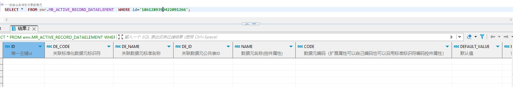

# 领域服务/病历领域 - 删除业务活动记录数据元 - 删除业务活动记录数据元 正向用例
## 请求参数：
``` json
{
  "orgCode": "NXRMYY",
  "ids": [
    "1861289399422091266"
  ],
  "operatorId": "282475805660160000",
  "operatorName": "CS彭彭彭",
  "operateDate": "2024-10-21 16:30:32"
}
```
## 返回参数：
``` json
{
    "exception": null,
    "apiCode": null,
    "data": null,
    "Code": 200,
    "Message": "操作成功"
}
```
## 数据校验：

# 领域服务/病历领域 - 删除业务活动记录数据元 - 必填校验-[orgCode]为空
## 请求参数：
``` json
{
  "orgCode": "",
  "ids": [
    "1844201306231726082"
  ],
  "operatorId": "282475805660160000",
  "operatorName": "CS彭彭彭",
  "operateDate": "2024-10-21 16:30:32"
}
```
## 返回参数：
``` json
{
  "exception": null,
  "apiCode": null,
  "data": null,
  "Code": 1,
  "Message": "机构编码不能为空"
}
```
# 领域服务/病历领域 - 删除业务活动记录数据元 - 必填校验-[operatorId]为空
## 请求参数：
``` json
{
  "orgCode": "NXRMYY",
  "ids": [
    "1844201306231726082"
  ],
  "operatorId": "",
  "operatorName": "CS彭彭彭",
  "operateDate": "2024-10-21 16:30:32"
}
```
## 返回参数：
``` json
{
  "exception": null,
  "apiCode": null,
  "data": null,
  "Code": 1,
  "Message": "操作人id不能为空"
}
```
# 领域服务/病历领域 - 删除业务活动记录数据元 - 必填校验-[operatorName]为空
## 请求参数：
``` json
{
  "orgCode": "NXRMYY",
  "ids": [
    "1844201306231726082"
  ],
  "operatorId": "282475805660160000",
  "operatorName": "",
  "operateDate": "2024-10-21 16:30:32"
}
```
## 返回参数：
``` json
{
  "exception": null,
  "apiCode": null,
  "data": null,
  "Code": 1,
  "Message": "操作人姓名不能为空"
}
```
# 领域服务/病历领域 - 删除业务活动记录数据元 - 必填校验-[operateDate]为空
## 请求参数：
``` json
{
  "orgCode": "NXRMYY",
  "ids": [
    "1844201306231726082"
  ],
  "operatorId": "282475805660160000",
  "operatorName": "CS彭彭彭",
  "operateDate": ""
}
```
## 返回参数：
``` json
{
  "exception": null,
  "apiCode": null,
  "data": null,
  "Code": 1,
  "Message": "操作时间不能为空"
}
```
# 领域服务/病历领域 - 删除业务活动记录数据元 - 必填校验-[ids]为空
## 请求参数：
``` json
{
  "orgCode": "NXRMYY",
  "ids": null,
  "operatorId": "282475805660160000",
  "operatorName": "CS彭彭彭",
  "operateDate": "2024-10-21 16:30:32"
}
```
## 返回参数：
``` json
{
  "exception": null,
  "apiCode": null,
  "data": null,
  "Code": 1,
  "Message": "待删除的业务活动记录数据元id集合不能为空"
}
```
# 领域服务/病历领域 - 删除业务活动记录数据元 - 类型校验-[ids]类型错误
## 请求参数：
``` json
{
  "orgCode": "NXRMYY",
  "ids": "abc",
  "operatorId": "282475805660160000",
  "operatorName": "CS彭彭彭",
  "operateDate": "2024-10-21 16:30:32"
}
```
## 返回参数：
``` json
{
  "exception": null,
  "apiCode": null,
  "data": null,
  "Code": 1,
  "Message": "请求参数错误"
}
```
# 领域服务/病历领域 - 删除业务活动记录数据元 - 依赖用例-[operatorName]赋值为依赖用例测试值
## 请求参数：
``` json
{
  "orgCode": "NXRMYY",
  "ids": [
    "1844201306231726082"
  ],
  "operatorId": "282475805660160000",
  "operatorName": "依赖用例测试值",
  "operateDate": "2024-10-21 16:30:32"
}
```
## 返回参数：
``` json
{
  "exception": null,
  "apiCode": null,
  "data": null,
  "Code": 1,
  "Message": "该数据元不存在或已经被删除"
}
```
# 领域服务/病历领域 - 删除业务活动记录数据元 - 依赖用例-[operatorId]赋值为依赖用例测试值
## 请求参数：
``` json
{
  "orgCode": "NXRMYY",
  "ids": [
    "1844201306231726082"
  ],
  "operatorId": "依赖用例测试值",
  "operatorName": "CS彭彭彭",
  "operateDate": "2024-10-21 16:30:32"
}
```
## 返回参数：
``` json
{
  "exception": null,
  "apiCode": null,
  "data": null,
  "Code": 1,
  "Message": "该数据元不存在或已经被删除"
}
```
# 领域服务/病历领域 - 删除业务活动记录数据元 - 依赖用例-[ids]赋值为[依赖用例测试值]
## 请求参数：
``` json
{
  "orgCode": "NXRMYY",
  "ids": [
    "依赖用例测试值"
  ],
  "operatorId": "282475805660160000",
  "operatorName": "CS彭彭彭",
  "operateDate": "2024-10-21 16:30:32"
}
```
## 返回参数：
``` json
{
  "exception": null,
  "apiCode": null,
  "data": null,
  "Code": 1,
  "Message": "该数据元不存在或已经被删除"
}
```
# 领域服务/病历领域 - 删除业务活动记录数据元 - 依赖用例-[orgCode]赋值为依赖用例测试值
## 请求参数：
``` json
{
  "orgCode": "依赖用例测试值",
  "ids": [
    "1844201306231726082"
  ],
  "operatorId": "282475805660160000",
  "operatorName": "CS彭彭彭",
  "operateDate": "2024-10-21 16:30:32"
}
```
## 返回参数：
``` json
{
  "exception": null,
  "apiCode": null,
  "data": null,
  "Code": 1,
  "Message": "该数据元不存在或已经被删除"
}
```