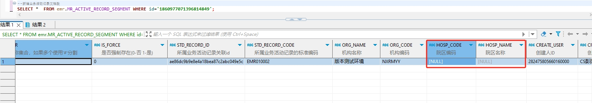

# 领域服务/病历领域 - 新增业务活动记录文档段 - 新增业务活动记录文档段 正向用例
## 请求参数：
``` json
{
  "orgName": "版本测试环境",
  "orgCode": "NXRMYY",
  "hospCode": "NXRY",
  "hospName": "版本测试环境",
  "list": [
    {
      "createUserId": "282475805660160000",
      "showName": "test",
      "stdRecordCode": "EMR010001",
      "createUserName": "CS彭彭彭",
      "deId": "33312aef33bacd725685c730a0590235",
      "dataSetIdArr": "",
      "deName": "术前小结",
      "name": "test1",
      "deCode": "P.055",
      "stdRecordId": "8645595b02b44437909ef93923c424dd",
      "isForce": "0",
      "dataSetNameArr": "",
      "createDate": "2024-10-16 17:25:37"
    }
  ],
  "operateDate": "2024-10-16 17:25:37",
  "operatorId": "282475805660160000",
  "operatorName": "CS彭彭彭"
}
```
## 返回参数：
``` json
{
    "exception": null,
    "apiCode": null,
    "data": [
        {
            "id": "1860980268622479362",
            "sourceId": null
        }
    ],
    "Code": 200,
    "Message": "操作成功"
}
```
## 数据校验：

# 领域服务/病历领域 - 新增业务活动记录文档段 - 必填校验-[orgCode]为空
## 请求参数：
``` json
{
  "orgName": "版本测试环境",
  "orgCode": "",
  "list": [
    {
      "createUserId": "282475805660160000",
      "showName": "test",
      "stdRecordCode": "EMR010001",
      "createUserName": "CS彭彭彭",
      "deId": "33312aef33bacd725685c730a0590235",
      "dataSetIdArr": "",
      "deName": "术前小结",
      "name": "test",
      "deCode": "P.055",
      "stdRecordId": "8645595b02b44437909ef93923c424dd",
      "isForce": "0",
      "dataSetNameArr": "",
      "createDate": "2024-10-16 17:25:37"
    }
  ],
  "operateDate": "2024-10-16 17:25:37",
  "operatorId": "282475805660160000",
  "operatorName": "CS彭彭彭"
}
```
## 返回参数：
``` json
{
  "exception": null,
  "apiCode": null,
  "data": null,
  "Code": 1,
  "Message": "机构编码不能为空 \n 院区名称不能为空 \n 院区编码不能为空"
}
```
# 领域服务/病历领域 - 新增业务活动记录文档段 - 必填校验-[orgName]为空
## 请求参数：
``` json
{
  "orgName": "",
  "orgCode": "NXRMYY",
  "list": [
    {
      "createUserId": "282475805660160000",
      "showName": "test",
      "stdRecordCode": "EMR010001",
      "createUserName": "CS彭彭彭",
      "deId": "33312aef33bacd725685c730a0590235",
      "dataSetIdArr": "",
      "deName": "术前小结",
      "name": "test",
      "deCode": "P.055",
      "stdRecordId": "8645595b02b44437909ef93923c424dd",
      "isForce": "0",
      "dataSetNameArr": "",
      "createDate": "2024-10-16 17:25:37"
    }
  ],
  "operateDate": "2024-10-16 17:25:37",
  "operatorId": "282475805660160000",
  "operatorName": "CS彭彭彭"
}
```
## 返回参数：
``` json
{
  "exception": null,
  "apiCode": null,
  "data": null,
  "Code": 1,
  "Message": "院区名称不能为空 \n 院区编码不能为空 \n 机构名称不能为空"
}
```
# 领域服务/病历领域 - 新增业务活动记录文档段 - 必填校验-[operatorId]为空
## 请求参数：
``` json
{
  "orgName": "版本测试环境",
  "orgCode": "NXRMYY",
  "list": [
    {
      "createUserId": "282475805660160000",
      "showName": "test",
      "stdRecordCode": "EMR010001",
      "createUserName": "CS彭彭彭",
      "deId": "33312aef33bacd725685c730a0590235",
      "dataSetIdArr": "",
      "deName": "术前小结",
      "name": "test",
      "deCode": "P.055",
      "stdRecordId": "8645595b02b44437909ef93923c424dd",
      "isForce": "0",
      "dataSetNameArr": "",
      "createDate": "2024-10-16 17:25:37"
    }
  ],
  "operateDate": "2024-10-16 17:25:37",
  "operatorId": "",
  "operatorName": "CS彭彭彭"
}
```
## 返回参数：
``` json
{
  "exception": null,
  "apiCode": null,
  "data": null,
  "Code": 1,
  "Message": "院区编码不能为空 \n 院区名称不能为空 \n 操作人id不能为空"
}
```
# 领域服务/病历领域 - 新增业务活动记录文档段 - 必填校验-[operatorName]为空
## 请求参数：
``` json
{
  "orgName": "版本测试环境",
  "orgCode": "NXRMYY",
  "list": [
    {
      "createUserId": "282475805660160000",
      "showName": "test",
      "stdRecordCode": "EMR010001",
      "createUserName": "CS彭彭彭",
      "deId": "33312aef33bacd725685c730a0590235",
      "dataSetIdArr": "",
      "deName": "术前小结",
      "name": "test",
      "deCode": "P.055",
      "stdRecordId": "8645595b02b44437909ef93923c424dd",
      "isForce": "0",
      "dataSetNameArr": "",
      "createDate": "2024-10-16 17:25:37"
    }
  ],
  "operateDate": "2024-10-16 17:25:37",
  "operatorId": "282475805660160000",
  "operatorName": ""
}
```
## 返回参数：
``` json
{
  "exception": null,
  "apiCode": null,
  "data": null,
  "Code": 1,
  "Message": "操作人姓名不能为空 \n 院区名称不能为空 \n 院区编码不能为空"
}
```
# 领域服务/病历领域 - 新增业务活动记录文档段 - 必填校验-[operateDate]为空
## 请求参数：
``` json
{
  "orgName": "版本测试环境",
  "orgCode": "NXRMYY",
  "list": [
    {
      "createUserId": "282475805660160000",
      "showName": "test",
      "stdRecordCode": "EMR010001",
      "createUserName": "CS彭彭彭",
      "deId": "33312aef33bacd725685c730a0590235",
      "dataSetIdArr": "",
      "deName": "术前小结",
      "name": "test",
      "deCode": "P.055",
      "stdRecordId": "8645595b02b44437909ef93923c424dd",
      "isForce": "0",
      "dataSetNameArr": "",
      "createDate": "2024-10-16 17:25:37"
    }
  ],
  "operateDate": "",
  "operatorId": "282475805660160000",
  "operatorName": "CS彭彭彭"
}
```
## 返回参数：
``` json
{
  "exception": null,
  "apiCode": null,
  "data": null,
  "Code": 1,
  "Message": "操作时间不能为空 \n 院区名称不能为空 \n 院区编码不能为空"
}
```
# 领域服务/病历领域 - 新增业务活动记录文档段 - 必填校验-[list]为空
## 请求参数：
``` json
{
  "orgName": "版本测试环境",
  "orgCode": "NXRMYY",
  "list": null,
  "operateDate": "2024-10-16 17:25:37",
  "operatorId": "282475805660160000",
  "operatorName": "CS彭彭彭"
}
```
## 返回参数：
``` json
{
  "exception": null,
  "apiCode": null,
  "data": null,
  "Code": 1,
  "Message": "待新增的业务活动记录集合对象不能为空 \n 院区名称不能为空 \n 院区编码不能为空"
}
```
# 领域服务/病历领域 - 新增业务活动记录文档段 - 必填校验-[list.createUserId]为空
## 请求参数：
``` json
{
  "orgName": "版本测试环境",
  "orgCode": "NXRMYY",
  "list": [
    {
      "createUserId": null,
      "showName": "test",
      "stdRecordCode": "EMR010001",
      "createUserName": "CS彭彭彭",
      "deId": "33312aef33bacd725685c730a0590235",
      "dataSetIdArr": "",
      "deName": "术前小结",
      "name": "test",
      "deCode": "P.055",
      "stdRecordId": "8645595b02b44437909ef93923c424dd",
      "isForce": "0",
      "dataSetNameArr": "",
      "createDate": "2024-10-16 17:25:37"
    }
  ],
  "operateDate": "2024-10-16 17:25:37",
  "operatorId": "282475805660160000",
  "operatorName": "CS彭彭彭"
}
```
## 返回参数：
``` json
{
  "exception": null,
  "apiCode": null,
  "data": null,
  "Code": 1,
  "Message": "院区名称不能为空 \n 院区编码不能为空"
}
```
# 领域服务/病历领域 - 新增业务活动记录文档段 - 必填校验-[list.createUserName]为空
## 请求参数：
``` json
{
  "orgName": "版本测试环境",
  "orgCode": "NXRMYY",
  "list": [
    {
      "createUserId": "282475805660160000",
      "showName": "test",
      "stdRecordCode": "EMR010001",
      "createUserName": null,
      "deId": "33312aef33bacd725685c730a0590235",
      "dataSetIdArr": "",
      "deName": "术前小结",
      "name": "test",
      "deCode": "P.055",
      "stdRecordId": "8645595b02b44437909ef93923c424dd",
      "isForce": "0",
      "dataSetNameArr": "",
      "createDate": "2024-10-16 17:25:37"
    }
  ],
  "operateDate": "2024-10-16 17:25:37",
  "operatorId": "282475805660160000",
  "operatorName": "CS彭彭彭"
}
```
## 返回参数：
``` json
{
  "exception": null,
  "apiCode": null,
  "data": null,
  "Code": 1,
  "Message": "院区名称不能为空 \n 院区编码不能为空"
}
```
# 领域服务/病历领域 - 新增业务活动记录文档段 - 必填校验-[list.name]为空
## 请求参数：
``` json
{
  "orgName": "版本测试环境",
  "orgCode": "NXRMYY",
  "list": [
    {
      "createUserId": "282475805660160000",
      "showName": "test",
      "stdRecordCode": "EMR010001",
      "createUserName": "CS彭彭彭",
      "deId": "33312aef33bacd725685c730a0590235",
      "dataSetIdArr": "",
      "deName": "术前小结",
      "name": null,
      "deCode": "P.055",
      "stdRecordId": "8645595b02b44437909ef93923c424dd",
      "isForce": "0",
      "dataSetNameArr": "",
      "createDate": "2024-10-16 17:25:37"
    }
  ],
  "operateDate": "2024-10-16 17:25:37",
  "operatorId": "282475805660160000",
  "operatorName": "CS彭彭彭"
}
```
## 返回参数：
``` json
{
  "exception": null,
  "apiCode": null,
  "data": null,
  "Code": 1,
  "Message": "院区编码不能为空 \n 院区名称不能为空 \n 文档段名称(扩展属性)不能为空"
}
```
# 领域服务/病历领域 - 新增业务活动记录文档段 - 必填校验-[list.deCode]为空
## 请求参数：
``` json
{
  "orgName": "版本测试环境",
  "orgCode": "NXRMYY",
  "list": [
    {
      "createUserId": "282475805660160000",
      "showName": "test",
      "stdRecordCode": "EMR010001",
      "createUserName": "CS彭彭彭",
      "deId": "33312aef33bacd725685c730a0590235",
      "dataSetIdArr": "",
      "deName": "术前小结",
      "name": "test",
      "deCode": null,
      "stdRecordId": "8645595b02b44437909ef93923c424dd",
      "isForce": "0",
      "dataSetNameArr": "",
      "createDate": "2024-10-16 17:25:37"
    }
  ],
  "operateDate": "2024-10-16 17:25:37",
  "operatorId": "282475805660160000",
  "operatorName": "CS彭彭彭"
}
```
## 返回参数：
``` json
{
  "exception": null,
  "apiCode": null,
  "data": null,
  "Code": 1,
  "Message": "院区编码不能为空 \n 文档段标准编码(来自结构化节点公共表)不能为空 \n 院区名称不能为空"
}
```
# 领域服务/病历领域 - 新增业务活动记录文档段 - 必填校验-[list.deName]为空
## 请求参数：
``` json
{
  "orgName": "版本测试环境",
  "orgCode": "NXRMYY",
  "list": [
    {
      "createUserId": "282475805660160000",
      "showName": "test",
      "stdRecordCode": "EMR010001",
      "createUserName": "CS彭彭彭",
      "deId": "33312aef33bacd725685c730a0590235",
      "dataSetIdArr": "",
      "deName": null,
      "name": "test",
      "deCode": "P.055",
      "stdRecordId": "8645595b02b44437909ef93923c424dd",
      "isForce": "0",
      "dataSetNameArr": "",
      "createDate": "2024-10-16 17:25:37"
    }
  ],
  "operateDate": "2024-10-16 17:25:37",
  "operatorId": "282475805660160000",
  "operatorName": "CS彭彭彭"
}
```
## 返回参数：
``` json
{
  "exception": null,
  "apiCode": null,
  "data": null,
  "Code": 1,
  "Message": "院区编码不能为空 \n 院区名称不能为空 \n 文档段标准名称(来自结构化节点公共表)不能为空"
}
```
# 领域服务/病历领域 - 新增业务活动记录文档段 - 必填校验-[list.deId]为空
## 请求参数：
``` json
{
  "orgName": "版本测试环境",
  "orgCode": "NXRMYY",
  "list": [
    {
      "createUserId": "282475805660160000",
      "showName": "test",
      "stdRecordCode": "EMR010001",
      "createUserName": "CS彭彭彭",
      "deId": null,
      "dataSetIdArr": "",
      "deName": "术前小结",
      "name": "test",
      "deCode": "P.055",
      "stdRecordId": "8645595b02b44437909ef93923c424dd",
      "isForce": "0",
      "dataSetNameArr": "",
      "createDate": "2024-10-16 17:25:37"
    }
  ],
  "operateDate": "2024-10-16 17:25:37",
  "operatorId": "282475805660160000",
  "operatorName": "CS彭彭彭"
}
```
## 返回参数：
``` json
{
  "exception": null,
  "apiCode": null,
  "data": null,
  "Code": 1,
  "Message": "院区名称不能为空 \n 院区编码不能为空 \n 文档段标准的ID(来自结构化节点公共表)不能为空"
}
```
# 领域服务/病历领域 - 新增业务活动记录文档段 - 必填校验-[list.isForce]为空
## 请求参数：
``` json
{
  "orgName": "版本测试环境",
  "orgCode": "NXRMYY",
  "list": [
    {
      "createUserId": "282475805660160000",
      "showName": "test",
      "stdRecordCode": "EMR010001",
      "createUserName": "CS彭彭彭",
      "deId": "33312aef33bacd725685c730a0590235",
      "dataSetIdArr": "",
      "deName": "术前小结",
      "name": "test",
      "deCode": "P.055",
      "stdRecordId": "8645595b02b44437909ef93923c424dd",
      "isForce": null,
      "dataSetNameArr": "",
      "createDate": "2024-10-16 17:25:37"
    }
  ],
  "operateDate": "2024-10-16 17:25:37",
  "operatorId": "282475805660160000",
  "operatorName": "CS彭彭彭"
}
```
## 返回参数：
``` json
{
  "exception": null,
  "apiCode": null,
  "data": null,
  "Code": 1,
  "Message": "是否强制存在，0-否 1-是不能为空 \n 院区编码不能为空 \n 院区名称不能为空"
}
```
# 领域服务/病历领域 - 新增业务活动记录文档段 - 必填校验-[list.stdRecordId]为空
## 请求参数：
``` json
{
  "orgName": "版本测试环境",
  "orgCode": "NXRMYY",
  "list": [
    {
      "createUserId": "282475805660160000",
      "showName": "test",
      "stdRecordCode": "EMR010001",
      "createUserName": "CS彭彭彭",
      "deId": "33312aef33bacd725685c730a0590235",
      "dataSetIdArr": "",
      "deName": "术前小结",
      "name": "test",
      "deCode": "P.055",
      "stdRecordId": null,
      "isForce": "0",
      "dataSetNameArr": "",
      "createDate": "2024-10-16 17:25:37"
    }
  ],
  "operateDate": "2024-10-16 17:25:37",
  "operatorId": "282475805660160000",
  "operatorName": "CS彭彭彭"
}
```
## 返回参数：
``` json
{
  "exception": null,
  "apiCode": null,
  "data": null,
  "Code": 1,
  "Message": "院区名称不能为空 \n 院区编码不能为空 \n 所属业务活动记录关联id不能为空"
}
```
# 领域服务/病历领域 - 新增业务活动记录文档段 - 必填校验-[list.stdRecordCode]为空
## 请求参数：
``` json
{
  "orgName": "版本测试环境",
  "orgCode": "NXRMYY",
  "list": [
    {
      "createUserId": "282475805660160000",
      "showName": "test",
      "stdRecordCode": null,
      "createUserName": "CS彭彭彭",
      "deId": "33312aef33bacd725685c730a0590235",
      "dataSetIdArr": "",
      "deName": "术前小结",
      "name": "test",
      "deCode": "P.055",
      "stdRecordId": "8645595b02b44437909ef93923c424dd",
      "isForce": "0",
      "dataSetNameArr": "",
      "createDate": "2024-10-16 17:25:37"
    }
  ],
  "operateDate": "2024-10-16 17:25:37",
  "operatorId": "282475805660160000",
  "operatorName": "CS彭彭彭"
}
```
## 返回参数：
``` json
{
  "exception": null,
  "apiCode": null,
  "data": null,
  "Code": 1,
  "Message": "院区名称不能为空 \n 所属业务活动记录的标准编码不能为空 \n 院区编码不能为空"
}
```
# 领域服务/病历领域 - 新增业务活动记录文档段 - 枚举用例-[list.isForce] 枚举值为 0(是否强制存在为否)
## 请求参数：
``` json
{
  "orgName": "版本测试环境",
  "orgCode": "NXRMYY",
  "list": [
    {
      "createUserId": "282475805660160000",
      "showName": "test",
      "stdRecordCode": "EMR010001",
      "createUserName": "CS彭彭彭",
      "deId": "33312aef33bacd725685c730a0590235",
      "dataSetIdArr": "",
      "deName": "术前小结",
      "name": "test",
      "deCode": "P.055",
      "stdRecordId": "8645595b02b44437909ef93923c424dd",
      "isForce": "0",
      "dataSetNameArr": "",
      "createDate": "2024-10-16 17:25:37"
    }
  ],
  "operateDate": "2024-10-16 17:25:37",
  "operatorId": "282475805660160000",
  "operatorName": "CS彭彭彭"
}
```
## 返回参数：
``` json
{
  "exception": null,
  "apiCode": null,
  "data": null,
  "Code": 1,
  "Message": "院区编码不能为空 \n 院区名称不能为空"
}
```
# 领域服务/病历领域 - 新增业务活动记录文档段 - 枚举用例-[list.isForce] 枚举值为 1(是否强制存在为是)
## 请求参数：
``` json
{
  "orgName": "版本测试环境",
  "orgCode": "NXRMYY",
  "list": [
    {
      "createUserId": "282475805660160000",
      "showName": "test",
      "stdRecordCode": "EMR010001",
      "createUserName": "CS彭彭彭",
      "deId": "33312aef33bacd725685c730a0590235",
      "dataSetIdArr": "",
      "deName": "术前小结",
      "name": "test",
      "deCode": "P.055",
      "stdRecordId": "8645595b02b44437909ef93923c424dd",
      "isForce": "1",
      "dataSetNameArr": "",
      "createDate": "2024-10-16 17:25:37"
    }
  ],
  "operateDate": "2024-10-16 17:25:37",
  "operatorId": "282475805660160000",
  "operatorName": "CS彭彭彭"
}
```
## 返回参数：
``` json
{
  "exception": null,
  "apiCode": null,
  "data": null,
  "Code": 1,
  "Message": "院区编码不能为空 \n 院区名称不能为空"
}
```
# 领域服务/病历领域 - 新增业务活动记录文档段 - 依赖用例-[operatorName]赋值为依赖用例测试值
## 请求参数：
``` json
{
  "orgName": "版本测试环境",
  "orgCode": "NXRMYY",
  "list": [
    {
      "createUserId": "282475805660160000",
      "showName": "test",
      "stdRecordCode": "EMR010001",
      "createUserName": "CS彭彭彭",
      "deId": "33312aef33bacd725685c730a0590235",
      "dataSetIdArr": "",
      "deName": "术前小结",
      "name": "test",
      "deCode": "P.055",
      "stdRecordId": "8645595b02b44437909ef93923c424dd",
      "isForce": "0",
      "dataSetNameArr": "",
      "createDate": "2024-10-16 17:25:37"
    }
  ],
  "operateDate": "2024-10-16 17:25:37",
  "operatorId": "282475805660160000",
  "operatorName": "依赖用例测试值"
}
```
## 返回参数：
``` json
{
  "exception": null,
  "apiCode": null,
  "data": null,
  "Code": 1,
  "Message": "院区名称不能为空 \n 院区编码不能为空"
}
```
# 领域服务/病历领域 - 新增业务活动记录文档段 - 依赖用例-[operatorId]赋值为依赖用例测试值
## 请求参数：
``` json
{
  "orgName": "版本测试环境",
  "orgCode": "NXRMYY",
  "list": [
    {
      "createUserId": "282475805660160000",
      "showName": "test",
      "stdRecordCode": "EMR010001",
      "createUserName": "CS彭彭彭",
      "deId": "33312aef33bacd725685c730a0590235",
      "dataSetIdArr": "",
      "deName": "术前小结",
      "name": "test",
      "deCode": "P.055",
      "stdRecordId": "8645595b02b44437909ef93923c424dd",
      "isForce": "0",
      "dataSetNameArr": "",
      "createDate": "2024-10-16 17:25:37"
    }
  ],
  "operateDate": "2024-10-16 17:25:37",
  "operatorId": "依赖用例测试值",
  "operatorName": "CS彭彭彭"
}
```
## 返回参数：
``` json
{
  "exception": null,
  "apiCode": null,
  "data": null,
  "Code": 1,
  "Message": "院区名称不能为空 \n 院区编码不能为空"
}
```
# 领域服务/病历领域 - 新增业务活动记录文档段 - 依赖用例-[list.createUserId]赋值为依赖用例测试值
## 请求参数：
``` json
{
  "orgName": "版本测试环境",
  "orgCode": "NXRMYY",
  "list": [
    {
      "createUserId": "依赖用例测试值",
      "showName": "test",
      "stdRecordCode": "EMR010001",
      "createUserName": "CS彭彭彭",
      "deId": "33312aef33bacd725685c730a0590235",
      "dataSetIdArr": "",
      "deName": "术前小结",
      "name": "test",
      "deCode": "P.055",
      "stdRecordId": "8645595b02b44437909ef93923c424dd",
      "isForce": "0",
      "dataSetNameArr": "",
      "createDate": "2024-10-16 17:25:37"
    }
  ],
  "operateDate": "2024-10-16 17:25:37",
  "operatorId": "282475805660160000",
  "operatorName": "CS彭彭彭"
}
```
## 返回参数：
``` json
{
  "exception": null,
  "apiCode": null,
  "data": null,
  "Code": 1,
  "Message": "院区编码不能为空 \n 院区名称不能为空"
}
```
# 领域服务/病历领域 - 新增业务活动记录文档段 - 依赖用例-[list.stdRecordCode]赋值为依赖用例测试值
## 请求参数：
``` json
{
  "orgName": "版本测试环境",
  "orgCode": "NXRMYY",
  "list": [
    {
      "createUserId": "282475805660160000",
      "showName": "test",
      "stdRecordCode": "依赖用例测试值",
      "createUserName": "CS彭彭彭",
      "deId": "33312aef33bacd725685c730a0590235",
      "dataSetIdArr": "",
      "deName": "术前小结",
      "name": "test",
      "deCode": "P.055",
      "stdRecordId": "8645595b02b44437909ef93923c424dd",
      "isForce": "0",
      "dataSetNameArr": "",
      "createDate": "2024-10-16 17:25:37"
    }
  ],
  "operateDate": "2024-10-16 17:25:37",
  "operatorId": "282475805660160000",
  "operatorName": "CS彭彭彭"
}
```
## 返回参数：
``` json
{
  "exception": null,
  "apiCode": null,
  "data": null,
  "Code": 1,
  "Message": "院区编码不能为空 \n 院区名称不能为空"
}
```
# 领域服务/病历领域 - 新增业务活动记录文档段 - 依赖用例-[list.name]赋值为依赖用例测试值
## 请求参数：
``` json
{
  "orgName": "版本测试环境",
  "orgCode": "NXRMYY",
  "list": [
    {
      "createUserId": "282475805660160000",
      "showName": "test",
      "stdRecordCode": "EMR010001",
      "createUserName": "CS彭彭彭",
      "deId": "33312aef33bacd725685c730a0590235",
      "dataSetIdArr": "",
      "deName": "术前小结",
      "name": "依赖用例测试值",
      "deCode": "P.055",
      "stdRecordId": "8645595b02b44437909ef93923c424dd",
      "isForce": "0",
      "dataSetNameArr": "",
      "createDate": "2024-10-16 17:25:37"
    }
  ],
  "operateDate": "2024-10-16 17:25:37",
  "operatorId": "282475805660160000",
  "operatorName": "CS彭彭彭"
}
```
## 返回参数：
``` json
{
  "exception": null,
  "apiCode": null,
  "data": null,
  "Code": 1,
  "Message": "院区编码不能为空 \n 院区名称不能为空"
}
```
# 领域服务/病历领域 - 新增业务活动记录文档段 - 依赖用例-[list.stdRecordId]赋值为依赖用例测试值
## 请求参数：
``` json
{
  "orgName": "版本测试环境",
  "orgCode": "NXRMYY",
  "list": [
    {
      "createUserId": "282475805660160000",
      "showName": "test",
      "stdRecordCode": "EMR010001",
      "createUserName": "CS彭彭彭",
      "deId": "33312aef33bacd725685c730a0590235",
      "dataSetIdArr": "",
      "deName": "术前小结",
      "name": "test",
      "deCode": "P.055",
      "stdRecordId": "依赖用例测试值",
      "isForce": "0",
      "dataSetNameArr": "",
      "createDate": "2024-10-16 17:25:37"
    }
  ],
  "operateDate": "2024-10-16 17:25:37",
  "operatorId": "282475805660160000",
  "operatorName": "CS彭彭彭"
}
```
## 返回参数：
``` json
{
  "exception": null,
  "apiCode": null,
  "data": null,
  "Code": 1,
  "Message": "院区编码不能为空 \n 院区名称不能为空"
}
```
# 领域服务/病历领域 - 新增业务活动记录文档段 - 依赖用例-[orgCode]赋值为依赖用例测试值
## 请求参数：
``` json
{
  "orgName": "版本测试环境",
  "orgCode": "依赖用例测试值",
  "list": [
    {
      "createUserId": "282475805660160000",
      "showName": "test",
      "stdRecordCode": "EMR010001",
      "createUserName": "CS彭彭彭",
      "deId": "33312aef33bacd725685c730a0590235",
      "dataSetIdArr": "",
      "deName": "术前小结",
      "name": "test",
      "deCode": "P.055",
      "stdRecordId": "8645595b02b44437909ef93923c424dd",
      "isForce": "0",
      "dataSetNameArr": "",
      "createDate": "2024-10-16 17:25:37"
    }
  ],
  "operateDate": "2024-10-16 17:25:37",
  "operatorId": "282475805660160000",
  "operatorName": "CS彭彭彭"
}
```
## 返回参数：
``` json
{
  "exception": null,
  "apiCode": null,
  "data": null,
  "Code": 1,
  "Message": "院区编码不能为空 \n 院区名称不能为空"
}
```
# 领域服务/病历领域 - 新增业务活动记录文档段 - 依赖用例-[orgName]赋值为依赖用例测试值
## 请求参数：
``` json
{
  "orgName": "依赖用例测试值",
  "orgCode": "NXRMYY",
  "list": [
    {
      "createUserId": "282475805660160000",
      "showName": "test",
      "stdRecordCode": "EMR010001",
      "createUserName": "CS彭彭彭",
      "deId": "33312aef33bacd725685c730a0590235",
      "dataSetIdArr": "",
      "deName": "术前小结",
      "name": "test",
      "deCode": "P.055",
      "stdRecordId": "8645595b02b44437909ef93923c424dd",
      "isForce": "0",
      "dataSetNameArr": "",
      "createDate": "2024-10-16 17:25:37"
    }
  ],
  "operateDate": "2024-10-16 17:25:37",
  "operatorId": "282475805660160000",
  "operatorName": "CS彭彭彭"
}
```
## 返回参数：
``` json
{
  "exception": null,
  "apiCode": null,
  "data": null,
  "Code": 1,
  "Message": "院区名称不能为空 \n 院区编码不能为空"
}
```