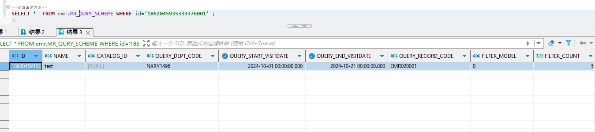

# 领域服务/病历领域 - 新增查询方案 - 新增查询方案(包括组合条件，查询指标) 正向用例
## 请求参数：
``` json
{
  "orgName": "版本测试环境",
  "hospCode": "NXRY",
  "hospName": "版本测试环境",
  "orgCode": "NXRMYY",
  "list": [
    {
      "queryStartVisitDate": "2024-10-01 00:00:00",
      "filterModel": "0",
      "queryDeptCode": "NXRY1496",
      "catalogId": "",
      "queryEndVisitDate": "2024-10-21 00:00:00",
      "name": "test",
      "queryConditionList": [
        {
          "nodeName": "姓名",
          "serialNumber": "0",
          "nodeCode": "DE02.01.039.00",
          "dataType": "0",
          "logicRelation": "",
          "queryType": "0",
          "operatorSymbol": "=",
          "value": "李",
          "schemeId": "1856287232420315137"
        }
      ],
      "queryTargetList": [
        {
          "nodeName": "产后出血量（mL）",
          "serialNumber": "0",
          "nodeCode": "DE04.10.012.00",
          "targetType": "0",
          "schemeId": "1856287232420315137"
        }
      ],
      "queryStdRecordCode": "EMR020001",
      "filterCount": "5"
    }
  ],
  "operatorId": "349365436797001728",
  "operatorName": "测试医生",
  "operateDate": "2024-10-21 16:24:04"
}
```
## 返回参数：
``` json
{
    "exception": null,
    "apiCode": null,
    "data": {
        "list": [
            {
                "id": "1862045935333376001",
                "sourceId": null
            }
        ]
    },
    "Code": 200,
    "Message": "操作成功"
}
```
## 数据校验：

# 领域服务/病历领域 - 新增查询方案 - 必填校验-[orgCode]为空
## 请求参数：
``` json
{
  "orgName": "版本测试环境",
  "hospCode": "NXRY",
  "hospName": "版本测试环境",
  "orgCode": "",
  "list": [
    {
      "queryStartVisitDate": "2024-10-01 00:00:00",
      "filterModel": "0",
      "queryDeptCode": "NXRY1496",
      "catalogId": "",
      "queryEndVisitDate": "2024-10-21 00:00:00",
      "name": "ff",
      "queryConditionList": [
        {
          "nodeName": "姓名",
          "serialNumber": "0",
          "nodeCode": "DE02.01.039.00",
          "dataType": "0",
          "logicRelation": "",
          "queryType": "0",
          "operatorSymbol": "=",
          "value": "李"
        }
      ],
      "queryTargetList": [
        {
          "nodeName": "产后出血量（mL）",
          "serialNumber": "0",
          "nodeCode": "DE04.10.012.00",
          "targetType": "0"
        }
      ],
      "queryStdRecordCode": "EMR020001",
      "filterCount": "5"
    }
  ],
  "operatorId": "349365436797001728",
  "operatorName": "测试医生",
  "operateDate": "2024-10-21 16:24:04"
}
```
## 返回参数：
``` json
{
  "exception": null,
  "apiCode": null,
  "data": null,
  "Code": 1,
  "Message": "机构编码不能为空 \n 关联查询方案id不能为空 \n 关联查询方案id不能为空"
}
```
# 领域服务/病历领域 - 新增查询方案 - 必填校验-[orgName]为空
## 请求参数：
``` json
{
  "orgName": "",
  "hospCode": "NXRY",
  "hospName": "版本测试环境",
  "orgCode": "NXRMYY",
  "list": [
    {
      "queryStartVisitDate": "2024-10-01 00:00:00",
      "filterModel": "0",
      "queryDeptCode": "NXRY1496",
      "catalogId": "",
      "queryEndVisitDate": "2024-10-21 00:00:00",
      "name": "ff",
      "queryConditionList": [
        {
          "nodeName": "姓名",
          "serialNumber": "0",
          "nodeCode": "DE02.01.039.00",
          "dataType": "0",
          "logicRelation": "",
          "queryType": "0",
          "operatorSymbol": "=",
          "value": "李"
        }
      ],
      "queryTargetList": [
        {
          "nodeName": "产后出血量（mL）",
          "serialNumber": "0",
          "nodeCode": "DE04.10.012.00",
          "targetType": "0"
        }
      ],
      "queryStdRecordCode": "EMR020001",
      "filterCount": "5"
    }
  ],
  "operatorId": "349365436797001728",
  "operatorName": "测试医生",
  "operateDate": "2024-10-21 16:24:04"
}
```
## 返回参数：
``` json
{
  "exception": null,
  "apiCode": null,
  "data": null,
  "Code": 1,
  "Message": "机构名称不能为空 \n 关联查询方案id不能为空 \n 关联查询方案id不能为空"
}
```
# 领域服务/病历领域 - 新增查询方案 - 必填校验-[hospCode]为空
## 请求参数：
``` json
{
  "orgName": "版本测试环境",
  "hospCode": "",
  "hospName": "版本测试环境",
  "orgCode": "NXRMYY",
  "list": [
    {
      "queryStartVisitDate": "2024-10-01 00:00:00",
      "filterModel": "0",
      "queryDeptCode": "NXRY1496",
      "catalogId": "",
      "queryEndVisitDate": "2024-10-21 00:00:00",
      "name": "ff",
      "queryConditionList": [
        {
          "nodeName": "姓名",
          "serialNumber": "0",
          "nodeCode": "DE02.01.039.00",
          "dataType": "0",
          "logicRelation": "",
          "queryType": "0",
          "operatorSymbol": "=",
          "value": "李"
        }
      ],
      "queryTargetList": [
        {
          "nodeName": "产后出血量（mL）",
          "serialNumber": "0",
          "nodeCode": "DE04.10.012.00",
          "targetType": "0"
        }
      ],
      "queryStdRecordCode": "EMR020001",
      "filterCount": "5"
    }
  ],
  "operatorId": "349365436797001728",
  "operatorName": "测试医生",
  "operateDate": "2024-10-21 16:24:04"
}
```
## 返回参数：
``` json
{
  "exception": null,
  "apiCode": null,
  "data": null,
  "Code": 1,
  "Message": "关联查询方案id不能为空 \n 关联查询方案id不能为空 \n 院区编码不能为空"
}
```
# 领域服务/病历领域 - 新增查询方案 - 必填校验-[hospName]为空
## 请求参数：
``` json
{
  "orgName": "版本测试环境",
  "hospCode": "NXRY",
  "hospName": "",
  "orgCode": "NXRMYY",
  "list": [
    {
      "queryStartVisitDate": "2024-10-01 00:00:00",
      "filterModel": "0",
      "queryDeptCode": "NXRY1496",
      "catalogId": "",
      "queryEndVisitDate": "2024-10-21 00:00:00",
      "name": "ff",
      "queryConditionList": [
        {
          "nodeName": "姓名",
          "serialNumber": "0",
          "nodeCode": "DE02.01.039.00",
          "dataType": "0",
          "logicRelation": "",
          "queryType": "0",
          "operatorSymbol": "=",
          "value": "李"
        }
      ],
      "queryTargetList": [
        {
          "nodeName": "产后出血量（mL）",
          "serialNumber": "0",
          "nodeCode": "DE04.10.012.00",
          "targetType": "0"
        }
      ],
      "queryStdRecordCode": "EMR020001",
      "filterCount": "5"
    }
  ],
  "operatorId": "349365436797001728",
  "operatorName": "测试医生",
  "operateDate": "2024-10-21 16:24:04"
}
```
## 返回参数：
``` json
{
  "exception": null,
  "apiCode": null,
  "data": null,
  "Code": 1,
  "Message": "院区名称不能为空 \n 关联查询方案id不能为空 \n 关联查询方案id不能为空"
}
```
# 领域服务/病历领域 - 新增查询方案 - 必填校验-[operatorId]为空
## 请求参数：
``` json
{
  "orgName": "版本测试环境",
  "hospCode": "NXRY",
  "hospName": "版本测试环境",
  "orgCode": "NXRMYY",
  "list": [
    {
      "queryStartVisitDate": "2024-10-01 00:00:00",
      "filterModel": "0",
      "queryDeptCode": "NXRY1496",
      "catalogId": "",
      "queryEndVisitDate": "2024-10-21 00:00:00",
      "name": "ff",
      "queryConditionList": [
        {
          "nodeName": "姓名",
          "serialNumber": "0",
          "nodeCode": "DE02.01.039.00",
          "dataType": "0",
          "logicRelation": "",
          "queryType": "0",
          "operatorSymbol": "=",
          "value": "李"
        }
      ],
      "queryTargetList": [
        {
          "nodeName": "产后出血量（mL）",
          "serialNumber": "0",
          "nodeCode": "DE04.10.012.00",
          "targetType": "0"
        }
      ],
      "queryStdRecordCode": "EMR020001",
      "filterCount": "5"
    }
  ],
  "operatorId": "",
  "operatorName": "测试医生",
  "operateDate": "2024-10-21 16:24:04"
}
```
## 返回参数：
``` json
{
  "exception": null,
  "apiCode": null,
  "data": null,
  "Code": 1,
  "Message": "操作人id不能为空 \n 关联查询方案id不能为空 \n 关联查询方案id不能为空"
}
```
# 领域服务/病历领域 - 新增查询方案 - 必填校验-[operatorName]为空
## 请求参数：
``` json
{
  "orgName": "版本测试环境",
  "hospCode": "NXRY",
  "hospName": "版本测试环境",
  "orgCode": "NXRMYY",
  "list": [
    {
      "queryStartVisitDate": "2024-10-01 00:00:00",
      "filterModel": "0",
      "queryDeptCode": "NXRY1496",
      "catalogId": "",
      "queryEndVisitDate": "2024-10-21 00:00:00",
      "name": "ff",
      "queryConditionList": [
        {
          "nodeName": "姓名",
          "serialNumber": "0",
          "nodeCode": "DE02.01.039.00",
          "dataType": "0",
          "logicRelation": "",
          "queryType": "0",
          "operatorSymbol": "=",
          "value": "李"
        }
      ],
      "queryTargetList": [
        {
          "nodeName": "产后出血量（mL）",
          "serialNumber": "0",
          "nodeCode": "DE04.10.012.00",
          "targetType": "0"
        }
      ],
      "queryStdRecordCode": "EMR020001",
      "filterCount": "5"
    }
  ],
  "operatorId": "349365436797001728",
  "operatorName": "",
  "operateDate": "2024-10-21 16:24:04"
}
```
## 返回参数：
``` json
{
  "exception": null,
  "apiCode": null,
  "data": null,
  "Code": 1,
  "Message": "关联查询方案id不能为空 \n 关联查询方案id不能为空 \n 操作人姓名不能为空"
}
```
# 领域服务/病历领域 - 新增查询方案 - 必填校验-[operateDate]为空
## 请求参数：
``` json
{
  "orgName": "版本测试环境",
  "hospCode": "NXRY",
  "hospName": "版本测试环境",
  "orgCode": "NXRMYY",
  "list": [
    {
      "queryStartVisitDate": "2024-10-01 00:00:00",
      "filterModel": "0",
      "queryDeptCode": "NXRY1496",
      "catalogId": "",
      "queryEndVisitDate": "2024-10-21 00:00:00",
      "name": "ff",
      "queryConditionList": [
        {
          "nodeName": "姓名",
          "serialNumber": "0",
          "nodeCode": "DE02.01.039.00",
          "dataType": "0",
          "logicRelation": "",
          "queryType": "0",
          "operatorSymbol": "=",
          "value": "李"
        }
      ],
      "queryTargetList": [
        {
          "nodeName": "产后出血量（mL）",
          "serialNumber": "0",
          "nodeCode": "DE04.10.012.00",
          "targetType": "0"
        }
      ],
      "queryStdRecordCode": "EMR020001",
      "filterCount": "5"
    }
  ],
  "operatorId": "349365436797001728",
  "operatorName": "测试医生",
  "operateDate": ""
}
```
## 返回参数：
``` json
{
  "exception": null,
  "apiCode": null,
  "data": null,
  "Code": 1,
  "Message": "关联查询方案id不能为空 \n 关联查询方案id不能为空 \n 操作时间不能为空"
}
```
# 领域服务/病历领域 - 新增查询方案 - 必填校验-[list]为空
## 请求参数：
``` json
{
  "orgName": "版本测试环境",
  "hospCode": "NXRY",
  "hospName": "版本测试环境",
  "orgCode": "NXRMYY",
  "list": null,
  "operatorId": "349365436797001728",
  "operatorName": "测试医生",
  "operateDate": "2024-10-21 16:24:04"
}
```
## 返回参数：
``` json
{
  "exception": null,
  "apiCode": null,
  "data": null,
  "Code": 1,
  "Message": "待保存的查询方案信息不能为空"
}
```
# 领域服务/病历领域 - 新增查询方案 - 必填校验-[list.name]为空
## 请求参数：
``` json
{
  "orgName": "版本测试环境",
  "hospCode": "NXRY",
  "hospName": "版本测试环境",
  "orgCode": "NXRMYY",
  "list": [
    {
      "queryStartVisitDate": "2024-10-01 00:00:00",
      "filterModel": "0",
      "queryDeptCode": "NXRY1496",
      "catalogId": "",
      "queryEndVisitDate": "2024-10-21 00:00:00",
      "name": null,
      "queryConditionList": [
        {
          "nodeName": "姓名",
          "serialNumber": "0",
          "nodeCode": "DE02.01.039.00",
          "dataType": "0",
          "logicRelation": "",
          "queryType": "0",
          "operatorSymbol": "=",
          "value": "李"
        }
      ],
      "queryTargetList": [
        {
          "nodeName": "产后出血量（mL）",
          "serialNumber": "0",
          "nodeCode": "DE04.10.012.00",
          "targetType": "0"
        }
      ],
      "queryStdRecordCode": "EMR020001",
      "filterCount": "5"
    }
  ],
  "operatorId": "349365436797001728",
  "operatorName": "测试医生",
  "operateDate": "2024-10-21 16:24:04"
}
```
## 返回参数：
``` json
{
  "exception": null,
  "apiCode": null,
  "data": null,
  "Code": 1,
  "Message": "关联查询方案id不能为空 \n 关联查询方案id不能为空 \n 查询方案名称不能为空"
}
```
# 领域服务/病历领域 - 新增查询方案 - 必填校验-[list.catalogId]为空
## 请求参数：
``` json
{
  "orgName": "版本测试环境",
  "hospCode": "NXRY",
  "hospName": "版本测试环境",
  "orgCode": "NXRMYY",
  "list": [
    {
      "queryStartVisitDate": "2024-10-01 00:00:00",
      "filterModel": "0",
      "queryDeptCode": "NXRY1496",
      "catalogId": null,
      "queryEndVisitDate": "2024-10-21 00:00:00",
      "name": "ff",
      "queryConditionList": [
        {
          "nodeName": "姓名",
          "serialNumber": "0",
          "nodeCode": "DE02.01.039.00",
          "dataType": "0",
          "logicRelation": "",
          "queryType": "0",
          "operatorSymbol": "=",
          "value": "李"
        }
      ],
      "queryTargetList": [
        {
          "nodeName": "产后出血量（mL）",
          "serialNumber": "0",
          "nodeCode": "DE04.10.012.00",
          "targetType": "0"
        }
      ],
      "queryStdRecordCode": "EMR020001",
      "filterCount": "5"
    }
  ],
  "operatorId": "349365436797001728",
  "operatorName": "测试医生",
  "operateDate": "2024-10-21 16:24:04"
}
```
## 返回参数：
``` json
{
  "exception": null,
  "apiCode": null,
  "data": null,
  "Code": 1,
  "Message": "关联查询方案id不能为空 \n 关联查询方案id不能为空"
}
```
# 领域服务/病历领域 - 新增查询方案 - 必填校验-[list.queryConditionList]为空
## 请求参数：
``` json
{
  "orgName": "版本测试环境",
  "hospCode": "NXRY",
  "hospName": "版本测试环境",
  "orgCode": "NXRMYY",
  "list": [
    {
      "queryStartVisitDate": "2024-10-01 00:00:00",
      "filterModel": "0",
      "queryDeptCode": "NXRY1496",
      "catalogId": "",
      "queryEndVisitDate": "2024-10-21 00:00:00",
      "name": "ff",
      "queryConditionList": null,
      "queryTargetList": [
        {
          "nodeName": "产后出血量（mL）",
          "serialNumber": "0",
          "nodeCode": "DE04.10.012.00",
          "targetType": "0"
        }
      ],
      "queryStdRecordCode": "EMR020001",
      "filterCount": "5"
    }
  ],
  "operatorId": "349365436797001728",
  "operatorName": "测试医生",
  "operateDate": "2024-10-21 16:24:04"
}
```
## 返回参数：
``` json
{
  "exception": null,
  "apiCode": null,
  "data": null,
  "Code": 1,
  "Message": "关联查询方案id不能为空 \n 查询方案组合条件集合不能为空"
}
```
# 领域服务/病历领域 - 新增查询方案 - 必填校验-[list.queryTargetList]为空
## 请求参数：
``` json
{
  "orgName": "版本测试环境",
  "hospCode": "NXRY",
  "hospName": "版本测试环境",
  "orgCode": "NXRMYY",
  "list": [
    {
      "queryStartVisitDate": "2024-10-01 00:00:00",
      "filterModel": "0",
      "queryDeptCode": "NXRY1496",
      "catalogId": "",
      "queryEndVisitDate": "2024-10-21 00:00:00",
      "name": "ff",
      "queryConditionList": [
        {
          "nodeName": "姓名",
          "serialNumber": "0",
          "nodeCode": "DE02.01.039.00",
          "dataType": "0",
          "logicRelation": "",
          "queryType": "0",
          "operatorSymbol": "=",
          "value": "李"
        }
      ],
      "queryTargetList": null,
      "queryStdRecordCode": "EMR020001",
      "filterCount": "5"
    }
  ],
  "operatorId": "349365436797001728",
  "operatorName": "测试医生",
  "operateDate": "2024-10-21 16:24:04"
}
```
## 返回参数：
``` json
{
  "exception": null,
  "apiCode": null,
  "data": null,
  "Code": 1,
  "Message": "关联查询方案id不能为空 \n 查询方案指标集合不能为空"
}
```
# 领域服务/病历领域 - 新增查询方案 - 必填校验-[list.queryTargetList.targetType]为空
## 请求参数：
``` json
{
  "orgName": "版本测试环境",
  "hospCode": "NXRY",
  "hospName": "版本测试环境",
  "orgCode": "NXRMYY",
  "list": [
    {
      "queryStartVisitDate": "2024-10-01 00:00:00",
      "filterModel": "0",
      "queryDeptCode": "NXRY1496",
      "catalogId": "",
      "queryEndVisitDate": "2024-10-21 00:00:00",
      "name": "ff",
      "queryConditionList": [
        {
          "nodeName": "姓名",
          "serialNumber": "0",
          "nodeCode": "DE02.01.039.00",
          "dataType": "0",
          "logicRelation": "",
          "queryType": "0",
          "operatorSymbol": "=",
          "value": "李"
        }
      ],
      "queryTargetList": [
        {
          "nodeName": "产后出血量（mL）",
          "serialNumber": "0",
          "nodeCode": "DE04.10.012.00",
          "targetType": null
        }
      ],
      "queryStdRecordCode": "EMR020001",
      "filterCount": "5"
    }
  ],
  "operatorId": "349365436797001728",
  "operatorName": "测试医生",
  "operateDate": "2024-10-21 16:24:04"
}
```
## 返回参数：
``` json
{
  "exception": null,
  "apiCode": null,
  "data": null,
  "Code": 1,
  "Message": "关联查询方案id不能为空 \n 查询病历结构化节点类型不能为空 \n 关联查询方案id不能为空"
}
```
# 领域服务/病历领域 - 新增查询方案 - 必填校验-[list.queryTargetList.nodeCode]为空
## 请求参数：
``` json
{
  "orgName": "版本测试环境",
  "hospCode": "NXRY",
  "hospName": "版本测试环境",
  "orgCode": "NXRMYY",
  "list": [
    {
      "queryStartVisitDate": "2024-10-01 00:00:00",
      "filterModel": "0",
      "queryDeptCode": "NXRY1496",
      "catalogId": "",
      "queryEndVisitDate": "2024-10-21 00:00:00",
      "name": "ff",
      "queryConditionList": [
        {
          "nodeName": "姓名",
          "serialNumber": "0",
          "nodeCode": "DE02.01.039.00",
          "dataType": "0",
          "logicRelation": "",
          "queryType": "0",
          "operatorSymbol": "=",
          "value": "李"
        }
      ],
      "queryTargetList": [
        {
          "nodeName": "产后出血量（mL）",
          "serialNumber": "0",
          "nodeCode": null,
          "targetType": "0"
        }
      ],
      "queryStdRecordCode": "EMR020001",
      "filterCount": "5"
    }
  ],
  "operatorId": "349365436797001728",
  "operatorName": "测试医生",
  "operateDate": "2024-10-21 16:24:04"
}
```
## 返回参数：
``` json
{
  "exception": null,
  "apiCode": null,
  "data": null,
  "Code": 1,
  "Message": "关联查询方案id不能为空 \n 关联查询方案id不能为空 \n 查询节点的标准编码不能为空"
}
```
# 领域服务/病历领域 - 新增查询方案 - 必填校验-[list.queryTargetList.nodeName]为空
## 请求参数：
``` json
{
  "orgName": "版本测试环境",
  "hospCode": "NXRY",
  "hospName": "版本测试环境",
  "orgCode": "NXRMYY",
  "list": [
    {
      "queryStartVisitDate": "2024-10-01 00:00:00",
      "filterModel": "0",
      "queryDeptCode": "NXRY1496",
      "catalogId": "",
      "queryEndVisitDate": "2024-10-21 00:00:00",
      "name": "ff",
      "queryConditionList": [
        {
          "nodeName": "姓名",
          "serialNumber": "0",
          "nodeCode": "DE02.01.039.00",
          "dataType": "0",
          "logicRelation": "",
          "queryType": "0",
          "operatorSymbol": "=",
          "value": "李"
        }
      ],
      "queryTargetList": [
        {
          "nodeName": null,
          "serialNumber": "0",
          "nodeCode": "DE04.10.012.00",
          "targetType": "0"
        }
      ],
      "queryStdRecordCode": "EMR020001",
      "filterCount": "5"
    }
  ],
  "operatorId": "349365436797001728",
  "operatorName": "测试医生",
  "operateDate": "2024-10-21 16:24:04"
}
```
## 返回参数：
``` json
{
  "exception": null,
  "apiCode": null,
  "data": null,
  "Code": 1,
  "Message": "关联查询方案id不能为空 \n 关联查询方案id不能为空 \n 查询节点的标准名称不能为空"
}
```
# 领域服务/病历领域 - 新增查询方案 - 必填校验-[list.queryTargetList.serialNumber]为空
## 请求参数：
``` json
{
  "orgName": "版本测试环境",
  "hospCode": "NXRY",
  "hospName": "版本测试环境",
  "orgCode": "NXRMYY",
  "list": [
    {
      "queryStartVisitDate": "2024-10-01 00:00:00",
      "filterModel": "0",
      "queryDeptCode": "NXRY1496",
      "catalogId": "",
      "queryEndVisitDate": "2024-10-21 00:00:00",
      "name": "ff",
      "queryConditionList": [
        {
          "nodeName": "姓名",
          "serialNumber": "0",
          "nodeCode": "DE02.01.039.00",
          "dataType": "0",
          "logicRelation": "",
          "queryType": "0",
          "operatorSymbol": "=",
          "value": "李"
        }
      ],
      "queryTargetList": [
        {
          "nodeName": "产后出血量（mL）",
          "serialNumber": null,
          "nodeCode": "DE04.10.012.00",
          "targetType": "0"
        }
      ],
      "queryStdRecordCode": "EMR020001",
      "filterCount": "5"
    }
  ],
  "operatorId": "349365436797001728",
  "operatorName": "测试医生",
  "operateDate": "2024-10-21 16:24:04"
}
```
## 返回参数：
``` json
{
  "exception": null,
  "apiCode": null,
  "data": null,
  "Code": 1,
  "Message": "排列序号不能为空 \n 关联查询方案id不能为空 \n 关联查询方案id不能为空"
}
```
# 领域服务/病历领域 - 新增查询方案 - 必填校验-[list.queryConditionList.queryType]为空
## 请求参数：
``` json
{
  "orgName": "版本测试环境",
  "hospCode": "NXRY",
  "hospName": "版本测试环境",
  "orgCode": "NXRMYY",
  "list": [
    {
      "queryStartVisitDate": "2024-10-01 00:00:00",
      "filterModel": "0",
      "queryDeptCode": "NXRY1496",
      "catalogId": "",
      "queryEndVisitDate": "2024-10-21 00:00:00",
      "name": "ff",
      "queryConditionList": [
        {
          "nodeName": "姓名",
          "serialNumber": "0",
          "nodeCode": "DE02.01.039.00",
          "dataType": "0",
          "logicRelation": "",
          "queryType": null,
          "operatorSymbol": "=",
          "value": "李"
        }
      ],
      "queryTargetList": [
        {
          "nodeName": "产后出血量（mL）",
          "serialNumber": "0",
          "nodeCode": "DE04.10.012.00",
          "targetType": "0"
        }
      ],
      "queryStdRecordCode": "EMR020001",
      "filterCount": "5"
    }
  ],
  "operatorId": "349365436797001728",
  "operatorName": "测试医生",
  "operateDate": "2024-10-21 16:24:04"
}
```
## 返回参数：
``` json
{
  "exception": null,
  "apiCode": null,
  "data": null,
  "Code": 1,
  "Message": "查询病历结构化节点类型不能为空 \n 关联查询方案id不能为空 \n 关联查询方案id不能为空"
}
```
# 领域服务/病历领域 - 新增查询方案 - 必填校验-[list.queryConditionList.nodeCode]为空
## 请求参数：
``` json
{
  "orgName": "版本测试环境",
  "hospCode": "NXRY",
  "hospName": "版本测试环境",
  "orgCode": "NXRMYY",
  "list": [
    {
      "queryStartVisitDate": "2024-10-01 00:00:00",
      "filterModel": "0",
      "queryDeptCode": "NXRY1496",
      "catalogId": "",
      "queryEndVisitDate": "2024-10-21 00:00:00",
      "name": "ff",
      "queryConditionList": [
        {
          "nodeName": "姓名",
          "serialNumber": "0",
          "nodeCode": null,
          "dataType": "0",
          "logicRelation": "",
          "queryType": "0",
          "operatorSymbol": "=",
          "value": "李"
        }
      ],
      "queryTargetList": [
        {
          "nodeName": "产后出血量（mL）",
          "serialNumber": "0",
          "nodeCode": "DE04.10.012.00",
          "targetType": "0"
        }
      ],
      "queryStdRecordCode": "EMR020001",
      "filterCount": "5"
    }
  ],
  "operatorId": "349365436797001728",
  "operatorName": "测试医生",
  "operateDate": "2024-10-21 16:24:04"
}
```
## 返回参数：
``` json
{
  "exception": null,
  "apiCode": null,
  "data": null,
  "Code": 1,
  "Message": "关联查询方案id不能为空 \n 查询节点的标准编码不能为空 \n 关联查询方案id不能为空"
}
```
# 领域服务/病历领域 - 新增查询方案 - 必填校验-[list.queryConditionList.nodeName]为空
## 请求参数：
``` json
{
  "orgName": "版本测试环境",
  "hospCode": "NXRY",
  "hospName": "版本测试环境",
  "orgCode": "NXRMYY",
  "list": [
    {
      "queryStartVisitDate": "2024-10-01 00:00:00",
      "filterModel": "0",
      "queryDeptCode": "NXRY1496",
      "catalogId": "",
      "queryEndVisitDate": "2024-10-21 00:00:00",
      "name": "ff",
      "queryConditionList": [
        {
          "nodeName": null,
          "serialNumber": "0",
          "nodeCode": "DE02.01.039.00",
          "dataType": "0",
          "logicRelation": "",
          "queryType": "0",
          "operatorSymbol": "=",
          "value": "李"
        }
      ],
      "queryTargetList": [
        {
          "nodeName": "产后出血量（mL）",
          "serialNumber": "0",
          "nodeCode": "DE04.10.012.00",
          "targetType": "0"
        }
      ],
      "queryStdRecordCode": "EMR020001",
      "filterCount": "5"
    }
  ],
  "operatorId": "349365436797001728",
  "operatorName": "测试医生",
  "operateDate": "2024-10-21 16:24:04"
}
```
## 返回参数：
``` json
{
  "exception": null,
  "apiCode": null,
  "data": null,
  "Code": 1,
  "Message": "关联查询方案id不能为空 \n 查询节点的标准名称不能为空 \n 关联查询方案id不能为空"
}
```
# 领域服务/病历领域 - 新增查询方案 - 必填校验-[list.queryConditionList.operatorSymbol]为空
## 请求参数：
``` json
{
  "orgName": "版本测试环境",
  "hospCode": "NXRY",
  "hospName": "版本测试环境",
  "orgCode": "NXRMYY",
  "list": [
    {
      "queryStartVisitDate": "2024-10-01 00:00:00",
      "filterModel": "0",
      "queryDeptCode": "NXRY1496",
      "catalogId": "",
      "queryEndVisitDate": "2024-10-21 00:00:00",
      "name": "ff",
      "queryConditionList": [
        {
          "nodeName": "姓名",
          "serialNumber": "0",
          "nodeCode": "DE02.01.039.00",
          "dataType": "0",
          "logicRelation": "",
          "queryType": "0",
          "operatorSymbol": null,
          "value": "李"
        }
      ],
      "queryTargetList": [
        {
          "nodeName": "产后出血量（mL）",
          "serialNumber": "0",
          "nodeCode": "DE04.10.012.00",
          "targetType": "0"
        }
      ],
      "queryStdRecordCode": "EMR020001",
      "filterCount": "5"
    }
  ],
  "operatorId": "349365436797001728",
  "operatorName": "测试医生",
  "operateDate": "2024-10-21 16:24:04"
}
```
## 返回参数：
``` json
{
  "exception": null,
  "apiCode": null,
  "data": null,
  "Code": 1,
  "Message": "关联查询方案id不能为空 \n 条件操作符不能为空 \n 关联查询方案id不能为空"
}
```
# 领域服务/病历领域 - 新增查询方案 - 必填校验-[list.queryConditionList.dataType]为空
## 请求参数：
``` json
{
  "orgName": "版本测试环境",
  "hospCode": "NXRY",
  "hospName": "版本测试环境",
  "orgCode": "NXRMYY",
  "list": [
    {
      "queryStartVisitDate": "2024-10-01 00:00:00",
      "filterModel": "0",
      "queryDeptCode": "NXRY1496",
      "catalogId": "",
      "queryEndVisitDate": "2024-10-21 00:00:00",
      "name": "ff",
      "queryConditionList": [
        {
          "nodeName": "姓名",
          "serialNumber": "0",
          "nodeCode": "DE02.01.039.00",
          "dataType": null,
          "logicRelation": "",
          "queryType": "0",
          "operatorSymbol": "=",
          "value": "李"
        }
      ],
      "queryTargetList": [
        {
          "nodeName": "产后出血量（mL）",
          "serialNumber": "0",
          "nodeCode": "DE04.10.012.00",
          "targetType": "0"
        }
      ],
      "queryStdRecordCode": "EMR020001",
      "filterCount": "5"
    }
  ],
  "operatorId": "349365436797001728",
  "operatorName": "测试医生",
  "operateDate": "2024-10-21 16:24:04"
}
```
## 返回参数：
``` json
{
  "exception": null,
  "apiCode": null,
  "data": null,
  "Code": 1,
  "Message": "值输入样式不能为空 \n 关联查询方案id不能为空 \n 关联查询方案id不能为空"
}
```
# 领域服务/病历领域 - 新增查询方案 - 必填校验-[list.queryConditionList.serialNumber]为空
## 请求参数：
``` json
{
  "orgName": "版本测试环境",
  "hospCode": "NXRY",
  "hospName": "版本测试环境",
  "orgCode": "NXRMYY",
  "list": [
    {
      "queryStartVisitDate": "2024-10-01 00:00:00",
      "filterModel": "0",
      "queryDeptCode": "NXRY1496",
      "catalogId": "",
      "queryEndVisitDate": "2024-10-21 00:00:00",
      "name": "ff",
      "queryConditionList": [
        {
          "nodeName": "姓名",
          "serialNumber": null,
          "nodeCode": "DE02.01.039.00",
          "dataType": "0",
          "logicRelation": "",
          "queryType": "0",
          "operatorSymbol": "=",
          "value": "李"
        }
      ],
      "queryTargetList": [
        {
          "nodeName": "产后出血量（mL）",
          "serialNumber": "0",
          "nodeCode": "DE04.10.012.00",
          "targetType": "0"
        }
      ],
      "queryStdRecordCode": "EMR020001",
      "filterCount": "5"
    }
  ],
  "operatorId": "349365436797001728",
  "operatorName": "测试医生",
  "operateDate": "2024-10-21 16:24:04"
}
```
## 返回参数：
``` json
{
  "exception": null,
  "apiCode": null,
  "data": null,
  "Code": 1,
  "Message": "关联查询方案id不能为空 \n 关联查询方案id不能为空 \n 排列序号不能为空"
}
```
# 领域服务/病历领域 - 新增查询方案 - 类型校验-[list.queryConditionList.serialNumber]类型错误
## 请求参数：
``` json
{
  "orgName": "版本测试环境",
  "hospCode": "NXRY",
  "hospName": "版本测试环境",
  "orgCode": "NXRMYY",
  "list": [
    {
      "queryStartVisitDate": "2024-10-01 00:00:00",
      "filterModel": "0",
      "queryDeptCode": "NXRY1496",
      "catalogId": "",
      "queryEndVisitDate": "2024-10-21 00:00:00",
      "name": "ff",
      "queryConditionList": [
        {
          "nodeName": "姓名",
          "serialNumber": "\"abc\"",
          "nodeCode": "DE02.01.039.00",
          "dataType": "0",
          "logicRelation": "",
          "queryType": "0",
          "operatorSymbol": "=",
          "value": "李"
        }
      ],
      "queryTargetList": [
        {
          "nodeName": "产后出血量（mL）",
          "serialNumber": "0",
          "nodeCode": "DE04.10.012.00",
          "targetType": "0"
        }
      ],
      "queryStdRecordCode": "EMR020001",
      "filterCount": "5"
    }
  ],
  "operatorId": "349365436797001728",
  "operatorName": "测试医生",
  "operateDate": "2024-10-21 16:24:04"
}
```
## 返回参数：
``` json
{
  "exception": null,
  "apiCode": null,
  "data": null,
  "Code": 1,
  "Message": "关联查询方案id不能为空 \n 关联查询方案id不能为空"
}
```
# 领域服务/病历领域 - 新增查询方案 - 枚举用例-[list.queryConditionList.dataType] 枚举值为 0(值输入样式为文本)
## 请求参数：
``` json
{
  "orgName": "版本测试环境",
  "hospCode": "NXRY",
  "hospName": "版本测试环境",
  "orgCode": "NXRMYY",
  "list": [
    {
      "queryStartVisitDate": "2024-10-01 00:00:00",
      "filterModel": "0",
      "queryDeptCode": "NXRY1496",
      "catalogId": "",
      "queryEndVisitDate": "2024-10-21 00:00:00",
      "name": "ff",
      "queryConditionList": [
        {
          "nodeName": "姓名",
          "serialNumber": "0",
          "nodeCode": "DE02.01.039.00",
          "dataType": "0",
          "logicRelation": "",
          "queryType": "0",
          "operatorSymbol": "=",
          "value": "李"
        }
      ],
      "queryTargetList": [
        {
          "nodeName": "产后出血量（mL）",
          "serialNumber": "0",
          "nodeCode": "DE04.10.012.00",
          "targetType": "0"
        }
      ],
      "queryStdRecordCode": "EMR020001",
      "filterCount": "5"
    }
  ],
  "operatorId": "349365436797001728",
  "operatorName": "测试医生",
  "operateDate": "2024-10-21 16:24:04"
}
```
## 返回参数：
``` json
{
  "exception": null,
  "apiCode": null,
  "data": null,
  "Code": 1,
  "Message": "关联查询方案id不能为空 \n 关联查询方案id不能为空"
}
```
# 领域服务/病历领域 - 新增查询方案 - 枚举用例-[list.queryConditionList.dataType] 枚举值为 1(值输入样式为数值)
## 请求参数：
``` json
{
  "orgName": "版本测试环境",
  "hospCode": "NXRY",
  "hospName": "版本测试环境",
  "orgCode": "NXRMYY",
  "list": [
    {
      "queryStartVisitDate": "2024-10-01 00:00:00",
      "filterModel": "0",
      "queryDeptCode": "NXRY1496",
      "catalogId": "",
      "queryEndVisitDate": "2024-10-21 00:00:00",
      "name": "ff",
      "queryConditionList": [
        {
          "nodeName": "姓名",
          "serialNumber": "0",
          "nodeCode": "DE02.01.039.00",
          "dataType": "1",
          "logicRelation": "",
          "queryType": "0",
          "operatorSymbol": "=",
          "value": "李"
        }
      ],
      "queryTargetList": [
        {
          "nodeName": "产后出血量（mL）",
          "serialNumber": "0",
          "nodeCode": "DE04.10.012.00",
          "targetType": "0"
        }
      ],
      "queryStdRecordCode": "EMR020001",
      "filterCount": "5"
    }
  ],
  "operatorId": "349365436797001728",
  "operatorName": "测试医生",
  "operateDate": "2024-10-21 16:24:04"
}
```
## 返回参数：
``` json
{
  "exception": null,
  "apiCode": null,
  "data": null,
  "Code": 1,
  "Message": "关联查询方案id不能为空 \n 关联查询方案id不能为空"
}
```
# 领域服务/病历领域 - 新增查询方案 - 枚举用例-[list.queryConditionList.dataType] 枚举值为 2(值输入样式为日期时间)
## 请求参数：
``` json
{
  "orgName": "版本测试环境",
  "hospCode": "NXRY",
  "hospName": "版本测试环境",
  "orgCode": "NXRMYY",
  "list": [
    {
      "queryStartVisitDate": "2024-10-01 00:00:00",
      "filterModel": "0",
      "queryDeptCode": "NXRY1496",
      "catalogId": "",
      "queryEndVisitDate": "2024-10-21 00:00:00",
      "name": "ff",
      "queryConditionList": [
        {
          "nodeName": "姓名",
          "serialNumber": "0",
          "nodeCode": "DE02.01.039.00",
          "dataType": "2",
          "logicRelation": "",
          "queryType": "0",
          "operatorSymbol": "=",
          "value": "李"
        }
      ],
      "queryTargetList": [
        {
          "nodeName": "产后出血量（mL）",
          "serialNumber": "0",
          "nodeCode": "DE04.10.012.00",
          "targetType": "0"
        }
      ],
      "queryStdRecordCode": "EMR020001",
      "filterCount": "5"
    }
  ],
  "operatorId": "349365436797001728",
  "operatorName": "测试医生",
  "operateDate": "2024-10-21 16:24:04"
}
```
## 返回参数：
``` json
{
  "exception": null,
  "apiCode": null,
  "data": null,
  "Code": 1,
  "Message": "关联查询方案id不能为空 \n 关联查询方案id不能为空"
}
```
# 领域服务/病历领域 - 新增查询方案 - 枚举用例-[list.queryConditionList.dataType] 枚举值为 3(值输入样式为字典)
## 请求参数：
``` json
{
  "orgName": "版本测试环境",
  "hospCode": "NXRY",
  "hospName": "版本测试环境",
  "orgCode": "NXRMYY",
  "list": [
    {
      "queryStartVisitDate": "2024-10-01 00:00:00",
      "filterModel": "0",
      "queryDeptCode": "NXRY1496",
      "catalogId": "",
      "queryEndVisitDate": "2024-10-21 00:00:00",
      "name": "ff",
      "queryConditionList": [
        {
          "nodeName": "姓名",
          "serialNumber": "0",
          "nodeCode": "DE02.01.039.00",
          "dataType": "3",
          "logicRelation": "",
          "queryType": "0",
          "operatorSymbol": "=",
          "value": "李"
        }
      ],
      "queryTargetList": [
        {
          "nodeName": "产后出血量（mL）",
          "serialNumber": "0",
          "nodeCode": "DE04.10.012.00",
          "targetType": "0"
        }
      ],
      "queryStdRecordCode": "EMR020001",
      "filterCount": "5"
    }
  ],
  "operatorId": "349365436797001728",
  "operatorName": "测试医生",
  "operateDate": "2024-10-21 16:24:04"
}
```
## 返回参数：
``` json
{
  "exception": null,
  "apiCode": null,
  "data": null,
  "Code": 1,
  "Message": "关联查询方案id不能为空 \n 关联查询方案id不能为空"
}
```
# 领域服务/病历领域 - 新增查询方案 - 枚举用例-[list.queryConditionList.queryType] 枚举值为 0(查询病历结构化节点类型为数据元)
## 请求参数：
``` json
{
  "orgName": "版本测试环境",
  "hospCode": "NXRY",
  "hospName": "版本测试环境",
  "orgCode": "NXRMYY",
  "list": [
    {
      "queryStartVisitDate": "2024-10-01 00:00:00",
      "filterModel": "0",
      "queryDeptCode": "NXRY1496",
      "catalogId": "",
      "queryEndVisitDate": "2024-10-21 00:00:00",
      "name": "ff",
      "queryConditionList": [
        {
          "nodeName": "姓名",
          "serialNumber": "0",
          "nodeCode": "DE02.01.039.00",
          "dataType": "0",
          "logicRelation": "",
          "queryType": "0",
          "operatorSymbol": "=",
          "value": "李"
        }
      ],
      "queryTargetList": [
        {
          "nodeName": "产后出血量（mL）",
          "serialNumber": "0",
          "nodeCode": "DE04.10.012.00",
          "targetType": "0"
        }
      ],
      "queryStdRecordCode": "EMR020001",
      "filterCount": "5"
    }
  ],
  "operatorId": "349365436797001728",
  "operatorName": "测试医生",
  "operateDate": "2024-10-21 16:24:04"
}
```
## 返回参数：
``` json
{
  "exception": null,
  "apiCode": null,
  "data": null,
  "Code": 1,
  "Message": "关联查询方案id不能为空 \n 关联查询方案id不能为空"
}
```
# 领域服务/病历领域 - 新增查询方案 - 枚举用例-[list.queryConditionList.queryType] 枚举值为 1(查询病历结构化节点类型为数据组)
## 请求参数：
``` json
{
  "orgName": "版本测试环境",
  "hospCode": "NXRY",
  "hospName": "版本测试环境",
  "orgCode": "NXRMYY",
  "list": [
    {
      "queryStartVisitDate": "2024-10-01 00:00:00",
      "filterModel": "0",
      "queryDeptCode": "NXRY1496",
      "catalogId": "",
      "queryEndVisitDate": "2024-10-21 00:00:00",
      "name": "ff",
      "queryConditionList": [
        {
          "nodeName": "姓名",
          "serialNumber": "0",
          "nodeCode": "DE02.01.039.00",
          "dataType": "0",
          "logicRelation": "",
          "queryType": "1",
          "operatorSymbol": "=",
          "value": "李"
        }
      ],
      "queryTargetList": [
        {
          "nodeName": "产后出血量（mL）",
          "serialNumber": "0",
          "nodeCode": "DE04.10.012.00",
          "targetType": "0"
        }
      ],
      "queryStdRecordCode": "EMR020001",
      "filterCount": "5"
    }
  ],
  "operatorId": "349365436797001728",
  "operatorName": "测试医生",
  "operateDate": "2024-10-21 16:24:04"
}
```
## 返回参数：
``` json
{
  "exception": null,
  "apiCode": null,
  "data": null,
  "Code": 1,
  "Message": "关联查询方案id不能为空 \n 关联查询方案id不能为空"
}
```
# 领域服务/病历领域 - 新增查询方案 - 枚举用例-[list.queryConditionList.queryType] 枚举值为 2(查询病历结构化节点类型为文档段)
## 请求参数：
``` json
{
  "orgName": "版本测试环境",
  "hospCode": "NXRY",
  "hospName": "版本测试环境",
  "orgCode": "NXRMYY",
  "list": [
    {
      "queryStartVisitDate": "2024-10-01 00:00:00",
      "filterModel": "0",
      "queryDeptCode": "NXRY1496",
      "catalogId": "",
      "queryEndVisitDate": "2024-10-21 00:00:00",
      "name": "ff",
      "queryConditionList": [
        {
          "nodeName": "姓名",
          "serialNumber": "0",
          "nodeCode": "DE02.01.039.00",
          "dataType": "0",
          "logicRelation": "",
          "queryType": "2",
          "operatorSymbol": "=",
          "value": "李"
        }
      ],
      "queryTargetList": [
        {
          "nodeName": "产后出血量（mL）",
          "serialNumber": "0",
          "nodeCode": "DE04.10.012.00",
          "targetType": "0"
        }
      ],
      "queryStdRecordCode": "EMR020001",
      "filterCount": "5"
    }
  ],
  "operatorId": "349365436797001728",
  "operatorName": "测试医生",
  "operateDate": "2024-10-21 16:24:04"
}
```
## 返回参数：
``` json
{
  "exception": null,
  "apiCode": null,
  "data": null,
  "Code": 1,
  "Message": "关联查询方案id不能为空 \n 关联查询方案id不能为空"
}
```
# 领域服务/病历领域 - 新增查询方案 - 枚举用例-[list.queryTargetList.targetType] 枚举值为 0(查询病历结构化节点类型为数据元)
## 请求参数：
``` json
{
  "orgName": "版本测试环境",
  "hospCode": "NXRY",
  "hospName": "版本测试环境",
  "orgCode": "NXRMYY",
  "list": [
    {
      "queryStartVisitDate": "2024-10-01 00:00:00",
      "filterModel": "0",
      "queryDeptCode": "NXRY1496",
      "catalogId": "",
      "queryEndVisitDate": "2024-10-21 00:00:00",
      "name": "ff",
      "queryConditionList": [
        {
          "nodeName": "姓名",
          "serialNumber": "0",
          "nodeCode": "DE02.01.039.00",
          "dataType": "0",
          "logicRelation": "",
          "queryType": "0",
          "operatorSymbol": "=",
          "value": "李"
        }
      ],
      "queryTargetList": [
        {
          "nodeName": "产后出血量（mL）",
          "serialNumber": "0",
          "nodeCode": "DE04.10.012.00",
          "targetType": "0"
        }
      ],
      "queryStdRecordCode": "EMR020001",
      "filterCount": "5"
    }
  ],
  "operatorId": "349365436797001728",
  "operatorName": "测试医生",
  "operateDate": "2024-10-21 16:24:04"
}
```
## 返回参数：
``` json
{
  "exception": null,
  "apiCode": null,
  "data": null,
  "Code": 1,
  "Message": "关联查询方案id不能为空 \n 关联查询方案id不能为空"
}
```
# 领域服务/病历领域 - 新增查询方案 - 枚举用例-[list.queryTargetList.targetType] 枚举值为 1(查询病历结构化节点类型为数据组)
## 请求参数：
``` json
{
  "orgName": "版本测试环境",
  "hospCode": "NXRY",
  "hospName": "版本测试环境",
  "orgCode": "NXRMYY",
  "list": [
    {
      "queryStartVisitDate": "2024-10-01 00:00:00",
      "filterModel": "0",
      "queryDeptCode": "NXRY1496",
      "catalogId": "",
      "queryEndVisitDate": "2024-10-21 00:00:00",
      "name": "ff",
      "queryConditionList": [
        {
          "nodeName": "姓名",
          "serialNumber": "0",
          "nodeCode": "DE02.01.039.00",
          "dataType": "0",
          "logicRelation": "",
          "queryType": "0",
          "operatorSymbol": "=",
          "value": "李"
        }
      ],
      "queryTargetList": [
        {
          "nodeName": "产后出血量（mL）",
          "serialNumber": "0",
          "nodeCode": "DE04.10.012.00",
          "targetType": "1"
        }
      ],
      "queryStdRecordCode": "EMR020001",
      "filterCount": "5"
    }
  ],
  "operatorId": "349365436797001728",
  "operatorName": "测试医生",
  "operateDate": "2024-10-21 16:24:04"
}
```
## 返回参数：
``` json
{
  "exception": null,
  "apiCode": null,
  "data": null,
  "Code": 1,
  "Message": "关联查询方案id不能为空 \n 关联查询方案id不能为空"
}
```
# 领域服务/病历领域 - 新增查询方案 - 枚举用例-[list.queryTargetList.targetType] 枚举值为 2(查询病历结构化节点类型为文档段)
## 请求参数：
``` json
{
  "orgName": "版本测试环境",
  "hospCode": "NXRY",
  "hospName": "版本测试环境",
  "orgCode": "NXRMYY",
  "list": [
    {
      "queryStartVisitDate": "2024-10-01 00:00:00",
      "filterModel": "0",
      "queryDeptCode": "NXRY1496",
      "catalogId": "",
      "queryEndVisitDate": "2024-10-21 00:00:00",
      "name": "ff",
      "queryConditionList": [
        {
          "nodeName": "姓名",
          "serialNumber": "0",
          "nodeCode": "DE02.01.039.00",
          "dataType": "0",
          "logicRelation": "",
          "queryType": "0",
          "operatorSymbol": "=",
          "value": "李"
        }
      ],
      "queryTargetList": [
        {
          "nodeName": "产后出血量（mL）",
          "serialNumber": "0",
          "nodeCode": "DE04.10.012.00",
          "targetType": "2"
        }
      ],
      "queryStdRecordCode": "EMR020001",
      "filterCount": "5"
    }
  ],
  "operatorId": "349365436797001728",
  "operatorName": "测试医生",
  "operateDate": "2024-10-21 16:24:04"
}
```
## 返回参数：
``` json
{
  "exception": null,
  "apiCode": null,
  "data": null,
  "Code": 1,
  "Message": "关联查询方案id不能为空 \n 关联查询方案id不能为空"
}
```
# 领域服务/病历领域 - 新增查询方案 - 依赖用例-[operatorName]赋值为依赖用例测试值
## 请求参数：
``` json
{
  "orgName": "版本测试环境",
  "hospCode": "NXRY",
  "hospName": "版本测试环境",
  "orgCode": "NXRMYY",
  "list": [
    {
      "queryStartVisitDate": "2024-10-01 00:00:00",
      "filterModel": "0",
      "queryDeptCode": "NXRY1496",
      "catalogId": "",
      "queryEndVisitDate": "2024-10-21 00:00:00",
      "name": "ff",
      "queryConditionList": [
        {
          "nodeName": "姓名",
          "serialNumber": "0",
          "nodeCode": "DE02.01.039.00",
          "dataType": "0",
          "logicRelation": "",
          "queryType": "0",
          "operatorSymbol": "=",
          "value": "李"
        }
      ],
      "queryTargetList": [
        {
          "nodeName": "产后出血量（mL）",
          "serialNumber": "0",
          "nodeCode": "DE04.10.012.00",
          "targetType": "0"
        }
      ],
      "queryStdRecordCode": "EMR020001",
      "filterCount": "5"
    }
  ],
  "operatorId": "349365436797001728",
  "operatorName": "依赖用例测试值",
  "operateDate": "2024-10-21 16:24:04"
}
```
## 返回参数：
``` json
{
  "exception": null,
  "apiCode": null,
  "data": null,
  "Code": 1,
  "Message": "关联查询方案id不能为空 \n 关联查询方案id不能为空"
}
```
# 领域服务/病历领域 - 新增查询方案 - 依赖用例-[operatorId]赋值为依赖用例测试值
## 请求参数：
``` json
{
  "orgName": "版本测试环境",
  "hospCode": "NXRY",
  "hospName": "版本测试环境",
  "orgCode": "NXRMYY",
  "list": [
    {
      "queryStartVisitDate": "2024-10-01 00:00:00",
      "filterModel": "0",
      "queryDeptCode": "NXRY1496",
      "catalogId": "",
      "queryEndVisitDate": "2024-10-21 00:00:00",
      "name": "ff",
      "queryConditionList": [
        {
          "nodeName": "姓名",
          "serialNumber": "0",
          "nodeCode": "DE02.01.039.00",
          "dataType": "0",
          "logicRelation": "",
          "queryType": "0",
          "operatorSymbol": "=",
          "value": "李"
        }
      ],
      "queryTargetList": [
        {
          "nodeName": "产后出血量（mL）",
          "serialNumber": "0",
          "nodeCode": "DE04.10.012.00",
          "targetType": "0"
        }
      ],
      "queryStdRecordCode": "EMR020001",
      "filterCount": "5"
    }
  ],
  "operatorId": "依赖用例测试值",
  "operatorName": "测试医生",
  "operateDate": "2024-10-21 16:24:04"
}
```
## 返回参数：
``` json
{
  "exception": null,
  "apiCode": null,
  "data": null,
  "Code": 1,
  "Message": "关联查询方案id不能为空 \n 关联查询方案id不能为空"
}
```
# 领域服务/病历领域 - 新增查询方案 - 依赖用例-[list.catalogId]赋值为依赖用例测试值
## 请求参数：
``` json
{
  "orgName": "版本测试环境",
  "hospCode": "NXRY",
  "hospName": "版本测试环境",
  "orgCode": "NXRMYY",
  "list": [
    {
      "queryStartVisitDate": "2024-10-01 00:00:00",
      "filterModel": "0",
      "queryDeptCode": "NXRY1496",
      "catalogId": "依赖用例测试值",
      "queryEndVisitDate": "2024-10-21 00:00:00",
      "name": "ff",
      "queryConditionList": [
        {
          "nodeName": "姓名",
          "serialNumber": "0",
          "nodeCode": "DE02.01.039.00",
          "dataType": "0",
          "logicRelation": "",
          "queryType": "0",
          "operatorSymbol": "=",
          "value": "李"
        }
      ],
      "queryTargetList": [
        {
          "nodeName": "产后出血量（mL）",
          "serialNumber": "0",
          "nodeCode": "DE04.10.012.00",
          "targetType": "0"
        }
      ],
      "queryStdRecordCode": "EMR020001",
      "filterCount": "5"
    }
  ],
  "operatorId": "349365436797001728",
  "operatorName": "测试医生",
  "operateDate": "2024-10-21 16:24:04"
}
```
## 返回参数：
``` json
{
  "exception": null,
  "apiCode": null,
  "data": null,
  "Code": 1,
  "Message": "关联查询方案id不能为空 \n 关联查询方案id不能为空"
}
```
# 领域服务/病历领域 - 新增查询方案 - 依赖用例-[list.name]赋值为依赖用例测试值
## 请求参数：
``` json
{
  "orgName": "版本测试环境",
  "hospCode": "NXRY",
  "hospName": "版本测试环境",
  "orgCode": "NXRMYY",
  "list": [
    {
      "queryStartVisitDate": "2024-10-01 00:00:00",
      "filterModel": "0",
      "queryDeptCode": "NXRY1496",
      "catalogId": "",
      "queryEndVisitDate": "2024-10-21 00:00:00",
      "name": "依赖用例测试值",
      "queryConditionList": [
        {
          "nodeName": "姓名",
          "serialNumber": "0",
          "nodeCode": "DE02.01.039.00",
          "dataType": "0",
          "logicRelation": "",
          "queryType": "0",
          "operatorSymbol": "=",
          "value": "李"
        }
      ],
      "queryTargetList": [
        {
          "nodeName": "产后出血量（mL）",
          "serialNumber": "0",
          "nodeCode": "DE04.10.012.00",
          "targetType": "0"
        }
      ],
      "queryStdRecordCode": "EMR020001",
      "filterCount": "5"
    }
  ],
  "operatorId": "349365436797001728",
  "operatorName": "测试医生",
  "operateDate": "2024-10-21 16:24:04"
}
```
## 返回参数：
``` json
{
  "exception": null,
  "apiCode": null,
  "data": null,
  "Code": 1,
  "Message": "关联查询方案id不能为空 \n 关联查询方案id不能为空"
}
```
# 领域服务/病历领域 - 新增查询方案 - 依赖用例-[orgCode]赋值为依赖用例测试值
## 请求参数：
``` json
{
  "orgName": "版本测试环境",
  "hospCode": "NXRY",
  "hospName": "版本测试环境",
  "orgCode": "依赖用例测试值",
  "list": [
    {
      "queryStartVisitDate": "2024-10-01 00:00:00",
      "filterModel": "0",
      "queryDeptCode": "NXRY1496",
      "catalogId": "",
      "queryEndVisitDate": "2024-10-21 00:00:00",
      "name": "ff",
      "queryConditionList": [
        {
          "nodeName": "姓名",
          "serialNumber": "0",
          "nodeCode": "DE02.01.039.00",
          "dataType": "0",
          "logicRelation": "",
          "queryType": "0",
          "operatorSymbol": "=",
          "value": "李"
        }
      ],
      "queryTargetList": [
        {
          "nodeName": "产后出血量（mL）",
          "serialNumber": "0",
          "nodeCode": "DE04.10.012.00",
          "targetType": "0"
        }
      ],
      "queryStdRecordCode": "EMR020001",
      "filterCount": "5"
    }
  ],
  "operatorId": "349365436797001728",
  "operatorName": "测试医生",
  "operateDate": "2024-10-21 16:24:04"
}
```
## 返回参数：
``` json
{
  "exception": null,
  "apiCode": null,
  "data": null,
  "Code": 1,
  "Message": "关联查询方案id不能为空 \n 关联查询方案id不能为空"
}
```
# 领域服务/病历领域 - 新增查询方案 - 依赖用例-[hospName]赋值为依赖用例测试值
## 请求参数：
``` json
{
  "orgName": "版本测试环境",
  "hospCode": "NXRY",
  "hospName": "依赖用例测试值",
  "orgCode": "NXRMYY",
  "list": [
    {
      "queryStartVisitDate": "2024-10-01 00:00:00",
      "filterModel": "0",
      "queryDeptCode": "NXRY1496",
      "catalogId": "",
      "queryEndVisitDate": "2024-10-21 00:00:00",
      "name": "ff",
      "queryConditionList": [
        {
          "nodeName": "姓名",
          "serialNumber": "0",
          "nodeCode": "DE02.01.039.00",
          "dataType": "0",
          "logicRelation": "",
          "queryType": "0",
          "operatorSymbol": "=",
          "value": "李"
        }
      ],
      "queryTargetList": [
        {
          "nodeName": "产后出血量（mL）",
          "serialNumber": "0",
          "nodeCode": "DE04.10.012.00",
          "targetType": "0"
        }
      ],
      "queryStdRecordCode": "EMR020001",
      "filterCount": "5"
    }
  ],
  "operatorId": "349365436797001728",
  "operatorName": "测试医生",
  "operateDate": "2024-10-21 16:24:04"
}
```
## 返回参数：
``` json
{
  "exception": null,
  "apiCode": null,
  "data": null,
  "Code": 1,
  "Message": "关联查询方案id不能为空 \n 关联查询方案id不能为空"
}
```
# 领域服务/病历领域 - 新增查询方案 - 依赖用例-[hospCode]赋值为依赖用例测试值
## 请求参数：
``` json
{
  "orgName": "版本测试环境",
  "hospCode": "依赖用例测试值",
  "hospName": "版本测试环境",
  "orgCode": "NXRMYY",
  "list": [
    {
      "queryStartVisitDate": "2024-10-01 00:00:00",
      "filterModel": "0",
      "queryDeptCode": "NXRY1496",
      "catalogId": "",
      "queryEndVisitDate": "2024-10-21 00:00:00",
      "name": "ff",
      "queryConditionList": [
        {
          "nodeName": "姓名",
          "serialNumber": "0",
          "nodeCode": "DE02.01.039.00",
          "dataType": "0",
          "logicRelation": "",
          "queryType": "0",
          "operatorSymbol": "=",
          "value": "李"
        }
      ],
      "queryTargetList": [
        {
          "nodeName": "产后出血量（mL）",
          "serialNumber": "0",
          "nodeCode": "DE04.10.012.00",
          "targetType": "0"
        }
      ],
      "queryStdRecordCode": "EMR020001",
      "filterCount": "5"
    }
  ],
  "operatorId": "349365436797001728",
  "operatorName": "测试医生",
  "operateDate": "2024-10-21 16:24:04"
}
```
## 返回参数：
``` json
{
  "exception": null,
  "apiCode": null,
  "data": null,
  "Code": 1,
  "Message": "关联查询方案id不能为空 \n 关联查询方案id不能为空"
}
```
# 领域服务/病历领域 - 新增查询方案 - 依赖用例-[orgName]赋值为依赖用例测试值
## 请求参数：
``` json
{
  "orgName": "依赖用例测试值",
  "hospCode": "NXRY",
  "hospName": "版本测试环境",
  "orgCode": "NXRMYY",
  "list": [
    {
      "queryStartVisitDate": "2024-10-01 00:00:00",
      "filterModel": "0",
      "queryDeptCode": "NXRY1496",
      "catalogId": "",
      "queryEndVisitDate": "2024-10-21 00:00:00",
      "name": "ff",
      "queryConditionList": [
        {
          "nodeName": "姓名",
          "serialNumber": "0",
          "nodeCode": "DE02.01.039.00",
          "dataType": "0",
          "logicRelation": "",
          "queryType": "0",
          "operatorSymbol": "=",
          "value": "李"
        }
      ],
      "queryTargetList": [
        {
          "nodeName": "产后出血量（mL）",
          "serialNumber": "0",
          "nodeCode": "DE04.10.012.00",
          "targetType": "0"
        }
      ],
      "queryStdRecordCode": "EMR020001",
      "filterCount": "5"
    }
  ],
  "operatorId": "349365436797001728",
  "operatorName": "测试医生",
  "operateDate": "2024-10-21 16:24:04"
}
```
## 返回参数：
``` json
{
  "exception": null,
  "apiCode": null,
  "data": null,
  "Code": 1,
  "Message": "关联查询方案id不能为空 \n 关联查询方案id不能为空"
}
```