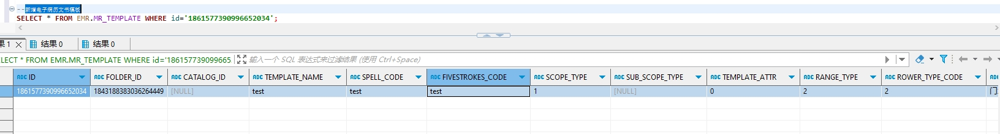

# 领域服务/病历领域 - 新增电子病历文书模板 - 新增电子病历文书模板 正向用例
## 请求参数：
``` json
{
  "orgName": "版本测试环境",
  "hospCode": "NXRY",
  "hospName": "版本测试环境",
  "orgCode": "NXRMYY",
  "list": [
    {
      "deptName": "呼吸内科(门)",
      "createUserId": "225158736540233728",
      "updateKey": 51,
      "signLevel": "0",
      "createUserName": "CS曹建明",
      "signDate": "2024-10-12 09:37:17",
      "signId": "225158736540233728",
      "hospName": "版本测试环境",
      "editType": "0",
      "orgName": "版本测试环境",
      "rangeType": "2",
      "frmName": "门诊病历框架",
      "rowerTypeName": "门急诊病历",
      "updateUserId": "225158736540233728",
      "updateUserName": "CS曹建明",
      "deptId": "81974240563934052160",
      "stdRecordCode": "EMR020001",
      "folderId": "1843188383036264449",
      "maxAgeUnit": "0",
      "isDefault": "N",
      "stdRecordName": "门(急)诊病历",
      "isOpen": "1",
      "templateAttr": "0",
      "signFlag": "1",
      "spellCode": "hxnkmb",
      "updateDate": "2024-10-12 09:37:17",
      "rowerTypeCode": "2",
      "frmId": "1843202402790985730",
      "fivestrokesCode": "KKMTSS",
      "catalogId": "",
      "scopeType": "1",
      "orgCode": "NXRMYY",
      "createDate": "2024-10-12 09:36:53",
      "signName": "CS曹建明",
      "hospCode": "NXRY",
      "isDelete": "N",
      "diagnoseList": [],
      "templateName": "test",
      "minAgeUnit": "0",
      "pullInTemplateId": "1844915108053082114",
      "stdRecordId": "5a7064dd26bd4ac7a3eab64194e7304b"
    }
  ],
  "operatorId": "282475805660160000",
  "operatorName": "CS彭彭彭",
  "operateDate": "2024-10-16 16:19:42"
}
```
## 返回参数：
``` json
{
    "exception": null,
    "apiCode": null,
    "data": [
        {
            "id": "1861577390996652034",
            "sourceId": null
        }
    ],
    "Code": 200,
    "Message": "操作成功"
}
```
## 数据校验：

# 领域服务/病历领域 - 新增电子病历文书模板 - 必填校验-[orgCode]为空
## 请求参数：
``` json
{
  "orgName": "版本测试环境",
  "hospCode": "NXRY",
  "hospName": "版本测试环境",
  "orgCode": "",
  "list": [
    {
      "deptName": "呼吸内科(门)",
      "createUserId": "225158736540233728",
      "updateKey": 51,
      "signLevel": "0",
      "createUserName": "CS曹建明",
      "signDate": "2024-10-12 09:37:17",
      "signId": "225158736540233728",
      "hospName": "版本测试环境",
      "editType": "0",
      "id": "1844915108053082114",
      "orgName": "版本测试环境",
      "rangeType": "2",
      "frmName": "门诊病历框架",
      "rowerTypeName": "门急诊病历",
      "updateUserId": "225158736540233728",
      "updateUserName": "CS曹建明",
      "deptId": "81974240563934052160",
      "stdRecordCode": "EMR020001",
      "folderId": "1843188383036264449",
      "maxAgeUnit": "0",
      "isDefault": "N",
      "stdRecordName": "门(急)诊病历",
      "isOpen": "1",
      "templateAttr": "0",
      "signFlag": "1",
      "spellCode": "hxnkmb",
      "updateDate": "2024-10-12 09:37:17",
      "rowerTypeCode": "2",
      "frmId": "1843202402790985730",
      "fivestrokesCode": "KKMTSS",
      "catalogId": "",
      "scopeType": "1",
      "orgCode": "NXRMYY",
      "createDate": "2024-10-12 09:36:53",
      "signName": "CS曹建明",
      "hospCode": "NXRY",
      "isDelete": "N",
      "diagnoseList": [],
      "templateName": "呼吸内科模板-副本1",
      "minAgeUnit": "0",
      "pullInTemplateId": "1844915108053082114",
      "stdRecordId": "5a7064dd26bd4ac7a3eab64194e7304b"
    }
  ],
  "operatorId": "282475805660160000",
  "operatorName": "CS彭彭彭",
  "operateDate": "2024-10-16 16:19:42"
}
```
## 返回参数：
``` json
{
  "exception": null,
  "apiCode": null,
  "data": null,
  "Code": 1,
  "Message": "机构编码不能为空"
}
```
# 领域服务/病历领域 - 新增电子病历文书模板 - 必填校验-[orgName]为空
## 请求参数：
``` json
{
  "orgName": "",
  "hospCode": "NXRY",
  "hospName": "版本测试环境",
  "orgCode": "NXRMYY",
  "list": [
    {
      "deptName": "呼吸内科(门)",
      "createUserId": "225158736540233728",
      "updateKey": 51,
      "signLevel": "0",
      "createUserName": "CS曹建明",
      "signDate": "2024-10-12 09:37:17",
      "signId": "225158736540233728",
      "hospName": "版本测试环境",
      "editType": "0",
      "id": "1844915108053082114",
      "orgName": "版本测试环境",
      "rangeType": "2",
      "frmName": "门诊病历框架",
      "rowerTypeName": "门急诊病历",
      "updateUserId": "225158736540233728",
      "updateUserName": "CS曹建明",
      "deptId": "81974240563934052160",
      "stdRecordCode": "EMR020001",
      "folderId": "1843188383036264449",
      "maxAgeUnit": "0",
      "isDefault": "N",
      "stdRecordName": "门(急)诊病历",
      "isOpen": "1",
      "templateAttr": "0",
      "signFlag": "1",
      "spellCode": "hxnkmb",
      "updateDate": "2024-10-12 09:37:17",
      "rowerTypeCode": "2",
      "frmId": "1843202402790985730",
      "fivestrokesCode": "KKMTSS",
      "catalogId": "",
      "scopeType": "1",
      "orgCode": "NXRMYY",
      "createDate": "2024-10-12 09:36:53",
      "signName": "CS曹建明",
      "hospCode": "NXRY",
      "isDelete": "N",
      "diagnoseList": [],
      "templateName": "呼吸内科模板-副本1",
      "minAgeUnit": "0",
      "pullInTemplateId": "1844915108053082114",
      "stdRecordId": "5a7064dd26bd4ac7a3eab64194e7304b"
    }
  ],
  "operatorId": "282475805660160000",
  "operatorName": "CS彭彭彭",
  "operateDate": "2024-10-16 16:19:42"
}
```
## 返回参数：
``` json
{
  "exception": null,
  "apiCode": null,
  "data": null,
  "Code": 1,
  "Message": "机构名称不能为空"
}
```
# 领域服务/病历领域 - 新增电子病历文书模板 - 必填校验-[hospCode]为空
## 请求参数：
``` json
{
  "orgName": "版本测试环境",
  "hospCode": "",
  "hospName": "版本测试环境",
  "orgCode": "NXRMYY",
  "list": [
    {
      "deptName": "呼吸内科(门)",
      "createUserId": "225158736540233728",
      "updateKey": 51,
      "signLevel": "0",
      "createUserName": "CS曹建明",
      "signDate": "2024-10-12 09:37:17",
      "signId": "225158736540233728",
      "hospName": "版本测试环境",
      "editType": "0",
      "id": "1844915108053082114",
      "orgName": "版本测试环境",
      "rangeType": "2",
      "frmName": "门诊病历框架",
      "rowerTypeName": "门急诊病历",
      "updateUserId": "225158736540233728",
      "updateUserName": "CS曹建明",
      "deptId": "81974240563934052160",
      "stdRecordCode": "EMR020001",
      "folderId": "1843188383036264449",
      "maxAgeUnit": "0",
      "isDefault": "N",
      "stdRecordName": "门(急)诊病历",
      "isOpen": "1",
      "templateAttr": "0",
      "signFlag": "1",
      "spellCode": "hxnkmb",
      "updateDate": "2024-10-12 09:37:17",
      "rowerTypeCode": "2",
      "frmId": "1843202402790985730",
      "fivestrokesCode": "KKMTSS",
      "catalogId": "",
      "scopeType": "1",
      "orgCode": "NXRMYY",
      "createDate": "2024-10-12 09:36:53",
      "signName": "CS曹建明",
      "hospCode": "NXRY",
      "isDelete": "N",
      "diagnoseList": [],
      "templateName": "呼吸内科模板-副本1",
      "minAgeUnit": "0",
      "pullInTemplateId": "1844915108053082114",
      "stdRecordId": "5a7064dd26bd4ac7a3eab64194e7304b"
    }
  ],
  "operatorId": "282475805660160000",
  "operatorName": "CS彭彭彭",
  "operateDate": "2024-10-16 16:19:42"
}
```
## 返回参数：
``` json
{
  "exception": null,
  "apiCode": null,
  "data": null,
  "Code": 1,
  "Message": "院区编码不能为空"
}
```
# 领域服务/病历领域 - 新增电子病历文书模板 - 必填校验-[hospName]为空
## 请求参数：
``` json
{
  "orgName": "版本测试环境",
  "hospCode": "NXRY",
  "hospName": "",
  "orgCode": "NXRMYY",
  "list": [
    {
      "deptName": "呼吸内科(门)",
      "createUserId": "225158736540233728",
      "updateKey": 51,
      "signLevel": "0",
      "createUserName": "CS曹建明",
      "signDate": "2024-10-12 09:37:17",
      "signId": "225158736540233728",
      "hospName": "版本测试环境",
      "editType": "0",
      "id": "1844915108053082114",
      "orgName": "版本测试环境",
      "rangeType": "2",
      "frmName": "门诊病历框架",
      "rowerTypeName": "门急诊病历",
      "updateUserId": "225158736540233728",
      "updateUserName": "CS曹建明",
      "deptId": "81974240563934052160",
      "stdRecordCode": "EMR020001",
      "folderId": "1843188383036264449",
      "maxAgeUnit": "0",
      "isDefault": "N",
      "stdRecordName": "门(急)诊病历",
      "isOpen": "1",
      "templateAttr": "0",
      "signFlag": "1",
      "spellCode": "hxnkmb",
      "updateDate": "2024-10-12 09:37:17",
      "rowerTypeCode": "2",
      "frmId": "1843202402790985730",
      "fivestrokesCode": "KKMTSS",
      "catalogId": "",
      "scopeType": "1",
      "orgCode": "NXRMYY",
      "createDate": "2024-10-12 09:36:53",
      "signName": "CS曹建明",
      "hospCode": "NXRY",
      "isDelete": "N",
      "diagnoseList": [],
      "templateName": "呼吸内科模板-副本1",
      "minAgeUnit": "0",
      "pullInTemplateId": "1844915108053082114",
      "stdRecordId": "5a7064dd26bd4ac7a3eab64194e7304b"
    }
  ],
  "operatorId": "282475805660160000",
  "operatorName": "CS彭彭彭",
  "operateDate": "2024-10-16 16:19:42"
}
```
## 返回参数：
``` json
{
  "exception": null,
  "apiCode": null,
  "data": null,
  "Code": 1,
  "Message": "院区名称不能为空"
}
```
# 领域服务/病历领域 - 新增电子病历文书模板 - 必填校验-[operatorId]为空
## 请求参数：
``` json
{
  "orgName": "版本测试环境",
  "hospCode": "NXRY",
  "hospName": "版本测试环境",
  "orgCode": "NXRMYY",
  "list": [
    {
      "deptName": "呼吸内科(门)",
      "createUserId": "225158736540233728",
      "updateKey": 51,
      "signLevel": "0",
      "createUserName": "CS曹建明",
      "signDate": "2024-10-12 09:37:17",
      "signId": "225158736540233728",
      "hospName": "版本测试环境",
      "editType": "0",
      "id": "1844915108053082114",
      "orgName": "版本测试环境",
      "rangeType": "2",
      "frmName": "门诊病历框架",
      "rowerTypeName": "门急诊病历",
      "updateUserId": "225158736540233728",
      "updateUserName": "CS曹建明",
      "deptId": "81974240563934052160",
      "stdRecordCode": "EMR020001",
      "folderId": "1843188383036264449",
      "maxAgeUnit": "0",
      "isDefault": "N",
      "stdRecordName": "门(急)诊病历",
      "isOpen": "1",
      "templateAttr": "0",
      "signFlag": "1",
      "spellCode": "hxnkmb",
      "updateDate": "2024-10-12 09:37:17",
      "rowerTypeCode": "2",
      "frmId": "1843202402790985730",
      "fivestrokesCode": "KKMTSS",
      "catalogId": "",
      "scopeType": "1",
      "orgCode": "NXRMYY",
      "createDate": "2024-10-12 09:36:53",
      "signName": "CS曹建明",
      "hospCode": "NXRY",
      "isDelete": "N",
      "diagnoseList": [],
      "templateName": "呼吸内科模板-副本1",
      "minAgeUnit": "0",
      "pullInTemplateId": "1844915108053082114",
      "stdRecordId": "5a7064dd26bd4ac7a3eab64194e7304b"
    }
  ],
  "operatorId": "",
  "operatorName": "CS彭彭彭",
  "operateDate": "2024-10-16 16:19:42"
}
```
## 返回参数：
``` json
{
  "exception": null,
  "apiCode": null,
  "data": null,
  "Code": 1,
  "Message": "操作人id不能为空"
}
```
# 领域服务/病历领域 - 新增电子病历文书模板 - 必填校验-[operatorName]为空
## 请求参数：
``` json
{
  "orgName": "版本测试环境",
  "hospCode": "NXRY",
  "hospName": "版本测试环境",
  "orgCode": "NXRMYY",
  "list": [
    {
      "deptName": "呼吸内科(门)",
      "createUserId": "225158736540233728",
      "updateKey": 51,
      "signLevel": "0",
      "createUserName": "CS曹建明",
      "signDate": "2024-10-12 09:37:17",
      "signId": "225158736540233728",
      "hospName": "版本测试环境",
      "editType": "0",
      "id": "1844915108053082114",
      "orgName": "版本测试环境",
      "rangeType": "2",
      "frmName": "门诊病历框架",
      "rowerTypeName": "门急诊病历",
      "updateUserId": "225158736540233728",
      "updateUserName": "CS曹建明",
      "deptId": "81974240563934052160",
      "stdRecordCode": "EMR020001",
      "folderId": "1843188383036264449",
      "maxAgeUnit": "0",
      "isDefault": "N",
      "stdRecordName": "门(急)诊病历",
      "isOpen": "1",
      "templateAttr": "0",
      "signFlag": "1",
      "spellCode": "hxnkmb",
      "updateDate": "2024-10-12 09:37:17",
      "rowerTypeCode": "2",
      "frmId": "1843202402790985730",
      "fivestrokesCode": "KKMTSS",
      "catalogId": "",
      "scopeType": "1",
      "orgCode": "NXRMYY",
      "createDate": "2024-10-12 09:36:53",
      "signName": "CS曹建明",
      "hospCode": "NXRY",
      "isDelete": "N",
      "diagnoseList": [],
      "templateName": "呼吸内科模板-副本1",
      "minAgeUnit": "0",
      "pullInTemplateId": "1844915108053082114",
      "stdRecordId": "5a7064dd26bd4ac7a3eab64194e7304b"
    }
  ],
  "operatorId": "282475805660160000",
  "operatorName": "",
  "operateDate": "2024-10-16 16:19:42"
}
```
## 返回参数：
``` json
{
  "exception": null,
  "apiCode": null,
  "data": null,
  "Code": 1,
  "Message": "操作人姓名不能为空"
}
```
# 领域服务/病历领域 - 新增电子病历文书模板 - 必填校验-[operateDate]为空
## 请求参数：
``` json
{
  "orgName": "版本测试环境",
  "hospCode": "NXRY",
  "hospName": "版本测试环境",
  "orgCode": "NXRMYY",
  "list": [
    {
      "deptName": "呼吸内科(门)",
      "createUserId": "225158736540233728",
      "updateKey": 51,
      "signLevel": "0",
      "createUserName": "CS曹建明",
      "signDate": "2024-10-12 09:37:17",
      "signId": "225158736540233728",
      "hospName": "版本测试环境",
      "editType": "0",
      "id": "1844915108053082114",
      "orgName": "版本测试环境",
      "rangeType": "2",
      "frmName": "门诊病历框架",
      "rowerTypeName": "门急诊病历",
      "updateUserId": "225158736540233728",
      "updateUserName": "CS曹建明",
      "deptId": "81974240563934052160",
      "stdRecordCode": "EMR020001",
      "folderId": "1843188383036264449",
      "maxAgeUnit": "0",
      "isDefault": "N",
      "stdRecordName": "门(急)诊病历",
      "isOpen": "1",
      "templateAttr": "0",
      "signFlag": "1",
      "spellCode": "hxnkmb",
      "updateDate": "2024-10-12 09:37:17",
      "rowerTypeCode": "2",
      "frmId": "1843202402790985730",
      "fivestrokesCode": "KKMTSS",
      "catalogId": "",
      "scopeType": "1",
      "orgCode": "NXRMYY",
      "createDate": "2024-10-12 09:36:53",
      "signName": "CS曹建明",
      "hospCode": "NXRY",
      "isDelete": "N",
      "diagnoseList": [],
      "templateName": "呼吸内科模板-副本1",
      "minAgeUnit": "0",
      "pullInTemplateId": "1844915108053082114",
      "stdRecordId": "5a7064dd26bd4ac7a3eab64194e7304b"
    }
  ],
  "operatorId": "282475805660160000",
  "operatorName": "CS彭彭彭",
  "operateDate": ""
}
```
## 返回参数：
``` json
{
  "exception": null,
  "apiCode": null,
  "data": null,
  "Code": 1,
  "Message": "操作时间不能为空"
}
```
# 领域服务/病历领域 - 新增电子病历文书模板 - 必填校验-[list]为空
## 请求参数：
``` json
{
  "orgName": "版本测试环境",
  "hospCode": "NXRY",
  "hospName": "版本测试环境",
  "orgCode": "NXRMYY",
  "list": null,
  "operatorId": "282475805660160000",
  "operatorName": "CS彭彭彭",
  "operateDate": "2024-10-16 16:19:42"
}
```
## 返回参数：
``` json
{
  "exception": null,
  "apiCode": null,
  "data": null,
  "Code": 1,
  "Message": "电子病历文书模板集合不能为空"
}
```
# 领域服务/病历领域 - 新增电子病历文书模板 - 必填校验-[list.folderId]为空
## 请求参数：
``` json
{
  "orgName": "版本测试环境",
  "hospCode": "NXRY",
  "hospName": "版本测试环境",
  "orgCode": "NXRMYY",
  "list": [
    {
      "deptName": "呼吸内科(门)",
      "createUserId": "225158736540233728",
      "updateKey": 51,
      "signLevel": "0",
      "createUserName": "CS曹建明",
      "signDate": "2024-10-12 09:37:17",
      "signId": "225158736540233728",
      "hospName": "版本测试环境",
      "editType": "0",
      "id": "1844915108053082114",
      "orgName": "版本测试环境",
      "rangeType": "2",
      "frmName": "门诊病历框架",
      "rowerTypeName": "门急诊病历",
      "updateUserId": "225158736540233728",
      "updateUserName": "CS曹建明",
      "deptId": "81974240563934052160",
      "stdRecordCode": "EMR020001",
      "folderId": null,
      "maxAgeUnit": "0",
      "isDefault": "N",
      "stdRecordName": "门(急)诊病历",
      "isOpen": "1",
      "templateAttr": "0",
      "signFlag": "1",
      "spellCode": "hxnkmb",
      "updateDate": "2024-10-12 09:37:17",
      "rowerTypeCode": "2",
      "frmId": "1843202402790985730",
      "fivestrokesCode": "KKMTSS",
      "catalogId": "",
      "scopeType": "1",
      "orgCode": "NXRMYY",
      "createDate": "2024-10-12 09:36:53",
      "signName": "CS曹建明",
      "hospCode": "NXRY",
      "isDelete": "N",
      "diagnoseList": [],
      "templateName": "呼吸内科模板-副本1",
      "minAgeUnit": "0",
      "pullInTemplateId": "1844915108053082114",
      "stdRecordId": "5a7064dd26bd4ac7a3eab64194e7304b"
    }
  ],
  "operatorId": "282475805660160000",
  "operatorName": "CS彭彭彭",
  "operateDate": "2024-10-16 16:19:42"
}
```
## 返回参数：
``` json
{
  "exception": null,
  "apiCode": null,
  "data": null,
  "Code": 1,
  "Message": "标准配置文件夹id不能为空"
}
```
# 领域服务/病历领域 - 新增电子病历文书模板 - 必填校验-[list.templateName]为空
## 请求参数：
``` json
{
  "orgName": "版本测试环境",
  "hospCode": "NXRY",
  "hospName": "版本测试环境",
  "orgCode": "NXRMYY",
  "list": [
    {
      "deptName": "呼吸内科(门)",
      "createUserId": "225158736540233728",
      "updateKey": 51,
      "signLevel": "0",
      "createUserName": "CS曹建明",
      "signDate": "2024-10-12 09:37:17",
      "signId": "225158736540233728",
      "hospName": "版本测试环境",
      "editType": "0",
      "id": "1844915108053082114",
      "orgName": "版本测试环境",
      "rangeType": "2",
      "frmName": "门诊病历框架",
      "rowerTypeName": "门急诊病历",
      "updateUserId": "225158736540233728",
      "updateUserName": "CS曹建明",
      "deptId": "81974240563934052160",
      "stdRecordCode": "EMR020001",
      "folderId": "1843188383036264449",
      "maxAgeUnit": "0",
      "isDefault": "N",
      "stdRecordName": "门(急)诊病历",
      "isOpen": "1",
      "templateAttr": "0",
      "signFlag": "1",
      "spellCode": "hxnkmb",
      "updateDate": "2024-10-12 09:37:17",
      "rowerTypeCode": "2",
      "frmId": "1843202402790985730",
      "fivestrokesCode": "KKMTSS",
      "catalogId": "",
      "scopeType": "1",
      "orgCode": "NXRMYY",
      "createDate": "2024-10-12 09:36:53",
      "signName": "CS曹建明",
      "hospCode": "NXRY",
      "isDelete": "N",
      "diagnoseList": [],
      "templateName": null,
      "minAgeUnit": "0",
      "pullInTemplateId": "1844915108053082114",
      "stdRecordId": "5a7064dd26bd4ac7a3eab64194e7304b"
    }
  ],
  "operatorId": "282475805660160000",
  "operatorName": "CS彭彭彭",
  "operateDate": "2024-10-16 16:19:42"
}
```
## 返回参数：
``` json
{
  "exception": null,
  "apiCode": null,
  "data": null,
  "Code": 1,
  "Message": "电子病历文书模板名称不能为空"
}
```
# 领域服务/病历领域 - 新增电子病历文书模板 - 必填校验-[list.scopeType]为空
## 请求参数：
``` json
{
  "orgName": "版本测试环境",
  "hospCode": "NXRY",
  "hospName": "版本测试环境",
  "orgCode": "NXRMYY",
  "list": [
    {
      "deptName": "呼吸内科(门)",
      "createUserId": "225158736540233728",
      "updateKey": 51,
      "signLevel": "0",
      "createUserName": "CS曹建明",
      "signDate": "2024-10-12 09:37:17",
      "signId": "225158736540233728",
      "hospName": "版本测试环境",
      "editType": "0",
      "id": "1844915108053082114",
      "orgName": "版本测试环境",
      "rangeType": "2",
      "frmName": "门诊病历框架",
      "rowerTypeName": "门急诊病历",
      "updateUserId": "225158736540233728",
      "updateUserName": "CS曹建明",
      "deptId": "81974240563934052160",
      "stdRecordCode": "EMR020001",
      "folderId": "1843188383036264449",
      "maxAgeUnit": "0",
      "isDefault": "N",
      "stdRecordName": "门(急)诊病历",
      "isOpen": "1",
      "templateAttr": "0",
      "signFlag": "1",
      "spellCode": "hxnkmb",
      "updateDate": "2024-10-12 09:37:17",
      "rowerTypeCode": "2",
      "frmId": "1843202402790985730",
      "fivestrokesCode": "KKMTSS",
      "catalogId": "",
      "scopeType": null,
      "orgCode": "NXRMYY",
      "createDate": "2024-10-12 09:36:53",
      "signName": "CS曹建明",
      "hospCode": "NXRY",
      "isDelete": "N",
      "diagnoseList": [],
      "templateName": "呼吸内科模板-副本1",
      "minAgeUnit": "0",
      "pullInTemplateId": "1844915108053082114",
      "stdRecordId": "5a7064dd26bd4ac7a3eab64194e7304b"
    }
  ],
  "operatorId": "282475805660160000",
  "operatorName": "CS彭彭彭",
  "operateDate": "2024-10-16 16:19:42"
}
```
## 返回参数：
``` json
{
  "exception": null,
  "apiCode": null,
  "data": null,
  "Code": 1,
  "Message": "所属应用域不能为空"
}
```
# 领域服务/病历领域 - 新增电子病历文书模板 - 必填校验-[list.templateAttr]为空
## 请求参数：
``` json
{
  "orgName": "版本测试环境",
  "hospCode": "NXRY",
  "hospName": "版本测试环境",
  "orgCode": "NXRMYY",
  "list": [
    {
      "deptName": "呼吸内科(门)",
      "createUserId": "225158736540233728",
      "updateKey": 51,
      "signLevel": "0",
      "createUserName": "CS曹建明",
      "signDate": "2024-10-12 09:37:17",
      "signId": "225158736540233728",
      "hospName": "版本测试环境",
      "editType": "0",
      "id": "1844915108053082114",
      "orgName": "版本测试环境",
      "rangeType": "2",
      "frmName": "门诊病历框架",
      "rowerTypeName": "门急诊病历",
      "updateUserId": "225158736540233728",
      "updateUserName": "CS曹建明",
      "deptId": "81974240563934052160",
      "stdRecordCode": "EMR020001",
      "folderId": "1843188383036264449",
      "maxAgeUnit": "0",
      "isDefault": "N",
      "stdRecordName": "门(急)诊病历",
      "isOpen": "1",
      "templateAttr": null,
      "signFlag": "1",
      "spellCode": "hxnkmb",
      "updateDate": "2024-10-12 09:37:17",
      "rowerTypeCode": "2",
      "frmId": "1843202402790985730",
      "fivestrokesCode": "KKMTSS",
      "catalogId": "",
      "scopeType": "1",
      "orgCode": "NXRMYY",
      "createDate": "2024-10-12 09:36:53",
      "signName": "CS曹建明",
      "hospCode": "NXRY",
      "isDelete": "N",
      "diagnoseList": [],
      "templateName": "呼吸内科模板-副本1",
      "minAgeUnit": "0",
      "pullInTemplateId": "1844915108053082114",
      "stdRecordId": "5a7064dd26bd4ac7a3eab64194e7304b"
    }
  ],
  "operatorId": "282475805660160000",
  "operatorName": "CS彭彭彭",
  "operateDate": "2024-10-16 16:19:42"
}
```
## 返回参数：
``` json
{
  "exception": null,
  "apiCode": null,
  "data": null,
  "Code": 1,
  "Message": "电子病历模板特性不能为空"
}
```
# 领域服务/病历领域 - 新增电子病历文书模板 - 必填校验-[list.rangeType]为空
## 请求参数：
``` json
{
  "orgName": "版本测试环境",
  "hospCode": "NXRY",
  "hospName": "版本测试环境",
  "orgCode": "NXRMYY",
  "list": [
    {
      "deptName": "呼吸内科(门)",
      "createUserId": "225158736540233728",
      "updateKey": 51,
      "signLevel": "0",
      "createUserName": "CS曹建明",
      "signDate": "2024-10-12 09:37:17",
      "signId": "225158736540233728",
      "hospName": "版本测试环境",
      "editType": "0",
      "id": "1844915108053082114",
      "orgName": "版本测试环境",
      "rangeType": null,
      "frmName": "门诊病历框架",
      "rowerTypeName": "门急诊病历",
      "updateUserId": "225158736540233728",
      "updateUserName": "CS曹建明",
      "deptId": "81974240563934052160",
      "stdRecordCode": "EMR020001",
      "folderId": "1843188383036264449",
      "maxAgeUnit": "0",
      "isDefault": "N",
      "stdRecordName": "门(急)诊病历",
      "isOpen": "1",
      "templateAttr": "0",
      "signFlag": "1",
      "spellCode": "hxnkmb",
      "updateDate": "2024-10-12 09:37:17",
      "rowerTypeCode": "2",
      "frmId": "1843202402790985730",
      "fivestrokesCode": "KKMTSS",
      "catalogId": "",
      "scopeType": "1",
      "orgCode": "NXRMYY",
      "createDate": "2024-10-12 09:36:53",
      "signName": "CS曹建明",
      "hospCode": "NXRY",
      "isDelete": "N",
      "diagnoseList": [],
      "templateName": "呼吸内科模板-副本1",
      "minAgeUnit": "0",
      "pullInTemplateId": "1844915108053082114",
      "stdRecordId": "5a7064dd26bd4ac7a3eab64194e7304b"
    }
  ],
  "operatorId": "282475805660160000",
  "operatorName": "CS彭彭彭",
  "operateDate": "2024-10-16 16:19:42"
}
```
## 返回参数：
``` json
{
  "exception": null,
  "apiCode": null,
  "data": null,
  "Code": 1,
  "Message": "模板所属范围类型不能为空"
}
```
# 领域服务/病历领域 - 新增电子病历文书模板 - 必填校验-[list.signFlag]为空
## 请求参数：
``` json
{
  "orgName": "版本测试环境",
  "hospCode": "NXRY",
  "hospName": "版本测试环境",
  "orgCode": "NXRMYY",
  "list": [
    {
      "deptName": "呼吸内科(门)",
      "createUserId": "225158736540233728",
      "updateKey": 51,
      "signLevel": "0",
      "createUserName": "CS曹建明",
      "signDate": "2024-10-12 09:37:17",
      "signId": "225158736540233728",
      "hospName": "版本测试环境",
      "editType": "0",
      "id": "1844915108053082114",
      "orgName": "版本测试环境",
      "rangeType": "2",
      "frmName": "门诊病历框架",
      "rowerTypeName": "门急诊病历",
      "updateUserId": "225158736540233728",
      "updateUserName": "CS曹建明",
      "deptId": "81974240563934052160",
      "stdRecordCode": "EMR020001",
      "folderId": "1843188383036264449",
      "maxAgeUnit": "0",
      "isDefault": "N",
      "stdRecordName": "门(急)诊病历",
      "isOpen": "1",
      "templateAttr": "0",
      "signFlag": null,
      "spellCode": "hxnkmb",
      "updateDate": "2024-10-12 09:37:17",
      "rowerTypeCode": "2",
      "frmId": "1843202402790985730",
      "fivestrokesCode": "KKMTSS",
      "catalogId": "",
      "scopeType": "1",
      "orgCode": "NXRMYY",
      "createDate": "2024-10-12 09:36:53",
      "signName": "CS曹建明",
      "hospCode": "NXRY",
      "isDelete": "N",
      "diagnoseList": [],
      "templateName": "呼吸内科模板-副本1",
      "minAgeUnit": "0",
      "pullInTemplateId": "1844915108053082114",
      "stdRecordId": "5a7064dd26bd4ac7a3eab64194e7304b"
    }
  ],
  "operatorId": "282475805660160000",
  "operatorName": "CS彭彭彭",
  "operateDate": "2024-10-16 16:19:42"
}
```
## 返回参数：
``` json
{
  "exception": null,
  "apiCode": null,
  "data": null,
  "Code": 1,
  "Message": "审签标识不能为空"
}
```
# 领域服务/病历领域 - 新增电子病历文书模板 - 必填校验-[list.isOpen]为空
## 请求参数：
``` json
{
  "orgName": "版本测试环境",
  "hospCode": "NXRY",
  "hospName": "版本测试环境",
  "orgCode": "NXRMYY",
  "list": [
    {
      "deptName": "呼吸内科(门)",
      "createUserId": "225158736540233728",
      "updateKey": 51,
      "signLevel": "0",
      "createUserName": "CS曹建明",
      "signDate": "2024-10-12 09:37:17",
      "signId": "225158736540233728",
      "hospName": "版本测试环境",
      "editType": "0",
      "id": "1844915108053082114",
      "orgName": "版本测试环境",
      "rangeType": "2",
      "frmName": "门诊病历框架",
      "rowerTypeName": "门急诊病历",
      "updateUserId": "225158736540233728",
      "updateUserName": "CS曹建明",
      "deptId": "81974240563934052160",
      "stdRecordCode": "EMR020001",
      "folderId": "1843188383036264449",
      "maxAgeUnit": "0",
      "isDefault": "N",
      "stdRecordName": "门(急)诊病历",
      "isOpen": null,
      "templateAttr": "0",
      "signFlag": "1",
      "spellCode": "hxnkmb",
      "updateDate": "2024-10-12 09:37:17",
      "rowerTypeCode": "2",
      "frmId": "1843202402790985730",
      "fivestrokesCode": "KKMTSS",
      "catalogId": "",
      "scopeType": "1",
      "orgCode": "NXRMYY",
      "createDate": "2024-10-12 09:36:53",
      "signName": "CS曹建明",
      "hospCode": "NXRY",
      "isDelete": "N",
      "diagnoseList": [],
      "templateName": "呼吸内科模板-副本1",
      "minAgeUnit": "0",
      "pullInTemplateId": "1844915108053082114",
      "stdRecordId": "5a7064dd26bd4ac7a3eab64194e7304b"
    }
  ],
  "operatorId": "282475805660160000",
  "operatorName": "CS彭彭彭",
  "operateDate": "2024-10-16 16:19:42"
}
```
## 返回参数：
``` json
{
  "exception": null,
  "apiCode": null,
  "data": null,
  "Code": 1,
  "Message": "是否启用不能为空"
}
```
# 领域服务/病历领域 - 新增电子病历文书模板 - 必填校验-[list.frmId]为空
## 请求参数：
``` json
{
  "orgName": "版本测试环境",
  "hospCode": "NXRY",
  "hospName": "版本测试环境",
  "orgCode": "NXRMYY",
  "list": [
    {
      "deptName": "呼吸内科(门)",
      "createUserId": "225158736540233728",
      "updateKey": 51,
      "signLevel": "0",
      "createUserName": "CS曹建明",
      "signDate": "2024-10-12 09:37:17",
      "signId": "225158736540233728",
      "hospName": "版本测试环境",
      "editType": "0",
      "id": "1844915108053082114",
      "orgName": "版本测试环境",
      "rangeType": "2",
      "frmName": "门诊病历框架",
      "rowerTypeName": "门急诊病历",
      "updateUserId": "225158736540233728",
      "updateUserName": "CS曹建明",
      "deptId": "81974240563934052160",
      "stdRecordCode": "EMR020001",
      "folderId": "1843188383036264449",
      "maxAgeUnit": "0",
      "isDefault": "N",
      "stdRecordName": "门(急)诊病历",
      "isOpen": "1",
      "templateAttr": "0",
      "signFlag": "1",
      "spellCode": "hxnkmb",
      "updateDate": "2024-10-12 09:37:17",
      "rowerTypeCode": "2",
      "frmId": null,
      "fivestrokesCode": "KKMTSS",
      "catalogId": "",
      "scopeType": "1",
      "orgCode": "NXRMYY",
      "createDate": "2024-10-12 09:36:53",
      "signName": "CS曹建明",
      "hospCode": "NXRY",
      "isDelete": "N",
      "diagnoseList": [],
      "templateName": "呼吸内科模板-副本1",
      "minAgeUnit": "0",
      "pullInTemplateId": "1844915108053082114",
      "stdRecordId": "5a7064dd26bd4ac7a3eab64194e7304b"
    }
  ],
  "operatorId": "282475805660160000",
  "operatorName": "CS彭彭彭",
  "operateDate": "2024-10-16 16:19:42"
}
```
## 返回参数：
``` json
{
  "exception": null,
  "apiCode": null,
  "data": null,
  "Code": 1,
  "Message": "关联框架模板ID不能为空"
}
```
# 领域服务/病历领域 - 新增电子病历文书模板 - 必填校验-[list.frmName]为空
## 请求参数：
``` json
{
  "orgName": "版本测试环境",
  "hospCode": "NXRY",
  "hospName": "版本测试环境",
  "orgCode": "NXRMYY",
  "list": [
    {
      "deptName": "呼吸内科(门)",
      "createUserId": "225158736540233728",
      "updateKey": 51,
      "signLevel": "0",
      "createUserName": "CS曹建明",
      "signDate": "2024-10-12 09:37:17",
      "signId": "225158736540233728",
      "hospName": "版本测试环境",
      "editType": "0",
      "id": "1844915108053082114",
      "orgName": "版本测试环境",
      "rangeType": "2",
      "frmName": null,
      "rowerTypeName": "门急诊病历",
      "updateUserId": "225158736540233728",
      "updateUserName": "CS曹建明",
      "deptId": "81974240563934052160",
      "stdRecordCode": "EMR020001",
      "folderId": "1843188383036264449",
      "maxAgeUnit": "0",
      "isDefault": "N",
      "stdRecordName": "门(急)诊病历",
      "isOpen": "1",
      "templateAttr": "0",
      "signFlag": "1",
      "spellCode": "hxnkmb",
      "updateDate": "2024-10-12 09:37:17",
      "rowerTypeCode": "2",
      "frmId": "1843202402790985730",
      "fivestrokesCode": "KKMTSS",
      "catalogId": "",
      "scopeType": "1",
      "orgCode": "NXRMYY",
      "createDate": "2024-10-12 09:36:53",
      "signName": "CS曹建明",
      "hospCode": "NXRY",
      "isDelete": "N",
      "diagnoseList": [],
      "templateName": "呼吸内科模板-副本1",
      "minAgeUnit": "0",
      "pullInTemplateId": "1844915108053082114",
      "stdRecordId": "5a7064dd26bd4ac7a3eab64194e7304b"
    }
  ],
  "operatorId": "282475805660160000",
  "operatorName": "CS彭彭彭",
  "operateDate": "2024-10-16 16:19:42"
}
```
## 返回参数：
``` json
{
  "exception": null,
  "apiCode": null,
  "data": null,
  "Code": 1,
  "Message": "框架模板名称不能为空"
}
```
# 领域服务/病历领域 - 新增电子病历文书模板 - 必填校验-[list.editType]为空
## 请求参数：
``` json
{
  "orgName": "版本测试环境",
  "hospCode": "NXRY",
  "hospName": "版本测试环境",
  "orgCode": "NXRMYY",
  "list": [
    {
      "deptName": "呼吸内科(门)",
      "createUserId": "225158736540233728",
      "updateKey": 51,
      "signLevel": "0",
      "createUserName": "CS曹建明",
      "signDate": "2024-10-12 09:37:17",
      "signId": "225158736540233728",
      "hospName": "版本测试环境",
      "editType": null,
      "id": "1844915108053082114",
      "orgName": "版本测试环境",
      "rangeType": "2",
      "frmName": "门诊病历框架",
      "rowerTypeName": "门急诊病历",
      "updateUserId": "225158736540233728",
      "updateUserName": "CS曹建明",
      "deptId": "81974240563934052160",
      "stdRecordCode": "EMR020001",
      "folderId": "1843188383036264449",
      "maxAgeUnit": "0",
      "isDefault": "N",
      "stdRecordName": "门(急)诊病历",
      "isOpen": "1",
      "templateAttr": "0",
      "signFlag": "1",
      "spellCode": "hxnkmb",
      "updateDate": "2024-10-12 09:37:17",
      "rowerTypeCode": "2",
      "frmId": "1843202402790985730",
      "fivestrokesCode": "KKMTSS",
      "catalogId": "",
      "scopeType": "1",
      "orgCode": "NXRMYY",
      "createDate": "2024-10-12 09:36:53",
      "signName": "CS曹建明",
      "hospCode": "NXRY",
      "isDelete": "N",
      "diagnoseList": [],
      "templateName": "呼吸内科模板-副本1",
      "minAgeUnit": "0",
      "pullInTemplateId": "1844915108053082114",
      "stdRecordId": "5a7064dd26bd4ac7a3eab64194e7304b"
    }
  ],
  "operatorId": "282475805660160000",
  "operatorName": "CS彭彭彭",
  "operateDate": "2024-10-16 16:19:42"
}
```
## 返回参数：
``` json
{
  "exception": null,
  "apiCode": null,
  "data": null,
  "Code": 1,
  "Message": "编辑类型不能为空"
}
```
# 领域服务/病历领域 - 新增电子病历文书模板 - 必填校验-[list.stdRecordId]为空
## 请求参数：
``` json
{
  "orgName": "版本测试环境",
  "hospCode": "NXRY",
  "hospName": "版本测试环境",
  "orgCode": "NXRMYY",
  "list": [
    {
      "deptName": "呼吸内科(门)",
      "createUserId": "225158736540233728",
      "updateKey": 51,
      "signLevel": "0",
      "createUserName": "CS曹建明",
      "signDate": "2024-10-12 09:37:17",
      "signId": "225158736540233728",
      "hospName": "版本测试环境",
      "editType": "0",
      "id": "1844915108053082114",
      "orgName": "版本测试环境",
      "rangeType": "2",
      "frmName": "门诊病历框架",
      "rowerTypeName": "门急诊病历",
      "updateUserId": "225158736540233728",
      "updateUserName": "CS曹建明",
      "deptId": "81974240563934052160",
      "stdRecordCode": "EMR020001",
      "folderId": "1843188383036264449",
      "maxAgeUnit": "0",
      "isDefault": "N",
      "stdRecordName": "门(急)诊病历",
      "isOpen": "1",
      "templateAttr": "0",
      "signFlag": "1",
      "spellCode": "hxnkmb",
      "updateDate": "2024-10-12 09:37:17",
      "rowerTypeCode": "2",
      "frmId": "1843202402790985730",
      "fivestrokesCode": "KKMTSS",
      "catalogId": "",
      "scopeType": "1",
      "orgCode": "NXRMYY",
      "createDate": "2024-10-12 09:36:53",
      "signName": "CS曹建明",
      "hospCode": "NXRY",
      "isDelete": "N",
      "diagnoseList": [],
      "templateName": "呼吸内科模板-副本1",
      "minAgeUnit": "0",
      "pullInTemplateId": "1844915108053082114",
      "stdRecordId": null
    }
  ],
  "operatorId": "282475805660160000",
  "operatorName": "CS彭彭彭",
  "operateDate": "2024-10-16 16:19:42"
}
```
## 返回参数：
``` json
{
  "exception": null,
  "apiCode": null,
  "data": null,
  "Code": 1,
  "Message": "关联业务活动记录ID不能为空"
}
```
# 领域服务/病历领域 - 新增电子病历文书模板 - 必填校验-[list.stdRecordCode]为空
## 请求参数：
``` json
{
  "orgName": "版本测试环境",
  "hospCode": "NXRY",
  "hospName": "版本测试环境",
  "orgCode": "NXRMYY",
  "list": [
    {
      "deptName": "呼吸内科(门)",
      "createUserId": "225158736540233728",
      "updateKey": 51,
      "signLevel": "0",
      "createUserName": "CS曹建明",
      "signDate": "2024-10-12 09:37:17",
      "signId": "225158736540233728",
      "hospName": "版本测试环境",
      "editType": "0",
      "id": "1844915108053082114",
      "orgName": "版本测试环境",
      "rangeType": "2",
      "frmName": "门诊病历框架",
      "rowerTypeName": "门急诊病历",
      "updateUserId": "225158736540233728",
      "updateUserName": "CS曹建明",
      "deptId": "81974240563934052160",
      "stdRecordCode": null,
      "folderId": "1843188383036264449",
      "maxAgeUnit": "0",
      "isDefault": "N",
      "stdRecordName": "门(急)诊病历",
      "isOpen": "1",
      "templateAttr": "0",
      "signFlag": "1",
      "spellCode": "hxnkmb",
      "updateDate": "2024-10-12 09:37:17",
      "rowerTypeCode": "2",
      "frmId": "1843202402790985730",
      "fivestrokesCode": "KKMTSS",
      "catalogId": "",
      "scopeType": "1",
      "orgCode": "NXRMYY",
      "createDate": "2024-10-12 09:36:53",
      "signName": "CS曹建明",
      "hospCode": "NXRY",
      "isDelete": "N",
      "diagnoseList": [],
      "templateName": "呼吸内科模板-副本1",
      "minAgeUnit": "0",
      "pullInTemplateId": "1844915108053082114",
      "stdRecordId": "5a7064dd26bd4ac7a3eab64194e7304b"
    }
  ],
  "operatorId": "282475805660160000",
  "operatorName": "CS彭彭彭",
  "operateDate": "2024-10-16 16:19:42"
}
```
## 返回参数：
``` json
{
  "exception": null,
  "apiCode": null,
  "data": null,
  "Code": 1,
  "Message": "关联业务活动记录标准码不能为空"
}
```
# 领域服务/病历领域 - 新增电子病历文书模板 - 必填校验-[list.stdRecordName]为空
## 请求参数：
``` json
{
  "orgName": "版本测试环境",
  "hospCode": "NXRY",
  "hospName": "版本测试环境",
  "orgCode": "NXRMYY",
  "list": [
    {
      "deptName": "呼吸内科(门)",
      "createUserId": "225158736540233728",
      "updateKey": 51,
      "signLevel": "0",
      "createUserName": "CS曹建明",
      "signDate": "2024-10-12 09:37:17",
      "signId": "225158736540233728",
      "hospName": "版本测试环境",
      "editType": "0",
      "id": "1844915108053082114",
      "orgName": "版本测试环境",
      "rangeType": "2",
      "frmName": "门诊病历框架",
      "rowerTypeName": "门急诊病历",
      "updateUserId": "225158736540233728",
      "updateUserName": "CS曹建明",
      "deptId": "81974240563934052160",
      "stdRecordCode": "EMR020001",
      "folderId": "1843188383036264449",
      "maxAgeUnit": "0",
      "isDefault": "N",
      "stdRecordName": null,
      "isOpen": "1",
      "templateAttr": "0",
      "signFlag": "1",
      "spellCode": "hxnkmb",
      "updateDate": "2024-10-12 09:37:17",
      "rowerTypeCode": "2",
      "frmId": "1843202402790985730",
      "fivestrokesCode": "KKMTSS",
      "catalogId": "",
      "scopeType": "1",
      "orgCode": "NXRMYY",
      "createDate": "2024-10-12 09:36:53",
      "signName": "CS曹建明",
      "hospCode": "NXRY",
      "isDelete": "N",
      "diagnoseList": [],
      "templateName": "呼吸内科模板-副本1",
      "minAgeUnit": "0",
      "pullInTemplateId": "1844915108053082114",
      "stdRecordId": "5a7064dd26bd4ac7a3eab64194e7304b"
    }
  ],
  "operatorId": "282475805660160000",
  "operatorName": "CS彭彭彭",
  "operateDate": "2024-10-16 16:19:42"
}
```
## 返回参数：
``` json
{
  "exception": null,
  "apiCode": null,
  "data": null,
  "Code": 1,
  "Message": "关联业务活动记录标准名称不能为空"
}
```
# 领域服务/病历领域 - 新增电子病历文书模板 - 必填校验-[list.isDefault]为空
## 请求参数：
``` json
{
  "orgName": "版本测试环境",
  "hospCode": "NXRY",
  "hospName": "版本测试环境",
  "orgCode": "NXRMYY",
  "list": [
    {
      "deptName": "呼吸内科(门)",
      "createUserId": "225158736540233728",
      "updateKey": 51,
      "signLevel": "0",
      "createUserName": "CS曹建明",
      "signDate": "2024-10-12 09:37:17",
      "signId": "225158736540233728",
      "hospName": "版本测试环境",
      "editType": "0",
      "id": "1844915108053082114",
      "orgName": "版本测试环境",
      "rangeType": "2",
      "frmName": "门诊病历框架",
      "rowerTypeName": "门急诊病历",
      "updateUserId": "225158736540233728",
      "updateUserName": "CS曹建明",
      "deptId": "81974240563934052160",
      "stdRecordCode": "EMR020001",
      "folderId": "1843188383036264449",
      "maxAgeUnit": "0",
      "isDefault": null,
      "stdRecordName": "门(急)诊病历",
      "isOpen": "1",
      "templateAttr": "0",
      "signFlag": "1",
      "spellCode": "hxnkmb",
      "updateDate": "2024-10-12 09:37:17",
      "rowerTypeCode": "2",
      "frmId": "1843202402790985730",
      "fivestrokesCode": "KKMTSS",
      "catalogId": "",
      "scopeType": "1",
      "orgCode": "NXRMYY",
      "createDate": "2024-10-12 09:36:53",
      "signName": "CS曹建明",
      "hospCode": "NXRY",
      "isDelete": "N",
      "diagnoseList": [],
      "templateName": "呼吸内科模板-副本1",
      "minAgeUnit": "0",
      "pullInTemplateId": "1844915108053082114",
      "stdRecordId": "5a7064dd26bd4ac7a3eab64194e7304b"
    }
  ],
  "operatorId": "282475805660160000",
  "operatorName": "CS彭彭彭",
  "operateDate": "2024-10-16 16:19:42"
}
```
## 返回参数：
``` json
{
  "exception": null,
  "apiCode": null,
  "data": null,
  "Code": 1,
  "Message": "不能新增相同名称的文书模板"
}
```
# 领域服务/病历领域 - 新增电子病历文书模板 - 枚举用例-[list.editType] 枚举值为 0(编辑类型为仅医生可编辑)
## 请求参数：
``` json
{
  "orgName": "版本测试环境",
  "hospCode": "NXRY",
  "hospName": "版本测试环境",
  "orgCode": "NXRMYY",
  "list": [
    {
      "deptName": "呼吸内科(门)",
      "createUserId": "225158736540233728",
      "updateKey": 51,
      "signLevel": "0",
      "createUserName": "CS曹建明",
      "signDate": "2024-10-12 09:37:17",
      "signId": "225158736540233728",
      "hospName": "版本测试环境",
      "editType": "0",
      "id": "1844915108053082114",
      "orgName": "版本测试环境",
      "rangeType": "2",
      "frmName": "门诊病历框架",
      "rowerTypeName": "门急诊病历",
      "updateUserId": "225158736540233728",
      "updateUserName": "CS曹建明",
      "deptId": "81974240563934052160",
      "stdRecordCode": "EMR020001",
      "folderId": "1843188383036264449",
      "maxAgeUnit": "0",
      "isDefault": "N",
      "stdRecordName": "门(急)诊病历",
      "isOpen": "1",
      "templateAttr": "0",
      "signFlag": "1",
      "spellCode": "hxnkmb",
      "updateDate": "2024-10-12 09:37:17",
      "rowerTypeCode": "2",
      "frmId": "1843202402790985730",
      "fivestrokesCode": "KKMTSS",
      "catalogId": "",
      "scopeType": "1",
      "orgCode": "NXRMYY",
      "createDate": "2024-10-12 09:36:53",
      "signName": "CS曹建明",
      "hospCode": "NXRY",
      "isDelete": "N",
      "diagnoseList": [],
      "templateName": "呼吸内科模板-副本1",
      "minAgeUnit": "0",
      "pullInTemplateId": "1844915108053082114",
      "stdRecordId": "5a7064dd26bd4ac7a3eab64194e7304b"
    }
  ],
  "operatorId": "282475805660160000",
  "operatorName": "CS彭彭彭",
  "operateDate": "2024-10-16 16:19:42"
}
```
## 返回参数：
``` json
{
  "exception": null,
  "apiCode": null,
  "data": null,
  "Code": 1,
  "Message": "不能新增相同名称的文书模板"
}
```
# 领域服务/病历领域 - 新增电子病历文书模板 - 枚举用例-[list.editType] 枚举值为 1(编辑类型为仅护士可编辑)
## 请求参数：
``` json
{
  "orgName": "版本测试环境",
  "hospCode": "NXRY",
  "hospName": "版本测试环境",
  "orgCode": "NXRMYY",
  "list": [
    {
      "deptName": "呼吸内科(门)",
      "createUserId": "225158736540233728",
      "updateKey": 51,
      "signLevel": "0",
      "createUserName": "CS曹建明",
      "signDate": "2024-10-12 09:37:17",
      "signId": "225158736540233728",
      "hospName": "版本测试环境",
      "editType": "1",
      "id": "1844915108053082114",
      "orgName": "版本测试环境",
      "rangeType": "2",
      "frmName": "门诊病历框架",
      "rowerTypeName": "门急诊病历",
      "updateUserId": "225158736540233728",
      "updateUserName": "CS曹建明",
      "deptId": "81974240563934052160",
      "stdRecordCode": "EMR020001",
      "folderId": "1843188383036264449",
      "maxAgeUnit": "0",
      "isDefault": "N",
      "stdRecordName": "门(急)诊病历",
      "isOpen": "1",
      "templateAttr": "0",
      "signFlag": "1",
      "spellCode": "hxnkmb",
      "updateDate": "2024-10-12 09:37:17",
      "rowerTypeCode": "2",
      "frmId": "1843202402790985730",
      "fivestrokesCode": "KKMTSS",
      "catalogId": "",
      "scopeType": "1",
      "orgCode": "NXRMYY",
      "createDate": "2024-10-12 09:36:53",
      "signName": "CS曹建明",
      "hospCode": "NXRY",
      "isDelete": "N",
      "diagnoseList": [],
      "templateName": "呼吸内科模板-副本1",
      "minAgeUnit": "0",
      "pullInTemplateId": "1844915108053082114",
      "stdRecordId": "5a7064dd26bd4ac7a3eab64194e7304b"
    }
  ],
  "operatorId": "282475805660160000",
  "operatorName": "CS彭彭彭",
  "operateDate": "2024-10-16 16:19:42"
}
```
## 返回参数：
``` json
{
  "exception": null,
  "apiCode": null,
  "data": null,
  "Code": 1,
  "Message": "不能新增相同名称的文书模板"
}
```
# 领域服务/病历领域 - 新增电子病历文书模板 - 枚举用例-[list.editType] 枚举值为 2(编辑类型为医生护士都可以编辑)
## 请求参数：
``` json
{
  "orgName": "版本测试环境",
  "hospCode": "NXRY",
  "hospName": "版本测试环境",
  "orgCode": "NXRMYY",
  "list": [
    {
      "deptName": "呼吸内科(门)",
      "createUserId": "225158736540233728",
      "updateKey": 51,
      "signLevel": "0",
      "createUserName": "CS曹建明",
      "signDate": "2024-10-12 09:37:17",
      "signId": "225158736540233728",
      "hospName": "版本测试环境",
      "editType": "2",
      "id": "1844915108053082114",
      "orgName": "版本测试环境",
      "rangeType": "2",
      "frmName": "门诊病历框架",
      "rowerTypeName": "门急诊病历",
      "updateUserId": "225158736540233728",
      "updateUserName": "CS曹建明",
      "deptId": "81974240563934052160",
      "stdRecordCode": "EMR020001",
      "folderId": "1843188383036264449",
      "maxAgeUnit": "0",
      "isDefault": "N",
      "stdRecordName": "门(急)诊病历",
      "isOpen": "1",
      "templateAttr": "0",
      "signFlag": "1",
      "spellCode": "hxnkmb",
      "updateDate": "2024-10-12 09:37:17",
      "rowerTypeCode": "2",
      "frmId": "1843202402790985730",
      "fivestrokesCode": "KKMTSS",
      "catalogId": "",
      "scopeType": "1",
      "orgCode": "NXRMYY",
      "createDate": "2024-10-12 09:36:53",
      "signName": "CS曹建明",
      "hospCode": "NXRY",
      "isDelete": "N",
      "diagnoseList": [],
      "templateName": "呼吸内科模板-副本1",
      "minAgeUnit": "0",
      "pullInTemplateId": "1844915108053082114",
      "stdRecordId": "5a7064dd26bd4ac7a3eab64194e7304b"
    }
  ],
  "operatorId": "282475805660160000",
  "operatorName": "CS彭彭彭",
  "operateDate": "2024-10-16 16:19:42"
}
```
## 返回参数：
``` json
{
  "exception": null,
  "apiCode": null,
  "data": null,
  "Code": 1,
  "Message": "不能新增相同名称的文书模板"
}
```
# 领域服务/病历领域 - 新增电子病历文书模板 - 枚举用例-[list.rangeType] 枚举值为 0(模板所属范围类型为个人)
## 请求参数：
``` json
{
  "orgName": "版本测试环境",
  "hospCode": "NXRY",
  "hospName": "版本测试环境",
  "orgCode": "NXRMYY",
  "list": [
    {
      "deptName": "呼吸内科(门)",
      "createUserId": "225158736540233728",
      "updateKey": 51,
      "signLevel": "0",
      "createUserName": "CS曹建明",
      "signDate": "2024-10-12 09:37:17",
      "signId": "225158736540233728",
      "hospName": "版本测试环境",
      "editType": "0",
      "id": "1844915108053082114",
      "orgName": "版本测试环境",
      "rangeType": "0",
      "frmName": "门诊病历框架",
      "rowerTypeName": "门急诊病历",
      "updateUserId": "225158736540233728",
      "updateUserName": "CS曹建明",
      "deptId": "81974240563934052160",
      "stdRecordCode": "EMR020001",
      "folderId": "1843188383036264449",
      "maxAgeUnit": "0",
      "isDefault": "N",
      "stdRecordName": "门(急)诊病历",
      "isOpen": "1",
      "templateAttr": "0",
      "signFlag": "1",
      "spellCode": "hxnkmb",
      "updateDate": "2024-10-12 09:37:17",
      "rowerTypeCode": "2",
      "frmId": "1843202402790985730",
      "fivestrokesCode": "KKMTSS",
      "catalogId": "",
      "scopeType": "1",
      "orgCode": "NXRMYY",
      "createDate": "2024-10-12 09:36:53",
      "signName": "CS曹建明",
      "hospCode": "NXRY",
      "isDelete": "N",
      "diagnoseList": [],
      "templateName": "呼吸内科模板-副本1",
      "minAgeUnit": "0",
      "pullInTemplateId": "1844915108053082114",
      "stdRecordId": "5a7064dd26bd4ac7a3eab64194e7304b"
    }
  ],
  "operatorId": "282475805660160000",
  "operatorName": "CS彭彭彭",
  "operateDate": "2024-10-16 16:19:42"
}
```
## 返回参数：
``` json
{
  "exception": null,
  "apiCode": null,
  "data": null,
  "Code": 1,
  "Message": "不能新增相同名称的文书模板"
}
```
# 领域服务/病历领域 - 新增电子病历文书模板 - 枚举用例-[list.rangeType] 枚举值为 2(模板所属范围类型为科室)
## 请求参数：
``` json
{
  "orgName": "版本测试环境",
  "hospCode": "NXRY",
  "hospName": "版本测试环境",
  "orgCode": "NXRMYY",
  "list": [
    {
      "deptName": "呼吸内科(门)",
      "createUserId": "225158736540233728",
      "updateKey": 51,
      "signLevel": "0",
      "createUserName": "CS曹建明",
      "signDate": "2024-10-12 09:37:17",
      "signId": "225158736540233728",
      "hospName": "版本测试环境",
      "editType": "0",
      "id": "1844915108053082114",
      "orgName": "版本测试环境",
      "rangeType": "2",
      "frmName": "门诊病历框架",
      "rowerTypeName": "门急诊病历",
      "updateUserId": "225158736540233728",
      "updateUserName": "CS曹建明",
      "deptId": "81974240563934052160",
      "stdRecordCode": "EMR020001",
      "folderId": "1843188383036264449",
      "maxAgeUnit": "0",
      "isDefault": "N",
      "stdRecordName": "门(急)诊病历",
      "isOpen": "1",
      "templateAttr": "0",
      "signFlag": "1",
      "spellCode": "hxnkmb",
      "updateDate": "2024-10-12 09:37:17",
      "rowerTypeCode": "2",
      "frmId": "1843202402790985730",
      "fivestrokesCode": "KKMTSS",
      "catalogId": "",
      "scopeType": "1",
      "orgCode": "NXRMYY",
      "createDate": "2024-10-12 09:36:53",
      "signName": "CS曹建明",
      "hospCode": "NXRY",
      "isDelete": "N",
      "diagnoseList": [],
      "templateName": "呼吸内科模板-副本1",
      "minAgeUnit": "0",
      "pullInTemplateId": "1844915108053082114",
      "stdRecordId": "5a7064dd26bd4ac7a3eab64194e7304b"
    }
  ],
  "operatorId": "282475805660160000",
  "operatorName": "CS彭彭彭",
  "operateDate": "2024-10-16 16:19:42"
}
```
## 返回参数：
``` json
{
  "exception": null,
  "apiCode": null,
  "data": null,
  "Code": 1,
  "Message": "不能新增相同名称的文书模板"
}
```
# 领域服务/病历领域 - 新增电子病历文书模板 - 枚举用例-[list.rangeType] 枚举值为 3(模板所属范围类型为院区)
## 请求参数：
``` json
{
  "orgName": "版本测试环境",
  "hospCode": "NXRY",
  "hospName": "版本测试环境",
  "orgCode": "NXRMYY",
  "list": [
    {
      "deptName": "呼吸内科(门)",
      "createUserId": "225158736540233728",
      "updateKey": 51,
      "signLevel": "0",
      "createUserName": "CS曹建明",
      "signDate": "2024-10-12 09:37:17",
      "signId": "225158736540233728",
      "hospName": "版本测试环境",
      "editType": "0",
      "id": "1844915108053082114",
      "orgName": "版本测试环境",
      "rangeType": "3",
      "frmName": "门诊病历框架",
      "rowerTypeName": "门急诊病历",
      "updateUserId": "225158736540233728",
      "updateUserName": "CS曹建明",
      "deptId": "81974240563934052160",
      "stdRecordCode": "EMR020001",
      "folderId": "1843188383036264449",
      "maxAgeUnit": "0",
      "isDefault": "N",
      "stdRecordName": "门(急)诊病历",
      "isOpen": "1",
      "templateAttr": "0",
      "signFlag": "1",
      "spellCode": "hxnkmb",
      "updateDate": "2024-10-12 09:37:17",
      "rowerTypeCode": "2",
      "frmId": "1843202402790985730",
      "fivestrokesCode": "KKMTSS",
      "catalogId": "",
      "scopeType": "1",
      "orgCode": "NXRMYY",
      "createDate": "2024-10-12 09:36:53",
      "signName": "CS曹建明",
      "hospCode": "NXRY",
      "isDelete": "N",
      "diagnoseList": [],
      "templateName": "呼吸内科模板-副本1",
      "minAgeUnit": "0",
      "pullInTemplateId": "1844915108053082114",
      "stdRecordId": "5a7064dd26bd4ac7a3eab64194e7304b"
    }
  ],
  "operatorId": "282475805660160000",
  "operatorName": "CS彭彭彭",
  "operateDate": "2024-10-16 16:19:42"
}
```
## 返回参数：
``` json
{
  "exception": null,
  "apiCode": null,
  "data": null,
  "Code": 1,
  "Message": "不能新增相同名称的文书模板"
}
```
# 领域服务/病历领域 - 新增电子病历文书模板 - 枚举用例-[list.rangeType] 枚举值为 4(模板所属范围类型为机构)
## 请求参数：
``` json
{
  "orgName": "版本测试环境",
  "hospCode": "NXRY",
  "hospName": "版本测试环境",
  "orgCode": "NXRMYY",
  "list": [
    {
      "deptName": "呼吸内科(门)",
      "createUserId": "225158736540233728",
      "updateKey": 51,
      "signLevel": "0",
      "createUserName": "CS曹建明",
      "signDate": "2024-10-12 09:37:17",
      "signId": "225158736540233728",
      "hospName": "版本测试环境",
      "editType": "0",
      "id": "1844915108053082114",
      "orgName": "版本测试环境",
      "rangeType": "4",
      "frmName": "门诊病历框架",
      "rowerTypeName": "门急诊病历",
      "updateUserId": "225158736540233728",
      "updateUserName": "CS曹建明",
      "deptId": "81974240563934052160",
      "stdRecordCode": "EMR020001",
      "folderId": "1843188383036264449",
      "maxAgeUnit": "0",
      "isDefault": "N",
      "stdRecordName": "门(急)诊病历",
      "isOpen": "1",
      "templateAttr": "0",
      "signFlag": "1",
      "spellCode": "hxnkmb",
      "updateDate": "2024-10-12 09:37:17",
      "rowerTypeCode": "2",
      "frmId": "1843202402790985730",
      "fivestrokesCode": "KKMTSS",
      "catalogId": "",
      "scopeType": "1",
      "orgCode": "NXRMYY",
      "createDate": "2024-10-12 09:36:53",
      "signName": "CS曹建明",
      "hospCode": "NXRY",
      "isDelete": "N",
      "diagnoseList": [],
      "templateName": "呼吸内科模板-副本1",
      "minAgeUnit": "0",
      "pullInTemplateId": "1844915108053082114",
      "stdRecordId": "5a7064dd26bd4ac7a3eab64194e7304b"
    }
  ],
  "operatorId": "282475805660160000",
  "operatorName": "CS彭彭彭",
  "operateDate": "2024-10-16 16:19:42"
}
```
## 返回参数：
``` json
{
  "exception": null,
  "apiCode": null,
  "data": null,
  "Code": 1,
  "Message": "不能新增相同名称的文书模板"
}
```
# 领域服务/病历领域 - 新增电子病历文书模板 - 枚举用例-[list.rangeType] 枚举值为 5(模板所属范围类型为区域)
## 请求参数：
``` json
{
  "orgName": "版本测试环境",
  "hospCode": "NXRY",
  "hospName": "版本测试环境",
  "orgCode": "NXRMYY",
  "list": [
    {
      "deptName": "呼吸内科(门)",
      "createUserId": "225158736540233728",
      "updateKey": 51,
      "signLevel": "0",
      "createUserName": "CS曹建明",
      "signDate": "2024-10-12 09:37:17",
      "signId": "225158736540233728",
      "hospName": "版本测试环境",
      "editType": "0",
      "id": "1844915108053082114",
      "orgName": "版本测试环境",
      "rangeType": "5",
      "frmName": "门诊病历框架",
      "rowerTypeName": "门急诊病历",
      "updateUserId": "225158736540233728",
      "updateUserName": "CS曹建明",
      "deptId": "81974240563934052160",
      "stdRecordCode": "EMR020001",
      "folderId": "1843188383036264449",
      "maxAgeUnit": "0",
      "isDefault": "N",
      "stdRecordName": "门(急)诊病历",
      "isOpen": "1",
      "templateAttr": "0",
      "signFlag": "1",
      "spellCode": "hxnkmb",
      "updateDate": "2024-10-12 09:37:17",
      "rowerTypeCode": "2",
      "frmId": "1843202402790985730",
      "fivestrokesCode": "KKMTSS",
      "catalogId": "",
      "scopeType": "1",
      "orgCode": "NXRMYY",
      "createDate": "2024-10-12 09:36:53",
      "signName": "CS曹建明",
      "hospCode": "NXRY",
      "isDelete": "N",
      "diagnoseList": [],
      "templateName": "呼吸内科模板-副本1",
      "minAgeUnit": "0",
      "pullInTemplateId": "1844915108053082114",
      "stdRecordId": "5a7064dd26bd4ac7a3eab64194e7304b"
    }
  ],
  "operatorId": "282475805660160000",
  "operatorName": "CS彭彭彭",
  "operateDate": "2024-10-16 16:19:42"
}
```
## 返回参数：
``` json
{
  "exception": null,
  "apiCode": null,
  "data": null,
  "Code": 1,
  "Message": "不能新增相同名称的文书模板"
}
```
# 领域服务/病历领域 - 新增电子病历文书模板 - 枚举用例-[list.isOpen] 枚举值为 0(是否启用为不启用)
## 请求参数：
``` json
{
  "orgName": "版本测试环境",
  "hospCode": "NXRY",
  "hospName": "版本测试环境",
  "orgCode": "NXRMYY",
  "list": [
    {
      "deptName": "呼吸内科(门)",
      "createUserId": "225158736540233728",
      "updateKey": 51,
      "signLevel": "0",
      "createUserName": "CS曹建明",
      "signDate": "2024-10-12 09:37:17",
      "signId": "225158736540233728",
      "hospName": "版本测试环境",
      "editType": "0",
      "id": "1844915108053082114",
      "orgName": "版本测试环境",
      "rangeType": "2",
      "frmName": "门诊病历框架",
      "rowerTypeName": "门急诊病历",
      "updateUserId": "225158736540233728",
      "updateUserName": "CS曹建明",
      "deptId": "81974240563934052160",
      "stdRecordCode": "EMR020001",
      "folderId": "1843188383036264449",
      "maxAgeUnit": "0",
      "isDefault": "N",
      "stdRecordName": "门(急)诊病历",
      "isOpen": "0",
      "templateAttr": "0",
      "signFlag": "1",
      "spellCode": "hxnkmb",
      "updateDate": "2024-10-12 09:37:17",
      "rowerTypeCode": "2",
      "frmId": "1843202402790985730",
      "fivestrokesCode": "KKMTSS",
      "catalogId": "",
      "scopeType": "1",
      "orgCode": "NXRMYY",
      "createDate": "2024-10-12 09:36:53",
      "signName": "CS曹建明",
      "hospCode": "NXRY",
      "isDelete": "N",
      "diagnoseList": [],
      "templateName": "呼吸内科模板-副本1",
      "minAgeUnit": "0",
      "pullInTemplateId": "1844915108053082114",
      "stdRecordId": "5a7064dd26bd4ac7a3eab64194e7304b"
    }
  ],
  "operatorId": "282475805660160000",
  "operatorName": "CS彭彭彭",
  "operateDate": "2024-10-16 16:19:42"
}
```
## 返回参数：
``` json
{
  "exception": null,
  "apiCode": null,
  "data": null,
  "Code": 1,
  "Message": "不能新增相同名称的文书模板"
}
```
# 领域服务/病历领域 - 新增电子病历文书模板 - 枚举用例-[list.isOpen] 枚举值为 1(是否启用为启用)
## 请求参数：
``` json
{
  "orgName": "版本测试环境",
  "hospCode": "NXRY",
  "hospName": "版本测试环境",
  "orgCode": "NXRMYY",
  "list": [
    {
      "deptName": "呼吸内科(门)",
      "createUserId": "225158736540233728",
      "updateKey": 51,
      "signLevel": "0",
      "createUserName": "CS曹建明",
      "signDate": "2024-10-12 09:37:17",
      "signId": "225158736540233728",
      "hospName": "版本测试环境",
      "editType": "0",
      "id": "1844915108053082114",
      "orgName": "版本测试环境",
      "rangeType": "2",
      "frmName": "门诊病历框架",
      "rowerTypeName": "门急诊病历",
      "updateUserId": "225158736540233728",
      "updateUserName": "CS曹建明",
      "deptId": "81974240563934052160",
      "stdRecordCode": "EMR020001",
      "folderId": "1843188383036264449",
      "maxAgeUnit": "0",
      "isDefault": "N",
      "stdRecordName": "门(急)诊病历",
      "isOpen": "1",
      "templateAttr": "0",
      "signFlag": "1",
      "spellCode": "hxnkmb",
      "updateDate": "2024-10-12 09:37:17",
      "rowerTypeCode": "2",
      "frmId": "1843202402790985730",
      "fivestrokesCode": "KKMTSS",
      "catalogId": "",
      "scopeType": "1",
      "orgCode": "NXRMYY",
      "createDate": "2024-10-12 09:36:53",
      "signName": "CS曹建明",
      "hospCode": "NXRY",
      "isDelete": "N",
      "diagnoseList": [],
      "templateName": "呼吸内科模板-副本1",
      "minAgeUnit": "0",
      "pullInTemplateId": "1844915108053082114",
      "stdRecordId": "5a7064dd26bd4ac7a3eab64194e7304b"
    }
  ],
  "operatorId": "282475805660160000",
  "operatorName": "CS彭彭彭",
  "operateDate": "2024-10-16 16:19:42"
}
```
## 返回参数：
``` json
{
  "exception": null,
  "apiCode": null,
  "data": null,
  "Code": 1,
  "Message": "不能新增相同名称的文书模板"
}
```
# 领域服务/病历领域 - 新增电子病历文书模板 - 枚举用例-[list.templateAttr] 枚举值为 0(电子病历模板特性为不限)
## 请求参数：
``` json
{
  "orgName": "版本测试环境",
  "hospCode": "NXRY",
  "hospName": "版本测试环境",
  "orgCode": "NXRMYY",
  "list": [
    {
      "deptName": "呼吸内科(门)",
      "createUserId": "225158736540233728",
      "updateKey": 51,
      "signLevel": "0",
      "createUserName": "CS曹建明",
      "signDate": "2024-10-12 09:37:17",
      "signId": "225158736540233728",
      "hospName": "版本测试环境",
      "editType": "0",
      "id": "1844915108053082114",
      "orgName": "版本测试环境",
      "rangeType": "2",
      "frmName": "门诊病历框架",
      "rowerTypeName": "门急诊病历",
      "updateUserId": "225158736540233728",
      "updateUserName": "CS曹建明",
      "deptId": "81974240563934052160",
      "stdRecordCode": "EMR020001",
      "folderId": "1843188383036264449",
      "maxAgeUnit": "0",
      "isDefault": "N",
      "stdRecordName": "门(急)诊病历",
      "isOpen": "1",
      "templateAttr": "0",
      "signFlag": "1",
      "spellCode": "hxnkmb",
      "updateDate": "2024-10-12 09:37:17",
      "rowerTypeCode": "2",
      "frmId": "1843202402790985730",
      "fivestrokesCode": "KKMTSS",
      "catalogId": "",
      "scopeType": "1",
      "orgCode": "NXRMYY",
      "createDate": "2024-10-12 09:36:53",
      "signName": "CS曹建明",
      "hospCode": "NXRY",
      "isDelete": "N",
      "diagnoseList": [],
      "templateName": "呼吸内科模板-副本1",
      "minAgeUnit": "0",
      "pullInTemplateId": "1844915108053082114",
      "stdRecordId": "5a7064dd26bd4ac7a3eab64194e7304b"
    }
  ],
  "operatorId": "282475805660160000",
  "operatorName": "CS彭彭彭",
  "operateDate": "2024-10-16 16:19:42"
}
```
## 返回参数：
``` json
{
  "exception": null,
  "apiCode": null,
  "data": null,
  "Code": 1,
  "Message": "不能新增相同名称的文书模板"
}
```
# 领域服务/病历领域 - 新增电子病历文书模板 - 枚举用例-[list.templateAttr] 枚举值为 1(电子病历模板特性为初诊)
## 请求参数：
``` json
{
  "orgName": "版本测试环境",
  "hospCode": "NXRY",
  "hospName": "版本测试环境",
  "orgCode": "NXRMYY",
  "list": [
    {
      "deptName": "呼吸内科(门)",
      "createUserId": "225158736540233728",
      "updateKey": 51,
      "signLevel": "0",
      "createUserName": "CS曹建明",
      "signDate": "2024-10-12 09:37:17",
      "signId": "225158736540233728",
      "hospName": "版本测试环境",
      "editType": "0",
      "id": "1844915108053082114",
      "orgName": "版本测试环境",
      "rangeType": "2",
      "frmName": "门诊病历框架",
      "rowerTypeName": "门急诊病历",
      "updateUserId": "225158736540233728",
      "updateUserName": "CS曹建明",
      "deptId": "81974240563934052160",
      "stdRecordCode": "EMR020001",
      "folderId": "1843188383036264449",
      "maxAgeUnit": "0",
      "isDefault": "N",
      "stdRecordName": "门(急)诊病历",
      "isOpen": "1",
      "templateAttr": "1",
      "signFlag": "1",
      "spellCode": "hxnkmb",
      "updateDate": "2024-10-12 09:37:17",
      "rowerTypeCode": "2",
      "frmId": "1843202402790985730",
      "fivestrokesCode": "KKMTSS",
      "catalogId": "",
      "scopeType": "1",
      "orgCode": "NXRMYY",
      "createDate": "2024-10-12 09:36:53",
      "signName": "CS曹建明",
      "hospCode": "NXRY",
      "isDelete": "N",
      "diagnoseList": [],
      "templateName": "呼吸内科模板-副本1",
      "minAgeUnit": "0",
      "pullInTemplateId": "1844915108053082114",
      "stdRecordId": "5a7064dd26bd4ac7a3eab64194e7304b"
    }
  ],
  "operatorId": "282475805660160000",
  "operatorName": "CS彭彭彭",
  "operateDate": "2024-10-16 16:19:42"
}
```
## 返回参数：
``` json
{
  "exception": null,
  "apiCode": null,
  "data": null,
  "Code": 1,
  "Message": "不能新增相同名称的文书模板"
}
```
# 领域服务/病历领域 - 新增电子病历文书模板 - 枚举用例-[list.templateAttr] 枚举值为 2(电子病历模板特性为复诊)
## 请求参数：
``` json
{
  "orgName": "版本测试环境",
  "hospCode": "NXRY",
  "hospName": "版本测试环境",
  "orgCode": "NXRMYY",
  "list": [
    {
      "deptName": "呼吸内科(门)",
      "createUserId": "225158736540233728",
      "updateKey": 51,
      "signLevel": "0",
      "createUserName": "CS曹建明",
      "signDate": "2024-10-12 09:37:17",
      "signId": "225158736540233728",
      "hospName": "版本测试环境",
      "editType": "0",
      "id": "1844915108053082114",
      "orgName": "版本测试环境",
      "rangeType": "2",
      "frmName": "门诊病历框架",
      "rowerTypeName": "门急诊病历",
      "updateUserId": "225158736540233728",
      "updateUserName": "CS曹建明",
      "deptId": "81974240563934052160",
      "stdRecordCode": "EMR020001",
      "folderId": "1843188383036264449",
      "maxAgeUnit": "0",
      "isDefault": "N",
      "stdRecordName": "门(急)诊病历",
      "isOpen": "1",
      "templateAttr": "2",
      "signFlag": "1",
      "spellCode": "hxnkmb",
      "updateDate": "2024-10-12 09:37:17",
      "rowerTypeCode": "2",
      "frmId": "1843202402790985730",
      "fivestrokesCode": "KKMTSS",
      "catalogId": "",
      "scopeType": "1",
      "orgCode": "NXRMYY",
      "createDate": "2024-10-12 09:36:53",
      "signName": "CS曹建明",
      "hospCode": "NXRY",
      "isDelete": "N",
      "diagnoseList": [],
      "templateName": "呼吸内科模板-副本1",
      "minAgeUnit": "0",
      "pullInTemplateId": "1844915108053082114",
      "stdRecordId": "5a7064dd26bd4ac7a3eab64194e7304b"
    }
  ],
  "operatorId": "282475805660160000",
  "operatorName": "CS彭彭彭",
  "operateDate": "2024-10-16 16:19:42"
}
```
## 返回参数：
``` json
{
  "exception": null,
  "apiCode": null,
  "data": null,
  "Code": 1,
  "Message": "不能新增相同名称的文书模板"
}
```
# 领域服务/病历领域 - 新增电子病历文书模板 - 枚举用例-[list.signFlag] 枚举值为 0(审签标识为未审签)
## 请求参数：
``` json
{
  "orgName": "版本测试环境",
  "hospCode": "NXRY",
  "hospName": "版本测试环境",
  "orgCode": "NXRMYY",
  "list": [
    {
      "deptName": "呼吸内科(门)",
      "createUserId": "225158736540233728",
      "updateKey": 51,
      "signLevel": "0",
      "createUserName": "CS曹建明",
      "signDate": "2024-10-12 09:37:17",
      "signId": "225158736540233728",
      "hospName": "版本测试环境",
      "editType": "0",
      "id": "1844915108053082114",
      "orgName": "版本测试环境",
      "rangeType": "2",
      "frmName": "门诊病历框架",
      "rowerTypeName": "门急诊病历",
      "updateUserId": "225158736540233728",
      "updateUserName": "CS曹建明",
      "deptId": "81974240563934052160",
      "stdRecordCode": "EMR020001",
      "folderId": "1843188383036264449",
      "maxAgeUnit": "0",
      "isDefault": "N",
      "stdRecordName": "门(急)诊病历",
      "isOpen": "1",
      "templateAttr": "0",
      "signFlag": "0",
      "spellCode": "hxnkmb",
      "updateDate": "2024-10-12 09:37:17",
      "rowerTypeCode": "2",
      "frmId": "1843202402790985730",
      "fivestrokesCode": "KKMTSS",
      "catalogId": "",
      "scopeType": "1",
      "orgCode": "NXRMYY",
      "createDate": "2024-10-12 09:36:53",
      "signName": "CS曹建明",
      "hospCode": "NXRY",
      "isDelete": "N",
      "diagnoseList": [],
      "templateName": "呼吸内科模板-副本1",
      "minAgeUnit": "0",
      "pullInTemplateId": "1844915108053082114",
      "stdRecordId": "5a7064dd26bd4ac7a3eab64194e7304b"
    }
  ],
  "operatorId": "282475805660160000",
  "operatorName": "CS彭彭彭",
  "operateDate": "2024-10-16 16:19:42"
}
```
## 返回参数：
``` json
{
  "exception": null,
  "apiCode": null,
  "data": null,
  "Code": 1,
  "Message": "不能新增相同名称的文书模板"
}
```
# 领域服务/病历领域 - 新增电子病历文书模板 - 枚举用例-[list.signFlag] 枚举值为 1(审签标识为审签)
## 请求参数：
``` json
{
  "orgName": "版本测试环境",
  "hospCode": "NXRY",
  "hospName": "版本测试环境",
  "orgCode": "NXRMYY",
  "list": [
    {
      "deptName": "呼吸内科(门)",
      "createUserId": "225158736540233728",
      "updateKey": 51,
      "signLevel": "0",
      "createUserName": "CS曹建明",
      "signDate": "2024-10-12 09:37:17",
      "signId": "225158736540233728",
      "hospName": "版本测试环境",
      "editType": "0",
      "id": "1844915108053082114",
      "orgName": "版本测试环境",
      "rangeType": "2",
      "frmName": "门诊病历框架",
      "rowerTypeName": "门急诊病历",
      "updateUserId": "225158736540233728",
      "updateUserName": "CS曹建明",
      "deptId": "81974240563934052160",
      "stdRecordCode": "EMR020001",
      "folderId": "1843188383036264449",
      "maxAgeUnit": "0",
      "isDefault": "N",
      "stdRecordName": "门(急)诊病历",
      "isOpen": "1",
      "templateAttr": "0",
      "signFlag": "1",
      "spellCode": "hxnkmb",
      "updateDate": "2024-10-12 09:37:17",
      "rowerTypeCode": "2",
      "frmId": "1843202402790985730",
      "fivestrokesCode": "KKMTSS",
      "catalogId": "",
      "scopeType": "1",
      "orgCode": "NXRMYY",
      "createDate": "2024-10-12 09:36:53",
      "signName": "CS曹建明",
      "hospCode": "NXRY",
      "isDelete": "N",
      "diagnoseList": [],
      "templateName": "呼吸内科模板-副本1",
      "minAgeUnit": "0",
      "pullInTemplateId": "1844915108053082114",
      "stdRecordId": "5a7064dd26bd4ac7a3eab64194e7304b"
    }
  ],
  "operatorId": "282475805660160000",
  "operatorName": "CS彭彭彭",
  "operateDate": "2024-10-16 16:19:42"
}
```
## 返回参数：
``` json
{
  "exception": null,
  "apiCode": null,
  "data": null,
  "Code": 1,
  "Message": "不能新增相同名称的文书模板"
}
```
# 领域服务/病历领域 - 新增电子病历文书模板 - 枚举用例-[list.scopeType] 枚举值为 1(所属应用域为门诊)
## 请求参数：
``` json
{
  "orgName": "版本测试环境",
  "hospCode": "NXRY",
  "hospName": "版本测试环境",
  "orgCode": "NXRMYY",
  "list": [
    {
      "deptName": "呼吸内科(门)",
      "createUserId": "225158736540233728",
      "updateKey": 51,
      "signLevel": "0",
      "createUserName": "CS曹建明",
      "signDate": "2024-10-12 09:37:17",
      "signId": "225158736540233728",
      "hospName": "版本测试环境",
      "editType": "0",
      "id": "1844915108053082114",
      "orgName": "版本测试环境",
      "rangeType": "2",
      "frmName": "门诊病历框架",
      "rowerTypeName": "门急诊病历",
      "updateUserId": "225158736540233728",
      "updateUserName": "CS曹建明",
      "deptId": "81974240563934052160",
      "stdRecordCode": "EMR020001",
      "folderId": "1843188383036264449",
      "maxAgeUnit": "0",
      "isDefault": "N",
      "stdRecordName": "门(急)诊病历",
      "isOpen": "1",
      "templateAttr": "0",
      "signFlag": "1",
      "spellCode": "hxnkmb",
      "updateDate": "2024-10-12 09:37:17",
      "rowerTypeCode": "2",
      "frmId": "1843202402790985730",
      "fivestrokesCode": "KKMTSS",
      "catalogId": "",
      "scopeType": "1",
      "orgCode": "NXRMYY",
      "createDate": "2024-10-12 09:36:53",
      "signName": "CS曹建明",
      "hospCode": "NXRY",
      "isDelete": "N",
      "diagnoseList": [],
      "templateName": "呼吸内科模板-副本1",
      "minAgeUnit": "0",
      "pullInTemplateId": "1844915108053082114",
      "stdRecordId": "5a7064dd26bd4ac7a3eab64194e7304b"
    }
  ],
  "operatorId": "282475805660160000",
  "operatorName": "CS彭彭彭",
  "operateDate": "2024-10-16 16:19:42"
}
```
## 返回参数：
``` json
{
  "exception": null,
  "apiCode": null,
  "data": null,
  "Code": 1,
  "Message": "不能新增相同名称的文书模板"
}
```
# 领域服务/病历领域 - 新增电子病历文书模板 - 枚举用例-[list.scopeType] 枚举值为 2(所属应用域为住院)
## 请求参数：
``` json
{
  "orgName": "版本测试环境",
  "hospCode": "NXRY",
  "hospName": "版本测试环境",
  "orgCode": "NXRMYY",
  "list": [
    {
      "deptName": "呼吸内科(门)",
      "createUserId": "225158736540233728",
      "updateKey": 51,
      "signLevel": "0",
      "createUserName": "CS曹建明",
      "signDate": "2024-10-12 09:37:17",
      "signId": "225158736540233728",
      "hospName": "版本测试环境",
      "editType": "0",
      "id": "1844915108053082114",
      "orgName": "版本测试环境",
      "rangeType": "2",
      "frmName": "门诊病历框架",
      "rowerTypeName": "门急诊病历",
      "updateUserId": "225158736540233728",
      "updateUserName": "CS曹建明",
      "deptId": "81974240563934052160",
      "stdRecordCode": "EMR020001",
      "folderId": "1843188383036264449",
      "maxAgeUnit": "0",
      "isDefault": "N",
      "stdRecordName": "门(急)诊病历",
      "isOpen": "1",
      "templateAttr": "0",
      "signFlag": "1",
      "spellCode": "hxnkmb",
      "updateDate": "2024-10-12 09:37:17",
      "rowerTypeCode": "2",
      "frmId": "1843202402790985730",
      "fivestrokesCode": "KKMTSS",
      "catalogId": "",
      "scopeType": "2",
      "orgCode": "NXRMYY",
      "createDate": "2024-10-12 09:36:53",
      "signName": "CS曹建明",
      "hospCode": "NXRY",
      "isDelete": "N",
      "diagnoseList": [],
      "templateName": "呼吸内科模板-副本1",
      "minAgeUnit": "0",
      "pullInTemplateId": "1844915108053082114",
      "stdRecordId": "5a7064dd26bd4ac7a3eab64194e7304b"
    }
  ],
  "operatorId": "282475805660160000",
  "operatorName": "CS彭彭彭",
  "operateDate": "2024-10-16 16:19:42"
}
```
## 返回参数：
``` json
{
  "exception": null,
  "apiCode": null,
  "data": null,
  "Code": 1,
  "Message": "不能新增相同名称的文书模板"
}
```
# 领域服务/病历领域 - 新增电子病历文书模板 - 依赖用例-[operatorName]赋值为依赖用例测试值
## 请求参数：
``` json
{
  "orgName": "版本测试环境",
  "hospCode": "NXRY",
  "hospName": "版本测试环境",
  "orgCode": "NXRMYY",
  "list": [
    {
      "deptName": "呼吸内科(门)",
      "createUserId": "225158736540233728",
      "updateKey": 51,
      "signLevel": "0",
      "createUserName": "CS曹建明",
      "signDate": "2024-10-12 09:37:17",
      "signId": "225158736540233728",
      "hospName": "版本测试环境",
      "editType": "0",
      "id": "1844915108053082114",
      "orgName": "版本测试环境",
      "rangeType": "2",
      "frmName": "门诊病历框架",
      "rowerTypeName": "门急诊病历",
      "updateUserId": "225158736540233728",
      "updateUserName": "CS曹建明",
      "deptId": "81974240563934052160",
      "stdRecordCode": "EMR020001",
      "folderId": "1843188383036264449",
      "maxAgeUnit": "0",
      "isDefault": "N",
      "stdRecordName": "门(急)诊病历",
      "isOpen": "1",
      "templateAttr": "0",
      "signFlag": "1",
      "spellCode": "hxnkmb",
      "updateDate": "2024-10-12 09:37:17",
      "rowerTypeCode": "2",
      "frmId": "1843202402790985730",
      "fivestrokesCode": "KKMTSS",
      "catalogId": "",
      "scopeType": "1",
      "orgCode": "NXRMYY",
      "createDate": "2024-10-12 09:36:53",
      "signName": "CS曹建明",
      "hospCode": "NXRY",
      "isDelete": "N",
      "diagnoseList": [],
      "templateName": "呼吸内科模板-副本1",
      "minAgeUnit": "0",
      "pullInTemplateId": "1844915108053082114",
      "stdRecordId": "5a7064dd26bd4ac7a3eab64194e7304b"
    }
  ],
  "operatorId": "282475805660160000",
  "operatorName": "依赖用例测试值",
  "operateDate": "2024-10-16 16:19:42"
}
```
## 返回参数：
``` json
{
  "exception": null,
  "apiCode": null,
  "data": null,
  "Code": 1,
  "Message": "不能新增相同名称的文书模板"
}
```
# 领域服务/病历领域 - 新增电子病历文书模板 - 依赖用例-[operatorId]赋值为依赖用例测试值
## 请求参数：
``` json
{
  "orgName": "版本测试环境",
  "hospCode": "NXRY",
  "hospName": "版本测试环境",
  "orgCode": "NXRMYY",
  "list": [
    {
      "deptName": "呼吸内科(门)",
      "createUserId": "225158736540233728",
      "updateKey": 51,
      "signLevel": "0",
      "createUserName": "CS曹建明",
      "signDate": "2024-10-12 09:37:17",
      "signId": "225158736540233728",
      "hospName": "版本测试环境",
      "editType": "0",
      "id": "1844915108053082114",
      "orgName": "版本测试环境",
      "rangeType": "2",
      "frmName": "门诊病历框架",
      "rowerTypeName": "门急诊病历",
      "updateUserId": "225158736540233728",
      "updateUserName": "CS曹建明",
      "deptId": "81974240563934052160",
      "stdRecordCode": "EMR020001",
      "folderId": "1843188383036264449",
      "maxAgeUnit": "0",
      "isDefault": "N",
      "stdRecordName": "门(急)诊病历",
      "isOpen": "1",
      "templateAttr": "0",
      "signFlag": "1",
      "spellCode": "hxnkmb",
      "updateDate": "2024-10-12 09:37:17",
      "rowerTypeCode": "2",
      "frmId": "1843202402790985730",
      "fivestrokesCode": "KKMTSS",
      "catalogId": "",
      "scopeType": "1",
      "orgCode": "NXRMYY",
      "createDate": "2024-10-12 09:36:53",
      "signName": "CS曹建明",
      "hospCode": "NXRY",
      "isDelete": "N",
      "diagnoseList": [],
      "templateName": "呼吸内科模板-副本1",
      "minAgeUnit": "0",
      "pullInTemplateId": "1844915108053082114",
      "stdRecordId": "5a7064dd26bd4ac7a3eab64194e7304b"
    }
  ],
  "operatorId": "依赖用例测试值",
  "operatorName": "CS彭彭彭",
  "operateDate": "2024-10-16 16:19:42"
}
```
## 返回参数：
``` json
{
  "exception": null,
  "apiCode": null,
  "data": null,
  "Code": 1,
  "Message": "不能新增相同名称的文书模板"
}
```
# 领域服务/病历领域 - 新增电子病历文书模板 - 依赖用例-[list.stdRecordCode]赋值为依赖用例测试值
## 请求参数：
``` json
{
  "orgName": "版本测试环境",
  "hospCode": "NXRY",
  "hospName": "版本测试环境",
  "orgCode": "NXRMYY",
  "list": [
    {
      "deptName": "呼吸内科(门)",
      "createUserId": "225158736540233728",
      "updateKey": 51,
      "signLevel": "0",
      "createUserName": "CS曹建明",
      "signDate": "2024-10-12 09:37:17",
      "signId": "225158736540233728",
      "hospName": "版本测试环境",
      "editType": "0",
      "id": "1844915108053082114",
      "orgName": "版本测试环境",
      "rangeType": "2",
      "frmName": "门诊病历框架",
      "rowerTypeName": "门急诊病历",
      "updateUserId": "225158736540233728",
      "updateUserName": "CS曹建明",
      "deptId": "81974240563934052160",
      "stdRecordCode": "依赖用例测试值",
      "folderId": "1843188383036264449",
      "maxAgeUnit": "0",
      "isDefault": "N",
      "stdRecordName": "门(急)诊病历",
      "isOpen": "1",
      "templateAttr": "0",
      "signFlag": "1",
      "spellCode": "hxnkmb",
      "updateDate": "2024-10-12 09:37:17",
      "rowerTypeCode": "2",
      "frmId": "1843202402790985730",
      "fivestrokesCode": "KKMTSS",
      "catalogId": "",
      "scopeType": "1",
      "orgCode": "NXRMYY",
      "createDate": "2024-10-12 09:36:53",
      "signName": "CS曹建明",
      "hospCode": "NXRY",
      "isDelete": "N",
      "diagnoseList": [],
      "templateName": "呼吸内科模板-副本1",
      "minAgeUnit": "0",
      "pullInTemplateId": "1844915108053082114",
      "stdRecordId": "5a7064dd26bd4ac7a3eab64194e7304b"
    }
  ],
  "operatorId": "282475805660160000",
  "operatorName": "CS彭彭彭",
  "operateDate": "2024-10-16 16:19:42"
}
```
## 返回参数：
``` json
{
  "exception": null,
  "apiCode": null,
  "data": null,
  "Code": 1,
  "Message": "不能新增相同名称的文书模板"
}
```
# 领域服务/病历领域 - 新增电子病历文书模板 - 依赖用例-[list.folderId]赋值为依赖用例测试值
## 请求参数：
``` json
{
  "orgName": "版本测试环境",
  "hospCode": "NXRY",
  "hospName": "版本测试环境",
  "orgCode": "NXRMYY",
  "list": [
    {
      "deptName": "呼吸内科(门)",
      "createUserId": "225158736540233728",
      "updateKey": 51,
      "signLevel": "0",
      "createUserName": "CS曹建明",
      "signDate": "2024-10-12 09:37:17",
      "signId": "225158736540233728",
      "hospName": "版本测试环境",
      "editType": "0",
      "id": "1844915108053082114",
      "orgName": "版本测试环境",
      "rangeType": "2",
      "frmName": "门诊病历框架",
      "rowerTypeName": "门急诊病历",
      "updateUserId": "225158736540233728",
      "updateUserName": "CS曹建明",
      "deptId": "81974240563934052160",
      "stdRecordCode": "EMR020001",
      "folderId": "依赖用例测试值",
      "maxAgeUnit": "0",
      "isDefault": "N",
      "stdRecordName": "门(急)诊病历",
      "isOpen": "1",
      "templateAttr": "0",
      "signFlag": "1",
      "spellCode": "hxnkmb",
      "updateDate": "2024-10-12 09:37:17",
      "rowerTypeCode": "2",
      "frmId": "1843202402790985730",
      "fivestrokesCode": "KKMTSS",
      "catalogId": "",
      "scopeType": "1",
      "orgCode": "NXRMYY",
      "createDate": "2024-10-12 09:36:53",
      "signName": "CS曹建明",
      "hospCode": "NXRY",
      "isDelete": "N",
      "diagnoseList": [],
      "templateName": "呼吸内科模板-副本1",
      "minAgeUnit": "0",
      "pullInTemplateId": "1844915108053082114",
      "stdRecordId": "5a7064dd26bd4ac7a3eab64194e7304b"
    }
  ],
  "operatorId": "282475805660160000",
  "operatorName": "CS彭彭彭",
  "operateDate": "2024-10-16 16:19:42"
}
```
## 返回参数：
``` json
{
  "exception": null,
  "apiCode": null,
  "data": [
    {
      "id": "1860940041379971074",
      "sourceId": null
    }
  ],
  "Code": 200,
  "Message": "操作成功"
}
```
# 领域服务/病历领域 - 新增电子病历文书模板 - 依赖用例-[list.stdRecordId]赋值为依赖用例测试值
## 请求参数：
``` json
{
  "orgName": "版本测试环境",
  "hospCode": "NXRY",
  "hospName": "版本测试环境",
  "orgCode": "NXRMYY",
  "list": [
    {
      "deptName": "呼吸内科(门)",
      "createUserId": "225158736540233728",
      "updateKey": 51,
      "signLevel": "0",
      "createUserName": "CS曹建明",
      "signDate": "2024-10-12 09:37:17",
      "signId": "225158736540233728",
      "hospName": "版本测试环境",
      "editType": "0",
      "id": "1844915108053082114",
      "orgName": "版本测试环境",
      "rangeType": "2",
      "frmName": "门诊病历框架",
      "rowerTypeName": "门急诊病历",
      "updateUserId": "225158736540233728",
      "updateUserName": "CS曹建明",
      "deptId": "81974240563934052160",
      "stdRecordCode": "EMR020001",
      "folderId": "1843188383036264449",
      "maxAgeUnit": "0",
      "isDefault": "N",
      "stdRecordName": "门(急)诊病历",
      "isOpen": "1",
      "templateAttr": "0",
      "signFlag": "1",
      "spellCode": "hxnkmb",
      "updateDate": "2024-10-12 09:37:17",
      "rowerTypeCode": "2",
      "frmId": "1843202402790985730",
      "fivestrokesCode": "KKMTSS",
      "catalogId": "",
      "scopeType": "1",
      "orgCode": "NXRMYY",
      "createDate": "2024-10-12 09:36:53",
      "signName": "CS曹建明",
      "hospCode": "NXRY",
      "isDelete": "N",
      "diagnoseList": [],
      "templateName": "呼吸内科模板-副本1",
      "minAgeUnit": "0",
      "pullInTemplateId": "1844915108053082114",
      "stdRecordId": "依赖用例测试值"
    }
  ],
  "operatorId": "282475805660160000",
  "operatorName": "CS彭彭彭",
  "operateDate": "2024-10-16 16:19:42"
}
```
## 返回参数：
``` json
{
  "exception": null,
  "apiCode": null,
  "data": null,
  "Code": 1,
  "Message": "不能新增相同名称的文书模板"
}
```
# 领域服务/病历领域 - 新增电子病历文书模板 - 依赖用例-[orgCode]赋值为依赖用例测试值
## 请求参数：
``` json
{
  "orgName": "版本测试环境",
  "hospCode": "NXRY",
  "hospName": "版本测试环境",
  "orgCode": "依赖用例测试值",
  "list": [
    {
      "deptName": "呼吸内科(门)",
      "createUserId": "225158736540233728",
      "updateKey": 51,
      "signLevel": "0",
      "createUserName": "CS曹建明",
      "signDate": "2024-10-12 09:37:17",
      "signId": "225158736540233728",
      "hospName": "版本测试环境",
      "editType": "0",
      "id": "1844915108053082114",
      "orgName": "版本测试环境",
      "rangeType": "2",
      "frmName": "门诊病历框架",
      "rowerTypeName": "门急诊病历",
      "updateUserId": "225158736540233728",
      "updateUserName": "CS曹建明",
      "deptId": "81974240563934052160",
      "stdRecordCode": "EMR020001",
      "folderId": "1843188383036264449",
      "maxAgeUnit": "0",
      "isDefault": "N",
      "stdRecordName": "门(急)诊病历",
      "isOpen": "1",
      "templateAttr": "0",
      "signFlag": "1",
      "spellCode": "hxnkmb",
      "updateDate": "2024-10-12 09:37:17",
      "rowerTypeCode": "2",
      "frmId": "1843202402790985730",
      "fivestrokesCode": "KKMTSS",
      "catalogId": "",
      "scopeType": "1",
      "orgCode": "NXRMYY",
      "createDate": "2024-10-12 09:36:53",
      "signName": "CS曹建明",
      "hospCode": "NXRY",
      "isDelete": "N",
      "diagnoseList": [],
      "templateName": "呼吸内科模板-副本1",
      "minAgeUnit": "0",
      "pullInTemplateId": "1844915108053082114",
      "stdRecordId": "5a7064dd26bd4ac7a3eab64194e7304b"
    }
  ],
  "operatorId": "282475805660160000",
  "operatorName": "CS彭彭彭",
  "operateDate": "2024-10-16 16:19:42"
}
```
## 返回参数：
``` json
{
  "exception": null,
  "apiCode": null,
  "data": [
    {
      "id": "1860940070240976897",
      "sourceId": null
    }
  ],
  "Code": 200,
  "Message": "操作成功"
}
```
# 领域服务/病历领域 - 新增电子病历文书模板 - 依赖用例-[hospName]赋值为依赖用例测试值
## 请求参数：
``` json
{
  "orgName": "版本测试环境",
  "hospCode": "NXRY",
  "hospName": "依赖用例测试值",
  "orgCode": "NXRMYY",
  "list": [
    {
      "deptName": "呼吸内科(门)",
      "createUserId": "225158736540233728",
      "updateKey": 51,
      "signLevel": "0",
      "createUserName": "CS曹建明",
      "signDate": "2024-10-12 09:37:17",
      "signId": "225158736540233728",
      "hospName": "版本测试环境",
      "editType": "0",
      "id": "1844915108053082114",
      "orgName": "版本测试环境",
      "rangeType": "2",
      "frmName": "门诊病历框架",
      "rowerTypeName": "门急诊病历",
      "updateUserId": "225158736540233728",
      "updateUserName": "CS曹建明",
      "deptId": "81974240563934052160",
      "stdRecordCode": "EMR020001",
      "folderId": "1843188383036264449",
      "maxAgeUnit": "0",
      "isDefault": "N",
      "stdRecordName": "门(急)诊病历",
      "isOpen": "1",
      "templateAttr": "0",
      "signFlag": "1",
      "spellCode": "hxnkmb",
      "updateDate": "2024-10-12 09:37:17",
      "rowerTypeCode": "2",
      "frmId": "1843202402790985730",
      "fivestrokesCode": "KKMTSS",
      "catalogId": "",
      "scopeType": "1",
      "orgCode": "NXRMYY",
      "createDate": "2024-10-12 09:36:53",
      "signName": "CS曹建明",
      "hospCode": "NXRY",
      "isDelete": "N",
      "diagnoseList": [],
      "templateName": "呼吸内科模板-副本1",
      "minAgeUnit": "0",
      "pullInTemplateId": "1844915108053082114",
      "stdRecordId": "5a7064dd26bd4ac7a3eab64194e7304b"
    }
  ],
  "operatorId": "282475805660160000",
  "operatorName": "CS彭彭彭",
  "operateDate": "2024-10-16 16:19:42"
}
```
## 返回参数：
``` json
{
  "exception": null,
  "apiCode": null,
  "data": null,
  "Code": 1,
  "Message": "不能新增相同名称的文书模板"
}
```
# 领域服务/病历领域 - 新增电子病历文书模板 - 依赖用例-[hospCode]赋值为依赖用例测试值
## 请求参数：
``` json
{
  "orgName": "版本测试环境",
  "hospCode": "依赖用例测试值",
  "hospName": "版本测试环境",
  "orgCode": "NXRMYY",
  "list": [
    {
      "deptName": "呼吸内科(门)",
      "createUserId": "225158736540233728",
      "updateKey": 51,
      "signLevel": "0",
      "createUserName": "CS曹建明",
      "signDate": "2024-10-12 09:37:17",
      "signId": "225158736540233728",
      "hospName": "版本测试环境",
      "editType": "0",
      "id": "1844915108053082114",
      "orgName": "版本测试环境",
      "rangeType": "2",
      "frmName": "门诊病历框架",
      "rowerTypeName": "门急诊病历",
      "updateUserId": "225158736540233728",
      "updateUserName": "CS曹建明",
      "deptId": "81974240563934052160",
      "stdRecordCode": "EMR020001",
      "folderId": "1843188383036264449",
      "maxAgeUnit": "0",
      "isDefault": "N",
      "stdRecordName": "门(急)诊病历",
      "isOpen": "1",
      "templateAttr": "0",
      "signFlag": "1",
      "spellCode": "hxnkmb",
      "updateDate": "2024-10-12 09:37:17",
      "rowerTypeCode": "2",
      "frmId": "1843202402790985730",
      "fivestrokesCode": "KKMTSS",
      "catalogId": "",
      "scopeType": "1",
      "orgCode": "NXRMYY",
      "createDate": "2024-10-12 09:36:53",
      "signName": "CS曹建明",
      "hospCode": "NXRY",
      "isDelete": "N",
      "diagnoseList": [],
      "templateName": "呼吸内科模板-副本1",
      "minAgeUnit": "0",
      "pullInTemplateId": "1844915108053082114",
      "stdRecordId": "5a7064dd26bd4ac7a3eab64194e7304b"
    }
  ],
  "operatorId": "282475805660160000",
  "operatorName": "CS彭彭彭",
  "operateDate": "2024-10-16 16:19:42"
}
```
## 返回参数：
``` json
{
  "exception": null,
  "apiCode": null,
  "data": [
    {
      "id": "1860940106299408386",
      "sourceId": null
    }
  ],
  "Code": 200,
  "Message": "操作成功"
}
```
# 领域服务/病历领域 - 新增电子病历文书模板 - 依赖用例-[orgName]赋值为依赖用例测试值
## 请求参数：
``` json
{
  "orgName": "依赖用例测试值",
  "hospCode": "NXRY",
  "hospName": "版本测试环境",
  "orgCode": "NXRMYY",
  "list": [
    {
      "deptName": "呼吸内科(门)",
      "createUserId": "225158736540233728",
      "updateKey": 51,
      "signLevel": "0",
      "createUserName": "CS曹建明",
      "signDate": "2024-10-12 09:37:17",
      "signId": "225158736540233728",
      "hospName": "版本测试环境",
      "editType": "0",
      "id": "1844915108053082114",
      "orgName": "版本测试环境",
      "rangeType": "2",
      "frmName": "门诊病历框架",
      "rowerTypeName": "门急诊病历",
      "updateUserId": "225158736540233728",
      "updateUserName": "CS曹建明",
      "deptId": "81974240563934052160",
      "stdRecordCode": "EMR020001",
      "folderId": "1843188383036264449",
      "maxAgeUnit": "0",
      "isDefault": "N",
      "stdRecordName": "门(急)诊病历",
      "isOpen": "1",
      "templateAttr": "0",
      "signFlag": "1",
      "spellCode": "hxnkmb",
      "updateDate": "2024-10-12 09:37:17",
      "rowerTypeCode": "2",
      "frmId": "1843202402790985730",
      "fivestrokesCode": "KKMTSS",
      "catalogId": "",
      "scopeType": "1",
      "orgCode": "NXRMYY",
      "createDate": "2024-10-12 09:36:53",
      "signName": "CS曹建明",
      "hospCode": "NXRY",
      "isDelete": "N",
      "diagnoseList": [],
      "templateName": "呼吸内科模板-副本1",
      "minAgeUnit": "0",
      "pullInTemplateId": "1844915108053082114",
      "stdRecordId": "5a7064dd26bd4ac7a3eab64194e7304b"
    }
  ],
  "operatorId": "282475805660160000",
  "operatorName": "CS彭彭彭",
  "operateDate": "2024-10-16 16:19:42"
}
```
## 返回参数：
``` json
{
  "exception": null,
  "apiCode": null,
  "data": null,
  "Code": 1,
  "Message": "不能新增相同名称的文书模板"
}
```