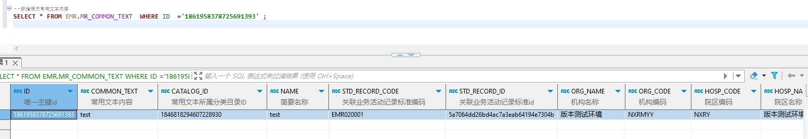

# 领域服务/病历领域 - 新增病历常用文本内容 - 新增病历常用文本内容 正向用例
## 请求参数：
``` json
{
  "orgName": "版本测试环境",
  "hospCode": "NXRY",
  "hospName": "版本测试环境",
  "orgCode": "NXRMYY",
  "list": [ 
    {
      "commonText": "test",
      "catalogId": "1846818294607228930",
      "name": "test",
      "stdRecordCode": "EMR020001",
      "stdRecordId": "5a7064dd26bd4ac7a3eab64194e7304b"
    }
  ],
  "operateDate": "2024-10-17 18:19:41",
  "operatorId": "349365436797001728",
  "operatorName": "测试医生"
}
```
## 返回参数：
``` json
{
    "exception": null,
    "apiCode": null,
    "data": [
        {
            "id": "1861958378725691393",
            "sourceId": null
        }
    ],
    "Code": 200,
    "Message": "操作成功"
}
```
## 数据校验：

# 领域服务/病历领域 - 新增病历常用文本内容 - 必填校验-[orgCode]为空
## 请求参数：
``` json
{
  "orgName": "版本测试环境",
  "hospCode": "NXRY",
  "hospName": "版本测试环境",
  "orgCode": "",
  "list": [
    {
      "commonText": "率次/分 BP:收缩压/舒张",
      "catalogId": "1846818294607228930",
      "name": "率次/分 BP:收",
      "stdRecordCode": "EMR020001",
      "stdRecordId": "5a7064dd26bd4ac7a3eab64194e7304b"
    }
  ],
  "operateDate": "2024-10-17 18:19:41",
  "operatorId": "349365436797001728",
  "operatorName": "测试医生"
}
```
## 返回参数：
``` json
{
  "exception": null,
  "apiCode": null,
  "data": null,
  "Code": 1,
  "Message": "机构编码不能为空"
}
```
# 领域服务/病历领域 - 新增病历常用文本内容 - 必填校验-[orgName]为空
## 请求参数：
``` json
{
  "orgName": "",
  "hospCode": "NXRY",
  "hospName": "版本测试环境",
  "orgCode": "NXRMYY",
  "list": [
    {
      "commonText": "率次/分 BP:收缩压/舒张",
      "catalogId": "1846818294607228930",
      "name": "率次/分 BP:收",
      "stdRecordCode": "EMR020001",
      "stdRecordId": "5a7064dd26bd4ac7a3eab64194e7304b"
    }
  ],
  "operateDate": "2024-10-17 18:19:41",
  "operatorId": "349365436797001728",
  "operatorName": "测试医生"
}
```
## 返回参数：
``` json
{
  "exception": null,
  "apiCode": null,
  "data": null,
  "Code": 1,
  "Message": "机构名称不能为空"
}
```
# 领域服务/病历领域 - 新增病历常用文本内容 - 必填校验-[hospCode]为空
## 请求参数：
``` json
{
  "orgName": "版本测试环境",
  "hospCode": "",
  "hospName": "版本测试环境",
  "orgCode": "NXRMYY",
  "list": [
    {
      "commonText": "率次/分 BP:收缩压/舒张",
      "catalogId": "1846818294607228930",
      "name": "率次/分 BP:收",
      "stdRecordCode": "EMR020001",
      "stdRecordId": "5a7064dd26bd4ac7a3eab64194e7304b"
    }
  ],
  "operateDate": "2024-10-17 18:19:41",
  "operatorId": "349365436797001728",
  "operatorName": "测试医生"
}
```
## 返回参数：
``` json
{
  "exception": null,
  "apiCode": null,
  "data": null,
  "Code": 1,
  "Message": "院区编码不能为空"
}
```
# 领域服务/病历领域 - 新增病历常用文本内容 - 必填校验-[hospName]为空
## 请求参数：
``` json
{
  "orgName": "版本测试环境",
  "hospCode": "NXRY",
  "hospName": "",
  "orgCode": "NXRMYY",
  "list": [
    {
      "commonText": "率次/分 BP:收缩压/舒张",
      "catalogId": "1846818294607228930",
      "name": "率次/分 BP:收",
      "stdRecordCode": "EMR020001",
      "stdRecordId": "5a7064dd26bd4ac7a3eab64194e7304b"
    }
  ],
  "operateDate": "2024-10-17 18:19:41",
  "operatorId": "349365436797001728",
  "operatorName": "测试医生"
}
```
## 返回参数：
``` json
{
  "exception": null,
  "apiCode": null,
  "data": null,
  "Code": 1,
  "Message": "院区名称不能为空"
}
```
# 领域服务/病历领域 - 新增病历常用文本内容 - 必填校验-[operatorId]为空
## 请求参数：
``` json
{
  "orgName": "版本测试环境",
  "hospCode": "NXRY",
  "hospName": "版本测试环境",
  "orgCode": "NXRMYY",
  "list": [
    {
      "commonText": "率次/分 BP:收缩压/舒张",
      "catalogId": "1846818294607228930",
      "name": "率次/分 BP:收",
      "stdRecordCode": "EMR020001",
      "stdRecordId": "5a7064dd26bd4ac7a3eab64194e7304b"
    }
  ],
  "operateDate": "2024-10-17 18:19:41",
  "operatorId": "",
  "operatorName": "测试医生"
}
```
## 返回参数：
``` json
{
  "exception": null,
  "apiCode": null,
  "data": null,
  "Code": 1,
  "Message": "操作人id不能为空"
}
```
# 领域服务/病历领域 - 新增病历常用文本内容 - 必填校验-[operatorName]为空
## 请求参数：
``` json
{
  "orgName": "版本测试环境",
  "hospCode": "NXRY",
  "hospName": "版本测试环境",
  "orgCode": "NXRMYY",
  "list": [
    {
      "commonText": "率次/分 BP:收缩压/舒张",
      "catalogId": "1846818294607228930",
      "name": "率次/分 BP:收",
      "stdRecordCode": "EMR020001",
      "stdRecordId": "5a7064dd26bd4ac7a3eab64194e7304b"
    }
  ],
  "operateDate": "2024-10-17 18:19:41",
  "operatorId": "349365436797001728",
  "operatorName": ""
}
```
## 返回参数：
``` json
{
  "exception": null,
  "apiCode": null,
  "data": null,
  "Code": 1,
  "Message": "操作人姓名不能为空"
}
```
# 领域服务/病历领域 - 新增病历常用文本内容 - 必填校验-[operateDate]为空
## 请求参数：
``` json
{
  "orgName": "版本测试环境",
  "hospCode": "NXRY",
  "hospName": "版本测试环境",
  "orgCode": "NXRMYY",
  "list": [
    {
      "commonText": "率次/分 BP:收缩压/舒张",
      "catalogId": "1846818294607228930",
      "name": "率次/分 BP:收",
      "stdRecordCode": "EMR020001",
      "stdRecordId": "5a7064dd26bd4ac7a3eab64194e7304b"
    }
  ],
  "operateDate": "",
  "operatorId": "349365436797001728",
  "operatorName": "测试医生"
}
```
## 返回参数：
``` json
{
  "exception": null,
  "apiCode": null,
  "data": null,
  "Code": 1,
  "Message": "操作时间不能为空"
}
```
# 领域服务/病历领域 - 新增病历常用文本内容 - 必填校验-[list]为空
## 请求参数：
``` json
{
  "orgName": "版本测试环境",
  "hospCode": "NXRY",
  "hospName": "版本测试环境",
  "orgCode": "NXRMYY",
  "list": null,
  "operateDate": "2024-10-17 18:19:41",
  "operatorId": "349365436797001728",
  "operatorName": "测试医生"
}
```
## 返回参数：
``` json
{
  "exception": null,
  "apiCode": null,
  "data": null,
  "Code": 1,
  "Message": "待新增的常用文本内容集合不能为空"
}
```
# 领域服务/病历领域 - 新增病历常用文本内容 - 必填校验-[list.commonText]为空
## 请求参数：
``` json
{
  "orgName": "版本测试环境",
  "hospCode": "NXRY",
  "hospName": "版本测试环境",
  "orgCode": "NXRMYY",
  "list": [
    {
      "commonText": null,
      "catalogId": "1846818294607228930",
      "name": "率次/分 BP:收",
      "stdRecordCode": "EMR020001",
      "stdRecordId": "5a7064dd26bd4ac7a3eab64194e7304b"
    }
  ],
  "operateDate": "2024-10-17 18:19:41",
  "operatorId": "349365436797001728",
  "operatorName": "测试医生"
}
```
## 返回参数：
``` json
{
  "exception": null,
  "apiCode": null,
  "data": null,
  "Code": 1,
  "Message": "常用文本内容不能为空"
}
```
# 领域服务/病历领域 - 新增病历常用文本内容 - 必填校验-[list.name]为空
## 请求参数：
``` json
{
  "orgName": "版本测试环境",
  "hospCode": "NXRY",
  "hospName": "版本测试环境",
  "orgCode": "NXRMYY",
  "list": [
    {
      "commonText": "率次/分 BP:收缩压/舒张",
      "catalogId": "1846818294607228930",
      "name": null,
      "stdRecordCode": "EMR020001",
      "stdRecordId": "5a7064dd26bd4ac7a3eab64194e7304b"
    }
  ],
  "operateDate": "2024-10-17 18:19:41",
  "operatorId": "349365436797001728",
  "operatorName": "测试医生"
}
```
## 返回参数：
``` json
{
  "exception": null,
  "apiCode": null,
  "data": null,
  "Code": 1,
  "Message": "简要名称不能为空"
}
```
# 领域服务/病历领域 - 新增病历常用文本内容 - 必填校验-[list.stdRecordCode]为空
## 请求参数：
``` json
{
  "orgName": "版本测试环境",
  "hospCode": "NXRY",
  "hospName": "版本测试环境",
  "orgCode": "NXRMYY",
  "list": [
    {
      "commonText": "率次/分 BP:收缩压/舒张",
      "catalogId": "1846818294607228930",
      "name": "率次/分 BP:收",
      "stdRecordCode": null,
      "stdRecordId": "5a7064dd26bd4ac7a3eab64194e7304b"
    }
  ],
  "operateDate": "2024-10-17 18:19:41",
  "operatorId": "349365436797001728",
  "operatorName": "测试医生"
}
```
## 返回参数：
``` json
{
  "exception": null,
  "apiCode": null,
  "data": null,
  "Code": 1,
  "Message": "关联所属的业务活动记录编码不能为空"
}
```
# 领域服务/病历领域 - 新增病历常用文本内容 - 必填校验-[list.stdRecordId]为空
## 请求参数：
``` json
{
  "orgName": "版本测试环境",
  "hospCode": "NXRY",
  "hospName": "版本测试环境",
  "orgCode": "NXRMYY",
  "list": [
    {
      "commonText": "率次/分 BP:收缩压/舒张",
      "catalogId": "1846818294607228930",
      "name": "率次/分 BP:收",
      "stdRecordCode": "EMR020001",
      "stdRecordId": null
    }
  ],
  "operateDate": "2024-10-17 18:19:41",
  "operatorId": "349365436797001728",
  "operatorName": "测试医生"
}
```
## 返回参数：
``` json
{
  "exception": null,
  "apiCode": null,
  "data": null,
  "Code": 1,
  "Message": "关联所属的业务活动记录ID不能为空"
}
```
# 领域服务/病历领域 - 新增病历常用文本内容 - 依赖用例-[operatorName]赋值为依赖用例测试值
## 请求参数：
``` json
{
  "orgName": "版本测试环境",
  "hospCode": "NXRY",
  "hospName": "版本测试环境",
  "orgCode": "NXRMYY",
  "list": [
    {
      "commonText": "率次/分 BP:收缩压/舒张",
      "catalogId": "1846818294607228930",
      "name": "率次/分 BP:收",
      "stdRecordCode": "EMR020001",
      "stdRecordId": "5a7064dd26bd4ac7a3eab64194e7304b"
    }
  ],
  "operateDate": "2024-10-17 18:19:41",
  "operatorId": "349365436797001728",
  "operatorName": "依赖用例测试值"
}
```
## 返回参数：
``` json
{
  "exception": null,
  "apiCode": null,
  "data": null,
  "Code": 1,
  "Message": "常用文本内容:率次/分 BP:收已经存在，新增失败"
}
```
# 领域服务/病历领域 - 新增病历常用文本内容 - 依赖用例-[operatorId]赋值为依赖用例测试值
## 请求参数：
``` json
{
  "orgName": "版本测试环境",
  "hospCode": "NXRY",
  "hospName": "版本测试环境",
  "orgCode": "NXRMYY",
  "list": [
    {
      "commonText": "率次/分 BP:收缩压/舒张",
      "catalogId": "1846818294607228930",
      "name": "率次/分 BP:收",
      "stdRecordCode": "EMR020001",
      "stdRecordId": "5a7064dd26bd4ac7a3eab64194e7304b"
    }
  ],
  "operateDate": "2024-10-17 18:19:41",
  "operatorId": "依赖用例测试值",
  "operatorName": "测试医生"
}
```
## 返回参数：
``` json
{
  "exception": null,
  "apiCode": null,
  "data": null,
  "Code": 1,
  "Message": "常用文本内容:率次/分 BP:收已经存在，新增失败"
}
```
# 领域服务/病历领域 - 新增病历常用文本内容 - 依赖用例-[list.name]赋值为依赖用例测试值
## 请求参数：
``` json
{
  "orgName": "版本测试环境",
  "hospCode": "NXRY",
  "hospName": "版本测试环境",
  "orgCode": "NXRMYY",
  "list": [
    {
      "commonText": "率次/分 BP:收缩压/舒张",
      "catalogId": "1846818294607228930",
      "name": "依赖用例测试值",
      "stdRecordCode": "EMR020001",
      "stdRecordId": "5a7064dd26bd4ac7a3eab64194e7304b"
    }
  ],
  "operateDate": "2024-10-17 18:19:41",
  "operatorId": "349365436797001728",
  "operatorName": "测试医生"
}
```
## 返回参数：
``` json
{
  "exception": null,
  "apiCode": null,
  "data": [
    {
      "id": "1860957320817737729",
      "sourceId": null
    }
  ],
  "Code": 200,
  "Message": "操作成功"
}
```
# 领域服务/病历领域 - 新增病历常用文本内容 - 依赖用例-[list.stdRecordCode]赋值为依赖用例测试值
## 请求参数：
``` json
{
  "orgName": "版本测试环境",
  "hospCode": "NXRY",
  "hospName": "版本测试环境",
  "orgCode": "NXRMYY",
  "list": [
    {
      "commonText": "率次/分 BP:收缩压/舒张",
      "catalogId": "1846818294607228930",
      "name": "率次/分 BP:收",
      "stdRecordCode": "依赖用例测试值",
      "stdRecordId": "5a7064dd26bd4ac7a3eab64194e7304b"
    }
  ],
  "operateDate": "2024-10-17 18:19:41",
  "operatorId": "349365436797001728",
  "operatorName": "测试医生"
}
```
## 返回参数：
``` json
{
  "exception": null,
  "apiCode": null,
  "data": null,
  "Code": 1,
  "Message": "常用文本内容:率次/分 BP:收已经存在，新增失败"
}
```
# 领域服务/病历领域 - 新增病历常用文本内容 - 依赖用例-[list.stdRecordId]赋值为依赖用例测试值
## 请求参数：
``` json
{
  "orgName": "版本测试环境",
  "hospCode": "NXRY",
  "hospName": "版本测试环境",
  "orgCode": "NXRMYY",
  "list": [
    {
      "commonText": "率次/分 BP:收缩压/舒张",
      "catalogId": "1846818294607228930",
      "name": "率次/分 BP:收",
      "stdRecordCode": "EMR020001",
      "stdRecordId": "依赖用例测试值"
    }
  ],
  "operateDate": "2024-10-17 18:19:41",
  "operatorId": "349365436797001728",
  "operatorName": "测试医生"
}
```
## 返回参数：
``` json
{
  "exception": null,
  "apiCode": null,
  "data": null,
  "Code": 1,
  "Message": "常用文本内容:率次/分 BP:收已经存在，新增失败"
}
```
# 领域服务/病历领域 - 新增病历常用文本内容 - 依赖用例-[orgCode]赋值为依赖用例测试值
## 请求参数：
``` json
{
  "orgName": "版本测试环境",
  "hospCode": "NXRY",
  "hospName": "版本测试环境",
  "orgCode": "依赖用例测试值",
  "list": [
    {
      "commonText": "率次/分 BP:收缩压/舒张",
      "catalogId": "1846818294607228930",
      "name": "率次/分 BP:收",
      "stdRecordCode": "EMR020001",
      "stdRecordId": "5a7064dd26bd4ac7a3eab64194e7304b"
    }
  ],
  "operateDate": "2024-10-17 18:19:41",
  "operatorId": "349365436797001728",
  "operatorName": "测试医生"
}
```
## 返回参数：
``` json
{
  "exception": null,
  "apiCode": null,
  "data": [
    {
      "id": "1860957354024042497",
      "sourceId": null
    }
  ],
  "Code": 200,
  "Message": "操作成功"
}
```
# 领域服务/病历领域 - 新增病历常用文本内容 - 依赖用例-[hospName]赋值为依赖用例测试值
## 请求参数：
``` json
{
  "orgName": "版本测试环境",
  "hospCode": "NXRY",
  "hospName": "依赖用例测试值",
  "orgCode": "NXRMYY",
  "list": [
    {
      "commonText": "率次/分 BP:收缩压/舒张",
      "catalogId": "1846818294607228930",
      "name": "率次/分 BP:收",
      "stdRecordCode": "EMR020001",
      "stdRecordId": "5a7064dd26bd4ac7a3eab64194e7304b"
    }
  ],
  "operateDate": "2024-10-17 18:19:41",
  "operatorId": "349365436797001728",
  "operatorName": "测试医生"
}
```
## 返回参数：
``` json
{
  "exception": null,
  "apiCode": null,
  "data": null,
  "Code": 1,
  "Message": "常用文本内容:率次/分 BP:收已经存在，新增失败"
}
```
# 领域服务/病历领域 - 新增病历常用文本内容 - 依赖用例-[hospCode]赋值为依赖用例测试值
## 请求参数：
``` json
{
  "orgName": "版本测试环境",
  "hospCode": "依赖用例测试值",
  "hospName": "版本测试环境",
  "orgCode": "NXRMYY",
  "list": [
    {
      "commonText": "率次/分 BP:收缩压/舒张",
      "catalogId": "1846818294607228930",
      "name": "率次/分 BP:收",
      "stdRecordCode": "EMR020001",
      "stdRecordId": "5a7064dd26bd4ac7a3eab64194e7304b"
    }
  ],
  "operateDate": "2024-10-17 18:19:41",
  "operatorId": "349365436797001728",
  "operatorName": "测试医生"
}
```
## 返回参数：
``` json
{
  "exception": null,
  "apiCode": null,
  "data": [
    {
      "id": "1860957376090275842",
      "sourceId": null
    }
  ],
  "Code": 200,
  "Message": "操作成功"
}
```
# 领域服务/病历领域 - 新增病历常用文本内容 - 依赖用例-[orgName]赋值为依赖用例测试值
## 请求参数：
``` json
{
  "orgName": "依赖用例测试值",
  "hospCode": "NXRY",
  "hospName": "版本测试环境",
  "orgCode": "NXRMYY",
  "list": [
    {
      "commonText": "率次/分 BP:收缩压/舒张",
      "catalogId": "1846818294607228930",
      "name": "率次/分 BP:收",
      "stdRecordCode": "EMR020001",
      "stdRecordId": "5a7064dd26bd4ac7a3eab64194e7304b"
    }
  ],
  "operateDate": "2024-10-17 18:19:41",
  "operatorId": "349365436797001728",
  "operatorName": "测试医生"
}
```
## 返回参数：
``` json
{
  "exception": null,
  "apiCode": null,
  "data": null,
  "Code": 1,
  "Message": "常用文本内容:率次/分 BP:收已经存在，新增失败"
}
```