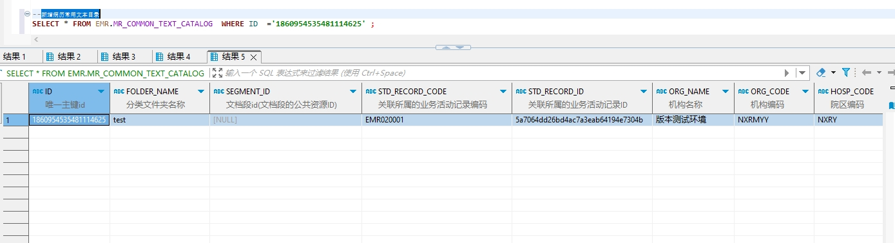

# 领域服务/病历领域 - 新增病历常用文本目录 - 新增病历常用文本目录 正向用例
## 请求参数：
``` json
{
  "orgName": "版本测试环境",
  "hospCode": "NXRY",
  "hospName": "版本测试环境",
  "orgCode": "NXRMYY",
  "list": [
    {
      "stdRecordCode": "EMR020001",
      "stdRecordId": "5a7064dd26bd4ac7a3eab64194e7304b",
      "folderName": "test"
    }
  ],
  "operateDate": "2024-10-16 15:36:13",
  "operatorId": "282475805660160000",
  "operatorName": "CS彭彭彭"
}
```
## 返回参数：
``` json
{
  "exception": null,
  "apiCode": null,
  "data": [
    {
      "id": "1860954535481114625",
      "sourceId": null
    }
  ],
  "Code": 200,
  "Message": "操作成功"
}
```
## 数据校验：

# 领域服务/病历领域 - 新增病历常用文本目录 - 必填校验-[orgCode]为空
## 请求参数：
``` json
{
  "orgName": "版本测试环境",
  "hospCode": "NXRY",
  "hospName": "版本测试环境",
  "orgCode": "",
  "list": [
    {
      "stdRecordCode": "EMR020001",
      "stdRecordId": "5a7064dd26bd4ac7a3eab64194e7304b",
      "folderName": "test"
    }
  ],
  "operateDate": "2024-10-16 15:36:13",
  "operatorId": "282475805660160000",
  "operatorName": "CS彭彭彭"
}
```
## 返回参数：
``` json
{
  "exception": null,
  "apiCode": null,
  "data": null,
  "Code": 1,
  "Message": "机构编码不能为空"
}
```
# 领域服务/病历领域 - 新增病历常用文本目录 - 必填校验-[orgName]为空
## 请求参数：
``` json
{
  "orgName": "",
  "hospCode": "NXRY",
  "hospName": "版本测试环境",
  "orgCode": "NXRMYY",
  "list": [
    {
      "stdRecordCode": "EMR020001",
      "stdRecordId": "5a7064dd26bd4ac7a3eab64194e7304b",
      "folderName": "test"
    }
  ],
  "operateDate": "2024-10-16 15:36:13",
  "operatorId": "282475805660160000",
  "operatorName": "CS彭彭彭"
}
```
## 返回参数：
``` json
{
  "exception": null,
  "apiCode": null,
  "data": null,
  "Code": 1,
  "Message": "机构名称不能为空"
}
```
# 领域服务/病历领域 - 新增病历常用文本目录 - 必填校验-[hospCode]为空
## 请求参数：
``` json
{
  "orgName": "版本测试环境",
  "hospCode": "",
  "hospName": "版本测试环境",
  "orgCode": "NXRMYY",
  "list": [
    {
      "stdRecordCode": "EMR020001",
      "stdRecordId": "5a7064dd26bd4ac7a3eab64194e7304b",
      "folderName": "test"
    }
  ],
  "operateDate": "2024-10-16 15:36:13",
  "operatorId": "282475805660160000",
  "operatorName": "CS彭彭彭"
}
```
## 返回参数：
``` json
{
  "exception": null,
  "apiCode": null,
  "data": null,
  "Code": 1,
  "Message": "院区编码不能为空"
}
```
# 领域服务/病历领域 - 新增病历常用文本目录 - 必填校验-[hospName]为空
## 请求参数：
``` json
{
  "orgName": "版本测试环境",
  "hospCode": "NXRY",
  "hospName": "",
  "orgCode": "NXRMYY",
  "list": [
    {
      "stdRecordCode": "EMR020001",
      "stdRecordId": "5a7064dd26bd4ac7a3eab64194e7304b",
      "folderName": "test"
    }
  ],
  "operateDate": "2024-10-16 15:36:13",
  "operatorId": "282475805660160000",
  "operatorName": "CS彭彭彭"
}
```
## 返回参数：
``` json
{
  "exception": null,
  "apiCode": null,
  "data": null,
  "Code": 1,
  "Message": "院区名称不能为空"
}
```
# 领域服务/病历领域 - 新增病历常用文本目录 - 必填校验-[operatorId]为空
## 请求参数：
``` json
{
  "orgName": "版本测试环境",
  "hospCode": "NXRY",
  "hospName": "版本测试环境",
  "orgCode": "NXRMYY",
  "list": [
    {
      "stdRecordCode": "EMR020001",
      "stdRecordId": "5a7064dd26bd4ac7a3eab64194e7304b",
      "folderName": "test"
    }
  ],
  "operateDate": "2024-10-16 15:36:13",
  "operatorId": "",
  "operatorName": "CS彭彭彭"
}
```
## 返回参数：
``` json
{
  "exception": null,
  "apiCode": null,
  "data": null,
  "Code": 1,
  "Message": "操作人id不能为空"
}
```
# 领域服务/病历领域 - 新增病历常用文本目录 - 必填校验-[operatorName]为空
## 请求参数：
``` json
{
  "orgName": "版本测试环境",
  "hospCode": "NXRY",
  "hospName": "版本测试环境",
  "orgCode": "NXRMYY",
  "list": [
    {
      "stdRecordCode": "EMR020001",
      "stdRecordId": "5a7064dd26bd4ac7a3eab64194e7304b",
      "folderName": "test"
    }
  ],
  "operateDate": "2024-10-16 15:36:13",
  "operatorId": "282475805660160000",
  "operatorName": ""
}
```
## 返回参数：
``` json
{
  "exception": null,
  "apiCode": null,
  "data": null,
  "Code": 1,
  "Message": "操作人姓名不能为空"
}
```
# 领域服务/病历领域 - 新增病历常用文本目录 - 必填校验-[operateDate]为空
## 请求参数：
``` json
{
  "orgName": "版本测试环境",
  "hospCode": "NXRY",
  "hospName": "版本测试环境",
  "orgCode": "NXRMYY",
  "list": [
    {
      "stdRecordCode": "EMR020001",
      "stdRecordId": "5a7064dd26bd4ac7a3eab64194e7304b",
      "folderName": "test"
    }
  ],
  "operateDate": "",
  "operatorId": "282475805660160000",
  "operatorName": "CS彭彭彭"
}
```
## 返回参数：
``` json
{
  "exception": null,
  "apiCode": null,
  "data": null,
  "Code": 1,
  "Message": "操作时间不能为空"
}
```
# 领域服务/病历领域 - 新增病历常用文本目录 - 必填校验-[list]为空
## 请求参数：
``` json
{
  "orgName": "版本测试环境",
  "hospCode": "NXRY",
  "hospName": "版本测试环境",
  "orgCode": "NXRMYY",
  "list": null,
  "operateDate": "2024-10-16 15:36:13",
  "operatorId": "282475805660160000",
  "operatorName": "CS彭彭彭"
}
```
## 返回参数：
``` json
{
  "exception": null,
  "apiCode": null,
  "data": null,
  "Code": 1,
  "Message": "待新增的病历常用文本目录集合不能为空"
}
```
# 领域服务/病历领域 - 新增病历常用文本目录 - 必填校验-[list.folderName]为空
## 请求参数：
``` json
{
  "orgName": "版本测试环境",
  "hospCode": "NXRY",
  "hospName": "版本测试环境",
  "orgCode": "NXRMYY",
  "list": [
    {
      "stdRecordCode": "EMR020001",
      "stdRecordId": "5a7064dd26bd4ac7a3eab64194e7304b",
      "folderName": null
    }
  ],
  "operateDate": "2024-10-16 15:36:13",
  "operatorId": "282475805660160000",
  "operatorName": "CS彭彭彭"
}
```
## 返回参数：
``` json
{
  "exception": null,
  "apiCode": null,
  "data": null,
  "Code": 1,
  "Message": "分类文件夹名称不能为空"
}
```
# 领域服务/病历领域 - 新增病历常用文本目录 - 必填校验-[list.stdRecordCode]为空
## 请求参数：
``` json
{
  "orgName": "版本测试环境",
  "hospCode": "NXRY",
  "hospName": "版本测试环境",
  "orgCode": "NXRMYY",
  "list": [
    {
      "stdRecordCode": null,
      "stdRecordId": "5a7064dd26bd4ac7a3eab64194e7304b",
      "folderName": "test"
    }
  ],
  "operateDate": "2024-10-16 15:36:13",
  "operatorId": "282475805660160000",
  "operatorName": "CS彭彭彭"
}
```
## 返回参数：
``` json
{
  "exception": null,
  "apiCode": null,
  "data": null,
  "Code": 1,
  "Message": "关联所属的业务活动记录编码不能为空"
}
```
# 领域服务/病历领域 - 新增病历常用文本目录 - 必填校验-[list.stdRecordId]为空
## 请求参数：
``` json
{
  "orgName": "版本测试环境",
  "hospCode": "NXRY",
  "hospName": "版本测试环境",
  "orgCode": "NXRMYY",
  "list": [
    {
      "stdRecordCode": "EMR020001",
      "stdRecordId": null,
      "folderName": "test"
    }
  ],
  "operateDate": "2024-10-16 15:36:13",
  "operatorId": "282475805660160000",
  "operatorName": "CS彭彭彭"
}
```
## 返回参数：
``` json
{
  "exception": null,
  "apiCode": null,
  "data": null,
  "Code": 1,
  "Message": "关联所属的业务活动记录ID不能为空"
}
```
# 领域服务/病历领域 - 新增病历常用文本目录 - 依赖用例-[operatorName]赋值为依赖用例测试值
## 请求参数：
``` json
{
  "orgName": "版本测试环境",
  "hospCode": "NXRY",
  "hospName": "版本测试环境",
  "orgCode": "NXRMYY",
  "list": [
    {
      "stdRecordCode": "EMR020001",
      "stdRecordId": "5a7064dd26bd4ac7a3eab64194e7304b",
      "folderName": "test"
    }
  ],
  "operateDate": "2024-10-16 15:36:13",
  "operatorId": "282475805660160000",
  "operatorName": "依赖用例测试值"
}
```
## 返回参数：
``` json
{
  "exception": null,
  "apiCode": null,
  "data": [
    {
      "id": "1860954671338815489",
      "sourceId": null
    }
  ],
  "Code": 200,
  "Message": "操作成功"
}
```
# 领域服务/病历领域 - 新增病历常用文本目录 - 依赖用例-[operatorId]赋值为依赖用例测试值
## 请求参数：
``` json
{
  "orgName": "版本测试环境",
  "hospCode": "NXRY",
  "hospName": "版本测试环境",
  "orgCode": "NXRMYY",
  "list": [
    {
      "stdRecordCode": "EMR020001",
      "stdRecordId": "5a7064dd26bd4ac7a3eab64194e7304b",
      "folderName": "test"
    }
  ],
  "operateDate": "2024-10-16 15:36:13",
  "operatorId": "依赖用例测试值",
  "operatorName": "CS彭彭彭"
}
```
## 返回参数：
``` json
{
  "exception": null,
  "apiCode": null,
  "data": [
    {
      "id": "1860954683242250242",
      "sourceId": null
    }
  ],
  "Code": 200,
  "Message": "操作成功"
}
```
# 领域服务/病历领域 - 新增病历常用文本目录 - 依赖用例-[list.stdRecordCode]赋值为依赖用例测试值
## 请求参数：
``` json
{
  "orgName": "版本测试环境",
  "hospCode": "NXRY",
  "hospName": "版本测试环境",
  "orgCode": "NXRMYY",
  "list": [
    {
      "stdRecordCode": "依赖用例测试值",
      "stdRecordId": "5a7064dd26bd4ac7a3eab64194e7304b",
      "folderName": "test"
    }
  ],
  "operateDate": "2024-10-16 15:36:13",
  "operatorId": "282475805660160000",
  "operatorName": "CS彭彭彭"
}
```
## 返回参数：
``` json
{
  "exception": null,
  "apiCode": null,
  "data": [
    {
      "id": "1860954695254736897",
      "sourceId": null
    }
  ],
  "Code": 200,
  "Message": "操作成功"
}
```
# 领域服务/病历领域 - 新增病历常用文本目录 - 依赖用例-[list.stdRecordId]赋值为依赖用例测试值
## 请求参数：
``` json
{
  "orgName": "版本测试环境",
  "hospCode": "NXRY",
  "hospName": "版本测试环境",
  "orgCode": "NXRMYY",
  "list": [
    {
      "stdRecordCode": "EMR020001",
      "stdRecordId": "依赖用例测试值",
      "folderName": "test"
    }
  ],
  "operateDate": "2024-10-16 15:36:13",
  "operatorId": "282475805660160000",
  "operatorName": "CS彭彭彭"
}
```
## 返回参数：
``` json
{
  "exception": null,
  "apiCode": null,
  "data": [
    {
      "id": "1860954708093501441",
      "sourceId": null
    }
  ],
  "Code": 200,
  "Message": "操作成功"
}
```
# 领域服务/病历领域 - 新增病历常用文本目录 - 依赖用例-[orgCode]赋值为依赖用例测试值
## 请求参数：
``` json
{
  "orgName": "版本测试环境",
  "hospCode": "NXRY",
  "hospName": "版本测试环境",
  "orgCode": "依赖用例测试值",
  "list": [
    {
      "stdRecordCode": "EMR020001",
      "stdRecordId": "5a7064dd26bd4ac7a3eab64194e7304b",
      "folderName": "test"
    }
  ],
  "operateDate": "2024-10-16 15:36:13",
  "operatorId": "282475805660160000",
  "operatorName": "CS彭彭彭"
}
```
## 返回参数：
``` json
{
  "exception": null,
  "apiCode": null,
  "data": [
    {
      "id": "1860954719745277953",
      "sourceId": null
    }
  ],
  "Code": 200,
  "Message": "操作成功"
}
```
# 领域服务/病历领域 - 新增病历常用文本目录 - 依赖用例-[hospName]赋值为依赖用例测试值
## 请求参数：
``` json
{
  "orgName": "版本测试环境",
  "hospCode": "NXRY",
  "hospName": "依赖用例测试值",
  "orgCode": "NXRMYY",
  "list": [
    {
      "stdRecordCode": "EMR020001",
      "stdRecordId": "5a7064dd26bd4ac7a3eab64194e7304b",
      "folderName": "test"
    }
  ],
  "operateDate": "2024-10-16 15:36:13",
  "operatorId": "282475805660160000",
  "operatorName": "CS彭彭彭"
}
```
## 返回参数：
``` json
{
  "exception": null,
  "apiCode": null,
  "data": [
    {
      "id": "1860954730482696193",
      "sourceId": null
    }
  ],
  "Code": 200,
  "Message": "操作成功"
}
```
# 领域服务/病历领域 - 新增病历常用文本目录 - 依赖用例-[hospCode]赋值为依赖用例测试值
## 请求参数：
``` json
{
  "orgName": "版本测试环境",
  "hospCode": "依赖用例测试值",
  "hospName": "版本测试环境",
  "orgCode": "NXRMYY",
  "list": [
    {
      "stdRecordCode": "EMR020001",
      "stdRecordId": "5a7064dd26bd4ac7a3eab64194e7304b",
      "folderName": "test"
    }
  ],
  "operateDate": "2024-10-16 15:36:13",
  "operatorId": "282475805660160000",
  "operatorName": "CS彭彭彭"
}
```
## 返回参数：
``` json
{
  "exception": null,
  "apiCode": null,
  "data": [
    {
      "id": "1860954741715042305",
      "sourceId": null
    }
  ],
  "Code": 200,
  "Message": "操作成功"
}
```
# 领域服务/病历领域 - 新增病历常用文本目录 - 依赖用例-[orgName]赋值为依赖用例测试值
## 请求参数：
``` json
{
  "orgName": "依赖用例测试值",
  "hospCode": "NXRY",
  "hospName": "版本测试环境",
  "orgCode": "NXRMYY",
  "list": [
    {
      "stdRecordCode": "EMR020001",
      "stdRecordId": "5a7064dd26bd4ac7a3eab64194e7304b",
      "folderName": "test"
    }
  ],
  "operateDate": "2024-10-16 15:36:13",
  "operatorId": "282475805660160000",
  "operatorName": "CS彭彭彭"
}
```
## 返回参数：
``` json
{
  "exception": null,
  "apiCode": null,
  "data": [
    {
      "id": "1860954754067267585",
      "sourceId": null
    }
  ],
  "Code": 200,
  "Message": "操作成功"
}
```