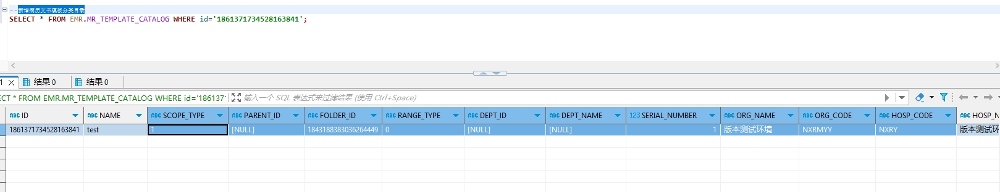

# 领域服务/病历领域 - 新增病历文书模板分类目录 - 新增病历文书模板分类目录 正向用例
## 请求参数：
``` json
{
  "orgName": "版本测试环境",
  "hospCode": "NXRY",
  "hospName": "版本测试环境",
  "orgCode": "NXRMYY",
  "list": [
    {
      "deptName": "",
      "serialNumber": "1",
      "rangeType": "0",
      "deptId": "",
      "folderId": "1843188383036264449",
      "scopeType": "1",
      "name": "test"
    }
  ],
  "operatorId": "282475805660160000",
  "operatorName": "CS彭彭彭",
  "operateDate": "2024-10-17 19:31:10"
}
```
## 返回参数：
``` json
{
    "exception": null,
    "apiCode": null,
    "data": [
        {
            "id": "1861371734528163841",
            "sourceId": null
        }
    ],
    "Code": 200,
    "Message": "操作成功"
}
```
## 数据校验：

# 领域服务/病历领域 - 新增病历文书模板分类目录 - 必填校验-[orgCode]为空
## 请求参数：
``` json
{
  "orgName": "版本测试环境",
  "hospCode": "NXRY",
  "hospName": "版本测试环境",
  "orgCode": "",
  "list": [
    {
      "deptName": "",
      "serialNumber": "1",
      "rangeType": "0",
      "deptId": "",
      "folderId": "1843188383036264449",
      "scopeType": "1",
      "name": "test"
    }
  ],
  "operatorId": "282475805660160000",
  "operatorName": "CS彭彭彭",
  "operateDate": "2024-10-17 19:31:10"
}
```
## 返回参数：
``` json
{
  "exception": null,
  "apiCode": null,
  "data": null,
  "Code": 1,
  "Message": "机构编码不能为空"
}
```
# 领域服务/病历领域 - 新增病历文书模板分类目录 - 必填校验-[orgName]为空
## 请求参数：
``` json
{
  "orgName": "",
  "hospCode": "NXRY",
  "hospName": "版本测试环境",
  "orgCode": "NXRMYY",
  "list": [
    {
      "deptName": "",
      "serialNumber": "1",
      "rangeType": "0",
      "deptId": "",
      "folderId": "1843188383036264449",
      "scopeType": "1",
      "name": "test"
    }
  ],
  "operatorId": "282475805660160000",
  "operatorName": "CS彭彭彭",
  "operateDate": "2024-10-17 19:31:10"
}
```
## 返回参数：
``` json
{
  "exception": null,
  "apiCode": null,
  "data": null,
  "Code": 1,
  "Message": "机构名称不能为空"
}
```
# 领域服务/病历领域 - 新增病历文书模板分类目录 - 必填校验-[hospCode]为空
## 请求参数：
``` json
{
  "orgName": "版本测试环境",
  "hospCode": "",
  "hospName": "版本测试环境",
  "orgCode": "NXRMYY",
  "list": [
    {
      "deptName": "",
      "serialNumber": "1",
      "rangeType": "0",
      "deptId": "",
      "folderId": "1843188383036264449",
      "scopeType": "1",
      "name": "test"
    }
  ],
  "operatorId": "282475805660160000",
  "operatorName": "CS彭彭彭",
  "operateDate": "2024-10-17 19:31:10"
}
```
## 返回参数：
``` json
{
  "exception": null,
  "apiCode": null,
  "data": null,
  "Code": 1,
  "Message": "院区编码不能为空"
}
```
# 领域服务/病历领域 - 新增病历文书模板分类目录 - 必填校验-[hospName]为空
## 请求参数：
``` json
{
  "orgName": "版本测试环境",
  "hospCode": "NXRY",
  "hospName": "",
  "orgCode": "NXRMYY",
  "list": [
    {
      "deptName": "",
      "serialNumber": "1",
      "rangeType": "0",
      "deptId": "",
      "folderId": "1843188383036264449",
      "scopeType": "1",
      "name": "test"
    }
  ],
  "operatorId": "282475805660160000",
  "operatorName": "CS彭彭彭",
  "operateDate": "2024-10-17 19:31:10"
}
```
## 返回参数：
``` json
{
  "exception": null,
  "apiCode": null,
  "data": null,
  "Code": 1,
  "Message": "院区名称不能为空"
}
```
# 领域服务/病历领域 - 新增病历文书模板分类目录 - 必填校验-[operatorId]为空
## 请求参数：
``` json
{
  "orgName": "版本测试环境",
  "hospCode": "NXRY",
  "hospName": "版本测试环境",
  "orgCode": "NXRMYY",
  "list": [
    {
      "deptName": "",
      "serialNumber": "1",
      "rangeType": "0",
      "deptId": "",
      "folderId": "1843188383036264449",
      "scopeType": "1",
      "name": "test"
    }
  ],
  "operatorId": "",
  "operatorName": "CS彭彭彭",
  "operateDate": "2024-10-17 19:31:10"
}
```
## 返回参数：
``` json
{
  "exception": null,
  "apiCode": null,
  "data": null,
  "Code": 1,
  "Message": "操作人id不能为空"
}
```
# 领域服务/病历领域 - 新增病历文书模板分类目录 - 必填校验-[operatorName]为空
## 请求参数：
``` json
{
  "orgName": "版本测试环境",
  "hospCode": "NXRY",
  "hospName": "版本测试环境",
  "orgCode": "NXRMYY",
  "list": [
    {
      "deptName": "",
      "serialNumber": "1",
      "rangeType": "0",
      "deptId": "",
      "folderId": "1843188383036264449",
      "scopeType": "1",
      "name": "test"
    }
  ],
  "operatorId": "282475805660160000",
  "operatorName": "",
  "operateDate": "2024-10-17 19:31:10"
}
```
## 返回参数：
``` json
{
  "exception": null,
  "apiCode": null,
  "data": null,
  "Code": 1,
  "Message": "操作人姓名不能为空"
}
```
# 领域服务/病历领域 - 新增病历文书模板分类目录 - 必填校验-[operateDate]为空
## 请求参数：
``` json
{
  "orgName": "版本测试环境",
  "hospCode": "NXRY",
  "hospName": "版本测试环境",
  "orgCode": "NXRMYY",
  "list": [
    {
      "deptName": "",
      "serialNumber": "1",
      "rangeType": "0",
      "deptId": "",
      "folderId": "1843188383036264449",
      "scopeType": "1",
      "name": "test"
    }
  ],
  "operatorId": "282475805660160000",
  "operatorName": "CS彭彭彭",
  "operateDate": ""
}
```
## 返回参数：
``` json
{
  "exception": null,
  "apiCode": null,
  "data": null,
  "Code": 1,
  "Message": "操作时间不能为空"
}
```
# 领域服务/病历领域 - 新增病历文书模板分类目录 - 必填校验-[list]为空
## 请求参数：
``` json
{
  "orgName": "版本测试环境",
  "hospCode": "NXRY",
  "hospName": "版本测试环境",
  "orgCode": "NXRMYY",
  "list": null,
  "operatorId": "282475805660160000",
  "operatorName": "CS彭彭彭",
  "operateDate": "2024-10-17 19:31:10"
}
```
## 返回参数：
``` json
{
  "exception": null,
  "apiCode": null,
  "data": null,
  "Code": 1,
  "Message": "病历文书模板分类目录集合不能为空"
}
```
# 领域服务/病历领域 - 新增病历文书模板分类目录 - 必填校验-[list.name]为空
## 请求参数：
``` json
{
  "orgName": "版本测试环境",
  "hospCode": "NXRY",
  "hospName": "版本测试环境",
  "orgCode": "NXRMYY",
  "list": [
    {
      "deptName": "",
      "serialNumber": "1",
      "rangeType": "0",
      "deptId": "",
      "folderId": "1843188383036264449",
      "scopeType": "1",
      "name": null
    }
  ],
  "operatorId": "282475805660160000",
  "operatorName": "CS彭彭彭",
  "operateDate": "2024-10-17 19:31:10"
}
```
## 返回参数：
``` json
{
  "exception": null,
  "apiCode": null,
  "data": null,
  "Code": 1,
  "Message": "分类文件夹名称不能为空"
}
```
# 领域服务/病历领域 - 新增病历文书模板分类目录 - 必填校验-[list.scopeType]为空
## 请求参数：
``` json
{
  "orgName": "版本测试环境",
  "hospCode": "NXRY",
  "hospName": "版本测试环境",
  "orgCode": "NXRMYY",
  "list": [
    {
      "deptName": "",
      "serialNumber": "1",
      "rangeType": "0",
      "deptId": "",
      "folderId": "1843188383036264449",
      "scopeType": null,
      "name": "test"
    }
  ],
  "operatorId": "282475805660160000",
  "operatorName": "CS彭彭彭",
  "operateDate": "2024-10-17 19:31:10"
}
```
## 返回参数：
``` json
{
  "exception": null,
  "apiCode": null,
  "data": null,
  "Code": 1,
  "Message": "适用范围类型不能为空"
}
```
# 领域服务/病历领域 - 新增病历文书模板分类目录 - 必填校验-[list.folderId]为空
## 请求参数：
``` json
{
  "orgName": "版本测试环境",
  "hospCode": "NXRY",
  "hospName": "版本测试环境",
  "orgCode": "NXRMYY",
  "list": [
    {
      "deptName": "",
      "serialNumber": "1",
      "rangeType": "0",
      "deptId": "",
      "folderId": null,
      "scopeType": "1",
      "name": "test"
    }
  ],
  "operatorId": "282475805660160000",
  "operatorName": "CS彭彭彭",
  "operateDate": "2024-10-17 19:31:10"
}
```
## 返回参数：
``` json
{
  "exception": null,
  "apiCode": null,
  "data": null,
  "Code": 1,
  "Message": "所属标准配置文件夹id不能为空"
}
```
# 领域服务/病历领域 - 新增病历文书模板分类目录 - 必填校验-[list.rangeType]为空
## 请求参数：
``` json
{
  "orgName": "版本测试环境",
  "hospCode": "NXRY",
  "hospName": "版本测试环境",
  "orgCode": "NXRMYY",
  "list": [
    {
      "deptName": "",
      "serialNumber": "1",
      "rangeType": null,
      "deptId": "",
      "folderId": "1843188383036264449",
      "scopeType": "1",
      "name": "test"
    }
  ],
  "operatorId": "282475805660160000",
  "operatorName": "CS彭彭彭",
  "operateDate": "2024-10-17 19:31:10"
}
```
## 返回参数：
``` json
{
  "exception": null,
  "apiCode": null,
  "data": null,
  "Code": 1,
  "Message": "模板目录所属范围类型不能为空"
}
```
# 领域服务/病历领域 - 新增病历文书模板分类目录 - 必填校验-[list.serialNumber]为空
## 请求参数：
``` json
{
  "orgName": "版本测试环境",
  "hospCode": "NXRY",
  "hospName": "版本测试环境",
  "orgCode": "NXRMYY",
  "list": [
    {
      "deptName": "",
      "serialNumber": null,
      "rangeType": "0",
      "deptId": "",
      "folderId": "1843188383036264449",
      "scopeType": "1",
      "name": "test"
    }
  ],
  "operatorId": "282475805660160000",
  "operatorName": "CS彭彭彭",
  "operateDate": "2024-10-17 19:31:10"
}
```
## 返回参数：
``` json
{
  "exception": null,
  "apiCode": null,
  "data": null,
  "Code": 1,
  "Message": "序号不能为空"
}
```
# 领域服务/病历领域 - 新增病历文书模板分类目录 - 枚举用例-[list.rangeType] 枚举值为 0(模板目录所属范围类型为()
## 请求参数：
``` json
{
  "orgName": "版本测试环境",
  "hospCode": "NXRY",
  "hospName": "版本测试环境",
  "orgCode": "NXRMYY",
  "list": [
    {
      "deptName": "",
      "serialNumber": "1",
      "rangeType": "0",
      "deptId": "",
      "folderId": "1843188383036264449",
      "scopeType": "1",
      "name": "test"
    }
  ],
  "operatorId": "282475805660160000",
  "operatorName": "CS彭彭彭",
  "operateDate": "2024-10-17 19:31:10"
}
```
## 返回参数：
``` json
{
  "exception": null,
  "apiCode": null,
  "data": null,
  "Code": 1,
  "Message": "不能新增相同名称的文书模板目录"
}
```
# 领域服务/病历领域 - 新增病历文书模板分类目录 - 枚举用例-[list.rangeType] 枚举值为 2(模板目录所属范围类型为个人)
## 请求参数：
``` json
{
  "orgName": "版本测试环境",
  "hospCode": "NXRY",
  "hospName": "版本测试环境",
  "orgCode": "NXRMYY",
  "list": [
    {
      "deptName": "",
      "serialNumber": "1",
      "rangeType": "2",
      "deptId": "",
      "folderId": "1843188383036264449",
      "scopeType": "1",
      "name": "test"
    }
  ],
  "operatorId": "282475805660160000",
  "operatorName": "CS彭彭彭",
  "operateDate": "2024-10-17 19:31:10"
}
```
## 返回参数：
``` json
{
  "exception": null,
  "apiCode": null,
  "data": null,
  "Code": 1,
  "Message": "维护科室模板时，科室id和科室名称不能为空"
}
```
# 领域服务/病历领域 - 新增病历文书模板分类目录 - 枚举用例-[list.rangeType] 枚举值为 3(模板目录所属范围类型为科室)
## 请求参数：
``` json
{
  "orgName": "版本测试环境",
  "hospCode": "NXRY",
  "hospName": "版本测试环境",
  "orgCode": "NXRMYY",
  "list": [
    {
      "deptName": "",
      "serialNumber": "1",
      "rangeType": "3",
      "deptId": "",
      "folderId": "1843188383036264449",
      "scopeType": "1",
      "name": "test"
    }
  ],
  "operatorId": "282475805660160000",
  "operatorName": "CS彭彭彭",
  "operateDate": "2024-10-17 19:31:10"
}
```
## 返回参数：
``` json
{
  "exception": null,
  "apiCode": null,
  "data": null,
  "Code": 1,
  "Message": "不能新增相同名称的文书模板目录"
}
```
# 领域服务/病历领域 - 新增病历文书模板分类目录 - 枚举用例-[list.rangeType] 枚举值为 4(模板目录所属范围类型为院区)
## 请求参数：
``` json
{
  "orgName": "版本测试环境",
  "hospCode": "NXRY",
  "hospName": "版本测试环境",
  "orgCode": "NXRMYY",
  "list": [
    {
      "deptName": "",
      "serialNumber": "1",
      "rangeType": "4",
      "deptId": "",
      "folderId": "1843188383036264449",
      "scopeType": "1",
      "name": "test"
    }
  ],
  "operatorId": "282475805660160000",
  "operatorName": "CS彭彭彭",
  "operateDate": "2024-10-17 19:31:10"
}
```
## 返回参数：
``` json
{
  "exception": null,
  "apiCode": null,
  "data": null,
  "Code": 1,
  "Message": "不能新增相同名称的文书模板目录"
}
```
# 领域服务/病历领域 - 新增病历文书模板分类目录 - 枚举用例-[list.rangeType] 枚举值为 5(模板目录所属范围类型为机构)
## 请求参数：
``` json
{
  "orgName": "版本测试环境",
  "hospCode": "NXRY",
  "hospName": "版本测试环境",
  "orgCode": "NXRMYY",
  "list": [
    {
      "deptName": "",
      "serialNumber": "1",
      "rangeType": "5",
      "deptId": "",
      "folderId": "1843188383036264449",
      "scopeType": "1",
      "name": "test"
    }
  ],
  "operatorId": "282475805660160000",
  "operatorName": "CS彭彭彭",
  "operateDate": "2024-10-17 19:31:10"
}
```
## 返回参数：
``` json
{
  "exception": null,
  "apiCode": null,
  "data": null,
  "Code": 1,
  "Message": "不能新增相同名称的文书模板目录"
}
```
# 领域服务/病历领域 - 新增病历文书模板分类目录 - 枚举用例-[list.scopeType] 枚举值为 1(适用范围类型为门诊)
## 请求参数：
``` json
{
  "orgName": "版本测试环境",
  "hospCode": "NXRY",
  "hospName": "版本测试环境",
  "orgCode": "NXRMYY",
  "list": [
    {
      "deptName": "",
      "serialNumber": "1",
      "rangeType": "0",
      "deptId": "",
      "folderId": "1843188383036264449",
      "scopeType": "1",
      "name": "test"
    }
  ],
  "operatorId": "282475805660160000",
  "operatorName": "CS彭彭彭",
  "operateDate": "2024-10-17 19:31:10"
}
```
## 返回参数：
``` json
{
  "exception": null,
  "apiCode": null,
  "data": null,
  "Code": 1,
  "Message": "不能新增相同名称的文书模板目录"
}
```
# 领域服务/病历领域 - 新增病历文书模板分类目录 - 依赖用例-[operatorName]赋值为依赖用例测试值
## 请求参数：
``` json
{
  "orgName": "版本测试环境",
  "hospCode": "NXRY",
  "hospName": "版本测试环境",
  "orgCode": "NXRMYY",
  "list": [
    {
      "deptName": "",
      "serialNumber": "1",
      "rangeType": "0",
      "deptId": "",
      "folderId": "1843188383036264449",
      "scopeType": "1",
      "name": "test"
    }
  ],
  "operatorId": "282475805660160000",
  "operatorName": "依赖用例测试值",
  "operateDate": "2024-10-17 19:31:10"
}
```
## 返回参数：
``` json
{
  "exception": null,
  "apiCode": null,
  "data": null,
  "Code": 1,
  "Message": "不能新增相同名称的文书模板目录"
}
```
# 领域服务/病历领域 - 新增病历文书模板分类目录 - 依赖用例-[operatorId]赋值为依赖用例测试值
## 请求参数：
``` json
{
  "orgName": "版本测试环境",
  "hospCode": "NXRY",
  "hospName": "版本测试环境",
  "orgCode": "NXRMYY",
  "list": [
    {
      "deptName": "",
      "serialNumber": "1",
      "rangeType": "0",
      "deptId": "",
      "folderId": "1843188383036264449",
      "scopeType": "1",
      "name": "test"
    }
  ],
  "operatorId": "依赖用例测试值",
  "operatorName": "CS彭彭彭",
  "operateDate": "2024-10-17 19:31:10"
}
```
## 返回参数：
``` json
{
  "exception": null,
  "apiCode": null,
  "data": null,
  "Code": 1,
  "Message": "不能新增相同名称的文书模板目录"
}
```
# 领域服务/病历领域 - 新增病历文书模板分类目录 - 依赖用例-[list.folderId]赋值为依赖用例测试值
## 请求参数：
``` json
{
  "orgName": "版本测试环境",
  "hospCode": "NXRY",
  "hospName": "版本测试环境",
  "orgCode": "NXRMYY",
  "list": [
    {
      "deptName": "",
      "serialNumber": "1",
      "rangeType": "0",
      "deptId": "",
      "folderId": "依赖用例测试值",
      "scopeType": "1",
      "name": "test"
    }
  ],
  "operatorId": "282475805660160000",
  "operatorName": "CS彭彭彭",
  "operateDate": "2024-10-17 19:31:10"
}
```
## 返回参数：
``` json
{
  "exception": null,
  "apiCode": null,
  "data": [
    {
      "id": "1860938645641428993",
      "sourceId": null
    }
  ],
  "Code": 200,
  "Message": "操作成功"
}
```
# 领域服务/病历领域 - 新增病历文书模板分类目录 - 依赖用例-[list.name]赋值为依赖用例测试值
## 请求参数：
``` json
{
  "orgName": "版本测试环境",
  "hospCode": "NXRY",
  "hospName": "版本测试环境",
  "orgCode": "NXRMYY",
  "list": [
    {
      "deptName": "",
      "serialNumber": "1",
      "rangeType": "0",
      "deptId": "",
      "folderId": "1843188383036264449",
      "scopeType": "1",
      "name": "依赖用例测试值"
    }
  ],
  "operatorId": "282475805660160000",
  "operatorName": "CS彭彭彭",
  "operateDate": "2024-10-17 19:31:10"
}
```
## 返回参数：
``` json
{
  "exception": null,
  "apiCode": null,
  "data": [
    {
      "id": "1860938657406451713",
      "sourceId": null
    }
  ],
  "Code": 200,
  "Message": "操作成功"
}
```
# 领域服务/病历领域 - 新增病历文书模板分类目录 - 依赖用例-[orgCode]赋值为依赖用例测试值
## 请求参数：
``` json
{
  "orgName": "版本测试环境",
  "hospCode": "NXRY",
  "hospName": "版本测试环境",
  "orgCode": "依赖用例测试值",
  "list": [
    {
      "deptName": "",
      "serialNumber": "1",
      "rangeType": "0",
      "deptId": "",
      "folderId": "1843188383036264449",
      "scopeType": "1",
      "name": "test"
    }
  ],
  "operatorId": "282475805660160000",
  "operatorName": "CS彭彭彭",
  "operateDate": "2024-10-17 19:31:10"
}
```
## 返回参数：
``` json
{
  "exception": null,
  "apiCode": null,
  "data": [
    {
      "id": "1860938669095976961",
      "sourceId": null
    }
  ],
  "Code": 200,
  "Message": "操作成功"
}
```
# 领域服务/病历领域 - 新增病历文书模板分类目录 - 依赖用例-[hospName]赋值为依赖用例测试值
## 请求参数：
``` json
{
  "orgName": "版本测试环境",
  "hospCode": "NXRY",
  "hospName": "依赖用例测试值",
  "orgCode": "NXRMYY",
  "list": [
    {
      "deptName": "",
      "serialNumber": "1",
      "rangeType": "0",
      "deptId": "",
      "folderId": "1843188383036264449",
      "scopeType": "1",
      "name": "test"
    }
  ],
  "operatorId": "282475805660160000",
  "operatorName": "CS彭彭彭",
  "operateDate": "2024-10-17 19:31:10"
}
```
## 返回参数：
``` json
{
  "exception": null,
  "apiCode": null,
  "data": null,
  "Code": 1,
  "Message": "不能新增相同名称的文书模板目录"
}
```
# 领域服务/病历领域 - 新增病历文书模板分类目录 - 依赖用例-[hospCode]赋值为依赖用例测试值
## 请求参数：
``` json
{
  "orgName": "版本测试环境",
  "hospCode": "依赖用例测试值",
  "hospName": "版本测试环境",
  "orgCode": "NXRMYY",
  "list": [
    {
      "deptName": "",
      "serialNumber": "1",
      "rangeType": "0",
      "deptId": "",
      "folderId": "1843188383036264449",
      "scopeType": "1",
      "name": "test"
    }
  ],
  "operatorId": "282475805660160000",
  "operatorName": "CS彭彭彭",
  "operateDate": "2024-10-17 19:31:10"
}
```
## 返回参数：
``` json
{
  "exception": null,
  "apiCode": null,
  "data": [
    {
      "id": "1860938692613439490",
      "sourceId": null
    }
  ],
  "Code": 200,
  "Message": "操作成功"
}
```
# 领域服务/病历领域 - 新增病历文书模板分类目录 - 依赖用例-[orgName]赋值为依赖用例测试值
## 请求参数：
``` json
{
  "orgName": "依赖用例测试值",
  "hospCode": "NXRY",
  "hospName": "版本测试环境",
  "orgCode": "NXRMYY",
  "list": [
    {
      "deptName": "",
      "serialNumber": "1",
      "rangeType": "0",
      "deptId": "",
      "folderId": "1843188383036264449",
      "scopeType": "1",
      "name": "test"
    }
  ],
  "operatorId": "282475805660160000",
  "operatorName": "CS彭彭彭",
  "operateDate": "2024-10-17 19:31:10"
}
```
## 返回参数：
``` json
{
  "exception": null,
  "apiCode": null,
  "data": null,
  "Code": 1,
  "Message": "不能新增相同名称的文书模板目录"
}
```