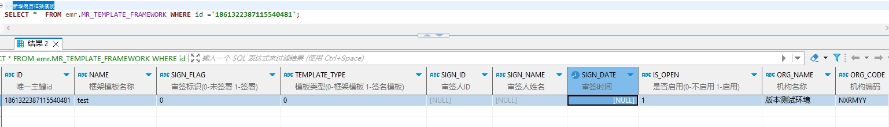

# 领域服务/病历领域 - 新增病历框架模板 - 新增病历框架模板 正向用例
## 请求参数：
``` json
{
  "orgName": "版本测试环境",
  "hospCode": "NXRY",
  "hospName": "版本测试环境",
  "orgCode": "NXRMYY",
  "list": [
    {
      "isOpen": "1",
      "frameworkType": "0",
      "name": "test",
      "templateContent": "test"
    }
  ],
  "operateDate": "2024-10-21 11:34:47",
  "operatorId": "282475805660160000",
  "operatorName": "CS彭彭彭"
}
```
## 返回参数：
``` json
{
    "exception": null,
    "apiCode": null,
    "data": {
        "stdRecordId": "8645595b02b44437909ef93923c424dd",
        "list": [
            {
                "id": "1861322387115540481",
                "sourceId": null
            }
        ]
    },
    "Code": 200,
    "Message": "操作成功"
}
```
## 数据校验：

# 领域服务/病历领域 - 新增病历框架模板 - 必填校验-[orgCode]为空
## 请求参数：
``` json
{
  "orgName": "版本测试环境",
  "hospCode": "NXRY",
  "hospName": "版本测试环境",
  "orgCode": "",
  "list": [
    {
      "isOpen": "1",
      "frameworkType": "0",
      "name": "123",
      "templateContent": "test"
    }
  ],
  "operateDate": "2024-10-21 11:34:47",
  "operatorId": "282475805660160000",
  "operatorName": "CS彭彭彭"
}
```
## 返回参数：
``` json
{
  "exception": null,
  "apiCode": null,
  "data": null,
  "Code": 1,
  "Message": "机构编码不能为空"
}
```
# 领域服务/病历领域 - 新增病历框架模板 - 必填校验-[orgName]为空
## 请求参数：
``` json
{
  "orgName": "",
  "hospCode": "NXRY",
  "hospName": "版本测试环境",
  "orgCode": "NXRMYY",
  "list": [
    {
      "isOpen": "1",
      "frameworkType": "0",
      "name": "123",
      "templateContent": "test"
    }
  ],
  "operateDate": "2024-10-21 11:34:47",
  "operatorId": "282475805660160000",
  "operatorName": "CS彭彭彭"
}
```
## 返回参数：
``` json
{
  "exception": null,
  "apiCode": null,
  "data": null,
  "Code": 1,
  "Message": "机构名称不能为空"
}
```
# 领域服务/病历领域 - 新增病历框架模板 - 必填校验-[hospCode]为空
## 请求参数：
``` json
{
  "orgName": "版本测试环境",
  "hospCode": "",
  "hospName": "版本测试环境",
  "orgCode": "NXRMYY",
  "list": [
    {
      "isOpen": "1",
      "frameworkType": "0",
      "name": "123",
      "templateContent": "test"
    }
  ],
  "operateDate": "2024-10-21 11:34:47",
  "operatorId": "282475805660160000",
  "operatorName": "CS彭彭彭"
}
```
## 返回参数：
``` json
{
  "exception": null,
  "apiCode": null,
  "data": null,
  "Code": 1,
  "Message": "院区编码不能为空"
}
```
# 领域服务/病历领域 - 新增病历框架模板 - 必填校验-[hospName]为空
## 请求参数：
``` json
{
  "orgName": "版本测试环境",
  "hospCode": "NXRY",
  "hospName": "",
  "orgCode": "NXRMYY",
  "list": [
    {
      "isOpen": "1",
      "frameworkType": "0",
      "name": "123",
      "templateContent": "test"
    }
  ],
  "operateDate": "2024-10-21 11:34:47",
  "operatorId": "282475805660160000",
  "operatorName": "CS彭彭彭"
}
```
## 返回参数：
``` json
{
  "exception": null,
  "apiCode": null,
  "data": null,
  "Code": 1,
  "Message": "院区名称不能为空"
}
```
# 领域服务/病历领域 - 新增病历框架模板 - 必填校验-[operatorId]为空
## 请求参数：
``` json
{
  "orgName": "版本测试环境",
  "hospCode": "NXRY",
  "hospName": "版本测试环境",
  "orgCode": "NXRMYY",
  "list": [
    {
      "isOpen": "1",
      "frameworkType": "0",
      "name": "123",
      "templateContent": "test"
    }
  ],
  "operateDate": "2024-10-21 11:34:47",
  "operatorId": "",
  "operatorName": "CS彭彭彭"
}
```
## 返回参数：
``` json
{
  "exception": null,
  "apiCode": null,
  "data": null,
  "Code": 1,
  "Message": "操作人id不能为空"
}
```
# 领域服务/病历领域 - 新增病历框架模板 - 必填校验-[operatorName]为空
## 请求参数：
``` json
{
  "orgName": "版本测试环境",
  "hospCode": "NXRY",
  "hospName": "版本测试环境",
  "orgCode": "NXRMYY",
  "list": [
    {
      "isOpen": "1",
      "frameworkType": "0",
      "name": "123",
      "templateContent": "test"
    }
  ],
  "operateDate": "2024-10-21 11:34:47",
  "operatorId": "282475805660160000",
  "operatorName": ""
}
```
## 返回参数：
``` json
{
  "exception": null,
  "apiCode": null,
  "data": null,
  "Code": 1,
  "Message": "操作人姓名不能为空"
}
```
# 领域服务/病历领域 - 新增病历框架模板 - 必填校验-[operateDate]为空
## 请求参数：
``` json
{
  "orgName": "版本测试环境",
  "hospCode": "NXRY",
  "hospName": "版本测试环境",
  "orgCode": "NXRMYY",
  "list": [
    {
      "isOpen": "1",
      "frameworkType": "0",
      "name": "123",
      "templateContent": "test"
    }
  ],
  "operateDate": "",
  "operatorId": "282475805660160000",
  "operatorName": "CS彭彭彭"
}
```
## 返回参数：
``` json
{
  "exception": null,
  "apiCode": null,
  "data": null,
  "Code": 1,
  "Message": "操作时间不能为空"
}
```
# 领域服务/病历领域 - 新增病历框架模板 - 必填校验-[list]为空
## 请求参数：
``` json
{
  "orgName": "版本测试环境",
  "hospCode": "NXRY",
  "hospName": "版本测试环境",
  "orgCode": "NXRMYY",
  "list": null,
  "operateDate": "2024-10-21 11:34:47",
  "operatorId": "282475805660160000",
  "operatorName": "CS彭彭彭"
}
```
## 返回参数：
``` json
{
  "exception": null,
  "apiCode": null,
  "data": null,
  "Code": 1,
  "Message": "框架模板内容不能为空"
}
```
# 领域服务/病历领域 - 新增病历框架模板 - 必填校验-[list.name]为空
## 请求参数：
``` json
{
  "orgName": "版本测试环境",
  "hospCode": "NXRY",
  "hospName": "版本测试环境",
  "orgCode": "NXRMYY",
  "list": [
    {
      "isOpen": "1",
      "frameworkType": "0",
      "name": null,
      "templateContent": "test"
    }
  ],
  "operateDate": "2024-10-21 11:34:47",
  "operatorId": "282475805660160000",
  "operatorName": "CS彭彭彭"
}
```
## 返回参数：
``` json
{
  "exception": null,
  "apiCode": null,
  "data": null,
  "Code": 1,
  "Message": "框架模板名称不能为空"
}
```
# 领域服务/病历领域 - 新增病历框架模板 - 必填校验-[list.frameworkType]为空
## 请求参数：
``` json
{
  "orgName": "版本测试环境",
  "hospCode": "NXRY",
  "hospName": "版本测试环境",
  "orgCode": "NXRMYY",
  "list": [
    {
      "isOpen": "1",
      "frameworkType": null,
      "name": "123",
      "templateContent": "test"
    }
  ],
  "operateDate": "2024-10-21 11:34:47",
  "operatorId": "282475805660160000",
  "operatorName": "CS彭彭彭"
}
```
## 返回参数：
``` json
{
  "exception": null,
  "apiCode": null,
  "data": null,
  "Code": 1,
  "Message": "模板类型不能为空"
}
```
# 领域服务/病历领域 - 新增病历框架模板 - 必填校验-[list.isOpen]为空
## 请求参数：
``` json
{
  "orgName": "版本测试环境",
  "hospCode": "NXRY",
  "hospName": "版本测试环境",
  "orgCode": "NXRMYY",
  "list": [
    {
      "isOpen": null,
      "frameworkType": "0",
      "name": "123",
      "templateContent": "test"
    }
  ],
  "operateDate": "2024-10-21 11:34:47",
  "operatorId": "282475805660160000",
  "operatorName": "CS彭彭彭"
}
```
## 返回参数：
``` json
{
  "exception": null,
  "apiCode": null,
  "data": null,
  "Code": 1,
  "Message": "是否启用不能为空"
}
```
# 领域服务/病历领域 - 新增病历框架模板 - 枚举用例-[list.isOpen] 枚举值为 0(是否启用为不启用)
## 请求参数：
``` json
{
  "orgName": "版本测试环境",
  "hospCode": "NXRY",
  "hospName": "版本测试环境",
  "orgCode": "NXRMYY",
  "list": [
    {
      "isOpen": "0",
      "frameworkType": "0",
      "name": "123",
      "templateContent": "test"
    }
  ],
  "operateDate": "2024-10-21 11:34:47",
  "operatorId": "282475805660160000",
  "operatorName": "CS彭彭彭"
}
```
## 返回参数：
``` json
{
  "exception": null,
  "apiCode": null,
  "data": null,
  "Code": 1,
  "Message": "已经存在该模板名称，新增失败"
}
```
# 领域服务/病历领域 - 新增病历框架模板 - 枚举用例-[list.isOpen] 枚举值为 1(是否启用为启用)
## 请求参数：
``` json
{
  "orgName": "版本测试环境",
  "hospCode": "NXRY",
  "hospName": "版本测试环境",
  "orgCode": "NXRMYY",
  "list": [
    {
      "isOpen": "1",
      "frameworkType": "0",
      "name": "123",
      "templateContent": "test"
    }
  ],
  "operateDate": "2024-10-21 11:34:47",
  "operatorId": "282475805660160000",
  "operatorName": "CS彭彭彭"
}
```
## 返回参数：
``` json
{
  "exception": null,
  "apiCode": null,
  "data": null,
  "Code": 1,
  "Message": "已经存在该模板名称，新增失败"
}
```
# 领域服务/病历领域 - 新增病历框架模板 - 枚举用例-[list.frameworkType] 枚举值为 0(模板类型为框架模板)
## 请求参数：
``` json
{
  "orgName": "版本测试环境",
  "hospCode": "NXRY",
  "hospName": "版本测试环境",
  "orgCode": "NXRMYY",
  "list": [
    {
      "isOpen": "1",
      "frameworkType": "0",
      "name": "123",
      "templateContent": "test"
    }
  ],
  "operateDate": "2024-10-21 11:34:47",
  "operatorId": "282475805660160000",
  "operatorName": "CS彭彭彭"
}
```
## 返回参数：
``` json
{
  "exception": null,
  "apiCode": null,
  "data": null,
  "Code": 1,
  "Message": "已经存在该模板名称，新增失败"
}
```
# 领域服务/病历领域 - 新增病历框架模板 - 枚举用例-[list.frameworkType] 枚举值为 1(模板类型为签名模板)
## 请求参数：
``` json
{
  "orgName": "版本测试环境",
  "hospCode": "NXRY",
  "hospName": "版本测试环境",
  "orgCode": "NXRMYY",
  "list": [
    {
      "isOpen": "1",
      "frameworkType": "1",
      "name": "123",
      "templateContent": "test"
    }
  ],
  "operateDate": "2024-10-21 11:34:47",
  "operatorId": "282475805660160000",
  "operatorName": "CS彭彭彭"
}
```
## 返回参数：
``` json
{
  "exception": null,
  "apiCode": null,
  "data": null,
  "Code": 1,
  "Message": "已经存在该模板名称，新增失败"
}
```
# 领域服务/病历领域 - 新增病历框架模板 - 依赖用例-[operatorName]赋值为依赖用例测试值
## 请求参数：
``` json
{
  "orgName": "版本测试环境",
  "hospCode": "NXRY",
  "hospName": "版本测试环境",
  "orgCode": "NXRMYY",
  "list": [
    {
      "isOpen": "1",
      "frameworkType": "0",
      "name": "123",
      "templateContent": "test"
    }
  ],
  "operateDate": "2024-10-21 11:34:47",
  "operatorId": "282475805660160000",
  "operatorName": "依赖用例测试值"
}
```
## 返回参数：
``` json
{
  "exception": null,
  "apiCode": null,
  "data": null,
  "Code": 1,
  "Message": "已经存在该模板名称，新增失败"
}
```
# 领域服务/病历领域 - 新增病历框架模板 - 依赖用例-[operatorId]赋值为依赖用例测试值
## 请求参数：
``` json
{
  "orgName": "版本测试环境",
  "hospCode": "NXRY",
  "hospName": "版本测试环境",
  "orgCode": "NXRMYY",
  "list": [
    {
      "isOpen": "1",
      "frameworkType": "0",
      "name": "123",
      "templateContent": "test"
    }
  ],
  "operateDate": "2024-10-21 11:34:47",
  "operatorId": "依赖用例测试值",
  "operatorName": "CS彭彭彭"
}
```
## 返回参数：
``` json
{
  "exception": null,
  "apiCode": null,
  "data": null,
  "Code": 1,
  "Message": "已经存在该模板名称，新增失败"
}
```
# 领域服务/病历领域 - 新增病历框架模板 - 依赖用例-[list.name]赋值为依赖用例测试值
## 请求参数：
``` json
{
  "orgName": "版本测试环境",
  "hospCode": "NXRY",
  "hospName": "版本测试环境",
  "orgCode": "NXRMYY",
  "list": [
    {
      "isOpen": "1",
      "frameworkType": "0",
      "name": "依赖用例测试值",
      "templateContent": "test"
    }
  ],
  "operateDate": "2024-10-21 11:34:47",
  "operatorId": "282475805660160000",
  "operatorName": "CS彭彭彭"
}
```
## 返回参数：
``` json
{
  "exception": null,
  "apiCode": null,
  "data": {
    "stdRecordId": "8645595b02b44437909ef93923c424dd",
    "list": [
      {
        "id": "1860935202088484866",
        "sourceId": null
      }
    ]
  },
  "Code": 200,
  "Message": "操作成功"
}
```
# 领域服务/病历领域 - 新增病历框架模板 - 依赖用例-[orgCode]赋值为依赖用例测试值
## 请求参数：
``` json
{
  "orgName": "版本测试环境",
  "hospCode": "NXRY",
  "hospName": "版本测试环境",
  "orgCode": "依赖用例测试值",
  "list": [
    {
      "isOpen": "1",
      "frameworkType": "0",
      "name": "123",
      "templateContent": "test"
    }
  ],
  "operateDate": "2024-10-21 11:34:47",
  "operatorId": "282475805660160000",
  "operatorName": "CS彭彭彭"
}
```
## 返回参数：
``` json
{
  "exception": null,
  "apiCode": null,
  "data": {
    "stdRecordId": null,
    "list": [
      {
        "id": "1860935217687101441",
        "sourceId": null
      }
    ]
  },
  "Code": 200,
  "Message": "操作成功"
}
```
# 领域服务/病历领域 - 新增病历框架模板 - 依赖用例-[hospName]赋值为依赖用例测试值
## 请求参数：
``` json
{
  "orgName": "版本测试环境",
  "hospCode": "NXRY",
  "hospName": "依赖用例测试值",
  "orgCode": "NXRMYY",
  "list": [
    {
      "isOpen": "1",
      "frameworkType": "0",
      "name": "123",
      "templateContent": "test"
    }
  ],
  "operateDate": "2024-10-21 11:34:47",
  "operatorId": "282475805660160000",
  "operatorName": "CS彭彭彭"
}
```
## 返回参数：
``` json
{
  "exception": null,
  "apiCode": null,
  "data": null,
  "Code": 1,
  "Message": "已经存在该模板名称，新增失败"
}
```
# 领域服务/病历领域 - 新增病历框架模板 - 依赖用例-[hospCode]赋值为依赖用例测试值
## 请求参数：
``` json
{
  "orgName": "版本测试环境",
  "hospCode": "依赖用例测试值",
  "hospName": "版本测试环境",
  "orgCode": "NXRMYY",
  "list": [
    {
      "isOpen": "1",
      "frameworkType": "0",
      "name": "123",
      "templateContent": "test"
    }
  ],
  "operateDate": "2024-10-21 11:34:47",
  "operatorId": "282475805660160000",
  "operatorName": "CS彭彭彭"
}
```
## 返回参数：
``` json
{
  "exception": null,
  "apiCode": null,
  "data": {
    "stdRecordId": "8645595b02b44437909ef93923c424dd",
    "list": [
      {
        "id": "1860935254332735490",
        "sourceId": null
      }
    ]
  },
  "Code": 200,
  "Message": "操作成功"
}
```
# 领域服务/病历领域 - 新增病历框架模板 - 依赖用例-[orgName]赋值为依赖用例测试值
## 请求参数：
``` json
{
  "orgName": "依赖用例测试值",
  "hospCode": "NXRY",
  "hospName": "版本测试环境",
  "orgCode": "NXRMYY",
  "list": [
    {
      "isOpen": "1",
      "frameworkType": "0",
      "name": "123",
      "templateContent": "test"
    }
  ],
  "operateDate": "2024-10-21 11:34:47",
  "operatorId": "282475805660160000",
  "operatorName": "CS彭彭彭"
}
```
## 返回参数：
``` json
{
  "exception": null,
  "apiCode": null,
  "data": null,
  "Code": 1,
  "Message": "已经存在该模板名称，新增失败"
}
```