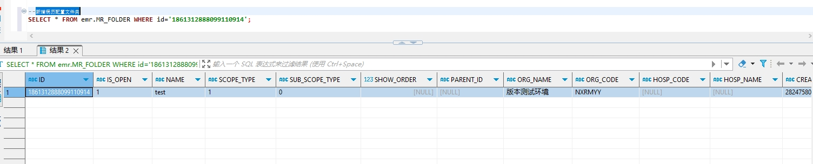

# 领域服务/病历领域 - 新增病历配置文件夹 - 新增病历配置文件夹 正向用例
## 请求参数：
``` json
{
  "orgName": "版本测试环境",
  "orgCode": "NXRMYY",
  "list": [
    {
      "records": [
        {
          "stdName": "医疗费用记录",
          "folderId": "",
          "stdCode": "EMR010004"
        }
      ],
      "parentId": "",
      "subScopeType": "0",
      "isOpen": "1",
      "scopeType": "1",
      "name": "test"
    }
  ],
  "operatorId": "282475805660160000",
  "operatorName": "CS彭彭彭",
  "operateDate": "2024-10-16 17:25:06"
}
```
## 返回参数：
``` json
{
    "exception": null,
    "apiCode": null,
    "data": [
        {
            "id": "1861312888099110914",
            "sourceId": null
        }
    ],
    "Code": 200,
    "Message": "操作成功"
}
```
## 数据校验：

# 领域服务/病历领域 - 新增病历配置文件夹 - 必填校验-[orgCode]为空
## 请求参数：
``` json
{
  "orgName": "版本测试环境",
  "orgCode": "",
  "list": [
    {
      "records": [
        {
          "stdName": "长期医嘱",
          "folderId": "",
          "stdCode": "EMR110001"
        }
      ],
      "parentId": "",
      "subScopeType": "0",
      "isOpen": "1",
      "scopeType": "1",
      "name": "test"
    }
  ],
  "operatorId": "282475805660160000",
  "operatorName": "CS彭彭彭",
  "operateDate": "2024-10-16 17:25:06"
}
```
## 返回参数：
``` json
{
  "exception": null,
  "apiCode": null,
  "data": null,
  "Code": 1,
  "Message": "机构编码不能为空"
}
```
# 领域服务/病历领域 - 新增病历配置文件夹 - 必填校验-[orgName]为空
## 请求参数：
``` json
{
  "orgName": "",
  "orgCode": "NXRMYY",
  "list": [
    {
      "records": [
        {
          "stdName": "长期医嘱",
          "folderId": "",
          "stdCode": "EMR110001"
        }
      ],
      "parentId": "",
      "subScopeType": "0",
      "isOpen": "1",
      "scopeType": "1",
      "name": "test"
    }
  ],
  "operatorId": "282475805660160000",
  "operatorName": "CS彭彭彭",
  "operateDate": "2024-10-16 17:25:06"
}
```
## 返回参数：
``` json
{
  "exception": null,
  "apiCode": null,
  "data": null,
  "Code": 1,
  "Message": "机构名称不能为空"
}
```
# 领域服务/病历领域 - 新增病历配置文件夹 - 必填校验-[operatorId]为空
## 请求参数：
``` json
{
  "orgName": "版本测试环境",
  "orgCode": "NXRMYY",
  "list": [
    {
      "records": [
        {
          "stdName": "长期医嘱",
          "folderId": "",
          "stdCode": "EMR110001"
        }
      ],
      "parentId": "",
      "subScopeType": "0",
      "isOpen": "1",
      "scopeType": "1",
      "name": "test"
    }
  ],
  "operatorId": "",
  "operatorName": "CS彭彭彭",
  "operateDate": "2024-10-16 17:25:06"
}
```
## 返回参数：
``` json
{
  "exception": null,
  "apiCode": null,
  "data": null,
  "Code": 1,
  "Message": "操作人id不能为空"
}
```
# 领域服务/病历领域 - 新增病历配置文件夹 - 必填校验-[operatorName]为空
## 请求参数：
``` json
{
  "orgName": "版本测试环境",
  "orgCode": "NXRMYY",
  "list": [
    {
      "records": [
        {
          "stdName": "长期医嘱",
          "folderId": "",
          "stdCode": "EMR110001"
        }
      ],
      "parentId": "",
      "subScopeType": "0",
      "isOpen": "1",
      "scopeType": "1",
      "name": "test"
    }
  ],
  "operatorId": "282475805660160000",
  "operatorName": "",
  "operateDate": "2024-10-16 17:25:06"
}
```
## 返回参数：
``` json
{
  "exception": null,
  "apiCode": null,
  "data": null,
  "Code": 1,
  "Message": "操作人姓名不能为空"
}
```
# 领域服务/病历领域 - 新增病历配置文件夹 - 必填校验-[operateDate]为空
## 请求参数：
``` json
{
  "orgName": "版本测试环境",
  "orgCode": "NXRMYY",
  "list": [
    {
      "records": [
        {
          "stdName": "长期医嘱",
          "folderId": "",
          "stdCode": "EMR110001"
        }
      ],
      "parentId": "",
      "subScopeType": "0",
      "isOpen": "1",
      "scopeType": "1",
      "name": "test"
    }
  ],
  "operatorId": "282475805660160000",
  "operatorName": "CS彭彭彭",
  "operateDate": ""
}
```
## 返回参数：
``` json
{
  "exception": null,
  "apiCode": null,
  "data": null,
  "Code": 1,
  "Message": "操作时间不能为空"
}
```
# 领域服务/病历领域 - 新增病历配置文件夹 - 必填校验-[list]为空
## 请求参数：
``` json
{
  "orgName": "版本测试环境",
  "orgCode": "NXRMYY",
  "list": null,
  "operatorId": "282475805660160000",
  "operatorName": "CS彭彭彭",
  "operateDate": "2024-10-16 17:25:06"
}
```
## 返回参数：
``` json
{
  "exception": null,
  "apiCode": null,
  "data": null,
  "Code": 1,
  "Message": "病历文件夹集合不能为空"
}
```
# 领域服务/病历领域 - 新增病历配置文件夹 - 必填校验-[list.name]为空
## 请求参数：
``` json
{
  "orgName": "版本测试环境",
  "orgCode": "NXRMYY",
  "list": [
    {
      "records": [
        {
          "stdName": "长期医嘱",
          "folderId": "",
          "stdCode": "EMR110001"
        }
      ],
      "parentId": "",
      "subScopeType": "0",
      "isOpen": "1",
      "scopeType": "1",
      "name": null
    }
  ],
  "operatorId": "282475805660160000",
  "operatorName": "CS彭彭彭",
  "operateDate": "2024-10-16 17:25:06"
}
```
## 返回参数：
``` json
{
  "exception": null,
  "apiCode": null,
  "data": null,
  "Code": 1,
  "Message": "文件夹名称不能为空"
}
```
# 领域服务/病历领域 - 新增病历配置文件夹 - 必填校验-[list.scopeType]为空
## 请求参数：
``` json
{
  "orgName": "版本测试环境",
  "orgCode": "NXRMYY",
  "list": [
    {
      "records": [
        {
          "stdName": "长期医嘱",
          "folderId": "",
          "stdCode": "EMR110001"
        }
      ],
      "parentId": "",
      "subScopeType": "0",
      "isOpen": "1",
      "scopeType": null,
      "name": "test"
    }
  ],
  "operatorId": "282475805660160000",
  "operatorName": "CS彭彭彭",
  "operateDate": "2024-10-16 17:25:06"
}
```
## 返回参数：
``` json
{
  "exception": null,
  "apiCode": null,
  "data": null,
  "Code": 1,
  "Message": "应用域类型不能为空"
}
```
# 领域服务/病历领域 - 新增病历配置文件夹 - 必填校验-[list.subScopeType]为空
## 请求参数：
``` json
{
  "orgName": "版本测试环境",
  "orgCode": "NXRMYY",
  "list": [
    {
      "records": [
        {
          "stdName": "长期医嘱",
          "folderId": "",
          "stdCode": "EMR110001"
        }
      ],
      "parentId": "",
      "subScopeType": null,
      "isOpen": "1",
      "scopeType": "1",
      "name": "test"
    }
  ],
  "operatorId": "282475805660160000",
  "operatorName": "CS彭彭彭",
  "operateDate": "2024-10-16 17:25:06"
}
```
## 返回参数：
``` json
{
  "exception": null,
  "apiCode": null,
  "data": null,
  "Code": 1,
  "Message": "子应用域类型不能为空"
}
```
# 领域服务/病历领域 - 新增病历配置文件夹 - 必填校验-[list.records.stdCode]为空
## 请求参数：
``` json
{
  "orgName": "版本测试环境",
  "orgCode": "NXRMYY",
  "list": [
    {
      "records": [
        {
          "stdName": "长期医嘱",
          "folderId": "",
          "stdCode": null
        }
      ],
      "parentId": "",
      "subScopeType": "0",
      "isOpen": "1",
      "scopeType": "1",
      "name": "test"
    }
  ],
  "operatorId": "282475805660160000",
  "operatorName": "CS彭彭彭",
  "operateDate": "2024-10-16 17:25:06"
}
```
## 返回参数：
``` json
{
  "exception": null,
  "apiCode": null,
  "data": null,
  "Code": 1,
  "Message": "业务活动记录标准编码不能为空"
}
```
# 领域服务/病历领域 - 新增病历配置文件夹 - 必填校验-[list.records.stdName]为空
## 请求参数：
``` json
{
  "orgName": "版本测试环境",
  "orgCode": "NXRMYY",
  "list": [
    {
      "records": [
        {
          "stdName": null,
          "folderId": "",
          "stdCode": "EMR110001"
        }
      ],
      "parentId": "",
      "subScopeType": "0",
      "isOpen": "1",
      "scopeType": "1",
      "name": "test"
    }
  ],
  "operatorId": "282475805660160000",
  "operatorName": "CS彭彭彭",
  "operateDate": "2024-10-16 17:25:06"
}
```
## 返回参数：
``` json
{
  "exception": null,
  "apiCode": null,
  "data": null,
  "Code": 1,
  "Message": "业务活动记录标准名称不能为空"
}
```
# 领域服务/病历领域 - 新增病历配置文件夹 - 枚举用例-[list.subScopeType] 枚举值为 0(子应用域类型为医生站)
## 请求参数：
``` json
{
  "orgName": "版本测试环境",
  "orgCode": "NXRMYY",
  "list": [
    {
      "records": [
        {
          "stdName": "长期医嘱",
          "folderId": "",
          "stdCode": "EMR110001"
        }
      ],
      "parentId": "",
      "subScopeType": "0",
      "isOpen": "1",
      "scopeType": "1",
      "name": "test"
    }
  ],
  "operatorId": "282475805660160000",
  "operatorName": "CS彭彭彭",
  "operateDate": "2024-10-16 17:25:06"
}
```
## 返回参数：
``` json
{
  "exception": null,
  "apiCode": null,
  "data": null,
  "Code": 1,
  "Message": "业务活动记录长期医嘱已经在test111下关联，新增失败"
}
```
# 领域服务/病历领域 - 新增病历配置文件夹 - 枚举用例-[list.subScopeType] 枚举值为 1(子应用域类型为护士站)
## 请求参数：
``` json
{
  "orgName": "版本测试环境",
  "orgCode": "NXRMYY",
  "list": [
    {
      "records": [
        {
          "stdName": "长期医嘱",
          "folderId": "",
          "stdCode": "EMR110001"
        }
      ],
      "parentId": "",
      "subScopeType": "1",
      "isOpen": "1",
      "scopeType": "1",
      "name": "test"
    }
  ],
  "operatorId": "282475805660160000",
  "operatorName": "CS彭彭彭",
  "operateDate": "2024-10-16 17:25:06"
}
```
## 返回参数：
``` json
{
  "exception": null,
  "apiCode": null,
  "data": null,
  "Code": 1,
  "Message": "业务活动记录长期医嘱已经在test111下关联，新增失败"
}
```
# 领域服务/病历领域 - 新增病历配置文件夹 - 枚举用例-[list.scopeType] 枚举值为 1(应用域类型为门诊)
## 请求参数：
``` json
{
  "orgName": "版本测试环境",
  "orgCode": "NXRMYY",
  "list": [
    {
      "records": [
        {
          "stdName": "长期医嘱",
          "folderId": "",
          "stdCode": "EMR110001"
        }
      ],
      "parentId": "",
      "subScopeType": "0",
      "isOpen": "1",
      "scopeType": "1",
      "name": "test"
    }
  ],
  "operatorId": "282475805660160000",
  "operatorName": "CS彭彭彭",
  "operateDate": "2024-10-16 17:25:06"
}
```
## 返回参数：
``` json
{
  "exception": null,
  "apiCode": null,
  "data": null,
  "Code": 1,
  "Message": "业务活动记录长期医嘱已经在test111下关联，新增失败"
}
```
# 领域服务/病历领域 - 新增病历配置文件夹 - 枚举用例-[list.scopeType] 枚举值为 2(应用域类型为住院)
## 请求参数：
``` json
{
  "orgName": "版本测试环境",
  "orgCode": "NXRMYY",
  "list": [
    {
      "records": [
        {
          "stdName": "长期医嘱",
          "folderId": "",
          "stdCode": "EMR110001"
        }
      ],
      "parentId": "",
      "subScopeType": "0",
      "isOpen": "1",
      "scopeType": "2",
      "name": "test"
    }
  ],
  "operatorId": "282475805660160000",
  "operatorName": "CS彭彭彭",
  "operateDate": "2024-10-16 17:25:06"
}
```
## 返回参数：
``` json
{
  "exception": null,
  "apiCode": null,
  "data": null,
  "Code": 1,
  "Message": "当前病历文件夹已经存在"
}
```
# 领域服务/病历领域 - 新增病历配置文件夹 - 依赖用例-[operatorName]赋值为依赖用例测试值
## 请求参数：
``` json
{
  "orgName": "版本测试环境",
  "orgCode": "NXRMYY",
  "list": [
    {
      "records": [
        {
          "stdName": "长期医嘱",
          "folderId": "",
          "stdCode": "EMR110001"
        }
      ],
      "parentId": "",
      "subScopeType": "0",
      "isOpen": "1",
      "scopeType": "1",
      "name": "test"
    }
  ],
  "operatorId": "282475805660160000",
  "operatorName": "依赖用例测试值",
  "operateDate": "2024-10-16 17:25:06"
}
```
## 返回参数：
``` json
{
  "exception": null,
  "apiCode": null,
  "data": null,
  "Code": 1,
  "Message": "业务活动记录长期医嘱已经在test111下关联，新增失败"
}
```
# 领域服务/病历领域 - 新增病历配置文件夹 - 依赖用例-[operatorId]赋值为依赖用例测试值
## 请求参数：
``` json
{
  "orgName": "版本测试环境",
  "orgCode": "NXRMYY",
  "list": [
    {
      "records": [
        {
          "stdName": "长期医嘱",
          "folderId": "",
          "stdCode": "EMR110001"
        }
      ],
      "parentId": "",
      "subScopeType": "0",
      "isOpen": "1",
      "scopeType": "1",
      "name": "test"
    }
  ],
  "operatorId": "依赖用例测试值",
  "operatorName": "CS彭彭彭",
  "operateDate": "2024-10-16 17:25:06"
}
```
## 返回参数：
``` json
{
  "exception": null,
  "apiCode": null,
  "data": null,
  "Code": 1,
  "Message": "业务活动记录长期医嘱已经在test111下关联，新增失败"
}
```
# 领域服务/病历领域 - 新增病历配置文件夹 - 依赖用例-[list.records.stdCode]赋值为依赖用例测试值
## 请求参数：
``` json
{
  "orgName": "版本测试环境",
  "orgCode": "NXRMYY",
  "list": [
    {
      "records": [
        {
          "stdName": "长期医嘱",
          "folderId": "",
          "stdCode": "依赖用例测试值"
        }
      ],
      "parentId": "",
      "subScopeType": "0",
      "isOpen": "1",
      "scopeType": "1",
      "name": "test"
    }
  ],
  "operatorId": "282475805660160000",
  "operatorName": "CS彭彭彭",
  "operateDate": "2024-10-16 17:25:06"
}
```
## 返回参数：
``` json
{
  "exception": null,
  "apiCode": null,
  "data": [
    {
      "id": "1860928021028995073",
      "sourceId": null
    }
  ],
  "Code": 200,
  "Message": "操作成功"
}
```
# 领域服务/病历领域 - 新增病历配置文件夹 - 依赖用例-[list.name]赋值为依赖用例测试值
## 请求参数：
``` json
{
  "orgName": "版本测试环境",
  "orgCode": "NXRMYY",
  "list": [
    {
      "records": [
        {
          "stdName": "长期医嘱",
          "folderId": "",
          "stdCode": "EMR110001"
        }
      ],
      "parentId": "",
      "subScopeType": "0",
      "isOpen": "1",
      "scopeType": "1",
      "name": "依赖用例测试值"
    }
  ],
  "operatorId": "282475805660160000",
  "operatorName": "CS彭彭彭",
  "operateDate": "2024-10-16 17:25:06"
}
```
## 返回参数：
``` json
{
  "exception": null,
  "apiCode": null,
  "data": null,
  "Code": 1,
  "Message": "业务活动记录长期医嘱已经在test111下关联，新增失败"
}
```
# 领域服务/病历领域 - 新增病历配置文件夹 - 依赖用例-[orgCode]赋值为依赖用例测试值
## 请求参数：
``` json
{
  "orgName": "版本测试环境",
  "orgCode": "依赖用例测试值",
  "list": [
    {
      "records": [
        {
          "stdName": "长期医嘱",
          "folderId": "",
          "stdCode": "EMR110001"
        }
      ],
      "parentId": "",
      "subScopeType": "0",
      "isOpen": "1",
      "scopeType": "1",
      "name": "test"
    }
  ],
  "operatorId": "282475805660160000",
  "operatorName": "CS彭彭彭",
  "operateDate": "2024-10-16 17:25:06"
}
```
## 返回参数：
``` json
{
  "exception": null,
  "apiCode": null,
  "data": [
    {
      "id": "1860928043103617026",
      "sourceId": null
    }
  ],
  "Code": 200,
  "Message": "操作成功"
}
```
# 领域服务/病历领域 - 新增病历配置文件夹 - 依赖用例-[orgName]赋值为依赖用例测试值
## 请求参数：
``` json
{
  "orgName": "依赖用例测试值",
  "orgCode": "NXRMYY",
  "list": [
    {
      "records": [
        {
          "stdName": "长期医嘱",
          "folderId": "",
          "stdCode": "EMR110001"
        }
      ],
      "parentId": "",
      "subScopeType": "0",
      "isOpen": "1",
      "scopeType": "1",
      "name": "test"
    }
  ],
  "operatorId": "282475805660160000",
  "operatorName": "CS彭彭彭",
  "operateDate": "2024-10-16 17:25:06"
}
```
## 返回参数：
``` json
{
  "exception": null,
  "apiCode": null,
  "data": null,
  "Code": 1,
  "Message": "当前病历文件夹已经存在"
}
```