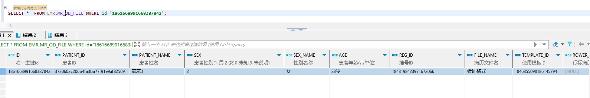

# 领域服务/病历领域 - 新增门诊病历文书信息 - 新增门诊病历文书信息 正向用例
## 请求参数：
``` json
{
  "orgName": "版本测试环境",
  "hospCode": "NXRY",
  "hospName": "版本测试环境",
  "orgCode": "NXRMYY",
  "list": [
    {
      "deptName": "呼吸内科(门)",
      "signFlag": "0",
      "fileName": "验证格式",
      "datasetCode": "03#23#08",
      "patientId": "373060ac206b4fa3ba77f91e9af82569",
      "contentText": "[备注]\n患病天数：[天假数据元]\n起病时间：[起病时间]\n过敏源：[过敏源]\n体温：[0℃]\n心率：[心率]\n签名：[医师签名]",
      "templateId": "1846855098186145794",
      "titleDate": "2024-10-22 09:27:49",
      "sexName": "女",
      "patientName": "贰贰1",
      "sex": "2",
      "deptId": "224707726571106304",
      "stdRecordCode": "EMR020001",
      "isPrint": "0",
      "folderId": "1843188383036264449",
      "stdRecordName": "门(急)诊病历",
      "regId": "1848198423971672066",
      "age": "33岁",
      "fileContent": "test"
    }
  ],
  "operatorId": "349365436797001728",
  "operatorName": "测试医生",
  "operateDate": "2024-10-22 09:27:50"
}
```
## 返回参数：
``` json
{
    "exception": null,
    "apiCode": null,
    "data": {
        "list": [
            {
                "id": "1861668991668387842",
                "sourceId": null
            }
        ]
    },
    "Code": 200,
    "Message": "操作成功"
}
```
## 数据校验：

# 领域服务/病历领域 - 新增门诊病历文书信息 - 必填校验-[orgCode]为空
## 请求参数：
``` json
{
  "orgName": "版本测试环境",
  "hospCode": "NXRY",
  "hospName": "版本测试环境",
  "orgCode": "",
  "list": [
    {
      "deptName": "呼吸内科(门)",
      "signFlag": "0",
      "fileName": "验证格式",
      "datasetCode": "03#23#08",
      "patientId": "373060ac206b4fa3ba77f91e9af82569",
      "contentText": "[备注]\n患病天数：[天假数据元]\n起病时间：[起病时间]\n过敏源：[过敏源]\n体温：[0℃]\n心率：[心率]\n签名：[医师签名]",
      "templateId": "1846855098186145794",
      "titleDate": "2024-10-22 09:27:49",
      "sexName": "女",
      "patientName": "贰贰1",
      "sex": "2",
      "deptId": "224707726571106304",
      "stdRecordCode": "EMR020001",
      "isPrint": "0",
      "folderId": "1843188383036264449",
      "stdRecordName": "门(急)诊病历",
      "regId": "1848198423971672066",
      "age": "33岁",
      "fileContent": "test"
    }
  ],
  "operatorId": "349365436797001728",
  "operatorName": "测试医生",
  "operateDate": "2024-10-22 09:27:50"
}
```
## 返回参数：
``` json
{
  "exception": null,
  "apiCode": null,
  "data": null,
  "Code": 1,
  "Message": "机构编码不能为空"
}
```
# 领域服务/病历领域 - 新增门诊病历文书信息 - 必填校验-[orgName]为空
## 请求参数：
``` json
{
  "orgName": "",
  "hospCode": "NXRY",
  "hospName": "版本测试环境",
  "orgCode": "NXRMYY",
  "list": [
    {
      "deptName": "呼吸内科(门)",
      "signFlag": "0",
      "fileName": "验证格式",
      "datasetCode": "03#23#08",
      "patientId": "373060ac206b4fa3ba77f91e9af82569",
      "contentText": "[备注]\n患病天数：[天假数据元]\n起病时间：[起病时间]\n过敏源：[过敏源]\n体温：[0℃]\n心率：[心率]\n签名：[医师签名]",
      "templateId": "1846855098186145794",
      "titleDate": "2024-10-22 09:27:49",
      "sexName": "女",
      "patientName": "贰贰1",
      "sex": "2",
      "deptId": "224707726571106304",
      "stdRecordCode": "EMR020001",
      "isPrint": "0",
      "folderId": "1843188383036264449",
      "stdRecordName": "门(急)诊病历",
      "regId": "1848198423971672066",
      "age": "33岁",
      "fileContent": "test"
    }
  ],
  "operatorId": "349365436797001728",
  "operatorName": "测试医生",
  "operateDate": "2024-10-22 09:27:50"
}
```
## 返回参数：
``` json
{
  "exception": null,
  "apiCode": null,
  "data": null,
  "Code": 1,
  "Message": "机构名称不能为空"
}
```
# 领域服务/病历领域 - 新增门诊病历文书信息 - 必填校验-[hospCode]为空
## 请求参数：
``` json
{
  "orgName": "版本测试环境",
  "hospCode": "",
  "hospName": "版本测试环境",
  "orgCode": "NXRMYY",
  "list": [
    {
      "deptName": "呼吸内科(门)",
      "signFlag": "0",
      "fileName": "验证格式",
      "datasetCode": "03#23#08",
      "patientId": "373060ac206b4fa3ba77f91e9af82569",
      "contentText": "[备注]\n患病天数：[天假数据元]\n起病时间：[起病时间]\n过敏源：[过敏源]\n体温：[0℃]\n心率：[心率]\n签名：[医师签名]",
      "templateId": "1846855098186145794",
      "titleDate": "2024-10-22 09:27:49",
      "sexName": "女",
      "patientName": "贰贰1",
      "sex": "2",
      "deptId": "224707726571106304",
      "stdRecordCode": "EMR020001",
      "isPrint": "0",
      "folderId": "1843188383036264449",
      "stdRecordName": "门(急)诊病历",
      "regId": "1848198423971672066",
      "age": "33岁",
      "fileContent": "test"
    }
  ],
  "operatorId": "349365436797001728",
  "operatorName": "测试医生",
  "operateDate": "2024-10-22 09:27:50"
}
```
## 返回参数：
``` json
{
  "exception": null,
  "apiCode": null,
  "data": null,
  "Code": 1,
  "Message": "院区编码不能为空"
}
```
# 领域服务/病历领域 - 新增门诊病历文书信息 - 必填校验-[hospName]为空
## 请求参数：
``` json
{
  "orgName": "版本测试环境",
  "hospCode": "NXRY",
  "hospName": "",
  "orgCode": "NXRMYY",
  "list": [
    {
      "deptName": "呼吸内科(门)",
      "signFlag": "0",
      "fileName": "验证格式",
      "datasetCode": "03#23#08",
      "patientId": "373060ac206b4fa3ba77f91e9af82569",
      "contentText": "[备注]\n患病天数：[天假数据元]\n起病时间：[起病时间]\n过敏源：[过敏源]\n体温：[0℃]\n心率：[心率]\n签名：[医师签名]",
      "templateId": "1846855098186145794",
      "titleDate": "2024-10-22 09:27:49",
      "sexName": "女",
      "patientName": "贰贰1",
      "sex": "2",
      "deptId": "224707726571106304",
      "stdRecordCode": "EMR020001",
      "isPrint": "0",
      "folderId": "1843188383036264449",
      "stdRecordName": "门(急)诊病历",
      "regId": "1848198423971672066",
      "age": "33岁",
      "fileContent": "test"
    }
  ],
  "operatorId": "349365436797001728",
  "operatorName": "测试医生",
  "operateDate": "2024-10-22 09:27:50"
}
```
## 返回参数：
``` json
{
  "exception": null,
  "apiCode": null,
  "data": null,
  "Code": 1,
  "Message": "院区名称不能为空"
}
```
# 领域服务/病历领域 - 新增门诊病历文书信息 - 必填校验-[operatorId]为空
## 请求参数：
``` json
{
  "orgName": "版本测试环境",
  "hospCode": "NXRY",
  "hospName": "版本测试环境",
  "orgCode": "NXRMYY",
  "list": [
    {
      "deptName": "呼吸内科(门)",
      "signFlag": "0",
      "fileName": "验证格式",
      "datasetCode": "03#23#08",
      "patientId": "373060ac206b4fa3ba77f91e9af82569",
      "contentText": "[备注]\n患病天数：[天假数据元]\n起病时间：[起病时间]\n过敏源：[过敏源]\n体温：[0℃]\n心率：[心率]\n签名：[医师签名]",
      "templateId": "1846855098186145794",
      "titleDate": "2024-10-22 09:27:49",
      "sexName": "女",
      "patientName": "贰贰1",
      "sex": "2",
      "deptId": "224707726571106304",
      "stdRecordCode": "EMR020001",
      "isPrint": "0",
      "folderId": "1843188383036264449",
      "stdRecordName": "门(急)诊病历",
      "regId": "1848198423971672066",
      "age": "33岁",
      "fileContent": "test"
    }
  ],
  "operatorId": "",
  "operatorName": "测试医生",
  "operateDate": "2024-10-22 09:27:50"
}
```
## 返回参数：
``` json
{
  "exception": null,
  "apiCode": null,
  "data": null,
  "Code": 1,
  "Message": "操作人id不能为空"
}
```
# 领域服务/病历领域 - 新增门诊病历文书信息 - 必填校验-[operatorName]为空
## 请求参数：
``` json
{
  "orgName": "版本测试环境",
  "hospCode": "NXRY",
  "hospName": "版本测试环境",
  "orgCode": "NXRMYY",
  "list": [
    {
      "deptName": "呼吸内科(门)",
      "signFlag": "0",
      "fileName": "验证格式",
      "datasetCode": "03#23#08",
      "patientId": "373060ac206b4fa3ba77f91e9af82569",
      "contentText": "[备注]\n患病天数：[天假数据元]\n起病时间：[起病时间]\n过敏源：[过敏源]\n体温：[0℃]\n心率：[心率]\n签名：[医师签名]",
      "templateId": "1846855098186145794",
      "titleDate": "2024-10-22 09:27:49",
      "sexName": "女",
      "patientName": "贰贰1",
      "sex": "2",
      "deptId": "224707726571106304",
      "stdRecordCode": "EMR020001",
      "isPrint": "0",
      "folderId": "1843188383036264449",
      "stdRecordName": "门(急)诊病历",
      "regId": "1848198423971672066",
      "age": "33岁",
      "fileContent": "test"
    }
  ],
  "operatorId": "349365436797001728",
  "operatorName": "",
  "operateDate": "2024-10-22 09:27:50"
}
```
## 返回参数：
``` json
{
  "exception": null,
  "apiCode": null,
  "data": null,
  "Code": 1,
  "Message": "操作人姓名不能为空"
}
```
# 领域服务/病历领域 - 新增门诊病历文书信息 - 必填校验-[operateDate]为空
## 请求参数：
``` json
{
  "orgName": "版本测试环境",
  "hospCode": "NXRY",
  "hospName": "版本测试环境",
  "orgCode": "NXRMYY",
  "list": [
    {
      "deptName": "呼吸内科(门)",
      "signFlag": "0",
      "fileName": "验证格式",
      "datasetCode": "03#23#08",
      "patientId": "373060ac206b4fa3ba77f91e9af82569",
      "contentText": "[备注]\n患病天数：[天假数据元]\n起病时间：[起病时间]\n过敏源：[过敏源]\n体温：[0℃]\n心率：[心率]\n签名：[医师签名]",
      "templateId": "1846855098186145794",
      "titleDate": "2024-10-22 09:27:49",
      "sexName": "女",
      "patientName": "贰贰1",
      "sex": "2",
      "deptId": "224707726571106304",
      "stdRecordCode": "EMR020001",
      "isPrint": "0",
      "folderId": "1843188383036264449",
      "stdRecordName": "门(急)诊病历",
      "regId": "1848198423971672066",
      "age": "33岁",
      "fileContent": "test"
    }
  ],
  "operatorId": "349365436797001728",
  "operatorName": "测试医生",
  "operateDate": ""
}
```
## 返回参数：
``` json
{
  "exception": null,
  "apiCode": null,
  "data": null,
  "Code": 1,
  "Message": "操作时间不能为空"
}
```
# 领域服务/病历领域 - 新增门诊病历文书信息 - 必填校验-[list]为空
## 请求参数：
``` json
{
  "orgName": "版本测试环境",
  "hospCode": "NXRY",
  "hospName": "版本测试环境",
  "orgCode": "NXRMYY",
  "list": null,
  "operatorId": "349365436797001728",
  "operatorName": "测试医生",
  "operateDate": "2024-10-22 09:27:50"
}
```
## 返回参数：
``` json
{
  "exception": null,
  "apiCode": null,
  "data": null,
  "Code": 1,
  "Message": "待新增的门诊病历文书对象集合不能为空"
}
```
# 领域服务/病历领域 - 新增门诊病历文书信息 - 必填校验-[list.patientName]为空
## 请求参数：
``` json
{
  "orgName": "版本测试环境",
  "hospCode": "NXRY",
  "hospName": "版本测试环境",
  "orgCode": "NXRMYY",
  "list": [
    {
      "deptName": "呼吸内科(门)",
      "signFlag": "0",
      "fileName": "验证格式",
      "datasetCode": "03#23#08",
      "patientId": "373060ac206b4fa3ba77f91e9af82569",
      "contentText": "[备注]\n患病天数：[天假数据元]\n起病时间：[起病时间]\n过敏源：[过敏源]\n体温：[0℃]\n心率：[心率]\n签名：[医师签名]",
      "templateId": "1846855098186145794",
      "titleDate": "2024-10-22 09:27:49",
      "sexName": "女",
      "patientName": null,
      "sex": "2",
      "deptId": "224707726571106304",
      "stdRecordCode": "EMR020001",
      "isPrint": "0",
      "folderId": "1843188383036264449",
      "stdRecordName": "门(急)诊病历",
      "regId": "1848198423971672066",
      "age": "33岁",
      "fileContent": "test"
    }
  ],
  "operatorId": "349365436797001728",
  "operatorName": "测试医生",
  "operateDate": "2024-10-22 09:27:50"
}
```
## 返回参数：
``` json
{
  "exception": null,
  "apiCode": null,
  "data": null,
  "Code": 1,
  "Message": "患者姓名不能为空"
}
```
# 领域服务/病历领域 - 新增门诊病历文书信息 - 必填校验-[list.sex]为空
## 请求参数：
``` json
{
  "orgName": "版本测试环境",
  "hospCode": "NXRY",
  "hospName": "版本测试环境",
  "orgCode": "NXRMYY",
  "list": [
    {
      "deptName": "呼吸内科(门)",
      "signFlag": "0",
      "fileName": "验证格式",
      "datasetCode": "03#23#08",
      "patientId": "373060ac206b4fa3ba77f91e9af82569",
      "contentText": "[备注]\n患病天数：[天假数据元]\n起病时间：[起病时间]\n过敏源：[过敏源]\n体温：[0℃]\n心率：[心率]\n签名：[医师签名]",
      "templateId": "1846855098186145794",
      "titleDate": "2024-10-22 09:27:49",
      "sexName": "女",
      "patientName": "贰贰1",
      "sex": null,
      "deptId": "224707726571106304",
      "stdRecordCode": "EMR020001",
      "isPrint": "0",
      "folderId": "1843188383036264449",
      "stdRecordName": "门(急)诊病历",
      "regId": "1848198423971672066",
      "age": "33岁",
      "fileContent": "test"
    }
  ],
  "operatorId": "349365436797001728",
  "operatorName": "测试医生",
  "operateDate": "2024-10-22 09:27:50"
}
```
## 返回参数：
``` json
{
  "exception": null,
  "apiCode": null,
  "data": null,
  "Code": 1,
  "Message": "患者性别不能为空"
}
```
# 领域服务/病历领域 - 新增门诊病历文书信息 - 必填校验-[list.sexName]为空
## 请求参数：
``` json
{
  "orgName": "版本测试环境",
  "hospCode": "NXRY",
  "hospName": "版本测试环境",
  "orgCode": "NXRMYY",
  "list": [
    {
      "deptName": "呼吸内科(门)",
      "signFlag": "0",
      "fileName": "验证格式",
      "datasetCode": "03#23#08",
      "patientId": "373060ac206b4fa3ba77f91e9af82569",
      "contentText": "[备注]\n患病天数：[天假数据元]\n起病时间：[起病时间]\n过敏源：[过敏源]\n体温：[0℃]\n心率：[心率]\n签名：[医师签名]",
      "templateId": "1846855098186145794",
      "titleDate": "2024-10-22 09:27:49",
      "sexName": null,
      "patientName": "贰贰1",
      "sex": "2",
      "deptId": "224707726571106304",
      "stdRecordCode": "EMR020001",
      "isPrint": "0",
      "folderId": "1843188383036264449",
      "stdRecordName": "门(急)诊病历",
      "regId": "1848198423971672066",
      "age": "33岁",
      "fileContent": "test"
    }
  ],
  "operatorId": "349365436797001728",
  "operatorName": "测试医生",
  "operateDate": "2024-10-22 09:27:50"
}
```
## 返回参数：
``` json
{
  "exception": null,
  "apiCode": null,
  "data": null,
  "Code": 1,
  "Message": "性别名称不能为空"
}
```
# 领域服务/病历领域 - 新增门诊病历文书信息 - 必填校验-[list.age]为空
## 请求参数：
``` json
{
  "orgName": "版本测试环境",
  "hospCode": "NXRY",
  "hospName": "版本测试环境",
  "orgCode": "NXRMYY",
  "list": [
    {
      "deptName": "呼吸内科(门)",
      "signFlag": "0",
      "fileName": "验证格式",
      "datasetCode": "03#23#08",
      "patientId": "373060ac206b4fa3ba77f91e9af82569",
      "contentText": "[备注]\n患病天数：[天假数据元]\n起病时间：[起病时间]\n过敏源：[过敏源]\n体温：[0℃]\n心率：[心率]\n签名：[医师签名]",
      "templateId": "1846855098186145794",
      "titleDate": "2024-10-22 09:27:49",
      "sexName": "女",
      "patientName": "贰贰1",
      "sex": "2",
      "deptId": "224707726571106304",
      "stdRecordCode": "EMR020001",
      "isPrint": "0",
      "folderId": "1843188383036264449",
      "stdRecordName": "门(急)诊病历",
      "regId": "1848198423971672066",
      "age": null,
      "fileContent": "test"
    }
  ],
  "operatorId": "349365436797001728",
  "operatorName": "测试医生",
  "operateDate": "2024-10-22 09:27:50"
}
```
## 返回参数：
``` json
{
  "exception": null,
  "apiCode": null,
  "data": null,
  "Code": 1,
  "Message": "年龄不能为空"
}
```
# 领域服务/病历领域 - 新增门诊病历文书信息 - 必填校验-[list.regId]为空
## 请求参数：
``` json
{
  "orgName": "版本测试环境",
  "hospCode": "NXRY",
  "hospName": "版本测试环境",
  "orgCode": "NXRMYY",
  "list": [
    {
      "deptName": "呼吸内科(门)",
      "signFlag": "0",
      "fileName": "验证格式",
      "datasetCode": "03#23#08",
      "patientId": "373060ac206b4fa3ba77f91e9af82569",
      "contentText": "[备注]\n患病天数：[天假数据元]\n起病时间：[起病时间]\n过敏源：[过敏源]\n体温：[0℃]\n心率：[心率]\n签名：[医师签名]",
      "templateId": "1846855098186145794",
      "titleDate": "2024-10-22 09:27:49",
      "sexName": "女",
      "patientName": "贰贰1",
      "sex": "2",
      "deptId": "224707726571106304",
      "stdRecordCode": "EMR020001",
      "isPrint": "0",
      "folderId": "1843188383036264449",
      "stdRecordName": "门(急)诊病历",
      "regId": null,
      "age": "33岁",
      "fileContent": "test"
    }
  ],
  "operatorId": "349365436797001728",
  "operatorName": "测试医生",
  "operateDate": "2024-10-22 09:27:50"
}
```
## 返回参数：
``` json
{
  "exception": null,
  "apiCode": null,
  "data": null,
  "Code": 1,
  "Message": "挂号id不能为空"
}
```
# 领域服务/病历领域 - 新增门诊病历文书信息 - 必填校验-[list.fileName]为空
## 请求参数：
``` json
{
  "orgName": "版本测试环境",
  "hospCode": "NXRY",
  "hospName": "版本测试环境",
  "orgCode": "NXRMYY",
  "list": [
    {
      "deptName": "呼吸内科(门)",
      "signFlag": "0",
      "fileName": null,
      "datasetCode": "03#23#08",
      "patientId": "373060ac206b4fa3ba77f91e9af82569",
      "contentText": "[备注]\n患病天数：[天假数据元]\n起病时间：[起病时间]\n过敏源：[过敏源]\n体温：[0℃]\n心率：[心率]\n签名：[医师签名]",
      "templateId": "1846855098186145794",
      "titleDate": "2024-10-22 09:27:49",
      "sexName": "女",
      "patientName": "贰贰1",
      "sex": "2",
      "deptId": "224707726571106304",
      "stdRecordCode": "EMR020001",
      "isPrint": "0",
      "folderId": "1843188383036264449",
      "stdRecordName": "门(急)诊病历",
      "regId": "1848198423971672066",
      "age": "33岁",
      "fileContent": "test"
    }
  ],
  "operatorId": "349365436797001728",
  "operatorName": "测试医生",
  "operateDate": "2024-10-22 09:27:50"
}
```
## 返回参数：
``` json
{
  "exception": null,
  "apiCode": null,
  "data": null,
  "Code": 1,
  "Message": "病历文件名不能为空"
}
```
# 领域服务/病历领域 - 新增门诊病历文书信息 - 必填校验-[list.templateId]为空
## 请求参数：
``` json
{
  "orgName": "版本测试环境",
  "hospCode": "NXRY",
  "hospName": "版本测试环境",
  "orgCode": "NXRMYY",
  "list": [
    {
      "deptName": "呼吸内科(门)",
      "signFlag": "0",
      "fileName": "验证格式",
      "datasetCode": "03#23#08",
      "patientId": "373060ac206b4fa3ba77f91e9af82569",
      "contentText": "[备注]\n患病天数：[天假数据元]\n起病时间：[起病时间]\n过敏源：[过敏源]\n体温：[0℃]\n心率：[心率]\n签名：[医师签名]",
      "templateId": null,
      "titleDate": "2024-10-22 09:27:49",
      "sexName": "女",
      "patientName": "贰贰1",
      "sex": "2",
      "deptId": "224707726571106304",
      "stdRecordCode": "EMR020001",
      "isPrint": "0",
      "folderId": "1843188383036264449",
      "stdRecordName": "门(急)诊病历",
      "regId": "1848198423971672066",
      "age": "33岁",
      "fileContent": "test"
    }
  ],
  "operatorId": "349365436797001728",
  "operatorName": "测试医生",
  "operateDate": "2024-10-22 09:27:50"
}
```
## 返回参数：
``` json
{
  "exception": null,
  "apiCode": null,
  "data": null,
  "Code": 1,
  "Message": "使用模板ID不能为空"
}
```
# 领域服务/病历领域 - 新增门诊病历文书信息 - 必填校验-[list.titleDate]为空
## 请求参数：
``` json
{
  "orgName": "版本测试环境",
  "hospCode": "NXRY",
  "hospName": "版本测试环境",
  "orgCode": "NXRMYY",
  "list": [
    {
      "deptName": "呼吸内科(门)",
      "signFlag": "0",
      "fileName": "验证格式",
      "datasetCode": "03#23#08",
      "patientId": "373060ac206b4fa3ba77f91e9af82569",
      "contentText": "[备注]\n患病天数：[天假数据元]\n起病时间：[起病时间]\n过敏源：[过敏源]\n体温：[0℃]\n心率：[心率]\n签名：[医师签名]",
      "templateId": "1846855098186145794",
      "titleDate": null,
      "sexName": "女",
      "patientName": "贰贰1",
      "sex": "2",
      "deptId": "224707726571106304",
      "stdRecordCode": "EMR020001",
      "isPrint": "0",
      "folderId": "1843188383036264449",
      "stdRecordName": "门(急)诊病历",
      "regId": "1848198423971672066",
      "age": "33岁",
      "fileContent": "test"
    }
  ],
  "operatorId": "349365436797001728",
  "operatorName": "测试医生",
  "operateDate": "2024-10-22 09:27:50"
}
```
## 返回参数：
``` json
{
  "exception": null,
  "apiCode": null,
  "data": null,
  "Code": 1,
  "Message": "标题时间不能为空"
}
```
# 领域服务/病历领域 - 新增门诊病历文书信息 - 必填校验-[list.deptId]为空
## 请求参数：
``` json
{
  "orgName": "版本测试环境",
  "hospCode": "NXRY",
  "hospName": "版本测试环境",
  "orgCode": "NXRMYY",
  "list": [
    {
      "deptName": "呼吸内科(门)",
      "signFlag": "0",
      "fileName": "验证格式",
      "datasetCode": "03#23#08",
      "patientId": "373060ac206b4fa3ba77f91e9af82569",
      "contentText": "[备注]\n患病天数：[天假数据元]\n起病时间：[起病时间]\n过敏源：[过敏源]\n体温：[0℃]\n心率：[心率]\n签名：[医师签名]",
      "templateId": "1846855098186145794",
      "titleDate": "2024-10-22 09:27:49",
      "sexName": "女",
      "patientName": "贰贰1",
      "sex": "2",
      "deptId": null,
      "stdRecordCode": "EMR020001",
      "isPrint": "0",
      "folderId": "1843188383036264449",
      "stdRecordName": "门(急)诊病历",
      "regId": "1848198423971672066",
      "age": "33岁",
      "fileContent": "test"
    }
  ],
  "operatorId": "349365436797001728",
  "operatorName": "测试医生",
  "operateDate": "2024-10-22 09:27:50"
}
```
## 返回参数：
``` json
{
  "exception": null,
  "apiCode": null,
  "data": null,
  "Code": 1,
  "Message": "创建科室ID不能为空"
}
```
# 领域服务/病历领域 - 新增门诊病历文书信息 - 必填校验-[list.deptName]为空
## 请求参数：
``` json
{
  "orgName": "版本测试环境",
  "hospCode": "NXRY",
  "hospName": "版本测试环境",
  "orgCode": "NXRMYY",
  "list": [
    {
      "deptName": null,
      "signFlag": "0",
      "fileName": "验证格式",
      "datasetCode": "03#23#08",
      "patientId": "373060ac206b4fa3ba77f91e9af82569",
      "contentText": "[备注]\n患病天数：[天假数据元]\n起病时间：[起病时间]\n过敏源：[过敏源]\n体温：[0℃]\n心率：[心率]\n签名：[医师签名]",
      "templateId": "1846855098186145794",
      "titleDate": "2024-10-22 09:27:49",
      "sexName": "女",
      "patientName": "贰贰1",
      "sex": "2",
      "deptId": "224707726571106304",
      "stdRecordCode": "EMR020001",
      "isPrint": "0",
      "folderId": "1843188383036264449",
      "stdRecordName": "门(急)诊病历",
      "regId": "1848198423971672066",
      "age": "33岁",
      "fileContent": "test"
    }
  ],
  "operatorId": "349365436797001728",
  "operatorName": "测试医生",
  "operateDate": "2024-10-22 09:27:50"
}
```
## 返回参数：
``` json
{
  "exception": null,
  "apiCode": null,
  "data": null,
  "Code": 1,
  "Message": "创建科室名称不能为空"
}
```
# 领域服务/病历领域 - 新增门诊病历文书信息 - 必填校验-[list.stdRecordCode]为空
## 请求参数：
``` json
{
  "orgName": "版本测试环境",
  "hospCode": "NXRY",
  "hospName": "版本测试环境",
  "orgCode": "NXRMYY",
  "list": [
    {
      "deptName": "呼吸内科(门)",
      "signFlag": "0",
      "fileName": "验证格式",
      "datasetCode": "03#23#08",
      "patientId": "373060ac206b4fa3ba77f91e9af82569",
      "contentText": "[备注]\n患病天数：[天假数据元]\n起病时间：[起病时间]\n过敏源：[过敏源]\n体温：[0℃]\n心率：[心率]\n签名：[医师签名]",
      "templateId": "1846855098186145794",
      "titleDate": "2024-10-22 09:27:49",
      "sexName": "女",
      "patientName": "贰贰1",
      "sex": "2",
      "deptId": "224707726571106304",
      "stdRecordCode": null,
      "isPrint": "0",
      "folderId": "1843188383036264449",
      "stdRecordName": "门(急)诊病历",
      "regId": "1848198423971672066",
      "age": "33岁",
      "fileContent": "test"
    }
  ],
  "operatorId": "349365436797001728",
  "operatorName": "测试医生",
  "operateDate": "2024-10-22 09:27:50"
}
```
## 返回参数：
``` json
{
  "exception": null,
  "apiCode": null,
  "data": null,
  "Code": 1,
  "Message": "对应的业务活动记录编码不能为空"
}
```
# 领域服务/病历领域 - 新增门诊病历文书信息 - 必填校验-[list.stdRecordName]为空
## 请求参数：
``` json
{
  "orgName": "版本测试环境",
  "hospCode": "NXRY",
  "hospName": "版本测试环境",
  "orgCode": "NXRMYY",
  "list": [
    {
      "deptName": "呼吸内科(门)",
      "signFlag": "0",
      "fileName": "验证格式",
      "datasetCode": "03#23#08",
      "patientId": "373060ac206b4fa3ba77f91e9af82569",
      "contentText": "[备注]\n患病天数：[天假数据元]\n起病时间：[起病时间]\n过敏源：[过敏源]\n体温：[0℃]\n心率：[心率]\n签名：[医师签名]",
      "templateId": "1846855098186145794",
      "titleDate": "2024-10-22 09:27:49",
      "sexName": "女",
      "patientName": "贰贰1",
      "sex": "2",
      "deptId": "224707726571106304",
      "stdRecordCode": "EMR020001",
      "isPrint": "0",
      "folderId": "1843188383036264449",
      "stdRecordName": null,
      "regId": "1848198423971672066",
      "age": "33岁",
      "fileContent": "test"
    }
  ],
  "operatorId": "349365436797001728",
  "operatorName": "测试医生",
  "operateDate": "2024-10-22 09:27:50"
}
```
## 返回参数：
``` json
{
  "exception": null,
  "apiCode": null,
  "data": null,
  "Code": 1,
  "Message": "对应的业务活动记录名称不能为空"
}
```
# 领域服务/病历领域 - 新增门诊病历文书信息 - 必填校验-[list.folderId]为空
## 请求参数：
``` json
{
  "orgName": "版本测试环境",
  "hospCode": "NXRY",
  "hospName": "版本测试环境",
  "orgCode": "NXRMYY",
  "list": [
    {
      "deptName": "呼吸内科(门)",
      "signFlag": "0",
      "fileName": "验证格式",
      "datasetCode": "03#23#08",
      "patientId": "373060ac206b4fa3ba77f91e9af82569",
      "contentText": "[备注]\n患病天数：[天假数据元]\n起病时间：[起病时间]\n过敏源：[过敏源]\n体温：[0℃]\n心率：[心率]\n签名：[医师签名]",
      "templateId": "1846855098186145794",
      "titleDate": "2024-10-22 09:27:49",
      "sexName": "女",
      "patientName": "贰贰1",
      "sex": "2",
      "deptId": "224707726571106304",
      "stdRecordCode": "EMR020001",
      "isPrint": "0",
      "folderId": null,
      "stdRecordName": "门(急)诊病历",
      "regId": "1848198423971672066",
      "age": "33岁",
      "fileContent": "test"
    }
  ],
  "operatorId": "349365436797001728",
  "operatorName": "测试医生",
  "operateDate": "2024-10-22 09:27:50"
}
```
## 返回参数：
``` json
{
  "exception": null,
  "apiCode": null,
  "data": null,
  "Code": 1,
  "Message": "所属配置的标准病历文件夹id不能为空"
}
```
# 领域服务/病历领域 - 新增门诊病历文书信息 - 必填校验-[list.fileContent]为空
## 请求参数：
``` json
{
  "orgName": "版本测试环境",
  "hospCode": "NXRY",
  "hospName": "版本测试环境",
  "orgCode": "NXRMYY",
  "list": [
    {
      "deptName": "呼吸内科(门)",
      "signFlag": "0",
      "fileName": "验证格式",
      "datasetCode": "03#23#08",
      "patientId": "373060ac206b4fa3ba77f91e9af82569",
      "contentText": "[备注]\n患病天数：[天假数据元]\n起病时间：[起病时间]\n过敏源：[过敏源]\n体温：[0℃]\n心率：[心率]\n签名：[医师签名]",
      "templateId": "1846855098186145794",
      "titleDate": "2024-10-22 09:27:49",
      "sexName": "女",
      "patientName": "贰贰1",
      "sex": "2",
      "deptId": "224707726571106304",
      "stdRecordCode": "EMR020001",
      "isPrint": "0",
      "folderId": "1843188383036264449",
      "stdRecordName": "门(急)诊病历",
      "regId": "1848198423971672066",
      "age": "33岁",
      "fileContent": null
    }
  ],
  "operatorId": "349365436797001728",
  "operatorName": "测试医生",
  "operateDate": "2024-10-22 09:27:50"
}
```
## 返回参数：
``` json
{
  "exception": null,
  "apiCode": null,
  "data": null,
  "Code": 1,
  "Message": "病历文书带结构的内容不能为空"
}
```
# 领域服务/病历领域 - 新增门诊病历文书信息 - 必填校验-[list.contentText]为空
## 请求参数：
``` json
{
  "orgName": "版本测试环境",
  "hospCode": "NXRY",
  "hospName": "版本测试环境",
  "orgCode": "NXRMYY",
  "list": [
    {
      "deptName": "呼吸内科(门)",
      "signFlag": "0",
      "fileName": "验证格式",
      "datasetCode": "03#23#08",
      "patientId": "373060ac206b4fa3ba77f91e9af82569",
      "contentText": null,
      "templateId": "1846855098186145794",
      "titleDate": "2024-10-22 09:27:49",
      "sexName": "女",
      "patientName": "贰贰1",
      "sex": "2",
      "deptId": "224707726571106304",
      "stdRecordCode": "EMR020001",
      "isPrint": "0",
      "folderId": "1843188383036264449",
      "stdRecordName": "门(急)诊病历",
      "regId": "1848198423971672066",
      "age": "33岁",
      "fileContent": "test"
    }
  ],
  "operatorId": "349365436797001728",
  "operatorName": "测试医生",
  "operateDate": "2024-10-22 09:27:50"
}
```
## 返回参数：
``` json
{
  "exception": null,
  "apiCode": null,
  "data": null,
  "Code": 1,
  "Message": "病历文书纯文本内容不能为空"
}
```
# 领域服务/病历领域 - 新增门诊病历文书信息 - 枚举用例-[list.sex] 枚举值为 1(性别为患者性别()
## 请求参数：
``` json
{
  "orgName": "版本测试环境",
  "hospCode": "NXRY",
  "hospName": "版本测试环境",
  "orgCode": "NXRMYY",
  "list": [
    {
      "deptName": "呼吸内科(门)",
      "signFlag": "0",
      "fileName": "验证格式",
      "datasetCode": "03#23#08",
      "patientId": "373060ac206b4fa3ba77f91e9af82569",
      "contentText": "[备注]\n患病天数：[天假数据元]\n起病时间：[起病时间]\n过敏源：[过敏源]\n体温：[0℃]\n心率：[心率]\n签名：[医师签名]",
      "templateId": "1846855098186145794",
      "titleDate": "2024-10-22 09:27:49",
      "sexName": "女",
      "patientName": "贰贰1",
      "sex": "1",
      "deptId": "224707726571106304",
      "stdRecordCode": "EMR020001",
      "isPrint": "0",
      "folderId": "1843188383036264449",
      "stdRecordName": "门(急)诊病历",
      "regId": "1848198423971672066",
      "age": "33岁",
      "fileContent": "test"
    }
  ],
  "operatorId": "349365436797001728",
  "operatorName": "测试医生",
  "operateDate": "2024-10-22 09:27:50"
}
```
## 返回参数：
``` json
{
  "exception": null,
  "apiCode": null,
  "data": null,
  "Code": 1,
  "Message": "该门诊病历文书已经存在"
}
```
# 领域服务/病历领域 - 新增门诊病历文书信息 - 枚举用例-[list.sex] 枚举值为 2(性别为男)
## 请求参数：
``` json
{
  "orgName": "版本测试环境",
  "hospCode": "NXRY",
  "hospName": "版本测试环境",
  "orgCode": "NXRMYY",
  "list": [
    {
      "deptName": "呼吸内科(门)",
      "signFlag": "0",
      "fileName": "验证格式",
      "datasetCode": "03#23#08",
      "patientId": "373060ac206b4fa3ba77f91e9af82569",
      "contentText": "[备注]\n患病天数：[天假数据元]\n起病时间：[起病时间]\n过敏源：[过敏源]\n体温：[0℃]\n心率：[心率]\n签名：[医师签名]",
      "templateId": "1846855098186145794",
      "titleDate": "2024-10-22 09:27:49",
      "sexName": "女",
      "patientName": "贰贰1",
      "sex": "2",
      "deptId": "224707726571106304",
      "stdRecordCode": "EMR020001",
      "isPrint": "0",
      "folderId": "1843188383036264449",
      "stdRecordName": "门(急)诊病历",
      "regId": "1848198423971672066",
      "age": "33岁",
      "fileContent": "test"
    }
  ],
  "operatorId": "349365436797001728",
  "operatorName": "测试医生",
  "operateDate": "2024-10-22 09:27:50"
}
```
## 返回参数：
``` json
{
  "exception": null,
  "apiCode": null,
  "data": null,
  "Code": 1,
  "Message": "该门诊病历文书已经存在"
}
```
# 领域服务/病历领域 - 新增门诊病历文书信息 - 枚举用例-[list.sex] 枚举值为 0(性别为女)
## 请求参数：
``` json
{
  "orgName": "版本测试环境",
  "hospCode": "NXRY",
  "hospName": "版本测试环境",
  "orgCode": "NXRMYY",
  "list": [
    {
      "deptName": "呼吸内科(门)",
      "signFlag": "0",
      "fileName": "验证格式",
      "datasetCode": "03#23#08",
      "patientId": "373060ac206b4fa3ba77f91e9af82569",
      "contentText": "[备注]\n患病天数：[天假数据元]\n起病时间：[起病时间]\n过敏源：[过敏源]\n体温：[0℃]\n心率：[心率]\n签名：[医师签名]",
      "templateId": "1846855098186145794",
      "titleDate": "2024-10-22 09:27:49",
      "sexName": "女",
      "patientName": "贰贰1",
      "sex": "0",
      "deptId": "224707726571106304",
      "stdRecordCode": "EMR020001",
      "isPrint": "0",
      "folderId": "1843188383036264449",
      "stdRecordName": "门(急)诊病历",
      "regId": "1848198423971672066",
      "age": "33岁",
      "fileContent": "test"
    }
  ],
  "operatorId": "349365436797001728",
  "operatorName": "测试医生",
  "operateDate": "2024-10-22 09:27:50"
}
```
## 返回参数：
``` json
{
  "exception": null,
  "apiCode": null,
  "data": null,
  "Code": 1,
  "Message": "该门诊病历文书已经存在"
}
```
# 领域服务/病历领域 - 新增门诊病历文书信息 - 枚举用例-[list.sex] 枚举值为 9(性别为未知)
## 请求参数：
``` json
{
  "orgName": "版本测试环境",
  "hospCode": "NXRY",
  "hospName": "版本测试环境",
  "orgCode": "NXRMYY",
  "list": [
    {
      "deptName": "呼吸内科(门)",
      "signFlag": "0",
      "fileName": "验证格式",
      "datasetCode": "03#23#08",
      "patientId": "373060ac206b4fa3ba77f91e9af82569",
      "contentText": "[备注]\n患病天数：[天假数据元]\n起病时间：[起病时间]\n过敏源：[过敏源]\n体温：[0℃]\n心率：[心率]\n签名：[医师签名]",
      "templateId": "1846855098186145794",
      "titleDate": "2024-10-22 09:27:49",
      "sexName": "女",
      "patientName": "贰贰1",
      "sex": "9",
      "deptId": "224707726571106304",
      "stdRecordCode": "EMR020001",
      "isPrint": "0",
      "folderId": "1843188383036264449",
      "stdRecordName": "门(急)诊病历",
      "regId": "1848198423971672066",
      "age": "33岁",
      "fileContent": "test"
    }
  ],
  "operatorId": "349365436797001728",
  "operatorName": "测试医生",
  "operateDate": "2024-10-22 09:27:50"
}
```
## 返回参数：
``` json
{
  "exception": null,
  "apiCode": null,
  "data": null,
  "Code": 1,
  "Message": "该门诊病历文书已经存在"
}
```
# 领域服务/病历领域 - 新增门诊病历文书信息 - 依赖用例-[operatorName]赋值为依赖用例测试值
## 请求参数：
``` json
{
  "orgName": "版本测试环境",
  "hospCode": "NXRY",
  "hospName": "版本测试环境",
  "orgCode": "NXRMYY",
  "list": [
    {
      "deptName": "呼吸内科(门)",
      "signFlag": "0",
      "fileName": "验证格式",
      "datasetCode": "03#23#08",
      "patientId": "373060ac206b4fa3ba77f91e9af82569",
      "contentText": "[备注]\n患病天数：[天假数据元]\n起病时间：[起病时间]\n过敏源：[过敏源]\n体温：[0℃]\n心率：[心率]\n签名：[医师签名]",
      "templateId": "1846855098186145794",
      "titleDate": "2024-10-22 09:27:49",
      "sexName": "女",
      "patientName": "贰贰1",
      "sex": "2",
      "deptId": "224707726571106304",
      "stdRecordCode": "EMR020001",
      "isPrint": "0",
      "folderId": "1843188383036264449",
      "stdRecordName": "门(急)诊病历",
      "regId": "1848198423971672066",
      "age": "33岁",
      "fileContent": "test"
    }
  ],
  "operatorId": "349365436797001728",
  "operatorName": "依赖用例测试值",
  "operateDate": "2024-10-22 09:27:50"
}
```
## 返回参数：
``` json
{
  "exception": null,
  "apiCode": null,
  "data": null,
  "Code": 1,
  "Message": "该门诊病历文书已经存在"
}
```
# 领域服务/病历领域 - 新增门诊病历文书信息 - 依赖用例-[operatorId]赋值为依赖用例测试值
## 请求参数：
``` json
{
  "orgName": "版本测试环境",
  "hospCode": "NXRY",
  "hospName": "版本测试环境",
  "orgCode": "NXRMYY",
  "list": [
    {
      "deptName": "呼吸内科(门)",
      "signFlag": "0",
      "fileName": "验证格式",
      "datasetCode": "03#23#08",
      "patientId": "373060ac206b4fa3ba77f91e9af82569",
      "contentText": "[备注]\n患病天数：[天假数据元]\n起病时间：[起病时间]\n过敏源：[过敏源]\n体温：[0℃]\n心率：[心率]\n签名：[医师签名]",
      "templateId": "1846855098186145794",
      "titleDate": "2024-10-22 09:27:49",
      "sexName": "女",
      "patientName": "贰贰1",
      "sex": "2",
      "deptId": "224707726571106304",
      "stdRecordCode": "EMR020001",
      "isPrint": "0",
      "folderId": "1843188383036264449",
      "stdRecordName": "门(急)诊病历",
      "regId": "1848198423971672066",
      "age": "33岁",
      "fileContent": "test"
    }
  ],
  "operatorId": "依赖用例测试值",
  "operatorName": "测试医生",
  "operateDate": "2024-10-22 09:27:50"
}
```
## 返回参数：
``` json
{
  "exception": null,
  "apiCode": null,
  "data": null,
  "Code": 1,
  "Message": "该门诊病历文书已经存在"
}
```
# 领域服务/病历领域 - 新增门诊病历文书信息 - 依赖用例-[list.deptName]赋值为依赖用例测试值
## 请求参数：
``` json
{
  "orgName": "版本测试环境",
  "hospCode": "NXRY",
  "hospName": "版本测试环境",
  "orgCode": "NXRMYY",
  "list": [
    {
      "deptName": "依赖用例测试值",
      "signFlag": "0",
      "fileName": "验证格式",
      "datasetCode": "03#23#08",
      "patientId": "373060ac206b4fa3ba77f91e9af82569",
      "contentText": "[备注]\n患病天数：[天假数据元]\n起病时间：[起病时间]\n过敏源：[过敏源]\n体温：[0℃]\n心率：[心率]\n签名：[医师签名]",
      "templateId": "1846855098186145794",
      "titleDate": "2024-10-22 09:27:49",
      "sexName": "女",
      "patientName": "贰贰1",
      "sex": "2",
      "deptId": "224707726571106304",
      "stdRecordCode": "EMR020001",
      "isPrint": "0",
      "folderId": "1843188383036264449",
      "stdRecordName": "门(急)诊病历",
      "regId": "1848198423971672066",
      "age": "33岁",
      "fileContent": "test"
    }
  ],
  "operatorId": "349365436797001728",
  "operatorName": "测试医生",
  "operateDate": "2024-10-22 09:27:50"
}
```
## 返回参数：
``` json
{
  "exception": null,
  "apiCode": null,
  "data": null,
  "Code": 1,
  "Message": "该门诊病历文书已经存在"
}
```
# 领域服务/病历领域 - 新增门诊病历文书信息 - 依赖用例-[list.templateId]赋值为依赖用例测试值
## 请求参数：
``` json
{
  "orgName": "版本测试环境",
  "hospCode": "NXRY",
  "hospName": "版本测试环境",
  "orgCode": "NXRMYY",
  "list": [
    {
      "deptName": "呼吸内科(门)",
      "signFlag": "0",
      "fileName": "验证格式",
      "datasetCode": "03#23#08",
      "patientId": "373060ac206b4fa3ba77f91e9af82569",
      "contentText": "[备注]\n患病天数：[天假数据元]\n起病时间：[起病时间]\n过敏源：[过敏源]\n体温：[0℃]\n心率：[心率]\n签名：[医师签名]",
      "templateId": "依赖用例测试值",
      "titleDate": "2024-10-22 09:27:49",
      "sexName": "女",
      "patientName": "贰贰1",
      "sex": "2",
      "deptId": "224707726571106304",
      "stdRecordCode": "EMR020001",
      "isPrint": "0",
      "folderId": "1843188383036264449",
      "stdRecordName": "门(急)诊病历",
      "regId": "1848198423971672066",
      "age": "33岁",
      "fileContent": "test"
    }
  ],
  "operatorId": "349365436797001728",
  "operatorName": "测试医生",
  "operateDate": "2024-10-22 09:27:50"
}
```
## 返回参数：
``` json
{
  "exception": null,
  "apiCode": null,
  "data": null,
  "Code": 1,
  "Message": "该门诊病历文书已经存在"
}
```
# 领域服务/病历领域 - 新增门诊病历文书信息 - 依赖用例-[list.patientName]赋值为依赖用例测试值
## 请求参数：
``` json
{
  "orgName": "版本测试环境",
  "hospCode": "NXRY",
  "hospName": "版本测试环境",
  "orgCode": "NXRMYY",
  "list": [
    {
      "deptName": "呼吸内科(门)",
      "signFlag": "0",
      "fileName": "验证格式",
      "datasetCode": "03#23#08",
      "patientId": "373060ac206b4fa3ba77f91e9af82569",
      "contentText": "[备注]\n患病天数：[天假数据元]\n起病时间：[起病时间]\n过敏源：[过敏源]\n体温：[0℃]\n心率：[心率]\n签名：[医师签名]",
      "templateId": "1846855098186145794",
      "titleDate": "2024-10-22 09:27:49",
      "sexName": "女",
      "patientName": "依赖用例测试值",
      "sex": "2",
      "deptId": "224707726571106304",
      "stdRecordCode": "EMR020001",
      "isPrint": "0",
      "folderId": "1843188383036264449",
      "stdRecordName": "门(急)诊病历",
      "regId": "1848198423971672066",
      "age": "33岁",
      "fileContent": "test"
    }
  ],
  "operatorId": "349365436797001728",
  "operatorName": "测试医生",
  "operateDate": "2024-10-22 09:27:50"
}
```
## 返回参数：
``` json
{
  "exception": null,
  "apiCode": null,
  "data": null,
  "Code": 1,
  "Message": "该门诊病历文书已经存在"
}
```
# 领域服务/病历领域 - 新增门诊病历文书信息 - 依赖用例-[list.deptId]赋值为依赖用例测试值
## 请求参数：
``` json
{
  "orgName": "版本测试环境",
  "hospCode": "NXRY",
  "hospName": "版本测试环境",
  "orgCode": "NXRMYY",
  "list": [
    {
      "deptName": "呼吸内科(门)",
      "signFlag": "0",
      "fileName": "验证格式",
      "datasetCode": "03#23#08",
      "patientId": "373060ac206b4fa3ba77f91e9af82569",
      "contentText": "[备注]\n患病天数：[天假数据元]\n起病时间：[起病时间]\n过敏源：[过敏源]\n体温：[0℃]\n心率：[心率]\n签名：[医师签名]",
      "templateId": "1846855098186145794",
      "titleDate": "2024-10-22 09:27:49",
      "sexName": "女",
      "patientName": "贰贰1",
      "sex": "2",
      "deptId": "依赖用例测试值",
      "stdRecordCode": "EMR020001",
      "isPrint": "0",
      "folderId": "1843188383036264449",
      "stdRecordName": "门(急)诊病历",
      "regId": "1848198423971672066",
      "age": "33岁",
      "fileContent": "test"
    }
  ],
  "operatorId": "349365436797001728",
  "operatorName": "测试医生",
  "operateDate": "2024-10-22 09:27:50"
}
```
## 返回参数：
``` json
{
  "exception": null,
  "apiCode": null,
  "data": null,
  "Code": 1,
  "Message": "该门诊病历文书已经存在"
}
```
# 领域服务/病历领域 - 新增门诊病历文书信息 - 依赖用例-[list.stdRecordCode]赋值为依赖用例测试值
## 请求参数：
``` json
{
  "orgName": "版本测试环境",
  "hospCode": "NXRY",
  "hospName": "版本测试环境",
  "orgCode": "NXRMYY",
  "list": [
    {
      "deptName": "呼吸内科(门)",
      "signFlag": "0",
      "fileName": "验证格式",
      "datasetCode": "03#23#08",
      "patientId": "373060ac206b4fa3ba77f91e9af82569",
      "contentText": "[备注]\n患病天数：[天假数据元]\n起病时间：[起病时间]\n过敏源：[过敏源]\n体温：[0℃]\n心率：[心率]\n签名：[医师签名]",
      "templateId": "1846855098186145794",
      "titleDate": "2024-10-22 09:27:49",
      "sexName": "女",
      "patientName": "贰贰1",
      "sex": "2",
      "deptId": "224707726571106304",
      "stdRecordCode": "依赖用例测试值",
      "isPrint": "0",
      "folderId": "1843188383036264449",
      "stdRecordName": "门(急)诊病历",
      "regId": "1848198423971672066",
      "age": "33岁",
      "fileContent": "test"
    }
  ],
  "operatorId": "349365436797001728",
  "operatorName": "测试医生",
  "operateDate": "2024-10-22 09:27:50"
}
```
## 返回参数：
``` json
{
  "exception": null,
  "apiCode": null,
  "data": null,
  "Code": 1,
  "Message": "该门诊病历文书已经存在"
}
```
# 领域服务/病历领域 - 新增门诊病历文书信息 - 依赖用例-[list.folderId]赋值为依赖用例测试值
## 请求参数：
``` json
{
  "orgName": "版本测试环境",
  "hospCode": "NXRY",
  "hospName": "版本测试环境",
  "orgCode": "NXRMYY",
  "list": [
    {
      "deptName": "呼吸内科(门)",
      "signFlag": "0",
      "fileName": "验证格式",
      "datasetCode": "03#23#08",
      "patientId": "373060ac206b4fa3ba77f91e9af82569",
      "contentText": "[备注]\n患病天数：[天假数据元]\n起病时间：[起病时间]\n过敏源：[过敏源]\n体温：[0℃]\n心率：[心率]\n签名：[医师签名]",
      "templateId": "1846855098186145794",
      "titleDate": "2024-10-22 09:27:49",
      "sexName": "女",
      "patientName": "贰贰1",
      "sex": "2",
      "deptId": "224707726571106304",
      "stdRecordCode": "EMR020001",
      "isPrint": "0",
      "folderId": "依赖用例测试值",
      "stdRecordName": "门(急)诊病历",
      "regId": "1848198423971672066",
      "age": "33岁",
      "fileContent": "test"
    }
  ],
  "operatorId": "349365436797001728",
  "operatorName": "测试医生",
  "operateDate": "2024-10-22 09:27:50"
}
```
## 返回参数：
``` json
{
  "exception": null,
  "apiCode": null,
  "data": null,
  "Code": 1,
  "Message": "该门诊病历文书已经存在"
}
```
# 领域服务/病历领域 - 新增门诊病历文书信息 - 依赖用例-[list.regId]赋值为依赖用例测试值
## 请求参数：
``` json
{
  "orgName": "版本测试环境",
  "hospCode": "NXRY",
  "hospName": "版本测试环境",
  "orgCode": "NXRMYY",
  "list": [
    {
      "deptName": "呼吸内科(门)",
      "signFlag": "0",
      "fileName": "验证格式",
      "datasetCode": "03#23#08",
      "patientId": "373060ac206b4fa3ba77f91e9af82569",
      "contentText": "[备注]\n患病天数：[天假数据元]\n起病时间：[起病时间]\n过敏源：[过敏源]\n体温：[0℃]\n心率：[心率]\n签名：[医师签名]",
      "templateId": "1846855098186145794",
      "titleDate": "2024-10-22 09:27:49",
      "sexName": "女",
      "patientName": "贰贰1",
      "sex": "2",
      "deptId": "224707726571106304",
      "stdRecordCode": "EMR020001",
      "isPrint": "0",
      "folderId": "1843188383036264449",
      "stdRecordName": "门(急)诊病历",
      "regId": "依赖用例测试值",
      "age": "33岁",
      "fileContent": "test"
    }
  ],
  "operatorId": "349365436797001728",
  "operatorName": "测试医生",
  "operateDate": "2024-10-22 09:27:50"
}
```
## 返回参数：
``` json
{
  "exception": null,
  "apiCode": null,
  "data": {
    "list": [
      {
        "id": "1860945832145125378",
        "sourceId": null
      }
    ]
  },
  "Code": 200,
  "Message": "操作成功"
}
```
# 领域服务/病历领域 - 新增门诊病历文书信息 - 依赖用例-[orgCode]赋值为依赖用例测试值
## 请求参数：
``` json
{
  "orgName": "版本测试环境",
  "hospCode": "NXRY",
  "hospName": "版本测试环境",
  "orgCode": "依赖用例测试值",
  "list": [
    {
      "deptName": "呼吸内科(门)",
      "signFlag": "0",
      "fileName": "验证格式",
      "datasetCode": "03#23#08",
      "patientId": "373060ac206b4fa3ba77f91e9af82569",
      "contentText": "[备注]\n患病天数：[天假数据元]\n起病时间：[起病时间]\n过敏源：[过敏源]\n体温：[0℃]\n心率：[心率]\n签名：[医师签名]",
      "templateId": "1846855098186145794",
      "titleDate": "2024-10-22 09:27:49",
      "sexName": "女",
      "patientName": "贰贰1",
      "sex": "2",
      "deptId": "224707726571106304",
      "stdRecordCode": "EMR020001",
      "isPrint": "0",
      "folderId": "1843188383036264449",
      "stdRecordName": "门(急)诊病历",
      "regId": "1848198423971672066",
      "age": "33岁",
      "fileContent": "test"
    }
  ],
  "operatorId": "349365436797001728",
  "operatorName": "测试医生",
  "operateDate": "2024-10-22 09:27:50"
}
```
## 返回参数：
``` json
{
  "exception": null,
  "apiCode": null,
  "data": null,
  "Code": 1,
  "Message": "该门诊病历文书已经存在"
}
```
# 领域服务/病历领域 - 新增门诊病历文书信息 - 依赖用例-[hospName]赋值为依赖用例测试值
## 请求参数：
``` json
{
  "orgName": "版本测试环境",
  "hospCode": "NXRY",
  "hospName": "依赖用例测试值",
  "orgCode": "NXRMYY",
  "list": [
    {
      "deptName": "呼吸内科(门)",
      "signFlag": "0",
      "fileName": "验证格式",
      "datasetCode": "03#23#08",
      "patientId": "373060ac206b4fa3ba77f91e9af82569",
      "contentText": "[备注]\n患病天数：[天假数据元]\n起病时间：[起病时间]\n过敏源：[过敏源]\n体温：[0℃]\n心率：[心率]\n签名：[医师签名]",
      "templateId": "1846855098186145794",
      "titleDate": "2024-10-22 09:27:49",
      "sexName": "女",
      "patientName": "贰贰1",
      "sex": "2",
      "deptId": "224707726571106304",
      "stdRecordCode": "EMR020001",
      "isPrint": "0",
      "folderId": "1843188383036264449",
      "stdRecordName": "门(急)诊病历",
      "regId": "1848198423971672066",
      "age": "33岁",
      "fileContent": "test"
    }
  ],
  "operatorId": "349365436797001728",
  "operatorName": "测试医生",
  "operateDate": "2024-10-22 09:27:50"
}
```
## 返回参数：
``` json
{
  "exception": null,
  "apiCode": null,
  "data": null,
  "Code": 1,
  "Message": "该门诊病历文书已经存在"
}
```
# 领域服务/病历领域 - 新增门诊病历文书信息 - 依赖用例-[hospCode]赋值为依赖用例测试值
## 请求参数：
``` json
{
  "orgName": "版本测试环境",
  "hospCode": "依赖用例测试值",
  "hospName": "版本测试环境",
  "orgCode": "NXRMYY",
  "list": [
    {
      "deptName": "呼吸内科(门)",
      "signFlag": "0",
      "fileName": "验证格式",
      "datasetCode": "03#23#08",
      "patientId": "373060ac206b4fa3ba77f91e9af82569",
      "contentText": "[备注]\n患病天数：[天假数据元]\n起病时间：[起病时间]\n过敏源：[过敏源]\n体温：[0℃]\n心率：[心率]\n签名：[医师签名]",
      "templateId": "1846855098186145794",
      "titleDate": "2024-10-22 09:27:49",
      "sexName": "女",
      "patientName": "贰贰1",
      "sex": "2",
      "deptId": "224707726571106304",
      "stdRecordCode": "EMR020001",
      "isPrint": "0",
      "folderId": "1843188383036264449",
      "stdRecordName": "门(急)诊病历",
      "regId": "1848198423971672066",
      "age": "33岁",
      "fileContent": "test"
    }
  ],
  "operatorId": "349365436797001728",
  "operatorName": "测试医生",
  "operateDate": "2024-10-22 09:27:50"
}
```
## 返回参数：
``` json
{
  "exception": null,
  "apiCode": null,
  "data": null,
  "Code": 1,
  "Message": "该门诊病历文书已经存在"
}
```
# 领域服务/病历领域 - 新增门诊病历文书信息 - 依赖用例-[orgName]赋值为依赖用例测试值
## 请求参数：
``` json
{
  "orgName": "依赖用例测试值",
  "hospCode": "NXRY",
  "hospName": "版本测试环境",
  "orgCode": "NXRMYY",
  "list": [
    {
      "deptName": "呼吸内科(门)",
      "signFlag": "0",
      "fileName": "验证格式",
      "datasetCode": "03#23#08",
      "patientId": "373060ac206b4fa3ba77f91e9af82569",
      "contentText": "[备注]\n患病天数：[天假数据元]\n起病时间：[起病时间]\n过敏源：[过敏源]\n体温：[0℃]\n心率：[心率]\n签名：[医师签名]",
      "templateId": "1846855098186145794",
      "titleDate": "2024-10-22 09:27:49",
      "sexName": "女",
      "patientName": "贰贰1",
      "sex": "2",
      "deptId": "224707726571106304",
      "stdRecordCode": "EMR020001",
      "isPrint": "0",
      "folderId": "1843188383036264449",
      "stdRecordName": "门(急)诊病历",
      "regId": "1848198423971672066",
      "age": "33岁",
      "fileContent": "test"
    }
  ],
  "operatorId": "349365436797001728",
  "operatorName": "测试医生",
  "operateDate": "2024-10-22 09:27:50"
}
```
## 返回参数：
``` json
{
  "exception": null,
  "apiCode": null,
  "data": null,
  "Code": 1,
  "Message": "该门诊病历文书已经存在"
}
```