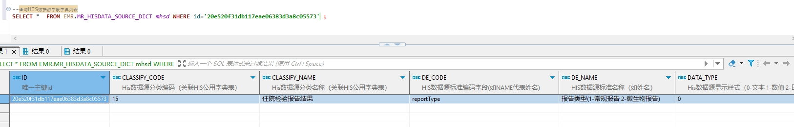

# 领域服务/病历领域 - 查询HIS数据源字段字典列表 - 查询HIS数据源字段字典列表 正向用例
## 请求参数：
``` json
{
  "pageIndex": 1,
  "orgCode": "NXRMYY",
  "pageSize": 1
}
```
## 返回参数：
``` json
{
  "exception": null,
  "apiCode": null,
  "data": {
    "list": [
      {
        "classifyCode": "15",
        "classifyName": "住院检验报告结果",
        "createDate": "2024-03-26 19:43:17",
        "createUserId": null,
        "createUserName": "管理员",
        "dataType": "0",
        "dateFormat": null,
        "deCode": "reportType",
        "deName": "报告类型(1-常规报告 2-微生物报告)",
        "dictCode": null,
        "dictName": null,
        "id": "20e520f31db117eae06383d3a8c05573",
        "updateDate": null,
        "updateId": null,
        "updateUser": null,
        "orgCode": "机构编码",
        "orgName": "机构名称"
      }
    ],
    "totalCount": 297,
    "pageSize": 1,
    "pageNo": 1,
    "pageCount": 297
  },
  "Code": 200,
  "Message": "操作成功"
}
```
## 数据校验：

# 领域服务/病历领域 - 查询HIS数据源字段字典列表 - 必填校验-[orgCode]为空
## 请求参数：
``` json
{
  "pageIndex": 1,
  "orgCode": "",
  "pageSize": 1
}
```
## 返回参数：
``` json
{
  "exception": null,
  "apiCode": null,
  "data": null,
  "Code": 1,
  "Message": "医院编码不能为空"
}
```
# 领域服务/病历领域 - 查询HIS数据源字段字典列表 - 必填校验-[pageIndex]为空
## 请求参数：
``` json
{
  "pageIndex": null,
  "orgCode": "NXRMYY",
  "pageSize": 1
}
```
## 返回参数：
``` json
{
  "exception": null,
  "apiCode": null,
  "data": null,
  "Code": 1,
  "Message": "系统内部异常"
}
```
# 领域服务/病历领域 - 查询HIS数据源字段字典列表 - 必填校验-[pageSize]为空
## 请求参数：
``` json
{
  "pageIndex": 1,
  "orgCode": "NXRMYY",
  "pageSize": null
}
```
## 返回参数：
``` json
{
  "exception": null,
  "apiCode": null,
  "data": null,
  "Code": 1,
  "Message": "系统内部异常"
}
```
# 领域服务/病历领域 - 查询HIS数据源字段字典列表 - 类型校验-[pageSize]类型错误
## 请求参数：
``` json
{
  "pageIndex": 1,
  "orgCode": "NXRMYY",
  "pageSize": "abc"
}
```
## 返回参数：
``` json
{
  "exception": null,
  "apiCode": null,
  "data": null,
  "Code": 1,
  "Message": "请求参数错误"
}
```
# 领域服务/病历领域 - 查询HIS数据源字段字典列表 - 类型校验-[pageIndex]类型错误
## 请求参数：
``` json
{
  "pageIndex": "abc",
  "orgCode": "NXRMYY",
  "pageSize": 1
}
```
## 返回参数：
``` json
{
  "exception": null,
  "apiCode": null,
  "data": null,
  "Code": 1,
  "Message": "请求参数错误"
}
```
# 领域服务/病历领域 - 查询HIS数据源字段字典列表 - 依赖用例-[orgCode]赋值为依赖用例测试值
## 请求参数：
``` json
{
  "pageIndex": 1,
  "orgCode": "依赖用例测试值",
  "pageSize": 1
}
```
## 返回参数：
``` json
{
  "exception": null,
  "apiCode": null,
  "data": {
    "list": [
      {
        "classifyCode": "15",
        "classifyName": "住院检验报告结果",
        "createDate": "2024-03-26 19:43:17",
        "createUserId": null,
        "createUserName": "管理员",
        "dataType": "0",
        "dateFormat": null,
        "deCode": "reportType",
        "deName": "报告类型(1-常规报告 2-微生物报告)",
        "dictCode": null,
        "dictName": null,
        "id": "20e520f31db117eae06383d3a8c05573",
        "updateDate": null,
        "updateId": null,
        "updateUser": null,
        "orgCode": "机构编码",
        "orgName": "机构名称"
      }
    ],
    "totalCount": 297,
    "pageSize": 1,
    "pageNo": 1,
    "pageCount": 297
  },
  "Code": 200,
  "Message": "操作成功"
}
```