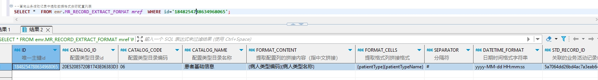

# 领域服务/病历领域 - 查询业务活动记录中提取数据格式实际配置列表 - 查询业务活动记录中提取数据格式实际配置列表 正向用例
## 请求参数：
``` json
{
  "stdCodes": [
    "EMR020001"
  ],
  "pageIndex": 1,
  "orgCode": "NXRMYY",
  "pageSize": 1
}
```
## 返回参数：
``` json
{
  "exception": null,
  "apiCode": null,
  "data": {
    "list": [
      {
        "id": "1848254788634968065",
        "isDelete": "N",
        "createUserName": "CS彭彭彭",
        "createDate": "2024-10-21 14:47:35",
        "updateUserName": "CS彭彭彭",
        "updateDate": "2024-10-21 14:56:00",
        "updateKey": 41,
        "orgCode": "NXRMYY",
        "orgName": "版本测试环境",
        "hospCode": null,
        "hospName": null,
        "catalogId": "20E52085720B1743E06383D3A8C0287D",
        "catalogCode": "06",
        "catalogName": "患者基础信息",
        "formatContent": "{病人类型编码}{病人类型名称}",
        "formatCells": "{patientType}{patientTypeName}",
        "separator": "#",
        "datetimeFormat": "yyyy-MM-dd HH:mm:ss",
        "stdRecordId": "5a7064dd26bd4ac7a3eab64194e7304b",
        "stdRecordCode": "EMR020001",
        "serialNumber": null,
        "arrangeNumber": 3,
        "createUserId": "282475805660160000",
        "updateUserId": "282475805660160000"
      }
    ],
    "totalCount": 1,
    "pageSize": 1,
    "pageNo": 1,
    "pageCount": 1
  },
  "Code": 200,
  "Message": "操作成功"
}
```
## 数据校验：

# 领域服务/病历领域 - 查询业务活动记录中提取数据格式实际配置列表 - 必填校验-[orgCode]为空
## 请求参数：
``` json
{
  "stdCodes": [
    "EMR020001"
  ],
  "pageIndex": 1,
  "orgCode": "",
  "pageSize": 1
}
```
## 返回参数：
``` json
{
  "exception": null,
  "apiCode": null,
  "data": null,
  "Code": 1,
  "Message": "机构编码不能为空"
}
```
# 领域服务/病历领域 - 查询业务活动记录中提取数据格式实际配置列表 - 必填校验-[pageIndex]为空
## 请求参数：
``` json
{
  "stdCodes": [
    "EMR020001"
  ],
  "pageIndex": null,
  "orgCode": "NXRMYY",
  "pageSize": 1
}
```
## 返回参数：
``` json
{
  "exception": null,
  "apiCode": null,
  "data": null,
  "Code": 1,
  "Message": "系统内部异常"
}
```
# 领域服务/病历领域 - 查询业务活动记录中提取数据格式实际配置列表 - 必填校验-[pageSize]为空
## 请求参数：
``` json
{
  "stdCodes": [
    "EMR020001"
  ],
  "pageIndex": 1,
  "orgCode": "NXRMYY",
  "pageSize": null
}
```
## 返回参数：
``` json
{
  "exception": null,
  "apiCode": null,
  "data": null,
  "Code": 1,
  "Message": "系统内部异常"
}
```
# 领域服务/病历领域 - 查询业务活动记录中提取数据格式实际配置列表 - 必填校验-[stdCodes]为空
## 请求参数：
``` json
{
  "stdCodes": null,
  "pageIndex": 1,
  "orgCode": "NXRMYY",
  "pageSize": 1
}
```
## 返回参数：
``` json
{
  "exception": null,
  "apiCode": null,
  "data": null,
  "Code": 1,
  "Message": "业务活动记录标准编码不能为空"
}
```
# 领域服务/病历领域 - 查询业务活动记录中提取数据格式实际配置列表 - 类型校验-[pageSize]类型错误
## 请求参数：
``` json
{
  "stdCodes": [
    "EMR020001"
  ],
  "pageIndex": 1,
  "orgCode": "NXRMYY",
  "pageSize": "abc"
}
```
## 返回参数：
``` json
{
  "exception": null,
  "apiCode": null,
  "data": null,
  "Code": 1,
  "Message": "请求参数错误"
}
```
# 领域服务/病历领域 - 查询业务活动记录中提取数据格式实际配置列表 - 类型校验-[pageIndex]类型错误
## 请求参数：
``` json
{
  "stdCodes": [
    "EMR020001"
  ],
  "pageIndex": "abc",
  "orgCode": "NXRMYY",
  "pageSize": 1
}
```
## 返回参数：
``` json
{
  "exception": null,
  "apiCode": null,
  "data": null,
  "Code": 1,
  "Message": "请求参数错误"
}
```
# 领域服务/病历领域 - 查询业务活动记录中提取数据格式实际配置列表 - 类型校验-[stdCodes]类型错误
## 请求参数：
``` json
{
  "stdCodes": "abc",
  "pageIndex": 1,
  "orgCode": "NXRMYY",
  "pageSize": 1
}
```
## 返回参数：
``` json
{
  "exception": null,
  "apiCode": null,
  "data": null,
  "Code": 1,
  "Message": "请求参数错误"
}
```
# 领域服务/病历领域 - 查询业务活动记录中提取数据格式实际配置列表 - 依赖用例-[orgCode]赋值为依赖用例测试值
## 请求参数：
``` json
{
  "stdCodes": [
    "EMR020001"
  ],
  "pageIndex": 1,
  "orgCode": "依赖用例测试值",
  "pageSize": 1
}
```
## 返回参数：
``` json
{
  "exception": null,
  "apiCode": null,
  "data": {
    "list": [],
    "totalCount": 0,
    "pageSize": 1,
    "pageNo": 1,
    "pageCount": 0
  },
  "Code": 200,
  "Message": "操作成功"
}
```