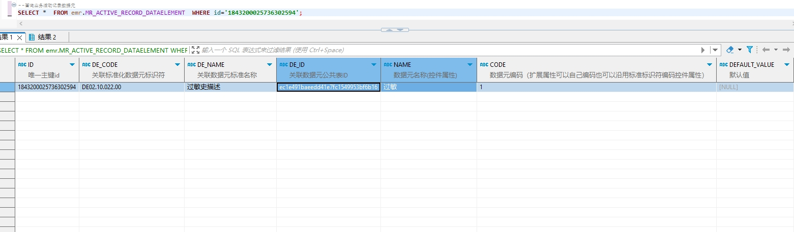

# 领域服务/病历领域 - 查询业务活动记录数据元 - 查询业务活动记录数据元 正向用例
## 请求参数：
``` json
{
  "pageSize": 1,
  "pageIndex": 1,
  "orgCode": "NXRMYY"
}
```
## 返回参数：
``` json
{
  "exception": null,
  "apiCode": null,
  "data": {
    "list": [
      {
        "id": "1843200025736302594",
        "isDelete": "N",
        "createUserName": "CS创星管理员",
        "createDate": "2024-10-07 16:01:45",
        "updateUserName": null,
        "updateDate": null,
        "updateKey": 81,
        "orgCode": "NXRMYY",
        "orgName": "版本测试环境",
        "hospCode": null,
        "hospName": null,
        "backText": null,
        "code": "1",
        "dataSetId": "1843199731765923842",
        "dataType": "0",
        "dateFormat": "yyyy-MM-dd HH:mm:ss",
        "deCode": "DE02.10.022.00",
        "defaultValue": null,
        "deId": "ec1e491baeedd41e7fc1549953bf6b16",
        "deName": "过敏史描述",
        "dictCode": null,
        "hisDataDateFormat": null,
        "hisDataSource": null,
        "hisDataSourceName": null,
        "isBinaryLength": "0",
        "isDirectModify": "1",
        "isForce": "0",
        "isMultiplex": "0",
        "isMust": "1",
        "isOpen": "1",
        "isSignControl": "0",
        "lableText": null,
        "maxDatetimeValue": null,
        "maxDecimalplaces": null,
        "maxLength": null,
        "maxValue": null,
        "minDatetimeValue": null,
        "minLength": null,
        "minValue": null,
        "name": "过敏",
        "serialNumber": 1,
        "signLevel": "0",
        "sourceId": null,
        "stdRecordCode": "EMR020002",
        "stdRecordId": "32656dbb3b394f5f9c8818f8c1e84019",
        "unitText": null,
        "hisDataSeparator": null,
        "hisDataSourceCatalogCode": null,
        "groupNumber": 1,
        "isAutoSum": null,
        "dictType": null,
        "dictShowField": null,
        "showBoundField": null,
        "identificationBoundField": null,
        "fuzzyMatchField": null,
        "createUserId": "247536401569292288",
        "updateUserId": null
      }
    ],
    "totalCount": 61,
    "pageSize": 1,
    "pageNo": 1,
    "pageCount": 61
  },
  "Code": 200,
  "Message": "操作成功"
}
```
## 数据校验：

# 领域服务/病历领域 - 查询业务活动记录数据元 - 必填校验-[orgCode]为空
## 请求参数：
``` json
{
  "pageSize": 1,
  "pageIndex": 1,
  "orgCode": ""
}
```
## 返回参数：
``` json
{
  "exception": null,
  "apiCode": null,
  "data": null,
  "Code": 1,
  "Message": "机构编码不能为空"
}
```
# 领域服务/病历领域 - 查询业务活动记录数据元 - 必填校验-[pageIndex]为空
## 请求参数：
``` json
{
  "pageSize": 1,
  "pageIndex": null,
  "orgCode": "NXRMYY"
}
```
## 返回参数：
``` json
{
  "exception": null,
  "apiCode": null,
  "data": null,
  "Code": 1,
  "Message": "系统内部异常"
}
```
# 领域服务/病历领域 - 查询业务活动记录数据元 - 必填校验-[pageSize]为空
## 请求参数：
``` json
{
  "pageSize": null,
  "pageIndex": 1,
  "orgCode": "NXRMYY"
}
```
## 返回参数：
``` json
{
  "exception": null,
  "apiCode": null,
  "data": null,
  "Code": 1,
  "Message": "系统内部异常"
}
```
# 领域服务/病历领域 - 查询业务活动记录数据元 - 类型校验-[pageIndex]类型错误
## 请求参数：
``` json
{
  "pageSize": 1,
  "pageIndex": "abc",
  "orgCode": "NXRMYY"
}
```
## 返回参数：
``` json
{
  "exception": null,
  "apiCode": null,
  "data": null,
  "Code": 1,
  "Message": "请求参数错误"
}
```
# 领域服务/病历领域 - 查询业务活动记录数据元 - 类型校验-[pageSize]类型错误
## 请求参数：
``` json
{
  "pageSize": "abc",
  "pageIndex": 1,
  "orgCode": "NXRMYY"
}
```
## 返回参数：
``` json
{
  "exception": null,
  "apiCode": null,
  "data": null,
  "Code": 1,
  "Message": "请求参数错误"
}
```
# 领域服务/病历领域 - 查询业务活动记录数据元 - 依赖用例-[orgCode]赋值为依赖用例测试值
## 请求参数：
``` json
{
  "pageSize": 1,
  "pageIndex": 1,
  "orgCode": "依赖用例测试值"
}
```
## 返回参数：
``` json
{
  "exception": null,
  "apiCode": null,
  "data": {
    "list": [],
    "totalCount": 0,
    "pageSize": 1,
    "pageNo": 1,
    "pageCount": 0
  },
  "Code": 200,
  "Message": "操作成功"
}
```