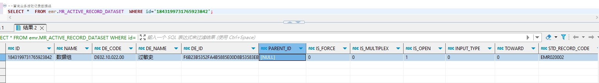

# 领域服务/病历领域 - 查询业务活动记录数据组 - 查询业务活动记录数据组 正向用例
## 请求参数：
``` json
{
  "pageIndex": 1,
  "orgCode": "NXRMYY",
  "pageSize": 1
}
```
## 返回参数：
``` json
{
  "exception": null,
  "apiCode": null,
  "data": {
    "list": [
      {
        "createDate": "2024-10-07 16:00:35",
        "createUserId": "247536401569292288",
        "createUserName": "CS创星管理员",
        "deCode": "DE02.10.022.00",
        "deId": "F6B23B5352FA4B5885E00D8B53583EB5",
        "deName": "过敏史",
        "id": "1843199731765923842",
        "inputType": "0",
        "isForce": "0",
        "isMultiplex": "0",
        "isOpen": "1",
        "name": "数据组",
        "orgCode": "NXRMYY",
        "orgName": "版本测试环境",
        "parentId": null,
        "serialNumber": null,
        "stdRecordCode": "EMR020002",
        "stdRecordId": "32656dbb3b394f5f9c8818f8c1e84019",
        "updateDate": "2024-10-07 16:00:35",
        "updateKey": null,
        "updateUserId": "247536401569292288",
        "updateUserName": "CS创星管理员",
        "toward": "0"
      }
    ],
    "totalCount": 21,
    "pageSize": 1,
    "pageNo": 1,
    "pageCount": 21
  },
  "Code": 200,
  "Message": "操作成功"
}
```
## 数据校验：

# 领域服务/病历领域 - 查询业务活动记录数据组 - 必填校验-[orgCode]为空
## 请求参数：
``` json
{
  "pageIndex": 1,
  "orgCode": "",
  "pageSize": 1
}
```
## 返回参数：
``` json
{
  "exception": null,
  "apiCode": null,
  "data": null,
  "Code": 1,
  "Message": "机构编码不能为空"
}
```
# 领域服务/病历领域 - 查询业务活动记录数据组 - 必填校验-[pageIndex]为空
## 请求参数：
``` json
{
  "pageIndex": null,
  "orgCode": "NXRMYY",
  "pageSize": 1
}
```
## 返回参数：
``` json
{
  "exception": null,
  "apiCode": null,
  "data": null,
  "Code": 1,
  "Message": "系统内部异常"
}
```
# 领域服务/病历领域 - 查询业务活动记录数据组 - 必填校验-[pageSize]为空
## 请求参数：
``` json
{
  "pageIndex": 1,
  "orgCode": "NXRMYY",
  "pageSize": null
}
```
## 返回参数：
``` json
{
  "exception": null,
  "apiCode": null,
  "data": null,
  "Code": 1,
  "Message": "系统内部异常"
}
```
# 领域服务/病历领域 - 查询业务活动记录数据组 - 类型校验-[pageSize]类型错误
## 请求参数：
``` json
{
  "pageIndex": 1,
  "orgCode": "NXRMYY",
  "pageSize": "abc"
}
```
## 返回参数：
``` json
{
  "exception": null,
  "apiCode": null,
  "data": null,
  "Code": 1,
  "Message": "请求参数错误"
}
```
# 领域服务/病历领域 - 查询业务活动记录数据组 - 类型校验-[pageIndex]类型错误
## 请求参数：
``` json
{
  "pageIndex": "abc",
  "orgCode": "NXRMYY",
  "pageSize": 1
}
```
## 返回参数：
``` json
{
  "exception": null,
  "apiCode": null,
  "data": null,
  "Code": 1,
  "Message": "请求参数错误"
}
```
# 领域服务/病历领域 - 查询业务活动记录数据组 - 依赖用例-[orgCode]赋值为依赖用例测试值
## 请求参数：
``` json
{
  "pageIndex": 1,
  "orgCode": "依赖用例测试值",
  "pageSize": 1
}
```
## 返回参数：
``` json
{
  "exception": null,
  "apiCode": null,
  "data": {
    "list": [],
    "totalCount": 0,
    "pageSize": 1,
    "pageNo": 1,
    "pageCount": 0
  },
  "Code": 200,
  "Message": "操作成功"
}
```