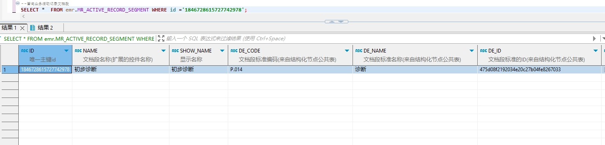

# 领域服务/病历领域 - 查询业务活动记录文档段 - 查询业务活动记录文档段 正向用例
## 请求参数：
``` json
{
  "pageIndex": 1,
  "orgCode": "NXRMYY",
  "pageSize": 1
}
```
## 返回参数：
``` json
{
  "exception": null,
  "apiCode": null,
  "data": {
    "list": [
      {
        "isDelete": "N",
        "createDate": "2024-10-17 09:43:07",
        "updateDate": "2024-10-17 09:43:07",
        "createUserId": "349365436797001728",
        "createUserName": "测试医生",
        "dataSetIdArr": null,
        "dataSetNameArr": null,
        "deCode": "P.014",
        "deId": "475d08f2192034e20c27b04fe8267033",
        "deName": "诊断",
        "id": "1846728615727742978",
        "isForce": "0",
        "name": "初步诊断",
        "orgCode": "NXRMYY",
        "orgName": "版本测试环境",
        "showName": "初步诊断",
        "sourceId": null,
        "stdRecordCode": "EMR020001",
        "stdRecordId": "5a7064dd26bd4ac7a3eab64194e7304b",
        "updateKey": 24,
        "updateUserId": "349365436797001728",
        "updateUserName": "测试医生"
      }
    ],
    "totalCount": 2,
    "pageSize": 1,
    "pageNo": 1,
    "pageCount": 2
  },
  "Code": 200,
  "Message": "操作成功"
}
```
## 数据校验：

# 领域服务/病历领域 - 查询业务活动记录文档段 - 必填校验-[orgCode]为空
## 请求参数：
``` json
{
  "pageIndex": 1,
  "orgCode": "",
  "pageSize": 1
}
```
## 返回参数：
``` json
{
  "exception": null,
  "apiCode": null,
  "data": null,
  "Code": 1,
  "Message": "机构编码不能为空"
}
```
# 领域服务/病历领域 - 查询业务活动记录文档段 - 必填校验-[pageIndex]为空
## 请求参数：
``` json
{
  "pageIndex": null,
  "orgCode": "NXRMYY",
  "pageSize": 1
}
```
## 返回参数：
``` json
{
  "exception": null,
  "apiCode": null,
  "data": null,
  "Code": 1,
  "Message": "系统内部异常"
}
```
# 领域服务/病历领域 - 查询业务活动记录文档段 - 必填校验-[pageSize]为空
## 请求参数：
``` json
{
  "pageIndex": 1,
  "orgCode": "NXRMYY",
  "pageSize": null
}
```
## 返回参数：
``` json
{
  "exception": null,
  "apiCode": null,
  "data": null,
  "Code": 1,
  "Message": "系统内部异常"
}
```
# 领域服务/病历领域 - 查询业务活动记录文档段 - 类型校验-[pageSize]类型错误
## 请求参数：
``` json
{
  "pageIndex": 1,
  "orgCode": "NXRMYY",
  "pageSize": "abc"
}
```
## 返回参数：
``` json
{
  "exception": null,
  "apiCode": null,
  "data": null,
  "Code": 1,
  "Message": "请求参数错误"
}
```
# 领域服务/病历领域 - 查询业务活动记录文档段 - 类型校验-[pageIndex]类型错误
## 请求参数：
``` json
{
  "pageIndex": "abc",
  "orgCode": "NXRMYY",
  "pageSize": 1
}
```
## 返回参数：
``` json
{
  "exception": null,
  "apiCode": null,
  "data": null,
  "Code": 1,
  "Message": "请求参数错误"
}
```
# 领域服务/病历领域 - 查询业务活动记录文档段 - 依赖用例-[orgCode]赋值为依赖用例测试值
## 请求参数：
``` json
{
  "pageIndex": 1,
  "orgCode": "依赖用例测试值",
  "pageSize": 1
}
```
## 返回参数：
``` json
{
  "exception": null,
  "apiCode": null,
  "data": {
    "list": [],
    "totalCount": 0,
    "pageSize": 1,
    "pageNo": 1,
    "pageCount": 0
  },
  "Code": 200,
  "Message": "操作成功"
}
```