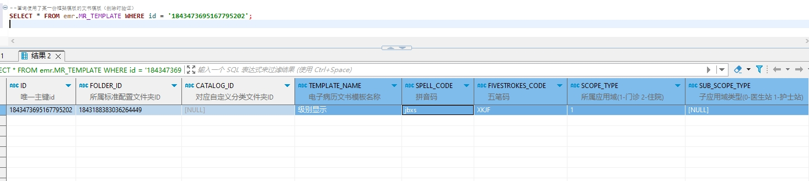

# 领域服务/病历领域 - 查询使用了某一份框架模板的文书模板（删除时验证） - 查询使用了某一份框架模板的文书模板（删除时验证） 正向用例
## 请求参数：
``` json
{
  "hospCode": "NXRY",
  "orgCode": "NXRMYY",
  "frmTemplateId": "1843473581586042881"
}
```
## 返回参数：
``` json
{
  "exception": null,
  "apiCode": null,
  "data": [
    {
      "catalogId": null,
      "createDate": "2024-10-08 10:09:13",
      "createUserId": "20200327091607626",
      "createUserName": "CS邓亮",
      "deptId": null,
      "deptName": null,
      "diagnoseList": [],
      "editType": "2",
      "fivestrokesCode": "XKJF",
      "folderId": "1843188383036264449",
      "frmId": "1843473581586042881",
      "frmName": "333",
      "hospCode": "NXRY",
      "hospName": "版本测试环境",
      "id": "1843473695167795202",
      "isDefault": "N",
      "isOpen": "1",
      "maxAge": null,
      "maxAgeUnit": null,
      "minAge": null,
      "minAgeUnit": "0",
      "orgCode": "NXRMYY",
      "orgName": "版本测试环境",
      "pullInTemplateId": null,
      "pullInTemplateName": null,
      "rangeType": "0",
      "rowerTypeCode": null,
      "rowerTypeName": null,
      "scopeType": "1",
      "signDate": null,
      "signFlag": "0",
      "signId": null,
      "signLevel": "0",
      "signName": null,
      "signTemplateId": null,
      "spellCode": "jbxs",
      "stdRecordCode": "EMR020001",
      "stdRecordId": "5a7064dd26bd4ac7a3eab64194e7304b",
      "stdRecordName": "门(急)诊病历",
      "suitSex": null,
      "templateAttr": "0",
      "templateContent": null,
      "templateName": "级别显示",
      "updateDate": null,
      "updateUserId": null,
      "updateUserName": null
    }
  ],
  "Code": 200,
  "Message": "操作成功"
}
```
## 数据校验：

# 领域服务/病历领域 - 查询使用了某一份框架模板的文书模板（删除时验证） - 必填校验-[orgCode]为空
## 请求参数：
``` json
{
  "hospCode": "NXRY",
  "orgCode": "",
  "frmTemplateId": "1843473581586042881"
}
```
## 返回参数：
``` json
{
  "exception": null,
  "apiCode": null,
  "data": null,
  "Code": 1,
  "Message": "机构编码不能为空"
}
```
# 领域服务/病历领域 - 查询使用了某一份框架模板的文书模板（删除时验证） - 必填校验-[hospCode]为空
## 请求参数：
``` json
{
  "hospCode": "",
  "orgCode": "NXRMYY",
  "frmTemplateId": "1843473581586042881"
}
```
## 返回参数：
``` json
{
  "exception": null,
  "apiCode": null,
  "data": null,
  "Code": 1,
  "Message": "院区编码不能为空"
}
```
# 领域服务/病历领域 - 查询使用了某一份框架模板的文书模板（删除时验证） - 必填校验-[frmTemplateId]为空
## 请求参数：
``` json
{
  "hospCode": "NXRY",
  "orgCode": "NXRMYY",
  "frmTemplateId": ""
}
```
## 返回参数：
``` json
{
  "exception": null,
  "apiCode": null,
  "data": null,
  "Code": 1,
  "Message": "框架模板id不能为空"
}
```
# 领域服务/病历领域 - 查询使用了某一份框架模板的文书模板（删除时验证） - 依赖用例-[frmTemplateId]赋值为依赖用例测试值
## 请求参数：
``` json
{
  "hospCode": "NXRY",
  "orgCode": "NXRMYY",
  "frmTemplateId": "依赖用例测试值"
}
```
## 返回参数：
``` json
{
  "exception": null,
  "apiCode": null,
  "data": [],
  "Code": 200,
  "Message": "操作成功"
}
```
# 领域服务/病历领域 - 查询使用了某一份框架模板的文书模板（删除时验证） - 依赖用例-[orgCode]赋值为依赖用例测试值
## 请求参数：
``` json
{
  "hospCode": "NXRY",
  "orgCode": "依赖用例测试值",
  "frmTemplateId": "1843473581586042881"
}
```
## 返回参数：
``` json
{
  "exception": null,
  "apiCode": null,
  "data": [],
  "Code": 200,
  "Message": "操作成功"
}
```
# 领域服务/病历领域 - 查询使用了某一份框架模板的文书模板（删除时验证） - 依赖用例-[hospCode]赋值为依赖用例测试值
## 请求参数：
``` json
{
  "hospCode": "依赖用例测试值",
  "orgCode": "NXRMYY",
  "frmTemplateId": "1843473581586042881"
}
```
## 返回参数：
``` json
{
  "exception": null,
  "apiCode": null,
  "data": [],
  "Code": 200,
  "Message": "操作成功"
}
```